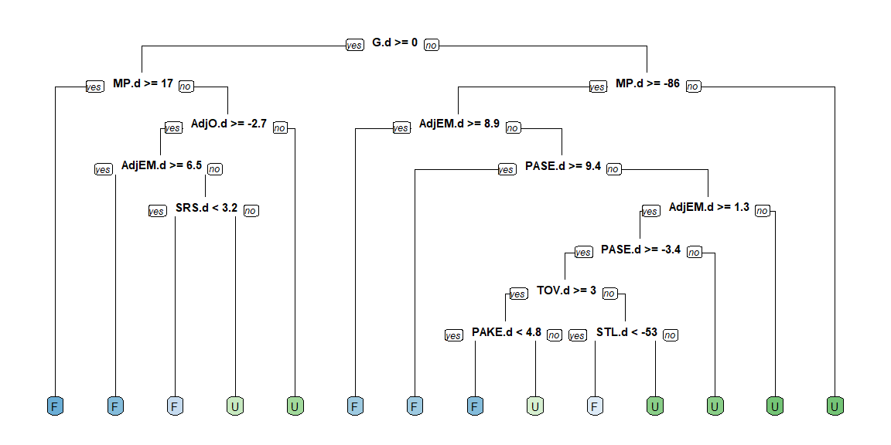
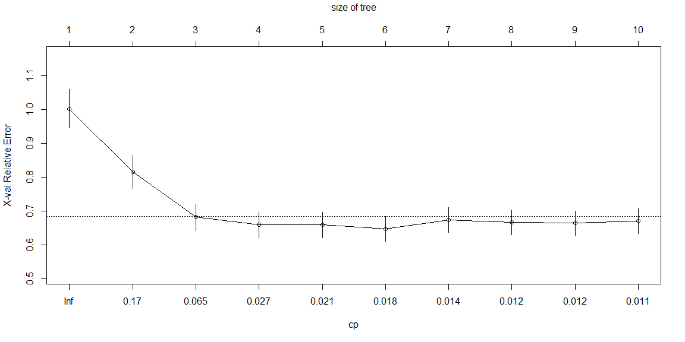
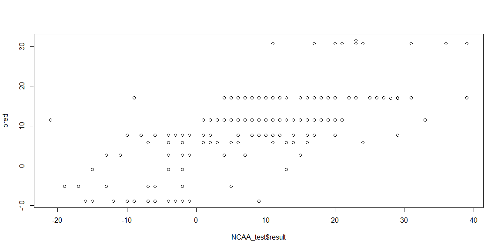

# {.tabset .tabset-fade}


## NCAARock

NCAA Season Stats: https://www.sports-reference.com/cbb/seasons/

All Tournament Game Results:

  From which I can get Seed Expectations
  From Which I can get each teams PASE
  
Kenpom Rankings: https://kenpom.com/index.php?s=TeamName

### 2002 to 2019 Games


```r
# Load NCAARock of all games and the differences of season stats
NCAARock <- read.csv( "NCAARock.csv", stringsAsFactor = FALSE ) 

NCAARock <- NCAARock %>% mutate(result = Fscore - Uscore)

#If you want to see where the NAs are
#sapply(NCAARock, function(x) sum(is.na(x)))
# pull out just the Numeric columns
temp <- NCAARock %>% select(10:42)

#Fill in all of the NAs with the K nearest neighbor
temp <- knnImputation(temp, k = 10, scale = T, meth = "weighAvg", distData = NULL)

#pull of the front columns not in temp
Front <- NCAARock %>% select(1:9)

NCAARock <- cbind(Front,temp)

#binomial the difference in Score
bresult <- ifelse(NCAARock$result > 0, "F", "U")
NCAARock$bresult <- as.factor(bresult)

datatable(NCAARock, extensions = "Responsive",options=list(lengthMenu = c(10,25,68)))
```

<!--html_preserve--><div id="htmlwidget-6d75bf1a21d67bc9df95" style="width:100%;height:auto;" class="datatables html-widget"></div>
<script type="application/json" data-for="htmlwidget-6d75bf1a21d67bc9df95">{"x":{"filter":"none","extensions":["Responsive"],"data":[["1","2","3","4","5","6","7","8","9","10","11","12","13","14","15","16","17","18","19","20","21","22","23","24","25","26","27","28","29","30","31","32","33","34","35","36","37","38","39","40","41","42","43","44","45","46","47","48","49","50","51","52","53","54","55","56","57","58","59","60","61","62","63","64","65","66","67","68","69","70","71","72","73","74","75","76","77","78","79","80","81","82","83","84","85","86","87","88","89","90","91","92","93","94","95","96","97","98","99","100","101","102","103","104","105","106","107","108","109","110","111","112","113","114","115","116","117","118","119","120","121","122","123","124","125","126","127","128","129","130","131","132","133","134","135","136","137","138","139","140","141","142","143","144","145","146","147","148","149","150","151","152","153","154","155","156","157","158","159","160","161","162","163","164","165","166","167","168","169","170","171","172","173","174","175","176","177","178","179","180","181","182","183","184","185","186","187","188","189","190","191","192","193","194","195","196","197","198","199","200","201","202","203","204","205","206","207","208","209","210","211","212","213","214","215","216","217","218","219","220","221","222","223","224","225","226","227","228","229","230","231","232","233","234","235","236","237","238","239","240","241","242","243","244","245","246","247","248","249","250","251","252","253","254","255","256","257","258","259","260","261","262","263","264","265","266","267","268","269","270","271","272","273","274","275","276","277","278","279","280","281","282","283","284","285","286","287","288","289","290","291","292","293","294","295","296","297","298","299","300","301","302","303","304","305","306","307","308","309","310","311","312","313","314","315","316","317","318","319","320","321","322","323","324","325","326","327","328","329","330","331","332","333","334","335","336","337","338","339","340","341","342","343","344","345","346","347","348","349","350","351","352","353","354","355","356","357","358","359","360","361","362","363","364","365","366","367","368","369","370","371","372","373","374","375","376","377","378","379","380","381","382","383","384","385","386","387","388","389","390","391","392","393","394","395","396","397","398","399","400","401","402","403","404","405","406","407","408","409","410","411","412","413","414","415","416","417","418","419","420","421","422","423","424","425","426","427","428","429","430","431","432","433","434","435","436","437","438","439","440","441","442","443","444","445","446","447","448","449","450","451","452","453","454","455","456","457","458","459","460","461","462","463","464","465","466","467","468","469","470","471","472","473","474","475","476","477","478","479","480","481","482","483","484","485","486","487","488","489","490","491","492","493","494","495","496","497","498","499","500","501","502","503","504","505","506","507","508","509","510","511","512","513","514","515","516","517","518","519","520","521","522","523","524","525","526","527","528","529","530","531","532","533","534","535","536","537","538","539","540","541","542","543","544","545","546","547","548","549","550","551","552","553","554","555","556","557","558","559","560","561","562","563","564","565","566","567","568","569","570","571","572","573","574","575","576","577","578","579","580","581","582","583","584","585","586","587","588","589","590","591","592","593","594","595","596","597","598","599","600","601","602","603","604","605","606","607","608","609","610","611","612","613","614","615","616","617","618","619","620","621","622","623","624","625","626","627","628","629","630","631","632","633","634","635","636","637","638","639","640","641","642","643","644","645","646","647","648","649","650","651","652","653","654","655","656","657","658","659","660","661","662","663","664","665","666","667","668","669","670","671","672","673","674","675","676","677","678","679","680","681","682","683","684","685","686","687","688","689","690","691","692","693","694","695","696","697","698","699","700","701","702","703","704","705","706","707","708","709","710","711","712","713","714","715","716","717","718","719","720","721","722","723","724","725","726","727","728","729","730","731","732","733","734","735","736","737","738","739","740","741","742","743","744","745","746","747","748","749","750","751","752","753","754","755","756","757","758","759","760","761","762","763","764","765","766","767","768","769","770","771","772","773","774","775","776","777","778","779","780","781","782","783","784","785","786","787","788","789","790","791","792","793","794","795","796","797","798","799","800","801","802","803","804","805","806","807","808","809","810","811","812","813","814","815","816","817","818","819","820","821","822","823","824","825","826","827","828","829","830","831","832","833","834","835","836","837","838","839","840","841","842","843","844","845","846","847","848","849","850","851","852","853","854","855","856","857","858","859","860","861","862","863","864","865","866","867","868","869","870","871","872","873","874","875","876","877","878","879","880","881","882","883","884","885","886","887","888","889","890","891","892","893","894","895","896","897","898","899","900","901","902","903","904","905","906","907","908","909","910","911","912","913","914","915","916","917","918","919","920","921","922","923","924","925","926","927","928","929","930","931","932","933","934","935","936","937","938","939","940","941","942","943","944","945","946","947","948","949","950","951","952","953","954","955","956","957","958","959","960","961","962","963","964","965","966","967","968","969","970","971","972","973","974","975","976","977","978","979","980","981","982","983","984","985","986","987","988","989","990","991","992","993","994","995","996","997","998","999","1000","1001","1002","1003","1004","1005","1006","1007","1008","1009","1010","1011","1012","1013","1014","1015","1016","1017","1018","1019","1020","1021","1022","1023","1024","1025","1026","1027","1028","1029","1030","1031","1032","1033","1034","1035","1036","1037","1038","1039","1040","1041","1042","1043","1044","1045","1046","1047","1048","1049","1050","1051","1052","1053","1054","1055","1056","1057","1058","1059","1060","1061","1062","1063","1064","1065","1066","1067","1068","1069","1070","1071","1072","1073","1074","1075","1076","1077","1078","1079","1080","1081","1082","1083","1084","1085","1086","1087","1088","1089","1090","1091","1092","1093","1094","1095","1096","1097","1098","1099","1100","1101","1102","1103","1104","1105","1106","1107","1108","1109","1110","1111","1112","1113","1114","1115","1116","1117","1118","1119","1120","1121","1122","1123","1124","1125","1126","1127","1128","1129","1130","1131","1132","1133","1134","1135","1136","1137","1138","1139","1140","1141","1142","1143","1144","1145","1146","1147","1148","1149","1150","1151","1152","1153","1154","1155","1156","1157","1158","1159","1160","1161","1162","1163","1164","1165","1166","1167","1168","1169","1170","1171","1172","1173","1174","1175","1176","1177","1178","1179","1180","1181","1182","1183"],[2002,2002,2002,2002,2002,2002,2002,2002,2002,2002,2002,2002,2002,2002,2002,2002,2002,2002,2002,2002,2002,2002,2002,2002,2002,2002,2002,2002,2002,2002,2002,2002,2002,2002,2002,2002,2002,2002,2002,2002,2002,2002,2002,2002,2002,2002,2002,2002,2002,2002,2002,2002,2002,2002,2002,2002,2002,2002,2002,2002,2002,2002,2002,2002,2003,2003,2003,2003,2003,2003,2003,2003,2003,2003,2003,2003,2003,2003,2003,2003,2003,2003,2003,2003,2003,2003,2003,2003,2003,2003,2003,2003,2003,2003,2003,2003,2003,2003,2003,2003,2003,2003,2003,2003,2003,2003,2003,2003,2003,2003,2003,2003,2003,2003,2003,2003,2003,2003,2003,2003,2003,2003,2003,2003,2003,2003,2003,2003,2004,2004,2004,2004,2004,2004,2004,2004,2004,2004,2004,2004,2004,2004,2004,2004,2004,2004,2004,2004,2004,2004,2004,2004,2004,2004,2004,2004,2004,2004,2004,2004,2004,2004,2004,2004,2004,2004,2004,2004,2004,2004,2004,2004,2004,2004,2004,2004,2004,2004,2004,2004,2004,2004,2004,2004,2004,2004,2004,2004,2004,2004,2004,2004,2004,2005,2005,2005,2005,2005,2005,2005,2005,2005,2005,2005,2005,2005,2005,2005,2005,2005,2005,2005,2005,2005,2005,2005,2005,2005,2005,2005,2005,2005,2005,2005,2005,2005,2005,2005,2005,2005,2005,2005,2005,2005,2005,2005,2005,2005,2005,2005,2005,2005,2005,2005,2005,2005,2005,2005,2005,2005,2005,2005,2005,2005,2005,2005,2005,2005,2006,2006,2006,2006,2006,2006,2006,2006,2006,2006,2006,2006,2006,2006,2006,2006,2006,2006,2006,2006,2006,2006,2006,2006,2006,2006,2006,2006,2006,2006,2006,2006,2006,2006,2006,2006,2006,2006,2006,2006,2006,2006,2006,2006,2006,2006,2006,2006,2006,2006,2006,2006,2006,2006,2006,2006,2006,2006,2006,2006,2006,2006,2006,2006,2007,2007,2007,2007,2007,2007,2007,2007,2007,2007,2007,2007,2007,2007,2007,2007,2007,2007,2007,2007,2007,2007,2007,2007,2007,2007,2007,2007,2007,2007,2007,2007,2007,2007,2007,2007,2007,2007,2007,2007,2007,2007,2007,2007,2007,2007,2007,2007,2007,2007,2007,2007,2007,2007,2007,2007,2007,2007,2007,2007,2007,2007,2007,2007,2008,2008,2008,2008,2008,2008,2008,2008,2008,2008,2008,2008,2008,2008,2008,2008,2008,2008,2008,2008,2008,2008,2008,2008,2008,2008,2008,2008,2008,2008,2008,2008,2008,2008,2008,2008,2008,2008,2008,2008,2008,2008,2008,2008,2008,2008,2008,2008,2008,2008,2008,2008,2008,2008,2008,2008,2008,2008,2008,2008,2008,2008,2008,2008,2009,2009,2009,2009,2009,2009,2009,2009,2009,2009,2009,2009,2009,2009,2009,2009,2009,2009,2009,2009,2009,2009,2009,2009,2009,2009,2009,2009,2009,2009,2009,2009,2009,2009,2009,2009,2009,2009,2009,2009,2009,2009,2009,2009,2009,2009,2009,2009,2009,2009,2009,2009,2009,2009,2009,2009,2009,2009,2009,2009,2009,2009,2009,2009,2010,2010,2010,2010,2010,2010,2010,2010,2010,2010,2010,2010,2010,2010,2010,2010,2010,2010,2010,2010,2010,2010,2010,2010,2010,2010,2010,2010,2010,2010,2010,2010,2010,2010,2010,2010,2010,2010,2010,2010,2010,2010,2010,2010,2010,2010,2010,2010,2010,2010,2010,2010,2010,2010,2010,2010,2010,2010,2010,2010,2010,2010,2010,2010,2011,2011,2011,2011,2011,2011,2011,2011,2011,2011,2011,2011,2011,2011,2011,2011,2011,2011,2011,2011,2011,2011,2011,2011,2011,2011,2011,2011,2011,2011,2011,2011,2011,2011,2011,2011,2011,2011,2011,2011,2011,2011,2011,2011,2011,2011,2011,2011,2011,2011,2011,2011,2011,2011,2011,2011,2011,2011,2011,2011,2011,2011,2011,2011,2011,2011,2011,2012,2012,2012,2012,2012,2012,2012,2012,2012,2012,2012,2012,2012,2012,2012,2012,2012,2012,2012,2012,2012,2012,2012,2012,2012,2012,2012,2012,2012,2012,2012,2012,2012,2012,2012,2012,2012,2012,2012,2012,2012,2012,2012,2012,2012,2012,2012,2012,2012,2012,2012,2012,2012,2012,2012,2012,2012,2012,2012,2012,2012,2012,2012,2012,2012,2012,2012,2013,2013,2013,2013,2013,2013,2013,2013,2013,2013,2013,2013,2013,2013,2013,2013,2013,2013,2013,2013,2013,2013,2013,2013,2013,2013,2013,2013,2013,2013,2013,2013,2013,2013,2013,2013,2013,2013,2013,2013,2013,2013,2013,2013,2013,2013,2013,2013,2013,2013,2013,2013,2013,2013,2013,2013,2013,2013,2013,2013,2013,2013,2013,2013,2013,2013,2013,2014,2014,2014,2014,2014,2014,2014,2014,2014,2014,2014,2014,2014,2014,2014,2014,2014,2014,2014,2014,2014,2014,2014,2014,2014,2014,2014,2014,2014,2014,2014,2014,2014,2014,2014,2014,2014,2014,2014,2014,2014,2014,2014,2014,2014,2014,2014,2014,2014,2014,2014,2014,2014,2014,2014,2014,2014,2014,2014,2014,2014,2014,2014,2014,2014,2014,2014,2014,2015,2015,2015,2015,2015,2015,2015,2015,2015,2015,2015,2015,2015,2015,2015,2015,2015,2015,2015,2015,2015,2015,2015,2015,2015,2015,2015,2015,2015,2015,2015,2015,2015,2015,2015,2015,2015,2015,2015,2015,2015,2015,2015,2015,2015,2015,2015,2015,2015,2015,2015,2015,2015,2015,2015,2015,2015,2015,2015,2015,2015,2015,2015,2015,2015,2015,2015,2015,2016,2016,2016,2016,2016,2016,2016,2016,2016,2016,2016,2016,2016,2016,2016,2016,2016,2016,2016,2016,2016,2016,2016,2016,2016,2016,2016,2016,2016,2016,2016,2016,2016,2016,2016,2016,2016,2016,2016,2016,2016,2016,2016,2016,2016,2016,2016,2016,2016,2016,2016,2016,2016,2016,2016,2016,2016,2016,2016,2016,2016,2016,2016,2016,2016,2016,2016,2017,2017,2017,2017,2017,2017,2017,2017,2017,2017,2017,2017,2017,2017,2017,2017,2017,2017,2017,2017,2017,2017,2017,2017,2017,2017,2017,2017,2017,2017,2017,2017,2017,2017,2017,2017,2017,2017,2017,2017,2017,2017,2017,2017,2017,2017,2017,2017,2017,2017,2017,2017,2017,2017,2017,2017,2017,2017,2017,2017,2017,2017,2017,2017,2017,2017,2017,2018,2018,2018,2018,2018,2018,2018,2018,2018,2018,2018,2018,2018,2018,2018,2018,2018,2018,2018,2018,2018,2018,2018,2018,2018,2018,2018,2018,2018,2018,2018,2018,2018,2018,2018,2018,2018,2018,2018,2018,2018,2018,2018,2018,2018,2018,2018,2018,2018,2018,2018,2018,2018,2018,2018,2018,2018,2018,2018,2018,2018,2018,2018,2018,2018,2018,2018,2019,2019,2019,2019,2019,2019,2019,2019,2019,2019,2019,2019,2019,2019,2019,2019,2019,2019,2019,2019,2019,2019,2019,2019,2019,2019,2019,2019,2019,2019,2019,2019,2019,2019,2019,2019,2019,2019,2019,2019,2019,2019,2019,2019,2019,2019,2019,2019,2019,2019,2019,2019,2019,2019,2019,2019,2019,2019,2019,2019,2019,2019,2019,2019,2019,2019,2019],["PI","1","1","1","1","1","1","1","1","1","1","1","1","1","1","1","1","1","1","1","1","1","1","1","1","1","1","1","1","1","1","1","1","2","2","2","2","2","2","2","2","2","2","2","2","2","2","2","2","3","3","3","3","3","3","3","3","4","4","4","4","5","5","6","PI","1","1","1","1","1","1","1","1","1","1","1","1","1","1","1","1","1","1","1","1","1","1","1","1","1","1","1","1","1","1","1","1","2","2","2","2","2","2","2","2","2","2","2","2","2","2","2","2","3","3","3","3","3","3","3","3","4","4","4","4","5","5","6","PI","1","1","1","1","1","1","1","1","1","1","1","1","1","1","1","1","1","1","1","1","1","1","1","1","1","1","1","1","1","1","1","1","1","2","2","2","2","2","2","2","2","2","2","2","2","2","2","2","2","3","3","3","3","3","3","3","3","4","4","4","4","5","5","6","PI","1","1","1","1","1","1","1","1","1","1","1","1","1","1","1","1","1","1","1","1","1","1","1","1","1","1","1","1","1","1","1","1","1","2","2","2","2","2","2","2","2","2","2","2","2","2","2","2","2","3","3","3","3","3","3","3","3","4","4","4","4","5","5","6","PI","1","1","1","1","1","1","1","1","1","1","1","1","1","1","1","1","1","1","1","1","1","1","1","1","1","1","1","1","1","1","1","1","2","2","2","2","2","2","2","2","2","2","2","2","2","2","2","2","3","3","3","3","3","3","3","3","4","4","4","4","5","5","6","PI","1","1","1","1","1","1","1","1","1","1","1","1","1","1","1","1","1","1","1","1","1","1","1","1","1","1","1","1","1","1","1","1","2","2","2","2","2","2","2","2","2","2","2","2","2","2","2","2","3","3","3","3","3","3","3","3","4","4","4","4","5","5","6","PI","1","1","1","1","1","1","1","1","1","1","1","1","1","1","1","1","1","1","1","1","1","1","1","1","1","1","1","1","1","1","1","1","2","2","2","2","2","2","2","2","2","2","2","2","2","2","2","2","3","3","3","3","3","3","3","3","4","4","4","4","5","5","6","PI","1","1","1","1","1","1","1","1","1","1","1","1","1","1","1","1","1","1","1","1","1","1","1","1","1","1","1","1","1","1","1","1","2","2","2","2","2","2","2","2","2","2","2","2","2","2","2","2","3","3","3","3","3","3","3","3","4","4","4","4","5","5","6","PI","1","1","1","1","1","1","1","1","1","1","1","1","1","1","1","1","1","1","1","1","1","1","1","1","1","1","1","1","1","1","1","1","2","2","2","2","2","2","2","2","2","2","2","2","2","2","2","2","3","3","3","3","3","3","3","3","4","4","4","4","5","5","6","PI","PI","PI","PI","1","1","1","1","1","1","1","1","1","1","1","1","1","1","1","1","1","1","1","1","1","1","1","1","1","1","1","1","1","1","1","1","2","2","2","2","2","2","2","2","2","2","2","2","2","2","2","2","3","3","3","3","3","3","3","3","4","4","4","4","5","5","6","PI","PI","PI","PI","1","1","1","1","1","1","1","1","1","1","1","1","1","1","1","1","1","1","1","1","1","1","1","1","1","1","1","1","1","1","1","1","2","2","2","2","2","2","2","2","2","2","2","2","2","2","2","2","3","3","3","3","3","3","3","3","4","4","4","4","5","5","6","PI","PI","PI","PI","1","1","1","1","1","1","1","1","1","1","1","1","1","1","1","1","1","1","1","1","1","1","1","1","1","1","1","1","1","1","1","1","2","2","2","2","2","2","2","2","2","2","2","2","2","2","2","2","3","3","3","3","3","3","3","3","4","4","4","4","5","5","6","PI","PI","PI","PI","1","1","1","1","1","1","1","1","1","1","1","1","1","1","1","1","1","1","1","1","1","1","1","1","1","1","1","1","1","1","1","1","1","2","2","2","2","2","2","2","2","2","2","2","2","2","2","2","2","3","3","3","3","3","3","3","3","4","4","4","4","5","5","6","PI","PI","PI","PI","1","1","1","1","1","1","1","1","1","1","1","1","1","1","1","1","1","1","1","1","1","1","1","1","1","1","1","1","1","1","1","1","1","2","2","2","2","2","2","2","2","2","2","2","2","2","2","2","2","3","3","3","3","3","3","3","3","4","4","4","4","5","5","6","PI","PI","PI","PI","1","1","1","1","1","1","1","1","1","1","1","1","1","1","1","1","1","1","1","1","1","1","1","1","1","1","1","1","1","1","1","1","2","2","2","2","2","2","2","2","2","2","2","2","2","2","2","2","3","3","3","3","3","3","3","3","4","4","4","4","5","5","6","PI","PI","PI","PI","1","1","1","1","1","1","1","1","1","1","1","1","1","1","1","1","1","1","1","1","1","1","1","1","1","1","1","1","1","1","1","1","2","2","2","2","2","2","2","2","2","2","2","2","2","2","2","2","3","3","3","3","3","3","3","3","4","4","4","4","5","5","6","PI","PI","PI","PI","1","1","1","1","1","1","1","1","1","1","1","1","1","1","1","1","1","1","1","1","1","1","1","1","1","1","1","1","1","1","1","1","2","2","2","2","2","2","2","2","2","2","2","2","2","2","2","2","3","3","3","3","3","3","3","3","4","4","4","4","5","5","6","PI","PI","PI","PI","1","1","1","1","1","1","1","1","1","1","1","1","1","1","1","1","1","1","1","1","1","1","1","1","1","1","1","1","1","1","1","1","2","2","2","2","2","2","2","2","2","2","2","2","2","2","2","2","3","3","3","3","3","3","3","3","4","4","4","4","5","5","6"],[16,4,5,12,6,4,1,2,7,8,1,2,5,8,3,4,10,5,6,1,2,3,7,8,3,4,6,3,6,1,2,7,9,10,4,4,1,2,1,5,3,3,1,1,2,4,3,2,3,10,1,12,2,1,2,1,2,5,2,1,1,1,2,1,16,4,6,1,8,3,5,6,4,5,1,2,3,4,5,7,9,5,2,3,4,6,1,2,10,1,2,3,6,7,7,8,8,1,3,5,1,2,3,5,4,2,4,2,3,1,2,1,6,1,1,2,2,1,3,1,6,1,2,1,3,2,1,2,16,5,1,4,8,2,1,3,6,8,1,2,4,5,7,8,10,5,2,3,6,7,1,3,4,6,2,4,5,10,3,3,6,9,2,1,1,4,1,6,2,4,1,2,2,3,3,4,3,5,1,2,2,8,3,3,4,1,2,1,3,1,1,2,2,16,5,6,1,3,4,2,3,6,7,1,2,3,6,7,9,8,3,4,1,2,4,5,6,2,7,1,5,4,4,5,10,8,9,4,2,1,3,2,1,3,3,2,1,6,2,1,5,4,5,1,4,2,6,1,1,6,2,1,4,5,1,1,1,1,16,5,12,6,7,2,4,5,7,3,4,1,4,9,2,3,6,3,4,11,10,1,3,8,1,2,7,8,2,6,1,5,8,2,3,4,1,4,2,3,4,3,5,7,1,1,2,6,1,1,2,1,2,11,1,1,3,2,1,1,3,2,3,3,16,6,1,2,3,6,7,4,5,1,3,6,2,3,7,9,9,6,4,5,1,2,3,10,2,4,5,10,1,4,12,8,8,3,1,2,1,3,2,3,4,2,1,3,2,1,4,4,5,1,3,1,2,1,2,1,3,1,1,1,1,1,1,1,16,11,4,5,1,3,8,3,4,5,6,1,2,3,6,7,9,4,4,5,5,10,1,2,3,6,7,2,1,2,7,8,8,2,4,1,3,3,1,3,5,2,1,2,3,12,1,2,12,1,1,3,3,3,1,1,2,1,1,1,1,1,1,1,16,5,7,7,2,3,6,7,1,2,4,9,1,2,4,5,8,4,12,5,6,10,1,4,8,1,2,3,3,6,3,6,8,2,6,1,2,4,1,2,4,1,4,1,2,3,12,6,3,1,1,2,2,1,2,1,2,1,1,1,1,1,1,1,16,3,4,6,6,10,1,3,1,6,2,3,2,5,7,8,9,5,10,10,2,4,2,4,5,1,4,5,8,1,3,6,9,11,1,2,1,6,3,2,5,4,6,2,2,1,4,1,4,1,1,2,2,2,5,1,3,2,1,5,1,1,5,1,12,16,16,11,4,5,11,4,5,1,2,3,4,5,10,8,2,3,11,7,6,6,12,7,1,2,3,7,9,1,2,3,1,4,9,8,8,4,2,3,5,12,7,3,3,10,3,4,1,7,1,1,4,3,1,2,4,11,1,10,8,3,1,4,4,8,8,16,14,12,16,5,6,1,2,4,5,7,8,1,3,4,8,3,4,5,6,2,2,4,5,11,10,7,3,6,1,2,3,9,1,7,8,1,2,4,1,3,4,3,4,3,3,1,2,10,1,7,12,7,1,1,2,1,2,1,3,7,2,1,2,1,2,1,11,16,16,13,3,5,5,3,4,6,1,3,4,11,8,4,5,1,6,8,2,4,5,11,10,1,2,7,2,7,1,3,7,8,2,8,4,1,3,4,1,3,4,6,7,1,2,2,1,3,2,12,1,2,9,2,4,1,2,3,2,4,1,3,1,4,1,12,16,11,16,5,5,6,2,4,7,2,4,5,10,1,3,2,4,7,9,3,5,11,7,1,3,6,8,1,8,2,4,1,3,3,6,9,3,2,4,2,4,1,2,4,2,1,3,1,3,11,4,1,1,1,2,10,7,4,1,11,1,1,2,4,1,2,8,16,11,11,16,3,3,6,10,1,1,8,1,3,6,8,4,5,2,4,5,6,6,2,3,4,5,7,2,4,5,7,1,2,7,8,1,9,1,1,3,11,2,4,6,5,2,2,3,4,1,2,1,5,1,3,1,2,3,4,1,2,1,1,7,1,1,1,1,16,11,11,16,5,5,11,11,1,4,5,1,3,4,1,3,4,9,9,9,2,3,4,6,10,10,2,6,10,2,5,7,1,2,3,9,11,1,1,4,1,11,4,4,2,6,10,2,5,1,2,3,1,2,1,2,1,6,1,11,2,2,1,1,1,2,2,11,16,16,11,5,11,5,5,4,1,4,4,9,1,7,4,3,8,5,2,6,6,10,7,3,8,3,2,1,1,2,6,7,3,2,9,3,1,4,1,4,7,4,5,2,2,2,1,1,3,3,3,2,3,1,1,3,1,2,4,1,1,4,1,1,1,1,16,11,16,11,3,4,10,1,2,5,11,8,1,5,3,6,8,4,6,3,2,2,4,7,2,10,7,5,1,3,4,8,5,1,6,9,1,2,4,13,3,1,3,3,5,2,2,2,3,9,1,5,3,7,9,4,1,1,2,2,11,3,1,2,3,1,1,16,11,11,16,7,3,6,4,2,6,4,5,6,7,2,1,1,3,2,8,7,9,4,3,2,1,6,5,8,5,8,6,3,1,1,4,3,2,2,4,1,2,3,5,2,1,1,4,3,1,3,12,2,1,1,2,1,1,2,2,1,1,2,1,1,2,1],["Siena","USC","Marquette","Missouri","Gonzaga","Kentucky","Kansas","Oregon","Wake Forest","Stanford","Duke","Alabama","Indiana","Notre Dame","Arizona","Ohio St.","Kent St.","Florida","Texas Tech","Maryland","Connecticut","Georgia","North Carolina St.","Wisconsin","Mississippi St.","Illinois","Texas","Pittsburgh","California","Cincinnati","Oklahoma","Xavier","Mississippi","Kent St.","Ohio St.","Kentucky","Kansas","Oregon","Duke","Indiana","Arizona","Georgia","Cincinnati","Maryland","Connecticut","Illinois","Pittsburgh","Oklahoma","Mississippi St.","Kent St.","Duke","Missouri","Oklahoma","Maryland","Connecticut","Kansas","Oregon","Indiana","Oklahoma","Maryland","Kansas","Maryland","Oklahoma","Maryland","Texas Southern","Dayton","Creighton","Oklahoma","California","Marquette","Wisconsin","Missouri","Stanford","Connecticut","Arizona","Kansas","Duke","Illinois","Notre Dame","Memphis","Gonzaga","Mississippi St.","Wake Forest","Syracuse","Louisville","Oklahoma St.","Kentucky","Pittsburgh","Alabama","Texas","Florida","Xavier","Maryland","Michigan St.","Saint Joseph's","Oregon","LSU","Oklahoma","Marquette","Wisconsin","Arizona","Kansas","Duke","Connecticut","Illinois","Wake Forest","Louisville","Florida","Syracuse","Kentucky","Pittsburgh","Texas","Maryland","Kentucky","Arizona","Kansas","Pittsburgh","Oklahoma","Syracuse","Texas","Maryland","Kentucky","Kansas","Texas","Syracuse","Kansas","Texas","Kansas","Lehigh","Florida","Saint Joseph's","Wake Forest","Texas Tech","Gonzaga","Duke","Texas","North Carolina","Seton Hall","Stanford","Connecticut","Maryland","Syracuse","DePaul","Alabama","Nevada","Providence","Oklahoma St.","Pittsburgh","Wisconsin","Memphis","Kentucky","Georgia Tech","Kansas","Boston College","Mississippi St.","Cincinnati","Illinois","Louisville","North Carolina St.","North Carolina St.","Vanderbilt","UAB","Gonzaga","Stanford","Saint Joseph's","Wake Forest","Duke","North Carolina","Connecticut","Maryland","Kentucky","Mississippi St.","Oklahoma St.","Pittsburgh","Georgia Tech","Kansas","North Carolina St.","Illinois","Saint Joseph's","Oklahoma St.","Connecticut","Alabama","Texas","Georgia Tech","Kansas","Duke","Connecticut","Saint Joseph's","Georgia Tech","Duke","Duke","Oklahoma St.","Connecticut","Oakland","Alabama","LSU","Illinois","Arizona","Boston College","Kentucky","Oklahoma","Utah","Cincinnati","Washington","Wake Forest","Gonzaga","Texas Tech","West Virginia","Pittsburgh","Texas","Kansas","Syracuse","North Carolina","Connecticut","Florida","Villanova","Wisconsin","Oklahoma St.","Southern Illinois","Duke","Michigan St.","Louisville","Louisville","Georgia Tech","North Carolina St.","Minnesota","Mississippi St.","Boston College","Wake Forest","Illinois","Arizona","Kentucky","Washington","Oklahoma","Gonzaga","Connecticut","North Carolina","Wisconsin","Oklahoma St.","Duke","Michigan St.","Louisville","Villanova","Illinois","Louisville","Oklahoma St.","Texas Tech","Duke","North Carolina","Wisconsin","Kentucky","Illinois","Louisville","Michigan St.","North Carolina","North Carolina","Illinois","North Carolina","Monmouth","Nevada","Texas A&amp;M","Oklahoma","Marquette","Tennessee","Illinois","Washington","Wichita St.","Florida","Boston College","Duke","LSU","UNC Wilmington","UCLA","Gonzaga","Indiana","Iowa","Kansas","George Mason","North Carolina St.","Connecticut","North Carolina","Kentucky","Villanova","Ohio St.","Georgetown","Arizona","Texas","West Virginia","Memphis","Pittsburgh","Arkansas","Tennessee","Florida","Boston College","Duke","LSU","UCLA","Gonzaga","Illinois","North Carolina","Pittsburgh","Georgetown","Connecticut","Villanova","Texas","West Virginia","Memphis","Duke","Texas","Memphis","UCLA","George Mason","Connecticut","Villanova","Florida","Texas","Memphis","Connecticut","Florida","UCLA","Florida","Florida","Niagara","Duke","North Carolina","Georgetown","Washington St.","Vanderbilt","Boston College","Maryland","Butler","Ohio St.","Texas A&amp;M","Louisville","UCLA","Pittsburgh","Indiana","Michigan St.","Xavier","Notre Dame","Texas","USC","Florida","Wisconsin","Oregon","Georgia Tech","Memphis","Virginia","Tennessee","Creighton","Kansas","Southern Illinois","Illinois","Kentucky","Arizona","Washington St.","North Carolina","Georgetown","Ohio St.","Texas A&amp;M","UCLA","Pittsburgh","Maryland","Wisconsin","Florida","Oregon","Memphis","Kansas","Southern Illinois","Texas","Tennessee","Ohio St.","Texas A&amp;M","Kansas","UCLA","North Carolina","Georgetown","Florida","Oregon","Ohio St.","Kansas","Florida","North Carolina","Florida","Ohio St.","Florida","Mount St. Mary's","Kansas St.","Washington St.","Notre Dame","Kansas","Wisconsin","UNLV","Stanford","Pittsburgh","Michigan St.","Marquette","UCLA","Duke","Xavier","Purdue","West Virginia","Texas A&amp;M","Vanderbilt","Connecticut","Clemson","Drake","Davidson","North Carolina","Tennessee","Louisville","Oklahoma","Butler","Georgetown","Memphis","Texas","Miami FL","Mississippi St.","Indiana","Duke","Washington St.","Kansas","Wisconsin","Stanford","UCLA","Xavier","Michigan St.","Georgetown","North Carolina","Tennessee","Louisville","Villanova","Memphis","Texas","Western Kentucky","North Carolina","UCLA","Xavier","Louisville","Wisconsin","Kansas","Memphis","Texas","North Carolina","UCLA","Kansas","Memphis","Kansas","Memphis","Kansas","Morehead St.","Illinois","Clemson","California","Duke","Villanova","UCLA","Texas","North Carolina","Oklahoma","Gonzaga","Butler","Connecticut","Memphis","Washington","Purdue","BYU","Wake Forest","Wisconsin","Utah","West Virginia","USC","Pittsburgh","Xavier","Oklahoma St.","Louisville","Michigan St.","Kansas","Syracuse","Arizona St.","Missouri","Marquette","Ohio St.","Duke","UCLA","North Carolina","Oklahoma","Gonzaga","Connecticut","Memphis","Washington","Pittsburgh","Xavier","Louisville","Michigan St.","Kansas","Arizona","Arizona St.","Missouri","Pittsburgh","Connecticut","Duke","Memphis","Louisville","Michigan St.","North Carolina","Oklahoma","Pittsburgh","Connecticut","North Carolina","Louisville","North Carolina","Connecticut","North Carolina","Winthrop","Georgetown","Vanderbilt","Marquette","Notre Dame","Saint Mary's","Kentucky","New Mexico","Kansas","Tennessee","Villanova","Baylor","Kansas St.","Butler","BYU","Texas","Northern Iowa","Temple","Missouri","Georgia Tech","West Virginia","Wisconsin","Ohio St.","Maryland","Michigan St.","Duke","Purdue","Texas A&amp;M","California","Syracuse","Pittsburgh","Xavier","Florida St.","Washington","Kansas","Villanova","Kentucky","Tennessee","Baylor","Kansas St.","Butler","Wisconsin","Xavier","West Virginia","Ohio St.","Duke","Purdue","Syracuse","Maryland","Syracuse","Kentucky","West Virginia","Kansas St.","Ohio St.","Michigan St.","Duke","Baylor","Kansas St.","Kentucky","Michigan St.","Duke","Duke","Butler","Duke","Clemson","UNC Asheville","UTSA","VCU","Louisville","Vanderbilt","Gonzaga","Kentucky","West Virginia","Pittsburgh","Florida","BYU","Wisconsin","Kansas St.","Michigan St.","Butler","San Diego St.","Connecticut","Missouri","Temple","Xavier","Georgetown","Memphis","Texas A&amp;M","Ohio St.","North Carolina","Syracuse","Washington","Villanova","Kansas","Notre Dame","Purdue","Duke","Texas","Tennessee","UNLV","Butler","Kentucky","Florida","BYU","Kansas St.","Richmond","Temple","Connecticut","Syracuse","Florida St.","Purdue","Texas","Ohio St.","Washington","Kansas","Duke","Wisconsin","BYU","Duke","San Diego St.","Kentucky","Marquette","Kansas","Florida St.","Butler","Connecticut","Kansas","Kentucky","Kentucky","Butler","Butler","Western Kentucky","BYU","California","Lamar","Wichita St.","UNLV","Syracuse","Ohio St.","Wisconsin","Vanderbilt","Gonzaga","Kansas St.","Kentucky","Baylor","Indiana","Iowa St.","Marquette","Louisville","New Mexico","Murray St.","Duke","Missouri","Michigan","Temple","North Carolina St.","Purdue","Notre Dame","Florida St.","Cincinnati","North Carolina","Kansas","Georgetown","Alabama","Michigan St.","Florida","Memphis","Syracuse","Ohio St.","Wisconsin","Kentucky","Baylor","Indiana","Marquette","Louisville","Georgetown","Florida St.","North Carolina","Kansas","Xavier","Michigan St.","Florida","South Florida","Florida","Michigan St.","Syracuse","Ohio St.","North Carolina","Kansas","Kentucky","Baylor","Florida","Ohio St.","Kentucky","Kansas","Kentucky","Ohio St.","Kentucky","Saint Mary's","North Carolina A&amp;T","James Madison","La Salle","New Mexico","UNLV","Oklahoma St.","Marquette","Syracuse","Butler","Louisville","Michigan St.","Saint Louis","Saint Mary's","Colorado St.","Michigan","VCU","Gonzaga","Arizona","Pittsburgh","Georgetown","Kansas St.","Wisconsin","Minnesota","Iowa St.","Indiana","Miami FL","Illinois","Duke","Creighton","Kansas","Florida","San Diego St.","North Carolina","Ohio St.","North Carolina St.","Saint Louis","Gonzaga","Marquette","Syracuse","Louisville","Michigan St.","Michigan","Arizona","San Diego St.","Indiana","Miami FL","Duke","Kansas","Florida","Ohio St.","Mississippi","Indiana","Ohio St.","Wichita St.","Miami FL","Michigan","Louisville","Duke","Florida","Ohio St.","Syracuse","Louisville","Florida","Louisville","Michigan","Louisville","Xavier","Albany","Tennessee","Cal Poly","Cincinnati","Oklahoma","Ohio St.","Villanova","Michigan St.","Connecticut","Michigan","Louisville","Saint Louis","Arizona St.","Florida","Syracuse","Wisconsin","San Diego St.","Oregon","Pittsburgh","Duke","VCU","Tennessee","New Mexico","Virginia","Iowa St.","North Carolina","Memphis","Wichita St.","Kentucky","Kansas","UCLA","Arizona","Creighton","Creighton","Baylor","Oklahoma St.","Syracuse","Villanova","Michigan St.","Michigan","Louisville","Florida","Wisconsin","San Diego St.","Kansas","Wichita St.","Creighton","Virginia","Iowa St.","Tennessee","UCLA","Arizona","Florida","Arizona","Wisconsin","Stanford","Connecticut","Louisville","Virginia","Tennessee","Florida","Arizona","Michigan","Michigan St.","Florida","Wisconsin","Kentucky","Manhattan","BYU","Dayton","North Florida","Iowa St.","Baylor","SMU","Ohio St.","Villanova","Villanova","North Carolina St.","Kentucky","Notre Dame","Butler","Cincinnati","Georgetown","Utah","Arizona","North Carolina","Arkansas","Xavier","Providence","Virginia","Oklahoma","Louisville","Northern Iowa","Michigan St.","Kansas","Maryland","West Virginia","Wichita St.","Duke","Gonzaga","Iowa","San Diego St.","Wisconsin","Oklahoma St.","Villanova","Kentucky","Notre Dame","UCLA","Arizona","North Carolina","Xavier","Utah","Virginia","Kansas","Oklahoma","Louisville","Duke","Gonzaga","Wisconsin","West Virginia","Kentucky","Notre Dame","Wisconsin","Arizona","Oklahoma","Louisville","Duke","Gonzaga","Kentucky","Wisconsin","Michigan St.","Duke","Duke","Kentucky","Wisconsin","Florida Gulf Coast","Wichita St.","Michigan","Southern","Purdue","Baylor","Gonzaga","Wichita St.","North Carolina","Kentucky","Indiana","Virginia","Utah","Iowa St.","Kansas","Miami FL","Duke","Providence","Butler","Connecticut","Michigan St.","West Virginia","California","Texas","Syracuse","VCU","Xavier","Notre Dame","Pittsburgh","Villanova","Maryland","Iowa","Oregon","Oklahoma","Texas A&amp;M","Cincinnati","Gonzaga","North Carolina","Virginia","Iowa St.","Kansas","Wichita St.","Duke","Kentucky","Xavier","Notre Dame","Syracuse","Villanova","Maryland","Oregon","Oklahoma","Texas A&amp;M","Kansas","Villanova","Oregon","Oklahoma","North Carolina","Notre Dame","Virginia","Gonzaga","Villanova","Oklahoma","Virginia","North Carolina","North Carolina","Villanova","Villanova","Kansas St.","New Orleans","North Carolina Central","USC","Minnesota","Xavier","Notre Dame","Virginia","Butler","Gonzaga","West Virginia","Florida","Vanderbilt","Villanova","Saint Mary's","Purdue","Florida St.","Wisconsin","Iowa St.","Arizona","SMU","Creighton","Wichita St.","Michigan","Baylor","Arkansas","Oregon","Louisville","North Carolina","Kansas","Duke","Cincinnati","South Carolina","UCLA","Kentucky","Michigan St.","Florida St.","Villanova","West Virginia","Gonzaga","Butler","Saint Mary's","Florida","Iowa St.","Louisville","Duke","Kentucky","Kansas","North Carolina","Oregon","Baylor","UCLA","Arizona","Oregon","Gonzaga","Kansas","Baylor","North Carolina","Kentucky","Florida","Kansas","Gonzaga","Florida","North Carolina","Gonzaga","North Carolina","Gonzaga","Radford","UCLA","Texas Southern","Syracuse","Tennessee","Gonzaga","Oklahoma","Kansas","Duke","Ohio St.","Loyola Chicago","Seton Hall","Villanova","Kentucky","Texas Tech","Houston","Virginia Tech","Arizona","Florida","Michigan","Cincinnati","Purdue","Wichita St.","Texas A&amp;M","North Carolina","Butler","Nevada","West Virginia","Xavier","Michigan St.","Auburn","Creighton","Clemson","Virginia","TCU","Florida St.","Villanova","Duke","Gonzaga","Buffalo","Tennessee","Kansas","Texas Tech","Michigan","Clemson","Cincinnati","North Carolina","Purdue","Michigan St.","Kansas St.","Xavier","West Virginia","Michigan","Nevada","Kansas","Gonzaga","Villanova","Kansas","Duke","Purdue","Loyola Chicago","Michigan","Villanova","Duke","Michigan","Villanova","Villanova","Fairleigh Dickinson","Belmont","Arizona St.","Fairleigh Dickinson","Louisville","LSU","Auburn","Florida St.","Michigan St.","Maryland","Kansas","Marquette","Villanova","Nevada","Kentucky","Gonzaga","Wofford","Purdue","Michigan","Syracuse","Cincinnati","Oklahoma","Kansas St.","Texas Tech","Tennessee","Virginia","Buffalo","Wisconsin","VCU","Mississippi St.","Utah St.","Iowa St.","Houston","North Carolina","Duke","Virginia Tech","LSU","Kentucky","Michigan","Florida St.","Gonzaga","Michigan St.","Purdue","Auburn","Tennessee","North Carolina","Duke","Virginia Tech","Texas Tech","Virginia","Houston","Oregon","Tennessee","Gonzaga","Virginia","Michigan","Duke","North Carolina","Michigan St.","Kentucky","Gonzaga","Virginia","Kentucky","Duke","Virginia","Michigan","Virginia"],[81,89,69,93,66,83,70,81,83,84,84,86,75,82,86,69,69,82,68,85,78,85,69,80,70,93,70,71,82,90,71,70,58,71,67,87,86,92,84,76,68,75,101,87,77,72,63,78,64,78,73,82,88,78,71,73,72,81,81,90,104,97,64,64,84,71,73,71,76,72,81,72,77,58,80,64,67,65,70,71,74,46,76,76,86,77,95,87,62,82,85,71,75,79,63,58,56,74,101,61,96,108,86,85,60,62,71,46,68,74,74,77,77,63,88,69,74,65,79,82,58,69,78,85,63,94,84,78,57,60,82,79,76,76,96,66,63,80,71,70,86,80,76,65,72,58,75,53,76,59,96,65,78,58,85,80,72,70,61,61,71,102,72,67,70,84,90,75,72,70,75,74,70,59,57,78,73,92,84,63,73,80,71,72,100,72,87,62,79,66,78,65,82,79,73,68,67,66,85,72,84,60,76,88,70,74,78,63,71,57,63,57,96,77,67,55,57,63,65,57,89,68,68,80,75,53,93,75,105,71,85,69,97,58,69,62,92,71,85,63,72,76,76,77,93,78,60,68,67,65,62,90,93,94,88,87,72,75,71,79,66,74,85,63,78,75,86,76,88,70,80,85,78,79,87,63,73,75,58,72,69,69,58,70,54,94,60,64,94,79,55,73,82,69,74,58,62,90,64,60,66,70,87,82,75,67,72,54,74,80,73,63,98,60,57,60,45,84,75,59,73,73,77,77,86,80,70,77,84,82,57,78,68,78,70,79,70,61,79,64,79,77,112,76,58,63,73,84,121,71,107,61,52,67,63,74,81,62,78,72,54,84,59,68,74,75,78,88,63,68,77,85,64,61,64,74,66,65,76,92,55,85,84,76,67,84,69,80,71,68,85,71,71,77,82,72,74,70,71,73,90,75,67,62,69,69,99,82,113,72,79,72,81,66,87,74,78,76,72,67,61,75,72,82,53,85,65,70,108,76,78,84,77,75,72,68,88,79,79,56,72,92,82,83,76,59,85,84,78,75,58,72,59,71,86,80,65,76,101,82,77,71,103,81,71,61,66,69,61,71,60,72,72,77,77,74,77,84,59,66,78,58,72,74,69,84,73,83,92,89,74,84,60,79,74,60,71,67,83,60,72,54,91,103,67,98,84,76,82,72,52,83,73,89,44,83,65,78,50,80,100,62,90,62,73,68,82,77,99,80,69,65,86,64,77,53,68,89,70,73,72,69,77,79,89,65,60,82,67,68,90,83,76,84,54,69,71,68,75,68,63,87,83,59,62,69,101,73,59,70,72,56,66,70,78,78,52,61,70,81,70,59,61,66,86,59,84,74,79,74,72,73,76,60,68,81,63,66,55,56,75,50,75,102,77,68,57,72,69,65,87,85,45,62,71,71,73,89,65,65,64,69,62,71,76,69,98,83,73,73,54,74,77,67,62,63,77,71,74,65,61,76,55,70,41,59,78,54,59,59,64,72,78,73,79,77,70,81,68,79,77,88,69,75,58,70,84,60,44,79,72,63,66,65,77,65,74,57,89,71,54,75,73,60,87,80,63,62,59,63,56,87,63,70,65,84,56,68,44,64,81,73,60,102,75,68,77,82,80,69,62,67,67,73,68,80,62,61,55,59,81,68,79,65,64,52,84,71,88,64,81,55,68,61,46,83,76,83,78,57,73,67,64,79,70,78,95,72,57,70,74,66,82,70,78,74,71,58,63,66,70,78,78,74,50,73,72,61,87,77,71,62,66,55,85,59,72,61,82,59,71,78,81,57,75,59,73,93,89,57,71,83,85,67,77,75,73,87,77,71,75,86,53,70,93,79,71,64,56,80,76,68,76,76,74,77,53,65,80,79,66,61,85,63,57,76,55,78,85,83,77,84,79,70,69,72,81,69,59,71,62,63,72,54,53,73,54,64,90,56,77,59,56,59,75,93,93,66,79,69,56,66,84,57,93,67,56,76,53,79,69,57,71,70,75,65,68,81,85,86,83,76,86,73,68,64,67,92,73,87,75,75,54,65,72,66,68,87,72,69,78,81,79,68,58,75,63,74,68,85,76,66,81,64,63,96,70,67,55,83,75,68,65,83,85,99,81,80,94,105,79,93,70,71,74,81,56,66,72,70,75,71,70,43,86,79,72,91,82,92,76,82,85,77,78,73,57,71,67,63,76,75,87,73,69,85,92,79,92,82,77,101,61,84,60,64,80,62,88,83,95,77,95,66,63,75,72,76,60,76,76,66,86,80,66,76,85,80,86,84,84,100,65,72,64,92,91,77,93,78,103,100,87,75,93,97,79,78,66,62,83,79,74,60,65,76,69,81,65,90,72,75,82,79,71,69,61,98,50,92,86,84,60,83,70,75,77,77,65,71,58,64,60,73,68,78,76,89,81,64,94,87,78,70,67,83,68,77,61,68,74,75,73,84,79,87,85,102,82,62,59,79,54,52,67,81,87,90,75,62,83,69,64,84,73,65,76,53,50,70,89,99,68,61,60,90,80,69,65,78,58,71,81,69,95,79,82,81,74,82,76,79,78,76,76,79,87,64,61,61,79,87,84,61,74,69,72,95,64,72,77,71,91,54,58,76,61,59,84,88,85,66,69,62,64,90,83,70,87,89,83,81,77,67,78,63,74,73,94,72,53,44,75,80,80,62,69,80,71,67,63,51,85],[16,13,12,5,11,13,16,15,10,9,16,15,12,9,14,13,7,12,11,16,15,14,10,9,14,13,11,14,11,16,15,10,8,2,12,12,8,7,8,13,11,11,8,8,7,12,6,7,6,3,5,8,3,4,11,4,6,10,12,2,2,1,5,5,16,13,11,16,9,14,12,11,13,12,16,15,14,13,12,10,8,12,15,14,13,11,16,15,7,16,15,14,11,10,10,9,9,8,6,13,9,10,11,4,5,10,12,7,6,9,7,9,3,5,5,3,3,12,10,5,7,3,1,7,1,3,3,3,16,12,16,13,9,15,16,14,11,9,16,15,13,12,10,9,7,12,15,14,11,10,16,14,13,11,15,13,12,7,14,14,11,8,10,8,8,12,8,3,7,5,9,7,7,6,6,12,6,4,4,3,6,5,7,10,9,5,8,2,4,7,2,3,3,16,12,11,16,14,13,15,14,11,10,16,15,14,11,10,8,9,14,13,16,15,13,12,11,15,10,16,12,13,13,12,7,9,8,12,7,9,11,7,8,6,6,10,9,14,7,9,13,5,4,12,1,3,7,5,5,10,6,3,7,2,6,5,4,1,16,12,5,11,10,15,13,12,10,14,13,16,13,8,15,14,11,14,13,6,7,16,14,9,16,15,10,9,15,11,16,12,9,7,11,12,8,12,10,6,5,11,13,2,8,8,10,14,9,4,6,13,3,7,5,4,7,4,2,11,1,4,11,2,16,11,16,15,14,11,10,13,12,16,14,11,15,14,10,8,8,11,13,12,16,15,14,7,15,13,12,7,16,13,5,9,9,6,9,7,9,6,7,11,5,7,9,11,7,8,5,5,4,5,2,4,3,5,6,5,7,2,2,3,2,2,2,1,16,6,13,12,16,14,9,14,13,12,11,16,15,14,11,10,8,13,13,12,12,7,16,15,14,11,10,15,16,15,10,9,9,7,5,8,11,6,9,6,4,10,9,7,6,13,8,7,13,4,12,7,2,10,12,5,3,3,3,10,2,1,1,1,16,12,10,10,15,14,11,10,16,15,13,8,16,15,13,12,9,13,5,12,11,7,16,13,9,16,15,14,14,11,14,11,9,7,3,8,10,12,9,10,5,8,12,9,10,11,13,3,6,4,5,3,3,12,3,4,3,3,3,2,2,3,2,2,16,14,13,11,11,7,16,14,16,11,15,14,15,12,10,9,8,12,7,7,15,13,15,13,12,16,13,12,9,16,14,11,8,3,9,10,9,14,11,7,13,12,3,10,10,8,5,8,5,5,12,11,6,6,9,4,10,5,2,6,3,2,5,5,12,16,16,11,13,12,6,13,12,16,15,14,13,12,7,9,15,14,6,10,11,11,5,10,16,15,14,10,8,16,15,14,16,13,8,9,1,5,7,11,4,13,2,6,11,2,11,5,8,2,9,8,8,2,5,3,1,2,12,11,2,5,11,2,3,11,3,16,14,12,16,12,11,16,15,13,12,10,9,16,14,13,9,14,13,12,11,15,15,13,12,6,7,10,14,11,16,15,14,8,16,10,9,8,7,5,8,11,12,6,5,11,6,8,10,15,9,15,13,3,4,4,6,13,11,4,10,4,1,3,1,4,2,2,11,16,16,13,14,12,12,14,13,11,16,14,13,6,9,13,12,16,11,9,15,13,12,6,7,16,15,10,15,10,16,14,10,9,15,9,12,9,6,12,8,6,5,14,15,9,7,7,8,11,10,13,4,6,13,3,1,12,3,15,9,3,2,4,9,4,4,12,16,11,16,12,12,11,15,13,10,15,13,12,7,16,14,15,13,10,8,14,12,6,10,16,14,11,9,16,9,15,13,16,14,14,11,8,11,7,12,7,5,9,7,12,10,8,6,8,6,14,12,8,4,4,6,11,3,8,4,2,11,2,8,7,7,8,7,16,11,11,16,14,14,11,7,16,16,9,16,14,11,9,13,12,15,13,12,11,11,15,14,13,12,10,15,13,12,10,16,15,10,9,16,8,8,8,6,14,10,5,14,4,7,7,11,5,8,7,8,4,5,7,4,6,7,8,5,11,3,2,4,2,7,1,1,16,11,11,16,12,12,6,6,16,13,12,16,14,13,16,14,13,8,8,8,15,14,13,11,7,7,15,11,7,15,12,10,16,15,14,8,3,9,9,12,9,3,12,5,7,14,15,7,13,8,10,11,5,3,4,3,5,7,4,10,1,1,10,6,10,2,1,11,16,16,11,12,6,12,12,13,16,13,13,8,16,10,13,14,9,12,15,11,11,7,10,14,9,14,15,16,16,15,11,10,14,15,8,11,8,5,8,12,2,5,4,7,7,10,9,8,11,11,6,11,7,4,4,7,4,3,8,3,11,7,2,7,3,1,16,11,16,11,14,13,7,16,15,12,6,9,16,12,14,11,9,13,11,14,15,15,13,10,15,7,10,12,16,14,13,9,12,16,11,8,9,7,5,13,11,8,6,6,4,7,7,10,11,16,9,13,7,11,5,9,5,5,11,3,9,9,3,1,11,1,3,16,11,11,16,10,14,12,13,15,11,13,12,11,10,15,16,10,14,15,9,10,8,13,14,15,16,11,12,9,12,9,11,14,16,16,13,6,7,10,12,9,10,6,4,10,9,9,12,6,9,11,13,3,4,12,3,4,5,3,3,3,3,5,2,5,3,3],["Alcorn St.","UNC Wilmington","Tulsa","Miami FL","Wyoming","Valparaiso","Holy Cross","Montana","Pepperdine","Western Kentucky","Winthrop","Florida Atlantic","Utah","Charlotte","UC Santa Barbara","Davidson","Oklahoma St.","Creighton","Southern Illinois","Siena","Hampton","Murray St.","Michigan St.","St. John's","McNeese St.","San Diego St.","Boston College","Central Connecticut","Penn","Boston University","Illinois Chicago","Hawaii","UCLA","Alabama","Missouri","Tulsa","Stanford","Wake Forest","Notre Dame","UNC Wilmington","Wyoming","Southern Illinois","UCLA","Wisconsin","North Carolina St.","Creighton","California","Xavier","Texas","Pittsburgh","Indiana","UCLA","Arizona","Kentucky","Southern Illinois","Illinois","Texas","Kent St.","Missouri","Connecticut","Oregon","Kansas","Indiana","Indiana","UNC Asheville","Tulsa","Central Michigan","South Carolina St.","North Carolina St.","Holy Cross","Weber St.","Southern Illinois","San Diego","BYU","Vermont","Utah St.","Colorado St.","Western Kentucky","Milwaukee","Arizona St.","Cincinnati","Butler","East Tennessee St.","Manhattan","Austin Peay","Penn","IUPUI","Wagner","Indiana","UNC Asheville","Sam Houston St.","Troy","UNC Wilmington","Colorado","Auburn","Utah","Purdue","California","Missouri","Tulsa","Gonzaga","Arizona St.","Central Michigan","Stanford","Notre Dame","Auburn","Butler","Michigan St.","Oklahoma St.","Utah","Indiana","Purdue","Xavier","Wisconsin","Notre Dame","Duke","Marquette","Butler","Auburn","Connecticut","Michigan St.","Marquette","Arizona","Michigan St.","Oklahoma","Marquette","Syracuse","Syracuse","Florida A&amp;M","Manhattan","Liberty","VCU","Charlotte","Valparaiso","Alabama St.","Princeton","Air Force","Arizona","UTSA","Vermont","UTEP","BYU","Dayton","Southern Illinois","Michigan St.","Pacific","Eastern Washington","UCF","Richmond","South Carolina","Florida A&amp;M","Northern Iowa","Illinois Chicago","Utah","Monmouth","East Tennessee St.","Murray St.","Xavier","Lafayette","Lafayette","Western Michigan","Washington","Nevada","Alabama","Texas Tech","Manhattan","Seton Hall","Texas","DePaul","Syracuse","UAB","Xavier","Memphis","Wisconsin","Boston College","Pacific","Vanderbilt","Cincinnati","Wake Forest","Pittsburgh","Vanderbilt","Syracuse","Xavier","Nevada","UAB","Illinois","Alabama","Oklahoma St.","Kansas","Xavier","Connecticut","Georgia Tech","Georgia Tech","Alabama A&amp;M","Milwaukee","UAB","Fairleigh Dickinson","Utah St.","Penn","Eastern Kentucky","Niagara","UTEP","Iowa","Montana","Chattanooga","Winthrop","UCLA","Creighton","Pacific","Nevada","Bucknell","Vermont","Oakland","UCF","Ohio","New Mexico","Northern Iowa","Southeastern Louisiana","Saint Mary's","Delaware St.","Old Dominion","Lafayette","Lafayette","George Washington","Charlotte","Iowa St.","Stanford","Milwaukee","West Virginia","Nevada","UAB","Cincinnati","Pacific","Utah","Texas Tech","North Carolina St.","Iowa St.","Bucknell","Southern Illinois","Mississippi St.","Vermont","Georgia Tech","Florida","Milwaukee","Washington","Arizona","West Virginia","Michigan St.","Villanova","North Carolina St.","Utah","Arizona","West Virginia","Kentucky","Wisconsin","Michigan St.","Louisville","Illinois","Hampton","Montana","Syracuse","Milwaukee","Alabama","Winthrop","Air Force","Utah St.","Seton Hall","South Alabama","Pacific","Southern","Iona","George Washington","Belmont","Xavier","San Diego St.","Northwestern St.","Bradley","Michigan St.","California","Albany","Murray St.","UAB","Monmouth","Davidson","Northern Iowa","Wisconsin","Penn","Southern Illinois","Oral Roberts","Kent St.","Bucknell","Wichita St.","Milwaukee","Montana","George Washington","Texas A&amp;M","Alabama","Indiana","Washington","George Mason","Bradley","Ohio St.","Kentucky","Arizona","North Carolina St.","Northwestern St.","Bucknell","LSU","West Virginia","Bradley","Gonzaga","Wichita St.","Washington","Boston College","Georgetown","LSU","UCLA","George Mason","Villanova","LSU","George Mason","UCLA","Florida A&amp;M","VCU","Eastern Kentucky","Belmont","Oral Roberts","George Washington","Texas Tech","Davidson","Old Dominion","Central Connecticut","Penn","Stanford","Weber St.","Wright St.","Gonzaga","Marquette","BYU","Winthrop","New Mexico St.","Arkansas","Jackson St.","Texas A&amp;M Corpus Chris","Miami OH","UNLV","North Texas","Albany","Long Beach St.","Nevada","Niagara","Holy Cross","Virginia Tech","Villanova","Purdue","Vanderbilt","Michigan St.","Boston College","Xavier","Louisville","Indiana","VCU","Butler","UNLV","Purdue","Winthrop","Nevada","Kentucky","Virginia Tech","USC","Virginia","Tennessee","Memphis","Southern Illinois","Pittsburgh","USC","Vanderbilt","Butler","UNLV","Memphis","UCLA","Oregon","Georgetown","UCLA","Georgetown","Ohio St.","Coppin St.","USC","Winthrop","George Mason","Portland St.","Cal St. Fullerton","Kent St.","Cornell","Oral Roberts","Temple","Kentucky","Mississippi Valley St.","Belmont","Georgia","Baylor","Arizona","BYU","Siena","San Diego","Villanova","Western Kentucky","Gonzaga","Mount St. Mary's","American","Boise St.","Saint Joseph's","South Alabama","UMBC","UT Arlington","Austin Peay","Saint Mary's","Oregon","Arkansas","West Virginia","Notre Dame","UNLV","Kansas St.","Marquette","Texas A&amp;M","Purdue","Pittsburgh","Davidson","Arkansas","Butler","Oklahoma","Siena","Mississippi St.","Miami FL","San Diego","Washington St.","Western Kentucky","West Virginia","Tennessee","Davidson","Villanova","Michigan St.","Stanford","Louisville","Xavier","Davidson","Texas","North Carolina","UCLA","Memphis","Alabama St.","Western Kentucky","Michigan","Maryland","Binghamton","American","VCU","Minnesota","Radford","Morgan St.","Akron","LSU","Chattanooga","Cal St. Northridge","Mississippi St.","Northern Iowa","Texas A&amp;M","Cleveland St.","Florida St.","Arizona","Dayton","Boston College","East Tennessee St.","Portland St.","Tennessee","Morehead St.","Robert Morris","North Dakota St.","Stephen F. Austin","Temple","Cornell","Utah St.","Siena","Texas","Villanova","LSU","Michigan","Western Kentucky","Texas A&amp;M","Maryland","Purdue","Oklahoma St.","Wisconsin","Siena","USC","Dayton","Cleveland St.","Syracuse","Marquette","Xavier","Purdue","Villanova","Missouri","Arizona","Kansas","Gonzaga","Syracuse","Villanova","Missouri","Oklahoma","Michigan St.","Villanova","Michigan St.","Michigan St.","Arkansas Pine Bluff","Ohio","Murray St.","Washington","Old Dominion","Richmond","East Tennessee St.","Montana","Lehigh","San Diego St.","Robert Morris","Sam Houston St.","North Texas","UTEP","Florida","Wake Forest","UNLV","Cornell","Clemson","Oklahoma St.","Morgan St.","Wofford","UC Santa Barbara","Houston","New Mexico St.","Arkansas Pine Bluff","Siena","Utah St.","Louisville","Vermont","Oakland","Minnesota","Gonzaga","New Mexico","Northern Iowa","Saint Mary's","Wake Forest","Ohio","Old Dominion","BYU","Murray St.","Cornell","Pittsburgh","Missouri","Georgia Tech","California","Texas A&amp;M","Gonzaga","Michigan St.","Butler","Cornell","Washington","Xavier","Tennessee","Northern Iowa","Purdue","Saint Mary's","Butler","West Virginia","Tennessee","Baylor","West Virginia","Michigan St.","Butler","UAB","Arkansas Little Rock","Alabama St.","USC","Morehead St.","Richmond","St. John's","Princeton","Clemson","UNC Asheville","UC Santa Barbara","Wofford","Belmont","Utah St.","UCLA","Old Dominion","Northern Colorado","Bucknell","Cincinnati","Penn St.","Marquette","VCU","Arizona","Florida St.","UTSA","LIU Brooklyn","Indiana St.","Georgia","George Mason","Boston University","Akron","Saint Peter's","Hampton","Oakland","Michigan","Illinois","Pittsburgh","West Virginia","UCLA","Gonzaga","Wisconsin","Morehead St.","San Diego St.","Cincinnati","Marquette","Notre Dame","VCU","Arizona","George Mason","North Carolina","Illinois","Michigan","Butler","Florida","Arizona","Connecticut","Ohio St.","North Carolina","Richmond","VCU","Florida","Arizona","VCU","North Carolina","Connecticut","VCU","Connecticut","Mississippi Valley St.","Iona","South Florida","Vermont","VCU","Colorado","UNC Asheville","Loyola MD","Montana","Harvard","West Virginia","Southern Miss","Western Kentucky","South Dakota St.","New Mexico St.","Connecticut","BYU","Davidson","Long Beach St.","Colorado St.","Lehigh","Norfolk St.","Ohio","South Florida","San Diego St.","Saint Mary's","Xavier","St. Bonaventure","Texas","Vermont","Detroit","Belmont","Creighton","LIU Brooklyn","Virginia","Saint Louis","Kansas St.","Gonzaga","Vanderbilt","Iowa St.","Colorado","VCU","Murray St.","New Mexico","North Carolina St.","Cincinnati","Creighton","Purdue","Lehigh","Saint Louis","Norfolk St.","Ohio","Marquette","Louisville","Wisconsin","Cincinnati","Ohio","North Carolina St.","Indiana","Xavier","Louisville","Syracuse","Baylor","North Carolina","Louisville","Kansas","Kansas","Middle Tennessee","Liberty","LIU Brooklyn","Boise St.","Harvard","California","Oregon","Davidson","Montana","Bucknell","North Carolina A&amp;T","Valparaiso","New Mexico St.","Memphis","Missouri","South Dakota St.","Akron","Southern","Belmont","Wichita St.","Florida Gulf Coast","La Salle","Mississippi","UCLA","Notre Dame","James Madison","Pacific","Colorado","Albany","Cincinnati","Western Kentucky","Northwestern St.","Oklahoma","Villanova","Iona","Temple","Oregon","Wichita St.","Butler","California","Colorado St.","Memphis","VCU","Harvard","Florida Gulf Coast","Temple","Illinois","Creighton","North Carolina","Minnesota","Iowa St.","La Salle","Syracuse","Arizona","La Salle","Marquette","Kansas","Oregon","Michigan St.","Florida Gulf Coast","Wichita St.","Marquette","Duke","Michigan","Wichita St.","Syracuse","Michigan","North Carolina St.","Mount St. Mary's","Iowa","Texas Southern","Harvard","North Dakota St.","Dayton","Milwaukee","Delaware","Saint Joseph's","Wofford","Manhattan","North Carolina St.","Texas","Albany","Western Michigan","American","New Mexico St.","BYU","Colorado","Mercer","Stephen F. Austin","Massachusetts","Stanford","Coastal Carolina","North Carolina Central","Providence","George Washington","Cal Poly","Kansas St.","Eastern Kentucky","Tulsa","Weber St.","Lafayette","Lafayette","Nebraska","Gonzaga","Dayton","Connecticut","Harvard","Texas","Saint Louis","Pittsburgh","Oregon","North Dakota St.","Stanford","Kentucky","Baylor","Memphis","North Carolina","Mercer","Stephen F. Austin","Gonzaga","UCLA","San Diego St.","Baylor","Dayton","Iowa St.","Kentucky","Michigan St.","Michigan","Dayton","Wisconsin","Kentucky","Connecticut","Connecticut","Kentucky","Connecticut","Hampton","Mississippi","Boise St.","Robert Morris","UAB","Georgia St.","UCLA","VCU","Lafayette","Lafayette","LSU","Hampton","Northeastern","Texas","Purdue","Eastern Washington","Stephen F. Austin","Texas Southern","Harvard","Wofford","Mississippi","Dayton","Belmont","Albany","UC Irvine","Wyoming","Georgia","New Mexico St.","Valparaiso","Buffalo","Indiana","Robert Morris","North Dakota St.","Davidson","St. John's","Coastal Carolina","Oregon","North Carolina St.","Cincinnati","Butler","UAB","Ohio St.","Arkansas","Georgia St.","Georgetown","Michigan St.","Wichita St.","Dayton","Northern Iowa","San Diego St.","Iowa","Oregon","Maryland","West Virginia","Wichita St.","North Carolina","Xavier","Michigan St.","North Carolina St.","Utah","UCLA","Notre Dame","Arizona","Louisville","Gonzaga","Michigan St.","Wisconsin","Duke","Fairleigh Dickinson","Vanderbilt","Tulsa","Holy Cross","Arkansas Little Rock","Yale","Seton Hall","Arizona","Florida Gulf Coast","Stony Brook","Chattanooga","Hampton","Fresno St.","Iona","Austin Peay","Buffalo","UNC Wilmington","USC","Texas Tech","Colorado","Middle Tennessee","Stephen F. Austin","Hawaii","Northern Iowa","Dayton","Oregon St.","Weber St.","Michigan","Wisconsin","UNC Asheville","South Dakota St.","Temple","Holy Cross","Cal St. Bakersfield","Green Bay","Saint Joseph's","Utah","Providence","Butler","Arkansas Little Rock","Connecticut","Miami FL","Yale","Indiana","Wisconsin","Stephen F. Austin","Middle Tennessee","Iowa","Hawaii","Saint Joseph's","VCU","Northern Iowa","Maryland","Miami FL","Duke","Texas A&amp;M","Indiana","Wisconsin","Iowa St.","Syracuse","Kansas","Oregon","Syracuse","Notre Dame","Syracuse","Oklahoma","North Carolina","Wake Forest","Mount St. Mary's","UC Davis","Providence","Middle Tennessee","Maryland","Princeton","UNC Wilmington","Winthrop","San Diego St.","Bucknell","East Tennessee St.","Northwestern","Mount St. Mary's","VCU","Vermont","Florida Gulf Coast","Virginia Tech","Nevada","North Dakota","USC","Rhode Island","Dayton","Oklahoma St.","New Mexico St.","Seton Hall","Iona","Jacksonville St.","Texas Southern","UC Davis","Troy","Kansas St.","Marquette","Kent St.","Northern Kentucky","Miami FL","Xavier","Wisconsin","Notre Dame","Northwestern","Middle Tennessee","Arizona","Virginia","Purdue","Michigan","South Carolina","Wichita St.","Michigan St.","Arkansas","Rhode Island","USC","Cincinnati","Xavier","Michigan","West Virginia","Purdue","South Carolina","Butler","UCLA","Wisconsin","Oregon","Xavier","South Carolina","Kentucky","South Carolina","Oregon","North Carolina","LIU Brooklyn","St. Bonaventure","North Carolina Central","Arizona St.","Wright St.","UNC Greensboro","Rhode Island","Penn","Iona","South Dakota St.","Miami FL","North Carolina St.","Radford","Davidson","Stephen F. Austin","San Diego St.","Alabama","Buffalo","St. Bonaventure","Montana","Georgia St.","Cal St. Fullerton","Marshall","Providence","Lipscomb","Arkansas","Texas","Murray St.","Texas Southern","Bucknell","Charleston","Kansas St.","New Mexico St.","UMBC","Syracuse","Missouri","Alabama","Rhode Island","Ohio St.","Buffalo","Loyola Chicago","Seton Hall","Florida","Houston","Auburn","Nevada","Texas A&amp;M","Butler","Syracuse","UMBC","Florida St.","Marshall","Texas A&amp;M","Loyola Chicago","Kentucky","Florida St.","West Virginia","Clemson","Syracuse","Texas Tech","Kansas St.","Florida St.","Texas Tech","Kansas","Loyola Chicago","Kansas","Michigan","Prairie View A&amp;M","Temple","St. John's","Prairie View A&amp;M","Minnesota","Yale","New Mexico St.","Vermont","Bradley","Belmont","Northeastern","Murray St.","Saint Mary's","Florida","Abilene Christian","Fairleigh Dickinson","Seton Hall","Old Dominion","Montana","Baylor","Iowa","Mississippi","UC Irvine","Northern Kentucky","Colgate","Gardner Webb","Arizona St.","Oregon","UCF","Liberty","Washington","Ohio St.","Georgia St.","Iona","North Dakota St.","Saint Louis","Maryland","Wofford","Florida","Murray St.","Baylor","Minnesota","Villanova","Kansas","Iowa","Washington","UCF","Liberty","Buffalo","Oklahoma","Ohio St.","UC Irvine","Purdue","Florida St.","Oregon","Texas Tech","Virginia Tech","Auburn","LSU","Houston","Texas Tech","Purdue","Auburn","Michigan St.","Auburn","Texas Tech","Texas Tech"],[77,93,71,80,73,68,59,62,74,68,37,78,56,63,81,64,61,83,76,70,67,68,58,70,58,64,57,54,75,52,63,58,80,58,83,82,63,87,77,67,60,77,105,57,74,60,50,65,68,73,74,73,67,68,59,69,70,69,75,82,86,88,73,52,92,84,79,54,74,68,74,71,69,53,51,61,57,60,69,84,69,47,73,65,64,63,64,61,67,61,55,59,73,64,65,60,80,65,92,60,95,76,60,74,68,68,79,68,56,54,52,67,64,57,71,65,77,54,78,78,60,83,75,76,47,61,95,81,72,75,63,78,73,49,61,49,52,76,45,53,83,75,69,64,66,66,56,44,64,43,76,60,53,51,52,77,53,80,52,52,58,100,91,70,65,80,62,78,55,72,76,89,53,55,54,63,75,68,80,51,53,71,79,67,74,62,71,64,71,63,79,67,73,69,83,82,55,53,65,64,67,54,64,77,54,64,66,61,79,61,64,60,68,71,62,47,52,50,56,46,81,62,62,68,63,64,70,83,111,59,63,60,79,67,71,65,65,62,77,55,61,54,65,63,79,79,65,78,66,56,52,89,85,88,82,71,57,70,49,87,58,82,90,61,69,61,66,50,76,54,64,88,44,75,83,64,77,65,52,59,65,64,45,62,49,75,52,46,78,64,59,80,60,56,61,57,59,80,67,65,72,52,83,78,54,54,56,62,71,64,71,55,92,59,53,70,50,86,62,45,58,57,69,79,65,55,54,44,75,70,46,57,52,58,42,58,57,49,77,74,67,60,69,63,56,67,58,57,86,77,67,51,54,58,72,78,67,55,71,69,49,79,62,74,67,61,62,76,48,87,74,84,65,58,55,64,65,57,72,76,68,77,96,66,60,75,60,67,40,50,61,56,58,53,63,61,66,29,70,61,79,65,62,83,70,75,101,76,74,57,61,64,61,47,63,54,64,69,86,73,41,56,55,81,49,78,54,74,77,71,48,72,74,72,63,47,78,75,60,73,57,74,62,73,57,57,67,66,63,68,43,76,62,84,62,67,64,62,58,54,64,75,47,70,58,56,79,84,59,84,68,55,62,59,75,54,62,74,44,57,59,57,74,69,89,70,63,81,66,70,76,76,49,72,69,43,57,78,79,55,60,77,102,64,62,77,71,78,75,60,64,69,82,72,61,97,66,80,51,71,71,57,74,59,70,59,62,59,92,81,66,78,78,59,50,49,51,77,67,44,64,53,62,56,66,54,67,64,69,75,60,68,68,72,52,87,68,59,66,53,61,65,85,63,45,56,96,76,52,57,49,63,73,69,71,57,50,59,52,77,61,46,62,69,71,57,76,51,51,66,58,68,78,58,50,52,78,64,66,74,77,57,46,87,60,65,61,53,56,43,45,81,75,73,70,63,65,67,70,48,71,58,66,57,94,70,66,86,59,71,61,83,93,74,60,81,57,72,71,63,71,69,56,62,53,58,72,65,71,62,68,65,59,49,70,54,64,66,60,66,64,68,62,68,41,75,86,65,58,65,69,67,63,59,58,50,59,58,67,45,61,59,66,57,71,63,61,53,56,66,62,73,60,58,61,50,62,58,57,63,66,65,57,90,70,72,70,70,67,61,64,59,54,72,55,71,68,64,68,58,34,56,48,54,44,54,72,56,42,58,64,73,78,63,57,63,58,62,49,49,61,63,57,47,55,71,70,76,74,76,72,60,56,48,53,51,81,52,59,50,58,64,75,76,61,70,58,71,85,69,61,50,70,39,63,79,68,56,76,74,64,65,69,61,80,60,53,78,81,40,64,80,87,55,53,35,69,68,48,78,77,67,58,59,75,77,66,37,49,69,59,59,66,66,60,85,55,77,73,65,51,45,77,44,60,78,85,60,83,63,60,61,68,64,52,82,76,74,61,73,52,64,75,60,63,74,60,74,94,55,81,60,57,60,72,52,52,65,56,65,48,65,74,50,72,65,53,57,66,67,60,55,54,63,56,62,62,76,56,76,52,64,72,79,71,51,64,75,58,78,67,64,60,78,66,53,49,69,65,59,39,70,72,60,62,65,57,62,66,78,70,52,61,71,68,65,50,62,59,85,79,52,55,67,57,74,45,69,81,79,72,85,69,61,67,90,70,77,75,51,67,53,63,47,56,74,70,52,68,65,78,59,66,69,61,61,65,64,73,66,75,50,68,60,64,81,88,63,69,68,63,86,56,71,63,59,68,68,74,66,51,74,88,67,67,71,81,65,58,71,64,46,80,65,68,56,77,70,80,74,73,82,66,84,58,91,73,71,77,63,64,62,65,61,73,80,70,58,91,65,71,73,65,69,39,80,73,88,62,70,65,72,78,67,73,68,58,66,70,80,75,83,74,59,77,73,73,76,71,61,65,46,56,47,64,83,60,67,73,62,83,61,73,60,65,86,89,62,47,53,48,81,69,66,62,83,68,83,78,58,69,68,74,57,54,58,62,84,75,63,79,66,63,53,75,86,73,55,43,75,62,72,69,58,75,78,76,65,78,62,54,59,85,57,79,62,76,70,65,76,86,74,77,69,65,77,53,83,57,70,44,49,68,48,55,78,79,72,70,57,70,56,74,72,73,80,78,62,55,73,62,52,67,56,49,62,71,50,61,75,77,59,76,58,58,51,59,54,99,58,49,63,73,97,63,58,75,75,77,68,62,61,77],["Siena","UNC Wilmington","Tulsa","Missouri","Wyoming","Kentucky","Kansas","Oregon","Wake Forest","Stanford","Duke","Alabama","Indiana","Notre Dame","Arizona","Ohio St.","Kent St.","Creighton","Southern Illinois","Maryland","Connecticut","Georgia","North Carolina St.","Wisconsin","Mississippi St.","Illinois","Texas","Pittsburgh","California","Cincinnati","Oklahoma","Xavier","UCLA","Kent St.","Missouri","Kentucky","Kansas","Oregon","Duke","Indiana","Arizona","Southern Illinois","UCLA","Maryland","Connecticut","Illinois","Pittsburgh","Oklahoma","Texas","Kent St.","Indiana","Missouri","Oklahoma","Maryland","Connecticut","Kansas","Oregon","Indiana","Oklahoma","Maryland","Kansas","Maryland","Indiana","Maryland","UNC Asheville","Tulsa","Central Michigan","Oklahoma","California","Marquette","Wisconsin","Missouri","Stanford","Connecticut","Arizona","Kansas","Duke","Illinois","Notre Dame","Arizona St.","Gonzaga","Butler","Wake Forest","Syracuse","Louisville","Oklahoma St.","Kentucky","Pittsburgh","Indiana","Texas","Florida","Xavier","Maryland","Michigan St.","Auburn","Utah","Purdue","Oklahoma","Marquette","Wisconsin","Arizona","Kansas","Duke","Connecticut","Notre Dame","Auburn","Butler","Michigan St.","Syracuse","Kentucky","Pittsburgh","Texas","Maryland","Kentucky","Arizona","Kansas","Marquette","Oklahoma","Syracuse","Texas","Michigan St.","Marquette","Kansas","Texas","Syracuse","Kansas","Syracuse","Syracuse","Florida A&amp;M","Manhattan","Saint Joseph's","Wake Forest","Texas Tech","Gonzaga","Duke","Texas","North Carolina","Seton Hall","Stanford","Connecticut","Maryland","Syracuse","DePaul","Alabama","Nevada","Pacific","Oklahoma St.","Pittsburgh","Wisconsin","Memphis","Kentucky","Georgia Tech","Kansas","Boston College","Mississippi St.","Cincinnati","Illinois","Xavier","North Carolina St.","North Carolina St.","Vanderbilt","UAB","Nevada","Alabama","Saint Joseph's","Wake Forest","Duke","Texas","Connecticut","Syracuse","UAB","Xavier","Oklahoma St.","Pittsburgh","Georgia Tech","Kansas","Vanderbilt","Illinois","Saint Joseph's","Oklahoma St.","Connecticut","Alabama","Xavier","Georgia Tech","Kansas","Duke","Connecticut","Oklahoma St.","Georgia Tech","Duke","Connecticut","Georgia Tech","Connecticut","Oakland","Milwaukee","UAB","Illinois","Arizona","Boston College","Kentucky","Oklahoma","Utah","Cincinnati","Washington","Wake Forest","Gonzaga","Texas Tech","West Virginia","Pacific","Nevada","Bucknell","Vermont","North Carolina","Connecticut","Florida","Villanova","Wisconsin","Oklahoma St.","Southern Illinois","Duke","Michigan St.","Louisville","Louisville","Georgia Tech","North Carolina St.","Iowa St.","Mississippi St.","Milwaukee","West Virginia","Illinois","Arizona","Kentucky","Washington","Utah","Texas Tech","North Carolina St.","North Carolina","Wisconsin","Oklahoma St.","Duke","Michigan St.","Louisville","Villanova","Illinois","Louisville","Arizona","West Virginia","Michigan St.","North Carolina","Wisconsin","Kentucky","Illinois","Louisville","Michigan St.","North Carolina","North Carolina","Illinois","North Carolina","Monmouth","Montana","Texas A&amp;M","Milwaukee","Alabama","Tennessee","Illinois","Washington","Wichita St.","Florida","Boston College","Duke","LSU","George Washington","UCLA","Gonzaga","Indiana","Northwestern St.","Bradley","George Mason","North Carolina St.","Connecticut","North Carolina","Kentucky","Villanova","Ohio St.","Georgetown","Arizona","Texas","West Virginia","Memphis","Pittsburgh","Bucknell","Wichita St.","Florida","Boston College","Duke","LSU","UCLA","Gonzaga","Washington","George Mason","Bradley","Georgetown","Connecticut","Villanova","Texas","West Virginia","Memphis","LSU","Texas","Memphis","UCLA","George Mason","Connecticut","Villanova","Florida","LSU","UCLA","George Mason","Florida","UCLA","Florida","Florida","Niagara","VCU","North Carolina","Georgetown","Washington St.","Vanderbilt","Boston College","Maryland","Butler","Ohio St.","Texas A&amp;M","Louisville","UCLA","Pittsburgh","Indiana","Michigan St.","Xavier","Winthrop","Texas","USC","Florida","Wisconsin","Oregon","UNLV","Memphis","Virginia","Tennessee","Nevada","Kansas","Southern Illinois","Virginia Tech","Kentucky","Purdue","Vanderbilt","North Carolina","Georgetown","Ohio St.","Texas A&amp;M","UCLA","Pittsburgh","Butler","UNLV","Florida","Oregon","Memphis","Kansas","Southern Illinois","USC","Tennessee","Ohio St.","Memphis","Kansas","UCLA","North Carolina","Georgetown","Florida","Oregon","Ohio St.","UCLA","Florida","Georgetown","Florida","Ohio St.","Florida","Mount St. Mary's","Kansas St.","Washington St.","Notre Dame","Kansas","Wisconsin","UNLV","Stanford","Pittsburgh","Michigan St.","Marquette","UCLA","Duke","Xavier","Purdue","West Virginia","Texas A&amp;M","Siena","San Diego","Villanova","Western Kentucky","Davidson","North Carolina","Tennessee","Louisville","Oklahoma","Butler","Georgetown","Memphis","Texas","Miami FL","Mississippi St.","Arkansas","West Virginia","Washington St.","Kansas","Wisconsin","Stanford","UCLA","Xavier","Michigan St.","Davidson","North Carolina","Tennessee","Louisville","Villanova","Memphis","Texas","Western Kentucky","North Carolina","UCLA","Xavier","Louisville","Davidson","Kansas","Memphis","Texas","North Carolina","UCLA","Kansas","Memphis","Kansas","Memphis","Kansas","Morehead St.","Western Kentucky","Michigan","Maryland","Duke","Villanova","UCLA","Texas","North Carolina","Oklahoma","Gonzaga","LSU","Connecticut","Memphis","Washington","Purdue","Texas A&amp;M","Cleveland St.","Wisconsin","Arizona","Dayton","USC","Pittsburgh","Xavier","Oklahoma St.","Louisville","Michigan St.","Kansas","Syracuse","Arizona St.","Missouri","Marquette","Siena","Duke","Villanova","North Carolina","Oklahoma","Gonzaga","Connecticut","Memphis","Purdue","Pittsburgh","Xavier","Louisville","Michigan St.","Kansas","Arizona","Syracuse","Missouri","Pittsburgh","Connecticut","Villanova","Missouri","Louisville","Michigan St.","North Carolina","Oklahoma","Villanova","Connecticut","North Carolina","Michigan St.","North Carolina","Michigan St.","North Carolina","Arkansas Pine Bluff","Ohio","Murray St.","Washington","Old Dominion","Saint Mary's","Kentucky","New Mexico","Kansas","Tennessee","Villanova","Baylor","Kansas St.","Butler","BYU","Wake Forest","Northern Iowa","Cornell","Missouri","Georgia Tech","West Virginia","Wisconsin","Ohio St.","Maryland","Michigan St.","Duke","Purdue","Texas A&amp;M","California","Syracuse","Pittsburgh","Xavier","Gonzaga","Washington","Northern Iowa","Saint Mary's","Kentucky","Tennessee","Baylor","Kansas St.","Butler","Cornell","Xavier","West Virginia","Ohio St.","Duke","Purdue","Syracuse","Michigan St.","Butler","Kentucky","West Virginia","Kansas St.","Tennessee","Michigan St.","Duke","Baylor","Butler","West Virginia","Michigan St.","Duke","Duke","Butler","Duke","Clemson","UNC Asheville","UTSA","VCU","Morehead St.","Richmond","Gonzaga","Kentucky","West Virginia","Pittsburgh","Florida","BYU","Wisconsin","Kansas St.","UCLA","Butler","San Diego St.","Connecticut","Cincinnati","Temple","Marquette","VCU","Arizona","Florida St.","Ohio St.","North Carolina","Syracuse","Washington","George Mason","Kansas","Notre Dame","Purdue","Duke","Texas","Michigan","Illinois","Butler","Kentucky","Florida","BYU","Wisconsin","Richmond","San Diego St.","Connecticut","Marquette","Florida St.","VCU","Arizona","Ohio St.","North Carolina","Kansas","Duke","Butler","Florida","Arizona","Connecticut","Kentucky","North Carolina","Kansas","VCU","Butler","Connecticut","VCU","Kentucky","Connecticut","Butler","Connecticut","Western Kentucky","BYU","South Florida","Vermont","VCU","Colorado","Syracuse","Ohio St.","Wisconsin","Vanderbilt","Gonzaga","Kansas St.","Kentucky","Baylor","Indiana","Iowa St.","Marquette","Louisville","New Mexico","Murray St.","Lehigh","Norfolk St.","Ohio","South Florida","North Carolina St.","Purdue","Xavier","Florida St.","Cincinnati","North Carolina","Kansas","Georgetown","Creighton","Michigan St.","Florida","Saint Louis","Syracuse","Ohio St.","Wisconsin","Kentucky","Baylor","Indiana","Marquette","Louisville","North Carolina St.","Cincinnati","North Carolina","Kansas","Xavier","Michigan St.","Florida","Ohio","Florida","Louisville","Syracuse","Ohio St.","North Carolina","Kansas","Kentucky","Baylor","Louisville","Ohio St.","Kentucky","Kansas","Kentucky","Kansas","Kentucky","Saint Mary's","North Carolina A&amp;T","James Madison","La Salle","Harvard","California","Oregon","Marquette","Syracuse","Butler","Louisville","Michigan St.","Saint Louis","Memphis","Colorado St.","Michigan","VCU","Gonzaga","Arizona","Wichita St.","Florida Gulf Coast","La Salle","Mississippi","Minnesota","Iowa St.","Indiana","Miami FL","Illinois","Duke","Creighton","Kansas","Florida","San Diego St.","North Carolina","Ohio St.","Temple","Oregon","Wichita St.","Marquette","Syracuse","Louisville","Michigan St.","Michigan","Arizona","Florida Gulf Coast","Indiana","Miami FL","Duke","Kansas","Florida","Ohio St.","La Salle","Syracuse","Ohio St.","Wichita St.","Marquette","Michigan","Louisville","Duke","Florida","Wichita St.","Syracuse","Louisville","Michigan","Louisville","Michigan","Louisville","North Carolina St.","Albany","Tennessee","Cal Poly","Harvard","North Dakota St.","Dayton","Villanova","Michigan St.","Connecticut","Michigan","Louisville","Saint Louis","Texas","Florida","Syracuse","Wisconsin","San Diego St.","Oregon","Pittsburgh","Mercer","Stephen F. Austin","Tennessee","Stanford","Virginia","Iowa St.","North Carolina","Memphis","Wichita St.","Kentucky","Kansas","UCLA","Arizona","Creighton","Creighton","Baylor","Gonzaga","Dayton","Connecticut","Michigan St.","Michigan","Louisville","Florida","Wisconsin","San Diego St.","Stanford","Kentucky","Baylor","Virginia","Iowa St.","Tennessee","UCLA","Arizona","Florida","Arizona","Wisconsin","Dayton","Connecticut","Kentucky","Michigan St.","Michigan","Florida","Wisconsin","Kentucky","Connecticut","Connecticut","Kentucky","Connecticut","Hampton","Mississippi","Dayton","Robert Morris","UAB","Georgia St.","UCLA","Ohio St.","Villanova","Villanova","North Carolina St.","Kentucky","Notre Dame","Butler","Cincinnati","Georgetown","Utah","Arizona","North Carolina","Arkansas","Xavier","Dayton","Virginia","Oklahoma","Louisville","Northern Iowa","Michigan St.","Kansas","Maryland","West Virginia","Wichita St.","Duke","Gonzaga","Iowa","San Diego St.","Wisconsin","Oregon","North Carolina St.","Kentucky","Notre Dame","UCLA","Arizona","North Carolina","Xavier","Utah","Michigan St.","Wichita St.","Oklahoma","Louisville","Duke","Gonzaga","Wisconsin","West Virginia","Kentucky","Notre Dame","Wisconsin","Arizona","Michigan St.","Louisville","Duke","Gonzaga","Kentucky","Wisconsin","Michigan St.","Duke","Duke","Wisconsin","Duke","Florida Gulf Coast","Wichita St.","Michigan","Holy Cross","Arkansas Little Rock","Yale","Gonzaga","Wichita St.","North Carolina","Kentucky","Indiana","Virginia","Utah","Iowa St.","Kansas","Miami FL","Duke","Providence","Butler","Connecticut","Middle Tennessee","Stephen F. Austin","Hawaii","Northern Iowa","Syracuse","VCU","Xavier","Notre Dame","Wisconsin","Villanova","Maryland","Iowa","Oregon","Oklahoma","Texas A&amp;M","Saint Joseph's","Gonzaga","North Carolina","Virginia","Iowa St.","Kansas","Miami FL","Duke","Indiana","Wisconsin","Notre Dame","Syracuse","Villanova","Maryland","Oregon","Oklahoma","Texas A&amp;M","Kansas","Villanova","Oregon","Oklahoma","North Carolina","Notre Dame","Virginia","Syracuse","Villanova","Oklahoma","Syracuse","North Carolina","North Carolina","Villanova","Villanova","Kansas St.","Mount St. Mary's","UC Davis","USC","Middle Tennessee","Xavier","Notre Dame","Virginia","Butler","Gonzaga","West Virginia","Florida","Northwestern","Villanova","Saint Mary's","Purdue","Florida St.","Wisconsin","Iowa St.","Arizona","USC","Rhode Island","Wichita St.","Michigan","Baylor","Arkansas","Oregon","Louisville","North Carolina","Kansas","Duke","Cincinnati","South Carolina","UCLA","Kentucky","Michigan St.","Xavier","Wisconsin","West Virginia","Gonzaga","Butler","Arizona","Florida","Purdue","Michigan","South Carolina","Kentucky","Kansas","North Carolina","Oregon","Baylor","UCLA","Xavier","Oregon","Gonzaga","Kansas","South Carolina","North Carolina","Kentucky","Florida","Oregon","Gonzaga","South Carolina","North Carolina","Gonzaga","North Carolina","North Carolina","Radford","St. Bonaventure","Texas Southern","Syracuse","Tennessee","Gonzaga","Rhode Island","Kansas","Duke","Ohio St.","Loyola Chicago","Seton Hall","Villanova","Kentucky","Texas Tech","Houston","Alabama","Buffalo","Florida","Michigan","Cincinnati","Purdue","Marshall","Texas A&amp;M","North Carolina","Butler","Nevada","West Virginia","Xavier","Michigan St.","Auburn","Kansas St.","Clemson","UMBC","Syracuse","Florida St.","Villanova","Duke","Gonzaga","Buffalo","Loyola Chicago","Kansas","Texas Tech","Michigan","Clemson","Nevada","Texas A&amp;M","Purdue","Syracuse","Kansas St.","Florida St.","West Virginia","Michigan","Loyola Chicago","Kansas","Florida St.","Villanova","Kansas","Duke","Texas Tech","Loyola Chicago","Michigan","Villanova","Kansas","Michigan","Villanova","Villanova","Fairleigh Dickinson","Belmont","Arizona St.","Fairleigh Dickinson","Minnesota","LSU","Auburn","Florida St.","Michigan St.","Maryland","Kansas","Murray St.","Villanova","Florida","Kentucky","Gonzaga","Wofford","Purdue","Michigan","Baylor","Iowa","Oklahoma","UC Irvine","Texas Tech","Tennessee","Virginia","Buffalo","Oregon","UCF","Liberty","Washington","Ohio St.","Houston","North Carolina","Duke","Virginia Tech","LSU","Kentucky","Michigan","Florida St.","Gonzaga","Michigan St.","Purdue","Auburn","Tennessee","North Carolina","Duke","Virginia Tech","Texas Tech","Virginia","Houston","Oregon","Purdue","Gonzaga","Virginia","Texas Tech","Duke","Auburn","Michigan St.","Kentucky","Texas Tech","Virginia","Auburn","Michigan St.","Virginia","Texas Tech","Virginia"],[1.49555158460818,2.3,-2.4,-0.3,1.8,10.2,5.6,7.1,-3.4,-4.1,-1,-0.1,1.5,0.6,3.3,-2.1,3.9,13.6,2.5,2.3,11.1,-2,-11.6,5.9,-3.6,0.3,-3.2,-6.4,-0.3,-7.2,-0.4,4.5,-9.2,1.5,-2.5,6.8,8.1,10,-1.4,1.6,2.3,-2.3,-15.7,-1.2,12.1,3,-4.1,-4.9,0.2,8,-1.8,-9,-3.6,-6,11.9,6.7,10.6,-1.3,-0.2,-9,-1.8,-2,-0.9,2.7,0.2,-1.1,-5.5,-0.9,-2.2,0.4,4.6,-0.5,-3.6,16.9,3.1,8.8,-1.6,-2.7,-1.6,2.2,9.6,-13.1,-2.6,7.8,1.4,-0.3,8.8,-6.7,-0.2,-3.8,8.9,4.1,4.3,12.8,-5.2,8,-0.3,1.7,0.2,2,0.5,5.9,-2.3,15.1,-1.6,-7,-8.1,-2.6,10.3,10.2,-6.7,-5.4,-1.3,4.8,3.1,6.5,-6.2,-10.1,4.2,-15.8,-8.5,9.2,2,-15.3,8.6,5.2,-11.8,-3,0.5,8.7,-2.4,-3.7,3.3,3.7,-1.8,-3.2,12.5,-3.4,-3.3,12.1,4.3,12.9,-1.1,0,-10.3,-4.1,-2.3,-6.7,3.5,-1.3,8.7,1.9,5.2,0.6,-3.7,-6.5,-1.5,-2.9,-0.3,-0.3,-0.7,1.2,1.3,-3.2,-4,-3.4,-1.1,15.8,12,-5,6.8,-7.9,-3.6,-10.6,2.2,4.3,1.1,5.4,1.8,4.1,13.2,-7.9,-8.1,0.4,2.8,0.2,11.9,0.9,-3.4,-5.8,-13.5,-3.9,10.4,3.0811111452814,-1.4,-0.9,-2,6.8,1.4,9,-0.6,0.1,-5.9,1.3,-3.2,3,-6,8,-7.1,-5,4.6,8.1,12.2,11.7,6.7,6,4.5,-2.4,2.5,-1.8,12.5,1.2,1.2,2.6,0.6,0.6,-0.5,-2.1,-6.5,-2.9,0.8,16.1,0.3,0.6,-0.1,12.1,14.4,3.8,-2.4,2.1,11.6,-0.2,-5.7,-3.2,0.4,-5.3,-0.7,-13,8.8,4.3,10.2,-4.7,-1.9,2.5,7.8,0.5,-3.1,13.7,-0.8,1.5,-6.9,-2.1,-0.3,0.6,-1.2,4.8,0.7,9.2,-1.3,-1.6,2.3,-0.3,10.9,-1.8,2.3,-2.1,3.4,-8.7,2.2,12.5,12.2,6.8,3.1,-2.1,-2.1,-1.2,-1.8,3.2,1.8,-8,-3.7,-0.2,7.4,-0.3,-0.5,0.2,8.5,2.2,-2.7,9.2,-8,0.5,3,0.2,-3.7,2.4,0.9,-2.8,-7.1,-0.3,6.1,2.5,11,3.8,11.3,-5.1,-7.3,9.2,5.7,7.3,6.1,0.3,-0.3,-2,12,-0.1,0.4,-0.2,-3.2,3.8,10.5,-2.9,3.1,4.5,9,-6.4,-2.2,11.7,9.2,0.4,-1.4,4.3,8.6,4.1,6.8,2.8,1.2,-5.1,0.7,-5.9,5,0.7,-1.2,5.8,1.4,1.1,0.5,-1.8,-7.2,-0.3,8.3,-6.9,-6.5,5.4,7.3,7.3,0.1,-4,0.6,-4.8,5.7,-3,-0.2,4.9,15,11,-1.2,-0.6,8,-4.2,-3.6,2.1,14.4,0.3,-0.5,11.8,1.35297459158867,-0.7,0.4,-2.9,5,4.2,-2.8,-4.5,-5.9,13.7,-9.2,8.3,0.8,6.5,1,0.3,6,-1.9,11.5,-6.5,-2,-3.3,11.8,0.3,1.2,0.8,9.8,-3.6,1,-3.8,2.3,-10.4,3.6,-4.8,0,6.2,3.9,-2.9,7.5,2.7,17.9,-1.6,15.3,-9.4,2,2.5,4.9,-3.7,0.5,12.1,7.6,1,1.3,5,1.8,-10.2,-0.7,10.6,4.3,5.8,5.1,-7,-7.3,3.7,0.7,-2.7,-9.1,-5.3,-1.7,3.4,8.1,-2,11.7,-0.7,3,8.2,12,1.3,4.6,1.9,-6,-3.9,2.9,-4.2,2.2,1.6,-5.8,4.3,-2.4,0.4,11.4,4.6,7.6,1.3,-1.8,3.6,-3.6,2.3,5.4,10.7,-6.4,1.5,10.9,-1.7,-0.6,-4.1,0.1,0.7,10.5,3.9,2.3,-8.9,-0.2,-10.7,10.4,-4.7,1.7,-1.6,6.5,9.5,-8.6,-9.6,12.4,12.6,-10.1,8.8,0.5,0.5,-0.8,-4.6,-1,-1.2,0.9,-3.1,9.6,-2.5,4.2,2.1,3.1,0.6,0.2,10.8,-13.8,-0.6,0.9,-3.6,2.9,3.9,3.2,5.1,-2.6,3.2,13.9,-1.8,0.9,4.9,-3.7,8.1,-6.2,6.1,-1.2,3.8,5.3,5.6,12.2,-2.1,1.6,5.2,9.7,2.8,10.7,3.7,-4.5,0.8,0.5,5.5,-8.5,-1.5,7.6,2.3,-4,-3,11.8,-3.1,3,-9.2,5.7,11.4,-2.1,-4.8,-2,-11,-5.5,-0.427156370695604,-0.1,-0.5,0.4,-1.9,4.2,9.6,6.6,-6.4,9.2,-4,6.5,4.1,2.9,10.5,-2.2,11.6,6.7,-3.1,4.5,-2.9,-1.7,-0.2,-3.1,12,7.4,3.2,0.4,4.9,0.4,1.5,-2.4,-3.6,-5.7,0.5,15.9,5.7,0.3,-7.4,-3.9,-0.3,-0.2,19.1,8.2,1.4,1.1,-6.8,-5.7,-11,6.7,-7.3,-5.3,-13.8,-4.5,-14,11.9,-12.2,4.3,0.8,0.6,9,4.5,-3,-3,9,-2.5,0.7,-3.9,-2.7,0.4,-0.2,0.1,8,-3.1,4.5,-1.7,-0.8,0.4,8,1.5,2.7,-14.4,4.7,2.2,-2.2,-0.3,-2.3,-1.6,3.6,-2.6,1.9,4,-4.4,2.3,-3.3,12.1,4.8,-0.1,4.8,11.5,14.5,1.7,7.7,-5.4,5.4,11.4,1.9,-0.2,0,4.2,-2.3,8.4,16.7,3.4,3.5,11.9,7.7,-1.8,9.1,10.1,3.8,4.2,9.8,5.1,8.7,-3.7,7.5,-10.9,8.4,-7,7.6,-7.9,4,-3.8,-0.7,0.2,1.6,-3.3,1.1,-9.1,0.6,8.3,9.1,1.1,12.7,2,-3.7,0.5,6.7,1,2.4,5.3,-6.7,-4.2,-1.5,4.8,-10.4,-2.3,0.1,-0.8,-0.4,-1,2.4,4,8,-1.4,8.8,-1.9,2.1,-7.2,2.2,-9.7,10.3,1.3,10.2,5.3,2.5,-3.8,2.5,1.6,3.2,-7,10.7,-0.5,-2.4,-7.7,-5.9,-1.5,0.1,0.8,-5.4,-13,7.1,-3.2,8.2,2.9,3.1,1.1,-2.2,-4.4,4.4,-0.7,1.3,0,-7.6,-1,-4,1.7,11.4,13.4,6.7,1.2,-0.3,2.9,9.4,8.5,4.4,0.4,11.7,-5.1,-2.6,0.1,0.2,0.3,-5.8,-2.4,15.4,2.3,0.1,8.7,5,6.4,3.4,-4.9,-4.9,0.9,-4.8,6.9,-8.8,11,9.6,1.8,15.3,-2.6,-2.4,8.1,-8.7,-5.3,-6.9,-14.4,-1,8.2,0.5,0.3,5,3.6,-4.2,14.4,-7.6,-17.1,-5.7,7.8,-1.2,-3.2,-0.5,-3.1,-4.8,-3,-0.7,-4.3,0.9,-3.00992259108201,-4.6,-0.8,-10.9,-3.4,3,3,-1.4,8.1,-0.1,13.3,-8.7,-2.4,-1.6,2.8,11.5,-2.4,4.9,-4.5,-3.3,-0.1,0.6,-1,13.7,7.4,4.2,3.1,0,-1.6,2.1,-0.4,-0.3,4,-9.1,3.3,16.1,-9.6,6.4,5.9,15.3,2.9,1.2,-17.1,4.7,-1.7,1.7,0.5,3.7,-2.6,0.3,5.7,-0.4,-7.8,-1.3,-12.1,1.5,-0.3,-6.1,9.1,1.2,10.1,-4,-13,4.8,5.7,1.5,1.5,3.6,0.7,0.552927900102634,0.3,2.9,-2.7,10.2,8.9,0.3,-6.5,-1.2,-1.4,5,-0.3,-0.2,-4.4,6.9,13.3,10.1,2.9,-2.1,-3.5,6.9,0.7,4.7,-5.9,-10.6,3.2,3.9,1,7.4,-0.7,1,-5.7,3.7,15.4,-15.1,1.74784465057621,-7,0.4,-1.8,8.7,0.1,-0.5,6.6,4.4,3.2,8.2,-1.1,1.4,2,3.3,8.3,-1.7,11.7,-4.3,-3.2,-5.5,-1.8,-7.4,-13.6,12.1,4,3.8,-8.8,3.5,-3.07737468700759,-0.3,4.4,-3.2,1.3,0.5,-4.3,10,4.5,2.9,9.5,-1.9,3,-2.9,1.7,-0.5,4.7,-3.6,2.8,-3.3,-5.7,-0.8,8.1,3,-2.9,7.8,1.2,11.8,4.7,-1.7,-7.4,2.8,7,8.8,11.6,-3,-1,3.4,1.8,8.1,-5.4,14.5,-4,-4.4,-4.1,8.7,-6.5,15.3,5.8,-0.4,15.7,-1.3,1,-0.8,3.4,-2,2.5,0.4,4.7,-1.8,-1.8,6.3,3,-0.1,5.2,-9.5,0.3,9.6,0.2,8.9,0.1,2.5,-1.6,7,-0.5,-2,3.6,-0.3,2.9,9.8,2.2,1.8,-0.6,2.8,9.9,6.1,-8.5,1.6,-0.7,4.5,11.8,12.8,5,3.5,4.1,11.1,-0.837801678707028,-5,-0.9,-6.8,-8.6,1.7,3.1,-2.5,5.4,0,-3.4,5.4,-6.3,6,-7.1,-8.3,10.9,-7.9,3.5,-0.9,3,2.3,4.7,-2.3,-4,1.2,-0.1,8.3,-9.5,-1,3.2,4.5,0.6,-6.5,2.3,-1.8,-2.6,-0.398295029176569,-0.1,0.8,-0.398295029176569,3.2,1,6.2,1.4,9.9,5.3,5,0,5.6,-7.7,8.8,2.2,-0.5,2.6,6.1,7.4,-5.9,0,-0.5,2.4,-0.1,-5.9,1.1,-2.6,0.2,-4.6,-4.8,0.5,-1.6,13,-1.9,-0.1,-1.7,9.9,-3.1,1.5,1.9,13.3,-1.6,-1.2,1.3,11,-1.8,-1.5,2.4,-5,2.7,6,-1.5,1.2,-12.4,3.2,-1,8.2,10.2,9.2,-0.1,-7.2,5.2,-13,-9.4,3.2,-8.2],[0.685851264656433,1.6,-4,1.5,1.6,9.9,0.3,6.2,-4,-6,-4.6,-0.5,1.7,0.3,1.5,-3.1,4.6,16.6,3,1.9,10.6,-2.8,-12.7,11.3,-3.8,2.6,-1,-5.5,-1.1,-7.5,-2.4,3.8,-9.2,2.5,-2.2,6.1,4.9,9.9,-3.7,1.4,1.3,-3.1,-15.4,-4.9,10.2,5.2,-2.7,-6.1,-0.6,7.6,-5.2,-8.5,-3.9,-6.4,11.4,-0.1,9.1,-1.8,-2.1,-8.7,-5.9,3,-2.8,2.7,0,-4.5,-5.7,-2.7,-4.3,-0.4,8.3,-0.7,-5.6,15.7,1,2.9,-4.6,-1,-2.7,0.7,9,-15,-3.6,5.9,4,-0.8,9.2,-5.6,-0.7,-3.3,11.5,3.5,4.1,16.2,-5.6,7.3,-2,0.3,-0.3,4.6,-0.3,0.7,-5.5,16.6,1.3,-8,-7.3,-2.7,8.7,10.8,-5.8,-6.4,-0.6,1.5,2.6,4.9,-4.8,-13.7,2.2,-14.9,-11.2,10.1,-1.4,-17.4,8.7,0.7,-9.4,-6.2,0.9,11.2,-2.3,-4.5,4.8,2.2,-5.1,-2.4,10,-2.1,-5.1,11.3,4.2,10.2,0.9,-0.7,-13.6,-4.1,-2.4,-5.9,7.1,-2.7,9.2,2.3,0.1,-0.8,-3.9,-6.9,0.1,0.3,1.4,1.4,-2.3,1.8,1.1,-4.5,-4.9,-4.3,-4.2,12.5,12,-3.2,7.2,-7.4,-2.5,-13.4,4.5,-0.7,4.4,7.4,2.4,3,14.6,-6.6,-6.8,1.7,-2.2,-5,12.1,0.9,2.3,-8.5,-16.6,-4.8,9.4,3.37550374494346,-1.9,-1,-0.1,4.3,-0.5,9.3,-2.5,-0.2,-5.7,0.7,-3.6,2,-4.8,9.6,-6.2,-3.8,-0.3,5.8,9.5,11.3,9,5.4,7.9,-2.6,2,-5.1,15.4,3.8,3.8,3.5,3,0.8,1.1,-3.7,-8.5,-0.5,-0.8,16.7,-0.3,-1.1,-1.6,10.2,12.2,7.6,-2.8,-1.1,13.8,1.6,-10.2,-1.4,3.5,-3.9,-1.2,-19.1,8,6.4,10.8,-1.3,-0.6,4.8,1.4,-4.9,-3.8,9.2,-1,0.9,-4.4,-4,-0.3,0.3,0.8,3.3,2.3,12.1,-2.9,-5.1,2.1,0.1,9.8,-1.9,2.8,-2.5,-1.9,-11,4.3,12,9.3,7.2,1.2,-3.1,-3.8,-6.5,-1.5,4.2,0.2,-7.6,-3.1,-1.6,10,-1.9,-3.7,-0.6,8.5,1.4,-0.3,6.1,-7.4,-1.2,2.3,-0.1,-4.7,3.6,-0.3,-6.1,-7.7,-1.9,6.4,1.6,11.3,3.5,15.3,-4.4,-8.1,8.5,10.2,6.9,8.3,3.4,-0.2,-5.4,9.2,-2.1,0,-1.7,-5.5,2.5,12.4,-2.6,3.5,8.8,8.5,-5.4,-1.4,14.9,7.6,-0.9,-0.6,3.3,11.3,7.8,5.9,4.9,-0.1,-5.7,0.8,-5.7,0,0.6,0.8,8.1,-1.8,2.7,-4.9,-1.6,-6.2,-2.1,7.8,-6,-8.2,10.5,8.3,6.2,-0.6,-9.4,1,-3.7,6,-2.6,1.8,-0.3,13.6,8.8,-0.9,0.3,8.5,-2.6,-8.1,5.6,13.1,3.4,1.2,14.1,0.498652747222803,-1,0.1,-4.4,0.1,7.9,-4.7,-6.3,-5.3,16.5,-10.1,7.9,-3.2,6.4,2.9,3.1,5.8,-4,11,-3.7,-2,-1.2,9.1,0.1,3.9,-0.9,11.8,-4.9,-0.2,-3.1,-0.2,-9.7,3.1,-9.4,1,2.6,8.4,-4.2,6.3,0.4,19.7,-4.3,12.1,-11.2,6.4,0.2,3.8,-1.3,0.4,9.5,7,-0.9,3.9,7.4,-1.3,-14.2,1.7,5.4,4.5,-0.5,3.2,-9.3,-8.1,0,0.7,-1,-9.1,-5.8,-5,1.4,7.6,-1.1,9.1,-2.6,2.3,10,12.1,0.1,4.2,3.2,-5.8,-5,6.9,-2.8,5.7,2.7,-5.1,3.7,-2.5,3,14.1,-0.5,5.5,1.6,-1.8,2.2,-3.7,-1.7,6.8,8.1,-9.2,0.6,9.9,-3,-2.8,-3,-4.3,2.8,13.7,1.2,0.4,-6.9,0.3,-9.1,8.5,-6.2,0.4,2.5,14.2,7.6,-8.7,-6.8,12.1,11.8,-10.3,8,-2.5,-4.9,-0.5,-6.3,-2.9,-1.1,0,-2.5,9.8,-3.8,-1.1,2.5,1.2,0.3,-0.6,12.4,-15.5,0.8,2.6,-3.7,2,4.8,4.4,8.6,-2.5,3,16.8,-5.1,2.1,4.7,-6.7,5.8,-5.3,5.7,-0.7,4.5,0,3,13.4,-2.5,1.5,3.5,11.2,6.5,9.1,4.9,-4.9,-2.1,1.4,4.5,-11.2,-5,8,4.1,-4.1,-2.6,14.2,-8.1,2,-11.7,4.9,14.2,-5.2,-9.4,-3,-16.1,-4.6,-1.10162943305078,0,0,3,-3.7,5.1,10.2,6.9,-5.6,11.6,-3.3,9.6,2.4,6.1,12.4,-2.6,11.4,6.9,-3,4.3,-4.3,-1.4,0.8,-2.8,9.2,5.9,3.2,-1.9,-0.2,-0.6,3.2,-6,-3,-6.7,-2.7,16.7,4.9,3.4,-5.7,-8.4,-0.1,0.2,19,6.9,2.2,2.7,-4.6,-5.8,-8.9,-0.1,-11.6,-3.3,-15.5,-6.3,-14.2,12,-10,-0.8,0.5,-0.3,10.3,-0.5,0.1,-2.3,10.7,-0.5,0.9,-3.1,-3.5,-0.2,1.1,-0.6,6.1,-2.7,8.2,-3.7,-2.8,-0.1,8.3,1.5,2.9,-14.6,3.3,3.4,-3.3,0.3,-6,-1.5,4.2,-3,4,4.9,-4.8,2.1,-4.1,8.9,-0.1,-2.1,4.7,14.1,17.5,0.9,6.7,-4.3,10.8,12.3,2.3,-0.2,-0.7,8,-5.3,8.3,14.4,-3.2,2.5,15.1,10.4,-1.8,12.2,10.3,-1.7,4.7,6.8,-1.5,9.1,-3.3,7.6,-8.8,9.1,-9.3,5.5,-2.6,9.4,-3.3,-0.5,0.1,2,-4.9,0.2,-8.4,-1.2,6.5,10.9,3.7,14.7,1.7,-1.7,0.1,7.9,1.1,1.5,3.1,-7.1,-5.8,-2.5,9,-10.2,-1.7,0.1,-2.6,2.1,-4.6,2.2,-1.1,10.6,0,8,-1.7,3.8,-6.8,0.1,-11.9,9,4.2,14.2,6.2,0.6,-4.5,2.6,-2,0.2,-9.3,13.6,0.3,-3.1,-5.9,-4,-0.4,-1.2,6.7,-2,-19.1,9.5,-4.2,6.9,8.8,4.8,2.3,0.5,-2.8,2.1,-0.5,1.6,0.1,-8.1,-3,-1.4,-0.2,14.3,13.3,7.4,3.6,-2.4,2.5,11.8,6.8,8,0.1,9.9,-3.5,-5.9,-0.2,0.9,0.8,-6.2,-2.9,12.7,1.2,1.4,9.9,-0.1,4.8,1.8,-5.2,-5.2,0.7,-4.2,7.4,-10.4,13.4,9.9,4.8,17,2,-3,4.9,-7.8,-5.4,-6,-12.2,-1,7.4,-0.3,3.4,3.9,7.6,-3.7,14.6,-5.5,-20.2,-6.7,12.7,-6.5,-2.7,2.5,-0.2,-1.5,-2.3,-0.8,-2.9,-1.2,-3.67244898353528,-5.1,-0.9,-10.1,-3.1,1.2,1.2,0.3,8.3,-1,14.4,-10.5,-3.7,-2.1,1.3,8.5,-2.1,4.7,-2.2,-4.3,-2.2,3.2,-0.1,17,2.6,3.5,4.3,1.3,-5,1.2,-2.1,0.9,7.7,-8.4,-0.2,16.7,-12.4,5.9,4,12.1,2.4,2.4,-20.2,-1.6,-1.3,3.9,-2.4,3.3,2,1.5,4.9,-2.8,-1.4,-2.2,-16.7,2.4,-3.5,-6.4,10.6,6.5,10.3,-6.6,-19.1,1.5,12.8,1.8,4.5,3.4,0.5,-0.413460999139735,-0.2,2.4,0.2,7.3,9.5,0.7,-7.1,-1.2,-2,0.1,-2.1,-3.8,-3.9,7.9,13.7,12.6,3.8,-2.6,-3.2,7.4,1.2,4,-7.9,-13.4,1.2,4.2,0.7,6.2,-2.6,1.8,-5.7,3.1,12.7,-17.2,1.25215687162402,-11.7,3.5,-5.4,9.1,-4.3,-1.9,4.6,2.9,3.2,7.5,-3,1.8,-3,3.2,10.8,-4.3,9,-9.1,-3.1,-4.5,1.3,-8.4,-12.2,10.5,3.1,3.8,-8,3.5,-2.87840664905192,-0.2,3.9,-3.7,0.6,-0.4,-4.9,11.5,4.2,4.2,11.9,-3.4,1.1,-2.2,2.8,-1,8.6,-3.5,1.3,-2.5,-5.8,2.8,9.2,2.9,-2.1,6.8,3.8,9.2,-0.2,-5,-6.8,3.4,6,9.4,16.1,-2.6,-6.6,5.7,1.2,9.6,-3.1,17.5,-6.1,-2.8,-7.6,7.8,-14.2,12.1,5.2,-0.2,15.4,-2.2,-0.8,-2.8,-3.2,-2.4,-1.9,1.3,3.6,-5.9,-1.9,8.8,-0.1,-1,3.4,-7.6,0.1,9.2,0.1,6.9,0.1,1.8,-3.2,1.7,-4,-1.4,5.5,-2.2,1.1,8.9,2.6,2.5,-0.3,1.2,12.6,7,-8.5,3.2,0.6,5.2,9.2,14,3.8,4.5,3.5,13.9,-1.52738563825769,-4.6,0.2,-7.1,-7.1,1.4,1.7,-5.6,4.3,0,-3.6,0.7,-8.2,6.7,-6.4,-7.9,7.5,-8,8,-1.6,2.6,3.5,4.9,-3,-9.4,0.7,-3.2,2.4,-11.1,-0.1,4.1,5.7,-2,-4.9,3.1,1.3,-5.4,-0.531883430469162,0.6,2.7,-0.531883430469162,6,0.7,6.6,0.6,12.3,4.7,0.2,-0.7,3,-10.9,9.3,1.5,0,4.4,7,5.9,-5.7,-1.4,-1.2,3.3,-0.1,-6.2,0.9,2,0.1,-4.5,-3.3,-0.3,-1.2,10.2,-5.4,0.2,-1.8,10.1,-4.8,1,1.4,16.3,1.9,4,1.6,8.9,-5.3,-1.4,3.1,-3.5,2.6,5.2,-3.2,0.7,-11.9,3.4,-4.2,5.3,13,9.4,-1.6,-9.2,5.4,-19.1,-10,3.4,-9.3],[5,-1,-1,4,2,-1,4,4,3,-2,4,4,7,3,3,1,4,-1,-4,0,1,0,3,0,5,2,2,3,0,3,2,-1,-2,1,-4,-2,7,1,2,4,3,-4,2,4,0,3,3,4,1,1,-2,3,2,4,-2,2,1,1,0,2,2,-1,-1,-1,-1,-3,2,3,0,2,0,2,3,1,-1,5,0,-1,2,-2,4,-2,0,5,1,4,2,1,-5,1,3,0,0,3,-4,0,2,3,0,-1,-1,6,1,0,-2,-3,-1,-2,3,3,-1,3,-1,4,-2,5,0,1,1,0,-4,3,6,-2,1,5,-2,3,-1,0,-1,0,4,0,6,5,1,1,-1,8,0,1,-1,3,4,-4,5,5,-1,-4,0,7,1,1,-3,-1,-1,-7,3,3,2,1,-3,-1,-2,0,6,-3,7,1,0,-7,5,4,4,0,-2,1,1,-1,6,2,-4,4,1,4,6,-3,5,0,-2,-3,1,0,0,-3,6,5,1,3,3,0,0,4,2,-2,4,1,-2,-1,-3,2,5,-2,0,-1,2,0,1,0,-1,10,10,2,6,1,3,-2,-2,7,4,1,4,-2,-2,-4,6,1,-2,-1,1,6,0,7,3,-4,-2,0,5,-1,-1,2,3,-1,3,4,1,-2,2,2,-4,-2,0,-1,2,1,5,8,4,3,5,3,8,1,-2,0,0,1,1,2,0,4,-1,1,0,2,8,0,4,-1,0,-5,8,5,6,5,8,2,0,-4,0,1,-1,0,5,-1,5,0,4,4,6,0,1,-3,6,1,-2,-1,6,3,4,0,0,-2,5,4,0,2,-1,0,3,5,3,3,4,4,-2,1,0,-2,1,2,5,3,4,-5,3,-1,3,-1,3,2,1,1,-3,0,3,4,5,0,4,2,-2,-1,6,3,3,4,2,-2,3,4,-3,2,-1,1,3,4,0,2,2,3,1,4,2,1,-3,0,1,-1,7,3,0,8,4,2,4,6,0,3,2,3,1,0,-3,-1,-3,3,5,3,2,1,1,1,7,3,2,2,-2,-3,2,5,3,1,3,3,-1,-2,4,2,1,1,6,4,0,4,3,0,0,0,5,4,2,3,2,4,2,1,1,0,4,0,-3,-2,5,6,1,2,5,1,-2,-3,1,6,-1,3,-1,-6,-2,-1,0,1,2,2,1,1,3,2,6,1,7,0,-2,2,-3,3,1,0,2,2,-2,1,2,2,3,0,-2,-3,3,1,-1,-1,-1,2,3,4,-2,-2,-2,2,-1,0,-2,0,-1,-3,-3,-2,-1,-1,3,3,3,3,-2,3,4,5,2,3,1,1,2,3,1,-2,7,-2,3,6,1,-1,2,0,-1,0,-2,1,1,-1,7,0,0,1,2,-1,1,4,1,5,1,1,-4,-3,4,2,2,0,2,5,2,-1,0,0,4,2,1,2,3,-2,-1,6,0,-3,2,6,-1,0,5,3,-1,0,0,4,5,7,-1,0,-5,-8,-3,-1,3,4,1,2,-1,3,-2,0,4,1,-1,-1,4,5,3,2,0,2,-3,6,-2,0,-6,-2,3,-2,4,2,-4,0,-1,-4,1,0,1,-6,1,3,-2,1,-3,-2,-3,1,2,-2,-1,-3,-1,3,6,4,5,0,-1,5,3,0,0,0,7,1,1,-1,-1,-3,-4,3,2,-2,3,3,2,3,-2,-2,3,5,1,4,6,0,6,2,0,2,5,-4,-2,3,4,1,3,1,-1,2,-3,1,2,1,2,4,2,-3,2,2,1,0,0,1,1,1,2,2,5,2,-4,1,8,2,3,2,0,-1,1,4,3,2,2,-6,-5,1,-1,-1,0,0,1,3,1,2,1,5,2,2,3,1,-2,-4,-1,7,5,0,3,5,-3,2,0,0,1,3,2,2,-4,2,5,1,2,3,0,0,-2,5,4,-2,1,-1,1,-2,1,4,0,2,0,-2,-1,3,6,4,4,-2,-2,5,1,5,0,-1,1,-1,0,4,-2,3,2,-1,1,2,7,1,3,7,4,4,6,-2,-3,-6,6,2,3,3,4,3,-1,-4,-3,3,2,1,2,2,2,2,0,-1,4,-3,-1,0,2,0,-3,-2,-1,-2,0,-2,1,2,0,-2,-1,-2,-1,3,3,3,4,3,0,0,-2,1,3,8,1,3,-2,1,2,2,0,6,2,1,2,1,4,5,2,3,6,-4,0,5,4,0,3,2,2,2,-5,1,-1,1,3,4,4,0,4,3,2,1,-4,0,4,2,1,2,3,1,0,-1,1,2,2,4,0,0,4,2,1,5,3,0,5,1,2,2,0,3,1,1,2,0,1,0,-3,4,4,-1,0,-2,6,2,0,3,4,1,-3,0,5,4,0,2,0,6,1,-1,2,2,7,2,2,1,1,2,5,2,0,5,1,2,-1,2,-1,0,4,3,3,0,2,-4,-2,3,-2,5,6,-1,1,6,2,1,-1,0,-1,0,1,4,0,5,-1,0,4,5,1,3,4,-1,5,0,0,1,5,0,3,2,-3,-1,1,3,-2,-3,2,0,-4,0,2,1,4,4,-1,0,-1,1,2,1,-2,6,2,-1,-3,1,-1,2,2,1,-1,1,-1,1,5,0,2,-2,6,3,-1,6,1,4,4,2,2,-3,-1,0,7,1,5,-3,0,4,0,3,5,-1,0,0,-4,1,-2,-4,2,4,3,3,0,-3,5,3,6,1,-1,2,2,-2,1,0,1,6,-1,2,2,3,4,0,0,1,6,3,-2,3,1,-1,0,0,0,0,-2,5,5,3,4,1,2,1,2,-2,3,2,1,1,2,0,0,1,-3,3,2,3,2,-4,0,-2,-1,0,3,3,3,-1,1,2,1,4,3,3,0,4,2,0,5,-1,2,4,2,1,1,0,0,-1,3,-4,4,0,-1,2,-3,-1,-2,-1,0],[-4,-1,-1,0,7,-3,15,10,-1,-8,12,8,4,4,4,3,7,-1,-5,15,1,3,4,-1,6,5,2,2,-2,9,11,-1,-1,3,0,-5,13,5,9,2,2,-6,10,13,4,3,6,5,5,1,6,3,7,10,-1,7,4,-5,7,5,7,-1,6,7,3,1,4,7,4,1,-2,-2,6,0,7,6,7,1,0,3,7,-6,5,7,2,0,12,7,-4,11,2,0,-3,2,1,-2,2,5,5,1,4,10,1,-1,1,3,-2,3,8,7,7,7,-5,8,4,4,1,0,8,3,-1,5,2,4,3,3,-4,0,5,-5,12,-2,2,10,15,5,-3,1,11,11,-4,2,-2,-5,7,-5,14,6,5,-1,12,7,0,0,5,-2,-2,-6,3,3,-3,3,3,10,7,-4,10,-6,11,-3,5,0,9,6,4,-1,-2,1,9,0,10,-3,-1,3,2,5,13,-1,4,5,-2,3,5,-5,-2,-2,17,6,5,6,5,2,4,11,7,-1,4,1,-7,-5,0,2,20,-1,3,-2,4,2,2,8,-2,24,24,-2,0,2,5,-1,3,12,8,3,2,-4,4,2,14,2,-1,4,1,13,0,11,4,-4,-2,1,9,4,-1,7,9,-2,8,7,4,-4,3,3,-1,-2,2,-1,2,3,8,9,4,12,4,-2,12,8,-5,-1,3,5,2,9,-1,-2,9,6,0,1,10,0,12,0,-5,-4,11,4,5,5,14,10,0,-4,3,-3,8,8,8,-4,6,5,8,11,3,1,4,0,10,3,1,3,5,5,6,1,2,-6,10,7,3,-1,0,-4,5,13,5,6,10,6,-2,-1,0,-5,0,4,14,4,11,-10,10,-2,0,-7,10,4,1,0,-2,4,8,9,10,3,9,1,-4,0,13,0,4,11,7,0,3,11,-6,4,1,6,8,6,-1,2,3,6,1,5,5,0,3,0,4,2,14,7,-1,6,3,6,7,18,3,13,4,7,-2,3,2,2,-1,4,17,10,2,2,4,4,17,7,-2,5,2,2,1,10,10,3,10,5,0,-1,13,1,4,-1,15,8,7,10,6,4,-4,2,15,11,3,9,5,8,7,1,3,-1,-2,-1,2,1,7,6,2,1,13,7,5,-1,13,16,3,4,1,-2,-5,3,-4,0,8,4,2,11,7,1,4,3,10,-5,-5,7,-4,7,9,3,7,12,-1,8,7,4,9,0,-5,-3,6,4,4,0,2,10,4,6,2,1,0,4,0,4,0,3,1,1,-7,-4,-4,2,15,8,11,3,2,3,5,7,9,4,5,0,2,1,4,-2,9,5,6,17,2,-3,4,5,-1,5,-5,-4,3,-3,15,6,1,-1,2,-5,1,8,6,11,5,3,-4,-3,6,5,3,1,-2,6,0,-4,4,0,7,4,5,2,0,1,3,9,0,-6,4,4,-1,8,11,11,-5,-7,-4,1,13,7,-3,7,2,-7,-5,1,14,2,7,3,-6,14,4,6,8,3,-2,4,0,8,6,7,-2,4,-8,6,5,-4,-2,-2,7,-5,15,11,-3,3,2,2,-5,-7,6,-5,-1,2,7,0,-3,0,-4,-5,1,2,-1,-2,2,10,7,1,-1,7,-3,22,3,1,3,1,5,3,11,0,4,-5,2,-2,-5,-1,5,6,8,10,-3,-8,4,4,0,12,5,1,15,6,-2,-4,2,0,-1,3,10,-4,3,0,-7,-1,-1,8,5,3,8,11,7,-4,-3,8,0,8,-1,6,0,5,1,3,9,4,-4,0,5,-1,15,1,4,-3,3,6,1,9,1,-6,-1,3,-4,-4,-2,8,7,2,6,6,11,6,3,5,9,0,0,2,-1,9,9,-4,4,7,-3,5,6,2,6,8,6,3,-1,2,6,3,0,7,3,3,-1,4,5,-2,5,1,4,-1,3,4,-5,0,-3,-1,8,4,8,8,6,5,-3,17,5,10,5,1,3,-1,-6,0,4,9,0,1,0,21,9,1,7,14,16,16,7,-8,2,-3,2,4,4,10,6,5,2,6,1,6,4,-3,-4,4,8,2,4,-3,4,2,1,-4,10,3,-1,-3,4,1,-3,2,4,2,3,5,-1,5,-2,13,13,0,21,9,3,2,-4,-3,12,4,-1,2,-5,8,0,6,6,6,4,0,2,10,15,12,-2,6,12,-8,11,15,9,2,10,-1,-2,4,3,-3,-3,-4,8,13,10,-3,13,2,10,11,-3,5,9,13,6,2,0,0,8,2,1,3,7,3,7,-4,-1,3,1,12,1,-2,8,2,1,15,7,0,3,3,3,4,-2,-5,-3,-2,6,2,1,-1,13,1,1,16,5,5,-6,1,9,7,-7,8,-1,2,0,6,-4,-2,13,-1,3,4,5,6,8,6,1,6,2,6,5,2,-2,6,9,10,6,2,2,0,2,6,-7,0,3,-6,-1,18,2,0,-5,12,3,-2,0,5,-4,10,4,0,7,6,-1,5,11,5,10,8,6,9,7,9,8,-1,2,5,2,13,-6,-3,4,-3,-1,2,1,11,7,8,1,1,8,7,9,4,1,8,1,0,-2,13,1,1,11,0,4,5,-5,-3,3,1,5,-8,7,9,-3,10,1,13,5,-1,5,1,0,-5,7,7,10,0,1,3,-2,10,0,13,5,0,-4,-3,6,-2,3,16,3,7,0,-6,9,6,6,-1,2,4,9,7,0,6,1,11,-3,5,9,10,6,6,3,7,10,9,-2,1,5,3,-1,4,2,-1,-2,6,0,2,12,-4,3,-4,4,9,3,12,10,0,4,0,5,0,-6,5,7,12,9,-2,1,-6,1,3,9,12,13,3,5,0,10,1,13,10,0,4,8,2,8,-3,-1,15,13,-6,5,4,10,-1,6,-1,4,-3,2,9,0,0,5,-1,4],[9,0,0,4,-5,2,-11,-6,4,6,-8,-4,3,-1,-1,-2,-3,0,1,-15,0,-3,-1,1,-1,-3,0,1,2,-6,-9,0,-1,-2,-4,3,-6,-4,-7,2,1,2,-8,-9,-4,0,-3,-1,-4,0,-8,0,-5,-6,-1,-5,-3,6,-7,-3,-5,0,-7,-8,-4,-4,-2,-4,-4,1,2,4,-3,1,-8,-1,-7,-2,2,-5,-3,4,-5,-2,-1,4,-10,-6,-1,-10,1,0,3,1,-5,2,0,-2,-5,-2,-5,-4,0,1,-3,-6,1,-5,-5,-4,-8,-4,4,-4,-6,1,-1,1,-7,-3,-3,-2,4,-6,-2,2,2,3,-6,5,-13,2,2,-10,-9,0,4,0,-12,-3,4,-1,1,8,-3,1,-9,-1,-6,-3,-12,0,1,1,-8,1,1,-1,0,0,5,-2,-6,-11,-9,4,-4,3,-4,4,-5,-7,-4,-2,0,1,0,0,-8,-1,-4,5,-3,1,-1,-1,-7,-2,1,-5,0,-6,-4,5,2,-1,-11,-1,-4,-3,-2,-2,-4,-7,-5,-1,0,0,5,4,-3,0,-15,-1,-3,1,-2,-2,-1,-8,1,-14,-14,4,6,-1,-2,-1,-5,-5,-4,-2,2,2,-6,-6,-8,-1,-1,-5,0,-7,0,-4,-1,0,0,-1,-4,-5,0,-5,-6,1,-5,-3,-3,2,-1,-1,-3,0,-2,0,0,-2,-3,-1,0,-9,1,5,-4,-7,3,1,-3,-4,-1,-7,1,6,-10,-5,0,1,-2,0,-8,-1,5,-1,-3,1,1,0,-6,-8,0,0,-3,4,-9,-8,-3,3,-1,-5,-4,-7,3,-1,-3,-3,-4,-2,-3,-4,1,-2,-2,-1,-2,4,-5,-3,-3,3,-1,4,-2,-8,-2,-3,-6,-2,0,2,0,3,1,-2,-9,-1,-7,5,-7,1,3,6,-7,-2,0,1,-1,-4,-5,-5,-5,-3,-5,1,2,-1,-7,3,-1,-7,-5,-2,0,-7,3,-2,-2,-5,-5,-2,1,0,-1,-3,0,-1,-3,1,-6,0,-3,-3,-7,-4,1,2,1,-4,-3,-12,-3,-10,-2,-4,3,-3,-5,-3,-2,-1,-12,-7,0,-1,-3,-3,-10,-4,4,-3,-4,-5,1,-5,-7,-2,-7,-2,-1,-1,-9,1,-3,2,-9,-4,-7,-6,-3,-4,4,-2,-10,-7,-1,-6,-3,-4,-5,0,-2,1,6,1,-5,-3,-2,0,-1,1,-8,-6,-7,-2,-12,-10,-4,-1,-2,-4,3,-4,4,1,-6,-2,-1,-10,-4,1,2,-2,-3,5,3,-5,1,-4,-8,-3,-5,-10,-1,-7,-5,-2,-6,0,3,0,-3,-3,-5,-1,-3,-8,-1,-2,-4,-3,-2,-2,-1,-4,-2,-3,-2,-4,4,2,3,-3,-12,-5,-8,0,-4,0,-1,-2,-7,-1,-4,1,0,2,-3,0,-2,-7,-3,-11,-1,2,-2,-5,0,-5,3,5,-2,2,-8,-6,-1,2,0,4,0,-4,-5,-6,-4,-2,0,0,-2,-3,-1,-1,4,-1,2,3,-4,0,-3,-2,-4,0,3,-3,-4,-3,0,3,-2,2,0,-8,-6,-8,4,7,4,3,-8,0,2,-7,-7,-1,2,-2,-11,2,-6,-1,5,-11,-6,-6,-4,-2,1,-5,4,-3,-3,-5,2,-2,5,0,-7,4,-4,0,-4,3,-11,-9,-1,-3,-3,-6,6,7,-5,-1,2,1,-9,1,0,-2,1,6,1,-4,0,-1,-3,-7,-1,3,6,-7,2,-17,0,-1,-3,-1,2,-2,-10,-1,-5,2,-6,5,7,-1,-2,-3,-6,-7,1,6,-1,1,1,-8,1,-1,-9,-4,2,6,3,-4,-1,0,-6,5,0,1,6,3,-2,-7,-3,-2,-6,-7,-5,1,5,-6,1,-8,1,-5,1,-4,1,-1,-4,-2,0,1,3,3,-12,1,-4,2,-2,-2,2,-7,1,0,-4,-2,3,3,2,-8,-6,1,-5,-4,-10,-1,-1,-3,-6,1,-2,-6,0,-2,-4,4,-1,-2,0,-3,-6,-2,-5,-5,-4,-1,-3,0,-1,-2,2,-4,-3,-3,-1,1,-1,0,-4,-2,-3,-1,-2,0,5,2,3,-1,-9,-1,-2,-4,-2,-7,1,-12,-4,-5,-5,-2,-2,0,6,4,-6,-6,2,-2,1,-19,-2,0,-4,-7,-12,-12,-1,6,-5,-3,4,-2,-1,-7,-2,-2,-3,-10,-4,-3,-2,4,6,-2,-6,0,-4,2,0,-5,-2,4,-8,-3,-2,1,-5,-3,3,-4,-3,0,-3,-7,0,-7,1,-10,-10,3,-17,-6,-3,-2,2,4,-9,4,2,1,3,-7,2,-4,-6,0,-2,1,0,-9,-11,-7,4,-3,-6,4,-11,-10,-5,-2,-7,3,4,-2,-8,4,2,5,-5,-9,-6,3,-9,1,-8,-10,-1,-5,-5,-11,-5,0,3,1,-8,-3,0,-1,-5,1,-7,4,5,-1,0,-7,2,2,-3,-1,1,-13,-7,3,-2,-2,-1,-4,3,5,0,6,-2,-3,-1,-1,-7,1,-1,-13,-1,-4,3,-1,-4,-3,7,-6,1,4,1,-7,6,4,-6,3,-1,-3,-4,-4,-3,-4,-1,-1,-1,-4,-6,0,1,-6,-5,-7,-3,-2,0,-4,-4,-3,5,5,3,5,2,-12,0,1,4,-12,-4,2,1,-1,4,-5,-5,0,-3,-1,2,-2,-7,-6,-5,-8,-6,-8,-2,-9,-5,3,-5,-6,-1,-10,4,0,-2,3,-3,-2,1,-10,-3,-4,-2,-1,-9,-6,-7,-3,-3,-2,1,-1,-1,-12,-2,1,-9,1,-5,-4,4,4,2,-1,-3,6,-1,-6,2,-4,0,-9,-1,3,-3,-4,-1,5,0,-6,-5,-3,-1,1,2,-7,5,-14,-5,0,0,4,-8,-2,-1,-12,0,-4,0,3,-4,-3,0,2,-3,-2,-7,-9,1,-6,0,-5,2,-3,-7,-7,-2,-6,-3,-6,-4,-6,0,2,-4,-4,1,-4,-2,1,0,-1,5,1,-8,5,-1,5,-2,-11,0,-10,-9,1,-2,0,-5,1,3,-2,-5,-9,-7,-2,-1,4,-2,-3,-6,-9,-10,-4,-4,2,-9,3,-10,-7,0,0,-6,-2,-3,2,3,-11,-11,7,-4,-4,-10,0,-3,-3,0,3,-3,-7,-3,-1,-7,0,-4],[-0.205,-0.009,-0.006,-0.083,0.169,-0.07,0.347,0.227,-0.092,-0.208,0.273,0.158,-0.024,0.067,0.061,0.073,0.114,-0.009,-0.059,0.417,0.006,0.094,0.063,-0.031,0.071,0.107,0.022,-0.015,-0.062,0.198,0.273,-0.005,0.009,0.062,0.083,-0.106,0.225,0.125,0.219,-0.021,-0.004,-0.09,0.25,0.295,0.118,0.024,0.11,0.048,0.124,0.004,0.21,0.031,0.155,0.201,0.016,0.149,0.096,-0.157,0.194,0.095,0.149,-0.003,0.185,0.213,0.112,0.103,0.072,0.149,0.129,-0.021,-0.063,-0.107,0.127,-0.022,0.239,0.062,0.212,0.054,-0.044,0.142,0.141,-0.141,0.161,0.09,0.039,-0.098,0.301,0.192,-0.032,0.319,-0.009,0,-0.097,0.004,0.12,-0.061,0.023,0.084,0.151,0.053,0.148,0.164,0.007,-0.03,0.075,0.159,-0.037,0.129,0.169,0.131,0.23,0.155,-0.136,0.139,0.169,0.001,0.03,-0.024,0.21,0.091,0.048,0.071,-0.086,0.159,0.063,-0.029,-0.069,-0.068,0.176,-0.161,0.393,-0.065,-0.024,0.322,0.322,0.044,-0.126,0.01,0.362,0.136,-0.125,0.042,-0.039,-0.227,0.135,-0.068,0.319,0.055,0.175,0.057,0.375,0.06,-0.023,-0.021,0.231,-0.037,-0.036,-0.036,0.034,0.034,-0.142,0.075,0.168,0.332,0.262,-0.129,0.161,-0.125,0.158,-0.117,0.156,0.164,0.153,0.08,0.031,-0.031,-0.02,0.007,0.261,0.025,0.149,-0.136,0.055,0.002,0.039,0.05,0.24,0.052,0.01,0.135,-0.008,0.149,0.109,-0.157,-0.063,0,0.343,0.061,0.143,0.114,0.091,0.058,0.122,0.248,0.173,0.021,0.046,0.01,-0.181,-0.136,0.07,0.013,0.486,0.015,0.094,-0.038,0.079,0.061,0.036,0.242,-0.036,0.547,0.547,-0.108,-0.124,0.043,0.095,0.02,0.132,0.168,0.144,0.066,-0.042,-0.071,0.172,0.142,0.279,0.038,0.017,0.142,0.007,0.243,0,0.136,0.039,-0.023,-0.019,0.03,0.142,0.135,-0.005,0.138,0.182,-0.036,0.157,0.104,0.081,-0.057,0.059,0.044,0.053,-0.02,0.064,-0.009,0.014,0.069,0.143,0.072,0.028,0.283,0.008,-0.142,0.176,0.223,-0.114,-0.03,0.091,0.124,0.043,0.226,-0.032,-0.145,0.289,0.168,0,-0.007,0.121,0,0.256,0.023,-0.156,-0.01,0.136,0.004,-0.011,0.04,0.24,0.266,0,-0.029,0.091,-0.116,0.253,0.242,0.123,-0.098,0.048,0.139,0.144,0.225,-0.058,0.028,0.094,0.07,0.149,0.061,0.071,0.111,-0.002,0.071,0.075,0.025,0.057,-0.133,0.18,0.114,0.089,-0.072,0.018,-0.118,0.079,0.25,0.084,0.125,0.208,0.087,-0.02,-0.049,0,-0.103,-0.021,0.076,0.275,0.045,0.239,-0.186,0.216,-0.041,-0.064,-0.186,0.211,0.071,0.01,-0.02,-0.002,0.118,0.159,0.175,0.162,0.088,0.177,-0.016,-0.071,0.022,0.228,-0.069,0.039,0.221,0.159,0.038,0.03,0.211,-0.098,0.062,0.049,0.14,0.164,0.069,-0.027,0.005,0.035,0.091,0.005,0.042,0.086,-0.022,0.127,0,0.096,0.082,0.228,0.134,-0.029,-0.008,0.003,0.132,0.133,0.382,0.089,0.311,0.079,0.144,-0.077,0.089,0.116,0.077,0.042,0.048,0.364,0.225,0.015,0.039,0.094,0.097,0.314,0.13,-0.105,0.113,0.101,0.121,-0.015,0.154,0.225,0.064,0.203,0.076,0.02,0.018,0.266,-0.021,0.093,-0.047,0.274,0.14,0.195,0.18,0.091,0.108,-0.111,0.055,0.296,0.2,0.038,0.173,0.086,0.119,0.134,0.002,0.053,-0.025,-0.132,-0.029,0.119,0.067,0.092,0.039,0.037,-0.01,0.259,0.176,0.185,0.042,0.347,0.344,0.104,0.054,0.052,0.071,-0.108,0.106,-0.114,-0.018,0.185,0.074,0.039,0.282,0.13,-0.017,-0.013,0.067,0.139,-0.143,-0.104,0.154,-0.046,0.124,0.233,0.089,0.155,0.292,0.013,0.204,0.165,0.067,0.187,0,-0.103,-0.023,0.102,0.09,0.131,0.022,0.076,0.238,0.045,0.071,0.096,0.072,0.045,0.062,0.022,0.106,0.045,0.079,0.047,0.081,-0.134,-0.075,-0.093,0.081,0.35,0.169,0.25,0.022,0.101,0.02,0.057,0.08,0.215,0.061,0.122,-0.024,0.02,-0.028,0.086,-0.016,0.117,0.184,0.11,0.346,0.035,-0.065,0.08,0.143,-0.008,0.143,-0.106,-0.135,0.06,-0.066,0.276,0.162,0.028,-0.049,0.007,-0.126,0.008,0.14,0.145,0.189,0.123,0.063,-0.03,-0.011,0.068,0.094,0.041,0.027,-0.1,0.046,-0.046,-0.084,0.105,0,0.097,0.059,0.111,0.007,-0.063,0.06,0.102,0.141,0,-0.108,0.078,-0.018,-0.011,0.236,0.221,0.247,-0.122,-0.206,-0.117,-0.057,0.263,0.045,-0.067,0.206,0.155,-0.044,-0.075,0.051,0.331,-0.034,0.183,0.05,-0.158,0.321,0.155,0.177,0.138,0.064,-0.041,0.139,-0.087,0.127,0.108,0.151,-0.059,0.07,-0.154,0.037,0.176,-0.118,0.065,-0.011,0.125,-0.098,0.333,0.265,-0.002,0.081,0.076,0.139,-0.156,-0.189,0.137,-0.024,-0.047,-0.009,0.221,-0.021,-0.017,0.037,-0.043,-0.161,-0.015,0.095,-0.01,0.012,0.076,0.213,0.068,-0.059,-0.145,0.212,-0.068,0.493,0.018,0.028,0.088,0.028,-0.008,0.065,0.314,0.023,0.135,-0.078,0.139,-0.116,-0.189,0.008,0.089,0.115,0.175,0.21,-0.044,-0.193,0.049,0.015,-0.022,0.252,0.007,0.028,0.274,0.122,-0.056,-0.168,-0.05,0.078,0.011,0.013,0.192,-0.132,0.019,-0.019,-0.173,-0.068,0.034,0.197,0.092,0.058,0.172,0.2,0.15,-0.047,-0.124,0.161,-0.021,0.2,-0.026,0.129,-0.024,0.124,-0.005,0.05,0.162,0.078,-0.03,-0.022,-0.031,-0.074,0.334,-0.015,0.114,-0.061,0.067,0.081,-0.038,0.217,-0.017,-0.042,0.078,0.065,-0.093,-0.096,-0.057,0.223,0.177,0.003,0.147,0.131,0.282,0.065,0.051,0.106,0.196,-0.02,0.043,0.145,-0.007,0.114,0.132,-0.111,0.045,0.104,-0.027,0.1,0.167,0.055,0.144,0.166,0.127,0.044,0.056,0.013,0.063,0.063,-0.043,0.118,0.083,0.081,0.015,0.007,0.042,-0.011,0.106,0.045,0.08,0.007,0.074,0.043,-0.147,-0.05,-0.091,0.011,0.253,0.049,0.094,0.151,0.08,0.183,-0.05,0.364,0.127,0.183,0.139,0.049,0.065,-0.007,-0.171,-0.078,0.155,0.193,-0.046,0.049,-0.021,0.56,0.119,0.008,0.139,0.255,0.416,0.416,0.09,-0.188,0.121,0.053,-0.081,0.071,0.044,0.201,0.083,0.073,0.075,0.247,0.087,0.105,0.072,-0.101,-0.157,0.062,0.166,0.007,0.105,-0.064,0.022,0.113,0.048,-0.108,0.22,0.079,0.032,-0.037,0.123,0.064,-0.075,0.09,0.096,0.015,0.086,0.179,-0.008,0.183,-0.036,0.311,0.311,-0.056,0.488,0.185,0.088,0.058,-0.076,-0.11,0.266,-0.049,-0.05,0.004,-0.103,0.215,-0.041,0.132,0.172,0.056,0.074,-0.024,0.017,0.269,0.326,0.224,-0.103,0.114,0.194,-0.159,0.306,0.298,0.166,0.055,0.209,-0.066,-0.092,0.076,0.19,-0.107,-0.064,-0.136,0.147,0.274,0.178,-0.086,0.26,-0.015,0.216,0.273,-0.006,0.139,0.154,0.31,0.132,0.005,-0.058,-0.024,0.205,0.074,0.003,0.055,0.167,0.014,0.2,-0.114,-0.12,0.043,0.008,0.225,-0.038,-0.058,0.128,0.036,-0.01,0.368,0.2,-0.064,0.068,0.073,0.047,0.115,-0.081,-0.148,-0.033,-0.136,0.1,0.081,0.028,0.007,0.228,-0.015,0.031,0.387,0.057,0.118,-0.111,0.028,0.139,0.117,-0.2,0.174,-0.028,-0.073,-0.021,0.195,-0.157,-0.092,0.208,-0.074,0.038,0.09,0.118,0.118,0.104,0.122,0.027,0.054,0.038,0.127,0.156,0.007,-0.032,0.162,0.158,0.203,0.091,0.05,0.024,0.069,0.096,0.116,-0.155,-0.095,-0.045,-0.153,-0.053,0.373,0.014,-0.021,-0.124,0.333,0.11,-0.058,-0.022,0.063,-0.114,0.177,0.135,0,0.111,0.078,-0.053,0.086,0.217,0.164,0.168,0.222,0.162,0.233,0.109,0.25,0.156,-0.065,0.111,0.159,0.035,0.282,-0.126,-0.012,0.074,-0.085,0.051,0.054,-0.019,0.29,0.103,0.132,0.049,0.028,0.233,0.162,0.192,0.09,0.068,0.09,-0.019,0.02,0.015,0.317,0.047,-0.017,0.246,-0.021,0.124,0.125,-0.129,-0.099,-0.003,0.029,0.094,-0.202,0.068,0.196,-0.065,0.154,0.011,0.261,0.067,-0.07,0.104,0.08,0.021,-0.147,0.04,0.175,0.186,0.064,0.029,0.006,-0.057,0.225,-0.11,0.385,0.143,0,-0.04,-0.11,0.218,0.014,0.051,0.344,0.019,0.13,0,-0.099,0.148,0.112,0.034,-0.051,0.077,0.074,0.211,0.235,-0.018,0.172,0.009,0.176,-0.058,0.092,0.208,0.197,0.081,0.162,0.081,0.166,0.148,0.17,-0.011,-0.037,0.105,0.095,-0.029,0.121,0.058,-0.029,-0.023,0.067,-0.107,-0.01,0.25,-0.142,0.046,-0.142,0.075,0.297,0.017,0.292,0.269,-0.021,0.068,0,0.143,-0.018,-0.103,0.073,0.152,0.264,0.213,0.018,0.031,-0.13,0.05,0.086,0.186,0.291,0.299,0.104,0.124,-0.046,0.255,-0.064,0.304,0.21,0,0.028,0.181,0.056,0.115,-0.063,-0.073,0.333,0.321,-0.18,0.116,0.108,0.263,-0.005,0.099,0.056,0.021,-0.081,0.076,0.199,0.061,0.021,0.171,-0.005,0.105],[8.54,10.34,4.5,1.23,5.28,9.77,26,23.87,6.66,6.57,35.45,20.88,8.51,2.09,11.38,15.54,-0.72,13.89,4.93,26.24,16.42,14.03,0.95,2.29,15.01,11.51,5.36,15.79,5.12,29.06,19.59,4.09,0.47,-3.26,1.92,6.49,7.35,4.42,13.21,13.04,8.31,4.89,11.24,13.41,0.17,10.82,1.61,7.14,0.11,-1.02,9.72,1.08,4.11,4.35,6.23,5.18,5.36,5.52,6.82,7.48,4.71,-0.88,1.85,4.31,3.62,0.59,8.48,28.06,0.01,11.02,12.92,6.3,7.79,2.21,24.74,20.84,14.48,12.11,9.61,-1.78,-0.64,8.54,17.86,13.24,20.65,6.18,24.9,24.82,0.73,32.1,20.19,13.22,12.04,3.3,1.93,3.05,0.13,7.09,1.41,7.07,11.16,9.99,13.01,2.59,2.5,4.28,10.7,2.42,4.4,11.47,8.86,2.96,4.48,4.99,6.1,5.14,5.21,9.75,6.34,3.07,4.44,6.19,1.58,2.79,0.16,8.72,-0.11,5.98,2.55,7,23.15,11.65,2.47,19.03,36.77,16.98,10.28,-1.02,24.68,25.39,5.54,0.36,1.95,3.59,2.76,9.11,20.02,16.34,8.89,0.29,28.68,13.79,11.1,0.62,21.62,14.56,9.71,4.76,23.66,23.66,3.39,2.3,4.03,3.17,5.32,9.16,11.39,0.88,13.58,3.9,7.07,2.94,7.79,-0.76,8.67,11.34,2.75,-1.82,1.58,2.65,6.94,1.23,4.68,5.75,5.34,8.74,8.35,-0.82,3.56,11.83,3.03,0.19,1.98,9.3,6.33,1.18,28.23,5.25,9.67,21.84,16.84,4.4,2.67,23.4,21.61,12.82,7.08,1.62,5.58,6.24,18.56,8.15,31.08,23.73,14.82,7.97,6.62,22.26,4.85,29.69,14.5,34.22,34.22,6.59,6.53,0.69,3.45,3.97,8.48,14.85,7.58,1.52,10.82,5.95,-2.94,2.66,17.05,14.64,9.87,10.46,12.67,5.36,-1.12,13.69,2.8,3.4,4.48,2.54,9.36,0.6,5.15,6.1,10.81,1.31,11.66,7.95,1.53,4.32,7.18,5.3,1.51,4.24,0.54,8.45,7,10.32,4.67,15.33,6.86,27.74,10.68,-0.73,20.87,2.21,2.29,10.17,8.24,-0.13,0.39,21.66,14.32,3.48,22.5,14.19,2.43,1.98,15.88,5.58,15.58,10.1,7.72,3.28,12.56,8.93,12.14,4.35,6.55,0.22,-0.88,6.37,4.59,-2.1,8.1,4.39,9.19,10.5,11.52,4.23,7.38,7.03,5.02,0.66,3.14,5.72,6.23,4.35,1.47,9.11,0.7,-0.2,8.1,2.87,6.32,9.35,30.6,20.01,8.79,7.15,4.05,10.75,6.51,25.17,17.11,4.92,24.93,15.05,4.63,2.16,2.8,7.77,10.56,0.01,36.1,16.21,11.14,4.19,22.83,14.49,12.73,1.99,26.03,10.27,-0.17,0.99,1.59,0.57,10.11,5.86,7.36,5.19,4.12,7.49,4.72,6.3,9.17,6.78,9.14,5.5,-0.76,1.82,2.08,6.57,1.55,9.03,3.91,12.63,6.86,9.48,2.97,1.82,1.72,7.87,6.79,2.92,1.92,2.28,10.92,1.9,12.74,10.08,25.18,13.95,2.76,15.55,9.91,8.16,9.43,36.99,21.64,9.93,1.64,3.42,4.38,6.9,12.15,7.05,4.74,-0.88,27.76,20.28,17.4,2.34,5.24,18.67,26.6,20.34,0.99,1.74,3.3,3.55,0.2,16.67,3.8,-2.31,5.51,4.07,0.7,4.8,11.69,5.41,7.03,6.94,10.31,5.75,5.95,7.82,12.37,-0.8,0.59,5.66,15.9,7.41,1.82,5.17,4.54,12.97,5.6,2.73,2.02,3.17,2.99,10.7,3.66,2.2,23.37,17.5,10.94,3.51,30.01,20.36,14.58,-1.8,28.42,18.27,7.68,10.81,4.6,8.66,1.06,0.71,11.41,3.73,18,13.31,0.18,24.01,18.41,11.84,16.14,7.65,16.85,5.73,4.43,5.27,1.19,13.59,6.17,14.27,11.65,9.82,0.34,7.43,2.02,12.82,3.62,10.86,4.91,-0.54,4.5,6.76,5.73,2.65,1.36,8.99,-0.31,7.51,0.83,3.76,2.61,7.39,3.16,8.01,4.46,7.75,-0.39,12.47,6.55,-0.47,1.75,3.35,21.96,8.56,28.01,4.71,20.43,14.26,22.37,1.71,6.93,7.11,-0.54,3.68,1.68,1.77,20.34,13.41,19.62,11.01,13.27,33.5,9.04,1.62,3.21,22.98,14.94,0.59,2.53,3.15,12.65,3.34,9.68,11.49,6.58,1.06,5.68,9.08,1.93,1.77,5.38,7.92,2.28,9.61,2.42,7.35,12.37,3.52,3.65,3.44,3.3,7.69,4.59,5.51,1.97,-0.72,7.24,6.05,-0.96,10.84,5.21,3.63,7.57,-2.96,15.79,3.87,0.76,16.59,2.39,21.51,15.05,14.3,5.7,1.36,2,2.5,16.57,15.56,-0.64,0.37,-3.01,6.05,-9.63,-0.86,31.64,16.64,15.44,9.69,3.39,26.58,16.02,19.64,29.71,12.54,-3.13,-2.05,-9.29,4.15,4.57,4.79,-4.18,8.42,-5.61,2.54,3.96,-4.69,10.8,4.28,14.18,1.25,7.38,10.3,7.24,2.38,7.97,0.01,-5.54,-3.98,12.87,4.92,-4.74,1.41,15.54,1.43,2.35,2.97,-6.42,5.37,2.89,4.59,1.43,8.63,5.64,18.06,23.58,14.49,7.87,1.73,6.68,27.39,9.2,9.9,1.05,5.67,8.93,6.08,2.16,12.78,23.45,6.02,1.24,3.06,2.62,1.59,6.28,-1.07,20.36,19.32,5,0.84,22.66,5.74,1.71,6.65,10.09,3.33,11.41,8.63,9.84,8.18,0.59,4.71,1.6,8.42,7.84,5.32,6.17,21.93,2.03,1.33,5.13,2.08,11.02,14.17,9.62,6.1,6.95,2.06,2.83,8.19,0.38,8.54,2.23,3.01,3.35,2.19,1.48,0.7,9.33,2.27,1.75,6.77,21.41,4.04,31.75,11.49,9.22,2.25,-1.76,18.92,8.78,23.08,6.93,4.14,13.08,3.39,4.34,3.95,0.76,26.63,15.03,1.28,22.3,1.98,21.44,23.45,1.61,3.78,16.15,4.8,0.51,5.79,3.05,9.65,11.16,6.38,4.39,13.35,10.25,15.38,3.76,4.99,6.27,7.03,5.69,4.28,4.6,2.89,4.54,2.95,0.49,10.99,2.79,21.1,5.51,6.26,3.38,2.58,10.13,0.98,3.53,2.82,3.01,-1.24,7.07,4.47,8.6,7.29,20.5,16.62,8.18,22.84,18.65,2.61,0.65,24,14.32,19,8.79,4.12,6.66,14.18,9.73,6.73,-0.7,23.59,14.55,3.87,2.42,17.99,5.93,19.65,12.17,24.28,25.67,25.67,5.67,3.46,5.5,1.74,8.56,5.85,13.06,3.23,3.94,8.64,6.83,-1.42,2.23,5.36,3.28,12.01,13.58,7.8,2.29,8.41,3.89,2.87,-1.29,6.62,-0.97,-1.18,10.14,3.67,0.45,2.12,3.46,1.62,0.84,6.91,2.14,0.97,2.2,16,12.38,0.87,6.89,26.5,26.5,2.72,36.97,17.2,0.48,-2.21,14.69,12.37,30.31,16.16,11.51,4.03,2.73,21.38,18.99,14.49,8.73,5.04,14.76,7.03,7.19,2.62,27.99,22.84,3.86,-0.04,25.63,1.52,9.02,18,2.59,10.13,4.65,6.56,9.95,5.5,4.27,2.91,7.67,5.58,13.16,5.29,13.18,1.8,13.6,3.67,3.98,8.91,1.19,4.01,3.99,9.05,9.49,0.28,-0.66,3.85,7.51,4.11,-0.36,10.11,0.19,3.96,3.52,13.05,7.05,2.26,-1.4,24.23,16.48,16.35,30.78,10.23,13.34,29.91,17.18,12.98,-1.58,4.05,3.85,19.93,12.38,6.36,6.02,3.28,3.44,18.4,0.35,2.07,22.98,11.27,9.32,29.25,17.18,17.29,3.09,1.42,11.5,5.58,9.81,7.98,-1.13,10.15,0.64,5.18,4.87,11.96,7.07,7.68,5.95,5.93,9.67,7.16,5.56,-1.18,1.31,3.85,0.7,5.11,2.3,0.21,1.71,7.42,9.34,8.82,4.32,0.64,0.61,0.19,2.03,0.24,4.76,2.01,11.24,12.57,16.36,18.38,18.56,15.09,-0.33,28.09,5.18,13.46,16.61,6.63,10.02,20.08,7.23,4.39,8.26,-0.39,15.09,1.94,19.72,25.32,31.25,28.74,22.03,3.63,2.26,19.79,24.05,-0.81,4.07,4.4,6.64,11.24,7.9,-1.5,1.77,0.38,3.67,4.04,2.64,9.86,10.8,7.92,8.27,2.24,3.45,2,0.81,3.4,2.23,7.14,3.21,3,2.73,10.46,4.88,0.96,7.74,4.04,0.42,6,3.2,5.66,-1.48,17.62,13.89,2,19.15,23.68,10.83,-2.45,2.76,29.25,6.22,16.71,3.76,2.01,7.68,7.8,12.75,17.02,24.33,12.37,4.18,22.18,2.16,0.48,13.01,26.61,17.93,14.14,3.51,8.11,24.23,3.49,1.98,14.3,12.63,0.76,0,7.82,5.72,2.71,3.04,1.2,5.81,4.78,6.49,9.52,14.86,3.29,15.67,3.73,4.06,4.15,2.64,6.76,4.22,11.55,4.03,-2.46,3.24,7.26,3.05,8.65,5.25,7.61,1.2,0.95,2.4,1.2,4.76,10.98,10.79,13.11,25.01,6.89,14.4,5.82,1.75,0.58,23.34,33.88,3.67,17.66,20.32,0.35,0.26,2.98,9.69,18.12,20.32,28.07,5.28,3.95,-1.41,10.69,-0.03,4.18,16.47,28.72,30.91,14.22,0.49,7.51,6.4,9.03,14.41,12.41,7.07,2.49,7.28,11.93,13.53,14.01,7.23,10.16,5.02,8.25,0.15,9.8,11.51,-0.97,7.62,3.1,8.43,2.52,5,4.06,0.59,1.97,4.62,-0.97,2.67],[10.47,8.4,2.47,1.29,-1.98,13.23,14.45,8.64,6.92,9.31,17.37,13,6.9,-2.51,12.54,6.55,-4.7,6.99,5.55,13.09,16.33,11.18,-1.43,2.92,13.13,3.92,4.07,13.84,8.96,14.39,6.28,2.94,-3.92,-5.57,0.45,9.69,0.32,-3.35,2.99,12.17,9.77,7.57,-4.19,0.16,-0.74,8.56,-2.9,3.61,-2.65,-2.45,-2.92,-3.96,-4.79,-2.61,5.76,-0.59,-3.05,9.98,0.89,1.95,2.42,0.03,-4.38,-2.7,-5.6,2.88,-0.76,18.67,0.01,12.66,8.52,7.78,5.63,2.34,13.8,11.96,3.97,5.36,8.62,-4,-3.65,5.77,9.9,11.01,8.82,9.91,11.13,12.27,-0.41,14.88,14.63,9.41,10.36,1.71,-4.63,0.86,-2.59,0.95,-2.87,4.22,5.15,1.26,6.59,-0.74,-2.67,-1.38,4.61,-1.96,0.56,4.08,-4.02,-0.15,2.95,2.82,-0.48,2.15,-1.49,6.3,0.68,1.64,-2.16,2.05,1.58,-0.45,0.49,3.25,0.25,1.51,-0.94,10.45,9.19,11.2,3.51,3.31,21.64,11.72,11.96,1.15,10.45,14.13,8.13,1.3,2.81,7.56,-2.56,7.26,7.57,12.36,2.42,0.63,16.49,8.01,9.91,2.64,11.74,9.43,10.28,1.13,16.98,16.98,7.69,-0.8,-2.5,-5.86,-3.24,12.29,3.08,3.64,1.39,4.07,2.92,0.24,1.27,-1,4.04,8.49,3.03,0.8,-6.06,0.74,0.19,2.59,2.56,5.39,3.81,3.78,-2.43,-2.26,1.77,5.02,3.09,-3.98,-3.44,13.72,5.37,2.99,15.38,9.5,8.39,13.28,11.92,3.63,-2.6,11.15,13.86,11.02,2.02,3.78,4.57,4.54,13.04,8.78,9.8,15.4,5.32,6.92,4.3,14.9,2.72,16.93,10,9.09,9.09,8.73,5.19,-1.44,-2.08,4.97,2.65,5.45,3.25,1.36,6.5,4.3,-4.74,-1.54,2.26,11.8,4.56,3.99,9.36,-3.6,1.31,7.03,-1.48,1.65,1.49,2.63,2.23,0.45,3.56,0.44,-1.44,-0.69,1.05,3.25,2.29,2.19,8.51,3.22,-3.39,5.32,0.08,12.69,3.8,4.17,-1.39,7.67,7.67,15.46,9.55,0.9,14.99,3.03,3.71,8.18,2.22,-4.5,-3.21,10.82,12.84,7.31,13.28,8.94,1.79,2.85,9.3,3.92,6.59,7.01,8.46,3.04,4.02,7.06,9.1,4,0.19,-2.34,0.33,5,1.63,1.02,-2.31,-0.86,1.36,9.92,6.53,0,-1.55,-1.14,3.25,-1.95,0.61,3.13,-1.43,-1.78,-4.03,3.8,-3.74,-0.5,2.72,-2.78,2.79,10.29,14.58,14.19,7.04,7.15,2.05,9.85,3.5,15.51,6.77,-1.37,13.17,8.84,4.58,1.5,-0.56,6.17,6.11,-0.88,17.28,11.75,3.52,3.99,10.5,12.71,11.22,5.15,11.56,10.59,-1.17,2.25,1.87,-1.79,0.85,0.27,5.64,-2.56,1.49,8.33,3.65,1.58,-1.55,7.5,2.82,-4.55,-0.73,-1.75,1.19,-0.12,1.22,-0.67,1.31,1.43,1.69,3.4,0.93,5.12,-2.98,1.04,-0.18,-2.5,-0.45,-1.69,1.08,-0.8,7.8,7.78,11.21,9.79,3.61,11.69,8.1,3.11,1,17.21,12.72,-1.56,0.15,-3.06,6.13,7.16,5.31,1.39,3.91,-0.49,13.24,11.84,10.07,3.87,3.85,11.76,10.38,13.83,6.77,-1.91,-0.65,2.12,-0.68,4.18,-1.06,-1.14,0.25,-0.43,-0.16,5.57,1.39,5.2,0.15,9.31,0.02,1.46,-1.21,1.77,7.47,-1.69,0.16,5.07,0.51,-1.92,1.64,0.12,2.24,6.54,-2.83,0.08,-1.95,2.44,7.59,7.96,-3.15,-1.78,14.69,14.21,7.84,0.9,12.72,13.41,5.56,-1.2,11.7,4.77,3.57,4.93,-1.98,5.24,0.52,-3.08,6.58,1.92,10.48,7.81,-0.27,12.02,14.6,10.62,12.69,3.92,10.73,7.8,7.24,0.98,-1.53,5.08,-2.86,4.78,2.44,-4.36,1.02,1.17,-3.78,7.42,0.22,6.14,6.68,-1.66,-1.15,3.96,1.4,0.35,-2.09,-0.39,1.47,4.8,-2.6,-0.11,1.85,1.47,-0.96,-0.37,-0.8,-1.02,0.37,9.59,11.75,0.74,4.44,-1.23,8.29,6.19,16.04,3.54,13.9,11.4,15,3.12,-4.16,-1.47,-0.55,5.18,-1.54,2.05,16.41,10.23,8.46,4.47,6.51,16.89,9.98,8.57,0.27,13.9,10.35,-1.38,2.96,3.65,3.98,5.55,-2.03,7.78,6.25,7.28,8.97,8.57,-1.45,3.9,-1.65,0.95,-0.99,3.38,-0.22,2.13,7.73,2.77,4.34,-0.38,3.9,0.4,5.83,5.2,-3.44,0.42,1.18,-1.05,-3.09,4.13,3.8,0.08,5.38,-4.19,11.33,4.07,-6,10.52,4.45,10.74,7.45,6.97,13.84,7.91,3.74,3.26,8.6,14.31,0.4,-7.22,-4.1,6.61,-4.85,-0.51,13.31,15.92,5.89,1.61,6.86,11.47,9.45,9.77,17.09,7.86,-1.95,-5.11,-2.83,-2.12,-0.36,1.75,-1.01,5.92,-2.13,4.34,0.28,-1.98,4.91,-0.03,7.01,-2.41,-3.49,-2.36,4.4,-1.81,0.33,-4.08,0.53,-1.64,4.83,2.67,-2.55,2.45,3.84,-1.24,-1.53,1.24,-5.42,8.16,3.37,-2.76,1.42,3.17,-1.36,10.74,11.79,11.63,9.6,-4.28,3.92,7.42,9.9,7.72,-0.75,5.95,10.7,2.47,-7.83,13.54,11.07,8.81,-2.35,3.01,7.27,0.25,4.78,-1.84,12.26,9.94,8.91,3.77,14.92,3.1,1.2,0.49,5.82,0.2,0.61,2.3,7.17,10.1,5.68,0.89,1.34,3.66,1.88,11.36,5.76,12.72,7.12,-0.17,0.8,-0.22,2.79,6.9,3.13,0.13,1.81,-1.69,1.05,-0.1,2.86,-1.09,-0.86,-2,4.83,-0.5,3.52,-0.81,6.47,-2.06,0.96,12.03,12.78,8.04,15.43,11.68,3.58,0.61,-0.11,13.32,4.29,14.49,8.43,-0.46,9.66,2.07,5.59,2.49,-1.09,10.66,6.83,2.13,14.07,-1.77,8.68,10.6,-0.9,-0.52,9.34,1.97,-1.49,-1.91,2.5,0.8,3.24,7.85,5.58,7.31,8.26,3.18,-2.2,4.38,-0.47,-3.48,3.19,-0.32,-0.19,1.85,1.63,-0.7,2.51,3.36,-1.01,8.9,3.23,-0.01,-0.41,-3.22,3.04,1.48,-0.92,0.7,-0.78,0.41,11.76,5.75,8.99,2.78,7.94,10.48,3.55,15.6,5.7,-3.2,-1.74,13.76,8.7,13.44,7.44,2.33,-1.26,11.9,11.54,1.84,-4.16,14.17,17.91,0.57,2.72,0.05,1.43,15.74,6.45,13.27,10.55,10.55,1.61,2.98,1.91,-1.13,9.85,0.5,0.56,1,2.14,4.88,2.4,-8.16,-2.94,0.72,1.46,11.26,14.38,3.68,0.92,4.18,0.08,3.66,-1.25,-5.1,-1.52,-1.81,3.2,-1.15,-0.25,0.75,-0.09,0.29,1.27,3.74,-1.99,2.68,-2.44,7.53,11.36,-4.7,1.27,10.67,10.67,4.09,15.75,8.36,-0.45,-3.24,13.65,11.62,13.5,12.01,9.77,2.47,5.44,10.58,15.12,8.53,2.04,1.4,15.8,9.63,7.69,-3.52,13.37,8.75,5.2,-4.8,16.47,1.98,-2.17,4.27,-1.6,6.65,0.04,4.97,11.51,-2.39,-2.19,8.45,5.88,6.98,5.63,-3.27,2.64,1.66,-0.62,3.34,-1.47,-2.07,-0.06,-0.74,2.45,-3.15,1.65,2.88,1.02,4.75,-0.13,-1.62,0.42,4.49,-4.44,2.16,-3.26,9.22,10.79,-4.05,-2.99,14.51,14.12,10.36,19.57,6.55,11.94,14.2,9.79,10.24,0.82,-2.7,-1.36,7.64,15.25,8.91,7.27,4.99,-4.91,13.56,1.65,-0.65,12.96,9.53,2.14,14.75,16.29,9.12,0.32,-4.56,2.23,3.57,11.92,4.94,-6.45,11.62,1.94,-0.97,15.04,10.45,1,9.35,3.71,6.79,4.01,2.91,-0.98,-1.95,2.69,3.79,0.17,0.96,-5.52,-1.51,2.5,1.37,1.12,0.94,-1.43,-0.98,0.68,-1.83,-7.44,-1.44,9.3,3.22,11.62,11.48,16.35,2.66,12.15,13.12,2.29,12.79,-1.58,12.06,12.29,1.02,9.91,13.08,-1.95,4.33,-1.31,-2.05,15.69,-0.65,10.85,14.39,19.57,16.91,14.27,-4.99,1.56,8.02,13.33,0.93,-2.64,-0.12,-0.11,-4.3,10.71,-5.44,0.08,3.15,0.98,0.75,7.53,1.73,3.16,3.76,5.47,0.9,-3.88,-1.79,-5.54,3.44,1.71,1.53,4.1,1.61,3.85,-7.38,0.85,1.27,-6.03,3.38,-7.63,4.11,4.25,6.78,3.46,13.76,6.46,5.95,15.04,11.9,9.41,-5.15,3.41,14.32,8.16,16.06,0.25,-3.92,6.59,7.47,11.66,6.31,9.76,5.02,0.39,15.58,0.7,-5.74,12.89,14.98,10.56,10.58,-0.64,10.35,12.91,-0.34,-0.69,-0.4,5.1,-6.44,0,8.31,1.76,-0.48,5.25,1.96,-1.4,1.16,-1.81,-2.92,12.58,0.95,8.92,-1.21,3.12,1.14,-5.91,0.88,2.62,-0.31,-0.86,-6.93,0.91,0.64,-2.16,7.6,-1.63,0.83,1.93,-7.53,0.54,1.93,-0.23,10.4,13.3,14.44,13.24,12.69,13.49,10.07,3.57,-8.54,17.63,12.25,-7.54,13.17,15.6,0.83,-4.34,4.08,11.48,11.92,13.99,14.58,-3.42,4.88,-2.71,12.95,-6.12,-1.7,3.96,16.85,14.05,5.56,-0.93,9.49,-0.67,13.37,-4.25,1.07,4.02,-1.87,0.32,4.34,6.4,11.67,6.91,-2.06,-6.39,8.43,-1.83,-5.25,4.02,1.02,4.19,0.43,3.18,5.68,-4.52,-1.84,-0.63,-0.36,-0.77,1.02,0.62],[-7,-2,-2,-1,2,-2,7,7,-4,-1,3,-1,1,-1,1,0,7,-4,-4,6,-4,0,-1,2,-7,4,2,-6,1,1,5,-1,-2,5,2,-5,4,5,3,-3,1,-4,3,4,4,-3,1,-1,0,4,2,-2,1,5,-1,5,4,-6,4,2,2,-1,2,4,4,2,1,-3,4,1,-2,-7,4,-1,6,2,6,-1,-3,2,3,-5,2,-1,-2,-4,6,-1,-1,6,-5,1,-4,1,4,-1,-2,-1,5,0,5,3,-3,-4,1,5,-3,2,3,5,5,3,-4,4,7,3,-1,-2,5,3,1,2,-3,3,1,0,0,1,0,-7,4,-5,-3,3,2,-1,-4,-1,6,-3,-6,1,0,-9,1,-6,3,-4,2,4,3,-3,0,1,2,-3,-1,-1,2,2,-7,0,1,9,7,-7,3,-4,0,-4,1,4,2,1,-1,-5,3,1,7,1,4,-3,2,-4,0,0,4,2,-3,3,1,5,3,-5,-2,2,2,2,0,3,-1,-1,5,5,3,-3,-1,-3,-8,-7,2,-5,7,0,1,1,0,-2,4,-3,-2,9,9,-3,-5,1,-2,-1,5,-1,5,2,-4,-1,2,6,5,1,-4,2,-3,6,-1,1,0,-4,2,-2,3,4,1,0,6,-1,3,1,1,-1,2,3,3,-1,0,-1,-1,2,5,-2,-1,-1,1,-1,-1,6,-4,-4,2,7,-2,1,-5,-3,2,2,-1,2,1,-1,0,-5,-4,-2,-2,1,-2,4,4,5,-2,-3,-1,-2,5,3,3,-4,-1,0,2,2,0,1,1,3,0,-1,-1,-1,-4,0,-5,-4,1,-8,-2,-1,1,-1,1,-7,-2,-1,0,2,4,-1,-1,-2,0,-3,1,4,1,-1,1,-4,6,-2,-2,-1,1,2,-1,0,2,3,3,3,2,1,5,-4,-3,1,4,-3,2,5,5,1,-1,5,-3,-1,3,0,3,0,-1,-1,-1,2,-2,-2,2,-2,4,-1,1,2,-1,4,-1,-1,-6,1,-1,4,-1,10,6,3,-6,-3,2,1,-1,7,3,4,2,0,0,2,9,-3,-4,3,5,2,-3,1,6,2,8,-1,2,-5,5,-2,5,-4,4,5,5,3,0,3,0,-4,4,4,0,0,2,-7,3,-1,0,-3,-4,-4,0,4,-2,0,-1,0,-2,0,4,2,4,5,5,-3,3,-1,0,3,-1,0,1,1,-1,4,0,-2,-2,0,1,-2,-6,2,0,0,4,-1,6,9,3,6,2,0,6,3,-3,0,0,3,4,-2,4,7,1,-1,2,2,3,0,1,0,0,-2,-2,3,-5,0,-5,-2,1,4,5,0,-2,-3,-2,3,4,0,4,1,1,-2,-2,-2,2,6,3,-1,-3,-3,2,3,-4,5,-2,-3,0,2,5,4,-4,-2,1,0,1,3,7,0,3,3,-1,-3,1,2,-3,3,-1,-1,0,-7,1,3,2,0,4,-5,-3,4,-2,2,-1,-4,-1,-3,2,4,5,0,-6,-5,-4,-1,1,-4,-3,5,6,-2,-4,-1,7,-2,0,2,-7,2,5,3,2,-4,-1,2,-2,-1,0,3,-3,0,0,-2,3,-3,2,-1,0,-3,5,4,0,1,-1,5,-6,-5,1,-1,0,-5,2,-4,1,1,4,-10,-3,1,-2,1,-2,1,0,-3,-2,4,-1,9,-3,1,4,2,-6,-5,7,2,1,2,1,-1,-4,3,2,3,1,5,-4,-5,-3,1,1,7,0,2,4,1,-4,-1,0,3,0,0,6,-1,1,-3,1,-4,3,5,1,3,7,5,2,0,-4,4,2,6,-3,0,-5,2,-1,2,2,-2,1,-3,-8,-1,6,0,-1,-2,0,-1,-2,1,-2,0,1,3,0,-5,0,3,2,-2,5,4,4,-1,-3,2,2,0,1,4,3,-1,3,-3,0,1,-4,3,7,1,2,6,2,1,3,1,1,1,-2,2,1,1,1,-3,0,2,2,1,2,1,0,2,-6,2,0,0,9,-2,1,4,0,4,-1,9,0,-1,4,-3,1,-1,-6,1,5,5,-5,3,1,12,2,3,-1,1,8,8,-2,-7,4,4,-1,4,2,7,2,4,4,6,5,4,-2,-3,-6,0,6,-1,3,0,1,3,4,-4,8,3,3,0,6,0,0,5,2,-1,0,0,-4,4,-1,7,7,-1,10,2,4,1,-2,-4,0,-1,-3,-2,-2,5,-3,1,5,1,0,1,-1,8,3,5,-2,4,4,-5,6,5,2,-1,5,-2,-6,1,4,-4,-1,-4,1,5,3,-3,7,-3,5,7,0,2,2,6,4,0,0,-2,3,2,1,-3,5,-2,6,-5,-3,3,4,6,-1,0,0,0,-6,8,3,-3,1,1,1,0,-5,-1,0,-5,5,-1,1,-3,4,0,-2,9,1,2,-1,2,4,3,-7,4,3,-2,-2,2,-7,-4,4,-1,1,-2,2,3,3,3,-1,-1,-1,3,6,1,-2,4,3,5,4,2,-1,-1,2,0,-6,-3,-2,-4,-3,8,-3,0,0,1,2,-2,0,2,-2,2,7,-3,2,1,1,2,4,3,-2,5,1,8,2,5,4,0,3,3,0,7,-5,0,3,-2,2,-1,-1,6,2,3,2,-1,7,6,5,2,0,2,1,2,0,8,2,-2,5,-2,3,2,-3,3,0,-1,2,-7,1,2,2,4,-1,2,-3,-3,3,2,-1,-3,-3,4,5,2,-1,1,-1,7,-5,3,0,-1,0,-1,5,1,-1,6,-2,2,0,-2,3,0,-1,-2,1,2,6,8,-2,6,-1,4,0,3,8,3,2,5,4,5,4,3,0,-2,1,1,-5,3,4,-5,1,6,-4,-1,7,-3,-2,-4,2,6,1,4,9,3,-1,0,4,-3,-1,1,2,5,4,4,3,-4,0,1,3,4,5,2,3,-3,6,-3,6,7,3,-1,5,1,1,-2,-2,9,8,-5,-1,3,6,1,2,5,0,-1,2,0,4,-2,5,1,2],[7,2,0,1,-2,4,-5,-3,6,5,-1,-3,1,1,-1,0,-5,2,2,-8,2,0,1,-2,3,-2,-2,2,3,-1,-5,-1,0,-3,-2,3,-6,-3,-3,1,3,2,-5,-4,-4,1,-3,1,0,-2,-2,0,-3,-5,-1,-5,-2,4,-4,-2,-4,1,-2,-4,0,-4,-1,1,-2,1,4,5,0,3,-4,-4,-4,3,3,-4,-5,5,-2,-1,2,6,-4,-1,1,-4,1,-1,2,-1,-4,5,2,-1,-5,-2,-1,-5,1,2,-1,-5,3,-2,-3,-3,-5,-3,4,-4,-5,-3,1,2,-5,-3,-1,-2,1,-3,-1,0,0,-1,-4,5,-4,3,3,-5,-4,3,6,-1,-4,1,4,1,0,7,1,4,-1,0,-2,-4,-5,1,0,1,-4,3,1,1,0,0,5,-2,-5,-7,-7,5,-3,4,0,4,-1,-4,-2,-1,1,3,-3,-1,-7,-1,-4,3,-2,2,0,0,-4,-2,3,-3,-1,-5,-3,3,2,-2,-4,-2,2,-3,-1,-3,-5,-1,-3,1,-1,1,6,5,0,3,-7,-4,-3,1,-2,2,0,1,0,-7,-7,3,5,-1,0,1,-5,-1,-3,-2,4,3,-4,-6,-5,1,2,-2,1,-6,1,-1,-2,2,-2,2,-3,-4,1,-2,-6,1,-3,-1,-1,1,-2,-1,-3,1,0,1,1,0,-3,3,3,-1,-3,3,-1,-8,4,4,-4,-5,0,-1,1,5,-4,-1,-1,0,1,-1,-2,3,6,0,2,1,2,-4,-2,-7,0,1,-1,2,-5,-5,-3,4,1,0,-2,-6,4,-1,-3,-3,0,1,-3,-1,4,2,3,2,-1,6,-2,-1,3,1,-1,5,0,-1,2,-4,-2,1,3,2,0,5,-1,-2,-3,1,1,4,-8,2,4,3,-3,2,1,0,0,-1,-3,-3,-2,-1,-3,2,3,-1,-4,7,-2,-5,-3,-3,1,-5,3,-1,-1,-2,-3,0,3,1,-1,-4,2,0,-2,2,-2,-1,3,-2,1,-2,1,5,6,1,3,-4,1,-10,-4,-3,6,1,2,-3,1,-1,-5,-2,0,0,0,0,-9,-1,6,-5,-3,-4,3,-1,-4,-2,-6,-1,-2,3,-5,0,-3,4,-4,-5,-1,-5,0,-5,2,2,-6,-6,-2,-2,0,3,-3,1,-2,3,4,4,-2,-2,2,4,1,-2,0,0,-6,0,-6,-5,-3,3,-3,-1,2,-5,3,2,-3,-1,1,-4,0,0,4,2,1,4,6,-2,0,0,-6,-3,-4,-9,-3,-4,-4,0,-6,-3,3,0,-2,-1,-4,0,-4,-7,1,3,-4,-2,-1,0,-1,-2,0,0,2,-1,3,0,5,0,-5,-4,-3,0,2,3,0,-1,-4,0,-2,1,-1,2,4,2,0,-6,-1,-1,3,3,-2,-1,4,-7,4,5,-2,2,-5,-4,2,2,-1,4,-3,-1,-5,-2,-1,1,-1,3,1,-2,3,-1,1,-1,2,5,-3,-1,-2,-2,-4,3,3,-2,0,-2,1,4,-3,4,0,-4,-5,-2,4,5,4,1,-1,8,1,-7,-8,2,2,1,-5,0,0,0,7,-2,-3,-3,-2,2,-1,-4,2,-1,-2,-1,1,-2,0,2,-3,1,-2,-1,0,5,-7,-6,0,-1,-1,-7,4,7,-1,-1,2,5,-4,4,-3,-1,-4,8,1,-1,2,-1,-2,-1,0,5,4,-6,3,-9,3,3,-4,0,6,3,-5,0,1,0,-3,3,6,-1,-2,-3,-1,-5,4,3,3,-1,-1,-7,2,0,-6,-1,4,3,4,-1,-2,-2,-6,3,1,3,1,2,-3,-5,-1,-3,-5,-7,0,-2,4,-6,0,-8,3,-2,1,-2,1,-2,0,0,-1,3,6,3,-4,2,-1,2,-2,3,2,-3,4,0,-1,-1,0,5,0,-3,-2,2,-3,-4,-6,1,0,-2,-2,2,-3,-6,-1,1,-1,5,2,3,2,-1,-7,-1,-2,-6,-2,1,-3,-1,1,-1,2,-2,-1,-1,-1,3,0,-2,-2,-1,-2,-1,0,-2,4,2,4,2,-7,4,1,-2,-2,-6,1,-7,0,1,-2,3,-1,1,4,1,-5,-3,6,-3,1,-10,-2,-1,3,-3,-8,-8,2,7,-2,-4,5,-4,0,-7,-2,0,-4,-6,-5,-4,2,3,6,0,-6,1,-3,2,-1,-3,-4,4,-6,-3,-3,0,-6,0,0,-1,-2,1,-4,0,2,-4,1,-7,-7,1,-8,-2,-4,-1,2,4,0,4,3,2,2,-3,5,1,-5,-1,4,1,1,-8,-3,-3,2,-4,-4,5,-6,-5,-2,1,-5,2,4,-1,-4,4,1,4,-1,-5,-3,3,-7,3,-5,-7,0,-2,-2,-6,-4,0,0,2,-3,-2,-1,-1,-5,2,-6,3,7,-3,-4,-2,3,0,2,0,4,-6,-3,3,-1,-1,-1,0,5,3,0,5,-5,1,-1,3,-4,2,2,-9,3,-2,1,-2,-4,-3,5,-4,-3,6,2,-2,7,4,-4,3,-1,2,-2,-3,-3,-3,1,1,1,-3,-6,-1,2,-4,-3,-5,-4,-2,1,1,-2,0,6,3,6,4,3,-8,3,0,0,-1,-2,4,4,-2,2,-2,-7,3,-2,-1,3,-2,-6,-1,2,-3,-1,-8,-2,-5,-4,0,-3,-3,0,-7,5,0,-3,2,-2,1,1,-6,-2,-3,-2,1,-7,-6,-5,-2,0,-2,-1,-2,0,-8,-2,2,-5,2,-3,-2,3,-1,0,1,-2,7,3,-2,2,-4,1,-2,3,3,-3,-2,1,3,3,-4,-3,-2,1,3,1,-7,5,-3,0,1,0,5,-3,-1,1,-6,2,-2,0,2,-3,0,1,2,-1,-2,-6,-8,4,-6,1,-4,0,-3,-8,-3,-2,-5,-4,-5,-4,-3,0,2,-1,-1,5,-3,-4,5,-3,-2,6,3,-5,5,2,4,0,-6,-1,-6,-9,-1,1,0,-6,3,3,-1,-2,-4,-4,-2,-3,6,0,-3,-3,-4,-3,-2,-5,3,-4,3,-8,-7,-1,1,-7,-1,-1,4,2,-9,-10,7,-1,-5,-6,1,-2,-5,2,1,-4,-2,-4,0,-5,1,-2],[1,2,3,1,-1,1,4,8,2,-4,4,7,-4,-2,2,4,-1,1,2,3,3,1,-1,-2,1,1,-1,3,5,7,5,-3,2,-5,1,-1,3,4,4,-1,-1,-1,7,3,-1,1,-2,3,4,-4,3,3,3,3,0,0,7,-2,2,2,-4,2,6,5,1,3,5,7,-1,3,3,0,5,1,3,3,1,-1,2,2,-2,0,6,10,2,2,3,2,2,4,-1,4,3,0,-2,-1,2,2,1,2,3,3,3,0,1,4,3,1,4,-3,5,0,0,-4,0,0,1,2,4,0,0,-3,1,0,2,0,-3,-2,5,-2,-4,-3,5,4,7,5,-1,0,3,7,-4,1,-4,-2,3,-1,4,7,6,1,3,0,2,-2,-1,6,-3,0,4,4,2,3,-1,3,-6,-1,1,-3,6,-2,-3,-1,0,4,0,1,0,-6,-3,-4,2,-3,2,-2,-1,2,6,-6,0,1,-3,2,4,-3,1,3,3,1,4,2,1,0,2,3,3,-2,1,0,1,1,3,3,9,2,0,-4,2,0,0,5,0,8,8,3,-1,1,1,3,5,2,4,-1,3,-2,1,3,2,3,-2,3,1,2,1,2,0,-2,2,0,1,4,-2,0,4,0,0,1,0,0,1,4,2,1,0,-2,-1,3,1,4,3,3,7,-3,4,2,-3,3,1,0,3,6,0,-4,4,2,-1,-2,4,2,9,4,1,-1,3,1,-1,-2,0,7,-2,2,3,-5,6,0,1,-1,5,0,3,6,-3,-2,-1,-2,5,2,5,4,4,0,4,2,-2,0,5,5,0,1,1,4,-1,6,6,4,3,2,3,2,-1,3,-4,2,10,6,5,-2,6,5,4,-3,7,-1,1,4,-5,-2,-2,0,3,2,1,1,3,0,2,1,4,2,0,0,0,3,-1,3,0,1,0,4,-3,0,0,2,2,2,5,-1,3,4,-3,4,6,5,4,4,4,7,1,8,1,5,4,2,0,6,3,1,1,-1,6,5,4,6,-3,3,5,4,-1,0,2,2,-8,-1,2,1,0,0,1,4,-1,2,1,0,7,3,0,5,3,3,-1,4,6,2,1,-1,0,7,2,5,3,0,2,1,-1,2,4,3,0,-3,2,8,0,-4,1,9,5,7,-2,1,0,-1,-7,0,8,1,4,4,-2,6,3,3,4,-1,-2,3,0,-5,2,-2,-2,5,0,5,1,-1,-3,0,1,-4,2,5,-4,0,1,2,-6,3,0,3,-4,-2,4,-2,2,2,4,-1,-1,-4,2,0,9,3,3,1,0,2,1,0,2,2,-1,3,2,-1,1,5,6,5,3,9,-2,-2,0,7,4,1,-1,0,4,-2,5,2,0,-2,0,5,-2,-4,3,2,0,3,0,2,7,-5,-2,2,1,2,1,-2,6,0,2,5,0,2,2,0,1,-1,5,2,2,3,-3,7,5,5,4,-1,-4,-2,0,-1,2,1,0,-1,0,3,9,1,6,2,-1,4,3,8,9,6,-4,-3,-5,3,-2,-1,0,-2,0,-2,2,-5,5,-1,6,-1,2,3,4,-1,0,1,-5,-1,4,1,-2,-4,5,0,2,1,-1,-1,3,3,2,1,3,4,7,-2,2,4,-4,10,0,4,3,2,3,2,-1,1,6,-1,-4,-4,-3,3,4,-1,7,3,2,-2,2,1,3,8,2,1,2,0,5,2,2,2,1,3,3,1,2,4,-2,-1,1,5,3,1,3,0,1,-2,-2,4,-1,2,1,2,1,1,-2,-1,2,6,-2,4,2,0,6,2,2,-1,-1,4,0,3,1,2,1,2,-1,0,-1,7,1,0,5,2,5,2,2,2,5,2,0,1,2,6,-1,0,2,1,-1,3,2,1,2,0,0,3,0,2,1,-2,1,-2,-1,0,2,1,-1,-2,1,0,-2,2,0,1,-3,7,2,4,8,2,3,4,7,1,0,7,3,3,1,1,-3,0,0,3,1,1,1,2,1,11,1,2,5,5,10,10,-2,-2,3,1,1,-3,2,4,-1,3,2,1,3,0,0,-3,1,3,1,3,1,-1,-1,0,3,1,4,4,-3,-2,3,-2,2,3,4,3,2,2,4,0,6,4,4,1,13,8,0,1,0,1,8,-2,4,4,-3,3,2,5,-1,0,0,3,1,0,5,1,0,1,1,-5,1,4,4,3,-1,-7,1,3,3,0,-2,-1,-1,1,-2,-6,7,2,5,4,2,1,-1,-1,2,-2,-3,0,3,4,0,7,0,1,4,3,3,-2,-3,-1,2,4,6,0,3,9,5,3,-3,-1,-2,3,-1,2,3,-1,3,2,1,2,4,3,2,10,0,6,2,-5,2,2,0,2,-1,3,0,2,0,2,2,0,6,-1,6,0,0,3,-3,-2,1,1,-2,-1,-4,2,1,2,1,0,0,0,0,-1,4,-1,6,-1,0,5,2,-4,-3,3,0,-1,2,0,-1,4,4,0,1,4,-2,3,9,11,6,3,5,7,1,6,3,0,6,-1,0,1,0,0,-3,-3,1,0,-1,0,1,4,1,-2,3,2,-1,-1,0,3,-1,-6,-3,3,-6,1,0,-1,-1,0,1,-4,1,-1,-1,-2,3,7,1,3,-2,0,5,1,2,2,1,-1,1,4,7,-2,0,-1,-1,1,0,9,1,1,2,1,1,1,0,0,0,-1,0,-1,0,5,0,0,1,-1,2,2,-1,4,-1,2,0,-2,2,-2,-1,1,-1,0,2,-5,1,1,-2,-3,2,0,2,2,0,4,-1,-1,5,2,5,1,-1,6,4,4,4,1,5,0,2,0,1,0,3,2,1,-1,1,-2,-1,0,6,6,5,-1,0,2,8,0,4,1,2,-1,4,-1,0,-2,3,4,7,1,3,2,2,0,1,-1,0,-2,0,0,2,0,0,0,-2],[5,0,-3,1,-1,2,-3,-4,2,3,-4,-3,-1,1,2,0,-2,-1,2,-5,1,-2,2,-1,1,-2,0,-1,-2,-2,-2,0,-3,0,-1,0,-3,-3,-4,-1,3,2,-4,-1,-3,-2,0,-1,-4,-1,-1,-1,-4,-3,1,-1,-5,1,-3,-1,0,0,-1,-1,1,-2,-1,-1,-2,1,1,1,-2,1,0,-1,-4,0,2,-1,-1,2,-2,-2,2,0,-2,-1,1,-2,1,0,1,1,-3,1,1,0,0,-2,-1,-2,-1,-1,-2,-4,2,-1,-2,0,-1,-1,1,0,-1,1,-1,1,-4,-2,0,0,0,-2,-1,0,0,1,-3,2,-2,2,-2,-5,-3,-1,3,0,-5,-1,3,3,2,3,-2,3,-1,0,-4,-3,-2,0,0,2,2,1,0,-1,1,1,2,-2,0,-4,-1,2,-1,2,-3,1,1,-1,0,1,0,0,1,0,-4,-1,-1,1,-2,3,0,0,-3,0,2,-2,0,-3,-2,2,0,-2,-3,0,0,0,1,-2,-1,-2,-3,0,-1,-2,3,-2,0,2,-5,0,2,1,-1,0,-1,0,0,-4,-4,0,4,0,0,0,-3,-4,-2,-1,-1,1,-2,-3,-3,0,1,-1,1,-1,-1,-1,2,0,-1,0,-2,-5,1,-1,-1,0,-1,-1,-2,0,-3,0,-3,-1,-2,1,1,0,-2,0,-1,1,-2,1,1,-4,1,0,1,-1,0,-3,4,4,-3,0,-1,0,-3,0,-1,-1,0,0,0,1,1,0,-1,-3,-1,4,0,1,-5,-1,-2,2,0,-1,-1,0,3,-1,-2,-1,0,-1,-2,-1,1,1,1,-1,4,2,-2,1,0,2,1,2,0,-4,-2,-1,-2,1,-2,-3,1,0,0,0,-2,-1,0,0,-3,-1,-1,1,-4,-1,1,-2,4,-1,0,-1,-1,-3,0,0,1,-1,-1,2,-1,0,-2,-2,-1,0,1,2,-2,-2,0,-2,1,0,2,-2,-2,0,-3,0,2,-3,1,-1,-1,-1,2,0,1,-3,-2,-2,0,-4,-2,-4,4,-4,-4,-1,0,0,-5,-4,-3,-2,0,-1,-2,0,1,0,1,-1,4,-2,0,-1,-2,-1,-2,-1,1,-1,-1,-1,-2,-1,-4,-2,1,-1,2,1,-3,1,0,0,1,-1,0,-2,-1,-1,0,3,0,-2,-1,1,1,-1,-4,-1,-1,0,-1,-1,-4,-1,0,-1,0,-1,3,-2,-2,0,-3,1,-1,-1,3,1,0,2,3,-1,0,-1,-2,2,0,-3,-2,-2,-2,2,0,0,1,0,-2,-1,-1,-1,1,-1,2,-1,-2,-2,2,0,0,-1,0,-1,1,0,2,2,3,1,-5,-1,-2,0,-1,0,1,-2,-3,0,-4,1,0,1,1,0,-1,-4,-1,-1,3,0,-3,0,0,-3,2,1,0,0,-2,-3,1,2,0,0,-1,0,-1,-1,2,1,-1,2,-1,0,3,0,2,-3,-1,3,-2,1,-1,-2,-2,0,0,0,0,-1,1,0,-1,0,0,-4,-1,-3,0,1,1,0,1,3,-2,-5,-3,1,2,-1,-3,-2,0,-2,4,-1,-2,-3,-3,1,3,2,1,-2,1,-1,1,2,-1,1,-1,3,-3,2,0,2,-1,-5,-2,-2,0,-3,0,4,-2,0,-1,4,-2,0,-4,-1,-2,7,2,-1,-2,0,-2,-2,0,2,4,-4,4,-7,3,-2,-2,-2,2,2,0,2,-3,0,-1,4,3,-2,0,1,-3,-4,0,1,1,-1,1,-4,1,-1,-2,1,0,0,2,-5,-2,-1,-4,2,0,-2,1,1,-3,-4,-2,0,-6,-1,0,-2,2,-3,-1,-4,2,0,1,-4,2,1,0,-3,0,-1,1,1,-2,-1,1,0,1,1,1,1,2,1,0,-1,2,-1,-1,-2,-1,1,-4,-3,-3,-1,-1,-2,1,-2,0,-1,-2,-3,0,0,-1,1,0,-1,-3,-2,-1,-2,1,-1,0,0,0,1,0,-1,-1,-1,0,2,1,-1,-1,-1,0,-4,0,-1,4,0,2,-1,-5,2,-1,-2,-1,-3,-1,-3,0,0,0,2,3,-1,0,1,-2,-3,1,0,1,-6,0,-1,-1,-2,-7,-7,3,3,-2,-2,3,0,-1,-5,0,0,-3,-2,-4,0,-2,2,2,0,-2,-1,-1,0,2,0,-2,1,-4,-3,0,1,-3,1,-1,-3,-4,-1,-4,-3,1,1,-2,-5,-5,2,-5,-1,-2,0,1,0,-1,3,1,-4,4,-1,-2,1,-2,0,-2,0,1,-4,-5,1,3,-2,-1,2,-6,-3,-1,-3,-2,3,2,-2,-3,0,1,4,0,-3,-1,2,-3,2,-4,-3,-3,-2,0,0,-2,1,0,0,-3,-1,0,-2,-1,1,-5,1,5,1,0,-3,-1,-1,-2,-1,0,-7,-4,1,2,0,2,-1,2,-3,0,1,-1,0,-2,-1,-2,1,-1,-6,0,-2,-1,3,-3,-3,2,-3,0,3,0,-4,2,1,-1,-2,-4,-1,-2,-1,0,-3,0,1,-3,-2,0,1,1,-4,-1,-3,0,0,2,-1,2,0,1,-1,1,3,0,-3,0,-1,1,-3,1,1,-3,0,2,-1,-3,1,0,-2,1,1,-4,-4,0,1,-3,-5,0,-5,0,0,-4,-1,0,-3,1,1,-3,1,-2,-2,1,-1,-3,-3,-1,1,-3,-3,-1,-1,-1,-3,1,-1,1,-3,-2,-2,-2,0,1,-2,1,0,1,0,0,1,0,-2,2,-2,0,-1,1,0,-2,0,0,4,1,-2,-3,1,-1,1,1,-3,1,-1,0,1,-1,0,-1,-2,-1,-3,0,-1,0,1,0,-4,1,0,0,0,-2,-4,1,-1,1,-2,0,1,-1,-2,2,-4,0,-2,-1,0,-2,0,-2,0,4,-1,-1,4,1,0,1,-1,-5,2,-2,2,-1,-6,-1,-4,-3,-2,-1,1,-2,-1,0,0,-1,1,-3,-1,-1,2,0,-2,0,-1,-1,0,-1,0,-5,0,-5,-2,-2,2,-4,1,0,1,1,-3,-5,2,0,-1,-3,0,0,0,-1,0,-1,1,-1,1,-1,0,0],[-5,0,-5,-1,5,-3,5,1,-2,-3,0,-2,0,1,1,-2,5,-1,-3,4,-4,1,2,3,-1,-1,2,-4,-6,-2,4,2,-1,6,1,-5,4,0,0,-3,0,-3,2,1,1,-2,3,-2,0,3,1,-1,1,2,-2,6,-2,-4,3,0,6,-4,1,1,2,1,-2,-4,4,-5,-3,-5,-2,-1,4,0,0,-1,-5,3,6,-6,2,-6,2,-4,2,0,-1,3,1,-2,-6,0,5,-2,-1,-2,4,0,2,3,-6,-2,0,3,-2,5,0,2,5,2,-6,3,7,4,0,-5,2,0,1,2,-4,2,1,0,-1,1,2,-4,9,-3,-6,7,3,-4,-4,1,3,-4,0,1,1,-7,0,-1,1,-4,-3,1,4,3,-4,-1,7,-5,-3,-1,-2,-2,-4,-1,6,6,9,-3,2,-2,-1,0,2,6,1,2,3,-4,1,1,8,0,2,-2,0,3,0,1,2,6,3,2,2,-1,-2,-3,-3,-3,2,2,-1,-1,1,0,4,2,1,-3,-1,-1,-7,-7,-2,-4,5,-1,2,0,-1,-1,-1,-1,-5,8,8,-4,-2,1,0,-4,2,-2,1,0,-7,-1,1,2,4,-3,-1,0,-4,6,-1,-2,4,-1,-1,-1,3,0,0,1,4,-1,3,2,-1,-1,4,2,1,-2,0,0,-1,-1,3,-3,0,2,-4,-2,1,3,-2,-6,1,4,-2,0,0,-2,1,3,0,2,-1,-2,4,-3,-8,-1,-2,1,-2,3,5,3,-1,0,0,1,3,6,2,-5,-1,1,2,5,0,0,2,1,-1,0,2,0,-4,1,-2,-2,3,-6,-1,-1,2,-1,-1,-4,0,-2,-2,1,0,1,-3,-4,-1,-8,0,2,-3,-1,3,-7,2,-7,-6,-5,-1,0,-2,-5,5,3,5,4,2,1,3,-3,-2,-1,3,-6,-1,4,5,2,-1,4,-2,-2,-2,3,4,-3,-2,-2,2,-1,-2,-1,-2,-2,6,-4,4,0,0,1,-2,-3,-3,-3,1,3,-3,5,0,-2,-4,-4,0,3,0,4,3,-1,-4,-5,4,-1,6,-2,-2,2,5,2,5,2,7,2,5,1,-1,-3,11,-2,4,-4,3,3,3,3,-1,3,-1,-1,4,6,0,5,2,-3,3,-5,1,-2,-4,-2,4,4,-3,-3,-1,0,-1,-3,1,5,4,5,0,-3,4,-1,-4,4,2,-3,-2,0,-2,4,0,-4,-1,-3,0,-4,-5,2,-2,2,4,2,4,8,1,3,3,-1,7,1,-6,1,-2,0,4,-2,5,6,3,-1,2,-1,4,1,-1,0,0,-1,1,1,-4,2,-6,2,-2,3,2,-4,-4,-1,-2,4,5,0,0,-1,-1,0,-5,-5,0,3,1,0,-1,-3,2,-4,-5,3,0,-6,0,-3,2,0,-3,-3,1,-8,2,3,3,-1,3,2,-1,-4,-6,3,0,1,-1,-3,-3,-5,0,3,-1,-2,4,-7,-5,5,1,3,-4,-5,1,-7,1,-1,3,2,-7,-6,-2,0,5,-5,-5,4,3,-1,-4,-3,4,-6,0,-2,-3,5,0,-1,-2,-3,0,5,0,-1,3,4,0,2,-4,-2,2,3,-1,0,-1,-2,6,1,-2,2,-1,6,-6,-3,-1,0,-1,-2,1,-4,-2,-1,2,-5,-3,0,-2,0,1,1,-4,-2,-6,2,-1,5,0,-2,1,-2,-2,-1,10,-4,-3,-3,5,-2,-3,0,-1,3,-2,2,-4,-6,0,-3,1,3,1,1,4,4,-5,-7,-1,1,-2,-2,3,-7,1,-6,-3,-2,1,2,0,0,3,3,3,-2,-2,0,0,2,-1,0,-2,1,-3,3,2,0,-1,-4,-5,-5,3,-4,0,0,4,-2,1,2,-2,-1,0,-1,-1,-3,0,3,6,1,-6,3,3,-1,-1,1,0,-5,0,3,-2,-1,2,-3,-3,1,-2,-1,4,-2,0,4,1,-2,2,-2,-1,5,-2,2,-1,1,-2,0,3,2,1,0,3,-2,1,0,-3,-4,-5,-2,0,-4,-2,-1,-3,5,0,3,2,-1,1,0,2,-5,-8,-3,2,1,-7,1,-1,9,3,-3,-1,3,2,2,2,-5,1,4,-4,3,-2,3,3,-1,-1,7,2,2,-2,-5,-9,0,5,-1,3,-1,2,4,0,-3,3,0,2,1,4,3,-1,0,0,-3,1,3,-2,6,-4,0,0,-3,5,-1,3,2,-6,-4,-2,-2,-3,-3,0,4,-7,1,4,-1,-1,-2,-4,7,1,5,-2,1,2,-3,4,4,0,-1,4,0,-3,1,4,-5,0,-2,3,3,4,-1,5,-3,3,3,-2,2,3,8,3,2,0,-1,2,0,1,-5,6,-2,1,-7,-3,2,4,2,-7,-4,-3,-1,-4,0,1,-3,4,2,2,-1,-2,-3,-1,-5,3,2,1,-3,4,-4,-2,0,0,-3,-4,4,-1,0,-8,1,3,-4,-2,2,-4,-5,4,-3,-5,0,-1,3,4,0,2,0,-1,1,6,3,2,2,1,3,3,4,0,-1,5,2,-6,-4,-5,-4,-5,7,-3,0,0,1,3,-5,-7,1,-3,2,2,0,2,-4,-2,2,0,-5,-5,4,-2,3,2,1,-1,-2,-1,4,1,5,-4,1,1,-1,2,-2,-2,8,0,0,0,0,5,4,4,4,0,-1,-1,3,3,6,2,-1,4,-1,4,2,-6,2,0,0,2,-5,-1,-1,-2,1,1,2,-2,-5,1,4,0,-4,-2,0,1,3,0,-4,0,8,-5,4,-2,0,-2,-4,1,-1,-1,7,-1,4,0,-1,3,-1,0,-3,-2,2,5,4,-3,5,-1,2,2,4,6,4,4,2,4,3,2,5,-2,-3,1,3,-2,4,2,-2,3,1,-6,-5,3,-6,-5,-4,0,4,-2,2,8,-2,-2,1,3,-1,-6,-1,-2,2,6,3,3,-6,2,1,3,6,3,1,3,-3,2,-4,4,6,1,1,3,4,2,-6,-6,5,6,-8,1,3,5,1,2,7,-1,-2,3,4,4,-1,6,1,4],[2,-1,4,2,-4,-1,-7,-1,1,2,-2,-4,-1,-3,-3,-1,-2,-1,0,-9,-1,-2,0,1,-3,-2,-1,0,5,-3,-6,1,1,-1,-1,2,-4,0,-1,-2,-1,1,-3,-6,-2,1,-5,0,2,1,-2,0,-1,-2,-2,-5,4,2,-2,-1,-6,1,-1,-3,-6,-2,-1,-4,-3,0,1,2,-3,1,-7,-4,-3,-1,-1,-2,-4,1,-4,0,-4,2,-7,-5,-1,-10,-2,-1,0,-3,0,2,0,-1,-4,-1,-2,-4,1,3,1,-1,-2,-3,-2,-3,-5,-2,3,-4,-4,-4,1,-2,-2,-2,-1,-2,1,-2,0,-1,1,-1,-3,2,-10,0,3,-6,-7,0,2,0,-4,-1,0,-4,0,4,2,-1,-7,-1,-1,-1,-10,-1,2,0,-10,2,-2,0,-1,-1,2,-2,-8,-5,-7,2,-3,4,-1,2,-3,-6,-3,-4,0,1,0,-3,-5,0,-2,3,-3,-3,0,0,-2,-2,0,-4,-2,-3,-1,5,1,1,-7,-2,-5,-4,-6,-1,-3,-5,-3,-1,0,0,2,4,-3,-3,-11,-2,-5,-2,-1,-2,2,-7,0,-12,-12,2,1,-3,0,-1,-1,-1,-2,0,4,0,-2,-3,-5,-1,-2,-1,-2,-5,-1,-2,-4,1,0,0,-1,0,0,-2,-4,1,-4,-2,0,1,0,-2,0,-1,0,-3,-1,-3,-3,0,-1,-9,2,5,-6,-3,2,1,-6,-2,1,-5,-2,-1,-6,-6,1,-1,-1,-3,-7,0,2,0,-2,-2,1,-1,-5,-5,1,-3,-3,3,-2,-5,-2,-2,-2,-2,-1,-7,0,2,-1,-1,-2,-1,-1,-3,2,-2,-1,2,-5,2,-4,-3,-4,1,1,1,-1,-2,-1,-4,-4,-5,3,4,-2,2,-2,-2,-6,-2,-6,3,-5,-1,2,6,-2,-2,0,2,-4,-2,-4,-3,-2,1,-4,1,0,-2,-4,2,0,-4,-2,-1,1,-4,1,-2,1,-2,-3,0,0,1,-2,-1,1,0,0,1,-7,1,-3,-3,-4,-3,0,1,1,1,-1,-7,-3,-4,1,-2,0,0,-2,-2,0,0,-7,-5,0,0,-2,-3,-8,-5,1,-3,-4,-3,-1,-2,-3,0,-4,-1,-1,1,-7,0,-3,1,-4,-3,-3,-3,-2,-1,1,-1,-4,-6,-2,-3,-3,0,-3,3,-1,3,5,-1,-3,0,-1,-3,-2,0,-4,-4,-7,0,-9,-10,-1,1,-2,-4,2,-2,0,3,-4,-3,1,-11,-6,0,-2,-4,-4,1,3,-1,1,-1,-5,-6,-4,-5,-1,-4,-3,-3,-7,-1,1,-1,0,-2,-4,2,-3,-8,-3,1,-2,-1,-3,-1,0,-1,0,1,-3,-4,-1,-1,0,-4,-7,-5,-6,-2,-3,-2,-4,-1,-1,-1,0,0,0,1,-3,-1,-2,-6,-4,-9,-3,0,-1,-5,-3,-2,2,4,-1,2,-5,-4,-2,-2,-3,2,1,-2,-3,-1,-3,-2,-1,0,-1,-2,-3,0,1,3,2,1,-2,-1,1,1,-3,4,2,-2,-4,-2,-2,2,-3,2,-1,-6,-6,-5,2,2,3,2,-8,-1,3,-4,-3,-1,2,-1,-8,0,-5,2,2,-9,-5,-3,-1,-4,-1,-4,4,1,-3,-3,-1,-5,3,1,-4,1,-1,-1,-1,3,-6,-1,0,-1,0,-4,5,4,-2,-1,4,1,-5,4,2,0,1,-3,-1,-2,3,-2,0,-4,-2,0,2,-2,-2,-7,-4,1,0,2,0,-4,-9,-5,-1,0,-4,0,2,-1,-3,-2,-4,-6,-1,3,-4,3,-1,-3,0,-1,-6,-4,3,5,2,1,0,-1,-3,0,-1,3,2,2,-1,-3,-1,-4,-2,-5,-3,2,3,-2,0,-4,2,-1,-1,1,0,-2,-4,1,0,2,1,0,-9,0,-5,1,-2,-4,-1,-7,0,-2,-6,-3,0,5,2,-7,-6,-1,-1,0,-6,-2,-1,-1,-4,3,-2,-4,2,0,-3,4,2,-4,-3,-2,-3,-1,-3,-3,-2,0,-3,1,-1,-3,2,-2,-1,-4,0,-1,-1,0,-2,0,-2,0,-2,1,1,0,-1,1,-4,-4,0,-4,-2,-5,1,-9,-5,-6,-5,-2,-4,-2,3,3,-3,-3,1,-1,0,-12,-2,0,-2,-6,-9,-9,-3,3,-2,-2,0,-2,1,0,-2,-3,1,-5,-1,-1,1,0,3,-1,-3,1,-2,1,-2,-3,1,3,-2,0,-1,-1,-2,-2,1,-3,-1,1,1,-3,-3,-4,2,-5,-5,2,-12,-5,-3,-1,-2,2,-8,0,0,3,0,-7,1,-6,-4,0,-3,0,-2,-4,-6,-7,0,-1,-5,4,-3,-5,-2,0,-3,-1,-1,1,-3,3,0,0,-3,-3,-2,1,-5,0,-2,-4,2,-2,-3,-7,-2,-1,1,1,-2,-2,0,0,-6,1,-3,1,-1,-2,-2,-3,2,0,-1,-2,1,-6,-4,-1,-3,-2,-3,-3,0,5,-3,5,-3,-4,-1,1,-5,-1,1,-8,-2,-4,4,-3,1,1,3,-1,-2,-2,3,-2,1,1,-3,4,3,1,-3,-3,-3,1,0,1,0,-1,-5,-1,0,-1,0,-2,-3,-3,-2,-3,-3,-2,3,6,0,2,1,-9,-2,-1,1,-9,-3,1,3,-1,2,-5,-2,-1,-2,3,0,-1,-4,-4,-6,-8,-4,-3,-1,-3,-4,1,-2,-3,0,-5,2,0,-1,2,-3,1,2,-6,0,-2,-1,-1,-7,-5,-4,-3,-1,1,1,-1,-2,-8,-1,2,-5,2,-5,-1,3,4,0,-3,-5,5,-1,-3,-3,0,1,-7,-2,1,-2,-3,-2,0,-1,-4,-5,-6,0,-2,0,-4,2,-15,-7,-2,2,3,-6,1,1,-5,1,-1,0,0,-3,2,0,2,-1,-2,-5,-5,-2,-5,-3,-2,-1,-3,-6,-2,-3,-1,-4,-1,-2,-3,2,1,0,-2,-3,-2,-2,-3,-3,-4,5,0,-4,2,2,1,1,-3,-2,-8,-5,2,-1,-2,-2,2,3,-4,-6,-8,-2,-2,-1,2,0,-1,-6,-8,-7,-3,-4,-1,-2,1,-5,-5,0,-2,-3,-3,-3,2,0,-6,-6,5,-3,-3,-6,1,-3,-5,3,1,-2,-5,-4,-2,-5,1,-2],[44,254,-313,482,353,-104,1282,776,270,-71,1020,355,589,396,727,170,439,74,-185,543,23,-70,415,-106,480,253,303,250,-32,591,304,-50,-244,74,-515,-266,945,205,511,367,469,-273,262,916,81,287,220,490,-75,202,505,401,14,600,-71,657,337,-125,-70,414,371,-305,200,453,-52,-241,135,154,55,409,-135,82,126,323,450,944,227,-42,226,-232,604,-78,-131,511,408,266,359,70,-374,298,299,-74,258,-38,-297,498,170,91,200,-173,167,677,124,231,-304,4,383,117,561,591,97,462,-10,532,33,464,-116,163,377,-4,105,193,416,251,393,552,-167,356,-229,58,192,388,116,319,1050,769,727,-386,-44,1028,-2,65,13,249,441,-212,596,265,61,-211,54,764,280,178,65,-163,-328,-440,143,143,-20,-129,-43,-24,-14,279,726,-65,816,212,-49,-317,526,256,599,231,-153,-53,-114,252,659,115,-106,332,89,552,693,-222,408,319,-119,-213,162,40,26,-300,570,633,192,247,-57,-237,98,874,548,209,397,80,-161,159,154,249,988,115,150,-156,-21,498,-8,538,160,1187,1187,63,302,63,293,-226,300,777,391,-2,768,101,-81,-140,1145,193,218,115,291,695,-102,602,40,-365,34,-9,921,-269,124,54,565,87,967,667,-64,255,71,-48,-405,-299,147,137,321,399,389,769,294,828,158,-110,143,353,-225,-319,121,-91,255,587,257,171,258,-40,12,228,794,340,489,-67,245,-9,758,222,561,503,464,412,-395,31,32,-186,304,16,398,-239,847,288,447,602,-1,7,75,-222,875,148,319,352,603,9,623,410,187,-303,1107,165,-167,347,16,-80,144,561,273,277,237,512,-422,-167,-59,47,208,169,703,-88,845,-257,301,222,256,-412,324,95,-183,104,41,-321,982,102,310,137,257,11,251,-245,817,262,286,482,-162,204,368,74,-348,712,-134,602,-39,759,35,-13,475,386,703,690,350,288,141,297,120,252,783,-279,28,417,449,107,534,831,116,466,-234,326,-32,108,191,146,-345,279,1101,806,-156,-106,-139,-83,774,278,121,39,-117,61,-283,781,-153,-105,319,413,-167,-436,861,607,233,-66,707,326,420,1129,82,11,-335,-382,674,632,315,843,87,418,328,-233,329,25,309,-250,166,-40,628,854,202,343,922,500,281,-449,162,497,73,265,104,55,-286,-108,182,-131,130,91,165,237,270,15,947,95,815,205,-503,335,-277,796,492,230,379,267,195,-43,402,39,340,335,74,-618,357,279,264,-52,-317,219,63,729,-213,-132,-277,580,11,494,82,676,-124,-263,-216,-366,220,241,588,427,459,331,301,155,512,127,537,504,-269,-323,277,184,-61,-194,712,-122,-4,913,-87,-133,198,375,-340,260,-431,196,721,32,755,-43,356,-43,-142,-382,457,125,119,376,41,218,-29,221,416,-99,156,20,442,612,103,338,260,-62,308,327,-47,468,211,49,238,612,211,4,371,630,-27,8,497,510,-480,28,-44,476,373,580,336,256,-476,-606,-381,-94,470,138,315,640,-90,814,34,397,796,-291,48,-50,193,542,285,328,167,165,-260,555,-214,-210,-398,-204,380,39,671,665,-397,345,88,-307,-9,-86,507,-516,40,62,220,-23,-122,-157,-260,-60,-9,285,158,97,242,-3,691,65,582,90,-83,823,150,-30,154,-89,156,35,169,-20,332,-342,267,281,47,-286,189,52,676,270,-553,-637,-118,808,278,399,477,-311,605,410,334,226,182,-419,-79,319,353,-105,315,326,-463,170,-76,438,391,494,170,313,296,81,171,256,-224,368,46,228,205,-190,-331,107,306,280,-279,-108,578,218,679,28,33,-71,-35,364,401,473,37,-438,-626,-36,-505,-267,329,485,165,235,527,418,373,83,96,455,-134,252,-262,-24,-113,598,425,-233,162,521,-340,375,44,98,20,305,-180,329,15,29,270,127,150,328,330,-54,-121,434,200,-290,258,116,46,-119,-265,-17,-443,-18,212,-239,186,88,440,531,458,-187,-112,488,-62,712,-241,-148,129,-91,-37,170,-100,-9,476,38,199,565,712,87,532,515,544,544,706,-33,-360,-222,527,138,624,141,10,38,148,-286,-87,-165,385,-164,342,8,-276,239,-50,-55,-116,6,-421,-64,56,-24,-256,-3,-146,-199,119,-46,456,49,237,169,-150,-240,26,328,328,102,554,566,56,-262,-480,-176,521,1027,456,237,-69,-226,345,188,130,523,245,51,80,-173,677,848,-157,-117,462,-553,229,787,617,114,276,166,213,156,-549,101,62,202,865,617,187,125,358,503,-53,199,-272,-42,595,399,-63,-11,290,102,318,0,-191,145,29,300,267,239,373,318,-200,608,346,239,263,148,234,349,-76,300,-160,333,55,254,21,-75,-120,196,480,75,48,103,566,134,294,723,543,-185,-362,62,734,-12,375,458,-98,672,-30,364,-24,50,557,105,210,167,353,364,485,70,120,420,331,-236,251,29,-42,37,607,722,170,-193,-210,-115,17,497,-141,398,634,-721,-20,962,345,22,-69,333,-167,219,172,68,37,255,-217,287,488,23,-128,438,263,194,784,470,102,151,76,461,566,237,37,101,231,664,-102,-384,558,39,-223,284,309,480,522,499,-266,559,-3,225,208,205,-157,782,-8,126,-81,386,97,152,515,301,-155,-274,59,267,-179,84,529,135,668,419,-367,360,19,1041,321,-60,140,30,-229,-43,394,59,656,-286,56,310,-56,605,449,166,-30,247,126,12,-347,242,407,859,538,500,0,-137,473,182,334,-199,-382,387,211,341,0,147,-53,388,334,334,285,499,590,655,215,91,213,704,-53,298,289,444,-7,403,15,-7,-7,388,454,263,696,-439,161,-98,191,283,304,623,371,460,-90,-72,-230,-62,-439,18,387,-4,399,-328,-41,-26,242,273,189,557,587,175,386,-73,135,44,801,482,106,463,295,578,758,-80,-272,291,368,-14,275,472,53,-190,569,-99,210,19,478,-46,-382,118,-474,-190,-51],[108,198,-359,454,68,3,797,275,301,111,403,99,477,199,753,32,255,-133,-133,70,10,-78,326,-101,425,30,232,115,91,68,-73,-78,-405,-29,-532,-180,585,-82,165,282,513,-154,-283,451,50,172,3,324,-155,172,105,212,-315,369,-71,396,49,11,-283,198,227,-213,11,236,-297,-148,-144,-168,55,471,-265,118,87,319,151,562,-65,-224,186,-264,483,-134,-230,394,96,323,-97,-347,-393,-214,177,-147,206,-108,-451,436,70,-130,59,-256,-17,284,-48,121,-454,-133,211,-15,431,318,-325,340,-46,410,-162,243,-337,55,200,-51,-74,17,279,157,394,249,-135,106,-398,165,-230,374,121,-149,493,604,768,-326,-431,560,147,130,44,356,232,-230,153,115,-141,-171,-336,537,202,255,-229,-235,-265,-493,-17,-17,97,-231,-205,-309,-275,376,378,48,322,212,-182,-342,229,208,404,121,-128,21,-366,157,347,149,-144,295,0,329,248,-194,334,67,-87,-364,-59,183,24,-229,72,731,147,49,-263,-273,-91,464,407,198,209,149,-169,150,10,210,248,-80,-154,-125,-80,309,-55,117,80,338,338,112,221,7,111,-124,85,408,208,-3,585,83,-128,-242,595,101,28,-92,172,303,-24,323,-160,-428,-69,-6,604,-267,122,-197,80,32,553,441,-54,218,108,-99,-543,-214,56,307,242,236,152,445,336,383,61,-51,-68,372,-139,-362,-124,-232,157,218,227,281,-48,-100,37,232,486,229,174,-157,291,39,417,181,427,430,194,318,-369,26,-66,-93,-33,-160,73,-272,637,154,137,274,-114,-63,-23,-276,534,-69,134,181,371,-11,376,190,142,-251,519,18,-182,320,-46,-41,10,170,-79,63,-133,273,-407,-206,-119,88,66,102,-68,-219,555,-248,-87,120,219,-285,-265,69,-184,170,93,-363,607,-157,189,-123,105,26,239,-387,350,362,37,42,-158,115,360,-210,-312,321,-243,195,-241,448,-20,84,263,54,462,423,271,87,-142,172,-15,173,215,-440,16,299,363,-82,235,126,-136,57,-274,76,3,117,-30,-59,-353,168,527,470,-352,-58,-173,-282,203,-10,272,-93,-236,9,-322,279,-316,-53,84,225,-157,-298,436,534,-19,11,249,158,107,853,-103,-5,-304,-316,29,224,251,613,-47,186,10,-368,177,-17,386,-334,-36,-148,283,669,85,264,363,248,-29,-462,-374,-2,-48,54,-131,-10,-323,-226,13,-173,-63,-97,143,-124,132,11,930,-41,564,263,-416,143,-319,419,217,-136,32,-243,219,-288,217,-175,196,140,218,-608,139,155,101,-121,-395,-134,130,593,-295,-240,-258,305,-133,175,-107,315,-162,-323,99,-321,324,62,106,392,-19,312,98,78,281,127,134,226,-239,-205,187,122,-192,-256,302,-370,-278,254,-82,95,83,57,-403,191,-359,167,383,146,313,-156,293,192,83,-314,332,162,-91,54,-48,33,-107,66,276,-105,151,-139,432,297,104,326,54,-52,79,27,-103,183,146,-93,129,542,97,36,96,395,48,-260,240,199,-186,254,9,453,87,485,349,-2,-479,-550,-188,-100,-155,79,24,349,35,236,-138,61,324,-452,109,-145,364,278,91,205,257,103,-68,573,-330,-118,-570,-342,84,-71,236,207,-445,167,-186,-467,204,1,193,-564,92,79,-215,-133,-247,-236,-222,38,-42,67,103,-94,38,-169,213,-70,615,-108,-98,40,154,-67,93,-50,202,-99,-176,46,-95,-221,188,335,242,-325,120,6,356,-25,-404,-521,-446,669,248,143,247,-424,137,214,238,307,364,-542,-75,110,97,134,235,-12,-274,96,-245,342,57,238,-94,31,61,-36,76,-60,-142,-17,-74,16,229,-228,-263,162,198,83,-273,81,251,333,60,10,-139,-134,-39,167,252,205,97,-538,-663,-142,-451,-312,264,-90,-57,234,227,268,-72,-273,-45,278,-398,149,-316,-290,-108,224,122,-208,144,302,-392,-73,-151,76,-200,-103,-289,152,-111,-29,128,-10,175,-1,221,-457,-188,156,1,-455,-34,120,-116,-188,-392,-38,-349,34,344,-386,-208,-157,231,354,-49,-399,-184,79,-223,481,-363,-185,-158,-51,63,-67,-209,-266,655,-71,186,-22,506,43,305,164,61,61,492,-7,-466,-268,539,-67,157,24,-89,-112,-3,-524,-201,-337,306,-127,385,-147,-351,173,-145,-21,-149,-403,-431,-125,-225,-207,-257,-38,-276,-233,136,-153,235,145,-12,-106,-136,-421,-164,-216,-216,134,-269,220,24,-297,-435,-189,-118,889,436,166,37,-579,200,41,-62,358,300,197,85,-430,105,286,-102,-301,206,-539,-174,220,426,1,64,91,308,-154,-731,325,6,242,563,224,-223,120,-220,491,-289,-224,-286,-213,503,-110,-381,59,328,159,20,-209,-175,-127,-159,199,-39,152,452,55,-276,328,336,83,-148,27,174,-195,-275,230,-82,108,-122,-165,182,22,-50,233,196,48,115,-13,230,84,57,169,525,-422,-432,-142,346,-122,496,285,-293,695,4,159,388,-1,256,133,92,189,155,170,184,5,171,354,308,-403,-49,-27,15,-187,260,392,-86,-258,-216,-259,-347,426,62,465,651,-708,19,334,91,-44,28,-218,-389,219,167,-157,33,83,-533,261,120,-66,-82,336,-124,-135,280,82,-70,-164,-4,91,209,288,-188,-52,-27,41,42,-486,478,136,-280,183,470,184,165,277,-405,511,-271,42,-69,195,-186,483,-3,86,23,-313,-20,108,-16,259,-426,-338,100,434,-35,-6,316,276,529,-26,-302,204,35,471,359,11,31,-161,-233,-54,267,-285,186,-485,-77,147,-107,365,458,-243,-288,157,-34,124,-630,127,305,264,238,208,0,-76,291,44,325,-181,-632,244,-109,-89,12,65,-274,129,326,204,-46,232,496,216,34,-101,45,410,-227,219,4,211,-32,81,-48,-32,-174,356,491,342,249,-211,119,108,240,-19,233,-115,-148,293,-239,-56,-391,-29,-328,-149,122,-336,56,-265,-84,185,18,67,-233,128,35,-125,330,99,-131,230,98,36,-4,225,-5,305,448,-37,-289,-186,-60,11,159,-85,-232,-103,404,-114,-24,136,139,-289,-356,42,-618,-103,-129],[-47,125,-90,213,112,12,565,254,95,-54,368,51,228,173,242,49,151,43,-45,230,39,-70,99,-53,200,2,148,114,20,219,149,-41,-157,76,-206,-56,437,13,159,132,140,-105,65,352,109,59,93,234,-6,58,177,129,76,178,-4,351,65,-70,-20,111,245,-176,95,167,-30,-139,110,88,92,142,-2,23,86,199,138,383,21,-1,43,-99,195,20,-94,246,144,132,193,28,-93,115,132,-64,100,-57,-154,177,136,6,31,-79,111,296,33,113,-58,-74,116,71,220,269,105,201,51,228,56,285,-8,67,141,-48,89,125,209,104,167,281,-104,162,-18,67,47,71,110,134,379,270,292,-136,36,420,57,83,33,26,153,-47,255,112,17,-110,115,306,85,51,70,-79,-107,-171,29,29,-4,-8,-2,36,-56,120,212,-27,341,44,-20,-86,266,150,210,131,-81,20,-16,98,313,-34,-4,128,13,131,341,-136,134,110,-136,-27,125,49,-12,-124,198,226,84,56,75,-64,-2,367,170,89,184,45,-56,25,97,141,317,78,71,-54,-59,143,91,186,45,378,378,16,108,-13,96,-63,97,301,177,62,308,71,-76,-9,344,84,27,-17,109,162,-43,261,-91,-166,64,-61,327,-83,64,15,143,13,340,214,81,36,25,-10,-188,-81,72,81,165,129,147,264,91,192,91,-38,42,119,-42,-133,64,1,76,245,55,81,22,-22,33,133,273,128,168,-4,115,20,264,73,134,247,181,100,-134,-34,-8,-46,85,-100,190,-79,308,7,148,186,42,58,6,-140,274,11,95,91,252,-33,164,122,43,-79,405,75,2,80,0,2,-8,239,72,67,151,195,-150,-45,-123,-54,57,65,247,-45,243,-44,98,14,75,-209,217,24,-96,115,3,-78,381,81,180,63,140,60,191,-112,282,40,75,216,-124,17,169,48,-116,344,-38,241,19,345,-16,5,183,162,264,202,106,96,47,96,20,87,330,-133,5,143,212,92,194,331,26,96,-93,140,3,0,0,132,-177,140,428,337,-62,-28,-64,-14,275,177,22,27,-97,-19,-99,332,-75,-28,120,130,-48,-177,314,259,101,-60,258,165,125,435,36,-47,-103,-191,308,194,131,318,93,144,111,-74,114,33,49,-12,100,-32,193,239,101,135,321,125,144,-232,119,158,87,148,87,24,-85,-78,55,-13,96,-14,-9,136,82,2,324,-21,303,15,-229,54,-23,268,170,96,174,55,63,92,112,-6,90,114,15,-285,210,193,82,-19,-145,104,17,238,-128,50,-128,223,39,215,34,243,10,-20,-119,-143,-4,76,211,96,191,116,84,84,183,-46,135,194,-152,-62,75,109,-18,-49,309,8,55,324,-63,-128,90,216,-111,49,-129,117,286,-45,255,66,71,-44,-133,-137,152,16,35,83,54,130,-8,197,153,-62,20,-8,227,182,49,136,124,-17,56,107,-129,204,54,56,74,155,98,-74,125,214,-27,5,226,136,-146,9,-13,116,260,226,135,101,-189,-159,-78,-69,215,116,167,238,-80,365,-49,162,294,-98,-10,-52,33,219,138,87,51,71,-123,205,-37,-16,-93,-15,141,17,220,193,-121,51,71,-62,-15,-71,192,-141,-49,84,146,-42,-51,-49,-134,-43,-44,121,54,75,107,86,302,16,190,-15,-7,327,86,-21,-11,-58,84,-4,47,-28,111,-93,89,114,32,-118,107,88,286,120,-164,-197,40,255,119,194,234,-88,249,169,112,108,87,-166,-47,159,134,-3,146,106,-129,57,-3,209,133,233,46,147,105,13,51,92,-111,133,34,73,62,-62,-97,47,91,39,-130,5,247,51,272,59,-24,-66,-43,183,158,200,-26,-117,-239,1,-154,-146,70,133,71,83,199,151,148,41,36,291,-28,134,-136,7,-27,174,167,-94,83,203,-137,100,37,18,-38,145,-34,106,-56,48,83,53,108,104,78,-16,-26,165,88,-133,94,86,-45,-81,-78,8,-103,19,21,-92,62,88,131,137,223,-121,-69,180,40,179,-63,-84,81,-53,0,27,-49,-6,215,104,119,142,206,74,238,264,176,176,240,-74,-116,-101,238,40,222,50,-1,-15,59,-108,-2,-103,109,-55,151,24,-128,123,-32,-39,-91,47,-169,-18,10,69,-59,53,-26,-77,33,-40,128,-21,43,67,-89,-98,68,44,44,3,210,212,18,-66,-178,-62,191,428,160,108,18,-54,156,24,29,267,61,-56,35,-63,245,341,-77,-35,178,-259,21,245,236,57,45,121,54,50,-210,9,75,102,299,263,22,91,134,190,-85,53,-129,-17,250,154,-44,5,136,15,85,-8,-85,79,10,126,134,74,138,119,-79,227,95,124,154,51,168,147,-8,55,-101,133,79,100,-29,-3,-35,48,199,20,25,62,188,66,84,266,143,-57,-125,34,354,46,201,148,-40,188,7,112,0,-25,180,50,65,8,142,149,179,58,27,214,156,-123,127,-6,-23,80,263,351,68,-149,-54,-47,37,171,-127,154,208,-232,15,367,117,-7,-98,88,-53,37,29,84,98,51,-61,162,172,45,8,125,112,95,360,198,37,100,5,224,206,92,55,-6,79,236,-108,-85,114,51,-50,95,142,166,229,175,-54,241,-4,89,90,91,-3,320,-76,-18,-20,168,29,92,225,135,-77,-85,43,-24,-56,12,201,0,272,168,-52,120,6,370,99,-36,50,21,-96,9,148,7,229,-85,77,181,15,167,166,86,26,31,71,-64,-78,147,200,310,171,174,0,-110,194,71,140,-7,-105,129,13,159,11,17,-6,116,54,167,131,184,266,293,69,58,98,256,-40,97,55,128,18,169,-45,18,-33,95,135,96,259,-184,109,-95,-15,67,81,256,156,143,-32,-61,-42,7,-181,11,151,19,184,-84,1,-27,76,135,79,261,283,38,130,-66,84,-28,308,184,83,108,192,235,338,-70,-93,91,143,-29,139,217,16,-49,264,21,83,-4,187,7,-119,86,-123,-49,-16],[109,260,-175,351,186,32,776,412,104,-61,474,60,523,307,495,-76,239,70,-116,204,72,-146,256,-278,278,30,183,197,148,304,328,-86,-294,31,-551,5,664,-12,172,187,294,-168,159,573,102,103,125,549,-131,128,219,341,242,227,-103,555,-14,-112,28,236,405,-239,291,258,-127,-246,242,229,163,228,13,158,299,403,241,666,248,-73,200,-29,190,63,-155,416,302,352,247,-75,-198,207,220,-219,193,-166,-253,360,129,93,-88,-161,268,555,267,132,-262,-112,295,61,362,423,-85,417,43,379,56,412,-105,257,256,-2,145,231,282,260,234,522,-91,247,-84,-5,-91,147,180,25,638,727,696,-179,-125,664,273,256,9,27,472,-41,379,189,-106,-197,26,569,126,169,-36,-166,-110,-301,175,175,33,95,-226,-31,-163,130,402,-134,648,194,-178,-292,202,234,414,290,-185,6,-32,32,530,-25,-12,222,-83,262,601,-131,290,103,-242,-260,190,-95,-165,-306,283,634,105,167,-8,-327,92,665,220,-22,303,110,-31,59,99,104,456,170,76,107,26,173,140,330,-83,597,597,127,148,-87,180,-174,36,528,259,17,673,279,-255,-43,466,204,-124,-43,23,288,89,399,-106,-422,27,40,420,-126,312,3,235,-65,471,385,93,2,-55,120,-456,-246,161,117,440,373,213,360,195,215,257,53,168,194,-93,-170,-10,-16,106,428,14,204,157,-94,20,241,537,161,408,-45,277,-51,288,177,197,465,325,149,-234,-54,-91,-109,68,-95,428,-106,731,-81,257,358,108,-40,1,-16,438,40,304,225,178,-105,257,133,244,-217,688,-10,10,185,-95,-125,-36,356,111,208,343,285,-177,-233,-197,-42,274,78,31,139,566,-293,219,98,195,-299,116,7,-64,41,-64,-207,661,63,394,-123,167,64,240,-316,304,196,288,373,-192,176,329,-11,-426,539,-113,391,-158,346,-71,-71,319,7,553,216,352,-40,-84,357,-98,237,492,-188,190,446,402,147,516,409,6,17,-79,404,-25,-63,-45,178,-277,361,708,672,55,80,-45,-184,634,368,142,134,-187,-85,-299,315,-195,-74,219,73,-209,-455,563,529,131,-45,532,300,181,848,58,-196,-247,-327,301,478,277,553,191,115,169,-250,290,-140,226,-64,61,-331,422,579,95,291,592,-50,13,-484,100,368,78,379,48,-194,-200,-165,95,-157,130,-53,-46,211,276,43,482,-190,645,210,-539,123,-220,416,87,53,271,-3,65,115,160,32,292,7,-151,-559,358,328,31,-7,-205,297,156,527,-280,-19,-279,512,54,316,-33,374,156,-338,-132,-322,-108,7,250,387,258,328,94,77,434,32,114,289,-209,48,226,203,-49,-123,477,-230,71,597,-91,-82,68,137,-242,133,-122,189,370,12,359,21,-21,62,-50,-144,271,86,-65,347,111,165,-16,110,334,-22,100,-175,327,418,90,271,38,-106,335,185,-157,464,102,12,30,396,223,-154,174,487,-1,-84,447,414,-237,151,70,294,433,574,206,195,-394,-525,-89,-184,188,308,190,438,-42,328,-241,175,363,-38,52,-74,256,357,259,320,131,133,-198,490,-111,71,-271,35,198,-57,283,317,-314,184,142,-288,124,-223,186,-325,39,365,-35,-134,-246,-106,-307,-73,66,113,173,-148,188,249,444,186,431,-174,-126,296,185,-117,-12,-66,312,18,111,-115,-32,-330,71,231,208,-186,236,267,559,161,-283,-213,72,530,86,307,479,-46,360,274,-112,301,383,-391,-271,538,150,-44,199,129,-342,73,-269,281,25,366,35,320,162,-175,63,100,-304,-33,50,79,104,-27,32,141,390,127,-256,31,658,124,373,222,-16,-132,-54,322,369,177,89,-391,-485,71,-270,-293,182,30,129,296,285,-81,90,3,69,561,-49,1,-298,-232,-87,418,339,-150,17,508,-196,-15,-116,151,-272,172,-54,299,-322,124,235,124,211,190,112,-102,-109,449,267,-250,134,-33,40,-210,-190,64,-4,202,275,-143,19,51,374,178,395,-191,-243,323,189,492,91,-209,73,-41,204,86,-99,-85,407,73,197,92,373,127,297,582,266,266,424,-22,-145,-256,468,-113,363,112,42,250,-13,-271,-181,-125,182,-13,204,160,-140,114,-89,-68,-76,19,-275,66,38,104,-231,-4,-107,-194,50,-211,87,-68,-16,-69,-4,-349,-144,152,152,92,191,336,45,-135,-292,-110,228,761,394,8,134,-45,369,197,-1,451,228,-59,216,-56,265,370,-19,26,216,-476,-103,445,179,57,73,113,133,7,-423,43,280,430,275,178,-28,361,12,128,-194,57,-146,-6,431,-16,89,47,133,108,10,35,-76,77,144,199,167,84,310,82,53,454,157,71,-3,-126,148,158,-201,97,-45,215,49,53,70,-15,20,244,395,169,-6,2,274,-9,6,351,286,-142,-173,81,467,-5,201,129,128,443,115,137,10,55,220,-5,77,-13,344,266,352,94,17,526,125,-195,1,40,-5,-116,518,480,22,-313,-72,-222,-3,344,-40,308,423,-408,-59,402,372,151,-198,-29,-253,135,129,322,104,129,-205,118,351,26,-1,216,115,216,618,185,-9,233,309,18,359,127,-2,-187,194,186,-179,-251,295,142,9,-53,282,266,468,251,-183,204,-100,194,-53,149,-241,735,76,-17,-77,132,-79,237,83,363,-353,-55,55,51,75,-7,186,-33,418,212,-167,82,19,440,241,37,99,-110,-331,106,314,67,376,-223,84,377,36,228,571,-56,-54,197,25,-133,-244,-22,360,465,192,281,0,49,293,31,269,-131,-138,296,-58,1,-63,-70,142,214,275,251,136,66,395,293,1,-62,210,344,-78,372,74,105,-123,96,-88,-123,-72,350,347,284,356,-185,280,-38,114,-16,139,300,111,118,123,-60,12,69,-281,62,236,94,332,-180,109,5,81,116,235,513,492,-152,253,-82,87,164,273,191,126,311,225,454,655,-78,-234,81,272,-34,86,68,-69,-8,519,-29,68,-153,129,-89,-389,188,-383,-8,-54],[-0.048,0.006,-0.004,0.028,0.014,-0.001,0.1,0.032,0.023,-0.014,0.077,0.012,-0.009,0.019,0.01,0.049,0.021,0.006,0.005,0.065,0.002,-0.003,-0.01,0.035,0.04,-0.006,0.034,0.012,-0.027,0.044,0.002,-0.001,-0.012,0.03,0.027,-0.029,0.055,0.009,0.036,0.025,0.003,-0.014,-0.005,0.046,0.031,0.006,0.018,-0.006,0.027,-0.001,0.035,-0.014,-0.016,0.034,0.022,0.036,0.034,-0.009,-0.015,-0.001,0.019,-0.024,-0.017,0.022,0.015,-0.014,-0.006,-0.009,0.01,0.02,-0.005,-0.026,-0.028,0.006,0.014,0.031,-0.052,0.018,-0.025,-0.047,0.064,-0.006,-0.012,0.028,0.003,-0.018,0.039,0.036,-0.006,0.013,0.017,0.016,0.005,0.009,-0.022,0.007,0.045,-0.02,0.038,-0.002,-0.007,0.012,-0.051,0.027,0.033,-0.012,-0.012,0.024,0.027,0.037,0.08,0.009,0.016,0.025,0.015,0.041,0.024,-0.029,0.01,-0.023,0.012,0.006,0.033,-0.006,0.029,0.012,-0.029,0.019,0.009,0.04,0.047,0.001,0.014,0.069,0.051,-0.039,-0.022,-0.028,0.05,0.058,-0.036,-0.022,0.016,0.008,-0.039,-0.018,0.038,0.014,0.036,-0.014,0.057,0.025,0.014,-0.016,0.048,-0.001,-0.028,-0.022,-0.033,-0.033,-0.01,-0.026,0.056,0.028,0.011,0.034,0.013,0.017,0.017,-0.023,0.032,0.024,0.093,0.024,0.01,-0.003,0.001,0.009,-0.001,0.042,0.031,-0.013,0.001,0.012,0.025,0.004,0.029,-0.038,0,0.03,-0.009,0.048,0.015,0.049,0.036,0.008,0.031,-0.047,0.023,-0.013,0.041,0.053,-0.023,0.027,0.036,0.058,0.024,-0.002,-0.026,-0.001,0.032,0.049,0.049,-0.001,0.021,-0.058,-0.04,0.034,0.016,0.024,0.043,0.063,0.063,-0.024,0.023,0.015,0.009,0.009,0.041,0.027,0.027,0.028,-0.012,-0.038,0.027,0.005,0.062,-0.004,0.045,0.001,0.052,0.015,-0.047,0.037,-0.018,0.019,0.026,-0.042,0.064,-0.015,-0.05,0.006,0.017,0.023,0.059,0.012,0.017,0.015,0.027,-0.036,0.008,0.016,-0.001,0.016,-0.025,-0.027,0.032,0.047,-0.002,0.049,-0.015,-0.034,-0.02,0.015,0.001,-0.03,0.035,0.004,0.016,0.025,0.027,-0.006,-0.024,0.011,0.014,0.014,0.016,0.033,-0.009,0.009,-0.007,0.023,0.065,-0.007,0.021,0.019,0.017,0.016,-0.013,-0.004,0.017,0.003,0.026,-0.029,-0.004,-0.016,-0.014,0.022,0.016,0.012,-0.004,0.04,0.002,-0.068,0.032,-0.004,-0.022,-0.008,0.083,0.008,0.019,0.027,-0.032,0.012,0.037,0.043,-0.001,-0.002,0.025,0.029,0.004,0.038,0.01,-0.014,-0.009,0.034,-0.037,0.033,-0.015,-0.018,-0.034,0.015,0.109,-0.062,-0.008,0.045,-0.001,-0.016,-0.006,-0.039,0.076,0.013,-0.036,0.052,0.018,0.009,0.03,0.027,-0.004,0.064,0.034,0.015,0.043,0.015,0.066,-0.025,-0.029,0.018,-0.02,-0.031,0.011,0.024,0.043,0.046,0.008,0.023,0.049,0.091,0.007,0.017,0.014,0.074,-0.006,0.046,-0.033,0.054,0.044,-0.037,0.037,-0.011,0.044,-0.024,-0.042,-0.036,0.016,0.011,-0.023,0.078,0.012,0.045,-0.03,-0.025,0.007,0.014,0.011,0.025,-0.026,-0.016,0.045,0.018,-0.045,-0.035,-0.025,0.039,-0.011,0.006,-0.021,-0.02,-0.005,0.01,0.021,0.086,0.006,0.003,0.009,0.05,0.024,0.021,0.02,0.009,0.021,-0.02,0.006,0.015,0.021,0.013,0.004,0.021,0.005,-0.02,0.077,-0.014,0.003,0.025,0.002,0.039,0.014,0.02,-0.01,0.042,-0.029,0.009,0.038,0.059,0.003,-0.014,0.029,0.003,0.019,0.073,0.07,-0.01,0.036,-0.004,0.025,-0.012,0.035,0.058,0.001,0,0.008,0.03,0.016,0.006,0.005,0.02,-0.022,-0.009,0.049,0.037,-0.001,-0.044,0.014,0,0.039,0.032,0.067,0.036,0.025,0.026,0.016,0.018,0.023,-0.01,-0.022,0.057,0.042,-0.007,0.02,0.019,0.033,-0.007,-0.022,-0.017,-0.027,-0.008,0.005,0.027,0.002,-0.012,0.006,0.029,0.023,0.029,-0.028,0.069,-0.029,0.002,0.023,0.037,0.046,-0.045,0.035,-0.018,0.022,0.024,-0.007,-0.032,0.039,0.032,-0.032,-0.044,-0.013,0.008,0.001,0.003,0.049,0.051,0.011,0.034,-0.011,-0.048,0.029,0.078,-0.001,-0.006,-0.039,0.016,0.06,-0.026,0.044,0.026,0.04,-0.033,-0.057,-0.039,0.015,-0.01,0.033,-0.034,0.003,0.025,0,0.074,-0.004,-0.024,-0.012,0.036,0.042,-0.001,0.003,0.008,0.048,0.015,-0.045,0.012,-0.029,0,0.005,0.026,0.034,-0.01,-0.001,-0.001,0.024,-0.006,-0.014,0.023,0.011,-0.028,-0.021,-0.032,-0.024,-0.006,0.035,-0.012,0.021,0.008,-0.004,0.041,-0.018,0.006,0.065,-0.011,0.043,0.017,-0.033,0.106,0.03,0.047,0.066,-0.037,-0.017,-0.009,-0.042,0.03,0.01,-0.03,-0.003,0.005,-0.016,-0.003,0.007,-0.025,0.013,-0.014,0.023,0.018,0.04,0.023,0.008,-0.016,0.002,0.029,-0.035,0.014,0.049,0.001,-0.032,-0.035,0.074,0.008,0.025,-0.001,-0.001,-0.007,-0.037,0.039,-0.011,0.072,0.011,-0.015,0.051,-0.037,-0.005,0.035,0.024,0.094,-0.001,0.018,-0.003,-0.013,-0.024,-0.006,-0.003,0.012,0.064,0.027,0.032,0.005,-0.033,-0.019,0,-0.013,0.016,0.022,-0.016,-0.052,0.003,0.006,0.042,0.028,0.003,-0.036,0.039,0.021,0.082,-0.016,-0.04,0.007,0.035,-0.045,0.032,0.009,0.028,0.023,0.009,0.011,0.055,0.042,0.055,0.031,0.014,-0.004,0.014,0.041,0.009,0.021,0.013,0.066,0.004,0.016,0.007,-0.026,-0.058,-0.009,-0.052,-0.008,-0.008,-0.005,-0.026,-0.003,0.053,-0.025,-0.009,-0.002,-0.01,0.014,-0.005,0.064,-0.036,0.032,-0.009,-0.015,-0.018,-0.008,-0.006,0.061,0.007,-0.021,0.037,0.098,0.054,0.02,0.003,0.025,-0.003,0.068,-0.001,0.057,0.007,-0.005,0.007,-0.012,0.034,-0.02,-0.024,0.054,0.043,-0.029,0.04,0.035,-0.005,-0.013,0.043,-0.004,-0.011,-0.002,0.003,0.009,0.013,0.016,0.011,-0.018,-0.016,-0.006,0.016,0.045,-0.028,0.009,0.003,-0.01,-0.054,-0.04,-0.058,-0.013,0.028,0.03,-0.021,0.029,0.02,-0.017,0.019,0.019,-0.026,-0.031,-0.053,0.006,0.025,-0.016,-0.043,-0.006,-0.001,0.017,0.012,0.035,0.014,0.053,0.02,0.006,0.049,-0.006,0.027,0.027,0.028,-0.032,-0.026,0.007,0.009,0.045,0.027,0,-0.01,-0.07,0.034,0.007,0.042,-0.023,0.011,-0.023,0.026,-0.026,-0.029,0.034,0.004,-0.004,-0.025,0.017,-0.02,-0.024,-0.003,0.01,0.023,0.025,0.011,0.005,0.005,0.026,0.044,0.006,0.027,0.048,-0.046,0.032,0.064,-0.015,-0.015,-0.019,0.062,0.023,0,-0.003,-0.022,-0.005,0.043,0.043,-0.009,0.052,-0.024,-0.019,-0.003,-0.032,0.019,0.033,-0.022,-0.016,-0.027,-0.019,0.059,0.086,-0.036,-0.024,0.039,-0.023,0.034,0.022,0.076,0.015,0.005,0.031,-0.005,0.026,-0.008,-0.005,-0.027,-0.051,0.084,0.089,0.016,-0.032,0.06,0.064,0.003,0.013,-0.03,-0.007,0.02,0.077,-0.041,-0.009,0.036,-0.018,0.037,-0.011,-0.023,0.021,-0.027,0.018,0.032,0.017,-0.004,0.04,-0.051,0.003,0.01,0.045,0.079,0.053,0.046,0.034,0.042,0.005,-0.038,0.018,0.028,0.037,-0.029,0.002,-0.023,-0.03,0.011,-0.03,0.014,0.032,0.028,0.036,0.04,0.055,0.007,0.003,-0.023,-0.003,0.061,0.025,0.05,0.041,-0.05,-0.01,-0.024,0.026,-0.002,-0.024,0.036,0.027,0.014,0.007,-0.006,0.009,0.004,0.007,0.009,-0.02,0.05,-0.012,0.061,-0.012,-0.009,0.066,0.006,0.057,0.025,0.001,-0.011,0.029,0.019,0.008,-0.053,0.008,0.008,-0.02,0.022,0.088,-0.026,-0.038,-0.006,0.051,0.035,-0.015,-0.016,-0.034,0.024,-0.006,0.017,0.05,0.004,0.016,0.004,0.014,0.027,-0.002,0.036,0.053,0.019,-0.003,-0.066,0.094,0.017,0.018,0.026,0.04,-0.004,0.068,-0.011,0.019,-0.01,-0.007,-0.026,0.054,0.004,0.018,0.005,0.027,0.015,0.064,0.02,-0.002,0.05,0.009,0.05,-0.011,-0.049,-0.005,0.007,0.047,0.029,-0.007,0.083,-0.015,0.038,-0.03,0.009,-0.023,-0.046,0.008,0.053,0.007,0.034,0.031,0.013,0.042,-0.002,0.075,-0.008,-0.026,0.002,0.038,0.031,-0.019,0.001,-0.011,0.026,0.009,0.019,0.004,-0.001,0.03,-0.047,0.054,0.025,-0.028,0.029,-0.002,0.017,0.079,0.018,0.039,0.037,0.018,0,-0.067,0.024,0.028,0.007,0.025,-0.019,-0.003,0.02,0.079,0.02,0.024,-0.031,0.008,-0.038,0.02,0.03,0.064,0.036,0.075,0.033,0.044,0,0.04,0,-0.039,0.008,0.032,0.037,0.061,-0.003,0.037,-0.001,-0.036,-0.01,-0.016,0.047,-0.049,-0.011,-0.038,-0.034,0.037,0.008,0.051,0.051,0.044,-0.044,-0.018,-0.024,-0.013,-0.028,-0.009,0.017,-0.013,0.015,-0.002,-0.027,-0.015,0.02,0.042,-0.013,0.012,0.024,0.053,0.008,-0.013,0.023,-0.05,0.084,0.045,0.013,-0.015,0.04,0.013,0.013,-0.017,0.007,0.027,0.012,-0.006,0.045,0.084,0.023,-0.021,0.008,0.014,0.023,0.031,0.057,0.023,0.027,-0.002,0.024,-0.021,0.005],[77,-20,-86,90,105,-56,76,91,7,-72,107,39,34,-3,57,-74,57,2,-74,-33,-64,-21,98,72,21,107,-12,81,-79,6,-15,-44,12,7,-151,-40,17,64,57,49,126,-31,-14,6,-124,24,33,39,-8,4,31,103,-22,-2,-66,-30,104,46,-90,63,-80,-7,-34,-53,-22,10,46,89,-50,32,12,61,21,2,49,49,107,-20,37,79,42,-101,24,20,80,-94,-7,-17,-71,-16,93,-106,-12,20,41,55,58,52,-50,-16,-11,52,20,-35,-50,-7,-2,108,29,-28,-46,39,-2,7,-55,-61,6,-24,-12,0,25,6,-45,17,-64,-19,10,-3,-73,69,107,28,-107,30,90,58,-50,-38,-65,46,-32,-30,-44,48,-18,33,-13,-82,2,33,-67,44,30,-68,-38,36,7,-43,39,39,46,12,23,-64,188,56,82,-32,86,24,-9,-86,-93,-40,139,-7,-3,-6,77,16,-14,92,-57,95,-25,32,16,147,79,-21,14,-101,-18,3,-13,-12,126,68,-68,24,-56,-53,11,75,83,-67,-41,26,-26,156,-20,-113,76,-129,62,-44,24,123,-32,77,9,172,172,28,62,57,75,-138,-68,257,36,-3,56,59,8,-140,164,32,38,91,-50,171,-19,82,104,-13,-174,71,52,-44,63,91,42,1,27,58,-17,-67,40,-49,-57,-30,89,26,-35,-12,63,22,-4,131,-49,34,-25,-36,56,-35,20,2,119,-35,-15,43,71,-15,4,-57,73,154,59,-31,-17,27,85,-17,92,-56,62,-94,21,9,21,-39,-77,146,-19,111,81,127,-68,92,54,-31,-32,77,66,122,41,-18,1,89,83,53,65,-46,-49,-53,-8,146,-12,-132,86,25,27,76,60,49,22,-35,13,9,109,-5,103,18,181,-88,52,30,54,-48,-43,33,78,-17,-47,-121,33,39,18,-35,-12,-15,-125,-79,78,72,25,0,61,101,70,-40,-63,7,11,8,-82,-24,61,9,-9,-53,-20,57,52,10,57,26,-3,69,-23,-73,62,-29,2,-87,64,67,-49,78,-22,43,-74,64,-9,29,40,108,12,52,1,-27,99,21,101,36,-18,-44,14,44,-60,7,2,-47,3,29,-46,-59,9,-7,52,3,67,73,93,2,-56,18,-40,-116,29,123,110,-56,-68,-57,-7,55,88,-31,7,-78,-49,9,75,17,40,-22,101,61,-7,44,-124,7,-150,27,36,-54,-3,30,41,-88,30,-78,98,117,-25,-21,79,30,22,21,32,101,15,51,-63,-15,-37,21,-98,-102,26,121,72,27,32,32,20,-14,-79,20,-41,93,-16,13,-14,-22,-98,22,104,17,-36,63,-17,-66,-23,83,95,34,54,63,42,39,55,-32,74,59,89,61,2,-122,42,-61,52,43,71,-95,-100,160,27,-32,-34,78,-25,4,4,-82,29,-32,97,-60,89,-39,34,-80,69,-1,63,73,-23,62,8,-16,-95,66,3,58,-46,114,-29,-7,-26,-31,46,44,73,41,-22,-74,69,135,105,-24,60,88,-11,34,6,115,-49,31,47,123,-31,0,25,-10,-18,-116,-86,-31,51,-39,-13,149,-17,6,-10,38,78,-86,-108,-48,87,75,60,109,-41,83,-17,14,31,-61,-104,-95,58,115,39,8,-11,79,-5,-11,-4,1,-16,-127,56,-62,-68,91,47,-50,55,-57,-21,-13,-38,-37,92,10,35,90,122,41,-32,30,-25,64,108,-32,-22,43,50,20,95,-2,59,1,39,45,42,63,3,57,-123,-151,-25,202,-53,50,-16,-22,-68,60,-38,-38,-31,-12,-44,-93,-62,-78,-38,159,-109,156,-33,-52,-61,-84,24,-4,83,124,-34,-34,28,-8,-23,3,92,-36,-35,13,30,93,-9,-109,14,82,15,-76,73,53,-35,26,52,0,-10,-96,-58,-24,21,13,118,46,29,102,57,77,-10,111,43,68,-56,-59,18,-33,-92,99,50,-43,15,78,-45,14,-26,-37,-56,116,-119,-24,24,-42,-3,107,80,38,93,53,-32,86,-40,4,-29,63,-66,14,-133,14,1,12,109,-43,59,55,37,123,80,30,90,92,-28,90,-8,82,2,26,12,28,-11,-6,117,-72,-5,32,5,-126,32,-18,125,125,92,-16,-76,17,123,141,98,72,38,10,-19,47,76,24,155,-85,-19,-51,26,18,17,-35,-14,85,-101,-114,12,-93,116,20,-32,94,-84,21,80,-58,96,61,62,-78,-57,65,65,47,9,99,-20,-28,-143,2,8,38,16,14,-68,-159,31,-19,48,110,48,22,28,-80,62,34,-151,-9,60,-37,90,36,110,21,-43,-54,60,63,-124,-26,-3,-59,94,72,25,-31,-24,63,104,-41,-58,-38,19,41,-99,95,96,19,-11,-85,5,-52,-23,123,-40,2,20,75,29,38,24,83,18,54,-34,81,-22,98,-17,51,3,42,-60,-1,-66,94,44,-36,-80,-25,152,12,14,9,203,26,1,8,-25,-12,27,49,9,138,-101,26,-7,36,78,30,9,120,-17,37,106,-68,101,-121,33,-69,-34,43,122,-91,-38,-91,-35,123,-21,-122,34,44,-19,-5,36,-104,-52,53,-11,13,90,50,94,86,12,-7,24,16,3,87,52,67,-22,31,-8,-20,78,97,0,17,-88,97,-33,64,-34,28,-59,30,33,49,46,29,-123,63,-43,45,50,117,-53,90,-23,-27,11,3,-18,22,-87,-5,-16,19,30,16,38,-51,3,-2,55,68,-80,36,-3,64,100,-15,-135,30,-13,187,-158,10,58,60,-114,53,175,-61,186,-62,7,38,18,109,51,-6,10,65,89,30,-117,66,-33,235,73,89,0,-4,141,-56,64,-36,-92,75,66,82,-110,1,-40,131,77,196,55,142,103,101,101,23,88,212,-82,84,73,103,44,96,-49,44,103,6,128,-1,79,-96,-68,61,127,6,-36,18,145,101,-1,0,-53,-46,-11,-29,-58,40,104,-54,6,-30,1,30,3,15,-54,122,-11,-170,-4,14,13,128,-15,194,-23,39,49,5,-67,95,69,43,-103,15,26,10,-49,-142,83,-118,10,-44,-239,-41,-133,10,44],[264,-12,-183,150,166,-93,97,125,20,-126,200,176,77,-32,187,-239,104,39,-213,-142,-224,-64,315,109,85,283,-85,285,-73,10,55,-82,46,-89,-368,53,-72,66,186,67,246,-13,5,-13,-382,73,87,122,7,-68,171,262,-12,-112,-210,-156,177,45,-160,189,-185,44,15,-79,-12,42,119,154,-166,39,-13,205,94,-9,125,90,292,-59,40,206,62,-192,86,60,199,-112,-41,-17,-159,-36,193,-345,-58,-10,85,133,104,108,-191,-28,10,142,98,-140,-99,-13,53,258,44,-35,-155,83,-48,22,-90,-126,64,-61,-33,42,46,77,-99,73,-98,38,10,6,-209,172,105,81,-311,-44,205,110,-93,-47,-184,2,-23,-57,-194,68,27,83,-47,-168,-43,31,-210,99,152,-113,-116,32,3,-43,200,200,131,77,-10,-152,404,122,201,-56,169,60,-74,-197,-281,-74,336,16,37,50,164,-49,-97,186,-146,228,-84,60,3,334,167,-34,103,-288,-110,-63,-103,-54,251,157,-70,83,-177,-98,76,156,75,-201,-172,178,-64,305,-52,-252,94,-273,71,-62,47,188,-116,141,-9,280,280,123,165,100,227,-242,-256,555,5,1,144,103,37,-309,300,49,10,173,-136,336,0,142,236,-66,-519,148,61,-155,162,247,21,-20,47,72,-29,-190,83,-93,-203,-124,158,25,-16,23,128,10,32,261,-34,128,-10,-88,143,-46,-12,39,325,-75,-79,111,125,-33,-14,-128,115,419,223,-75,30,35,129,-5,198,-109,177,-199,66,-6,34,-90,-244,324,-55,351,280,255,-245,232,182,-69,-88,184,110,268,101,-65,-31,228,159,56,218,-89,-158,-176,-38,378,57,-379,193,106,-10,252,182,80,78,-165,72,-38,279,-90,107,119,389,-262,182,99,168,-16,-215,68,242,-54,-109,-316,114,73,105,-241,-23,-10,-362,-205,113,124,169,-66,163,269,190,-102,-282,-28,39,77,-208,-144,95,2,-54,-170,-35,89,159,-67,99,186,-5,86,-66,-145,245,-14,67,-238,204,176,-163,102,-48,177,-176,134,-55,25,153,315,15,237,88,-8,232,64,288,85,-93,-8,26,73,-96,-113,-66,-153,24,42,-188,-200,-27,36,146,77,162,187,167,-1,-75,-22,-97,-305,-20,382,256,-198,-109,-218,65,103,253,-182,15,-177,-228,-112,191,86,55,-9,219,152,-133,159,-337,72,-386,76,64,-184,-39,107,124,-253,50,-228,123,262,-6,7,182,75,159,138,18,200,-45,110,-223,-71,-76,77,-271,-211,15,269,171,6,-30,35,45,33,-220,65,-65,279,-18,39,-54,-61,-262,-7,260,-19,-83,115,34,-211,-47,96,150,-5,122,213,97,117,130,-113,165,175,52,131,-36,-154,70,-197,145,110,164,-304,-231,316,90,41,-168,100,-114,47,41,-171,-11,-23,262,-78,139,3,162,-69,138,61,121,173,-38,108,-33,-137,-62,194,39,27,-116,194,-37,-58,-65,-138,120,20,218,21,-68,-100,84,340,253,-27,121,176,-19,-3,50,372,-120,69,91,317,-18,126,18,-55,-21,-286,-106,-100,7,-56,-21,365,30,-37,-77,72,120,-232,-221,-42,310,96,132,317,-113,134,-56,60,81,-74,-272,-210,100,242,110,-26,-78,204,33,-72,33,-32,-25,-283,161,-34,-207,128,-4,-95,111,-139,23,-104,-107,-180,227,39,112,251,274,-16,-55,-43,-52,26,229,-83,-27,81,131,13,102,-21,40,-21,40,164,107,162,19,90,-281,-207,-51,470,-152,122,29,-17,-191,104,-269,-8,34,-21,-152,-97,-110,-225,-108,304,-275,343,-178,-107,-167,-229,86,64,175,206,-72,-81,63,-138,-47,-48,248,38,-19,58,149,246,3,-197,107,250,-16,-157,179,136,-103,75,111,-10,-4,-298,-186,-37,50,32,307,9,111,356,101,13,-115,191,125,106,-133,-269,40,-156,-191,253,159,-69,-31,245,-104,-103,-172,-66,-129,248,-286,40,-59,-87,70,204,175,114,153,72,-127,199,15,25,-74,73,-78,-25,-381,85,51,107,269,-27,101,56,81,250,219,76,143,258,-88,244,-4,167,-47,45,26,119,22,-69,295,-194,38,59,13,-251,0,-5,279,279,161,13,-139,114,305,249,182,189,124,36,-15,102,134,7,406,-125,-115,-82,108,42,65,-73,-99,172,-224,-163,67,-229,183,42,-30,179,-130,2,101,-88,220,119,104,-206,-217,197,197,103,-56,249,-86,-90,-291,-38,-38,102,85,4,-124,-383,116,86,3,225,112,67,136,-116,142,60,-301,22,157,-79,176,75,235,-1,-101,-167,144,85,-280,-108,18,-1,141,84,64,32,-137,105,276,-130,-75,-17,78,54,-193,254,119,72,-31,-208,58,-130,57,230,-159,38,49,144,191,158,68,102,-121,108,-126,83,-133,174,88,67,52,23,-98,-86,-115,233,158,-83,-201,-67,356,24,-38,-11,382,94,-42,-8,-91,-44,65,29,128,328,-165,46,-41,160,240,2,-9,161,28,-11,316,-93,82,-146,44,-201,-138,231,148,-319,-15,-191,53,274,-14,-292,126,137,-12,19,80,-315,-125,13,5,83,174,113,142,161,35,68,23,40,-77,113,98,205,-106,40,18,-15,105,152,-45,81,-50,69,-102,145,-105,55,-110,2,92,119,174,78,-267,89,-12,55,160,227,-141,108,-151,-57,-10,5,-92,84,-115,-12,-93,-27,43,41,16,-82,-49,-22,152,141,-138,15,-47,166,143,-15,-249,22,-22,365,-361,51,59,43,-306,171,462,-97,340,-225,29,36,124,138,192,-45,-79,188,178,13,-295,39,-18,456,161,213,0,18,289,-130,243,-122,-162,149,35,70,-195,-45,-101,311,204,428,110,247,188,176,138,-45,230,456,-143,311,184,147,-31,174,-95,-31,257,106,227,58,191,-215,-115,91,411,-17,-53,118,188,221,77,20,-109,-105,20,-86,-101,93,308,-168,143,-99,-8,36,80,18,-7,156,33,-322,-33,88,-13,241,-104,461,-68,83,275,-42,-263,157,164,139,-263,-29,-28,80,72,-341,104,-332,31,-165,-597,59,-392,80,53],[-0.032,-0.026,-0.026,0.046,0.091,-0.034,0.081,0.065,-0.001,-0.04,0.055,-0.029,0.005,0.014,-0.027,0.023,0.038,-0.019,0.01,0.028,0.04,-0.001,-0.033,0.069,-0.019,0.008,0.031,-0.027,-0.084,0.004,-0.055,-0.023,-0.01,0.056,-0.015,-0.089,0.078,0.056,-0.016,0.037,0.076,-0.045,-0.028,0.018,0.034,-0.005,0.009,-0.007,-0.02,0.042,-0.047,0.001,-0.026,0.058,0.028,0.051,0.054,0.045,-0.041,-0.02,-0.004,-0.044,-0.06,-0.036,-0.031,-0.008,0,0.059,0.018,0.036,0.029,-0.026,-0.023,0.011,0.009,0.041,0.002,0.002,0.031,0.02,0.032,-0.051,-0.011,-0.002,0.015,-0.096,0.013,-0.018,-0.027,-0.006,0.032,0.02,0.018,0.049,0.017,0.005,0.041,0.018,0.037,-0.01,-0.023,0.011,-0.027,0.03,-0.019,-0.005,-0.03,0.015,0.027,-0.025,0.015,0.02,0.029,-0.001,-0.032,-0.028,-0.034,0,-0.002,-0.03,0.015,-0.042,-0.018,-0.019,-0.048,-0.063,0.012,-0.009,-0.001,0.009,0.097,-0.006,-0.003,0.089,0.029,0.034,-0.027,-0.039,0.003,0.073,-0.047,-0.023,0.041,0.04,-0.058,0.005,0.009,-0.047,0.027,0.032,0.01,0.012,-0.05,-0.061,0.004,0.04,0.009,-0.038,-0.055,-0.055,-0.004,-0.023,0.054,-0.014,0.067,0.018,0.017,-0.02,0.04,0.009,0.027,-0.022,0.017,-0.031,0.04,-0.022,-0.022,-0.038,0.018,0.07,0.035,0.05,-0.004,0.023,0.005,0.015,0.024,0.028,0.031,-0.012,-0.038,0.01,0.036,0.037,0.038,0.012,0.044,0.011,-0.089,-0.008,0.013,-0.036,-0.027,0.03,0.096,0.016,0.05,-0.054,-0.003,0.118,-0.002,-0.045,0.064,-0.056,0.062,-0.032,0.01,0.115,0.016,0.038,0.019,0.096,0.096,-0.029,0.002,0.057,-0.005,-0.104,0.039,0.122,0.055,-0.006,0.002,0.044,-0.016,-0.053,0.111,0.022,0.061,0.043,-0.002,0.065,-0.031,0.036,0.014,0.024,0.036,0.024,0.044,0.021,0.015,-0.01,0.038,0.013,0.012,0.047,-0.006,0.011,0.021,-0.026,0.022,0.024,0.052,0.025,-0.043,-0.036,0.031,0.025,-0.028,0.067,-0.078,-0.018,-0.031,-0.007,-0.001,-0.032,0.044,-0.022,-0.003,-0.013,0.022,0.007,0.038,-0.004,0.014,-0.028,0.05,0.015,-0.035,-0.007,-0.054,0.021,0.057,-0.025,0.03,-0.037,0.001,-0.031,-0.004,0.019,0.016,-0.01,0.016,0.056,0.002,-0.018,-0.036,0.062,0.024,0.018,-0.018,-0.01,0.001,0.014,0.037,0.049,0.008,0.01,0.017,0.022,0.036,0.046,-0.017,-0.02,0.01,0.015,0.011,0.008,-0.063,0.016,0.022,-0.02,0.06,-0.016,-0.019,0.035,-0.014,0.041,-0.025,0.03,0.001,0.05,0.096,-0.05,0.057,0.012,-0.019,-0.01,-0.01,-0.068,0.053,0.015,-0.014,0.003,-0.016,-0.004,-0.016,0.021,-0.029,0.089,-0.005,-0.019,0.016,-0.008,0.052,0.03,-0.055,0.041,0.003,-0.007,0.001,-0.004,0.071,0.03,-0.006,-0.038,-0.006,0.04,0.03,0.01,0.02,0.019,-0.012,0.033,-0.009,0.048,0.046,-0.07,-0.002,0.058,0.004,-0.029,-0.035,-0.043,-0.034,0.002,-0.016,0.013,0.012,0.061,-0.005,-0.035,-0.014,0.017,0.021,0.028,-0.024,-0.011,0.011,-0.051,-0.043,-0.038,0.018,-0.005,0.001,0.004,0.025,-0.058,0.008,0.022,-0.037,0.065,0.039,0.013,-0.009,0.018,0.036,0.02,0.031,-0.023,0.002,-0.038,0.015,0.001,0.053,0.004,-0.043,0.036,-0.007,-0.008,0.053,-0.022,0.02,0.022,-0.041,0.033,-0.037,0.025,-0.001,0.048,0.004,-0.023,0.04,0.094,0.015,-0.022,0.03,-0.034,0.035,0.014,0.058,-0.02,-0.011,-0.027,-0.024,0.001,0.02,0.009,0.018,-0.018,0.001,-0.008,0.021,0.014,0.069,0.036,-0.04,-0.041,0.029,0.003,-0.058,-0.047,0.045,0.056,0.047,0.015,0.017,0.017,-0.02,-0.007,-0.01,-0.032,0.034,0.039,0.028,0.043,0.076,0.025,0.006,-0.042,-0.006,-0.003,-0.027,-0.018,-0.017,-0.003,0.006,0,-0.012,0.036,0.015,0.035,-0.013,0.033,-0.055,0.021,-0.009,0.077,0.071,0.051,0.023,-0.03,0.005,0.003,0.012,0.015,0.027,-0.001,0.104,0.037,0.022,-0.093,0.026,0.014,0.005,0.007,0.013,0.026,-0.027,0.082,-0.003,-0.079,0.037,0.074,0.022,-0.022,-0.019,-0.033,0.05,-0.033,0.023,-0.046,0.068,-0.057,-0.035,-0.073,0.033,-0.031,0.027,0.011,-0.017,0.038,0.038,0.049,-0.099,0.001,-0.017,0.07,-0.01,0.067,-0.021,0.018,-0.006,0.024,0,0.048,-0.002,0.043,0.002,-0.067,0.068,0.016,0.023,-0.019,0.035,0.034,-0.007,0.069,-0.02,-0.039,-0.004,0.009,0.028,0.023,-0.038,-0.071,0.028,0.014,-0.02,-0.017,-0.068,0.005,0.072,-0.033,-0.008,0.029,-0.047,0.027,0.025,0.02,0.05,0.002,-0.052,-0.057,-0.043,0.06,0.025,-0.009,0.002,0.051,0.004,-0.009,0.005,-0.052,-0.006,-0.021,0.028,0.043,-0.005,0.022,0.022,0.009,-0.023,0.02,-0.026,0.021,-0.008,-0.036,0,-0.068,0.012,0.069,0.068,-0.018,0.023,-0.018,-0.044,0.047,-0.003,0.037,0.016,-0.006,-0.005,-0.004,0.031,0.081,-0.023,0.072,-0.007,0.104,0.041,-0.006,-0.018,0.02,-0.004,0.021,0.086,0.006,0.081,0.014,0.033,-0.019,0.009,0.013,-0.006,0.047,-0.031,-0.135,-0.011,0.05,0.003,0.014,-0.045,-0.02,0.005,0.035,0.097,-0.059,-0.06,-0.008,0.013,-0.09,-0.032,0.001,0.001,0.068,-0.028,0.043,0.042,-0.019,-0.007,-0.01,-0.01,-0.053,0.032,0.062,-0.015,-0.005,0.011,0.06,-0.011,0.033,-0.002,-0.071,-0.044,-0.014,-0.047,0.027,-0.017,-0.073,-0.037,-0.011,0.029,-0.034,0.027,0.003,-0.001,-0.004,0.019,0.006,-0.012,0.01,0.011,-0.015,0.006,0.004,0.004,0.067,-0.019,-0.023,0.029,0.098,0.045,0.065,0.004,0.045,-0.011,0.063,0.007,0.032,-0.051,0.033,-0.005,-0.034,0.034,-0.027,-0.015,0.075,0.041,-0.015,-0.012,0.041,-0.018,-0.053,0.068,-0.015,-0.038,0.066,0.021,0,0.061,0.036,0.017,0.039,-0.066,-0.007,-0.006,0.05,-0.052,0.043,0.005,-0.025,-0.027,-0.05,0.015,-0.053,0.031,0.045,0.008,0.042,-0.001,0.011,0.063,-0.001,0.002,-0.003,-0.013,0.034,0.033,0.011,0.004,-0.021,-0.032,0.031,0.02,-0.011,-0.034,0.018,0.001,-0.05,0.053,-0.028,0.016,0.016,0.053,-0.033,-0.046,-0.031,0.007,0.075,0.052,0.008,-0.013,-0.006,-0.024,0.019,0.028,0.039,0.022,-0.059,0.035,-0.033,-0.021,0.006,-0.01,-0.013,0.029,0.036,-0.023,-0.077,-0.018,-0.012,0.07,0.005,-0.028,0.044,-0.055,0.032,0.061,-0.035,0.016,0.029,0.044,-0.005,0.027,-0.019,-0.019,0.018,0.045,0.004,0.017,0.002,-0.047,0.025,0.038,0.004,-0.023,0.019,-0.044,-0.028,-0.015,-0.082,0.072,0.043,0.012,-0.005,-0.025,-0.049,0.012,0.017,-0.058,-0.028,0.005,-0.013,0.032,0.02,0.034,0.035,-0.01,0.009,0.018,0.051,-0.033,0.022,-0.014,-0.091,0.067,0.067,0.003,-0.06,0.033,0.033,0.007,0.009,-0.042,-0.05,-0.017,0.032,-0.041,0.005,0.078,-0.013,0.002,-0.016,-0.022,-0.009,-0.058,0.054,0.02,-0.017,0.004,0.034,-0.057,-0.026,-0.002,0.056,0.098,0.023,0.017,0.072,0.036,0.045,-0.066,0.047,-0.024,0.044,-0.038,0.041,-0.033,0.016,-0.019,-0.008,-0.006,-0.003,0.039,0.004,0.037,0.017,0.08,-0.008,0.021,0.015,0.006,0.009,0.003,0.053,-0.051,0.022,-0.049,0.014,0.011,-0.03,-0.012,0.039,0.016,0.07,-0.033,0.057,-0.013,-0.042,0.081,-0.088,0.025,0.015,0.021,-0.056,0.079,0.042,-0.047,-0.033,-0.06,0.035,-0.023,-0.041,-0.013,-0.009,-0.024,-0.015,0.006,0.019,-0.007,0.065,-0.017,-0.024,0.033,0.011,0.063,0.034,0,-0.044,0.018,0,0.044,0.065,0.018,-0.017,0.022,0.027,-0.017,-0.022,0.059,0.056,0.019,-0.016,-0.091,0.086,0.004,0.017,0.003,0.01,-0.022,0.039,-0.001,0.004,-0.027,-0.003,-0.03,0.04,-0.05,0.031,-0.01,0.048,-0.003,0.06,0.046,-0.005,0.02,0.001,0.021,-0.011,-0.053,-0.001,0.024,0.038,0.02,0.002,0.044,-0.025,0.027,0.007,-0.005,0.028,-0.045,0.043,0.015,0.007,0.051,-0.011,-0.05,0.032,-0.007,0.052,-0.032,-0.013,0.05,0.062,-0.001,-0.016,0.018,-0.032,0.086,0.023,-0.003,0.031,-0.038,0.072,-0.024,0.013,0.052,-0.003,0.031,0.032,-0.004,0.077,-0.033,0.075,0.02,0.015,0,-0.016,0.036,-0.011,-0.03,0.009,-0.039,0.03,0.063,0.082,-0.046,0.022,-0.005,0.028,-0.004,0.044,0.018,0.048,0.035,0.054,0.061,0.055,0.007,0.042,-0.029,-0.039,0,0.044,0.08,0.042,-0.021,0.08,0.025,-0.044,0.043,-0.027,0.01,-0.023,-0.032,0.035,-0.026,0.013,-0.026,-0.037,0.09,0.025,-0.036,-0.008,-0.019,-0.013,-0.025,0.003,-0.026,0.004,0.001,0.008,-0.06,0.008,0.005,0.022,-0.029,0.011,-0.057,0.09,-0.03,-0.06,0.008,-0.021,0.022,0.061,0.022,0.027,0.003,0.012,-0.057,0.025,0.028,0.05,0.014,-0.008,-0.007,0.031,0.044,-0.023,-0.086,-0.015,0.059,-0.001,-0.002,0.021,-0.023,-0.07,0.018,-0.023,0.03],[61,24,-47,-34,24,-72,76,177,73,109,177,214,99,53,186,146,80,-14,-21,116,9,91,119,-72,59,142,19,-59,7,147,21,76,58,-85,48,-114,54,115,136,54,63,-32,146,206,-13,145,1,-17,-55,82,120,40,-116,246,3,-15,103,-31,60,129,-39,54,44,172,30,27,-131,-111,-79,93,-143,-25,-67,-77,125,129,78,-20,103,-113,172,-17,33,-1,40,96,-20,31,-117,84,-58,160,70,56,-30,89,-160,27,188,1,-44,33,38,40,-138,159,153,-133,92,81,-67,21,-110,69,-24,-45,-106,53,107,92,-98,-63,43,26,123,9,31,35,-120,-145,-9,218,3,21,202,171,193,-76,-51,142,-84,-71,-9,149,153,-151,99,123,25,-24,-109,108,80,144,-37,-41,-121,-55,46,46,-58,-125,-62,-32,-90,-17,220,21,48,100,0,-59,87,-4,40,-24,12,-87,-159,40,47,91,-41,-19,88,258,-5,-97,61,120,139,-58,-70,-61,63,-40,48,113,92,111,-151,-56,91,65,125,98,70,-36,-23,-47,-20,80,278,88,-54,-4,73,89,-158,89,61,259,259,3,24,32,26,38,174,-82,1,-123,96,-100,63,18,293,-7,126,58,123,200,3,-2,118,-20,80,42,215,-59,-67,-67,237,60,260,181,-209,250,-19,21,28,-107,-86,-51,26,153,32,219,116,313,25,-68,84,151,-197,-18,-27,-95,-16,132,162,-34,143,19,-58,19,175,-70,94,-28,32,-76,145,93,201,65,40,306,-148,90,27,-55,211,70,37,-192,150,147,219,138,-139,-78,95,-19,261,4,88,188,98,-14,212,113,36,-99,346,68,-163,41,28,48,74,58,102,67,-125,73,-144,-42,174,146,-15,44,106,-16,178,-81,53,164,52,54,-67,14,-69,-109,82,-44,187,-99,-68,46,-11,-94,-6,58,175,110,111,50,25,69,-40,18,-53,17,-69,112,5,93,6,-32,118,115,195,229,86,86,-10,79,83,9,146,60,-44,160,23,10,82,102,113,196,-26,3,36,44,200,-147,-31,-109,233,80,-33,-23,-110,-76,123,-112,95,29,63,55,-25,110,-5,-2,76,124,-25,-23,224,96,-21,51,124,-77,77,257,66,87,-89,116,29,121,-57,263,-31,187,113,-140,13,-10,204,-148,15,15,167,359,-40,95,179,189,0,-29,48,174,49,-58,-106,61,-113,18,31,-17,-92,197,85,-152,131,32,220,107,187,154,-77,126,-246,209,215,53,68,136,167,-125,152,-70,88,80,12,-80,-83,-93,179,-34,14,-82,45,240,57,-210,77,112,-171,47,50,127,-127,-157,45,-163,133,55,112,172,35,60,78,19,72,160,178,55,33,-26,85,27,-77,-139,23,-43,-14,107,12,155,52,-135,-93,158,-177,44,120,154,148,-115,125,84,90,23,84,94,-14,139,-44,-104,-21,-157,256,-41,113,-22,34,136,34,73,38,3,152,71,138,21,125,11,21,167,-90,176,61,114,38,-36,39,123,-139,-21,-65,121,-116,128,41,64,-80,-172,-139,75,-11,-55,-6,15,87,78,142,35,130,-9,176,102,40,29,-51,45,106,-60,3,131,-171,-117,-108,-79,40,-110,192,271,-144,164,-49,-172,25,55,139,-107,82,-44,-4,-30,-67,-9,-47,83,100,56,88,-16,-64,-187,52,-57,80,79,-37,139,3,-52,68,59,10,0,25,16,15,-154,30,52,-56,-95,-67,-187,101,-29,-102,-92,-173,96,93,-41,25,-113,175,12,148,48,39,-75,59,94,145,-21,61,-45,-96,-100,-37,70,186,112,52,23,3,-69,105,106,-32,110,3,81,-11,-30,-102,0,94,107,-10,-9,70,34,120,-14,8,8,86,-28,33,73,99,-108,-90,-14,-218,12,71,173,-6,-33,72,39,87,-110,-19,-197,-22,43,-8,-5,33,151,41,-2,-19,37,-21,161,-4,99,154,-101,7,141,103,-25,107,-86,-146,82,81,-75,-37,18,64,-28,99,-119,202,29,24,-47,-238,-68,61,-12,3,-143,141,134,-68,25,-64,36,-114,264,-107,-62,-35,-11,-49,88,9,9,-71,-98,-34,249,295,65,24,5,67,67,134,131,-52,-37,-72,-83,82,-31,-26,58,49,-117,-159,17,12,31,59,11,-46,-25,-3,58,80,-173,18,86,24,-69,-254,-129,-62,-139,137,13,120,149,55,-26,-34,34,-53,175,175,49,125,43,40,-100,19,-54,131,133,120,7,-37,41,2,159,24,-121,75,141,-18,33,125,132,148,-38,46,2,97,261,35,-21,229,-22,45,-7,-5,109,-85,57,173,19,118,-26,114,60,13,134,44,30,76,50,124,-116,-78,53,159,101,-26,39,32,-75,39,89,77,5,-71,116,132,-92,-63,-8,-68,-26,-38,92,59,16,-106,12,139,-68,16,6,38,71,78,4,38,-10,112,182,54,-97,-113,-14,51,-92,-54,113,-27,158,57,114,-17,64,119,-25,71,31,86,29,21,22,-35,113,-14,79,31,-2,-118,-32,119,111,69,-18,-81,101,-91,111,132,95,182,-153,2,175,124,23,37,107,-155,59,102,-93,-183,137,-98,-124,92,-134,-122,157,47,24,-14,-23,28,-66,154,-84,187,-11,-39,85,132,162,81,-263,284,-92,0,31,68,103,14,32,-105,-13,28,74,17,20,-133,120,231,167,-25,31,9,-48,27,82,-4,-102,-82,247,13,24,130,71,24,100,-128,92,20,114,281,2,-18,-72,77,-114,-77,106,12,-54,-105,-90,-104,162,66,0,-92,120,-105,110,-74,-118,38,4,123,63,0,87,-56,96,-10,-149,-80,54,119,-59,88,114,-1,25,149,-196,-30,-11,-45,-32,-24,-48,-69,-20,109,20,106,85,-87,-31,154,-87,-44,192,56,72,99,25,11,31,94,143,178,93,-86,73,-25,50,-93,-30,-66,25,143,-82,-73,-106,-49,58,87,-27,28,20,75,-23,137,229,-29,86,172,-14,-45,53,-66,69,33,55,-19,14,13,1,100,23,-5,-102,90,1,-39,145,94,-16,95,-13,-95,-102,-63],[-23,31,-4,31,-7,-116,76,140,80,155,222,233,123,74,276,221,28,12,-112,179,-18,112,170,-156,91,110,38,54,60,188,-86,69,38,-108,86,-86,54,120,216,71,48,-184,190,278,44,187,82,-69,-42,-15,180,60,-194,295,-93,5,47,-10,7,146,6,66,-10,207,211,52,-111,-153,-33,64,-196,-3,-113,-26,137,255,92,-89,75,-147,209,10,22,95,51,196,-32,132,-158,153,-81,166,82,8,-70,65,-124,28,159,0,-45,74,108,60,-153,128,237,-154,87,122,-12,61,-118,123,21,9,-11,96,121,82,-113,-17,129,51,177,147,12,100,-176,-182,-37,215,-95,-16,199,272,296,-41,-124,277,23,-23,-46,195,244,-193,152,238,36,-19,-144,199,43,248,24,-39,-159,-136,-8,-8,-71,-132,-106,-84,-89,31,281,23,157,171,-29,-60,89,64,43,-3,-58,-152,-215,12,168,66,-51,17,87,319,93,-146,104,113,62,-87,-19,-156,55,-91,11,78,82,173,-139,4,133,32,177,72,62,-59,46,-56,-23,168,327,122,-86,-63,125,0,-235,153,9,368,368,6,12,24,112,45,305,-135,-79,-150,140,-117,101,31,366,13,140,29,117,246,-24,-26,174,-29,95,122,306,-57,-41,-46,344,-29,313,299,-294,347,-80,29,4,-174,-140,-82,115,186,63,262,235,324,38,-154,121,140,-244,-73,5,-35,-38,192,185,-79,120,59,-70,-17,201,-140,167,-16,50,-85,143,180,150,84,75,330,-115,87,63,-68,273,50,73,-340,233,119,312,237,-89,-54,177,-116,324,-35,139,228,145,-22,216,98,-31,-99,465,80,-234,32,54,124,65,109,95,102,-177,171,-159,-112,159,88,-125,49,177,1,200,-81,132,205,132,74,-13,61,-67,-71,42,-50,269,-124,-50,26,27,-62,59,115,241,23,317,121,1,71,46,-33,-200,63,-105,161,24,208,-35,-156,181,238,273,306,130,139,-3,113,-12,-21,184,82,-92,280,38,16,141,86,163,203,-6,66,83,13,232,-106,-99,-157,257,201,-34,13,-186,-47,250,-125,44,93,2,70,-25,199,-27,10,-7,131,-107,20,217,221,6,31,242,-41,82,314,58,54,-122,174,69,330,-70,241,-23,279,266,-123,178,-139,209,-228,77,22,171,405,-73,186,158,254,-9,-48,41,257,82,-31,-187,75,-156,-16,-10,45,-97,294,40,-136,194,58,345,118,326,223,-150,107,-303,243,385,49,120,257,242,-99,268,-82,99,30,-20,-219,-47,-138,289,-15,-3,-22,95,287,45,-206,105,54,-190,64,99,106,-165,-211,33,-245,119,22,156,306,72,34,2,4,177,152,152,116,8,-5,60,100,-115,-262,18,-79,-3,38,-38,318,17,-185,-101,212,-247,-4,226,209,209,-108,106,275,75,30,98,154,-63,182,-137,-171,-75,-151,433,-37,225,-59,119,144,79,202,103,-11,168,31,132,3,190,-9,-96,176,-124,188,27,180,44,-5,134,87,-248,64,-117,112,-89,189,-15,112,-171,-256,-117,74,-11,-121,37,45,51,167,178,-20,67,71,268,179,-6,42,-64,55,295,-102,3,80,-214,-102,-151,6,45,-166,323,324,-266,121,-73,-169,26,49,213,-99,55,-77,38,-89,-33,-25,-23,77,154,44,141,-84,-76,-184,84,-97,157,64,20,153,-24,-200,74,60,95,-42,76,96,-99,-246,30,71,-8,-146,-41,-177,208,6,-106,-114,-206,142,132,-90,43,-195,207,-51,118,70,78,-101,26,185,174,51,106,-129,-152,-131,-67,134,203,173,89,80,-60,-126,137,179,-59,112,-17,75,-46,39,-156,8,132,162,-58,51,192,92,111,-3,-47,-58,149,15,-9,88,118,-125,-137,26,-284,58,78,190,-4,-86,96,-52,54,-152,43,-234,40,106,-11,-14,11,258,65,-61,-27,25,-39,197,34,152,154,-141,33,261,61,7,186,-75,-167,111,86,-113,-62,88,124,-19,129,-201,278,8,22,-46,-307,-78,83,-26,25,-197,49,99,-99,-7,-122,143,-141,326,-125,-190,-42,-8,-28,83,-14,34,-58,51,-44,313,405,137,-55,103,91,91,236,171,-104,19,-83,-218,165,10,-4,183,58,-230,-295,-9,-68,61,39,77,32,-32,-88,58,15,-226,64,161,52,9,-455,-101,42,-285,317,-30,163,255,63,6,4,20,-104,266,266,69,84,43,96,-134,50,-39,113,205,131,52,-78,29,18,251,6,-112,71,114,44,64,189,192,170,7,-15,32,88,310,-11,35,281,-5,56,-9,-100,127,-178,148,179,83,152,73,80,41,-49,199,-46,65,113,56,187,-209,-78,67,159,178,-108,115,21,-162,76,107,53,-100,-95,48,176,-123,-185,-41,-88,-93,-95,106,31,33,-193,-95,271,-67,110,-13,34,36,102,-42,-42,-38,131,228,8,-166,-148,-56,45,-144,-53,228,-4,167,125,129,-30,18,97,-128,100,13,208,98,-6,40,-107,138,-57,67,-28,-77,-172,-106,155,90,32,-60,-20,109,-144,104,175,149,195,-234,-21,227,177,1,23,41,-248,29,160,-38,-255,132,-91,-199,80,-162,-182,92,119,61,23,-39,-5,-87,289,-133,240,29,-57,-22,296,253,73,-331,377,-76,84,-32,132,143,91,-4,-126,-66,-51,163,-17,109,-213,212,358,148,2,9,-23,-64,16,129,-26,-172,-79,309,14,-8,176,54,-11,165,-143,79,26,104,469,4,-28,-147,46,-121,-63,141,2,-47,-108,-149,-231,149,57,-63,-156,137,-153,57,-190,-133,98,-110,161,109,0,89,-89,150,43,-176,-56,-2,185,-91,43,57,-3,38,186,-290,-61,-26,-20,-16,-76,-58,-69,-105,151,91,78,1,-173,-51,262,-173,-161,245,46,100,77,29,57,19,140,213,217,89,-120,56,-46,66,-91,29,-66,-31,181,-143,-115,-93,-129,123,68,-35,3,29,190,-203,175,282,-24,105,156,-99,-54,69,-105,49,5,82,-73,-20,47,-16,103,13,-26,-115,197,-32,-53,162,97,-43,99,54,-162,-115,-96],[0.1,0.003,-0.061,-0.081,0.034,0.009,0.027,0.096,0.021,0.001,0.035,0.07,0.023,0.001,-0.025,-0.006,0.084,-0.033,0.063,-0.018,0.026,0.014,-0.016,0.049,0,0.08,-0.009,-0.131,-0.055,0.021,0.109,0.037,0.046,-0.008,-0.015,-0.077,0.019,0.031,-0.019,0.007,0.033,0.118,0.017,0.007,-0.059,0.01,-0.072,0.046,-0.034,0.123,-0.006,-0.002,0.036,0.05,0.077,-0.021,0.082,-0.032,0.077,0.03,-0.05,0.007,0.071,0.03,-0.149,-0.016,-0.069,-0.006,-0.089,0.063,0.001,-0.038,0.013,-0.078,0.043,-0.058,0.015,0.065,0.068,-0.02,0.034,-0.045,0.021,-0.094,0.006,-0.059,0.004,-0.087,-0.005,-0.04,-0.002,0.06,0.021,0.066,0.026,0.063,-0.106,0.012,0.109,0.002,-0.015,-0.018,-0.05,-0.001,-0.036,0.092,-0.023,-0.032,0.044,-0.007,-0.078,-0.031,-0.033,-0.028,-0.052,-0.056,-0.131,-0.026,0.034,0.044,-0.022,-0.067,-0.053,-0.014,0.001,-0.115,0.027,-0.038,0.008,-0.011,0.026,0.106,0.092,0.045,0.08,-0.031,-0.023,-0.072,0.054,-0.056,-0.121,-0.081,0.032,0.02,-0.042,-0.016,-0.011,-0.064,-0.002,-0.017,-0.011,-0.046,0.071,-0.044,-0.076,-0.02,-0.015,0.06,0.086,0.086,-0.01,-0.047,0.021,0.042,-0.039,-0.049,0.022,0.008,-0.074,-0.012,0.031,-0.025,0.038,-0.067,0.013,-0.029,0.088,0.026,-0.01,0.043,-0.088,0.066,-0.009,-0.037,0.041,0.041,-0.086,0.007,-0.015,0.047,0.113,0.003,-0.069,0.052,0.033,0.034,0.062,0.085,0.053,-0.007,-0.07,-0.077,-0.001,0.056,0.005,0.062,0.037,0.012,-0.084,-0.01,-0.006,-0.055,0.06,0.004,0.009,0.057,-0.021,0.133,0.023,-0.03,0.078,-0.012,-0.012,-0.002,0.021,0.024,-0.072,0.009,-0.058,0.021,0.08,-0.027,-0.01,-0.025,-0.017,-0.005,0.043,-0.024,0.032,0.048,0.055,0.032,0.029,0.025,-0.01,0.004,0.014,-0.064,-0.011,-0.028,-0.052,-0.048,-0.019,0.114,0.048,-0.052,0.005,-0.003,0.051,0,0.036,0.024,0.024,0.009,-0.102,0.027,-0.022,0.041,-0.071,0.114,-0.001,0.053,0,0.058,-0.038,0.044,-0.046,-0.105,0.018,-0.005,0.057,0.029,0.087,-0.043,-0.014,0.045,0.052,0.059,-0.027,-0.022,-0.004,-0.023,0.054,-0.043,0.115,0.011,-0.017,0.092,-0.106,0.044,-0.025,-0.012,0.03,0.048,-0.024,0.079,-0.014,0.071,-0.018,-0.036,-0.091,-0.06,-0.043,0.082,0.038,0.037,-0.009,0.042,-0.013,0.001,0.08,0.053,0.069,-0.039,0.032,0.019,0.006,0.029,-0.015,-0.058,0.038,-0.027,0.052,-0.004,-0.01,-0.071,-0.041,0.049,0.081,0.119,0.079,0.012,-0.021,-0.019,0.052,-0.035,-0.036,0.02,-0.049,-0.002,-0.071,-0.041,-0.036,-0.078,0.072,-0.012,-0.006,-0.013,-0.038,0.038,-0.048,-0.067,-0.065,-0.028,0.012,0.137,-0.135,-0.043,0.033,0.021,-0.089,0.05,0.095,-0.033,0.001,-0.003,-0.018,-0.07,0.045,0.082,-0.002,-0.071,0.001,0.028,-0.008,-0.013,-0.011,0.002,0.137,0.035,0.025,0.003,0.033,-0.067,-0.003,-0.003,-0.027,0.054,-0.001,0.07,-0.031,-0.06,-0.022,0.046,0.048,-0.104,0.058,0.005,0.054,-0.08,-0.014,-0.045,0.033,-0.071,-0.041,-0.031,0.086,-0.048,0.081,0.008,-0.01,-0.045,0.018,-0.012,0.099,0.037,0.07,-0.063,0.079,-0.078,-0.034,0.038,-0.032,-0.064,0.029,0.029,0.031,0.06,-0.012,-0.012,-0.025,-0.123,-0.011,0.11,-0.017,-0.015,-0.069,-0.055,-0.118,0.088,0.087,0.022,-0.069,-0.003,0.058,0.105,0.019,-0.047,0.073,0.026,0.009,0.008,0.021,-0.006,-0.01,-0.05,0.035,0.01,0.001,0.043,0.05,-0.064,-0.033,-0.003,0.072,-0.079,-0.006,-0.014,-0.004,0.037,-0.058,-0.012,0.037,0.06,-0.029,0.036,-0.082,0.028,-0.016,-0.068,-0.003,-0.072,-0.05,-0.022,0.024,0.077,0.037,0.092,-0.056,0,-0.025,-0.025,0.018,-0.096,-0.027,0.035,0.03,-0.077,0.006,0.077,-0.056,-0.001,-0.02,0.054,-0.024,-0.008,0.026,0.021,0.075,0.061,0.009,-0.054,-0.019,0.05,0.089,0.022,-0.051,0.065,0.087,-0.024,0.042,-0.041,0.063,-0.057,0.004,0.063,0.015,0.019,-0.015,0.091,0.05,-0.097,0.056,-0.01,-0.026,0.011,-0.02,0.051,-0.059,-0.006,0.011,-0.048,0.077,-0.122,0.043,0.002,0.018,-0.02,0.039,0.002,0.062,0.013,0.044,-0.061,-0.062,-0.016,-0.043,0.025,-0.073,0.036,-0.036,-0.07,-0.036,0.014,0.034,0.055,0.053,0.021,-0.016,0.021,0.102,0.064,-0.011,0.056,0.052,-0.022,0.01,-0.04,-0.083,0.072,0.082,-0.082,0.021,0.058,-0.073,-0.025,0.071,-0.026,0.051,0.019,-0.066,0.032,-0.004,0.026,-0.045,-0.023,0.068,-0.05,0.02,0.071,0.105,-0.067,-0.015,-0.04,0.055,-0.001,-0.01,0.003,-0.163,0.013,0.001,0.095,-0.031,-0.059,0,-0.092,0.012,0.002,-0.05,0.054,0.092,0.096,0.007,-0.066,0.009,0.024,-0.008,-0.05,0.057,0.017,-0.036,0.038,-0.053,0.011,-0.037,0.043,-0.013,0.039,-0.019,0.063,-0.015,-0.066,-0.01,0.022,-0.048,0.045,-0.065,0.036,0.027,0.095,0.026,0.021,-0.075,0.037,-0.044,-0.067,0.11,0.032,0.014,0.003,-0.073,0.009,-0.054,-0.089,-0.057,-0.038,-0.036,-0.015,-0.03,-0.009,-0.003,0.027,-0.007,0.04,0.035,0.063,0.078,-0.003,-0.019,-0.006,0.063,-0.044,0.036,-0.073,-0.02,0.057,0.015,-0.008,0.012,-0.041,0.065,-0.008,-0.012,-0.04,0.059,0.025,0.011,-0.031,0.01,0.035,0.017,0.031,0.029,-0.072,0.008,-0.01,-0.002,-0.012,0.041,-0.065,-0.092,-0.046,0.051,-0.017,0.048,0.065,-0.029,-0.061,0.058,0.016,0.017,-0.031,0.004,-0.052,-0.044,-0.039,0.022,0.044,-0.005,0.04,0.002,0.112,0.063,-0.009,-0.074,-0.044,-0.073,-0.042,-0.001,0.006,0.034,-0.04,-0.006,0.054,0,0.026,0.008,0.02,-0.042,-0.02,0.062,-0.008,-0.023,-0.059,0.068,-0.041,-0.038,-0.046,-0.036,0.004,0.025,0.002,0.009,-0.055,-0.03,-0.024,0.01,0.026,0.008,0.031,0.011,-0.016,-0.03,-0.016,-0.002,0.008,-0.018,-0.004,0.132,0.099,-0.002,0.04,0.023,-0.082,-0.016,0.039,-0.023,0.08,-0.006,-0.007,-0.037,0.036,0.022,-0.018,-0.035,-0.156,-0.007,0.037,0.026,-0.041,0.073,-0.082,-0.001,-0.001,-0.037,0.01,0.027,-0.061,-0.017,0.092,-0.036,-0.044,-0.026,-0.088,0.009,0.043,0.063,0.029,0.067,-0.017,0.038,-0.05,-0.081,-0.004,0.066,0.021,0.084,-0.021,-0.034,-0.044,-0.013,-0.087,0.081,-0.07,-0.109,0.064,-0.095,0.039,-0.007,-0.043,0.014,-0.042,-0.051,0.027,0.023,-0.036,-0.036,0.002,0.074,0.015,-0.038,-0.013,-0.022,-0.033,0.058,-0.018,0.036,-0.043,0.021,0.034,-0.017,-0.016,0.031,-0.06,0.03,0.081,-0.057,-0.018,-0.01,-0.001,0.039,-0.061,0.073,-0.034,0.045,0.056,0.056,-0.062,0.039,-0.023,0.005,-0.001,0.094,0.023,0.055,-0.065,0.069,-0.053,0.003,-0.094,0.064,0.041,0.062,-0.011,0.109,-0.018,-0.004,0.015,-0.016,0.044,-0.036,0.008,0.067,-0.037,0.064,-0.053,0.022,0.061,-0.017,0.015,0.055,0.1,-0.004,0.103,0.017,-0.002,0.093,0.027,-0.009,0.043,0.039,0.02,0.049,-0.011,0.058,0.113,-0.062,-0.028,-0.091,0.02,0.021,0.054,0.004,0.049,0.088,0.025,0.033,0.028,0.066,0.015,-0.011,0.037,0.022,0.021,-0.027,-0.08,-0.032,0.053,-0.043,0.027,0.007,0.072,0.065,0.084,-0.001,0.03,-0.085,-0.055,0.033,-0.008,0.05,0.014,0.039,0.05,0.07,0.069,0.007,0.064,0.005,0.059,0.06,0.035,-0.085,0.037,0.009,0.05,0.012,-0.01,0.062,0.018,0.024,0.019,0.004,0.027,0.03,0.117,0.04,0.057,-0.013,-0.093,-0.005,0.052,-0.044,0.014,0.043,-0.01,0.011,0.118,-0.056,-0.028,-0.034,0.004,0.037,-0.008,-0.082,0.019,0.024,-0.049,0,0.146,-0.115,-0.03,0.042,-0.02,0.02,-0.057,-0.093,0.063,-0.029,0.009,-0.06,0.044,-0.018,0.052,0.076,-0.067,0.032,-0.079,0.024,-0.04,-0.034,0.085,-0.034,0.028,0.03,-0.003,0.018,-0.011,0.016,0.029,-0.032,0.038,0.003,0.042,0.01,0.049,0.049,-0.028,-0.031,0.063,0.002,0.054,-0.1,-0.001,0.003,0.039,0.061,-0.034,-0.045,0.014,0.014,-0.025,-0.043,0.025,0.095,0.078,0.032,0.054,0.028,0.02,0.014,0.112,0.108,-0.03,-0.043,0.109,0.013,-0.023,0,0.032,0.01,-0.014,-0.057,-0.019,-0.051,0.082,-0.033,0.011,0.088,0.088,0.002,0,0.018,0.01,0.017,0.013,-0.047,-0.026,0.039,-0.009,-0.03,0.075,0.002,-0.064,0.071,0.118,0.044,0.01,-0.039,0.044,0.095,0.014,0.033,-0.004,0.061,0.006,-0.046,0.024,-0.014,-0.013,0.027,0.036,-0.002,0.056,0.011,0.008,-0.035,-0.086,-0.035,0.066,0.012,0.033,0.007,-0.073,0.052,-0.058,0.053,-0.002,0.037,-0.002,-0.091,0.163,0.009,0.035,-0.02,0.011,0.084,0.071,-0.009,0.006,0.015,0.048,0.037,-0.014,0.045,0.047,-0.031,0.019,0.035,0.017,0.023,-0.031,-0.075,0.032,0.001,0.036,0.029,0.025,0.028,-0.067,0.033,-0.031,0.012],[-51,81,47,147,31,44,137,78,28,36,23,4,143,59,129,-18,-7,46,-64,71,7,-42,-23,-170,51,-8,72,46,100,69,120,51,-59,-35,-184,119,111,-54,-8,32,36,-15,69,145,110,8,99,154,-67,10,22,142,113,-19,-19,165,-140,-68,8,9,173,-84,137,67,18,38,26,18,60,110,-19,101,95,133,54,136,57,-106,8,14,28,113,22,136,103,143,56,-12,2,138,14,-26,100,-88,-78,44,34,64,50,-39,85,116,84,37,-73,42,181,-21,81,127,-18,219,-51,134,101,119,-118,153,61,45,36,-27,71,158,64,63,53,72,-1.42932444405298,-68,-133,40,-56,-20,114,276,286,-62,-49,226,157,107,-27,-27,179,38,114,84,-56,-21,12.5314672636822,161,-14,70,141,9,-35,-88,68,68,-82,19,-101,0,-77,43,115,-57,204,62,-30,5,-9,119,4,105,-50,-39,-109,-73,219,-57,78,-20,8,93,220,-85,20,35,-112,-36,157,-39,-87,-41,17,186,62,57,-43,-12,100,201,-44,-3,25,4,104,23,44,73,118,73,18,136,59,21,-30,98,-12,204,204,10,-45,-3,112,3,125,30,103,-54,213,54,0,103,126,36,-23,-60,0,89,97,4,-34,-121,28,35,39,-33,43,-68,149,-20,160,105,-64,77,-146,72,-151,-32,-12,-50,199,171,50,75,146,-72,83,-32,65,73,-111,-86,14,-21,-17,184,22,112,163,-72,75,53,216,-126,133,45,82,-73,-31,118,-71,171,40,92,-72,80,3,33,84,6,234,-200,260,-146,260,149,18,-73,58,-7,67,22,139,181,-38,-67,69,-8,-20.6981621149032,-48,242,36,-101,-43,73,-28,-74,32,21,61,79,111,22,-94,-47,-17,23,-43,-23,30,172,-15,66,58,63,-59,-31,-40,71,-68,-8,-75,128,15,66,-111,11,18,111,-56,59,10,151,116,-20,133,51,-40,-205,140,-59,173,63,121,-28,-117,100,15,113,61,24,14,-64,234,-119,96,101,28,-29,220,162,138,173,103,2,-39,5,172,59,-31,65,79,-56,48,260,180,78,54,-96,-36,213,134,48,83,-60,-27,-162,126,-120,4,68,23,-93,-82,159,193,22,67,155,63,71,331,37,-41,-88,2,25,125,18,192,80,65,69,-123,73,-83,140,-112,126,-131,133,175,33,99,138,-73,-79,-147,73,95,125,66,-120,-51,-82,-108,48,-76,138,32,-139,-34,180,58,171,-88,165,60,-172,-6,-82,81,99,-87,89,34,169,187,103,26,124,-63,-54,-194,61,113,148,13,12,77,112,211,-47,56,25,121,-69,79,-22,23,28,-110,-78,-133,-138,66,93,175,129,-3,29,33,195,30,-88,40,-4,28,21,137,17,-82,57,-19,129,147,-91,38,-83,-16,-57,69,48,18,135,71,75,-2,-97,192,-86,-29,24,144,-139,174,-49,59,-66,64,189,109,115,-116,154,218,73,206,-47,46,126,-16,-134,216,32,23,-98,88,-50,26,44,130,85,84,190,48,-96,127,2,-93,96,300,-29,37,-129,-104,13,-10,57,46,77,81,38,35,8,-4,79,43,175,26,-53,-24,62,22,135,-140,-98,116,-28,51,-48,86,55,-37,107,157,-76,-47,38,-98,26,-68,105,-6,-36,162,21,-80,-125,3,-139,-11,28,-33,96,-80,57,82,17,63,99,-134,0,23,107,-135,-44,33,103,4,94,20,-102,-160,-41,96,13,-33,46,36,169,15,-34,22,24,163,-14,-12,88,-12,101,119,-56,54,123,-89,-91,240,58,-8,74,-5,-77,2,-98,110,-42,119,-7,89,92,-102,-12,2,-121,-46,-2,23,15,20,-39,9,116,57,-97,112,312,111,144,118,-123,-16,39,85,54,121,87,-87,-115,138,-65,114,35,74,24,49,-8,-188,-42,-54,-1,95,-17,15,-145,-103,-1,199,38,-17,-63,174,-36,58,-70,37,-79,-120,-44,134,-121,-15,180,-61,17,80,-84,-31,-134,142,194,-35,19,-144,115,-43,15,54,-9,122,91,-68,36,10,68,-36,88,-77,-247,94,123,105,42,-107,31,3,28,97,13,-55,-28,51,33,42,156,173,0,200,40,40,247,-11,32,-8,60,-212,158,5,-19,163,69,-143,-232,-48,-108,94,-83,122,69,-5,-188,-67,12,-59,-16,185,23,128,-246,8,50,-225,175,-71,-9,-43,-28,-111,175,-52,-57,89,89,34,75,16,-14,-26,16,-91,17,210,146,-66,156,51,55,125,39,76,-2,-83,155,8,78,117,87,103,-64,-85,-64,108,-95,6,24,56,42,-45,-78,11,134,199,6,-31,11,261,-84,-102,-143,47,-47,19,123,-49,178,-28,-18,54,9,108,-62,70,94,-33,86,85,60,-56,13,151,26,33,-124,-62,-44,-20,-95,29,1,40,-111,46,153,26,168,118,98,136,91,19,-45,-62,21,163,-7,2,82,35,166,-43,-11,67,77,19,37,38,-24,76,-41,-41,83,-28,265,83,21,16,-53,154,-17,19,-63,-51,-35,-122,187,123,-56,-217,-19,110,33,93,23,100,87,-125,-29,28,232,59,-100,40,-62,18,30,220,-68,83,29,-120,156,-174,15,-38,74,102,229,64,-19,107,184,-196,79,-35,-42,-144,200,-8,-68,-56,119,-26,177,-74,37,100,229,3,64,-94,-71,132,-156,84,-13,343,127,-44,16,-73,-48,160,-86,218,-252,47,-9,-42,118,50,-12,-49,89,202,22,-88,14,-34,214,-3,40,-114,-74,22,-64,174,35,116,62,165,-31,-19,173,-28,77,118,-53,-117,-65,-68,61,22,106,75,0,175,-42,30,-68,-93,138,82,-8,-32,-48,-53,225,-93,110,-67,12,-133,62,59,-85,-70,-57,-16,120,107,8,44,-70,-30,135,-70,-57,201,12,114,101,92,137,-20,39,-50,102,31,4,3,6,-83,85,-17,-109,-49,57,71,53,-78,43,123,43,-1,175,194,266,-181,82,62,-76,67,-92,12,53,83,22,143,180,40,-137,37,120,-68,-42,-64,-19,-16,185,20,-46,-21,39,-79,-30,81,-115,-16,27],[118,95,-44,241,125,41,462,233,133,25,125,157,386,215,208,-141,43,61,-166,118,140,-55,-44,-174,220,45,164,98,52,196,259,85,-178,-47,-363,69,384,-29,-48,167,41,-170,187,447,262,122,258,251,3,-23,0,206,153,196,-15,374,-76,-19,24,98,358,-159,136,176,42,-130,76,106,106,77,-33,273,132,273,79,435,31,-53,202,41,204,225,91,393,136,249,206,105,-155,244,38,-26,219,-125,-140,97,109,156,-93,-176,140,427,127,128,-170,92,297,-77,250,231,-31,371,-18,279,71,383,-5,328,225,-21,15,116,215,160,174,381,-39,164,43,2,-192,-11,-67,47,285,499,566,-43,-64,616,216,163,-107,91,412,-125,335,191,-115,-85,71,354,177,84,143,-72,-110,-201,78,78,-27,16,-92,30,-110,69,217,-166,583,142,41,-96,114,271,198,202,-104,-46,-105,-67,592,-32,28,100,184,200,594,-210,119,24,-391,-169,320,-166,30,7,138,266,51,94,-50,-3,159,187,31,37,88,2,-1,-42,85,83,455,238,136,66,105,104,-100,350,-41,473,473,150,2,-9,277,-14,250,68,271,-158,201,-22,35,291,399,132,-23,-128,-10,227,7,189,170,-240,91,63,306,55,3,-23,410,1,323,301,-137,161,-144,172,-345,-125,-23,-122,416,152,212,353,142,-30,307,48,204,118,-123,61,64,9,48,411,96,294,84,-127,-21,16,579,-158,313,151,86,-312,217,181,61,454,168,186,-53,16,40,-9,223,58,448,-309,496,-243,583,287,64,-96,256,-79,323,51,225,267,204,-144,181,99,51,0,621,22,-161,56,100,-53,-140,210,185,56,108,260,-189,-34,-127,-50,106,44,254,85,275,-127,112,136,83,-220,165,-15,100,39,37,-103,334,108,244,-40,76,155,257,-35,383,-6,168,272,-55,114,6,136,-259,431,-162,274,104,436,-20,-78,349,231,301,346,140,114,-6,256,-151,201,418,110,43,470,217,222,249,325,7,27,-72,280,51,49,177,48,-134,67,543,294,120,154,-205,64,371,341,78,292,-27,-77,-327,338,-70,122,30,198,-69,-112,421,342,98,109,235,155,56,651,170,-10,-20,-10,290,290,39,357,110,245,172,-148,188,-73,270,-124,102,-161,247,403,-1,223,222,72,77,-271,185,302,53,131,-53,-5,-233,10,12,-12,143,262,-93,-5,321,200,379,-163,288,45,-249,-11,-298,229,315,25,310,178,166,210,358,122,235,43,-84,-420,146,55,288,-101,59,212,111,318,-103,-16,166,192,-87,145,77,112,-10,-239,-122,-293,-144,105,307,299,256,96,45,161,217,48,67,119,-19,132,22,261,-21,-187,250,85,214,274,-140,14,24,46,-75,178,-75,17,327,28,278,-18,14,105,-78,-93,146,267,-196,319,-82,51,-156,96,435,103,22,-119,296,390,164,196,117,73,152,93,-185,319,68,9,-85,139,-39,33,246,315,50,146,346,317,-170,14,-9,-18,246,477,-40,150,-199,-211,-73,-139,91,200,136,124,35,226,23,-2,229,86,164,-27,-22,193,119,111,192,-89,-178,389,-21,71,-85,133,89,-211,297,284,-249,41,80,-230,143,-249,253,40,-47,307,183,-158,-206,45,-289,17,181,-20,122,42,35,88,301,163,202,-40,-4,272,202,-222,22,-74,256,75,80,48,-161,-169,-96,128,-113,-133,131,107,426,244,-43,-97,135,236,99,52,250,-13,272,88,15,130,207,-173,-56,429,329,79,308,-6,-21,31,-121,69,120,456,87,315,97,-243,164,165,-224,22,-23,77,52,2,-19,-30,327,147,-175,68,475,71,219,233,-203,-44,31,121,10,160,206,-288,-267,187,-49,21,92,206,142,-30,97,-47,150,46,78,138,125,129,-253,-160,-97,246,88,-2,91,376,-82,213,81,-53,100,-7,-19,293,-110,47,397,63,-108,100,-122,-47,-136,264,266,-67,30,-134,139,-26,122,92,-150,132,161,-102,81,136,171,70,162,-8,-277,210,57,280,18,-273,-14,-131,131,157,39,-24,190,72,39,285,427,452,77,384,265,265,397,-88,-89,-126,308,-289,165,94,107,283,79,-226,-264,44,37,86,122,158,77,85,-190,-32,2,-211,-88,264,96,183,-447,11,-4,-341,218,-227,65,2,57,-101,217,-123,-36,218,218,75,190,71,-112,-71,-31,28,206,516,151,-2,107,139,221,153,24,198,165,-53,12,21,274,343,130,106,0,-259,-134,304,-8,45,158,251,166,52,-226,119,211,280,166,167,40,49,210,-14,-203,117,-126,-18,232,74,251,-61,107,-5,-22,144,-98,314,32,29,206,248,59,71,-63,202,83,47,-133,42,26,117,-156,59,-74,102,-134,171,192,79,48,54,245,91,113,29,107,9,32,330,155,76,-87,91,361,1,49,143,98,88,107,159,77,36,128,18,4,71,370,155,178,86,-43,336,37,-55,107,-58,36,-130,359,305,-33,-239,-67,58,33,185,68,244,209,-142,-133,388,184,62,-96,126,-70,130,55,309,-132,212,49,-78,375,-104,-10,-13,181,99,520,113,-21,196,288,-68,193,99,-93,-169,175,283,-182,-153,212,-103,232,-5,40,118,450,130,43,58,-59,320,200,71,-17,657,126,-46,-38,170,-15,236,241,317,-161,-83,75,-35,249,-4,170,59,149,373,-115,109,126,192,353,84,102,-212,-111,-10,109,231,172,49,203,294,-10,99,215,41,158,161,70,-146,-146,-174,97,146,349,232,0,40,86,134,15,-34,97,120,97,64,-109,20,114,-83,94,-43,155,35,132,144,-37,86,45,104,131,145,48,69,1,139,232,1,-17,198,26,197,385,60,301,44,73,73,319,288,19,-24,135,-106,18,135,-335,-6,151,136,119,-110,-7,41,274,16,392,437,462,-286,20,197,106,144,163,266,88,-7,145,460,352,-32,-178,63,288,-164,50,52,19,15,425,220,225,-73,151,-15,60,-13,-43,15,34],[-31,51,-124,14,104,-99,329,128,108,-21,266,-23,107,213,73,-1,23,31,41,249,24,30,109,39,179,118,85,164,-74,81,55,-146,-48,23,-56,-115,287,27,-4,93,109,-52,5,307,-53,102,103,117,50,-107,79,64,-10,243,-53,177,64,63,-22,220,187,-53,-29,168,12,-36,71,166,31,44,-32,22,-14,74,92,182,-70,102,16,-13,163,25,-7,105,105,-10,117,75,-118,48,40,28,117,50,-40,140,155,-5,81,-65,49,147,-60,20,17,-16,109,68,115,147,119,118,50,151,11,209,56,62,66,-24,99,41,84,4,41,120,-45,130,7,154,59,80,21,82,221,71,152,-154,92,234,-72,20,-52,-29,37,-23,81,3,19,-74,99,169,104,117,-38,12,-71,-34,25,25,67,63,78,118,15,149,130,91,244,-14,-60,-78,136,98,36,94,-87,48,33,38,140,-70,-47,101,8,-29,286,-41,7,42,-145,-18,102,48,3,-74,229,61,107,29,38,-63,-8,236,81,9,136,95,-23,-74,79,32,232,19,101,-106,-47,168,92,70,13,243,243,-13,120,9,102,77,-47,247,94,16,198,-5,-67,2,262,28,84,-54,72,119,-90,277,-70,-54,-25,-144,321,-85,-7,117,12,56,262,141,137,-21,112,-51,-32,34,103,19,55,-23,149,214,125,155,66,-5,23,-43,34,-87,56,-60,98,138,67,13,-99,-76,75,71,136,172,38,89,38,-13,261,74,35,38,162,-7,-29,45,8,23,46,-89,49,-13,109,-1,-27,33,82,-15,12,-236,136,2,25,34,247,-6,143,109,-10,-42,219,32,13,116,31,28,-46,159,52,35,70,245,-68,85,-34,-15,7,-49,145,-101,92,-57,107,-24,92,-128,184,-49,39,118,46,-106,136,62,75,96,83,172,150,-54,149,-54,-32,114,-35,7,134,37,54,237,-140,224,-33,177,-35,46,144,101,151,107,38,31,90,102,47,163,200,-50,25,98,133,121,120,183,-90,168,63,45,-101,117,12,69,27,136,219,247,-63,-66,-64,27,170,0,-17,-27,-69,-74,-126,211,-56,10,76,113,53,-88,151,192,106,-23,189,50,-18,174,104,-7,-95,-160,255,6,-24,114,-2,106,136,65,75,84,19,141,-64,-2,109,130,72,-18,219,128,66,-112,90,96,11,134,110,-107,-30,-42,45,-65,204,-39,-108,161,75,69,266,17,217,-40,-94,44,-10,156,-21,58,140,15,-94,187,71,91,173,70,-12,-143,173,169,15,-59,-173,125,56,173,-166,82,-132,164,14,134,-44,74,-75,0,-120,1,31,101,191,101,114,72,15,-165,147,-24,88,120,-184,-28,69,95,128,-57,131,110,122,134,7,-167,-11,250,75,-89,-10,18,242,-95,204,6,-46,-26,-92,-131,-42,67,37,55,76,217,-61,209,30,74,47,15,239,62,-35,77,-16,76,47,-34,-142,91,25,59,26,181,184,-94,125,55,46,103,64,51,-133,-26,16,-33,128,43,61,98,-150,-102,-24,21,157,70,135,98,-33,329,43,155,142,-83,-37,-59,-143,-9,28,-4,32,124,12,37,-8,-140,-45,-51,104,20,106,49,-10,17,-7,-35,-105,1,126,-160,-69,-2,91,-91,-52,-131,-82,-66,-39,117,-27,52,194,-2,175,-8,57,-22,94,146,70,-11,27,-19,77,97,29,-33,135,-57,70,160,-50,26,-17,60,184,124,-155,-214,66,157,46,96,113,-30,47,148,54,162,-41,-126,-52,43,117,15,107,120,-65,-29,34,136,89,171,10,44,99,19,4,-39,-72,-1,-19,-56,21,-38,-92,58,113,94,-86,10,157,10,179,7,52,-103,-27,59,36,154,-40,7,-49,76,15,-56,-27,91,-102,37,121,194,175,51,31,203,-30,14,-31,0,18,94,139,-131,44,84,-98,17,43,-94,-41,37,-67,-31,-48,17,49,-75,-10,100,41,17,-37,79,69,-25,54,3,19,31,-13,-60,-82,-24,101,-64,47,260,12,102,135,16,19,133,26,-24,-118,-52,166,-77,-115,-27,107,122,163,47,130,97,-57,25,209,167,214,214,259,-62,-83,35,188,73,86,-54,-24,-26,108,45,51,-107,140,-114,62,49,-127,218,-95,-70,-175,122,-153,-53,24,106,79,149,21,22,-42,88,144,81,78,30,18,26,78,56,56,-101,181,76,-55,-111,-27,-107,153,277,118,146,-16,-74,81,-61,-88,235,69,-67,61,3,160,305,-65,-31,119,-142,155,159,189,-18,-6,82,117,62,-216,-1,-60,6,211,138,-4,118,59,100,-157,-68,-216,4,99,122,-23,-24,227,-32,-58,49,-84,11,2,102,-99,164,151,46,4,225,-29,56,170,91,26,125,-3,40,46,50,28,264,-125,-95,-52,13,83,71,-57,147,215,107,78,37,21,111,-26,-56,158,83,126,115,51,26,-48,148,-155,38,114,-37,-17,22,183,116,199,39,-75,148,80,-26,8,33,20,58,228,215,100,-71,9,97,19,79,-45,87,140,-91,30,235,97,-66,-90,102,38,164,-16,7,-6,14,16,131,86,41,39,92,73,-32,313,123,0,36,-57,322,99,202,-48,1,41,55,-99,62,-23,-87,-66,16,-1,-7,225,147,-6,214,-58,87,-12,-56,76,269,-186,-54,-30,36,-18,137,127,108,-127,0,23,-107,-63,90,77,-41,141,106,32,170,-4,213,-62,31,17,84,-66,-27,157,115,195,-5,53,157,-12,204,90,141,165,94,78,-18,-89,220,80,197,128,65,0,-44,122,84,80,-18,-28,136,109,275,-37,56,-54,47,4,160,41,94,186,253,69,84,62,126,-1,-9,6,70,42,169,-13,42,-65,-51,57,76,292,-198,-2,-135,162,61,-24,182,69,79,4,-65,-76,-45,-15,-94,119,42,140,-71,11,-51,177,33,133,245,204,71,5,-27,75,-116,195,192,15,94,118,258,167,-1,-101,114,54,22,142,193,43,14,75,105,263,-47,170,26,-71,-109,-28,14,46],[-59,13,10,-21,-23,-82,99,97,-9,-76,115,-37,74,56,36,-17,-18,46,-19,103,-9,23,114,-135,34,33,-48,20,45,-25,130,-15,44,-28,-71,-17,205,41,92,-20,-5,19,-15,114,-13,-3,-19,110,83,-6,97,82,118,50,-6,99,50,25,61,46,96,-55,71,48,-32,-83,46,-10,-35,-48,10,-60,15,-30,44,205,107,-7,-35,43,66,61,-153,23,12,87,-8,32,41,-24,-3,-137,39,21,-52,100,39,34,13,-21,56,200,49,15,-21,-68,30,32,12,118,125,-10,150,60,26,87,73,30,29,14,105,83,99,-11,61,175,-92,75,-42,-87,-7,68,14,-18,121,27,62,1,-45,15,46,27,26,-89,4,70,79,-64,-15,-82,-22,173,-15,95,28,-141,-47,-3,53,53,-28,145,-26,-7,7,-10,133,68,57,39,-122,28,53,-5,97,38,-40,-17,8,56,-15,-22,-33,120,-139,116,20,14,106,88,107,-67,-105,-110,-103,-173,63,117,-16,79,85,-44,-68,106,53,-100,90,46,35,-38,-65,60,134,-32,-45,15,-13,-58,118,23,-71,156,156,-28,8,-3,25,-50,4,75,-86,132,134,80,-90,-71,67,-83,-80,55,42,62,39,33,39,-54,-21,29,95,-81,100,4,47,-53,183,104,-27,62,13,-50,-47,-9,38,3,-46,108,-23,33,34,88,59,-30,-16,35,-55,-87,29,35,71,16,-8,-131,2,65,20,157,13,-12,141,-62,-13,118,81,-7,59,32,29,38,-70,-7,-91,-17,19,-66,63,-46,82,39,30,67,-10,66,-48,34,98,-2,137,-24,41,-74,48,73,-21,-27,46,-9,14,-35,-43,-19,-57,61,-39,107,51,-2,-6,-115,-14,3,20,-34,-23,-50,67,27,120,-42,99,27,126,-87,-80,-66,-80,-31,129,4,74,-27,57,-74,58,-82,-3,-14,161,149,-48,56,187,-71,-120,113,69,103,-65,71,-35,-79,87,12,117,3,73,1,-15,61,-66,16,125,-75,-22,-12,45,-6,119,79,5,-22,49,68,-49,-113,-61,51,-36,37,72,182,74,-16,20,27,119,-107,-28,51,-8,38,13,78,-28,-167,127,-80,-43,-54,77,113,63,-37,138,26,38,100,-3,-51,-45,-69,73,129,70,29,79,66,109,38,52,19,57,6,75,-109,84,124,35,-57,100,17,-24,-74,-9,52,9,119,77,-62,-121,-46,6,16,-41,-60,41,96,-53,9,96,12,185,107,-115,94,-8,58,26,53,45,60,-6,-20,22,26,24,12,-103,-95,113,61,-56,11,-60,118,9,79,-47,-54,-179,76,87,25,-39,77,54,-41,-159,5,-88,-121,-14,26,98,39,-8,-20,130,-21,64,48,-68,-80,70,74,-30,-55,60,-73,39,37,-50,61,-60,97,-59,-38,40,32,103,91,58,12,-45,-33,-80,-56,58,-158,-26,68,25,109,14,69,36,-51,39,-28,44,18,69,7,66,-48,29,53,25,-1,108,98,-15,129,27,-45,-12,20,-118,-150,-12,71,-217,46,33,-8,36,99,71,80,-91,-135,100,-73,23,-14,92,23,-16,106,-84,-52,28,-9,82,80,66,57,35,44,87,-80,4,1,39,132,-117,10,39,2,107,101,-105,77,72,-32,-52,33,75,-40,5,62,-33,-21,-48,-102,-33,-105,55,-41,62,-170,89,55,26,-48,30,13,-5,47,50,-11,-3,8,169,-2,104,-59,45,-179,30,60,-1,-39,79,67,38,13,-55,70,59,26,42,138,58,-33,46,76,-146,28,113,-49,-33,90,59,-53,29,-7,-147,-71,-88,157,-17,-88,36,9,70,-120,-57,-44,26,-111,-4,-43,-24,64,40,51,2,61,-66,42,173,88,169,57,69,-107,-67,64,191,33,-88,-71,-91,-16,-97,-30,48,-16,29,15,40,-66,37,-42,29,40,26,-40,-47,-12,25,168,268,-32,-183,16,-96,-11,-22,58,-43,12,25,34,-104,14,26,-8,-21,116,-57,-66,-41,129,198,26,141,-121,191,23,-48,-42,43,25,18,48,36,51,130,-14,97,80,-32,90,77,-15,105,12,47,33,134,-34,-29,-23,-48,55,59,49,-16,-95,109,92,-23,-23,-25,25,49,-45,16,-8,117,20,-80,68,13,58,-58,-101,-35,-19,84,-12,-67,-51,-14,-31,67,181,-66,1,52,40,2,-22,-7,-6,-92,29,32,44,-86,-19,-58,-1,-76,97,97,-102,18,73,89,37,32,-51,61,38,49,-2,-8,-23,50,89,16,20,18,-34,128,80,-22,70,47,1,-66,46,140,31,39,1,9,-26,-98,-43,-17,-13,-13,76,31,8,-33,207,-123,6,-77,52,34,145,70,-12,-3,-101,-80,52,75,79,-104,-20,116,-13,39,-83,99,-67,91,39,2,-33,30,-96,-30,3,-25,-20,14,37,33,-59,33,-118,-37,104,73,71,-6,-43,-30,41,50,56,-16,-98,73,-15,40,-28,-12,43,40,56,-33,41,-113,85,59,-47,91,-62,56,43,67,49,-13,30,-8,-19,-116,29,-28,-101,72,-31,35,13,88,30,7,34,-48,48,55,-44,-10,38,119,-21,-43,37,-120,-18,52,119,83,-50,-52,-14,-14,-32,14,50,14,70,33,48,5,-10,57,-18,29,-62,31,9,116,75,-36,-58,82,91,7,-62,-6,99,5,26,-72,-49,-27,33,-106,69,-108,77,17,22,-3,37,-16,54,-23,30,-18,32,-55,28,49,-9,-33,-41,60,46,37,31,-34,33,53,-99,12,-37,-52,-2,-3,0,10,-98,-48,-3,14,21,85,-2,-51,75,-107,9,-37,-44,71,31,26,25,0,-19,44,25,43,-54,26,23,-21,-115,25,-36,49,71,-11,46,-7,-42,56,17,-51,-53,20,-3,21,20,5,-2,-48,-64,-88,-48,-26,131,172,78,15,-72,32,-81,-7,-46,-77,17,-2,23,-5,69,3,-32,46,57,8,-27,50,-113,74,51,-108,41,-29,29,186,-18,160,-13,-32,17,69,26,26,126,10,-70,157,13,12,8,34,80,1,12,-79,-50,110,-117,-107,-20,3,-9,-149,145,-158,-50,-64],[24,25,-40,-36,-23,17,107,-6,-19,24,-16,5,110,91,16,-41,-38,16,-37,67,121,-44,-21,-60,-30,18,25,49,24,70,86,27,-36,-41,-79,0,80,-26,-50,88,-33,-57,61,156,164,16,24,-9,-8,-84,-79,61,31,63,65,69,-17,120,-20,-20,96,6,-58,24,-32,-71,33,34,-13,-21,64,48,16,171,34,123,29,-20,75,13,-9,57,-13,132,5,112,115,45,-63,22,-43,-71,140,-93,-10,-33,47,36,-27,-71,20,53,58,136,-89,-33,89,10,76,52,-41,36,102,88,-53,14,17,64,71,-132,77,59,56,0,124,75,-126,-55,57,-30,7,-25,27,19,145,35,52,-40,41,228,129,107,-20,20,100,40,79,28,-53,-28,59,109,80,-9,48,-24,-24,64,-75,-75,29,24,-38,29,-6,-33,145,-5,241,10,-5,45,-22,79,70,62,-43,-46,16,-41,203,-94,38,18,50,118,204,-17,7,153,-75,-44,143,-47,29,28,-22,52,30,25,37,-10,51,-6,58,-19,49,19,24,-33,19,102,65,132,60,63,-76,-35,-12,128,-64,62,62,34,64,25,28,9,-12,-44,45,-78,-9,41,-17,119,22,-34,-14,106,32,-14,32,9,61,-57,-7,133,-36,-94,53,-21,18,-60,80,55,-25,19,24,65,-127,9,-58,-4,12,23,-17,164,94,80,108,-80,1,-58,-29,54,34,22,67,217,-20,-5,36,38,-5,21,108,-12,95,46,139,34,116,66,67,142,-41,22,-35,4,-23,30,192,34,36,-20,180,-34,93,84,17,59,184,-2,88,-50,124,175,48,-125,84,96,-8,51,89,84,1,-49,129,142,-50,103,19,-40,38,83,17,47,2,-16,103,-73,87,21,-61,-83,66,21,17,-65,191,-7,-60,54,14,62,11,-2,98,-33,-24,27,169,-81,105,-52,69,85,-43,49,5,110,-106,130,-17,25,96,130,-123,1,130,120,-16,78,29,-24,43,-32,-22,17,127,69,-28,99,-7,4,-17,77,68,9,9,68,10,-1,172,87,-50,-39,53,32,98,-19,-17,49,157,123,-12,186,-57,-55,-23,129,7,55,22,-22,27,49,-8,36,43,-21,-23,41,22,72,32,-63,59,6,137,92,11,-4,42,121,46,61,77,-9,-14,11,95,-79,12,49,-45,-14,42,46,94,-110,201,139,-176,93,-14,58,-116,62,35,18,8,85,-42,84,-14,47,94,-69,19,12,16,-41,-18,-16,64,63,147,77,-81,57,92,64,-58,31,-14,-122,40,-39,104,18,82,119,-48,22,-38,11,140,40,116,68,173,89,14,64,-25,-79,-1,18,161,14,147,-20,53,157,93,-34,32,32,-47,-18,9,106,3,39,65,51,12,41,43,-10,-49,80,-30,-67,58,31,162,-43,111,39,137,61,-110,-9,-7,-5,-33,76,49,79,31,135,151,4,55,21,53,0,66,101,118,-13,-80,7,-37,76,64,63,-87,36,65,7,38,105,-25,-41,-2,64,-13,44,-31,-85,108,122,42,74,-36,-1,85,-152,42,93,86,17,15,24,-1,-13,-23,-9,57,-28,-50,103,-67,18,49,45,-14,99,97,75,1,85,8,-25,1,93,44,19,64,-58,121,-70,-2,63,-70,130,13,35,11,-79,-167,59,83,-31,68,-1,52,167,-22,11,7,20,58,198,113,-39,-137,-32,77,25,79,30,-72,-31,-3,71,8,-21,80,45,133,57,78,55,44,36,97,99,20,-18,248,61,-16,-17,76,6,43,137,112,29,58,-45,34,2,-36,129,-45,116,72,229,43,-69,-130,166,3,151,-97,122,-30,60,49,65,8,49,9,22,148,-45,3,26,-84,-133,-45,30,-80,-38,46,-42,-16,10,-32,60,-35,-36,113,37,64,-116,132,-31,66,3,61,21,-37,-77,29,94,94,-91,-1,8,16,4,17,43,130,-67,65,66,-118,28,54,36,-139,22,-5,-19,-11,125,33,12,-5,-140,60,-52,2,8,-31,33,-37,61,56,51,76,34,-27,-11,-24,17,60,17,-41,10,-8,-42,46,-6,18,54,-31,-12,24,91,138,129,-16,50,-17,-17,103,18,75,-89,19,-118,35,11,14,38,42,-52,-153,-9,-55,25,7,31,7,-10,-75,58,124,-63,-24,84,22,46,-148,-56,-112,-109,6,-49,-25,12,46,-51,-11,7,25,63,63,-20,127,9,-162,8,-11,55,22,25,81,-22,64,77,121,24,-18,25,51,-6,-36,26,49,3,65,-31,16,-1,-38,83,35,-45,-47,-8,-37,19,-33,41,83,108,-30,-32,-30,-55,172,4,-33,25,-2,8,-26,-13,130,-4,-16,23,-27,141,-22,54,-57,-7,37,59,-2,-44,-36,36,57,-28,2,11,7,57,3,11,-58,-27,15,54,-29,35,50,17,29,-18,62,7,24,110,53,135,23,-33,73,-38,54,12,36,-24,-2,17,70,-13,21,39,-20,70,102,53,39,-36,9,67,55,40,29,-23,-51,-22,-33,-43,34,15,-52,-41,9,-45,-6,92,127,-54,41,23,-73,19,42,5,-42,-33,-28,-64,64,39,-28,26,-73,-104,12,9,38,88,140,52,28,44,43,43,27,57,102,37,80,-21,42,8,-4,-9,29,37,78,30,60,0,-31,42,-24,18,19,140,7,75,24,43,9,37,-86,83,25,-61,41,-109,44,-6,13,28,84,79,2,33,68,82,52,-40,-5,57,111,51,-1,-118,12,46,12,34,74,-82,81,49,-63,-18,88,-36,99,61,-22,66,37,-79,46,-30,67,2,0,66,43,-6,20,-11,44,-58,80,53,23,-77,-17,-83,60,-16,-52,-30,-9,-13,22,-20,-60,4,25,36,2,36,77,52,-2,77,-41,17,99,25,74,38,65,-3,19,3,83,72,-27,-17,45,3,43,-16,-76,47,78,48,31,-23,-2,76,-58,75,3,30,170,-67,-15,71,18,12,45,65,37,51,87,-84,107,-18,46,47,76,11,56,43,-14,-37,179,-70,57,15,18,6,-14,52,-41,-37,-37],[12,-14,19,51,9,23,132,18,48,-47,42,16,111,27,55,-65,-95,5,-96,-55,56,-1,-9,-70,103,3,17,18,2,1,-8,28,-20,-99,-90,24,193,-15,66,105,29,-38,-80,81,93,53,75,-8,117,-107,-7,15,-51,35,52,91,16,117,-84,-50,120,-107,-81,-13,-42,-70,-116,-190,-7,12,-69,69,-66,71,-11,156,-91,-79,-29,-25,167,126,-86,71,-50,104,-46,2,-12,-83,-37,-28,79,55,-154,77,33,-21,-19,-133,-6,125,-115,37,-28,-66,73,-64,20,74,92,18,24,167,22,100,46,59,-47,-76,-71,63,94,-71,82,124,-63,68,-87,59,-158,-53,-34,-82,-26,16,144,-45,-111,145,40,-13,-45,63,7,-38,15,-18,-112,-65,-69,190,80,-6,12,-121,-75,-46,-9,-9,8,-41,-27,30,-54,62,108,74,110,89,37,-1,85,135,121,14,1,8,-87,13,113,27,-71,133,54,110,109,-98,93,52,-21,-110,-46,-98,-25,-39,-38,152,-52,-6,62,77,-41,-29,-51,-48,-40,0,-5,-32,-75,85,204,-28,21,-45,16,-7,-85,-7,35,39,39,35,46,111,75,-32,72,-37,104,10,75,-54,-8,33,189,-119,4,-49,71,52,-35,-7,36,-95,12,3,185,-46,-58,-120,123,6,205,143,-107,166,-6,-5,-116,-10,37,-53,71,65,46,146,53,-65,87,-6,59,24,-52,-29,19,-29,50,38,125,69,-140,-20,-20,78,116,-186,103,1,-46,-63,140,41,76,139,141,-12,-80,63,-45,2,25,-67,64,-248,101,-59,211,78,128,0,3,-102,180,-57,13,40,191,7,112,-1,-150,115,78,-31,-158,-22,59,49,-65,-38,-18,-25,-75,41,-77,25,-26,-31,-139,8,28,-130,27,93,-44,0,51,-34,66,-17,120,43,-48,-67,3,42,13,-19,44,47,203,-3,90,16,42,46,133,-106,59,-53,-78,35,-1,-16,75,224,51,-50,99,104,27,125,-54,122,-53,19,-81,23,45,-7,-137,61,14,58,-39,18,-36,-25,33,-1,-34,109,-87,2,-124,-47,74,16,-43,19,-105,140,-95,-81,15,107,-82,49,-71,150,-63,-9,33,44,45,32,29,122,40,118,-39,-95,-24,202,-23,67,17,12,26,-20,-83,69,11,103,111,-31,-21,59,122,-32,54,-29,23,83,9,-35,-67,44,-104,-25,-93,-85,-2,29,-57,38,-218,27,-55,30,-41,58,-21,-49,2,138,199,-25,51,15,-23,12,-65,47,98,-66,26,36,89,5,181,46,45,33,-12,-182,41,-75,32,-51,15,66,24,86,-83,-69,9,-28,-24,-33,-74,-60,-167,0,-79,-107,-95,10,19,-3,41,37,-68,49,44,21,-6,-7,-23,-56,-48,156,-48,-127,-47,68,77,-140,-37,59,-32,45,-64,25,84,73,98,58,67,17,34,112,-71,-125,31,19,-161,8,-36,88,-131,76,124,-9,77,-77,142,48,97,73,87,24,-62,-22,-58,-27,62,78,-90,62,-66,58,66,17,-52,-109,-4,0,-222,96,-48,-8,-52,86,30,10,-69,-19,51,-115,-86,-12,-44,-18,16,89,-68,-157,35,-48,103,-20,19,9,-50,-70,240,-142,-34,65,-22,177,-98,-59,-1,-67,73,96,-158,-48,-37,-64,31,-38,124,89,-36,-18,55,-87,-60,-36,-50,23,59,-74,-27,-8,-2,-67,6,-81,86,11,97,-89,152,-70,1,-12,174,27,50,24,-181,-111,-84,44,-77,-106,111,-23,2,56,-13,2,-72,43,62,-85,16,-145,26,54,52,3,95,-53,147,26,200,57,92,-129,4,-51,-88,69,46,-34,36,-18,74,-152,60,-77,59,-117,-57,-61,-48,86,-85,5,3,70,-144,100,104,153,-69,3,-123,-107,-53,3,-51,34,18,-128,-138,13,-61,76,67,68,-13,-28,-85,11,-20,-47,34,-100,-44,67,-172,-99,-3,78,106,-34,-39,59,-135,103,-34,-60,84,-66,-83,5,-26,-81,102,-94,-149,-60,-106,-144,-115,24,112,33,3,-127,127,46,40,17,-151,12,51,-48,-63,96,48,-15,-77,56,-49,-10,-158,-157,-102,-6,-93,-92,30,-58,-48,-111,-9,0,21,71,65,104,-15,5,-34,-34,91,-63,-136,-51,65,-90,-40,45,-82,30,54,-95,-98,-87,-26,-32,-14,-32,39,32,-133,-33,77,-78,-68,52,-24,80,-133,-27,-39,-162,12,-13,39,67,-31,-107,68,-4,13,16,16,-101,-86,-126,-59,-12,39,-69,-35,132,51,69,-8,-135,38,12,-29,21,-7,9,75,-65,-46,72,74,58,-103,-29,7,-24,-19,-52,23,51,81,-8,-125,136,4,45,11,20,-125,22,-45,30,-185,-28,-22,33,14,-33,51,-123,33,24,-20,112,-125,15,-40,2,5,64,34,-51,-96,-7,10,37,-95,73,-24,-24,-92,-20,-18,-50,-69,-13,87,-24,-16,13,44,-33,11,-2,-4,59,34,45,79,-7,8,-33,34,10,43,93,-37,-44,-85,43,-52,21,101,15,76,79,77,20,57,77,50,-43,-27,-53,-22,-38,53,-95,72,-9,-44,9,64,62,-107,-14,19,52,43,-39,-84,61,-11,-88,47,-70,-70,63,-6,13,-31,-6,-21,46,30,-84,4,-21,33,-103,66,-57,-41,-92,84,-61,-25,73,-63,-9,114,65,-28,-48,107,-100,26,-59,37,-34,45,65,71,43,-65,106,-7,1,-11,127,39,20,2,-30,-49,30,-32,19,-25,-55,8,-42,117,-37,-61,66,65,65,46,105,32,-15,165,-86,24,-118,-20,-56,-43,9,-56,-91,46,-48,10,-42,36,-12,22,72,-52,-15,-150,-41,-13,-87,98,21,0,-50,24,119,-39,3,47,-31,8,-1,-17,-15,-56,-97,-115,-24,-36,6,42,0,-55,49,-77,-28,4,-93,-30,47,32,8,109,32,-6,60,47,115,53,61,91,66,33,-68,59,-83,-46,-27,-82,-23,-62,-15,-56,16,-44,-65,-33,-115,65,56,-30,-59,19,67,120,-72,15,89,-86,91,-52,75,-7,-6,-15,-6,95,-3,24,-59,-28,1,31,-98,-100,-123,96,7,41,56,-63,-39,0,-5,-124,-123,-115],[16.2339799169607,18.4245363445262,-40.4517475505296,78.6903707924346,22.8497391636002,-18.1323006711855,76.9066947471746,34.087071046417,33.0058312588342,-0.238048584434752,41.5498872890254,-0.339273659726946,99.3168415718934,6.11359316681311,103.566498485163,-19.8894206220188,49.7815190008303,-16.8993147585561,-86.8029392107224,-16.0969960870563,-12.9828153604914,-10.1892092453272,90.6330025347301,-126.187574864977,44.4590512550602,53.5988625423272,21.7412078123804,48.157120923129,23.9218578598981,-3.93411654553318,24.1090600679487,6.7980138589197,-107.412656670909,-18.8199208791779,-73.4146810877511,19.6613587910513,52.6733391050796,19.3349308266394,65.8227466410018,6.92118544352095,10.2990803186048,-68.9058357768598,-48.1268761614081,70.3756242863883,-67.0447234540699,82.4871413550067,36.9597953737862,68.9093631375078,3.76628879604208,45.7799341294566,41.3916645789849,57.5464889958264,-16.8761629282039,68.1971515630302,20.4284361068284,57.3262146859213,-4.96085245255308,2.21288135615452,-0.761418399829776,61.829843640462,32.9855384146798,-99.8679243556597,5.60362093928704,44.3447238887878,-45,-36,-67,-24,-47,45,-123,-38,16,-84,39,105,16,-10,-98,-63,63,-38,-12,-58,158,144,-29,25,-86,59,-19,-31,16,139,2,34,-74,86,60,-87,-60,7,40,-14,47,17,197,-148,-52,-33,-22,77,88,147,8,-65,-31,91,31,71,-119,3,74,-32,-27,11,83,41,-116,-50,-98,92,-8,-192,118,138,75,90,-62,149,59,-12,-15,22,-6,-92,50,-42,-124,-66,-109,278,89,-29,-90,63,3,-3,71,71,-24,14,-124,-25,-16,5,126,-89,62,77,-97,-130,112,39,258,100,0,-2,-95,123,48,44,26,171,-20,81,26,-109,134,80,75,-140,-171,-58,-139,-156,-13,155,-117,-17,39,-75,-32,185,117,-80,22,-68,41,44,-56,33,101,-130,27,38,-43,26,68,74,43,153,153,120,163,-12,-27,-157,110,107,-50,-4,263,101,-18,-166,138,-117,-85,80,134,53,-2,1,-17,3,24,-28,66,-145,76,15,171,58,149,22,-90,51,-88,-26,43,-96,164,12,112,142,-22,45,85,47,-9,129,37,57,29,-181,-15,-98,47,-75,-37,35,45,-81,6,15,29,-234,174,-117,-20,-5,28,23,68,-101,216,51,-50,2,-49,-3,-64,66,-4,-279,196,54,142,143,24,-18,-103,29,137,-6,108,2,8,82,94,-26,-37,-66,198,4,-52,-19,-87,10,68,-10,90,127,-42,39,3,-39,-58,-2,-87,48,-98,-80,46,-5,43,10,144,-19,107,107,-15,-98,-249,-35,-5,104,-70,-35,-88,-30,-76,-119,-48,22,161,171,109,-49,60,-170,-69,-10,-44,-13,25,-62,-64,-198,149,20,38,57,-75,92,-22,136,-57,-28,115,-112,-48,103,44,64,147,-13,28,31,6,154,-7,97,-123,-63,-276,70,-13,162,68,-3,19,63,42,13,81,-18,-87,-56,37,101,-149,-120,-42,-28,67,-54,-4,161,64,201,123,-9,139,124,-199,-67,-90,-137,-21,26,16,-1,-74,52,62,48,122,15,99,-66,40,-22,19,154,-56,86,1,-57,-194,-41,-177,-29,79,31,22,-96,-125,84,-11,-30,-37,100,98,-32,41,125,-2,-24,202,84,-20,-3,-137,-1,81,-36,-114,72,33,-160,121,104,150,-8,-132,-23,135,-68,-179,-64,-104,77,70,57,36,-150,-287,-8,-109,-127,-263,-126,-142,-117,14,-186,-30,-74,-32,44,69,181,-26,-22,238,42,120,46,-135,-77,92,6,-96,-84,-7,-98,71,-42,180,57,-70,-120,-38,83,-39,151,102,171,17,37,79,207,67,-61,68,30,-105,129,32,-99,-112,-170,43,-80,166,-168,110,71,79,143,-45,-67,83,36,19,37,110,-76,-120,146,18,-35,23,50,-26,-54,-66,-7,-207,101,54,215,-67,34,84,8,-71,-132,5,-49,-138,17,-140,177,-3,31,-175,-57,53,-28,75,38,108,3,-49,-2,170,-66,-4,41,-78,134,-130,-91,-62,121,69,70,-196,102,-50,-104,82,25,79,-84,173,-61,-69,4,-45,-17,72,-7,78,-63,-23,-93,-10,-38,2,-73,107,-41,11,-98,107,2,55,-17,33,82,-14,-3,-203,-193,15,80,93,-195,61,-89,-76,-6,-53,15,119,69,96,-88,116,-68,46,60,-14,28,97,-45,83,-41,58,36,81,-127,-171,-45,-56,62,60,-172,55,-39,9,-131,56,-81,127,-113,-48,-85,-88,31,23,-79,85,44,-53,-11,94,146,11,-7,78,-39,33,4,131,-11,-20,-125,-93,111,-115,79,98,-22,-96,123,81,-17,-71,-101,-60,-112,8,-14,-48,-149,-54,88,127,-72,-212,127,-152,40,-123,57,81,-87,-3,86,-39,6,180,-65,-124,76,66,-131,-110,47,82,22,27,-141,231,4,-36,14,60,30,37,-159,42,61,175,-51,-76,-73,-34,31,-56,7,-14,35,44,16,-44,-32,-78,-74,-37,87,17,-10,18,25,-73,72,63,63,-12,21,-190,-47,155,-142,126,-9,-151,12,77,-121,-30,-18,-67,-48,-78,-29,-41,30,-74,-81,96,-9,-127,90,-125,56,-205,2,-108,-158,13,6,53,-9,-82,-103,-77,-94,-127,81,81,121,-87,44,37,-135,44,-153,72,266,95,-7,55,-65,26,45,27,130,98,21,208,-19,-43,133,-65,-81,-58,-41,-41,158,-52,15,118,54,19,-87,-254,52,-3,115,101,101,-154,237,-156,-47,-237,20,-168,-14,26,-8,125,-180,115,-30,-131,164,-106,-46,73,-5,95,-33,130,-13,84,44,212,51,-53,-215,-100,86,-167,-190,1,57,19,-29,119,11,128,-28,64,67,-14,-7,94,-65,3,90,-77,-56,-70,74,127,-50,-98,62,124,73,88,90,-156,-102,143,-90,92,-76,108,114,100,72,-38,71,-44,54,25,-38,-45,-2,174,120,51,-37,-38,-78,-101,2,-78,95,51,-143,35,88,101,-37,-110,-125,-216,-3,49,59,-24,-47,-65,-143,75,-159,-10,126,-55,24,104,-49,21,-64,131,-102,94,186,-24,-87,223,-31,-15,-113,105,5,81,-76,40,-60,-28,-111,46,17,-83,43,-96,87,-134,71,133,59,25,-48,-90,-5,-91,97,-51,-91,-82,-19,7,122,-19,-94,31,-13,33,10,5,49,199,-96,173,-153,-152,-83,-73,-78,2,-37,-50,-69,-58,83,239,-29,-15,109,-183,-40,-112,-58,58,-31,-71,36,0,152,-17,78,-94,-108,-69,13,-62,29,92,-50,181,69,102,-105,-21,-153,33,-37,-89,-156,-9,-24,-23,115,48,2,-180,-71,25,-180,13,124,105,137,30,17,70,108,6,-30,-35,25,-50,43,-142,-46,-2,-77,-123,-1,107,-18,-16,-154,95,43,-3,-107,122,47,72,-102,108,12,-100,178,-33,69,43,121,89,-42,40,-11,4,17,81,-8,31,-102,-122,-149,63,-120,13,-105,-60,-80,-131,-52,-188,-149,-120],[4,-4,-2,13,-7,15,11,19,9,16,47,8,19,19,5,5,8,-1,-8,15,11,17,11,10,12,29,13,17,7,38,8,12,-22,13,-16,5,23,5,7,9,8,-2,-4,30,3,12,13,13,-4,5,-1,9,21,10,12,4,2,12,6,8,18,9,-9,12,-8,-13,-6,17,2,4,7,1,8,5,29,3,10,5,1,-13,5,-1,3,11,22,14,31,26,-5,21,30,12,2,15,-2,-2,-24,9,9,1,1,32,26,11,-8,-6,-8,-22,12,20,22,10,13,6,17,4,-3,11,1,4,-2,-14,3,9,16,33,-11,-3,-15,-15,19,1,3,27,35,17,11,4,26,17,3,5,7,1,6,-8,19,9,12,16,20,5,25,7,33,3,19,-10,9,9,13,2,-19,-3,5,4,28,-3,17,-2,-1,-15,17,4,3,15,-2,24,4,12,20,9,-8,5,26,10,16,-2,8,3,-1,-2,9,10,-10,-14,12,13,20,8,17,6,12,11,16,10,12,2,-8,-4,-1,-3,28,6,5,8,5,13,9,11,8,6,6,12,12,-11,23,-8,-6,12,22,9,18,-9,-2,-3,27,9,8,8,11,22,11,14,14,-1,-5,-10,1,9,10,1,8,6,6,16,15,5,22,-8,8,-8,-5,2,9,14,20,26,12,16,16,-3,34,4,4,-1,-4,10,6,13,4,5,13,8,5,19,8,18,16,15,-4,-7,22,13,13,1,3,10,-3,-5,-6,18,4,4,21,13,16,-8,3,16,2,8,6,1,4,-10,-5,-2,13,14,15,16,8,-2,21,25,16,33,9,12,11,21,16,20,28,21,13,12,2,-10,12,17,43,13,2,-4,15,27,35,-6,40,10,-2,9,-9,-4,14,7,7,3,5,5,-3,-6,7,14,16,12,15,-19,3,1,-1,3,9,10,1,8,4,16,-13,8,-12,10,7,9,9,13,31,18,24,15,13,24,19,11,8,41,1,12,11,10,5,-21,-1,-6,-2,6,39,15,18,8,20,19,24,20,14,7,-14,-6,20,19,17,1,4,7,11,-4,31,5,30,12,3,3,9,21,10,4,19,-17,15,18,20,10,19,2,18,18,15,7,15,-4,-3,-13,24,13,1,14,43,28,13,-4,56,11,13,5,-13,-15,2,-13,-8,17,10,18,2,20,15,10,15,9,19,1,-2,5,-20,14,10,2,26,19,-2,8,11,7,5,17,14,-11,4,5,12,-23,-11,39,5,21,13,-2,7,12,-12,14,-9,17,-17,-14,-1,-2,-1,9,29,5,16,3,3,9,20,18,7,-1,3,-13,8,5,27,4,17,12,3,29,8,16,15,23,23,11,-7,18,-2,-7,30,15,8,12,2,-18,3,9,9,15,2,22,-2,-4,17,13,5,-3,7,13,23,-7,-7,1,7,21,2,2,18,4,9,13,-1,-3,15,2,8,23,28,8,14,5,-2,2,18,29,-15,2,-11,-18,-2,-7,29,15,17,3,-4,19,13,22,42,4,-30,-11,1,8,8,22,-5,17,-7,11,-4,14,-18,-1,32,-3,14,2,-7,-9,-16,-7,2,-18,20,-1,3,2,-10,7,-1,8,-12,1,6,-11,-12,-3,-4,7,19,24,9,23,6,15,8,13,13,20,7,7,17,-5,-2,-5,-14,14,3,-4,3,6,19,15,15,-1,22,26,-7,16,7,3,16,17,2,9,3,-3,-6,14,3,12,4,34,-6,10,-13,1,15,8,3,12,5,-4,7,12,13,8,-2,8,13,1,13,9,-6,-3,-13,1,47,12,31,11,20,-2,12,15,46,6,17,-18,-10,-2,-11,20,18,21,29,8,12,4,7,32,15,7,25,-4,-17,-6,2,6,26,22,25,23,-10,6,4,16,12,14,3,-2,-11,3,14,-10,2,8,10,12,-4,16,22,-20,4,5,6,-15,7,13,12,-4,-5,-1,20,15,8,17,7,3,-2,12,24,40,4,19,29,-7,-2,19,-5,11,18,2,5,27,7,11,17,9,10,10,14,-8,-2,-12,7,14,15,16,8,19,-3,-2,-30,18,2,20,17,23,11,6,17,-10,5,-5,-2,-2,10,-1,-3,-6,-10,-1,-6,-10,-4,1,-4,-1,-1,-1,3,41,41,1,23,4,8,1,10,7,21,2,3,19,-13,12,9,2,17,7,19,3,6,5,29,10,31,12,14,-6,-3,13,3,17,15,9,8,11,-6,-13,6,13,19,18,7,10,39,11,7,8,-4,10,6,12,2,7,6,14,20,-7,-5,31,20,5,-4,-2,-4,16,10,16,28,25,36,11,13,26,7,8,1,10,7,-9,-14,-11,-3,19,8,18,7,-4,30,5,2,39,14,27,-2,23,19,8,17,12,-8,7,-6,-3,1,25,19,13,5,4,4,16,23,14,14,15,5,13,-3,5,12,-6,14,17,44,3,7,-1,-4,4,-9,11,2,5,12,20,6,15,-2,20,8,10,6,10,11,18,-1,-12,6,1,18,6,16,15,39,38,22,14,20,17,9,20,-25,-3,12,6,9,-9,26,-4,-4,-7,3,20,7,3,4,12,-2,1,3,32,-20,12,11,1,-14,24,-7,2,4,1,-6,10,-7,18,4,26,4,-5,16,22,8,2,11,26,5,10,2,-3,-21,15,14,15,26,-6,4,18,17,4,17,19,4,4,-10,11,-20,-5,13,23,25,6,0,-1,4,3,1,31,-2,-21,3,-2,7,-5,27,27,-1,3,-15,12,4,4,-13,16,4,12,-4,12,16,17,6,11,9,6,-10,5,1,7,11,2,34,-19,4,-9,35,38,16,13,19,-9,-7,23,-6,15,7,15,17,-18,-15,-4,-17,-3,29,15,23,14,2,6,15,28,12,20,26,14,6,22,1,9,20,12,15,19,-5,14,4,-19,2,-17,17,4,-6,5,-6,-1,1,-10,8],["F","U","U","F","U","F","F","F","F","F","F","F","F","F","F","F","F","U","U","F","F","F","F","F","F","F","F","F","F","F","F","F","U","F","U","F","F","F","F","F","F","U","U","F","F","F","F","F","U","F","U","F","F","F","F","F","F","F","F","F","F","F","U","F","U","U","U","F","F","F","F","F","F","F","F","F","F","F","F","U","F","U","F","F","F","F","F","F","U","F","F","F","F","F","U","U","U","F","F","F","F","F","F","F","U","U","U","U","F","F","F","F","F","F","F","F","U","F","F","F","U","U","F","F","F","F","U","U","U","U","F","F","F","F","F","F","F","F","F","F","F","F","F","F","F","U","F","F","F","F","F","F","F","F","F","F","F","U","F","F","F","F","U","U","F","F","F","U","F","U","U","U","F","F","F","F","U","F","F","F","F","F","U","F","F","F","F","U","F","F","U","U","F","F","U","U","F","F","F","F","F","F","F","F","F","F","F","F","U","U","U","U","F","F","F","F","F","F","F","F","F","F","F","F","F","U","F","U","U","F","F","F","F","U","U","U","F","F","F","F","F","F","F","F","F","U","U","U","F","F","F","F","F","F","F","F","F","F","F","U","F","U","U","F","F","F","F","F","F","F","F","U","F","F","F","U","U","F","F","F","F","F","F","F","F","F","F","F","F","F","U","U","F","F","F","F","F","F","U","U","U","F","F","F","F","F","F","U","F","F","F","F","F","F","F","U","U","U","F","F","F","F","F","U","F","F","F","F","F","F","F","F","F","F","F","F","F","F","F","U","F","F","F","F","F","U","F","F","F","U","F","F","U","F","U","U","F","F","F","F","F","F","U","U","F","F","F","F","F","U","F","F","U","F","F","F","F","F","F","F","U","F","U","F","F","F","F","F","F","F","F","F","F","F","F","F","F","F","F","F","F","F","F","U","U","U","U","F","F","F","F","F","F","F","F","F","F","F","U","U","F","F","F","F","F","F","F","U","F","F","F","F","F","F","F","F","F","F","F","U","F","F","F","F","F","F","F","F","F","F","F","U","U","U","F","F","F","F","F","F","F","U","F","F","F","F","U","U","F","U","U","F","F","F","F","F","F","F","F","F","F","F","U","F","U","F","F","F","F","F","U","F","F","F","F","F","F","U","F","F","F","U","U","F","F","F","F","U","F","F","U","F","U","F","U","U","U","U","U","F","F","F","F","F","F","F","F","F","F","U","F","U","F","F","F","F","F","F","F","F","F","F","F","F","F","F","U","F","U","U","F","F","F","F","F","U","F","F","F","F","F","F","U","U","F","F","F","U","F","F","F","U","U","F","F","F","F","F","F","F","F","F","U","U","F","F","F","F","F","F","F","F","U","F","F","F","U","F","U","U","U","U","F","F","F","F","U","F","F","F","F","F","U","U","F","F","F","F","U","F","U","F","U","F","U","U","F","U","F","F","U","U","U","U","F","U","F","U","F","F","U","F","U","F","U","F","F","U","U","U","U","F","F","F","F","F","F","F","F","F","F","F","F","F","F","U","U","U","U","F","F","U","F","F","F","F","F","U","F","F","U","F","F","F","F","F","F","F","F","U","U","F","F","F","F","F","U","F","U","F","F","F","F","F","F","U","F","F","F","F","U","F","F","F","F","F","U","U","U","F","F","F","F","F","F","U","F","F","F","F","F","U","U","U","U","F","F","F","F","F","F","F","F","F","F","F","F","U","U","U","F","F","F","F","F","F","U","F","F","F","F","F","F","U","U","F","F","U","F","F","F","F","U","F","F","U","F","F","F","U","F","F","F","U","U","U","F","F","F","F","F","F","U","F","F","F","F","F","F","U","U","F","U","F","F","F","F","F","F","F","F","F","F","F","F","U","U","U","F","F","F","F","F","F","U","U","U","F","F","F","F","F","F","F","F","U","F","U","U","U","F","U","U","U","U","U","U","U","U","F","U","U","U","U","F","F","F","F","F","F","F","F","F","F","F","F","F","F","U","F","F","F","F","F","F","F","F","F","F","F","F","F","F","U","U","F","F","F","F","F","F","F","U","U","F","F","F","F","F","F","F","F","F","F","U","F","F","F","F","F","F","F","F","U","U","F","F","F","U","U","U","F","F","F","F","F","F","F","F","F","F","F","F","F","F","U","U","U","U","F","F","F","F","U","F","F","F","F","F","F","U","F","F","F","F","F","U","F","U","U","F","F","F","F","F","F","F","F","F","F","F","F","F","F","U","F","F","U","F","F","F","F","F","U","U","F","U","F","F","F","F","F","F","F","U","F","F","F","F","F","F","F","U","U","F","F","F","F","F","F","F","F","F","F","F","F","F","F","U","U","F","F","F","U","F","U","U","U","F","F","F","F","F","F","U","F","F","F","U","F","F","F","U","F","U","F","F","F","U","F","U","F","F","F","F","U","F","F","F","F","F","F","F","F","F","U","U","F","F","F","F","U","F","F","F","F","F","F","F","F","U","F","U","U","F","F","F","F","U","U","F","F","F","F","U","U","F","U","F","U","F","F","U","F","U","F","F","F","U","F","F","F","U","F","F","F","F","F","F","F","U","F","F","F","F","F","F","U","F","U","F","F","F","F","F","U","U","F","U","F","F","F","F","U","U","U","U","U","F","F","F","F","F","F","F","F","F","F","F","F","F","F","F","F","F","F","F","F","U","F","F","U","F","U","F","F","U","F","U","U","F","U","F"]],"container":"<table class=\"display\">\n  <thead>\n    <tr>\n      <th> <\/th>\n      <th>Year<\/th>\n      <th>Round<\/th>\n      <th>Fseed<\/th>\n      <th>Favored<\/th>\n      <th>Fscore<\/th>\n      <th>Useed<\/th>\n      <th>Underdog<\/th>\n      <th>Uscore<\/th>\n      <th>Winner<\/th>\n      <th>PAKE.d<\/th>\n      <th>PASE.d<\/th>\n      <th>G.d<\/th>\n      <th>W.d<\/th>\n      <th>L.d<\/th>\n      <th>W.L..d<\/th>\n      <th>SRS.d<\/th>\n      <th>SOS.d<\/th>\n      <th>CW.d<\/th>\n      <th>CL.d<\/th>\n      <th>HW.d<\/th>\n      <th>HL.d<\/th>\n      <th>CW2.d<\/th>\n      <th>CL3.d<\/th>\n      <th>TmP.d<\/th>\n      <th>OppP.d<\/th>\n      <th>FG.d<\/th>\n      <th>FGA.d<\/th>\n      <th>FG..d<\/th>\n      <th>X3P.d<\/th>\n      <th>X3PA.d<\/th>\n      <th>X3P..d<\/th>\n      <th>FT.d<\/th>\n      <th>FTA.d<\/th>\n      <th>FT..d<\/th>\n      <th>ORB.d<\/th>\n      <th>TRB.d<\/th>\n      <th>AST.d<\/th>\n      <th>STL.d<\/th>\n      <th>BLK.d<\/th>\n      <th>TOV.d<\/th>\n      <th>PF.d<\/th>\n      <th>result<\/th>\n      <th>bresult<\/th>\n    <\/tr>\n  <\/thead>\n<\/table>","options":{"lengthMenu":[10,25,68],"columnDefs":[{"className":"dt-right","targets":[1,3,5,6,8,10,11,12,13,14,15,16,17,18,19,20,21,22,23,24,25,26,27,28,29,30,31,32,33,34,35,36,37,38,39,40,41,42]},{"orderable":false,"targets":0}],"order":[],"autoWidth":false,"orderClasses":false,"responsive":true}},"evals":[],"jsHooks":[]}</script><!--/html_preserve-->

## Train and Test


```r
# Get the number of observations
n_obs <- nrow(NCAARock)

# Shuffle row indices: permuted_rows
permuted_rows <- sample(n_obs)

# Randomly order data: Sonar
NCAA_shuffled <- NCAARock[permuted_rows, ]

# Identify row to split on: split
split <- round(n_obs * 0.6)

# Create train
train <- NCAA_shuffled[1:split, ]

# Create test
test <- NCAA_shuffled[(split + 1):n_obs, ]

nrow(train)/nrow(NCAARock)
```

```
## [1] 0.6001691
```

## Logistic Regression


```r
# Fit glm model: model
model <- glm(bresult ~ ., family = "binomial", train %>% select(10:41,43))

# Predict on test: p
p <- predict(model, test, type = "response")
```

### Confusion Matrix


```r
# If p exceeds threshold of 0.5, M else R: m_or_r
F_or_U <- ifelse(p < .5, "F", "U")


# Convert to factor: p_class
p_class <- factor(F_or_U, levels = levels(test[["bresult"]]))

# Create confusion matrix
confusionMatrix(p_class, test$bresult)
```

```
## Confusion Matrix and Statistics
## 
##           Reference
## Prediction   F   U
##          F 322  40
##          U  26  85
##                                           
##                Accuracy : 0.8605          
##                  95% CI : (0.8259, 0.8904)
##     No Information Rate : 0.7357          
##     P-Value [Acc > NIR] : 4.002e-11       
##                                           
##                   Kappa : 0.6278          
##                                           
##  Mcnemar's Test P-Value : 0.1096          
##                                           
##             Sensitivity : 0.9253          
##             Specificity : 0.6800          
##          Pos Pred Value : 0.8895          
##          Neg Pred Value : 0.7658          
##              Prevalence : 0.7357          
##          Detection Rate : 0.6808          
##    Detection Prevalence : 0.7653          
##       Balanced Accuracy : 0.8026          
##                                           
##        'Positive' Class : F               
## 
```

## Trees

Build a classification tree


```r
# Create the model
pred_model <- rpart(formula = bresult ~ ., data = NCAARock %>% select(1:3,6,10:41,43), method = "class", model=TRUE)

# Display the results
rpart.plot(x = pred_model, yesno = 2, type = 0, extra = 0)
```

<!-- -->

Train/test split


```r
# Total number of rows in the NCAA data frame
n <- nrow(NCAARock)

# Number of rows for the training set (80% of the dataset)
n_train <- round(.8 * n) 

# Create a vector of indices which is an 80% random sample
set.seed(123)
train_indices <- sample(1:n, n_train)

# Subset the NCAA data frame to training indices only
NCAA_train <- NCAARock[train_indices, ]  
  
# Exclude the training indices to create the test set
NCAA_test <- NCAARock[-train_indices, ] 
```

Train a classification tree model


```r
# Train the model (to predict 'bresult')
NCAA_model <- rpart(formula = bresult ~ ., data = NCAA_train %>% select(1:3,6,10:41,43), method = "class", model = TRUE)

# Look at the model output                      
print(NCAA_model)
```

```
## n= 946 
## 
## node), split, n, loss, yval, (yprob)
##       * denotes terminal node
## 
##  1) root 946 225 F (0.76215645 0.23784355)  
##    2) G.d>=-0.5 712  67 F (0.90589888 0.09410112)  
##      4) G.d>=0.5 573  27 F (0.95287958 0.04712042) *
##      5) G.d< 0.5 139  40 F (0.71223022 0.28776978)  
##       10) TOV.d< -81 22   0 F (1.00000000 0.00000000) *
##       11) TOV.d>=-81 117  40 F (0.65811966 0.34188034)  
##         22) STL.d>=-68.5 102  29 F (0.71568627 0.28431373)  
##           44) SOS.d>=0.88 55   9 F (0.83636364 0.16363636) *
##           45) SOS.d< 0.88 47  20 F (0.57446809 0.42553191)  
##             90) ORB.d>=-39 33  10 F (0.69696970 0.30303030) *
##             91) ORB.d< -39 14   4 U (0.28571429 0.71428571) *
##         23) STL.d< -68.5 15   4 U (0.26666667 0.73333333) *
##    3) G.d< -0.5 234  76 U (0.32478632 0.67521368)  
##      6) G.d>=-2.5 162  71 U (0.43827160 0.56172840)  
##       12) SRS.d>=6.025 66  23 F (0.65151515 0.34848485)  
##         24) SOS.d>=3.88 52  14 F (0.73076923 0.26923077)  
##           48) FT..d>=-0.032 44   8 F (0.81818182 0.18181818) *
##           49) FT..d< -0.032 8   2 U (0.25000000 0.75000000) *
##         25) SOS.d< 3.88 14   5 U (0.35714286 0.64285714) *
##       13) SRS.d< 6.025 96  28 U (0.29166667 0.70833333)  
##         26) PAKE.d>=7.85 7   0 F (1.00000000 0.00000000) *
##         27) PAKE.d< 7.85 89  21 U (0.23595506 0.76404494) *
##      7) G.d< -2.5 72   5 U (0.06944444 0.93055556) *
```

Compute confusion matrix


```r
# Generate predicted classes using the model object

class_prediction <- predict(object = NCAA_model, newdata = NCAA_test, type = "class")  
                            
# Calculate the confusion matrix for the test set
confusionMatrix(data = class_prediction, reference = NCAA_test$bresult) 
```

```
## Confusion Matrix and Statistics
## 
##           Reference
## Prediction   F   U
##          F 151  21
##          U  17  48
##                                          
##                Accuracy : 0.8397         
##                  95% CI : (0.7866, 0.884)
##     No Information Rate : 0.7089         
##     P-Value [Acc > NIR] : 2.079e-06      
##                                          
##                   Kappa : 0.6048         
##                                          
##  Mcnemar's Test P-Value : 0.6265         
##                                          
##             Sensitivity : 0.8988         
##             Specificity : 0.6957         
##          Pos Pred Value : 0.8779         
##          Neg Pred Value : 0.7385         
##              Prevalence : 0.7089         
##          Detection Rate : 0.6371         
##    Detection Prevalence : 0.7257         
##       Balanced Accuracy : 0.7972         
##                                          
##        'Positive' Class : F              
## 
```

Compare models with a different splitting criterion


```r
# Train a gini-based model
NCAA_model1 <- rpart(formula = bresult ~ ., 
                       data = NCAA_train %>% select(1:3,6,10:41,43), 
                       method = "class",
                       parms = list(split = "gini"))

# Train an information-based model
NCAA_model2 <- rpart(formula = bresult ~ ., 
                       data = NCAA_train %>% select(1:3,6,10:41,43), 
                       method = "class",
                       parms = list(split = "information"))

# Generate predictions on the validation set using the gini model
pred1 <- predict(object = NCAA_model1, 
             newdata = NCAA_test %>% select(1:3,6,10:41,43),
             type = "class")  

# Generate predictions on the validation set using the information model
pred2 <- predict(object = NCAA_model2, 
             newdata = NCAA_test %>% select(1:3,6,10:41,43),
             type = "class")

# Compare classification error
ce(actual = NCAA_test$bresult, 
   predicted = pred1)
```

```
## [1] 0.1603376
```

```r
ce(actual = NCAA_test$bresult, 
   predicted = pred2) 
```

```
## [1] 0.1476793
```

## Regression Trees

Split the Data


```r
# Set seed and create assignment
set.seed(1)
assignment <- sample(1:3, size = nrow(NCAARock), prob = c(.7,.15,.15), replace = TRUE)

# Create a train, validation and tests from the original data frame 
NCAA_train <- NCAARock[assignment == 1, ]    # subset NCAA to training indices only
NCAA_valid <- NCAARock[assignment == 2, ]  # subset NCAA to validation indices only
NCAA_test <- NCAARock[assignment == 3, ]   # subset NCAA to test indices only
```

Train the Regression Tree Model


```r
# Train the model
NCAA_model <- rpart(formula = result ~ ., 
                     data = NCAA_train %>% select(1:3,6,10:41,42),
                     method = "anova")

# Look at the model output                      
print(NCAA_model)
```

```
## n= 829 
## 
## node), split, n, deviance, yval
##       * denotes terminal node
## 
##  1) root 829 122521.900  7.7720140  
##    2) G.d< -0.5 214  25920.860 -1.7429910  
##      4) SRS.d< 14.2 199  19345.680 -2.9597990  
##        8) G.d< -2.5 55   2766.909 -8.2727270 *
##        9) G.d>=-2.5 144  14433.310 -0.9305556  
##         18) SRS.d< 3.745 63   5409.429 -5.2380950 *
##         19) SRS.d>=3.745 81   6945.728  2.4197530 *
##      5) SRS.d>=14.2 15   2371.600 14.4000000 *
##    3) G.d>=-0.5 615  70484.770 11.0829300  
##      6) SRS.d< 18.995 533  47575.090  9.3489680  
##       12) SRS.d< 8.245 350  27841.400  7.4828570  
##         24) G.d< 1.5 153  12961.500  5.1895420  
##           48) STL.d< -69 17   1361.765 -3.1176470 *
##           49) STL.d>=-69 136  10279.930  6.2279410 *
##         25) G.d>=1.5 197  13450.270  9.2639590 *
##       13) SRS.d>=8.245 183  16183.770 12.9180300  
##         26) G.d< 0.5 31   1750.387  6.7096770 *
##         27) G.d>=0.5 152  12994.840 14.1842100 *
##      7) SRS.d>=18.995 82  10890.740 22.3536600  
##       14) PAKE.d< 2.9 41   3757.902 18.0487800 *
##       15) PAKE.d>=2.9 41   5613.220 26.6585400 *
```

```r
# Plot the tree model
rpart.plot(x = NCAA_model, yesno = 2, type = 0, extra = 0)
```

<!-- -->

Evaluate the Regression Tree Model


```r
# Generate predictions on a test set
pred <- predict(object = NCAA_model,   # model object 
                newdata = NCAA_test %>% select(1:3,6,10:41,42))  # test dataset

# Compute the RMSE
rmse(actual = NCAA_test$result, 
     predicted = pred)
```

```
## [1] 9.487309
```

Tuning the Model


```r
# Plot the "CP Table"
plotcp(NCAA_model)
```

<!-- -->

```r
# Print the "CP Table"
print(NCAA_model$cptable)
```

```
##            CP nsplit rel error    xerror       xstd
## 1  0.21315596      0 1.0000000 1.0023731 0.05742232
## 2  0.09809621      1 0.7868440 0.8070516 0.04766826
## 3  0.03430885      2 0.6887478 0.7319585 0.04095842
## 4  0.02897379      3 0.6544390 0.7335002 0.04131049
## 5  0.01751086      4 0.6254652 0.6844179 0.03861035
## 6  0.01696144      5 0.6079543 0.6906715 0.03957739
## 7  0.01240286      6 0.5909929 0.6834505 0.03939190
## 8  0.01174109      7 0.5785900 0.6865618 0.03905867
## 9  0.01166828      8 0.5668489 0.6865618 0.03905867
## 10 0.01077199      9 0.5551807 0.6865059 0.03903422
## 11 0.01000000     10 0.5444087 0.6875667 0.03894136
```

```r
# Retrieve optimal cp value based on cross-validated error
opt_index <- which.min(NCAA_model$cptable[, "xerror"])
cp_opt <- NCAA_model$cptable[opt_index, "CP"]

# Prune the model (to optimized cp value)
NCAA_model_opt <- prune(tree = NCAA_model, cp = cp_opt)
                          
# Plot the optimized model
rpart.plot(x = NCAA_model_opt, yesno = 2, type = 0, extra = 0, roundint = FALSE)
```

<!-- -->

Generate a grid of hyperparameter values


```r
# Establish a list of possible values for minsplit and maxdepth
minsplit <- seq(1, 4, 1)
maxdepth <- seq(1, 6, 1)

# Create a data frame containing all combinations 
hyper_grid <- expand.grid(minsplit = minsplit, maxdepth = maxdepth)

# Check out the grid
head(hyper_grid)
```

```
##   minsplit maxdepth
## 1        1        1
## 2        2        1
## 3        3        1
## 4        4        1
## 5        1        2
## 6        2        2
```

```r
# Print the number of grid combinations
nrow(hyper_grid)
```

```
## [1] 24
```

Generate a grid of models


```r
# Number of potential models in the grid
num_models <- nrow(hyper_grid)

# Create an empty list to store models
NCAA_models <- list()

# Write a loop over the rows of hyper_grid to train the grid of models
for (i in 1:num_models) {

    # Get minsplit, maxdepth values at row i
    minsplit <- hyper_grid$minsplit[i]
    maxdepth <- hyper_grid$maxdepth[i]

    # Train a model and store in the list
    NCAA_models[[i]] <- rpart(formula = result ~ ., 
                               data = NCAA_train%>% select(1:3,6,10:41,42), 
                               method = "anova",
                               minsplit = minsplit,
                               maxdepth = maxdepth)
}
```

Evaluate the Grid


```r
# Number of potential models in the grid
num_models <- length(NCAA_models)

# Create an empty vector to store RMSE values
rmse_values <- c()

# Write a loop over the models to compute validation RMSE
for (i in 1:num_models) {

    # Retrieve the i^th model from the list
    model <- NCAA_models[[i]]
    
    # Generate predictions on NCAA_valid 
    pred <- predict(object = model,
                    newdata = NCAA_valid %>% select(1:3,6,10:41,42))
    
    # Compute validation RMSE and add to the 
    rmse_values[i] <- rmse(actual = NCAA_valid$result, 
                           predicted = pred)
}

# Identify the model with smallest validation set RMSE
best_model <- NCAA_models[[which.min(rmse_values)]]

# Print the model paramters of the best model
best_model$control
```

```
## $minsplit
## [1] 2
## 
## $minbucket
## [1] 1
## 
## $cp
## [1] 0.01
## 
## $maxcompete
## [1] 4
## 
## $maxsurrogate
## [1] 5
## 
## $usesurrogate
## [1] 2
## 
## $surrogatestyle
## [1] 0
## 
## $maxdepth
## [1] 2
## 
## $xval
## [1] 10
```

```r
# Compute test set RMSE on best_model
pred <- predict(object = best_model,
                newdata = NCAA_test %>% select(1:3,6,10:41,42))
rmse(actual = NCAA_test$result, 
     predicted = pred)
```

```
## [1] 9.516066
```

Plot Results


```r
plot(NCAA_test$result,pred)
```

<!-- -->

## Bagging Trees

Train a Bootstraping Tree Model


```r
# Bagging is a randomized model, so let's set a seed (123) for reproducibility
set.seed(123)

# Train a bagged model
NCAA_model <- bagging(formula = result ~ ., 
                        data = NCAA_train %>% select(1:3,6,10:41,42),
                        coob = TRUE)

# Print the model
print(NCAA_model)
```

```
## 
## Bagging regression trees with 25 bootstrap replications 
## 
## Call: bagging.data.frame(formula = result ~ ., data = NCAA_train %>% 
##     select(1:3, 6, 10:41, 42), coob = TRUE)
## 
## Out-of-bag estimate of root mean squared error:  9.6524
```

Prediction and confusion matrix


```r
# Train a bagged model
NCAA_model <- bagging(formula = bresult ~ ., 
                        data = NCAA_train %>% select(1:3,6,10:41,43),
                        coob = TRUE)

# Generate predicted classes using the model object
class_prediction <- predict(object = NCAA_model, 
                            newdata = NCAA_test,  
                            type = "class")         # return classification labels
# Print the predicted classes
print(class_prediction)
```

```
##   [1] F F F U F F F F F F F F F U F F U F F F U F F F U F U F F U U F F F F
##  [36] F F F F F F F F U F F F F U F F U F F U F F F F F F U F F F U F F F F
##  [71] U F F U F F F F U F F F U F F U F F F U F F U U F F F F F F F F F F F
## [106] F F F F F U U F F F F F F F F F F F F F U F F F F F F U F F F F F F F
## [141] F F F F F F F F F F F F F U F F F F F F U F F F F F F F U F U F F F F
## [176] U F
## Levels: F U
```

```r
# Calculate the confusion matrix for the test set
confusionMatrix(data = class_prediction,         
                reference = NCAA_test$bresult)  
```

```
## Confusion Matrix and Statistics
## 
##           Reference
## Prediction   F   U
##          F 126  20
##          U   4  27
##                                          
##                Accuracy : 0.8644         
##                  95% CI : (0.805, 0.9112)
##     No Information Rate : 0.7345         
##     P-Value [Acc > NIR] : 2.271e-05      
##                                          
##                   Kappa : 0.61           
##                                          
##  Mcnemar's Test P-Value : 0.0022         
##                                          
##             Sensitivity : 0.9692         
##             Specificity : 0.5745         
##          Pos Pred Value : 0.8630         
##          Neg Pred Value : 0.8710         
##              Prevalence : 0.7345         
##          Detection Rate : 0.7119         
##    Detection Prevalence : 0.8249         
##       Balanced Accuracy : 0.7718         
##                                          
##        'Positive' Class : F              
## 
```

Predict on a test set and compute AUC


```r
# Generate predictions on the test set
pred <- predict(object = NCAA_model, 
                newdata = NCAA_test,
                type = "prob")

# `pred` is a matrix
class(pred)
```

```
## [1] "matrix"
```

```r
# Look at the pred format
head(pred)                
```

```
##         F    U
## [1,] 0.96 0.04
## [2,] 0.92 0.08
## [3,] 0.80 0.20
## [4,] 0.28 0.72
## [5,] 0.92 0.08
## [6,] 1.00 0.00
```

```r
# Compute the AUC (`actual` must be a binary vector)
auc(actual = ifelse(NCAA_test$bresult == "F", 1, 0), 
    predicted = pred[,"F"])   
```

```
## [1] 0.8831424
```


