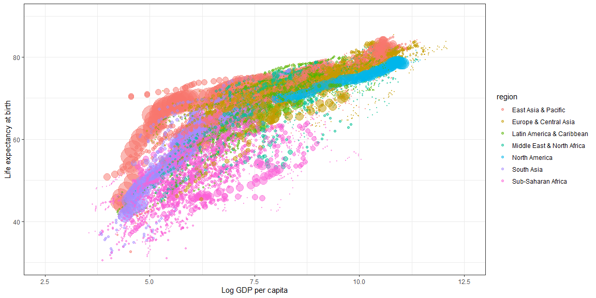

# {.tabset .tabset-fade}


https://towardsdatascience.com/create-hans-roslings-famous-animated-bubble-chart-in-a-single-piped-r-command-9c50a485259

The wbstats package is an awesome utility that allows you to plug directly into the World Bank database using its API and download data directly to your R session. You can visit the World Bank Open Data site here and browse for the indicators you want. Once you find one, you just need to make a note of its indicator ID code. For example, if you search for “GDP per Capita (current US$)”, you should be taken to this page — then click on the “Details” icon and you will see the ID. In this case it is NY.GDP.PCAP.CD.
Using these indicator ID codes you can use the wbstats package to instantly grab the data for the three indicators you need using our first command:

https://data.worldbank.org/


```r
wbdata <- wbstats::wb_data(indicator = c("SP.DYN.LE00.IN", "NY.GDP.PCAP.CD", 
                          "SP.POP.TOTL"),country = "countries_only", 
            start_date = 1960, end_date = 2020)
```

The country = "countries_only" argument is important — the World Bank data also includes regional and worldwide averages, which you don’t want for this analysis.

This is almost all we need in terms of data. But for our color coding we need to assign our countries to World Bank regions. wbstats has a handy function called wbcountries() where you can select the iso3c country code and its region and join to the previous table to assign countries to regions, as follows:


```r
wbdata <- wbdata %>%
  left_join(wbstats::wb_countries() %>% select(iso3c, region))
```

Our final data prep step is to spread the three indictors across the row for each country and year, as right now they are all in long form down the indicatorID column. We will use the newly-minted pivot_wider() function in tidyr for this (make sure you have the latest version!). So keeping date, country and region fixed, we want to widen according to the indicator column, filling with values from the value column:


```r
TWD <- wbdata %>% 
  select("date","country","region",
          "Life Expectancy" = "SP.DYN.LE00.IN",
          "GDP per Cap" ="NY.GDP.PCAP.CD",
          "Total Pop" = "SP.POP.TOTL")
```

Creating a static chart for a single year
Since animation is simple movement between static charts, the majority of our graphic work will be to create the static styled chart for a single year using ggplot2.


```r
TWD %>% ggplot(aes(log(`GDP per Cap`),`Life Expectancy`,
                   size = `Total Pop`,color = region)) + 
  geom_point(alpha =.5) + 
  scale_size(range = c(.1, 16), guide = FALSE) +
  scale_x_continuous(limits = c(2.5, 12.5)) +
  scale_y_continuous(limits = c(30, 90)) + 
  labs(x = "Log GDP per capita", y = "Life expectancy at birth")
```

<!-- -->

Animating the chart
And now for the last and easiest part of the work. Now that you have the static animation set up, you just need to use the package gganimate to animate it. All gganimate needs to know is what the transition variable is (in this case it is the date column), and a few details on timing and style of transition. You can achieve this by adding this simple animation command to your code above:


```r
TWD %>% ggplot(aes(log(`GDP per Cap`),`Life Expectancy`,
                   size = `Total Pop`,color = region)) + 
  geom_point(alpha =.5) + 
  scale_size(range = c(.1, 16), guide = FALSE) +
  scale_x_continuous(limits = c(2.5, 12.5)) +
  scale_y_continuous(limits = c(30, 90)) + 
  labs(x = "Log GDP per capita", y = "Life expectancy at birth") +
transition_states(date, transition_length = 1, state_length = 1) +
  ease_aes('cubic-in-out')
```

```
## NULL
```

Plotly version


```r
gpc <- log(TWD$`GDP per Cap`)
le <- TWD$`Life Expectancy`
TWD %>%
  plot_ly(x = ~log(TWD$`GDP per Cap`), y = ~TWD$`Life Expectancy`, 
    size = ~`Total Pop`, color = ~region, frame = ~date, 
    text = ~country, 
    hoverinfo = "text",type = 'scatter',mode = 'markers') %>%
  layout(xaxis = list(title = "Log(GDP)"), yaxis = list(title = "Life Expectancy"))
```

<!--html_preserve--><div id="htmlwidget-1fbc978e2ce60f9d5d5c" style="width:1152px;height:576px;" class="plotly html-widget"></div>
<script type="application/json" data-for="htmlwidget-1fbc978e2ce60f9d5d5c">{"x":{"visdat":{"3ac59e865f8":["function () ","plotlyVisDat"]},"cur_data":"3ac59e865f8","attrs":{"3ac59e865f8":{"x":{},"y":{},"text":{},"hoverinfo":"text","mode":"markers","color":{},"size":{},"frame":{},"alpha_stroke":1,"sizes":[10,100],"spans":[1,20],"type":"scatter"}},"layout":{"margin":{"b":40,"l":60,"t":25,"r":10},"xaxis":{"domain":[0,1],"automargin":true,"title":"Log(GDP)","range":[3.12210011868975,12.5215248970307]},"yaxis":{"domain":[0,1],"automargin":true,"title":"Life Expectancy","range":[23.2097463414634,88.3793268292683]},"hovermode":"closest","showlegend":true,"sliders":[{"currentvalue":{"prefix":"date: ","xanchor":"right","font":{"size":16,"color":"rgba(204,204,204,1)"}},"steps":[{"method":"animate","args":[["1960"],{"transition":{"duration":500,"easing":"linear"},"frame":{"duration":500,"redraw":false},"mode":"immediate"}],"label":"1960","value":"1960"},{"method":"animate","args":[["1961"],{"transition":{"duration":500,"easing":"linear"},"frame":{"duration":500,"redraw":false},"mode":"immediate"}],"label":"1961","value":"1961"},{"method":"animate","args":[["1962"],{"transition":{"duration":500,"easing":"linear"},"frame":{"duration":500,"redraw":false},"mode":"immediate"}],"label":"1962","value":"1962"},{"method":"animate","args":[["1963"],{"transition":{"duration":500,"easing":"linear"},"frame":{"duration":500,"redraw":false},"mode":"immediate"}],"label":"1963","value":"1963"},{"method":"animate","args":[["1964"],{"transition":{"duration":500,"easing":"linear"},"frame":{"duration":500,"redraw":false},"mode":"immediate"}],"label":"1964","value":"1964"},{"method":"animate","args":[["1965"],{"transition":{"duration":500,"easing":"linear"},"frame":{"duration":500,"redraw":false},"mode":"immediate"}],"label":"1965","value":"1965"},{"method":"animate","args":[["1966"],{"transition":{"duration":500,"easing":"linear"},"frame":{"duration":500,"redraw":false},"mode":"immediate"}],"label":"1966","value":"1966"},{"method":"animate","args":[["1967"],{"transition":{"duration":500,"easing":"linear"},"frame":{"duration":500,"redraw":false},"mode":"immediate"}],"label":"1967","value":"1967"},{"method":"animate","args":[["1968"],{"transition":{"duration":500,"easing":"linear"},"frame":{"duration":500,"redraw":false},"mode":"immediate"}],"label":"1968","value":"1968"},{"method":"animate","args":[["1969"],{"transition":{"duration":500,"easing":"linear"},"frame":{"duration":500,"redraw":false},"mode":"immediate"}],"label":"1969","value":"1969"},{"method":"animate","args":[["1970"],{"transition":{"duration":500,"easing":"linear"},"frame":{"duration":500,"redraw":false},"mode":"immediate"}],"label":"1970","value":"1970"},{"method":"animate","args":[["1971"],{"transition":{"duration":500,"easing":"linear"},"frame":{"duration":500,"redraw":false},"mode":"immediate"}],"label":"1971","value":"1971"},{"method":"animate","args":[["1972"],{"transition":{"duration":500,"easing":"linear"},"frame":{"duration":500,"redraw":false},"mode":"immediate"}],"label":"1972","value":"1972"},{"method":"animate","args":[["1973"],{"transition":{"duration":500,"easing":"linear"},"frame":{"duration":500,"redraw":false},"mode":"immediate"}],"label":"1973","value":"1973"},{"method":"animate","args":[["1974"],{"transition":{"duration":500,"easing":"linear"},"frame":{"duration":500,"redraw":false},"mode":"immediate"}],"label":"1974","value":"1974"},{"method":"animate","args":[["1975"],{"transition":{"duration":500,"easing":"linear"},"frame":{"duration":500,"redraw":false},"mode":"immediate"}],"label":"1975","value":"1975"},{"method":"animate","args":[["1976"],{"transition":{"duration":500,"easing":"linear"},"frame":{"duration":500,"redraw":false},"mode":"immediate"}],"label":"1976","value":"1976"},{"method":"animate","args":[["1977"],{"transition":{"duration":500,"easing":"linear"},"frame":{"duration":500,"redraw":false},"mode":"immediate"}],"label":"1977","value":"1977"},{"method":"animate","args":[["1978"],{"transition":{"duration":500,"easing":"linear"},"frame":{"duration":500,"redraw":false},"mode":"immediate"}],"label":"1978","value":"1978"},{"method":"animate","args":[["1979"],{"transition":{"duration":500,"easing":"linear"},"frame":{"duration":500,"redraw":false},"mode":"immediate"}],"label":"1979","value":"1979"},{"method":"animate","args":[["1980"],{"transition":{"duration":500,"easing":"linear"},"frame":{"duration":500,"redraw":false},"mode":"immediate"}],"label":"1980","value":"1980"},{"method":"animate","args":[["1981"],{"transition":{"duration":500,"easing":"linear"},"frame":{"duration":500,"redraw":false},"mode":"immediate"}],"label":"1981","value":"1981"},{"method":"animate","args":[["1982"],{"transition":{"duration":500,"easing":"linear"},"frame":{"duration":500,"redraw":false},"mode":"immediate"}],"label":"1982","value":"1982"},{"method":"animate","args":[["1983"],{"transition":{"duration":500,"easing":"linear"},"frame":{"duration":500,"redraw":false},"mode":"immediate"}],"label":"1983","value":"1983"},{"method":"animate","args":[["1984"],{"transition":{"duration":500,"easing":"linear"},"frame":{"duration":500,"redraw":false},"mode":"immediate"}],"label":"1984","value":"1984"},{"method":"animate","args":[["1985"],{"transition":{"duration":500,"easing":"linear"},"frame":{"duration":500,"redraw":false},"mode":"immediate"}],"label":"1985","value":"1985"},{"method":"animate","args":[["1986"],{"transition":{"duration":500,"easing":"linear"},"frame":{"duration":500,"redraw":false},"mode":"immediate"}],"label":"1986","value":"1986"},{"method":"animate","args":[["1987"],{"transition":{"duration":500,"easing":"linear"},"frame":{"duration":500,"redraw":false},"mode":"immediate"}],"label":"1987","value":"1987"},{"method":"animate","args":[["1988"],{"transition":{"duration":500,"easing":"linear"},"frame":{"duration":500,"redraw":false},"mode":"immediate"}],"label":"1988","value":"1988"},{"method":"animate","args":[["1989"],{"transition":{"duration":500,"easing":"linear"},"frame":{"duration":500,"redraw":false},"mode":"immediate"}],"label":"1989","value":"1989"},{"method":"animate","args":[["1990"],{"transition":{"duration":500,"easing":"linear"},"frame":{"duration":500,"redraw":false},"mode":"immediate"}],"label":"1990","value":"1990"},{"method":"animate","args":[["1991"],{"transition":{"duration":500,"easing":"linear"},"frame":{"duration":500,"redraw":false},"mode":"immediate"}],"label":"1991","value":"1991"},{"method":"animate","args":[["1992"],{"transition":{"duration":500,"easing":"linear"},"frame":{"duration":500,"redraw":false},"mode":"immediate"}],"label":"1992","value":"1992"},{"method":"animate","args":[["1993"],{"transition":{"duration":500,"easing":"linear"},"frame":{"duration":500,"redraw":false},"mode":"immediate"}],"label":"1993","value":"1993"},{"method":"animate","args":[["1994"],{"transition":{"duration":500,"easing":"linear"},"frame":{"duration":500,"redraw":false},"mode":"immediate"}],"label":"1994","value":"1994"},{"method":"animate","args":[["1995"],{"transition":{"duration":500,"easing":"linear"},"frame":{"duration":500,"redraw":false},"mode":"immediate"}],"label":"1995","value":"1995"},{"method":"animate","args":[["1996"],{"transition":{"duration":500,"easing":"linear"},"frame":{"duration":500,"redraw":false},"mode":"immediate"}],"label":"1996","value":"1996"},{"method":"animate","args":[["1997"],{"transition":{"duration":500,"easing":"linear"},"frame":{"duration":500,"redraw":false},"mode":"immediate"}],"label":"1997","value":"1997"},{"method":"animate","args":[["1998"],{"transition":{"duration":500,"easing":"linear"},"frame":{"duration":500,"redraw":false},"mode":"immediate"}],"label":"1998","value":"1998"},{"method":"animate","args":[["1999"],{"transition":{"duration":500,"easing":"linear"},"frame":{"duration":500,"redraw":false},"mode":"immediate"}],"label":"1999","value":"1999"},{"method":"animate","args":[["2000"],{"transition":{"duration":500,"easing":"linear"},"frame":{"duration":500,"redraw":false},"mode":"immediate"}],"label":"2000","value":"2000"},{"method":"animate","args":[["2001"],{"transition":{"duration":500,"easing":"linear"},"frame":{"duration":500,"redraw":false},"mode":"immediate"}],"label":"2001","value":"2001"},{"method":"animate","args":[["2002"],{"transition":{"duration":500,"easing":"linear"},"frame":{"duration":500,"redraw":false},"mode":"immediate"}],"label":"2002","value":"2002"},{"method":"animate","args":[["2003"],{"transition":{"duration":500,"easing":"linear"},"frame":{"duration":500,"redraw":false},"mode":"immediate"}],"label":"2003","value":"2003"},{"method":"animate","args":[["2004"],{"transition":{"duration":500,"easing":"linear"},"frame":{"duration":500,"redraw":false},"mode":"immediate"}],"label":"2004","value":"2004"},{"method":"animate","args":[["2005"],{"transition":{"duration":500,"easing":"linear"},"frame":{"duration":500,"redraw":false},"mode":"immediate"}],"label":"2005","value":"2005"},{"method":"animate","args":[["2006"],{"transition":{"duration":500,"easing":"linear"},"frame":{"duration":500,"redraw":false},"mode":"immediate"}],"label":"2006","value":"2006"},{"method":"animate","args":[["2007"],{"transition":{"duration":500,"easing":"linear"},"frame":{"duration":500,"redraw":false},"mode":"immediate"}],"label":"2007","value":"2007"},{"method":"animate","args":[["2008"],{"transition":{"duration":500,"easing":"linear"},"frame":{"duration":500,"redraw":false},"mode":"immediate"}],"label":"2008","value":"2008"},{"method":"animate","args":[["2009"],{"transition":{"duration":500,"easing":"linear"},"frame":{"duration":500,"redraw":false},"mode":"immediate"}],"label":"2009","value":"2009"},{"method":"animate","args":[["2010"],{"transition":{"duration":500,"easing":"linear"},"frame":{"duration":500,"redraw":false},"mode":"immediate"}],"label":"2010","value":"2010"},{"method":"animate","args":[["2011"],{"transition":{"duration":500,"easing":"linear"},"frame":{"duration":500,"redraw":false},"mode":"immediate"}],"label":"2011","value":"2011"},{"method":"animate","args":[["2012"],{"transition":{"duration":500,"easing":"linear"},"frame":{"duration":500,"redraw":false},"mode":"immediate"}],"label":"2012","value":"2012"},{"method":"animate","args":[["2013"],{"transition":{"duration":500,"easing":"linear"},"frame":{"duration":500,"redraw":false},"mode":"immediate"}],"label":"2013","value":"2013"},{"method":"animate","args":[["2014"],{"transition":{"duration":500,"easing":"linear"},"frame":{"duration":500,"redraw":false},"mode":"immediate"}],"label":"2014","value":"2014"},{"method":"animate","args":[["2015"],{"transition":{"duration":500,"easing":"linear"},"frame":{"duration":500,"redraw":false},"mode":"immediate"}],"label":"2015","value":"2015"},{"method":"animate","args":[["2016"],{"transition":{"duration":500,"easing":"linear"},"frame":{"duration":500,"redraw":false},"mode":"immediate"}],"label":"2016","value":"2016"},{"method":"animate","args":[["2017"],{"transition":{"duration":500,"easing":"linear"},"frame":{"duration":500,"redraw":false},"mode":"immediate"}],"label":"2017","value":"2017"},{"method":"animate","args":[["2018"],{"transition":{"duration":500,"easing":"linear"},"frame":{"duration":500,"redraw":false},"mode":"immediate"}],"label":"2018","value":"2018"}],"visible":true,"pad":{"t":40}}],"updatemenus":[{"type":"buttons","direction":"right","showactive":false,"y":0,"x":0,"yanchor":"top","xanchor":"right","pad":{"t":60,"r":5},"buttons":[{"label":"Play","method":"animate","args":[null,{"fromcurrent":true,"mode":"immediate","transition":{"duration":500,"easing":"linear"},"frame":{"duration":500,"redraw":false}}]}]}]},"source":"A","config":{"showSendToCloud":false},"data":[{"x":[7.4998580108149,4.4944681130287,5.65414941758251,6.06248872767046,6.17169086910236,4.71261085416899,5.06417165829624,5.45932485641121,7.74627904176365,5.53913950756854,4.62670282011236,6.05926098989005,4.61281567130061],"y":[70.8170731707317,43.725,60.811,66.9616829268293,67.6660975609756,41.242,55.4155365853659,59.991,71.2365853658537,61.105,38.935,65.6598292682927,54.701],"text":["Australia","China","Fiji","Hong Kong SAR, China","Japan","Cambodia","Korea, Rep.","Malaysia","New Zealand","Philippines","Papua New Guinea","Singapore","Thailand"],"hoverinfo":["text","text","text","text","text","text","text","text","text","text","text","text","text"],"mode":"markers","frame":"1960","type":"scatter","name":"East Asia & Pacific","marker":{"color":"rgba(102,194,165,1)","size":[10.662853635535,53.1062762311485,10.0241929894574,10.1975176621276,15.9763530678777,10.3685573594942,11.6151192742698,10.5258462345841,10.1520362558807,11.6963726057446,10.1445438968868,10.105159333876,11.7692323574449],"sizemode":"area","line":{"color":"rgba(102,194,165,1)"}},"textfont":{"color":"rgba(102,194,165,1)","size":[10.662853635535,53.1062762311485,10.0241929894574,10.1975176621276,15.9763530678777,10.3685573594942,11.6151192742698,10.5258462345841,10.1520362558807,11.6963726057446,10.1445438968868,10.105159333876,11.7692323574449]},"error_y":{"color":"rgba(102,194,165,1)","width":[]},"error_x":{"color":"rgba(102,194,165,1)","width":[]},"line":{"color":"rgba(102,194,165,1)"},"xaxis":"x","yaxis":"y","visible":true},{"x":[6.84103884321643,7.14967478101723,7.48849514435636,5.98240425972606,7.07272127132786,7.19645437596779,7.24250804049897,6.25444928117974,6.53031582618366,7.25487227954386,6.6902117971501,7.71513065829772,6.97427738205467,7.27361685829072,5.88749001083367,7.65633857262216,6.23328038545889],"y":[68.5856097560976,69.7019512195122,71.3134146341463,69.1092682926829,68.819756097561,69.8682926829268,71.1268292682927,68.1639024390244,69.796512195122,73.4231707317073,69.1239024390244,68.4463902439024,73.3926829268293,73.549756097561,63.2729024390244,73.0056097560976,45.369],"text":["Austria","Belgium","Switzerland","Spain","Finland","France","United Kingdom","Greece","Ireland","Iceland","Italy","Luxembourg","Netherlands","Norway","Portugal","Sweden","Turkey"],"hoverinfo":["text","text","text","text","text","text","text","text","text","text","text","text","text","text","text","text","text"],"mode":"markers","frame":"1960","type":"scatter","name":"Europe & Central Asia","marker":{"color":"rgba(252,141,98,1)","size":[10.4541926556839,10.5902837142665,10.3430611347375,11.966833576038,10.285017954139,13.0115588059645,13.3849670932602,10.537179541487,10.1815556630653,10.0101113662933,13.2427789329529,10.019054816111,10.7410564128602,10.2301928283544,10.5711702212253,10.4824401046995,11.7740879380426],"sizemode":"area","line":{"color":"rgba(252,141,98,1)"}},"textfont":{"color":"rgba(252,141,98,1)","size":[10.4541926556839,10.5902837142665,10.3430611347375,11.966833576038,10.285017954139,13.0115588059645,13.3849670932602,10.537179541487,10.1815556630653,10.0101113662933,13.2427789329529,10.019054816111,10.7410564128602,10.2301928283544,10.5711702212253,10.4824401046995,11.7740879380426]},"error_y":{"color":"rgba(252,141,98,1)","width":[]},"error_x":{"color":"rgba(252,141,98,1)","width":[]},"line":{"color":"rgba(252,141,98,1)"},"xaxis":"x","yaxis":"y","visible":true},{"x":[7.34616464447049,5.72003996017347,4.6273023542268,5.34763072423084,6.22524967786499,5.5256177325238,5.94375722239414,5.31868232349931,6.12131138128291,5.53242527368584,5.69599657330183,5.10378995570879,4.25789576675499,6.06205161483301,5.84421248101065,4.83825124928069,6.16140565202884,5.53443566688922,6.57579363464957,5.8469068625163,6.44841794595758,6.19308143088967,5.08364624007829,6.86217843909503],"y":[64.74,59.981,41.82,54.143,57.219,57.269,60.381,51.602,52.982,46.702,60.26,46.274,41.762,64.77,57.077,46.998,60.864,48.012,68.7196097560976,59.682,62.222,67.783,59.26,59.831],"text":["Bahamas, The","Belize","Bolivia","Brazil","Chile","Colombia","Costa Rica","Dominican Republic","Ecuador","Guatemala","Guyana","Honduras","Haiti","Jamaica","Mexico","Nicaragua","Panama","Peru","Puerto Rico","Suriname","Trinidad and Tobago","Uruguay","St. Vincent and the Grenadines","Venezuela, RB"],"hoverinfo":["text","text","text","text","text","text","text","text","text","text","text","text","text","text","text","text","text","text","text","text","text","text","text","text"],"mode":"markers","frame":"1960","type":"scatter","name":"Latin America & Caribbean","marker":{"color":"rgba(141,160,203,1)","size":[10.0058437181968,10.0047147688896,10.2350857605663,14.6631435952111,10.5243368545631,11.036450361078,10.0847634138742,10.2116452962767,10.2923869494106,10.2655825780698,10.035717577983,10.1305062167981,10.2486049769863,10.1040038894792,12.4396648810592,10.1133488368381,10.0719821180116,10.6550044975415,10.1511444699368,10.0173682421002,10.0535636364071,10.1628180125639,10.0039983028926,10.5249088253883],"sizemode":"area","line":{"color":"rgba(141,160,203,1)"}},"textfont":{"color":"rgba(141,160,203,1)","size":[10.0058437181968,10.0047147688896,10.2350857605663,14.6631435952111,10.5243368545631,11.036450361078,10.0847634138742,10.2116452962767,10.2923869494106,10.2655825780698,10.035717577983,10.1305062167981,10.2486049769863,10.1040038894792,12.4396648810592,10.1133488368381,10.0719821180116,10.6550044975415,10.1511444699368,10.0173682421002,10.0535636364071,10.1628180125639,10.0039983028926,10.5249088253883]},"error_y":{"color":"rgba(141,160,203,1)","width":[]},"error_x":{"color":"rgba(141,160,203,1)","width":[]},"line":{"color":"rgba(141,160,203,1)"},"xaxis":"x","yaxis":"y","visible":true},{"x":[5.25583139068159,5.44252873871081,5.10473734464409,5.2339781550035],"y":[44.947,48.022,48.458,51.971],"text":["Iran, Islamic Rep.","Iraq","Morocco","Syrian Arab Republic"],"hoverinfo":["text","text","text","text"],"mode":"markers","frame":"1960","type":"scatter","name":"Middle East & North Africa","marker":{"color":"rgba(231,138,195,1)","size":[11.4144377107066,10.4698455022857,10.7954618822739,10.2943156626918],"sizemode":"area","line":{"color":"rgba(231,138,195,1)"}},"textfont":{"color":"rgba(231,138,195,1)","size":[11.4144377107066,10.4698455022857,10.7954618822739,10.2943156626918]},"error_y":{"color":"rgba(231,138,195,1)","width":[]},"error_x":{"color":"rgba(231,138,195,1)","width":[]},"line":{"color":"rgba(231,138,195,1)"},"xaxis":"x","yaxis":"y","visible":true},{"x":[7.72280778044845,8.00873923481587],"y":[71.1331707317073,69.7707317073171],"text":["Canada","United States"],"hoverinfo":["text","text"],"mode":"markers","frame":"1960","type":"scatter","name":"North America","marker":{"color":"rgba(166,216,84,1)","size":[11.1560844147773,21.6741174412942],"sizemode":"area","line":{"color":"rgba(166,216,84,1)"}},"textfont":{"color":"rgba(166,216,84,1)","size":[11.1560844147773,21.6741174412942]},"error_y":{"color":"rgba(166,216,84,1)","width":[]},"error_x":{"color":"rgba(166,216,84,1)","width":[]},"line":{"color":"rgba(166,216,84,1)"},"xaxis":"x","yaxis":"y","visible":true},{"x":[4.09055729692778,4.48903226083189,4.409016630758,4.96130233582677,3.91810422731524,4.42290397882717],"y":[32.446,45.379,41.422,59.369,35.583,45.299],"text":["Afghanistan","Bangladesh","India","Sri Lanka","Nepal","Pakistan"],"hoverinfo":["text","text","text","text","text","text"],"mode":"markers","frame":"1960","type":"scatter","name":"South Asia","marker":{"color":"rgba(255,217,47,1)","size":[10.5801693107312,13.1015022037291,39.1141340285128,10.6368754586357,10.6517756508252,12.9060321596752],"sizemode":"area","line":{"color":"rgba(255,217,47,1)"}},"textfont":{"color":"rgba(255,217,47,1)","size":[10.5801693107312,13.1015022037291,39.1141340285128,10.6368754586357,10.6517756508252,12.9060321596752]},"error_y":{"color":"rgba(255,217,47,1)","width":[]},"error_x":{"color":"rgba(255,217,47,1)","width":[]},"line":{"color":"rgba(255,217,47,1)"},"xaxis":"x","yaxis":"y","visible":true},{"x":[4.24923403533577,4.53284149602638,4.22573458037597,4.10251962301008,4.31331069318493,5.04921413321201,4.78347685044162,5.39505408333962,4.86268009866076,5.64337335405856,5.21193976404724,4.57929350413657,3.72086416032059,4.88274916378215,3.79602599629953,4.88773038222384,4.53217434602596,3.70221796474777,4.83516899510611,5.74618320210334,4.93403325925359,4.18173860276919,4.64643215755697,4.64891473104853,4.33909896343059,4.13532010743538,6.09359192792433,5.44755112202618,5.63054381368481],"y":[41.281,37.271,34.432,49.179,36.249,36.095,41.785,41.098,45.721,39.694,45.843,46.76,47.919,39.962,36.672,35.053,36.976,42.616,48.194,38.223,31.566,36.976,43.572,38.02,40.297,44.359,48.406,46.687,53.019],"text":["Burundi","Benin","Burkina Faso","Botswana","Central African Republic","Cote d'Ivoire","Cameroon","Congo, Dem. Rep.","Congo, Rep.","Gabon","Ghana","Kenya","Lesotho","Madagascar","Malawi","Niger","Nigeria","Rwanda","Sudan","Senegal","Sierra Leone","Somalia","Eswatini","Chad","Togo","Uganda","South Africa","Zambia","Zimbabwe"],"hoverinfo":["text","text","text","text","text","text","text","text","text","text","text","text","text","text","text","text","text","text","text","text","text","text","text","text","text","text","text","text","text"],"mode":"markers","frame":"1960","type":"scatter","name":"Sub-Saharan Africa","marker":{"color":"rgba(229,196,148,1)","size":[10.1795738303605,10.1559020833251,10.3108444628058,10.0312538662233,10.0958064379901,10.2251725904679,10.3333090677086,10.984140459388,10.0645671117551,10.0311364477406,10.4275483534578,10.5235025823504,10.0528715975903,10.328297941548,10.2352815011187,10.2177546762137,12.9157104928083,10.1884690720395,10.4863067722322,10.2059924719696,10.1485360606732,10.1768622841139,10.0205161172377,10.1927358800478,10.1009015729715,10.4360697558843,11.1037941582269,10.1972056016694,10.242822714473],"sizemode":"area","line":{"color":"rgba(229,196,148,1)"}},"textfont":{"color":"rgba(229,196,148,1)","size":[10.1795738303605,10.1559020833251,10.3108444628058,10.0312538662233,10.0958064379901,10.2251725904679,10.3333090677086,10.984140459388,10.0645671117551,10.0311364477406,10.4275483534578,10.5235025823504,10.0528715975903,10.328297941548,10.2352815011187,10.2177546762137,12.9157104928083,10.1884690720395,10.4863067722322,10.2059924719696,10.1485360606732,10.1768622841139,10.0205161172377,10.1927358800478,10.1009015729715,10.4360697558843,11.1037941582269,10.1972056016694,10.242822714473]},"error_y":{"color":"rgba(229,196,148,1)","width":[]},"error_x":{"color":"rgba(229,196,148,1)","width":[]},"line":{"color":"rgba(229,196,148,1)"},"xaxis":"x","yaxis":"y","visible":true}],"highlight":{"on":"plotly_click","persistent":false,"dynamic":false,"selectize":false,"opacityDim":0.2,"selected":{"opacity":1},"debounce":0},"frames":[{"name":"1960","data":[{"x":[7.4998580108149,4.4944681130287,5.65414941758251,6.06248872767046,6.17169086910236,4.71261085416899,5.06417165829624,5.45932485641121,7.74627904176365,5.53913950756854,4.62670282011236,6.05926098989005,4.61281567130061],"y":[70.8170731707317,43.725,60.811,66.9616829268293,67.6660975609756,41.242,55.4155365853659,59.991,71.2365853658537,61.105,38.935,65.6598292682927,54.701],"text":["Australia","China","Fiji","Hong Kong SAR, China","Japan","Cambodia","Korea, Rep.","Malaysia","New Zealand","Philippines","Papua New Guinea","Singapore","Thailand"],"hoverinfo":["text","text","text","text","text","text","text","text","text","text","text","text","text"],"mode":"markers","frame":"1960","type":"scatter","name":"East Asia & Pacific","marker":{"color":"rgba(102,194,165,1)","size":[10.662853635535,53.1062762311485,10.0241929894574,10.1975176621276,15.9763530678777,10.3685573594942,11.6151192742698,10.5258462345841,10.1520362558807,11.6963726057446,10.1445438968868,10.105159333876,11.7692323574449],"sizemode":"area","line":{"color":"rgba(102,194,165,1)"}},"textfont":{"color":"rgba(102,194,165,1)","size":[10.662853635535,53.1062762311485,10.0241929894574,10.1975176621276,15.9763530678777,10.3685573594942,11.6151192742698,10.5258462345841,10.1520362558807,11.6963726057446,10.1445438968868,10.105159333876,11.7692323574449]},"error_y":{"color":"rgba(102,194,165,1)","width":[]},"error_x":{"color":"rgba(102,194,165,1)","width":[]},"line":{"color":"rgba(102,194,165,1)"},"xaxis":"x","yaxis":"y","visible":true},{"x":[6.84103884321643,7.14967478101723,7.48849514435636,5.98240425972606,7.07272127132786,7.19645437596779,7.24250804049897,6.25444928117974,6.53031582618366,7.25487227954386,6.6902117971501,7.71513065829772,6.97427738205467,7.27361685829072,5.88749001083367,7.65633857262216,6.23328038545889],"y":[68.5856097560976,69.7019512195122,71.3134146341463,69.1092682926829,68.819756097561,69.8682926829268,71.1268292682927,68.1639024390244,69.796512195122,73.4231707317073,69.1239024390244,68.4463902439024,73.3926829268293,73.549756097561,63.2729024390244,73.0056097560976,45.369],"text":["Austria","Belgium","Switzerland","Spain","Finland","France","United Kingdom","Greece","Ireland","Iceland","Italy","Luxembourg","Netherlands","Norway","Portugal","Sweden","Turkey"],"hoverinfo":["text","text","text","text","text","text","text","text","text","text","text","text","text","text","text","text","text"],"mode":"markers","frame":"1960","type":"scatter","name":"Europe & Central Asia","marker":{"color":"rgba(252,141,98,1)","size":[10.4541926556839,10.5902837142665,10.3430611347375,11.966833576038,10.285017954139,13.0115588059645,13.3849670932602,10.537179541487,10.1815556630653,10.0101113662933,13.2427789329529,10.019054816111,10.7410564128602,10.2301928283544,10.5711702212253,10.4824401046995,11.7740879380426],"sizemode":"area","line":{"color":"rgba(252,141,98,1)"}},"textfont":{"color":"rgba(252,141,98,1)","size":[10.4541926556839,10.5902837142665,10.3430611347375,11.966833576038,10.285017954139,13.0115588059645,13.3849670932602,10.537179541487,10.1815556630653,10.0101113662933,13.2427789329529,10.019054816111,10.7410564128602,10.2301928283544,10.5711702212253,10.4824401046995,11.7740879380426]},"error_y":{"color":"rgba(252,141,98,1)","width":[]},"error_x":{"color":"rgba(252,141,98,1)","width":[]},"line":{"color":"rgba(252,141,98,1)"},"xaxis":"x","yaxis":"y","visible":true},{"x":[7.34616464447049,5.72003996017347,4.6273023542268,5.34763072423084,6.22524967786499,5.5256177325238,5.94375722239414,5.31868232349931,6.12131138128291,5.53242527368584,5.69599657330183,5.10378995570879,4.25789576675499,6.06205161483301,5.84421248101065,4.83825124928069,6.16140565202884,5.53443566688922,6.57579363464957,5.8469068625163,6.44841794595758,6.19308143088967,5.08364624007829,6.86217843909503],"y":[64.74,59.981,41.82,54.143,57.219,57.269,60.381,51.602,52.982,46.702,60.26,46.274,41.762,64.77,57.077,46.998,60.864,48.012,68.7196097560976,59.682,62.222,67.783,59.26,59.831],"text":["Bahamas, The","Belize","Bolivia","Brazil","Chile","Colombia","Costa Rica","Dominican Republic","Ecuador","Guatemala","Guyana","Honduras","Haiti","Jamaica","Mexico","Nicaragua","Panama","Peru","Puerto Rico","Suriname","Trinidad and Tobago","Uruguay","St. Vincent and the Grenadines","Venezuela, RB"],"hoverinfo":["text","text","text","text","text","text","text","text","text","text","text","text","text","text","text","text","text","text","text","text","text","text","text","text"],"mode":"markers","frame":"1960","type":"scatter","name":"Latin America & Caribbean","marker":{"color":"rgba(141,160,203,1)","size":[10.0058437181968,10.0047147688896,10.2350857605663,14.6631435952111,10.5243368545631,11.036450361078,10.0847634138742,10.2116452962767,10.2923869494106,10.2655825780698,10.035717577983,10.1305062167981,10.2486049769863,10.1040038894792,12.4396648810592,10.1133488368381,10.0719821180116,10.6550044975415,10.1511444699368,10.0173682421002,10.0535636364071,10.1628180125639,10.0039983028926,10.5249088253883],"sizemode":"area","line":{"color":"rgba(141,160,203,1)"}},"textfont":{"color":"rgba(141,160,203,1)","size":[10.0058437181968,10.0047147688896,10.2350857605663,14.6631435952111,10.5243368545631,11.036450361078,10.0847634138742,10.2116452962767,10.2923869494106,10.2655825780698,10.035717577983,10.1305062167981,10.2486049769863,10.1040038894792,12.4396648810592,10.1133488368381,10.0719821180116,10.6550044975415,10.1511444699368,10.0173682421002,10.0535636364071,10.1628180125639,10.0039983028926,10.5249088253883]},"error_y":{"color":"rgba(141,160,203,1)","width":[]},"error_x":{"color":"rgba(141,160,203,1)","width":[]},"line":{"color":"rgba(141,160,203,1)"},"xaxis":"x","yaxis":"y","visible":true},{"x":[5.25583139068159,5.44252873871081,5.10473734464409,5.2339781550035],"y":[44.947,48.022,48.458,51.971],"text":["Iran, Islamic Rep.","Iraq","Morocco","Syrian Arab Republic"],"hoverinfo":["text","text","text","text"],"mode":"markers","frame":"1960","type":"scatter","name":"Middle East & North Africa","marker":{"color":"rgba(231,138,195,1)","size":[11.4144377107066,10.4698455022857,10.7954618822739,10.2943156626918],"sizemode":"area","line":{"color":"rgba(231,138,195,1)"}},"textfont":{"color":"rgba(231,138,195,1)","size":[11.4144377107066,10.4698455022857,10.7954618822739,10.2943156626918]},"error_y":{"color":"rgba(231,138,195,1)","width":[]},"error_x":{"color":"rgba(231,138,195,1)","width":[]},"line":{"color":"rgba(231,138,195,1)"},"xaxis":"x","yaxis":"y","visible":true},{"x":[7.72280778044845,8.00873923481587],"y":[71.1331707317073,69.7707317073171],"text":["Canada","United States"],"hoverinfo":["text","text"],"mode":"markers","frame":"1960","type":"scatter","name":"North America","marker":{"color":"rgba(166,216,84,1)","size":[11.1560844147773,21.6741174412942],"sizemode":"area","line":{"color":"rgba(166,216,84,1)"}},"textfont":{"color":"rgba(166,216,84,1)","size":[11.1560844147773,21.6741174412942]},"error_y":{"color":"rgba(166,216,84,1)","width":[]},"error_x":{"color":"rgba(166,216,84,1)","width":[]},"line":{"color":"rgba(166,216,84,1)"},"xaxis":"x","yaxis":"y","visible":true},{"x":[4.09055729692778,4.48903226083189,4.409016630758,4.96130233582677,3.91810422731524,4.42290397882717],"y":[32.446,45.379,41.422,59.369,35.583,45.299],"text":["Afghanistan","Bangladesh","India","Sri Lanka","Nepal","Pakistan"],"hoverinfo":["text","text","text","text","text","text"],"mode":"markers","frame":"1960","type":"scatter","name":"South Asia","marker":{"color":"rgba(255,217,47,1)","size":[10.5801693107312,13.1015022037291,39.1141340285128,10.6368754586357,10.6517756508252,12.9060321596752],"sizemode":"area","line":{"color":"rgba(255,217,47,1)"}},"textfont":{"color":"rgba(255,217,47,1)","size":[10.5801693107312,13.1015022037291,39.1141340285128,10.6368754586357,10.6517756508252,12.9060321596752]},"error_y":{"color":"rgba(255,217,47,1)","width":[]},"error_x":{"color":"rgba(255,217,47,1)","width":[]},"line":{"color":"rgba(255,217,47,1)"},"xaxis":"x","yaxis":"y","visible":true},{"x":[4.24923403533577,4.53284149602638,4.22573458037597,4.10251962301008,4.31331069318493,5.04921413321201,4.78347685044162,5.39505408333962,4.86268009866076,5.64337335405856,5.21193976404724,4.57929350413657,3.72086416032059,4.88274916378215,3.79602599629953,4.88773038222384,4.53217434602596,3.70221796474777,4.83516899510611,5.74618320210334,4.93403325925359,4.18173860276919,4.64643215755697,4.64891473104853,4.33909896343059,4.13532010743538,6.09359192792433,5.44755112202618,5.63054381368481],"y":[41.281,37.271,34.432,49.179,36.249,36.095,41.785,41.098,45.721,39.694,45.843,46.76,47.919,39.962,36.672,35.053,36.976,42.616,48.194,38.223,31.566,36.976,43.572,38.02,40.297,44.359,48.406,46.687,53.019],"text":["Burundi","Benin","Burkina Faso","Botswana","Central African Republic","Cote d'Ivoire","Cameroon","Congo, Dem. Rep.","Congo, Rep.","Gabon","Ghana","Kenya","Lesotho","Madagascar","Malawi","Niger","Nigeria","Rwanda","Sudan","Senegal","Sierra Leone","Somalia","Eswatini","Chad","Togo","Uganda","South Africa","Zambia","Zimbabwe"],"hoverinfo":["text","text","text","text","text","text","text","text","text","text","text","text","text","text","text","text","text","text","text","text","text","text","text","text","text","text","text","text","text"],"mode":"markers","frame":"1960","type":"scatter","name":"Sub-Saharan Africa","marker":{"color":"rgba(229,196,148,1)","size":[10.1795738303605,10.1559020833251,10.3108444628058,10.0312538662233,10.0958064379901,10.2251725904679,10.3333090677086,10.984140459388,10.0645671117551,10.0311364477406,10.4275483534578,10.5235025823504,10.0528715975903,10.328297941548,10.2352815011187,10.2177546762137,12.9157104928083,10.1884690720395,10.4863067722322,10.2059924719696,10.1485360606732,10.1768622841139,10.0205161172377,10.1927358800478,10.1009015729715,10.4360697558843,11.1037941582269,10.1972056016694,10.242822714473],"sizemode":"area","line":{"color":"rgba(229,196,148,1)"}},"textfont":{"color":"rgba(229,196,148,1)","size":[10.1795738303605,10.1559020833251,10.3108444628058,10.0312538662233,10.0958064379901,10.2251725904679,10.3333090677086,10.984140459388,10.0645671117551,10.0311364477406,10.4275483534578,10.5235025823504,10.0528715975903,10.328297941548,10.2352815011187,10.2177546762137,12.9157104928083,10.1884690720395,10.4863067722322,10.2059924719696,10.1485360606732,10.1768622841139,10.0205161172377,10.1927358800478,10.1009015729715,10.4360697558843,11.1037941582269,10.1972056016694,10.242822714473]},"error_y":{"color":"rgba(229,196,148,1)","width":[]},"error_x":{"color":"rgba(229,196,148,1)","width":[]},"line":{"color":"rgba(229,196,148,1)"},"xaxis":"x","yaxis":"y","visible":true}],"traces":[0,1,2,3,4,5,6]},{"name":"1961","data":[{"x":[7.53622105127464,4.32817530717599,5.66040001389793,6.07937104975398,6.33432128762443,4.69556272605097,4.54147023631494,5.42024076580112,7.75931214826183,5.58793339599537,4.66894279508339,6.10735929279704,4.67747221635451],"y":[70.9731707317073,44.051,61.172,67.548756097561,68.31,41.366,56.0149756097561,60.515,70.9853658536586,61.509,39.542,66.0871951219512,55.233],"text":["Australia","China","Fiji","Hong Kong SAR, China","Japan","Cambodia","Korea, Rep.","Malaysia","New Zealand","Philippines","Papua New Guinea","Singapore","Thailand"],"hoverinfo":["text","text","text","text","text","text","text","text","text","text","text","text","text"],"mode":"markers","frame":"1961","type":"scatter","name":"East Asia & Pacific","marker":{"color":"rgba(102,194,165,1)","size":[10.6761995999177,52.6707228064013,10.0250827074919,10.2034948897273,16.134188064925,10.378289199784,11.6637990901909,10.5427434456883,10.1551316578162,11.7539711858146,10.1472063302844,10.1087781753872,11.8226735994623],"sizemode":"area","line":{"color":"rgba(102,194,165,1)"}},"textfont":{"color":"rgba(102,194,165,1)","size":[10.6761995999177,52.6707228064013,10.0250827074919,10.2034948897273,16.134188064925,10.378289199784,11.6637990901909,10.5427434456883,10.1551316578162,11.7539711858146,10.1472063302844,10.1087781753872,11.8226735994623]},"error_y":{"color":"rgba(102,194,165,1)","width":[]},"error_x":{"color":"rgba(102,194,165,1)","width":[]},"line":{"color":"rgba(102,194,165,1)"},"xaxis":"x","yaxis":"y","visible":true},{"x":[6.9390746706016,7.20800628540323,7.58645678275491,6.10936599630202,7.19099793004347,7.26406199584772,7.29463929898475,6.3814437904604,6.6056718786799,7.25709146881925,6.78822455468731,7.70632783795952,7.05565131681968,7.35264936776741,5.94732964124986,7.73583611277911,5.64836938690643],"y":[69.5773170731707,70.5209756097561,71.6448780487805,69.4804878048781,68.8441463414634,70.1170731707317,70.8780487804878,68.5486341463415,69.9782682926829,73.5034146341464,69.760243902439,68.7377317073171,73.6526829268293,73.5504878048781,63.6863658536585,73.4743902439024,46.093],"text":["Austria","Belgium","Switzerland","Spain","Finland","France","United Kingdom","Greece","Ireland","Iceland","Italy","Luxembourg","Netherlands","Norway","Portugal","Sweden","Turkey"],"hoverinfo":["text","text","text","text","text","text","text","text","text","text","text","text","text","text","text","text","text"],"mode":"markers","frame":"1961","type":"scatter","name":"Europe & Central Asia","marker":{"color":"rgba(252,141,98,1)","size":[10.4566974109871,10.5922520409378,10.3499412632943,11.9852024278161,10.2870452162292,13.0515517867044,13.4108159611977,10.5414656069019,10.181284249952,10.0103346358901,13.2645339864308,10.0192406048493,10.7508842170722,10.2320385021473,10.5757971685861,10.4847239814262,11.8176797920433],"sizemode":"area","line":{"color":"rgba(252,141,98,1)"}},"textfont":{"color":"rgba(252,141,98,1)","size":[10.4566974109871,10.5922520409378,10.3499412632943,11.9852024278161,10.2870452162292,13.0515517867044,13.4108159611977,10.5414656069019,10.181284249952,10.0103346358901,13.2645339864308,10.0192406048493,10.7508842170722,10.2320385021473,10.5757971685861,10.4847239814262,11.8176797920433]},"error_y":{"color":"rgba(252,141,98,1)","width":[]},"error_x":{"color":"rgba(252,141,98,1)","width":[]},"line":{"color":"rgba(252,141,98,1)"},"xaxis":"x","yaxis":"y","visible":true},{"x":[7.40931146480527,5.75701863324722,4.69190746424527,5.32320882894823,6.31920940826276,5.61331919549023,5.87212842862311,5.25763976400068,5.92751685330236,5.53428746501108,5.75379557169878,5.13526648984506,4.23068833102067,6.11601615302246,5.89548545907471,4.87862823636196,6.2407723255684,5.62606850721236,6.65571705263203,5.89702923287844,6.51678173385722,6.39976436145215,5.13802617332143,6.87766342504252],"y":[64.885,60.531,42.15,54.634,57.616,57.813,61.018,52.306,53.547,47.219,60.441,46.953,42.182,65.133,57.668,47.636,61.38,48.628,68.9431707317073,60.038,62.652,68.007,59.891,60.377],"text":["Bahamas, The","Belize","Bolivia","Brazil","Chile","Colombia","Costa Rica","Dominican Republic","Ecuador","Guatemala","Guyana","Honduras","Haiti","Jamaica","Mexico","Nicaragua","Panama","Peru","Puerto Rico","Suriname","Trinidad and Tobago","Uruguay","St. Vincent and the Grenadines","Venezuela, RB"],"hoverinfo":["text","text","text","text","text","text","text","text","text","text","text","text","text","text","text","text","text","text","text","text","text","text","text","text"],"mode":"markers","frame":"1961","type":"scatter","name":"Latin America & Caribbean","marker":{"color":"rgba(141,160,203,1)","size":[10.0062047622597,10.0048853067959,10.2397391383945,14.800925622112,10.5353756782379,11.0694132898271,10.0880204358565,10.2188865981407,10.3008205303083,10.2735331082479,10.0368455579577,10.1342398919052,10.2535023681279,10.1054613132756,12.5168364824201,10.1170096181376,10.074186767958,10.6738486453788,10.153840636107,10.0178881274566,10.0546518091251,10.1649529998112,10.004075332519,10.5441287511433],"sizemode":"area","line":{"color":"rgba(141,160,203,1)"}},"textfont":{"color":"rgba(141,160,203,1)","size":[10.0062047622597,10.0048853067959,10.2397391383945,14.800925622112,10.5353756782379,11.0694132898271,10.0880204358565,10.2188865981407,10.3008205303083,10.2735331082479,10.0368455579577,10.1342398919052,10.2535023681279,10.1054613132756,12.5168364824201,10.1170096181376,10.074186767958,10.6738486453788,10.153840636107,10.0178881274566,10.0546518091251,10.1649529998112,10.004075332519,10.5441287511433]},"error_y":{"color":"rgba(141,160,203,1)","width":[]},"error_x":{"color":"rgba(141,160,203,1)","width":[]},"line":{"color":"rgba(141,160,203,1)"},"xaxis":"x","yaxis":"y","visible":true},{"x":[5.28282336092119,5.50138903418943,7.26988442921003,5.06842400780274,5.29923373105634],"y":[45.512,49.222,72.0065853658537,48.88,52.568],"text":["Iran, Islamic Rep.","Iraq","Israel","Morocco","Syrian Arab Republic"],"hoverinfo":["text","text","text","text","text"],"mode":"markers","frame":"1961","type":"scatter","name":"Middle East & North Africa","marker":{"color":"rgba(231,138,195,1)","size":[11.4514958109809,10.481838730787,10.1399648345538,10.8201507176405,10.3039045587419],"sizemode":"area","line":{"color":"rgba(231,138,195,1)"}},"textfont":{"color":"rgba(231,138,195,1)","size":[11.4514958109809,10.481838730787,10.1399648345538,10.8201507176405,10.3039045587419]},"error_y":{"color":"rgba(231,138,195,1)","width":[]},"error_x":{"color":"rgba(231,138,195,1)","width":[]},"line":{"color":"rgba(231,138,195,1)"},"xaxis":"x","yaxis":"y","visible":true},{"x":[7.7144244473518,8.02831262678516],"y":[71.3460975609756,70.2707317073171],"text":["Canada","United States"],"hoverinfo":["text","text"],"mode":"markers","frame":"1961","type":"scatter","name":"North America","marker":{"color":"rgba(166,216,84,1)","size":[11.1794770586612,21.8692763942225],"sizemode":"area","line":{"color":"rgba(166,216,84,1)"}},"textfont":{"color":"rgba(166,216,84,1)","size":[11.1794770586612,21.8692763942225]},"error_y":{"color":"rgba(166,216,84,1)","width":[]},"error_x":{"color":"rgba(166,216,84,1)","width":[]},"line":{"color":"rgba(166,216,84,1)"},"xaxis":"x","yaxis":"y","visible":true},{"x":[4.09202310103296,4.58082906920168,4.4468108425214,4.96171231547433,3.94760689302725,4.49322168539531],"y":[32.962,45.97,42.027,59.769,35.941,46.197],"text":["Afghanistan","Bangladesh","India","Sri Lanka","Nepal","Pakistan"],"hoverinfo":["text","text","text","text","text","text"],"mode":"markers","frame":"1961","type":"scatter","name":"South Asia","marker":{"color":"rgba(255,217,47,1)","size":[10.5913125638326,13.1886994177639,39.7018394474468,10.652201317058,10.6622582714843,12.975600575021],"sizemode":"area","line":{"color":"rgba(255,217,47,1)"}},"textfont":{"color":"rgba(255,217,47,1)","size":[10.5913125638326,13.1886994177639,39.7018394474468,10.652201317058,10.6622582714843,12.975600575021]},"error_y":{"color":"rgba(255,217,47,1)","width":[]},"error_x":{"color":"rgba(255,217,47,1)","width":[]},"line":{"color":"rgba(255,217,47,1)"},"xaxis":"x","yaxis":"y","visible":true},{"x":[4.26503187243494,4.55988150895618,4.27051082640596,4.16163733538183,4.39058475760023,5.13722547247614,4.823717027777,5.28518841673916,4.97953255965928,5.80342226198301,5.24817484058701,4.55019917695942,3.73425538541535,4.89670170143606,5.20311344621193,3.84120662911695,4.9369181631673,4.57449492131754,3.70596737647211,4.89096704737066,5.77256645429069,4.93708910376786,4.22107363116203,4.83080548525453,4.69253197764334,4.37096736922248,4.14663686697484,6.12021392798319,5.39381905832933,5.63774576701164],"y":[41.592,37.727,34.897,49.684,36.715,36.948,42.255,41.312,46.338,40.082,46.279,47.417,48.162,40.444,45.132,36.934,35.141,37.431,42.941,48.618,38.38,31.925,37.374,43.951,38.279,40.941,44.955,48.777,47.084,53.483],"text":["Burundi","Benin","Burkina Faso","Botswana","Central African Republic","Cote d'Ivoire","Cameroon","Congo, Dem. Rep.","Congo, Rep.","Gabon","Ghana","Kenya","Lesotho","Madagascar","Mauritania","Malawi","Niger","Nigeria","Rwanda","Sudan","Senegal","Sierra Leone","Somalia","Eswatini","Chad","Togo","Uganda","South Africa","Zambia","Zimbabwe"],"hoverinfo":["text","text","text","text","text","text","text","text","text","text","text","text","text","text","text","text","text","text","text","text","text","text","text","text","text","text","text","text","text","text"],"mode":"markers","frame":"1961","type":"scatter","name":"Sub-Saharan Africa","marker":{"color":"rgba(229,196,148,1)","size":[10.18309612635,10.1581150695314,10.3150637735192,10.0318962105915,10.09738308969,10.2334442282079,10.3402946596465,11.0093074341893,10.0661738127639,10.03145122233,10.4413170760756,10.5401502872569,10.0538809958832,10.3363236919318,10.0553473375391,10.2409533243437,10.224059344348,12.9754927852417,10.192523660842,10.5008461788475,10.2117134080437,10.1507801947654,10.1806198048016,10.0209530923502,10.1965330141257,10.102000989947,10.4500748663993,11.1312387414044,10.2032511995248,10.2511171638389],"sizemode":"area","line":{"color":"rgba(229,196,148,1)"}},"textfont":{"color":"rgba(229,196,148,1)","size":[10.18309612635,10.1581150695314,10.3150637735192,10.0318962105915,10.09738308969,10.2334442282079,10.3402946596465,11.0093074341893,10.0661738127639,10.03145122233,10.4413170760756,10.5401502872569,10.0538809958832,10.3363236919318,10.0553473375391,10.2409533243437,10.224059344348,12.9754927852417,10.192523660842,10.5008461788475,10.2117134080437,10.1507801947654,10.1806198048016,10.0209530923502,10.1965330141257,10.102000989947,10.4500748663993,11.1312387414044,10.2032511995248,10.2511171638389]},"error_y":{"color":"rgba(229,196,148,1)","width":[]},"error_x":{"color":"rgba(229,196,148,1)","width":[]},"line":{"color":"rgba(229,196,148,1)"},"xaxis":"x","yaxis":"y","visible":true}],"traces":[0,1,2,3,4,5,6]},{"name":"1962","data":[{"x":[7.52393601779415,4.26140317038543,5.67496749356563,6.18994881008073,6.45148146722248,4.695753070131,4.66483911098948,5.43921110862636,7.80328340530038,5.0543578657865,4.71492393746438,6.15716080052352,4.73429204628469],"y":[70.9424390243903,44.783,61.478,68.1059756097561,68.5948780487805,41.526,56.5123170731707,61.012,71.2317073170732,61.86,40.167,66.432243902439,55.745],"text":["Australia","China","Fiji","Hong Kong SAR, China","Japan","Cambodia","Korea, Rep.","Malaysia","New Zealand","Philippines","Papua New Guinea","Singapore","Thailand"],"hoverinfo":["text","text","text","text","text","text","text","text","text","text","text","text","text"],"mode":"markers","frame":"1962","type":"scatter","name":"East Asia & Pacific","marker":{"color":"rgba(102,194,165,1)","size":[10.6929367419072,53.0222674103515,10.0260143006923,10.2123545892129,16.1916371739161,10.3883356854188,11.7120949211789,10.5604833945095,10.1591576189974,11.8131839630651,10.1500040178834,10.1118671151058,11.8780387080981],"sizemode":"area","line":{"color":"rgba(102,194,165,1)"}},"textfont":{"color":"rgba(102,194,165,1)","size":[10.6929367419072,53.0222674103515,10.0260143006923,10.2123545892129,16.1916371739161,10.3883356854188,11.7120949211789,10.5604833945095,10.1591576189974,11.8131839630651,10.1500040178834,10.1118671151058,11.8780387080981]},"error_y":{"color":"rgba(102,194,165,1)","width":[]},"error_x":{"color":"rgba(102,194,165,1)","width":[]},"line":{"color":"rgba(102,194,165,1)"},"xaxis":"x","yaxis":"y","visible":true},{"x":[6.99194406601067,7.27137233376031,7.66453040291695,6.25422513952718,7.25255162967772,7.36409384235037,7.33025831554474,6.42496263004368,6.68086256878915,7.35387003425296,6.89796768857108,7.745781222952,7.12341319822952,7.41892929991771,6.01090643192376,7.81144478344769,5.73478575817674],"y":[69.309512195122,70.219512195122,71.1960975609756,69.5190243902439,68.5778048780488,70.3146341463415,70.9268292682927,68.8922682926829,70.1340731707317,73.7219512195122,69.149756097561,68.9981219512195,73.3239024390244,73.4480487804878,64.0952195121951,73.3504878048781,46.83],"text":["Austria","Belgium","Switzerland","Spain","Finland","France","United Kingdom","Greece","Ireland","Iceland","Italy","Luxembourg","Netherlands","Norway","Portugal","Sweden","Turkey"],"hoverinfo":["text","text","text","text","text","text","text","text","text","text","text","text","text","text","text","text","text"],"mode":"markers","frame":"1962","type":"scatter","name":"Europe & Central Asia","marker":{"color":"rgba(252,141,98,1)","size":[10.4595126758163,10.5946191510191,10.3589574130531,12.0035626202235,10.2890121858349,13.0944824912855,13.4398959376275,10.5447085412511,10.1820370982306,10.0105510555369,13.2867058529042,10.0194929544225,10.7616746331262,10.2339201704888,10.5799762196877,10.48741161747,11.862005236916],"sizemode":"area","line":{"color":"rgba(252,141,98,1)"}},"textfont":{"color":"rgba(252,141,98,1)","size":[10.4595126758163,10.5946191510191,10.3589574130531,12.0035626202235,10.2890121858349,13.0944824912855,13.4398959376275,10.5447085412511,10.1820370982306,10.0105510555369,13.2867058529042,10.0194929544225,10.7616746331262,10.2339201704888,10.5799762196877,10.48741161747,11.862005236916]},"error_y":{"color":"rgba(252,141,98,1)","width":[]},"error_x":{"color":"rgba(252,141,98,1)","width":[]},"line":{"color":"rgba(252,141,98,1)"},"xaxis":"x","yaxis":"y","visible":true},{"x":[7.05262603628534,7.46900087007607,5.79034806956432,4.76153400942022,5.5623174195962,6.45981870614479,5.66959799576148,5.81207413321193,5.45554172942545,5.75475515863155,5.56520650832347,5.7731398885681,5.19226989154299,4.25046488643819,6.13964796544841,5.93530016077545,4.94561608940077,6.29586966372862,5.72280548958665,6.75080295066355,5.94595549119168,6.55708960653841,6.4872478184002,5.16192628791075,6.93084229883884],"y":[65.269,65.011,61.092,42.49,55.13,58.031,58.329,61.638,52.997,54.098,47.75,60.623,47.625,42.591,65.465,58.193,48.277,61.88,49.224,69.1454390243903,60.377,63.036,68.198,60.474,60.907],"text":["Argentina","Bahamas, The","Belize","Bolivia","Brazil","Chile","Colombia","Costa Rica","Dominican Republic","Ecuador","Guatemala","Guyana","Honduras","Haiti","Jamaica","Mexico","Nicaragua","Panama","Peru","Puerto Rico","Suriname","Trinidad and Tobago","Uruguay","St. Vincent and the Grenadines","Venezuela, RB"],"hoverinfo":["text","text","text","text","text","text","text","text","text","text","text","text","text","text","text","text","text","text","text","text","text","text","text","text","text"],"mode":"markers","frame":"1962","type":"scatter","name":"Latin America & Caribbean","marker":{"color":"rgba(141,160,203,1)","size":[11.3657215125039,10.0065905566137,10.0050585588332,10.2445228591394,14.9432872929453,10.5465608711275,11.1033468435673,10.0913906112582,10.2263012166642,10.3095463972801,10.2817202848119,10.0379448456889,10.1380679800024,10.2584930736827,10.1071045258104,12.5962741247888,10.1207348923626,10.0764702569516,10.6934192110273,10.1571105179011,10.0184037477498,10.0555967791147,10.1670338983023,10.0041443489964,10.5637426136456],"sizemode":"area","line":{"color":"rgba(141,160,203,1)"}},"textfont":{"color":"rgba(141,160,203,1)","size":[11.3657215125039,10.0065905566137,10.0050585588332,10.2445228591394,14.9432872929453,10.5465608711275,11.1033468435673,10.0913906112582,10.2263012166642,10.3095463972801,10.2817202848119,10.0379448456889,10.1380679800024,10.2584930736827,10.1071045258104,12.5962741247888,10.1207348923626,10.0764702569516,10.6934192110273,10.1571105179011,10.0184037477498,10.0555967791147,10.1670338983023,10.0041443489964,10.5637426136456]},"error_y":{"color":"rgba(141,160,203,1)","width":[]},"error_x":{"color":"rgba(141,160,203,1)","width":[]},"line":{"color":"rgba(141,160,203,1)"},"xaxis":"x","yaxis":"y","visible":true},{"x":[5.14892367459542,5.31535793140956,5.54009201076635,6.99817702825006,5.19950612100096,5.42841828657383],"y":[47.056,46.069,50.409,72.1121951219512,49.307,53.176],"text":["Algeria","Iran, Islamic Rep.","Iraq","Israel","Morocco","Syrian Arab Republic"],"hoverinfo":["text","text","text","text","text","text"],"mode":"markers","frame":"1962","type":"scatter","name":"Middle East & North Africa","marker":{"color":"rgba(231,138,195,1)","size":[10.7496638920169,11.4896838298949,10.4946901417038,10.146944028897,10.8449854698667,10.3138257419893],"sizemode":"area","line":{"color":"rgba(231,138,195,1)"}},"textfont":{"color":"rgba(231,138,195,1)","size":[10.7496638920169,11.4896838298949,10.4946901417038,10.146944028897,10.8449854698667,10.3138257419893]},"error_y":{"color":"rgba(231,138,195,1)","width":[]},"error_x":{"color":"rgba(231,138,195,1)","width":[]},"line":{"color":"rgba(231,138,195,1)"},"xaxis":"x","yaxis":"y","visible":true},{"x":[7.7269117206485,8.08451404093023],"y":[71.3670731707317,70.119512195122],"text":["Canada","United States"],"hoverinfo":["text","text"],"mode":"markers","frame":"1962","type":"scatter","name":"North America","marker":{"color":"rgba(166,216,84,1)","size":[11.2016424629176,22.0532557117678],"sizemode":"area","line":{"color":"rgba(166,216,84,1)"}},"textfont":{"color":"rgba(166,216,84,1)","size":[11.2016424629176,22.0532557117678]},"error_y":{"color":"rgba(166,216,84,1)","width":[]},"error_x":{"color":"rgba(166,216,84,1)","width":[]},"line":{"color":"rgba(166,216,84,1)"},"xaxis":"x","yaxis":"y","visible":true},{"x":[4.06830880340259,4.60639059888913,4.49849499192319,4.93113503688845,4.00780033901135,4.51436106513343],"y":[33.471,46.557,42.637,60.177,36.357,47.059],"text":["Afghanistan","Bangladesh","India","Sri Lanka","Nepal","Pakistan"],"hoverinfo":["text","text","text","text","text","text"],"mode":"markers","frame":"1962","type":"scatter","name":"South Asia","marker":{"color":"rgba(255,217,47,1)","size":[10.6030758020314,13.2784799030383,40.3115512354773,10.6677456630365,10.6729778616401,13.0488593039979],"sizemode":"area","line":{"color":"rgba(255,217,47,1)"}},"textfont":{"color":"rgba(255,217,47,1)","size":[10.6030758020314,13.2784799030383,40.3115512354773,10.6677456630365,10.6729778616401,13.0488593039979]},"error_y":{"color":"rgba(255,217,47,1)","width":[]},"error_x":{"color":"rgba(255,217,47,1)","width":[]},"line":{"color":"rgba(255,217,47,1)"},"xaxis":"x","yaxis":"y","visible":true},{"x":[4.29640482217455,4.54822447288978,4.33756013459118,4.22024594785125,4.38468071316757,5.14241290027898,4.86402166650638,5.46227754840768,5.04817662278899,5.87919791450924,5.27552078540761,3.54934669952343,4.6091063353604,3.87456638145359,4.92812178024219,5.2050100346045,3.86489855905483,4.99848956522447,4.6481053350049,3.71221005075651,4.94680841800986,5.76988619215396,4.96614022640253,4.26004224744974,4.87643102711511,4.74128583211373,4.4066552101966,4.13077839023487,6.15911994507539,5.35930955900179,5.62289333944464],"y":[41.907,38.188,35.369,50.171,37.19,37.78,42.721,41.529,46.928,40.56,46.696,37.208,48.058,48.383,40.924,45.834,37.183,35.223,37.871,43.251,49.035,38.462,32.302,37.773,44.325,38.536,41.58,45.558,49.142,47.446,53.946],"text":["Burundi","Benin","Burkina Faso","Botswana","Central African Republic","Cote d'Ivoire","Cameroon","Congo, Dem. Rep.","Congo, Rep.","Gabon","Ghana","Equatorial Guinea","Kenya","Lesotho","Madagascar","Mauritania","Malawi","Niger","Nigeria","Rwanda","Sudan","Senegal","Sierra Leone","Somalia","Eswatini","Chad","Togo","Uganda","South Africa","Zambia","Zimbabwe"],"hoverinfo":["text","text","text","text","text","text","text","text","text","text","text","text","text","text","text","text","text","text","text","text","text","text","text","text","text","text","text","text","text","text","text"],"mode":"markers","frame":"1962","type":"scatter","name":"Sub-Saharan Africa","marker":{"color":"rgba(229,196,148,1)","size":[10.1866427848976,10.1605079638585,10.3193124226977,10.0326130643216,10.0990531850474,10.2424404743384,10.3476429758238,11.0353818981218,10.0678618730846,10.0318058687981,10.4557715045376,10.0157105541994,10.5575540069283,10.0549308476545,10.3446557514006,10.0570342992829,10.2468526822288,10.2306444726994,13.0379345384528,10.1960527421594,10.5160090601575,10.2176281460051,10.1531328294807,10.1845035972092,10.021393233949,10.2004664363597,10.1029851209716,10.4650657881153,11.1597495257621,10.2094756715463,10.2597873265004],"sizemode":"area","line":{"color":"rgba(229,196,148,1)"}},"textfont":{"color":"rgba(229,196,148,1)","size":[10.1866427848976,10.1605079638585,10.3193124226977,10.0326130643216,10.0990531850474,10.2424404743384,10.3476429758238,11.0353818981218,10.0678618730846,10.0318058687981,10.4557715045376,10.0157105541994,10.5575540069283,10.0549308476545,10.3446557514006,10.0570342992829,10.2468526822288,10.2306444726994,13.0379345384528,10.1960527421594,10.5160090601575,10.2176281460051,10.1531328294807,10.1845035972092,10.021393233949,10.2004664363597,10.1029851209716,10.4650657881153,11.1597495257621,10.2094756715463,10.2597873265004]},"error_y":{"color":"rgba(229,196,148,1)","width":[]},"error_x":{"color":"rgba(229,196,148,1)","width":[]},"line":{"color":"rgba(229,196,148,1)"},"xaxis":"x","yaxis":"y","visible":true}],"traces":[0,1,2,3,4,5,6]},{"name":"1963","data":[{"x":[7.58281509984729,4.30829456136192,5.69277247708973,6.33811306210601,6.57628419703627,4.7691876427746,4.98575733420549,5.63378064446217,7.87177666972095,5.12420786365914,4.75068936865488,6.23677180921037,4.77190369915882],"y":[70.9117073170732,45.972,61.741,68.6258536585366,69.6580487804878,41.71,56.9706097560976,61.486,71.280487804878,62.16,40.817,66.7008048780488,56.231],"text":["Australia","China","Fiji","Hong Kong SAR, China","Japan","Cambodia","Korea, Rep.","Malaysia","New Zealand","Philippines","Papua New Guinea","Singapore","Thailand"],"hoverinfo":["text","text","text","text","text","text","text","text","text","text","text","text","text"],"mode":"markers","frame":"1963","type":"scatter","name":"East Asia & Pacific","marker":{"color":"rgba(102,194,165,1)","size":[10.7063781532347,54.0927336538141,10.0269595937928,10.2198313742638,16.2549669003631,10.3983620089365,11.7604786383178,10.5786710457234,10.1623758030557,11.8736241738096,10.1529504010953,10.1147621883148,11.9352892331613],"sizemode":"area","line":{"color":"rgba(102,194,165,1)"}},"textfont":{"color":"rgba(102,194,165,1)","size":[10.7063781532347,54.0927336538141,10.0269595937928,10.2198313742638,16.2549669003631,10.3983620089365,11.7604786383178,10.5786710457234,10.1623758030557,11.8736241738096,10.1529504010953,10.1147621883148,11.9352892331613]},"error_y":{"color":"rgba(102,194,165,1)","width":[]},"error_x":{"color":"rgba(102,194,165,1)","width":[]},"line":{"color":"rgba(102,194,165,1)"},"xaxis":"x","yaxis":"y","visible":true},{"x":[7.06219208853825,7.33630111854053,7.73813200127723,6.41261824986627,7.32799026813477,7.46430384765432,7.38613428893722,6.5442407474273,6.74774531905437,7.51300286410488,7.02644398173002,7.8001788651474,7.1914569266433,7.48188390463654,6.06960944640898,7.88496141572094,5.85982550447114],"y":[69.4436585365854,70.0514634146342,71.1875609756098,69.6812195121951,69.0126829268293,70.5146341463415,70.8268292682927,69.1857073170732,70.2729268292683,73.0429268292683,69.2480487804878,69.2230731707317,73.3370731707317,73.0775609756098,64.496512195122,73.5553658536585,47.573],"text":["Austria","Belgium","Switzerland","Spain","Finland","France","United Kingdom","Greece","Ireland","Iceland","Italy","Luxembourg","Netherlands","Norway","Portugal","Sweden","Turkey"],"hoverinfo":["text","text","text","text","text","text","text","text","text","text","text","text","text","text","text","text","text"],"mode":"markers","frame":"1963","type":"scatter","name":"Europe & Central Asia","marker":{"color":"rgba(252,141,98,1)","size":[10.4624818706541,10.599090488195,10.3667399902117,12.0212228899093,10.2910714358991,13.1382791329424,13.465744805565,10.5467371604069,10.18310982625,10.0107626931431,13.3107808422795,10.0197094386915,10.7720320806423,10.2357049701977,10.5823265280049,10.4901735690091,11.9071462781944],"sizemode":"area","line":{"color":"rgba(252,141,98,1)"}},"textfont":{"color":"rgba(252,141,98,1)","size":[10.4624818706541,10.599090488195,10.3667399902117,12.0212228899093,10.2910714358991,13.1382791329424,13.465744805565,10.5467371604069,10.18310982625,10.0107626931431,13.3107808422795,10.0197094386915,10.7720320806423,10.2357049701977,10.5823265280049,10.4901735690091,11.9071462781944]},"error_y":{"color":"rgba(252,141,98,1)","width":[]},"error_x":{"color":"rgba(252,141,98,1)","width":[]},"line":{"color":"rgba(252,141,98,1)"},"xaxis":"x","yaxis":"y","visible":true},{"x":[6.745594799236,7.53210154049744,5.81990922421164,4.81566859969633,5.67761691024686,6.4850206208877,5.61427686962734,5.84167345068535,5.55526642968743,5.90979331195723,5.63513467378574,5.64299278807788,5.22062343767519,4.27614076120059,6.18465674459962,6.01382666455917,5.01399047854827,6.36889610384918,5.78541220552775,6.83706632637091,6.00080698019599,6.63384631421097,6.370399851162,5.0925796981039,6.98230851035209],"y":[65.348,65.121,61.663,42.84,55.627,58.467,58.825,62.236,53.675,54.635,48.295,60.805,48.285,43,65.784,58.656,48.92,62.36,49.792,69.356,60.705,63.373,68.347,61.006,61.422],"text":["Argentina","Bahamas, The","Belize","Bolivia","Brazil","Chile","Colombia","Costa Rica","Dominican Republic","Ecuador","Guatemala","Guyana","Honduras","Haiti","Jamaica","Mexico","Nicaragua","Panama","Peru","Puerto Rico","Suriname","Trinidad and Tobago","Uruguay","St. Vincent and the Grenadines","Venezuela, RB"],"hoverinfo":["text","text","text","text","text","text","text","text","text","text","text","text","text","text","text","text","text","text","text","text","text","text","text","text","text"],"mode":"markers","frame":"1963","type":"scatter","name":"Latin America & Caribbean","marker":{"color":"rgba(141,160,203,1)","size":[11.3874255144676,10.0069943159309,10.0052382084654,10.2494471977258,15.0892254131465,10.5577721713737,11.1380528907258,10.0948296738929,10.2338678911534,10.3185796072917,10.2901108273444,10.0389975408356,10.1420136158266,10.2635712130334,10.1088590177217,12.6781536450894,10.1245352575489,10.0788250888208,10.7136352229082,10.160613556484,10.0189240854614,10.0564047501043,10.1690529533769,10.0042064509016,10.5837663099491],"sizemode":"area","line":{"color":"rgba(141,160,203,1)"}},"textfont":{"color":"rgba(141,160,203,1)","size":[11.3874255144676,10.0069943159309,10.0052382084654,10.2494471977258,15.0892254131465,10.5577721713737,11.1380528907258,10.0948296738929,10.2338678911534,10.3185796072917,10.2901108273444,10.0389975408356,10.1420136158266,10.2635712130334,10.1088590177217,12.6781536450894,10.1245352575489,10.0788250888208,10.7136352229082,10.160613556484,10.0189240854614,10.0564047501043,10.1690529533769,10.0042064509016,10.5837663099491]},"error_y":{"color":"rgba(141,160,203,1)","width":[]},"error_x":{"color":"rgba(141,160,203,1)","width":[]},"line":{"color":"rgba(141,160,203,1)"},"xaxis":"x","yaxis":"y","visible":true},{"x":[5.42450934244398,5.33817423066365,5.52460441201067,5.28082188941313,5.47410640822453],"y":[47.509,46.621,51.58,49.738,53.797],"text":["Algeria","Iran, Islamic Rep.","Iraq","Morocco","Syrian Arab Republic"],"hoverinfo":["text","text","text","text","text"],"mode":"markers","frame":"1963","type":"scatter","name":"Middle East & North Africa","marker":{"color":"rgba(231,138,195,1)","size":[10.7685965722269,11.5290350478661,10.5085640692141,10.8697703337777,10.3241151423605],"sizemode":"area","line":{"color":"rgba(231,138,195,1)"}},"textfont":{"color":"rgba(231,138,195,1)","size":[10.7685965722269,11.5290350478661,10.5085640692141,10.8697703337777,10.3241151423605]},"error_y":{"color":"rgba(231,138,195,1)","width":[]},"error_x":{"color":"rgba(231,138,195,1)","width":[]},"line":{"color":"rgba(231,138,195,1)"},"xaxis":"x","yaxis":"y","visible":true},{"x":[7.77254151422978,8.12400693996557],"y":[71.3807317073171,69.9170731707317],"text":["Canada","United States"],"hoverinfo":["text","text"],"mode":"markers","frame":"1963","type":"scatter","name":"North America","marker":{"color":"rgba(166,216,84,1)","size":[11.2242602223629,22.2279940590254],"sizemode":"area","line":{"color":"rgba(166,216,84,1)"}},"textfont":{"color":"rgba(166,216,84,1)","size":[11.2242602223629,22.2279940590254]},"error_y":{"color":"rgba(166,216,84,1)","width":[]},"error_x":{"color":"rgba(166,216,84,1)","width":[]},"line":{"color":"rgba(166,216,84,1)"},"xaxis":"x","yaxis":"y","visible":true},{"x":[4.36572431529093,4.6240058210357,4.61637149820818,4.76278950180763,3.84719535104995,4.56125342838199],"y":[33.971,47.126,43.252,60.611,36.828,47.884],"text":["Afghanistan","Bangladesh","India","Sri Lanka","Nepal","Pakistan"],"hoverinfo":["text","text","text","text","text","text"],"mode":"markers","frame":"1963","type":"scatter","name":"South Asia","marker":{"color":"rgba(255,217,47,1)","size":[10.6154680078093,13.3721723559863,40.9415151591817,10.6835995492087,10.6840590128363,13.1256577769502],"sizemode":"area","line":{"color":"rgba(255,217,47,1)"}},"textfont":{"color":"rgba(255,217,47,1)","size":[10.6154680078093,13.3721723559863,40.9415151591817,10.6835995492087,10.6840590128363,13.1256577769502]},"error_y":{"color":"rgba(255,217,47,1)","width":[]},"error_x":{"color":"rgba(255,217,47,1)","width":[]},"line":{"color":"rgba(255,217,47,1)"},"xaxis":"x","yaxis":"y","visible":true},{"x":[4.3632811484281,4.60376033146565,4.361467638669,4.26419096378428,4.40572080467598,5.26895358447768,4.87623810224466,5.93338467772795,5.056601576989,5.69865739562764,5.35216519096974,3.70751074185285,4.64226083807961,3.97195230015099,4.93019981720508,5.19900539005466,3.88167724169709,5.06711820149633,4.67786815412084,3.71888161399896,4.93670096841338,5.77548506399263,4.96717594294917,4.29874324541262,5.02056048932715,4.76026348425986,4.47497009706633,4.23661873105507,6.23734221397866,5.36549197555895,5.62574783180957],"y":[42.225,38.655,35.847,50.641,37.683,38.583,43.182,41.755,47.486,41.149,47.093,37.542,48.674,48.59,41.401,46.531,37.421,35.298,38.291,43.54,49.446,38.477,32.705,38.175,44.699,38.795,42.215,46.162,49.509,47.772,54.403],"text":["Burundi","Benin","Burkina Faso","Botswana","Central African Republic","Cote d'Ivoire","Cameroon","Congo, Dem. Rep.","Congo, Rep.","Gabon","Ghana","Equatorial Guinea","Kenya","Lesotho","Madagascar","Mauritania","Malawi","Niger","Nigeria","Rwanda","Sudan","Senegal","Sierra Leone","Somalia","Eswatini","Chad","Togo","Uganda","South Africa","Zambia","Zimbabwe"],"hoverinfo":["text","text","text","text","text","text","text","text","text","text","text","text","text","text","text","text","text","text","text","text","text","text","text","text","text","text","text","text","text","text","text"],"mode":"markers","frame":"1963","type":"scatter","name":"Sub-Saharan Africa","marker":{"color":"rgba(229,196,148,1)","size":[10.1903330985287,10.163090459632,10.3236740960514,10.0333825204979,10.1008277098313,10.2519956376158,10.3553572473489,11.0625645676449,10.0696325205383,10.0322125361129,10.4705147294766,10.0159548906236,10.5757451477394,10.0560243193904,10.3533032316804,10.0587821997328,10.252983064371,10.2374783964047,13.1027578124891,10.1994443074993,10.5318215235187,10.2237574295705,10.1555941586857,10.1885269088815,10.021854377753,10.2044947239391,10.1042135237981,10.4809523731054,11.1893100326468,10.215902604826,10.2688037347478],"sizemode":"area","line":{"color":"rgba(229,196,148,1)"}},"textfont":{"color":"rgba(229,196,148,1)","size":[10.1903330985287,10.163090459632,10.3236740960514,10.0333825204979,10.1008277098313,10.2519956376158,10.3553572473489,11.0625645676449,10.0696325205383,10.0322125361129,10.4705147294766,10.0159548906236,10.5757451477394,10.0560243193904,10.3533032316804,10.0587821997328,10.252983064371,10.2374783964047,13.1027578124891,10.1994443074993,10.5318215235187,10.2237574295705,10.1555941586857,10.1885269088815,10.021854377753,10.2044947239391,10.1042135237981,10.4809523731054,11.1893100326468,10.215902604826,10.2688037347478]},"error_y":{"color":"rgba(229,196,148,1)","width":[]},"error_x":{"color":"rgba(229,196,148,1)","width":[]},"line":{"color":"rgba(229,196,148,1)"},"xaxis":"x","yaxis":"y","visible":true}],"traces":[0,1,2,3,4,5,6]},{"name":"1964","data":[{"x":[7.66296997169941,4.44849947708217,5.73918023943209,6.44507123733106,6.728218543951,4.81742109272576,4.8170788199097,5.66645699678163,7.94220123524697,5.17023278053913,4.83170673855426,6.18524902413923,4.83579516957002],"y":[70.8809756097561,47.592,61.967,69.1043658536585,70.1324390243903,41.893,57.4409268292683,61.943,71.3292682926829,62.411,41.495,66.9102195121951,56.692],"text":["Australia","China","Fiji","Hong Kong SAR, China","Japan","Cambodia","Korea, Rep.","Malaysia","New Zealand","Philippines","Papua New Guinea","Singapore","Thailand"],"hoverinfo":["text","text","text","text","text","text","text","text","text","text","text","text","text"],"mode":"markers","frame":"1964","type":"scatter","name":"East Asia & Pacific","marker":{"color":"rgba(102,194,165,1)","size":[10.7204011640908,55.1279808147117,10.0278803950909,10.2252402498797,16.3204937805847,10.4079173660805,11.8071622107903,10.5967687428768,10.1658395513593,11.9347608176785,10.1560701655888,10.1177735814295,11.9943715382509],"sizemode":"area","line":{"color":"rgba(102,194,165,1)"}},"textfont":{"color":"rgba(102,194,165,1)","size":[10.7204011640908,55.1279808147117,10.0278803950909,10.2252402498797,16.3204937805847,10.4079173660805,11.8071622107903,10.5967687428768,10.1658395513593,11.9347608176785,10.1560701655888,10.1177735814295,11.9943715382509]},"error_y":{"color":"rgba(102,194,165,1)","width":[]},"error_x":{"color":"rgba(102,194,165,1)","width":[]},"line":{"color":"rgba(102,194,165,1)"},"xaxis":"x","yaxis":"y","visible":true},{"x":[7.14630953929572,7.43946898516186,7.8245631531007,6.51507061072448,7.4427878978827,7.55461829972148,7.46639236964336,6.66403379817546,6.87226842587308,7.73975992482887,7.10868965460181,7.92140250154957,7.34080141942285,7.56935225190591,6.15013588257532,7.98652156522707,5.9123765118419],"y":[69.9219512195122,70.7551219512195,72.0778048780488,70.399756097561,69.2209756097561,70.6634146341463,71.6243902439024,69.4294390243902,70.4012926829268,73.5417073170732,70.3117073170732,69.4110487804878,73.7041463414634,73.5958536585366,64.8912682926829,73.7331707317073,48.312],"text":["Austria","Belgium","Switzerland","Spain","Finland","France","United Kingdom","Greece","Ireland","Iceland","Italy","Luxembourg","Netherlands","Norway","Portugal","Sweden","Turkey"],"hoverinfo":["text","text","text","text","text","text","text","text","text","text","text","text","text","text","text","text","text"],"mode":"markers","frame":"1964","type":"scatter","name":"Europe & Central Asia","marker":{"color":"rgba(252,141,98,1)","size":[10.4655830885849,10.6047994045455,10.3728778685256,12.0414201613609,10.292702111733,13.1801532650464,13.4883625650103,10.5487277817267,10.1840080744109,10.0109778849687,13.3381386378829,10.0199453096114,10.7824462018013,10.2375015957637,10.5826502850759,10.4938587128666,11.9532151645873],"sizemode":"area","line":{"color":"rgba(252,141,98,1)"}},"textfont":{"color":"rgba(252,141,98,1)","size":[10.4655830885849,10.6047994045455,10.3728778685256,12.0414201613609,10.292702111733,13.1801532650464,13.4883625650103,10.5487277817267,10.1840080744109,10.0109778849687,13.3381386378829,10.0199453096114,10.7824462018013,10.2375015957637,10.5826502850759,10.4938587128666,11.9532151645873]},"error_y":{"color":"rgba(252,141,98,1)","width":[]},"error_x":{"color":"rgba(252,141,98,1)","width":[]},"line":{"color":"rgba(252,141,98,1)"},"xaxis":"x","yaxis":"y","visible":true},{"x":[7.06752290797691,7.59808892125553,5.86124516733605,4.91494953655388,5.56707124910478,6.51933587752048,5.79500877601755,5.8645884267253,5.60937708827211,6.08804599867853,5.63454123125663,5.72149668478046,5.30048689551788,4.35494426331923,6.25154576778834,6.15161742392154,5.13835156417595,6.41034013953663,5.94736547581762,6.91416911240235,6.03941131703434,6.67038952438327,6.60832932630793,5.15559855376382,6.76211854855908],"y":[65.426,65.219,62.241,43.199,56.121,58.927,59.308,62.807,54.34,55.158,48.856,60.984,48.926,43.414,66.1,59.069,49.566,62.824,50.334,69.5932926829268,61.026,63.663,68.455,61.488,61.923],"text":["Argentina","Bahamas, The","Belize","Bolivia","Brazil","Chile","Colombia","Costa Rica","Dominican Republic","Ecuador","Guatemala","Guyana","Honduras","Haiti","Jamaica","Mexico","Nicaragua","Panama","Peru","Puerto Rico","Suriname","Trinidad and Tobago","Uruguay","St. Vincent and the Grenadines","Venezuela, RB"],"hoverinfo":["text","text","text","text","text","text","text","text","text","text","text","text","text","text","text","text","text","text","text","text","text","text","text","text","text"],"mode":"markers","frame":"1964","type":"scatter","name":"Latin America & Caribbean","marker":{"color":"rgba(141,160,203,1)","size":[11.4091070925384,10.0074059591528,10.0054259358688,10.2545242384996,15.2373338689219,10.568852999459,11.1732852854576,10.0982797222966,10.2415594156747,10.3279412917927,10.2986636361454,10.0399843213692,10.1461070425531,10.2687333612049,10.1106094384363,12.7627253249857,10.1284285494155,10.081244672104,10.7343836568465,10.1638146802894,10.019461935781,10.0570942040344,10.1710085494808,10.0042654509427,10.60421670644],"sizemode":"area","line":{"color":"rgba(141,160,203,1)"}},"textfont":{"color":"rgba(141,160,203,1)","size":[11.4091070925384,10.0074059591528,10.0054259358688,10.2545242384996,15.2373338689219,10.568852999459,11.1732852854576,10.0982797222966,10.2415594156747,10.3279412917927,10.2986636361454,10.0399843213692,10.1461070425531,10.2687333612049,10.1106094384363,12.7627253249857,10.1284285494155,10.081244672104,10.7343836568465,10.1638146802894,10.019461935781,10.0570942040344,10.1710085494808,10.0042654509427,10.60421670644]},"error_y":{"color":"rgba(141,160,203,1)","width":[]},"error_x":{"color":"rgba(141,160,203,1)","width":[]},"line":{"color":"rgba(141,160,203,1)"},"xaxis":"x","yaxis":"y","visible":true},{"x":[5.47247456893764,5.39961520781897,5.66352820996186,5.30460767317508,5.55132418762322],"y":[47.958,47.172,52.73,50.168,54.435],"text":["Algeria","Iran, Islamic Rep.","Iraq","Morocco","Syrian Arab Republic"],"hoverinfo":["text","text","text","text","text"],"mode":"markers","frame":"1964","type":"scatter","name":"Middle East & North Africa","marker":{"color":"rgba(231,138,195,1)","size":[10.7885565510709,11.5695920509044,10.5236393874839,10.8942767407589,10.334822389682],"sizemode":"area","line":{"color":"rgba(231,138,195,1)"}},"textfont":{"color":"rgba(231,138,195,1)","size":[10.7885565510709,11.5695920509044,10.5236393874839,10.8942767407589,10.334822389682]},"error_y":{"color":"rgba(231,138,195,1)","width":[]},"error_x":{"color":"rgba(231,138,195,1)","width":[]},"line":{"color":"rgba(231,138,195,1)"},"xaxis":"x","yaxis":"y","visible":true},{"x":[7.84585100306663,8.18142423916187],"y":[71.7763414634146,70.1658536585366],"text":["Canada","United States"],"hoverinfo":["text","text"],"mode":"markers","frame":"1964","type":"scatter","name":"North America","marker":{"color":"rgba(166,216,84,1)","size":[11.2475888256766,22.399048942602],"sizemode":"area","line":{"color":"rgba(166,216,84,1)"}},"textfont":{"color":"rgba(166,216,84,1)","size":[11.2475888256766,22.399048942602]},"error_y":{"color":"rgba(166,216,84,1)","width":[]},"error_x":{"color":"rgba(166,216,84,1)","width":[]},"line":{"color":"rgba(166,216,84,1)"},"xaxis":"x","yaxis":"y","visible":true},{"x":[4.40787992357959,4.60737888010631,4.74959512679896,4.79342717844968,3.82871455658961,4.65281891452647],"y":[34.463,47.649,43.873,61.078,37.346,48.67],"text":["Afghanistan","Bangladesh","India","Sri Lanka","Nepal","Pakistan"],"hoverinfo":["text","text","text","text","text","text"],"mode":"markers","frame":"1964","type":"scatter","name":"South Asia","marker":{"color":"rgba(255,217,47,1)","size":[10.6284942863178,13.4716716924944,41.5891926012398,10.6999143206961,10.6956487405091,13.2058100758952],"sizemode":"area","line":{"color":"rgba(255,217,47,1)"}},"textfont":{"color":"rgba(255,217,47,1)","size":[10.6284942863178,13.4716716924944,41.5891926012398,10.6999143206961,10.6956487405091,13.2058100758952]},"error_y":{"color":"rgba(255,217,47,1)","width":[]},"error_x":{"color":"rgba(255,217,47,1)","width":[]},"line":{"color":"rgba(255,217,47,1)"},"xaxis":"x","yaxis":"y","visible":true},{"x":[4.45622467770019,4.64765257447395,4.38791882588982,4.33014767610414,4.48062940554797,5.42153910468457,4.93192412468379,5.13854169963711,5.10600280028837,6.01835219308831,5.43846496657975,3.8496305579157,4.68484687343977,4.05125732753823,4.96045954957306,5.45801889188744,3.87729079532567,5.03213371607582,4.72887981326579,3.71561423522124,4.93607913865741,5.80537994149388,5.01561763053315,4.33703514524082,5.18159219089669,4.79430848548739,4.60454888690937,4.33482398539252,6.30809104916367,5.49052461734611,5.64034002857824],"y":[42.54,39.13,36.331,51.099,38.201,39.358,43.639,41.995,48.016,41.849,47.469,37.874,49.261,48.797,41.876,47.214,37.655,35.368,38.691,43.803,49.852,38.449,33.134,38.578,45.083,39.059,42.846,46.755,49.888,48.068,54.849],"text":["Burundi","Benin","Burkina Faso","Botswana","Central African Republic","Cote d'Ivoire","Cameroon","Congo, Dem. Rep.","Congo, Rep.","Gabon","Ghana","Equatorial Guinea","Kenya","Lesotho","Madagascar","Mauritania","Malawi","Niger","Nigeria","Rwanda","Sudan","Senegal","Sierra Leone","Somalia","Eswatini","Chad","Togo","Uganda","South Africa","Zambia","Zimbabwe"],"hoverinfo":["text","text","text","text","text","text","text","text","text","text","text","text","text","text","text","text","text","text","text","text","text","text","text","text","text","text","text","text","text","text","text"],"mode":"markers","frame":"1964","type":"scatter","name":"Sub-Saharan Africa","marker":{"color":"rgba(229,196,148,1)","size":[10.1943308198217,10.1658760628853,10.32826672904,10.034170135504,10.1027176498106,10.261868806591,10.3634306242718,11.091127631338,10.0714880815232,10.0326852472853,10.485013101014,10.0162533158039,10.5947557622862,10.0571685195297,10.3622756968524,10.0605958209295,10.2593459570803,10.2445107747936,13.1695658918501,10.2032469344616,10.5483119380638,10.2301282061845,10.1581667672672,10.1927067354492,10.0223603693428,10.2085627541529,10.1061721571439,10.4975906431751,11.2198857538197,10.2225657321364,10.2781180511983],"sizemode":"area","line":{"color":"rgba(229,196,148,1)"}},"textfont":{"color":"rgba(229,196,148,1)","size":[10.1943308198217,10.1658760628853,10.32826672904,10.034170135504,10.1027176498106,10.261868806591,10.3634306242718,11.091127631338,10.0714880815232,10.0326852472853,10.485013101014,10.0162533158039,10.5947557622862,10.0571685195297,10.3622756968524,10.0605958209295,10.2593459570803,10.2445107747936,13.1695658918501,10.2032469344616,10.5483119380638,10.2301282061845,10.1581667672672,10.1927067354492,10.0223603693428,10.2085627541529,10.1061721571439,10.4975906431751,11.2198857538197,10.2225657321364,10.2781180511983]},"error_y":{"color":"rgba(229,196,148,1)","width":[]},"error_x":{"color":"rgba(229,196,148,1)","width":[]},"line":{"color":"rgba(229,196,148,1)"},"xaxis":"x","yaxis":"y","visible":true}],"traces":[0,1,2,3,4,5,6]},{"name":"1965","data":[{"x":[7.73085926990499,7.01555671263096,4.58992230314952,5.75894864612645,6.51738394524191,6.82413091034542,4.90010704155711,4.68879537250872,5.73762956354981,7.47504161112289,7.67382523142303,5.23184037296246,4.93065665637673,7.54397399650364,6.24714363731585,4.92666386875989],"y":[70.850243902439,59.434,49.549,62.157,69.5428780487805,70.2019512195122,42.083,57.9682926829268,62.39,60.7853658536585,71.2268292682927,62.618,42.201,58.242,67.0858048780488,57.133],"text":["Australia","Brunei Darussalam","China","Fiji","Hong Kong SAR, China","Japan","Cambodia","Korea, Rep.","Malaysia","New Caledonia","New Zealand","Philippines","Papua New Guinea","French Polynesia","Singapore","Thailand"],"hoverinfo":["text","text","text","text","text","text","text","text","text","text","text","text","text","text","text","text"],"mode":"markers","frame":"1965","type":"scatter","name":"East Asia & Pacific","marker":{"color":"rgba(102,194,165,1)","size":[10.7346826636263,10.0053817989268,56.2155719331829,10.0287480123432,10.2312694983261,16.3887994141096,10.4166896963924,11.853723711984,10.6143922425479,10.004613699816,10.1686183046626,11.9962358878509,10.1593797253952,10.004803559751,10.1207009657234,12.0552147328466],"sizemode":"area","line":{"color":"rgba(102,194,165,1)"}},"textfont":{"color":"rgba(102,194,165,1)","size":[10.7346826636263,10.0053817989268,56.2155719331829,10.0287480123432,10.2312694983261,16.3887994141096,10.4166896963924,11.853723711984,10.6143922425479,10.004613699816,10.1686183046626,11.9962358878509,10.1593797253952,10.004803559751,10.1207009657234,12.0552147328466]},"error_y":{"color":"rgba(102,194,165,1)","width":[]},"error_x":{"color":"rgba(102,194,165,1)","width":[]},"line":{"color":"rgba(102,194,165,1)"},"xaxis":"x","yaxis":"y","visible":true},{"x":[7.225868690279,7.51512383087788,7.87111108690809,6.6525553811701,7.54013647085958,7.6198040604226,7.53559979284189,6.80159582082472,6.93125081087856,7.90968078906172,7.17353970082217,7.93023955823853,7.44313478756324,7.67993026315962,6.2555785479088,8.07281026538086,5.95676462229496],"y":[69.7221951219512,70.6253658536586,72.2017073170732,70.8092682926829,68.9778048780488,70.8121951219512,71.6243902439024,69.638,70.5231463414634,73.8687804878049,70.1717073170732,69.5610243902439,73.5687804878049,73.7231707317073,65.2800487804878,73.8617073170732,49.035],"text":["Austria","Belgium","Switzerland","Spain","Finland","France","United Kingdom","Greece","Ireland","Iceland","Italy","Luxembourg","Netherlands","Norway","Portugal","Sweden","Turkey"],"hoverinfo":["text","text","text","text","text","text","text","text","text","text","text","text","text","text","text","text","text"],"mode":"markers","frame":"1965","type":"scatter","name":"Europe & Central Asia","marker":{"color":"rgba(252,141,98,1)","size":[10.4686260173185,10.6103280896643,10.3772233217146,12.0637210783075,10.2936836578707,13.2181144601443,13.5108543112244,10.5513064647922,10.1847027627367,10.0111913319957,13.3663785261047,10.0201876427484,10.7932776529331,10.2393645882981,10.5802741278907,10.4985437555581,12.0003074722841],"sizemode":"area","line":{"color":"rgba(252,141,98,1)"}},"textfont":{"color":"rgba(252,141,98,1)","size":[10.4686260173185,10.6103280896643,10.3772233217146,12.0637210783075,10.2936836578707,13.2181144601443,13.5108543112244,10.5513064647922,10.1847027627367,10.0111913319957,13.3663785261047,10.0201876427484,10.7932776529331,10.2393645882981,10.5802741278907,10.4985437555581,12.0003074722841]},"error_y":{"color":"rgba(252,141,98,1)","width":[]},"error_x":{"color":"rgba(252,141,98,1)","width":[]},"line":{"color":"rgba(252,141,98,1)"},"xaxis":"x","yaxis":"y","visible":true},{"x":[7.15392248579742,7.67078032714774,5.93382035250026,5.00823290304129,5.56587716666097,6.50786655655886,5.72895240664479,5.91964341738329,5.43382539252666,6.12073266214881,5.63059560091595,5.79030941477235,5.37904201316702,4.41820965370126,6.31617094500947,6.20449790927752,5.61278658131039,6.47456495752529,6.08945859637436,7.01286518498247,5.31910535312249,5.61376659801714,6.1498182303475,6.69440643810282,6.55351305724842,5.16851821860548,6.76795892144727],"y":[65.518,65.31,62.823,43.568,56.61,59.415,59.784,63.348,54.993,55.669,49.434,61.157,49.548,43.837,66.42,59.447,50.216,63.275,50.872,69.870756097561,64.793,52.893,61.346,63.908,68.521,61.924,62.416],"text":["Argentina","Bahamas, The","Belize","Bolivia","Brazil","Chile","Colombia","Costa Rica","Dominican Republic","Ecuador","Guatemala","Guyana","Honduras","Haiti","Jamaica","Mexico","Nicaragua","Panama","Peru","Puerto Rico","Paraguay","El Salvador","Suriname","Trinidad and Tobago","Uruguay","St. Vincent and the Grenadines","Venezuela, RB"],"hoverinfo":["text","text","text","text","text","text","text","text","text","text","text","text","text","text","text","text","text","text","text","text","text","text","text","text","text","text","text"],"mode":"markers","frame":"1965","type":"scatter","name":"Latin America & Caribbean","marker":{"color":"rgba(141,160,203,1)","size":[11.4307700594243,10.0078163099313,10.0056230334868,10.2597660658065,15.3865438095822,10.5796942085385,11.2088313562019,10.1016982350813,10.2493549818895,10.3376425657961,10.3073352204946,10.0408905180569,10.1503699732312,10.2739738960684,10.1122749456196,12.850144516174,10.1324286617288,10.0837226738289,10.7555809563764,10.16639530202,10.1391445207298,10.2056411858543,10.0200219515049,10.057683816712,10.1728921564874,10.0043236108956,10.6251014285345],"sizemode":"area","line":{"color":"rgba(141,160,203,1)"}},"textfont":{"color":"rgba(141,160,203,1)","size":[11.4307700594243,10.0078163099313,10.0056230334868,10.2597660658065,15.3865438095822,10.5796942085385,11.2088313562019,10.1016982350813,10.2493549818895,10.3376425657961,10.3073352204946,10.0408905180569,10.1503699732312,10.2739738960684,10.1122749456196,12.850144516174,10.1324286617288,10.0837226738289,10.7555809563764,10.16639530202,10.1391445207298,10.2056411858543,10.0200219515049,10.057683816712,10.1728921564874,10.0043236108956,10.6251014285345]},"error_y":{"color":"rgba(141,160,203,1)","width":[]},"error_x":{"color":"rgba(141,160,203,1)","width":[]},"line":{"color":"rgba(141,160,203,1)"},"xaxis":"x","yaxis":"y","visible":true},{"x":[5.52099475345976,5.09134536670133,5.51480309442499,6.23656852208738,8.39917631453735,5.33005328561019,4.61767856000939,5.61299022034458,5.3840879816179],"y":[48.394,50.545,47.729,56.526,62.934,50.593,46.665,55.096,45.821],"text":["Algeria","Egypt, Arab Rep.","Iran, Islamic Rep.","Jordan","Kuwait","Morocco","Oman","Syrian Arab Republic","Tunisia"],"hoverinfo":["text","text","text","text","text","text","text","text","text"],"mode":"markers","frame":"1965","type":"scatter","name":"Middle East & North Africa","marker":{"color":"rgba(231,138,195,1)","size":[10.8098308156051,11.9654133099892,11.6114034348816,10.0746063597068,10.0292694486317,10.9183494037361,10.039154831197,10.3459891652531,10.2926632091867],"sizemode":"area","line":{"color":"rgba(231,138,195,1)"}},"textfont":{"color":"rgba(231,138,195,1)","size":[10.8098308156051,11.9654133099892,11.6114034348816,10.0746063597068,10.0292694486317,10.9183494037361,10.039154831197,10.3459891652531,10.2926632091867]},"error_y":{"color":"rgba(231,138,195,1)","width":[]},"error_x":{"color":"rgba(231,138,195,1)","width":[]},"line":{"color":"rgba(231,138,195,1)"},"xaxis":"x","yaxis":"y","visible":true},{"x":[7.73290241906736,7.92673320584382,8.24997421038602],"y":[68.8978048780488,71.8721951219512,70.2146341463415],"text":["Bermuda","Canada","United States"],"hoverinfo":["text","text","text"],"mode":"markers","frame":"1965","type":"scatter","name":"North America","marker":{"color":"rgba(166,216,84,1)","size":[10.0020029641543,11.2704004516314,22.5550468606049],"sizemode":"area","line":{"color":"rgba(166,216,84,1)"}},"textfont":{"color":"rgba(166,216,84,1)","size":[10.0020029641543,11.2704004516314,22.5550468606049]},"error_y":{"color":"rgba(166,216,84,1)","width":[]},"error_x":{"color":"rgba(166,216,84,1)","width":[]},"line":{"color":"rgba(166,216,84,1)"},"xaxis":"x","yaxis":"y","visible":true},{"x":[4.61619226759215,4.66952101672973,4.78179988494663,5.02947500197153,4.20480412018659,4.75743386940778],"y":[34.948,48.05,44.5,61.579,37.903,49.42],"text":["Afghanistan","Bangladesh","India","Sri Lanka","Nepal","Pakistan"],"hoverinfo":["text","text","text","text","text","text"],"mode":"markers","frame":"1965","type":"scatter","name":"South Asia","marker":{"color":"rgba(255,217,47,1)","size":[10.6421643955044,13.577871507927,42.2531976099749,10.716770690589,10.7078587763902,13.2891954219975],"sizemode":"area","line":{"color":"rgba(255,217,47,1)"}},"textfont":{"color":"rgba(255,217,47,1)","size":[10.6421643955044,13.577871507927,42.2531976099749,10.716770690589,10.7078587763902,13.2891954219975]},"error_y":{"color":"rgba(255,217,47,1)","width":[]},"error_x":{"color":"rgba(255,217,47,1)","width":[]},"line":{"color":"rgba(255,217,47,1)"},"xaxis":"x","yaxis":"y","visible":true},{"x":[3.93928528243934,4.70168685437513,4.40336136583047,4.40391393034788,4.51994312147114,5.38266949823486,4.94884623400902,5.45022745697437,5.14543244464473,6.05118819482926,5.58094925564068,5.45677600727539,4.65120956063848,4.08600720690381,4.97317330791704,5.55678825974342,4.01635199512631,5.14772539748081,4.76378488003152,3.82840993131263,4.94934094820284,5.79472992994224,4.96480698496577,4.37486314394811,5.23618334608291,4.83608636863989,4.6970215254966,4.70774693194085,6.3711058596775,5.71466277024639,5.6812261615994],"y":[42.838,39.615,36.815,51.547,38.754,40.115,44.095,42.257,48.517,42.651,47.823,38.205,49.821,49.015,42.351,47.868,37.899,35.435,39.072,44.034,50.257,38.407,33.59,38.982,45.489,39.344,43.473,47.32,50.284,48.351,55.274],"text":["Burundi","Benin","Burkina Faso","Botswana","Central African Republic","Cote d'Ivoire","Cameroon","Congo, Dem. Rep.","Congo, Rep.","Gabon","Ghana","Equatorial Guinea","Kenya","Lesotho","Madagascar","Mauritania","Malawi","Niger","Nigeria","Rwanda","Sudan","Senegal","Sierra Leone","Somalia","Eswatini","Chad","Togo","Uganda","South Africa","Zambia","Zimbabwe"],"hoverinfo":["text","text","text","text","text","text","text","text","text","text","text","text","text","text","text","text","text","text","text","text","text","text","text","text","text","text","text","text","text","text","text"],"mode":"markers","frame":"1965","type":"scatter","name":"Sub-Saharan Africa","marker":{"color":"rgba(229,196,148,1)","size":[10.1987308787442,10.1688739499665,10.3331767215047,10.0349534208246,10.104726753071,10.2719132243164,10.3718642697916,11.1212449228381,10.0734293315053,10.0332323385752,10.4989069321526,10.016620498973,10.6146258516919,10.0583668084251,10.371584778907,10.0624770369158,10.2659431697775,10.2517041270076,13.2381404182237,10.207852427262,10.5655080913257,10.2367608318308,10.1608519476686,10.1970558721019,10.022928850571,10.2126380220498,10.1091807715053,10.5148423068809,11.2514558809422,10.2294965244743,10.2877025529408],"sizemode":"area","line":{"color":"rgba(229,196,148,1)"}},"textfont":{"color":"rgba(229,196,148,1)","size":[10.1987308787442,10.1688739499665,10.3331767215047,10.0349534208246,10.104726753071,10.2719132243164,10.3718642697916,11.1212449228381,10.0734293315053,10.0332323385752,10.4989069321526,10.016620498973,10.6146258516919,10.0583668084251,10.371584778907,10.0624770369158,10.2659431697775,10.2517041270076,13.2381404182237,10.207852427262,10.5655080913257,10.2367608318308,10.1608519476686,10.1970558721019,10.022928850571,10.2126380220498,10.1091807715053,10.5148423068809,11.2514558809422,10.2294965244743,10.2877025529408]},"error_y":{"color":"rgba(229,196,148,1)","width":[]},"error_x":{"color":"rgba(229,196,148,1)","width":[]},"line":{"color":"rgba(229,196,148,1)"},"xaxis":"x","yaxis":"y","visible":true}],"traces":[0,1,2,3,4,5,6]},{"name":"1966","data":[{"x":[7.75809366283498,7.12089987029504,4.64750686812866,5.75614242609902,6.53077064552402,6.96461145467792,4.93334347000123,4.893913059569,5.7717343127133,7.47091885353976,7.69225597750051,5.29810125486527,5.03660337423331,7.7096769964287,6.34002005316389,5.0814386295228],"y":[70.819512195122,60.147,51.696,62.302,69.9462195121951,70.9865853658537,42.298,58.5751707317073,62.833,61.2341463414634,71.1243902439025,62.784,42.931,58.654,67.2559512195122,57.565],"text":["Australia","Brunei Darussalam","China","Fiji","Hong Kong SAR, China","Japan","Cambodia","Korea, Rep.","Malaysia","New Caledonia","New Zealand","Philippines","Papua New Guinea","French Polynesia","Singapore","Thailand"],"hoverinfo":["text","text","text","text","text","text","text","text","text","text","text","text","text","text","text","text"],"mode":"markers","frame":"1966","type":"scatter","name":"East Asia & Pacific","marker":{"color":"rgba(102,194,165,1)","size":[10.7516782942952,10.005697672093,57.5219090965753,10.0295516536474,10.2333374077611,16.4474117221579,10.4243046436425,11.9009558620564,10.6314218644782,10.0048075663255,10.1716878577302,12.0578979745829,10.162884638021,10.0050153912237,10.123770518791,12.1176701213356],"sizemode":"area","line":{"color":"rgba(102,194,165,1)"}},"textfont":{"color":"rgba(102,194,165,1)","size":[10.7516782942952,10.005697672093,57.5219090965753,10.0295516536474,10.2333374077611,16.4474117221579,10.4243046436425,11.9009558620564,10.6314218644782,10.0048075663255,10.1716878577302,12.0578979745829,10.162884638021,10.0050153912237,10.123770518791,12.1176701213356]},"error_y":{"color":"rgba(102,194,165,1)","width":[]},"error_x":{"color":"rgba(102,194,165,1)","width":[]},"line":{"color":"rgba(102,194,165,1)"},"xaxis":"x","yaxis":"y","visible":true},{"x":[7.30449483393444,7.57948783469379,7.93190747371484,7.81888719940475,6.79083922340286,7.60599619252767,7.69004586948542,7.59425398669311,6.90518243954296,6.97961677055431,8.07579853188513,7.24597053452741,7.97261539048653,7.51523640820159,7.74811263130814,6.354383398392,8.14741268333,6.09706127663531],"y":[70.0458536585366,70.7063414634146,72.3356097560976,72.4441463414634,71.0551219512195,69.4770731707317,70.9609756097561,71.5731707317073,69.8374634146341,70.6384390243903,73.3004878048781,70.9260975609756,69.6744634146341,73.5129268292683,73.9953658536585,65.6634634146342,74.0785365853659,49.733],"text":["Austria","Belgium","Switzerland","Denmark","Spain","Finland","France","United Kingdom","Greece","Ireland","Iceland","Italy","Luxembourg","Netherlands","Norway","Portugal","Sweden","Turkey"],"hoverinfo":["text","text","text","text","text","text","text","text","text","text","text","text","text","text","text","text","text","text"],"mode":"markers","frame":"1966","type":"scatter","name":"Europe & Central Asia","marker":{"color":"rgba(252,141,98,1)","size":[10.4719331861046,10.6144729556381,10.3811995238251,10.3087825632326,12.0849754392135,10.2947910879953,13.2512161326921,13.530270042154,10.5553982113423,10.1854459176899,10.0114035512015,13.3926571314716,10.0203424128451,10.8037153611841,10.241293172335,10.5759053460984,10.503322177285,12.048419517821],"sizemode":"area","line":{"color":"rgba(252,141,98,1)"}},"textfont":{"color":"rgba(252,141,98,1)","size":[10.4719331861046,10.6144729556381,10.3811995238251,10.3087825632326,12.0849754392135,10.2947910879953,13.2512161326921,13.530270042154,10.5553982113423,10.1854459176899,10.0114035512015,13.3926571314716,10.0203424128451,10.8037153611841,10.241293172335,10.5759053460984,10.503322177285,12.048419517821]},"error_y":{"color":"rgba(252,141,98,1)","width":[]},"error_x":{"color":"rgba(252,141,98,1)","width":[]},"line":{"color":"rgba(252,141,98,1)"},"xaxis":"x","yaxis":"y","visible":true},{"x":[7.14897681648813,7.75048125344388,6.00659442870478,5.08960699455942,5.75510024461659,6.64992459231052,5.64036673940273,5.97502772460083,5.50528090605238,6.10907043445574,5.64612767149019,5.8411256201435,5.42820965472485,4.44247935030026,6.42319132484855,6.28090832395886,5.65093811689241,6.53098248307223,6.22955736853744,7.09656559186022,5.3416133525621,5.64258026417433,6.33310651992966,6.66865923969323,6.49894287241038,5.2217736635589,6.77554179054922],"y":[65.64,65.402,63.402,43.947,57.091,59.931,60.257,63.862,55.635,56.174,50.032,61.317,50.151,44.267,66.74,59.807,50.874,63.718,51.432,70.1867073170732,64.908,53.36,61.666,64.112,68.554,62.318,62.91],"text":["Argentina","Bahamas, The","Belize","Bolivia","Brazil","Chile","Colombia","Costa Rica","Dominican Republic","Ecuador","Guatemala","Guyana","Honduras","Haiti","Jamaica","Mexico","Nicaragua","Panama","Peru","Puerto Rico","Paraguay","El Salvador","Suriname","Trinidad and Tobago","Uruguay","St. Vincent and the Grenadines","Venezuela, RB"],"hoverinfo":["text","text","text","text","text","text","text","text","text","text","text","text","text","text","text","text","text","text","text","text","text","text","text","text","text","text","text"],"mode":"markers","frame":"1966","type":"scatter","name":"Latin America & Caribbean","marker":{"color":"rgba(141,160,203,1)","size":[11.4523787436875,10.0082249159112,10.005831633851,10.2651713872031,15.5366594945751,10.5902420329669,11.2446640262694,10.1050742264783,10.2572408898977,10.3476877589875,10.3161112988924,10.0417081823719,10.1548152030505,10.2793107825871,10.1138263300511,12.9403495691042,10.13653830862,10.0862536011108,10.7771902868614,10.1683982661743,10.1429207172247,10.2116277190465,10.0206178971552,10.0581671905424,10.1747234841586,10.0043812538711,10.6464470359442],"sizemode":"area","line":{"color":"rgba(141,160,203,1)"}},"textfont":{"color":"rgba(141,160,203,1)","size":[11.4523787436875,10.0082249159112,10.005831633851,10.2651713872031,15.5366594945751,10.5902420329669,11.2446640262694,10.1050742264783,10.2572408898977,10.3476877589875,10.3161112988924,10.0417081823719,10.1548152030505,10.2793107825871,10.1138263300511,12.9403495691042,10.13653830862,10.0862536011108,10.7771902868614,10.1683982661743,10.1429207172247,10.2116277190465,10.0206178971552,10.0581671905424,10.1747234841586,10.0043812538711,10.6464470359442]},"error_y":{"color":"rgba(141,160,203,1)","width":[]},"error_x":{"color":"rgba(141,160,203,1)","width":[]},"line":{"color":"rgba(141,160,203,1)"},"xaxis":"x","yaxis":"y","visible":true},{"x":[5.46212743740927,5.1296810828916,5.57965321971774,7.32243355253074,6.25262410389322,8.42752708383053,5.27971805917164,4.65925747520537,5.48774794758339,5.41296146374807],"y":[48.811,50.945,48.298,72.2856097560976,57.279,63.566,51.009,47.413,55.788,46.78],"text":["Algeria","Egypt, Arab Rep.","Iran, Islamic Rep.","Israel","Jordan","Kuwait","Morocco","Oman","Syrian Arab Republic","Tunisia"],"hoverinfo":["text","text","text","text","text","text","text","text","text","text"],"mode":"markers","frame":"1966","type":"scatter","name":"Middle East & North Africa","marker":{"color":"rgba(231,138,195,1)","size":[10.8325611468703,12.0174068861578,11.654667977592,10.1686570779645,10.0806456892118,10.0325735155536,10.9419485800748,10.040252891107,10.3576281996415,10.2986768836902],"sizemode":"area","line":{"color":"rgba(231,138,195,1)"}},"textfont":{"color":"rgba(231,138,195,1)","size":[10.8325611468703,12.0174068861578,11.654667977592,10.1686570779645,10.0806456892118,10.0325735155536,10.9419485800748,10.040252891107,10.3576281996415,10.2986768836902]},"error_y":{"color":"rgba(231,138,195,1)","width":[]},"error_x":{"color":"rgba(231,138,195,1)","width":[]},"line":{"color":"rgba(231,138,195,1)"},"xaxis":"x","yaxis":"y","visible":true},{"x":[8.0219476149656,8.32997566401008],"y":[72.0043902439024,70.2121951219512],"text":["Canada","United States"],"hoverinfo":["text","text"],"mode":"markers","frame":"1966","type":"scatter","name":"North America","marker":{"color":"rgba(166,216,84,1)","size":[11.2943106544736,22.7008990979424],"sizemode":"area","line":{"color":"rgba(166,216,84,1)"}},"textfont":{"color":"rgba(166,216,84,1)","size":[11.2943106544736,22.7008990979424]},"error_y":{"color":"rgba(166,216,84,1)","width":[]},"error_x":{"color":"rgba(166,216,84,1)","width":[]},"line":{"color":"rgba(166,216,84,1)"},"xaxis":"x","yaxis":"y","visible":true},{"x":[4.92430987853118,4.72442199881244,4.49977973613839,5.03629474798249,4.39647709246459,4.83268001204687],"y":[35.43,48.236,45.136,62.104,38.487,50.134],"text":["Afghanistan","Bangladesh","India","Sri Lanka","Nepal","Pakistan"],"hoverinfo":["text","text","text","text","text","text"],"mode":"markers","frame":"1966","type":"scatter","name":"South Asia","marker":{"color":"rgba(255,217,47,1)","size":[10.6562853735699,13.6924170181063,42.9322587441954,10.7342089831214,10.7207584600679,13.3759322030722],"sizemode":"area","line":{"color":"rgba(255,217,47,1)"}},"textfont":{"color":"rgba(255,217,47,1)","size":[10.6562853735699,13.6924170181063,42.9322587441954,10.7342089831214,10.7207584600679,13.3759322030722]},"error_y":{"color":"rgba(255,217,47,1)","width":[]},"error_x":{"color":"rgba(255,217,47,1)","width":[]},"line":{"color":"rgba(255,217,47,1)"},"xaxis":"x","yaxis":"y","visible":true},{"x":[3.9547500728045,4.72686410977342,4.41335131487718,4.49957021607489,4.54752238325245,5.45367291603813,4.97244872201299,5.53638598821382,5.22516470472503,6.11516042478965,5.59004783537627,4.66732985982426,5.49622143012043,4.77244593987311,4.09772292290604,5.02458961234854,5.56952876691723,4.11753446716354,5.16109444097531,4.82276060974761,3.62404176526368,4.94652971453146,5.79621925662136,4.99149281616145,4.40514814172814,5.29953153942326,4.85470190723295,4.80265582923613,4.71878531178273,6.43168661373923,5.83881872782915,5.6248614537239],"y":[43.105,40.109,37.291,51.991,39.355,40.873,44.555,42.549,48.993,43.528,48.155,34.735,38.536,50.364,49.254,42.828,48.476,38.174,35.501,39.442,44.225,50.663,38.386,34.072,39.384,45.929,39.665,44.098,47.839,50.705,48.643,55.671],"text":["Burundi","Benin","Burkina Faso","Botswana","Central African Republic","Cote d'Ivoire","Cameroon","Congo, Dem. Rep.","Congo, Rep.","Gabon","Ghana","Gambia, The","Equatorial Guinea","Kenya","Lesotho","Madagascar","Mauritania","Malawi","Niger","Nigeria","Rwanda","Sudan","Senegal","Sierra Leone","Somalia","Eswatini","Chad","Togo","Uganda","South Africa","Zambia","Zimbabwe"],"hoverinfo":["text","text","text","text","text","text","text","text","text","text","text","text","text","text","text","text","text","text","text","text","text","text","text","text","text","text","text","text","text","text","text","text"],"mode":"markers","frame":"1966","type":"scatter","name":"Sub-Saharan Africa","marker":{"color":"rgba(229,196,148,1)","size":[10.2036493367132,10.1720923278912,10.3384429759918,10.0357269481977,10.106879511415,10.2820514088102,10.3806747918059,11.1530497576814,10.0754580152832,10.0338624693533,10.5119566685087,10.0256144833275,10.0170861663289,10.6353870808198,10.059626165271,10.3812378447718,10.0644279802234,10.2727911164937,10.2590611025557,13.3085819437063,10.2134194979497,10.5834537325135,10.2436435452743,10.1636539003308,10.2019147484303,10.0235690624076,10.2166835637485,10.113406996791,10.532766751997,11.2839872628411,10.2367013148124,10.2975363670146],"sizemode":"area","line":{"color":"rgba(229,196,148,1)"}},"textfont":{"color":"rgba(229,196,148,1)","size":[10.2036493367132,10.1720923278912,10.3384429759918,10.0357269481977,10.106879511415,10.2820514088102,10.3806747918059,11.1530497576814,10.0754580152832,10.0338624693533,10.5119566685087,10.0256144833275,10.0170861663289,10.6353870808198,10.059626165271,10.3812378447718,10.0644279802234,10.2727911164937,10.2590611025557,13.3085819437063,10.2134194979497,10.5834537325135,10.2436435452743,10.1636539003308,10.2019147484303,10.0235690624076,10.2166835637485,10.113406996791,10.532766751997,11.2839872628411,10.2367013148124,10.2975363670146]},"error_y":{"color":"rgba(229,196,148,1)","width":[]},"error_x":{"color":"rgba(229,196,148,1)","width":[]},"line":{"color":"rgba(229,196,148,1)"},"xaxis":"x","yaxis":"y","visible":true}],"traces":[0,1,2,3,4,5,6]},{"name":"1967","data":[{"x":[7.8541035269825,7.11995732849131,4.57047037035466,5.8089311924084,6.58374004656818,3.98037857380626,7.11388223409573,4.96989524061926,5.08239723229219,5.76023868450435,7.53137337218354,7.69092556858039,5.33486127947405,5.13635894320177,7.7007270653381,6.43940392826924,5.15582154324039,5.11753315619439],"y":[70.8692682926829,60.803,53.847,62.401,70.3257804878049,50.789,71.2765853658537,42.486,59.2414634146341,63.277,61.6829268292683,71.4731707317073,62.915,43.676,59.061,67.4457317073171,53.771,57.998],"text":["Australia","Brunei Darussalam","China","Fiji","Hong Kong SAR, China","Indonesia","Japan","Cambodia","Korea, Rep.","Malaysia","New Caledonia","New Zealand","Philippines","Papua New Guinea","French Polynesia","Singapore","Solomon Islands","Thailand"],"hoverinfo":["text","text","text","text","text","text","text","text","text","text","text","text","text","text","text","text","text","text"],"mode":"markers","frame":"1967","type":"scatter","name":"East Asia & Pacific","marker":{"color":"rgba(102,194,165,1)","size":[10.7612423754321,10.0060320271997,58.759423649084,10.0302997845077,10.2393408073396,16.8400283032179,16.5078334509618,10.430826636134,11.9458948944318,10.6479807139011,10.0050014328351,10.1748026463166,12.1199214284886,10.1665775365389,10.0052272873187,10.1265621965282,10.0081560933003,12.1816246795427],"sizemode":"area","line":{"color":"rgba(102,194,165,1)"}},"textfont":{"color":"rgba(102,194,165,1)","size":[10.7612423754321,10.0060320271997,58.759423649084,10.0302997845077,10.2393408073396,16.8400283032179,16.5078334509618,10.430826636134,11.9458948944318,10.6479807139011,10.0050014328351,10.1748026463166,12.1199214284886,10.1665775365389,10.0052272873187,10.1265621965282,10.0081560933003,12.1816246795427]},"error_y":{"color":"rgba(102,194,165,1)","width":[]},"error_x":{"color":"rgba(102,194,165,1)","width":[]},"line":{"color":"rgba(102,194,165,1)"},"xaxis":"x","yaxis":"y","visible":true},{"x":[7.35861889045605,7.64330848144262,7.99318863437908,7.90128341737287,6.87554896037896,7.61785251705577,7.75923192139815,7.62986976745843,6.9736502761528,7.04925913998786,8.04739737796735,7.3354337516383,7.97579173115453,7.59657344569343,7.82964780035385,6.47207225395806,8.22172806819024,6.17730845464758],"y":[69.9178048780488,71.0129268292683,72.6365853658537,72.9221951219512,71.2529268292683,69.6665853658537,71.1609756097561,72.1243902439024,70.0524634146342,70.7451463414634,73.7831707317073,70.9565853658537,69.7613414634146,73.8041463414634,74.0665853658537,66.0455365853659,74.1224390243903,50.406],"text":["Austria","Belgium","Switzerland","Denmark","Spain","Finland","France","United Kingdom","Greece","Ireland","Iceland","Italy","Luxembourg","Netherlands","Norway","Portugal","Sweden","Turkey"],"hoverinfo":["text","text","text","text","text","text","text","text","text","text","text","text","text","text","text","text","text","text"],"mode":"markers","frame":"1967","type":"scatter","name":"Europe & Central Asia","marker":{"color":"rgba(252,141,98,1)","size":[10.4754830111385,10.617909821119,10.3859675413827,10.311236460888,12.110808345475,10.2963985644702,13.2800073772669,13.5493400444749,10.5599500031196,10.1863280103083,10.0116091143238,13.417310489267,10.020413497232,10.8128884781935,10.2433305154836,10.5722561321673,10.5072081668464,12.0975637086547],"sizemode":"area","line":{"color":"rgba(252,141,98,1)"}},"textfont":{"color":"rgba(252,141,98,1)","size":[10.4754830111385,10.617909821119,10.3859675413827,10.311236460888,12.110808345475,10.2963985644702,13.2800073772669,13.5493400444749,10.5599500031196,10.1863280103083,10.0116091143238,13.417310489267,10.020413497232,10.8128884781935,10.2433305154836,10.5722561321673,10.5072081668464,12.0975637086547]},"error_y":{"color":"rgba(252,141,98,1)","width":[]},"error_x":{"color":"rgba(252,141,98,1)","width":[]},"line":{"color":"rgba(252,141,98,1)"},"xaxis":"x","yaxis":"y","visible":true},{"x":[6.96842088998769,7.84645348510891,6.04128248816748,5.19063937366532,5.85074468238707,6.62423471459908,5.68236894788376,6.02159972680928,5.52536008298692,6.12965761026282,5.6628495265392,5.91391960074901,5.48291605005899,4.42379442208235,6.45616985255443,6.33794618090506,5.70071649941567,6.60950224560114,6.21635265865503,7.19689187681774,5.37094869351594,5.66360983658909,6.45333460155143,6.71362976276772,6.36470138400224,5.19518968826891,6.79445120787767],"y":[65.796,65.499,63.971,44.337,57.563,60.474,60.729,64.358,56.267,56.676,50.646,61.462,50.742,44.7,67.051,60.165,51.538,64.16,52.038,70.523512195122,65.015,53.803,61.984,64.282,68.567,62.682,63.409],"text":["Argentina","Bahamas, The","Belize","Bolivia","Brazil","Chile","Colombia","Costa Rica","Dominican Republic","Ecuador","Guatemala","Guyana","Honduras","Haiti","Jamaica","Mexico","Nicaragua","Panama","Peru","Puerto Rico","Paraguay","El Salvador","Suriname","Trinidad and Tobago","Uruguay","St. Vincent and the Grenadines","Venezuela, RB"],"hoverinfo":["text","text","text","text","text","text","text","text","text","text","text","text","text","text","text","text","text","text","text","text","text","text","text","text","text","text","text"],"mode":"markers","frame":"1967","type":"scatter","name":"Latin America & Caribbean","marker":{"color":"rgba(141,160,203,1)","size":[11.474016443305,10.0086280290067,10.0060477950092,10.2707391687347,15.6878307180903,10.6005331781367,11.2807083339432,10.1084118969285,10.2652085449507,10.3580654332427,10.3249415952907,10.0424416439996,10.1594429258773,10.2847380755214,10.1152997801457,13.0331774420419,10.1407595579986,10.0888373893277,10.7992323920177,10.1697345880245,10.146801730879,10.2176654329971,10.021231937013,10.0585560867606,10.1764819180222,10.0044377336475,10.6682345943736],"sizemode":"area","line":{"color":"rgba(141,160,203,1)"}},"textfont":{"color":"rgba(141,160,203,1)","size":[11.474016443305,10.0086280290067,10.0060477950092,10.2707391687347,15.6878307180903,10.6005331781367,11.2807083339432,10.1084118969285,10.2652085449507,10.3580654332427,10.3249415952907,10.0424416439996,10.1594429258773,10.2847380755214,10.1152997801457,13.0331774420419,10.1407595579986,10.0888373893277,10.7992323920177,10.1697345880245,10.146801730879,10.2176654329971,10.021231937013,10.0585560867606,10.1764819180222,10.0044377336475,10.6682345943736]},"error_y":{"color":"rgba(141,160,203,1)","width":[]},"error_x":{"color":"rgba(141,160,203,1)","width":[]},"line":{"color":"rgba(141,160,203,1)"},"xaxis":"x","yaxis":"y","visible":true},{"x":[5.53703363424831,5.16400045372224,5.65977078925942,7.29174057997923,6.12714579552185,8.3501576723806,5.31250263657652,5.08959784044434,5.61774265932606,5.43384844141559],"y":[49.21,51.292,48.888,71.509756097561,58.022,64.158,51.413,48.141,56.51,47.804],"text":["Algeria","Egypt, Arab Rep.","Iran, Islamic Rep.","Israel","Jordan","Kuwait","Morocco","Oman","Syrian Arab Republic","Tunisia"],"hoverinfo":["text","text","text","text","text","text","text","text","text","text"],"mode":"markers","frame":"1967","type":"scatter","name":"Middle East & North Africa","marker":{"color":"rgba(231,138,195,1)","size":[10.856626378298,12.0703266272646,11.6994776363834,10.1761532496664,10.0878792364154,10.0360629834809,10.9651273245766,10.0414233924694,10.3697425300891,10.3051075004335],"sizemode":"area","line":{"color":"rgba(231,138,195,1)"}},"textfont":{"color":"rgba(231,138,195,1)","size":[10.856626378298,12.0703266272646,11.6994776363834,10.1761532496664,10.0878792364154,10.0360629834809,10.9651273245766,10.0414233924694,10.3697425300891,10.3051075004335]},"error_y":{"color":"rgba(231,138,195,1)","width":[]},"error_x":{"color":"rgba(231,138,195,1)","width":[]},"line":{"color":"rgba(231,138,195,1)"},"xaxis":"x","yaxis":"y","visible":true},{"x":[8.07625404221082,8.37480592094206],"y":[72.2078048780488,70.5609756097561],"text":["Canada","United States"],"hoverinfo":["text","text"],"mode":"markers","frame":"1967","type":"scatter","name":"North America","marker":{"color":"rgba(166,216,84,1)","size":[11.3178331242968,22.8399660074462],"sizemode":"area","line":{"color":"rgba(166,216,84,1)"}},"textfont":{"color":"rgba(166,216,84,1)","size":[11.3178331242968,22.8399660074462]},"error_y":{"color":"rgba(166,216,84,1)","width":[]},"error_x":{"color":"rgba(166,216,84,1)","width":[]},"line":{"color":"rgba(166,216,84,1)"},"xaxis":"x","yaxis":"y","visible":true},{"x":[5.08077428374507,4.81113201780201,4.56787463966027,5.07208148511915,4.30363104986845,4.93532579692419],"y":[35.914,48.176,45.779,62.631,39.087,50.812],"text":["Afghanistan","Bangladesh","India","Sri Lanka","Nepal","Pakistan"],"hoverinfo":["text","text","text","text","text","text"],"mode":"markers","frame":"1967","type":"scatter","name":"South Asia","marker":{"color":"rgba(255,217,47,1)","size":[10.6708311777801,13.8136866589243,43.6281798025282,10.7521080317247,10.7343574202455,13.4661189033062],"sizemode":"area","line":{"color":"rgba(255,217,47,1)"}},"textfont":{"color":"rgba(255,217,47,1)","size":[10.6708311777801,13.8136866589243,43.6281798025282,10.7521080317247,10.7343574202455,13.4661189033062]},"error_y":{"color":"rgba(255,217,47,1)","width":[]},"error_x":{"color":"rgba(255,217,47,1)","width":[]},"line":{"color":"rgba(255,217,47,1)"},"xaxis":"x","yaxis":"y","visible":true},{"x":[4.00380684007486,4.71806665223437,4.43513087198073,4.60922370843891,4.56327165874778,5.47357527376715,5.03910287892825,5.21564414287604,5.27126109105368,6.19460711115032,5.36985701707404,4.69548536560505,5.51278632662107,4.79568886636415,4.12040537614569,5.05927552354245,3.87701461005075,5.59782941191931,4.12745667351078,5.07886496874117,4.59921322811383,3.84251792710288,4.99719592085155,5.76719435996746,4.90020338255249,4.43318076520371,5.24374787604873,4.87489558113322,4.82734843606117,4.72888431766537,6.51491313307541,5.88666392500341,5.67767943751538],"y":[43.332,40.61,37.754,52.435,40.005,41.647,45.025,42.868,49.448,44.442,48.469,35.445,38.866,50.902,49.523,43.31,30.496,49.032,38.494,35.573,39.809,44.38,51.069,38.424,34.572,39.783,46.409,40.028,44.72,48.297,51.148,48.96,56.034],"text":["Burundi","Benin","Burkina Faso","Botswana","Central African Republic","Cote d'Ivoire","Cameroon","Congo, Dem. Rep.","Congo, Rep.","Gabon","Ghana","Gambia, The","Equatorial Guinea","Kenya","Lesotho","Madagascar","Mali","Mauritania","Malawi","Niger","Nigeria","Rwanda","Sudan","Senegal","Sierra Leone","Somalia","Eswatini","Chad","Togo","Uganda","South Africa","Zambia","Zimbabwe"],"hoverinfo":["text","text","text","text","text","text","text","text","text","text","text","text","text","text","text","text","text","text","text","text","text","text","text","text","text","text","text","text","text","text","text","text","text"],"mode":"markers","frame":"1967","type":"scatter","name":"Sub-Saharan Africa","marker":{"color":"rgba(229,196,148,1)","size":[10.20899539958,10.1755268669741,10.3440428747418,10.0365106858735,10.1091595754336,10.2924191312512,10.3898859066511,11.1864320196906,10.0775747790786,10.0345698882466,10.5243247702173,10.0263350851434,10.0176214963839,10.6571023270411,10.0609495626872,10.3912498221679,10.3675123543857,10.066447035298,10.2799010414864,10.2665979216024,13.3812340643749,10.2198310511529,10.6021850500423,10.2507688503435,10.1665765672064,10.2073554827759,10.0242754473462,10.2207312379789,10.1186680815045,10.5513135732309,11.3175012248325,10.2441921874963,10.3076481856631],"sizemode":"area","line":{"color":"rgba(229,196,148,1)"}},"textfont":{"color":"rgba(229,196,148,1)","size":[10.20899539958,10.1755268669741,10.3440428747418,10.0365106858735,10.1091595754336,10.2924191312512,10.3898859066511,11.1864320196906,10.0775747790786,10.0345698882466,10.5243247702173,10.0263350851434,10.0176214963839,10.6571023270411,10.0609495626872,10.3912498221679,10.3675123543857,10.066447035298,10.2799010414864,10.2665979216024,13.3812340643749,10.2198310511529,10.6021850500423,10.2507688503435,10.1665765672064,10.2073554827759,10.0242754473462,10.2207312379789,10.1186680815045,10.5513135732309,11.3175012248325,10.2441921874963,10.3076481856631]},"error_y":{"color":"rgba(229,196,148,1)","width":[]},"error_x":{"color":"rgba(229,196,148,1)","width":[]},"line":{"color":"rgba(229,196,148,1)"},"xaxis":"x","yaxis":"y","visible":true}],"traces":[0,1,2,3,4,5,6]},{"name":"1968","data":[{"x":[7.90841752996414,7.21821672592164,4.51604076723924,5.81298139007805,6.57155916164934,4.17520301461165,7.27974609057209,5.05745482376034,5.29044293446762,5.77889763623832,7.68059178758729,7.54176593557912,5.41447945104502,5.20742090089428,7.82881515990507,6.56329975358982,5.23312265227014,5.16355549701537],"y":[70.9190243902439,61.422,55.843,62.456,70.6905365853659,51.374,71.6112195121951,42.55,59.9446097560976,63.719,62.1317073170732,71.1243902439025,63.017,44.425,59.452,67.6737317073171,54.584,58.442],"text":["Australia","Brunei Darussalam","China","Fiji","Hong Kong SAR, China","Indonesia","Japan","Cambodia","Korea, Rep.","Malaysia","New Caledonia","New Zealand","Philippines","Papua New Guinea","French Polynesia","Singapore","Solomon Islands","Thailand"],"hoverinfo":["text","text","text","text","text","text","text","text","text","text","text","text","text","text","text","text","text","text"],"mode":"markers","frame":"1968","type":"scatter","name":"East Asia & Pacific","marker":{"color":"rgba(102,194,165,1)","size":[10.7748130310993,10.0063842180254,60.0492821591663,10.031007978867,10.2445041187102,17.0283601177687,16.5295465000294,10.4368899404639,11.9916033829835,10.6642433999197,10.0051952993446,10.1763535783929,12.1826841600173,10.1704427823838,10.0054435777211,10.1287851991709,10.0084510288835,12.2470617349482],"sizemode":"area","line":{"color":"rgba(102,194,165,1)"}},"textfont":{"color":"rgba(102,194,165,1)","size":[10.7748130310993,10.0063842180254,60.0492821591663,10.031007978867,10.2445041187102,17.0283601177687,16.5295465000294,10.4368899404639,11.9916033829835,10.6642433999197,10.0051952993446,10.1763535783929,12.1826841600173,10.1704427823838,10.0054435777211,10.1287851991709,10.0084510288835,12.2470617349482]},"error_y":{"color":"rgba(102,194,165,1)","width":[]},"error_x":{"color":"rgba(102,194,165,1)","width":[]},"line":{"color":"rgba(102,194,165,1)"},"xaxis":"x","yaxis":"y","visible":true},{"x":[7.42516330793262,7.70632565296923,8.0461935562019,7.92881509221096,6.85703628343631,7.55332712506092,7.83837685778199,7.57648608917942,7.05136938403028,7.02510856549399,7.76407518662068,7.4097052565538,8.06317861135042,7.68948490374874,7.88687713454424,6.57797330118156,8.2754805470643,6.2657070056891],"y":[70.0575609756098,70.6931707317073,72.590243902439,73.1214634146342,71.5378048780488,69.6163414634146,71.309756097561,71.7243902439025,70.3025609756098,70.8442926829268,74.0058536585366,70.78,69.8351463414634,73.6126829268293,73.9419512195122,66.4272926829268,73.9729268292683,51.053],"text":["Austria","Belgium","Switzerland","Denmark","Spain","Finland","France","United Kingdom","Greece","Ireland","Iceland","Italy","Luxembourg","Netherlands","Norway","Portugal","Sweden","Turkey"],"hoverinfo":["text","text","text","text","text","text","text","text","text","text","text","text","text","text","text","text","text","text"],"mode":"markers","frame":"1968","type":"scatter","name":"Europe & Central Asia","marker":{"color":"rgba(252,141,98,1)","size":[10.4779648255714,10.6203502773632,10.3908742381167,10.3131446889413,12.1386079628536,10.2977378589402,13.3058377632639,13.56666524821,10.5636125938399,10.1871745607332,10.0117859852026,13.4389750717072,10.0204687491872,10.8213875859713,10.2453949999436,10.5698088905953,10.5100736431016,12.1478702584573],"sizemode":"area","line":{"color":"rgba(252,141,98,1)"}},"textfont":{"color":"rgba(252,141,98,1)","size":[10.4779648255714,10.6203502773632,10.3908742381167,10.3131446889413,12.1386079628536,10.2977378589402,13.3058377632639,13.56666524821,10.5636125938399,10.1871745607332,10.0117859852026,13.4389750717072,10.0204687491872,10.8213875859713,10.2453949999436,10.5698088905953,10.5100736431016,12.1478702584573]},"error_y":{"color":"rgba(252,141,98,1)","width":[]},"error_x":{"color":"rgba(252,141,98,1)","width":[]},"line":{"color":"rgba(252,141,98,1)"},"xaxis":"x","yaxis":"y","visible":true},{"x":[7.03973088268825,7.93892131244817,5.95830385113146,5.29646464982215,5.9263572653273,6.62924763316153,5.67763549512831,6.09306986024216,5.53753840980774,6.11146686904212,5.73870468427191,5.81365660714837,5.53174592515241,4.40174246272567,6.38624405551252,6.40722830857942,5.72779764456167,6.65369248214987,6.1101397275502,7.30026561955835,5.39406672961842,5.66996920527133,6.51752895861433,6.70358616981671,6.35323425956764,5.15403936586579,6.84332106720997],"y":[65.989,65.607,64.525,44.737,58.025,61.044,61.201,64.847,56.889,57.181,51.267,61.588,51.33,45.134,67.349,60.536,52.205,64.607,52.702,70.8641463414634,65.124,54.226,62.299,64.43,68.575,63.026,63.916],"text":["Argentina","Bahamas, The","Belize","Bolivia","Brazil","Chile","Colombia","Costa Rica","Dominican Republic","Ecuador","Guatemala","Guyana","Honduras","Haiti","Jamaica","Mexico","Nicaragua","Panama","Peru","Puerto Rico","Paraguay","El Salvador","Suriname","Trinidad and Tobago","Uruguay","St. Vincent and the Grenadines","Venezuela, RB"],"hoverinfo":["text","text","text","text","text","text","text","text","text","text","text","text","text","text","text","text","text","text","text","text","text","text","text","text","text","text","text"],"mode":"markers","frame":"1968","type":"scatter","name":"Latin America & Caribbean","marker":{"color":"rgba(141,160,203,1)","size":[11.4959490785056,10.0090175714465,10.0062655070994,10.2764802669258,15.8397745642681,10.6106627032597,11.3166504739665,10.1117051719481,10.2732518079425,10.3687569773768,10.3337728610215,10.0431056367948,10.1642451285627,10.2901992950949,10.1167576562974,13.1285445138993,10.1451102455833,10.0914768172328,10.8217601327805,10.1707937453882,10.150751890255,10.2237554909054,10.0218064281029,10.0589153860249,10.1780763408187,10.0044949242678,10.6903706601649],"sizemode":"area","line":{"color":"rgba(141,160,203,1)"}},"textfont":{"color":"rgba(141,160,203,1)","size":[11.4959490785056,10.0090175714465,10.0062655070994,10.2764802669258,15.8397745642681,10.6106627032597,11.3166504739665,10.1117051719481,10.2732518079425,10.3687569773768,10.3337728610215,10.0431056367948,10.1642451285627,10.2901992950949,10.1167576562974,13.1285445138993,10.1451102455833,10.0914768172328,10.8217601327805,10.1707937453882,10.150751890255,10.2237554909054,10.0218064281029,10.0589153860249,10.1780763408187,10.0044949242678,10.6903706601649]},"error_y":{"color":"rgba(141,160,203,1)","width":[]},"error_x":{"color":"rgba(141,160,203,1)","width":[]},"line":{"color":"rgba(141,160,203,1)"},"xaxis":"x","yaxis":"y","visible":true},{"x":[5.64164372074814,5.19523689211689,5.76516591643076,5.74563522551329,7.40724323824795,5.92448102472141,8.34469791415769,5.36012159401412,5.62729014245749,6.65578315775843,5.68849764068933,5.52423252415216],"y":[49.597,51.592,49.503,56.723,71.0565853658537,58.752,64.713,51.808,48.858,50.751,57.26,48.882],"text":["Algeria","Egypt, Arab Rep.","Iran, Islamic Rep.","Iraq","Israel","Jordan","Kuwait","Morocco","Oman","Saudi Arabia","Syrian Arab Republic","Tunisia"],"hoverinfo":["text","text","text","text","text","text","text","text","text","text","text","text"],"mode":"markers","frame":"1968","type":"scatter","name":"Middle East & North Africa","marker":{"color":"rgba(231,138,195,1)","size":[10.881735774746,12.1236617596791,11.7456687879217,10.5972107585186,10.1799013355173,10.0957091816245,10.0396647001171,10.9879545890965,10.0426822969601,10.3469385295503,10.3823535465341,10.3118739585935],"sizemode":"area","line":{"color":"rgba(231,138,195,1)"}},"textfont":{"color":"rgba(231,138,195,1)","size":[10.881735774746,12.1236617596791,11.7456687879217,10.5972107585186,10.1799013355173,10.0957091816245,10.0396647001171,10.9879545890965,10.0426822969601,10.3469385295503,10.3823535465341,10.3118739585935]},"error_y":{"color":"rgba(231,138,195,1)","width":[]},"error_x":{"color":"rgba(231,138,195,1)","width":[]},"line":{"color":"rgba(231,138,195,1)"},"xaxis":"x","yaxis":"y","visible":true},{"x":[8.14979780893252,8.45445004758265],"y":[72.3534146341463,69.9512195121951],"text":["Canada","United States"],"hoverinfo":["text","text"],"mode":"markers","frame":"1968","type":"scatter","name":"North America","marker":{"color":"rgba(166,216,84,1)","size":[11.3392876846849,22.9688226141148],"sizemode":"area","line":{"color":"rgba(166,216,84,1)"}},"textfont":{"color":"rgba(166,216,84,1)","size":[11.3392876846849,22.9688226141148]},"error_y":{"color":"rgba(166,216,84,1)","width":[]},"error_x":{"color":"rgba(166,216,84,1)","width":[]},"line":{"color":"rgba(166,216,84,1)"},"xaxis":"x","yaxis":"y","visible":true},{"x":[4.86065176597275,4.81094450982867,4.60392906212347,5.01659554776215,4.19793701490639,4.98323455660141],"y":[36.403,47.888,46.428,63.144,39.691,51.457],"text":["Afghanistan","Bangladesh","India","Sri Lanka","Nepal","Pakistan"],"hoverinfo":["text","text","text","text","text","text"],"mode":"markers","frame":"1968","type":"scatter","name":"South Asia","marker":{"color":"rgba(255,217,47,1)","size":[10.6861554852703,13.9354480744548,44.3463420023005,10.7701990081725,10.7486363995164,13.5596203977423],"sizemode":"area","line":{"color":"rgba(255,217,47,1)"}},"textfont":{"color":"rgba(255,217,47,1)","size":[10.6861554852703,13.9354480744548,44.3463420023005,10.7701990081725,10.7486363995164,13.5596203977423]},"error_y":{"color":"rgba(255,217,47,1)","width":[]},"error_x":{"color":"rgba(255,217,47,1)","width":[]},"line":{"color":"rgba(255,217,47,1)"},"xaxis":"x","yaxis":"y","visible":true},{"x":[4.00552812864654,4.76127666075974,4.43950571854988,4.70933609617301,4.69999081417047,5.60526253774696,5.13469461191404,5.33134058492724,5.3002913056235,6.25474696940088,5.29985201925829,4.54164351417031,5.41827060346305,4.8551304903497,4.13458829565243,5.10884100547093,4.08543040822024,5.66449333852301,4.00581108076329,5.01317301646322,4.57678873369281,3.8874033024878,5.0107862983075,5.78749880039227,4.82636811449916,4.46072388455696,5.27966009461136,4.86547269094727,4.82309673021348,4.76545564393007,6.56698997481134,6.0156090811156,5.70177590562635],"y":[43.523,41.117,38.207,52.885,40.703,42.449,45.509,43.208,49.887,45.357,48.768,36.211,39.195,51.446,49.829,43.796,31.086,49.536,38.866,35.658,40.184,44.505,51.469,38.558,35.08,40.179,46.935,40.435,45.339,48.687,51.615,49.313,56.362],"text":["Burundi","Benin","Burkina Faso","Botswana","Central African Republic","Cote d'Ivoire","Cameroon","Congo, Dem. Rep.","Congo, Rep.","Gabon","Ghana","Gambia, The","Equatorial Guinea","Kenya","Lesotho","Madagascar","Mali","Mauritania","Malawi","Niger","Nigeria","Rwanda","Sudan","Senegal","Sierra Leone","Somalia","Eswatini","Chad","Togo","Uganda","South Africa","Zambia","Zimbabwe"],"hoverinfo":["text","text","text","text","text","text","text","text","text","text","text","text","text","text","text","text","text","text","text","text","text","text","text","text","text","text","text","text","text","text","text","text","text"],"mode":"markers","frame":"1968","type":"scatter","name":"Sub-Saharan Africa","marker":{"color":"rgba(229,196,148,1)","size":[10.2144048567955,10.1791639965594,10.3499249138853,10.0373414038669,10.1114789943537,10.3033384039119,10.3995141576027,11.221021229966,10.0797860851085,10.035326419989,10.5365362277862,10.0271088710051,10.0181141111846,10.6798762136488,10.0623332525879,10.4016500495604,10.3723354946541,10.0685301955651,10.2872660948057,10.2743096082407,13.4564518790528,10.2268715073131,10.6217127711922,10.2581654392816,10.1696277029555,10.2128419696178,10.0250346932197,10.2249017589541,10.1245059190838,10.5700998842262,11.3520922445286,10.2520114054252,10.3181220823292],"sizemode":"area","line":{"color":"rgba(229,196,148,1)"}},"textfont":{"color":"rgba(229,196,148,1)","size":[10.2144048567955,10.1791639965594,10.3499249138853,10.0373414038669,10.1114789943537,10.3033384039119,10.3995141576027,11.221021229966,10.0797860851085,10.035326419989,10.5365362277862,10.0271088710051,10.0181141111846,10.6798762136488,10.0623332525879,10.4016500495604,10.3723354946541,10.0685301955651,10.2872660948057,10.2743096082407,13.4564518790528,10.2268715073131,10.6217127711922,10.2581654392816,10.1696277029555,10.2128419696178,10.0250346932197,10.2249017589541,10.1245059190838,10.5700998842262,11.3520922445286,10.2520114054252,10.3181220823292]},"error_y":{"color":"rgba(229,196,148,1)","width":[]},"error_x":{"color":"rgba(229,196,148,1)","width":[]},"line":{"color":"rgba(229,196,148,1)"},"xaxis":"x","yaxis":"y","visible":true}],"traces":[0,1,2,3,4,5,6]},{"name":"1969","data":[{"x":[8.00200791397141,7.17342059687845,4.60646837563695,5.87893167294916,6.71601766894343,4.31216863537028,7.42003875950306,4.95769294714611,5.4947982590008,5.85039902263989,7.83593214594996,7.63911090236057,5.48774245645883,5.31197076569218,7.72944014970364,6.70034086964046,5.21905840561247,5.23046216131934],"y":[70.9687804878049,62.013,57.603,62.481,71.0445609756098,51.963,71.8387804878049,42.369,60.6750243902439,64.161,62.5804878048781,71.4731707317073,63.097,45.173,59.827,67.9510731707317,55.396,58.904],"text":["Australia","Brunei Darussalam","China","Fiji","Hong Kong SAR, China","Indonesia","Japan","Cambodia","Korea, Rep.","Malaysia","New Caledonia","New Zealand","Philippines","Papua New Guinea","French Polynesia","Singapore","Solomon Islands","Thailand"],"hoverinfo":["text","text","text","text","text","text","text","text","text","text","text","text","text","text","text","text","text","text"],"mode":"markers","frame":"1969","type":"scatter","name":"East Asia & Pacific","marker":{"color":"rgba(102,194,165,1)","size":[10.7912270622396,10.0067526936378,61.4396281433556,10.0317035719032,10.2484589955046,17.2208462331301,16.6659639005696,10.4434061815823,12.0372243084951,10.6804904473731,10.0054860991089,10.177949745988,12.2467319033933,10.1744608596603,10.0056683336278,10.1307561753511,10.008770844002,12.3139898176786],"sizemode":"area","line":{"color":"rgba(102,194,165,1)"}},"textfont":{"color":"rgba(102,194,165,1)","size":[10.7912270622396,10.0067526936378,61.4396281433556,10.0317035719032,10.2484589955046,17.2208462331301,16.6659639005696,10.4434061815823,12.0372243084951,10.6804904473731,10.0054860991089,10.177949745988,12.2467319033933,10.1744608596603,10.0056683336278,10.1307561753511,10.008770844002,12.3139898176786]},"error_y":{"color":"rgba(102,194,165,1)","width":[]},"error_x":{"color":"rgba(102,194,165,1)","width":[]},"line":{"color":"rgba(102,194,165,1)"},"xaxis":"x","yaxis":"y","visible":true},{"x":[7.5095468192657,7.80713657681271,8.11515727765842,8.05551740089194,6.98256465504439,7.68617848814146,7.92011770213212,7.65001060581019,7.18845728901475,7.16344340004316,7.62031103625593,7.50295226713552,8.20491802143379,7.87965331147778,7.96388998255168,6.679296842896,8.35094055871794,6.34847056345766],"y":[69.8331707317073,70.7648780487805,72.6126829268293,73.2209756097561,71.0575609756098,69.5034146341464,71.4585365853659,71.7219512195122,70.5892926829268,70.9378780487805,73.7763414634147,70.8119512195122,69.9048536585366,73.539512195122,73.6634146341463,66.8127073170732,74.0848780487805,51.678],"text":["Austria","Belgium","Switzerland","Denmark","Spain","Finland","France","United Kingdom","Greece","Ireland","Iceland","Italy","Luxembourg","Netherlands","Norway","Portugal","Sweden","Turkey"],"hoverinfo":["text","text","text","text","text","text","text","text","text","text","text","text","text","text","text","text","text","text"],"mode":"markers","frame":"1969","type":"scatter","name":"Europe & Central Asia","marker":{"color":"rgba(252,141,98,1)","size":[10.4796225134722,10.6221129116679,10.3953120363864,10.3148880012172,12.1597988647888,10.2975644130363,13.3308031168953,13.5815315783826,10.5656804386527,10.1882795998376,10.0119075395041,13.458503891434,10.0205753757674,10.8309686627389,10.2474125687083,10.564707293397,10.5136794955568,12.199498590122],"sizemode":"area","line":{"color":"rgba(252,141,98,1)"}},"textfont":{"color":"rgba(252,141,98,1)","size":[10.4796225134722,10.6221129116679,10.3953120363864,10.3148880012172,12.1597988647888,10.2975644130363,13.3308031168953,13.5815315783826,10.5656804386527,10.1882795998376,10.0119075395041,13.458503891434,10.0205753757674,10.8309686627389,10.2474125687083,10.564707293397,10.5136794955568,12.199498590122]},"error_y":{"color":"rgba(252,141,98,1)","width":[]},"error_x":{"color":"rgba(252,141,98,1)","width":[]},"line":{"color":"rgba(252,141,98,1)"},"xaxis":"x","yaxis":"y","visible":true},{"x":[7.19222619559899,8.07561224097107,5.9830651363196,5.3556288007662,6.00112836994693,6.76885994346184,5.73008408829041,6.16288265963991,5.63969824198254,6.26890771015271,5.77590941009151,5.88142905562087,5.53445182068695,4.44612452036581,6.46778714149429,6.47745180816234,5.76966174422845,6.71801425747461,6.19524866599387,7.41569687908724,5.44026141949527,5.68149468134994,6.57110424620869,6.72314126290193,6.57527061258999,5.22516738207555,6.83617947472277],"y":[66.219,65.73,65.058,45.147,58.475,61.637,61.675,65.339,57.498,57.69,51.889,61.697,51.921,45.573,67.636,60.932,52.868,65.063,53.42,71.2026097560976,65.241,54.628,62.609,64.565,68.588,63.36,64.427],"text":["Argentina","Bahamas, The","Belize","Bolivia","Brazil","Chile","Colombia","Costa Rica","Dominican Republic","Ecuador","Guatemala","Guyana","Honduras","Haiti","Jamaica","Mexico","Nicaragua","Panama","Peru","Puerto Rico","Paraguay","El Salvador","Suriname","Trinidad and Tobago","Uruguay","St. Vincent and the Grenadines","Venezuela, RB"],"hoverinfo":["text","text","text","text","text","text","text","text","text","text","text","text","text","text","text","text","text","text","text","text","text","text","text","text","text","text","text"],"mode":"markers","frame":"1969","type":"scatter","name":"Latin America & Caribbean","marker":{"color":"rgba(141,160,203,1)","size":[11.5185244458075,10.009380748041,10.0064722980429,10.2824079939434,15.9922528357904,10.6207739403087,11.3521123420234,10.1149491402521,10.2813661553211,10.3797368010107,10.3425617992311,10.0437259450031,10.1692072064964,10.2956182517693,10.1182945653628,13.2263376958791,10.1496115674459,10.0941787993983,10.8448538991289,10.1722209906314,10.1547242796575,10.2299084261849,10.0222603988461,10.0593283863124,10.1793870722897,10.0045534719537,10.7127280568879],"sizemode":"area","line":{"color":"rgba(141,160,203,1)"}},"textfont":{"color":"rgba(141,160,203,1)","size":[11.5185244458075,10.009380748041,10.0064722980429,10.2824079939434,15.9922528357904,10.6207739403087,11.3521123420234,10.1149491402521,10.2813661553211,10.3797368010107,10.3425617992311,10.0437259450031,10.1692072064964,10.2956182517693,10.1182945653628,13.2263376958791,10.1496115674459,10.0941787993983,10.8448538991289,10.1722209906314,10.1547242796575,10.2299084261849,10.0222603988461,10.0593283863124,10.1793870722897,10.0045534719537,10.7127280568879]},"error_y":{"color":"rgba(141,160,203,1)","width":[]},"error_x":{"color":"rgba(141,160,203,1)","width":[]},"line":{"color":"rgba(141,160,203,1)"},"xaxis":"x","yaxis":"y","visible":true},{"x":[5.71291500167454,5.2657217569217,5.86054005692573,5.74881143326434,7.5242333465937,6.06876182761239,8.29897824339243,5.44728020838078,5.83619298381965,6.68591769256194,5.90179627344497,5.56225147598576],"y":[49.982,51.865,50.148,57.5,70.9704878048781,59.468,65.231,52.195,49.574,51.692,58.03,50.001],"text":["Algeria","Egypt, Arab Rep.","Iran, Islamic Rep.","Iraq","Israel","Jordan","Kuwait","Morocco","Oman","Saudi Arabia","Syrian Arab Republic","Tunisia"],"hoverinfo":["text","text","text","text","text","text","text","text","text","text","text","text"],"mode":"markers","frame":"1969","type":"scatter","name":"Middle East & North Africa","marker":{"color":"rgba(231,138,195,1)","size":[10.9074643808254,12.1767353661723,11.7929950278733,10.6182061137678,10.1846833760857,10.1032871003713,10.0432887114019,11.0105445610088,10.0440480218976,10.3606433408421,10.3954839959804,10.3188642033277],"sizemode":"area","line":{"color":"rgba(231,138,195,1)"}},"textfont":{"color":"rgba(231,138,195,1)","size":[10.9074643808254,12.1767353661723,11.7929950278733,10.6182061137678,10.1846833760857,10.1032871003713,10.0432887114019,11.0105445610088,10.0440480218976,10.3606433408421,10.3954839959804,10.3188642033277]},"error_y":{"color":"rgba(231,138,195,1)","width":[]},"error_x":{"color":"rgba(231,138,195,1)","width":[]},"line":{"color":"rgba(231,138,195,1)"},"xaxis":"x","yaxis":"y","visible":true},{"x":[8.23322511470512,8.52360156239823],"y":[72.5014634146341,70.5073170731708],"text":["Canada","United States"],"hoverinfo":["text","text"],"mode":"markers","frame":"1969","type":"scatter","name":"North America","marker":{"color":"rgba(166,216,84,1)","size":[11.3576403809206,23.0961929108769],"sizemode":"area","line":{"color":"rgba(166,216,84,1)"}},"textfont":{"color":"rgba(166,216,84,1)","size":[11.3576403809206,23.0961929108769]},"error_y":{"color":"rgba(166,216,84,1)","width":[]},"error_x":{"color":"rgba(166,216,84,1)","width":[]},"line":{"color":"rgba(166,216,84,1)"},"xaxis":"x","yaxis":"y","visible":true},{"x":[4.86236505734134,4.9063658963693,4.67862804098627,5.08086435688606,4.19928042791341,5.03315957514583],"y":[36.9,47.432,47.081,63.634,40.291,52.07],"text":["Afghanistan","Bangladesh","India","Sri Lanka","Nepal","Pakistan"],"hoverinfo":["text","text","text","text","text","text"],"mode":"markers","frame":"1969","type":"scatter","name":"South Asia","marker":{"color":"rgba(255,217,47,1)","size":[10.7027448363574,14.0492678130446,45.0940535939442,10.7881223547117,10.7635464142757,13.656260267857],"sizemode":"area","line":{"color":"rgba(255,217,47,1)"}},"textfont":{"color":"rgba(255,217,47,1)","size":[10.7027448363574,14.0492678130446,45.0940535939442,10.7881223547117,10.7635464142757,13.656260267857]},"error_y":{"color":"rgba(255,217,47,1)","width":[]},"error_x":{"color":"rgba(255,217,47,1)","width":[]},"line":{"color":"rgba(255,217,47,1)"},"xaxis":"x","yaxis":"y","visible":true},{"x":[4.02024968875418,4.75380649823775,4.46037804112261,4.84059740189897,4.66067713374346,5.62752044096978,5.20004702931556,5.55530761401515,5.32560928697333,6.31123750226164,5.43932769498636,4.60618739562527,5.39878340497323,4.8953394409824,4.18325816583496,5.10601561093603,4.06030162322583,5.58035603614549,4.06060535141057,4.9607383567109,4.79781629489372,3.94728607627026,5.07757163875,5.70799794902847,5.02217229305154,4.50488480122767,5.52842073167469,4.88408994229923,4.87953802982966,4.85261374914457,6.66009605771111,6.18594648674981,5.83476585588794],"y":[43.685,41.63,38.652,53.346,41.444,43.276,46.008,43.563,50.313,46.255,49.057,37.023,39.525,51.998,50.18,44.283,31.72,49.99,39.289,35.76,40.569,44.609,51.86,38.816,35.59,40.57,47.508,40.878,45.955,49.005,52.106,49.7,56.656],"text":["Burundi","Benin","Burkina Faso","Botswana","Central African Republic","Cote d'Ivoire","Cameroon","Congo, Dem. Rep.","Congo, Rep.","Gabon","Ghana","Gambia, The","Equatorial Guinea","Kenya","Lesotho","Madagascar","Mali","Mauritania","Malawi","Niger","Nigeria","Rwanda","Sudan","Senegal","Sierra Leone","Somalia","Eswatini","Chad","Togo","Uganda","South Africa","Zambia","Zimbabwe"],"hoverinfo":["text","text","text","text","text","text","text","text","text","text","text","text","text","text","text","text","text","text","text","text","text","text","text","text","text","text","text","text","text","text","text","text","text"],"mode":"markers","frame":"1969","type":"scatter","name":"Sub-Saharan Africa","marker":{"color":"rgba(229,196,148,1)","size":[10.2193792775636,10.1829812927542,10.3560079925992,10.0382689258706,10.1137192511156,10.3152506608344,10.4095744723818,11.2563009281262,10.0820971031465,10.0360941313667,10.5493472498469,10.0279247258994,10.0184105330776,10.7038368864056,10.0637694156905,10.4124714196337,10.3775425552336,10.070673389828,10.2948769708591,10.2821935129616,13.5346991810529,10.2341992736403,10.64204096716,10.2658696297482,10.1728153853496,10.2176237516976,10.0258257332007,10.2293630150714,10.1302654992155,10.588627318809,11.3878884030702,10.260209890869,10.329071081188],"sizemode":"area","line":{"color":"rgba(229,196,148,1)"}},"textfont":{"color":"rgba(229,196,148,1)","size":[10.2193792775636,10.1829812927542,10.3560079925992,10.0382689258706,10.1137192511156,10.3152506608344,10.4095744723818,11.2563009281262,10.0820971031465,10.0360941313667,10.5493472498469,10.0279247258994,10.0184105330776,10.7038368864056,10.0637694156905,10.4124714196337,10.3775425552336,10.070673389828,10.2948769708591,10.2821935129616,13.5346991810529,10.2341992736403,10.64204096716,10.2658696297482,10.1728153853496,10.2176237516976,10.0258257332007,10.2293630150714,10.1302654992155,10.588627318809,11.3878884030702,10.260209890869,10.329071081188]},"error_y":{"color":"rgba(229,196,148,1)","width":[]},"error_x":{"color":"rgba(229,196,148,1)","width":[]},"line":{"color":"rgba(229,196,148,1)"},"xaxis":"x","yaxis":"y","visible":true}],"traces":[0,1,2,3,4,5,6]},{"name":"1970","data":[{"x":[8.10163023318354,7.23168367260408,4.72882918258699,6.0459213217788,6.86696657714799,4.37845195433777,7.61950824418649,4.63160724198932,5.63290261743408,5.63230426349398,5.87957386559641,8.07206524344728,7.74544755532062,5.22990297388411,5.44650976421548,7.74026099409433,6.83066245514111,5.25815988402025],"y":[71.0185365853659,62.582,59.085,62.492,71.386512195122,52.553,71.950243902439,41.566,52.323,62.1634146341463,64.595,63.0292682926829,71.2731707317073,63.155,45.916,60.183,68.2794146341463,59.385],"text":["Australia","Brunei Darussalam","China","Fiji","Hong Kong SAR, China","Indonesia","Japan","Cambodia","Kiribati","Korea, Rep.","Malaysia","New Caledonia","New Zealand","Philippines","Papua New Guinea","French Polynesia","Singapore","Thailand"],"hoverinfo":["text","text","text","text","text","text","text","text","text","text","text","text","text","text","text","text","text","text"],"mode":"markers","frame":"1970","type":"scatter","name":"East Asia & Pacific","marker":{"color":"rgba(102,194,165,1)","size":[10.8069948716815,10.0071358384828,62.8800563091739,10.0324052394234,10.2546045638567,17.4169496390706,16.7417657057964,10.4508993160422,10.0020708820548,12.0822375917437,10.6969517819418,10.0060030764676,10.1803989262251,12.3124713259316,10.178616711403,10.005905820102,10.1328245371413,12.3823241434469],"sizemode":"area","line":{"color":"rgba(102,194,165,1)"}},"textfont":{"color":"rgba(102,194,165,1)","size":[10.8069948716815,10.0071358384828,62.8800563091739,10.0324052394234,10.2546045638567,17.4169496390706,16.7417657057964,10.4508993160422,10.0020708820548,12.0822375917437,10.6969517819418,10.0060030764676,10.1803989262251,12.3124713259316,10.178616711403,10.005905820102,10.1328245371413,12.3823241434469]},"error_y":{"color":"rgba(102,194,165,1)","width":[]},"error_x":{"color":"rgba(102,194,165,1)","width":[]},"line":{"color":"rgba(102,194,165,1)"},"xaxis":"x","yaxis":"y","visible":true},{"x":[7.62986354883255,7.92511810617119,8.27570401683615,7.92340863615004,8.15031065704715,7.10026587948161,7.81020866690222,7.95761566451921,7.76112508959963,7.30947194060369,7.30538624587826,7.85563293054903,7.65295584289828,8.40055608595691,7.98175821229081,8.10356066337577,6.8395643099143,8.46299402622447,6.19426307347149],"y":[69.9146341463415,70.9719512195122,73.020243902439,70.6397804878049,73.3434146341463,72.0273170731707,70.179512195122,71.6585365853659,71.9731707317073,70.9036341463415,71.0314390243903,73.9339024390244,71.5587804878049,69.9834634146341,73.5856097560976,74.0880487804878,67.0731707317073,74.6492682926829,52.286],"text":["Austria","Belgium","Switzerland","Germany","Denmark","Spain","Finland","France","United Kingdom","Greece","Ireland","Iceland","Italy","Luxembourg","Netherlands","Norway","Portugal","Sweden","Turkey"],"hoverinfo":["text","text","text","text","text","text","text","text","text","text","text","text","text","text","text","text","text","text","text"],"mode":"markers","frame":"1970","type":"scatter","name":"Europe & Central Asia","marker":{"color":"rgba(252,141,98,1)","size":[10.4813046931754,10.6227279208583,10.3981870767228,15.0502344637722,10.3172723654179,12.1839337589156,10.2964349467518,13.3563871631808,13.595845389003,10.5669755961807,10.1898693052157,10.0119766206037,13.4768501254526,10.0206833594132,10.8413432351299,10.2492256083054,10.5597136798445,10.518508645687,12.2525477694349],"sizemode":"area","line":{"color":"rgba(252,141,98,1)"}},"textfont":{"color":"rgba(252,141,98,1)","size":[10.4813046931754,10.6227279208583,10.3981870767228,15.0502344637722,10.3172723654179,12.1839337589156,10.2964349467518,13.3563871631808,13.595845389003,10.5669755961807,10.1898693052157,10.0119766206037,13.4768501254526,10.0206833594132,10.8413432351299,10.2492256083054,10.5597136798445,10.518508645687,12.2525477694349]},"error_y":{"color":"rgba(252,141,98,1)","width":[]},"error_x":{"color":"rgba(252,141,98,1)","width":[]},"line":{"color":"rgba(252,141,98,1)"},"xaxis":"x","yaxis":"y","visible":true},{"x":[7.18734782201016,8.06427306133532,6.07693205869448,5.42409930949401,6.0981261922737,6.83825681808891,5.81448326950529,6.27869320101296,6.48223006039517,5.79949152228449,6.15619630550154,5.85514348306116,5.93989153083056,5.58400824616166,4.26023019277133,6.61868218820794,6.53639434869981,5.77672816737362,6.79036524572963,6.31387328971705,7.52421290472902,5.48176296322837,5.73152636938955,6.61626725356473,6.76774736830391,6.63409272421153,5.31737035619356,6.92210535266004],"y":[66.483,65.87,65.566,45.568,58.911,62.254,62.152,65.844,69.809,58.093,58.203,52.501,61.789,52.522,46.027,67.917,61.362,53.519,65.532,54.174,71.5355365853659,65.368,54.998,62.911,64.7,68.616,63.691,64.935],"text":["Argentina","Bahamas, The","Belize","Bolivia","Brazil","Chile","Colombia","Costa Rica","Cuba","Dominican Republic","Ecuador","Guatemala","Guyana","Honduras","Haiti","Jamaica","Mexico","Nicaragua","Panama","Peru","Puerto Rico","Paraguay","El Salvador","Suriname","Trinidad and Tobago","Uruguay","St. Vincent and the Grenadines","Venezuela, RB"],"hoverinfo":["text","text","text","text","text","text","text","text","text","text","text","text","text","text","text","text","text","text","text","text","text","text","text","text","text","text","text","text"],"mode":"markers","frame":"1970","type":"scatter","name":"Latin America & Caribbean","marker":{"color":"rgba(141,160,203,1)","size":[11.5419790623523,10.0097109027068,10.006661059401,10.2885314615134,16.1451909586734,10.6309727403978,11.386853802131,10.1181480022816,10.5617886977182,10.2895470635347,10.390981640163,10.3512920605105,10.0443197581218,10.17432146964,10.3009535227338,10.1199734493353,13.3263912967379,10.1542794852624,10.0969448867563,10.8685664873757,10.1744084510806,10.1586899483543,10.236127017589,10.0225418930179,10.0598566079287,10.1803403139171,10.0046142814155,10.7352250374978],"sizemode":"area","line":{"color":"rgba(141,160,203,1)"}},"textfont":{"color":"rgba(141,160,203,1)","size":[11.5419790623523,10.0097109027068,10.006661059401,10.2885314615134,16.1451909586734,10.6309727403978,11.386853802131,10.1181480022816,10.5617886977182,10.2895470635347,10.390981640163,10.3512920605105,10.0443197581218,10.17432146964,10.3009535227338,10.1199734493353,13.3263912967379,10.1542794852624,10.0969448867563,10.8685664873757,10.1744084510806,10.1586899483543,10.236127017589,10.0225418930179,10.0598566079287,10.1803403139171,10.0046142814155,10.7352250374978]},"error_y":{"color":"rgba(141,160,203,1)","width":[]},"error_x":{"color":"rgba(141,160,203,1)","width":[]},"line":{"color":"rgba(141,160,203,1)"},"xaxis":"x","yaxis":"y","visible":true},{"x":[5.81778014918925,5.45109732005186,5.95309818994129,5.80177149263607,7.7706859045864,5.91774472096369,8.25856439331398,5.50539563682226,6.71952230051643,5.86951637596117,7.92143860883295,6.82583558364265,5.82020038298924,5.6497501851069],"y":[50.372,52.146,50.855,58.201,71.2134146341463,60.171,65.715,52.572,71.3052926829268,50.31,68.156,52.703,58.814,51.145],"text":["Algeria","Egypt, Arab Rep.","Iran, Islamic Rep.","Iraq","Israel","Jordan","Kuwait","Morocco","Malta","Oman","Qatar","Saudi Arabia","Syrian Arab Republic","Tunisia"],"hoverinfo":["text","text","text","text","text","text","text","text","text","text","text","text","text","text"],"mode":"markers","frame":"1970","type":"scatter","name":"Middle East & North Africa","marker":{"color":"rgba(231,138,195,1)","size":[10.9335241109031,12.2291252701086,11.8413932850005,10.639686975379,10.1909517265606,10.1100010207072,10.0468733677854,11.0330258384315,10.0183232931484,10.0455422157087,10.0058424257534,10.3759255146776,10.4091511325471,10.3259997186997],"sizemode":"area","line":{"color":"rgba(231,138,195,1)"}},"textfont":{"color":"rgba(231,138,195,1)","size":[10.9335241109031,12.2291252701086,11.8413932850005,10.639686975379,10.1909517265606,10.1100010207072,10.0468733677854,11.0330258384315,10.0183232931484,10.0455422157087,10.0058424257534,10.3759255146776,10.4091511325471,10.3259997186997]},"error_y":{"color":"rgba(231,138,195,1)","width":[]},"error_x":{"color":"rgba(231,138,195,1)","width":[]},"line":{"color":"rgba(231,138,195,1)"},"xaxis":"x","yaxis":"y","visible":true},{"x":[8.12778037135721,8.32407746079569,8.56298776207446],"y":[70.29,72.7004878048781,70.8073170731707],"text":["Bermuda","Canada","United States"],"hoverinfo":["text","text","text"],"mode":"markers","frame":"1970","type":"scatter","name":"North America","marker":{"color":"rgba(166,216,84,1)","size":[10.0023196127865,11.3767685431943,23.2496705642559],"sizemode":"area","line":{"color":"rgba(166,216,84,1)"}},"textfont":{"color":"rgba(166,216,84,1)","size":[10.0023196127865,11.3767685431943,23.2496705642559]},"error_y":{"color":"rgba(166,216,84,1)","width":[]},"error_x":{"color":"rgba(166,216,84,1)","width":[]},"line":{"color":"rgba(166,216,84,1)"},"xaxis":"x","yaxis":"y","visible":true},{"x":[5.05317702146302,4.94166180840671,4.72237077196756,5.21454150337019,4.27275017022112,5.15019821381371],"y":[37.409,46.942,47.737,64.097,40.881,52.649],"text":["Afghanistan","Bangladesh","India","Sri Lanka","Nepal","Pakistan"],"hoverinfo":["text","text","text","text","text","text"],"mode":"markers","frame":"1970","type":"scatter","name":"South Asia","marker":{"color":"rgba(255,217,47,1)","size":[10.7208303845429,14.1496077547379,45.8763344276128,10.8056210043507,10.7790539256175,13.7560314698335],"sizemode":"area","line":{"color":"rgba(255,217,47,1)"}},"textfont":{"color":"rgba(255,217,47,1)","size":[10.7208303845429,14.1496077547379,45.8763344276128,10.8056210043507,10.7790539256175,13.7560314698335]},"error_y":{"color":"rgba(255,217,47,1)","width":[]},"error_x":{"color":"rgba(255,217,47,1)","width":[]},"line":{"color":"rgba(255,217,47,1)"},"xaxis":"x","yaxis":"y","visible":true},{"x":[4.24519414178958,4.7410689931602,4.40060177707673,5.0325672502131,4.64835194691015,5.65344791283637,5.18133936098618,5.49614206126211,5.33379408789698,6.30892981672768,5.53562636771857,4.7239233826676,4.71571394126327,5.38545061049575,4.95498510775044,4.20179573183582,5.13031614320214,4.10224080470352,5.59769410478137,4.12334555555297,4.97040427640129,5.41211235674632,4.06945687399945,5.17589011579175,5.71944026688413,5.06424828339506,4.53961469655894,5.56078844503455,4.85819803984053,4.7879406492615,4.89762843449423,6.72689597363734,6.07940379365508,5.87557547104775],"y":[43.841,42.152,39.095,53.824,42.223,44.123,46.523,43.915,50.725,47.125,49.34,37.868,40.649,39.848,52.557,50.584,44.771,32.388,50.404,39.756,35.883,40.971,44.696,52.234,39.227,36.098,40.957,48.128,41.344,46.568,49.251,52.62,50.114,56.913],"text":["Burundi","Benin","Burkina Faso","Botswana","Central African Republic","Cote d'Ivoire","Cameroon","Congo, Dem. Rep.","Congo, Rep.","Gabon","Ghana","Gambia, The","Guinea-Bissau","Equatorial Guinea","Kenya","Lesotho","Madagascar","Mali","Mauritania","Malawi","Niger","Nigeria","Rwanda","Sudan","Senegal","Sierra Leone","Somalia","Eswatini","Chad","Togo","Uganda","South Africa","Zambia","Zimbabwe"],"hoverinfo":["text","text","text","text","text","text","text","text","text","text","text","text","text","text","text","text","text","text","text","text","text","text","text","text","text","text","text","text","text","text","text","text","text","text"],"mode":"markers","frame":"1970","type":"scatter","name":"Sub-Saharan Africa","marker":{"color":"rgba(229,196,148,1)","size":[10.2235907043723,10.186967123568,10.3622392499486,10.0393296987886,10.1158054486247,10.3284718398071,10.4200865607503,11.2919219605875,10.0845115812783,10.0368481428445,10.5632720350048,10.0287765753423,10.0443200812327,10.0184093698786,10.7290859959848,10.0652568241738,10.4237404920998,10.3832055898435,10.0728728053786,10.3027339927573,10.290252996118,13.6164530112332,10.2415740202851,10.6631911571281,10.273894604666,10.1761462058499,10.2213608517797,10.0266338980568,10.2342229899767,10.1354750154374,10.606575674128,11.4249622065317,10.2688257709078,10.3405716302665],"sizemode":"area","line":{"color":"rgba(229,196,148,1)"}},"textfont":{"color":"rgba(229,196,148,1)","size":[10.2235907043723,10.186967123568,10.3622392499486,10.0393296987886,10.1158054486247,10.3284718398071,10.4200865607503,11.2919219605875,10.0845115812783,10.0368481428445,10.5632720350048,10.0287765753423,10.0443200812327,10.0184093698786,10.7290859959848,10.0652568241738,10.4237404920998,10.3832055898435,10.0728728053786,10.3027339927573,10.290252996118,13.6164530112332,10.2415740202851,10.6631911571281,10.273894604666,10.1761462058499,10.2213608517797,10.0266338980568,10.2342229899767,10.1354750154374,10.606575674128,11.4249622065317,10.2688257709078,10.3405716302665]},"error_y":{"color":"rgba(229,196,148,1)","width":[]},"error_x":{"color":"rgba(229,196,148,1)","width":[]},"line":{"color":"rgba(229,196,148,1)"},"xaxis":"x","yaxis":"y","visible":true}],"traces":[0,1,2,3,4,5,6]},{"name":"1971","data":[{"x":[8.15764334567141,7.28337838239051,4.77621656439916,6.14421557500332,7.00892979080131,4.37170087363813,7.72845002318421,4.91154141382394,5.68335153203033,5.70769669647624,5.94978673438701,8.14524587159207,7.92765568959153,5.3035102474281,5.52891935917294,7.86064148904628,6.97673225467444,5.7079520781107,5.26923186039714],"y":[71.0682926829268,63.134,60.303,62.512,71.4585365853659,53.14,72.8829268292683,39.699,52.782,62.6121951219512,65.013,63.4780487804878,71.7731707317073,63.19,46.653,60.518,68.6504634146342,56.998,59.887],"text":["Australia","Brunei Darussalam","China","Fiji","Hong Kong SAR, China","Indonesia","Japan","Cambodia","Kiribati","Korea, Rep.","Malaysia","New Caledonia","New Zealand","Philippines","Papua New Guinea","French Polynesia","Singapore","Solomon Islands","Thailand"],"hoverinfo":["text","text","text","text","text","text","text","text","text","text","text","text","text","text","text","text","text","text","text"],"mode":"markers","frame":"1971","type":"scatter","name":"East Asia & Pacific","marker":{"color":"rgba(102,194,165,1)","size":[10.8347824047144,10.00753274785,64.3527955599141,10.03312080071,10.2601814571143,17.6164360802247,16.8291348794252,10.4601448745039,10.0021244538336,12.1237170762565,10.7136438176568,10.0065200538264,10.1831324440095,12.3800713499839,10.1829083343245,10.0061570064762,10.1353055761081,10.0095031424307,12.4520347921885],"sizemode":"area","line":{"color":"rgba(102,194,165,1)"}},"textfont":{"color":"rgba(102,194,165,1)","size":[10.8347824047144,10.00753274785,64.3527955599141,10.03312080071,10.2601814571143,17.6164360802247,16.8291348794252,10.4601448745039,10.0021244538336,12.1237170762565,10.7136438176568,10.0065200538264,10.1831324440095,12.3800713499839,10.1829083343245,10.0061570064762,10.1353055761081,10.0095031424307,12.4520347921885]},"error_y":{"color":"rgba(102,194,165,1)","width":[]},"error_x":{"color":"rgba(102,194,165,1)","width":[]},"line":{"color":"rgba(102,194,165,1)"},"xaxis":"x","yaxis":"y","visible":true},{"x":[7.77526679282658,8.03363505907203,8.45419314755203,8.06844481789835,8.25466049585088,7.2168310043932,7.90698544197831,8.06118240154121,7.88224001574952,7.40993963385062,7.44189066514276,8.08855817627984,7.74310046434275,8.43201595023622,8.12522107837896,8.22586414014757,6.97029621841892,8.54338937696196,6.12052796200328],"y":[70.1146341463415,71.0604878048781,73.1307317073171,70.7428780487805,73.4146341463415,71.630243902439,70.0175609756098,71.9073170731707,72.2731707317073,71.2265609756098,71.1285365853659,73.5704878048781,71.8068292682927,70.0814390243902,73.809512195122,74.1792682926829,66.7707317073171,74.6239024390244,52.887],"text":["Austria","Belgium","Switzerland","Germany","Denmark","Spain","Finland","France","United Kingdom","Greece","Ireland","Iceland","Italy","Luxembourg","Netherlands","Norway","Portugal","Sweden","Turkey"],"hoverinfo":["text","text","text","text","text","text","text","text","text","text","text","text","text","text","text","text","text","text","text"],"mode":"markers","frame":"1971","type":"scatter","name":"Europe & Central Asia","marker":{"color":"rgba(252,141,98,1)","size":[10.4834628151595,10.6238661111357,10.4002887189304,15.0595111701198,10.3194933647733,12.2104261990426,10.2968108539138,13.3831151511168,13.610900609778,10.5694461017338,10.1921181567263,10.0120838934056,13.4931116482721,10.0208933814652,10.8514224195826,10.2509882426101,10.5573436617655,10.522097308645,12.3071080089454],"sizemode":"area","line":{"color":"rgba(252,141,98,1)"}},"textfont":{"color":"rgba(252,141,98,1)","size":[10.4834628151595,10.6238661111357,10.4002887189304,15.0595111701198,10.3194933647733,12.2104261990426,10.2968108539138,13.3831151511168,13.610900609778,10.5694461017338,10.1921181567263,10.0120838934056,13.4931116482721,10.0208933814652,10.8514224195826,10.2509882426101,10.5573436617655,10.522097308645,12.3071080089454]},"error_y":{"color":"rgba(252,141,98,1)","width":[]},"error_x":{"color":"rgba(252,141,98,1)","width":[]},"line":{"color":"rgba(252,141,98,1)"},"xaxis":"x","yaxis":"y","visible":true},{"x":[7.22429761602224,8.10092166781594,6.16214404782466,5.47699949632307,6.22406229854959,6.99821831410407,5.87326520372549,6.34228962281506,6.65894019181818,5.88652680307371,6.0887213970117,5.87237232357949,5.97939935182547,5.56546462450129,4.33419624211552,6.69534847912975,6.60470014947061,5.80848717831686,6.88237285343304,6.39545451551202,7.62282044865756,5.5686044081266,5.75135210367289,6.70342953773025,6.84405025322672,6.90383638357861,5.38982602629475,7.00816456093818],"y":[66.774,66.031,66.047,45.999,59.332,62.895,62.629,66.378,70.306,58.671,58.718,53.091,61.868,53.14,46.508,68.2,61.829,54.147,66.018,54.935,71.8590975609756,65.506,55.32,63.199,64.844,68.664,64.026,65.428],"text":["Argentina","Bahamas, The","Belize","Bolivia","Brazil","Chile","Colombia","Costa Rica","Cuba","Dominican Republic","Ecuador","Guatemala","Guyana","Honduras","Haiti","Jamaica","Mexico","Nicaragua","Panama","Peru","Puerto Rico","Paraguay","El Salvador","Suriname","Trinidad and Tobago","Uruguay","St. Vincent and the Grenadines","Venezuela, RB"],"hoverinfo":["text","text","text","text","text","text","text","text","text","text","text","text","text","text","text","text","text","text","text","text","text","text","text","text","text","text","text","text"],"mode":"markers","frame":"1971","type":"scatter","name":"Latin America & Caribbean","marker":{"color":"rgba(141,160,203,1)","size":[11.5664708647231,10.0100024779371,10.0068297878865,10.2948473739053,16.2983232065547,10.6412859863497,11.4207103262447,10.1212940033761,10.57184015926,10.2977857439681,10.4024871005263,10.3599750829838,10.0448852021079,10.179586173195,10.306184816627,10.1218238405466,13.428675784144,10.1591150329875,10.0997758547728,10.8929014517403,10.177264104766,10.1626390091534,10.2423947864643,10.0226262249496,10.0605274506738,10.1808888268947,10.0046777403863,10.7578138462111],"sizemode":"area","line":{"color":"rgba(141,160,203,1)"}},"textfont":{"color":"rgba(141,160,203,1)","size":[11.5664708647231,10.0100024779371,10.0068297878865,10.2948473739053,16.2983232065547,10.6412859863497,11.4207103262447,10.1212940033761,10.57184015926,10.2977857439681,10.4024871005263,10.3599750829838,10.0448852021079,10.179586173195,10.306184816627,10.1218238405466,13.428675784144,10.1591150329875,10.0997758547728,10.8929014517403,10.177264104766,10.1626390091534,10.2423947864643,10.0226262249496,10.0605274506738,10.1808888268947,10.0046777403863,10.7578138462111]},"error_y":{"color":"rgba(141,160,203,1)","width":[]},"error_x":{"color":"rgba(141,160,203,1)","width":[]},"line":{"color":"rgba(141,160,203,1)"},"xaxis":"x","yaxis":"y","visible":true},{"x":[5.83302255248944,5.49637605808947,6.1505106788482,5.93195834219348,7.69026322509348,5.92662844607746,8.48852838608359,5.58051321865197,6.77315627162651,5.99620445723904,8.08539089393964,7.07133899852812,5.97671162628044,5.78556010332411],"y":[50.773,52.479,51.661,58.856,71.7190243902439,60.864,66.169,52.94,71.5225365853659,51.087,68.713,53.771,59.6,52.299],"text":["Algeria","Egypt, Arab Rep.","Iran, Islamic Rep.","Iraq","Israel","Jordan","Kuwait","Morocco","Malta","Oman","Qatar","Saudi Arabia","Syrian Arab Republic","Tunisia"],"hoverinfo":["text","text","text","text","text","text","text","text","text","text","text","text","text","text"],"mode":"markers","frame":"1971","type":"scatter","name":"Middle East & North Africa","marker":{"color":"rgba(231,138,195,1)","size":[10.9598424589046,12.2806976389741,11.8910053403438,10.6615206740377,10.1970908326958,10.1156786599275,10.0503753724135,11.0553948025229,10.0183265242569,10.0471653307487,10.0064821852349,10.3930010829706,10.4233884305185,10.3332688080967],"sizemode":"area","line":{"color":"rgba(231,138,195,1)"}},"textfont":{"color":"rgba(231,138,195,1)","size":[10.9598424589046,12.2806976389741,11.8910053403438,10.6615206740377,10.1970908326958,10.1156786599275,10.0503753724135,11.0553948025229,10.0183265242569,10.0471653307487,10.0064821852349,10.3930010829706,10.4233884305185,10.3332688080967]},"error_y":{"color":"rgba(231,138,195,1)","width":[]},"error_x":{"color":"rgba(231,138,195,1)","width":[]},"line":{"color":"rgba(231,138,195,1)"},"xaxis":"x","yaxis":"y","visible":true},{"x":[8.41630330416792,8.63219593889983],"y":[73.0292682926829,71.1073170731707],"text":["Canada","United States"],"hoverinfo":["text","text"],"mode":"markers","frame":"1971","type":"scatter","name":"North America","marker":{"color":"rgba(166,216,84,1)","size":[11.4179995554641,23.4182698053784],"sizemode":"area","line":{"color":"rgba(166,216,84,1)"}},"textfont":{"color":"rgba(166,216,84,1)","size":[11.4179995554641,23.4182698053784]},"error_y":{"color":"rgba(166,216,84,1)","width":[]},"error_x":{"color":"rgba(166,216,84,1)","width":[]},"line":{"color":"rgba(166,216,84,1)"},"xaxis":"x","yaxis":"y","visible":true},{"x":[5.07246752228613,4.89448659481397,4.77578382263281,5.22499310671401,4.27151244108493,5.18489727959414],"y":[37.93,46.589,48.398,64.528,41.457,53.192],"text":["Afghanistan","Bangladesh","India","Sri Lanka","Nepal","Pakistan"],"hoverinfo":["text","text","text","text","text","text"],"mode":"markers","frame":"1971","type":"scatter","name":"South Asia","marker":{"color":"rgba(255,217,47,1)","size":[10.7403335492683,14.2335617113127,46.6956289015029,10.8225572472455,10.7951678514011,13.8589371701583],"sizemode":"area","line":{"color":"rgba(255,217,47,1)"}},"textfont":{"color":"rgba(255,217,47,1)","size":[10.7403335492683,14.2335617113127,46.6956289015029,10.8225572472455,10.7951678514011,13.8589371701583]},"error_y":{"color":"rgba(255,217,47,1)","width":[]},"error_x":{"color":"rgba(255,217,47,1)","width":[]},"line":{"color":"rgba(255,217,47,1)"},"xaxis":"x","yaxis":"y","visible":true},{"x":[4.27146889663766,4.72357604176408,4.43423731142835,5.28027110844117,4.69549797207479,5.69467397950841,5.21744562226152,5.60604234367724,5.4631362221629,6.45440557106555,5.59607968186096,4.75839553930218,4.69438765125026,5.38139774449846,5.0227610304323,4.28578017030266,5.1789616511066,4.26485642549939,5.64889578561493,4.3262988297159,5.00757670420408,5.07672729621889,4.05333282246455,5.23151963353929,5.72131943193485,5.01001773895671,4.55759223261209,5.72805306823535,4.90294861226766,4.87595074736834,4.98763192681207,6.7992006189227,5.96763132605491,5.98593690980449],"y":[44.021,42.684,39.542,54.327,43.036,44.979,47.053,44.247,51.126,47.967,49.625,38.734,40.961,40.156,53.118,51.048,45.257,33.078,50.788,40.254,36.031,41.392,44.772,52.583,39.814,36.599,41.342,48.788,41.813,47.175,49.43,53.157,50.542,57.135],"text":["Burundi","Benin","Burkina Faso","Botswana","Central African Republic","Cote d'Ivoire","Cameroon","Congo, Dem. Rep.","Congo, Rep.","Gabon","Ghana","Gambia, The","Guinea-Bissau","Equatorial Guinea","Kenya","Lesotho","Madagascar","Mali","Mauritania","Malawi","Niger","Nigeria","Rwanda","Sudan","Senegal","Sierra Leone","Somalia","Eswatini","Chad","Togo","Uganda","South Africa","Zambia","Zimbabwe"],"hoverinfo":["text","text","text","text","text","text","text","text","text","text","text","text","text","text","text","text","text","text","text","text","text","text","text","text","text","text","text","text","text","text","text","text","text","text"],"mode":"markers","frame":"1971","type":"scatter","name":"Sub-Saharan Africa","marker":{"color":"rgba(229,196,148,1)","size":[10.2268814591272,10.1911179347814,10.3686226925079,10.0405337390572,10.1177036602417,10.3431203932673,10.4310658674067,11.3276600237984,10.0870327506126,10.0375783087415,10.578635891263,10.0296622868022,10.0451876338628,10.0180774704143,10.7556879706897,10.0667875941331,10.4354723239241,10.3893760377311,10.0751277313731,10.3108316676161,10.2984822417146,13.7014207604084,10.248946182043,10.6851479610203,10.2822977485216,10.1796250111191,10.2231572834791,10.0274561505459,10.2395598118732,10.1400076144303,10.6237819730706,11.4634443855629,10.2778830203665,10.3526998544806],"sizemode":"area","line":{"color":"rgba(229,196,148,1)"}},"textfont":{"color":"rgba(229,196,148,1)","size":[10.2268814591272,10.1911179347814,10.3686226925079,10.0405337390572,10.1177036602417,10.3431203932673,10.4310658674067,11.3276600237984,10.0870327506126,10.0375783087415,10.578635891263,10.0296622868022,10.0451876338628,10.0180774704143,10.7556879706897,10.0667875941331,10.4354723239241,10.3893760377311,10.0751277313731,10.3108316676161,10.2984822417146,13.7014207604084,10.248946182043,10.6851479610203,10.2822977485216,10.1796250111191,10.2231572834791,10.0274561505459,10.2395598118732,10.1400076144303,10.6237819730706,11.4634443855629,10.2778830203665,10.3526998544806]},"error_y":{"color":"rgba(229,196,148,1)","width":[]},"error_x":{"color":"rgba(229,196,148,1)","width":[]},"line":{"color":"rgba(229,196,148,1)"},"xaxis":"x","yaxis":"y","visible":true}],"traces":[0,1,2,3,4,5,6]},{"name":"1972","data":[{"x":[8.27989687021601,7.55322236473777,4.88191942150794,6.36873196345398,7.23326654686767,4.5094978434641,7.9953207746353,4.23748235611966,5.88271564747268,5.78134912498136,6.09886084416808,8.30177374195829,8.10005489882749,5.35380979578901,5.68459235233527,7.91976522758285,7.14233329271479,5.46099001304998,5.34412562471418],"y":[71.4575609756098,63.671,61.344,62.555,71.4560975609756,53.72,73.5065853658537,36.676,53.218,63.009756097561,65.407,63.9268292682927,71.8292682926829,63.202,47.383,60.836,69.0429024390244,57.774,60.404],"text":["Australia","Brunei Darussalam","China","Fiji","Hong Kong SAR, China","Indonesia","Japan","Cambodia","Kiribati","Korea, Rep.","Malaysia","New Caledonia","New Zealand","Philippines","Papua New Guinea","French Polynesia","Singapore","Solomon Islands","Thailand"],"hoverinfo":["text","text","text","text","text","text","text","text","text","text","text","text","text","text","text","text","text","text","text"],"mode":"markers","frame":"1972","type":"scatter","name":"East Asia & Pacific","marker":{"color":"rgba(102,194,165,1)","size":[10.8502917254769,10.0079431632507,65.7050144638956,10.0338451506118,10.265241373013,17.8191668127935,16.9254865346623,10.4706436507054,10.0021761515695,12.1639574306626,10.7305647450974,10.0068754757605,10.1864217124545,12.4494575308108,10.187341867531,10.0064192432414,10.1378581518169,10.009916078096,12.5228170703727],"sizemode":"area","line":{"color":"rgba(102,194,165,1)"}},"textfont":{"color":"rgba(102,194,165,1)","size":[10.8502917254769,10.0079431632507,65.7050144638956,10.0338451506118,10.265241373013,17.8191668127935,16.9254865346623,10.4706436507054,10.0021761515695,12.1639574306626,10.7305647450974,10.0068754757605,10.1864217124545,12.4494575308108,10.187341867531,10.0064192432414,10.1378581518169,10.009916078096,12.5228170703727]},"error_y":{"color":"rgba(102,194,165,1)","width":[]},"error_x":{"color":"rgba(102,194,165,1)","width":[]},"line":{"color":"rgba(102,194,165,1)"},"xaxis":"x","yaxis":"y","visible":true},{"x":[7.98072453451268,8.2510460700501,8.65073424105621,8.24537959861626,8.44554657386632,7.44355170711865,8.06389580733672,8.25701130775073,8.01646063225039,7.5494382413451,7.64154371763338,8.29925567869714,7.89025961888944,8.64472938034974,8.31982728085808,8.39244045434954,7.17186124261584,8.70402597469988,6.32511318420414],"y":[70.4634146341463,71.4051219512195,73.6443902439025,70.867,73.4390243902439,72.8180487804878,70.7073170731707,72.1073170731707,72.1243902439024,71.535,71.232243902439,74.4558536585366,72.0753658536586,70.2053170731707,73.7270731707317,74.3446341463415,68.3243902439024,74.7180487804878,53.492],"text":["Austria","Belgium","Switzerland","Germany","Denmark","Spain","Finland","France","United Kingdom","Greece","Ireland","Iceland","Italy","Luxembourg","Netherlands","Norway","Portugal","Sweden","Turkey"],"hoverinfo":["text","text","text","text","text","text","text","text","text","text","text","text","text","text","text","text","text","text","text"],"mode":"markers","frame":"1972","type":"scatter","name":"Europe & Central Asia","marker":{"color":"rgba(252,141,98,1)","size":[10.4862880318029,10.6263187163478,10.4033619554617,15.0837839033348,10.3213331579488,12.2349812665176,10.2985900961161,13.4103725238683,13.6231686117455,10.5731678217395,10.1950132299353,10.0122802801798,13.5130059063694,10.021163437513,10.86008799407,10.2529246459295,10.5564825067302,10.5236460435674,12.3631135879066],"sizemode":"area","line":{"color":"rgba(252,141,98,1)"}},"textfont":{"color":"rgba(252,141,98,1)","size":[10.4862880318029,10.6263187163478,10.4033619554617,15.0837839033348,10.3213331579488,12.2349812665176,10.2985900961161,13.4103725238683,13.6231686117455,10.5731678217395,10.1950132299353,10.0122802801798,13.5130059063694,10.021163437513,10.86008799407,10.2529246459295,10.5564825067302,10.5236460435674,12.3631135879066]},"error_y":{"color":"rgba(252,141,98,1)","width":[]},"error_x":{"color":"rgba(252,141,98,1)","width":[]},"line":{"color":"rgba(252,141,98,1)"},"xaxis":"x","yaxis":"y","visible":true},{"x":[7.2505398426588,8.10837161953342,6.25298905074447,5.59316419860804,6.3736856014541,7.067506110281,5.9535357311785,6.456621104366,6.80391283733035,6.03528930949017,6.20563952877327,5.90568572241597,5.97962712757846,5.62983094598886,4.34253052520247,6.87623099196395,6.71717253070025,5.84138035248529,6.94775545855337,6.4710200648158,7.71711836278157,5.69072634084283,5.78925611484316,6.74276800869973,7.02022473208593,6.65413619880038,5.69769597709471,7.05220557673892],"y":[67.078,66.209,66.504,46.441,59.739,63.555,63.105,66.943,70.787,59.229,59.232,53.652,61.938,53.778,47.019,68.491,62.327,54.744,66.515,55.671,72.1694634146342,65.653,55.586,63.47,65.003,68.732,64.365,65.896],"text":["Argentina","Bahamas, The","Belize","Bolivia","Brazil","Chile","Colombia","Costa Rica","Cuba","Dominican Republic","Ecuador","Guatemala","Guyana","Honduras","Haiti","Jamaica","Mexico","Nicaragua","Panama","Peru","Puerto Rico","Paraguay","El Salvador","Suriname","Trinidad and Tobago","Uruguay","St. Vincent and the Grenadines","Venezuela, RB"],"hoverinfo":["text","text","text","text","text","text","text","text","text","text","text","text","text","text","text","text","text","text","text","text","text","text","text","text","text","text","text","text"],"mode":"markers","frame":"1972","type":"scatter","name":"Latin America & Caribbean","marker":{"color":"rgba(141,160,203,1)","size":[11.591907055484,10.0102594803066,10.0069821023408,10.3013515953,16.4518954021682,10.6516867307195,11.4538256340703,10.1244018127682,10.582002770934,10.3060734726284,10.4142458151733,10.3686471196881,10.0454192397195,10.1850137892402,10.31136428354,10.1238157543099,13.5329481787388,10.1641140748023,10.1026646596313,10.917819372699,10.1808225891706,10.1665991203436,10.2486792924816,10.0225403420859,10.061328442469,10.1810943253948,10.0047437842439,10.7805446298314],"sizemode":"area","line":{"color":"rgba(141,160,203,1)"}},"textfont":{"color":"rgba(141,160,203,1)","size":[11.591907055484,10.0102594803066,10.0069821023408,10.3013515953,16.4518954021682,10.6516867307195,11.4538256340703,10.1244018127682,10.582002770934,10.3060734726284,10.4142458151733,10.3686471196881,10.0454192397195,10.1850137892402,10.31136428354,10.1238157543099,13.5329481787388,10.1641140748023,10.1026646596313,10.917819372699,10.1808225891706,10.1665991203436,10.2486792924816,10.0225403420859,10.061328442469,10.1810943253948,10.0047437842439,10.7805446298314]},"error_y":{"color":"rgba(141,160,203,1)","width":[]},"error_x":{"color":"rgba(141,160,203,1)","width":[]},"line":{"color":"rgba(141,160,203,1)"},"xaxis":"x","yaxis":"y","visible":true},{"x":[6.09210566986478,5.55136424052139,6.3462512346555,5.96129144323149,7.93292320740156,6.0368643741682,8.56119656887097,5.71229390941399,6.88321542562133,6.15808732706912,8.27130233577832,7.32098026835033,6.10912297368451,6.04703276761735],"y":[51.201,52.894,52.559,59.484,71.0780487804878,61.545,66.602,53.305,71.731243902439,51.92,69.245,54.872,60.378,53.452],"text":["Algeria","Egypt, Arab Rep.","Iran, Islamic Rep.","Iraq","Israel","Jordan","Kuwait","Morocco","Malta","Oman","Qatar","Saudi Arabia","Syrian Arab Republic","Tunisia"],"hoverinfo":["text","text","text","text","text","text","text","text","text","text","text","text","text","text"],"mode":"markers","frame":"1972","type":"scatter","name":"Middle East & North Africa","marker":{"color":"rgba(231,138,195,1)","size":[10.9865792354558,12.3317975551559,11.9422963442818,10.683738939229,10.2021959841134,10.1205093609898,10.0538180538898,11.0777547195105,10.0183103687144,10.0489367536685,10.0071985866097,10.4118929865914,10.4382052601089,10.3407031363821],"sizemode":"area","line":{"color":"rgba(231,138,195,1)"}},"textfont":{"color":"rgba(231,138,195,1)","size":[10.9865792354558,12.3317975551559,11.9422963442818,10.683738939229,10.2021959841134,10.1205093609898,10.0538180538898,11.0777547195105,10.0183103687144,10.0489367536685,10.0071985866097,10.4118929865914,10.4382052601089,10.3407031363821]},"error_y":{"color":"rgba(231,138,195,1)","width":[]},"error_x":{"color":"rgba(231,138,195,1)","width":[]},"line":{"color":"rgba(231,138,195,1)"},"xaxis":"x","yaxis":"y","visible":true},{"x":[8.5349521484642,8.71506291160261],"y":[72.9339024390244,71.1560975609756],"text":["Canada","United States"],"hoverinfo":["text","text"],"mode":"markers","frame":"1972","type":"scatter","name":"North America","marker":{"color":"rgba(166,216,84,1)","size":[11.4345706830993,23.5627003549793],"sizemode":"area","line":{"color":"rgba(166,216,84,1)"}},"textfont":{"color":"rgba(166,216,84,1)","size":[11.4345706830993,23.5627003549793]},"error_y":{"color":"rgba(166,216,84,1)","width":[]},"error_x":{"color":"rgba(166,216,84,1)","width":[]},"line":{"color":"rgba(166,216,84,1)"},"xaxis":"x","yaxis":"y","visible":true},{"x":[4.90762245245196,4.54734697023408,4.81203689651929,5.28027015584548,4.39921046747172,5.03294475792053],"y":[38.461,46.507,49.061,64.934,42.024,53.699],"text":["Afghanistan","Bangladesh","India","Sri Lanka","Nepal","Pakistan"],"hoverinfo":["text","text","text","text","text","text"],"mode":"markers","frame":"1972","type":"scatter","name":"South Asia","marker":{"color":"rgba(255,217,47,1)","size":[10.7607392918399,14.304263017918,47.5498847447445,10.8389977734754,10.8119152036934,13.965402582709],"sizemode":"area","line":{"color":"rgba(255,217,47,1)"}},"textfont":{"color":"rgba(255,217,47,1)","size":[10.7607392918399,14.304263017918,47.5498847447445,10.8389977734754,10.8119152036934,13.965402582709]},"error_y":{"color":"rgba(255,217,47,1)","width":[]},"error_x":{"color":"rgba(255,217,47,1)","width":[]},"line":{"color":"rgba(255,217,47,1)"},"xaxis":"x","yaxis":"y","visible":true},{"x":[4.23612478067408,4.90393616389369,4.5984150616737,5.51233576865818,4.81470893277458,5.80413837709559,5.33934151871576,5.67777069591271,5.67666818690813,6.55647351127419,5.4331102706726,4.7886828365148,4.78521469086296,5.42056514282419,5.1561473994699,4.31914190010288,5.26335605439314,4.37143938604978,5.77366302055363,4.40539485268417,5.04842501677117,5.34341530670686,4.12409568820856,5.28275129328139,5.88155863835998,5.09382960981713,4.78597622419186,5.77165739425163,5.03333361323828,5.00629631374288,5.01207857399704,6.82149584766833,6.05870030901093,6.15684582490901],"y":[44.246,43.229,40.003,54.853,43.866,45.824,47.593,44.545,51.514,48.793,49.912,39.61,41.276,40.448,53.674,51.565,45.735,33.782,51.16,40.762,36.203,41.829,44.848,52.901,40.562,37.092,41.727,49.479,42.264,47.777,49.558,53.713,50.961,57.329],"text":["Burundi","Benin","Burkina Faso","Botswana","Central African Republic","Cote d'Ivoire","Cameroon","Congo, Dem. Rep.","Congo, Rep.","Gabon","Ghana","Gambia, The","Guinea-Bissau","Equatorial Guinea","Kenya","Lesotho","Madagascar","Mali","Mauritania","Malawi","Niger","Nigeria","Rwanda","Sudan","Senegal","Sierra Leone","Somalia","Eswatini","Chad","Togo","Uganda","South Africa","Zambia","Zimbabwe"],"hoverinfo":["text","text","text","text","text","text","text","text","text","text","text","text","text","text","text","text","text","text","text","text","text","text","text","text","text","text","text","text","text","text","text","text","text","text"],"mode":"markers","frame":"1972","type":"scatter","name":"Sub-Saharan Africa","marker":{"color":"rgba(229,196,148,1)","size":[10.2294449559828,10.1954472970501,10.3752007124207,10.0418743259706,10.1194655190803,10.3591010681366,10.4425373365087,11.3636737005637,10.0896578970182,10.0382950332273,10.5952041755227,10.0305870300526,10.0461026191656,10.0174735762371,10.7836706626755,10.068369609473,10.4476710509255,10.3960274684288,10.0774393956328,10.3191975891019,10.3068985684929,13.7898772020449,10.2564284599784,10.7079692803006,10.2910445530765,10.1832534167114,10.2236369738459,10.0283002453284,10.2453157731634,10.144009019187,10.6404400175242,11.5032669576409,10.2873792482251,10.3654258337657],"sizemode":"area","line":{"color":"rgba(229,196,148,1)"}},"textfont":{"color":"rgba(229,196,148,1)","size":[10.2294449559828,10.1954472970501,10.3752007124207,10.0418743259706,10.1194655190803,10.3591010681366,10.4425373365087,11.3636737005637,10.0896578970182,10.0382950332273,10.5952041755227,10.0305870300526,10.0461026191656,10.0174735762371,10.7836706626755,10.068369609473,10.4476710509255,10.3960274684288,10.0774393956328,10.3191975891019,10.3068985684929,13.7898772020449,10.2564284599784,10.7079692803006,10.2910445530765,10.1832534167114,10.2236369738459,10.0283002453284,10.2453157731634,10.144009019187,10.6404400175242,11.5032669576409,10.2873792482251,10.3654258337657]},"error_y":{"color":"rgba(229,196,148,1)","width":[]},"error_x":{"color":"rgba(229,196,148,1)","width":[]},"line":{"color":"rgba(229,196,148,1)"},"xaxis":"x","yaxis":"y","visible":true}],"traces":[0,1,2,3,4,5,6]},{"name":"1973","data":[{"x":[8.46876492358756,7.97803970075317,5.05682127221101,6.64469485744878,7.54601388983524,4.87538747013821,8.29350977449937,4.54710168813466,6.38373629148793,6.00856457993556,6.4937881675685,8.34763625917453,8.37175034618029,5.55444952576995,6.07442456797026,8.16517506548921,7.42979368171781,5.73093543295486,5.59800688198774],"y":[71.8468292682927,64.196,62.281,62.633,72.109756097561,54.288,73.7575609756097,32.667,53.633,63.4073170731707,65.775,64.3756097560976,71.6682926829268,63.197,48.105,61.149,69.4403170731707,58.522,60.929],"text":["Australia","Brunei Darussalam","China","Fiji","Hong Kong SAR, China","Indonesia","Japan","Cambodia","Kiribati","Korea, Rep.","Malaysia","New Caledonia","New Zealand","Philippines","Papua New Guinea","French Polynesia","Singapore","Solomon Islands","Thailand"],"hoverinfo":["text","text","text","text","text","text","text","text","text","text","text","text","text","text","text","text","text","text","text"],"mode":"markers","frame":"1973","type":"scatter","name":"East Asia & Pacific","marker":{"color":"rgba(102,194,165,1)","size":[10.8634100259552,10.008362561133,66.9916418654857,10.034574993398,10.2728667890546,18.0248186613059,16.9830648879931,10.480151316688,10.0022261045068,12.2025848803315,10.7479068152188,10.0070693422701,10.1901310250036,12.5205012702941,10.1919341127866,10.0066908502213,10.1404818119126,10.010352471609,12.5939647223051],"sizemode":"area","line":{"color":"rgba(102,194,165,1)"}},"textfont":{"color":"rgba(102,194,165,1)","size":[10.8634100259552,10.008362561133,66.9916418654857,10.034574993398,10.2728667890546,18.0248186613059,16.9830648879931,10.480151316688,10.0022261045068,12.2025848803315,10.7479068152188,10.0070693422701,10.1901310250036,12.5205012702941,10.1919341127866,10.0066908502213,10.1404818119126,10.010352471609,12.5939647223051]},"error_y":{"color":"rgba(102,194,165,1)","width":[]},"error_x":{"color":"rgba(102,194,165,1)","width":[]},"line":{"color":"rgba(102,194,165,1)"},"xaxis":"x","yaxis":"y","visible":true},{"x":[8.26635014082761,8.49718683232291,8.93963294050503,8.52650076262812,8.71921446533984,7.71759753005759,8.33643193211751,8.51112761526998,8.13922930041625,7.82517112107968,7.79448219574739,8.60254771340014,8.07254601357829,8.95023836696293,8.58402448335171,8.64639325855067,7.46622144906858,8.8957961103596,6.53159156845939],"y":[71.0146341463415,71.6353658536586,73.9409756097561,71.0166829268293,73.6821951219512,72.6107317073171,71.2236585365854,72.3560975609756,72.3243902439024,71.8148536585366,71.3455609756098,74.4509756097561,72.0263414634146,70.3581707317073,74.1439024390244,74.4421951219512,67.5243902439024,74.8673170731707,54.109],"text":["Austria","Belgium","Switzerland","Germany","Denmark","Spain","Finland","France","United Kingdom","Greece","Ireland","Iceland","Italy","Luxembourg","Netherlands","Norway","Portugal","Sweden","Turkey"],"hoverinfo":["text","text","text","text","text","text","text","text","text","text","text","text","text","text","text","text","text","text","text"],"mode":"markers","frame":"1973","type":"scatter","name":"Europe & Central Asia","marker":{"color":"rgba(252,141,98,1)","size":[10.4889966054297,10.6282964778559,10.4063598425429,15.0998240306004,10.3232889479191,12.2598270691348,10.3002976723321,13.4371646169968,13.6301776615311,10.575782305487,10.1981861784746,10.0124857786799,13.536920051164,10.0214122328669,10.8672435423146,10.2547087347945,10.5566550479236,10.5245515294113,12.4203090548811],"sizemode":"area","line":{"color":"rgba(252,141,98,1)"}},"textfont":{"color":"rgba(252,141,98,1)","size":[10.4889966054297,10.6282964778559,10.4063598425429,15.0998240306004,10.3232889479191,12.2598270691348,10.3002976723321,13.4371646169968,13.6301776615311,10.575782305487,10.1981861784746,10.0124857786799,13.536920051164,10.0214122328669,10.8672435423146,10.2547087347945,10.5566550479236,10.5245515294113,12.4203090548811]},"error_y":{"color":"rgba(252,141,98,1)","width":[]},"error_x":{"color":"rgba(252,141,98,1)","width":[]},"line":{"color":"rgba(252,141,98,1)"},"xaxis":"x","yaxis":"y","visible":true},{"x":[7.64827379814363,8.21502606032042,6.40677014621313,5.57554129312125,6.65321561279519,7.40246943547773,6.10486849720953,6.64291722969817,6.99221366819098,6.17389644775827,6.3772995701602,6.08346208973035,6.04182866641678,5.72796653983853,4.55287188051235,6.87622250559985,6.88904034681144,6.02691817819821,7.05412256242401,6.62303347027068,7.79663954891596,5.92516858260314,5.89668648006863,6.83541748997962,7.1950193398444,7.2475961695756,5.77572947032159,7.22104024610609],"y":[67.383,66.397,66.939,46.893,60.132,64.231,63.578,67.541,71.255,59.764,59.745,54.181,62.005,54.439,47.559,68.791,62.845,55.307,67.02,56.36,72.4647317073171,65.806,55.793,63.724,65.177,68.823,64.711,66.331],"text":["Argentina","Bahamas, The","Belize","Bolivia","Brazil","Chile","Colombia","Costa Rica","Cuba","Dominican Republic","Ecuador","Guatemala","Guyana","Honduras","Haiti","Jamaica","Mexico","Nicaragua","Panama","Peru","Puerto Rico","Paraguay","El Salvador","Suriname","Trinidad and Tobago","Uruguay","St. Vincent and the Grenadines","Venezuela, RB"],"hoverinfo":["text","text","text","text","text","text","text","text","text","text","text","text","text","text","text","text","text","text","text","text","text","text","text","text","text","text","text","text"],"mode":"markers","frame":"1973","type":"scatter","name":"Latin America & Caribbean","marker":{"color":"rgba(141,160,203,1)","size":[11.6179693704486,10.0104954158487,10.0071206522729,10.3080421224105,16.6069959767206,10.6621655386705,11.4866596415906,10.1275259715693,10.5919196244961,10.3144098617825,10.4262309012812,10.3773521783213,10.0459341491688,10.1906279048675,10.3166176135931,10.1258755213515,13.6385640682448,10.1692838483898,10.1055995400969,10.9432730114458,10.1847987912811,10.1706229489933,10.2549451226918,10.0223469925537,10.0622250104534,10.1811367175382,10.0048121544996,10.8035516732279],"sizemode":"area","line":{"color":"rgba(141,160,203,1)"}},"textfont":{"color":"rgba(141,160,203,1)","size":[11.6179693704486,10.0104954158487,10.0071206522729,10.3080421224105,16.6069959767206,10.6621655386705,11.4866596415906,10.1275259715693,10.5919196244961,10.3144098617825,10.4262309012812,10.3773521783213,10.0459341491688,10.1906279048675,10.3166176135931,10.1258755213515,13.6385640682448,10.1692838483898,10.1055995400969,10.9432730114458,10.1847987912811,10.1706229489933,10.2549451226918,10.0223469925537,10.0622250104534,10.1811367175382,10.0048121544996,10.8035516732279]},"error_y":{"color":"rgba(141,160,203,1)","width":[]},"error_x":{"color":"rgba(141,160,203,1)","width":[]},"line":{"color":"rgba(141,160,203,1)"},"xaxis":"x","yaxis":"y","visible":true},{"x":[6.3185268000381,5.61202744537328,6.77567257795593,6.15029144579029,8.14764483921463,6.18277882061882,8.69480790377126,5.89890000517777,7.04195412651743,6.39453586311985,8.62755703779392,7.70840656080528,6.131867736009,6.22421765572535],"y":[51.676,53.408,53.513,60.086,71.6934146341464,62.215,67.02,53.676,71.9274390243903,52.811,69.758,55.981,61.137,54.59],"text":["Algeria","Egypt, Arab Rep.","Iran, Islamic Rep.","Iraq","Israel","Jordan","Kuwait","Morocco","Malta","Oman","Qatar","Saudi Arabia","Syrian Arab Republic","Tunisia"],"hoverinfo":["text","text","text","text","text","text","text","text","text","text","text","text","text","text"],"mode":"markers","frame":"1973","type":"scatter","name":"Middle East & North Africa","marker":{"color":"rgba(231,138,195,1)","size":[11.0139683728115,12.3831007726841,11.9959592403418,10.7064355377216,10.2105968661931,10.1246779432999,10.0572894922316,11.1004776192262,10.0182942131719,10.0509145797987,10.0079537612865,10.4325044215296,10.4535665961025,10.3483288755345],"sizemode":"area","line":{"color":"rgba(231,138,195,1)"}},"textfont":{"color":"rgba(231,138,195,1)","size":[11.0139683728115,12.3831007726841,11.9959592403418,10.7064355377216,10.2105968661931,10.1246779432999,10.0572894922316,11.1004776192262,10.0182942131719,10.0509145797987,10.0079537612865,10.4325044215296,10.4535665961025,10.3483288755345]},"error_y":{"color":"rgba(231,138,195,1)","width":[]},"error_x":{"color":"rgba(231,138,195,1)","width":[]},"line":{"color":"rgba(231,138,195,1)"},"xaxis":"x","yaxis":"y","visible":true},{"x":[8.67225675366054,8.81378925929231],"y":[73.1626829268293,71.3560975609756],"text":["Canada","United States"],"hoverinfo":["text","text"],"mode":"markers","frame":"1973","type":"scatter","name":"North America","marker":{"color":"rgba(166,216,84,1)","size":[11.452232826828,23.6927847828748],"sizemode":"area","line":{"color":"rgba(166,216,84,1)"}},"textfont":{"color":"rgba(166,216,84,1)","size":[11.452232826828,23.6927847828748]},"error_y":{"color":"rgba(166,216,84,1)","width":[]},"error_x":{"color":"rgba(166,216,84,1)","width":[]},"line":{"color":"rgba(166,216,84,1)"},"xaxis":"x","yaxis":"y","visible":true},{"x":[4.96385565396876,4.78381619100429,4.96827522913336,5.37987411990469,4.32594498457065,4.61674941369414],"y":[39.003,46.773,49.722,65.321,42.588,54.171],"text":["Afghanistan","Bangladesh","India","Sri Lanka","Nepal","Pakistan"],"hoverinfo":["text","text","text","text","text","text"],"mode":"markers","frame":"1973","type":"scatter","name":"South Asia","marker":{"color":"rgba(255,217,47,1)","size":[10.7812728570634,14.3696493449202,48.4341020108125,10.8551407146133,10.8293028324446,14.07638592502],"sizemode":"area","line":{"color":"rgba(255,217,47,1)"}},"textfont":{"color":"rgba(255,217,47,1)","size":[10.7812728570634,14.3696493449202,48.4341020108125,10.8551407146133,10.8293028324446,14.07638592502]},"error_y":{"color":"rgba(255,217,47,1)","width":[]},"error_x":{"color":"rgba(255,217,47,1)","width":[]},"line":{"color":"rgba(255,217,47,1)"},"xaxis":"x","yaxis":"y","visible":true},{"x":[4.43578824871003,5.08751839189509,4.73427189499938,5.86888836044581,4.9636528330361,6.06242020382326,5.51891410690638,5.89397201923444,5.92459373916258,7.05644303755521,5.55953379668472,4.99838381094589,4.78563026931729,5.67836334472151,5.29114255559746,4.69936675873459,5.44430417895866,4.50092231407032,5.97452725864908,4.46852050981048,5.26297540950055,5.53035188378611,4.25990213735381,5.46644340042156,5.99098620686929,5.28546880596541,4.97220402166145,6.15606985019518,5.10965723615076,5.17317208220287,5.11880648106667,7.11076877929073,6.19667212418861,6.33333820987554],"y":[44.528,43.781,40.493,55.398,44.695,46.64,48.135,44.804,51.888,49.612,50.206,40.485,41.597,40.732,54.218,52.129,46.203,34.493,51.539,41.262,36.402,42.276,44.945,53.184,41.445,37.572,42.111,50.191,42.681,48.371,49.65,54.281,51.351,57.509],"text":["Burundi","Benin","Burkina Faso","Botswana","Central African Republic","Cote d'Ivoire","Cameroon","Congo, Dem. Rep.","Congo, Rep.","Gabon","Ghana","Gambia, The","Guinea-Bissau","Equatorial Guinea","Kenya","Lesotho","Madagascar","Mali","Mauritania","Malawi","Niger","Nigeria","Rwanda","Sudan","Senegal","Sierra Leone","Somalia","Eswatini","Chad","Togo","Uganda","South Africa","Zambia","Zimbabwe"],"hoverinfo":["text","text","text","text","text","text","text","text","text","text","text","text","text","text","text","text","text","text","text","text","text","text","text","text","text","text","text","text","text","text","text","text","text","text"],"mode":"markers","frame":"1973","type":"scatter","name":"Sub-Saharan Africa","marker":{"color":"rgba(229,196,148,1)","size":[10.2317364581254,10.1999778281335,10.3820060731269,10.0433490038864,10.1212149058402,10.3762561863207,10.4545357994058,11.4004488849784,10.0923794597011,10.0390198354842,10.6122595816988,10.0315567503333,10.046984711784,10.0167074804136,10.8130562373464,10.0700357628781,10.46033744857,10.4030537723337,10.0798117401099,10.3279095623073,10.3155530279671,13.8835029002914,10.2641303240469,10.7318345061126,10.2999515559904,10.1870320042265,10.2257587135484,10.0291739370647,10.2513016601338,10.147612545244,10.6570362185614,11.5440817385147,10.2972904796584,10.3785968013125],"sizemode":"area","line":{"color":"rgba(229,196,148,1)"}},"textfont":{"color":"rgba(229,196,148,1)","size":[10.2317364581254,10.1999778281335,10.3820060731269,10.0433490038864,10.1212149058402,10.3762561863207,10.4545357994058,11.4004488849784,10.0923794597011,10.0390198354842,10.6122595816988,10.0315567503333,10.046984711784,10.0167074804136,10.8130562373464,10.0700357628781,10.46033744857,10.4030537723337,10.0798117401099,10.3279095623073,10.3155530279671,13.8835029002914,10.2641303240469,10.7318345061126,10.2999515559904,10.1870320042265,10.2257587135484,10.0291739370647,10.2513016601338,10.147612545244,10.6570362185614,11.5440817385147,10.2972904796584,10.3785968013125]},"error_y":{"color":"rgba(229,196,148,1)","width":[]},"error_x":{"color":"rgba(229,196,148,1)","width":[]},"line":{"color":"rgba(229,196,148,1)"},"xaxis":"x","yaxis":"y","visible":true}],"traces":[0,1,2,3,4,5,6]},{"name":"1974","data":[{"x":[8.77542047235154,8.84261717629932,5.07604901793023,6.89561082452637,7.6707119302318,5.31071709478985,8.37880989995525,4.35814361273766,7.36274297075625,6.33391168024757,6.68452652914851,8.48995567014335,8.43610686506915,5.8385771001708,6.17179982159817,8.38374370845222,7.75863479510569,6.11764073703214,5.80566265404052],"y":[72.2360975609756,64.709,63.134,62.752,72.6121951219512,54.843,74.3939024390244,28.04,54.027,63.8048780487805,66.117,64.8243902439024,71.9243902439024,63.185,48.815,61.469,69.8347804878049,59.233,61.459],"text":["Australia","Brunei Darussalam","China","Fiji","Hong Kong SAR, China","Indonesia","Japan","Cambodia","Kiribati","Korea, Rep.","Malaysia","New Caledonia","New Zealand","Philippines","Papua New Guinea","French Polynesia","Singapore","Solomon Islands","Thailand"],"hoverinfo":["text","text","text","text","text","text","text","text","text","text","text","text","text","text","text","text","text","text","text"],"mode":"markers","frame":"1974","type":"scatter","name":"East Asia & Pacific","marker":{"color":"rgba(102,194,165,1)","size":[10.8855754302116,10.0087864825672,68.18133601231,10.0353037376074,10.2816683285873,18.2330651545596,17.1176728677778,10.4855859119275,10.0022765097993,12.2406548991634,10.7659018923665,10.0072308976947,10.1941634484018,12.5929738059527,10.196706266163,10.0069674977304,10.1428599077628,10.0108041805762,12.6645800814246],"sizemode":"area","line":{"color":"rgba(102,194,165,1)"}},"textfont":{"color":"rgba(102,194,165,1)","size":[10.8855754302116,10.0087864825672,68.18133601231,10.0353037376074,10.2816683285873,18.2330651545596,17.1176728677778,10.4855859119275,10.0022765097993,12.2406548991634,10.7659018923665,10.0072308976947,10.1941634484018,12.5929738059527,10.196706266163,10.0069674977304,10.1428599077628,10.0108041805762,12.6645800814246]},"error_y":{"color":"rgba(102,194,165,1)","width":[]},"error_x":{"color":"rgba(102,194,165,1)","width":[]},"line":{"color":"rgba(102,194,165,1)"},"xaxis":"x","yaxis":"y","visible":true},{"x":[8.44047567735148,8.654133447207,9.07612219764096,8.63747578828516,8.82036714659841,7.9193287833214,8.57501063609969,8.5807765840325,8.2068190020697,7.94758964270892,7.83199104341112,8.86094389002461,8.19454578475815,9.13591937794567,8.77043573707918,8.82637165248916,7.60111138027634,8.99837345151797,6.83281521672679],"y":[71.0121951219512,71.9858536585366,74.2870731707317,71.1954146341463,73.8082926829268,72.969756097561,71.1348780487805,72.6048780487805,72.5243902439024,72.0646341463415,71.4720243902439,74.5117073170732,72.7343902439025,70.5425609756098,74.5368292682927,74.7536585365854,68.019512195122,74.9804878048781,54.741],"text":["Austria","Belgium","Switzerland","Germany","Denmark","Spain","Finland","France","United Kingdom","Greece","Ireland","Iceland","Italy","Luxembourg","Netherlands","Norway","Portugal","Sweden","Turkey"],"hoverinfo":["text","text","text","text","text","text","text","text","text","text","text","text","text","text","text","text","text","text","text"],"mode":"markers","frame":"1974","type":"scatter","name":"Europe & Central Asia","marker":{"color":"rgba(252,141,98,1)","size":[10.4898317177306,10.6302803138479,10.4085607444035,15.1018122609,10.3248034330915,12.2846670557568,10.301880463138,13.4620117766796,13.6324683235856,10.577910701273,10.2015174513301,10.012672665995,13.5601492655803,10.0217094948482,10.8740763028209,10.2563014127925,10.5644914553497,10.5260793913729,12.4783363384258],"sizemode":"area","line":{"color":"rgba(252,141,98,1)"}},"textfont":{"color":"rgba(252,141,98,1)","size":[10.4898317177306,10.6302803138479,10.4085607444035,15.1018122609,10.3248034330915,12.2846670557568,10.301880463138,13.4620117766796,13.6324683235856,10.577910701273,10.2015174513301,10.012672665995,13.5601492655803,10.0217094948482,10.8740763028209,10.2563014127925,10.5644914553497,10.5260793913729,12.4783363384258]},"error_y":{"color":"rgba(252,141,98,1)","width":[]},"error_x":{"color":"rgba(252,141,98,1)","width":[]},"line":{"color":"rgba(252,141,98,1)"},"xaxis":"x","yaxis":"y","visible":true},{"x":[7.95327041836052,8.13627312087209,6.66704469192965,6.0621504950226,6.91185178691525,7.15034308955362,7.34883753074389,6.26439932161192,6.70446001820575,7.10962705115547,6.3690173537925,6.87730786395018,6.26799282817605,6.37695858758771,5.82350730496095,4.72735380797129,7.0804919186349,7.12455089613118,6.32590560793167,7.16081211308316,6.82746324448882,7.86882851336435,6.19351152362435,6.01686178034899,7.03282261911617,7.62521378517832,7.27816355541669,5.85215825367554,7.61895732999032],"y":[67.686,66.593,67.354,47.355,60.513,69.756,64.917,64.047,68.17,71.707,60.277,60.258,54.676,62.072,55.124,48.119,69.099,63.378,55.833,67.527,56.994,72.7379024390244,65.964,55.948,63.964,65.368,68.941,65.069,66.729],"text":["Argentina","Bahamas, The","Belize","Bolivia","Brazil","Barbados","Chile","Colombia","Costa Rica","Cuba","Dominican Republic","Ecuador","Guatemala","Guyana","Honduras","Haiti","Jamaica","Mexico","Nicaragua","Panama","Peru","Puerto Rico","Paraguay","El Salvador","Suriname","Trinidad and Tobago","Uruguay","St. Vincent and the Grenadines","Venezuela, RB"],"hoverinfo":["text","text","text","text","text","text","text","text","text","text","text","text","text","text","text","text","text","text","text","text","text","text","text","text","text","text","text","text","text"],"mode":"markers","frame":"1974","type":"scatter","name":"Latin America & Caribbean","marker":{"color":"rgba(141,160,203,1)","size":[11.6441945979032,10.0107282495266,10.0072507367008,10.3149159826168,16.7651071042996,10.0145748195644,10.6726969490678,11.519866971386,10.1307394382091,10.6011050843398,10.322793166632,10.4384081091001,10.3861300661398,10.0464466675979,10.1964600556959,10.3221159909143,10.1279004570435,13.7447060468354,10.1746291357906,10.1085619496069,10.9692000722088,10.1887092726448,10.1747840351317,10.2611482047751,10.022137099746,10.0631609333393,10.1812645401902,10.0048795554227,10.8270248363355],"sizemode":"area","line":{"color":"rgba(141,160,203,1)"}},"textfont":{"color":"rgba(141,160,203,1)","size":[11.6441945979032,10.0107282495266,10.0072507367008,10.3149159826168,16.7651071042996,10.0145748195644,10.6726969490678,11.519866971386,10.1307394382091,10.6011050843398,10.322793166632,10.4384081091001,10.3861300661398,10.0464466675979,10.1964600556959,10.3221159909143,10.1279004570435,13.7447060468354,10.1746291357906,10.1085619496069,10.9692000722088,10.1887092726448,10.1747840351317,10.2611482047751,10.022137099746,10.0631609333393,10.1812645401902,10.0048795554227,10.8270248363355]},"error_y":{"color":"rgba(141,160,203,1)","width":[]},"error_x":{"color":"rgba(141,160,203,1)","width":[]},"line":{"color":"rgba(141,160,203,1)"},"xaxis":"x","yaxis":"y","visible":true},{"x":[6.70684804368664,5.50022584910839,7.2818910968065,6.92568928164601,8.48444482464835,6.39094586685032,9.51205178474208,6.08452745126123,7.12718090729927,7.57808807538597,9.65707527244247,8.76988250905247,6.56303886812458,6.46319263951482],"y":[52.218,54.021,54.463,60.644,71.6617073170732,62.869,67.426,54.066,72.1111951219512,53.76,70.254,57.078,61.872,55.704],"text":["Algeria","Egypt, Arab Rep.","Iran, Islamic Rep.","Iraq","Israel","Jordan","Kuwait","Morocco","Malta","Oman","Qatar","Saudi Arabia","Syrian Arab Republic","Tunisia"],"hoverinfo":["text","text","text","text","text","text","text","text","text","text","text","text","text","text"],"mode":"markers","frame":"1974","type":"scatter","name":"Middle East & North Africa","marker":{"color":"rgba(231,138,195,1)","size":[11.0423504298069,12.4355476087519,12.0528761211421,10.7297753852927,10.2169944610076,10.1285095856165,10.0609170577358,11.1240405425277,10.0182810302493,10.0531740293451,10.0086927157987,10.4546445585177,10.4694200945416,10.3561889992969],"sizemode":"area","line":{"color":"rgba(231,138,195,1)"}},"textfont":{"color":"rgba(231,138,195,1)","size":[11.0423504298069,12.4355476087519,12.0528761211421,10.7297753852927,10.2169944610076,10.1285095856165,10.0609170577358,11.1240405425277,10.0182810302493,10.0531740293451,10.0086927157987,10.4546445585177,10.4694200945416,10.3561889992969]},"error_y":{"color":"rgba(231,138,195,1)","width":[]},"error_x":{"color":"rgba(231,138,195,1)","width":[]},"line":{"color":"rgba(231,138,195,1)"},"xaxis":"x","yaxis":"y","visible":true},{"x":[8.858370205247,8.88539819830239],"y":[73.2375609756098,71.9560975609756],"text":["Canada","United States"],"hoverinfo":["text","text"],"mode":"markers","frame":"1974","type":"scatter","name":"North America","marker":{"color":"rgba(166,216,84,1)","size":[11.4726658399552,23.818474903221],"sizemode":"area","line":{"color":"rgba(166,216,84,1)"}},"textfont":{"color":"rgba(166,216,84,1)","size":[11.4726658399552,23.818474903221]},"error_y":{"color":"rgba(166,216,84,1)","width":[]},"error_x":{"color":"rgba(166,216,84,1)","width":[]},"line":{"color":"rgba(166,216,84,1)"},"xaxis":"x","yaxis":"y","visible":true},{"x":[5.1570634584205,5.20411651273135,5.09667910466249,5.57877176613102,4.52993166161781,4.92077571745567],"y":[39.558,47.396,50.374,65.694,43.151,54.613],"text":["Afghanistan","Bangladesh","India","Sri Lanka","Nepal","Pakistan"],"hoverinfo":["text","text","text","text","text","text"],"mode":"markers","frame":"1974","type":"scatter","name":"South Asia","marker":{"color":"rgba(255,217,47,1)","size":[10.8009171566077,14.4410376498132,49.3409104119919,10.8712897302351,10.8473359074282,14.1931318200824],"sizemode":"area","line":{"color":"rgba(255,217,47,1)"}},"textfont":{"color":"rgba(255,217,47,1)","size":[10.8009171566077,14.4410376498132,49.3409104119919,10.8712897302351,10.8473359074282,14.1931318200824]},"error_y":{"color":"rgba(255,217,47,1)","width":[]},"error_x":{"color":"rgba(255,217,47,1)","width":[]},"line":{"color":"rgba(255,217,47,1)"},"xaxis":"x","yaxis":"y","visible":true},{"x":[4.55055898962914,5.1591366124922,4.82317278885528,6.05957132621537,4.98516441665049,6.21771027672663,5.7404984328305,6.06541639815842,5.97208059698182,7.79680828161724,5.69336116477229,5.20993094442683,4.8703499315674,5.87011424811814,5.42654980661003,4.89348142217553,5.56465580576534,4.43790647573605,6.16230364207408,4.65202710026759,5.31599211732401,5.99856390444053,4.28901209024626,5.68692458722598,6.0813414151227,5.38485895005523,4.85750896480097,6.30125424903957,5.09458678918009,5.47148892384245,5.30286799337416,7.31264760178856,6.48200214980749,6.48374112878119],"y":[44.865,44.337,41.025,55.957,45.504,47.418,48.675,45.026,52.249,50.425,50.507,41.352,41.925,41.021,54.749,52.731,46.656,35.205,51.935,41.744,36.633,42.729,45.084,53.43,42.442,38.032,42.494,50.919,43.059,48.958,49.715,54.856,51.7,57.688],"text":["Burundi","Benin","Burkina Faso","Botswana","Central African Republic","Cote d'Ivoire","Cameroon","Congo, Dem. Rep.","Congo, Rep.","Gabon","Ghana","Gambia, The","Guinea-Bissau","Equatorial Guinea","Kenya","Lesotho","Madagascar","Mali","Mauritania","Malawi","Niger","Nigeria","Rwanda","Sudan","Senegal","Sierra Leone","Somalia","Eswatini","Chad","Togo","Uganda","South Africa","Zambia","Zimbabwe"],"hoverinfo":["text","text","text","text","text","text","text","text","text","text","text","text","text","text","text","text","text","text","text","text","text","text","text","text","text","text","text","text","text","text","text","text","text","text"],"mode":"markers","frame":"1974","type":"scatter","name":"Sub-Saharan Africa","marker":{"color":"rgba(229,196,148,1)","size":[10.2344056768508,10.2047428730713,10.3890859488106,10.0449516336985,10.1231235216265,10.3943361123774,10.4671008048659,11.4386853705198,10.0951852250714,10.0397837987761,10.628773647958,10.0325790084381,10.0477279313594,10.0159400921467,10.8438515446524,10.0718294804465,10.4734656362403,10.4103018595256,10.0822478666687,10.3370671699958,10.3245126979494,13.9844784010252,10.2722191456684,10.7569745980913,10.3087700265316,10.1909584472663,10.233537090266,10.0300909256547,10.2572489676689,10.1510554205868,10.6742633258427,11.5854038034218,10.3075769074098,10.3919960789852],"sizemode":"area","line":{"color":"rgba(229,196,148,1)"}},"textfont":{"color":"rgba(229,196,148,1)","size":[10.2344056768508,10.2047428730713,10.3890859488106,10.0449516336985,10.1231235216265,10.3943361123774,10.4671008048659,11.4386853705198,10.0951852250714,10.0397837987761,10.628773647958,10.0325790084381,10.0477279313594,10.0159400921467,10.8438515446524,10.0718294804465,10.4734656362403,10.4103018595256,10.0822478666687,10.3370671699958,10.3245126979494,13.9844784010252,10.2722191456684,10.7569745980913,10.3087700265316,10.1909584472663,10.233537090266,10.0300909256547,10.2572489676689,10.1510554205868,10.6742633258427,11.5854038034218,10.3075769074098,10.3919960789852]},"error_y":{"color":"rgba(229,196,148,1)","width":[]},"error_x":{"color":"rgba(229,196,148,1)","width":[]},"line":{"color":"rgba(229,196,148,1)"},"xaxis":"x","yaxis":"y","visible":true}],"traces":[0,1,2,3,4,5,6]},{"name":"1975","data":[{"x":[8.85283793245584,8.8857789198659,5.18370204368315,7.07891146700982,7.71962366891744,5.45153904178035,8.44658189276571,6.9071711731596,6.42560791120706,6.63930901219291,8.72638062673062,8.33609562276502,5.88819445386978,6.06852506078181,8.56793581287234,7.82000247685064,5.95535401102415,5.86254903996747,5.90825884700296],"y":[72.6253658536586,65.209,63.915,62.913,73.3682926829268,55.386,75.0573170731707,54.399,64.1536585365854,66.442,65.2731707317073,72.219512195122,63.183,49.512,61.823,70.2197073170732,59.899,61.985,65.611],"text":["Australia","Brunei Darussalam","China","Fiji","Hong Kong SAR, China","Indonesia","Japan","Kiribati","Korea, Rep.","Malaysia","New Caledonia","New Zealand","Philippines","Papua New Guinea","French Polynesia","Singapore","Solomon Islands","Thailand","Tonga"],"hoverinfo":["text","text","text","text","text","text","text","text","text","text","text","text","text","text","text","text","text","text","text"],"mode":"markers","frame":"1975","type":"scatter","name":"East Asia & Pacific","marker":{"color":"rgba(102,194,165,1)","size":[10.896561199085,10.0092100162683,69.2181987274538,10.0360282167535,10.2870836664202,18.4436375289503,17.23257108576,10.0023269797139,12.2786823966075,10.7847123074312,10.0073278309494,10.1980020052906,12.6667396250964,10.2016754525353,10.0072459546602,10.1449795149337,10.0112634503373,12.7339835163708,10.0044726942414],"sizemode":"area","line":{"color":"rgba(102,194,165,1)"}},"textfont":{"color":"rgba(102,194,165,1)","size":[10.896561199085,10.0092100162683,69.2181987274538,10.0360282167535,10.2870836664202,18.4436375289503,17.23257108576,10.0023269797139,12.2786823966075,10.7847123074312,10.0073278309494,10.1980020052906,12.6667396250964,10.2016754525353,10.0072459546602,10.1449795149337,10.0112634503373,12.7339835163708,10.0044726942414]},"error_y":{"color":"rgba(102,194,165,1)","width":[]},"error_x":{"color":"rgba(102,194,165,1)","width":[]},"line":{"color":"rgba(102,194,165,1)"},"xaxis":"x","yaxis":"y","visible":true},{"x":[8.57274534157624,8.81006835376867,9.21323489759295,6.88380499168873,8.73815177908945,8.98708589785587,8.07397556709833,8.74122350842651,8.8084555873903,8.3663111413254,8.05618428592225,7.99865824955177,8.77398485954448,8.32044661822031,9.10587144656097,8.90048207938735,9.01243215321295,7.66276753215628,9.22200276921165,7.03559894580212],"y":[71.1146341463415,71.9712195121951,74.6656097560976,73.753,71.4017317073171,74.0751219512195,73.3187804878049,71.6736585365854,72.8536585365854,72.7243902439024,72.2937073170732,71.6166097560976,75.5787804878049,72.6473170731708,70.7576097560976,74.4987804878049,74.8175609756098,68.309756097561,74.9846341463415,55.387],"text":["Austria","Belgium","Switzerland","Cyprus","Germany","Denmark","Spain","Finland","France","United Kingdom","Greece","Ireland","Iceland","Italy","Luxembourg","Netherlands","Norway","Portugal","Sweden","Turkey"],"hoverinfo":["text","text","text","text","text","text","text","text","text","text","text","text","text","text","text","text","text","text","text","text"],"mode":"markers","frame":"1975","type":"scatter","name":"Europe & Central Asia","marker":{"color":"rgba(252,141,98,1)","size":[10.4885305503408,10.6321078934333,10.4083815471265,10.0407537129233,15.0828211622485,10.3257446549953,12.3095184805027,10.303228869334,13.4839288379373,13.6321985906486,10.583372502446,10.2048810352704,10.0128516694055,13.5814831763774,10.0219615213106,10.8819136149574,10.2577266547484,10.5864051562546,10.5281784486938,12.5369470309199],"sizemode":"area","line":{"color":"rgba(252,141,98,1)"}},"textfont":{"color":"rgba(252,141,98,1)","size":[10.4885305503408,10.6321078934333,10.4083815471265,10.0407537129233,15.0828211622485,10.3257446549953,12.3095184805027,10.303228869334,13.4839288379373,13.6321985906486,10.583372502446,10.2048810352704,10.0128516694055,13.5814831763774,10.0219615213106,10.8819136149574,10.2577266547484,10.5864051562546,10.5281784486938,12.5369470309199]},"error_y":{"color":"rgba(252,141,98,1)","width":[]},"error_x":{"color":"rgba(252,141,98,1)","width":[]},"line":{"color":"rgba(252,141,98,1)"},"xaxis":"x","yaxis":"y","visible":true},{"x":[7.61447844927189,8.05713486116783,6.78669948889511,6.17545778569895,7.05084295312299,7.39869420370042,6.57869461455841,6.29948365097712,6.84197431013266,7.22917311815272,6.55051206466586,7.00798070550735,6.38797603013268,6.49737963677936,5.87621441206957,4.89597286456989,7.25166272448485,7.29730308869399,6.33969341798517,7.24099327916056,6.99774375902,7.91507180868858,6.29431900554031,6.11697790244794,7.16691565881725,7.78996935437327,7.1310580507073,5.8506028025541,7.64123330367576],"y":[67.985,66.785,67.751,47.828,60.884,70.113,65.609,64.518,68.825,72.138,60.764,60.774,55.14,62.14,55.834,48.683,69.41,63.922,56.319,68.027,57.575,72.9824634146342,66.13,56.052,64.201,65.572,69.089,65.445,67.092],"text":["Argentina","Bahamas, The","Belize","Bolivia","Brazil","Barbados","Chile","Colombia","Costa Rica","Cuba","Dominican Republic","Ecuador","Guatemala","Guyana","Honduras","Haiti","Jamaica","Mexico","Nicaragua","Panama","Peru","Puerto Rico","Paraguay","El Salvador","Suriname","Trinidad and Tobago","Uruguay","St. Vincent and the Grenadines","Venezuela, RB"],"hoverinfo":["text","text","text","text","text","text","text","text","text","text","text","text","text","text","text","text","text","text","text","text","text","text","text","text","text","text","text","text","text"],"mode":"markers","frame":"1975","type":"scatter","name":"Latin America & Caribbean","marker":{"color":"rgba(141,160,203,1)","size":[11.6702679632588,10.0109722628399,10.0073769437985,10.3219679415231,16.9273092029628,10.0146723990409,10.6832632554368,11.5539306741763,10.134096366066,10.6092149727887,10.3312229994438,10.4507544331374,10.3949736747051,10.0469632572236,10.2025354443716,10.3279880136214,10.1298201878431,13.8507606562524,10.1801505832264,10.111539997682,10.9955458200103,10.1922441699575,10.1791414434221,10.2672506055178,10.0219793570294,10.0640942713383,10.181657507605,10.0049472794567,10.8511000841995],"sizemode":"area","line":{"color":"rgba(141,160,203,1)"}},"textfont":{"color":"rgba(141,160,203,1)","size":[11.6702679632588,10.0109722628399,10.0073769437985,10.3219679415231,16.9273092029628,10.0146723990409,10.6832632554368,11.5539306741763,10.134096366066,10.6092149727887,10.3312229994438,10.4507544331374,10.3949736747051,10.0469632572236,10.2025354443716,10.3279880136214,10.1298201878431,13.8507606562524,10.1801505832264,10.111539997682,10.9955458200103,10.1922441699575,10.1791414434221,10.2672506055178,10.0219793570294,10.0640942713383,10.181657507605,10.0049472794567,10.8511000841995]},"error_y":{"color":"rgba(141,160,203,1)","width":[]},"error_x":{"color":"rgba(141,160,203,1)","width":[]},"line":{"color":"rgba(141,160,203,1)"},"xaxis":"x","yaxis":"y","visible":true},{"x":[10.1979389505769,6.8424591650974,5.70959673401682,7.36640117246103,7.04909652152829,8.39971040011761,6.49190007837403,9.37318394971379,6.22010634097775,7.35251299097683,7.77362950893093,9.63508612689052,8.74895853849244,6.80898421480312,6.64012335257955],"y":[65.244,52.866,54.717,55.264,61.078,72.0451219512195,63.502,67.824,54.492,72.2810975609756,54.755,70.734,58.148,62.579,56.794],"text":["United Arab Emirates","Algeria","Egypt, Arab Rep.","Iran, Islamic Rep.","Iraq","Israel","Jordan","Kuwait","Morocco","Malta","Oman","Qatar","Saudi Arabia","Syrian Arab Republic","Tunisia"],"hoverinfo":["text","text","text","text","text","text","text","text","text","text","text","text","text","text","text"],"mode":"markers","frame":"1975","type":"scatter","name":"Middle East & North Africa","marker":{"color":"rgba(231,138,195,1)","size":[10.0341977937927,11.0719914559152,12.4898945951019,12.113834278578,10.7538489529803,10.2220349902555,10.1322691742136,10.0647911568179,11.1487921260212,10.0184248791994,10.0557651844893,10.0093841083939,10.478229130246,10.4857395834474,10.3643274507449],"sizemode":"area","line":{"color":"rgba(231,138,195,1)"}},"textfont":{"color":"rgba(231,138,195,1)","size":[10.0341977937927,11.0719914559152,12.4898945951019,12.113834278578,10.7538489529803,10.2220349902555,10.1322691742136,10.0647911568179,11.1487921260212,10.0184248791994,10.0557651844893,10.0093841083939,10.478229130246,10.4857395834474,10.3643274507449]},"error_y":{"color":"rgba(231,138,195,1)","width":[]},"error_x":{"color":"rgba(231,138,195,1)","width":[]},"line":{"color":"rgba(231,138,195,1)"},"xaxis":"x","yaxis":"y","visible":true},{"x":[8.92415202962582,8.96206574698078],"y":[73.5217073170732,72.6048780487805],"text":["Canada","United States"],"hoverinfo":["text","text"],"mode":"markers","frame":"1975","type":"scatter","name":"North America","marker":{"color":"rgba(166,216,84,1)","size":[11.4943340412369,23.95540928112],"sizemode":"area","line":{"color":"rgba(166,216,84,1)"}},"textfont":{"color":"rgba(166,216,84,1)","size":[11.4943340412369,23.95540928112]},"error_y":{"color":"rgba(166,216,84,1)","width":[]},"error_x":{"color":"rgba(166,216,84,1)","width":[]},"line":{"color":"rgba(166,216,84,1)"},"xaxis":"x","yaxis":"y","visible":true},{"x":[5.22848966708309,5.62607546256178,5.06282394204227,5.61905074939137,4.76573791225314,5.12444231594061],"y":[40.128,48.313,51.012,66.067,43.718,55.028],"text":["Afghanistan","Bangladesh","India","Sri Lanka","Nepal","Pakistan"],"hoverinfo":["text","text","text","text","text","text"],"mode":"markers","frame":"1975","type":"scatter","name":"South Asia","marker":{"color":"rgba(255,217,47,1)","size":[10.8187664461403,14.5266017969939,50.2650266335426,10.8876527744834,10.8660187583296,14.3166169673714],"sizemode":"area","line":{"color":"rgba(255,217,47,1)"}},"textfont":{"color":"rgba(255,217,47,1)","size":[10.8187664461403,14.5266017969939,50.2650266335426,10.8876527744834,10.8660187583296,14.3166169673714]},"error_y":{"color":"rgba(255,217,47,1)","width":[]},"error_x":{"color":"rgba(255,217,47,1)","width":[]},"line":{"color":"rgba(255,217,47,1)"},"xaxis":"x","yaxis":"y","visible":true},{"x":[4.73403053334628,5.3341691407394,5.02866000270867,6.17187903031941,5.26452778507707,6.40891680460445,5.91200783674734,6.1025041353504,6.21301333800103,8.11132938659186,5.63979891582926,5.36274304814586,4.9578045190668,6.01058898096633,5.4809848366369,4.85859855515418,5.71092182086183,4.85320950556246,6.27026690652558,4.73514558583168,5.30953947242197,6.08297488020316,4.87534913628369,5.85223069667846,6.35286147651588,5.4101948122528,5.21055134721964,6.35763298205643,5.35407559675976,5.54557843966294,5.39249530285796,7.32169820520901,6.27239087599968,6.54323894856264],"y":[45.242,44.882,41.63,56.524,46.275,48.147,49.205,45.222,52.6,51.234,50.811,42.205,42.263,41.344,55.273,53.367,47.094,35.921,52.358,42.206,36.905,43.187,45.315,53.638,43.521,38.468,42.876,51.661,43.396,49.537,49.769,55.428,51.999,57.892],"text":["Burundi","Benin","Burkina Faso","Botswana","Central African Republic","Cote d'Ivoire","Cameroon","Congo, Dem. Rep.","Congo, Rep.","Gabon","Ghana","Gambia, The","Guinea-Bissau","Equatorial Guinea","Kenya","Lesotho","Madagascar","Mali","Mauritania","Malawi","Niger","Nigeria","Rwanda","Sudan","Senegal","Sierra Leone","Somalia","Eswatini","Chad","Togo","Uganda","South Africa","Zambia","Zimbabwe"],"hoverinfo":["text","text","text","text","text","text","text","text","text","text","text","text","text","text","text","text","text","text","text","text","text","text","text","text","text","text","text","text","text","text","text","text","text","text"],"mode":"markers","frame":"1975","type":"scatter","name":"Sub-Saharan Africa","marker":{"color":"rgba(229,196,148,1)","size":[10.2379242893767,10.2097674406432,10.3964854457464,10.0466733621697,10.1253193183356,10.413148789218,10.4802686705485,11.4788444948584,10.0980673092243,10.0406105748171,10.6440788919081,10.0336600080952,10.0482652647016,10.0152957444912,10.8760699613828,10.0737782912225,10.4870521889613,10.4176642633359,10.084751523395,10.3467425305092,10.3338275313772,14.0941500425327,10.2808221658954,10.7835457480212,10.3173427389609,10.1950328750749,10.2495182821127,10.0310611629128,10.2629772706704,10.1545336442564,10.6926396737925,11.6269330470054,10.3182110670571,10.4054892526708],"sizemode":"area","line":{"color":"rgba(229,196,148,1)"}},"textfont":{"color":"rgba(229,196,148,1)","size":[10.2379242893767,10.2097674406432,10.3964854457464,10.0466733621697,10.1253193183356,10.413148789218,10.4802686705485,11.4788444948584,10.0980673092243,10.0406105748171,10.6440788919081,10.0336600080952,10.0482652647016,10.0152957444912,10.8760699613828,10.0737782912225,10.4870521889613,10.4176642633359,10.084751523395,10.3467425305092,10.3338275313772,14.0941500425327,10.2808221658954,10.7835457480212,10.3173427389609,10.1950328750749,10.2495182821127,10.0310611629128,10.2629772706704,10.1545336442564,10.6926396737925,11.6269330470054,10.3182110670571,10.4054892526708]},"error_y":{"color":"rgba(229,196,148,1)","width":[]},"error_x":{"color":"rgba(229,196,148,1)","width":[]},"line":{"color":"rgba(229,196,148,1)"},"xaxis":"x","yaxis":"y","visible":true}],"traces":[0,1,2,3,4,5,6]},{"name":"1976","data":[{"x":[8.91955331708439,9.04328021355654,5.10840027883886,7.07504964257819,7.95507939962963,5.62832830290974,8.55599202650806,6.60000374941011,6.72639431021777,6.78697647914577,8.69241311063131,8.3833968489327,5.99844316957582,6.15176544800367,8.59459342419975,7.92260196480829,6.0264813551365,5.97016271759544,5.8189036903181],"y":[73.0146341463415,65.696,64.631,63.11,72.819512195122,55.92,75.4568292682927,54.748,64.5024390243902,66.761,65.7219512195122,72.4219512195122,63.206,50.197,62.239,70.5939756097561,60.515,62.495,65.886],"text":["Australia","Brunei Darussalam","China","Fiji","Hong Kong SAR, China","Indonesia","Japan","Kiribati","Korea, Rep.","Malaysia","New Caledonia","New Zealand","Philippines","Papua New Guinea","French Polynesia","Singapore","Solomon Islands","Thailand","Tonga"],"hoverinfo":["text","text","text","text","text","text","text","text","text","text","text","text","text","text","text","text","text","text","text"],"mode":"markers","frame":"1976","type":"scatter","name":"East Asia & Pacific","marker":{"color":"rgba(102,194,165,1)","size":[10.9056083028632,10.0096336145916,70.1416495345217,10.036734601692,10.2907283567994,18.6559998082014,17.2862721089002,10.0023793236715,12.3153747354005,10.8045191317326,10.0074247642042,10.1997726527443,12.741760212912,10.2068377299511,10.0075248639453,10.1469634155479,10.0117285360936,12.8018987673677,10.004531888149],"sizemode":"area","line":{"color":"rgba(102,194,165,1)"}},"textfont":{"color":"rgba(102,194,165,1)","size":[10.9056083028632,10.0096336145916,70.1416495345217,10.036734601692,10.2907283567994,18.6559998082014,17.2862721089002,10.0023793236715,12.3153747354005,10.8045191317326,10.0074247642042,10.1997726527443,12.741760212912,10.2068377299511,10.0075248639453,10.1469634155479,10.0117285360936,12.8018987673677,10.004531888149]},"error_y":{"color":"rgba(102,194,165,1)","width":[]},"error_x":{"color":"rgba(102,194,165,1)","width":[]},"line":{"color":"rgba(102,194,165,1)"},"xaxis":"x","yaxis":"y","visible":true},{"x":[8.6444224287306,8.88779730324358,9.26390965902318,7.0539414530941,8.80009237895167,9.08109574624409,8.09538911938319,8.81576932899862,8.83445614628984,8.32800840548135,8.12874609704438,7.98039302046928,8.9352024907422,8.30229043304498,9.19270968747695,8.97786441747714,9.09685825716209,7.68399476681419,9.29360334432762,7.15145128092597],"y":[71.5658536585366,72.119756097561,74.7853658536585,73.971,71.6341463414634,73.739756097561,73.6426829268293,71.8129268292683,73.1024390243903,72.7756097560976,72.5195609756098,71.7827804878049,76.9721951219512,72.9919512195122,70.998512195122,74.6470731707317,75.039512195122,68.8609756097561,74.9692682926829,56.046],"text":["Austria","Belgium","Switzerland","Cyprus","Germany","Denmark","Spain","Finland","France","United Kingdom","Greece","Ireland","Iceland","Italy","Luxembourg","Netherlands","Norway","Portugal","Sweden","Turkey"],"hoverinfo":["text","text","text","text","text","text","text","text","text","text","text","text","text","text","text","text","text","text","text","text"],"mode":"markers","frame":"1976","type":"scatter","name":"Europe & Central Asia","marker":{"color":"rgba(252,141,98,1)","size":[10.4876660349526,10.6332405262041,10.4060468773744,10.041256214916,15.0610690813904,10.3265675537061,12.3340692182924,10.3041480550779,13.5025808640637,13.6313047367954,10.5925235832954,10.2080152105078,10.0129922226249,13.5994002545661,10.0220766133951,10.8888735518939,10.2589440718061,10.6033581362915,10.5301073558414,12.5959024180679],"sizemode":"area","line":{"color":"rgba(252,141,98,1)"}},"textfont":{"color":"rgba(252,141,98,1)","size":[10.4876660349526,10.6332405262041,10.4060468773744,10.041256214916,15.0610690813904,10.3265675537061,12.3340692182924,10.3041480550779,13.5025808640637,13.6313047367954,10.5925235832954,10.2080152105078,10.0129922226249,13.5994002545661,10.0220766133951,10.8888735518939,10.2589440718061,10.6033581362915,10.5301073558414,12.5959024180679]},"error_y":{"color":"rgba(252,141,98,1)","width":[]},"error_x":{"color":"rgba(252,141,98,1)","width":[]},"line":{"color":"rgba(252,141,98,1)"},"xaxis":"x","yaxis":"y","visible":true},{"x":[7.5746738193749,8.11028075866023,6.57513188210513,6.28090787053196,7.23750854764793,7.47344810988505,6.86841596109502,6.43523438870986,7.02358950351978,7.27468891400827,6.61872589237173,7.14275852370761,6.54566859693282,6.40129485939204,6.02737001239209,5.13173679906964,7.27451952399892,7.28184711803423,6.45881420659827,7.27569534050671,6.9146222545314,7.98836039142063,6.38629755593455,6.30655407405408,7.25290162457678,7.79941323350216,7.16288610394727,5.82642386051994,7.74716093603343],"y":[68.283,66.962,68.135,48.312,61.243,70.509,66.307,64.994,69.501,72.543,61.226,61.298,55.577,62.211,56.567,49.232,69.718,64.467,56.764,68.513,58.114,73.1908292682927,66.302,56.11,64.445,65.782,69.271,65.844,67.42],"text":["Argentina","Bahamas, The","Belize","Bolivia","Brazil","Barbados","Chile","Colombia","Costa Rica","Cuba","Dominican Republic","Ecuador","Guatemala","Guyana","Honduras","Haiti","Jamaica","Mexico","Nicaragua","Panama","Peru","Puerto Rico","Paraguay","El Salvador","Suriname","Trinidad and Tobago","Uruguay","St. Vincent and the Grenadines","Venezuela, RB"],"hoverinfo":["text","text","text","text","text","text","text","text","text","text","text","text","text","text","text","text","text","text","text","text","text","text","text","text","text","text","text","text","text"],"mode":"markers","frame":"1976","type":"scatter","name":"Latin America & Caribbean","marker":{"color":"rgba(141,160,203,1)","size":[11.6960460699203,10.0112315916075,10.007498885833,10.3292080155659,17.0936940361912,10.0147647441216,10.6938981905502,11.5889950512665,10.1376175634786,10.6161777531007,10.339697098442,10.4632557857602,10.4039452997889,10.0474970363465,10.208861437822,10.3342599183156,10.1315875395661,13.9563685972314,10.1858447657222,10.1145282560599,11.0222882833124,10.1954658436129,10.1837054487895,10.273248189101,10.0218970930072,10.0650100321072,10.1823810174185,10.0050138402917,10.8758309239765],"sizemode":"area","line":{"color":"rgba(141,160,203,1)"}},"textfont":{"color":"rgba(141,160,203,1)","size":[11.6960460699203,10.0112315916075,10.007498885833,10.3292080155659,17.0936940361912,10.0147647441216,10.6938981905502,11.5889950512665,10.1376175634786,10.6161777531007,10.339697098442,10.4632557857602,10.4039452997889,10.0474970363465,10.208861437822,10.3342599183156,10.1315875395661,13.9563685972314,10.1858447657222,10.1145282560599,11.0222882833124,10.1954658436129,10.1837054487895,10.273248189101,10.0218970930072,10.0650100321072,10.1823810174185,10.0050138402917,10.8758309239765]},"error_y":{"color":"rgba(141,160,203,1)","width":[]},"error_x":{"color":"rgba(141,160,203,1)","width":[]},"line":{"color":"rgba(141,160,203,1)"},"xaxis":"x","yaxis":"y","visible":true},{"x":[10.3128828534216,6.94467241636446,5.82237815027504,7.6095707419326,7.29379928716697,8.36579252436334,6.69059360959051,9.4004088479499,6.2618323712081,7.45388594916689,7.92317997442801,9.84721393897572,9.01222809377803,6.88686638289555,6.65806933208793],"y":[65.916,53.661,55.465,55.744,61.291,72.9560975609756,64.108,68.217,54.976,72.4367804878049,55.781,71.198,59.179,63.258,57.866],"text":["United Arab Emirates","Algeria","Egypt, Arab Rep.","Iran, Islamic Rep.","Iraq","Israel","Jordan","Kuwait","Morocco","Malta","Oman","Qatar","Saudi Arabia","Syrian Arab Republic","Tunisia"],"hoverinfo":["text","text","text","text","text","text","text","text","text","text","text","text","text","text","text"],"mode":"markers","frame":"1976","type":"scatter","name":"Middle East & North Africa","marker":{"color":"rgba(231,138,195,1)","size":[10.0399892972762,11.1028869275845,12.5463477472114,12.1787271506912,10.7786694237069,10.2270755195033,10.1359698920141,10.0689360874139,11.1748141813739,10.018525172807,10.0586983201564,10.0099916214126,10.5030074026957,10.5024733650841,10.3727001575585],"sizemode":"area","line":{"color":"rgba(231,138,195,1)"}},"textfont":{"color":"rgba(231,138,195,1)","size":[10.0399892972762,11.1028869275845,12.5463477472114,12.1787271506912,10.7786694237069,10.2270755195033,10.1359698920141,10.0689360874139,11.1748141813739,10.018525172807,10.0586983201564,10.0099916214126,10.5030074026957,10.5024733650841,10.3727001575585]},"error_y":{"color":"rgba(231,138,195,1)","width":[]},"error_x":{"color":"rgba(231,138,195,1)","width":[]},"line":{"color":"rgba(231,138,195,1)"},"xaxis":"x","yaxis":"y","visible":true},{"x":[9.0835592465276,9.05861632484169],"y":[73.8560975609756,72.8560975609756],"text":["Canada","United States"],"hoverinfo":["text","text"],"mode":"markers","frame":"1976","type":"scatter","name":"North America","marker":{"color":"rgba(166,216,84,1)","size":[11.5141428688256,24.088660195338],"sizemode":"area","line":{"color":"rgba(166,216,84,1)"}},"textfont":{"color":"rgba(166,216,84,1)","size":[11.5141428688256,24.088660195338]},"error_y":{"color":"rgba(166,216,84,1)","width":[]},"error_x":{"color":"rgba(166,216,84,1)","width":[]},"line":{"color":"rgba(166,216,84,1)"},"xaxis":"x","yaxis":"y","visible":true},{"x":[5.28546263513725,4.95015727370396,5.08197619978929,5.54629679962362,4.66242711735355,5.25384851466268],"y":[40.715,49.402,51.63,66.459,44.294,55.421],"text":["Afghanistan","Bangladesh","India","Sri Lanka","Nepal","Pakistan"],"hoverinfo":["text","text","text","text","text","text"],"mode":"markers","frame":"1976","type":"scatter","name":"South Asia","marker":{"color":"rgba(255,217,47,1)","size":[10.8351761475952,14.6290977281398,51.2038051730758,10.9043093326271,10.8853473785742,14.4469888993006],"sizemode":"area","line":{"color":"rgba(255,217,47,1)"}},"textfont":{"color":"rgba(255,217,47,1)","size":[10.8351761475952,14.6290977281398,51.2038051730758,10.9043093326271,10.8853473785742,14.4469888993006]},"error_y":{"color":"rgba(255,217,47,1)","width":[]},"error_x":{"color":"rgba(255,217,47,1)","width":[]},"line":{"color":"rgba(255,217,47,1)"},"xaxis":"x","yaxis":"y","visible":true},{"x":[4.778408124049,5.3406877001589,5.04760345909173,6.18031309434968,5.42015224403266,6.54302388845418,5.99499089581048,6.01499631450477,6.16720487610097,8.42289277012293,5.60258200392156,5.30393496492739,4.98276188596136,6.03552903416702,5.50730833678639,4.81796457248113,5.63721180604159,4.9584844859617,6.33785157978122,6.65498250314881,4.79473766392254,5.29597217673506,6.32203040928421,4.95251885154094,6.04008997749745,6.34114172129948,5.25614815839408,5.23995235278056,6.27020803171723,5.33526927337138,5.52675341870756,5.4009462663994,7.25609180616074,6.28640897325967,6.49843642877208],"y":[45.63,45.399,42.343,57.091,46.992,48.825,49.719,45.41,52.944,52.041,51.113,43.047,42.612,41.738,55.802,54.03,47.517,36.645,52.817,64.8556341463415,42.649,37.227,43.647,45.692,53.807,44.641,38.881,43.259,52.421,43.698,50.112,49.826,55.99,52.247,58.15],"text":["Burundi","Benin","Burkina Faso","Botswana","Central African Republic","Cote d'Ivoire","Cameroon","Congo, Dem. Rep.","Congo, Rep.","Gabon","Ghana","Gambia, The","Guinea-Bissau","Equatorial Guinea","Kenya","Lesotho","Madagascar","Mali","Mauritania","Mauritius","Malawi","Niger","Nigeria","Rwanda","Sudan","Senegal","Sierra Leone","Somalia","Eswatini","Chad","Togo","Uganda","South Africa","Zambia","Zimbabwe"],"hoverinfo":["text","text","text","text","text","text","text","text","text","text","text","text","text","text","text","text","text","text","text","text","text","text","text","text","text","text","text","text","text","text","text","text","text","text","text"],"mode":"markers","frame":"1976","type":"scatter","name":"Sub-Saharan Africa","marker":{"color":"rgba(229,196,148,1)","size":[10.2424472596662,10.2150669755477,10.4042072780654,10.0485231071593,10.1278167713336,10.4326354106679,10.494055939729,11.5212936996519,10.1010208008748,10.0415066258242,10.6578575663401,10.0348119628949,10.0485516701584,10.0147892359239,10.909696495194,10.0758933102193,10.5011025349952,10.4250602706745,10.0873208362458,10.0573458427637,10.3571373942616,10.3435301624462,14.2135123600078,10.2899599345778,10.8116093469636,10.3255841335254,10.1992616206251,10.2752819134082,10.0320845195944,10.2684424321962,10.1580217551181,10.7123863348538,11.6684011580164,10.3291671097324,10.4189755117842],"sizemode":"area","line":{"color":"rgba(229,196,148,1)"}},"textfont":{"color":"rgba(229,196,148,1)","size":[10.2424472596662,10.2150669755477,10.4042072780654,10.0485231071593,10.1278167713336,10.4326354106679,10.494055939729,11.5212936996519,10.1010208008748,10.0415066258242,10.6578575663401,10.0348119628949,10.0485516701584,10.0147892359239,10.909696495194,10.0758933102193,10.5011025349952,10.4250602706745,10.0873208362458,10.0573458427637,10.3571373942616,10.3435301624462,14.2135123600078,10.2899599345778,10.8116093469636,10.3255841335254,10.1992616206251,10.2752819134082,10.0320845195944,10.2684424321962,10.1580217551181,10.7123863348538,11.6684011580164,10.3291671097324,10.4189755117842]},"error_y":{"color":"rgba(229,196,148,1)","width":[]},"error_x":{"color":"rgba(229,196,148,1)","width":[]},"line":{"color":"rgba(229,196,148,1)"},"xaxis":"x","yaxis":"y","visible":true}],"traces":[0,1,2,3,4,5,6]},{"name":"1977","data":[{"x":[8.9573908204545,9.20205330481447,5.222638800423,7.09227224525482,8.14014651015293,5.81022552691166,8.75396941441681,6.52593363250184,6.96212986042708,6.93468245813452,8.72566105801508,8.50726167787466,6.1100047220138,6.20819675200937,8.64295853891952,7.95378782801639,6.10492549716158,6.0990195486617,5.93536865441502],"y":[73.3443902439024,66.164,65.278,63.327,73.319512195122,56.448,75.8982926829268,55.074,64.9,67.085,66.1707317073171,72.1682926829268,63.263,50.867,62.728,70.9609024390244,61.079,62.986,66.149],"text":["Australia","Brunei Darussalam","China","Fiji","Hong Kong SAR, China","Indonesia","Japan","Kiribati","Korea, Rep.","Malaysia","New Caledonia","New Zealand","Philippines","Papua New Guinea","French Polynesia","Singapore","Solomon Islands","Thailand","Tonga"],"hoverinfo":["text","text","text","text","text","text","text","text","text","text","text","text","text","text","text","text","text","text","text"],"mode":"markers","frame":"1977","type":"scatter","name":"East Asia & Pacific","marker":{"color":"rgba(102,194,165,1)","size":[10.9158832278683,10.0100557912272,70.966874643427,10.037428579174,10.2949740333582,18.8699713733481,17.3568395183697,10.0024336062941,12.3517745942527,10.8253031078643,10.0075540085439,10.2003994877918,12.8181926658942,10.2121887041029,10.0078054534068,10.1490313249829,10.012199696334,12.8683712638006,10.0045990305834],"sizemode":"area","line":{"color":"rgba(102,194,165,1)"}},"textfont":{"color":"rgba(102,194,165,1)","size":[10.9158832278683,10.0100557912272,70.966874643427,10.037428579174,10.2949740333582,18.8699713733481,17.3568395183697,10.0024336062941,12.3517745942527,10.8253031078643,10.0075540085439,10.2003994877918,12.8181926658942,10.2121887041029,10.0078054534068,10.1490313249829,10.012199696334,12.8683712638006,10.0045990305834]},"error_y":{"color":"rgba(102,194,165,1)","width":[]},"error_x":{"color":"rgba(102,194,165,1)","width":[]},"line":{"color":"rgba(102,194,165,1)"},"xaxis":"x","yaxis":"y","visible":true},{"x":[8.82623957238425,9.03918982027663,9.33312638112469,7.29727496028548,8.94675935845053,9.18848855271392,8.19632396948897,8.86348925967615,8.9269859786759,8.45136101930878,8.26523193325405,8.14065877883088,9.20755875934738,8.4345938185001,9.29247153028968,9.12334443717611,9.236604497568,7.7263763886635,9.34562442381832,7.26358995636856],"y":[71.9146341463415,72.7739024390244,75.2380487804878,74.183,71.8836829268293,74.6324390243903,74.1319512195122,72.350243902439,73.3512195121951,73.2243902439024,72.7616585365854,71.969,76.3736585365854,73.3646341463415,71.2562926829268,75.2214634146342,75.3868292682927,70.0121951219512,75.379756097561,56.709],"text":["Austria","Belgium","Switzerland","Cyprus","Germany","Denmark","Spain","Finland","France","United Kingdom","Greece","Ireland","Iceland","Italy","Luxembourg","Netherlands","Norway","Portugal","Sweden","Turkey"],"hoverinfo":["text","text","text","text","text","text","text","text","text","text","text","text","text","text","text","text","text","text","text","text"],"mode":"markers","frame":"1977","type":"scatter","name":"Europe & Central Asia","marker":{"color":"rgba(252,141,98,1)","size":[10.487853762356,10.6340244577465,10.4046684864916,10.0417730630304,15.0496221687129,10.3275900702996,12.3582266655565,10.3050035233623,13.5185864830906,13.6301107775853,10.6002995043706,10.2108682793065,10.0130985260943,13.6147254667667,10.0221171314956,10.8941821339022,10.2600460736684,10.6098116292829,10.531997812798,12.6552727441685],"sizemode":"area","line":{"color":"rgba(252,141,98,1)"}},"textfont":{"color":"rgba(252,141,98,1)","size":[10.487853762356,10.6340244577465,10.4046684864916,10.0417730630304,15.0496221687129,10.3275900702996,12.3582266655565,10.3050035233623,13.5185864830906,13.6301107775853,10.6002995043706,10.2108682793065,10.0130985260943,13.6147254667667,10.0221171314956,10.8941821339022,10.2600460736684,10.6098116292829,10.531997812798,12.6552727441685]},"error_y":{"color":"rgba(252,141,98,1)","width":[]},"error_x":{"color":"rgba(252,141,98,1)","width":[]},"line":{"color":"rgba(252,141,98,1)"},"xaxis":"x","yaxis":"y","visible":true},{"x":[7.66374029199956,7.12829570835608,8.19352041168391,6.75556876352176,6.42536638367733,7.35692218765922,7.59531047863197,7.15330819487342,6.65124337617661,7.23921670460695,7.29487281638406,6.74321641625569,7.30876471410677,6.67504701821281,6.75067640010603,6.38023332813514,6.21047615537939,5.18660807139579,7.35354982799322,7.17113804456347,6.62040377804494,7.30650945095109,6.80156734197864,8.07364338775846,6.56900168384551,6.51920357649183,7.49198444453331,8.01309062662031,7.27255577920618,6.22484531834469,7.86060013993081],"y":[68.585,67.533,67.118,68.509,48.806,61.595,70.931,67.005,65.477,70.182,72.915,61.663,61.834,67.347,56,62.283,57.317,49.746,70.015,65.009,57.177,68.976,58.636,73.3613170731707,66.481,56.142,64.704,65.987,69.484,66.263,67.723],"text":["Argentina","Antigua and Barbuda","Bahamas, The","Belize","Bolivia","Brazil","Barbados","Chile","Colombia","Costa Rica","Cuba","Dominican Republic","Ecuador","Grenada","Guatemala","Guyana","Honduras","Haiti","Jamaica","Mexico","Nicaragua","Panama","Peru","Puerto Rico","Paraguay","El Salvador","Suriname","Trinidad and Tobago","Uruguay","St. Vincent and the Grenadines","Venezuela, RB"],"hoverinfo":["text","text","text","text","text","text","text","text","text","text","text","text","text","text","text","text","text","text","text","text","text","text","text","text","text","text","text","text","text","text","text"],"mode":"markers","frame":"1977","type":"scatter","name":"Latin America & Caribbean","marker":{"color":"rgba(141,160,203,1)","size":[11.7216827832743,10.0027822429005,10.0115024877435,10.0076179198699,10.3366263821753,17.2639381700249,10.0148522425395,10.7046190731494,11.6249528944771,10.1412970205852,10.6221200201065,10.3482097768755,10.4759176598529,10.0045960579636,10.4131658494709,10.0480348866661,10.2154322200517,10.3409151617213,10.1332332077434,14.0615549431743,10.1916941706699,10.1175280171841,11.0494133744821,10.19836324322,10.1884774729216,10.2791259631813,10.0218780940893,10.0659215278128,10.1833882185577,10.005079044061,10.9011738649463],"sizemode":"area","line":{"color":"rgba(141,160,203,1)"}},"textfont":{"color":"rgba(141,160,203,1)","size":[11.7216827832743,10.0027822429005,10.0115024877435,10.0076179198699,10.3366263821753,17.2639381700249,10.0148522425395,10.7046190731494,11.6249528944771,10.1412970205852,10.6221200201065,10.3482097768755,10.4759176598529,10.0045960579636,10.4131658494709,10.0480348866661,10.2154322200517,10.3409151617213,10.1332332077434,14.0615549431743,10.1916941706699,10.1175280171841,11.0494133744821,10.19836324322,10.1884774729216,10.2791259631813,10.0218780940893,10.0659215278128,10.1833882185577,10.005079044061,10.9011738649463]},"error_y":{"color":"rgba(141,160,203,1)","width":[]},"error_x":{"color":"rgba(141,160,203,1)","width":[]},"line":{"color":"rgba(141,160,203,1)"},"xaxis":"x","yaxis":"y","visible":true},{"x":[10.4289057740476,7.08401171980344,5.87795409914045,7.74755056789171,7.37267152720014,8.47812259154563,6.86902459710218,9.41358813355804,6.38051557095691,7.61967383811645,7.93858613455815,9.89556348428906,9.10928868799158,6.86146339405964,6.76049184992715],"y":[66.545,54.609,56.222,55.827,61.238,72.9585365853659,64.683,68.602,55.525,72.5838048780488,56.813,71.644,60.169,63.914,58.928],"text":["United Arab Emirates","Algeria","Egypt, Arab Rep.","Iran, Islamic Rep.","Iraq","Israel","Jordan","Kuwait","Morocco","Malta","Oman","Qatar","Saudi Arabia","Syrian Arab Republic","Tunisia"],"hoverinfo":["text","text","text","text","text","text","text","text","text","text","text","text","text","text","text"],"mode":"markers","frame":"1977","type":"scatter","name":"Middle East & North Africa","marker":{"color":"rgba(231,138,195,1)","size":[10.0462849183068,11.1350108020804,12.6049509435338,12.2478136785165,10.8040913975905,10.2322452930908,10.1396005593824,10.0733124300001,11.2020362057985,10.0186024609221,10.0619532096071,10.0105471782067,10.5291645830056,10.5196620221744,10.3813263771445],"sizemode":"area","line":{"color":"rgba(231,138,195,1)"}},"textfont":{"color":"rgba(231,138,195,1)","size":[10.0462849183068,11.1350108020804,12.6049509435338,12.2478136785165,10.8040913975905,10.2322452930908,10.1396005593824,10.0733124300001,11.2020362057985,10.0186024609221,10.0619532096071,10.0105471782067,10.5291645830056,10.5196620221744,10.3813263771445]},"error_y":{"color":"rgba(231,138,195,1)","width":[]},"error_x":{"color":"rgba(231,138,195,1)","width":[]},"line":{"color":"rgba(231,138,195,1)"},"xaxis":"x","yaxis":"y","visible":true},{"x":[9.0959455537443,9.15404263085479],"y":[74.2156097560976,73.2560975609756],"text":["Canada","United States"],"hoverinfo":["text","text"],"mode":"markers","frame":"1977","type":"scatter","name":"North America","marker":{"color":"rgba(166,216,84,1)","size":[11.5319808494785,24.2310874576737],"sizemode":"area","line":{"color":"rgba(166,216,84,1)"}},"textfont":{"color":"rgba(166,216,84,1)","size":[11.5319808494785,24.2310874576737]},"error_y":{"color":"rgba(166,216,84,1)","width":[]},"error_x":{"color":"rgba(166,216,84,1)","width":[]},"line":{"color":"rgba(166,216,84,1)"},"xaxis":"x","yaxis":"y","visible":true},{"x":[5.41264910791684,4.8780424582235,5.22689387201704,5.66143722559466,4.59048285720612,5.36208386875634],"y":[41.32,50.498,52.222,66.874,44.885,55.796],"text":["Afghanistan","Bangladesh","India","Sri Lanka","Nepal","Pakistan"],"hoverinfo":["text","text","text","text","text","text"],"mode":"markers","frame":"1977","type":"scatter","name":"South Asia","marker":{"color":"rgba(255,217,47,1)","size":[10.8499237668418,14.7461415960274,52.1588361237025,10.9211496115998,10.905319829497,14.5842362423682],"sizemode":"area","line":{"color":"rgba(255,217,47,1)"}},"textfont":{"color":"rgba(255,217,47,1)","size":[10.8499237668418,14.7461415960274,52.1588361237025,10.9211496115998,10.905319829497,14.5842362423682]},"error_y":{"color":"rgba(255,217,47,1)","width":[]},"error_x":{"color":"rgba(255,217,47,1)","width":[]},"line":{"color":"rgba(255,217,47,1)"},"xaxis":"x","yaxis":"y","visible":true},{"x":[4.95620037345684,5.38657714040809,5.17492507149262,6.33528671572287,5.516188738833,6.7930565522499,6.05630305996584,6.23257906352892,6.15207402049889,8.33189314442679,5.72622864571124,5.47827061992022,5.00379318546274,6.06244402507972,5.72690106568232,5.05845776701066,5.68675156232998,5.05245486683563,6.33900018636852,6.79561063908355,4.94883364765627,5.46038881918657,6.28453748793267,5.07757309811819,6.22783984180723,6.34040282653107,5.38537291823063,4.64264377630511,6.34780823837426,5.39277893580414,5.73235365320727,5.55410717042971,7.33636311456065,6.15186816316279,6.4772117266747],"y":[45.999,45.883,43.166,57.649,47.648,49.456,50.213,45.609,53.282,52.848,51.409,43.882,42.97,42.218,56.337,54.709,47.926,37.385,53.306,65.3724390243903,43.082,37.6,44.104,46.225,53.946,45.767,39.268,43.639,53.198,43.979,50.683,49.886,56.538,52.449,58.47],"text":["Burundi","Benin","Burkina Faso","Botswana","Central African Republic","Cote d'Ivoire","Cameroon","Congo, Dem. Rep.","Congo, Rep.","Gabon","Ghana","Gambia, The","Guinea-Bissau","Equatorial Guinea","Kenya","Lesotho","Madagascar","Mali","Mauritania","Mauritius","Malawi","Niger","Nigeria","Rwanda","Sudan","Senegal","Sierra Leone","Somalia","Eswatini","Chad","Togo","Uganda","South Africa","Zambia","Zimbabwe"],"hoverinfo":["text","text","text","text","text","text","text","text","text","text","text","text","text","text","text","text","text","text","text","text","text","text","text","text","text","text","text","text","text","text","text","text","text","text","text"],"mode":"markers","frame":"1977","type":"scatter","name":"Sub-Saharan Africa","marker":{"color":"rgba(229,196,148,1)","size":[10.2478479928887,10.2206416716515,10.4122784578346,10.050497314448,10.1305893855307,10.4528328113639,10.5084766354183,11.5657967908695,10.1040484141542,10.0424664589129,10.6705420581922,10.0360366822577,10.0486367129339,10.0144140396058,10.9447622293498,10.0781560554964,10.5156241058917,10.4325266515561,10.0899563221985,10.0583069036736,10.36827192337,10.3536156152494,14.3415773450957,10.2996063443591,10.8410911440454,10.3336060712012,10.2036504999123,10.309090164761,10.0331611895662,10.2737487524286,10.1615135494434,10.7334299628639,11.71001945095,10.3404582183584,10.4325628399712],"sizemode":"area","line":{"color":"rgba(229,196,148,1)"}},"textfont":{"color":"rgba(229,196,148,1)","size":[10.2478479928887,10.2206416716515,10.4122784578346,10.050497314448,10.1305893855307,10.4528328113639,10.5084766354183,11.5657967908695,10.1040484141542,10.0424664589129,10.6705420581922,10.0360366822577,10.0486367129339,10.0144140396058,10.9447622293498,10.0781560554964,10.5156241058917,10.4325266515561,10.0899563221985,10.0583069036736,10.36827192337,10.3536156152494,14.3415773450957,10.2996063443591,10.8410911440454,10.3336060712012,10.2036504999123,10.309090164761,10.0331611895662,10.2737487524286,10.1615135494434,10.7334299628639,11.71001945095,10.3404582183584,10.4325628399712]},"error_y":{"color":"rgba(229,196,148,1)","width":[]},"error_x":{"color":"rgba(229,196,148,1)","width":[]},"line":{"color":"rgba(229,196,148,1)"},"xaxis":"x","yaxis":"y","visible":true}],"traces":[0,1,2,3,4,5,6]},{"name":"1978","data":[{"x":[9.01699798138099,9.27939430873193,5.05239373654054,7.21581731256683,8.27485248096153,5.90240337413432,9.08498613983544,6.66523914368341,7.24837773042504,7.12814122267475,8.72465970219838,8.68895675159355,6.22732456679241,6.35410937695648,8.84933331591629,8.06899979083826,6.24547528847215,6.27028266000884,6.12053914369648],"y":[73.6741463414634,66.61,65.857,63.552,73.5756097560976,56.971,76.0382926829268,55.382,65.1975609756098,67.42,66.3036585365854,73.019512195122,63.362,51.518,63.291,71.3233414634146,61.591,63.464,66.402],"text":["Australia","Brunei Darussalam","China","Fiji","Hong Kong SAR, China","Indonesia","Japan","Kiribati","Korea, Rep.","Malaysia","New Caledonia","New Zealand","Philippines","Papua New Guinea","French Polynesia","Singapore","Solomon Islands","Thailand","Tonga"],"hoverinfo":["text","text","text","text","text","text","text","text","text","text","text","text","text","text","text","text","text","text","text"],"mode":"markers","frame":"1978","type":"scatter","name":"East Asia & Pacific","marker":{"color":"rgba(102,194,165,1)","size":[10.9266105080624,10.0104752537317,71.7882224221417,10.0381450451711,10.3003893711911,19.086046713234,17.423723464158,10.0024887936272,12.387794345502,10.846791724136,10.0076509417987,10.2004641099616,12.8963254574094,10.2177452413769,10.0080888862437,10.1508601323895,10.0126782235017,12.9334571623352,10.0046676593278],"sizemode":"area","line":{"color":"rgba(102,194,165,1)"}},"textfont":{"color":"rgba(102,194,165,1)","size":[10.9266105080624,10.0104752537317,71.7882224221417,10.0381450451711,10.3003893711911,19.086046713234,17.423723464158,10.0024887936272,12.387794345502,10.846791724136,10.0076509417987,10.2004641099616,12.8963254574094,10.2177452413769,10.0080888862437,10.1508601323895,10.0126782235017,12.9334571623352,10.0046676593278]},"error_y":{"color":"rgba(102,194,165,1)","width":[]},"error_x":{"color":"rgba(102,194,165,1)","width":[]},"line":{"color":"rgba(102,194,165,1)"},"xaxis":"x","yaxis":"y","visible":true},{"x":[9.01255615326567,9.23890531664468,9.66843776819381,7.56496622218662,9.15715506210894,9.37805735028875,8.37941030602519,8.93968790979604,9.13397515935515,8.69566370394891,8.45417536588231,8.88676161972884,8.39055367328132,9.32844564821102,8.63239478377442,9.50998949645902,9.3218271462895,9.34684846904836,7.80682380477101,9.44307922987455,7.34578052335111],"y":[72.0121951219512,72.6980487804878,75.1873170731707,74.39,72.1432926829268,74.3929268292683,74.2956097560976,72.8970731707317,73.6024390243903,73.1756097560976,73.0310731707317,63.4146341463415,72.1737317073171,76.6492682926829,73.6931707317073,71.5224634146342,75.1451219512195,75.4185365853659,70.3170731707317,75.4690243902439,57.37],"text":["Austria","Belgium","Switzerland","Cyprus","Germany","Denmark","Spain","Finland","France","United Kingdom","Greece","Greenland","Ireland","Iceland","Italy","Luxembourg","Netherlands","Norway","Portugal","Sweden","Turkey"],"hoverinfo":["text","text","text","text","text","text","text","text","text","text","text","text","text","text","text","text","text","text","text","text","text"],"mode":"markers","frame":"1978","type":"scatter","name":"Europe & Central Asia","marker":{"color":"rgba(252,141,98,1)","size":[10.4874579515657,10.634617430777,10.4047049333954,10.042272075426,15.0452282488966,10.328612974626,12.3810550932755,10.3058840650485,13.5330714778389,13.6303054195609,10.6081498055632,10.0019448042014,10.2138990590721,10.0132108394255,13.627632581994,10.0221590712838,10.8997082987564,10.2610455201472,10.6164402483546,10.5335525575823,12.7154808967011],"sizemode":"area","line":{"color":"rgba(252,141,98,1)"}},"textfont":{"color":"rgba(252,141,98,1)","size":[10.4874579515657,10.634617430777,10.4047049333954,10.042272075426,15.0452282488966,10.328612974626,12.3810550932755,10.3058840650485,13.5330714778389,13.6303054195609,10.6081498055632,10.0019448042014,10.2138990590721,10.0132108394255,13.627632581994,10.0221590712838,10.8997082987564,10.2610455201472,10.6164402483546,10.5335525575823,12.7154808967011]},"error_y":{"color":"rgba(252,141,98,1)","width":[]},"error_x":{"color":"rgba(252,141,98,1)","width":[]},"line":{"color":"rgba(252,141,98,1)"},"xaxis":"x","yaxis":"y","visible":true},{"x":[7.67153075177858,7.25600517139003,8.32638817921701,6.88839151482166,6.5555508248565,7.46408403020951,7.70063037536468,7.27374615451678,6.80684103393641,7.34957652944541,7.51486054141034,6.75068979084564,7.36035925858801,6.89897832214094,6.82992966823657,6.48987122171793,6.797549487744,5.19447368536653,7.13547183966019,7.37103240731077,6.54531878861488,7.4511123913206,6.61872866633271,8.17969116085941,6.74467688215246,6.56048757595113,7.6274963345392,8.12599806761952,7.44277575961163,6.42402661917461,7.91461825005762],"y":[68.891,67.837,67.253,68.874,49.31,61.942,71.364,67.698,65.964,70.853,73.249,62.079,62.382,67.545,56.418,62.355,58.08,50.215,70.294,65.54,57.57,69.412,59.158,73.4987317073171,66.664,56.178,64.981,66.182,69.723,66.698,68.009],"text":["Argentina","Antigua and Barbuda","Bahamas, The","Belize","Bolivia","Brazil","Barbados","Chile","Colombia","Costa Rica","Cuba","Dominican Republic","Ecuador","Grenada","Guatemala","Guyana","Honduras","Haiti","Jamaica","Mexico","Nicaragua","Panama","Peru","Puerto Rico","Paraguay","El Salvador","Suriname","Trinidad and Tobago","Uruguay","St. Vincent and the Grenadines","Venezuela, RB"],"hoverinfo":["text","text","text","text","text","text","text","text","text","text","text","text","text","text","text","text","text","text","text","text","text","text","text","text","text","text","text","text","text","text","text"],"mode":"markers","frame":"1978","type":"scatter","name":"Latin America & Caribbean","marker":{"color":"rgba(141,160,203,1)","size":[11.7475089688302,10.0027742943736,10.0117853389809,10.0077456132775,10.3441669493079,17.4381440952252,10.0149340542066,10.7153712975011,11.6617311807559,10.1451311185442,10.6271542163817,10.3567457192901,10.4887534968268,10.0045232934004,10.4228108375644,10.0485325419961,10.2222349958711,10.3479848271023,10.1348536732744,14.1665637720167,10.1976637728536,10.1205409612309,11.0768865206587,10.2009953688199,10.1934902146364,10.2848267371384,10.021906527844,10.0668485974614,10.1846011766857,10.0051434077422,10.9270452213989],"sizemode":"area","line":{"color":"rgba(141,160,203,1)"}},"textfont":{"color":"rgba(141,160,203,1)","size":[11.7475089688302,10.0027742943736,10.0117853389809,10.0077456132775,10.3441669493079,17.4381440952252,10.0149340542066,10.7153712975011,11.6617311807559,10.1451311185442,10.6271542163817,10.3567457192901,10.4887534968268,10.0045232934004,10.4228108375644,10.0485325419961,10.2222349958711,10.3479848271023,10.1348536732744,14.1665637720167,10.1976637728536,10.1205409612309,11.0768865206587,10.2009953688199,10.1934902146364,10.2848267371384,10.021906527844,10.0668485974614,10.1846011766857,10.0051434077422,10.9270452213989]},"error_y":{"color":"rgba(141,160,203,1)","width":[]},"error_x":{"color":"rgba(141,160,203,1)","width":[]},"line":{"color":"rgba(141,160,203,1)"},"xaxis":"x","yaxis":"y","visible":true},{"x":[10.2561402283225,7.28373623396332,5.88289814103051,7.68196164385447,7.52167995093461,8.42607443847563,7.05876621406687,9.44647500974106,6.53693905143317,7.84727032859673,7.88355059726318,9.9574811150786,9.13590214285032,7.01446615770378,6.89243983235412],"y":[67.137,55.7,56.958,55.514,60.933,73.2073170731707,65.224,68.977,56.142,72.7321219512195,57.829,72.072,61.116,64.552,59.979],"text":["United Arab Emirates","Algeria","Egypt, Arab Rep.","Iran, Islamic Rep.","Iraq","Israel","Jordan","Kuwait","Morocco","Malta","Oman","Qatar","Saudi Arabia","Syrian Arab Republic","Tunisia"],"hoverinfo":["text","text","text","text","text","text","text","text","text","text","text","text","text","text","text"],"mode":"markers","frame":"1978","type":"scatter","name":"Middle East & North Africa","marker":{"color":"rgba(231,138,195,1)","size":[10.052757733327,11.1685731014548,12.666093015665,12.3226306418749,10.8298504407119,10.2372212001688,10.1433861260919,10.0778672590193,11.2304490875689,10.0188100273316,10.0655071058376,10.0111696835688,10.5575432796481,10.53748281333,10.3903855006462],"sizemode":"area","line":{"color":"rgba(231,138,195,1)"}},"textfont":{"color":"rgba(231,138,195,1)","size":[10.052757733327,11.1685731014548,12.666093015665,12.3226306418749,10.8298504407119,10.2372212001688,10.1433861260919,10.0778672590193,11.2304490875689,10.0188100273316,10.0655071058376,10.0111696835688,10.5575432796481,10.53748281333,10.3903855006462]},"error_y":{"color":"rgba(231,138,195,1)","width":[]},"error_x":{"color":"rgba(231,138,195,1)","width":[]},"line":{"color":"rgba(231,138,195,1)"},"xaxis":"x","yaxis":"y","visible":true},{"x":[9.11862975227378,9.26529702914156],"y":[74.529756097561,73.3560975609756],"text":["Canada","United States"],"hoverinfo":["text","text"],"mode":"markers","frame":"1978","type":"scatter","name":"North America","marker":{"color":"rgba(166,216,84,1)","size":[11.5473195677126,24.3826910681272],"sizemode":"area","line":{"color":"rgba(166,216,84,1)"}},"textfont":{"color":"rgba(166,216,84,1)","size":[11.5473195677126,24.3826910681272]},"error_y":{"color":"rgba(166,216,84,1)","width":[]},"error_x":{"color":"rgba(166,216,84,1)","width":[]},"line":{"color":"rgba(166,216,84,1)"},"xaxis":"x","yaxis":"y","visible":true},{"x":[5.51082093889851,5.17067687282819,5.32638664293938,5.2367530537732,4.71677155249007,5.49444248449371],"y":[41.944,51.473,52.786,67.308,45.493,56.158],"text":["Afghanistan","Bangladesh","India","Sri Lanka","Nepal","Pakistan"],"hoverinfo":["text","text","text","text","text","text"],"mode":"markers","frame":"1978","type":"scatter","name":"South Asia","marker":{"color":"rgba(255,217,47,1)","size":[10.8609025565209,14.8745101760692,53.1340512274803,10.9379639770823,10.925941087005,14.7289310320215],"sizemode":"area","line":{"color":"rgba(255,217,47,1)"}},"textfont":{"color":"rgba(255,217,47,1)","size":[10.8609025565209,14.8745101760692,53.1340512274803,10.9379639770823,10.925941087005,14.7289310320215]},"error_y":{"color":"rgba(255,217,47,1)","width":[]},"error_x":{"color":"rgba(255,217,47,1)","width":[]},"line":{"color":"rgba(255,217,47,1)"},"xaxis":"x","yaxis":"y","visible":true},{"x":[5.04029891316659,5.57436093946563,5.42027679132547,6.5641225401818,5.67836164880226,6.97994743177162,6.2971483308395,6.42321280220985,6.26132078229628,8.14688880006418,5.84596049178925,5.66316083799196,5.06805902376738,5.85451762817842,5.35036508085494,5.78192952735393,5.18733521517533,6.3167299835326,6.99181896307956,5.08102378912927,5.74907323094709,6.26779101058299,5.23742422967107,6.06799106588406,6.4267401330967,5.69185943629736,4.65503932088955,6.42896482365916,5.54839075502168,5.76813951884516,5.3309714017547,7.45137332184479,6.2431792763823,6.44248766026929],"y":[46.327,46.335,44.081,58.186,48.233,50.041,50.682,45.833,53.611,53.652,51.698,44.712,43.333,56.872,55.39,48.317,38.142,53.82,65.9133170731707,43.504,38.02,44.547,46.895,54.061,46.869,39.623,44.013,53.991,44.251,51.246,49.943,57.071,52.607,58.85],"text":["Burundi","Benin","Burkina Faso","Botswana","Central African Republic","Cote d'Ivoire","Cameroon","Congo, Dem. Rep.","Congo, Rep.","Gabon","Ghana","Gambia, The","Guinea-Bissau","Kenya","Lesotho","Madagascar","Mali","Mauritania","Mauritius","Malawi","Niger","Nigeria","Rwanda","Sudan","Senegal","Sierra Leone","Somalia","Eswatini","Chad","Togo","Uganda","South Africa","Zambia","Zimbabwe"],"hoverinfo":["text","text","text","text","text","text","text","text","text","text","text","text","text","text","text","text","text","text","text","text","text","text","text","text","text","text","text","text","text","text","text","text","text","text"],"mode":"markers","frame":"1978","type":"scatter","name":"Sub-Saharan Africa","marker":{"color":"rgba(229,196,148,1)","size":[10.2539755316555,10.2264899134002,10.4208010880822,10.0525612173085,10.1336747064078,10.4737557897829,10.5235674630089,11.6115011436024,10.1071582268336,10.0434889108841,10.6831310384773,10.0373148441551,10.0486628849127,10.9813696546116,10.0805254919758,10.5306199388926,10.4402049285326,10.0926634741376,10.0590901243722,10.3798336050211,10.364052031057,14.4752669792247,10.3097836252656,10.8718381139684,10.341694634334,10.2081954417395,10.3461106549324,10.0342944039366,10.2790505491091,10.1652509726364,10.7556544964057,11.7525441990601,10.3521363491595,10.4465753174136],"sizemode":"area","line":{"color":"rgba(229,196,148,1)"}},"textfont":{"color":"rgba(229,196,148,1)","size":[10.2539755316555,10.2264899134002,10.4208010880822,10.0525612173085,10.1336747064078,10.4737557897829,10.5235674630089,11.6115011436024,10.1071582268336,10.0434889108841,10.6831310384773,10.0373148441551,10.0486628849127,10.9813696546116,10.0805254919758,10.5306199388926,10.4402049285326,10.0926634741376,10.0590901243722,10.3798336050211,10.364052031057,14.4752669792247,10.3097836252656,10.8718381139684,10.341694634334,10.2081954417395,10.3461106549324,10.0342944039366,10.2790505491091,10.1652509726364,10.7556544964057,11.7525441990601,10.3521363491595,10.4465753174136]},"error_y":{"color":"rgba(229,196,148,1)","width":[]},"error_x":{"color":"rgba(229,196,148,1)","width":[]},"line":{"color":"rgba(229,196,148,1)"},"xaxis":"x","yaxis":"y","visible":true}],"traces":[0,1,2,3,4,5,6]},{"name":"1979","data":[{"x":[9.13578096705559,9.61214570837644,5.21484418937314,7.40278943453455,8.42714893784624,5.8775154121986,9.11659393952176,6.59172292207181,7.48640158269888,7.36267653532862,8.93078416522107,8.805096039429,6.3916443821696,6.49140131450012,9.00807424850512,8.26886863124973,6.52036894745038,6.37992761815297,6.18229291213168,6.96566281449669],"y":[74.0039024390244,67.031,66.377,63.776,73.6731707317073,57.488,76.3375609756098,55.679,65.5463414634146,67.766,66.4365853658537,73.0682926829269,63.503,52.145,63.916,71.6827317073171,62.05,63.935,66.648,59.391],"text":["Australia","Brunei Darussalam","China","Fiji","Hong Kong SAR, China","Indonesia","Japan","Kiribati","Korea, Rep.","Malaysia","New Caledonia","New Zealand","Philippines","Papua New Guinea","French Polynesia","Singapore","Solomon Islands","Thailand","Tonga","Vanuatu"],"hoverinfo":["text","text","text","text","text","text","text","text","text","text","text","text","text","text","text","text","text","text","text","text"],"mode":"markers","frame":"1979","type":"scatter","name":"East Asia & Pacific","marker":{"color":"rgba(102,194,165,1)","size":[10.936691566558,10.0108887709965,72.6179710829361,10.0389335648875,10.3173333041241,19.3049940562144,17.4865362132462,10.0025432701164,12.4243091671944,10.8685818028299,10.0077155639685,10.1996757194895,12.9765452865219,10.2235277623789,10.0083773596099,10.1527923352678,10.0131657977731,12.9973474214833,10.0047279518123,10.0060385540389],"sizemode":"area","line":{"color":"rgba(102,194,165,1)"}},"textfont":{"color":"rgba(102,194,165,1)","size":[10.936691566558,10.0108887709965,72.6179710829361,10.0389335648875,10.3173333041241,19.3049940562144,17.4865362132462,10.0025432701164,12.4243091671944,10.8685818028299,10.0077155639685,10.1996757194895,12.9765452865219,10.2235277623789,10.0083773596099,10.1527923352678,10.0131657977731,12.9973474214833,10.0047279518123,10.0060385540389]},"error_y":{"color":"rgba(102,194,165,1)","width":[]},"error_x":{"color":"rgba(102,194,165,1)","width":[]},"line":{"color":"rgba(102,194,165,1)"},"xaxis":"x","yaxis":"y","visible":true},{"x":[9.1895012690638,9.3767540564746,9.78338295351141,7.84747330637918,9.33087724095288,9.52893947056588,8.66046455589793,9.14123090795289,9.32184876522073,8.96248934952676,8.64926464182845,9.04554766255363,8.60088428945788,9.44617439388531,8.85227672055805,9.66397878718513,9.45708663144763,9.47627803049528,7.92139938658975,9.60758271745058,7.63974827832978],"y":[72.3121951219512,73.1936585365854,75.4660975609756,74.592,72.4085365853659,74.2192682926829,74.8187804878049,73.1553658536586,73.8512195121951,73.2756097560976,73.3293658536585,63.9548780487805,72.3934634146342,76.7731707317073,74.0026829268293,71.7944634146342,75.6060975609756,75.4139024390244,71.1682926829268,75.5241463414634,58.023],"text":["Austria","Belgium","Switzerland","Cyprus","Germany","Denmark","Spain","Finland","France","United Kingdom","Greece","Greenland","Ireland","Iceland","Italy","Luxembourg","Netherlands","Norway","Portugal","Sweden","Turkey"],"hoverinfo":["text","text","text","text","text","text","text","text","text","text","text","text","text","text","text","text","text","text","text","text","text"],"mode":"markers","frame":"1979","type":"scatter","name":"Europe & Central Asia","marker":{"color":"rgba(252,141,98,1)","size":[10.4866256180182,10.6351892077358,10.405520917534,10.0427087920498,15.0474596524213,10.3294241767241,12.4021498374219,10.3066699998782,13.5476287201731,13.633565414163,10.6157945436336,10.0019706530694,10.2167844389557,10.0133528789548,13.6381405345436,10.022213935506,10.9059488616982,10.2619402787109,10.6230973011811,10.5347208617909,12.7771336132184],"sizemode":"area","line":{"color":"rgba(252,141,98,1)"}},"textfont":{"color":"rgba(252,141,98,1)","size":[10.4866256180182,10.6351892077358,10.405520917534,10.0427087920498,15.0474596524213,10.3294241767241,12.4021498374219,10.3066699998782,13.5476287201731,13.633565414163,10.6157945436336,10.0019706530694,10.2167844389557,10.0133528789548,13.6381405345436,10.022213935506,10.9059488616982,10.2619402787109,10.6230973011811,10.5347208617909,12.7771336132184]},"error_y":{"color":"rgba(252,141,98,1)","width":[]},"error_x":{"color":"rgba(252,141,98,1)","width":[]},"line":{"color":"rgba(252,141,98,1)"},"xaxis":"x","yaxis":"y","visible":true},{"x":[7.83237984131409,7.47347675176752,8.61856495824752,6.97939846917506,6.69630718024065,7.55406638884571,7.88872344979845,7.56903327505494,6.96776646614005,7.45854075876683,7.60104244205277,6.87677916685276,7.50716724523633,7.05098907758292,6.93447870225075,6.52698234357806,6.90146297158479,5.27685998488317,7.03617218573481,7.61824569599885,6.17744286911069,7.55912208232691,6.83813387867419,8.30015829924241,7.00661846089806,6.64352785453243,7.68743390524606,8.36794998579315,7.81599699500447,6.57013740228657,8.09272896719897],"y":[69.197,68.154,67.372,69.229,49.824,62.286,71.8,68.378,66.451,71.501,73.543,62.477,62.942,67.723,56.84,62.427,58.851,50.635,70.553,66.055,57.955,69.818,59.691,73.6064390243902,66.847,56.248,65.274,66.364,69.983,67.143,68.281],"text":["Argentina","Antigua and Barbuda","Bahamas, The","Belize","Bolivia","Brazil","Barbados","Chile","Colombia","Costa Rica","Cuba","Dominican Republic","Ecuador","Grenada","Guatemala","Guyana","Honduras","Haiti","Jamaica","Mexico","Nicaragua","Panama","Peru","Puerto Rico","Paraguay","El Salvador","Suriname","Trinidad and Tobago","Uruguay","St. Vincent and the Grenadines","Venezuela, RB"],"hoverinfo":["text","text","text","text","text","text","text","text","text","text","text","text","text","text","text","text","text","text","text","text","text","text","text","text","text","text","text","text","text","text","text"],"mode":"markers","frame":"1979","type":"scatter","name":"Latin America & Caribbean","marker":{"color":"rgba(141,160,203,1)","size":[11.7740033476223,10.0027688661113,10.0120765264782,10.0078968291549,10.3517587618211,17.6163240900043,10.0150082404575,10.7260799665102,11.699168160812,10.1491065451886,10.6314714296825,10.3652892224987,10.5017890163055,10.0044909176933,10.4330639848983,10.0489286112751,10.2292503140072,10.3554918553287,10.1365905879554,14.271835096113,10.2037086598651,10.1235704485531,11.104669659384,10.2034941142612,10.1987803793263,10.2902843378704,10.0219529911841,10.067823229027,10.1858910351958,10.0052049280479,10.9533169768159],"sizemode":"area","line":{"color":"rgba(141,160,203,1)"}},"textfont":{"color":"rgba(141,160,203,1)","size":[11.7740033476223,10.0027688661113,10.0120765264782,10.0078968291549,10.3517587618211,17.6163240900043,10.0150082404575,10.7260799665102,11.699168160812,10.1491065451886,10.6314714296825,10.3652892224987,10.5017890163055,10.0044909176933,10.4330639848983,10.0489286112751,10.2292503140072,10.3554918553287,10.1365905879554,14.271835096113,10.2037086598651,10.1235704485531,11.104669659384,10.2034941142612,10.1987803793263,10.2902843378704,10.0219529911841,10.067823229027,10.1858910351958,10.0052049280479,10.9533169768159]},"error_y":{"color":"rgba(141,160,203,1)","width":[]},"error_x":{"color":"rgba(141,160,203,1)","width":[]},"line":{"color":"rgba(141,160,203,1)"},"xaxis":"x","yaxis":"y","visible":true},{"x":[10.4196809835925,7.48588321561809,6.05525231005385,7.79460311998935,7.95581458982153,8.64515283070678,7.25880805391957,9.85707483229398,6.69657460097569,8.0695153051426,8.13718660158895,10.220308996561,9.41256691979531,7.04853879120291,7.0539123146387],"y":[67.692,56.909,57.659,54.882,60.435,73.5073170731707,65.731,69.342,56.823,72.8911951219512,58.813,72.48,62.016,65.172,61.01],"text":["United Arab Emirates","Algeria","Egypt, Arab Rep.","Iran, Islamic Rep.","Iraq","Israel","Jordan","Kuwait","Morocco","Malta","Oman","Qatar","Saudi Arabia","Syrian Arab Republic","Tunisia"],"hoverinfo":["text","text","text","text","text","text","text","text","text","text","text","text","text","text","text"],"mode":"markers","frame":"1979","type":"scatter","name":"Middle East & North Africa","marker":{"color":"rgba(231,138,195,1)","size":[10.0589770355749,11.2038276615909,12.7301787568769,12.405109985156,10.8555980457093,10.2434249284738,10.1475981345001,10.0825209599585,11.2599925342007,10.0190142333883,10.0693232388334,10.0120239886542,10.5892780640594,10.5561761976451,10.4001179225355],"sizemode":"area","line":{"color":"rgba(231,138,195,1)"}},"textfont":{"color":"rgba(231,138,195,1)","size":[10.0589770355749,11.2038276615909,12.7301787568769,12.405109985156,10.8555980457093,10.2434249284738,10.1475981345001,10.0825209599585,11.2599925342007,10.0190142333883,10.0693232388334,10.0120239886542,10.5892780640594,10.5561761976451,10.4001179225355]},"error_y":{"color":"rgba(231,138,195,1)","width":[]},"error_x":{"color":"rgba(231,138,195,1)","width":[]},"line":{"color":"rgba(231,138,195,1)"},"xaxis":"x","yaxis":"y","visible":true},{"x":[9.21469696234309,9.36513538503446],"y":[74.8663414634146,73.8048780487805],"text":["Canada","United States"],"hoverinfo":["text","text"],"mode":"markers","frame":"1979","type":"scatter","name":"North America","marker":{"color":"rgba(166,216,84,1)","size":[11.5627216802953,24.5423078276414],"sizemode":"area","line":{"color":"rgba(166,216,84,1)"}},"textfont":{"color":"rgba(166,216,84,1)","size":[11.5627216802953,24.5423078276414]},"error_y":{"color":"rgba(166,216,84,1)","width":[]},"error_x":{"color":"rgba(166,216,84,1)","width":[]},"line":{"color":"rgba(166,216,84,1)"},"xaxis":"x","yaxis":"y","visible":true},{"x":[5.61945185619953,5.30215830116046,5.41165059130816,5.42719343219898,4.83733956496697,5.56284207718009],"y":[42.585,52.277,53.319,67.751,46.124,56.512],"text":["Afghanistan","Bangladesh","India","Sri Lanka","Nepal","Pakistan"],"hoverinfo":["text","text","text","text","text","text"],"mode":"markers","frame":"1979","type":"scatter","name":"South Asia","marker":{"color":"rgba(255,217,47,1)","size":[10.8654169320618,15.0088605072627,54.1354071621591,10.9544537454056,10.9472203920685,14.8816896345167],"sizemode":"area","line":{"color":"rgba(255,217,47,1)"}},"textfont":{"color":"rgba(255,217,47,1)","size":[10.8654169320618,15.0088605072627,54.1354071621591,10.9544537454056,10.9472203920685,14.8816896345167]},"error_y":{"color":"rgba(255,217,47,1)","width":[]},"error_x":{"color":"rgba(255,217,47,1)","width":[]},"line":{"color":"rgba(255,217,47,1)"},"xaxis":"x","yaxis":"y","visible":true},{"x":[5.26346813648684,5.79246979589186,5.56863457482443,6.85409376627055,5.7910035950943,7.08134699937509,6.54346035508463,6.37528325667496,6.5427261425772,8.36059958161284,5.9190558264233,5.81653355209295,5.03047839141191,5.97796700432681,5.40595854160575,6.01356215591177,5.43523197620513,6.45554244521027,7.15072955637472,5.160126428369,5.89301333997321,6.49566434910085,5.40633381765253,6.19761923773943,6.62143995003103,5.81354558241881,4.60711027242157,6.58632881313882,5.42530194070317,5.82141526707049,5.17728750281101,7.6360530275068,6.37663381376033,6.58355655835869],"y":[46.608,46.764,45.06,58.692,48.737,50.579,51.123,46.086,53.927,54.452,51.984,45.533,43.697,57.393,56.058,48.683,38.909,54.357,66.4557804878049,43.912,38.48,44.963,47.661,54.161,47.927,39.936,44.375,54.795,44.521,51.799,49.988,57.59,52.722,59.274],"text":["Burundi","Benin","Burkina Faso","Botswana","Central African Republic","Cote d'Ivoire","Cameroon","Congo, Dem. Rep.","Congo, Rep.","Gabon","Ghana","Gambia, The","Guinea-Bissau","Kenya","Lesotho","Madagascar","Mali","Mauritania","Mauritius","Malawi","Niger","Nigeria","Rwanda","Sudan","Senegal","Sierra Leone","Somalia","Eswatini","Chad","Togo","Uganda","South Africa","Zambia","Zimbabwe"],"hoverinfo":["text","text","text","text","text","text","text","text","text","text","text","text","text","text","text","text","text","text","text","text","text","text","text","text","text","text","text","text","text","text","text","text","text","text"],"mode":"markers","frame":"1979","type":"scatter","name":"Sub-Saharan Africa","marker":{"color":"rgba(229,196,148,1)","size":[10.2605649250701,10.2326023952013,10.4299022806165,10.0546684170228,10.1371070483368,10.4954460918467,10.5393664849588,11.6572023944711,10.1103592213946,10.0445688119644,10.6970282299687,10.0386222798954,10.0488298685995,11.0196519572714,10.082946561569,10.5460939759504,10.4483031849909,10.0954521146329,10.0601492171137,10.3913770632203,10.374786484312,14.6102765211728,10.3205073512403,10.9036245961155,10.3502496402888,10.2128912117112,10.379568007903,10.0354911418999,10.284572772011,10.1695421432027,10.7788289758443,11.7970271927829,10.3642773685633,10.4614616158366],"sizemode":"area","line":{"color":"rgba(229,196,148,1)"}},"textfont":{"color":"rgba(229,196,148,1)","size":[10.2605649250701,10.2326023952013,10.4299022806165,10.0546684170228,10.1371070483368,10.4954460918467,10.5393664849588,11.6572023944711,10.1103592213946,10.0445688119644,10.6970282299687,10.0386222798954,10.0488298685995,11.0196519572714,10.082946561569,10.5460939759504,10.4483031849909,10.0954521146329,10.0601492171137,10.3913770632203,10.374786484312,14.6102765211728,10.3205073512403,10.9036245961155,10.3502496402888,10.2128912117112,10.379568007903,10.0354911418999,10.284572772011,10.1695421432027,10.7788289758443,11.7970271927829,10.3642773685633,10.4614616158366]},"error_y":{"color":"rgba(229,196,148,1)","width":[]},"error_x":{"color":"rgba(229,196,148,1)","width":[]},"line":{"color":"rgba(229,196,148,1)"},"xaxis":"x","yaxis":"y","visible":true}],"traces":[0,1,2,3,4,5,6]},{"name":"1980","data":[{"x":[9.22958585404462,10.143376919236,5.27199763212015,7.54586094890896,8.64829384319514,6.19762372969187,9.1553961805387,6.48137055518492,7.44741874218836,7.48141003185683,9.04110565394639,8.91827109483205,6.52974208658588,6.56936903120388,9.09217270136364,8.50271673489962,6.59551786398826,6.52639213546067,6.35065469663136,6.88877106601868],"y":[74.3336585365854,67.425,66.844,63.997,74.6731707317073,57.995,76.0917073170732,55.971,66.0463414634146,68.117,66.569512195122,72.8292682926829,63.677,52.735,64.576,72.190243902439,62.453,64.432,66.889,59.961],"text":["Australia","Brunei Darussalam","China","Fiji","Hong Kong SAR, China","Indonesia","Japan","Kiribati","Korea, Rep.","Malaysia","New Caledonia","New Zealand","Philippines","Papua New Guinea","French Polynesia","Singapore","Solomon Islands","Thailand","Tonga","Vanuatu"],"hoverinfo":["text","text","text","text","text","text","text","text","text","text","text","text","text","text","text","text","text","text","text","text"],"mode":"markers","frame":"1980","type":"scatter","name":"East Asia & Pacific","marker":{"color":"rgba(102,194,165,1)","size":[10.9481943127902,10.0112942751123,73.4083002201257,10.0398203103021,10.3259539015813,19.5271644945378,17.5454716321437,10.002597552739,12.4624064565819,10.8904275858343,10.0078157283318,10.1999277459519,13.0591255050101,10.2295444095022,10.0086720367044,10.1547597572287,10.0136637762139,13.0602065692895,10.0047733811977,10.0062355224126],"sizemode":"area","line":{"color":"rgba(102,194,165,1)"}},"textfont":{"color":"rgba(102,194,165,1)","size":[10.9481943127902,10.0112942751123,73.4083002201257,10.0398203103021,10.3259539015813,19.5271644945378,17.5454716321437,10.002597552739,12.4624064565819,10.8904275858343,10.0078157283318,10.1999277459519,13.0591255050101,10.2295444095022,10.0086720367044,10.1547597572287,10.0136637762139,13.0602065692895,10.0047733811977,10.0062355224126]},"error_y":{"color":"rgba(102,194,165,1)","width":[]},"error_x":{"color":"rgba(102,194,165,1)","width":[]},"line":{"color":"rgba(102,194,165,1)"},"xaxis":"x","yaxis":"y","visible":true},{"x":[9.29372025188585,9.46218818872561,7.71369660819989,9.84332327546529,8.35043539382273,9.4041216895636,9.53848424840306,8.73368716627249,9.32580405900204,9.45040878618839,9.21354145105282,8.68163278292587,9.15727425191125,8.76093426634772,9.60535735487833,9.04274019979674,9.74764290343458,9.53183400619075,9.66600676925199,8.12218328671979,9.74670698858177,7.35515996577879],"y":[72.4634146341463,73.2070731707317,71.1575609756098,75.459268292683,74.79,72.6779024390244,74.1017073170732,75.3492682926829,73.44,74.0512195121951,73.6756097560976,73.6471463414634,63.449756097561,72.623243902439,76.8465853658537,73.9431707317073,72.0726097560976,75.7431707317073,75.6717073170732,71.2146341463415,75.7409756097561,58.667],"text":["Austria","Belgium","Bulgaria","Switzerland","Cyprus","Germany","Denmark","Spain","Finland","France","United Kingdom","Greece","Greenland","Ireland","Iceland","Italy","Luxembourg","Netherlands","Norway","Portugal","Sweden","Turkey"],"hoverinfo":["text","text","text","text","text","text","text","text","text","text","text","text","text","text","text","text","text","text","text","text","text","text"],"mode":"markers","frame":"1980","type":"scatter","name":"Europe & Central Asia","marker":{"color":"rgba(252,141,98,1)","size":[10.4866261349955,10.6358910045003,10.5714170132919,10.4071392505334,10.0430577517669,15.0579430485463,10.3298265143535,12.421525825717,10.3076293159895,13.5634229600825,13.6379122244175,10.6218849892748,10.0020094263713,10.2193079346881,10.013508166029,13.6456453656162,10.0222975565938,10.9131561723009,10.2627870230024,10.6298856662567,10.5358099392193,12.8405880604531],"sizemode":"area","line":{"color":"rgba(252,141,98,1)"}},"textfont":{"color":"rgba(252,141,98,1)","size":[10.4866261349955,10.6358910045003,10.5714170132919,10.4071392505334,10.0430577517669,15.0579430485463,10.3298265143535,12.421525825717,10.3076293159895,13.5634229600825,13.6379122244175,10.6218849892748,10.0020094263713,10.2193079346881,10.013508166029,13.6456453656162,10.0222975565938,10.9131561723009,10.2627870230024,10.6298856662567,10.5358099392193,12.8405880604531]},"error_y":{"color":"rgba(252,141,98,1)","width":[]},"error_x":{"color":"rgba(252,141,98,1)","width":[]},"line":{"color":"rgba(252,141,98,1)"},"xaxis":"x","yaxis":"y","visible":true},{"x":[7.92256384503509,7.6612828892889,8.75474867992808,7.22482114348542,6.69861924164661,7.57418697276082,8.29672501888182,7.84100705631602,7.12418810715334,7.61161754547641,7.61170600292131,7.06043570083045,7.71343388170536,7.12739243882239,7.0417968931513,6.65051404138174,6.98361282201254,5.50214212109593,7.12192674892927,7.27655498445885,8.01545120294776,6.5079400639541,7.75453675298863,6.9406277590148,8.41246323867795,7.24283739033108,6.6573024233528,7.70133036668975,8.65672348883377,8.15650767386298,6.70780219166446,8.26711478912877],"y":[69.496,68.482,67.488,69.577,50.349,62.63,72.222,69.033,66.926,72.113,73.794,62.861,63.512,67.879,57.272,62.498,59.632,51.009,70.793,68.144,66.553,58.347,70.192,60.24,73.700243902439,67.026,56.394,65.575,66.533,70.256,67.59,68.542],"text":["Argentina","Antigua and Barbuda","Bahamas, The","Belize","Bolivia","Brazil","Barbados","Chile","Colombia","Costa Rica","Cuba","Dominican Republic","Ecuador","Grenada","Guatemala","Guyana","Honduras","Haiti","Jamaica","St. Lucia","Mexico","Nicaragua","Panama","Peru","Puerto Rico","Paraguay","El Salvador","Suriname","Trinidad and Tobago","Uruguay","St. Vincent and the Grenadines","Venezuela, RB"],"hoverinfo":["text","text","text","text","text","text","text","text","text","text","text","text","text","text","text","text","text","text","text","text","text","text","text","text","text","text","text","text","text","text","text","text"],"mode":"markers","frame":"1980","type":"scatter","name":"Latin America & Caribbean","marker":{"color":"rgba(141,160,203,1)","size":[11.8014995639134,10.0027632439825,10.0123742408147,10.008081002339,10.3593529007325,17.7982741421722,10.0150756413807,10.7367084394066,11.7371344610613,10.1532108930619,10.6352588058127,10.3738277498001,10.5150439280508,10.0045188344707,10.4440345029397,10.0491805731153,10.236463763716,10.3634394775091,10.1385331950031,10.0063793067405,14.377652283678,10.2097903168913,10.1266195163929,11.1327300272179,10.2059440699644,10.2043689045744,10.2954544345688,10.0219982913252,10.0688639044502,10.1871641565639,10.0052641865776,10.9798986601595],"sizemode":"area","line":{"color":"rgba(141,160,203,1)"}},"textfont":{"color":"rgba(141,160,203,1)","size":[11.8014995639134,10.0027632439825,10.0123742408147,10.008081002339,10.3593529007325,17.7982741421722,10.0150756413807,10.7367084394066,11.7371344610613,10.1532108930619,10.6352588058127,10.3738277498001,10.5150439280508,10.0045188344707,10.4440345029397,10.0491805731153,10.236463763716,10.3634394775091,10.1385331950031,10.0063793067405,14.377652283678,10.2097903168913,10.1266195163929,11.1327300272179,10.2059440699644,10.2043689045744,10.2954544345688,10.0219982913252,10.0688639044502,10.1871641565639,10.0052641865776,10.9798986601595]},"error_y":{"color":"rgba(141,160,203,1)","width":[]},"error_x":{"color":"rgba(141,160,203,1)","width":[]},"line":{"color":"rgba(141,160,203,1)"},"xaxis":"x","yaxis":"y","visible":true},{"x":[10.6634625847779,9.05227379594757,7.69757415061346,6.21531793692566,7.80034350934244,8.27168735154898,8.73732074187832,7.40504440104617,9.94866442891383,6.98364044309428,8.28106650429445,8.5529093599792,10.4633555870241,9.73967280752091,7.28799169748624,7.22390506045258],"y":[68.213,69.55,58.198,58.332,54.114,59.882,73.8756097560976,66.207,69.693,57.56,73.0778536585366,59.758,72.869,62.863,65.774,61.999],"text":["United Arab Emirates","Bahrain","Algeria","Egypt, Arab Rep.","Iran, Islamic Rep.","Iraq","Israel","Jordan","Kuwait","Morocco","Malta","Oman","Qatar","Saudi Arabia","Syrian Arab Republic","Tunisia"],"hoverinfo":["text","text","text","text","text","text","text","text","text","text","text","text","text","text","text","text"],"mode":"markers","frame":"1980","type":"scatter","name":"Middle East & North Africa","marker":{"color":"rgba(231,138,195,1)","size":[10.0646482772004,10.0220221369059,11.2409110937558,12.7974910184069,12.4964281549618,10.8810747545707,10.2493701680994,10.1524365902228,10.0872122710004,11.2905633440887,10.0192276804153,10.0733637400029,10.0132169785316,10.6250496015542,10.5758913877097,10.4106696242941],"sizemode":"area","line":{"color":"rgba(231,138,195,1)"}},"textfont":{"color":"rgba(231,138,195,1)","size":[10.0646482772004,10.0220221369059,11.2409110937558,12.7974910184069,12.4964281549618,10.8810747545707,10.2493701680994,10.1524365902228,10.0872122710004,11.2905633440887,10.0192276804153,10.0733637400029,10.0132169785316,10.6250496015542,10.5758913877097,10.4106696242941]},"error_y":{"color":"rgba(231,138,195,1)","width":[]},"error_x":{"color":"rgba(231,138,195,1)","width":[]},"line":{"color":"rgba(231,138,195,1)"},"xaxis":"x","yaxis":"y","visible":true},{"x":[9.32529432653041,9.32103738007803,9.43944941480793],"y":[72.3046341463415,75.0780487804878,73.609756097561],"text":["Bermuda","Canada","United States"],"hoverinfo":["text","text","text"],"mode":"markers","frame":"1980","type":"scatter","name":"North America","marker":{"color":"rgba(166,216,84,1)","size":[10.0022982874705,11.5830209901532,24.6825379362025],"sizemode":"area","line":{"color":"rgba(166,216,84,1)"}},"textfont":{"color":"rgba(166,216,84,1)","size":[10.0022982874705,11.5830209901532,24.6825379362025]},"error_y":{"color":"rgba(166,216,84,1)","width":[]},"error_x":{"color":"rgba(166,216,84,1)","width":[]},"line":{"color":"rgba(166,216,84,1)"},"xaxis":"x","yaxis":"y","visible":true},{"x":[5.60820830739444,5.42825708287069,5.80935159650185,5.58566631396382,5.58974996197607,5.59208688399771,4.86434532575011,5.71390101280212],"y":[43.244,52.9,45.464,53.814,68.171,53.046,46.776,56.86],"text":["Afghanistan","Bangladesh","Bhutan","India","Sri Lanka","Maldives","Nepal","Pakistan"],"hoverinfo":["text","text","text","text","text","text","text","text"],"mode":"markers","frame":"1980","type":"scatter","name":"South Asia","marker":{"color":"rgba(255,217,47,1)","size":[10.8618921158077,15.1452421071209,10.0250585388003,55.1666147912198,10.9704136119363,10.0089932735107,10.9691578739319,15.0428064038373],"sizemode":"area","line":{"color":"rgba(255,217,47,1)"}},"textfont":{"color":"rgba(255,217,47,1)","size":[10.8618921158077,15.1452421071209,10.0250585388003,55.1666147912198,10.9704136119363,10.0089932735107,10.9691578739319,15.0428064038373]},"error_y":{"color":"rgba(255,217,47,1)","width":[]},"error_x":{"color":"rgba(255,217,47,1)","width":[]},"line":{"color":"rgba(255,217,47,1)"},"xaxis":"x","yaxis":"y","visible":true},{"x":[6.56664661813401,5.39921118043703,5.93501032195577,5.64433580463479,7.07462755925663,5.89275034868485,7.14411052402472,6.66167926776419,6.30282488383328,6.86633562493385,6.53582596017763,6.21688402655644,8.68137726565334,5.9966027297492,5.93573128180443,4.95272035331691,5.31137706499077,6.09253759628082,5.77454984584933,6.39153966434055,5.5141902854809,6.52236904808948,7.0661052041938,5.28832225045412,7.73626632467171,6.03752476449591,6.77354048239288,5.49506424715135,5.97231940759857,6.67753843818294,5.7833028898646,4.56534902375673,6.82653680590753,7.75334597928183,5.43294586116209,6.03468811756752,4.60547281652151,7.97446671843602,6.48373594694513,6.80405909398009],"y":[44.178,46.852,47.19,46.049,59.174,49.153,51.072,51.537,46.363,54.226,50.615,61.425,55.252,52.277,46.341,44.056,44.127,57.881,56.702,49.005,39.677,54.913,66.9653902439024,44.296,57.374,38.962,45.333,48.527,54.253,48.944,40.194,44.726,55.613,69.5975609756098,44.793,52.339,50,58.107,52.802,59.731],"text":["Angola","Burundi","Benin","Burkina Faso","Botswana","Central African Republic","Cote d'Ivoire","Cameroon","Congo, Dem. Rep.","Congo, Rep.","Comoros","Cabo Verde","Gabon","Ghana","Gambia, The","Guinea-Bissau","Equatorial Guinea","Kenya","Lesotho","Madagascar","Mali","Mauritania","Mauritius","Malawi","Namibia","Niger","Nigeria","Rwanda","Sudan","Senegal","Sierra Leone","Somalia","Eswatini","Seychelles","Chad","Togo","Uganda","South Africa","Zambia","Zimbabwe"],"hoverinfo":["text","text","text","text","text","text","text","text","text","text","text","text","text","text","text","text","text","text","text","text","text","text","text","text","text","text","text","text","text","text","text","text","text","text","text","text","text","text","text","text"],"mode":"markers","frame":"1980","type":"scatter","name":"Sub-Saharan Africa","marker":{"color":"rgba(229,196,148,1)","size":[10.5377975879193,10.2674190108924,10.2389766614126,10.4396723126087,10.0567875718384,10.1408925504241,10.5179172882108,10.5558993562695,11.7021352231182,10.1136593463642,10.018657971366,10.0171082024888,10.0457022848234,10.7132355994099,10.0399456126894,10.0492790573021,10.014916347732,11.0596802863382,10.0853755796891,10.5620479618636,10.4569447200311,10.0983248931933,10.0611929297789,10.4026823887236,10.0671180072875,10.3857878271283,14.7435598757199,10.3317835967672,10.9362694545446,10.3595616303411,10.21773729285,10.4046659016048,10.0367540529652,10.0028534565316,10.2904976556531,10.1745919134208,10.8028160144464,11.8441657699533,10.3769230224913,10.477526751882],"sizemode":"area","line":{"color":"rgba(229,196,148,1)"}},"textfont":{"color":"rgba(229,196,148,1)","size":[10.5377975879193,10.2674190108924,10.2389766614126,10.4396723126087,10.0567875718384,10.1408925504241,10.5179172882108,10.5558993562695,11.7021352231182,10.1136593463642,10.018657971366,10.0171082024888,10.0457022848234,10.7132355994099,10.0399456126894,10.0492790573021,10.014916347732,11.0596802863382,10.0853755796891,10.5620479618636,10.4569447200311,10.0983248931933,10.0611929297789,10.4026823887236,10.0671180072875,10.3857878271283,14.7435598757199,10.3317835967672,10.9362694545446,10.3595616303411,10.21773729285,10.4046659016048,10.0367540529652,10.0028534565316,10.2904976556531,10.1745919134208,10.8028160144464,11.8441657699533,10.3769230224913,10.477526751882]},"error_y":{"color":"rgba(229,196,148,1)","width":[]},"error_x":{"color":"rgba(229,196,148,1)","width":[]},"line":{"color":"rgba(229,196,148,1)"},"xaxis":"x","yaxis":"y","visible":true}],"traces":[0,1,2,3,4,5,6]},{"name":"1981","data":[{"x":[9.37871032378757,9.99098443451998,5.2835664776529,7.54876797527438,8.69806707774407,6.33961419539849,9.24583521596245,6.53423003106694,7.54086115926957,7.19491763867982,7.47822602515345,8.82729688929541,8.96365788382482,6.59628278133139,6.52359814515004,9.00005191711178,8.6299120438899,6.66646611639603,6.5807213394668,6.50179780584492,6.72505138871694],"y":[74.6634146341463,67.786,67.26,64.217,75.3243902439025,58.489,76.4143902439025,56.266,66.5463414634146,57.074,68.461,66.7024390243903,73.6219512195122,63.87,53.276,65.234,72.5878048780488,62.798,64.993,67.128,60.528],"text":["Australia","Brunei Darussalam","China","Fiji","Hong Kong SAR, China","Indonesia","Japan","Kiribati","Korea, Rep.","Mongolia","Malaysia","New Caledonia","New Zealand","Philippines","Papua New Guinea","French Polynesia","Singapore","Solomon Islands","Thailand","Tonga","Vanuatu"],"hoverinfo":["text","text","text","text","text","text","text","text","text","text","text","text","text","text","text","text","text","text","text","text","text"],"mode":"markers","frame":"1981","type":"scatter","name":"East Asia & Pacific","marker":{"color":"rgba(102,194,165,1)","size":[10.9633805227035,10.0116911844795,74.2257706686498,10.040835783079,10.3337279486135,19.7527214576719,17.6014344312285,10.0026494443414,12.5011457026047,10.1107863093151,10.9121388901032,10.0079837459734,10.20070321199,13.1441097974609,10.2358062331379,10.0089726590385,10.1624426870015,10.0141731927788,13.1217140797911,10.0048016857081,10.0064257700806],"sizemode":"area","line":{"color":"rgba(102,194,165,1)"}},"textfont":{"color":"rgba(102,194,165,1)","size":[10.9633805227035,10.0116911844795,74.2257706686498,10.040835783079,10.3337279486135,19.7527214576719,17.6014344312285,10.0026494443414,12.5011457026047,10.1107863093151,10.9121388901032,10.0079837459734,10.20070321199,13.1441097974609,10.2358062331379,10.0089726590385,10.1624426870015,10.0141731927788,13.1217140797911,10.0048016857081,10.0064257700806]},"error_y":{"color":"rgba(102,194,165,1)","width":[]},"error_x":{"color":"rgba(102,194,165,1)","width":[]},"line":{"color":"rgba(102,194,165,1)"},"xaxis":"x","yaxis":"y","visible":true},{"x":[9.14689448232033,9.27075814520454,7.7119136471188,9.74995176041158,8.30232542060106,9.23103212478282,9.39945555388604,8.58880037473386,9.29897541038247,9.31514873113278,9.16944610632565,8.59049340709346,9.0529913880274,8.69840128460578,9.62641612578486,8.93890340744987,9.56975400026974,9.35187881123987,9.64940186170342,8.08517108152734,9.65415594743254,7.36459367122109],"y":[72.8121951219512,73.6217073170732,71.5719512195122,75.6931707317073,74.983,72.9503902439024,74.2304878048781,75.5285365853659,73.7465853658537,74.3,74.0268292682927,73.9694878048781,63.0748780487805,72.8560975609756,76.5214634146341,74.3539024390244,72.3576829268293,75.9343902439025,75.8690243902439,71.6146341463415,76.0260975609756,59.297],"text":["Austria","Belgium","Bulgaria","Switzerland","Cyprus","Germany","Denmark","Spain","Finland","France","United Kingdom","Greece","Greenland","Ireland","Iceland","Italy","Luxembourg","Netherlands","Norway","Portugal","Sweden","Turkey"],"hoverinfo":["text","text","text","text","text","text","text","text","text","text","text","text","text","text","text","text","text","text","text","text","text","text"],"mode":"markers","frame":"1981","type":"scatter","name":"Europe & Central Asia","marker":{"color":"rgba(252,141,98,1)","size":[10.4878718565636,10.6358742027361,10.5733286663202,10.4093794426732,10.0433012481029,15.065654476696,10.3297324890964,12.4388100589965,10.3089494822973,13.5807913960492,13.6391796590347,10.6274971016149,10.0020611241072,10.2219057459158,10.0136772822474,13.6500262317543,10.0223670254263,10.9194508886211,10.2636970323981,10.6353817818019,10.536454351497,12.9060143239563],"sizemode":"area","line":{"color":"rgba(252,141,98,1)"}},"textfont":{"color":"rgba(252,141,98,1)","size":[10.4878718565636,10.6358742027361,10.5733286663202,10.4093794426732,10.0433012481029,15.065654476696,10.3297324890964,12.4388100589965,10.3089494822973,13.5807913960492,13.6391796590347,10.6274971016149,10.0020611241072,10.2219057459158,10.0136772822474,13.6500262317543,10.0223670254263,10.9194508886211,10.2636970323981,10.6353817818019,10.536454351497,12.9060143239563]},"error_y":{"color":"rgba(252,141,98,1)","width":[]},"error_x":{"color":"rgba(252,141,98,1)","width":[]},"line":{"color":"rgba(252,141,98,1)"},"xaxis":"x","yaxis":"y","visible":true},{"x":[7.92888230563569,7.7799942542454,8.79858129082866,7.19205274195671,6.93812289615965,7.66523001343296,8.38908481240533,7.99954750456662,7.18794143211109,6.97401538007541,7.61854964891684,7.14977823650362,7.88631126372786,7.15180878697275,7.10436101316534,6.59250597658955,6.97182767803522,5.54613660650498,7.21230673296599,7.39517134288314,8.24355362535808,6.5911625056808,7.85466737039739,7.09316097140514,8.50121073705551,7.44921004783999,6.60203234192499,7.81135133969553,8.75542255153281,8.2334594781843,6.9141382405494,8.35522360266795],"y":[69.777,68.818,67.615,69.921,50.883,62.976,72.618,69.655,67.38,72.678,74.004,63.234,64.089,68.012,57.719,62.565,60.427,51.347,71.012,68.484,67.031,58.757,70.537,60.804,73.7974634146342,67.192,56.658,65.873,66.694,70.536,68.031,68.795],"text":["Argentina","Antigua and Barbuda","Bahamas, The","Belize","Bolivia","Brazil","Barbados","Chile","Colombia","Costa Rica","Cuba","Dominican Republic","Ecuador","Grenada","Guatemala","Guyana","Honduras","Haiti","Jamaica","St. Lucia","Mexico","Nicaragua","Panama","Peru","Puerto Rico","Paraguay","El Salvador","Suriname","Trinidad and Tobago","Uruguay","St. Vincent and the Grenadines","Venezuela, RB"],"hoverinfo":["text","text","text","text","text","text","text","text","text","text","text","text","text","text","text","text","text","text","text","text","text","text","text","text","text","text","text","text","text","text","text","text"],"mode":"markers","frame":"1981","type":"scatter","name":"Latin America & Caribbean","marker":{"color":"rgba(141,160,203,1)","size":[11.8300617228962,10.0027590435415,10.0126802267889,10.0083014285603,10.3669240987736,17.984148052493,10.0151340598222,10.7472202692864,11.775656447349,10.1574508182475,10.6384530796681,10.3823567130205,10.5285154533095,10.0046206143882,10.4557207761342,10.0492826115215,10.2438720492669,10.3718528316676,10.1407351954405,10.0064832191896,14.4840366600277,10.2159049312241,10.1296880355057,11.1610205145986,10.2083061395165,10.2102680685929,10.3003159604061,10.0220386155592,10.0699779260361,10.188406453157,10.0053204724876,11.0067346317414],"sizemode":"area","line":{"color":"rgba(141,160,203,1)"}},"textfont":{"color":"rgba(141,160,203,1)","size":[11.8300617228962,10.0027590435415,10.0126802267889,10.0083014285603,10.3669240987736,17.984148052493,10.0151340598222,10.7472202692864,11.775656447349,10.1574508182475,10.6384530796681,10.3823567130205,10.5285154533095,10.0046206143882,10.4557207761342,10.0492826115215,10.2438720492669,10.3718528316676,10.1407351954405,10.0064832191896,14.4840366600277,10.2159049312241,10.1296880355057,11.1610205145986,10.2083061395165,10.2102680685929,10.3003159604061,10.0220386155592,10.0699779260361,10.188406453157,10.0053204724876,11.0067346317414]},"error_y":{"color":"rgba(141,160,203,1)","width":[]},"error_x":{"color":"rgba(141,160,203,1)","width":[]},"line":{"color":"rgba(141,160,203,1)"},"xaxis":"x","yaxis":"y","visible":true},{"x":[10.7141335016114,9.13445986543746,7.71292955033142,6.21172216984062,7.82404151082295,7.914259758851,8.77430248383241,7.48373526821916,9.764717002694,6.75902042016691,8.26828122738992,8.69068365707572,10.4609908431416,9.79098918217739,7.42483703887614,7.15972273810448],"y":[68.701,69.951,59.519,58.995,53.453,59.448,74.2609756097561,66.656,70.028,58.339,73.3109024390244,60.659,73.239,63.66,66.359,62.924],"text":["United Arab Emirates","Bahrain","Algeria","Egypt, Arab Rep.","Iran, Islamic Rep.","Iraq","Israel","Jordan","Kuwait","Morocco","Malta","Oman","Qatar","Saudi Arabia","Syrian Arab Republic","Tunisia"],"hoverinfo":["text","text","text","text","text","text","text","text","text","text","text","text","text","text","text","text"],"mode":"markers","frame":"1981","type":"scatter","name":"Middle East & North Africa","marker":{"color":"rgba(231,138,195,1)","size":[10.0696307111175,10.0229418396271,11.2798547397017,12.867997036815,12.5965705466819,10.9063267075253,10.2544106973472,10.1580504473615,10.0917780857886,11.3222090145277,10.0193787024262,10.0776422446239,10.0147909161004,10.6651346688862,10.5967047023065,10.4221201558131],"sizemode":"area","line":{"color":"rgba(231,138,195,1)"}},"textfont":{"color":"rgba(231,138,195,1)","size":[10.0696307111175,10.0229418396271,11.2798547397017,12.867997036815,12.5965705466819,10.9063267075253,10.2544106973472,10.1580504473615,10.0917780857886,11.3222090145277,10.0193787024262,10.0776422446239,10.0147909161004,10.6651346688862,10.5967047023065,10.4221201558131]},"error_y":{"color":"rgba(231,138,195,1)","width":[]},"error_x":{"color":"rgba(231,138,195,1)","width":[]},"line":{"color":"rgba(231,138,195,1)"},"xaxis":"x","yaxis":"y","visible":true},{"x":[9.42039594812546,9.54510470456383],"y":[75.4634146341463,74.009756097561],"text":["Canada","United States"],"hoverinfo":["text","text"],"mode":"markers","frame":"1981","type":"scatter","name":"North America","marker":{"color":"rgba(166,216,84,1)","size":[11.6026821560838,24.8273562188224],"sizemode":"area","line":{"color":"rgba(166,216,84,1)"}},"textfont":{"color":"rgba(166,216,84,1)","size":[11.6026821560838,24.8273562188224]},"error_y":{"color":"rgba(166,216,84,1)","width":[]},"error_x":{"color":"rgba(166,216,84,1)","width":[]},"line":{"color":"rgba(166,216,84,1)"},"xaxis":"x","yaxis":"y","visible":true},{"x":[5.57637067129315,5.51201492383682,5.85829382564884,5.60016341377948,5.66687879828954,5.61075674460258,4.99775438135128,5.85305002087023],"y":[43.923,53.376,46.204,54.268,68.529,53.998,47.45,57.206],"text":["Afghanistan","Bangladesh","Bhutan","India","Sri Lanka","Maldives","Nepal","Pakistan"],"hoverinfo":["text","text","text","text","text","text","text","text"],"mode":"markers","frame":"1981","type":"scatter","name":"South Asia","marker":{"color":"rgba(255,217,47,1)","size":[10.8499474831781,15.2827596354806,10.0257846335007,56.2284959147964,10.9857288723228,10.0093520557976,10.9918291405339,15.2125117180188],"sizemode":"area","line":{"color":"rgba(255,217,47,1)"}},"textfont":{"color":"rgba(255,217,47,1)","size":[10.8499474831781,15.2827596354806,10.0257846335007,56.2284959147964,10.9857288723228,10.0093520557976,10.9918291405339,15.2125117180188]},"error_y":{"color":"rgba(255,217,47,1)","width":[]},"error_x":{"color":"rgba(255,217,47,1)","width":[]},"line":{"color":"rgba(255,217,47,1)"},"xaxis":"x","yaxis":"y","visible":true},{"x":[6.4651860345962,5.42551426367922,5.82298138079604,5.53824243983981,7.05114848126657,5.72630070472519,6.91237870784883,6.75591222884559,6.13917587879337,6.99299208743555,6.42684227446903,6.18028286891978,5.31594614890064,8.55378934402601,5.91910183779866,5.80718593098525,5.27261057240035,4.93402310874739,5.99569568870648,5.75299040038687,6.27382740604647,5.35997727847032,6.54652289087128,7.06061233935434,5.26276741661966,7.63941133608015,5.86421584276034,7.68717084319769,5.57604866275698,6.23270441311721,6.55192273061819,5.77400303851761,4.67630093062592,6.84529474387152,7.79112373912035,5.24759012179968,5.83536995056422,4.64700515008017,7.97702174575416,6.46075378879362,6.95057224220189],"y":[44.404,47.083,47.643,46.984,59.647,49.476,51.525,51.933,46.651,54.506,51.265,61.794,43.675,56.061,52.585,47.133,44.402,44.819,58.316,57.319,49.26,40.435,55.486,67.4073902439025,44.646,57.69,39.45,45.637,49.498,54.342,49.94,40.386,45.068,56.453,70.1878048780488,45.071,52.863,49.955,58.637,52.863,60.203],"text":["Angola","Burundi","Benin","Burkina Faso","Botswana","Central African Republic","Cote d'Ivoire","Cameroon","Congo, Dem. Rep.","Congo, Rep.","Comoros","Cabo Verde","Ethiopia","Gabon","Ghana","Gambia, The","Guinea-Bissau","Equatorial Guinea","Kenya","Lesotho","Madagascar","Mali","Mauritania","Mauritius","Malawi","Namibia","Niger","Nigeria","Rwanda","Sudan","Senegal","Sierra Leone","Somalia","Eswatini","Seychelles","Chad","Togo","Uganda","South Africa","Zambia","Zimbabwe"],"hoverinfo":["text","text","text","text","text","text","text","text","text","text","text","text","text","text","text","text","text","text","text","text","text","text","text","text","text","text","text","text","text","text","text","text","text","text","text","text","text","text","text","text","text"],"mode":"markers","frame":"1981","type":"scatter","name":"Sub-Saharan Africa","marker":{"color":"rgba(229,196,148,1)","size":[10.5571297623833,10.2744771735271,10.2456303538862,10.4501615893512,10.0588903772452,10.1450985489706,10.5411839188635,10.5731618118777,11.7461696743602,10.1170648054706,10.0192897823205,10.0174203275691,12.3241636736101,10.0468892648391,10.7321164526397,10.0412595752688,10.0500628596002,10.0158498149754,11.1014700865107,10.0878017544338,10.5785131737625,10.4662892150348,10.1012880135471,10.0621249753345,10.4131475613968,10.0686181463383,10.3970773848222,14.8738943267906,10.3431532213295,10.969858765986,10.369725340592,10.2226234397341,10.4195276436033,10.0380802291347,10.0029034740911,10.2968577049869,10.180502774052,10.8275500207098,11.8943341575568,10.3900762835635,10.4947787386987],"sizemode":"area","line":{"color":"rgba(229,196,148,1)"}},"textfont":{"color":"rgba(229,196,148,1)","size":[10.5571297623833,10.2744771735271,10.2456303538862,10.4501615893512,10.0588903772452,10.1450985489706,10.5411839188635,10.5731618118777,11.7461696743602,10.1170648054706,10.0192897823205,10.0174203275691,12.3241636736101,10.0468892648391,10.7321164526397,10.0412595752688,10.0500628596002,10.0158498149754,11.1014700865107,10.0878017544338,10.5785131737625,10.4662892150348,10.1012880135471,10.0621249753345,10.4131475613968,10.0686181463383,10.3970773848222,14.8738943267906,10.3431532213295,10.969858765986,10.369725340592,10.2226234397341,10.4195276436033,10.0380802291347,10.0029034740911,10.2968577049869,10.180502774052,10.8275500207098,11.8943341575568,10.3900762835635,10.4947787386987]},"error_y":{"color":"rgba(229,196,148,1)","width":[]},"error_x":{"color":"rgba(229,196,148,1)","width":[]},"line":{"color":"rgba(229,196,148,1)"},"xaxis":"x","yaxis":"y","visible":true}],"traces":[0,1,2,3,4,5,6]},{"name":"1982","data":[{"x":[9.45458157459631,9.93758576841867,5.31485446930553,7.48812526014775,8.72156714330556,6.36933551157174,9.16723596256915,6.50181539526442,7.59715957603775,8.41205042555113,7.26945454745529,7.52416017232476,8.73372012256415,8.94330706970667,6.60996009443563,6.44337546333693,8.97559105654861,8.71237079409267,6.63942030098262,6.61049557606939,6.49652011051219,6.69514793600946,6.64676355095159],"y":[74.9048780487805,68.117,67.627,64.436,75.4292682926829,58.966,76.9229268292683,56.569,67.0951219512195,74.677,57.295,68.788,66.919512195122,73.7243902439024,64.067,53.763,65.854,72.6878048780488,63.091,65.635,67.365,61.087,64.289],"text":["Australia","Brunei Darussalam","China","Fiji","Hong Kong SAR, China","Indonesia","Japan","Kiribati","Korea, Rep.","Macao SAR, China","Mongolia","Malaysia","New Caledonia","New Zealand","Philippines","Papua New Guinea","French Polynesia","Singapore","Solomon Islands","Thailand","Tonga","Vanuatu","Samoa"],"hoverinfo":["text","text","text","text","text","text","text","text","text","text","text","text","text","text","text","text","text","text","text","text","text","text","text"],"mode":"markers","frame":"1982","type":"scatter","name":"East Asia & Pacific","marker":{"color":"rgba(102,194,165,1)","size":[10.9796006873343,10.012081760874,75.1786245629966,10.0419510971083,10.3389688065878,19.980837523354,17.6531967892733,10.0027000435004,12.5401195917262,10.0149957683788,10.113645969575,10.9339264485326,10.0081808435914,10.2027194236891,13.2313965778231,10.2422929419246,10.0092784511462,10.169785768783,10.0146913333366,13.1817885290543,10.0048166780515,10.0066102017533,10.0089351135578],"sizemode":"area","line":{"color":"rgba(102,194,165,1)"}},"textfont":{"color":"rgba(102,194,165,1)","size":[10.9796006873343,10.012081760874,75.1786245629966,10.0419510971083,10.3389688065878,19.980837523354,17.6531967892733,10.0027000435004,12.5401195917262,10.0149957683788,10.113645969575,10.9339264485326,10.0081808435914,10.2027194236891,13.2313965778231,10.2422929419246,10.0092784511462,10.169785768783,10.0146913333366,13.1817885290543,10.0048166780515,10.0066102017533,10.0089351135578]},"error_y":{"color":"rgba(102,194,165,1)","width":[]},"error_x":{"color":"rgba(102,194,165,1)","width":[]},"line":{"color":"rgba(102,194,165,1)"},"xaxis":"x","yaxis":"y","visible":true},{"x":[9.14956513142893,9.1424748445537,7.68202336001688,9.76873574651764,8.32428406331833,9.20167671501187,9.37623040838373,8.54863539041634,9.30000940323474,9.25883810035859,9.12108036219869,8.6268069082632,8.96363268785105,8.7271325656006,9.52750941015537,8.93016649955936,9.47537887747752,9.3122341484176,9.63068712441577,8.03266849300586,9.52799176634237,7.24594492248181],"y":[72.9609756097561,73.8880487804878,71.1860975609756,76.0339024390244,75.173,73.227,74.5512195121951,76.1341463414634,74.2980487804878,74.5,74.1780487804878,74.279,63.1926829268293,73.0880731707317,77.0378048780488,74.8146341463415,72.6534634146341,75.9885365853659,76.0109756097561,72.4146341463415,76.3273170731707,59.915],"text":["Austria","Belgium","Bulgaria","Switzerland","Cyprus","Germany","Denmark","Spain","Finland","France","United Kingdom","Greece","Greenland","Ireland","Iceland","Italy","Luxembourg","Netherlands","Norway","Portugal","Sweden","Turkey"],"hoverinfo":["text","text","text","text","text","text","text","text","text","text","text","text","text","text","text","text","text","text","text","text","text","text"],"mode":"markers","frame":"1982","type":"scatter","name":"Europe & Central Asia","marker":{"color":"rgba(252,141,98,1)","size":[10.4882227549459,10.6357010799431,10.5750308142739,10.4117856491673,10.0434646775704,15.0608374755336,10.3294893804934,12.4535039125977,10.3106922775958,13.5994437452864,13.6378750666699,10.6313849652192,10.0020934351921,10.2240253530867,10.0138779340848,13.6527321558722,10.0223864120773,10.9236824775468,10.2646718578302,10.63928554246,10.5367619530254,12.9730273202178],"sizemode":"area","line":{"color":"rgba(252,141,98,1)"}},"textfont":{"color":"rgba(252,141,98,1)","size":[10.4882227549459,10.6357010799431,10.5750308142739,10.4117856491673,10.0434646775704,15.0608374755336,10.3294893804934,12.4535039125977,10.3106922775958,13.5994437452864,13.6378750666699,10.6313849652192,10.0020934351921,10.2240253530867,10.0138779340848,13.6527321558722,10.0223864120773,10.9236824775468,10.2646718578302,10.63928554246,10.5367619530254,12.9730273202178]},"error_y":{"color":"rgba(252,141,98,1)","width":[]},"error_x":{"color":"rgba(252,141,98,1)","width":[]},"line":{"color":"rgba(252,141,98,1)"},"xaxis":"x","yaxis":"y","visible":true},{"x":[7.98203988820416,7.88630737517843,8.87739531595546,7.09230936375351,6.86795735670346,7.70830615384614,8.4296504177317,7.67624770470927,7.23466278748791,6.94022115439779,7.65346255280413,7.08477386324828,7.2170841922174,7.77062429513834,7.20563721730052,7.09028450906089,6.42480931199523,6.99484888085639,5.51918650859934,7.29589700024625,7.60750157122536,7.32336990141555,7.86249056003806,6.57015603708542,7.93102519534555,7.07558166027841,8.53993434294611,7.38319397493664,6.57583390594157,7.83802301713136,8.89125010294731,8.04154191043379,7.01435976905726,8.34969762979206],"y":[70.033,69.156,67.769,70.257,51.427,63.326,72.98,70.239,67.802,73.193,74.175,71.4634146341463,63.601,64.669,68.128,58.183,62.626,61.236,51.668,71.217,63.9512195121951,68.803,67.493,59.196,70.858,61.378,73.9085853658537,67.343,57.058,66.154,66.854,70.814,68.456,69.038],"text":["Argentina","Antigua and Barbuda","Bahamas, The","Belize","Bolivia","Brazil","Barbados","Chile","Colombia","Costa Rica","Cuba","Dominica","Dominican Republic","Ecuador","Grenada","Guatemala","Guyana","Honduras","Haiti","Jamaica","St. Kitts and Nevis","St. Lucia","Mexico","Nicaragua","Panama","Peru","Puerto Rico","Paraguay","El Salvador","Suriname","Trinidad and Tobago","Uruguay","St. Vincent and the Grenadines","Venezuela, RB"],"hoverinfo":["text","text","text","text","text","text","text","text","text","text","text","text","text","text","text","text","text","text","text","text","text","text","text","text","text","text","text","text","text","text","text","text","text","text"],"mode":"markers","frame":"1982","type":"scatter","name":"Latin America & Caribbean","marker":{"color":"rgba(141,160,203,1)","size":[11.8595315648766,10.0027576864759,10.01299416129,10.0085556521765,10.3745009835656,18.1733609257074,10.0151847236034,10.7576824047176,11.8147659137828,10.1618300042092,10.6411302469203,10.0036122500499,10.3908778569582,10.5421988746631,10.0047831391453,10.4680941122386,10.0492512051469,10.2514794357231,10.3806970864545,10.1431350043399,10.0015265695182,10.0065839005302,14.5907298011049,10.2220429387824,10.1327760705139,11.1895203131875,10.2105615178662,10.2164628144163,10.3048972198929,10.0220888269852,10.0711435161136,10.1896497190826,10.0053733980447,11.0338557163366],"sizemode":"area","line":{"color":"rgba(141,160,203,1)"}},"textfont":{"color":"rgba(141,160,203,1)","size":[11.8595315648766,10.0027576864759,10.01299416129,10.0085556521765,10.3745009835656,18.1733609257074,10.0151847236034,10.7576824047176,11.8147659137828,10.1618300042092,10.6411302469203,10.0036122500499,10.3908778569582,10.5421988746631,10.0047831391453,10.4680941122386,10.0492512051469,10.2514794357231,10.3806970864545,10.1431350043399,10.0015265695182,10.0065839005302,14.5907298011049,10.2220429387824,10.1327760705139,11.1895203131875,10.2105615178662,10.2164628144163,10.3048972198929,10.0220888269852,10.0711435161136,10.1896497190826,10.0053733980447,11.0338557163366]},"error_y":{"color":"rgba(141,160,203,1)","width":[]},"error_x":{"color":"rgba(141,160,203,1)","width":[]},"line":{"color":"rgba(141,160,203,1)"},"xaxis":"x","yaxis":"y","visible":true},{"x":[10.5972886754853,9.15336337717897,7.70088440400459,6.40899245528327,8.00907907537782,7.99001903881484,8.84012519700631,7.50978784045672,9.5688796951659,6.72914950207923,8.23960682074421,8.67519947924077,10.2183918655385,9.54287279231382,7.43810867188067,7.0955960398581],"y":[69.158,70.317,60.813,59.671,53.126,59.275,74.109756097561,67.086,70.344,59.139,73.5981463414634,61.523,73.589,64.411,66.928,63.769],"text":["United Arab Emirates","Bahrain","Algeria","Egypt, Arab Rep.","Iran, Islamic Rep.","Iraq","Israel","Jordan","Kuwait","Morocco","Malta","Oman","Qatar","Saudi Arabia","Syrian Arab Republic","Tunisia"],"hoverinfo":["text","text","text","text","text","text","text","text","text","text","text","text","text","text","text","text"],"mode":"markers","frame":"1982","type":"scatter","name":"Middle East & North Africa","marker":{"color":"rgba(231,138,195,1)","size":[10.0740376846122,10.0237063198963,11.3204763002877,12.9416135141242,12.7044462734673,10.9314227918063,10.2592573600855,10.1644265229935,10.0961926846993,11.354797587047,10.0198256293529,10.0821351656045,10.0166803391023,10.7088889183997,10.6185066714797,10.4343530033202],"sizemode":"area","line":{"color":"rgba(231,138,195,1)"}},"textfont":{"color":"rgba(231,138,195,1)","size":[10.0740376846122,10.0237063198963,11.3204763002877,12.9416135141242,12.7044462734673,10.9314227918063,10.2592573600855,10.1644265229935,10.0961926846993,11.354797587047,10.0198256293529,10.0821351656045,10.0166803391023,10.7088889183997,10.6185066714797,10.4343530033202]},"error_y":{"color":"rgba(231,138,195,1)","width":[]},"error_x":{"color":"rgba(231,138,195,1)","width":[]},"line":{"color":"rgba(231,138,195,1)"},"xaxis":"x","yaxis":"y","visible":true},{"x":[9.43203285399277,9.57732710707077],"y":[75.7634146341463,74.3609756097561],"text":["Canada","United States"],"hoverinfo":["text","text"],"mode":"markers","frame":"1982","type":"scatter","name":"North America","marker":{"color":"rgba(166,216,84,1)","size":[11.621876685326,24.9693957481391],"sizemode":"area","line":{"color":"rgba(166,216,84,1)"}},"textfont":{"color":"rgba(166,216,84,1)","size":[11.621876685326,24.9693957481391]},"error_y":{"color":"rgba(166,216,84,1)","width":[]},"error_x":{"color":"rgba(166,216,84,1)","width":[]},"line":{"color":"rgba(166,216,84,1)"},"xaxis":"x","yaxis":"y","visible":true},{"x":[5.39688953895508,5.84995771569326,5.6135343429197,5.72892475217191,5.6426972260893,5.02578442933689,5.90883636080605],"y":[53.794,46.954,54.686,68.801,54.913,48.142,57.546],"text":["Bangladesh","Bhutan","India","Sri Lanka","Maldives","Nepal","Pakistan"],"hoverinfo":["text","text","text","text","text","text","text"],"mode":"markers","frame":"1982","type":"scatter","name":"South Asia","marker":{"color":"rgba(255,217,47,1)","size":[15.4226415597905,10.0264840392449,57.3176709872726,11.000487024983,10.0097415336153,11.0152353550735,15.3902967420959],"sizemode":"area","line":{"color":"rgba(255,217,47,1)"}},"textfont":{"color":"rgba(255,217,47,1)","size":[15.4226415597905,10.0264840392449,57.3176709872726,11.000487024983,10.0097415336153,11.0152353550735,15.3902967420959]},"error_y":{"color":"rgba(255,217,47,1)","width":[]},"error_x":{"color":"rgba(255,217,47,1)","width":[]},"line":{"color":"rgba(255,217,47,1)"},"xaxis":"x","yaxis":"y","visible":true},{"x":[6.42965714953403,5.44390514189317,5.77696384929239,5.50164467642464,6.96038419077267,5.76966588909004,6.76080120916993,6.68317368624961,6.19956050261373,7.0442985095927,6.33294490511808,6.16944966117982,5.33918278442564,8.46295795117557,5.84540205642914,5.76395812475347,5.31933514756421,5.04742903887301,5.89336055745274,5.50695736090116,6.25033027602068,5.19580535220044,6.52019399296999,6.99074903577928,5.19145549763265,7.55737612958774,5.76223558452166,7.51964315449244,5.54375942585476,6.11764840417564,6.50151132605845,5.90237063509376,4.76382611164,6.74940561432609,7.73905777688805,5.17525746480284,5.64123435867983,5.10405128049921,7.86367351097813,6.45762674370851,6.97827324379291],"y":[44.611,47.324,48.145,47.81,60.109,49.713,51.94,52.312,46.937,54.76,51.925,62.101,43.712,56.873,52.92,47.903,44.733,45.466,58.676,57.901,49.442,41.173,56.066,67.7653658536585,44.954,58.049,39.927,45.867,50.487,54.435,50.938,40.504,45.394,57.307,69.3243902439024,45.351,53.365,49.831,59.191,52.905,60.65],"text":["Angola","Burundi","Benin","Burkina Faso","Botswana","Central African Republic","Cote d'Ivoire","Cameroon","Congo, Dem. Rep.","Congo, Rep.","Comoros","Cabo Verde","Ethiopia","Gabon","Ghana","Gambia, The","Guinea-Bissau","Equatorial Guinea","Kenya","Lesotho","Madagascar","Mali","Mauritania","Mauritius","Malawi","Namibia","Niger","Nigeria","Rwanda","Sudan","Senegal","Sierra Leone","Somalia","Eswatini","Seychelles","Chad","Togo","Uganda","South Africa","Zambia","Zimbabwe"],"hoverinfo":["text","text","text","text","text","text","text","text","text","text","text","text","text","text","text","text","text","text","text","text","text","text","text","text","text","text","text","text","text","text","text","text","text","text","text","text","text","text","text","text","text"],"mode":"markers","frame":"1982","type":"scatter","name":"Sub-Saharan Africa","marker":{"color":"rgba(229,196,148,1)","size":[10.5773244489482,10.2817926616421,10.252582794651,10.4613473638404,10.0609884652335,10.149679679213,10.5651780012822,10.591144933924,11.7899168800571,10.1205701058295,10.0198933533869,10.0177807254104,12.3894785931146,10.0481322076539,10.7533470325871,10.0425865269044,10.0511355229974,10.0171588016478,11.1449252646221,10.0902294801104,10.5954948460427,10.4762371518606,10.1043355304548,10.0629042540807,10.423073591307,10.0701796118282,10.4086976141592,15.0023014216457,10.3545002281324,11.0044236783256,10.3806655508357,10.2275388604611,10.4257915351484,10.0394651468566,10.0029279012713,10.3036632595597,10.1871790842851,10.8531991415203,11.9471527649678,10.4036791210713,10.513044195005],"sizemode":"area","line":{"color":"rgba(229,196,148,1)"}},"textfont":{"color":"rgba(229,196,148,1)","size":[10.5773244489482,10.2817926616421,10.252582794651,10.4613473638404,10.0609884652335,10.149679679213,10.5651780012822,10.591144933924,11.7899168800571,10.1205701058295,10.0198933533869,10.0177807254104,12.3894785931146,10.0481322076539,10.7533470325871,10.0425865269044,10.0511355229974,10.0171588016478,11.1449252646221,10.0902294801104,10.5954948460427,10.4762371518606,10.1043355304548,10.0629042540807,10.423073591307,10.0701796118282,10.4086976141592,15.0023014216457,10.3545002281324,11.0044236783256,10.3806655508357,10.2275388604611,10.4257915351484,10.0394651468566,10.0029279012713,10.3036632595597,10.1871790842851,10.8531991415203,11.9471527649678,10.4036791210713,10.513044195005]},"error_y":{"color":"rgba(229,196,148,1)","width":[]},"error_x":{"color":"rgba(229,196,148,1)","width":[]},"line":{"color":"rgba(229,196,148,1)"},"xaxis":"x","yaxis":"y","visible":true}],"traces":[0,1,2,3,4,5,6]},{"name":"1983","data":[{"x":[9.35172434764004,9.80526745276978,5.41801824592507,7.40146563307164,7.18604187784324,8.62967064642924,6.24019614925457,9.25200106949725,6.4182462479799,7.69572819103046,8.36590964661684,7.30989202003569,7.62450722062785,8.61979219269882,8.93568140144206,6.4708604322664,6.49509574383809,8.98442148040342,8.79984815012899,6.56239762656464,6.68220936694868,6.47598891407139,6.78739465251519,6.56020820694611],"y":[75.1463414634146,68.421,67.949,64.651,62.834,75.2756097560976,59.423,76.9614634146342,56.886,67.5463414634146,75.02,57.595,69.09,68.5878048780488,73.7756097560976,64.26,54.197,66.407,73.0365853658537,63.338,66.353,67.6,61.632,64.617],"text":["Australia","Brunei Darussalam","China","Fiji","Micronesia, Fed. Sts.","Hong Kong SAR, China","Indonesia","Japan","Kiribati","Korea, Rep.","Macao SAR, China","Mongolia","Malaysia","New Caledonia","New Zealand","Philippines","Papua New Guinea","French Polynesia","Singapore","Solomon Islands","Thailand","Tonga","Vanuatu","Samoa"],"hoverinfo":["text","text","text","text","text","text","text","text","text","text","text","text","text","text","text","text","text","text","text","text","text","text","text","text"],"mode":"markers","frame":"1983","type":"scatter","name":"East Asia & Pacific","marker":{"color":"rgba(102,194,165,1)","size":[10.9919435217745,10.0124702047369,76.1272780163036,10.0430636970065,10.0039758143775,10.3441773534772,20.2096657253478,17.7055407468468,10.0027547138561,12.5778622346456,10.0156273208446,10.1165855674591,10.9564287281604,10.0083747101009,10.2055111014264,13.3209208361941,10.248949607018,10.0095864404076,10.1720213727487,10.0152155483784,13.241113231903,10.0048223648024,10.0067920485393,10.0089984432842],"sizemode":"area","line":{"color":"rgba(102,194,165,1)"}},"textfont":{"color":"rgba(102,194,165,1)","size":[10.9919435217745,10.0124702047369,76.1272780163036,10.0430636970065,10.0039758143775,10.3441773534772,20.2096657253478,17.7055407468468,10.0027547138561,12.5778622346456,10.0156273208446,10.1165855674591,10.9564287281604,10.0083747101009,10.2055111014264,13.3209208361941,10.248949607018,10.0095864404076,10.1720213727487,10.0152155483784,13.241113231903,10.0048223648024,10.0067920485393,10.0089984432842]},"error_y":{"color":"rgba(102,194,165,1)","width":[]},"error_x":{"color":"rgba(102,194,165,1)","width":[]},"line":{"color":"rgba(102,194,165,1)"},"xaxis":"x","yaxis":"y","visible":true},{"x":[9.16297696970699,9.08774713992748,7.52446053823107,9.76088628845056,8.3165565725711,9.19668201385833,9.3807489278963,8.4070435123685,9.25889050701388,9.20968236294468,9.07010298009531,8.52116103961698,8.98571709623608,8.6864845340504,9.36643374862595,8.96604664793704,9.45799847777295,9.27616173065383,9.6109615991881,7.91406624747788,9.44210498682309,7.17797750868434],"y":[73.0121951219512,73.8690243902439,71.3863414634146,76.0312195121951,75.358,73.5051951219512,74.4204878048781,75.9090243902439,74.2009756097561,74.8,74.3780487804878,74.5658536585366,63.3,73.3136829268293,76.8456097560976,74.640243902439,72.9588780487805,76.1641463414634,76.0668292682927,72.2658536585366,76.5517073170732,60.52],"text":["Austria","Belgium","Bulgaria","Switzerland","Cyprus","Germany","Denmark","Spain","Finland","France","United Kingdom","Greece","Greenland","Ireland","Iceland","Italy","Luxembourg","Netherlands","Norway","Portugal","Sweden","Turkey"],"hoverinfo":["text","text","text","text","text","text","text","text","text","text","text","text","text","text","text","text","text","text","text","text","text","text"],"mode":"markers","frame":"1983","type":"scatter","name":"Europe & Central Asia","marker":{"color":"rgba(252,141,98,1)","size":[10.4874324258087,10.6356504807841,10.5764706608402,10.4135604324399,10.0436181552238,15.0475845024534,10.3292623628108,12.465492165192,10.3125568856844,13.6191429736751,13.6391162646861,10.6350757958277,10.002132208494,10.2256279828988,10.0140793613882,13.6540585905304,10.0223926804278,10.9271966311429,10.2655536273377,10.6422642367568,10.5370055786057,13.0407552961665],"sizemode":"area","line":{"color":"rgba(252,141,98,1)"}},"textfont":{"color":"rgba(252,141,98,1)","size":[10.4874324258087,10.6356504807841,10.5764706608402,10.4135604324399,10.0436181552238,15.0475845024534,10.3292623628108,12.465492165192,10.3125568856844,13.6191429736751,13.6391162646861,10.6350757958277,10.002132208494,10.2256279828988,10.0140793613882,13.6540585905304,10.0223926804278,10.9271966311429,10.2655536273377,10.6422642367568,10.5370055786057,13.0407552961665]},"error_y":{"color":"rgba(252,141,98,1)","width":[]},"error_x":{"color":"rgba(252,141,98,1)","width":[]},"line":{"color":"rgba(252,141,98,1)"},"xaxis":"x","yaxis":"y","visible":true},{"x":[8.17565390944155,7.98886038604237,8.94877548936266,7.11707360335531,6.81780339252875,7.35917462740037,8.48697244504817,7.44392190115021,7.20697377109371,7.10130862230433,7.70735634558586,7.30470077721838,7.59528034660662,7.22452176374595,7.10061821195425,6.44285490809224,7.01254571195487,5.5920748496806,7.37348999459744,7.38251365277807,7.67216198404285,6.65006587187215,7.93443290675152,6.82346957949088,8.55981632679161,7.39978488560914,6.59268674717481,7.79924021847971,8.82788601995739,7.44785937087585,7.07882754654089,8.3208082894057],"y":[70.262,69.491,67.962,70.575,51.98,63.68,73.303,70.782,68.187,73.657,74.315,63.964,65.246,68.234,58.661,62.684,62.05,51.987,71.416,69.11,67.942,59.671,71.163,61.958,74.0366341463415,67.479,57.601,66.409,67.015,71.085,68.856,69.272],"text":["Argentina","Antigua and Barbuda","Bahamas, The","Belize","Bolivia","Brazil","Barbados","Chile","Colombia","Costa Rica","Cuba","Dominican Republic","Ecuador","Grenada","Guatemala","Guyana","Honduras","Haiti","Jamaica","St. Lucia","Mexico","Nicaragua","Panama","Peru","Puerto Rico","Paraguay","El Salvador","Suriname","Trinidad and Tobago","Uruguay","St. Vincent and the Grenadines","Venezuela, RB"],"hoverinfo":["text","text","text","text","text","text","text","text","text","text","text","text","text","text","text","text","text","text","text","text","text","text","text","text","text","text","text","text","text","text","text","text"],"mode":"markers","frame":"1983","type":"scatter","name":"Latin America & Caribbean","marker":{"color":"rgba(141,160,203,1)","size":[11.8897423646564,10.0027582034533,10.0133108099223,10.0088349491945,10.3821564489161,18.3640289609424,10.0152303468553,10.7682836070583,11.8543386565523,10.1663319722935,10.6437789157957,10.3994009395611,10.5561053717469,10.0049703495714,10.4810138287889,10.0491027034006,10.2592783622907,10.3898343381596,10.1455699030774,10.0066857450699,14.6973980626467,10.2281554205835,10.1358845907499,11.2182499082123,10.2127383156574,10.2229096513243,10.3092707191036,10.0221764546475,10.0723100109014,10.1908894307889,10.0054235448485,11.0613563915575],"sizemode":"area","line":{"color":"rgba(141,160,203,1)"}},"textfont":{"color":"rgba(141,160,203,1)","size":[11.8897423646564,10.0027582034533,10.0133108099223,10.0088349491945,10.3821564489161,18.3640289609424,10.0152303468553,10.7682836070583,11.8543386565523,10.1663319722935,10.6437789157957,10.3994009395611,10.5561053717469,10.0049703495714,10.4810138287889,10.0491027034006,10.2592783622907,10.3898343381596,10.1455699030774,10.0066857450699,14.6973980626467,10.2281554205835,10.1358845907499,11.2182499082123,10.2127383156574,10.2229096513243,10.3092707191036,10.0221764546475,10.0723100109014,10.1908894307889,10.0054235448485,11.0613563915575]},"error_y":{"color":"rgba(141,160,203,1)","width":[]},"error_x":{"color":"rgba(141,160,203,1)","width":[]},"line":{"color":"rgba(141,160,203,1)"},"xaxis":"x","yaxis":"y","visible":true},{"x":[10.4586104884175,9.15072683965644,7.74615176203374,6.49630317452109,8.18404761954474,7.91571687468433,8.93250746994023,7.51853910591835,9.4905368779831,6.62010210830859,8.16821427129449,8.67044513392572,9.94798184117004,9.30921205787963,7.47858846034649,7.09312087076908],"y":[69.585,70.651,62.029,60.372,53.287,59.454,74.4585365853658,67.5,70.64,59.936,73.94,62.356,73.922,65.122,67.477,64.53],"text":["United Arab Emirates","Bahrain","Algeria","Egypt, Arab Rep.","Iran, Islamic Rep.","Iraq","Israel","Jordan","Kuwait","Morocco","Malta","Oman","Qatar","Saudi Arabia","Syrian Arab Republic","Tunisia"],"hoverinfo":["text","text","text","text","text","text","text","text","text","text","text","text","text","text","text","text"],"mode":"markers","frame":"1983","type":"scatter","name":"Middle East & North Africa","marker":{"color":"rgba(231,138,195,1)","size":[10.0781510795893,10.0243851111684,11.3624143437178,13.0184486278468,12.8186724855053,10.9561852318244,10.2640394006539,10.1713978980541,10.1006724873794,11.3878244917442,10.0201245715106,10.0867217887313,10.0187534183108,10.7549176744252,10.6410352523307,10.4470707755898],"sizemode":"area","line":{"color":"rgba(231,138,195,1)"}},"textfont":{"color":"rgba(231,138,195,1)","size":[10.0781510795893,10.0243851111684,11.3624143437178,13.0184486278468,12.8186724855053,10.9561852318244,10.2640394006539,10.1713978980541,10.1006724873794,11.3878244917442,10.0201245715106,10.0867217887313,10.0187534183108,10.7549176744252,10.6410352523307,10.4470707755898]},"error_y":{"color":"rgba(231,138,195,1)","width":[]},"error_x":{"color":"rgba(231,138,195,1)","width":[]},"line":{"color":"rgba(231,138,195,1)"},"xaxis":"x","yaxis":"y","visible":true},{"x":[9.50488304327059,9.65142315350768],"y":[76.0658536585366,74.4634146341463],"text":["Canada","United States"],"hoverinfo":["text","text"],"mode":"markers","frame":"1983","type":"scatter","name":"North America","marker":{"color":"rgba(166,216,84,1)","size":[11.6380004983016,25.1069117255667],"sizemode":"area","line":{"color":"rgba(166,216,84,1)"}},"textfont":{"color":"rgba(166,216,84,1)","size":[11.6380004983016,25.1069117255667]},"error_y":{"color":"rgba(166,216,84,1)","width":[]},"error_x":{"color":"rgba(166,216,84,1)","width":[]},"line":{"color":"rgba(166,216,84,1)"},"xaxis":"x","yaxis":"y","visible":true},{"x":[5.32016534280786,5.9308755179276,5.67414118048375,5.79499466104378,5.79338987342344,5.02383190244369,5.80670316836145],"y":[54.225,47.702,55.074,68.975,55.787,48.852,57.882],"text":["Bangladesh","Bhutan","India","Sri Lanka","Maldives","Nepal","Pakistan"],"hoverinfo":["text","text","text","text","text","text","text"],"mode":"markers","frame":"1983","type":"scatter","name":"South Asia","marker":{"color":"rgba(255,217,47,1)","size":[15.5654803361038,10.0271876454302,58.4284908031828,11.0149264611016,10.0101546631471,11.0392221998091,15.5747497401462],"sizemode":"area","line":{"color":"rgba(255,217,47,1)"}},"textfont":{"color":"rgba(255,217,47,1)","size":[15.5654803361038,10.0271876454302,58.4284908031828,11.0149264611016,10.0101546631471,11.0392221998091,15.5747497401462]},"error_y":{"color":"rgba(255,217,47,1)","width":[]},"error_x":{"color":"rgba(255,217,47,1)","width":[]},"line":{"color":"rgba(255,217,47,1)"},"xaxis":"x","yaxis":"y","visible":true},{"x":[6.4352534676068,5.48389317287472,5.60259560839855,5.38447098379658,7.0705647456393,5.61130875040551,6.61707794902566,6.66007850547717,5.95973587204299,6.98547752578656,6.34588290981125,6.13390518538939,5.41444316159394,8.37222990704207,5.82056619597067,5.71977720755907,5.28336733014426,4.97118213850137,5.78196648396269,5.58420424316713,6.20068981295846,5.14749208540188,6.54072070748976,6.99249745113493,5.20146303053789,7.61438753427609,5.6210637306525,7.10875899861042,5.56070415350518,5.9681478711099,6.35737831171972,5.6164158014078,4.70849258660285,6.74710795069438,7.73212875085776,5.14900519220862,5.53328818308071,5.10146647704641,7.94464608172468,6.20697315551896,6.84647314501369],"y":[44.799,47.581,48.71,48.486,60.543,49.872,52.314,52.67,47.208,54.978,52.58,62.392,43.885,57.674,53.286,48.645,45.046,46.039,58.94,58.437,49.56,41.879,56.643,68.0376097560976,45.216,58.464,40.385,46.023,51.342,54.534,51.945,40.545,45.696,58.158,70.3829268292683,45.63,53.839,49.615,59.766,52.915,61.025],"text":["Angola","Burundi","Benin","Burkina Faso","Botswana","Central African Republic","Cote d'Ivoire","Cameroon","Congo, Dem. Rep.","Congo, Rep.","Comoros","Cabo Verde","Ethiopia","Gabon","Ghana","Gambia, The","Guinea-Bissau","Equatorial Guinea","Kenya","Lesotho","Madagascar","Mali","Mauritania","Mauritius","Malawi","Namibia","Niger","Nigeria","Rwanda","Sudan","Senegal","Sierra Leone","Somalia","Eswatini","Seychelles","Chad","Togo","Uganda","South Africa","Zambia","Zimbabwe"],"hoverinfo":["text","text","text","text","text","text","text","text","text","text","text","text","text","text","text","text","text","text","text","text","text","text","text","text","text","text","text","text","text","text","text","text","text","text","text","text","text","text","text","text","text"],"mode":"markers","frame":"1983","type":"scatter","name":"Sub-Saharan Africa","marker":{"color":"rgba(229,196,148,1)","size":[10.5983360889842,10.2894057348492,10.2598356638834,10.4731506031623,10.0631374754916,10.1543960636568,10.589730677737,10.60986455484,11.8342838769851,10.1241610305633,10.020484646241,10.0181669074973,12.4636277509698,10.049433116555,10.7764011209232,10.0440137721476,10.0524151712046,10.018682333924,11.1898657833075,10.092643828998,10.6129526544703,10.4863503921968,10.1074510298851,10.0634968393781,10.4341846625677,10.0718939087498,10.4206603409963,15.1307246720433,10.3665288695828,11.0396747488645,10.3922867495052,10.2326877610877,10.4264729113073,10.0409064797328,10.002922860742,10.3110404618469,10.1943749567637,10.8801296553367,12.0016492870188,10.4176408701104,10.5322050560967],"sizemode":"area","line":{"color":"rgba(229,196,148,1)"}},"textfont":{"color":"rgba(229,196,148,1)","size":[10.5983360889842,10.2894057348492,10.2598356638834,10.4731506031623,10.0631374754916,10.1543960636568,10.589730677737,10.60986455484,11.8342838769851,10.1241610305633,10.020484646241,10.0181669074973,12.4636277509698,10.049433116555,10.7764011209232,10.0440137721476,10.0524151712046,10.018682333924,11.1898657833075,10.092643828998,10.6129526544703,10.4863503921968,10.1074510298851,10.0634968393781,10.4341846625677,10.0718939087498,10.4206603409963,15.1307246720433,10.3665288695828,11.0396747488645,10.3922867495052,10.2326877610877,10.4264729113073,10.0409064797328,10.002922860742,10.3110404618469,10.1943749567637,10.8801296553367,12.0016492870188,10.4176408701104,10.5322050560967]},"error_y":{"color":"rgba(229,196,148,1)","width":[]},"error_x":{"color":"rgba(229,196,148,1)","width":[]},"line":{"color":"rgba(229,196,148,1)"},"xaxis":"x","yaxis":"y","visible":true}],"traces":[0,1,2,3,4,5,6]},{"name":"1984","data":[{"x":[9.42802471680891,9.76060433559853,5.52431272378341,7.4275563505314,8.7336304915107,6.26403418032379,9.30427377067861,6.48825035507823,7.78873543610373,6.19431887126785,8.46641938751639,7.02256872190984,7.71166423617268,8.56580307270834,8.81191445021746,6.38781042826985,6.46457361680922,8.98792181844133,8.88576158878042,6.86941756455178,6.70690997061035,6.52947447612146,6.97255078394634,6.53048216287459],"y":[75.3878048780488,68.7,68.231,64.857,76.0292682926829,59.863,77.3653658536585,57.221,68.1951219512195,50.61,75.362,57.968,69.366,68.0634146341464,74.3707317073171,64.451,54.581,66.883,73.290243902439,63.547,67.128,67.831,62.158,64.92],"text":["Australia","Brunei Darussalam","China","Fiji","Hong Kong SAR, China","Indonesia","Japan","Kiribati","Korea, Rep.","Lao PDR","Macao SAR, China","Mongolia","Malaysia","New Caledonia","New Zealand","Philippines","Papua New Guinea","French Polynesia","Singapore","Solomon Islands","Thailand","Tonga","Vanuatu","Samoa"],"hoverinfo":["text","text","text","text","text","text","text","text","text","text","text","text","text","text","text","text","text","text","text","text","text","text","text","text"],"mode":"markers","frame":"1984","type":"scatter","name":"East Asia & Pacific","marker":{"color":"rgba(102,194,165,1)","size":[11.0032524014972,10.0128643353508,77.0006466417425,10.0440321248438,10.347589404045,20.4367545570181,17.7545889737583,10.0028200468698,12.6098859447782,10.2305209151107,10.0163373246247,10.1196792892182,10.9805246551187,10.0085653455019,10.2073075977481,13.4125633446703,10.2557002973686,10.0098964975786,10.1753274429579,10.0157407973749,13.3006266314876,10.0048261775104,10.0069755755016,10.0090563447484],"sizemode":"area","line":{"color":"rgba(102,194,165,1)"}},"textfont":{"color":"rgba(102,194,165,1)","size":[11.0032524014972,10.0128643353508,77.0006466417425,10.0440321248438,10.347589404045,20.4367545570181,17.7545889737583,10.0028200468698,12.6098859447782,10.2305209151107,10.0163373246247,10.1196792892182,10.9805246551187,10.0085653455019,10.2073075977481,13.4125633446703,10.2557002973686,10.0098964975786,10.1753274429579,10.0157407973749,13.3006266314876,10.0048261775104,10.0069755755016,10.0090563447484]},"error_y":{"color":"rgba(102,194,165,1)","width":[]},"error_x":{"color":"rgba(102,194,165,1)","width":[]},"line":{"color":"rgba(102,194,165,1)"},"xaxis":"x","yaxis":"y","visible":true},{"x":[6.46066275184929,9.10398659386428,9.04278156062151,7.58252088692245,9.71106395737329,8.35672946371526,9.13918474350798,9.35555862573456,8.40960552016511,9.29043227431904,9.15055827026909,9.00934894560925,8.48726286023186,8.88165604535472,8.64801865452608,9.39078657438924,8.95412018034156,9.43782784949857,9.20805378092508,9.61510428541085,7.83310387665295,9.48029276113436,7.12835523479509],"y":[71.134,73.6121951219512,74.4048780487805,71.499756097561,76.6085365853659,75.54,73.7829268292683,74.5621951219512,76.2953658536586,74.5190243902439,75,74.7780487804878,74.8291219512195,63.4665853658537,73.5314634146342,77.5765853658537,75.389512195122,73.2719268292683,76.2331707317073,76.2243902439024,72.5146341463415,76.8158536585366,61.111],"text":["Albania","Austria","Belgium","Bulgaria","Switzerland","Cyprus","Germany","Denmark","Spain","Finland","France","United Kingdom","Greece","Greenland","Ireland","Iceland","Italy","Luxembourg","Netherlands","Norway","Portugal","Sweden","Turkey"],"hoverinfo":["text","text","text","text","text","text","text","text","text","text","text","text","text","text","text","text","text","text","text","text","text","text","text"],"mode":"markers","frame":"1984","type":"scatter","name":"Europe & Central Asia","marker":{"color":"rgba(252,141,98,1)","size":[10.1864558975824,10.4874016656558,10.635640916703,10.5778239136989,10.415052687586,10.0438531860555,15.03016255933,10.3290893046399,12.4757566860278,10.3142380960551,13.6394276143004,13.6448821131682,10.6382535264076,10.0021709817959,10.2270382325113,10.0142431139666,13.6548756732459,10.0224169783636,10.9308892065499,10.2663075741933,10.6447435955472,10.5374948976758,13.108006489746],"sizemode":"area","line":{"color":"rgba(252,141,98,1)"}},"textfont":{"color":"rgba(252,141,98,1)","size":[10.1864558975824,10.4874016656558,10.635640916703,10.5778239136989,10.415052687586,10.0438531860555,15.03016255933,10.3290893046399,12.4757566860278,10.3142380960551,13.6394276143004,13.6448821131682,10.6382535264076,10.0021709817959,10.2270382325113,10.0142431139666,13.6548756732459,10.0224169783636,10.9308892065499,10.2663075741933,10.6447435955472,10.5374948976758,13.108006489746]},"error_y":{"color":"rgba(252,141,98,1)","width":[]},"error_x":{"color":"rgba(252,141,98,1)","width":[]},"line":{"color":"rgba(252,141,98,1)"},"xaxis":"x","yaxis":"y","visible":true},{"x":[7.8859718469903,8.12340748270566,9.09125496591984,7.19817429473749,6.92663371704292,7.36450041218004,8.57009817399834,7.39303675324695,7.17332733240674,7.22543614005887,7.78170375283163,7.51266413157991,7.55613074129123,7.29833726081586,7.11858544331937,6.3359871814949,7.07583174508512,5.68080969606766,6.93647602239408,7.61249099750345,7.81529214169617,6.74813458555128,7.95474454882418,6.8145071840423,8.65349122990204,7.13945798165555,6.62237182582669,7.7701624687347,8.81219727223252,7.39075948860075,7.17095149681767,8.17633710489829],"y":[70.466,69.82,68.196,70.865,52.543,64.039,73.585,71.282,68.529,74.07,74.427,64.326,65.814,68.341,59.154,62.741,62.859,52.309,71.614,69.407,68.38,60.189,71.453,62.542,74.1776341463415,67.603,58.283,66.631,67.179,71.343,69.223,69.497],"text":["Argentina","Antigua and Barbuda","Bahamas, The","Belize","Bolivia","Brazil","Barbados","Chile","Colombia","Costa Rica","Cuba","Dominican Republic","Ecuador","Grenada","Guatemala","Guyana","Honduras","Haiti","Jamaica","St. Lucia","Mexico","Nicaragua","Panama","Peru","Puerto Rico","Paraguay","El Salvador","Suriname","Trinidad and Tobago","Uruguay","St. Vincent and the Grenadines","Venezuela, RB"],"hoverinfo":["text","text","text","text","text","text","text","text","text","text","text","text","text","text","text","text","text","text","text","text","text","text","text","text","text","text","text","text","text","text","text","text"],"mode":"markers","frame":"1984","type":"scatter","name":"Latin America & Caribbean","marker":{"color":"rgba(141,160,203,1)","size":[11.920440867952,10.0027581388311,10.0136235166021,10.0091273645131,10.3899959582064,18.5536788092693,10.0152761639737,10.7792806848115,11.89421363721,10.1709332646529,10.6470323189365,10.407937722064,10.5702490968163,10.0051291908648,10.4944085829098,10.0488617273293,10.2672614620423,10.3990795088883,10.1478077688191,10.0067974121794,14.8035937422605,10.234182407254,10.1390165042114,11.2472493007962,10.2148742076151,10.2295487391875,10.3135422445302,10.0223352313188,10.0734087816553,10.1921308226716,10.0054718176094,11.0893745611145],"sizemode":"area","line":{"color":"rgba(141,160,203,1)"}},"textfont":{"color":"rgba(141,160,203,1)","size":[11.920440867952,10.0027581388311,10.0136235166021,10.0091273645131,10.3899959582064,18.5536788092693,10.0152761639737,10.7792806848115,11.89421363721,10.1709332646529,10.6470323189365,10.407937722064,10.5702490968163,10.0051291908648,10.4944085829098,10.0488617273293,10.2672614620423,10.3990795088883,10.1478077688191,10.0067974121794,14.8035937422605,10.234182407254,10.1390165042114,11.2472493007962,10.2148742076151,10.2295487391875,10.3135422445302,10.0223352313188,10.0734087816553,10.1921308226716,10.0054718176094,11.0893745611145]},"error_y":{"color":"rgba(141,160,203,1)","width":[]},"error_x":{"color":"rgba(141,160,203,1)","width":[]},"line":{"color":"rgba(141,160,203,1)"},"xaxis":"x","yaxis":"y","visible":true},{"x":[10.3831261084351,9.16855230696939,7.81089852904249,6.56272055601391,8.17994421116463,8.03302889971679,8.85529425676214,7.48645789456192,9.4828655397548,6.50486471723928,8.1115936813233,8.72650965633102,9.88559414910113,9.17290175141865,7.43866350176166,7.05351116498193],"y":[69.986,70.957,63.13,61.091,53.983,60.002,74.8073170731707,67.899,70.914,60.717,74.3309756097561,63.153,74.237,65.795,68.005,65.211],"text":["United Arab Emirates","Bahrain","Algeria","Egypt, Arab Rep.","Iran, Islamic Rep.","Iraq","Israel","Jordan","Kuwait","Morocco","Malta","Oman","Qatar","Saudi Arabia","Syrian Arab Republic","Tunisia"],"hoverinfo":["text","text","text","text","text","text","text","text","text","text","text","text","text","text","text","text"],"mode":"markers","frame":"1984","type":"scatter","name":"Middle East & North Africa","marker":{"color":"rgba(231,138,195,1)","size":[10.0823846071801,10.0250811565598,11.4051748335034,13.0986031239455,12.9373158167187,10.9804015498852,10.2675289978255,10.1787034343549,10.1055309113526,11.4206239264036,10.0201290304403,10.0912442420435,10.0208191305921,10.8012973934551,10.6639245541337,10.4598620232665],"sizemode":"area","line":{"color":"rgba(231,138,195,1)"}},"textfont":{"color":"rgba(231,138,195,1)","size":[10.0823846071801,10.0250811565598,11.4051748335034,13.0986031239455,12.9373158167187,10.9804015498852,10.2675289978255,10.1787034343549,10.1055309113526,11.4206239264036,10.0201290304403,10.0912442420435,10.0208191305921,10.8012973934551,10.6639245541337,10.4598620232665]},"error_y":{"color":"rgba(231,138,195,1)","width":[]},"error_x":{"color":"rgba(231,138,195,1)","width":[]},"line":{"color":"rgba(231,138,195,1)"},"xaxis":"x","yaxis":"y","visible":true},{"x":[9.53805415625407,9.74807422920159],"y":[76.2170731707317,74.5634146341464],"text":["Canada","United States"],"hoverinfo":["text","text"],"mode":"markers","frame":"1984","type":"scatter","name":"North America","marker":{"color":"rgba(166,216,84,1)","size":[11.6535487216103,25.2382885968591],"sizemode":"area","line":{"color":"rgba(166,216,84,1)"}},"textfont":{"color":"rgba(166,216,84,1)","size":[11.6535487216103,25.2382885968591]},"error_y":{"color":"rgba(166,216,84,1)","width":[]},"error_x":{"color":"rgba(166,216,84,1)","width":[]},"line":{"color":"rgba(166,216,84,1)"},"xaxis":"x","yaxis":"y","visible":true},{"x":[5.36596039776106,5.92669854583576,5.62281808190612,5.93737046480096,6.39504606758735,5.05401837286829,5.85559344249562],"y":[54.693,48.442,55.441,69.057,56.621,49.577,58.213],"text":["Bangladesh","Bhutan","India","Sri Lanka","Maldives","Nepal","Pakistan"],"hoverinfo":["text","text","text","text","text","text","text"],"mode":"markers","frame":"1984","type":"scatter","name":"South Asia","marker":{"color":"rgba(255,217,47,1)","size":[15.712432830505,10.0279407521975,59.5532042563651,11.0293912291108,10.0105815572011,11.0635754522478,15.7639486549719],"sizemode":"area","line":{"color":"rgba(255,217,47,1)"}},"textfont":{"color":"rgba(255,217,47,1)","size":[15.712432830505,10.0279407521975,59.5532042563651,11.0293912291108,10.0105815572011,11.0635754522478,15.7639486549719]},"error_y":{"color":"rgba(255,217,47,1)","width":[]},"error_x":{"color":"rgba(255,217,47,1)","width":[]},"line":{"color":"rgba(255,217,47,1)"},"xaxis":"x","yaxis":"y","visible":true},{"x":[6.45789183683792,5.36418243453124,5.532874672615,5.26704979265368,7.09255376749869,5.55045115708416,6.57632661476717,6.68404612826891,5.59783894309472,7.00164726357083,6.2815788302215,6.06667217554991,5.32604820027236,8.39469363756669,5.87399398607826,5.49868887876492,5.09173685065667,5.02239140297153,5.77880779034217,5.41004956550444,5.98982471976916,5.07659843449435,6.43094529198765,6.93536458507432,5.15588763607524,7.42415926579868,5.38205754586359,6.8048538174454,5.59442679990856,6.10020314573947,6.30193423406316,5.68125039633361,4.78059116591114,6.59618658572642,7.75708349915845,5.22248571367651,5.43218482178662,5.54806670678016,7.79524609355131,6.01317307059045,6.60918193396944],"y":[44.966,47.844,49.339,48.992,60.916,49.955,52.645,52.997,47.461,55.15,53.221,62.689,44.199,58.444,53.685,49.348,45.342,46.528,59.093,58.91,49.634,42.545,57.204,68.2303658536585,45.432,58.933,40.821,46.106,51.888,54.645,52.946,40.506,45.961,58.978,69.5536585365854,45.903,54.276,49.304,60.353,52.87,61.28],"text":["Angola","Burundi","Benin","Burkina Faso","Botswana","Central African Republic","Cote d'Ivoire","Cameroon","Congo, Dem. Rep.","Congo, Rep.","Comoros","Cabo Verde","Ethiopia","Gabon","Ghana","Gambia, The","Guinea-Bissau","Equatorial Guinea","Kenya","Lesotho","Madagascar","Mali","Mauritania","Mauritius","Malawi","Namibia","Niger","Nigeria","Rwanda","Sudan","Senegal","Sierra Leone","Somalia","Eswatini","Seychelles","Chad","Togo","Uganda","South Africa","Zambia","Zimbabwe"],"hoverinfo":["text","text","text","text","text","text","text","text","text","text","text","text","text","text","text","text","text","text","text","text","text","text","text","text","text","text","text","text","text","text","text","text","text","text","text","text","text","text","text","text","text"],"mode":"markers","frame":"1984","type":"scatter","name":"Sub-Saharan Africa","marker":{"color":"rgba(229,196,148,1)","size":[10.6200916594395,10.2973910963768,10.2673880568731,10.4854505931039,10.0654192196867,10.1589238159869,10.6146215866287,10.6293382518559,11.880541847847,10.1278155435124,10.0210901559724,10.0185485660324,12.54322119739,10.0507936717189,10.8004460609896,10.0456613143678,10.0537766957011,10.0201910031012,11.2360473061425,10.0950324582619,10.6308265650496,10.4960236201785,10.1106094384363,10.0641773108266,10.4488334098944,10.073874384389,10.4329817208761,15.2621606726211,10.3802199163524,11.0752388491942,10.4044261533547,10.2383527343627,10.4262226296435,10.0424008027883,10.0029475464109,10.3191335485316,10.2017336771104,10.9088313335841,12.0564382243883,10.4318334495402,10.552076502568],"sizemode":"area","line":{"color":"rgba(229,196,148,1)"}},"textfont":{"color":"rgba(229,196,148,1)","size":[10.6200916594395,10.2973910963768,10.2673880568731,10.4854505931039,10.0654192196867,10.1589238159869,10.6146215866287,10.6293382518559,11.880541847847,10.1278155435124,10.0210901559724,10.0185485660324,12.54322119739,10.0507936717189,10.8004460609896,10.0456613143678,10.0537766957011,10.0201910031012,11.2360473061425,10.0950324582619,10.6308265650496,10.4960236201785,10.1106094384363,10.0641773108266,10.4488334098944,10.073874384389,10.4329817208761,15.2621606726211,10.3802199163524,11.0752388491942,10.4044261533547,10.2383527343627,10.4262226296435,10.0424008027883,10.0029475464109,10.3191335485316,10.2017336771104,10.9088313335841,12.0564382243883,10.4318334495402,10.552076502568]},"error_y":{"color":"rgba(229,196,148,1)","width":[]},"error_x":{"color":"rgba(229,196,148,1)","width":[]},"line":{"color":"rgba(229,196,148,1)"},"xaxis":"x","yaxis":"y","visible":true}],"traces":[0,1,2,3,4,5,6]},{"name":"1985","data":[{"x":[9.34466708858123,9.66134880773488,5.68513925989834,7.379837920136,8.78614059122691,6.24796742354994,9.35743616682714,6.21873013234301,7.81698109530306,6.46418110471999,8.46752341898237,7.03675548089258,7.6009764072613,8.61878025085764,8.93597789742058,6.33905686640101,6.38656627917104,9.04948234052659,8.85391778872206,6.75447822716835,6.61700642522119,6.46088929865563,5.44437392417446,6.85819111564289,6.39252566580981],"y":[75.6292682926829,68.96,68.473,65.041,76.4341463414634,60.287,77.650487804878,57.579,68.7951219512195,51.084,75.702,58.392,69.621,68.7658536585366,73.8292682926829,64.655,54.925,67.278,73.890243902439,63.724,67.911,68.054,68.972,62.659,65.194],"text":["Australia","Brunei Darussalam","China","Fiji","Hong Kong SAR, China","Indonesia","Japan","Kiribati","Korea, Rep.","Lao PDR","Macao SAR, China","Mongolia","Malaysia","New Caledonia","New Zealand","Philippines","Papua New Guinea","French Polynesia","Singapore","Solomon Islands","Thailand","Tonga","Vietnam","Vanuatu","Samoa"],"hoverinfo":["text","text","text","text","text","text","text","text","text","text","text","text","text","text","text","text","text","text","text","text","text","text","text","text","text"],"mode":"markers","frame":"1985","type":"scatter","name":"East Asia & Pacific","marker":{"color":"rgba(102,194,165,1)","size":[11.0170815458437,10.0132697748444,77.9192507860722,10.0447618383857,10.3513568765469,20.6602893632135,17.8021508907633,10.0029003076048,12.6357211128157,10.2370853643677,10.0170859724624,10.1229615138467,11.0068019034202,10.0087462875775,10.2086000411449,13.506186781141,10.2624904072428,10.0102052623061,10.1755688713845,10.0162643015728,13.3608566263137,10.0048331567048,13.9340436408376,10.0071652415701,10.0091042943984],"sizemode":"area","line":{"color":"rgba(102,194,165,1)"}},"textfont":{"color":"rgba(102,194,165,1)","size":[11.0170815458437,10.0132697748444,77.9192507860722,10.0447618383857,10.3513568765469,20.6602893632135,17.8021508907633,10.0029003076048,12.6357211128157,10.2370853643677,10.0170859724624,10.1229615138467,11.0068019034202,10.0087462875775,10.2086000411449,13.506186781141,10.2624904072428,10.0102052623061,10.1755688713845,10.0162643015728,13.3608566263137,10.0048331567048,13.9340436408376,10.0071652415701,10.0091042943984]},"error_y":{"color":"rgba(102,194,165,1)","width":[]},"error_x":{"color":"rgba(102,194,165,1)","width":[]},"line":{"color":"rgba(102,194,165,1)"},"xaxis":"x","yaxis":"y","visible":true},{"x":[6.46125863791103,9.12392119438112,9.07690252320067,7.55723822477895,9.72048600811983,8.40922639404259,9.15160569193355,9.41353426266231,8.45524454540892,9.34120247611862,9.18638866740578,9.06557081478517,8.47922362067919,8.95684436063457,8.70266562255649,9.42381877678046,8.98603196271931,9.4666833464285,9.2029259513973,9.66482119121062,7.90292851712179,9.5227290377875,7.22139847747896],"y":[71.388,73.8146341463415,74.520243902439,71.2280487804878,76.7336585365854,75.718,74.0546341463415,74.4275609756098,76.259512195122,74.2229268292683,75.3,74.6292682926829,75.078512195122,63.8336585365854,73.7423658536585,77.6024390243903,75.4707317073171,73.585756097561,76.2846341463415,75.9168292682927,72.8146341463415,76.6678048780488,61.682],"text":["Albania","Austria","Belgium","Bulgaria","Switzerland","Cyprus","Germany","Denmark","Spain","Finland","France","United Kingdom","Greece","Greenland","Ireland","Iceland","Italy","Luxembourg","Netherlands","Norway","Portugal","Sweden","Turkey"],"hoverinfo":["text","text","text","text","text","text","text","text","text","text","text","text","text","text","text","text","text","text","text","text","text","text","text"],"mode":"markers","frame":"1985","type":"scatter","name":"Europe & Central Asia","marker":{"color":"rgba(252,141,98,1)","size":[10.1903547469556,10.4876311389809,10.6358306473936,10.5778153835725,10.4168944194265,10.0442390450317,15.0189304507451,10.3292232017758,12.4847487317172,10.3155565821864,13.659914780806,13.6531664168535,10.6407414153244,10.0022032928808,10.2274039293704,10.0143655083563,13.6559324395893,10.0224627308599,10.935246097863,10.2671099876762,10.6465130151797,10.5383854557984,13.1739070153537],"sizemode":"area","line":{"color":"rgba(252,141,98,1)"}},"textfont":{"color":"rgba(252,141,98,1)","size":[10.1903547469556,10.4876311389809,10.6358306473936,10.5778153835725,10.4168944194265,10.0442390450317,15.0189304507451,10.3292232017758,12.4847487317172,10.3155565821864,13.659914780806,13.6531664168535,10.6407414153244,10.0022032928808,10.2274039293704,10.0143655083563,13.6559324395893,10.0224627308599,10.935246097863,10.2671099876762,10.6465130151797,10.5383854557984,13.1739070153537]},"error_y":{"color":"rgba(252,141,98,1)","width":[]},"error_x":{"color":"rgba(252,141,98,1)","width":[]},"line":{"color":"rgba(252,141,98,1)"},"xaxis":"x","yaxis":"y","visible":true},{"x":[7.98143497418405,8.26855969638801,9.19959122399942,7.16190690336978,6.7687065778229,7.40736752985107,8.61256695509383,7.27536646538131,7.06051253826242,7.26688664101173,7.72745801231064,6.65978849708591,7.54515748222419,7.42547157238253,7.11727114899259,6.37776961744349,7.1171011531984,5.75914289929285,6.80156859714544,7.72007669684587,7.8513653159609,6.57742368502181,7.98877716883569,6.72975960602168,8.70085626234932,6.79446281080263,6.64613457506403,7.76987570211621,8.74872838895144,7.3596623995921,7.23966032441644,8.18249833047939],"y":[70.65,70.137,68.474,71.11,53.115,64.406,73.825,71.737,68.823,74.429,74.511,64.692,66.371,68.462,59.661,62.801,63.643,52.637,71.823,69.698,68.809,60.761,71.732,63.132,74.3091951219512,67.723,59.097,66.819,67.344,71.583,69.551,69.715],"text":["Argentina","Antigua and Barbuda","Bahamas, The","Belize","Bolivia","Brazil","Barbados","Chile","Colombia","Costa Rica","Cuba","Dominican Republic","Ecuador","Grenada","Guatemala","Guyana","Honduras","Haiti","Jamaica","St. Lucia","Mexico","Nicaragua","Panama","Peru","Puerto Rico","Paraguay","El Salvador","Suriname","Trinidad and Tobago","Uruguay","St. Vincent and the Grenadines","Venezuela, RB"],"hoverinfo":["text","text","text","text","text","text","text","text","text","text","text","text","text","text","text","text","text","text","text","text","text","text","text","text","text","text","text","text","text","text","text","text"],"mode":"markers","frame":"1985","type":"scatter","name":"Latin America & Caribbean","marker":{"color":"rgba(141,160,203,1)","size":[11.9514069070308,10.0027581388311,10.0139243328028,10.0094229463179,10.3980955071081,18.7404699666689,10.0153256645558,10.7908545800527,11.9342769914929,10.1756176611227,10.6513143131547,10.4164978977923,10.5846370290655,10.0052241208323,10.5082487776474,10.0485525748687,10.2754233067158,10.4082937255977,10.149691117337,10.0069235546549,14.9089830664389,10.2400866118018,10.1421749773847,11.2765312861288,10.2169944610076,10.2363300604466,10.3177925738852,10.022587580892,10.0743917494808,10.193376285751,10.0055187979268,11.1179903564982],"sizemode":"area","line":{"color":"rgba(141,160,203,1)"}},"textfont":{"color":"rgba(141,160,203,1)","size":[11.9514069070308,10.0027581388311,10.0139243328028,10.0094229463179,10.3980955071081,18.7404699666689,10.0153256645558,10.7908545800527,11.9342769914929,10.1756176611227,10.6513143131547,10.4164978977923,10.5846370290655,10.0052241208323,10.5082487776474,10.0485525748687,10.2754233067158,10.4082937255977,10.149691117337,10.0069235546549,14.9089830664389,10.2400866118018,10.1421749773847,11.2765312861288,10.2169944610076,10.2363300604466,10.3177925738852,10.022587580892,10.0743917494808,10.193376285751,10.0055187979268,11.1179903564982]},"error_y":{"color":"rgba(141,160,203,1)","width":[]},"error_x":{"color":"rgba(141,160,203,1)","width":[]},"line":{"color":"rgba(141,160,203,1)"},"xaxis":"x","yaxis":"y","visible":true},{"x":[10.299606436222,9.07185577262174,6.6860765633491,7.85666017534977,6.67560118617857,8.2442243862076,8.04044223997307,8.77920873447233,7.45123063463487,9.42197046832541,6.49367321122827,8.10844909820492,8.80648039376441,9.71659298260702,8.97710242262965,7.3398212859498,7.04527871277975],"y":[70.363,71.237,55.488,64.087,61.806,55.196,60.877,75.2073170731707,68.283,71.167,61.469,74.7581463414634,63.915,74.537,66.43,68.508,65.831],"text":["United Arab Emirates","Bahrain","Djibouti","Algeria","Egypt, Arab Rep.","Iran, Islamic Rep.","Iraq","Israel","Jordan","Kuwait","Morocco","Malta","Oman","Qatar","Saudi Arabia","Syrian Arab Republic","Tunisia"],"hoverinfo":["text","text","text","text","text","text","text","text","text","text","text","text","text","text","text","text","text"],"mode":"markers","frame":"1985","type":"scatter","name":"Middle East & North Africa","marker":{"color":"rgba(231,138,195,1)","size":[10.0870498754876,10.0258697408984,10.0262694290189,11.4483377255407,13.1819715390393,13.0584432887631,11.0040149431013,10.2723110383939,10.1861728524785,10.1109025645987,11.4527067011995,10.0205076517334,10.0955964159381,10.0227331100185,10.8465431872708,10.6869030991533,10.4724196617992],"sizemode":"area","line":{"color":"rgba(231,138,195,1)"}},"textfont":{"color":"rgba(231,138,195,1)","size":[10.0870498754876,10.0258697408984,10.0262694290189,11.4483377255407,13.1819715390393,13.0584432887631,11.0040149431013,10.2723110383939,10.1861728524785,10.1109025645987,11.4527067011995,10.0205076517334,10.0955964159381,10.0227331100185,10.8465431872708,10.6869030991533,10.4724196617992]},"error_y":{"color":"rgba(231,138,195,1)","width":[]},"error_x":{"color":"rgba(231,138,195,1)","width":[]},"line":{"color":"rgba(231,138,195,1)"},"xaxis":"x","yaxis":"y","visible":true},{"x":[9.5549797210388,9.81119832999951],"y":[76.3682926829268,74.5634146341464],"text":["Canada","United States"],"hoverinfo":["text","text"],"mode":"markers","frame":"1985","type":"scatter","name":"North America","marker":{"color":"rgba(166,216,84,1)","size":[11.6687390027203,25.3739305313613],"sizemode":"area","line":{"color":"rgba(166,216,84,1)"}},"textfont":{"color":"rgba(166,216,84,1)","size":[11.6687390027203,25.3739305313613]},"error_y":{"color":"rgba(166,216,84,1)","width":[]},"error_x":{"color":"rgba(166,216,84,1)","width":[]},"line":{"color":"rgba(166,216,84,1)"},"xaxis":"x","yaxis":"y","visible":true},{"x":[5.50310916658458,5.91605583973523,5.69182848136656,5.91237247955964,6.50857728375507,5.04605304450788,5.82253841227078],"y":[55.21,49.173,55.801,69.079,57.424,50.324,58.54],"text":["Bangladesh","Bhutan","India","Sri Lanka","Maldives","Nepal","Pakistan"],"hoverinfo":["text","text","text","text","text","text","text"],"mode":"markers","frame":"1985","type":"scatter","name":"South Asia","marker":{"color":"rgba(255,217,47,1)","size":[15.8641438430048,10.0287672697498,60.6858110491051,11.044111707046,10.0110136856508,11.0881859655446,15.9563808108215],"sizemode":"area","line":{"color":"rgba(255,217,47,1)"}},"textfont":{"color":"rgba(255,217,47,1)","size":[15.8641438430048,10.0287672697498,60.6858110491051,11.044111707046,10.0110136856508,11.0881859655446,15.9563808108215]},"error_y":{"color":"rgba(255,217,47,1)","width":[]},"error_x":{"color":"rgba(255,217,47,1)","width":[]},"line":{"color":"rgba(255,217,47,1)"},"xaxis":"x","yaxis":"y","visible":true},{"x":[6.63099676156291,5.48917839577456,5.49885122979737,5.3027795089258,6.94913009076768,5.82953815619392,6.55609642286685,6.69591447647774,5.48391705169681,6.95832637476612,6.31650093339678,6.09106652799558,5.45197674613957,8.30352056448107,5.86463301626651,5.69931247569202,5.10559350476482,5.17283382742824,5.73220349416479,5.17058770018858,5.93451472965863,5.18043385519598,6.3408014198748,6.96079813521503,5.04764705654595,7.20066988412033,5.33896501988964,6.7827813448321,5.63158678829659,6.31531179322288,6.36214497743639,5.4169124150021,4.88141750941364,6.24690929937342,7.85885423551394,5.31195158170704,5.45684271829106,5.48788773157063,7.49996358648744,5.79761162852927,6.45363453992207],"y":[45.107,48.08,50.034,49.323,61.167,49.966,52.922,53.273,47.705,55.26,53.843,63.004,44.633,59.153,54.127,49.998,45.627,46.938,59.12,59.309,49.694,43.17,57.735,68.3706829268293,45.606,59.451,41.241,46.127,51.685,54.768,53.914,40.377,46.146,59.749,69.6975609756098,46.162,54.673,48.892,60.946,52.72,61.356],"text":["Angola","Burundi","Benin","Burkina Faso","Botswana","Central African Republic","Cote d'Ivoire","Cameroon","Congo, Dem. Rep.","Congo, Rep.","Comoros","Cabo Verde","Ethiopia","Gabon","Ghana","Gambia, The","Guinea-Bissau","Equatorial Guinea","Kenya","Lesotho","Madagascar","Mali","Mauritania","Mauritius","Malawi","Namibia","Niger","Nigeria","Rwanda","Sudan","Senegal","Sierra Leone","Somalia","Eswatini","Seychelles","Chad","Togo","Uganda","South Africa","Zambia","Zimbabwe"],"hoverinfo":["text","text","text","text","text","text","text","text","text","text","text","text","text","text","text","text","text","text","text","text","text","text","text","text","text","text","text","text","text","text","text","text","text","text","text","text","text","text","text","text","text"],"mode":"markers","frame":"1985","type":"scatter","name":"Sub-Saharan Africa","marker":{"color":"rgba(229,196,148,1)","size":[10.6425312555626,10.3057747889593,10.275251411744,10.4981595121362,10.067884103111,10.1630458703348,10.6397007399012,10.6495627292411,11.9297552490246,10.1315194924213,10.0217280414109,10.0189067020977,12.6257949536612,10.0522149071003,10.8248702039485,10.0476059893249,10.0551264589626,10.0215200226462,11.2832656270704,10.097387290131,10.6490902765574,10.5048790546009,10.1137947944322,10.0647141271915,10.4684565779892,10.0761923169991,10.4456921262183,15.398773878336,10.3959908276585,11.1109250208027,10.4169565859539,10.2446728471956,10.4284140966672,10.0439414599395,10.0029816022944,10.3280412622894,10.208980924214,10.9396225050713,12.1105451393773,10.4461543039771,10.5724479953896],"sizemode":"area","line":{"color":"rgba(229,196,148,1)"}},"textfont":{"color":"rgba(229,196,148,1)","size":[10.6425312555626,10.3057747889593,10.275251411744,10.4981595121362,10.067884103111,10.1630458703348,10.6397007399012,10.6495627292411,11.9297552490246,10.1315194924213,10.0217280414109,10.0189067020977,12.6257949536612,10.0522149071003,10.8248702039485,10.0476059893249,10.0551264589626,10.0215200226462,11.2832656270704,10.097387290131,10.6490902765574,10.5048790546009,10.1137947944322,10.0647141271915,10.4684565779892,10.0761923169991,10.4456921262183,15.398773878336,10.3959908276585,11.1109250208027,10.4169565859539,10.2446728471956,10.4284140966672,10.0439414599395,10.0029816022944,10.3280412622894,10.208980924214,10.9396225050713,12.1105451393773,10.4461543039771,10.5724479953896]},"error_y":{"color":"rgba(229,196,148,1)","width":[]},"error_x":{"color":"rgba(229,196,148,1)","width":[]},"line":{"color":"rgba(229,196,148,1)"},"xaxis":"x","yaxis":"y","visible":true}],"traces":[0,1,2,3,4,5,6]},{"name":"1986","data":[{"x":[9.33822681478785,9.23152605779616,5.64165214806351,7.4929708375774,7.15187070876416,8.91395798768119,6.16301825579861,9.74752670307134,6.19403493473211,7.94976329938536,6.14911987559019,8.54359551051579,7.28991604533809,7.45511648176096,8.94041103641072,9.15139195071291,6.28358084519799,6.44970784457319,9.44607735015122,8.82466765042451,6.62774293451059,6.70128651914651,6.58590855932747,6.04685270140138,6.79397056562807,6.44379126411528],"y":[75.8707317073171,69.208,68.673,65.19,63.169,76.6853658536585,60.7,78.0646341463415,57.962,69.4463414634146,51.566,76.036,58.836,69.866,69.0634146341463,74.1219512195122,64.895,55.242,67.604,74.2463414634146,63.872,68.641,68.266,69.293,63.131,65.443],"text":["Australia","Brunei Darussalam","China","Fiji","Micronesia, Fed. Sts.","Hong Kong SAR, China","Indonesia","Japan","Kiribati","Korea, Rep.","Lao PDR","Macao SAR, China","Mongolia","Malaysia","New Caledonia","New Zealand","Philippines","Papua New Guinea","French Polynesia","Singapore","Solomon Islands","Thailand","Tonga","Vietnam","Vanuatu","Samoa"],"hoverinfo":["text","text","text","text","text","text","text","text","text","text","text","text","text","text","text","text","text","text","text","text","text","text","text","text","text","text"],"mode":"markers","frame":"1986","type":"scatter","name":"East Asia & Pacific","marker":{"color":"rgba(102,194,165,1)","size":[11.0339091588711,10.0136876217946,78.937049961112,10.0452054049595,10.0044460052853,10.3557770329642,20.8794771652878,17.849842052108,10.0029984686808,12.6620824345601,10.2439547010221,10.0178671252514,10.1264788339291,11.0355461030554,10.0089336918701,10.2085483434091,13.6017974139565,10.269306042874,10.0105148024996,10.1754018876976,10.0167844454179,13.4224540262536,10.0048455641614,14.0243295361023,10.0073598189235,10.0091400950805],"sizemode":"area","line":{"color":"rgba(102,194,165,1)"}},"textfont":{"color":"rgba(102,194,165,1)","size":[11.0339091588711,10.0136876217946,78.937049961112,10.0452054049595,10.0044460052853,10.3557770329642,20.8794771652878,17.849842052108,10.0029984686808,12.6620824345601,10.2439547010221,10.0178671252514,10.1264788339291,11.0355461030554,10.0089336918701,10.2085483434091,13.6017974139565,10.269306042874,10.0105148024996,10.1754018876976,10.0167844454179,13.4224540262536,10.0048455641614,14.0243295361023,10.0073598189235,10.0091400950805]},"error_y":{"color":"rgba(102,194,165,1)","width":[]},"error_x":{"color":"rgba(102,194,165,1)","width":[]},"line":{"color":"rgba(102,194,165,1)"},"xaxis":"x","yaxis":"y","visible":true},{"x":[6.54228963067808,9.47907451315861,9.40673252920635,7.72330913685402,10.0753988398993,8.63810580950149,9.50761362706239,9.75272796387749,8.78163272865035,9.61253659545047,9.5134217946318,9.26965705270185,8.64056155225339,9.33001685207031,9.00231770584527,9.70690733252252,9.33388589835109,9.84106184189093,9.53125290477959,9.84603140157928,8.25892712788279,9.79707200378486,7.32031285718305],"y":[71.605,74.3170731707317,74.7317073170732,71.7307317073171,76.8990243902439,75.893,74.3137317073171,74.579756097561,76.5104878048781,74.56,75.6,74.9292682926829,75.3297073170732,64.2487804878049,73.9514146341463,77.9907317073171,75.7707317073171,73.8946097560976,76.2704878048781,76.2412195121951,73.2658536585366,76.9312195121951,62.231],"text":["Albania","Austria","Belgium","Bulgaria","Switzerland","Cyprus","Germany","Denmark","Spain","Finland","France","United Kingdom","Greece","Greenland","Ireland","Iceland","Italy","Luxembourg","Netherlands","Norway","Portugal","Sweden","Turkey"],"hoverinfo":["text","text","text","text","text","text","text","text","text","text","text","text","text","text","text","text","text","text","text","text","text","text","text"],"mode":"markers","frame":"1986","type":"scatter","name":"Europe & Central Asia","marker":{"color":"rgba(252,141,98,1)","size":[10.1940946257909,10.4879419069957,10.6360577943206,10.5776618412969,10.4190759992583,10.0447983499117,15.0212286089713,10.3296654112841,12.4921875189323,10.3165871765511,13.6806860909923,13.6616401927408,10.6428683248005,10.0022226795318,10.2275078418195,10.0144802127077,13.6561317343611,10.0225692928179,10.9404576173722,10.2680688514324,10.6471024339908,10.5396419046467,13.238180483969],"sizemode":"area","line":{"color":"rgba(252,141,98,1)"}},"textfont":{"color":"rgba(252,141,98,1)","size":[10.1940946257909,10.4879419069957,10.6360577943206,10.5776618412969,10.4190759992583,10.0447983499117,15.0212286089713,10.3296654112841,12.4921875189323,10.3165871765511,13.6806860909923,13.6616401927408,10.6428683248005,10.0022226795318,10.2275078418195,10.0144802127077,13.6561317343611,10.0225692928179,10.9404576173722,10.2680688514324,10.6471024339908,10.5396419046467,13.238180483969]},"error_y":{"color":"rgba(252,141,98,1)","width":[]},"error_x":{"color":"rgba(252,141,98,1)","width":[]},"line":{"color":"rgba(252,141,98,1)"},"xaxis":"x","yaxis":"y","visible":true},{"x":[8.77531802513728,8.19246579198129,8.45599402733368,9.24420566336998,7.21967844468176,6.44158195165062,7.57121156974241,8.70282382958549,7.32505841677706,7.04135864465014,7.36039445456209,7.77439749133101,6.83306724092954,7.40732729877982,7.53493310001756,6.79379444918545,6.49247126826136,7.16038852777279,5.87996469320754,7.06313316339824,7.88116895819716,7.45813606947989,6.62645700133848,8.00524052031042,6.62477091110601,8.7726388793366,6.89201510518916,6.62536634693505,7.77546964753219,8.30683752347728,7.57055443440628,7.33218186283391,8.13098114183258],"y":[73.262,70.825,70.44,68.793,71.294,53.695,64.782,74.029,72.148,69.065,74.738,74.566,65.065,66.911,68.612,60.176,62.869,64.382,52.97,72.056,69.985,69.232,61.394,72,63.731,74.4003902439025,67.85,60.025,66.978,67.507,71.804,69.835,69.923],"text":["Aruba","Argentina","Antigua and Barbuda","Bahamas, The","Belize","Bolivia","Brazil","Barbados","Chile","Colombia","Costa Rica","Cuba","Dominican Republic","Ecuador","Grenada","Guatemala","Guyana","Honduras","Haiti","Jamaica","St. Lucia","Mexico","Nicaragua","Panama","Peru","Puerto Rico","Paraguay","El Salvador","Suriname","Trinidad and Tobago","Uruguay","St. Vincent and the Grenadines","Venezuela, RB"],"hoverinfo":["text","text","text","text","text","text","text","text","text","text","text","text","text","text","text","text","text","text","text","text","text","text","text","text","text","text","text","text","text","text","text","text","text"],"mode":"markers","frame":"1986","type":"scatter","name":"Latin America & Caribbean","marker":{"color":"rgba(141,160,203,1)","size":[10.0028135846528,11.9825990590818,10.0027560709217,10.0142111906147,10.0097232455412,10.4064750638717,18.9236629616515,10.0153802056672,10.803041481197,11.974425259307,10.1803693292713,10.6568710442952,10.4250753922622,10.5992652265422,10.005239953264,10.5225229748777,10.0481655526935,10.28376654582,10.4174227702872,10.1511548741062,10.0070660465394,15.0133874841268,10.2458243496401,10.1453607857358,11.3060967042984,10.2190981711247,10.2432358440048,10.3220272000529,10.0229431320705,10.0752380414171,10.1946125078601,10.0055647442896,11.1472306605313],"sizemode":"area","line":{"color":"rgba(141,160,203,1)"}},"textfont":{"color":"rgba(141,160,203,1)","size":[10.0028135846528,11.9825990590818,10.0027560709217,10.0142111906147,10.0097232455412,10.4064750638717,18.9236629616515,10.0153802056672,10.803041481197,11.974425259307,10.1803693292713,10.6568710442952,10.4250753922622,10.5992652265422,10.005239953264,10.5225229748777,10.0481655526935,10.28376654582,10.4174227702872,10.1511548741062,10.0070660465394,15.0133874841268,10.2458243496401,10.1453607857358,11.3060967042984,10.2190981711247,10.2432358440048,10.3220272000529,10.0229431320705,10.0752380414171,10.1946125078601,10.0055647442896,11.1472306605313]},"error_y":{"color":"rgba(141,160,203,1)","width":[]},"error_x":{"color":"rgba(141,160,203,1)","width":[]},"line":{"color":"rgba(141,160,203,1)"},"xaxis":"x","yaxis":"y","visible":true},{"x":[10.0633920758915,8.85959097420621,7.92194575272339,6.70349333244158,8.35342430829553,7.99368320272352,8.97859865774868,7.66056987502938,9.18718418594462,6.73341541569057,8.34156612187476,8.45344248786945,9.44969850284608,8.74897995580741,7.09672504158256,7.08971168508956],"y":[70.717,71.496,64.884,62.487,56.828,61.979,74.9560975609756,68.649,71.398,62.188,75.2041951219512,64.638,74.821,67.028,68.981,66.414],"text":["United Arab Emirates","Bahrain","Algeria","Egypt, Arab Rep.","Iran, Islamic Rep.","Iraq","Israel","Jordan","Kuwait","Morocco","Malta","Oman","Qatar","Saudi Arabia","Syrian Arab Republic","Tunisia"],"hoverinfo":["text","text","text","text","text","text","text","text","text","text","text","text","text","text","text","text"],"mode":"markers","frame":"1986","type":"scatter","name":"Middle East & North Africa","marker":{"color":"rgba(231,138,195,1)","size":[10.0922336074638,10.026777811629,11.4916918992007,13.2687993081292,13.182069958604,11.0268887355836,10.2765761016036,10.193620557553,10.1171732414716,11.4838045048825,10.0208739948143,10.0996525556727,10.0244682152788,10.8901742669285,10.7098853276365,10.4845856899827],"sizemode":"area","line":{"color":"rgba(231,138,195,1)"}},"textfont":{"color":"rgba(231,138,195,1)","size":[10.0922336074638,10.026777811629,11.4916918992007,13.2687993081292,13.182069958604,11.0268887355836,10.2765761016036,10.193620557553,10.1171732414716,11.4838045048825,10.0208739948143,10.0996525556727,10.0244682152788,10.8901742669285,10.7098853276365,10.4845856899827]},"error_y":{"color":"rgba(231,138,195,1)","width":[]},"error_x":{"color":"rgba(231,138,195,1)","width":[]},"line":{"color":"rgba(231,138,195,1)"},"xaxis":"x","yaxis":"y","visible":true},{"x":[9.57921543757641,9.85593604864401],"y":[76.519512195122,74.6146341463415],"text":["Canada","United States"],"hoverinfo":["text","text"],"mode":"markers","frame":"1986","type":"scatter","name":"North America","marker":{"color":"rgba(166,216,84,1)","size":[11.6854219913315,25.5166809045462],"sizemode":"area","line":{"color":"rgba(166,216,84,1)"}},"textfont":{"color":"rgba(166,216,84,1)","size":[11.6854219913315,25.5166809045462]},"error_y":{"color":"rgba(166,216,84,1)","width":[]},"error_x":{"color":"rgba(166,216,84,1)","width":[]},"line":{"color":"rgba(166,216,84,1)"},"xaxis":"x","yaxis":"y","visible":true},{"x":[5.45385870949496,6.04187033944237,5.73807418548668,5.96704571680294,6.58343195571108,5.10813620920462,5.81419067412649],"y":[55.772,49.901,56.169,69.086,58.213,51.095,58.863],"text":["Bangladesh","Bhutan","India","Sri Lanka","Maldives","Nepal","Pakistan"],"hoverinfo":["text","text","text","text","text","text","text"],"mode":"markers","frame":"1986","type":"scatter","name":"South Asia","marker":{"color":"rgba(255,217,47,1)","size":[16.0207505018477,10.029699509172,61.8241458217357,11.0591414666861,10.0114483989874,11.1128304701027,16.1517897223027],"sizemode":"area","line":{"color":"rgba(255,217,47,1)"}},"textfont":{"color":"rgba(255,217,47,1)","size":[16.0207505018477,10.029699509172,61.8241458217357,11.0591414666861,10.0114483989874,11.1128304701027,16.1517897223027]},"error_y":{"color":"rgba(255,217,47,1)","width":[]},"error_x":{"color":"rgba(255,217,47,1)","width":[]},"line":{"color":"rgba(255,217,47,1)"},"xaxis":"x","yaxis":"y","visible":true},{"x":[6.52981304568614,5.50498768878377,5.71488362114715,5.54815082743799,7.13374354708349,6.06845434691169,6.78956555302125,6.9292322822471,5.57531014572921,6.77473900091878,6.63769801999865,6.40051121835616,5.4582322292181,8.29506265594038,6.07550292399141,5.83342812139739,5.45811425012267,4.98296798339386,5.33297581391567,5.86087023670433,5.31899134459165,6.04027757240983,5.45057743939987,6.47473325099539,7.26021092032164,5.03951627226504,7.28393992417238,5.58901233899537,6.45992495641549,5.70975786644799,6.52659380091129,6.67854214975685,4.82953000943276,4.92794990544114,6.43087279168534,8.06020688022562,5.31567177056035,5.75403802348333,5.56194506175301,7.6087782379132,5.44905776856865,6.51590730791575],"y":[45.213,48.243,50.79,49.492,61.227,49.912,53.139,53.476,47.955,55.294,54.446,63.338,45.147,59.767,54.622,46.503,50.577,45.907,47.293,59.01,59.632,49.781,43.759,58.226,68.4993658536585,45.746,60.007,41.654,46.101,50.233,54.901,54.813,40.147,46.2,60.46,68.6560975609756,46.397,55.028,48.378,61.54,52.402,61.199],"text":["Angola","Burundi","Benin","Burkina Faso","Botswana","Central African Republic","Cote d'Ivoire","Cameroon","Congo, Dem. Rep.","Congo, Rep.","Comoros","Cabo Verde","Ethiopia","Gabon","Ghana","Guinea","Gambia, The","Guinea-Bissau","Equatorial Guinea","Kenya","Lesotho","Madagascar","Mali","Mauritania","Mauritius","Malawi","Namibia","Niger","Nigeria","Rwanda","Sudan","Senegal","Sierra Leone","Somalia","Eswatini","Seychelles","Chad","Togo","Uganda","South Africa","Zambia","Zimbabwe"],"hoverinfo":["text","text","text","text","text","text","text","text","text","text","text","text","text","text","text","text","text","text","text","text","text","text","text","text","text","text","text","text","text","text","text","text","text","text","text","text","text","text","text","text","text","text"],"mode":"markers","frame":"1986","type":"scatter","name":"Sub-Saharan Africa","marker":{"color":"rgba(229,196,148,1)","size":[10.665673359294,10.3145573295741,10.2833941282552,10.5112640480923,10.0705569406779,10.1666383460007,10.6648442568549,10.670543867613,11.981623587428,10.1352707447586,10.0224015982872,10.0192258063724,12.7106795341039,10.0536973396765,10.8495057260251,10.3625505995629,10.0498910292505,10.0564421017185,10.0226124604274,11.3314399683791,10.0996853191128,10.6677418503285,10.5126967862199,10.1170029620541,10.0652202480257,10.4941842147361,10.0788922312552,10.4588030597693,15.5411761965142,10.4151745649983,11.1462929928469,10.4298381108019,10.2518700767398,10.434108666896,10.0455256724333,10.0030079681397,10.3378562066896,10.216092464761,10.9726410088865,12.1633465572911,10.4606180380315,10.5932989847114],"sizemode":"area","line":{"color":"rgba(229,196,148,1)"}},"textfont":{"color":"rgba(229,196,148,1)","size":[10.665673359294,10.3145573295741,10.2833941282552,10.5112640480923,10.0705569406779,10.1666383460007,10.6648442568549,10.670543867613,11.981623587428,10.1352707447586,10.0224015982872,10.0192258063724,12.7106795341039,10.0536973396765,10.8495057260251,10.3625505995629,10.0498910292505,10.0564421017185,10.0226124604274,11.3314399683791,10.0996853191128,10.6677418503285,10.5126967862199,10.1170029620541,10.0652202480257,10.4941842147361,10.0788922312552,10.4588030597693,15.5411761965142,10.4151745649983,11.1462929928469,10.4298381108019,10.2518700767398,10.434108666896,10.0455256724333,10.0030079681397,10.3378562066896,10.216092464761,10.9726410088865,12.1633465572911,10.4606180380315,10.5932989847114]},"error_y":{"color":"rgba(229,196,148,1)","width":[]},"error_x":{"color":"rgba(229,196,148,1)","width":[]},"line":{"color":"rgba(229,196,148,1)"},"xaxis":"x","yaxis":"y","visible":true}],"traces":[0,1,2,3,4,5,6]},{"name":"1987","data":[{"x":[9.36087362426354,9.35830037072413,5.52868260642933,7.39752616495222,7.16778550850417,9.11287445647534,6.09179724587758,9.94007268463046,6.21415410149439,8.17599646953484,5.62903460340169,8.74815706600672,7.30883992184073,7.30353287802246,7.57446028124753,9.13472584747371,9.4198649511027,6.36251337025111,6.59631892126569,9.52005181389269,8.92784871294303,6.7235410391991,6.84244878519349,6.76370305823606,6.35517441416143,6.86845013230693,6.54250966593249],"y":[76.1517073170732,69.45,68.831,65.299,63.273,76.8829268292683,61.107,78.4836585365854,58.366,69.9975609756098,52.04,76.363,72.1414634146341,59.266,70.11,69.4268292682927,74.1780487804878,65.186,55.548,67.888,74.5487804878049,63.998,69.265,68.463,69.624,63.574,65.67],"text":["Australia","Brunei Darussalam","China","Fiji","Micronesia, Fed. Sts.","Hong Kong SAR, China","Indonesia","Japan","Kiribati","Korea, Rep.","Lao PDR","Macao SAR, China","Marshall Islands","Mongolia","Malaysia","New Caledonia","New Zealand","Philippines","Papua New Guinea","French Polynesia","Singapore","Solomon Islands","Thailand","Tonga","Vietnam","Vanuatu","Samoa"],"hoverinfo":["text","text","text","text","text","text","text","text","text","text","text","text","text","text","text","text","text","text","text","text","text","text","text","text","text","text","text"],"mode":"markers","frame":"1987","type":"scatter","name":"East Asia & Pacific","marker":{"color":"rgba(102,194,165,1)","size":[11.0497739015677,10.0141172299797,80.0514592800683,10.0454085770615,10.0045800316655,10.3593894122585,21.0945705066808,17.8885507318445,10.0031111051228,12.6884493138111,10.2511492164352,10.0186806537476,10.001490704214,10.130164494764,11.0664528836044,10.0091372517051,10.2103642263817,13.6992787293446,10.2761601286963,10.0108228563833,10.1780782794838,10.0173035553082,13.4848652778005,10.004860621127,14.1153250474141,10.0075591136953,10.009167301014],"sizemode":"area","line":{"color":"rgba(102,194,165,1)"}},"textfont":{"color":"rgba(102,194,165,1)","size":[11.0497739015677,10.0141172299797,80.0514592800683,10.0454085770615,10.0045800316655,10.3593894122585,21.0945705066808,17.8885507318445,10.0031111051228,12.6884493138111,10.2511492164352,10.0186806537476,10.001490704214,10.130164494764,11.0664528836044,10.0091372517051,10.2103642263817,13.6992787293446,10.2761601286963,10.0108228563833,10.1780782794838,10.0173035553082,13.4848652778005,10.004860621127,14.1153250474141,10.0075591136953,10.009167301014]},"error_y":{"color":"rgba(102,194,165,1)","width":[]},"error_x":{"color":"rgba(102,194,165,1)","width":[]},"line":{"color":"rgba(102,194,165,1)"},"xaxis":"x","yaxis":"y","visible":true},{"x":[6.51440654485831,9.70459563650958,9.62482153093144,8.04952327226554,10.2941400089268,8.80845554324603,9.72181643136878,9.96837263217251,9.01670875476412,9.82935973001235,9.69907015478918,9.48178532305331,8.78949019368163,9.58564777617947,9.16882942086,10.0206899044007,9.56343993726171,10.0533963875461,9.72373627039747,10.0215326743652,8.47717629449465,7.42287468957745,9.98932385583512,6.52828020899242,7.44184493526897,7.13045335317077],"y":[71.76,74.7682926829268,75.3658536585366,71.5268292682927,77.1975609756098,76.064,74.5596829268293,74.6912195121951,76.7280487804878,74.5919512195122,75.8,75.280487804878,75.5981463414634,64.6541463414634,74.1625365853659,77.3390243902439,76.219512195122,74.193756097561,76.7051219512195,76.0817073170732,73.6658536585366,69.2268292682927,77.0921951219512,62.727,62.758,70.4951219512195],"text":["Albania","Austria","Belgium","Bulgaria","Switzerland","Cyprus","Germany","Denmark","Spain","Finland","France","United Kingdom","Greece","Greenland","Ireland","Iceland","Italy","Luxembourg","Netherlands","Norway","Portugal","Romania","Sweden","Turkmenistan","Turkey","Ukraine"],"hoverinfo":["text","text","text","text","text","text","text","text","text","text","text","text","text","text","text","text","text","text","text","text","text","text","text","text","text","text"],"mode":"markers","frame":"1987","type":"scatter","name":"Europe & Central Asia","marker":{"color":"rgba(252,141,98,1)","size":[10.1980346394863,10.4882515764336,10.6366013313912,10.5785140784728,10.4217243450228,10.0455115201781,15.0289499243129,10.3300848091664,12.4986620787511,10.3174898836416,13.7017878143331,13.6694371160211,10.6450255420742,10.0022614528337,10.2275315581559,10.0146533355008,13.6565049920142,10.0227240629147,10.9464519052247,10.269332279475,10.6469277602657,11.4818073567235,10.5414497098481,10.2189538698195,13.3010179833482,13.3134303512431],"sizemode":"area","line":{"color":"rgba(252,141,98,1)"}},"textfont":{"color":"rgba(252,141,98,1)","size":[10.1980346394863,10.4882515764336,10.6366013313912,10.5785140784728,10.4217243450228,10.0455115201781,15.0289499243129,10.3300848091664,12.4986620787511,10.3174898836416,13.7017878143331,13.6694371160211,10.6450255420742,10.0022614528337,10.2275315581559,10.0146533355008,13.6565049920142,10.0227240629147,10.9464519052247,10.269332279475,10.6469277602657,11.4818073567235,10.5414497098481,10.2189538698195,13.3010179833482,13.3134303512431]},"error_y":{"color":"rgba(252,141,98,1)","width":[]},"error_x":{"color":"rgba(252,141,98,1)","width":[]},"line":{"color":"rgba(252,141,98,1)"},"xaxis":"x","yaxis":"y","visible":true},{"x":[8.97281851454444,8.17832325108817,8.60579753295946,9.3197580342559,7.38551101732473,6.50888109127185,7.64363028740335,8.79567305390184,7.47324260899326,7.06131939799834,7.35965542009469,7.80430583978281,7.65630270598175,6.76369016503202,7.28926455274093,7.67892359489258,6.74549338946695,6.14876779191895,7.21736001077377,5.73432266099399,7.23256388904923,8.18869706588402,7.96206420816676,7.52988228682209,6.89269040430771,7.9879194342485,6.90828750629178,8.85087441440596,6.92792967700773,6.66065079684827,7.85241136737431,8.29814611555297,7.78982870700378,7.41330183749751,7.87634266144544],"y":[73.325,71.001,70.728,69.139,71.405,54.284,65.165,74.206,72.524,69.266,75.006,74.595,71.9634146341463,65.443,67.436,68.798,60.694,62.95,65.062,53.302,72.317,65.9512195121951,70.266,69.649,62.079,72.257,64.338,74.4309756097561,67.993,61.024,67.113,67.666,72.008,70.078,70.123],"text":["Aruba","Argentina","Antigua and Barbuda","Bahamas, The","Belize","Bolivia","Brazil","Barbados","Chile","Colombia","Costa Rica","Cuba","Dominica","Dominican Republic","Ecuador","Grenada","Guatemala","Guyana","Honduras","Haiti","Jamaica","St. Kitts and Nevis","St. Lucia","Mexico","Nicaragua","Panama","Peru","Puerto Rico","Paraguay","El Salvador","Suriname","Trinidad and Tobago","Uruguay","St. Vincent and the Grenadines","Venezuela, RB"],"hoverinfo":["text","text","text","text","text","text","text","text","text","text","text","text","text","text","text","text","text","text","text","text","text","text","text","text","text","text","text","text","text","text","text","text","text","text","text"],"mode":"markers","frame":"1987","type":"scatter","name":"Latin America & Caribbean","marker":{"color":"rgba(141,160,203,1)","size":[10.0027611760731,12.0139699560547,10.0027536799014,10.0144860933252,10.0100303300923,10.415115112602,19.1034864274541,10.0154391410861,10.8157785754954,12.0146806706786,10.1851907247412,10.6635105845137,10.0034079793711,10.4336682668085,10.6141209586789,10.0051911635257,10.5372261340714,10.047713326749,10.29229311802,10.4264829923658,10.1522684433369,10.0014175519177,10.0072215921022,15.1168464794698,10.2514168168405,10.1485766433959,11.3358809977573,10.221185208722,10.25025768898,10.3262406301489,10.0233888311759,10.0759592248325,10.1958359347796,10.0056092689646,11.1770039682213],"sizemode":"area","line":{"color":"rgba(141,160,203,1)"}},"textfont":{"color":"rgba(141,160,203,1)","size":[10.0027611760731,12.0139699560547,10.0027536799014,10.0144860933252,10.0100303300923,10.415115112602,19.1034864274541,10.0154391410861,10.8157785754954,12.0146806706786,10.1851907247412,10.6635105845137,10.0034079793711,10.4336682668085,10.6141209586789,10.0051911635257,10.5372261340714,10.047713326749,10.29229311802,10.4264829923658,10.1522684433369,10.0014175519177,10.0072215921022,15.1168464794698,10.2514168168405,10.1485766433959,11.3358809977573,10.221185208722,10.25025768898,10.3262406301489,10.0233888311759,10.0759592248325,10.1958359347796,10.0056092689646,11.1770039682213]},"error_y":{"color":"rgba(141,160,203,1)","width":[]},"error_x":{"color":"rgba(141,160,203,1)","width":[]},"line":{"color":"rgba(141,160,203,1)"},"xaxis":"x","yaxis":"y","visible":true},{"x":[10.0743331927116,8.92997817236569,6.63525118590872,7.93998923863863,6.65687667661964,7.87005159323009,8.15541025186337,9.14589709452222,7.67652029644676,9.35315991224362,6.82501647131104,8.5337885513573,8.48097013822003,9.46511470056129,8.68816502386731,6.90734710243485,7.13818077654658],"y":[71.049,71.736,56.032,65.545,63.11,58.665,63.147,75.2585365853659,68.992,71.61,62.877,75.6448292682927,65.324,75.091,67.589,69.423,66.989],"text":["United Arab Emirates","Bahrain","Djibouti","Algeria","Egypt, Arab Rep.","Iran, Islamic Rep.","Iraq","Israel","Jordan","Kuwait","Morocco","Malta","Oman","Qatar","Saudi Arabia","Syrian Arab Republic","Tunisia"],"hoverinfo":["text","text","text","text","text","text","text","text","text","text","text","text","text","text","text","text","text"],"mode":"markers","frame":"1987","type":"scatter","name":"Middle East & North Africa","marker":{"color":"rgba(231,138,195,1)","size":[10.0978658172987,10.0277788736621,10.0304515819846,11.5351112120079,13.358581861313,13.3070186687956,11.0493325321477,10.2810996534927,10.2011488464733,10.1240619001548,11.5139776945595,10.0210267616238,10.1034444553548,10.0260455132004,10.9322759983148,10.7329283009594,10.4964036631594],"sizemode":"area","line":{"color":"rgba(231,138,195,1)"}},"textfont":{"color":"rgba(231,138,195,1)","size":[10.0978658172987,10.0277788736621,10.0304515819846,11.5351112120079,13.358581861313,13.3070186687956,11.0493325321477,10.2810996534927,10.2011488464733,10.1240619001548,11.5139776945595,10.0210267616238,10.1034444553548,10.0260455132004,10.9322759983148,10.7329283009594,10.4964036631594]},"error_y":{"color":"rgba(231,138,195,1)","width":[]},"error_x":{"color":"rgba(231,138,195,1)","width":[]},"line":{"color":"rgba(231,138,195,1)"},"xaxis":"x","yaxis":"y","visible":true},{"x":[9.69947035616942,9.90543271444476],"y":[76.719512195122,74.7658536585366],"text":["Canada","United States"],"hoverinfo":["text","text"],"mode":"markers","frame":"1987","type":"scatter","name":"North America","marker":{"color":"rgba(166,216,84,1)","size":[11.7078021350583,25.6560063027295],"sizemode":"area","line":{"color":"rgba(166,216,84,1)"}},"textfont":{"color":"rgba(166,216,84,1)","size":[11.7078021350583,25.6560063027295]},"error_y":{"color":"rgba(166,216,84,1)","width":[]},"error_x":{"color":"rgba(166,216,84,1)","width":[]},"line":{"color":"rgba(166,216,84,1)"},"xaxis":"x","yaxis":"y","visible":true},{"x":[5.5372337230284,6.23869877190906,5.83017084204643,5.99515072582038,6.5450771144765,5.12277269060719,5.82697980248327],"y":[56.359,50.632,56.553,69.121,59.008,51.891,59.18],"text":["Bangladesh","Bhutan","India","Sri Lanka","Maldives","Nepal","Pakistan"],"hoverinfo":["text","text","text","text","text","text","text"],"mode":"markers","frame":"1987","type":"scatter","name":"South Asia","marker":{"color":"rgba(255,217,47,1)","size":[16.181243537985,10.030708907465,62.9684014068117,11.0743336864612,10.0118855033442,11.1376466757661,16.3502041462812],"sizemode":"area","line":{"color":"rgba(255,217,47,1)"}},"textfont":{"color":"rgba(255,217,47,1)","size":[16.181243537985,10.030708907465,62.9684014068117,11.0743336864612,10.0118855033442,11.1376466757661,16.3502041462812]},"error_y":{"color":"rgba(255,217,47,1)","width":[]},"error_x":{"color":"rgba(255,217,47,1)","width":[]},"line":{"color":"rgba(255,217,47,1)"},"xaxis":"x","yaxis":"y","visible":true},{"x":[6.6283876826469,5.41641901653129,5.84210300417825,5.67377664850546,7.43936844838285,6.11753654039314,6.84899255634245,7.04441273744238,5.49308094703918,6.96435151233783,6.79807044588264,6.59655594474248,5.49290334506519,8.23097351780927,5.92551260491189,5.86337224017276,5.58156896204223,5.24940328459615,5.49608128768959,5.92098803427214,5.53063039181674,5.7095804317246,5.55803177347168,6.57275468662099,7.50403433943954,4.97895747147278,7.4869325565754,5.7192725557632,6.3940335350835,5.76270024861755,6.74477991232256,6.83313924621454,5.15716141528527,4.99146163744119,6.65964081701028,8.19946090308925,5.37034990854773,5.88552225332694,5.99536559386028,7.85651113767709,5.72968616689215,6.56184428919713],"y":[45.283,48.301,51.581,49.55,61.059,49.797,53.286,53.591,48.221,55.247,55.033,63.678,45.682,60.266,55.159,47.474,51.082,46.19,47.63,58.773,59.868,49.932,44.315,58.671,68.655512195122,45.86,60.556,42.079,46.048,47.409,55.039,55.61,39.827,46.115,61.081,68.2365853658537,46.601,55.336,47.784,62.109,51.888,60.792],"text":["Angola","Burundi","Benin","Burkina Faso","Botswana","Central African Republic","Cote d'Ivoire","Cameroon","Congo, Dem. Rep.","Congo, Rep.","Comoros","Cabo Verde","Ethiopia","Gabon","Ghana","Guinea","Gambia, The","Guinea-Bissau","Equatorial Guinea","Kenya","Lesotho","Madagascar","Mali","Mauritania","Mauritius","Malawi","Namibia","Niger","Nigeria","Rwanda","Sudan","Senegal","Sierra Leone","Somalia","Eswatini","Seychelles","Chad","Togo","Uganda","South Africa","Zambia","Zimbabwe"],"hoverinfo":["text","text","text","text","text","text","text","text","text","text","text","text","text","text","text","text","text","text","text","text","text","text","text","text","text","text","text","text","text","text","text","text","text","text","text","text","text","text","text","text","text","text"],"mode":"markers","frame":"1987","type":"scatter","name":"Sub-Saharan Africa","marker":{"color":"rgba(229,196,148,1)","size":[10.689527922448,10.3236299591094,10.2918439293174,10.5247945733921,10.0733979251308,10.1698099374745,10.6901059031351,10.6922300338578,12.0362189167767,10.1390808678925,10.0231055922055,10.0195178339579,12.7987943183284,10.05523657514,10.8745263962339,10.3736596675364,10.0524679028952,10.0577495374587,10.0235144566741,11.3805238667283,10.1019278376508,10.6868463608881,10.519763478981,10.1202397572972,10.0657192604212,10.5248639129803,10.0819210077336,10.4723775927667,15.6886202717614,10.4369026064092,11.1815730787401,10.4430915362373,10.2597190208669,10.4422203647657,10.0471436176996,10.0031919474573,10.3485553116176,10.2231167007565,11.0076954341626,12.2151589328954,10.4752141182898,10.6144339238475],"sizemode":"area","line":{"color":"rgba(229,196,148,1)"}},"textfont":{"color":"rgba(229,196,148,1)","size":[10.689527922448,10.3236299591094,10.2918439293174,10.5247945733921,10.0733979251308,10.1698099374745,10.6901059031351,10.6922300338578,12.0362189167767,10.1390808678925,10.0231055922055,10.0195178339579,12.7987943183284,10.05523657514,10.8745263962339,10.3736596675364,10.0524679028952,10.0577495374587,10.0235144566741,11.3805238667283,10.1019278376508,10.6868463608881,10.519763478981,10.1202397572972,10.0657192604212,10.5248639129803,10.0819210077336,10.4723775927667,15.6886202717614,10.4369026064092,11.1815730787401,10.4430915362373,10.2597190208669,10.4422203647657,10.0471436176996,10.0031919474573,10.3485553116176,10.2231167007565,11.0076954341626,12.2151589328954,10.4752141182898,10.6144339238475]},"error_y":{"color":"rgba(229,196,148,1)","width":[]},"error_x":{"color":"rgba(229,196,148,1)","width":[]},"line":{"color":"rgba(229,196,148,1)"},"xaxis":"x","yaxis":"y","visible":true}],"traces":[0,1,2,3,4,5,6]},{"name":"1988","data":[{"x":[9.56483196438238,9.30649586988312,5.64734507814028,7.33653738875132,7.21204061139038,9.26952825765944,6.1774906549373,10.1287031283417,6.4329109858137,8.46561135178387,5.00371331351245,8.86421902075366,7.33527166427963,7.6363073897312,9.44664992808715,9.52945974547601,6.46826532516099,6.72266848795681,9.55044671212374,9.09542785034605,6.95965204184333,7.02414858739826,7.02781352968271,5.9672030566006,6.97190823306433,6.71448814661673],"y":[76.4326829268293,69.691,68.954,65.365,63.38,77.0829268292683,61.512,78.3992682926829,58.783,70.5487804878049,52.497,76.68,59.655,70.358,69.4536585365854,74.4243902439024,65.534,55.855,68.156,74.6975609756098,64.114,69.745,68.641,69.943,63.986,65.883],"text":["Australia","Brunei Darussalam","China","Fiji","Micronesia, Fed. Sts.","Hong Kong SAR, China","Indonesia","Japan","Kiribati","Korea, Rep.","Lao PDR","Macao SAR, China","Mongolia","Malaysia","New Caledonia","New Zealand","Philippines","Papua New Guinea","French Polynesia","Singapore","Solomon Islands","Thailand","Tonga","Vietnam","Vanuatu","Samoa"],"hoverinfo":["text","text","text","text","text","text","text","text","text","text","text","text","text","text","text","text","text","text","text","text","text","text","text","text","text","text"],"mode":"markers","frame":"1988","type":"scatter","name":"East Asia & Pacific","marker":{"color":"rgba(102,194,165,1)","size":[11.0671120297368,10.0145593102436,81.18848635847,10.0454826986903,10.0047096637382,10.3624331164581,21.306091211414,17.9222835045029,10.0032300745375,12.7149157758258,10.258598924797,10.0194944407324,10.1338073111003,11.0987940178353,10.0093408115401,10.2109458259103,13.7982259340335,10.283059256171,10.0111254173825,10.1826870680149,10.0178271241283,13.5459745218695,10.0048780691128,14.2069894628059,10.0077682310369,10.0091938607258],"sizemode":"area","line":{"color":"rgba(102,194,165,1)"}},"textfont":{"color":"rgba(102,194,165,1)","size":[11.0671120297368,10.0145593102436,81.18848635847,10.0454826986903,10.0047096637382,10.3624331164581,21.306091211414,17.9222835045029,10.0032300745375,12.7149157758258,10.258598924797,10.0194944407324,10.1338073111003,11.0987940178353,10.0093408115401,10.2109458259103,13.7982259340335,10.283059256171,10.0111254173825,10.1826870680149,10.0178271241283,13.5459745218695,10.0048780691128,14.2069894628059,10.0077682310369,10.0091938607258]},"error_y":{"color":"rgba(102,194,165,1)","width":[]},"error_x":{"color":"rgba(102,194,165,1)","width":[]},"line":{"color":"rgba(102,194,165,1)"},"xaxis":"x","yaxis":"y","visible":true},{"x":[6.48123146678027,9.77443860954917,9.70449340634518,7.82859288318539,10.3654480760615,8.94188949131013,9.79430208248792,10.0224719430129,9.18020315819171,10.000967799779,9.78018916627131,9.67954168429981,8.93564402594264,9.70491533169793,9.28067801526098,10.1059682096764,9.66425661989779,10.1700102343124,9.78383096532906,10.0944087540345,8.63474456317789,7.47867263783996,8.23674763817677,10.1078434689849,6.75900452821785,7.46471892079383,7.27929297221025],"y":[71.843,75.2170731707317,75.5658536585366,71.6043902439024,77.2265853658537,76.231,74.7924878048781,74.7717073170732,76.7470731707317,74.5770731707317,76.1,75.3804878048781,75.891243902439,64.5824390243903,74.3777073170732,77.0829268292683,76.3707317073171,74.4803414634146,76.890243902439,76.2204878048781,73.7146341463415,69.3880487804878,69.4643902439024,76.9792682926829,62.796,63.266,70.4975609756098],"text":["Albania","Austria","Belgium","Bulgaria","Switzerland","Cyprus","Germany","Denmark","Spain","Finland","France","United Kingdom","Greece","Greenland","Ireland","Iceland","Italy","Luxembourg","Netherlands","Norway","Portugal","Romania","Russian Federation","Sweden","Turkmenistan","Turkey","Ukraine"],"hoverinfo":["text","text","text","text","text","text","text","text","text","text","text","text","text","text","text","text","text","text","text","text","text","text","text","text","text","text","text"],"mode":"markers","frame":"1988","type":"scatter","name":"Europe & Central Asia","marker":{"color":"rgba(252,141,98,1)","size":[10.2018299641434,10.4889450369382,10.6386324061894,10.5791659223,10.4248443033829,10.0463579413587,15.0486402348421,10.3302458476136,12.5039691098273,10.3184177287563,13.7227539603616,13.6775974097625,10.6473770135905,10.0023066883526,10.2265552464139,10.0149041341419,13.6582728607146,10.0228985427733,10.9525946948236,10.2707916419366,10.6462543326338,11.4888015434101,19.488983390196,10.5439496184885,10.2245484695515,13.3625926362844,13.3281642059675],"sizemode":"area","line":{"color":"rgba(252,141,98,1)"}},"textfont":{"color":"rgba(252,141,98,1)","size":[10.2018299641434,10.4889450369382,10.6386324061894,10.5791659223,10.4248443033829,10.0463579413587,15.0486402348421,10.3302458476136,12.5039691098273,10.3184177287563,13.7227539603616,13.6775974097625,10.6473770135905,10.0023066883526,10.2265552464139,10.0149041341419,13.6582728607146,10.0228985427733,10.9525946948236,10.2707916419366,10.6462543326338,11.4888015434101,19.488983390196,10.5439496184885,10.2245484695515,13.3625926362844,13.3281642059675]},"error_y":{"color":"rgba(252,141,98,1)","width":[]},"error_x":{"color":"rgba(252,141,98,1)","width":[]},"line":{"color":"rgba(252,141,98,1)"},"xaxis":"x","yaxis":"y","visible":true},{"x":[9.18653833553144,8.29034057259728,8.77237433433839,9.34028990204054,7.4888257648876,6.54921093151564,7.740828233519,8.8536207003762,7.61423249122881,7.11657775651778,7.35148387791265,7.87888279225399,6.66317747022073,7.19884863920905,7.78690964921508,6.8193590147543,6.31221317634293,7.14050603765115,5.95784890505557,7.37913203145848,8.07757406350515,7.71778798011613,6.4899059047791,7.82090090559521,6.59287507162212,8.93530395921715,6.96929614647438,6.70468371064481,8.00151887645879,8.22535647651249,7.89228065456319,7.54125421354969,8.07740443818837],"y":[73.378,71.186,71.004,69.496,71.437,54.881,65.553,74.372,72.872,69.436,75.243,74.607,65.822,67.943,69.024,61.214,63.046,65.679,53.628,72.601,70.54,70.062,62.803,72.506,64.949,74.3940975609756,68.157,62.044,67.233,67.816,72.201,70.283,70.312],"text":["Aruba","Argentina","Antigua and Barbuda","Bahamas, The","Belize","Bolivia","Brazil","Barbados","Chile","Colombia","Costa Rica","Cuba","Dominican Republic","Ecuador","Grenada","Guatemala","Guyana","Honduras","Haiti","Jamaica","St. Lucia","Mexico","Nicaragua","Panama","Peru","Puerto Rico","Paraguay","El Salvador","Suriname","Trinidad and Tobago","Uruguay","St. Vincent and the Grenadines","Venezuela, RB"],"hoverinfo":["text","text","text","text","text","text","text","text","text","text","text","text","text","text","text","text","text","text","text","text","text","text","text","text","text","text","text","text","text","text","text","text","text"],"mode":"markers","frame":"1988","type":"scatter","name":"Latin America & Caribbean","marker":{"color":"rgba(141,160,203,1)","size":[10.002712450957,12.0452815944978,10.0027571694986,10.0147562139952,10.0103345712679,10.4239994331343,19.280286286552,10.0155010491248,10.8290121619247,12.0552060088537,10.1901070501786,10.6706751152399,10.44229584346,10.6291920765077,10.0051061207502,10.5523402902653,10.0472733143945,10.3010048327367,10.4354964279934,10.1531743169138,10.0073838583707,15.2195078433705,10.2569654055876,10.1518262984508,11.365747813727,10.2232562200212,10.2573627026878,10.3304886977279,10.0238957274762,10.0765803731291,10.1970717691557,10.0056497224429,11.2071254601624],"sizemode":"area","line":{"color":"rgba(141,160,203,1)"}},"textfont":{"color":"rgba(141,160,203,1)","size":[10.002712450957,12.0452815944978,10.0027571694986,10.0147562139952,10.0103345712679,10.4239994331343,19.280286286552,10.0155010491248,10.8290121619247,12.0552060088537,10.1901070501786,10.6706751152399,10.44229584346,10.6291920765077,10.0051061207502,10.5523402902653,10.0472733143945,10.3010048327367,10.4354964279934,10.1531743169138,10.0073838583707,15.2195078433705,10.2569654055876,10.1518262984508,11.365747813727,10.2232562200212,10.2573627026878,10.3304886977279,10.0238957274762,10.0765803731291,10.1970717691557,10.0056497224429,11.2071254601624]},"error_y":{"color":"rgba(141,160,203,1)","width":[]},"error_x":{"color":"rgba(141,160,203,1)","width":[]},"line":{"color":"rgba(141,160,203,1)"},"xaxis":"x","yaxis":"y","visible":true},{"x":[10.0121242705991,8.98202697055977,6.61766397225279,7.79043821605974,6.48473869399127,7.74866035461237,8.23282601568905,9.33065915279313,7.56400808219815,9.22709973217755,7.11821272598026,6.97197836301582,8.66808681931332,8.51667650835921,9.51867983792076,8.67528635440819,6.8052236009491,7.15555355515851],"y":[71.361,71.962,56.271,66.097,63.662,60.516,64.246,74.4365853658537,69.311,71.805,69.689,63.535,76.0626585365854,65.975,75.349,68.116,69.831,67.574],"text":["United Arab Emirates","Bahrain","Djibouti","Algeria","Egypt, Arab Rep.","Iran, Islamic Rep.","Iraq","Israel","Jordan","Kuwait","Lebanon","Morocco","Malta","Oman","Qatar","Saudi Arabia","Syrian Arab Republic","Tunisia"],"hoverinfo":["text","text","text","text","text","text","text","text","text","text","text","text","text","text","text","text","text","text"],"mode":"markers","frame":"1988","type":"scatter","name":"Middle East & North Africa","marker":{"color":"rgba(231,138,195,1)","size":[10.1039099288442,10.0288274976121,10.0329504566703,11.5783552694904,13.449540537988,13.4287365289836,11.072289687229,10.2858170718913,10.2092112376273,10.130262268107,10.1722549172705,11.543467375546,10.0212102885861,10.1072085028817,10.0274321110987,10.9726267920091,10.7560771900187,10.5080095463747],"sizemode":"area","line":{"color":"rgba(231,138,195,1)"}},"textfont":{"color":"rgba(231,138,195,1)","size":[10.1039099288442,10.0288274976121,10.0329504566703,11.5783552694904,13.449540537988,13.4287365289836,11.072289687229,10.2858170718913,10.2092112376273,10.130262268107,10.1722549172705,11.543467375546,10.0212102885861,10.1072085028817,10.0274321110987,10.9726267920091,10.7560771900187,10.5080095463747]},"error_y":{"color":"rgba(231,138,195,1)","width":[]},"error_x":{"color":"rgba(231,138,195,1)","width":[]},"line":{"color":"rgba(231,138,195,1)"},"xaxis":"x","yaxis":"y","visible":true},{"x":[9.84887106363349,9.97194083522878],"y":[76.919512195122,74.7658536585366],"text":["Canada","United States"],"hoverinfo":["text","text"],"mode":"markers","frame":"1988","type":"scatter","name":"North America","marker":{"color":"rgba(166,216,84,1)","size":[11.7301062184912,25.7988212980843],"sizemode":"area","line":{"color":"rgba(166,216,84,1)"}},"textfont":{"color":"rgba(166,216,84,1)","size":[11.7301062184912,25.7988212980843]},"error_y":{"color":"rgba(166,216,84,1)","width":[]},"error_x":{"color":"rgba(166,216,84,1)","width":[]},"line":{"color":"rgba(166,216,84,1)"},"xaxis":"x","yaxis":"y","visible":true},{"x":[5.60100972235057,6.32271340122541,5.86971843901678,6.02454867404271,6.68926327510441,5.2652758040896,5.93873473915233],"y":[56.958,51.372,56.963,69.209,59.823,52.712,59.493],"text":["Bangladesh","Bhutan","India","Sri Lanka","Maldives","Nepal","Pakistan"],"hoverinfo":["text","text","text","text","text","text","text"],"mode":"markers","frame":"1988","type":"scatter","name":"South Asia","marker":{"color":"rgba(255,217,47,1)","size":[16.3437803794879,10.0316929738673,64.1178248268102,11.0894705896589,10.0123221553458,11.1633055545243,16.5507815389065],"sizemode":"area","line":{"color":"rgba(255,217,47,1)"}},"textfont":{"color":"rgba(255,217,47,1)","size":[16.3437803794879,10.0316929738673,64.1178248268102,11.0894705896589,10.0123221553458,11.1633055545243,16.5507815389065]},"error_y":{"color":"rgba(255,217,47,1)","width":[]},"error_x":{"color":"rgba(255,217,47,1)","width":[]},"line":{"color":"rgba(255,217,47,1)"},"xaxis":"x","yaxis":"y","visible":true},{"x":[6.67494404614171,5.34431823196991,5.84856379214464,5.74640090612324,7.69787381906966,6.15173079150232,6.82906544930965,7.02821830091851,5.60993998098053,6.89923646910702,6.82317961945654,6.69875296295797,5.49608513317538,8.35885828354779,5.92073117925898,5.98782288181664,5.72133492343404,5.17195779782333,5.5394708295719,5.93265758487051,5.66436952278386,5.67404779590645,5.58138511138694,6.59710645401147,7.62366540579473,5.07376448300566,7.53052383952493,5.71074700638282,6.30853090806383,5.82291454059944,6.44942011708643,6.79184863401498,5.53666999969111,4.99867406131983,6.79609330088942,8.32557694818453,5.5806383806044,5.95434798755147,5.40082040881486,5.9971470375449,7.90526279511661,6.19183968087874,6.67638999736355],"y":[45.317,48.244,52.372,49.545,60.651,49.624,53.357,53.611,48.502,55.119,55.605,64.015,46.194,60.633,55.717,48.399,51.518,46.481,47.981,58.422,60,50.176,44.838,59.065,68.8630243902439,45.957,61.044,42.53,45.99,43.361,55.182,56.283,39.439,45.912,61.572,68.7024390243902,46.772,55.592,50.561,47.145,62.619,51.173,60.136],"text":["Angola","Burundi","Benin","Burkina Faso","Botswana","Central African Republic","Cote d'Ivoire","Cameroon","Congo, Dem. Rep.","Congo, Rep.","Comoros","Cabo Verde","Ethiopia","Gabon","Ghana","Guinea","Gambia, The","Guinea-Bissau","Equatorial Guinea","Kenya","Lesotho","Madagascar","Mali","Mauritania","Mauritius","Malawi","Namibia","Niger","Nigeria","Rwanda","Sudan","Senegal","Sierra Leone","Somalia","Eswatini","Seychelles","Chad","Togo","Tanzania","Uganda","South Africa","Zambia","Zimbabwe"],"hoverinfo":["text","text","text","text","text","text","text","text","text","text","text","text","text","text","text","text","text","text","text","text","text","text","text","text","text","text","text","text","text","text","text","text","text","text","text","text","text","text","text","text","text","text","text"],"mode":"markers","frame":"1988","type":"scatter","name":"Sub-Saharan Africa","marker":{"color":"rgba(229,196,148,1)","size":[10.7140068003848,10.3327778734724,10.3007352290441,10.5387679544217,10.0763163269431,10.1728557742057,10.7157320830753,10.7144831950209,12.0953529196022,10.1429675036756,10.0238364043242,10.0198158067831,12.8910729674445,10.0568264097625,10.9000535103877,10.3853666198253,10.0552092399622,10.059060785907,10.0242886302688,11.4303840065816,10.1041638939717,10.7065329233315,10.5268268760115,10.1235141626432,10.0661817612908,10.5568870415134,10.0851352498395,10.4865615128257,15.8403039490834,10.4568196761324,11.2180280603032,10.4567186070588,10.2673761017716,10.4514588147887,10.0487679605608,10.0032084907327,10.3599791541805,10.2299491381519,11.5284243683611,11.0443601146669,12.2670622965149,10.489782411015,10.6352372220079],"sizemode":"area","line":{"color":"rgba(229,196,148,1)"}},"textfont":{"color":"rgba(229,196,148,1)","size":[10.7140068003848,10.3327778734724,10.3007352290441,10.5387679544217,10.0763163269431,10.1728557742057,10.7157320830753,10.7144831950209,12.0953529196022,10.1429675036756,10.0238364043242,10.0198158067831,12.8910729674445,10.0568264097625,10.9000535103877,10.3853666198253,10.0552092399622,10.059060785907,10.0242886302688,11.4303840065816,10.1041638939717,10.7065329233315,10.5268268760115,10.1235141626432,10.0661817612908,10.5568870415134,10.0851352498395,10.4865615128257,15.8403039490834,10.4568196761324,11.2180280603032,10.4567186070588,10.2673761017716,10.4514588147887,10.0487679605608,10.0032084907327,10.3599791541805,10.2299491381519,11.5284243683611,11.0443601146669,12.2670622965149,10.489782411015,10.6352372220079]},"error_y":{"color":"rgba(229,196,148,1)","width":[]},"error_x":{"color":"rgba(229,196,148,1)","width":[]},"line":{"color":"rgba(229,196,148,1)"},"xaxis":"x","yaxis":"y","visible":true}],"traces":[0,1,2,3,4,5,6]},{"name":"1989","data":[{"x":[9.78685902605555,9.38199109191845,5.73941313719571,7.39768767091553,7.27060946111814,9.40077684349513,6.27288313032983,10.1191350536697,6.36363582270282,8.66854496045678,5.15053177254493,8.9950504330842,7.42099231031469,7.70357205855862,9.47977685589866,9.4964501279218,6.55901888013571,6.66807550494666,9.50823251965074,9.24903585070268,6.99912352002083,7.16662476846584,7.02213520204218,4.54928458387741,6.91950835742318,6.63180771571104],"y":[76.7136585365854,69.935,69.054,65.391,63.492,77.0292682926829,61.915,78.8180487804878,59.209,71.0487804878049,52.935,76.99,59.992,70.612,69.0853658536585,74.8243902439024,65.933,56.168,68.424,74.9463414634146,64.231,70.071,68.799,70.252,64.368,66.085],"text":["Australia","Brunei Darussalam","China","Fiji","Micronesia, Fed. Sts.","Hong Kong SAR, China","Indonesia","Japan","Kiribati","Korea, Rep.","Lao PDR","Macao SAR, China","Mongolia","Malaysia","New Caledonia","New Zealand","Philippines","Papua New Guinea","French Polynesia","Singapore","Solomon Islands","Thailand","Tonga","Vietnam","Vanuatu","Samoa"],"hoverinfo":["text","text","text","text","text","text","text","text","text","text","text","text","text","text","text","text","text","text","text","text","text","text","text","text","text","text"],"mode":"markers","frame":"1989","type":"scatter","name":"East Asia & Pacific","marker":{"color":"rgba(102,194,165,1)","size":[11.0853484060667,10.0150151550297,82.2883556892114,10.0455902299809,10.0048435608741,10.3662199756109,21.5150273524643,17.9547884559344,10.0033440680451,12.741914336787,10.2662265379923,10.0202705529923,10.1371221699246,11.1315248883725,10.0095507043477,10.2119668561938,13.8981166870243,10.2900169313316,10.01141363226,10.1881665756625,10.018363488138,13.6028839711202,10.004894870877,14.2993859181377,10.0079930515658,10.0092303076296],"sizemode":"area","line":{"color":"rgba(102,194,165,1)"}},"textfont":{"color":"rgba(102,194,165,1)","size":[11.0853484060667,10.0150151550297,82.2883556892114,10.0455902299809,10.0048435608741,10.3662199756109,21.5150273524643,17.9547884559344,10.0033440680451,12.741914336787,10.2662265379923,10.0202705529923,10.1371221699246,11.1315248883725,10.0095507043477,10.2119668561938,13.8981166870243,10.2900169313316,10.01141363226,10.1881665756625,10.018363488138,13.6028839711202,10.004894870877,14.2993859181377,10.0079930515658,10.0092303076296]},"error_y":{"color":"rgba(102,194,165,1)","width":[]},"error_x":{"color":"rgba(102,194,165,1)","width":[]},"line":{"color":"rgba(102,194,165,1)"},"xaxis":"x","yaxis":"y","visible":true},{"x":[6.54821279411284,9.768180080293,9.71263340356262,7.81481183395933,10.3222601381229,8.99204930855638,9.78495040731718,9.99429007656009,9.27631266504565,10.0846934657313,9.78099813539263,9.69518841299095,8.96784555739756,9.72994835463195,9.3227043590027,10.0198504094399,9.70422300347401,10.2239887711602,9.76409281367587,10.0974533899756,8.70886771473141,7.50543842339243,8.13995458660094,10.152775173652,6.73169369961841,7.61177277521921,7.37621687210304],"y":[71.86,75.2658536585366,75.6326829268293,71.7224390243903,77.4212195121951,76.394,75.0131463414634,74.799756097561,76.8136585365854,74.7921951219512,76.3487804878049,75.5829268292683,76.6878048780488,64.6675609756098,74.5959024390244,78.1409756097561,76.819512195122,74.7524146341463,76.7341463414634,76.500487804878,74.2658536585366,69.5307317073171,69.1717073170732,77.7268292682927,62.82,63.763,70.5390243902439],"text":["Albania","Austria","Belgium","Bulgaria","Switzerland","Cyprus","Germany","Denmark","Spain","Finland","France","United Kingdom","Greece","Greenland","Ireland","Iceland","Italy","Luxembourg","Netherlands","Norway","Portugal","Romania","Russian Federation","Sweden","Turkmenistan","Turkey","Ukraine"],"hoverinfo":["text","text","text","text","text","text","text","text","text","text","text","text","text","text","text","text","text","text","text","text","text","text","text","text","text","text","text"],"mode":"markers","frame":"1989","type":"scatter","name":"Europe & Central Asia","marker":{"color":"rgba(252,141,98,1)","size":[10.2073620742372,10.4911583462553,10.6409609368354,10.5724145857278,10.4283032696459,10.0472996802398,15.0878441788883,10.3304447546524,12.5078997533081,10.3195738193748,13.7429876140949,13.6871863058126,10.6507706468398,10.0023389994375,10.2256544133662,10.0151052383345,13.6610188505777,10.0231344136932,10.9583339835939,10.2719169077801,10.6453102027323,11.4955090661512,19.544816944941,10.5475991555304,10.2304919643786,13.4232548888045,13.3444489927682],"sizemode":"area","line":{"color":"rgba(252,141,98,1)"}},"textfont":{"color":"rgba(252,141,98,1)","size":[10.2073620742372,10.4911583462553,10.6409609368354,10.5724145857278,10.4283032696459,10.0472996802398,15.0878441788883,10.3304447546524,12.5078997533081,10.3195738193748,13.7429876140949,13.6871863058126,10.6507706468398,10.0023389994375,10.2256544133662,10.0151052383345,13.6610188505777,10.0231344136932,10.9583339835939,10.2719169077801,10.6453102027323,11.4955090661512,19.544816944941,10.5475991555304,10.2304919643786,13.4232548888045,13.3444489927682]},"error_y":{"color":"rgba(252,141,98,1)","width":[]},"error_x":{"color":"rgba(252,141,98,1)","width":[]},"line":{"color":"rgba(252,141,98,1)"},"xaxis":"x","yaxis":"y","visible":true},{"x":[9.34070664431343,7.77647952878994,8.86452372166647,9.40620985319,7.60686898875438,6.55345771738655,7.97539144241608,8.95121934778655,7.73567586719005,7.1051386146155,7.4546459291334,7.85270750594465,6.86225137555703,7.23721233381613,7.92230314326023,6.86183014061048,6.23317666456736,7.02845200825167,5.98314538661711,7.51357771117871,8.18423985903926,7.89652100931243,5.51403213672419,7.80230289278474,6.94790080958553,8.9913244703494,7.05352300977637,6.73425070516322,7.2199773156437,8.17873975820111,7.91289705222992,7.60371440122568,7.72795711572518],"y":[73.425,71.384,71.267,69.854,71.386,55.486,65.947,74.534,73.198,69.591,75.456,74.615,66.201,68.431,69.292,61.735,63.159,66.229,53.949,72.903,70.81,70.469,63.549,72.747,65.56,74.2989512195122,68.343,63.05,67.341,67.957,72.386,70.451,70.491],"text":["Aruba","Argentina","Antigua and Barbuda","Bahamas, The","Belize","Bolivia","Brazil","Barbados","Chile","Colombia","Costa Rica","Cuba","Dominican Republic","Ecuador","Grenada","Guatemala","Guyana","Honduras","Haiti","Jamaica","St. Lucia","Mexico","Nicaragua","Panama","Peru","Puerto Rico","Paraguay","El Salvador","Suriname","Trinidad and Tobago","Uruguay","St. Vincent and the Grenadines","Venezuela, RB"],"hoverinfo":["text","text","text","text","text","text","text","text","text","text","text","text","text","text","text","text","text","text","text","text","text","text","text","text","text","text","text","text","text","text","text","text","text"],"mode":"markers","frame":"1989","type":"scatter","name":"Latin America & Caribbean","marker":{"color":"rgba(141,160,203,1)","size":[10.002709413715,12.0762475689544,10.0027724849528,10.0150329261264,10.0106215583242,10.4330984285148,19.4548179074883,10.0155643788512,10.8426506708702,12.0962394065281,10.1951530076886,10.6775548560636,10.450984100329,10.6444617136423,10.0050288326351,10.5678278979788,10.0469467139481,10.3099018838364,10.4445132885961,10.1540824522666,10.0075403086439,15.3216244423793,10.2626149987862,10.1551139513416,11.3955214445278,10.225308103158,10.2645167000004,10.3348395791791,10.0244258877576,10.0771428444954,10.1983571041138,10.0056845537925,11.2373443377134],"sizemode":"area","line":{"color":"rgba(141,160,203,1)"}},"textfont":{"color":"rgba(141,160,203,1)","size":[10.002709413715,12.0762475689544,10.0027724849528,10.0150329261264,10.0106215583242,10.4330984285148,19.4548179074883,10.0155643788512,10.8426506708702,12.0962394065281,10.1951530076886,10.6775548560636,10.450984100329,10.6444617136423,10.0050288326351,10.5678278979788,10.0469467139481,10.3099018838364,10.4445132885961,10.1540824522666,10.0075403086439,15.3216244423793,10.2626149987862,10.1551139513416,11.3955214445278,10.225308103158,10.2645167000004,10.3348395791791,10.0244258877576,10.0771428444954,10.1983571041138,10.0056845537925,11.2373443377134]},"error_y":{"color":"rgba(141,160,203,1)","width":[]},"error_x":{"color":"rgba(141,160,203,1)","width":[]},"line":{"color":"rgba(141,160,203,1)"},"xaxis":"x","yaxis":"y","visible":true},{"x":[10.0869831231566,8.99105246052216,6.58719531290274,7.7033902539733,6.58703987966187,7.69528322022255,8.25904519826792,9.30974620585121,7.12423596346693,9.36023828641997,6.90465438298967,6.97651364326992,8.70626025640443,8.59095085436579,9.55055765454129,8.7137397830296,6.70398352241596,7.13355653761913],"y":[71.657,72.178,56.488,66.554,64.143,62.272,65.212,76.3073170731707,69.604,71.985,69.969,64.157,76.4452682926829,66.593,75.593,68.611,70.207,68.176],"text":["United Arab Emirates","Bahrain","Djibouti","Algeria","Egypt, Arab Rep.","Iran, Islamic Rep.","Iraq","Israel","Jordan","Kuwait","Lebanon","Morocco","Malta","Oman","Qatar","Saudi Arabia","Syrian Arab Republic","Tunisia"],"hoverinfo":["text","text","text","text","text","text","text","text","text","text","text","text","text","text","text","text","text","text"],"mode":"markers","frame":"1989","type":"scatter","name":"Middle East & North Africa","marker":{"color":"rgba(231,138,195,1)","size":[10.1102826441234,10.0298542792688,10.0352035086219,11.6211818677558,13.5393291010336,13.5414821824884,11.0970158095877,10.2907283567994,10.2184374740603,10.1340051841843,10.1749538621941,11.572678341114,10.0214298100971,10.1112826722017,10.0286008030403,11.0111554990025,10.7794298974016,10.5196336530418],"sizemode":"area","line":{"color":"rgba(231,138,195,1)"}},"textfont":{"color":"rgba(231,138,195,1)","size":[10.1102826441234,10.0298542792688,10.0352035086219,11.6211818677558,13.5393291010336,13.5414821824884,11.0970158095877,10.2907283567994,10.2184374740603,10.1340051841843,10.1749538621941,11.572678341114,10.0214298100971,10.1112826722017,10.0286008030403,11.0111554990025,10.7794298974016,10.5196336530418]},"error_y":{"color":"rgba(231,138,195,1)","width":[]},"error_x":{"color":"rgba(231,138,195,1)","width":[]},"line":{"color":"rgba(231,138,195,1)"},"xaxis":"x","yaxis":"y","visible":true},{"x":[9.93864383839029,10.0370194516045],"y":[77.119512195122,75.0170731707317],"text":["Canada","United States"],"hoverinfo":["text","text"],"mode":"markers","frame":"1989","type":"scatter","name":"North America","marker":{"color":"rgba(166,216,84,1)","size":[11.7614501680193,25.9487447321219],"sizemode":"area","line":{"color":"rgba(166,216,84,1)"}},"textfont":{"color":"rgba(166,216,84,1)","size":[11.7614501680193,25.9487447321219]},"error_y":{"color":"rgba(166,216,84,1)","width":[]},"error_x":{"color":"rgba(166,216,84,1)","width":[]},"line":{"color":"rgba(166,216,84,1)"},"xaxis":"x","yaxis":"y","visible":true},{"x":[5.65539447870889,6.26996412598321,5.84676498563609,6.01237157167581,6.7746943483557,5.25290558838236,5.95159074806339],"y":[57.571,52.122,57.4,69.352,60.664,53.551,59.799],"text":["Bangladesh","Bhutan","India","Sri Lanka","Maldives","Nepal","Pakistan"],"hoverinfo":["text","text","text","text","text","text","text"],"mode":"markers","frame":"1989","type":"scatter","name":"South Asia","marker":{"color":"rgba(255,217,47,1)","size":[16.5059269030849,10.032509733472,65.2723482284527,11.1042408912871,10.012756739438,11.1907231256348,16.7526145402919],"sizemode":"area","line":{"color":"rgba(255,217,47,1)"}},"textfont":{"color":"rgba(255,217,47,1)","size":[16.5059269030849,10.032509733472,65.2723482284527,11.1042408912871,10.012756739438,11.1907231256348,16.7526145402919]},"error_y":{"color":"rgba(255,217,47,1)","width":[]},"error_x":{"color":"rgba(255,217,47,1)","width":[]},"line":{"color":"rgba(255,217,47,1)"},"xaxis":"x","yaxis":"y","visible":true},{"x":[6.79184389421035,5.34660460715562,5.74197157851438,5.71983113253118,7.81519711765858,6.10791126680633,6.74322236905407,6.88242852711014,5.59691301357346,6.94894495122338,6.75049079116388,6.69402333772687,5.51352065292184,8.41895521870844,5.90233180483221,5.97719180787795,5.73753306715453,5.40927513664758,5.38023088515844,5.88930620253122,5.69461196213598,5.64123869697271,5.57203178285212,6.59570948004775,7.63797575726145,5.16603846405442,7.51014605689525,5.63529373282701,6.16169686905258,5.80059767413337,6.41664816252931,6.74713597810275,5.39041369118628,5.03135787542513,6.77167561498895,8.39099505936797,5.51465301944071,5.90751914913385,5.22692192353904,5.75183809241536,7.9216127729323,6.23699823333406,6.70450842620554],"y":[45.324,48.08,53.132,49.505,60.016,49.397,53.35,53.536,48.787,54.917,56.154,64.349,46.667,60.865,56.271,49.247,51.892,46.783,48.36,57.967,60.003,50.53,45.323,59.405,69.1240243902439,46.038,61.42,43.014,45.939,38.439,55.334,56.818,39.009,45.634,61.885,67.9707317073171,46.91,55.784,50.403,46.492,63.035,50.282,59.235],"text":["Angola","Burundi","Benin","Burkina Faso","Botswana","Central African Republic","Cote d'Ivoire","Cameroon","Congo, Dem. Rep.","Congo, Rep.","Comoros","Cabo Verde","Ethiopia","Gabon","Ghana","Guinea","Gambia, The","Guinea-Bissau","Equatorial Guinea","Kenya","Lesotho","Madagascar","Mali","Mauritania","Mauritius","Malawi","Namibia","Niger","Nigeria","Rwanda","Sudan","Senegal","Sierra Leone","Somalia","Eswatini","Seychelles","Chad","Togo","Tanzania","Uganda","South Africa","Zambia","Zimbabwe"],"hoverinfo":["text","text","text","text","text","text","text","text","text","text","text","text","text","text","text","text","text","text","text","text","text","text","text","text","text","text","text","text","text","text","text","text","text","text","text","text","text","text","text","text","text","text","text"],"mode":"markers","frame":"1989","type":"scatter","name":"Sub-Saharan Africa","marker":{"color":"rgba(229,196,148,1)","size":[10.738997938262,10.3417197077359,10.310245286047,10.5532121725809,10.079186649861,10.176200682339,10.7420786063428,10.7371253816464,12.161331121058,10.1469547561772,10.0245904804242,10.0201668990318,12.9889817584862,10.0584576025737,10.9263138923028,10.3973210104025,10.0579357139301,10.0604013728205,10.025042060147,11.4808808040523,10.1064623106865,10.7269705246328,10.5349300437547,10.1268400072364,10.0667000957151,10.5852485486588,10.0883323670703,10.5015417072615,15.9949290337102,10.4690199540659,11.2573885838669,10.4707345094762,10.2736967962041,10.4597320034608,10.0503666484206,10.0032351150667,10.3718886323496,10.2364823749009,11.5763048726635,11.0820295406679,12.3206431870413,10.5041240091685,10.6549293419579],"sizemode":"area","line":{"color":"rgba(229,196,148,1)"}},"textfont":{"color":"rgba(229,196,148,1)","size":[10.738997938262,10.3417197077359,10.310245286047,10.5532121725809,10.079186649861,10.176200682339,10.7420786063428,10.7371253816464,12.161331121058,10.1469547561772,10.0245904804242,10.0201668990318,12.9889817584862,10.0584576025737,10.9263138923028,10.3973210104025,10.0579357139301,10.0604013728205,10.025042060147,11.4808808040523,10.1064623106865,10.7269705246328,10.5349300437547,10.1268400072364,10.0667000957151,10.5852485486588,10.0883323670703,10.5015417072615,15.9949290337102,10.4690199540659,11.2573885838669,10.4707345094762,10.2736967962041,10.4597320034608,10.0503666484206,10.0032351150667,10.3718886323496,10.2364823749009,11.5763048726635,11.0820295406679,12.3206431870413,10.5041240091685,10.6549293419579]},"error_y":{"color":"rgba(229,196,148,1)","width":[]},"error_x":{"color":"rgba(229,196,148,1)","width":[]},"line":{"color":"rgba(229,196,148,1)"},"xaxis":"x","yaxis":"y","visible":true}],"traces":[0,1,2,3,4,5,6]},{"name":"1990","data":[{"x":[9.8097961642401,9.51837801410003,5.7616886536086,7.51486956509187,7.33206878231076,9.50937364209574,6.37174269328824,10.1409026598092,6.30965552843454,8.79634445602363,5.31446611963438,9.14509425529797,7.06684494120722,7.80046699411291,9.6023843985579,9.52244831059807,6.57355964585252,6.54755924753878,9.67492877026184,9.38107473571601,6.87731262251544,7.31916451020496,7.08551731876596,4.55585651171047,6.9853387654205,6.64963958042816],"y":[76.9946341463415,70.185,69.145,65.379,63.605,77.3804878048781,62.32,78.8368292682927,59.636,71.5975609756098,53.364,77.296,60.268,70.865,70.4853658536586,75.3780487804878,66.366,56.492,68.704,75.2951219512195,64.365,70.248,68.935,70.551,64.721,66.281],"text":["Australia","Brunei Darussalam","China","Fiji","Micronesia, Fed. Sts.","Hong Kong SAR, China","Indonesia","Japan","Kiribati","Korea, Rep.","Lao PDR","Macao SAR, China","Mongolia","Malaysia","New Caledonia","New Zealand","Philippines","Papua New Guinea","French Polynesia","Singapore","Solomon Islands","Thailand","Tonga","Vietnam","Vanuatu","Samoa"],"hoverinfo":["text","text","text","text","text","text","text","text","text","text","text","text","text","text","text","text","text","text","text","text","text","text","text","text","text","text"],"mode":"markers","frame":"1990","type":"scatter","name":"East Asia & Pacific","marker":{"color":"rgba(102,194,165,1)","size":[11.1015491840466,10.0154845058493,83.3568832675787,10.0458473615947,10.0049885730233,10.3674025613191,21.7220930694306,17.9819943894386,10.0034440385418,12.769071480553,10.2739570943042,10.0209830124148,10.1399095825986,11.1638917422269,10.0098092576493,10.213944294591,13.9985649354743,10.2970509252748,10.0116836883078,10.1956776750856,10.0189188510656,13.6536780951943,10.00490895851,14.3923531810958,10.0082372587457,10.0092860765622],"sizemode":"area","line":{"color":"rgba(102,194,165,1)"}},"textfont":{"color":"rgba(102,194,165,1)","size":[11.1015491840466,10.0154845058493,83.3568832675787,10.0458473615947,10.0049885730233,10.3674025613191,21.7220930694306,17.9819943894386,10.0034440385418,12.769071480553,10.2739570943042,10.0209830124148,10.1399095825986,11.1638917422269,10.0098092576493,10.213944294591,13.9985649354743,10.2970509252748,10.0116836883078,10.1956776750856,10.0189188510656,13.6536780951943,10.00490895851,14.3923531810958,10.0082372587457,10.0092860765622]},"error_y":{"color":"rgba(102,194,165,1)","width":[]},"error_x":{"color":"rgba(102,194,165,1)","width":[]},"line":{"color":"rgba(102,194,165,1)"},"xaxis":"x","yaxis":"y","visible":true},{"x":[6.42524243151478,6.45811045095306,9.98419110425164,7.12070665947727,9.93306457086228,7.76917995069777,7.66145202643849,10.5565516712873,9.1738397843182,8.27312213959916,10.0125195799127,10.1995635391497,9.53277720029642,10.2528987569587,9.9893827615412,9.857206255944,7.38686737639774,9.16953766160954,9.81612002795861,9.55024287598706,10.1434123873964,9.94394712340093,7.40699194801153,6.41210212107656,10.4529128286854,7.76398320273209,9.96603316959818,10.2485989262076,7.45657559413832,8.9726690448693,7.42696899783072,8.15843330814332,7.78552766774576,9.11685101220778,10.3285484838365,6.20986090045485,6.7636417115998,7.93535494002905,7.35867648113021,6.47915337680625],"y":[71.836,67.879,75.5682926829269,64.827,76.0519512195122,71.6414634146342,70.8365853658537,77.2424390243902,76.554,71.3839024390244,75.227756097561,74.8053658536585,76.8375609756098,74.8131707317073,76.6,75.8804878048781,70.386,76.9390243902439,65.0682926829268,74.8090975609756,78.0363414634146,76.9707317073171,68.3365853658537,68.2975609756098,75.0104146341463,71.152,76.8780487804878,76.5373170731707,70.890243902439,73.9658536585366,69.7412195121951,68.8860975609756,70.9326829268293,73.2048780487805,77.5368292682927,58.824,62.81,64.256,70.0975609756098,66.481],"text":["Albania","Armenia","Austria","Azerbaijan","Belgium","Bulgaria","Belarus","Switzerland","Cyprus","Czech Republic","Germany","Denmark","Spain","Finland","France","United Kingdom","Georgia","Greece","Greenland","Ireland","Iceland","Italy","Kazakhstan","Kyrgyz Republic","Luxembourg","North Macedonia","Netherlands","Norway","Poland","Portugal","Romania","Russian Federation","Slovak Republic","Slovenia","Sweden","Tajikistan","Turkmenistan","Turkey","Ukraine","Uzbekistan"],"hoverinfo":["text","text","text","text","text","text","text","text","text","text","text","text","text","text","text","text","text","text","text","text","text","text","text","text","text","text","text","text","text","text","text","text","text","text","text","text","text","text","text","text"],"mode":"markers","frame":"1990","type":"scatter","name":"Europe & Central Asia","marker":{"color":"rgba(252,141,98,1)","size":[10.2111488687679,10.2274096807435,10.4949247201804,10.4613955073569,10.6428790520807,10.5621601459505,10.6572006819836,10.4327368028524,10.0483057181799,10.6665292153114,15.1319000846906,10.3309840266597,12.5104560771028,10.3209993844415,13.7620824959512,13.6982286190847,10.3090810530351,10.657704217931,10.0023583860884,10.2258460180998,10.0152328024978,13.6640857541364,11.0552086260516,10.2825342656632,10.023441369,10.1277659783081,10.9649644120864,10.272858582039,12.4615668207291,10.6439026026288,11.4981183155029,19.5608695442854,10.3412103557932,10.1278908929624,10.5518558824802,10.3402169191762,10.2368313346181,13.4833065264417,13.3521002576777,11.3241660969415],"sizemode":"area","line":{"color":"rgba(252,141,98,1)"}},"textfont":{"color":"rgba(252,141,98,1)","size":[10.2111488687679,10.2274096807435,10.4949247201804,10.4613955073569,10.6428790520807,10.5621601459505,10.6572006819836,10.4327368028524,10.0483057181799,10.6665292153114,15.1319000846906,10.3309840266597,12.5104560771028,10.3209993844415,13.7620824959512,13.6982286190847,10.3090810530351,10.657704217931,10.0023583860884,10.2258460180998,10.0152328024978,13.6640857541364,11.0552086260516,10.2825342656632,10.023441369,10.1277659783081,10.9649644120864,10.272858582039,12.4615668207291,10.6439026026288,11.4981183155029,19.5608695442854,10.3412103557932,10.1278908929624,10.5518558824802,10.3402169191762,10.2368313346181,13.4833065264417,13.3521002576777,11.3241660969415]},"error_y":{"color":"rgba(252,141,98,1)","width":[]},"error_x":{"color":"rgba(252,141,98,1)","width":[]},"line":{"color":"rgba(252,141,98,1)"},"xaxis":"x","yaxis":"y","visible":true},{"x":[9.41794881497515,8.37412687943814,8.90221242561351,9.4219313603755,7.69493228518445,6.5639396872906,8.03924786006779,8.95042997815531,7.82185387743157,7.27609181920177,7.51261858880774,7.90217971197236,6.89933434636918,7.30621558348159,7.96794141434102,6.73969983015458,6.27952693233518,6.90121700367272,6.08664758927333,7.54839103552937,8.34274600675365,8.04310722668153,5.48842714145633,7.86474510081335,7.08722849827515,9.06560444141205,7.22705568658287,6.8179738078629,6.86548921948983,8.33093634673006,8.00315048096186,7.71257297355432,7.81414938946922],"y":[73.468,71.594,71.52,70.199,71.242,56.099,66.343,74.704,73.509,69.75,75.654,74.638,66.574,68.899,69.598,62.261,63.287,66.723,54.265,73.204,71.074,70.866,64.293,72.982,66.165,74.1691707317073,68.545,64,67.436,68.086,72.569,70.58,70.658],"text":["Aruba","Argentina","Antigua and Barbuda","Bahamas, The","Belize","Bolivia","Brazil","Barbados","Chile","Colombia","Costa Rica","Cuba","Dominican Republic","Ecuador","Grenada","Guatemala","Guyana","Honduras","Haiti","Jamaica","St. Lucia","Mexico","Nicaragua","Panama","Peru","Puerto Rico","Paraguay","El Salvador","Suriname","Trinidad and Tobago","Uruguay","St. Vincent and the Grenadines","Venezuela, RB"],"hoverinfo":["text","text","text","text","text","text","text","text","text","text","text","text","text","text","text","text","text","text","text","text","text","text","text","text","text","text","text","text","text","text","text","text","text"],"mode":"markers","frame":"1990","type":"scatter","name":"Latin America & Caribbean","marker":{"color":"rgba(141,160,203,1)","size":[10.0027815966788,12.1066533984428,10.0028060884811,10.015323079669,10.0108854106437,10.44238637912,19.6276769774247,10.0156276439555,10.8566003355635,12.1379256173622,10.2003499225875,10.6835656871917,10.4597472542929,10.6599105480538,10.0049905116884,10.5836034620811,10.0467996338896,10.3189878255386,10.4535708611657,10.1551449699832,10.007684545327,15.4233527267696,10.268461754225,10.1584433501542,11.4250692854672,10.2273340081827,10.271691634896,10.3393293336734,10.0249482287564,10.0776765589961,10.1997145574136,10.0057112427486,11.2674708055616],"sizemode":"area","line":{"color":"rgba(141,160,203,1)"}},"textfont":{"color":"rgba(141,160,203,1)","size":[10.0027815966788,12.1066533984428,10.0028060884811,10.015323079669,10.0108854106437,10.44238637912,19.6276769774247,10.0156276439555,10.8566003355635,12.1379256173622,10.2003499225875,10.6835656871917,10.4597472542929,10.6599105480538,10.0049905116884,10.5836034620811,10.0467996338896,10.3189878255386,10.4535708611657,10.1551449699832,10.007684545327,15.4233527267696,10.268461754225,10.1584433501542,11.4250692854672,10.2273340081827,10.271691634896,10.3393293336734,10.0249482287564,10.0776765589961,10.1997145574136,10.0057112427486,11.2674708055616]},"error_y":{"color":"rgba(141,160,203,1)","width":[]},"error_x":{"color":"rgba(141,160,203,1)","width":[]},"line":{"color":"rgba(141,160,203,1)"},"xaxis":"x","yaxis":"y","visible":true},{"x":[10.2302508965085,9.05122544633208,6.64136616658159,7.78683781819059,6.64071475814212,7.70270402105378,9.24250951790872,9.44646835184193,7.06185762286748,9.08189672666697,6.9203198932901,8.78175834046487,7.09507419313599,8.88071395354167,8.77154508624413,9.64562847578163,8.88820713016529,6.8966424315542,7.3072842220476,6.17845824331021],"y":[71.939,72.39,56.678,66.938,64.572,63.837,66.011,76.6073170731707,69.872,72.15,70.266,68.503,64.732,76.7860731707317,67.18,75.824,69.078,70.553,68.792,57.346],"text":["United Arab Emirates","Bahrain","Djibouti","Algeria","Egypt, Arab Rep.","Iran, Islamic Rep.","Iraq","Israel","Jordan","Kuwait","Lebanon","Libya","Morocco","Malta","Oman","Qatar","Saudi Arabia","Syrian Arab Republic","Tunisia","Yemen, Rep."],"hoverinfo":["text","text","text","text","text","text","text","text","text","text","text","text","text","text","text","text","text","text","text","text"],"mode":"markers","frame":"1990","type":"scatter","name":"Middle East & North Africa","marker":{"color":"rgba(231,138,195,1)","size":[10.116922636697,10.0308135307579,10.0369181932766,11.6633594009473,13.6262969709877,13.6412726418716,11.1244262722595,10.2999047049172,10.2292009426694,10.1341710692943,10.1799041788928,10.2854720541265,11.6018774162027,10.0216526273387,10.1158711693714,10.029543511254,11.0478278049229,10.8030639697121,10.531413369894,10.7554905499608],"sizemode":"area","line":{"color":"rgba(231,138,195,1)"}},"textfont":{"color":"rgba(231,138,195,1)","size":[10.116922636697,10.0308135307579,10.0369181932766,11.6633594009473,13.6262969709877,13.6412726418716,11.1244262722595,10.2999047049172,10.2292009426694,10.1341710692943,10.1799041788928,10.2854720541265,11.6018774162027,10.0216526273387,10.1158711693714,10.029543511254,11.0478278049229,10.8030639697121,10.531413369894,10.7554905499608]},"error_y":{"color":"rgba(231,138,195,1)","width":[]},"error_x":{"color":"rgba(231,138,195,1)","width":[]},"line":{"color":"rgba(231,138,195,1)"},"xaxis":"x","yaxis":"y","visible":true},{"x":[9.97340355593927,10.0811566370461],"y":[77.4219512195122,75.2146341463415],"text":["Canada","United States"],"hoverinfo":["text","text"],"mode":"markers","frame":"1990","type":"scatter","name":"North America","marker":{"color":"rgba(166,216,84,1)","size":[11.7882268164492,26.1299452963639],"sizemode":"area","line":{"color":"rgba(166,216,84,1)"}},"textfont":{"color":"rgba(166,216,84,1)","size":[11.7882268164492,26.1299452963639]},"error_y":{"color":"rgba(166,216,84,1)","width":[]},"error_x":{"color":"rgba(166,216,84,1)","width":[]},"line":{"color":"rgba(166,216,84,1)"},"xaxis":"x","yaxis":"y","visible":true},{"x":[5.72446283365605,6.33643558337174,5.90687734573216,6.13906230005822,6.87092715852706,5.25686446593387,5.91802938737063],"y":[58.21,52.878,57.865,69.509,61.529,54.404,60.1],"text":["Bangladesh","Bhutan","India","Sri Lanka","Maldives","Nepal","Pakistan"],"hoverinfo":["text","text","text","text","text","text","text"],"mode":"markers","frame":"1990","type":"scatter","name":"South Asia","marker":{"color":"rgba(255,217,47,1)","size":[16.6659610571941,10.0330670996869,66.4318715766204,11.1183944389263,10.0131863476231,11.2204784037393,16.955207627639],"sizemode":"area","line":{"color":"rgba(255,217,47,1)"}},"textfont":{"color":"rgba(255,217,47,1)","size":[16.6659610571941,10.0330670996869,66.4318715766204,11.1183944389263,10.0131863476231,11.2204784037393,16.955207627639]},"error_y":{"color":"rgba(255,217,47,1)","width":[]},"error_x":{"color":"rgba(255,217,47,1)","width":[]},"line":{"color":"rgba(255,217,47,1)"},"xaxis":"x","yaxis":"y","visible":true},{"x":[6.85404240934535,5.33824338590601,5.97555418190237,5.86357243197652,7.9881465823416,6.24087076555412,6.80829036765776,6.85292564760374,5.598905336142,7.07964872156763,6.95062394859137,6.81135030863005,5.5382915130182,8.74336431815596,5.9880512287039,6.03975132230904,5.80458793605866,5.52206260855431,5.58900020561727,5.88978665591182,5.85810696557035,5.82584706261918,5.76012911788059,6.60764500929139,7.82651468607541,5.29824907579304,7.57257377528177,6.08808631867336,6.34129127293974,5.85757125344236,6.18198695152219,6.8685714694777,5.01322548509492,4.84359573481442,7.21184742529941,8.57599850793844,5.67522269764104,6.06715199926182,5.15785135168503,5.51354715527918,8.0519672680636,6.01315151244485,6.73574793508016],"y":[45.306,47.829,53.812,49.454,59.191,49.104,53.254,53.362,49.043,54.638,56.677,64.676,47.099,60.965,56.776,49.987,52.221,47.095,48.775,57.406,59.837,51.003,45.746,59.688,69.4048780487805,46.096,61.608,43.538,45.9,33.413,55.5,57.202,38.563,45.378,61.95,68.1073170731707,47.019,55.887,50.206,45.853,63.307,49.249,58.1],"text":["Angola","Burundi","Benin","Burkina Faso","Botswana","Central African Republic","Cote d'Ivoire","Cameroon","Congo, Dem. Rep.","Congo, Rep.","Comoros","Cabo Verde","Ethiopia","Gabon","Ghana","Guinea","Gambia, The","Guinea-Bissau","Equatorial Guinea","Kenya","Lesotho","Madagascar","Mali","Mauritania","Mauritius","Malawi","Namibia","Niger","Nigeria","Rwanda","Sudan","Senegal","Sierra Leone","Somalia","Eswatini","Seychelles","Chad","Togo","Tanzania","Uganda","South Africa","Zambia","Zimbabwe"],"hoverinfo":["text","text","text","text","text","text","text","text","text","text","text","text","text","text","text","text","text","text","text","text","text","text","text","text","text","text","text","text","text","text","text","text","text","text","text","text","text","text","text","text","text","text","text"],"mode":"markers","frame":"1990","type":"scatter","name":"Sub-Saharan Africa","marker":{"color":"rgba(229,196,148,1)","size":[10.764433805912,10.3502425964723,10.3204866075238,10.5681535290926,10.0819183582247,10.1801426346995,10.7693768203056,10.760020240956,12.2354694223886,10.1510628521363,10.0253634908198,10.0206044557438,13.0933831389321,10.0601233682458,10.9534466088886,10.409263704367,10.0605178865927,10.0617888754292,10.0258542315776,11.5318991670558,10.10886522145,10.748294225127,10.5448171064965,10.1302292461782,10.0671857313215,10.6065045897411,10.0913628237252,10.5174611203138,16.1516005085894,10.4697887640205,11.3007463763684,10.4851316826957,10.2779177870939,10.4656665158062,10.0519119583681,10.0032570866045,10.3841236770105,10.2426696245526,11.6274925457519,11.120243860805,12.3768941363814,10.5181237560434,10.6729310751892],"sizemode":"area","line":{"color":"rgba(229,196,148,1)"}},"textfont":{"color":"rgba(229,196,148,1)","size":[10.764433805912,10.3502425964723,10.3204866075238,10.5681535290926,10.0819183582247,10.1801426346995,10.7693768203056,10.760020240956,12.2354694223886,10.1510628521363,10.0253634908198,10.0206044557438,13.0933831389321,10.0601233682458,10.9534466088886,10.409263704367,10.0605178865927,10.0617888754292,10.0258542315776,11.5318991670558,10.10886522145,10.748294225127,10.5448171064965,10.1302292461782,10.0671857313215,10.6065045897411,10.0913628237252,10.5174611203138,16.1516005085894,10.4697887640205,11.3007463763684,10.4851316826957,10.2779177870939,10.4656665158062,10.0519119583681,10.0032570866045,10.3841236770105,10.2426696245526,11.6274925457519,11.120243860805,12.3768941363814,10.5181237560434,10.6729310751892]},"error_y":{"color":"rgba(229,196,148,1)","width":[]},"error_x":{"color":"rgba(229,196,148,1)","width":[]},"line":{"color":"rgba(229,196,148,1)"},"xaxis":"x","yaxis":"y","visible":true}],"traces":[0,1,2,3,4,5,6]},{"name":"1991","data":[{"x":[9.84275391107885,9.54000835989519,5.80856926196394,7.53995966229593,7.42815324648345,9.64639021900131,6.44854572320756,10.2724629894226,6.46891046812465,8.94075783416165,5.45858173858148,9.26504994412837,6.97787474651478,7.88364488032121,9.62464378946851,9.41165323478611,6.57332650127377,6.68645039412624,9.68271925264065,9.58206805244721,6.90642978782116,7.4479934415569,7.23561682223062,4.93049086280101,7.13341687963759,6.64098714797241],"y":[77.2756097560976,70.439,69.242,65.336,63.715,77.8829268292683,62.727,79.1007317073171,60.053,72.0463414634146,53.799,77.607,60.486,71.106,70.3585365853659,76.0317073170732,66.811,56.823,69.007,75.6463414634146,64.527,70.3,69.049,70.842,65.047,66.47],"text":["Australia","Brunei Darussalam","China","Fiji","Micronesia, Fed. Sts.","Hong Kong SAR, China","Indonesia","Japan","Kiribati","Korea, Rep.","Lao PDR","Macao SAR, China","Mongolia","Malaysia","New Caledonia","New Zealand","Philippines","Papua New Guinea","French Polynesia","Singapore","Solomon Islands","Thailand","Tonga","Vietnam","Vanuatu","Samoa"],"hoverinfo":["text","text","text","text","text","text","text","text","text","text","text","text","text","text","text","text","text","text","text","text","text","text","text","text","text","text"],"mode":"markers","frame":"1991","type":"scatter","name":"East Asia & Pacific","marker":{"color":"rgba(102,194,165,1)","size":[11.1156949770254,10.0159684612793,84.3646660062927,10.0462886017704,10.0051481251606,10.3704721143867,21.9274947009013,18.0068093026586,10.0035275303853,12.79662773084,10.2817611260232,10.0216174728783,10.1420920025186,11.1955639077556,10.0100976663933,10.2246263392662,14.0993513517391,10.304140494284,10.0119306096187,10.2013612595455,10.0194948930876,13.6972514672544,10.0049203966341,14.4859320282692,10.0085049883953,10.009363235433],"sizemode":"area","line":{"color":"rgba(102,194,165,1)"}},"textfont":{"color":"rgba(102,194,165,1)","size":[11.1156949770254,10.0159684612793,84.3646660062927,10.0462886017704,10.0051481251606,10.3704721143867,21.9274947009013,18.0068093026586,10.0035275303853,12.79662773084,10.2817611260232,10.0216174728783,10.1420920025186,11.1955639077556,10.0100976663933,10.2246263392662,14.0993513517391,10.304140494284,10.0119306096187,10.2013612595455,10.0194948930876,13.6972514672544,10.0049203966341,14.4859320282692,10.0085049883953,10.009363235433]},"error_y":{"color":"rgba(102,194,165,1)","width":[]},"error_x":{"color":"rgba(102,194,165,1)","width":[]},"line":{"color":"rgba(102,194,165,1)"},"xaxis":"x","yaxis":"y","visible":true},{"x":[5.81885664317492,6.3803276807166,10.0173032503168,7.09774526875077,9.95425959150112,7.1449866299412,7.47632772496045,10.5557921813815,9.179478979845,7.9651007808439,10.0586844445385,10.2040134435983,9.60318638052597,10.1458350929229,9.98391776582194,9.89851152514677,7.18134147233683,9.22900213109476,9.81548639331865,8.11679273325941,9.554219275046,10.1977707183416,9.99681985762308,7.32150931646544,6.355489369715,10.5188742186318,7.81508014692086,9.98655172795829,10.2610547534228,7.71223857556561,9.10041226169413,7.13946130382885,8.1577866643814,7.89774083691492,8.79992376743319,10.3679384140398,6.15132303234204,6.74128284722314,7.91414549821402,7.30632250134911,6.48128225469866],"y":[71.803,67.87,75.6170731707317,64.745,76.1921951219512,71.5609756097561,70.3780487804878,77.5146341463415,76.712,71.8982926829268,75.319512195122,75.1578048780488,76.9712195121951,75.2275609756098,76.8487804878049,76.0829268292683,70.29,77.1365853658537,65.0317073170732,69.3770731707317,75.0052682926829,77.9919512195122,77.0195121951219,67.9829268292683,68.5512195121951,75.4634146341463,71.331,77,76.9807317073171,70.5878048780488,74.0146341463415,69.7843902439024,68.4743902439024,70.8829268292683,73.3536585365854,77.6668292682927,58.48,62.784,64.757,69.2980487804878,66.424],"text":["Albania","Armenia","Austria","Azerbaijan","Belgium","Bulgaria","Belarus","Switzerland","Cyprus","Czech Republic","Germany","Denmark","Spain","Finland","France","United Kingdom","Georgia","Greece","Greenland","Hungary","Ireland","Iceland","Italy","Kazakhstan","Kyrgyz Republic","Luxembourg","North Macedonia","Netherlands","Norway","Poland","Portugal","Romania","Russian Federation","Slovak Republic","Slovenia","Sweden","Tajikistan","Turkmenistan","Turkey","Ukraine","Uzbekistan"],"hoverinfo":["text","text","text","text","text","text","text","text","text","text","text","text","text","text","text","text","text","text","text","text","text","text","text","text","text","text","text","text","text","text","text","text","text","text","text","text","text","text","text","text","text"],"mode":"markers","frame":"1991","type":"scatter","name":"Europe & Central Asia","marker":{"color":"rgba(252,141,98,1)","size":[10.2098724516692,10.2252827712675,10.4999032767673,10.4686331903794,10.645276986937,10.5566076798731,10.6575237928328,10.4381947266952,10.0493725655819,10.6649280718092,15.1694369706212,10.3318473142267,12.5168571615145,10.3227641512778,13.782995134823,13.7096868406418,10.3112717445928,10.6656614688147,10.0023519238715,10.6691170101028,10.227155327883,10.0154247949644,13.66662417759,11.0618323984606,10.2872129107599,10.0237741731747,10.1275768938391,10.9726084393129,10.2741677625779,12.4703173733699,10.6424173912993,11.4851499384587,19.5883216236346,10.3414757590447,10.1279728338738,10.5556388643028,10.3477658225687,10.2436307500847,13.5426833147593,13.3591505364076,11.3527290960124],"sizemode":"area","line":{"color":"rgba(252,141,98,1)"}},"textfont":{"color":"rgba(252,141,98,1)","size":[10.2098724516692,10.2252827712675,10.4999032767673,10.4686331903794,10.645276986937,10.5566076798731,10.6575237928328,10.4381947266952,10.0493725655819,10.6649280718092,15.1694369706212,10.3318473142267,12.5168571615145,10.3227641512778,13.782995134823,13.7096868406418,10.3112717445928,10.6656614688147,10.0023519238715,10.6691170101028,10.227155327883,10.0154247949644,13.66662417759,11.0618323984606,10.2872129107599,10.0237741731747,10.1275768938391,10.9726084393129,10.2741677625779,12.4703173733699,10.6424173912993,11.4851499384587,19.5883216236346,10.3414757590447,10.1279728338738,10.5556388643028,10.3477658225687,10.2436307500847,13.5426833147593,13.3591505364076,11.3527290960124]},"error_y":{"color":"rgba(252,141,98,1)","width":[]},"error_x":{"color":"rgba(252,141,98,1)","width":[]},"line":{"color":"rgba(252,141,98,1)"},"xaxis":"x","yaxis":"y","visible":true},{"x":[9.51014885708305,8.65440585711938,8.93614671920921,9.38595514677156,7.75225847542061,6.63604895611556,8.28787815796057,8.95091514647578,7.93864606281258,7.28392474226029,7.71371924769252,7.73114474627485,7.19960070621623,7.3915436128779,8.04493244957158,6.91944169234887,6.14881053951968,6.81537188183099,6.18182434599221,7.41997273960774,8.3856608157126,8.20575049229905,5.85468436519912,7.93878141745135,7.32959943150413,9.11206784563546,7.3848592509677,6.89079224873873,6.98931200134895,8.37066802896631,8.18263883867592,7.76829548257024,7.8864698427107],"y":[73.509,71.813,71.765,70.518,70.996,56.721,66.742,74.892,73.808,69.936,75.844,74.696,66.932,69.347,69.937,62.799,63.427,67.175,54.58,73.485,71.335,71.248,65.011,73.212,66.757,74.0388048780488,68.753,64.858,67.519,68.201,72.757,70.669,70.811],"text":["Aruba","Argentina","Antigua and Barbuda","Bahamas, The","Belize","Bolivia","Brazil","Barbados","Chile","Colombia","Costa Rica","Cuba","Dominican Republic","Ecuador","Grenada","Guatemala","Guyana","Honduras","Haiti","Jamaica","St. Lucia","Mexico","Nicaragua","Panama","Peru","Puerto Rico","Paraguay","El Salvador","Suriname","Trinidad and Tobago","Uruguay","St. Vincent and the Grenadines","Venezuela, RB"],"hoverinfo":["text","text","text","text","text","text","text","text","text","text","text","text","text","text","text","text","text","text","text","text","text","text","text","text","text","text","text","text","text","text","text","text","text"],"mode":"markers","frame":"1991","type":"scatter","name":"Latin America & Caribbean","marker":{"color":"rgba(141,160,203,1)","size":[10.0029414073048,12.1364021497082,10.0028603064816,10.0156322967517,10.011116499523,10.451860700063,19.7985889167615,10.0156902628381,10.870858248007,12.1803023807034,10.2056910741694,10.6885128374041,10.468594998677,10.6755194515801,10.0049988479483,10.5995456867593,10.0468749187174,10.3282474070112,10.462662554241,10.1564004494989,10.0078121741124,15.5247766407399,10.2745448975611,10.1618147533771,11.4542103298474,10.2289566708674,10.2788601721968,10.3439898199403,10.0254546727015,10.0781926962667,10.2011400578582,10.0057301124222,11.297433003854],"sizemode":"area","line":{"color":"rgba(141,160,203,1)"}},"textfont":{"color":"rgba(141,160,203,1)","size":[10.0029414073048,12.1364021497082,10.0028603064816,10.0156322967517,10.011116499523,10.451860700063,19.7985889167615,10.0156902628381,10.870858248007,12.1803023807034,10.2056910741694,10.6885128374041,10.468594998677,10.6755194515801,10.0049988479483,10.5995456867593,10.0468749187174,10.3282474070112,10.462662554241,10.1564004494989,10.0078121741124,15.5247766407399,10.2745448975611,10.1618147533771,11.4542103298474,10.2289566708674,10.2788601721968,10.3439898199403,10.0254546727015,10.0781926962667,10.2011400578582,10.0057301124222,11.297433003854]},"error_y":{"color":"rgba(141,160,203,1)","width":[]},"error_x":{"color":"rgba(141,160,203,1)","width":[]},"line":{"color":"rgba(141,160,203,1)"},"xaxis":"x","yaxis":"y","visible":true},{"x":[10.189130129266,9.11114745707953,6.63596141349368,7.45680762654407,6.47862880815663,9.52155642344166,7.05205760616854,8.59777559910999,7.38110867114531,8.85947437224225,7.1442883421738,8.9303985837619,8.69765380060564,9.55565148961951,8.97249499373935,6.9206585724403,7.34689813376293,6.17807001670496],"y":[72.208,72.598,56.831,67.27,64.978,76.7585365853659,70.113,72.3,70.584,68.85,65.251,77.0844634146341,67.739,76.041,69.522,70.871,69.407,57.73],"text":["United Arab Emirates","Bahrain","Djibouti","Algeria","Egypt, Arab Rep.","Israel","Jordan","Kuwait","Lebanon","Libya","Morocco","Malta","Oman","Qatar","Saudi Arabia","Syrian Arab Republic","Tunisia","Yemen, Rep."],"hoverinfo":["text","text","text","text","text","text","text","text","text","text","text","text","text","text","text","text","text","text"],"mode":"markers","frame":"1991","type":"scatter","name":"Middle East & North Africa","marker":{"color":"rgba(231,138,195,1)","size":[10.1239484236246,10.0317071907447,10.0379809694818,11.7048216313408,13.7096643521267,10.3185805120021,10.2417768046541,10.1300321485602,10.1875723748108,10.2924241717805,11.6311475110561,10.022277846832,10.1211447907859,10.030259201785,11.0826532738512,10.8269244134835,10.5433917999184,10.7937553400126],"sizemode":"area","line":{"color":"rgba(231,138,195,1)"}},"textfont":{"color":"rgba(231,138,195,1)","size":[10.1239484236246,10.0317071907447,10.0379809694818,11.7048216313408,13.7096643521267,10.3185805120021,10.2417768046541,10.1300321485602,10.1875723748108,10.2924241717805,11.6311475110561,10.022277846832,10.1211447907859,10.030259201785,11.0826532738512,10.8269244134835,10.5433917999184,10.7937553400126]},"error_y":{"color":"rgba(231,138,195,1)","width":[]},"error_x":{"color":"rgba(231,138,195,1)","width":[]},"line":{"color":"rgba(231,138,195,1)"},"xaxis":"x","yaxis":"y","visible":true},{"x":[10.2291988660102,9.98821205092779,10.0999691685138],"y":[74.029512195122,77.6219512195122,75.3658536585366],"text":["Bermuda","Canada","United States"],"hoverinfo":["text","text","text"],"mode":"markers","frame":"1991","type":"scatter","name":"North America","marker":{"color":"rgba(166,216,84,1)","size":[10.0025794585315,11.8106043106671,26.3469465426994],"sizemode":"area","line":{"color":"rgba(166,216,84,1)"}},"textfont":{"color":"rgba(166,216,84,1)","size":[10.0025794585315,11.8106043106671,26.3469465426994]},"error_y":{"color":"rgba(166,216,84,1)","width":[]},"error_x":{"color":"rgba(166,216,84,1)","width":[]},"line":{"color":"rgba(166,216,84,1)"},"xaxis":"x","yaxis":"y","visible":true},{"x":[5.68071995243029,6.14782088000356,5.71391630465488,6.24077968562635,6.96984478342573,5.3086666770035,6.02068218676948],"y":[58.891,53.633,58.353,69.62,62.413,55.262,60.393],"text":["Bangladesh","Bhutan","India","Sri Lanka","Maldives","Nepal","Pakistan"],"hoverinfo":["text","text","text","text","text","text","text"],"mode":"markers","frame":"1991","type":"scatter","name":"South Asia","marker":{"color":"rgba(255,217,47,1)","size":[16.8228101137961,10.0333144733531,67.5947740826713,11.131962251218,10.0136124015889,11.2527911688377,17.1575219995676],"sizemode":"area","line":{"color":"rgba(255,217,47,1)"}},"textfont":{"color":"rgba(255,217,47,1)","size":[16.8228101137961,10.0333144733531,67.5947740826713,11.131962251218,10.0136124015889,11.2527911688377,17.1575219995676]},"error_y":{"color":"rgba(255,217,47,1)","width":[]},"error_x":{"color":"rgba(255,217,47,1)","width":[]},"line":{"color":"rgba(255,217,47,1)"},"xaxis":"x","yaxis":"y","visible":true},{"x":[6.76353002988727,5.34604934206855,5.95519886517895,5.84762498580503,7.99723489527118,6.17066236321542,6.74376810740399,6.93188591447433,5.59119764046318,7.02545041203002,6.90831377410394,6.82843239268686,5.60357315701392,8.61920987253038,6.07252150586451,6.13415580031466,6.54450100639566,5.55214210221849,5.54604038543458,5.80639610051673,6.00190260519664,5.60772921867443,5.75402021685628,5.62738468200655,6.92944526065136,7.88958192208725,5.43602301794103,7.61431614909789,5.98954154245905,6.22041945755491,5.59786682973837,6.06953399666387,6.821031965747,5.18940239711996,7.22094778588022,8.57822490742524,5.71990110087435,6.02775327771183,5.27638631916459,5.22045391799838,8.09741249761528,6.0154924841416,6.69586334616392],"y":[45.271,47.522,54.366,49.409,58.232,48.728,53.062,53.088,49.225,54.281,57.168,64.992,47.504,60.944,57.182,50.593,52.528,47.411,49.229,56.736,59.464,51.595,46.076,45.647,59.914,69.9560975609756,46.121,61.531,44.103,45.875,29.248,55.687,57.43,38.122,61.7,70.7121951219512,47.108,55.872,49.978,45.252,63.384,48.125,56.749],"text":["Angola","Burundi","Benin","Burkina Faso","Botswana","Central African Republic","Cote d'Ivoire","Cameroon","Congo, Dem. Rep.","Congo, Rep.","Comoros","Cabo Verde","Ethiopia","Gabon","Ghana","Guinea","Gambia, The","Guinea-Bissau","Equatorial Guinea","Kenya","Lesotho","Madagascar","Mali","Mozambique","Mauritania","Mauritius","Malawi","Namibia","Niger","Nigeria","Rwanda","Sudan","Senegal","Sierra Leone","Eswatini","Seychelles","Chad","Togo","Tanzania","Uganda","South Africa","Zambia","Zimbabwe"],"hoverinfo":["text","text","text","text","text","text","text","text","text","text","text","text","text","text","text","text","text","text","text","text","text","text","text","text","text","text","text","text","text","text","text","text","text","text","text","text","text","text","text","text","text","text","text"],"mode":"markers","frame":"1991","type":"scatter","name":"Sub-Saharan Africa","marker":{"color":"rgba(229,196,148,1)","size":[10.790315954267,10.3583829865853,10.3315371924336,10.5836014587938,10.0844751989967,10.18478089094,10.7976509582773,10.7831436042582,12.3192340360057,10.1552999985686,10.0261569218212,10.0211395273102,13.2046692361088,10.0618226082018,10.9814984465961,10.421067331422,10.0629140766505,10.0632274295521,10.0267372935285,11.5834110495703,10.1113720446626,10.7705362712769,10.5568118859299,10.8600517410327,10.133690797328,10.0679283046752,10.6191611648159,10.0941727895365,10.5344014344054,16.3102596967908,10.4565446441776,11.3488156420288,10.49994237318,10.2797852385581,10.0533883164603,10.0033173144668,10.3966491983248,10.2484003185744,11.6825990364641,11.1589615230231,12.4362457866749,10.5316821981205,10.6889944664359],"sizemode":"area","line":{"color":"rgba(229,196,148,1)"}},"textfont":{"color":"rgba(229,196,148,1)","size":[10.790315954267,10.3583829865853,10.3315371924336,10.5836014587938,10.0844751989967,10.18478089094,10.7976509582773,10.7831436042582,12.3192340360057,10.1552999985686,10.0261569218212,10.0211395273102,13.2046692361088,10.0618226082018,10.9814984465961,10.421067331422,10.0629140766505,10.0632274295521,10.0267372935285,11.5834110495703,10.1113720446626,10.7705362712769,10.5568118859299,10.8600517410327,10.133690797328,10.0679283046752,10.6191611648159,10.0941727895365,10.5344014344054,16.3102596967908,10.4565446441776,11.3488156420288,10.49994237318,10.2797852385581,10.0533883164603,10.0033173144668,10.3966491983248,10.2484003185744,11.6825990364641,11.1589615230231,12.4362457866749,10.5316821981205,10.6889944664359]},"error_y":{"color":"rgba(229,196,148,1)","width":[]},"error_x":{"color":"rgba(229,196,148,1)","width":[]},"line":{"color":"rgba(229,196,148,1)"},"xaxis":"x","yaxis":"y","visible":true}],"traces":[0,1,2,3,4,5,6]},{"name":"1992","data":[{"x":[9.82929257096562,9.63393642539044,5.90389126401161,7.62928485788816,7.47113586526752,9.79681670002657,6.52493931008466,10.3566167639412,6.45911883385202,9.00290657252138,5.52387487528517,9.50795169241967,6.37554126518818,8.04354977257917,9.69654314180419,9.37527322116191,6.70290407186713,6.8082100227405,9.75086793530063,9.68880272839257,7.04562818224091,7.56417765212116,7.2701518641909,4.93591272907496,7.14207585820129,6.68393956818688],"y":[77.3780487804878,70.696,69.355,65.278,63.814,77.6780487804878,63.131,79.1539024390244,60.455,72.4975609756098,54.258,77.926,60.67,71.326,71.6146341463415,76.1243902439025,67.239,57.152,69.332,75.9463414634146,64.725,70.281,69.143,71.124,65.349,66.655],"text":["Australia","Brunei Darussalam","China","Fiji","Micronesia, Fed. Sts.","Hong Kong SAR, China","Indonesia","Japan","Kiribati","Korea, Rep.","Lao PDR","Macao SAR, China","Mongolia","Malaysia","New Caledonia","New Zealand","Philippines","Papua New Guinea","French Polynesia","Singapore","Solomon Islands","Thailand","Tonga","Vietnam","Vanuatu","Samoa"],"hoverinfo":["text","text","text","text","text","text","text","text","text","text","text","text","text","text","text","text","text","text","text","text","text","text","text","text","text","text"],"mode":"markers","frame":"1992","type":"scatter","name":"East Asia & Pacific","marker":{"color":"rgba(102,194,165,1)","size":[11.1293302548624,10.016464888788,85.2816545963762,10.0468745956066,10.0053173706234,10.3736062896241,22.1309177307757,18.0267129309705,10.0035969345957,12.8258536241292,10.2895878401238,10.0221787164234,10.1437449083788,11.2267582569604,10.0103843949609,10.2269915106825,14.2005063728607,10.3112922298206,10.0121580150344,10.2075401083152,10.0200903863827,13.7346390113506,10.0049302838261,14.5794097417469,10.0087928155398,10.0094597163326],"sizemode":"area","line":{"color":"rgba(102,194,165,1)"}},"textfont":{"color":"rgba(102,194,165,1)","size":[11.1293302548624,10.016464888788,85.2816545963762,10.0468745956066,10.0053173706234,10.3736062896241,22.1309177307757,18.0267129309705,10.0035969345957,12.8258536241292,10.2895878401238,10.0221787164234,10.1437449083788,11.2267582569604,10.0103843949609,10.2269915106825,14.2005063728607,10.3112922298206,10.0121580150344,10.2075401083152,10.0200903863827,13.7346390113506,10.0049302838261,14.5794097417469,10.0087928155398,10.0094597163326]},"error_y":{"color":"rgba(102,194,165,1)","width":[]},"error_x":{"color":"rgba(102,194,165,1)","width":[]},"line":{"color":"rgba(102,194,165,1)"},"xaxis":"x","yaxis":"y","visible":true},{"x":[5.3025694126353,5.91250958420504,10.1218261412898,6.51641718029736,10.0593204937198,7.10001138936727,7.41918978373071,10.5849300496957,9.33344892841374,8.11732265291237,10.1825663624081,10.2945041267038,9.68733134078749,10.0131962767295,10.0780168215648,9.92755415387052,6.62965851830399,9.32156491980307,9.83995812975256,8.2255314292193,9.66352866101575,10.2096863530999,10.0537797067422,7.32323940136612,6.2403459083293,10.6204914920194,7.1110006883752,10.0818026521172,10.3262680488241,7.80751845400779,9.28827932069795,7.00497616380144,8.03877107047475,7.97965308108252,8.7890535169457,10.3982137537647,5.84926257033256,6.71013847116458,7.95239344669638,7.25690761211436,6.4025007996921],"y":[71.802,67.99,75.8170731707317,64.731,76.3512195121951,71.4943902439024,70.0219512195122,77.8060975609756,76.866,72.2717073170732,75.819512195122,75.1941463414634,77.41,75.4553658536585,77.1,76.4341463414634,70.156,77.3829268292683,65.1960975609756,69.1170731707317,75.1809512195122,78.760243902439,77.419512195122,67.7317073170732,68.1024390243903,75.7707317073171,71.502,77.2170731707317,77.1843902439025,71.090243902439,74.3121951219512,69.7843902439024,66.8731707317073,71.7951219512195,73.3048780487805,77.9987804878049,58.212,62.761,65.275,68.7709756097561,66.368],"text":["Albania","Armenia","Austria","Azerbaijan","Belgium","Bulgaria","Belarus","Switzerland","Cyprus","Czech Republic","Germany","Denmark","Spain","Finland","France","United Kingdom","Georgia","Greece","Greenland","Hungary","Ireland","Iceland","Italy","Kazakhstan","Kyrgyz Republic","Luxembourg","North Macedonia","Netherlands","Norway","Poland","Portugal","Romania","Russian Federation","Slovak Republic","Slovenia","Sweden","Tajikistan","Turkmenistan","Turkey","Ukraine","Uzbekistan"],"hoverinfo":["text","text","text","text","text","text","text","text","text","text","text","text","text","text","text","text","text","text","text","text","text","text","text","text","text","text","text","text","text","text","text","text","text","text","text","text","text","text","text","text","text"],"mode":"markers","frame":"1992","type":"scatter","name":"Europe & Central Asia","marker":{"color":"rgba(252,141,98,1)","size":[10.2085960991926,10.2212476983603,10.5054490221389,10.4758062512321,10.6479052998289,10.550649321947,10.6589454805694,10.4430663335911,10.0505026134659,10.6656095125902,15.2089018589892,10.3329505439103,12.5292199642051,10.3245898568202,13.8018587339334,13.7197359111634,10.3137015381789,10.6707752796032,10.0023389994375,10.6688547087154,10.2287188612824,10.015635463238,13.6691163961922,11.0610953826135,10.2905603391578,10.0241085929036,10.1272768531045,10.9799991476336,10.2757619268858,12.4779087981501,10.6419171510825,11.4717814855609,19.5976259882709,10.3415870384212,10.1277834262939,10.5589146913366,10.3543484952776,10.2507817101553,13.6013833797143,13.3688373996672,11.3848463144248],"sizemode":"area","line":{"color":"rgba(252,141,98,1)"}},"textfont":{"color":"rgba(252,141,98,1)","size":[10.2085960991926,10.2212476983603,10.5054490221389,10.4758062512321,10.6479052998289,10.550649321947,10.6589454805694,10.4430663335911,10.0505026134659,10.6656095125902,15.2089018589892,10.3329505439103,12.5292199642051,10.3245898568202,13.8018587339334,13.7197359111634,10.3137015381789,10.6707752796032,10.0023389994375,10.6688547087154,10.2287188612824,10.015635463238,13.6691163961922,11.0610953826135,10.2905603391578,10.0241085929036,10.1272768531045,10.9799991476336,10.2757619268858,12.4779087981501,10.6419171510825,11.4717814855609,19.5976259882709,10.3415870384212,10.1277834262939,10.5589146913366,10.3543484952776,10.2507817101553,13.6013833797143,13.3688373996672,11.3848463144248]},"error_y":{"color":"rgba(252,141,98,1)","width":[]},"error_x":{"color":"rgba(252,141,98,1)","width":[]},"line":{"color":"rgba(252,141,98,1)"},"xaxis":"x","yaxis":"y","visible":true},{"x":[9.55012880139746,8.82813332838325,8.95470912892035,9.36620636364533,7.88866512867176,6.66969095175257,7.862081358711,8.91520276824747,8.11677945698373,7.4366837843552,7.86135047473954,7.62905415766313,8.10708870592949,7.3349187483447,7.43159884092689,8.06843444097929,6.99756207779747,6.21266162453676,6.84865555671937,5.73130461912709,7.26871833954199,8.69109800374086,8.46695979918592,8.33582077287492,6.01802753784139,8.04625512767755,7.35628725335138,9.17568048800742,7.38412195451344,6.97850358426654,6.86884118342326,8.38901936113105,8.3144726366023,7.8535431541411,7.98553941607417],"y":[73.544,72.032,72.006,70.807,70.662,57.351,67.141,75.101,74.1,70.161,76.028,74.801,73.9512195121951,67.272,69.777,70.295,63.352,63.576,67.605,54.894,73.727,67.9512195121951,71.592,71.61,65.683,73.439,67.33,73.9463658536585,68.958,65.617,67.59,68.305,72.955,70.723,70.951],"text":["Aruba","Argentina","Antigua and Barbuda","Bahamas, The","Belize","Bolivia","Brazil","Barbados","Chile","Colombia","Costa Rica","Cuba","Dominica","Dominican Republic","Ecuador","Grenada","Guatemala","Guyana","Honduras","Haiti","Jamaica","St. Kitts and Nevis","St. Lucia","Mexico","Nicaragua","Panama","Peru","Puerto Rico","Paraguay","El Salvador","Suriname","Trinidad and Tobago","Uruguay","St. Vincent and the Grenadines","Venezuela, RB"],"hoverinfo":["text","text","text","text","text","text","text","text","text","text","text","text","text","text","text","text","text","text","text","text","text","text","text","text","text","text","text","text","text","text","text","text","text","text","text"],"mode":"markers","frame":"1992","type":"scatter","name":"Latin America & Caribbean","marker":{"color":"rgba(141,160,203,1)","size":[10.0031748872044,12.1655031929653,10.0029316493571,10.0159567646665,10.0113230319779,10.461519581923,19.9673412478043,10.0157536571867,10.8853698670893,12.223226493823,10.2111474470802,10.6925740176679,10.0033240997946,10.4775085284301,10.6912649017512,10.005044406578,10.6155229366537,10.0471416790345,10.3376878659372,10.4717669132616,10.157803719917,10.0013953218913,10.0079262322422,15.6257497504534,10.2808096291944,10.1652291303429,11.4829310070128,10.230447245837,10.2860119723555,10.34877993828,10.0259490323008,10.0786825323141,10.2026137018193,10.0057413566798,11.3272474758661],"sizemode":"area","line":{"color":"rgba(141,160,203,1)"}},"textfont":{"color":"rgba(141,160,203,1)","size":[10.0031748872044,12.1655031929653,10.0029316493571,10.0159567646665,10.0113230319779,10.461519581923,19.9673412478043,10.0157536571867,10.8853698670893,12.223226493823,10.2111474470802,10.6925740176679,10.0033240997946,10.4775085284301,10.6912649017512,10.005044406578,10.6155229366537,10.0471416790345,10.3376878659372,10.4717669132616,10.157803719917,10.0013953218913,10.0079262322422,15.6257497504534,10.2808096291944,10.1652291303429,11.4829310070128,10.230447245837,10.2860119723555,10.34877993828,10.0259490323008,10.0786825323141,10.2026137018193,10.0057413566798,11.3272474758661]},"error_y":{"color":"rgba(141,160,203,1)","width":[]},"error_x":{"color":"rgba(141,160,203,1)","width":[]},"line":{"color":"rgba(141,160,203,1)"},"xaxis":"x","yaxis":"y","visible":true},{"x":[10.1819096113491,9.11413322860705,6.65577791192291,7.48213957332805,6.57011589501594,9.59956403802705,7.21173165721361,7.54942579451494,8.89356371137923,7.1696745818469,9.014355355935,8.74490915225681,9.64435790798013,8.97867195425103,6.9127401483069,7.49504755990894,6.21253286427203],"y":[72.466,72.803,56.943,67.575,65.392,76.5048780487805,70.331,70.929,69.175,65.715,77.3508048780488,68.273,76.241,69.945,71.167,70.001,58.047],"text":["United Arab Emirates","Bahrain","Djibouti","Algeria","Egypt, Arab Rep.","Israel","Jordan","Lebanon","Libya","Morocco","Malta","Oman","Qatar","Saudi Arabia","Syrian Arab Republic","Tunisia","Yemen, Rep."],"hoverinfo":["text","text","text","text","text","text","text","text","text","text","text","text","text","text","text","text","text"],"mode":"markers","frame":"1992","type":"scatter","name":"Middle East & North Africa","marker":{"color":"rgba(231,138,195,1)","size":[10.1314276643179,10.03256834578,10.0385115174962,11.7453944668107,13.7899422119477,10.3298247695549,10.2558111890121,10.1975517180111,10.2993156738391,11.6602922389,10.0225216662788,10.1269289273421,10.0307788932749,11.115610386605,10.8509807916739,10.555411781998,10.835890998038],"sizemode":"area","line":{"color":"rgba(231,138,195,1)"}},"textfont":{"color":"rgba(231,138,195,1)","size":[10.1314276643179,10.03256834578,10.0385115174962,11.7453944668107,13.7899422119477,10.3298247695549,10.2558111890121,10.1975517180111,10.2993156738391,11.6602922389,10.0225216662788,10.1269289273421,10.0307788932749,11.115610386605,10.8509807916739,10.555411781998,10.835890998038]},"error_y":{"color":"rgba(231,138,195,1)","width":[]},"error_x":{"color":"rgba(231,138,195,1)","width":[]},"line":{"color":"rgba(231,138,195,1)"},"xaxis":"x","yaxis":"y","visible":true},{"x":[9.94653977808557,10.1432518420014],"y":[77.7243902439024,75.6170731707317],"text":["Canada","United States"],"hoverinfo":["text","text"],"mode":"markers","frame":"1992","type":"scatter","name":"North America","marker":{"color":"rgba(166,216,84,1)","size":[11.8321780343364,26.5752566687575],"sizemode":"area","line":{"color":"rgba(166,216,84,1)"}},"textfont":{"color":"rgba(166,216,84,1)","size":[11.8321780343364,26.5752566687575]},"error_y":{"color":"rgba(166,216,84,1)","width":[]},"error_x":{"color":"rgba(166,216,84,1)","width":[]},"line":{"color":"rgba(166,216,84,1)"},"xaxis":"x","yaxis":"y","visible":true},{"x":[5.68237154948652,6.15102693319153,5.75875642544503,6.30454883295326,7.09477573905078,5.13924348634038,6.06179928966494],"y":[59.618,54.384,58.851,69.639,63.302,56.118,60.68],"text":["Bangladesh","Bhutan","India","Sri Lanka","Maldives","Nepal","Pakistan"],"hoverinfo":["text","text","text","text","text","text","text"],"mode":"markers","frame":"1992","type":"scatter","name":"South Asia","marker":{"color":"rgba(255,217,47,1)","size":[16.9769066536957,10.0333069771814,68.7601578215556,11.1449572525962,10.0140333504033,11.2872228948852,17.3599495249156],"sizemode":"area","line":{"color":"rgba(255,217,47,1)"}},"textfont":{"color":"rgba(255,217,47,1)","size":[16.9769066536957,10.0333069771814,68.7601578215556,11.1449572525962,10.0140333504033,11.2872228948852,17.3599495249156]},"error_y":{"color":"rgba(255,217,47,1)","width":[]},"error_x":{"color":"rgba(255,217,47,1)","width":[]},"line":{"color":"rgba(255,217,47,1)"},"xaxis":"x","yaxis":"y","visible":true},{"x":[6.48671209420352,5.24959452335573,5.76193456868131,5.484645390807,8.01992866678273,6.16777290307561,6.76904613610783,6.81535642115949,5.39531637248675,7.07159356680759,6.95461935195655,6.91169398489602,5.35342904404374,5.31836606808183,8.62658649561347,6.01553898177077,6.19250945620382,6.54413634997665,5.40177525193892,5.70770520102451,5.78116751174214,6.14477438877574,5.71041720177356,5.76781471049281,5.25531671614123,6.91780761520404,7.99739643962102,5.22459486341989,7.72207192962782,5.98692780279004,6.16788877845199,5.71286910522061,5.56264218431317,6.85796456864635,5.05243736367241,7.30105643793833,8.72069641915919,5.69049245416981,6.06155489725776,5.16797019481795,5.03658873116509,8.15451922733913,5.93091479204565,6.42870702056866],"y":[45.23,47.212,54.776,49.374,57.219,48.267,52.779,52.738,49.311,53.867,57.623,65.298,50.545,47.911,60.833,57.462,51.066,52.834,47.726,49.708,55.973,58.868,52.278,46.305,46.033,60.092,70.0585365853659,46.108,61.165,44.703,45.857,26.691,55.899,57.529,37.717,61.112,71.2146341463415,47.187,55.734,49.743,44.715,63.247,46.987,55.243],"text":["Angola","Burundi","Benin","Burkina Faso","Botswana","Central African Republic","Cote d'Ivoire","Cameroon","Congo, Dem. Rep.","Congo, Rep.","Comoros","Cabo Verde","Eritrea","Ethiopia","Gabon","Ghana","Guinea","Gambia, The","Guinea-Bissau","Equatorial Guinea","Kenya","Lesotho","Madagascar","Mali","Mozambique","Mauritania","Mauritius","Malawi","Namibia","Niger","Nigeria","Rwanda","Sudan","Senegal","Sierra Leone","Eswatini","Seychelles","Chad","Togo","Tanzania","Uganda","South Africa","Zambia","Zimbabwe"],"hoverinfo":["text","text","text","text","text","text","text","text","text","text","text","text","text","text","text","text","text","text","text","text","text","text","text","text","text","text","text","text","text","text","text","text","text","text","text","text","text","text","text","text","text","text","text","text"],"mode":"markers","frame":"1992","type":"scatter","name":"Sub-Saharan Africa","marker":{"color":"rgba(229,196,148,1)","size":[10.8167118488723,10.3661789405331,10.3433180724848,10.5995650087881,10.0868812116243,10.189997644845,10.8267318394174,10.8065101407855,12.4113639248869,10.159671494492,10.0269696102291,10.0217551827223,10.1446561455958,13.3218690372922,10.063554223865,11.0103179310592,10.4327703417585,10.0651630574054,10.0647026244453,10.0276686928625,11.6353915074384,10.1139405174252,10.7937044177428,10.5706931803675,10.8909391349308,10.1372277625501,10.0688443239327,10.6246939857536,10.096794510967,10.5523686593979,16.4714324289105,10.4318789435477,11.4008237581857,10.5151027342254,10.2797247522071,10.0547923623445,10.0033382520498,10.4095522423554,10.2537583365426,11.7410564451713,11.1982610432584,12.4978731713016,10.544909774688,10.7031794850718],"sizemode":"area","line":{"color":"rgba(229,196,148,1)"}},"textfont":{"color":"rgba(229,196,148,1)","size":[10.8167118488723,10.3661789405331,10.3433180724848,10.5995650087881,10.0868812116243,10.189997644845,10.8267318394174,10.8065101407855,12.4113639248869,10.159671494492,10.0269696102291,10.0217551827223,10.1446561455958,13.3218690372922,10.063554223865,11.0103179310592,10.4327703417585,10.0651630574054,10.0647026244453,10.0276686928625,11.6353915074384,10.1139405174252,10.7937044177428,10.5706931803675,10.8909391349308,10.1372277625501,10.0688443239327,10.6246939857536,10.096794510967,10.5523686593979,16.4714324289105,10.4318789435477,11.4008237581857,10.5151027342254,10.2797247522071,10.0547923623445,10.0033382520498,10.4095522423554,10.2537583365426,11.7410564451713,11.1982610432584,12.4978731713016,10.544909774688,10.7031794850718]},"error_y":{"color":"rgba(229,196,148,1)","width":[]},"error_x":{"color":"rgba(229,196,148,1)","width":[]},"line":{"color":"rgba(229,196,148,1)"},"xaxis":"x","yaxis":"y","visible":true}],"traces":[0,1,2,3,4,5,6]},{"name":"1993","data":[{"x":[9.77759867291044,9.58711308345737,5.93327871015539,7.68074521403025,7.55446721656187,9.92307041875904,6.71889878224186,10.4847505984061,5.53779275210203,6.42920180405544,9.09211167296527,5.66085746224572,9.62878563116551,5.82753900253526,8.14123736472404,9.71961293158291,9.47993577098569,6.70491952680899,6.91289440974067,9.77222295032788,9.81411128524529,7.09867597380981,7.70045953146459,7.27882963699286,5.20569976816575,7.07105213999061,6.6803218861061],"y":[77.8780487804878,70.951,69.496,65.218,63.901,78.0317073170732,63.529,79.2936585365854,54.514,60.837,72.9975609756098,54.753,78.253,60.841,71.519,71.6560975609756,76.4341463414634,67.628,57.473,69.678,76.0463414634146,64.961,70.239,69.223,71.399,65.633,66.842],"text":["Australia","Brunei Darussalam","China","Fiji","Micronesia, Fed. Sts.","Hong Kong SAR, China","Indonesia","Japan","Cambodia","Kiribati","Korea, Rep.","Lao PDR","Macao SAR, China","Mongolia","Malaysia","New Caledonia","New Zealand","Philippines","Papua New Guinea","French Polynesia","Singapore","Solomon Islands","Thailand","Tonga","Vietnam","Vanuatu","Samoa"],"hoverinfo":["text","text","text","text","text","text","text","text","text","text","text","text","text","text","text","text","text","text","text","text","text","text","text","text","text","text","text"],"mode":"markers","frame":"1993","type":"scatter","name":"East Asia & Pacific","marker":{"color":"rgba(102,194,165,1)","size":[11.1404452680755,10.0169682308689,86.1521152241722,10.0475527406569,10.0054806062245,10.3801008176934,22.3319824391838,18.0465519371125,10.6430957948383,10.003658325657,12.8547181502447,10.297316199282,10.0226884560991,10.1450173835252,11.2579217813902,10.0106879252926,10.2296087085612,14.3022079682948,10.3185838077328,10.0123775365454,10.2128890791796,10.0207048785958,13.7686788685602,10.0049404941289,14.6709681767801,10.0090883973447,10.0095649858473],"sizemode":"area","line":{"color":"rgba(102,194,165,1)"}},"textfont":{"color":"rgba(102,194,165,1)","size":[11.1404452680755,10.0169682308689,86.1521152241722,10.0475527406569,10.0054806062245,10.3801008176934,22.3319824391838,18.0465519371125,10.6430957948383,10.003658325657,12.8547181502447,10.297316199282,10.0226884560991,10.1450173835252,11.2579217813902,10.0106879252926,10.2296087085612,14.3022079682948,10.3185838077328,10.0123775365454,10.2128890791796,10.0207048785958,13.7686788685602,10.0049404941289,14.6709681767801,10.0090883973447,10.0095649858473]},"error_y":{"color":"rgba(102,194,165,1)","width":[]},"error_x":{"color":"rgba(102,194,165,1)","width":[]},"line":{"color":"rgba(102,194,165,1)"},"xaxis":"x","yaxis":"y","visible":true},{"x":[5.90612239004324,5.87830502517995,10.0892003445764,6.27252536329917,10.0116213395602,7.15324502270093,7.37154959652475,10.5479888976479,9.26161713434618,8.27683849002688,10.147320771859,10.2254976877329,9.49851546539788,7.89425099294163,9.77615475970596,10.0159276271606,9.81950900282805,6.30994653711673,9.24975173870309,9.72898289539611,8.26203967494224,9.59387437989402,10.0696475030384,9.83834959328655,7.26784745155663,6.10716940304118,10.6329446564214,7.20935928432238,10.0485575902804,10.2386612756974,7.82292347751818,9.16268847792318,7.05456408674415,7.98298641344338,8.03989801704355,8.80341420339104,10.1033741422723,5.68495256857438,6.67540505367987,8.06469553096305,7.13738699546614,6.39188961822831],"y":[71.86,68.218,76.0682926829268,64.81,76.3453658536585,71.3468292682927,68.9707317073171,78.0853658536586,77.017,72.7678048780488,75.8707317073171,75.1168292682927,77.5465853658537,67.909756097561,75.7051219512195,77.3,76.3853658536585,70.003,77.390243902439,65.5853658536585,69.1012195121951,75.3361219512195,78.9346341463415,77.7219512195122,66.7268292682927,67.1926829268293,75.7121951219512,71.68,76.9165853658537,77.1517073170732,71.5951219512195,74.5121951219512,69.5634146341464,64.9358536585366,72.4487804878049,73.2536585365854,78.0604878048781,58.104,62.758,65.815,68.1307317073171,66.336],"text":["Albania","Armenia","Austria","Azerbaijan","Belgium","Bulgaria","Belarus","Switzerland","Cyprus","Czech Republic","Germany","Denmark","Spain","Estonia","Finland","France","United Kingdom","Georgia","Greece","Greenland","Hungary","Ireland","Iceland","Italy","Kazakhstan","Kyrgyz Republic","Luxembourg","North Macedonia","Netherlands","Norway","Poland","Portugal","Romania","Russian Federation","Slovak Republic","Slovenia","Sweden","Tajikistan","Turkmenistan","Turkey","Ukraine","Uzbekistan"],"hoverinfo":["text","text","text","text","text","text","text","text","text","text","text","text","text","text","text","text","text","text","text","text","text","text","text","text","text","text","text","text","text","text","text","text","text","text","text","text","text","text","text","text","text","text"],"mode":"markers","frame":"1993","type":"scatter","name":"Europe & Central Asia","marker":{"color":"rgba(252,141,98,1)","size":[10.2073196820938,10.2160967298242,10.5096445518939,10.4831085564244,10.6504460496807,10.546264643101,10.6604317904758,10.4471311326964,10.0516745365161,10.666303037717,15.2432656671362,10.3340657933174,12.5423755516754,10.0953191868295,10.3261701919837,13.8183729940592,13.7286674705018,10.316131331765,10.6747401082118,10.0023325372205,10.6680910039122,10.2298711391929,10.0158078751872,13.6713609826395,11.0540725036835,10.2906443479786,10.0244510904038,10.126977587836,10.9868621513153,10.2774156082121,12.4842250336528,10.6427043137334,11.4697779398071,19.5924936955419,10.3428981576252,10.1274763417428,10.5621777231807,10.360217545365,10.2579512814108,13.6598571378305,13.3706985181587,11.4167050441578],"sizemode":"area","line":{"color":"rgba(252,141,98,1)"}},"textfont":{"color":"rgba(252,141,98,1)","size":[10.2073196820938,10.2160967298242,10.5096445518939,10.4831085564244,10.6504460496807,10.546264643101,10.6604317904758,10.4471311326964,10.0516745365161,10.666303037717,15.2432656671362,10.3340657933174,12.5423755516754,10.0953191868295,10.3261701919837,13.8183729940592,13.7286674705018,10.316131331765,10.6747401082118,10.0023325372205,10.6680910039122,10.2298711391929,10.0158078751872,13.6713609826395,11.0540725036835,10.2906443479786,10.0244510904038,10.126977587836,10.9868621513153,10.2774156082121,12.4842250336528,10.6427043137334,11.4697779398071,19.5924936955419,10.3428981576252,10.1274763417428,10.5621777231807,10.360217545365,10.2579512814108,13.6598571378305,13.3706985181587,11.4167050441578]},"error_y":{"color":"rgba(252,141,98,1)","width":[]},"error_x":{"color":"rgba(252,141,98,1)","width":[]},"line":{"color":"rgba(252,141,98,1)"},"xaxis":"x","yaxis":"y","visible":true},{"x":[9.61158506791257,8.84924396602305,9.00407468970509,9.3419552876719,7.94908279052103,6.66465355591504,7.93423015879248,8.96436589654168,8.17051768591517,7.54620445467693,7.9473710556947,7.63679787354013,7.45784033935519,7.45457761145323,8.05640987092937,7.05993890406597,6.40049243033395,6.81706694141259,5.52844733177044,7.6849937481797,8.4712030496566,8.6394154765131,5.97534394948534,8.11370197035598,7.30521055978392,9.2313458797427,7.37235251357247,7.10389842812685,6.90947028972483,8.23078155427116,8.45977407903891,7.88238605060176,7.95785584794871],"y":[73.573,72.246,72.247,71.061,70.268,57.989,67.539,75.332,74.386,70.433,76.211,74.957,67.591,70.189,70.659,63.921,63.73,68.028,55.209,73.918,71.843,71.953,66.297,73.661,67.88,73.9208780487805,69.152,66.273,67.647,68.402,73.166,70.748,71.079],"text":["Aruba","Argentina","Antigua and Barbuda","Bahamas, The","Belize","Bolivia","Brazil","Barbados","Chile","Colombia","Costa Rica","Cuba","Dominican Republic","Ecuador","Grenada","Guatemala","Guyana","Honduras","Haiti","Jamaica","St. Lucia","Mexico","Nicaragua","Panama","Peru","Puerto Rico","Paraguay","El Salvador","Suriname","Trinidad and Tobago","Uruguay","St. Vincent and the Grenadines","Venezuela, RB"],"hoverinfo":["text","text","text","text","text","text","text","text","text","text","text","text","text","text","text","text","text","text","text","text","text","text","text","text","text","text","text","text","text","text","text","text","text"],"mode":"markers","frame":"1993","type":"scatter","name":"Latin America & Caribbean","marker":{"color":"rgba(141,160,203,1)","size":[10.0034507592475,12.1939876760999,10.003016045911,10.0162824604025,10.011536155894,10.4713376281874,20.1346931518045,10.0158175038905,10.8999174807202,12.2664397265306,10.216690607565,10.6959937582739,10.4864342071511,10.7071191110342,10.0051132291889,10.6314564373391,10.0474998150998,10.3473640019166,10.4808913051549,10.1593244088178,10.0080327942003,15.7259336296066,10.2871416325066,10.168694558823,11.511449610653,10.2324066546489,10.2931530452341,10.3535719306626,10.0264256208034,10.0791305578176,10.2041181705554,10.0057467203199,11.3569231394575],"sizemode":"area","line":{"color":"rgba(141,160,203,1)"}},"textfont":{"color":"rgba(141,160,203,1)","size":[10.0034507592475,12.1939876760999,10.003016045911,10.0162824604025,10.011536155894,10.4713376281874,20.1346931518045,10.0158175038905,10.8999174807202,12.2664397265306,10.216690607565,10.6959937582739,10.4864342071511,10.7071191110342,10.0051132291889,10.6314564373391,10.0474998150998,10.3473640019166,10.4808913051549,10.1593244088178,10.0080327942003,15.7259336296066,10.2871416325066,10.168694558823,11.511449610653,10.2324066546489,10.2931530452341,10.3535719306626,10.0264256208034,10.0791305578176,10.2041181705554,10.0057467203199,11.3569231394575]},"error_y":{"color":"rgba(141,160,203,1)","width":[]},"error_x":{"color":"rgba(141,160,203,1)","width":[]},"line":{"color":"rgba(141,160,203,1)"},"xaxis":"x","yaxis":"y","visible":true},{"x":[10.1502184141034,9.1796944525211,6.62475581119637,7.49960509391148,6.65654361429165,6.97289443213809,9.57798196977884,7.21026967620494,7.80242595409919,8.77139261997243,7.0895094886968,8.89512403956148,8.70436788963517,9.56598294691558,8.92072861681089,6.91735807137327,7.41510007926355,5.97568884275811],"y":[72.715,73.006,57.017,67.877,65.831,67.137,77.1536585365854,70.529,71.3,69.469,66.128,77.5934878048781,68.786,76.427,70.349,71.444,70.555,58.318],"text":["United Arab Emirates","Bahrain","Djibouti","Algeria","Egypt, Arab Rep.","Iran, Islamic Rep.","Israel","Jordan","Lebanon","Libya","Morocco","Malta","Oman","Qatar","Saudi Arabia","Syrian Arab Republic","Tunisia","Yemen, Rep."],"hoverinfo":["text","text","text","text","text","text","text","text","text","text","text","text","text","text","text","text","text","text"],"mode":"markers","frame":"1993","type":"scatter","name":"Middle East & North Africa","marker":{"color":"rgba(231,138,195,1)","size":[10.1391983509973,10.0334164471371,10.0387338823827,11.784632337496,13.8683834450796,13.8582446143641,10.3387426289934,10.2702789942632,10.2085370991515,10.306052405801,11.6889713640102,10.0227601220855,10.1326692500672,10.0311720545562,11.1466682537872,10.8753697801725,10.5671776050836,10.8798289683804],"sizemode":"area","line":{"color":"rgba(231,138,195,1)"}},"textfont":{"color":"rgba(231,138,195,1)","size":[10.1391983509973,10.0334164471371,10.0387338823827,11.784632337496,13.8683834450796,13.8582446143641,10.3387426289934,10.2702789942632,10.2085370991515,10.306052405801,11.6889713640102,10.0227601220855,10.1326692500672,10.0311720545562,11.1466682537872,10.8753697801725,10.5671776050836,10.8798289683804]},"error_y":{"color":"rgba(231,138,195,1)","width":[]},"error_x":{"color":"rgba(231,138,195,1)","width":[]},"line":{"color":"rgba(231,138,195,1)"},"xaxis":"x","yaxis":"y","visible":true},{"x":[9.90952733891423,10.1806378753119],"y":[77.8243902439025,75.419512195122],"text":["Canada","United States"],"hoverinfo":["text","text"],"mode":"markers","frame":"1993","type":"scatter","name":"North America","marker":{"color":"rgba(166,216,84,1)","size":[11.8524370845824,26.7952951570757],"sizemode":"area","line":{"color":"rgba(166,216,84,1)"}},"textfont":{"color":"rgba(166,216,84,1)","size":[11.8524370845824,26.7952951570757]},"error_y":{"color":"rgba(166,216,84,1)","width":[]},"error_x":{"color":"rgba(166,216,84,1)","width":[]},"line":{"color":"rgba(166,216,84,1)"},"xaxis":"x","yaxis":"y","visible":true},{"x":[5.70563327145807,6.09059655911869,5.70763837849677,6.35746093314818,7.19188612118967,5.18529406852307,6.09242292398902],"y":[60.388,55.131,59.349,69.557,64.185,56.964,60.96],"text":["Bangladesh","Bhutan","India","Sri Lanka","Maldives","Nepal","Pakistan"],"hoverinfo":["text","text","text","text","text","text","text"],"mode":"markers","frame":"1993","type":"scatter","name":"South Asia","marker":{"color":"rgba(255,217,47,1)","size":[17.1298631292749,10.0331829026153,69.9296151481604,11.1571063497712,10.0144430549601,11.3228720379903,17.5651610379626],"sizemode":"area","line":{"color":"rgba(255,217,47,1)"}},"textfont":{"color":"rgba(255,217,47,1)","size":[17.1298631292749,10.0331829026153,69.9296151481604,11.1571063497712,10.0144430549601,11.3228720379903,17.5651610379626]},"error_y":{"color":"rgba(255,217,47,1)","width":[]},"error_x":{"color":"rgba(255,217,47,1)","width":[]},"line":{"color":"rgba(255,217,47,1)"},"xaxis":"x","yaxis":"y","visible":true},{"x":[6.08949981333654,5.08690197660941,6.02084379566345,5.49768888275797,7.99745476678639,6.03978451988331,6.72417222103272,7.09403812365246,5.61975563403188,6.61958623174592,6.91575270855845,7.20023399151568,5.34233399709981,5.11013786717464,8.35515136825073,5.91463546671503,6.16420248410729,6.56769231750493,5.42505049776507,5.68381955102889,5.39394443619797,6.12807709736619,5.77008262362682,5.73701817077256,5.24992544322269,6.73371792495257,7.99759514252912,5.36242116699021,7.63512270836328,5.52605465171961,5.59925110203524,5.75178297575643,5.76983708511739,6.77294660293386,5.17952026635386,7.33229885933064,8.78861325027149,5.40682769928361,5.72407701853428,5.05663310787814,5.12361410702127,8.12821029322524,5.93522607666553,6.38303382463274],"y":[45.201,46.953,55.042,49.36,56.222,47.731,52.423,52.343,49.302,53.424,58.038,65.598,51.1,48.344,60.659,57.605,51.413,53.157,48.038,50.2,55.151,58.05,53.022,46.445,46.41,60.231,70.1073170731707,46.055,60.516,45.33,45.845,26.172,56.14,57.535,37.384,60.192,69.4682926829268,47.265,55.485,49.529,44.272,62.894,45.919,53.653],"text":["Angola","Burundi","Benin","Burkina Faso","Botswana","Central African Republic","Cote d'Ivoire","Cameroon","Congo, Dem. Rep.","Congo, Rep.","Comoros","Cabo Verde","Eritrea","Ethiopia","Gabon","Ghana","Guinea","Gambia, The","Guinea-Bissau","Equatorial Guinea","Kenya","Lesotho","Madagascar","Mali","Mozambique","Mauritania","Mauritius","Malawi","Namibia","Niger","Nigeria","Rwanda","Sudan","Senegal","Sierra Leone","Eswatini","Seychelles","Chad","Togo","Tanzania","Uganda","South Africa","Zambia","Zimbabwe"],"hoverinfo":["text","text","text","text","text","text","text","text","text","text","text","text","text","text","text","text","text","text","text","text","text","text","text","text","text","text","text","text","text","text","text","text","text","text","text","text","text","text","text","text","text","text","text","text"],"mode":"markers","frame":"1993","type":"scatter","name":"Sub-Saharan Africa","marker":{"color":"rgba(229,196,148,1)","size":[10.8437034306391,10.3734481591745,10.3555936998683,10.616067119946,10.0891789174953,10.1956141514927,10.8564077614974,10.8300708023111,12.5071288108219,10.1641899412297,10.0277984541795,10.022420532583,10.1434302630339,13.4428405114186,10.0653118822625,11.0396194969093,10.444475226138,10.06732059779,10.0661936517701,10.0286620002352,11.6877443828714,10.1165222377326,10.8178811224134,10.5859984243176,10.9274471066732,10.1408393017562,10.0696800824553,10.6262680525666,10.0992593943914,10.5713363648239,16.6355108968972,10.4035429621594,11.4545629084061,10.5303964754293,10.2785119879456,10.0561308813485,10.0034345390829,10.4229402757706,10.2591315407208,11.8008969621796,11.2379593469038,12.5599843174918,10.5581663019876,10.7156040019347],"sizemode":"area","line":{"color":"rgba(229,196,148,1)"}},"textfont":{"color":"rgba(229,196,148,1)","size":[10.8437034306391,10.3734481591745,10.3555936998683,10.616067119946,10.0891789174953,10.1956141514927,10.8564077614974,10.8300708023111,12.5071288108219,10.1641899412297,10.0277984541795,10.022420532583,10.1434302630339,13.4428405114186,10.0653118822625,11.0396194969093,10.444475226138,10.06732059779,10.0661936517701,10.0286620002352,11.6877443828714,10.1165222377326,10.8178811224134,10.5859984243176,10.9274471066732,10.1408393017562,10.0696800824553,10.6262680525666,10.0992593943914,10.5713363648239,16.6355108968972,10.4035429621594,11.4545629084061,10.5303964754293,10.2785119879456,10.0561308813485,10.0034345390829,10.4229402757706,10.2591315407208,11.8008969621796,11.2379593469038,12.5599843174918,10.5581663019876,10.7156040019347]},"error_y":{"color":"rgba(229,196,148,1)","width":[]},"error_x":{"color":"rgba(229,196,148,1)","width":[]},"line":{"color":"rgba(229,196,148,1)"},"xaxis":"x","yaxis":"y","visible":true}],"traces":[0,1,2,3,4,5,6]},{"name":"1994","data":[{"x":[9.80068045435249,9.55540806082972,6.1601356056675,7.77657518826062,7.55477309259103,10.0213852367743,6.81586285457975,10.5781796526006,5.60043102298767,6.57252928526579,9.24815010633246,5.78671657124598,9.71626423290582,6.00629118191216,8.22365721126097,9.68265540553695,9.63432053268719,6.84579331612878,6.99052516844092,9.7077207328403,9.97827173063657,7.19339243370215,7.82061135526271,7.61283209885291,5.39874706122284,7.19736237069561,7.17827538002504],"y":[77.8780487804878,71.207,69.67,65.17,63.978,78.5292682926829,63.919,79.6870731707317,54.82,61.198,73.3975609756098,55.285,78.588,61.015,71.687,70.6731707317073,76.8829268292683,67.962,57.781,70.044,76.1975609756098,65.237,70.202,69.29,71.666,65.903,67.037],"text":["Australia","Brunei Darussalam","China","Fiji","Micronesia, Fed. Sts.","Hong Kong SAR, China","Indonesia","Japan","Cambodia","Kiribati","Korea, Rep.","Lao PDR","Macao SAR, China","Mongolia","Malaysia","New Caledonia","New Zealand","Philippines","Papua New Guinea","French Polynesia","Singapore","Solomon Islands","Thailand","Tonga","Vietnam","Vanuatu","Samoa"],"hoverinfo":["text","text","text","text","text","text","text","text","text","text","text","text","text","text","text","text","text","text","text","text","text","text","text","text","text","text","text"],"mode":"markers","frame":"1994","type":"scatter","name":"East Asia & Pacific","marker":{"color":"rgba(102,194,165,1)","size":[11.1525942360062,10.0174705389951,87.0177291892299,10.0482407082771,10.0056172821137,10.3887860373204,22.5301325584877,18.0740163592962,10.6655304150543,10.0037199752071,12.8835985734139,10.304805973389,10.0231795199678,10.1461348947084,11.2897547914996,10.0110101314315,10.2326976482797,14.4047604438393,10.3261193989582,10.0126072683592,10.2197116940052,10.0213366895503,13.8034130263625,10.0049522553638,14.7582669122438,10.0093717655594,10.0096667657648],"sizemode":"area","line":{"color":"rgba(102,194,165,1)"}},"textfont":{"color":"rgba(102,194,165,1)","size":[11.1525942360062,10.0174705389951,87.0177291892299,10.0482407082771,10.0056172821137,10.3887860373204,22.5301325584877,18.0740163592962,10.6655304150543,10.0037199752071,12.8835985734139,10.304805973389,10.0231795199678,10.1461348947084,11.2897547914996,10.0110101314315,10.2326976482797,14.4047604438393,10.3261193989582,10.0126072683592,10.2197116940052,10.0213366895503,13.8034130263625,10.0049522553638,14.7582669122438,10.0093717655594,10.0096667657648]},"error_y":{"color":"rgba(102,194,165,1)","width":[]},"error_x":{"color":"rgba(102,194,165,1)","width":[]},"line":{"color":"rgba(102,194,165,1)"},"xaxis":"x","yaxis":"y","visible":true},{"x":[6.3740300145162,5.99275181342691,10.1521702130533,6.0781395255712,10.0944613554954,7.04620714565379,5.76523196445333,7.28623217682597,10.6416978863799,9.36028445461745,8.43423590819628,10.2064254145272,10.3088053039061,9.50415015760722,7.94265882994879,9.91844183212823,10.0646077454542,9.88884274381186,6.25347526269359,9.31391484105936,9.80499026621424,8.33647986640877,9.6754554996777,10.0880871238772,9.86980826439819,7.18563063930847,5.91972095841,11.0670769471303,10.7250695521436,7.4925986703457,10.1123826470645,10.2858833283112,7.96374718994025,9.20806978341942,7.18773601591863,7.88687207942389,8.23519080616651,8.93125341334563,10.1690625949152,5.59098808410871,6.43353577723957,7.72768378777332,6.91978087438967,6.35688359300857],"y":[71.992,68.538,76.419512195122,64.991,76.6917073170732,71.2087804878049,71.093,68.7682926829268,78.35,77.166,72.9726829268293,76.2707317073171,75.3751219512195,77.9014634146342,66.5,76.3956097560976,77.6487804878049,76.8853658536585,69.849,77.6390243902439,65.9009756097561,69.469756097561,75.4768048780488,79.2470731707317,77.9219512195122,65.6731707317073,66.0390243902439,78.4219512195122,76.3707317073171,71.871,77.3751219512195,77.689756097561,71.6951219512195,74.9146341463415,69.509756097561,64.4670731707317,72.3,73.4048780487805,78.650243902439,58.192,62.786,66.377,67.5412195121951,66.343],"text":["Albania","Armenia","Austria","Azerbaijan","Belgium","Bulgaria","Bosnia and Herzegovina","Belarus","Switzerland","Cyprus","Czech Republic","Germany","Denmark","Spain","Estonia","Finland","France","United Kingdom","Georgia","Greece","Greenland","Hungary","Ireland","Iceland","Italy","Kazakhstan","Kyrgyz Republic","Liechtenstein","Luxembourg","North Macedonia","Netherlands","Norway","Poland","Portugal","Romania","Russian Federation","Slovak Republic","Slovenia","Sweden","Tajikistan","Turkmenistan","Turkey","Ukraine","Uzbekistan"],"hoverinfo":["text","text","text","text","text","text","text","text","text","text","text","text","text","text","text","text","text","text","text","text","text","text","text","text","text","text","text","text","text","text","text","text","text","text","text","text","text","text","text","text","text","text","text","text"],"mode":"markers","frame":"1994","type":"scatter","name":"Europe & Central Asia","marker":{"color":"rgba(252,141,98,1)","size":[10.2060433296172,10.2109630800296,10.5116145587416,10.4897000177485,10.6524576085836,10.5444085651387,10.2531521159673,10.6596563244377,10.4507196017878,10.0528612580431,10.6665442076548,15.2614881496996,10.3352000416425,12.5545145677919,10.0932762215521,10.3275845127929,13.8326172712248,13.7381753949731,10.3112831180947,10.6781332244837,10.0023519238715,10.6671754370098,10.2307839273419,10.0159562476892,13.6721092427442,11.0388720768929,10.2905409525069,10.0007315875848,10.0248032812294,10.1268273412911,10.9928377633608,10.279006735278,12.4894751972196,10.6444394189937,11.4676409492725,19.5892066888728,10.3442569033683,10.1273275168857,10.5661961881902,10.3657654878904,10.2646922138137,13.7186891612563,13.354038922773,11.4448156880398],"sizemode":"area","line":{"color":"rgba(252,141,98,1)"}},"textfont":{"color":"rgba(252,141,98,1)","size":[10.2060433296172,10.2109630800296,10.5116145587416,10.4897000177485,10.6524576085836,10.5444085651387,10.2531521159673,10.6596563244377,10.4507196017878,10.0528612580431,10.6665442076548,15.2614881496996,10.3352000416425,12.5545145677919,10.0932762215521,10.3275845127929,13.8326172712248,13.7381753949731,10.3112831180947,10.6781332244837,10.0023519238715,10.6671754370098,10.2307839273419,10.0159562476892,13.6721092427442,11.0388720768929,10.2905409525069,10.0007315875848,10.0248032812294,10.1268273412911,10.9928377633608,10.279006735278,12.4894751972196,10.6444394189937,11.4676409492725,19.5892066888728,10.3442569033683,10.1273275168857,10.5661961881902,10.3657654878904,10.2646922138137,13.7186891612563,13.354038922773,11.4448156880398]},"error_y":{"color":"rgba(252,141,98,1)","width":[]},"error_x":{"color":"rgba(252,141,98,1)","width":[]},"line":{"color":"rgba(252,141,98,1)"},"xaxis":"x","yaxis":"y","visible":true},{"x":[9.69529705258429,8.92040772644475,9.07917778645377,9.3770882188408,7.96558912990759,6.68591841065638,8.16069294362029,9.00227776916717,8.30008561992813,7.73405073149917,8.01176111220044,7.87274352032764,7.55406488388285,7.61387431755258,8.09325534808008,7.1650839615046,6.56907861026501,6.72935052797288,5.65290586129699,7.67779005905767,8.50091718193883,8.67495184452707,6.74214266526772,8.15741412215588,7.53995062850866,9.29435231402064,7.43061579274485,7.23035142199259,7.2382101357943,8.28381874589636,8.60499597932293,7.89307620672252,7.90852228596158],"y":[73.598,72.453,72.489,71.276,69.845,58.631,67.932,75.583,74.671,70.752,76.394,75.164,67.887,70.587,71.015,64.502,63.891,68.45,55.523,74.053,72.087,72.279,66.849,73.879,68.405,73.9769024390244,69.335,66.824,67.695,68.496,73.388,70.752,71.2],"text":["Aruba","Argentina","Antigua and Barbuda","Bahamas, The","Belize","Bolivia","Brazil","Barbados","Chile","Colombia","Costa Rica","Cuba","Dominican Republic","Ecuador","Grenada","Guatemala","Guyana","Honduras","Haiti","Jamaica","St. Lucia","Mexico","Nicaragua","Panama","Peru","Puerto Rico","Paraguay","El Salvador","Suriname","Trinidad and Tobago","Uruguay","St. Vincent and the Grenadines","Venezuela, RB"],"hoverinfo":["text","text","text","text","text","text","text","text","text","text","text","text","text","text","text","text","text","text","text","text","text","text","text","text","text","text","text","text","text","text","text","text","text"],"mode":"markers","frame":"1994","type":"scatter","name":"Latin America & Caribbean","marker":{"color":"rgba(141,160,203,1)","size":[10.0037219138722,12.2219407065097,10.0031082617473,10.0165911605079,10.0117983926592,10.4812857588796,20.3016534454554,10.0158833538816,10.9142250229901,12.309588207824,10.2222827516546,10.6991703256547,10.4953032122291,10.7230507376766,10.0051857352635,10.64741184494,10.0478068996509,10.3573512290216,10.490043807692,10.1609051963365,10.0081409717126,15.8248675867507,10.293378253496,10.1722187934776,11.5400951322349,10.2345870066594,10.3002985124203,10.3581886677206,10.026882822655,10.0795120871084,10.2056307170628,10.0057480127633,11.3864973462421],"sizemode":"area","line":{"color":"rgba(141,160,203,1)"}},"textfont":{"color":"rgba(141,160,203,1)","size":[10.0037219138722,12.2219407065097,10.0031082617473,10.0165911605079,10.0117983926592,10.4812857588796,20.3016534454554,10.0158833538816,10.9142250229901,12.309588207824,10.2222827516546,10.6991703256547,10.4953032122291,10.7230507376766,10.0051857352635,10.64741184494,10.0478068996509,10.3573512290216,10.490043807692,10.1609051963365,10.0081409717126,15.8248675867507,10.293378253496,10.1722187934776,11.5400951322349,10.2345870066594,10.3002985124203,10.3581886677206,10.026882822655,10.0795120871084,10.2056307170628,10.0057480127633,11.3864973462421]},"error_y":{"color":"rgba(141,160,203,1)","width":[]},"error_x":{"color":"rgba(141,160,203,1)","width":[]},"line":{"color":"rgba(141,160,203,1)"},"xaxis":"x","yaxis":"y","visible":true},{"x":[10.1599856494039,9.2233064709212,6.67207378661457,7.31845023293234,6.7445920232511,7.07807704543974,9.6798652864977,7.26853378056149,7.94466514357217,8.68145559421234,7.19063180105758,8.98726156913104,8.70171097915004,7.09139391982233,9.58494011727662,8.91210834137455,6.58695489811713,7.46345170062654,5.6749444695978],"y":[72.957,73.209,57.056,68.194,66.298,67.84,77.4024390243903,70.712,71.699,69.732,66.501,77.8175365853659,69.283,69.455,76.599,70.733,71.708,71.062,58.566],"text":["United Arab Emirates","Bahrain","Djibouti","Algeria","Egypt, Arab Rep.","Iran, Islamic Rep.","Israel","Jordan","Lebanon","Libya","Morocco","Malta","Oman","West Bank and Gaza","Qatar","Saudi Arabia","Syrian Arab Republic","Tunisia","Yemen, Rep."],"hoverinfo":["text","text","text","text","text","text","text","text","text","text","text","text","text","text","text","text","text","text","text"],"mode":"markers","frame":"1994","type":"scatter","name":"Middle East & North Africa","marker":{"color":"rgba(231,138,195,1)","size":[10.1470335306022,10.0342806394144,10.0389840348021,11.8220006888077,13.9469088162766,13.9142623422932,10.3476604884318,10.2837723618153,10.2186977075382,10.3124979502656,11.7167120459699,10.0229855888361,10.1376008909588,10.1516807047022,10.0315314830649,11.1758239673999,10.900275422919,10.5782915843421,10.9227081690921],"sizemode":"area","line":{"color":"rgba(231,138,195,1)"}},"textfont":{"color":"rgba(231,138,195,1)","size":[10.1470335306022,10.0342806394144,10.0389840348021,11.8220006888077,13.9469088162766,13.9142623422932,10.3476604884318,10.2837723618153,10.2186977075382,10.3124979502656,11.7167120459699,10.0229855888361,10.1376008909588,10.1516807047022,10.0315314830649,11.1758239673999,10.900275422919,10.5782915843421,10.9227081690921]},"error_y":{"color":"rgba(231,138,195,1)","width":[]},"error_x":{"color":"rgba(231,138,195,1)","width":[]},"line":{"color":"rgba(231,138,195,1)"},"xaxis":"x","yaxis":"y","visible":true},{"x":[9.90025139471745,10.2290018776651],"y":[77.8268292682927,75.619512195122],"text":["Canada","United States"],"hoverinfo":["text","text"],"mode":"markers","frame":"1994","type":"scatter","name":"North America","marker":{"color":"rgba(166,216,84,1)","size":[11.8728511634139,27.0025384557647],"sizemode":"area","line":{"color":"rgba(166,216,84,1)"}},"textfont":{"color":"rgba(166,216,84,1)","size":[11.8728511634139,27.0025384557647]},"error_y":{"color":"rgba(166,216,84,1)","width":[]},"error_x":{"color":"rgba(166,216,84,1)","width":[]},"line":{"color":"rgba(166,216,84,1)"},"xaxis":"x","yaxis":"y","visible":true},{"x":[5.70222472781486,6.23269173830234,5.84673627508519,6.473240869606,7.26656428288397,5.26413735377338,6.07411633594999],"y":[61.19,55.878,59.84,69.403,65.059,57.793,61.235],"text":["Bangladesh","Bhutan","India","Sri Lanka","Maldives","Nepal","Pakistan"],"hoverinfo":["text","text","text","text","text","text","text"],"mode":"markers","frame":"1994","type":"scatter","name":"South Asia","marker":{"color":"rgba(255,217,47,1)","size":[17.2841190920676,10.0331377317185,71.1056075209349,11.1680697593739,10.0148296894023,11.3584742654002,17.7768682422779],"sizemode":"area","line":{"color":"rgba(255,217,47,1)"}},"textfont":{"color":"rgba(255,217,47,1)","size":[17.2841190920676,10.0331377317185,71.1056075209349,11.1680697593739,10.0148296894023,11.3584742654002,17.7768682422779]},"error_y":{"color":"rgba(255,217,47,1)","width":[]},"error_x":{"color":"rgba(255,217,47,1)","width":[]},"line":{"color":"rgba(255,217,47,1)"},"xaxis":"x","yaxis":"y","visible":true},{"x":[5.79506423218496,5.05504955656524,5.63359783732267,5.26305404134936,7.99635849946492,5.6039830262053,6.4056640445831,6.68606280404528,4.97393730279111,6.51050116045874,6.53737503199247,6.9848665902319,5.4792576988736,4.83270065972713,8.28497560753216,5.79528111617511,6.16915135690448,6.5253500189256,5.39798267150038,5.34905792526022,5.58060588161483,6.15664374176187,5.59679371758938,5.40725258892081,5.23029829066381,6.75957511739804,8.0700716856702,4.79797103959371,7.73393783385622,5.35842364488417,5.77243961882616,4.84383051047684,6.10860447304802,6.36323102643084,5.35466214984432,7.35484395004361,8.78806034327257,5.15899998189521,5.47422420792699,5.08250274006106,5.3062987130861,8.14474596439532,6.02165660621202,6.41651283201357],"y":[45.201,46.786,55.174,49.38,55.284,47.143,52.013,51.936,49.22,52.984,58.407,65.899,51.696,48.81,60.439,57.62,51.64,53.508,48.348,50.694,54.31,57.022,53.808,46.52,46.772,60.341,70.1585365853659,45.969,59.609,45.979,45.843,27.738,56.41,57.48,37.158,58.958,70.7292682926829,47.345,55.147,49.365,43.961,62.331,44.983,52.044],"text":["Angola","Burundi","Benin","Burkina Faso","Botswana","Central African Republic","Cote d'Ivoire","Cameroon","Congo, Dem. Rep.","Congo, Rep.","Comoros","Cabo Verde","Eritrea","Ethiopia","Gabon","Ghana","Guinea","Gambia, The","Guinea-Bissau","Equatorial Guinea","Kenya","Lesotho","Madagascar","Mali","Mozambique","Mauritania","Mauritius","Malawi","Namibia","Niger","Nigeria","Rwanda","Sudan","Senegal","Sierra Leone","Eswatini","Seychelles","Chad","Togo","Tanzania","Uganda","South Africa","Zambia","Zimbabwe"],"hoverinfo":["text","text","text","text","text","text","text","text","text","text","text","text","text","text","text","text","text","text","text","text","text","text","text","text","text","text","text","text","text","text","text","text","text","text","text","text","text","text","text","text","text","text","text","text"],"mode":"markers","frame":"1994","type":"scatter","name":"Sub-Saharan Africa","marker":{"color":"rgba(229,196,148,1)","size":[10.8714068256068,10.3799694408221,10.36803068881,10.6331346104677,10.0914373977092,10.201356865238,10.8863788776493,10.8537802886937,12.5999999806133,10.1688732391226,10.028638736254,10.0230896305295,10.1421251536917,13.5646812183515,10.0670875056233,11.0690167035708,10.4563624742808,10.0694757471543,10.0676749857694,10.029725745773,11.7403660219087,10.1190481891075,10.8431537544624,10.6020055942766,10.9647406901344,10.1445217314825,10.0706799166671,10.6285530278702,10.1016323850902,10.5912416086901,16.8030727583272,10.3823794600243,11.5069475779465,10.5455379668011,10.2772724054837,10.0574177672388,10.0035606815584,10.4369717521309,10.2650485404582,11.8594082011543,11.2778669617573,12.620102903697,10.5719472381955,10.7265237269505],"sizemode":"area","line":{"color":"rgba(229,196,148,1)"}},"textfont":{"color":"rgba(229,196,148,1)","size":[10.8714068256068,10.3799694408221,10.36803068881,10.6331346104677,10.0914373977092,10.201356865238,10.8863788776493,10.8537802886937,12.5999999806133,10.1688732391226,10.028638736254,10.0230896305295,10.1421251536917,13.5646812183515,10.0670875056233,11.0690167035708,10.4563624742808,10.0694757471543,10.0676749857694,10.029725745773,11.7403660219087,10.1190481891075,10.8431537544624,10.6020055942766,10.9647406901344,10.1445217314825,10.0706799166671,10.6285530278702,10.1016323850902,10.5912416086901,16.8030727583272,10.3823794600243,11.5069475779465,10.5455379668011,10.2772724054837,10.0574177672388,10.0035606815584,10.4369717521309,10.2650485404582,11.8594082011543,11.2778669617573,12.620102903697,10.5719472381955,10.7265237269505]},"error_y":{"color":"rgba(229,196,148,1)","width":[]},"error_x":{"color":"rgba(229,196,148,1)","width":[]},"line":{"color":"rgba(229,196,148,1)"},"xaxis":"x","yaxis":"y","visible":true}],"traces":[0,1,2,3,4,5,6]},{"name":"1995","data":[{"x":[9.91934272379076,9.67616939801441,6.41289597774464,7.84030932710414,7.63075718692016,10.0646489843881,6.93380640295301,10.6791444229858,5.77744111692172,6.58597381817564,9.43865279239709,5.89682304884579,9.80627906544414,6.44876294629068,8.37325523538677,9.83740418211588,9.76424963346376,6.96803449014258,6.79545253954895,9.81256819642789,10.123201680321,7.27619787454884,7.95387591984405,7.65462914591081,5.62334098321181,7.23775398067102,7.18714271997706],"y":[77.8292682926829,71.465,69.885,65.15,64.049,78.6829268292683,64.291,79.5363414634147,55.189,61.539,73.7,55.851,78.925,61.211,71.834,72.009756097561,76.7341463414634,68.231,58.073,70.426,76.2951219512195,65.552,70.191,69.351,71.923,66.162,67.249],"text":["Australia","Brunei Darussalam","China","Fiji","Micronesia, Fed. Sts.","Hong Kong SAR, China","Indonesia","Japan","Cambodia","Kiribati","Korea, Rep.","Lao PDR","Macao SAR, China","Mongolia","Malaysia","New Caledonia","New Zealand","Philippines","Papua New Guinea","French Polynesia","Singapore","Solomon Islands","Thailand","Tonga","Vietnam","Vanuatu","Samoa"],"hoverinfo":["text","text","text","text","text","text","text","text","text","text","text","text","text","text","text","text","text","text","text","text","text","text","text","text","text","text","text"],"mode":"markers","frame":"1995","type":"scatter","name":"East Asia & Pacific","marker":{"color":"rgba(102,194,165,1)","size":[11.1666172468623,10.0179655448161,87.8591098405962,10.0488750394963,10.0057141507463,10.3965859332205,22.7250845912281,18.1049057564815,10.6873881531601,10.0037880223519,12.9127723166121,10.3119556410162,10.0236780800081,10.1472684321896,11.3227190126921,10.0112902039156,10.2361484721493,14.5083645805758,10.3339644657551,10.0128576146451,10.2265266187926,10.0219829112488,13.8416696740209,10.0049675708181,14.8396419272645,10.0096321282817,10.0097546519158],"sizemode":"area","line":{"color":"rgba(102,194,165,1)"}},"textfont":{"color":"rgba(102,194,165,1)","size":[11.1666172468623,10.0179655448161,87.8591098405962,10.0488750394963,10.0057141507463,10.3965859332205,22.7250845912281,18.1049057564815,10.6873881531601,10.0037880223519,12.9127723166121,10.3119556410162,10.0236780800081,10.1472684321896,11.3227190126921,10.0112902039156,10.2361484721493,14.5083645805758,10.3339644657551,10.0128576146451,10.2265266187926,10.0219829112488,13.8416696740209,10.0049675708181,14.8396419272645,10.0096321282817,10.0097546519158]},"error_y":{"color":"rgba(102,194,165,1)","width":[]},"error_x":{"color":"rgba(102,194,165,1)","width":[]},"line":{"color":"rgba(102,194,165,1)"},"xaxis":"x","yaxis":"y","visible":true},{"x":[6.62087881417979,6.12331494660698,10.319755749309,5.98443518925254,10.2546311521124,7.72236140536627,6.18924265278989,7.22305973550075,10.7926627542871,9.63308273584656,8.66356813039725,10.3627571962235,10.4730922974721,9.64678480795226,8.04904610768995,10.1762437797278,10.1995179262638,10.0485907610143,6.36015633452502,9.46957083264143,9.98348573145061,8.48719206990988,8.4106559000871,9.8616963617512,10.1914305406337,9.93617506061736,7.16103148892425,5.89777591959149,11.2726597189846,7.68192749949789,10.8748581954626,7.75022163375696,6.38648553524502,7.76633229194493,10.2839129113868,10.4595457148983,8.21142622606994,9.37427405750341,7.40869811697876,7.88825192681182,8.48034777040134,9.28084085823027,10.318340586513,5.36427054362635,6.37996231054212,7.97173005262814,6.84157165971472,6.37320436339542],"y":[72.205,68.938,76.6682926829268,65.256,76.8407317073171,71.0534146341464,71.645,68.4609756097561,78.4170731707317,77.312,73.0748780487805,76.4219512195122,75.2126829268293,77.9807317073171,67.5439024390244,76.409512195122,77.7512195121951,76.8365853658537,69.718,77.5853658536585,65.6441463414634,72.0843902439024,69.7917073170732,75.6175609756098,77.9843902439024,78.1707317073171,64.919512195122,65.790243902439,77.390243902439,69.0063414634147,76.5121951219512,66.3912195121951,66.867,72.08,77.4046341463415,77.7365853658537,71.8926829268293,75.3121951219512,69.4560975609756,64.6907317073171,72.2536585365854,73.9585365853659,78.7404878048781,58.497,62.851,66.963,66.7419512195122,66.396],"text":["Albania","Armenia","Austria","Azerbaijan","Belgium","Bulgaria","Bosnia and Herzegovina","Belarus","Switzerland","Cyprus","Czech Republic","Germany","Denmark","Spain","Estonia","Finland","France","United Kingdom","Georgia","Greece","Greenland","Croatia","Hungary","Ireland","Iceland","Italy","Kazakhstan","Kyrgyz Republic","Liechtenstein","Lithuania","Luxembourg","Latvia","Moldova","North Macedonia","Netherlands","Norway","Poland","Portugal","Romania","Russian Federation","Slovak Republic","Slovenia","Sweden","Tajikistan","Turkmenistan","Turkey","Ukraine","Uzbekistan"],"hoverinfo":["text","text","text","text","text","text","text","text","text","text","text","text","text","text","text","text","text","text","text","text","text","text","text","text","text","text","text","text","text","text","text","text","text","text","text","text","text","text","text","text","text","text","text","text","text","text","text","text"],"mode":"markers","frame":"1995","type":"scatter","name":"Europe & Central Asia","marker":{"color":"rgba(252,141,98,1)","size":[10.2047669125185,10.2066774023477,10.5124003643269,10.4953867686947,10.6538281155616,10.5419836828375,10.2462069128855,10.6575237928328,10.4537498645762,10.0540420989526,10.666134890831,15.2769782776777,10.3369573123071,12.5658196994287,10.0916037997965,10.3288418663516,13.8464921034455,13.7480810042776,10.2997574956143,10.6813146385273,10.0023713105224,10.2973217567886,10.6662455239858,10.2319765294864,10.0160497559689,13.6721675965635,11.0208054630031,10.2934683368008,10.0007609260499,10.2332858392696,10.0251716275976,10.1593551043485,10.1895498778302,10.1269274410322,10.9977599047934,10.2804653222735,12.4928579093222,10.646678641801,11.4646721421677,19.5871307016666,10.3452694035254,10.1273552397966,10.569181344704,10.3712999243824,10.2706852092228,13.778287086639,13.3276343041748,11.4711815333361],"sizemode":"area","line":{"color":"rgba(252,141,98,1)"}},"textfont":{"color":"rgba(252,141,98,1)","size":[10.2047669125185,10.2066774023477,10.5124003643269,10.4953867686947,10.6538281155616,10.5419836828375,10.2462069128855,10.6575237928328,10.4537498645762,10.0540420989526,10.666134890831,15.2769782776777,10.3369573123071,12.5658196994287,10.0916037997965,10.3288418663516,13.8464921034455,13.7480810042776,10.2997574956143,10.6813146385273,10.0023713105224,10.2973217567886,10.6662455239858,10.2319765294864,10.0160497559689,13.6721675965635,11.0208054630031,10.2934683368008,10.0007609260499,10.2332858392696,10.0251716275976,10.1593551043485,10.1895498778302,10.1269274410322,10.9977599047934,10.2804653222735,12.4928579093222,10.646678641801,11.4646721421677,19.5871307016666,10.3452694035254,10.1273552397966,10.569181344704,10.3712999243824,10.2706852092228,13.778287086639,13.3276343041748,11.4711815333361]},"error_y":{"color":"rgba(252,141,98,1)","width":[]},"error_x":{"color":"rgba(252,141,98,1)","width":[]},"line":{"color":"rgba(252,141,98,1)"},"xaxis":"x","yaxis":"y","visible":true},{"x":[9.70743351704864,8.91041137626317,9.0367715569397,9.41233270124249,8.00516114967047,6.78104879961592,8.46552414832401,9.02832668289456,8.53842162575375,7.83988505911689,8.08558439187447,7.93549338056846,7.66049015131684,7.66524110239561,8.13502428223667,7.26170429073517,6.70507949263312,6.84232782745121,5.89513486913442,7.85583005818575,8.55541692598971,8.27594267540669,6.79122758523827,8.15895016563645,7.69348983116139,9.35696436842553,7.5480797654587,7.36840874312894,7.35577657198888,8.35446115061919,8.69702930482634,7.9810690836425,8.16893688566152],"y":[73.622,72.651,72.732,71.451,69.439,59.276,68.318,75.852,74.957,71.112,76.579,75.412,68.164,70.972,71.356,65.09,64.064,68.871,55.829,74.133,72.323,72.598,67.344,74.092,68.903,74.1245609756098,69.511,67.277,67.731,68.597,73.62,70.745,71.321],"text":["Aruba","Argentina","Antigua and Barbuda","Bahamas, The","Belize","Bolivia","Brazil","Barbados","Chile","Colombia","Costa Rica","Cuba","Dominican Republic","Ecuador","Grenada","Guatemala","Guyana","Honduras","Haiti","Jamaica","St. Lucia","Mexico","Nicaragua","Panama","Peru","Puerto Rico","Paraguay","El Salvador","Suriname","Trinidad and Tobago","Uruguay","St. Vincent and the Grenadines","Venezuela, RB"],"hoverinfo":["text","text","text","text","text","text","text","text","text","text","text","text","text","text","text","text","text","text","text","text","text","text","text","text","text","text","text","text","text","text","text","text","text"],"mode":"markers","frame":"1995","type":"scatter","name":"Latin America & Caribbean","marker":{"color":"rgba(141,160,203,1)","size":[10.0039561046157,12.2494373105339,10.0032029978483,10.0168714914807,10.0121397915825,10.491337414288,20.4688426308319,10.0159519826259,10.9280881585981,12.3523977458365,10.2278854937801,10.7023878634912,10.5040621011298,10.7390255319285,10.0052462216144,10.663519825484,10.0479616697477,10.3676942657938,10.4992319816669,10.1624992960222,10.0082564515301,15.9222457651557,10.2993996826599,10.1758086842568,11.5690298380268,10.2367755010633,10.3074553531083,10.3624977386279,10.0273187638128,10.0798145188632,10.2071254278513,10.0057468495642,11.4159996285518],"sizemode":"area","line":{"color":"rgba(141,160,203,1)"}},"textfont":{"color":"rgba(141,160,203,1)","size":[10.0039561046157,12.2494373105339,10.0032029978483,10.0168714914807,10.0121397915825,10.491337414288,20.4688426308319,10.0159519826259,10.9280881585981,12.3523977458365,10.2278854937801,10.7023878634912,10.5040621011298,10.7390255319285,10.0052462216144,10.663519825484,10.0479616697477,10.3676942657938,10.4992319816669,10.1624992960222,10.0082564515301,15.9222457651557,10.2993996826599,10.1758086842568,11.5690298380268,10.2367755010633,10.3074553531083,10.3624977386279,10.0273187638128,10.0798145188632,10.2071254278513,10.0057468495642,11.4159996285518]},"error_y":{"color":"rgba(141,160,203,1)","width":[]},"error_x":{"color":"rgba(141,160,203,1)","width":[]},"line":{"color":"rgba(141,160,203,1)"},"xaxis":"x","yaxis":"y","visible":true},{"x":[10.2117820660671,9.24734437089067,6.67146540349428,7.28088274626716,6.87224284091784,7.35835645061379,9.80386954576279,7.30427845072361,9.73696936017647,8.10811044514859,8.54901803432359,7.2670439100044,9.11760625843562,8.74221275175002,7.19034655833636,9.67090711866848,8.94775116008556,6.67764395024184,7.58877941899178,5.65448562401508],"y":[73.194,73.413,57.065,68.54,66.779,68.377,77.4512195121951,70.885,72.764,72.125,69.965,66.846,77.290243902439,69.77,69.757,76.759,71.099,71.961,71.517,58.817],"text":["United Arab Emirates","Bahrain","Djibouti","Algeria","Egypt, Arab Rep.","Iran, Islamic Rep.","Israel","Jordan","Kuwait","Lebanon","Libya","Morocco","Malta","Oman","West Bank and Gaza","Qatar","Saudi Arabia","Syrian Arab Republic","Tunisia","Yemen, Rep."],"hoverinfo":["text","text","text","text","text","text","text","text","text","text","text","text","text","text","text","text","text","text","text","text"],"mode":"markers","frame":"1995","type":"scatter","name":"Middle East & North Africa","marker":{"color":"rgba(231,138,195,1)","size":[10.1548337496132,10.0351927167196,10.0395024338486,11.8571558600466,14.0269259256423,13.9693236621086,10.357095325229,10.2953063851777,10.1025422006195,10.2267769650786,10.3185674583238,11.7431924017511,10.0231550281654,10.1412105561219,10.1586836800038,10.0319451295741,11.2032442526415,10.925802213962,10.5884684128934,10.9624961683092],"sizemode":"area","line":{"color":"rgba(231,138,195,1)"}},"textfont":{"color":"rgba(231,138,195,1)","size":[10.1548337496132,10.0351927167196,10.0395024338486,11.8571558600466,14.0269259256423,13.9693236621086,10.357095325229,10.2953063851777,10.1025422006195,10.2267769650786,10.3185674583238,11.7431924017511,10.0231550281654,10.1412105561219,10.1586836800038,10.0319451295741,11.2032442526415,10.925802213962,10.5884684128934,10.9624961683092]},"error_y":{"color":"rgba(231,138,195,1)","width":[]},"error_x":{"color":"rgba(231,138,195,1)","width":[]},"line":{"color":"rgba(231,138,195,1)"},"xaxis":"x","yaxis":"y","visible":true},{"x":[9.93371544559141,10.2643344313864],"y":[78.0292682926829,75.6219512195122],"text":["Canada","United States"],"hoverinfo":["text","text"],"mode":"markers","frame":"1995","type":"scatter","name":"North America","marker":{"color":"rgba(166,216,84,1)","size":[11.892344311703,27.2062275351124],"sizemode":"area","line":{"color":"rgba(166,216,84,1)"}},"textfont":{"color":"rgba(166,216,84,1)","size":[11.892344311703,27.2062275351124]},"error_y":{"color":"rgba(166,216,84,1)","width":[]},"error_x":{"color":"rgba(166,216,84,1)","width":[]},"line":{"color":"rgba(166,216,84,1)"},"xaxis":"x","yaxis":"y","visible":true},{"x":[5.797345931777,6.34010829979991,5.92363121739923,6.57120983784654,7.35880765228048,5.3180259159008,6.19416416612872],"y":[62.002,56.636,60.32,69.259,65.923,58.6,61.505],"text":["Bangladesh","Bhutan","India","Sri Lanka","Maldives","Nepal","Pakistan"],"hoverinfo":["text","text","text","text","text","text","text"],"mode":"markers","frame":"1995","type":"scatter","name":"South Asia","marker":{"color":"rgba(255,217,47,1)","size":[17.4412961708036,10.033313697887,72.2895345914559,11.1776619511546,10.0151884070671,11.393057918169,17.9974933060318],"sizemode":"area","line":{"color":"rgba(255,217,47,1)"}},"textfont":{"color":"rgba(255,217,47,1)","size":[17.4412961708036,10.033313697887,72.2895345914559,11.1776619511546,10.0151884070671,11.393057918169,17.9974933060318]},"error_y":{"color":"rgba(255,217,47,1)","width":[]},"error_x":{"color":"rgba(255,217,47,1)","width":[]},"line":{"color":"rgba(255,217,47,1)"},"xaxis":"x","yaxis":"y","visible":true},{"x":[5.98438819560982,5.11858594698737,5.90641671664196,5.46312052373423,8.07710932468598,5.84675329378038,6.65243869683322,6.56401747352663,4.91072027114934,6.661245307384,6.73122295304485,7.13975244659271,5.56922628900801,4.90039590001819,8.42739809630428,5.94013969235569,6.23069368758686,6.54599717838373,5.45207826427638,5.65442606885007,5.78621905579265,6.26852763330254,5.65186720465896,5.64311646357225,5.23301984286946,6.8069297132479,8.1885655617911,4.95550581317056,7.79229545047966,5.49627201977991,6.01171085035343,5.40100362265743,6.15996898120022,6.56628488659333,5.30983011373536,7.51375803397203,8.81713941708409,5.32914266976275,5.73598644903695,5.20599308480724,5.64178721393076,8.230005484239,6.03671290054476,6.434883488338],"y":[45.246,46.758,55.203,49.445,54.41,46.53,51.569,51.554,49.111,52.583,58.722,66.224,52.316,49.303,60.175,57.528,51.744,53.889,48.658,51.184,53.486,55.782,54.616,46.573,47.123,60.426,70.3258536585366,45.846,58.479,46.641,45.854,31.037,56.709,57.404,37.083,57.422,72.4829268292683,47.426,54.757,49.287,43.824,61.561,44.242,50.48],"text":["Angola","Burundi","Benin","Burkina Faso","Botswana","Central African Republic","Cote d'Ivoire","Cameroon","Congo, Dem. Rep.","Congo, Rep.","Comoros","Cabo Verde","Eritrea","Ethiopia","Gabon","Ghana","Guinea","Gambia, The","Guinea-Bissau","Equatorial Guinea","Kenya","Lesotho","Madagascar","Mali","Mozambique","Mauritania","Mauritius","Malawi","Namibia","Niger","Nigeria","Rwanda","Sudan","Senegal","Sierra Leone","Eswatini","Seychelles","Chad","Togo","Tanzania","Uganda","South Africa","Zambia","Zimbabwe"],"hoverinfo":["text","text","text","text","text","text","text","text","text","text","text","text","text","text","text","text","text","text","text","text","text","text","text","text","text","text","text","text","text","text","text","text","text","text","text","text","text","text","text","text","text","text","text","text"],"mode":"markers","frame":"1995","type":"scatter","name":"Sub-Saharan Africa","marker":{"color":"rgba(229,196,148,1)","size":[10.8999348640839,10.3856611030533,10.3803953655435,10.6507952032643,10.0937066052032,10.2070204168253,10.9163848251507,10.8776261278548,12.6855118484587,10.1737323093175,10.0294863852559,10.0237279037011,10.1412070019026,13.6853249934546,10.0688769581285,11.0982506746312,10.4685443348959,10.0716963587766,10.0691295015682,10.0308676195141,11.79321293383,10.1214569158662,10.8695749809583,10.6182110896749,10.9993289310773,10.1482771842608,10.0713010003415,10.634932851588,10.1039615619579,10.6120483964477,16.9746210321705,10.3759323646276,11.5558202264225,10.5603426474236,10.2768964336995,10.0586598699653,10.0036317013231,10.4517761742648,10.2718774882565,11.9147568311369,11.3179075690364,12.6764339845277,10.5866078760014,10.7361504915922],"sizemode":"area","line":{"color":"rgba(229,196,148,1)"}},"textfont":{"color":"rgba(229,196,148,1)","size":[10.8999348640839,10.3856611030533,10.3803953655435,10.6507952032643,10.0937066052032,10.2070204168253,10.9163848251507,10.8776261278548,12.6855118484587,10.1737323093175,10.0294863852559,10.0237279037011,10.1412070019026,13.6853249934546,10.0688769581285,11.0982506746312,10.4685443348959,10.0716963587766,10.0691295015682,10.0308676195141,11.79321293383,10.1214569158662,10.8695749809583,10.6182110896749,10.9993289310773,10.1482771842608,10.0713010003415,10.634932851588,10.1039615619579,10.6120483964477,16.9746210321705,10.3759323646276,11.5558202264225,10.5603426474236,10.2768964336995,10.0586598699653,10.0036317013231,10.4517761742648,10.2718774882565,11.9147568311369,11.3179075690364,12.6764339845277,10.5866078760014,10.7361504915922]},"error_y":{"color":"rgba(229,196,148,1)","width":[]},"error_x":{"color":"rgba(229,196,148,1)","width":[]},"line":{"color":"rgba(229,196,148,1)"},"xaxis":"x","yaxis":"y","visible":true}],"traces":[0,1,2,3,4,5,6]},{"name":"1996","data":[{"x":[9.99247439620832,9.72873414337284,6.56443893189645,7.9063869733337,7.60960104995063,10.1193307027449,7.0365091307676,10.5567738992189,5.76608841699459,6.73696917989726,9.50323754110793,5.93602621922693,9.8040166433704,6.36459729262857,8.47608222595398,9.81231562602919,9.84131614966318,7.05644221500738,6.8773912239955,9.7862877310055,10.1747974123758,7.33265780740932,8.02092131839635,7.73230026274019,5.78119775484972,7.26386137000422,7.28622400961869],"y":[78.0780487804878,71.727,70.14,65.175,64.121,79.6268292682927,64.637,80.200243902439,55.653,61.866,74.1512195121951,56.44,79.256,61.447,71.972,71.9975609756098,76.7878048780488,68.431,58.344,70.815,76.5951219512195,65.903,70.215,69.41,72.168,66.414,67.491],"text":["Australia","Brunei Darussalam","China","Fiji","Micronesia, Fed. Sts.","Hong Kong SAR, China","Indonesia","Japan","Cambodia","Kiribati","Korea, Rep.","Lao PDR","Macao SAR, China","Mongolia","Malaysia","New Caledonia","New Zealand","Philippines","Papua New Guinea","French Polynesia","Singapore","Solomon Islands","Thailand","Tonga","Vietnam","Vanuatu","Samoa"],"hoverinfo":["text","text","text","text","text","text","text","text","text","text","text","text","text","text","text","text","text","text","text","text","text","text","text","text","text","text","text"],"mode":"markers","frame":"1996","type":"scatter","name":"East Asia & Pacific","marker":{"color":"rgba(102,194,165,1)","size":[11.1820619454549,10.0184507280673,88.6794882867632,10.0494541187602,10.0057653315048,10.4146413674749,22.9168165012452,18.1254556064918,10.7085053211995,10.0038642765123,12.9406690611119,10.3187223576649,10.0241860102631,10.1484670441958,11.3569691504424,10.0115324078082,10.2399353313022,14.6129013444675,10.3421836302932,10.0131323234891,10.2359742507794,10.0226447715123,13.8845084858764,10.0049867636025,14.9144926233955,10.0098624416951,10.0098264471464],"sizemode":"area","line":{"color":"rgba(102,194,165,1)"}},"textfont":{"color":"rgba(102,194,165,1)","size":[11.1820619454549,10.0184507280673,88.6794882867632,10.0494541187602,10.0057653315048,10.4146413674749,22.9168165012452,18.1254556064918,10.7085053211995,10.0038642765123,12.9406690611119,10.3187223576649,10.0241860102631,10.1484670441958,11.3569691504424,10.0115324078082,10.2399353313022,14.6129013444675,10.3421836302932,10.0131323234891,10.2359742507794,10.0226447715123,13.8845084858764,10.0049867636025,14.9144926233955,10.0098624416951,10.0098264471464]},"error_y":{"color":"rgba(102,194,165,1)","width":[]},"error_x":{"color":"rgba(102,194,165,1)","width":[]},"line":{"color":"rgba(102,194,165,1)"},"xaxis":"x","yaxis":"y","visible":true},{"x":[6.91768349822556,6.22269245070666,10.3025682158162,6.01423031711334,10.2215613997642,7.29308822375391,6.60678329469966,7.28100395795865,10.7510036236315,9.62504441163752,8.77861290938642,10.3250184633349,10.4815244561075,9.68713864020011,8.12468212796756,10.1574881111312,10.1988337684744,10.0995763119388,6.53529121701249,9.52872974844943,9.97219040066259,8.55697505813345,8.4173814976707,9.94561734715479,10.2277381265298,10.046791244885,7.20810714917822,5.97853157930003,11.2882628216466,7.75283087532496,10.8699377010459,7.79245237653561,6.35492567067584,7.75708035915019,10.2752858898681,10.5273375527944,8.32868860892801,9.40796846714425,7.39818061073316,7.88002142148605,8.55582534287401,9.2886996225539,10.4042315721065,5.18381082547045,6.31866671868791,8.02419013954075,6.77159041261654,6.39792608832605],"y":[72.495,69.404,76.8707317073171,65.573,77.1873170731707,70.8973170731707,72.307,68.5121951219512,78.8960975609756,77.456,73.7146341463415,76.6731707317073,75.5914634146342,78.1204878048781,69.6121951219512,76.6934146341464,77.9536585365854,77.0878048780488,69.635,77.6853658536585,65.7673170731707,72.3653658536585,70.3287804878049,75.8317073170732,78.7778048780488,78.5219512195122,64.109756097561,66.5439024390244,76.8365853658537,70.1080487804878,76.519512195122,68.7765853658537,66.761,72.309,77.4356097560976,78.1504878048781,72.2463414634146,75.2609756097561,69.1048780487805,65.8541463414634,72.6536585365854,74.4585365853658,78.9590243902439,59.003,62.953,67.57,67.0224390243903,66.494],"text":["Albania","Armenia","Austria","Azerbaijan","Belgium","Bulgaria","Bosnia and Herzegovina","Belarus","Switzerland","Cyprus","Czech Republic","Germany","Denmark","Spain","Estonia","Finland","France","United Kingdom","Georgia","Greece","Greenland","Croatia","Hungary","Ireland","Iceland","Italy","Kazakhstan","Kyrgyz Republic","Liechtenstein","Lithuania","Luxembourg","Latvia","Moldova","North Macedonia","Netherlands","Norway","Poland","Portugal","Romania","Russian Federation","Slovak Republic","Slovenia","Sweden","Tajikistan","Turkmenistan","Turkey","Ukraine","Uzbekistan"],"hoverinfo":["text","text","text","text","text","text","text","text","text","text","text","text","text","text","text","text","text","text","text","text","text","text","text","text","text","text","text","text","text","text","text","text","text","text","text","text","text","text","text","text","text","text","text","text","text","text","text","text"],"mode":"markers","frame":"1996","type":"scatter","name":"Europe & Central Asia","marker":{"color":"rgba(252,141,98,1)","size":[10.2034905600419,10.2035027090098,10.5130943418088,10.5004272979425,10.655109314701,10.5391893555913,10.2420307051594,10.6553266390581,10.455763685255,10.0552078828966,10.6653586493269,15.2922795150533,10.3388766553736,12.5765341844332,10.090244149343,10.3299264202281,13.8601403703387,13.7576399156409,10.2890287291104,10.684329068884,10.0023777727394,10.2932548897738,10.665099966781,10.2338291824737,10.0161433288709,13.6732001295933,11.0054427053218,10.2978626443502,10.0007911692254,10.2315094404428,10.0255335117487,10.1575564108731,10.1891682192951,10.1273275168857,11.0023798729599,10.2818968325799,12.4947559916949,10.6491193565338,11.4604545116307,19.5731944137624,10.3460036406192,10.1272748498173,10.5700898677898,10.3768926500715,10.2758229948363,13.8388268155251,13.2982312168959,11.4996152880674],"sizemode":"area","line":{"color":"rgba(252,141,98,1)"}},"textfont":{"color":"rgba(252,141,98,1)","size":[10.2034905600419,10.2035027090098,10.5130943418088,10.5004272979425,10.655109314701,10.5391893555913,10.2420307051594,10.6553266390581,10.455763685255,10.0552078828966,10.6653586493269,15.2922795150533,10.3388766553736,12.5765341844332,10.090244149343,10.3299264202281,13.8601403703387,13.7576399156409,10.2890287291104,10.684329068884,10.0023777727394,10.2932548897738,10.665099966781,10.2338291824737,10.0161433288709,13.6732001295933,11.0054427053218,10.2978626443502,10.0007911692254,10.2315094404428,10.0255335117487,10.1575564108731,10.1891682192951,10.1273275168857,11.0023798729599,10.2818968325799,12.4947559916949,10.6491193565338,11.4604545116307,19.5731944137624,10.3460036406192,10.1272748498173,10.5700898677898,10.3768926500715,10.2758229948363,13.8388268155251,13.2982312168959,11.4996152880674]},"error_y":{"color":"rgba(252,141,98,1)","width":[]},"error_x":{"color":"rgba(252,141,98,1)","width":[]},"line":{"color":"rgba(252,141,98,1)"},"xaxis":"x","yaxis":"y","visible":true},{"x":[9.71631837111829,8.95174508653181,9.10841564706976,9.45004451325301,8.006978620997,6.85736316618969,8.54988566976715,9.08828348556358,8.58481522736117,7.8711352098573,8.07045244597111,7.73496444094765,7.7379455992087,7.67578598741883,8.19774538434614,7.3049245101956,6.83216486539948,6.78862637684678,5.9097995012542,7.96542688310553,8.5755491737536,8.39210975012665,6.81194072912696,8.16901128562447,7.71068733096098,9.4069891102087,7.6022445177588,7.42939382306743,7.56105900272597,8.42944790617729,8.75108924955588,8.02944304820138,8.05556059614141],"y":[73.646,72.843,72.977,71.589,69.1,59.922,68.695,76.131,75.244,71.497,76.765,75.686,68.425,71.348,71.673,65.678,64.255,69.284,56.121,74.167,72.547,72.925,67.798,74.3,69.378,74.3614634146342,69.69,67.651,67.753,68.713,73.854,70.736,71.451],"text":["Aruba","Argentina","Antigua and Barbuda","Bahamas, The","Belize","Bolivia","Brazil","Barbados","Chile","Colombia","Costa Rica","Cuba","Dominican Republic","Ecuador","Grenada","Guatemala","Guyana","Honduras","Haiti","Jamaica","St. Lucia","Mexico","Nicaragua","Panama","Peru","Puerto Rico","Paraguay","El Salvador","Suriname","Trinidad and Tobago","Uruguay","St. Vincent and the Grenadines","Venezuela, RB"],"hoverinfo":["text","text","text","text","text","text","text","text","text","text","text","text","text","text","text","text","text","text","text","text","text","text","text","text","text","text","text","text","text","text","text","text","text"],"mode":"markers","frame":"1996","type":"scatter","name":"Latin America & Caribbean","marker":{"color":"rgba(141,160,203,1)","size":[10.0041419579761,12.2764625604512,10.0033001249696,10.017116667993,10.0125728247426,10.5014785067794,20.6365237201652,10.0160226792798,10.9414328951595,12.3947219713536,10.2334965075433,10.7056862436622,10.5126901947586,10.7550498913847,10.0052922972215,10.6796854490034,10.0479296171514,10.378408298443,10.5084600921428,10.1641100682278,10.0083833694717,16.018129491261,10.3051764522888,10.1794677853798,11.5984112122567,10.2394606814647,10.3146147786831,10.3664615332818,10.0277298900573,10.08003093851,10.2086181999747,10.0057430368562,11.445374669809],"sizemode":"area","line":{"color":"rgba(141,160,203,1)"}},"textfont":{"color":"rgba(141,160,203,1)","size":[10.0041419579761,12.2764625604512,10.0033001249696,10.017116667993,10.0125728247426,10.5014785067794,20.6365237201652,10.0160226792798,10.9414328951595,12.3947219713536,10.2334965075433,10.7056862436622,10.5126901947586,10.7550498913847,10.0052922972215,10.6796854490034,10.0479296171514,10.378408298443,10.5084600921428,10.1641100682278,10.0083833694717,16.018129491261,10.3051764522888,10.1794677853798,11.5984112122567,10.2394606814647,10.3146147786831,10.3664615332818,10.0277298900573,10.08003093851,10.2086181999747,10.0057430368562,11.445374669809]},"error_y":{"color":"rgba(141,160,203,1)","width":[]},"error_x":{"color":"rgba(141,160,203,1)","width":[]},"line":{"color":"rgba(141,160,203,1)"},"xaxis":"x","yaxis":"y","visible":true},{"x":[10.2741894585469,9.26337898158642,6.64313888985104,7.38021708482483,6.96916368252214,7.56672758664167,9.86913621136839,7.30258864726109,9.87088080543584,8.2405448275802,8.61918432468945,7.35316483908258,9.14823099603205,8.82917267390365,7.18346604390266,9.7606225579161,9.02831523522315,6.8401432698638,7.65614144806918,5.92428636208572],"y":[73.428,73.619,57.05,68.919,67.249,68.791,78.1048780487805,71.053,72.852,72.576,70.169,67.175,77.3414634146342,70.25,70.041,76.909,71.445,72.205,71.921,59.096],"text":["United Arab Emirates","Bahrain","Djibouti","Algeria","Egypt, Arab Rep.","Iran, Islamic Rep.","Israel","Jordan","Kuwait","Lebanon","Libya","Morocco","Malta","Oman","West Bank and Gaza","Qatar","Saudi Arabia","Syrian Arab Republic","Tunisia","Yemen, Rep."],"hoverinfo":["text","text","text","text","text","text","text","text","text","text","text","text","text","text","text","text","text","text","text","text"],"mode":"markers","frame":"1996","type":"scatter","name":"Middle East & North Africa","marker":{"color":"rgba(231,138,195,1)","size":[10.1628492250719,10.03616004598,10.0403597115538,11.8900239880726,14.1088406650255,14.024398294091,10.366594784196,10.304612688479,10.1038964228107,10.2320944003242,10.3242136911696,11.7683448365642,10.0233156788796,10.1433028281149,10.1660073751344,10.0325324804758,11.2287737578157,10.9522100636687,10.5976410129254,10.9984234452334],"sizemode":"area","line":{"color":"rgba(231,138,195,1)"}},"textfont":{"color":"rgba(231,138,195,1)","size":[10.1628492250719,10.03616004598,10.0403597115538,11.8900239880726,14.1088406650255,14.024398294091,10.366594784196,10.304612688479,10.1038964228107,10.2320944003242,10.3242136911696,11.7683448365642,10.0233156788796,10.1433028281149,10.1660073751344,10.0325324804758,11.2287737578157,10.9522100636687,10.5976410129254,10.9984234452334]},"error_y":{"color":"rgba(231,138,195,1)","width":[]},"error_x":{"color":"rgba(231,138,195,1)","width":[]},"line":{"color":"rgba(231,138,195,1)"},"xaxis":"x","yaxis":"y","visible":true},{"x":[9.96304560725861,10.3078758383517],"y":[78.1804878048781,76.0268292682927],"text":["Canada","United States"],"hoverinfo":["text","text"],"mode":"markers","frame":"1996","type":"scatter","name":"North America","marker":{"color":"rgba(166,216,84,1)","size":[11.9122419301531,27.4075902163457],"sizemode":"area","line":{"color":"rgba(166,216,84,1)"}},"textfont":{"color":"rgba(166,216,84,1)","size":[11.9122419301531,27.4075902163457]},"error_y":{"color":"rgba(166,216,84,1)","width":[]},"error_x":{"color":"rgba(166,216,84,1)","width":[]},"line":{"color":"rgba(166,216,84,1)"},"xaxis":"x","yaxis":"y","visible":true},{"x":[5.97817025613576,6.37055001552007,5.99133973122864,6.62891014274431,7.46031774279028,5.32147590151703,6.20902482723777],"y":[62.798,57.418,60.783,69.237,66.784,59.383,61.773],"text":["Bangladesh","Bhutan","India","Sri Lanka","Maldives","Nepal","Pakistan"],"hoverinfo":["text","text","text","text","text","text","text"],"mode":"markers","frame":"1996","type":"scatter","name":"South Asia","marker":{"color":"rgba(255,217,47,1)","size":[17.6015592812606,10.0337560366396,73.4813389752365,11.1856993981511,10.0155143612918,11.4262918722984,18.2283528413124],"sizemode":"area","line":{"color":"rgba(255,217,47,1)"}},"textfont":{"color":"rgba(255,217,47,1)","size":[17.6015592812606,10.0337560366396,73.4813389752365,11.1856993981511,10.0155143612918,11.4262918722984,18.2283528413124]},"error_y":{"color":"rgba(255,217,47,1)","width":[]},"error_x":{"color":"rgba(255,217,47,1)","width":[]},"line":{"color":"rgba(255,217,47,1)"},"xaxis":"x","yaxis":"y","visible":true},{"x":[6.25890017518615,4.96565396785003,5.95954273609736,5.51889881614353,8.0776570650637,5.71910206063553,6.7187256802914,6.62343435076025,4.90514087569799,6.81565532773375,6.6977059163957,7.14607948072057,5.7549542883648,4.97788414064584,8.54015671169672,5.98427863239229,6.25069743930015,6.59121968091381,5.49486530590162,6.11066466712484,6.04343837797219,6.1926320222646,5.87138952633479,5.64414923907181,5.56397334198547,6.80074093345851,8.26858699918123,5.42752278526669,7.77144013695893,5.50525024627039,6.13452447534045,5.4375877033535,5.70566380497364,6.57861677112771,5.38617523949914,7.43551541460466,8.79227638294772,5.40120336585569,5.82001538015914,5.39158085700537,5.66083404058093,8.15891226330908,5.95363920622518,6.60812980282701],"y":[45.35,46.905,55.17,49.557,53.572,45.922,51.109,51.238,49.04,52.252,58.972,66.596,52.938,49.81,59.854,57.366,51.727,54.296,48.973,51.659,52.709,54.334,55.43,46.658,47.47,60.493,70.3229268292683,45.677,57.179,47.307,45.88,35.38,57.032,57.342,37.194,55.606,71.5609756097561,47.498,54.36,49.329,43.899,60.595,43.735,49.009],"text":["Angola","Burundi","Benin","Burkina Faso","Botswana","Central African Republic","Cote d'Ivoire","Cameroon","Congo, Dem. Rep.","Congo, Rep.","Comoros","Cabo Verde","Eritrea","Ethiopia","Gabon","Ghana","Guinea","Gambia, The","Guinea-Bissau","Equatorial Guinea","Kenya","Lesotho","Madagascar","Mali","Mozambique","Mauritania","Mauritius","Malawi","Namibia","Niger","Nigeria","Rwanda","Sudan","Senegal","Sierra Leone","Eswatini","Seychelles","Chad","Togo","Tanzania","Uganda","South Africa","Zambia","Zimbabwe"],"hoverinfo":["text","text","text","text","text","text","text","text","text","text","text","text","text","text","text","text","text","text","text","text","text","text","text","text","text","text","text","text","text","text","text","text","text","text","text","text","text","text","text","text","text","text","text","text"],"mode":"markers","frame":"1996","type":"scatter","name":"Sub-Saharan Africa","marker":{"color":"rgba(229,196,148,1)","size":[10.929371102536,10.3903829157594,10.3925896336152,10.6690746825816,10.0960043110742,10.212550588254,10.94645772122,10.9015896439871,12.7618312126437,10.1787904804177,10.0303415304294,10.02432559415,10.1407056631089,13.8039468701076,10.0706869604836,11.1272297758538,10.4810911815262,10.0739914797608,10.0705498322392,10.0321009336256,11.8462777517081,10.1237634749745,10.8971872586665,10.6344905774576,11.0301637871512,10.1521074048897,10.0720466755593,10.6464597665117,10.1062564890756,10.6337814783879,17.1504229957216,10.3873454152881,11.6002567568052,10.5747338107813,10.2774592281767,10.0598661720098,10.0037036257981,10.4673391314283,10.2797946087727,11.9661567234311,11.3579519244014,12.7284711806609,10.6023192056669,10.7445838786233],"sizemode":"area","line":{"color":"rgba(229,196,148,1)"}},"textfont":{"color":"rgba(229,196,148,1)","size":[10.929371102536,10.3903829157594,10.3925896336152,10.6690746825816,10.0960043110742,10.212550588254,10.94645772122,10.9015896439871,12.7618312126437,10.1787904804177,10.0303415304294,10.02432559415,10.1407056631089,13.8039468701076,10.0706869604836,11.1272297758538,10.4810911815262,10.0739914797608,10.0705498322392,10.0321009336256,11.8462777517081,10.1237634749745,10.8971872586665,10.6344905774576,11.0301637871512,10.1521074048897,10.0720466755593,10.6464597665117,10.1062564890756,10.6337814783879,17.1504229957216,10.3873454152881,11.6002567568052,10.5747338107813,10.2774592281767,10.0598661720098,10.0037036257981,10.4673391314283,10.2797946087727,11.9661567234311,11.3579519244014,12.7284711806609,10.6023192056669,10.7445838786233]},"error_y":{"color":"rgba(229,196,148,1)","width":[]},"error_x":{"color":"rgba(229,196,148,1)","width":[]},"line":{"color":"rgba(229,196,148,1)"},"xaxis":"x","yaxis":"y","visible":true}],"traces":[0,1,2,3,4,5,6]},{"name":"1997","data":[{"x":[10.0634185014011,9.72078759902653,6.66152753144415,7.87909383706461,7.5521013025025,10.2157414992024,6.96952029994199,10.4637236934904,5.7195396983156,6.73607656898396,9.42532916566611,5.84621147978449,9.79631606638067,6.22573491293374,8.44200941346701,9.70146850865018,9.76848004411563,7.02778161744406,6.80943612477323,9.66289345443218,10.1802087212963,7.30956634611966,7.81123833086326,7.69429759689371,5.85225247299713,7.2881693669715,7.41402206442103],"y":[78.4804878048781,71.994,70.428,65.246,64.202,80.1268292682927,64.954,80.4241463414634,56.212,62.188,74.6024390243903,57.04,79.573,61.73,72.11,71.7390243902439,77.3341463414634,68.574,58.594,71.202,76.8975609756098,66.278,70.267,69.471,72.399,66.66,67.764],"text":["Australia","Brunei Darussalam","China","Fiji","Micronesia, Fed. Sts.","Hong Kong SAR, China","Indonesia","Japan","Cambodia","Kiribati","Korea, Rep.","Lao PDR","Macao SAR, China","Mongolia","Malaysia","New Caledonia","New Zealand","Philippines","Papua New Guinea","French Polynesia","Singapore","Solomon Islands","Thailand","Tonga","Vietnam","Vanuatu","Samoa"],"hoverinfo":["text","text","text","text","text","text","text","text","text","text","text","text","text","text","text","text","text","text","text","text","text","text","text","text","text","text","text"],"mode":"markers","frame":"1997","type":"scatter","name":"East Asia & Pacific","marker":{"color":"rgba(102,194,165,1)","size":[11.1953741124428,10.0189247963053,89.4888809640568,10.0499937138784,10.0057756064298,10.4181180402125,23.1058504356714,18.144842257445,10.7289054416423,10.0039472513784,12.9683854451358,10.3251277071398,10.0247016305563,10.1497055927031,11.3921998649978,10.0117814616507,10.2431212042755,14.718179583136,10.3507391532253,10.0134259666289,10.2440736058147,10.0233217533636,13.9308035498638,10.0050091228733,14.9832810491513,10.0100691680164,10.0098848009658],"sizemode":"area","line":{"color":"rgba(102,194,165,1)"}},"textfont":{"color":"rgba(102,194,165,1)","size":[11.1953741124428,10.0189247963053,89.4888809640568,10.0499937138784,10.0057756064298,10.4181180402125,23.1058504356714,18.144842257445,10.7289054416423,10.0039472513784,12.9683854451358,10.3251277071398,10.0247016305563,10.1497055927031,11.3921998649978,10.0117814616507,10.2431212042755,14.718179583136,10.3507391532253,10.0134259666289,10.2440736058147,10.0233217533636,13.9308035498638,10.0050091228733,14.9832810491513,10.0100691680164,10.0098848009658]},"error_y":{"color":"rgba(102,194,165,1)","width":[]},"error_x":{"color":"rgba(102,194,165,1)","width":[]},"line":{"color":"rgba(102,194,165,1)"},"xaxis":"x","yaxis":"y","visible":true},{"x":[6.57560647718145,6.26012255673153,10.1926240143279,6.22567419216845,10.1194428521778,7.2162632682304,6.89040752207138,7.24172566406555,10.6070295760738,9.56340591675678,8.69898691066843,10.2022597565387,10.3992789243729,9.59769562715078,8.21016743420877,10.1142294325759,10.0953031624615,10.1937124871014,6.69336367459775,9.50508488362493,9.85982277301698,8.56793410165132,8.43298137324275,10.0231714813042,10.2385631870601,9.99101048219723,7.27625858118409,5.93073107959287,11.1873190661767,7.94829256918582,10.7588034773266,7.89179617949789,6.48843136513586,7.58318792622656,10.192438961549,10.5085963990664,8.32286210633816,9.35664668900433,7.36348461165598,7.91482668391172,8.12564390050021,8.54610539208727,9.25483231807492,10.3193150385848,5.04464045301351,6.33263475530543,8.05337387481632,6.89893691404458,6.43455077619033],"y":[72.838,69.912,77.319512195122,65.899,77.3707317073171,70.3512195121951,72.976,68.4609756097561,79.079512195122,77.598,73.8248780487805,77.0731707317073,75.9451219512195,78.6041463414634,69.809756097561,76.8785365853659,78.3048780487805,77.2109756097561,69.613,78.1365853658537,65.7980487804878,72.4951219512195,70.7024390243902,75.9853658536586,78.8853658536585,78.8243902439024,64.4634146341463,66.8926829268293,76.0463414634146,70.9090243902439,76.880487804878,69.3492682926829,66.722,72.55,77.7943902439024,78.1426829268293,72.6463414634146,75.4121951219512,69.0048780487805,66.6987804878049,72.0390243902439,72.7048780487805,74.7073170731707,79.1975609756098,59.65,63.084,68.189,67.5763414634146,66.626],"text":["Albania","Armenia","Austria","Azerbaijan","Belgium","Bulgaria","Bosnia and Herzegovina","Belarus","Switzerland","Cyprus","Czech Republic","Germany","Denmark","Spain","Estonia","Finland","France","United Kingdom","Georgia","Greece","Greenland","Croatia","Hungary","Ireland","Iceland","Italy","Kazakhstan","Kyrgyz Republic","Liechtenstein","Lithuania","Luxembourg","Latvia","Moldova","North Macedonia","Netherlands","Norway","Poland","Portugal","Romania","Russian Federation","Serbia","Slovak Republic","Slovenia","Sweden","Tajikistan","Turkmenistan","Turkey","Ukraine","Uzbekistan"],"hoverinfo":["text","text","text","text","text","text","text","text","text","text","text","text","text","text","text","text","text","text","text","text","text","text","text","text","text","text","text","text","text","text","text","text","text","text","text","text","text","text","text","text","text","text","text","text","text","text","text","text","text"],"mode":"markers","frame":"1997","type":"scatter","name":"Europe & Central Asia","marker":{"color":"rgba(252,141,98,1)","size":[10.2022141429431,10.2012324029389,10.5136774922695,10.5052901162233,10.6566995370565,10.5359092634943,10.2401983435335,10.6525478857549,10.4568658809839,10.0563560249882,10.6646406970199,15.3000302981043,10.3402929794701,12.5873607889023,10.0892063819175,10.3309126837842,13.8738241794253,13.7673334996062,10.2798662101369,10.6877190832919,10.0023842349564,10.2918217639132,10.6637589275124,10.2361982958423,10.0162862731105,13.6751446753061,10.9896625530455,10.3022569518996,10.0008223171113,10.229798503874,10.0258711625861,10.1559815039718,10.1884653239537,10.1279837550205,11.0075594691172,10.2834361972877,12.4963902863702,10.6520294220862,11.4562523904145,19.557376974494,10.4896677712857,10.3466453387657,10.1271021793794,10.5704171144579,10.3825180099564,10.2802024392866,13.9001717366475,13.2682982278242,11.5281782871383],"sizemode":"area","line":{"color":"rgba(252,141,98,1)"}},"textfont":{"color":"rgba(252,141,98,1)","size":[10.2022141429431,10.2012324029389,10.5136774922695,10.5052901162233,10.6566995370565,10.5359092634943,10.2401983435335,10.6525478857549,10.4568658809839,10.0563560249882,10.6646406970199,15.3000302981043,10.3402929794701,12.5873607889023,10.0892063819175,10.3309126837842,13.8738241794253,13.7673334996062,10.2798662101369,10.6877190832919,10.0023842349564,10.2918217639132,10.6637589275124,10.2361982958423,10.0162862731105,13.6751446753061,10.9896625530455,10.3022569518996,10.0008223171113,10.229798503874,10.0258711625861,10.1559815039718,10.1884653239537,10.1279837550205,11.0075594691172,10.2834361972877,12.4963902863702,10.6520294220862,11.4562523904145,19.557376974494,10.4896677712857,10.3466453387657,10.1271021793794,10.5704171144579,10.3825180099564,10.2802024392866,13.9001717366475,13.2682982278242,11.5281782871383]},"error_y":{"color":"rgba(252,141,98,1)","width":[]},"error_x":{"color":"rgba(252,141,98,1)","width":[]},"line":{"color":"rgba(252,141,98,1)"},"xaxis":"x","yaxis":"y","visible":true},{"x":[9.79410505036811,9.01348903125508,9.15820864789311,10.0004547272627,7.99055947436035,6.90626949998667,8.57206176410542,9.13947023434965,8.65615025265676,7.94710567889598,8.12419988825589,7.74419996834803,8.36443641130345,7.81444544869663,7.76487793611317,8.2587845269715,7.40792529409399,6.89603469693375,6.85536196405343,6.03013338509407,8.08370952592073,9.07592267366154,8.5830436021165,8.57341623236761,6.81271458262965,8.22718293467763,7.7434599694855,9.45857801329823,7.59779903924449,7.48371538261356,7.62063391234347,8.42383157972209,8.8997108070498,8.07813808872535,8.23186699089032],"y":[73.671,73.029,73.222,71.698,68.858,60.566,69.061,76.41,75.53,71.887,76.948,75.964,75.9512195121951,68.677,71.716,71.964,66.257,64.468,69.676,56.393,74.172,70.0363414634146,72.759,73.268,68.234,74.5,69.834,74.6640487804878,69.88,67.978,67.762,68.85,74.086,70.731,71.596],"text":["Aruba","Argentina","Antigua and Barbuda","Bahamas, The","Belize","Bolivia","Brazil","Barbados","Chile","Colombia","Costa Rica","Cuba","Dominica","Dominican Republic","Ecuador","Grenada","Guatemala","Guyana","Honduras","Haiti","Jamaica","St. Kitts and Nevis","St. Lucia","Mexico","Nicaragua","Panama","Peru","Puerto Rico","Paraguay","El Salvador","Suriname","Trinidad and Tobago","Uruguay","St. Vincent and the Grenadines","Venezuela, RB"],"hoverinfo":["text","text","text","text","text","text","text","text","text","text","text","text","text","text","text","text","text","text","text","text","text","text","text","text","text","text","text","text","text","text","text","text","text","text","text"],"mode":"markers","frame":"1997","type":"scatter","name":"Latin America & Caribbean","marker":{"color":"rgba(141,160,203,1)","size":[10.0042874224805,12.3030258264764,10.0033990615116,10.0173350909271,10.0130843738391,10.5117011524492,20.8041763757438,10.016096219309,10.9542830136329,12.4365592041987,10.2390919473636,10.708945721287,10.0033276540139,10.5211973156855,10.7710941544692,10.0053288733697,10.6959327549455,10.0477470595216,10.3894515810476,10.5177283329862,10.1657436520592,10.0015347119116,10.0085177189628,16.1127336337812,10.3107393225354,10.1831914440506,11.6279519447574,10.241707917421,10.3217534605414,10.3701027340638,10.0281142627236,10.0801795048785,10.2100904868702,10.0057378024604,11.4745899004402],"sizemode":"area","line":{"color":"rgba(141,160,203,1)"}},"textfont":{"color":"rgba(141,160,203,1)","size":[10.0042874224805,12.3030258264764,10.0033990615116,10.0173350909271,10.0130843738391,10.5117011524492,20.8041763757438,10.016096219309,10.9542830136329,12.4365592041987,10.2390919473636,10.708945721287,10.0033276540139,10.5211973156855,10.7710941544692,10.0053288733697,10.6959327549455,10.0477470595216,10.3894515810476,10.5177283329862,10.1657436520592,10.0015347119116,10.0085177189628,16.1127336337812,10.3107393225354,10.1831914440506,11.6279519447574,10.241707917421,10.3217534605414,10.3701027340638,10.0281142627236,10.0801795048785,10.2100904868702,10.0057378024604,11.4745899004402]},"error_y":{"color":"rgba(141,160,203,1)","width":[]},"error_x":{"color":"rgba(141,160,203,1)","width":[]},"line":{"color":"rgba(141,160,203,1)"},"xaxis":"x","yaxis":"y","visible":true},{"x":[10.2925747296723,9.27539432324076,6.63415363858182,7.39006180620423,7.09731714553984,7.4979483115131,9.88596530251998,7.32344764127157,9.78407655622919,8.36768175439811,8.6992083029932,7.24191764751036,9.17780507864551,8.85930831271992,7.23645810559125,9.95725219473311,9.05388236691153,6.86259466619554,7.69993538448064,6.05926526493347],"y":[73.657,73.826,57.022,69.323,67.68,69.139,78,71.219,72.931,73.046,70.352,67.508,77.7390243902439,70.726,70.309,77.052,71.766,72.439,72.282,59.415],"text":["United Arab Emirates","Bahrain","Djibouti","Algeria","Egypt, Arab Rep.","Iran, Islamic Rep.","Israel","Jordan","Kuwait","Lebanon","Libya","Morocco","Malta","Oman","West Bank and Gaza","Qatar","Saudi Arabia","Syrian Arab Republic","Tunisia","Yemen, Rep."],"hoverinfo":["text","text","text","text","text","text","text","text","text","text","text","text","text","text","text","text","text","text","text","text"],"mode":"markers","frame":"1997","type":"scatter","name":"Middle East & North Africa","marker":{"color":"rgba(231,138,195,1)","size":[10.1713946023234,10.0372111255725,10.0414717944746,11.9208212340437,14.1922446869348,14.0787708708203,10.3759003766535,10.3120886334418,10.1092858471535,10.2351806905338,10.3295021110609,11.7923259945489,10.0235021784618,10.1441498955173,10.1736664593264,10.0333589980281,11.2528970199519,10.9794272414305,10.6058986276545,11.0311477243093],"sizemode":"area","line":{"color":"rgba(231,138,195,1)"}},"textfont":{"color":"rgba(231,138,195,1)","size":[10.1713946023234,10.0372111255725,10.0414717944746,11.9208212340437,14.1922446869348,14.0787708708203,10.3759003766535,10.3120886334418,10.1092858471535,10.2351806905338,10.3295021110609,11.7923259945489,10.0235021784618,10.1441498955173,10.1736664593264,10.0333589980281,11.2528970199519,10.9794272414305,10.6058986276545,11.0311477243093]},"error_y":{"color":"rgba(231,138,195,1)","width":[]},"error_x":{"color":"rgba(231,138,195,1)","width":[]},"line":{"color":"rgba(231,138,195,1)"},"xaxis":"x","yaxis":"y","visible":true},{"x":[9.99100533414609,10.3564448082302],"y":[78.4317073170732,76.4292682926829],"text":["Canada","United States"],"hoverinfo":["text","text"],"mode":"markers","frame":"1997","type":"scatter","name":"North America","marker":{"color":"rgba(166,216,84,1)","size":[11.931352644441,27.618452356546],"sizemode":"area","line":{"color":"rgba(166,216,84,1)"}},"textfont":{"color":"rgba(166,216,84,1)","size":[11.931352644441,27.618452356546]},"error_y":{"color":"rgba(166,216,84,1)","width":[]},"error_x":{"color":"rgba(166,216,84,1)","width":[]},"line":{"color":"rgba(166,216,84,1)"},"xaxis":"x","yaxis":"y","visible":true},{"x":[5.99520427264463,6.49727088016096,6.029467685139,6.70571785428872,7.56332635274663,5.38352189682101,6.16621843956629],"y":[63.553,58.236,61.233,69.419,67.644,60.144,62.039],"text":["Bangladesh","Bhutan","India","Sri Lanka","Maldives","Nepal","Pakistan"],"hoverinfo":["text","text","text","text","text","text","text"],"mode":"markers","frame":"1997","type":"scatter","name":"South Asia","marker":{"color":"rgba(255,217,47,1)","size":[17.7638017687799,10.0344180261475,74.6790971287691,11.192395030413,10.0158154359811,11.4582425593791,18.4679809588192],"sizemode":"area","line":{"color":"rgba(255,217,47,1)"}},"textfont":{"color":"rgba(255,217,47,1)","size":[17.7638017687799,10.0344180261475,74.6790971287691,11.192395030413,10.0158154359811,11.4582425593791,18.4679809588192]},"error_y":{"color":"rgba(255,217,47,1)","width":[]},"error_x":{"color":"rgba(255,217,47,1)","width":[]},"line":{"color":"rgba(255,217,47,1)"},"xaxis":"x","yaxis":"y","visible":true},{"x":[6.24279746481906,5.06836739074441,5.88915567542919,5.43587304096985,8.08916963777014,5.62192604317325,6.65251152411062,6.62703519135958,4.93428719936147,6.6971299122275,6.58762605568459,7.10134629661589,5.74532819758823,4.95236063326155,8.44830786817368,5.95271373028134,6.20219821407771,6.50638009413774,5.4686044250566,6.7148372324328,6.10004373534293,6.22870914088705,5.69411988862031,5.58795686731623,5.71541994181149,6.74691367966031,8.2015589040753,5.55856591034062,7.78991813986811,5.41921022147514,6.1737522609239,5.66438019173667,5.93741660847311,6.47362733766079,5.27870178408002,7.48541866910999,8.89302206892721,5.32720955463388,5.81157022862021,5.53526895173136,5.66817054471087,8.17458451352167,6.10561924567779,6.59570999192136],"y":[45.519,47.226,55.133,49.713,52.749,45.353,50.657,51.009,49.066,52.016,59.16,67.026,53.548,50.32,59.479,57.187,51.616,54.715,49.301,52.112,52.014,52.728,56.239,46.823,47.826,60.545,70.4048780487805,45.479,55.806,47.97,45.923,39.838,57.374,57.323,37.496,53.595,71.2121951219512,47.559,54.001,49.503,44.19,59.489,43.461,47.661],"text":["Angola","Burundi","Benin","Burkina Faso","Botswana","Central African Republic","Cote d'Ivoire","Cameroon","Congo, Dem. Rep.","Congo, Rep.","Comoros","Cabo Verde","Eritrea","Ethiopia","Gabon","Ghana","Guinea","Gambia, The","Guinea-Bissau","Equatorial Guinea","Kenya","Lesotho","Madagascar","Mali","Mozambique","Mauritania","Mauritius","Malawi","Namibia","Niger","Nigeria","Rwanda","Sudan","Senegal","Sierra Leone","Eswatini","Seychelles","Chad","Togo","Tanzania","Uganda","South Africa","Zambia","Zimbabwe"],"hoverinfo":["text","text","text","text","text","text","text","text","text","text","text","text","text","text","text","text","text","text","text","text","text","text","text","text","text","text","text","text","text","text","text","text","text","text","text","text","text","text","text","text","text","text","text","text"],"mode":"markers","frame":"1997","type":"scatter","name":"Sub-Saharan Africa","marker":{"color":"rgba(229,196,148,1)","size":[10.9597985158291,10.394390718111,10.4046985358006,10.687996118534,10.0983109994268,10.2179919688214,10.9765416676804,10.9257348130389,12.8309728631799,10.1840552485949,10.0312026854647,10.024889487204,10.1406226236207,13.9211658640755,10.0725211315303,11.1560828638452,10.4939053054511,10.076345988519,10.0719506470149,10.0334326026795,11.8996691054104,10.1259446670732,10.9259548515272,10.6510853568069,11.058386938231,10.1560275149567,10.0729699971221,10.6621058924078,10.1084959057493,10.6565028271715,17.3306457619117,10.4136333262475,11.6410678542154,10.588822477762,10.2789219509911,10.0610240720491,10.0037619149953,10.4836573925129,10.2886572808781,12.0145154964125,11.3981842010362,12.7767083993408,10.6189837123375,10.7518231772],"sizemode":"area","line":{"color":"rgba(229,196,148,1)"}},"textfont":{"color":"rgba(229,196,148,1)","size":[10.9597985158291,10.394390718111,10.4046985358006,10.687996118534,10.0983109994268,10.2179919688214,10.9765416676804,10.9257348130389,12.8309728631799,10.1840552485949,10.0312026854647,10.024889487204,10.1406226236207,13.9211658640755,10.0725211315303,11.1560828638452,10.4939053054511,10.076345988519,10.0719506470149,10.0334326026795,11.8996691054104,10.1259446670732,10.9259548515272,10.6510853568069,11.058386938231,10.1560275149567,10.0729699971221,10.6621058924078,10.1084959057493,10.6565028271715,17.3306457619117,10.4136333262475,11.6410678542154,10.588822477762,10.2789219509911,10.0610240720491,10.0037619149953,10.4836573925129,10.2886572808781,12.0145154964125,11.3981842010362,12.7767083993408,10.6189837123375,10.7518231772]},"error_y":{"color":"rgba(229,196,148,1)","width":[]},"error_x":{"color":"rgba(229,196,148,1)","width":[]},"line":{"color":"rgba(229,196,148,1)"},"xaxis":"x","yaxis":"y","visible":true}],"traces":[0,1,2,3,4,5,6]},{"name":"1998","data":[{"x":[9.96735229217603,9.4488682534401,6.71971397070743,7.63558144394988,7.61219208796404,10.1584774218075,6.1397728422517,10.3704480278171,5.59467576028074,6.68599082587917,9.02180353809037,5.51680627412526,9.70870151324893,6.1682179933346,8.09050460520345,9.64133478863775,9.59821470362824,6.87418729480255,6.52046982827645,9.69907133146314,9.99100837709961,7.09506703034274,7.52068370743135,7.5728040013465,5.85313401754822,7.29553842801956,7.35189458207863],"y":[78.6317073170732,72.265,70.737,65.36,64.298,80.1317073170732,65.244,80.5014634146342,56.862,62.509,75.0048780487805,57.637,79.872,62.063,72.257,74.3756097560976,78.0853658536585,68.675,58.828,71.58,77.3,66.665,70.348,69.535,72.617,66.899,68.067],"text":["Australia","Brunei Darussalam","China","Fiji","Micronesia, Fed. Sts.","Hong Kong SAR, China","Indonesia","Japan","Cambodia","Kiribati","Korea, Rep.","Lao PDR","Macao SAR, China","Mongolia","Malaysia","New Caledonia","New Zealand","Philippines","Papua New Guinea","French Polynesia","Singapore","Solomon Islands","Thailand","Tonga","Vietnam","Vanuatu","Samoa"],"hoverinfo":["text","text","text","text","text","text","text","text","text","text","text","text","text","text","text","text","text","text","text","text","text","text","text","text","text","text","text"],"mode":"markers","frame":"1998","type":"scatter","name":"East Asia & Pacific","marker":{"color":"rgba(102,194,165,1)","size":[11.2079108133925,10.0193891712178,90.2552998984043,10.0504732750008,10.0057580291996,10.421633486252,23.2931349187155,18.1670076617014,10.7484153916955,10.0040357191289,12.9898996517867,10.3312207376679,10.0252356681679,10.1509935125481,11.42786232027,10.0120309678485,10.2452989713992,14.8242329647317,10.3594709654368,10.0137299493159,10.2525504189439,10.0240128228479,13.978528379359,10.0050358118294,15.0467720725341,10.0102672995891,10.0099346246588],"sizemode":"area","line":{"color":"rgba(102,194,165,1)"}},"textfont":{"color":"rgba(102,194,165,1)","size":[11.2079108133925,10.0193891712178,90.2552998984043,10.0504732750008,10.0057580291996,10.421633486252,23.2931349187155,18.1670076617014,10.7484153916955,10.0040357191289,12.9898996517867,10.3312207376679,10.0252356681679,10.1509935125481,11.42786232027,10.0120309678485,10.2452989713992,14.8242329647317,10.3594709654368,10.0137299493159,10.2525504189439,10.0240128228479,13.978528379359,10.0050358118294,15.0467720725341,10.0102672995891,10.0099346246588]},"error_y":{"color":"rgba(102,194,165,1)","width":[]},"error_x":{"color":"rgba(102,194,165,1)","width":[]},"line":{"color":"rgba(102,194,165,1)"},"xaxis":"x","yaxis":"y","visible":true},{"x":[6.70170267132251,6.4121013762616,10.2169059041338,6.33133641877975,10.1400780192134,7.50681433456142,7.0052367210715,7.32103646361228,10.6333812968459,10.6111632456871,9.621974827435,8.77321500051429,10.2142411448166,10.4153569038817,9.64175593299025,8.3156896239315,10.1662082722589,10.125601461911,10.0872350425527,10.2475833116911,6.74701799040258,9.50837895328915,9.92801729195368,8.6339446503984,8.46468068341529,10.0967179246658,10.3415821377899,10.0131549587435,7.29213415919837,5.84394471848975,11.2482490197498,8.0605070962456,10.770261608619,7.99465693400661,6.36114662133981,7.53200784564081,10.2358731782671,10.4570381227944,8.41414402853671,9.40912617819761,7.52427371005319,7.51472446764353,8.61950001295145,9.32150341946581,10.3286417914635,5.38925664396152,6.38078878444189,8.41105388824,6.72773222362132,6.43489338131388],"y":[73.208,70.434,77.6707317073171,66.207,77.4731707317073,71.0609756097561,73.569,68.4073170731707,79.3243902439025,78.406,77.738,74.5146341463415,77.4756097560976,76.1390243902439,78.6658536585366,69.3585365853659,77.0907317073171,78.6048780487805,78.0268292682927,77.190243902439,69.654,77.8390243902439,66.1570731707317,72.3170731707317,70.5578048780488,76.1804878048781,79.6024390243903,78.9756097560976,64.5609756097561,67.0512195121951,77.7463414634146,71.219512195122,77.0170731707317,69.0121951219512,66.752,72.795,77.8829268292683,78.3292682926829,72.9975609756098,75.7121951219512,69.8073170731708,67.029756097561,72.5512195121951,74.8073170731708,79.3390243902439,60.379,63.237,68.807,68.3748780487805,66.782],"text":["Albania","Armenia","Austria","Azerbaijan","Belgium","Bulgaria","Bosnia and Herzegovina","Belarus","Switzerland","Channel Islands","Cyprus","Czech Republic","Germany","Denmark","Spain","Estonia","Finland","France","Faroe Islands","United Kingdom","Georgia","Greece","Greenland","Croatia","Hungary","Ireland","Iceland","Italy","Kazakhstan","Kyrgyz Republic","Liechtenstein","Lithuania","Luxembourg","Latvia","Moldova","North Macedonia","Netherlands","Norway","Poland","Portugal","Romania","Russian Federation","Slovak Republic","Slovenia","Sweden","Tajikistan","Turkmenistan","Turkey","Ukraine","Uzbekistan"],"hoverinfo":["text","text","text","text","text","text","text","text","text","text","text","text","text","text","text","text","text","text","text","text","text","text","text","text","text","text","text","text","text","text","text","text","text","text","text","text","text","text","text","text","text","text","text","text","text","text","text","text","text","text"],"mode":"markers","frame":"1998","type":"scatter","name":"Europe & Central Asia","marker":{"color":"rgba(252,141,98,1)","size":[10.2009377904666,10.1996554927503,10.5142428070113,10.5101206234191,10.6581059093388,10.532336820701,10.2400863533131,10.6494460216024,10.4582290856567,10.0082324120829,10.0574876884265,10.6640101138866,15.3008331639425,10.3415355345518,12.5980958237567,10.0883418019071,10.3317956164908,13.888133918849,10.0017442169863,13.7783313528254,10.2729964857495,10.6915479468551,10.0023906971734,10.2916417911702,10.6622134236984,10.2386878649355,10.0164749052243,13.6762026694708,10.972705501812,10.3069485214302,10.000853400375,10.228130864159,10.0262104289778,10.1545060505899,10.1883887466824,10.1287888826345,11.0137993212152,10.2851362127098,12.4972834293796,10.6553393050034,11.453238800146,19.5415718780602,10.3471122339429,10.1268225592505,10.5707345385562,10.3882682844956,10.2839739829852,13.9620221323823,13.2392117891775,11.5529932003584],"sizemode":"area","line":{"color":"rgba(252,141,98,1)"}},"textfont":{"color":"rgba(252,141,98,1)","size":[10.2009377904666,10.1996554927503,10.5142428070113,10.5101206234191,10.6581059093388,10.532336820701,10.2400863533131,10.6494460216024,10.4582290856567,10.0082324120829,10.0574876884265,10.6640101138866,15.3008331639425,10.3415355345518,12.5980958237567,10.0883418019071,10.3317956164908,13.888133918849,10.0017442169863,13.7783313528254,10.2729964857495,10.6915479468551,10.0023906971734,10.2916417911702,10.6622134236984,10.2386878649355,10.0164749052243,13.6762026694708,10.972705501812,10.3069485214302,10.000853400375,10.228130864159,10.0262104289778,10.1545060505899,10.1883887466824,10.1287888826345,11.0137993212152,10.2851362127098,12.4972834293796,10.6553393050034,11.453238800146,19.5415718780602,10.3471122339429,10.1268225592505,10.5707345385562,10.3882682844956,10.2839739829852,13.9620221323823,13.2392117891775,11.5529932003584]},"error_y":{"color":"rgba(252,141,98,1)","width":[]},"error_x":{"color":"rgba(252,141,98,1)","width":[]},"line":{"color":"rgba(252,141,98,1)"},"xaxis":"x","yaxis":"y","visible":true},{"x":[9.85630910636564,9.0227456238345,9.20434157906759,10.0653691423229,8.00384597586178,6.95606854245131,8.53447346790839,9.25525300940149,8.60274328025648,7.85011292161226,8.18308061607617,7.75425238239981,7.87790880352382,7.73800422999749,8.38267937308359,7.47070811120486,6.85847309475416,6.93094487898019,6.12148769064382,8.11940032850589,8.65415154325483,8.60907595842774,6.85004342500626,8.28769625873936,7.6793069174013,9.56832280984817,7.50273491346142,7.54240413446818,7.7897770153312,8.47431469298986,8.95074271718839,8.15070718570383,8.27428535172364],"y":[73.7,73.213,73.465,71.786,68.734,61.204,69.419,76.68,75.813,72.264,77.124,76.23,68.925,72.075,72.226,66.817,64.705,70.041,56.648,74.164,72.958,73.625,68.667,74.694,70.274,75.0072926829268,70.087,68.284,67.768,69.011,74.309,70.738,71.756],"text":["Aruba","Argentina","Antigua and Barbuda","Bahamas, The","Belize","Bolivia","Brazil","Barbados","Chile","Colombia","Costa Rica","Cuba","Dominican Republic","Ecuador","Grenada","Guatemala","Guyana","Honduras","Haiti","Jamaica","St. Lucia","Mexico","Nicaragua","Panama","Peru","Puerto Rico","Paraguay","El Salvador","Suriname","Trinidad and Tobago","Uruguay","St. Vincent and the Grenadines","Venezuela, RB"],"hoverinfo":["text","text","text","text","text","text","text","text","text","text","text","text","text","text","text","text","text","text","text","text","text","text","text","text","text","text","text","text","text","text","text","text","text"],"mode":"markers","frame":"1998","type":"scatter","name":"Latin America & Caribbean","marker":{"color":"rgba(141,160,203,1)","size":[10.0044054225626,12.329264366098,10.0034972872098,10.0175444021352,10.0136442603186,10.5219956579718,20.9706566559171,10.0161704701822,10.9666589992462,12.4779502855831,10.2445808252258,10.7121096227225,10.5295994255865,10.7870556365541,10.0053582118348,10.7125957753063,10.0474761633857,10.4007415264745,10.5270309528238,10.167356427552,10.0086539424968,16.2061332836777,10.3161020579221,10.1869655726359,11.6568450338719,10.2431083444637,10.3288450328379,10.3734295479896,10.0284806704266,10.0802988620262,10.2114403793761,10.0057317279765,11.5037229316713],"sizemode":"area","line":{"color":"rgba(141,160,203,1)"}},"textfont":{"color":"rgba(141,160,203,1)","size":[10.0044054225626,12.329264366098,10.0034972872098,10.0175444021352,10.0136442603186,10.5219956579718,20.9706566559171,10.0161704701822,10.9666589992462,12.4779502855831,10.2445808252258,10.7121096227225,10.5295994255865,10.7870556365541,10.0053582118348,10.7125957753063,10.0474761633857,10.4007415264745,10.5270309528238,10.167356427552,10.0086539424968,16.2061332836777,10.3161020579221,10.1869655726359,11.6568450338719,10.2431083444637,10.3288450328379,10.3734295479896,10.0284806704266,10.0802988620262,10.2114403793761,10.0057317279765,11.5037229316713]},"error_y":{"color":"rgba(141,160,203,1)","width":[]},"error_x":{"color":"rgba(141,160,203,1)","width":[]},"line":{"color":"rgba(141,160,203,1)"},"xaxis":"x","yaxis":"y","visible":true},{"x":[10.199866761251,9.21793353302853,6.62772610635929,7.37525810526171,7.15570594945843,7.45230695164669,9.87385197839375,7.39194250846188,9.55861268474477,8.44882394028419,8.56476174904506,7.29463923497266,9.22854132410933,8.74113385939136,7.28964195908579,9.83056996709379,8.91182112476317,6.88186167632599,7.73749108830221,5.95194339067326],"y":[73.883,74.033,56.998,69.745,68.051,69.471,78.1487804878049,71.386,73.004,73.528,70.522,67.86,77.5878048780488,71.197,70.56,77.19,72.06,72.664,72.608,59.782],"text":["United Arab Emirates","Bahrain","Djibouti","Algeria","Egypt, Arab Rep.","Iran, Islamic Rep.","Israel","Jordan","Kuwait","Lebanon","Libya","Morocco","Malta","Oman","West Bank and Gaza","Qatar","Saudi Arabia","Syrian Arab Republic","Tunisia","Yemen, Rep."],"hoverinfo":["text","text","text","text","text","text","text","text","text","text","text","text","text","text","text","text","text","text","text","text"],"mode":"markers","frame":"1998","type":"scatter","name":"Middle East & North Africa","marker":{"color":"rgba(231,138,195,1)","size":[10.1805613863601,10.0384240190783,10.0427383890036,11.9498866704852,14.2767704204683,14.1327642446568,10.3846243695825,10.3182557855986,10.1170962764673,10.2374486702066,10.334592593246,11.8153232153756,10.0236634753977,10.1442857313183,10.178193242324,10.0344085266885,11.2772054246047,11.0068448125409,10.6133129876894,11.0618201202483],"sizemode":"area","line":{"color":"rgba(231,138,195,1)"}},"textfont":{"color":"rgba(231,138,195,1)","size":[10.1805613863601,10.0384240190783,10.0427383890036,11.9498866704852,14.2767704204683,14.1327642446568,10.3846243695825,10.3182557855986,10.1170962764673,10.2374486702066,10.334592593246,11.8153232153756,10.0236634753977,10.1442857313183,10.178193242324,10.0344085266885,11.2772054246047,11.0068448125409,10.6133129876894,11.0618201202483]},"error_y":{"color":"rgba(231,138,195,1)","width":[]},"error_x":{"color":"rgba(231,138,195,1)","width":[]},"line":{"color":"rgba(231,138,195,1)"},"xaxis":"x","yaxis":"y","visible":true},{"x":[9.94999270158839,10.3998189502188],"y":[78.6341463414634,76.5804878048781],"text":["Canada","United States"],"hoverinfo":["text","text"],"mode":"markers","frame":"1998","type":"scatter","name":"North America","marker":{"color":"rgba(166,216,84,1)","size":[11.9474581047203,27.8250494335366],"sizemode":"area","line":{"color":"rgba(166,216,84,1)"}},"textfont":{"color":"rgba(166,216,84,1)","size":[11.9474581047203,27.8250494335366]},"error_y":{"color":"rgba(166,216,84,1)","width":[]},"error_x":{"color":"rgba(166,216,84,1)","width":[]},"line":{"color":"rgba(166,216,84,1)"},"xaxis":"x","yaxis":"y","visible":true},{"x":[6.00986714128755,6.50415885946664,6.02417114286017,6.74619050654582,7.60681961458432,5.3500151462203,6.13386807597687],"y":[64.25,59.089,61.669,69.845,68.501,60.884,62.303],"text":["Bangladesh","Bhutan","India","Sri Lanka","Maldives","Nepal","Pakistan"],"hoverinfo":["text","text","text","text","text","text","text"],"mode":"markers","frame":"1998","type":"scatter","name":"South Asia","marker":{"color":"rgba(255,217,47,1)","size":[17.9267951012906,10.0352366597951,75.8800065177921,11.1984500631052,10.0161135380506,11.4888158249096,18.7126276986582],"sizemode":"area","line":{"color":"rgba(255,217,47,1)"}},"textfont":{"color":"rgba(255,217,47,1)","size":[17.9267951012906,10.0352366597951,75.8800065177921,11.1984500631052,10.0161135380506,11.4888158249096,18.7126276986582]},"error_y":{"color":"rgba(255,217,47,1)","width":[]},"error_x":{"color":"rgba(255,217,47,1)","width":[]},"line":{"color":"rgba(255,217,47,1)"},"xaxis":"x","yaxis":"y","visible":true},{"x":[6.04877464721318,4.97323150655225,5.93870268530951,5.54407618746586,8.01960316638576,5.62881227772548,6.69581460084214,6.58035750902691,4.93149328264598,6.4929552947912,6.57663263270307,7.14298136760098,5.82271348612066,4.82892268049069,8.25108490042451,6.01009811783585,6.12356906196154,6.52014329646724,5.18653918872378,6.49787469451928,6.1439920552692,6.1416209587106,5.69458588796599,5.64145530546048,5.81066963245874,6.70217000182248,8.18680793414127,5.11135743033103,7.70064468821226,5.51713539778314,6.15152039597394,5.65497798185151,5.87254708003194,6.52394413130628,5.03343034824723,7.38350527978245,8.95104076576477,5.4141156962055,5.8367336649653,5.98023342490258,5.68834850813082,8.05643335488405,5.88208453692082,6.30075673527227],"y":[45.763,47.708,55.139,49.914,51.947,44.857,50.242,50.885,49.233,51.899,59.294,67.512,54.137,50.835,59.066,57.045,51.456,55.133,49.642,52.538,51.448,51.034,57.028,47.103,48.194,60.593,70.6073170731707,45.285,54.462,48.627,45.994,43.686,57.73,57.376,37.98,51.498,71.7463414634146,47.61,53.722,49.809,44.685,58.315,43.413,46.466],"text":["Angola","Burundi","Benin","Burkina Faso","Botswana","Central African Republic","Cote d'Ivoire","Cameroon","Congo, Dem. Rep.","Congo, Rep.","Comoros","Cabo Verde","Eritrea","Ethiopia","Gabon","Ghana","Guinea","Gambia, The","Guinea-Bissau","Equatorial Guinea","Kenya","Lesotho","Madagascar","Mali","Mozambique","Mauritania","Mauritius","Malawi","Namibia","Niger","Nigeria","Rwanda","Sudan","Senegal","Sierra Leone","Eswatini","Seychelles","Chad","Togo","Tanzania","Uganda","South Africa","Zambia","Zimbabwe"],"hoverinfo":["text","text","text","text","text","text","text","text","text","text","text","text","text","text","text","text","text","text","text","text","text","text","text","text","text","text","text","text","text","text","text","text","text","text","text","text","text","text","text","text","text","text","text","text"],"mode":"markers","frame":"1998","type":"scatter","name":"Sub-Saharan Africa","marker":{"color":"rgba(229,196,148,1)","size":[10.9913361380001,10.3984898315885,10.4168879572095,10.7075881387429,10.1005985596171,10.2233592277599,11.0061871527184,10.9502472298818,12.8970675784079,10.1895072271981,10.0320706904501,10.0254229432161,10.1413498168979,14.0381501503225,10.0743772741147,11.1850446463263,10.506746118332,10.078775717483,10.0733633522699,10.0348563583255,11.953617566839,10.1278492116628,10.9557416006285,10.6682873260642,11.0853192614681,10.1600762877639,10.0737543163974,10.6806803719303,10.1106676630113,10.6802524439216,17.515600615733,10.4487167668779,11.6799448100821,10.6028388325346,10.2819063320389,10.0620898208741,10.0038605930486,10.5008827549956,10.2981241056494,12.0617762094839,11.4392439645559,12.8216078183261,10.6363584812769,10.7578866753965],"sizemode":"area","line":{"color":"rgba(229,196,148,1)"}},"textfont":{"color":"rgba(229,196,148,1)","size":[10.9913361380001,10.3984898315885,10.4168879572095,10.7075881387429,10.1005985596171,10.2233592277599,11.0061871527184,10.9502472298818,12.8970675784079,10.1895072271981,10.0320706904501,10.0254229432161,10.1413498168979,14.0381501503225,10.0743772741147,11.1850446463263,10.506746118332,10.078775717483,10.0733633522699,10.0348563583255,11.953617566839,10.1278492116628,10.9557416006285,10.6682873260642,11.0853192614681,10.1600762877639,10.0737543163974,10.6806803719303,10.1106676630113,10.6802524439216,17.515600615733,10.4487167668779,11.6799448100821,10.6028388325346,10.2819063320389,10.0620898208741,10.0038605930486,10.5008827549956,10.2981241056494,12.0617762094839,11.4392439645559,12.8216078183261,10.6363584812769,10.7578866753965]},"error_y":{"color":"rgba(229,196,148,1)","width":[]},"error_x":{"color":"rgba(229,196,148,1)","width":[]},"line":{"color":"rgba(229,196,148,1)"},"xaxis":"x","yaxis":"y","visible":true}],"traces":[0,1,2,3,4,5,6]},{"name":"1999","data":[{"x":[9.92979033454217,9.55402551570306,6.77226432392667,7.78685737470814,7.62191986723519,10.1302910620168,6.50891609504024,10.4920116142448,5.69003280550341,6.72382598102899,9.27541792906751,5.62693685628211,9.64946389381197,7.72636449936475,6.09806337223558,8.15842158079936,9.58958694541974,9.63705959163908,6.99152471666807,6.41063869336451,9.6849582636339,9.98948561961993,7.09072176211902,7.61739468409346,7.6096995120729,5.89418105430474,7.29877931972419,7.30713566254521],"y":[78.9317073170732,72.538,71.063,65.512,64.413,80.3829268292683,65.513,80.5707317073171,57.604,62.829,75.409756097561,58.225,80.15,67.5048780487805,62.446,72.418,73.8756097560976,77.890243902439,68.744,59.049,71.946,77.5512195121951,67.057,70.463,69.601,72.824,67.134,68.399],"text":["Australia","Brunei Darussalam","China","Fiji","Micronesia, Fed. Sts.","Hong Kong SAR, China","Indonesia","Japan","Cambodia","Kiribati","Korea, Rep.","Lao PDR","Macao SAR, China","Marshall Islands","Mongolia","Malaysia","New Caledonia","New Zealand","Philippines","Papua New Guinea","French Polynesia","Singapore","Solomon Islands","Thailand","Tonga","Vietnam","Vanuatu","Samoa"],"hoverinfo":["text","text","text","text","text","text","text","text","text","text","text","text","text","text","text","text","text","text","text","text","text","text","text","text","text","text","text","text"],"mode":"markers","frame":"1999","type":"scatter","name":"East Asia & Pacific","marker":{"color":"rgba(102,194,165,1)","size":[11.2218045799089,10.0198457914699,90.9532193327173,10.0508704428567,10.0057304355331,10.4256917585182,23.4799302765561,18.1819353829353,10.7668941011623,10.0041272241214,13.0112362120927,10.3370848118482,10.0258022107309,10.0020238371152,10.1523222089822,11.4631876416821,10.0122852560868,10.2465978770131,14.9311124115246,10.3681561204416,10.0140305070278,10.2545866635157,10.024716752144,14.0246342296331,10.0050648918058,15.1062348729598,10.0104791310619,10.0099843837295],"sizemode":"area","line":{"color":"rgba(102,194,165,1)"}},"textfont":{"color":"rgba(102,194,165,1)","size":[11.2218045799089,10.0198457914699,90.9532193327173,10.0508704428567,10.0057304355331,10.4256917585182,23.4799302765561,18.1819353829353,10.7668941011623,10.0041272241214,13.0112362120927,10.3370848118482,10.0258022107309,10.0020238371152,10.1523222089822,11.4631876416821,10.0122852560868,10.2465978770131,14.9311124115246,10.3681561204416,10.0140305070278,10.2545866635157,10.024716752144,14.0246342296331,10.0050648918058,15.1062348729598,10.0104791310619,10.0099843837295]},"error_y":{"color":"rgba(102,194,165,1)","width":[]},"error_x":{"color":"rgba(102,194,165,1)","width":[]},"line":{"color":"rgba(102,194,165,1)"},"xaxis":"x","yaxis":"y","visible":true},{"x":[6.94045641376911,6.3926413313312,10.2100268480295,6.35244348458931,10.1363546782034,7.41440319584352,7.13229566286084,7.09888106421876,10.6110628221158,10.6559274642439,9.63481819596263,8.74952607182241,10.1933889810789,10.4175318350209,9.6623920925861,8.32956899662338,10.1726497350067,10.1134728715334,10.0910145324206,10.2635905033178,6.51254425659172,9.49138970612724,9.9119733667558,8.55363783124493,8.47501163186398,10.1767286787006,10.3841835512172,9.99868974085191,7.03007343084499,5.55315037596696,11.3058661595081,8.04351768602281,10.8523307138031,8.0535663478355,5.99051602306554,7.55412139120381,10.2493122295232,10.5015284337296,8.38707913369535,9.43116759179076,7.37768986399861,7.19350340928141,8.63829074739959,9.34598801806397,10.3398400091833,5.17930697887965,6.30755029058044,8.32072156061744,6.45481786598502,6.55461799028258],"y":[73.587,70.944,77.8756097560976,66.491,77.619512195122,71.4121951219512,74.05,67.9073170731707,79.580487804878,78.742,77.875,74.6682926829268,77.7268292682927,76.3414634146341,78.7170731707317,70.0634146341463,77.2912195121951,78.7560975609756,78.2804878048781,77.390243902439,69.756,77.9878048780488,66.4034146341464,72.6419512195122,70.6770731707317,76.0829268292683,79.3512195121951,79.4243902439024,65.519512195122,68.6560975609756,79.109756097561,71.5707317073171,77.7707317073171,69.7429268292683,66.852,73.038,77.8365853658537,78.2829268292683,73.0439024390244,75.9634146341463,70.5121951219512,65.9821951219512,72.9024390243902,75.009756097561,79.4414634146342,61.161,63.413,69.417,67.9809756097561,66.959],"text":["Albania","Armenia","Austria","Azerbaijan","Belgium","Bulgaria","Bosnia and Herzegovina","Belarus","Switzerland","Channel Islands","Cyprus","Czech Republic","Germany","Denmark","Spain","Estonia","Finland","France","Faroe Islands","United Kingdom","Georgia","Greece","Greenland","Croatia","Hungary","Ireland","Iceland","Italy","Kazakhstan","Kyrgyz Republic","Liechtenstein","Lithuania","Luxembourg","Latvia","Moldova","North Macedonia","Netherlands","Norway","Poland","Portugal","Romania","Russian Federation","Slovak Republic","Slovenia","Sweden","Tajikistan","Turkmenistan","Turkey","Ukraine","Uzbekistan"],"hoverinfo":["text","text","text","text","text","text","text","text","text","text","text","text","text","text","text","text","text","text","text","text","text","text","text","text","text","text","text","text","text","text","text","text","text","text","text","text","text","text","text","text","text","text","text","text","text","text","text","text","text","text"],"mode":"markers","frame":"1999","type":"scatter","name":"Europe & Central Asia","marker":{"color":"rgba(252,141,98,1)","size":[10.1996613733678,10.1983846977804,10.5152467124198,10.5146280197657,10.659618778957,10.5293537320967,10.2406690514186,10.6467149594604,10.4604255932097,10.0083007177164,10.0586084953403,10.663330741015,15.3042612408083,10.3426715922977,12.6086528891554,10.0886059773375,10.3325695315969,13.9081945790336,10.001766188524,13.7909536781501,10.2674121609424,10.6942096694088,10.0023906971734,10.2903792032158,10.6603367958861,10.2414078120643,10.0166903555386,13.6768212975027,10.9634726739177,10.3115625443571,10.0008829973287,10.2265093000511,10.0265836220086,10.1532435272577,10.1880912262125,10.1295861263439,11.0205768297662,10.2871038931594,12.4970759922144,10.6590636098959,11.4509573790618,19.512103651634,10.3474679143657,10.126914064243,10.5711804315281,10.3942311659736,10.2873767279605,14.0239121415073,13.208807058266,11.5698369689281],"sizemode":"area","line":{"color":"rgba(252,141,98,1)"}},"textfont":{"color":"rgba(252,141,98,1)","size":[10.1996613733678,10.1983846977804,10.5152467124198,10.5146280197657,10.659618778957,10.5293537320967,10.2406690514186,10.6467149594604,10.4604255932097,10.0083007177164,10.0586084953403,10.663330741015,15.3042612408083,10.3426715922977,12.6086528891554,10.0886059773375,10.3325695315969,13.9081945790336,10.001766188524,13.7909536781501,10.2674121609424,10.6942096694088,10.0023906971734,10.2903792032158,10.6603367958861,10.2414078120643,10.0166903555386,13.6768212975027,10.9634726739177,10.3115625443571,10.0008829973287,10.2265093000511,10.0265836220086,10.1532435272577,10.1880912262125,10.1295861263439,11.0205768297662,10.2871038931594,12.4970759922144,10.6590636098959,11.4509573790618,19.512103651634,10.3474679143657,10.126914064243,10.5711804315281,10.3942311659736,10.2873767279605,14.0239121415073,13.208807058266,11.5698369689281]},"error_y":{"color":"rgba(252,141,98,1)","width":[]},"error_x":{"color":"rgba(252,141,98,1)","width":[]},"line":{"color":"rgba(252,141,98,1)"},"xaxis":"x","yaxis":"y","visible":true},{"x":[9.87076823568452,8.95863480757152,9.2360651367783,10.1708432549963,8.02812242947487,6.91114176898544,8.15431985707798,9.29784229822404,8.50871291204264,7.70071678972116,8.20345532098713,7.84733463098846,7.88357601467847,7.36450492111228,8.45651966965875,7.38987936750285,6.831676082143,6.91046679718158,6.2132146257971,8.12035099803862,8.69074695000502,8.72537618563187,6.88026792787586,8.31449322779018,7.56241449268656,9.63043076346186,7.43491294748291,7.56559828304605,7.55193525697716,8.59176969040979,8.88879253036772,8.19585631752415,8.32533218361319],"y":[73.738,73.396,73.705,71.858,68.734,61.835,69.769,76.933,76.092,72.619,77.293,76.475,69.175,72.425,72.455,67.351,64.964,70.378,56.891,74.152,73.144,73.988,69.1,74.881,70.7,75.375487804878,70.31,68.581,67.781,69.199,74.523,70.762,71.93],"text":["Aruba","Argentina","Antigua and Barbuda","Bahamas, The","Belize","Bolivia","Brazil","Barbados","Chile","Colombia","Costa Rica","Cuba","Dominican Republic","Ecuador","Grenada","Guatemala","Guyana","Honduras","Haiti","Jamaica","St. Lucia","Mexico","Nicaragua","Panama","Peru","Puerto Rico","Paraguay","El Salvador","Suriname","Trinidad and Tobago","Uruguay","St. Vincent and the Grenadines","Venezuela, RB"],"hoverinfo":["text","text","text","text","text","text","text","text","text","text","text","text","text","text","text","text","text","text","text","text","text","text","text","text","text","text","text","text","text","text","text","text","text"],"mode":"markers","frame":"1999","type":"scatter","name":"Latin America & Caribbean","marker":{"color":"rgba(141,160,203,1)","size":[10.0045170896721,12.355356148772,10.0035909893561,10.0177683179537,10.0142093165718,10.5323549149086,21.1343720765536,10.0162425239016,10.9786184303527,12.5189958322255,10.2498503108213,10.7150808208476,10.537926444526,10.8028018621912,10.0053847715466,10.7297117970776,10.0472109540006,10.4121631718836,10.5363609078394,10.1688945644387,10.0087815066601,16.2984467641434,10.3212972280223,10.1907705259964,11.6840012729275,10.2443348732473,10.3358571844877,10.376472024368,10.0288395819579,10.0804434864423,10.2125363067545,10.0057289492232,11.5328854306119],"sizemode":"area","line":{"color":"rgba(141,160,203,1)"}},"textfont":{"color":"rgba(141,160,203,1)","size":[10.0045170896721,12.355356148772,10.0035909893561,10.0177683179537,10.0142093165718,10.5323549149086,21.1343720765536,10.0162425239016,10.9786184303527,12.5189958322255,10.2498503108213,10.7150808208476,10.537926444526,10.8028018621912,10.0053847715466,10.7297117970776,10.0472109540006,10.4121631718836,10.5363609078394,10.1688945644387,10.0087815066601,16.2984467641434,10.3212972280223,10.1907705259964,11.6840012729275,10.2443348732473,10.3358571844877,10.376472024368,10.0288395819579,10.0804434864423,10.2125363067545,10.0057289492232,11.5328854306119]},"error_y":{"color":"rgba(141,160,203,1)","width":[]},"error_x":{"color":"rgba(141,160,203,1)","width":[]},"line":{"color":"rgba(141,160,203,1)"},"xaxis":"x","yaxis":"y","visible":true},{"x":[10.256635609529,9.24970970979672,6.64099433878679,7.3704494483703,7.20307210448512,7.4713042742574,9.85850329562941,7.40388423211357,9.64440450714137,8.44255142216046,8.82747296864312,7.27791698383515,9.2732202272889,8.84895476753156,7.31288178081646,9.98615910773984,8.98819129855362,6.89896761318164,7.77762053118519,6.11273292138805],"y":[74.106,74.239,56.992,70.183,68.357,69.813,78.6585365853659,71.556,73.074,74.017,70.684,68.245,77.5,71.664,70.797,77.327,72.327,72.882,72.904,60.204],"text":["United Arab Emirates","Bahrain","Djibouti","Algeria","Egypt, Arab Rep.","Iran, Islamic Rep.","Israel","Jordan","Kuwait","Lebanon","Libya","Morocco","Malta","Oman","West Bank and Gaza","Qatar","Saudi Arabia","Syrian Arab Republic","Tunisia","Yemen, Rep."],"hoverinfo":["text","text","text","text","text","text","text","text","text","text","text","text","text","text","text","text","text","text","text","text"],"mode":"markers","frame":"1999","type":"scatter","name":"Middle East & North Africa","marker":{"color":"rgba(231,138,195,1)","size":[10.1904369463556,10.0399000540597,10.0439992967815,11.9777163371728,14.3617693821516,14.1863388668328,10.3945761837384,10.3239287720227,10.1248843465104,10.240954164432,10.3397071795005,11.8376221290349,10.0238115247889,10.1444821827146,10.1828371853155,10.0356316304972,11.3037795471543,11.0336238519912,10.6200163099894,11.0922467580754],"sizemode":"area","line":{"color":"rgba(231,138,195,1)"}},"textfont":{"color":"rgba(231,138,195,1)","size":[10.1904369463556,10.0399000540597,10.0439992967815,11.9777163371728,14.3617693821516,14.1863388668328,10.3945761837384,10.3239287720227,10.1248843465104,10.240954164432,10.3397071795005,11.8376221290349,10.0238115247889,10.1444821827146,10.1828371853155,10.0356316304972,11.3037795471543,11.0336238519912,10.6200163099894,11.0922467580754]},"error_y":{"color":"rgba(231,138,195,1)","width":[]},"error_x":{"color":"rgba(231,138,195,1)","width":[]},"line":{"color":"rgba(231,138,195,1)"},"xaxis":"x","yaxis":"y","visible":true},{"x":[10.0095876987061,10.4491076128455],"y":[78.8853658536585,76.5829268292683],"text":["Canada","United States"],"hoverinfo":["text","text"],"mode":"markers","frame":"1999","type":"scatter","name":"North America","marker":{"color":"rgba(166,216,84,1)","size":[11.9633624608071,28.0309356666589],"sizemode":"area","line":{"color":"rgba(166,216,84,1)"}},"textfont":{"color":"rgba(166,216,84,1)","size":[11.9633624608071,28.0309356666589]},"error_y":{"color":"rgba(166,216,84,1)","width":[]},"error_x":{"color":"rgba(166,216,84,1)","width":[]},"line":{"color":"rgba(166,216,84,1)"},"xaxis":"x","yaxis":"y","visible":true},{"x":[6.01504238455178,6.58634369670937,6.09130707572398,6.7320722789612,7.67518809449946,5.36647480177819,6.11870521898078],"y":[64.881,59.974,62.093,70.503,69.348,61.6,62.564],"text":["Bangladesh","Bhutan","India","Sri Lanka","Maldives","Nepal","Pakistan"],"hoverinfo":["text","text","text","text","text","text","text"],"mode":"markers","frame":"1999","type":"scatter","name":"South Asia","marker":{"color":"rgba(255,217,47,1)","size":[18.0887922830531,10.0361093175766,77.0803358582184,11.2048273019362,10.016441301696,11.5180302800747,18.9569891962395],"sizemode":"area","line":{"color":"rgba(255,217,47,1)"}},"textfont":{"color":"rgba(255,217,47,1)","size":[18.0887922830531,10.0361093175766,77.0803358582184,11.2048273019362,10.016441301696,11.5180302800747,18.9569891962395]},"error_y":{"color":"rgba(255,217,47,1)","width":[]},"error_x":{"color":"rgba(255,217,47,1)","width":[]},"line":{"color":"rgba(255,217,47,1)"},"xaxis":"x","yaxis":"y","visible":true},{"x":[5.96044929858559,4.85934007019832,6.31285829191631,5.6978588779619,8.13323883854651,5.63803012909293,6.64894362431992,6.60799598869566,4.63081822131694,6.652490947049,6.58366519600285,7.25063523347794,5.72981036613455,4.78485549634162,8.26588134435845,6.01697202194692,6.06313329402345,6.45823102090103,5.2505579792306,6.97320099427393,6.02750566699139,6.11352101182309,5.63450864059837,5.77817428863932,5.83329179210193,6.65321356329819,8.21498882143072,5.09751150325371,7.68022793700513,5.44085500485339,6.21028183465097,5.49023467682265,5.79322271027644,6.52293413596213,5.01067722731979,7.35055382797802,8.95513996632004,5.24996173841407,5.79817100677187,5.99212354087967,5.56585232064034,8.03319446258315,5.81625481340237,6.36315002383376],"y":[46.093,48.339,55.218,50.168,51.214,44.461,49.891,50.878,49.557,51.925,59.388,68.041,54.707,51.366,58.646,56.972,51.295,55.547,49.999,52.93,51.059,49.328,57.782,47.515,48.572,60.643,70.9609756097561,45.136,53.231,49.279,46.103,46.639,58.096,57.523,38.634,49.424,72.6682926829268,47.657,53.547,50.248,45.373,57.144,43.594,45.461],"text":["Angola","Burundi","Benin","Burkina Faso","Botswana","Central African Republic","Cote d'Ivoire","Cameroon","Congo, Dem. Rep.","Congo, Rep.","Comoros","Cabo Verde","Eritrea","Ethiopia","Gabon","Ghana","Guinea","Gambia, The","Guinea-Bissau","Equatorial Guinea","Kenya","Lesotho","Madagascar","Mali","Mozambique","Mauritania","Mauritius","Malawi","Namibia","Niger","Nigeria","Rwanda","Sudan","Senegal","Sierra Leone","Eswatini","Seychelles","Chad","Togo","Tanzania","Uganda","South Africa","Zambia","Zimbabwe"],"hoverinfo":["text","text","text","text","text","text","text","text","text","text","text","text","text","text","text","text","text","text","text","text","text","text","text","text","text","text","text","text","text","text","text","text","text","text","text","text","text","text","text","text","text","text","text","text"],"mode":"markers","frame":"1999","type":"scatter","name":"Sub-Saharan Africa","marker":{"color":"rgba(229,196,148,1)","size":[11.0241168968525,10.4037605450053,10.4294138662569,10.7278780137639,10.1028241471465,10.2286919784598,11.0348250488842,10.9753738804492,12.9661904238927,10.1951155268301,10.0329406987227,10.0259359140003,10.1433513593645,14.1567505077929,10.0762507354407,11.2144608519057,10.5192803636393,10.0812964990843,10.0748341528555,10.0363606331952,12.0084345502302,10.1292847931659,10.9863550611486,10.6865350112738,11.1131222391995,10.1643005743845,10.0747136971309,10.7001952332684,10.1127497893236,10.7050804108199,17.7056094402134,10.4835114110312,11.7194288912345,10.6171169717172,10.2871339424684,10.0630068094642,10.0039616621223,10.5192023646803,10.3076883160306,12.1107625929788,11.4819999307897,12.8640182498177,10.6540704486985,10.7627751486786],"sizemode":"area","line":{"color":"rgba(229,196,148,1)"}},"textfont":{"color":"rgba(229,196,148,1)","size":[11.0241168968525,10.4037605450053,10.4294138662569,10.7278780137639,10.1028241471465,10.2286919784598,11.0348250488842,10.9753738804492,12.9661904238927,10.1951155268301,10.0329406987227,10.0259359140003,10.1433513593645,14.1567505077929,10.0762507354407,11.2144608519057,10.5192803636393,10.0812964990843,10.0748341528555,10.0363606331952,12.0084345502302,10.1292847931659,10.9863550611486,10.6865350112738,11.1131222391995,10.1643005743845,10.0747136971309,10.7001952332684,10.1127497893236,10.7050804108199,17.7056094402134,10.4835114110312,11.7194288912345,10.6171169717172,10.2871339424684,10.0630068094642,10.0039616621223,10.5192023646803,10.3076883160306,12.1107625929788,11.4819999307897,12.8640182498177,10.6540704486985,10.7627751486786]},"error_y":{"color":"rgba(229,196,148,1)","width":[]},"error_x":{"color":"rgba(229,196,148,1)","width":[]},"line":{"color":"rgba(229,196,148,1)"},"xaxis":"x","yaxis":"y","visible":true}],"traces":[0,1,2,3,4,5,6]},{"name":"2000","data":[{"x":[9.98411076133619,9.79882436367304,6.86627940785584,7.6384721876445,7.68338077241768,10.15644866012,6.65953773737638,10.5592454046912,5.71233633110768,6.68071436124208,9.41385195657561,5.78440039601907,9.6620582644661,7.72873386072315,5.25020968696215,6.16166480462152,8.30490600875369,9.439831344171,9.52084277258589,6.97803578116676,8.94219028383313,6.40056786600374,9.56967922198151,10.0796370608901,6.96071601586277,7.60476258718716,6.0284796534073,7.63312889491748,5.96638600806745,7.29340690011612,7.34087883191645],"y":[79.2341463414634,72.809,71.397,65.687,64.55,80.8780487804878,65.772,81.0760975609756,58.432,63.144,75.909756097561,58.803,80.407,65.2390243902439,60.063,62.869,72.594,75.1634146341463,78.6365853658537,68.793,70.4936585365854,59.265,72.303,77.9512195121951,67.442,70.623,59.002,69.667,73.025,67.363,68.748],"text":["Australia","Brunei Darussalam","China","Fiji","Micronesia, Fed. Sts.","Hong Kong SAR, China","Indonesia","Japan","Cambodia","Kiribati","Korea, Rep.","Lao PDR","Macao SAR, China","Marshall Islands","Myanmar","Mongolia","Malaysia","New Caledonia","New Zealand","Philippines","Palau","Papua New Guinea","French Polynesia","Singapore","Solomon Islands","Thailand","Timor-Leste","Tonga","Vietnam","Vanuatu","Samoa"],"hoverinfo":["text","text","text","text","text","text","text","text","text","text","text","text","text","text","text","text","text","text","text","text","text","text","text","text","text","text","text","text","text","text","text"],"mode":"markers","frame":"2000","type":"scatter","name":"East Asia & Pacific","marker":{"color":"rgba(102,194,165,1)","size":[11.2364738124634,10.0202952386611,91.5936250358693,10.0511743609215,10.0057059437307,10.4294721554541,23.6672475876625,18.1956352829422,10.7842633125951,10.0042192460913,13.0365315265233,10.3427944390426,10.0264095945053,10.0020451624312,13.0178938465187,10.1536917466277,11.4976286086999,10.0125447787209,10.2480583380516,15.0387618314711,10,10.3766490891134,10.0143190450162,10.2590561912708,10.0254323780529,14.066901716885,10.0559150433012,10.0050966212912,15.1627496099971,10.0107186854455,10.0100389894631],"sizemode":"area","line":{"color":"rgba(102,194,165,1)"}},"textfont":{"color":"rgba(102,194,165,1)","size":[11.2364738124634,10.0202952386611,91.5936250358693,10.0511743609215,10.0057059437307,10.4294721554541,23.6672475876625,18.1956352829422,10.7842633125951,10.0042192460913,13.0365315265233,10.3427944390426,10.0264095945053,10.0020451624312,13.0178938465187,10.1536917466277,11.4976286086999,10.0125447787209,10.2480583380516,15.0387618314711,10,10.3766490891134,10.0143190450162,10.2590561912708,10.0254323780529,14.066901716885,10.0559150433012,10.0050966212912,15.1627496099971,10.0107186854455,10.0100389894631]},"error_y":{"color":"rgba(102,194,165,1)","width":[]},"error_x":{"color":"rgba(102,194,165,1)","width":[]},"line":{"color":"rgba(102,194,165,1)"},"xaxis":"x","yaxis":"y","visible":true},{"x":[7.02703347865899,6.43413253112163,10.10905589245,6.48478397663778,10.045053724095,7.39094839378775,7.29150393406654,7.15171117048438,10.541870238415,10.6777920003352,9.57417399558434,8.70144874688803,10.0705232578934,10.3334354197254,9.59649120188466,8.31286419081096,10.0976333771817,10.0152091165054,10.0280615240201,10.2452980158232,6.61995123057371,9.39623501527847,9.85241040799864,8.48663794287743,8.43907632041389,10.1750922468391,10.3740555125621,9.90785758929499,7.11395688942335,5.6334299981141,11.223294010098,8.1008758201911,10.7941731632004,8.11708293218455,6.088300904105,7.52517946800076,7.39453774853602,10.1715819483328,10.5487949582188,8.41021528038148,9.3499069440028,7.41451724097467,7.47963501861052,6.81868962168709,8.59658657214199,9.23027078881994,10.2963709307491,4.93035668841479,6.46641642292678,8.37021149780431,6.45472759565284,6.32476533567326,6.99187802232538],"y":[73.955,71.409,78.1268292682927,66.763,77.7219512195122,71.6634146341463,74.403,68.9121951219512,79.6804878048781,79.037,78.009,74.9682926829268,77.9268292682927,76.5926829268293,78.9658536585366,70.4170731707317,77.4658536585366,79.0560975609756,78.4341463414634,77.7414634146342,69.902,77.8878048780488,66.9634146341463,72.8078048780488,71.2463414634146,76.5365853658537,79.6536585365854,79.7780487804878,65.5170731707317,68.5585365853659,76.8268292682927,72.0195121951219,77.8731707317073,70.3146341463415,67.006,73.267,73.228,77.9878048780488,78.6341463414634,73.7487804878049,76.3146341463415,71.1634146341463,65.4836585365854,71.5829268292683,73.0512195121951,75.4121951219512,79.6439024390244,61.974,63.613,70.005,67.6756097560976,67.156,67.9512195121951],"text":["Albania","Armenia","Austria","Azerbaijan","Belgium","Bulgaria","Bosnia and Herzegovina","Belarus","Switzerland","Channel Islands","Cyprus","Czech Republic","Germany","Denmark","Spain","Estonia","Finland","France","Faroe Islands","United Kingdom","Georgia","Greece","Greenland","Croatia","Hungary","Ireland","Iceland","Italy","Kazakhstan","Kyrgyz Republic","Liechtenstein","Lithuania","Luxembourg","Latvia","Moldova","North Macedonia","Montenegro","Netherlands","Norway","Poland","Portugal","Romania","Russian Federation","Serbia","Slovak Republic","Slovenia","Sweden","Tajikistan","Turkmenistan","Turkey","Ukraine","Uzbekistan","Kosovo"],"hoverinfo":["text","text","text","text","text","text","text","text","text","text","text","text","text","text","text","text","text","text","text","text","text","text","text","text","text","text","text","text","text","text","text","text","text","text","text","text","text","text","text","text","text","text","text","text","text","text","text","text","text","text","text","text","text"],"mode":"markers","frame":"2000","type":"scatter","name":"Europe & Central Asia","marker":{"color":"rgba(252,141,98,1)","size":[10.1983850208912,10.1971290243981,10.5164901722119,10.5188833896499,10.6612234120564,10.5267396360822,10.2411745260311,10.64366944584,10.4630272171455,10.0083581022033,10.0597228400371,10.66146981639,15.311451426536,10.3438229654978,12.6203487910533,10.0890415953844,10.3332632505901,13.9350633140556,10.0017855105528,13.8045274356815,10.2622384454026,10.6970601533206,10.0023971593904,10.2875167642025,10.6586204956772,10.2446639939583,10.0169374707161,13.6784879678851,10.9605776007087,10.315310630208,10.0009098155292,10.2249130032116,10.026960046148,10.1517616116588,10.1877065950575,10.1302598124645,10.0378585750921,11.0279065993808,10.288981425682,12.471121014674,10.6637209296765,11.4490788772066,19.4721731605324,10.4844879812619,10.3469961725258,10.1272940426017,10.5721003281158,10.4004788373541,10.2906077072083,14.085483951068,13.1766575287687,11.5917277289627,10.1086230821796],"sizemode":"area","line":{"color":"rgba(252,141,98,1)"}},"textfont":{"color":"rgba(252,141,98,1)","size":[10.1983850208912,10.1971290243981,10.5164901722119,10.5188833896499,10.6612234120564,10.5267396360822,10.2411745260311,10.64366944584,10.4630272171455,10.0083581022033,10.0597228400371,10.66146981639,15.311451426536,10.3438229654978,12.6203487910533,10.0890415953844,10.3332632505901,13.9350633140556,10.0017855105528,13.8045274356815,10.2622384454026,10.6970601533206,10.0023971593904,10.2875167642025,10.6586204956772,10.2446639939583,10.0169374707161,13.6784879678851,10.9605776007087,10.315310630208,10.0009098155292,10.2249130032116,10.026960046148,10.1517616116588,10.1877065950575,10.1302598124645,10.0378585750921,11.0279065993808,10.288981425682,12.471121014674,10.6637209296765,11.4490788772066,19.4721731605324,10.4844879812619,10.3469961725258,10.1272940426017,10.5721003281158,10.4004788373541,10.2906077072083,14.085483951068,13.1766575287687,11.5917277289627,10.1086230821796]},"error_y":{"color":"rgba(252,141,98,1)","width":[]},"error_x":{"color":"rgba(252,141,98,1)","width":[]},"line":{"color":"rgba(252,141,98,1)"},"xaxis":"x","yaxis":"y","visible":true},{"x":[9.93405073497225,8.95002713220583,9.29842841556043,10.2072008410467,8.12098498638876,6.90533481190054,8.22944531678932,9.3297446754181,8.53206241923936,7.83220499482268,8.23559126708656,7.91830057012358,7.96175571342726,7.27605788596882,8.52856310137175,7.41715926766594,6.86108722166617,6.98514412550617,6.14664517939466,8.12701903679433,8.69120552132994,8.87595997591017,6.91522871180219,8.30901817376805,7.57844619767227,9.69228041370441,7.41674236470407,7.60167116863186,7.60701388993189,8.76953271139325,8.83565002471945,8.20970007424939,8.48509082057219],"y":[73.787,73.576,73.94,71.914,68.847,62.452,70.116,77.162,76.366,72.945,77.452,76.699,69.429,72.761,72.648,67.849,65.242,70.689,57.131,74.142,73.319,74.34,69.527,75.06,71.111,76.6892682926829,70.546,68.875,67.822,69.413,74.731,70.809,72.112],"text":["Aruba","Argentina","Antigua and Barbuda","Bahamas, The","Belize","Bolivia","Brazil","Barbados","Chile","Colombia","Costa Rica","Cuba","Dominican Republic","Ecuador","Grenada","Guatemala","Guyana","Honduras","Haiti","Jamaica","St. Lucia","Mexico","Nicaragua","Panama","Peru","Puerto Rico","Paraguay","El Salvador","Suriname","Trinidad and Tobago","Uruguay","St. Vincent and the Grenadines","Venezuela, RB"],"hoverinfo":["text","text","text","text","text","text","text","text","text","text","text","text","text","text","text","text","text","text","text","text","text","text","text","text","text","text","text","text","text","text","text","text","text"],"mode":"markers","frame":"2000","type":"scatter","name":"Latin America & Caribbean","marker":{"color":"rgba(141,160,203,1)","size":[10.004636511442,12.3814356532337,10.003677712308,10.0180260957892,10.0147474253801,10.5427718794431,21.2940964319806,10.0163112818903,10.9902215348147,12.5597399164455,10.2548224698134,10.7177794426603,10.5462005379085,10.8182470777612,10.0054106850367,10.7477208972362,10.047019737,10.4236244306827,10.5457149023021,10.1703179323516,10.0088935615026,16.3898879745606,10.3263546882786,10.1945917641436,11.7086643886706,10.2450149569628,10.3427621925798,10.3792565936666,10.0291991397109,10.0806515698292,10.2132939370737,10.0057306293996,11.5621337477941],"sizemode":"area","line":{"color":"rgba(141,160,203,1)"}},"textfont":{"color":"rgba(141,160,203,1)","size":[10.004636511442,12.3814356532337,10.003677712308,10.0180260957892,10.0147474253801,10.5427718794431,21.2940964319806,10.0163112818903,10.9902215348147,12.5597399164455,10.2548224698134,10.7177794426603,10.5462005379085,10.8182470777612,10.0054106850367,10.7477208972362,10.047019737,10.4236244306827,10.5457149023021,10.1703179323516,10.0088935615026,16.3898879745606,10.3263546882786,10.1945917641436,11.7086643886706,10.2450149569628,10.3427621925798,10.3792565936666,10.0291991397109,10.0806515698292,10.2132939370737,10.0057306293996,11.5621337477941]},"error_y":{"color":"rgba(141,160,203,1)","width":[]},"error_x":{"color":"rgba(141,160,203,1)","width":[]},"line":{"color":"rgba(141,160,203,1)"},"xaxis":"x","yaxis":"y","visible":true},{"x":[10.4130549660781,9.52049769062653,6.64401897346791,7.47589114196447,7.27964722454623,7.42058457604053,9.95435056364666,7.42346411717941,9.82229802408237,8.40997255990243,8.87385655854207,7.19664391153033,9.24869574120036,9.05966330532827,7.29720742792393,10.308156244891,9.12383760868986,7.07125860137966,7.70157406721079,6.31797416666139],"y":[74.327,74.44,57.022,70.64,68.602,70.176,78.9536585365854,71.73,73.142,74.507,70.852,68.684,78.3487804878049,72.126,71.022,77.467,72.561,73.11,73.172,60.683],"text":["United Arab Emirates","Bahrain","Djibouti","Algeria","Egypt, Arab Rep.","Iran, Islamic Rep.","Israel","Jordan","Kuwait","Lebanon","Libya","Morocco","Malta","Oman","West Bank and Gaza","Qatar","Saudi Arabia","Syrian Arab Republic","Tunisia","Yemen, Rep."],"hoverinfo":["text","text","text","text","text","text","text","text","text","text","text","text","text","text","text","text","text","text","text","text"],"mode":"markers","frame":"2000","type":"scatter","name":"Middle East & North Africa","marker":{"color":"rgba(231,138,195,1)","size":[10.2012952803101,10.0417139983672,10.0451372285703,12.0047819759463,14.446810219001,14.2394922170836,10.4051742195928,10.3297920061148,10.1309256793026,10.2470940460332,10.3450039356517,11.859475408211,10.023973661813,10.1453267298523,10.1876012609207,10.0370519611682,11.3341077654167,11.0592700001819,10.6261400360482,11.1237774010521],"sizemode":"area","line":{"color":"rgba(231,138,195,1)"}},"textfont":{"color":"rgba(231,138,195,1)","size":[10.2012952803101,10.0417139983672,10.0451372285703,12.0047819759463,14.446810219001,14.2394922170836,10.4051742195928,10.3297920061148,10.1309256793026,10.2470940460332,10.3450039356517,11.859475408211,10.023973661813,10.1453267298523,10.1876012609207,10.0370519611682,11.3341077654167,11.0592700001819,10.6261400360482,11.1237774010521]},"error_y":{"color":"rgba(231,138,195,1)","width":[]},"error_x":{"color":"rgba(231,138,195,1)","width":[]},"line":{"color":"rgba(231,138,195,1)"},"xaxis":"x","yaxis":"y","visible":true},{"x":[10.9381685782758,10.0937049224845,10.5005342324396],"y":[77.8853658536585,79.1365853658537,76.6365853658537],"text":["Bermuda","Canada","United States"],"hoverinfo":["text","text","text"],"mode":"markers","frame":"2000","type":"scatter","name":"North America","marker":{"color":"rgba(166,216,84,1)","size":[10.0027611760731,11.9817438492861,28.2327126406231],"sizemode":"area","line":{"color":"rgba(166,216,84,1)"}},"textfont":{"color":"rgba(166,216,84,1)","size":[10.0027611760731,11.9817438492861,28.2327126406231]},"error_y":{"color":"rgba(166,216,84,1)","width":[]},"error_x":{"color":"rgba(166,216,84,1)","width":[]},"line":{"color":"rgba(166,216,84,1)"},"xaxis":"x","yaxis":"y","visible":true},{"x":[6.03564641487465,6.57673113750483,6.09427875881513,6.76814431930905,7.71180850977311,5.43586070669389,6.35644718741323],"y":[65.447,60.884,62.505,71.333,70.173,62.288,62.82],"text":["Bangladesh","Bhutan","India","Sri Lanka","Maldives","Nepal","Pakistan"],"hoverinfo":["text","text","text","text","text","text","text"],"mode":"markers","frame":"2000","type":"scatter","name":"South Asia","marker":{"color":"rgba(255,217,47,1)","size":[18.2482929165281,10.0369584528884,78.2769699737288,11.2122147145262,10.0168206984552,11.5458918701142,19.1973162671353],"sizemode":"area","line":{"color":"rgba(255,217,47,1)"}},"textfont":{"color":"rgba(255,217,47,1)","size":[18.2482929165281,10.0369584528884,78.2769699737288,11.2122147145262,10.0168206984552,11.5458918701142,19.1973162671353]},"error_y":{"color":"rgba(255,217,47,1)","width":[]},"error_x":{"color":"rgba(255,217,47,1)","width":[]},"line":{"color":"rgba(255,217,47,1)"},"xaxis":"x","yaxis":"y","visible":true},{"x":[6.32227133334161,4.91606062960338,6.2371525066644,5.54015520216421,8.16687192805048,5.52627681243064,6.47897943474363,6.47695981728029,6.00442088260579,6.93690335305184,6.47051879999588,7.13833007489522,5.73053405088889,4.82399080907189,8.32499502028854,5.55478334523087,5.895731094984,6.3871345780081,5.73056759331802,7.45330386482554,5.98515130742582,5.72630328256287,6.07876168990245,5.68224267451745,5.59794457726134,5.74801635133281,6.51703245502875,8.27615943419535,5.0523255106421,7.66689628502987,5.28586243968164,6.34199946764029,5.38761021822149,5.90310537386838,6.40465650278192,4.93230389860855,7.45512804867862,8.9331168910247,5.11055897633058,5.71111020876218,6.01847721651107,5.56784436994031,8.01711861355663,5.84554113059849,6.33338218247864],"y":[46.522,49.091,55.391,50.489,50.629,44.19,49.635,50.993,50.041,52.123,59.46,68.583,55.273,51.941,58.264,57.002,51.203,55.956,50.368,53.279,50.921,51.734,47.691,58.485,48.069,48.946,60.706,71.6634146341463,45.09,52.192,49.928,46.267,48.649,58.472,57.787,39.441,47.49,72.7780487804878,47.713,53.491,50.801,46.229,56.048,44,44.649],"text":["Angola","Burundi","Benin","Burkina Faso","Botswana","Central African Republic","Cote d'Ivoire","Cameroon","Congo, Dem. Rep.","Congo, Rep.","Comoros","Cabo Verde","Eritrea","Ethiopia","Gabon","Ghana","Guinea","Gambia, The","Guinea-Bissau","Equatorial Guinea","Kenya","Liberia","Lesotho","Madagascar","Mali","Mozambique","Mauritania","Mauritius","Malawi","Namibia","Niger","Nigeria","Rwanda","Sudan","Senegal","Sierra Leone","Eswatini","Seychelles","Chad","Togo","Tanzania","Uganda","South Africa","Zambia","Zimbabwe"],"hoverinfo":["text","text","text","text","text","text","text","text","text","text","text","text","text","text","text","text","text","text","text","text","text","text","text","text","text","text","text","text","text","text","text","text","text","text","text","text","text","text","text","text","text","text","text","text","text"],"mode":"markers","frame":"2000","type":"scatter","name":"Sub-Saharan Africa","marker":{"color":"rgba(229,196,148,1)","size":[11.0582764343206,10.4109818786188,10.4424580451063,10.7488957929061,10.1049612023032,10.2340176853431,11.0621017436645,11.0013101821825,13.0428460818496,10.2008654782585,10.0338136796151,10.0264358311062,10.1469062895498,14.2783559254055,10.0781446819945,11.2446069002713,10.531299247142,10.0839182205148,10.0763960707007,10.0379381249832,12.0643844248809,10.1828388008697,10.1301295987923,11.0176506086714,10.7061484214209,11.1433485483001,10.1687358523895,10.0754637020342,10.7192223264686,10.1147344654039,10.7310351944938,17.9010131172988,10.5114570745137,11.7613360452673,10.6319162240775,10.2950303192681,10.063738784782,10.0040082547067,10.5387258853892,10.3169909358683,12.1635550930331,11.5270908252642,12.9046762573075,10.6718662956966,10.7665722181343],"sizemode":"area","line":{"color":"rgba(229,196,148,1)"}},"textfont":{"color":"rgba(229,196,148,1)","size":[11.0582764343206,10.4109818786188,10.4424580451063,10.7488957929061,10.1049612023032,10.2340176853431,11.0621017436645,11.0013101821825,13.0428460818496,10.2008654782585,10.0338136796151,10.0264358311062,10.1469062895498,14.2783559254055,10.0781446819945,11.2446069002713,10.531299247142,10.0839182205148,10.0763960707007,10.0379381249832,12.0643844248809,10.1828388008697,10.1301295987923,11.0176506086714,10.7061484214209,11.1433485483001,10.1687358523895,10.0754637020342,10.7192223264686,10.1147344654039,10.7310351944938,17.9010131172988,10.5114570745137,11.7613360452673,10.6319162240775,10.2950303192681,10.063738784782,10.0040082547067,10.5387258853892,10.3169909358683,12.1635550930331,11.5270908252642,12.9046762573075,10.6718662956966,10.7665722181343]},"error_y":{"color":"rgba(229,196,148,1)","width":[]},"error_x":{"color":"rgba(229,196,148,1)","width":[]},"line":{"color":"rgba(229,196,148,1)"},"xaxis":"x","yaxis":"y","visible":true}],"traces":[0,1,2,3,4,5,6]},{"name":"2001","data":[{"x":[9.87770097365646,9.70942627134142,6.95950130172703,7.62052158824449,7.71798710705276,10.1357976160316,6.617747324695,10.4295898605238,5.77190924191282,6.59990627361503,9.35541412678573,5.78978250248629,9.65200563455623,4.92120883362601,6.26159722816387,8.27216918079825,9.5384100361428,6.89827437306751,6.24549535335304,9.98506846329916,6.85077641452161,7.5460576342856,6.27248117772796,7.51767925928042,6.00341255020255,7.2175263451441,7.35052720555347],"y":[79.6341463414634,73.076,71.732,65.863,64.71,81.4243902439025,66.037,81.4170731707317,59.335,63.446,76.4121951219512,59.372,80.645,60.377,63.319,72.782,78.6926829268293,68.835,59.487,78.2512195121951,67.816,70.832,59.945,69.725,73.228,67.583,69.103],"text":["Australia","Brunei Darussalam","China","Fiji","Micronesia, Fed. Sts.","Hong Kong SAR, China","Indonesia","Japan","Cambodia","Kiribati","Korea, Rep.","Lao PDR","Macao SAR, China","Myanmar","Mongolia","Malaysia","New Zealand","Philippines","Papua New Guinea","Singapore","Solomon Islands","Thailand","Timor-Leste","Tonga","Vietnam","Vanuatu","Samoa"],"hoverinfo":["text","text","text","text","text","text","text","text","text","text","text","text","text","text","text","text","text","text","text","text","text","text","text","text","text","text","text"],"mode":"markers","frame":"2001","type":"scatter","name":"East Asia & Pacific","marker":{"color":"rgba(102,194,165,1)","size":[11.2532755766228,10.0207391283458,92.1884721092815,10.0513629930352,10.0056911452538,10.4326580284274,23.8555303539864,18.2154096669144,10.8004297762028,10.0043131421041,13.0599281769818,10.3483443202331,10.0270658972622,13.0505551189789,10.1551244201332,11.53090010831,10.249531723524,15.1473993243946,10.3848588834368,10.2661727077248,10.0261615746174,14.1048061090956,10.0570037976187,10.0051298370865,15.2165208774359,10.0109931358008,10.0100996050584],"sizemode":"area","line":{"color":"rgba(102,194,165,1)"}},"textfont":{"color":"rgba(102,194,165,1)","size":[11.2532755766228,10.0207391283458,92.1884721092815,10.0513629930352,10.0056911452538,10.4326580284274,23.8555303539864,18.2154096669144,10.8004297762028,10.0043131421041,13.0599281769818,10.3483443202331,10.0270658972622,13.0505551189789,10.1551244201332,11.53090010831,10.249531723524,15.1473993243946,10.3848588834368,10.2661727077248,10.0261615746174,14.1048061090956,10.0570037976187,10.0051298370865,15.2165208774359,10.0109931358008,10.0100996050584]},"error_y":{"color":"rgba(102,194,165,1)","width":[]},"error_x":{"color":"rgba(102,194,165,1)","width":[]},"line":{"color":"rgba(102,194,165,1)"},"xaxis":"x","yaxis":"y","visible":true},{"x":[7.15591091842906,6.54308161287984,10.1079584198576,6.55632916925564,10.043038930341,7.47925081329758,7.333555432131,7.12638721644216,10.559425736464,10.6407561804181,9.60383052004653,8.79621873346785,10.069335954538,10.3336990717312,9.63924222579215,8.41387025625626,10.1244763516038,10.0183131398812,10.1031472005222,10.2307931341443,6.68709665503744,9.43653357459997,9.86658875520428,8.59250316495999,8.57092980438887,10.2480600195186,10.267920948036,9.9273610978311,7.30715341341594,5.73142880719298,11.2154285372562,8.16909488767357,10.7826872556027,8.17924778340248,6.22961031705533,7.50434755528075,7.55464839522851,10.198887612061,10.5595223883637,8.51342582756471,9.36944545804996,7.50943378420998,7.64986047234714,7.45430388808597,8.6512374432018,9.2572010027172,10.2127301817641,5.14194412160017,6.65219549142424,8.04544910132126,6.65970560271339,6.124040491744,7.3067736732815],"y":[74.288,71.8,78.5756097560976,67.054,77.9731707317073,71.7682926829268,74.637,68.5073170731707,80.1804878048781,79.3,78.139,75.1731707317073,78.3292682926829,76.7926829268293,79.3682926829268,70.2585365853659,77.9658536585366,79.1585365853659,78.6365853658537,77.9926829268293,70.065,78.3878048780488,67.6078048780488,74.5129268292683,72.2487804878049,77.1341463414634,80.690243902439,80.1268292682927,65.7682926829268,68.7073170731707,79.2756097560976,71.6585365853659,77.8243902439025,70.7609756097561,67.185,73.47,73.233,78.190243902439,78.7853658536585,74.2,76.8146341463415,71.1609756097561,65.3834146341463,72.2341463414634,73.4024390243903,75.7585365853659,79.7951219512195,62.807,63.842,70.56,67.8370731707317,67.374,67.9975609756098],"text":["Albania","Armenia","Austria","Azerbaijan","Belgium","Bulgaria","Bosnia and Herzegovina","Belarus","Switzerland","Channel Islands","Cyprus","Czech Republic","Germany","Denmark","Spain","Estonia","Finland","France","Faroe Islands","United Kingdom","Georgia","Greece","Greenland","Croatia","Hungary","Ireland","Iceland","Italy","Kazakhstan","Kyrgyz Republic","Liechtenstein","Lithuania","Luxembourg","Latvia","Moldova","North Macedonia","Montenegro","Netherlands","Norway","Poland","Portugal","Romania","Russian Federation","Serbia","Slovak Republic","Slovenia","Sweden","Tajikistan","Turkmenistan","Turkey","Ukraine","Uzbekistan","Kosovo"],"hoverinfo":["text","text","text","text","text","text","text","text","text","text","text","text","text","text","text","text","text","text","text","text","text","text","text","text","text","text","text","text","text","text","text","text","text","text","text","text","text","text","text","text","text","text","text","text","text","text","text","text","text","text","text","text","text"],"mode":"markers","frame":"2001","type":"scatter","name":"Europe & Central Asia","marker":{"color":"rgba(252,141,98,1)","size":[10.1965204128025,10.1959074068994,10.5184758176247,10.5229287374822,10.6635058670953,10.5163335280722,10.2414547277596,10.6403697732256,10.465974246579,10.0084003651023,10.0608205122141,10.6589845769821,15.3203962334193,10.3450615786272,12.6386076558983,10.0884683967379,10.3340257275721,13.9638156560842,10.0018024415613,13.819206943161,10.2581828872675,10.7006999324149,10.0024068527158,10.2766175890367,10.6571086600137,10.2486104052485,10.0171806439412,13.6805553603428,10.9589432414112,10.3183284855397,10.0009335964877,10.2230571837381,10.0272976969854,10.149798390139,10.1872845476663,10.1307782761332,10.0380161885644,11.0357043627493,10.2904537771998,12.4704390569157,10.6684269745732,11.428981317763,19.4320824064495,10.4836535151827,10.3463594502863,10.1274966331042,10.5736416314888,10.4070814136914,10.2937063402523,14.1470074232456,13.143435271252,11.6120223214022,10.1086976561636],"sizemode":"area","line":{"color":"rgba(252,141,98,1)"}},"textfont":{"color":"rgba(252,141,98,1)","size":[10.1965204128025,10.1959074068994,10.5184758176247,10.5229287374822,10.6635058670953,10.5163335280722,10.2414547277596,10.6403697732256,10.465974246579,10.0084003651023,10.0608205122141,10.6589845769821,15.3203962334193,10.3450615786272,12.6386076558983,10.0884683967379,10.3340257275721,13.9638156560842,10.0018024415613,13.819206943161,10.2581828872675,10.7006999324149,10.0024068527158,10.2766175890367,10.6571086600137,10.2486104052485,10.0171806439412,13.6805553603428,10.9589432414112,10.3183284855397,10.0009335964877,10.2230571837381,10.0272976969854,10.149798390139,10.1872845476663,10.1307782761332,10.0380161885644,11.0357043627493,10.2904537771998,12.4704390569157,10.6684269745732,11.428981317763,19.4320824064495,10.4836535151827,10.3463594502863,10.1274966331042,10.5736416314888,10.4070814136914,10.2937063402523,14.1470074232456,13.143435271252,11.6120223214022,10.1086976561636]},"error_y":{"color":"rgba(252,141,98,1)","width":[]},"error_x":{"color":"rgba(252,141,98,1)","width":[]},"line":{"color":"rgba(252,141,98,1)"},"xaxis":"x","yaxis":"y","visible":true},{"x":[9.93639181891655,8.8829983471427,9.2467370175101,10.2214406774179,8.13283956470731,6.85527307457269,8.05731372912525,9.32448785696866,8.42827332256145,7.79962291471615,8.2801377197341,7.95076254113439,7.99872121798959,7.54677101981671,8.52529438164946,7.3622826141863,6.86240783149957,7.02157688933031,6.0349134387628,8.14072841970066,8.63815822929701,8.92858319900919,6.94172336342883,8.30558781375655,7.57120359783589,9.80494809282509,7.35567542310506,7.63641430451679,7.46769008505524,8.8450284052642,8.74583454614706,8.29046407001525,8.51452475150385],"y":[73.853,73.755,74.171,71.954,69.04,63.054,70.462,77.362,76.634,73.241,77.601,76.905,69.69,73.078,72.805,68.304,65.532,70.976,57.382,74.139,73.486,74.658,69.934,75.233,71.505,77.0668292682927,70.786,69.162,67.913,69.65,74.939,70.882,72.294],"text":["Aruba","Argentina","Antigua and Barbuda","Bahamas, The","Belize","Bolivia","Brazil","Barbados","Chile","Colombia","Costa Rica","Cuba","Dominican Republic","Ecuador","Grenada","Guatemala","Guyana","Honduras","Haiti","Jamaica","St. Lucia","Mexico","Nicaragua","Panama","Peru","Puerto Rico","Paraguay","El Salvador","Suriname","Trinidad and Tobago","Uruguay","St. Vincent and the Grenadines","Venezuela, RB"],"hoverinfo":["text","text","text","text","text","text","text","text","text","text","text","text","text","text","text","text","text","text","text","text","text","text","text","text","text","text","text","text","text","text","text","text","text"],"mode":"markers","frame":"2001","type":"scatter","name":"Latin America & Caribbean","marker":{"color":"rgba(141,160,203,1)","size":[10.0047686637793,12.4075989080275,10.0037550004231,10.0183212252389,10.015248117952,10.5532387969148,21.4495588906842,10.0163749347276,11.0014502830467,12.6001933301455,10.2594560086356,10.7202504005686,10.5544256476862,10.8333391977952,10.0054375678593,10.7659316831868,10.0469222221458,10.4350885974795,10.5550859570177,10.1716104403707,10.0089872636489,16.4802496716305,10.3312701090056,10.1984251512587,11.7305933404075,10.2455428554682,10.3495632236007,10.3817813818424,10.0295629625271,10.0809410125279,10.2136646744621,10.0057378670826,11.5914738930796],"sizemode":"area","line":{"color":"rgba(141,160,203,1)"}},"textfont":{"color":"rgba(141,160,203,1)","size":[10.0047686637793,12.4075989080275,10.0037550004231,10.0183212252389,10.015248117952,10.5532387969148,21.4495588906842,10.0163749347276,11.0014502830467,12.6001933301455,10.2594560086356,10.7202504005686,10.5544256476862,10.8333391977952,10.0054375678593,10.7659316831868,10.0469222221458,10.4350885974795,10.5550859570177,10.1716104403707,10.0089872636489,16.4802496716305,10.3312701090056,10.1984251512587,11.7305933404075,10.2455428554682,10.3495632236007,10.3817813818424,10.0295629625271,10.0809410125279,10.2136646744621,10.0057378670826,11.5914738930796]},"error_y":{"color":"rgba(141,160,203,1)","width":[]},"error_x":{"color":"rgba(141,160,203,1)","width":[]},"line":{"color":"rgba(141,160,203,1)"},"xaxis":"x","yaxis":"y","visible":true},{"x":[10.35075926719,9.46251980484261,6.66045763031267,7.46200953274281,7.2382869378977,7.55455076568547,9.91871759633388,7.46420239586255,9.71638524642997,8.39443489179502,8.74297182342668,7.19989757271444,9.24440873503617,9.04498968809689,7.19710086350036,10.2582650496459,9.06931207919854,7.13763395564318,7.72003778475485,6.31057304868497],"y":[74.544,74.635,57.1,71.116,68.796,70.553,79.4073170731707,71.907,73.21,74.999,71.038,69.193,78.8439024390244,72.58,71.239,77.612,72.759,73.371,73.415,61.216],"text":["United Arab Emirates","Bahrain","Djibouti","Algeria","Egypt, Arab Rep.","Iran, Islamic Rep.","Israel","Jordan","Kuwait","Lebanon","Libya","Morocco","Malta","Oman","West Bank and Gaza","Qatar","Saudi Arabia","Syrian Arab Republic","Tunisia","Yemen, Rep."],"hoverinfo":["text","text","text","text","text","text","text","text","text","text","text","text","text","text","text","text","text","text","text","text"],"mode":"markers","frame":"2001","type":"scatter","name":"Middle East & North Africa","marker":{"color":"rgba(231,138,195,1)","size":[10.2121942616095,10.0438422649088,10.0461344132732,12.0312304729978,14.5321825675816,14.2928511950788,10.4148675450694,10.3359209665693,10.1346840400785,10.2566725379139,10.3505198902031,11.8809720376317,10.0241637156145,10.1470708175942,10.1924887002482,10.0385088033651,11.3689261259064,11.0822569460836,10.6316686565448,11.1566895367757],"sizemode":"area","line":{"color":"rgba(231,138,195,1)"}},"textfont":{"color":"rgba(231,138,195,1)","size":[10.2121942616095,10.0438422649088,10.0461344132732,12.0312304729978,14.5321825675816,14.2928511950788,10.4148675450694,10.3359209665693,10.1346840400785,10.2566725379139,10.3505198902031,11.8809720376317,10.0241637156145,10.1470708175942,10.1924887002482,10.0385088033651,11.3689261259064,11.0822569460836,10.6316686565448,11.1566895367757]},"error_y":{"color":"rgba(231,138,195,1)","width":[]},"error_x":{"color":"rgba(231,138,195,1)","width":[]},"line":{"color":"rgba(231,138,195,1)"},"xaxis":"x","yaxis":"y","visible":true},{"x":[10.9833239968381,10.0748400318591,10.5222678799816],"y":[77.8853658536585,79.3390243902439,76.8365853658537],"text":["Bermuda","Canada","United States"],"hoverinfo":["text","text","text"],"mode":"markers","frame":"2001","type":"scatter","name":"North America","marker":{"color":"rgba(166,216,84,1)","size":[10.0028045375491,12.003403391197,28.4140776036652],"sizemode":"area","line":{"color":"rgba(166,216,84,1)"}},"textfont":{"color":"rgba(166,216,84,1)","size":[10.0028045375491,12.003403391197,28.4140776036652]},"error_y":{"color":"rgba(166,216,84,1)","width":[]},"error_x":{"color":"rgba(166,216,84,1)","width":[]},"line":{"color":"rgba(166,216,84,1)"},"xaxis":"x","yaxis":"y","visible":true},{"x":[6.02836147250126,6.63913910154156,6.11273704544481,6.72479764822049,8.01939389641858,5.50827690545146,6.29985742584804],"y":[65.956,61.808,62.907,72.233,70.964,62.945,63.066],"text":["Bangladesh","Bhutan","India","Sri Lanka","Maldives","Nepal","Pakistan"],"hoverinfo":["text","text","text","text","text","text","text"],"mode":"markers","frame":"2001","type":"scatter","name":"South Asia","marker":{"color":"rgba(255,217,47,1)","size":[18.4053795888486,10.0377739200496,79.467603468414,11.2208824215452,10.0172671084044,11.5721282125821,19.4322064810156],"sizemode":"area","line":{"color":"rgba(255,217,47,1)"}},"textfont":{"color":"rgba(255,217,47,1)","size":[18.4053795888486,10.0377739200496,79.467603468414,11.2208824215452,10.0172671084044,11.5721282125821,19.4322064810156]},"error_y":{"color":"rgba(255,217,47,1)","width":[]},"error_x":{"color":"rgba(255,217,47,1)","width":[]},"line":{"color":"rgba(255,217,47,1)"},"xaxis":"x","yaxis":"y","visible":true},{"x":[6.26783322983014,4.90054842315262,6.249230234236,5.5867397487809,8.09499127600097,5.52288794466307,6.4984743995035,6.47866463403397,5.03429328510533,6.76658328643883,6.52256113175718,7.16410362644446,5.75834584655359,4.79385298344636,8.29143537742685,5.59476713411004,5.81898467730134,6.22539006289969,5.76731264932375,7.74636606816021,5.97971967478118,5.72590383449372,6.00538055294108,5.81246238985836,5.7282699297246,5.6749293273419,6.47097953553219,8.257547786484,5.01162783978723,7.55291558988869,5.33786332600037,6.38076947171926,5.31545404852583,5.94807676046779,6.42205871193906,5.4353604630848,6.26280379028221,7.32762784596212,8.94417671940031,5.28307020504324,5.67869492263634,6.00767905006845,5.4784414520561,7.88851262065361,5.94788139643369,6.34280060561052],"y":[47.059,49.93,55.668,50.893,50.281,44.061,49.495,51.222,50.667,52.517,59.529,69.099,55.864,52.595,57.968,57.158,51.255,56.359,50.744,53.581,51.101,52.236,46.197,59.129,48.758,49.295,60.788,71.7658536585366,45.204,51.399,50.584,46.51,49.936,58.859,58.177,40.369,62.017,45.799,73.2536585365854,47.789,53.554,51.444,47.22,55.089,44.615,44.01],"text":["Angola","Burundi","Benin","Burkina Faso","Botswana","Central African Republic","Cote d'Ivoire","Cameroon","Congo, Dem. Rep.","Congo, Rep.","Comoros","Cabo Verde","Eritrea","Ethiopia","Gabon","Ghana","Guinea","Gambia, The","Guinea-Bissau","Equatorial Guinea","Kenya","Liberia","Lesotho","Madagascar","Mali","Mozambique","Mauritania","Mauritius","Malawi","Namibia","Niger","Nigeria","Rwanda","Sudan","Senegal","Sierra Leone","Sao Tome and Principe","Eswatini","Seychelles","Chad","Togo","Tanzania","Uganda","South Africa","Zambia","Zimbabwe"],"hoverinfo":["text","text","text","text","text","text","text","text","text","text","text","text","text","text","text","text","text","text","text","text","text","text","text","text","text","text","text","text","text","text","text","text","text","text","text","text","text","text","text","text","text","text","text","text","text","text"],"mode":"markers","frame":"2001","type":"scatter","name":"Sub-Saharan Africa","marker":{"color":"rgba(229,196,148,1)","size":[11.0938367219422,10.4204602707585,10.4560792353104,10.7706505232732,10.1069867195948,10.2392902728028,11.0878445019991,11.0281261208917,13.1283230537232,10.2067152063171,10.0346880821953,10.0269218544456,10.1522250818609,14.4033752030065,10.0800602769751,11.2755009502529,10.5426954314162,10.0866563264733,10.0780636457935,10.0395850209817,12.1215108753781,10.1896545657453,10.130319329483,11.0495821029676,10.7271606430565,11.1763033346558,10.173400345231,10.0760720551411,10.7375260390994,10.1166150351685,10.7581640983716,18.1020007314583,10.5306805544879,11.806317405164,10.6473202107032,10.3059838416788,10.0081197756409,10.0642670063983,10.0040128428808,10.5595598790803,10.3259194579647,12.2208540201016,11.5748334258561,12.9436800018715,10.6897181054938,10.769314589156],"sizemode":"area","line":{"color":"rgba(229,196,148,1)"}},"textfont":{"color":"rgba(229,196,148,1)","size":[11.0938367219422,10.4204602707585,10.4560792353104,10.7706505232732,10.1069867195948,10.2392902728028,11.0878445019991,11.0281261208917,13.1283230537232,10.2067152063171,10.0346880821953,10.0269218544456,10.1522250818609,14.4033752030065,10.0800602769751,11.2755009502529,10.5426954314162,10.0866563264733,10.0780636457935,10.0395850209817,12.1215108753781,10.1896545657453,10.130319329483,11.0495821029676,10.7271606430565,11.1763033346558,10.173400345231,10.0760720551411,10.7375260390994,10.1166150351685,10.7581640983716,18.1020007314583,10.5306805544879,11.806317405164,10.6473202107032,10.3059838416788,10.0081197756409,10.0642670063983,10.0040128428808,10.5595598790803,10.3259194579647,12.2208540201016,11.5748334258561,12.9436800018715,10.6897181054938,10.769314589156]},"error_y":{"color":"rgba(229,196,148,1)","width":[]},"error_x":{"color":"rgba(229,196,148,1)","width":[]},"line":{"color":"rgba(229,196,148,1)"},"xaxis":"x","yaxis":"y","visible":true}],"traces":[0,1,2,3,4,5,6]},{"name":"2002","data":[{"x":[9.90760323484831,9.7321149046056,7.04621924059827,7.72323442129899,7.72571874568318,9.97749826774465,10.1131765964662,6.80259205021034,10.3824927500806,5.82596253353171,6.71773852605563,9.4853220651618,5.76851322082276,9.69986249690132,4.95640622245992,6.34842656901123,8.33464587401354,9.73354036594863,6.9432761884576,6.19814188771688,10.0060301002967,6.66523753824185,7.64787573543955,6.23203867553718,7.52046141139773,6.06390814796533,7.21095593923351,7.39819579015574],"y":[79.9365853658537,73.332,72.061,66.022,64.888,75.726,81.4268292682927,66.321,81.5634146341463,60.283,63.731,76.7658536585366,59.937,80.87,60.685,63.777,72.976,78.8463414634146,68.88,59.722,78.5512195121951,68.175,71.089,60.901,69.771,73.438,67.793,69.451],"text":["Australia","Brunei Darussalam","China","Fiji","Micronesia, Fed. Sts.","Guam","Hong Kong SAR, China","Indonesia","Japan","Cambodia","Kiribati","Korea, Rep.","Lao PDR","Macao SAR, China","Myanmar","Mongolia","Malaysia","New Zealand","Philippines","Papua New Guinea","Singapore","Solomon Islands","Thailand","Timor-Leste","Tonga","Vietnam","Vanuatu","Samoa"],"hoverinfo":["text","text","text","text","text","text","text","text","text","text","text","text","text","text","text","text","text","text","text","text","text","text","text","text","text","text","text","text"],"mode":"markers","frame":"2002","type":"scatter","name":"East Asia & Pacific","marker":{"color":"rgba(102,194,165,1)","size":[11.2686815019136,10.0211751987479,92.740991661446,10.0514490697655,10.0056819042835,10.0089224476125,10.4345837690887,24.0448976095645,18.2345378291882,10.8154427340787,10.0044072319833,13.0776716154001,10.3537508694509,10.0277691803366,13.0813831897251,10.1566548669816,11.5631641482922,10.2539260310734,15.2567649153057,10.3928715155201,10.2686243436043,10.0269039541046,14.1390488152963,10.058391881827,10.0051644099474,15.2676956907126,10.0112969246212,10.0101651965608],"sizemode":"area","line":{"color":"rgba(102,194,165,1)"}},"textfont":{"color":"rgba(102,194,165,1)","size":[11.2686815019136,10.0211751987479,92.740991661446,10.0514490697655,10.0056819042835,10.0089224476125,10.4345837690887,24.0448976095645,18.2345378291882,10.8154427340787,10.0044072319833,13.0776716154001,10.3537508694509,10.0277691803366,13.0813831897251,10.1566548669816,11.5631641482922,10.2539260310734,15.2567649153057,10.3928715155201,10.2686243436043,10.0269039541046,14.1390488152963,10.058391881827,10.0051644099474,15.2676956907126,10.0112969246212,10.0101651965608]},"error_y":{"color":"rgba(102,194,165,1)","width":[]},"error_x":{"color":"rgba(102,194,165,1)","width":[]},"line":{"color":"rgba(102,194,165,1)"},"xaxis":"x","yaxis":"y","visible":true},{"x":[7.26201470211664,6.66344005443085,10.1811854027229,6.63736371113312,10.1221234128268,7.64633350909126,7.47828264873123,7.2993341396991,10.6304658036017,10.7042424742289,9.68615300942199,8.9913004657384,10.1297354434367,10.4111690450441,9.74246937768778,8.58389396042016,10.1987536026763,10.0931709099674,10.1936461985223,10.3108370912535,6.74936481997875,9.55466125516774,9.93560997505778,8.73762164934109,8.8031737684433,10.1211938002681,10.3902591417786,10.3836468825866,10.0110022318707,7.41338590334334,5.77370346312927,11.2817472806841,8.33013754918338,10.8767376779898,8.32487221485898,6.34734130208596,7.58131371449485,7.65284719920792,10.2820623290644,10.6709179435481,8.55582390767845,9.46306764112511,7.65911602332288,7.77381723492363,7.73361644284398,8.78470621104091,9.37391696012264,10.3055868442844,5.24703723131648,6.87511861465295,8.20520199687842,6.77835107087847,5.9489303271252,7.25384723101143],"y":[74.579,72.112,78.6780487804878,67.391,78.0756097560976,71.8658536585366,74.803,68.0560975609756,80.3853658536585,79.548,78.264,75.2219512195122,78.2292682926829,76.8951219512195,79.5682926829268,70.9048780487805,78.119512195122,79.2609756097561,78.7878048780488,78.1439024390244,70.22,78.6414634146341,68.1626829268293,74.7173170731707,72.3487804878049,77.9658536585366,77.6341463414634,80.5024390243903,80.2292682926829,65.9682926829268,68.1560975609756,79.6365853658537,71.7609756097561,77.9658536585366,70.9609756097561,67.362,73.642,73.285,78.2926829268293,78.9878048780488,74.4975609756098,77.0658536585366,71.009756097561,65.1287804878049,72.2853658536585,73.6048780487805,76.0073170731707,79.8463414634146,63.653,64.101,71.078,68.2756097560976,67.613,67.9439024390244],"text":["Albania","Armenia","Austria","Azerbaijan","Belgium","Bulgaria","Bosnia and Herzegovina","Belarus","Switzerland","Channel Islands","Cyprus","Czech Republic","Germany","Denmark","Spain","Estonia","Finland","France","Faroe Islands","United Kingdom","Georgia","Greece","Greenland","Croatia","Hungary","Isle of Man","Ireland","Iceland","Italy","Kazakhstan","Kyrgyz Republic","Liechtenstein","Lithuania","Luxembourg","Latvia","Moldova","North Macedonia","Montenegro","Netherlands","Norway","Poland","Portugal","Romania","Russian Federation","Serbia","Slovak Republic","Slovenia","Sweden","Tajikistan","Turkmenistan","Turkey","Ukraine","Uzbekistan","Kosovo"],"hoverinfo":["text","text","text","text","text","text","text","text","text","text","text","text","text","text","text","text","text","text","text","text","text","text","text","text","text","text","text","text","text","text","text","text","text","text","text","text","text","text","text","text","text","text","text","text","text","text","text","text","text","text","text","text","text","text"],"mode":"markers","frame":"2002","type":"scatter","name":"Europe & Central Asia","marker":{"color":"rgba(252,141,98,1)","size":[10.1959282798603,10.1948276350635,10.5210389913694,10.5268545343002,10.6664923806746,10.5052197426803,10.2417051386677,10.6362985119033,10.4695219390813,10.0084326115651,10.0618989269844,10.6577122310801,15.3293509274945,10.3461697195957,12.6761625714144,10.0879019834192,10.3348393206905,13.9927558547605,10.0018176923934,13.8354145710909,10.2558656655012,10.70327771077,10.0024235898578,10.2767812123707,10.6552366849977,10.003826472543,10.252856340296,10.0173457535851,13.6860422349177,10.9589828548013,10.3212752564846,10.0009547279373,10.2212638539027,10.0275981900752,10.1480537854197,10.1868484772642,10.1311715666588,10.0381738020366,11.0423442260786,10.2920310751213,12.4692944690434,10.6721045576369,11.4030371967471,19.3887865219867,10.4832069113669,10.3462331139443,10.1276562498637,10.5755155451699,10.4140834842826,10.2966739195359,14.2086003642558,13.1137135966758,11.6318871764122,10.1087723593919],"sizemode":"area","line":{"color":"rgba(252,141,98,1)"}},"textfont":{"color":"rgba(252,141,98,1)","size":[10.1959282798603,10.1948276350635,10.5210389913694,10.5268545343002,10.6664923806746,10.5052197426803,10.2417051386677,10.6362985119033,10.4695219390813,10.0084326115651,10.0618989269844,10.6577122310801,15.3293509274945,10.3461697195957,12.6761625714144,10.0879019834192,10.3348393206905,13.9927558547605,10.0018176923934,13.8354145710909,10.2558656655012,10.70327771077,10.0024235898578,10.2767812123707,10.6552366849977,10.003826472543,10.252856340296,10.0173457535851,13.6860422349177,10.9589828548013,10.3212752564846,10.0009547279373,10.2212638539027,10.0275981900752,10.1480537854197,10.1868484772642,10.1311715666588,10.0381738020366,11.0423442260786,10.2920310751213,12.4692944690434,10.6721045576369,11.4030371967471,19.3887865219867,10.4832069113669,10.3462331139443,10.1276562498637,10.5755155451699,10.4140834842826,10.2966739195359,14.2086003642558,13.1137135966758,11.6318871764122,10.1087723593919]},"error_y":{"color":"rgba(252,141,98,1)","width":[]},"error_x":{"color":"rgba(252,141,98,1)","width":[]},"line":{"color":"rgba(252,141,98,1)"},"xaxis":"x","yaxis":"y","visible":true},{"x":[9.92509673960005,7.86072663549318,9.24998755316618,10.2704474599399,8.16781685699612,6.80708002287032,7.94777866956862,9.3379798872646,8.39981643681609,7.78181772535046,8.30019370162783,8.00611595077685,8.47031978366361,8.05075286588934,7.68345058476262,8.55908269956008,7.44444831871222,6.88238536018579,7.02292507400352,5.98301348932225,8.18868167225066,9.30668452403285,8.63878346541557,8.93500019641276,6.90869078886177,8.32512223727409,7.61146633483013,9.83795970963381,7.17077427222383,7.66110482216279,7.72653067034944,8.86121837602257,8.31652009465508,8.36003888130378,8.2163257981149,10.3131523510742],"y":[73.937,73.932,74.395,71.977,69.272,63.64,70.813,77.534,76.894,73.517,77.74,77.105,76.5975609756098,69.957,73.371,72.929,68.717,65.828,71.249,57.655,74.14,71.3365853658537,73.648,74.922,70.308,75.401,71.882,77.7604878048781,71.023,69.432,68.064,69.903,75.152,70.977,72.466,77.6219512195122],"text":["Aruba","Argentina","Antigua and Barbuda","Bahamas, The","Belize","Bolivia","Brazil","Barbados","Chile","Colombia","Costa Rica","Cuba","Dominica","Dominican Republic","Ecuador","Grenada","Guatemala","Guyana","Honduras","Haiti","Jamaica","St. Kitts and Nevis","St. Lucia","Mexico","Nicaragua","Panama","Peru","Puerto Rico","Paraguay","El Salvador","Suriname","Trinidad and Tobago","Uruguay","St. Vincent and the Grenadines","Venezuela, RB","Virgin Islands (U.S.)"],"hoverinfo":["text","text","text","text","text","text","text","text","text","text","text","text","text","text","text","text","text","text","text","text","text","text","text","text","text","text","text","text","text","text","text","text","text","text","text","text"],"mode":"markers","frame":"2002","type":"scatter","name":"Latin America & Caribbean","marker":{"color":"rgba(141,160,203,1)","size":[10.0049039826029,12.4338417773346,10.0038249862331,10.0186470502193,10.0157208291244,10.5637450046659,21.6008695042197,10.0164347102347,11.0123259357428,12.6402198497916,10.2637760653118,10.7225111425584,10.0032784119205,10.562592209778,10.8481246210112,10.0054624473947,10.7837643648217,10.0468952747009,10.4465495331678,10.5644775615832,10.1727828803982,10.0016840537461,10.0090656503409,16.5698550954468,10.3360496939316,10.2022727552512,11.7500887504725,10.245861248899,10.3562527813786,10.384051558669,10.0299284655198,10.0813016688578,10.2137013152324,10.0057508561387,11.6208082223698,10.0057775450949],"sizemode":"area","line":{"color":"rgba(141,160,203,1)"}},"textfont":{"color":"rgba(141,160,203,1)","size":[10.0049039826029,12.4338417773346,10.0038249862331,10.0186470502193,10.0157208291244,10.5637450046659,21.6008695042197,10.0164347102347,11.0123259357428,12.6402198497916,10.2637760653118,10.7225111425584,10.0032784119205,10.562592209778,10.8481246210112,10.0054624473947,10.7837643648217,10.0468952747009,10.4465495331678,10.5644775615832,10.1727828803982,10.0016840537461,10.0090656503409,16.5698550954468,10.3360496939316,10.2022727552512,11.7500887504725,10.245861248899,10.3562527813786,10.384051558669,10.0299284655198,10.0813016688578,10.2137013152324,10.0057508561387,11.6208082223698,10.0057775450949]},"error_y":{"color":"rgba(141,160,203,1)","width":[]},"error_x":{"color":"rgba(141,160,203,1)","width":[]},"line":{"color":"rgba(141,160,203,1)"},"xaxis":"x","yaxis":"y","visible":true},{"x":[10.3598825565592,9.47652833374411,6.67379023364878,7.48540033836286,7.11390564033524,7.55573708342192,9.82205484557717,7.51061431221636,9.78955294289432,8.42933627729056,8.2169116265127,7.25593595937823,9.33088761101775,9.06265025568107,7.05290915736733,10.3160891025447,9.07054943751253,7.14144709879288,7.75979055724614,6.36277448608634],"y":[74.758,74.822,57.235,71.605,68.961,70.921,79.4512195121951,72.083,73.28,75.488,71.244,69.769,78.7390243902439,73.022,71.447,77.762,72.92,73.663,73.638,61.781],"text":["United Arab Emirates","Bahrain","Djibouti","Algeria","Egypt, Arab Rep.","Iran, Islamic Rep.","Israel","Jordan","Kuwait","Lebanon","Libya","Morocco","Malta","Oman","West Bank and Gaza","Qatar","Saudi Arabia","Syrian Arab Republic","Tunisia","Yemen, Rep."],"hoverinfo":["text","text","text","text","text","text","text","text","text","text","text","text","text","text","text","text","text","text","text","text"],"mode":"markers","frame":"2002","type":"scatter","name":"Middle East & North Africa","marker":{"color":"rgba(231,138,195,1)","size":[10.2235715115878,10.0462721231171,10.0470344062326,12.0573116576359,14.6182839834824,14.3468549084625,10.4233330493189,10.3423941693226,10.1368627765348,10.2690285552767,10.3561963662243,11.9021964138508,10.024353769416,10.1496489836823,10.1975026697842,10.0401796741886,11.4078720336283,11.1028113842679,10.6366670521379,11.1906367257937],"sizemode":"area","line":{"color":"rgba(231,138,195,1)"}},"textfont":{"color":"rgba(231,138,195,1)","size":[10.2235715115878,10.0462721231171,10.0470344062326,12.0573116576359,14.6182839834824,14.3468549084625,10.4233330493189,10.3423941693226,10.1368627765348,10.2690285552767,10.3561963662243,11.9021964138508,10.024353769416,10.1496489836823,10.1975026697842,10.0401796741886,11.4078720336283,11.1028113842679,10.6366670521379,11.1906367257937]},"error_y":{"color":"rgba(231,138,195,1)","width":[]},"error_x":{"color":"rgba(231,138,195,1)","width":[]},"line":{"color":"rgba(231,138,195,1)"},"xaxis":"x","yaxis":"y","visible":true},{"x":[11.0442505558402,10.0928378801472,10.5459507560476],"y":[78.0878048780488,79.490243902439,76.9365853658537],"text":["Bermuda","Canada","United States"],"hoverinfo":["text","text","text"],"mode":"markers","frame":"2002","type":"scatter","name":"North America","marker":{"color":"rgba(166,216,84,1)","size":[10.0028309033943,12.0253217448981,28.5857294668467],"sizemode":"area","line":{"color":"rgba(166,216,84,1)"}},"textfont":{"color":"rgba(166,216,84,1)","size":[10.0028309033943,12.0253217448981,28.5857294668467]},"error_y":{"color":"rgba(166,216,84,1)","width":[]},"error_x":{"color":"rgba(166,216,84,1)","width":[]},"line":{"color":"rgba(166,216,84,1)"},"xaxis":"x","yaxis":"y","visible":true},{"x":[5.18976627177508,6.02364189508839,6.73994032649656,6.15483003831322,6.76560538351652,8.02263375842482,5.50011806584436,6.28096474605692],"y":[56.784,66.43,62.728,63.304,73.085,71.708,63.57,63.3],"text":["Afghanistan","Bangladesh","Bhutan","India","Sri Lanka","Maldives","Nepal","Pakistan"],"hoverinfo":["text","text","text","text","text","text","text","text"],"mode":"markers","frame":"2002","type":"scatter","name":"South Asia","marker":{"color":"rgba(255,217,47,1)","size":[11.4592761909858,18.5597867675186,10.038573813268,80.6512944741486,11.2306243428935,10.0177763311028,11.5965890609336,19.6629915069344],"sizemode":"area","line":{"color":"rgba(255,217,47,1)"}},"textfont":{"color":"rgba(255,217,47,1)","size":[11.4592761909858,18.5597867675186,10.038573813268,80.6512944741486,11.2306243428935,10.0177763311028,11.5965890609336,19.6629915069344]},"error_y":{"color":"rgba(255,217,47,1)","width":[]},"error_x":{"color":"rgba(255,217,47,1)","width":[]},"line":{"color":"rgba(255,217,47,1)"},"xaxis":"x","yaxis":"y","visible":true},{"x":[6.77135634069601,4.8131402232914,6.34953890330644,5.68113033009935,8.06796910909014,5.56354494042356,6.57442048725064,6.5622852779658,5.16484291561647,6.81594493612988,6.61267950359438,7.24558640085431,5.6834293849339,4.71784887017298,8.32408372857862,5.71888308688489,5.83929581570519,6.02047096478358,5.80360932327087,7.91724784439944,5.96497351524537,5.72513206487304,5.94591832110337,5.76586947437393,5.81364241462285,5.70272542981309,6.46094791974636,8.29877567909557,5.69854674191455,7.47826912978701,5.42555018424549,6.60900890383057,5.29364310828229,6.0360837422864,6.48710958829441,5.53100011581251,6.35895110830559,7.2481070208403,9.02777022392649,5.39533507151921,5.78951848354132,6.02095622521573,5.50329727051244,7.82495639818931,5.94605436683814,6.27387759899162],"y":[47.702,50.81,56.025,51.384,50.232,44.063,49.475,51.536,51.385,53.091,59.617,69.557,56.5,53.349,57.791,57.425,51.484,56.761,51.123,53.84,51.606,52.826,44.898,59.717,49.54,49.61,60.892,71.9658536585366,45.517,50.862,51.256,46.835,50.987,59.258,58.675,41.376,62.687,44.41,71.0878048780488,47.9,53.71,52.142,48.299,54.31,45.4,43.523],"text":["Angola","Burundi","Benin","Burkina Faso","Botswana","Central African Republic","Cote d'Ivoire","Cameroon","Congo, Dem. Rep.","Congo, Rep.","Comoros","Cabo Verde","Eritrea","Ethiopia","Gabon","Ghana","Guinea","Gambia, The","Guinea-Bissau","Equatorial Guinea","Kenya","Liberia","Lesotho","Madagascar","Mali","Mozambique","Mauritania","Mauritius","Malawi","Namibia","Niger","Nigeria","Rwanda","Sudan","Senegal","Sierra Leone","Sao Tome and Principe","Eswatini","Seychelles","Chad","Togo","Tanzania","Uganda","South Africa","Zambia","Zimbabwe"],"hoverinfo":["text","text","text","text","text","text","text","text","text","text","text","text","text","text","text","text","text","text","text","text","text","text","text","text","text","text","text","text","text","text","text","text","text","text","text","text","text","text","text","text","text","text","text","text","text","text"],"mode":"markers","frame":"2002","type":"scatter","name":"Sub-Saharan Africa","marker":{"color":"rgba(229,196,148,1)","size":[11.1309081343835,10.4319997223832,10.4702095835906,10.7931721895519,10.108923058292,10.244467154829,11.1123048333732,11.0558291281264,13.2215806640904,10.2126897844078,10.0355663621056,10.0273898481996,10.1590967449135,14.5314995112464,10.0820191041874,11.3071304651494,10.5536161257646,10.0895117862922,10.0798308682722,10.0413115961156,12.1798760036267,10.1942299446146,10.129937347837,11.0821636316703,10.7494738382154,11.2113458048305,10.178292178866,10.0766106163045,10.7557277779463,10.1184148272208,10.7865085452642,18.3089228579633,10.543340296049,11.8537304326897,10.6633203368456,10.3196639673017,10.0082937385221,10.064619197224,10.004175755371,10.5816078002319,10.3346088134106,12.2821760649758,11.6251281498017,12.9811375317775,10.707780325076,10.7712775521872],"sizemode":"area","line":{"color":"rgba(229,196,148,1)"}},"textfont":{"color":"rgba(229,196,148,1)","size":[11.1309081343835,10.4319997223832,10.4702095835906,10.7931721895519,10.108923058292,10.244467154829,11.1123048333732,11.0558291281264,13.2215806640904,10.2126897844078,10.0355663621056,10.0273898481996,10.1590967449135,14.5314995112464,10.0820191041874,11.3071304651494,10.5536161257646,10.0895117862922,10.0798308682722,10.0413115961156,12.1798760036267,10.1942299446146,10.129937347837,11.0821636316703,10.7494738382154,11.2113458048305,10.178292178866,10.0766106163045,10.7557277779463,10.1184148272208,10.7865085452642,18.3089228579633,10.543340296049,11.8537304326897,10.6633203368456,10.3196639673017,10.0082937385221,10.064619197224,10.004175755371,10.5816078002319,10.3346088134106,12.2821760649758,11.6251281498017,12.9811375317775,10.707780325076,10.7712775521872]},"error_y":{"color":"rgba(229,196,148,1)","width":[]},"error_x":{"color":"rgba(229,196,148,1)","width":[]},"line":{"color":"rgba(229,196,148,1)"},"xaxis":"x","yaxis":"y","visible":true}],"traces":[0,1,2,3,4,5,6]},{"name":"2003","data":[{"x":[10.0624991560793,9.82879679529994,7.1613452011217,7.95081688878498,7.73887569657826,10.0244688150496,10.0848511277651,6.971338849851,10.4576137550218,5.89257115128398,6.92335710681108,9.59375463542421,5.89391073933852,9.78745369596095,5.38169490264012,6.47109861738636,8.40331823876844,9.99486766391017,6.9546466815899,6.3425551976578,10.0745017737517,6.61251478634565,7.76604261912625,6.24955935388495,7.61765676928007,6.1749932900042,7.36552338585381,7.55439881900178],"y":[80.2390243902439,73.575,72.381,66.152,65.08,76.065,81.3780487804878,66.631,81.76,61.241,63.995,77.2146341463415,60.502,81.089,60.989,64.23,73.17,79.1463414634146,68.937,59.974,79.0390243902439,68.518,71.389,61.888,69.803,73.654,67.99,69.781],"text":["Australia","Brunei Darussalam","China","Fiji","Micronesia, Fed. Sts.","Guam","Hong Kong SAR, China","Indonesia","Japan","Cambodia","Kiribati","Korea, Rep.","Lao PDR","Macao SAR, China","Myanmar","Mongolia","Malaysia","New Zealand","Philippines","Papua New Guinea","Singapore","Solomon Islands","Thailand","Timor-Leste","Tonga","Vietnam","Vanuatu","Samoa"],"hoverinfo":["text","text","text","text","text","text","text","text","text","text","text","text","text","text","text","text","text","text","text","text","text","text","text","text","text","text","text","text"],"mode":"markers","frame":"2003","type":"scatter","name":"East Asia & Pacific","marker":{"color":"rgba(102,194,165,1)","size":[11.2844493113555,10.0215959536958,93.2579690201964,10.0515019953226,10.0056735680236,10.0089574082064,10.4337242942298,24.2356413173604,18.2521796815555,10.8295585423707,10.0045061039032,13.0936716769204,10.3591399706829,10.0285022542313,13.1102519162816,10.1583021507131,11.5948566698044,10.2590117958401,15.3657639692694,10.4009335189411,10.2646743780948,10.0276526019422,14.1701177974916,10.0599695674816,10.0052010507177,15.3172769859031,10.0116225557351,10.0102347946377],"sizemode":"area","line":{"color":"rgba(102,194,165,1)"}},"textfont":{"color":"rgba(102,194,165,1)","size":[11.2844493113555,10.0215959536958,93.2579690201964,10.0515019953226,10.0056735680236,10.0089574082064,10.4337242942298,24.2356413173604,18.2521796815555,10.8295585423707,10.0045061039032,13.0936716769204,10.3591399706829,10.0285022542313,13.1102519162816,10.1583021507131,11.5948566698044,10.2590117958401,15.3657639692694,10.4009335189411,10.2646743780948,10.0276526019422,14.1701177974916,10.0599695674816,10.0052010507177,15.3172769859031,10.0116225557351,10.0102347946377]},"error_y":{"color":"rgba(102,194,165,1)","width":[]},"error_x":{"color":"rgba(102,194,165,1)","width":[]},"line":{"color":"rgba(102,194,165,1)"},"xaxis":"x","yaxis":"y","visible":true},{"x":[7.52084077556969,6.83532148199363,10.3804325732708,6.78405426268659,10.3283522135594,7.90820245696545,7.70739796982296,7.50646323294185,10.7807792759764,10.7967037639281,9.91602063356343,9.18739078344397,10.3170390947847,10.6080388927333,9.97410642539416,8.88269239402606,10.3998632561152,10.2944610273077,10.3576782805499,10.4463683139273,6.91771351092419,9.82431329829377,10.2204770406812,8.99470074092681,9.03849613346934,10.6239318842264,10.5821282209565,10.220692333085,7.6343972522435,5.94150308226987,11.4059188971149,8.61350935029591,11.0889788974095,8.54239173938292,6.52579990192605,7.78688402285638,7.93349541892878,10.4821271378875,10.8224724673079,8.64705898248931,9.66541916473351,7.89335261267592,7.9980414526555,8.00817471785186,9.0725368718094,9.60569029038601,10.5273328291681,5.47125101211353,7.15766637240107,8.4591826091246,6.95416431573297,5.98236824850768,7.40129520572436],"y":[74.828,72.348,78.6317073170732,67.791,78.1292682926829,72.0658536585366,74.941,68.5536585365854,80.5365853658537,79.795,78.385,75.1707317073171,78.3804878048781,77.1439024390244,79.619512195122,71.3170731707317,78.3682926829268,79.1146341463415,78.990243902439,78.4463414634146,70.349,78.8414634146341,68.4353658536586,74.6139024390244,72.3,78.1390243902439,80.9634146341464,79.9829268292683,65.8658536585366,68.2560975609756,79.9609756097561,72.0609756097561,77.7268292682927,71.2658536585366,67.521,73.781,73.37,78.4926829268293,79.390243902439,74.5975609756098,77.219512195122,71.309756097561,65.0478048780488,72.4365853658537,73.6048780487805,76.8585365853659,80.0951219512195,64.496,64.386,71.559,68.2107317073171,67.868,68.1951219512195],"text":["Albania","Armenia","Austria","Azerbaijan","Belgium","Bulgaria","Bosnia and Herzegovina","Belarus","Switzerland","Channel Islands","Cyprus","Czech Republic","Germany","Denmark","Spain","Estonia","Finland","France","Faroe Islands","United Kingdom","Georgia","Greece","Greenland","Croatia","Hungary","Ireland","Iceland","Italy","Kazakhstan","Kyrgyz Republic","Liechtenstein","Lithuania","Luxembourg","Latvia","Moldova","North Macedonia","Montenegro","Netherlands","Norway","Poland","Portugal","Romania","Russian Federation","Serbia","Slovak Republic","Slovenia","Sweden","Tajikistan","Turkmenistan","Turkey","Ukraine","Uzbekistan","Kosovo"],"hoverinfo":["text","text","text","text","text","text","text","text","text","text","text","text","text","text","text","text","text","text","text","text","text","text","text","text","text","text","text","text","text","text","text","text","text","text","text","text","text","text","text","text","text","text","text","text","text","text","text","text","text","text","text","text","text"],"mode":"markers","frame":"2003","type":"scatter","name":"Europe & Central Asia","marker":{"color":"rgba(252,141,98,1)","size":[10.1951919748571,10.1937907077262,10.5235893699245,10.530870802156,10.669293622493,10.5012238954302,10.2418851760329,10.6318525712402,10.4730275625509,10.0084631132293,10.0629715903816,10.6575236635885,15.3323029328352,10.3471159820287,12.7250225539451,10.0873442940934,10.3356416695512,14.0211649884451,10.0018305522052,13.8533212451102,10.254135148415,10.7049609890501,10.0024336709163,10.2768603745288,10.6533590232307,10.2570292522914,10.0174748686805,13.7024689320033,10.9622184868454,10.3246743826184,10.0009738560995,10.2194638679839,10.0279507040117,10.1466180100501,10.1863196094262,10.1314622371788,10.0383314155089,11.0472796150561,10.2937562285675,12.4676276047945,10.674637100473,11.3929451524826,19.346272953512,10.4821774155791,10.3460044807074,10.127733990334,10.5776655893828,10.4214943547203,10.2996296083402,14.2696059543643,13.0885419044561,11.651002414252,10.1088470626203],"sizemode":"area","line":{"color":"rgba(252,141,98,1)"}},"textfont":{"color":"rgba(252,141,98,1)","size":[10.1951919748571,10.1937907077262,10.5235893699245,10.530870802156,10.669293622493,10.5012238954302,10.2418851760329,10.6318525712402,10.4730275625509,10.0084631132293,10.0629715903816,10.6575236635885,15.3323029328352,10.3471159820287,12.7250225539451,10.0873442940934,10.3356416695512,14.0211649884451,10.0018305522052,13.8533212451102,10.254135148415,10.7049609890501,10.0024336709163,10.2768603745288,10.6533590232307,10.2570292522914,10.0174748686805,13.7024689320033,10.9622184868454,10.3246743826184,10.0009738560995,10.2194638679839,10.0279507040117,10.1466180100501,10.1863196094262,10.1314622371788,10.0383314155089,11.0472796150561,10.2937562285675,12.4676276047945,10.674637100473,11.3929451524826,19.346272953512,10.4821774155791,10.3460044807074,10.127733990334,10.5776655893828,10.4214943547203,10.2996296083402,14.2696059543643,13.0885419044561,11.651002414252,10.1088470626203]},"error_y":{"color":"rgba(252,141,98,1)","width":[]},"error_x":{"color":"rgba(252,141,98,1)","width":[]},"line":{"color":"rgba(252,141,98,1)"},"xaxis":"x","yaxis":"y","visible":true},{"x":[9.94433010420521,8.11665774983439,9.28637051327308,10.2515802545871,8.20258285832836,6.81073445796414,8.02972937335821,9.36729760371854,8.47063871835258,7.73254542791146,8.32594376934476,8.07000998555607,7.80197866537379,7.79393801664038,8.64516346719984,7.47610519980036,6.90496141435115,7.04359437249012,5.80698499914261,8.1516653373196,8.72435716571919,8.86437496750703,6.91347138431419,8.35873736686937,7.67119463865426,9.88109470622823,7.21921472931357,7.70051994410765,7.86762493864677,9.08340436800817,8.19538831589957,8.40015223829272,8.09334464573509,10.3679485053814],"y":[74.038,74.107,74.613,71.986,69.511,64.21,71.17,77.682,77.146,73.777,77.871,77.303,70.227,73.641,73.023,69.092,66.122,71.511,57.959,74.142,73.808,75.118,70.64,75.565,72.24,78.0712195121951,71.249,69.68,68.28,70.164,75.373,71.087,72.618,77.5731707317073],"text":["Aruba","Argentina","Antigua and Barbuda","Bahamas, The","Belize","Bolivia","Brazil","Barbados","Chile","Colombia","Costa Rica","Cuba","Dominican Republic","Ecuador","Grenada","Guatemala","Guyana","Honduras","Haiti","Jamaica","St. Lucia","Mexico","Nicaragua","Panama","Peru","Puerto Rico","Paraguay","El Salvador","Suriname","Trinidad and Tobago","Uruguay","St. Vincent and the Grenadines","Venezuela, RB","Virgin Islands (U.S.)"],"hoverinfo":["text","text","text","text","text","text","text","text","text","text","text","text","text","text","text","text","text","text","text","text","text","text","text","text","text","text","text","text","text","text","text","text","text","text"],"mode":"markers","frame":"2003","type":"scatter","name":"Latin America & Caribbean","marker":{"color":"rgba(141,160,203,1)","size":[10.0050348424969,12.4600860683293,10.0038899315137,10.0190004688662,10.0161762215553,10.57427899995,21.7476733676303,10.0164931286762,11.0230042969542,12.6795430217411,10.2678555336497,10.7244195644782,10.5706920817906,10.862742995918,10.0054864222197,10.8010712158606,10.0469181509491,10.4579911468274,10.5739094257606,10.1738550914402,10.0091391903702,16.6600845755572,10.3407535416746,10.206141038338,11.76761803102,10.2460159543736,10.3627809775984,10.3861156553959,10.0302972642431,10.0817117611477,10.2135480314455,10.0057656546156,11.649966779358,10.0057772866062],"sizemode":"area","line":{"color":"rgba(141,160,203,1)"}},"textfont":{"color":"rgba(141,160,203,1)","size":[10.0050348424969,12.4600860683293,10.0038899315137,10.0190004688662,10.0161762215553,10.57427899995,21.7476733676303,10.0164931286762,11.0230042969542,12.6795430217411,10.2678555336497,10.7244195644782,10.5706920817906,10.862742995918,10.0054864222197,10.8010712158606,10.0469181509491,10.4579911468274,10.5739094257606,10.1738550914402,10.0091391903702,16.6600845755572,10.3407535416746,10.206141038338,11.76761803102,10.2460159543736,10.3627809775984,10.3861156553959,10.0302972642431,10.0817117611477,10.2135480314455,10.0057656546156,11.649966779358,10.0057772866062]},"error_y":{"color":"rgba(141,160,203,1)","width":[]},"error_x":{"color":"rgba(141,160,203,1)","width":[]},"line":{"color":"rgba(141,160,203,1)"},"xaxis":"x","yaxis":"y","visible":true},{"x":[10.4192736652493,9.56254792773971,6.70792122539465,7.65131657027728,7.03761151555677,7.72043335891981,9.8511054259427,7.55097134341225,10.0055195515786,8.42866591969423,8.44958733890098,7.45324782343658,9.51692829251774,9.11232476052968,7.1370387981334,10.4492291109907,9.17055606540695,7.13361126474511,7.9231360610328,6.43033664025228],"y":[74.968,74.999,57.427,72.101,69.116,71.265,79.6487804878049,72.256,73.355,75.969,71.466,70.399,78.5463414634146,73.447,71.648,77.919,73.051,73.967,73.842,62.358],"text":["United Arab Emirates","Bahrain","Djibouti","Algeria","Egypt, Arab Rep.","Iran, Islamic Rep.","Israel","Jordan","Kuwait","Lebanon","Libya","Morocco","Malta","Oman","West Bank and Gaza","Qatar","Saudi Arabia","Syrian Arab Republic","Tunisia","Yemen, Rep."],"hoverinfo":["text","text","text","text","text","text","text","text","text","text","text","text","text","text","text","text","text","text","text","text"],"mode":"markers","frame":"2003","type":"scatter","name":"Middle East & North Africa","marker":{"color":"rgba(231,138,195,1)","size":[10.2386384935978,10.0490871940799,10.0478550431674,12.0837452269661,14.7049458028402,14.4010174631398,10.4310683230492,10.3499242030414,10.1384543559559,10.2823517080334,10.3619773362942,11.9233999817313,10.0245226271458,10.1529646179726,10.2026463360151,10.0428240133786,11.4499627792457,11.1241743104192,10.6414507728828,11.2256172879297],"sizemode":"area","line":{"color":"rgba(231,138,195,1)"}},"textfont":{"color":"rgba(231,138,195,1)","size":[10.2386384935978,10.0490871940799,10.0478550431674,12.0837452269661,14.7049458028402,14.4010174631398,10.4310683230492,10.3499242030414,10.1384543559559,10.2823517080334,10.3619773362942,11.9233999817313,10.0245226271458,10.1529646179726,10.2026463360151,10.0428240133786,11.4499627792457,11.1241743104192,10.6414507728828,11.2256172879297]},"error_y":{"color":"rgba(231,138,195,1)","width":[]},"error_x":{"color":"rgba(231,138,195,1)","width":[]},"line":{"color":"rgba(231,138,195,1)"},"xaxis":"x","yaxis":"y","visible":true},{"x":[11.0991013962964,10.2471005927297,10.5839669817452],"y":[78.3341463414634,79.7414634146342,77.0365853658537],"text":["Bermuda","Canada","United States"],"hoverinfo":["text","text","text"],"mode":"markers","frame":"2003","type":"scatter","name":"North America","marker":{"color":"rgba(166,216,84,1)","size":[10.0028575923505,12.0436711454031,28.7461695128047],"sizemode":"area","line":{"color":"rgba(166,216,84,1)"}},"textfont":{"color":"rgba(166,216,84,1)","size":[10.0028575923505,12.0436711454031,28.7461695128047]},"error_y":{"color":"rgba(166,216,84,1)","width":[]},"error_x":{"color":"rgba(166,216,84,1)","width":[]},"line":{"color":"rgba(166,216,84,1)"},"xaxis":"x","yaxis":"y","visible":true},{"x":[5.25061663378187,6.10101525481487,6.8691151770891,6.30394888676967,6.88979052054513,8.15363268342051,5.53102476723509,6.39588965245137],"y":[57.271,66.886,63.624,63.699,73.799,72.399,64.165,63.522],"text":["Afghanistan","Bangladesh","Bhutan","India","Sri Lanka","Maldives","Nepal","Pakistan"],"hoverinfo":["text","text","text","text","text","text","text","text"],"mode":"markers","frame":"2003","type":"scatter","name":"South Asia","marker":{"color":"rgba(255,217,47,1)","size":[11.5290746612562,18.7092912560291,10.0393377119377,81.8278027903271,11.2410643775426,10.01832542568,11.6195457636597,19.8919913454113],"sizemode":"area","line":{"color":"rgba(255,217,47,1)"}},"textfont":{"color":"rgba(255,217,47,1)","size":[11.5290746612562,18.7092912560291,10.0393377119377,81.8278027903271,11.2410643775426,10.01832542568,11.6195457636597,19.8919913454113]},"error_y":{"color":"rgba(255,217,47,1)","width":[]},"error_x":{"color":"rgba(255,217,47,1)","width":[]},"line":{"color":"rgba(255,217,47,1)"},"xaxis":"x","yaxis":"y","visible":true},{"x":[6.89056934243958,4.73239619714256,6.56482900622228,5.92368780037129,8.37354101899278,5.68242894103638,6.76816281147213,6.76383656737584,5.15788297614077,6.93352796539508,6.84120034548802,7.50057919421937,5.81289228163686,4.78323595800186,8.50154672652129,5.90759782499975,5.97569061340917,5.81683200478428,5.91679441389653,8.19383588327415,6.0632917002746,5.49342903228346,6.35202602201155,5.91024688387088,5.97259961537869,5.77926893745473,6.57633079916559,8.47506162707562,5.58874213624646,7.84806484972495,5.59043939822295,6.67882784162961,5.37411560937631,6.18382870596853,6.71383205647529,5.58517576365901,6.52016865345367,7.67258102452291,9.05075375499508,5.67656492015668,5.98149007719246,6.06675681962142,5.49676456342085,8.22985314395713,6.07639854212025,6.16962622393889],"y":[48.44,51.69,56.436,51.956,50.518,44.182,49.572,51.908,52.144,53.817,59.738,69.932,57.191,54.211,57.759,57.785,51.901,57.159,51.501,54.064,52.41,53.554,43.845,60.256,50.373,49.889,61.018,72.1213008130081,46.052,50.589,51.95,47.242,52.178,59.67,59.259,42.419,63.359,43.372,71.0292682926829,48.057,53.938,52.866,49.421,53.749,46.322,43.195],"text":["Angola","Burundi","Benin","Burkina Faso","Botswana","Central African Republic","Cote d'Ivoire","Cameroon","Congo, Dem. Rep.","Congo, Rep.","Comoros","Cabo Verde","Eritrea","Ethiopia","Gabon","Ghana","Guinea","Gambia, The","Guinea-Bissau","Equatorial Guinea","Kenya","Liberia","Lesotho","Madagascar","Mali","Mozambique","Mauritania","Mauritius","Malawi","Namibia","Niger","Nigeria","Rwanda","Sudan","Senegal","Sierra Leone","Sao Tome and Principe","Eswatini","Seychelles","Chad","Togo","Tanzania","Uganda","South Africa","Zambia","Zimbabwe"],"hoverinfo":["text","text","text","text","text","text","text","text","text","text","text","text","text","text","text","text","text","text","text","text","text","text","text","text","text","text","text","text","text","text","text","text","text","text","text","text","text","text","text","text","text","text","text","text","text","text"],"mode":"markers","frame":"2003","type":"scatter","name":"Sub-Saharan Africa","marker":{"color":"rgba(229,196,148,1)","size":[11.169814687204,10.4452499167101,10.4847599759748,10.816534461016,10.1108459555779,10.2495757312217,11.1360903800498,11.0844737449979,13.321997958521,10.2189280855737,10.0364537537419,10.027840846323,10.1668459124103,14.6625851304193,10.084063620397,11.3396947397328,10.5644092559497,10.0924626930559,10.0816953471165,10.0431391110788,12.2397833399587,10.1976115581404,10.129195420705,11.1153809779021,10.7731131449216,11.2479830209126,10.18340049677,10.0771759956685,10.7742431281835,10.1201980113755,10.8161055636748,18.5224703724315,10.5517477049679,11.9025680559496,10.6799778643219,10.3348698223546,10.0084855371222,10.0648610780057,10.004114881287,10.6045281852986,10.3432428522791,12.3469917135961,11.6776850374248,13.0178612123229,10.7262005514791,10.7730827078796],"sizemode":"area","line":{"color":"rgba(229,196,148,1)"}},"textfont":{"color":"rgba(229,196,148,1)","size":[11.169814687204,10.4452499167101,10.4847599759748,10.816534461016,10.1108459555779,10.2495757312217,11.1360903800498,11.0844737449979,13.321997958521,10.2189280855737,10.0364537537419,10.027840846323,10.1668459124103,14.6625851304193,10.084063620397,11.3396947397328,10.5644092559497,10.0924626930559,10.0816953471165,10.0431391110788,12.2397833399587,10.1976115581404,10.129195420705,11.1153809779021,10.7731131449216,11.2479830209126,10.18340049677,10.0771759956685,10.7742431281835,10.1201980113755,10.8161055636748,18.5224703724315,10.5517477049679,11.9025680559496,10.6799778643219,10.3348698223546,10.0084855371222,10.0648610780057,10.004114881287,10.6045281852986,10.3432428522791,12.3469917135961,11.6776850374248,13.0178612123229,10.7262005514791,10.7730827078796]},"error_y":{"color":"rgba(229,196,148,1)","width":[]},"error_x":{"color":"rgba(229,196,148,1)","width":[]},"line":{"color":"rgba(229,196,148,1)"},"xaxis":"x","yaxis":"y","visible":true}],"traces":[0,1,2,3,4,5,6]},{"name":"2004","data":[{"x":[10.3232064719389,9.99433725612637,7.31898248618776,8.11220746839406,7.72005904669011,10.1021661678843,10.1237509751489,7.04774442597537,10.5371161864014,6.01252576035485,7.03098125672709,9.71088048643455,6.03531037530009,10.0188826890039,5.38263223987585,6.68208188690317,8.50758982132405,10.1433007847851,7.02241310942409,6.42654816067604,10.2258803289203,6.70693429887305,7.88612914435534,6.11694392859909,7.73569250385895,6.30428353436423,7.48890170564019,7.76367934866961],"y":[80.490243902439,73.801,72.689,66.247,65.282,76.387,81.8292682926829,66.969,82.030243902439,62.186,64.242,77.6658536585366,61.065,81.304,61.294,64.671,73.364,79.5487804878049,69.013,60.245,79.490243902439,68.845,71.728,62.893,69.822,73.875,68.176,70.089],"text":["Australia","Brunei Darussalam","China","Fiji","Micronesia, Fed. Sts.","Guam","Hong Kong SAR, China","Indonesia","Japan","Cambodia","Kiribati","Korea, Rep.","Lao PDR","Macao SAR, China","Myanmar","Mongolia","Malaysia","New Zealand","Philippines","Papua New Guinea","Singapore","Solomon Islands","Thailand","Timor-Leste","Tonga","Vietnam","Vanuatu","Samoa"],"hoverinfo":["text","text","text","text","text","text","text","text","text","text","text","text","text","text","text","text","text","text","text","text","text","text","text","text","text","text","text","text"],"mode":"markers","frame":"2004","type":"scatter","name":"East Asia & Pacific","marker":{"color":"rgba(102,194,165,1)","size":[11.2994416547592,10.0219927338186,93.7539441737476,10.0516172812736,10.0056557323047,10.0089822231196,10.4371298825805,24.4279702716047,18.2549584348588,10.8431489724219,10.0046136351938,13.1059621027809,10.3646695605121,10.029241014877,13.1371077268696,10.1600875966437,11.6266399854652,10.2629085126817,15.4729444261294,10.4093904930642,10.2680242621352,10.0283971785831,14.1989026444717,10.0615712279611,10.0052416980625,15.3664651198123,10.0119565231088,10.0103062667575],"sizemode":"area","line":{"color":"rgba(102,194,165,1)"}},"textfont":{"color":"rgba(102,194,165,1)","size":[11.2994416547592,10.0219927338186,93.7539441737476,10.0516172812736,10.0056557323047,10.0089822231196,10.4371298825805,24.4279702716047,18.2549584348588,10.8431489724219,10.0046136351938,13.1059621027809,10.3646695605121,10.029241014877,13.1371077268696,10.1600875966437,11.6266399854652,10.2629085126817,15.4729444261294,10.4093904930642,10.2680242621352,10.0283971785831,14.1989026444717,10.0615712279611,10.0052416980625,15.3664651198123,10.0119565231088,10.0103062667575]},"error_y":{"color":"rgba(102,194,165,1)","width":[]},"error_x":{"color":"rgba(102,194,165,1)","width":[]},"line":{"color":"rgba(102,194,165,1)"},"xaxis":"x","yaxis":"y","visible":true},{"x":[7.77215457708007,7.08331990871852,10.5138377757152,6.95178113963906,10.4734602458456,8.12849878036636,7.94271750322889,7.77427714804065,10.884444565932,10.946470602235,10.0771307848361,9.3661371739769,10.4354106600311,10.7474569869777,10.1210669645557,9.09526528846213,10.5374908447595,10.4264768523418,10.4763629130757,10.6038663709327,7.17399470650634,9.99675492409865,10.3742237948436,9.17603625316674,9.23851896265019,10.771239312489,10.7656869352771,10.3500855346903,7.96356037172533,6.07128025192032,11.515581485872,8.81090211562234,11.2347494145027,8.75512974880215,6.79955736260781,7.92391319477314,8.12567983975678,10.6056538082441,10.9613444420676,8.80704972069407,9.79984780115703,8.15907277963004,8.31931887494991,8.1613188279007,9.27536207583685,9.75458946970233,10.6647996352322,5.74180800207337,7.28201604856449,8.70625989809968,7.2196541019015,6.14229519374213,7.64326118890664],"y":[75.039,72.513,79.1804878048781,68.249,78.8780487804878,72.5634146341463,75.068,68.9560975609756,81.0878048780488,80.045,78.506,75.7219512195122,78.6804878048781,77.4926829268293,79.8707317073171,71.909756097561,78.7146341463415,80.1634146341463,79.190243902439,78.7463414634146,70.451,79.0390243902439,68.8068292682927,75.520243902439,72.6487804878049,78.5390243902439,80.9975609756098,80.7804878048781,65.8878048780488,68.1536585365854,81.7707317073171,71.9609756097561,79.1219512195122,72.0268292682927,67.665,73.892,73.486,79.0951219512195,79.8414634146342,74.8463414634146,77.6707317073171,71.5942756097561,65.4709756097561,72.6829268292683,73.9585365853659,77.2073170731707,80.4975609756098,65.314,64.693,72.004,68.1853658536585,68.135,68.4463414634146],"text":["Albania","Armenia","Austria","Azerbaijan","Belgium","Bulgaria","Bosnia and Herzegovina","Belarus","Switzerland","Channel Islands","Cyprus","Czech Republic","Germany","Denmark","Spain","Estonia","Finland","France","Faroe Islands","United Kingdom","Georgia","Greece","Greenland","Croatia","Hungary","Ireland","Iceland","Italy","Kazakhstan","Kyrgyz Republic","Liechtenstein","Lithuania","Luxembourg","Latvia","Moldova","North Macedonia","Montenegro","Netherlands","Norway","Poland","Portugal","Romania","Russian Federation","Serbia","Slovak Republic","Slovenia","Sweden","Tajikistan","Turkmenistan","Turkey","Ukraine","Uzbekistan","Kosovo"],"hoverinfo":["text","text","text","text","text","text","text","text","text","text","text","text","text","text","text","text","text","text","text","text","text","text","text","text","text","text","text","text","text","text","text","text","text","text","text","text","text","text","text","text","text","text","text","text","text","text","text","text","text","text","text","text","text"],"mode":"markers","frame":"2004","type":"scatter","name":"Europe & Central Asia","marker":{"color":"rgba(252,141,98,1)","size":[10.19437275961,10.1926784309388,10.5268555682549,10.5355494472527,10.6722018786246,10.497445631026,10.2420157774381,10.6275485408621,10.4762989952771,10.0085049883953,10.0640601508327,10.6577241861815,15.3311451620403,10.3480173966759,12.7724713821529,10.0868163309658,10.3366212124017,14.0508917681727,10.0018414087297,13.8753139789288,10.2525586259595,10.7067103758099,10.0024431057531,10.2769379857548,10.6519110988932,10.2617945557179,10.0176398490801,13.7265163923342,10.9689370599775,10.3286421838468,10.0009917564406,10.2169993076704,10.0283684863397,10.1450132477064,10.1858560746019,10.131696298678,10.0384015951853,11.0509292813423,10.2955045813726,12.4661834285428,10.6762552396059,11.3850238961475,19.3087079569375,10.4810507926701,10.3459337840536,10.1278166420892,10.5799468812226,10.4293034269686,10.3027093717106,14.3291570932961,13.0651924281816,11.6701758120446,10.1089217658486],"sizemode":"area","line":{"color":"rgba(252,141,98,1)"}},"textfont":{"color":"rgba(252,141,98,1)","size":[10.19437275961,10.1926784309388,10.5268555682549,10.5355494472527,10.6722018786246,10.497445631026,10.2420157774381,10.6275485408621,10.4762989952771,10.0085049883953,10.0640601508327,10.6577241861815,15.3311451620403,10.3480173966759,12.7724713821529,10.0868163309658,10.3366212124017,14.0508917681727,10.0018414087297,13.8753139789288,10.2525586259595,10.7067103758099,10.0024431057531,10.2769379857548,10.6519110988932,10.2617945557179,10.0176398490801,13.7265163923342,10.9689370599775,10.3286421838468,10.0009917564406,10.2169993076704,10.0283684863397,10.1450132477064,10.1858560746019,10.131696298678,10.0384015951853,11.0509292813423,10.2955045813726,12.4661834285428,10.6762552396059,11.3850238961475,19.3087079569375,10.4810507926701,10.3459337840536,10.1278166420892,10.5799468812226,10.4293034269686,10.3027093717106,14.3291570932961,13.0651924281816,11.6701758120446,10.1089217658486]},"error_y":{"color":"rgba(252,141,98,1)","width":[]},"error_x":{"color":"rgba(252,141,98,1)","width":[]},"line":{"color":"rgba(252,141,98,1)"},"xaxis":"x","yaxis":"y","visible":true},{"x":[10.0243757614893,8.36117575209409,9.3454513824964,10.2540009161279,8.24336032319272,6.87461928793653,8.19904157170322,9.43448602197204,8.731474082238,7.93114930503206,8.38603400444124,8.13026875297388,7.83541205164923,7.89777148266767,8.65549295808721,7.54416903849409,6.96264479055258,7.09380041038364,5.96879608715472,8.22285141704569,8.79358919185105,8.92058769622825,6.98496454136651,8.43210417210356,7.79029706847963,9.95175340464246,7.42624972488248,7.73124269711443,8.00842854977414,9.23929757724649,8.32374353297872,8.47851441992105,8.37232850601524,10.4638024529169],"y":[74.156,74.28,74.821,71.988,69.749,64.766,71.531,77.808,77.391,74.026,77.996,77.499,70.499,73.887,73.088,69.437,66.412,71.77,58.292,74.146,73.966,75.243,70.933,75.728,72.581,78.1758536585366,71.464,69.908,68.555,70.428,75.599,71.208,72.746,77.8731707317073],"text":["Aruba","Argentina","Antigua and Barbuda","Bahamas, The","Belize","Bolivia","Brazil","Barbados","Chile","Colombia","Costa Rica","Cuba","Dominican Republic","Ecuador","Grenada","Guatemala","Guyana","Honduras","Haiti","Jamaica","St. Lucia","Mexico","Nicaragua","Panama","Peru","Puerto Rico","Paraguay","El Salvador","Suriname","Trinidad and Tobago","Uruguay","St. Vincent and the Grenadines","Venezuela, RB","Virgin Islands (U.S.)"],"hoverinfo":["text","text","text","text","text","text","text","text","text","text","text","text","text","text","text","text","text","text","text","text","text","text","text","text","text","text","text","text","text","text","text","text","text","text"],"mode":"markers","frame":"2004","type":"scatter","name":"Latin America & Caribbean","marker":{"color":"rgba(141,160,203,1)","size":[10.005145992629,12.4862001456519,10.0039568800817,10.0193730156753,10.0166336818956,10.5848263720232,21.889663460987,10.0165548428484,11.0336875694507,12.7178049037952,10.2718040774715,10.7257883912799,10.5787134378668,10.8773934880433,10.0055085230018,10.8183107305985,10.0469565365179,10.4694056191755,10.5834071399291,10.174861775602,10.0092222944806,16.7527470803623,10.3454591342161,10.210038272157,11.7839019777324,10.2460665535326,10.3690859042214,10.3880362262837,10.0306680016315,10.0821359410705,10.2134063796492,10.0057776743392,11.6787217062734,10.0057747663416],"sizemode":"area","line":{"color":"rgba(141,160,203,1)"}},"textfont":{"color":"rgba(141,160,203,1)","size":[10.005145992629,12.4862001456519,10.0039568800817,10.0193730156753,10.0166336818956,10.5848263720232,21.889663460987,10.0165548428484,11.0336875694507,12.7178049037952,10.2718040774715,10.7257883912799,10.5787134378668,10.8773934880433,10.0055085230018,10.8183107305985,10.0469565365179,10.4694056191755,10.5834071399291,10.174861775602,10.0092222944806,16.7527470803623,10.3454591342161,10.210038272157,11.7839019777324,10.2460665535326,10.3690859042214,10.3880362262837,10.0306680016315,10.0821359410705,10.2134063796492,10.0057776743392,11.6787217062734,10.0057747663416]},"error_y":{"color":"rgba(141,160,203,1)","width":[]},"error_x":{"color":"rgba(141,160,203,1)","width":[]},"line":{"color":"rgba(141,160,203,1)"},"xaxis":"x","yaxis":"y","visible":true},{"x":[10.5004885746835,9.6707067201367,6.76068303554102,7.86708466016639,6.96885382427164,7.92160774208569,7.23847061167316,9.89831508538443,7.63706143330733,10.2040264080982,8.44048266640842,8.6657162892401,7.57707166347199,9.62001030603777,9.22287311841026,7.19860661723143,10.648392608431,9.32234079769438,7.24934186097848,8.04282250537205,6.56521610424796],"y":[75.174,75.167,57.682,72.594,69.271,71.592,68.437,80.1463414634146,72.427,73.439,76.432,71.693,71.067,79.2536585365854,73.851,71.842,78.083,73.159,74.25,74.034,62.931],"text":["United Arab Emirates","Bahrain","Djibouti","Algeria","Egypt, Arab Rep.","Iran, Islamic Rep.","Iraq","Israel","Jordan","Kuwait","Lebanon","Libya","Morocco","Malta","Oman","West Bank and Gaza","Qatar","Saudi Arabia","Syrian Arab Republic","Tunisia","Yemen, Rep."],"hoverinfo":["text","text","text","text","text","text","text","text","text","text","text","text","text","text","text","text","text","text","text","text","text"],"mode":"markers","frame":"2004","type":"scatter","name":"Middle East & North Africa","marker":{"color":"rgba(231,138,195,1)","size":[10.2616852150065,10.052391713357,10.0486280535631,12.1114039033923,14.7919256925178,14.4545467851747,11.6992227019234,10.4387777479116,10.359372868983,10.1409659612091,10.2940485146417,10.3677679350674,11.9448758674355,10.024696202294,10.156800008375,10.207923188538,10.0474474711422,11.4936494985917,11.1508381285407,10.6464266799607,11.2614889251656],"sizemode":"area","line":{"color":"rgba(231,138,195,1)"}},"textfont":{"color":"rgba(231,138,195,1)","size":[10.2616852150065,10.052391713357,10.0486280535631,12.1114039033923,14.7919256925178,14.4545467851747,11.6992227019234,10.4387777479116,10.359372868983,10.1409659612091,10.2940485146417,10.3677679350674,11.9448758674355,10.024696202294,10.156800008375,10.207923188538,10.0474474711422,11.4936494985917,11.1508381285407,10.6464266799607,11.2614889251656]},"error_y":{"color":"rgba(231,138,195,1)","width":[]},"error_x":{"color":"rgba(231,138,195,1)","width":[]},"line":{"color":"rgba(231,138,195,1)"},"xaxis":"x","yaxis":"y","visible":true},{"x":[11.1613705215574,10.3745627243763,10.6385633407154],"y":[78.4853658536586,79.8926829268293,77.4878048780488],"text":["Bermuda","Canada","United States"],"hoverinfo":["text","text","text"],"mode":"markers","frame":"2004","type":"scatter","name":"North America","marker":{"color":"rgba(166,216,84,1)","size":[10.002884410551,12.0628398257773,28.9204790919655],"sizemode":"area","line":{"color":"rgba(166,216,84,1)"}},"textfont":{"color":"rgba(166,216,84,1)","size":[10.002884410551,12.0628398257773,28.9204790919655]},"error_y":{"color":"rgba(166,216,84,1)","width":[]},"error_x":{"color":"rgba(166,216,84,1)","width":[]},"line":{"color":"rgba(166,216,84,1)"},"xaxis":"x","yaxis":"y","visible":true},{"x":[5.35366747639838,6.16392918323758,6.97393786317322,6.44218062299293,6.97146636739349,8.279299168788,5.6565426862923,6.53355104375074],"y":[57.772,67.331,64.483,64.095,74.337,73.034,64.729,63.736],"text":["Afghanistan","Bangladesh","Bhutan","India","Sri Lanka","Maldives","Nepal","Pakistan"],"hoverinfo":["text","text","text","text","text","text","text","text"],"mode":"markers","frame":"2004","type":"scatter","name":"South Asia","marker":{"color":"rgba(255,217,47,1)","size":[11.5966573665671,18.8511258684452,10.0400470048739,82.9974842266169,11.2516052873989,10.0188800131416,11.6414185587311,20.1227780515065],"sizemode":"area","line":{"color":"rgba(255,217,47,1)"}},"textfont":{"color":"rgba(255,217,47,1)","size":[11.5966573665671,18.8511258684452,10.0400470048739,82.9974842266169,11.2516052873989,10.0188800131416,11.6414185587311,20.1227780515065]},"error_y":{"color":"rgba(255,217,47,1)","width":[]},"error_x":{"color":"rgba(255,217,47,1)","width":[]},"line":{"color":"rgba(255,217,47,1)"},"xaxis":"x","yaxis":"y","visible":true},{"x":[7.13534018861872,4.85465659984835,6.68124692307528,6.03458884208077,8.53179361459792,5.77062290783495,6.82567854363379,6.91764929185005,5.26806412973973,7.1885782375605,6.96524736113237,7.61296701308712,6.01070323237113,4.91607737199555,8.65334810720679,6.03430410065481,6.01801206297632,6.46576351603915,6.00227870432558,8.72455384346798,6.11294898171556,5.65621905402894,6.6245707929728,5.65068983054464,6.08715747592908,5.94321029525449,6.68932266638966,8.59194174674927,5.64391599000433,8.13062204268089,5.6528227763272,6.91559876577544,5.48334066048495,6.35142122098202,6.84646660930376,5.58563525096307,6.61380755411503,7.90068603820055,9.22785201540375,6.11704337691877,6.02245289008441,6.12961493622382,5.69051800967173,8.48335250339325,6.28895741049761,6.1800133644191],"y":[49.263,52.547,56.887,52.602,51.15,44.413,49.788,52.321,52.917,54.667,59.904,70.219,57.932,55.174,57.885,58.225,52.499,57.553,51.883,54.263,53.475,54.422,43.083,60.752,51.224,50.143,61.17,72.2767479674797,46.823,50.6,52.668,47.72,53.595,60.092,59.912,43.467,64.02,42.731,72.6609756097561,48.27,54.234,53.602,50.554,53.444,47.354,43.065],"text":["Angola","Burundi","Benin","Burkina Faso","Botswana","Central African Republic","Cote d'Ivoire","Cameroon","Congo, Dem. Rep.","Congo, Rep.","Comoros","Cabo Verde","Eritrea","Ethiopia","Gabon","Ghana","Guinea","Gambia, The","Guinea-Bissau","Equatorial Guinea","Kenya","Liberia","Lesotho","Madagascar","Mali","Mozambique","Mauritania","Mauritius","Malawi","Namibia","Niger","Nigeria","Rwanda","Sudan","Senegal","Sierra Leone","Sao Tome and Principe","Eswatini","Seychelles","Chad","Togo","Tanzania","Uganda","South Africa","Zambia","Zimbabwe"],"hoverinfo":["text","text","text","text","text","text","text","text","text","text","text","text","text","text","text","text","text","text","text","text","text","text","text","text","text","text","text","text","text","text","text","text","text","text","text","text","text","text","text","text","text","text","text","text","text","text"],"mode":"markers","frame":"2004","type":"scatter","name":"Sub-Saharan Africa","marker":{"color":"rgba(229,196,148,1)","size":[11.2109574255898,10.459630869765,10.4995874682233,10.8408290365245,10.1128575791029,10.2546611082554,11.1600577088901,11.114100231118,13.4281915702253,10.2256194527724,10.0373595626966,10.0282729747727,10.1745249648528,14.7962832946747,10.0862505638688,11.3734290633233,10.5755662735732,10.095474215415,10.0836460965576,10.0450961934925,12.301593928437,10.201397964938,10.1283935888216,11.1492336893078,10.798081535795,11.2854284664729,10.188705912292,10.0776692566909,10.793736858072,10.1220480148538,10.8469905665526,18.7434646872638,10.5597196897063,11.9512721051845,10.6973364130967,10.3499216827768,10.0087002119704,10.0650862216454,10.004095106903,10.6278471599089,10.3521042965633,12.4143270452408,11.7320158036101,13.0548518470519,10.7451929425741,10.7755181882167],"sizemode":"area","line":{"color":"rgba(229,196,148,1)"}},"textfont":{"color":"rgba(229,196,148,1)","size":[11.2109574255898,10.459630869765,10.4995874682233,10.8408290365245,10.1128575791029,10.2546611082554,11.1600577088901,11.114100231118,13.4281915702253,10.2256194527724,10.0373595626966,10.0282729747727,10.1745249648528,14.7962832946747,10.0862505638688,11.3734290633233,10.5755662735732,10.095474215415,10.0836460965576,10.0450961934925,12.301593928437,10.201397964938,10.1283935888216,11.1492336893078,10.798081535795,11.2854284664729,10.188705912292,10.0776692566909,10.793736858072,10.1220480148538,10.8469905665526,18.7434646872638,10.5597196897063,11.9512721051845,10.6973364130967,10.3499216827768,10.0087002119704,10.0650862216454,10.004095106903,10.6278471599089,10.3521042965633,12.4143270452408,11.7320158036101,13.0548518470519,10.7451929425741,10.7755181882167]},"error_y":{"color":"rgba(229,196,148,1)","width":[]},"error_x":{"color":"rgba(229,196,148,1)","width":[]},"line":{"color":"rgba(229,196,148,1)"},"xaxis":"x","yaxis":"y","visible":true}],"traces":[0,1,2,3,4,5,6]},{"name":"2005","data":[{"x":[10.4340935344557,10.1698928345564,7.46932220749461,8.20510348227823,7.76568782625815,10.1847444367525,10.19053507877,7.14147258701348,10.5245383559256,6.16144195195226,7.10213440581808,9.87315733806934,6.16459969087308,10.1283503828571,5.50077789088366,6.90658596040639,8.62820234039606,10.2310295137847,7.12636781352195,9.14051374143774,6.61898781264448,10.3076606022114,6.78084533481793,7.97041655725562,6.14100383404169,7.8625923428555,6.53303235360411,7.54286361037858,7.85957445090272],"y":[80.8414634146341,74.006,72.985,66.313,65.489,76.687,81.6292682926829,67.334,81.9251219512195,63.088,64.478,78.1682926829268,61.625,81.523,61.607,65.103,73.555,79.8512195121951,69.112,69.1292682926829,60.534,79.990243902439,69.158,72.099,63.882,69.836,74.092,68.35,70.374],"text":["Australia","Brunei Darussalam","China","Fiji","Micronesia, Fed. Sts.","Guam","Hong Kong SAR, China","Indonesia","Japan","Cambodia","Kiribati","Korea, Rep.","Lao PDR","Macao SAR, China","Myanmar","Mongolia","Malaysia","New Zealand","Philippines","Palau","Papua New Guinea","Singapore","Solomon Islands","Thailand","Timor-Leste","Tonga","Vietnam","Vanuatu","Samoa"],"hoverinfo":["text","text","text","text","text","text","text","text","text","text","text","text","text","text","text","text","text","text","text","text","text","text","text","text","text","text","text","text","text"],"mode":"markers","frame":"2005","type":"scatter","name":"East Asia & Pacific","marker":{"color":"rgba(102,194,165,1)","size":[11.3167216229755,10.0223598523655,94.2479806622034,10.0518592266775,10.0056236797085,10.0090016743927,10.4390491610249,24.6220819576485,18.2557339008969,10.85651833003,10.004731635276,13.1125562782361,10.3704511768036,10.0299687251316,13.1620156960142,10.1620283942706,11.6589484208781,10.2659069813624,15.5773549829234,10.0000436845868,10.4184801182301,10.2744281899224,10.0291325142538,14.2261014695372,10.0630731764326,10.0052860934932,15.4162138510448,10.0122896503944,10.0103797421647],"sizemode":"area","line":{"color":"rgba(102,194,165,1)"}},"textfont":{"color":"rgba(102,194,165,1)","size":[11.3167216229755,10.0223598523655,94.2479806622034,10.0518592266775,10.0056236797085,10.0090016743927,10.4390491610249,24.6220819576485,18.2557339008969,10.85651833003,10.004731635276,13.1125562782361,10.3704511768036,10.0299687251316,13.1620156960142,10.1620283942706,11.6589484208781,10.2659069813624,15.5773549829234,10.0000436845868,10.4184801182301,10.2744281899224,10.0291325142538,14.2261014695372,10.0630731764326,10.0052860934932,15.4162138510448,10.0122896503944,10.0103797421647]},"error_y":{"color":"rgba(102,194,165,1)","width":[]},"error_x":{"color":"rgba(102,194,165,1)","width":[]},"line":{"color":"rgba(102,194,165,1)"},"xaxis":"x","yaxis":"y","visible":true},{"x":[7.89125120421006,7.4047373388817,10.5558943466279,7.3641684690864,10.5131437943211,8.26870814920657,7.99988060906712,8.04744889974874,10.9142276159392,10.9715968076974,10.1250001413453,9.49898521006179,10.448928169031,10.7954820180875,10.181849963938,9.25017598026554,10.572349440154,10.4562279811595,10.4969627442578,10.6461457472434,7.40413360383766,10.0235673150993,10.3886809160684,9.26200448901544,9.32372056931592,10.8371902841112,10.9447989348826,10.3748384103746,8.23516946888952,6.16657711893398,11.5656549267707,8.96994409570291,11.2933965780027,8.92968341805376,6.94187363005031,8.01887341267247,8.20920444005968,10.6449261025497,11.1096152113077,8.9898137889563,9.84018162406456,8.43770161873363,8.57987932593844,8.22160774399251,9.36612584244239,9.80360692430374,10.6790683445064,5.83065895118885,7.44097870733737,8.90710485305354,7.51039300293516,6.30404076705808,7.67204301625959],"y":[75.228,72.626,79.3317073170732,68.747,78.9804878048781,72.5609756097561,75.198,68.8512195121951,81.2365853658537,80.298,78.63,75.9243902439025,78.9317073170732,77.8439024390244,80.1707317073171,72.5682926829268,78.8170731707317,80.1634146341463,79.4414634146342,79.0487804878049,70.538,79.2390243902439,69.2207317073171,75.2446341463415,72.6487804878049,78.9439024390244,81.5024390243902,80.7829268292683,65.909756097561,67.9560975609756,80.6682926829268,71.2536585365854,79.4317073170732,71.3560975609756,67.82,73.986,73.642,79.3463414634146,80.0414634146342,74.9951219512195,78.0707317073171,71.8788951219512,65.529756097561,72.8341463414634,73.9048780487805,77.6121951219512,80.5463414634146,66.08,65.017,72.424,67.9568292682927,68.407,68.6951219512195],"text":["Albania","Armenia","Austria","Azerbaijan","Belgium","Bulgaria","Bosnia and Herzegovina","Belarus","Switzerland","Channel Islands","Cyprus","Czech Republic","Germany","Denmark","Spain","Estonia","Finland","France","Faroe Islands","United Kingdom","Georgia","Greece","Greenland","Croatia","Hungary","Ireland","Iceland","Italy","Kazakhstan","Kyrgyz Republic","Liechtenstein","Lithuania","Luxembourg","Latvia","Moldova","North Macedonia","Montenegro","Netherlands","Norway","Poland","Portugal","Romania","Russian Federation","Serbia","Slovak Republic","Slovenia","Sweden","Tajikistan","Turkmenistan","Turkey","Ukraine","Uzbekistan","Kosovo"],"hoverinfo":["text","text","text","text","text","text","text","text","text","text","text","text","text","text","text","text","text","text","text","text","text","text","text","text","text","text","text","text","text","text","text","text","text","text","text","text","text","text","text","text","text","text","text","text","text","text","text","text","text","text","text","text","text"],"mode":"markers","frame":"2005","type":"scatter","name":"Europe & Central Asia","marker":{"color":"rgba(252,141,98,1)","size":[10.1933742178415,10.1914214651132,10.5304655565289,10.5410649494488,10.6759163609473,10.493704782858,10.2420892528453,10.6232685499312,10.479367902123,10.0085671549227,10.0651751417512,10.6586363281089,15.3281183888491,10.3489808486061,12.8197269900728,10.0863138935953,10.337779500174,14.0815521443882,10.0018492926344,13.9020223863475,10.2509514079733,10.7087894648803,10.0024446566852,10.2772963156865,10.6506134211006,10.2675880624887,10.0179409883916,13.7448792342506,10.9775992741121,10.3323838074807,10.0010086228269,10.2134743621719,10.0288249127253,10.1434414426693,10.1854013930149,10.1319047051757,10.0384602721156,11.0533906751695,10.2975324896844,12.4650992623993,10.6775133686306,11.3764896985314,19.2732625675338,10.4796040315316,10.3459678399371,10.1280403640412,10.582275928846,10.4375060482312,10.3060209348043,14.3868349001463,13.0428037543284,11.6897337117478,10.1089965983213],"sizemode":"area","line":{"color":"rgba(252,141,98,1)"}},"textfont":{"color":"rgba(252,141,98,1)","size":[10.1933742178415,10.1914214651132,10.5304655565289,10.5410649494488,10.6759163609473,10.493704782858,10.2420892528453,10.6232685499312,10.479367902123,10.0085671549227,10.0651751417512,10.6586363281089,15.3281183888491,10.3489808486061,12.8197269900728,10.0863138935953,10.337779500174,14.0815521443882,10.0018492926344,13.9020223863475,10.2509514079733,10.7087894648803,10.0024446566852,10.2772963156865,10.6506134211006,10.2675880624887,10.0179409883916,13.7448792342506,10.9775992741121,10.3323838074807,10.0010086228269,10.2134743621719,10.0288249127253,10.1434414426693,10.1854013930149,10.1319047051757,10.0384602721156,11.0533906751695,10.2975324896844,12.4650992623993,10.6775133686306,11.3764896985314,19.2732625675338,10.4796040315316,10.3459678399371,10.1280403640412,10.582275928846,10.4375060482312,10.3060209348043,14.3868349001463,13.0428037543284,11.6897337117478,10.1089965983213]},"error_y":{"color":"rgba(252,141,98,1)","width":[]},"error_x":{"color":"rgba(252,141,98,1)","width":[]},"line":{"color":"rgba(252,141,98,1)"},"xaxis":"x","yaxis":"y","visible":true},{"x":[10.0562103373021,8.53892558790682,9.43728573044729,10.318188773543,8.26441287499059,6.94149101580696,8.47437693629906,9.5340596106467,8.93570944442714,8.13577634195841,8.44565955678175,8.23924090943648,8.28660269037745,8.00707960318435,8.80147322743838,7.65042655328239,7.00804979237632,7.1675747383489,6.15008508554306,8.3161042499974,8.84632734922172,9.02131695800184,7.05814757281626,8.50043657904361,7.91187323848986,9.99694705256977,7.51949378953669,7.7950576847604,8.18608201118572,9.41956617294977,8.56158087998518,8.53119721622107,8.61340783914423,10.6196135638671],"y":[74.287,74.451,75.019,71.987,69.998,65.312,71.896,77.915,77.63,74.265,78.117,77.688,70.771,74.112,73.123,69.762,66.694,72.026,58.652,74.148,74.122,75.3,71.195,75.892,72.908,78.2960975609756,71.667,70.124,68.877,70.691,75.826,71.331,72.852,77.4219512195122],"text":["Aruba","Argentina","Antigua and Barbuda","Bahamas, The","Belize","Bolivia","Brazil","Barbados","Chile","Colombia","Costa Rica","Cuba","Dominican Republic","Ecuador","Grenada","Guatemala","Guyana","Honduras","Haiti","Jamaica","St. Lucia","Mexico","Nicaragua","Panama","Peru","Puerto Rico","Paraguay","El Salvador","Suriname","Trinidad and Tobago","Uruguay","St. Vincent and the Grenadines","Venezuela, RB","Virgin Islands (U.S.)"],"hoverinfo":["text","text","text","text","text","text","text","text","text","text","text","text","text","text","text","text","text","text","text","text","text","text","text","text","text","text","text","text","text","text","text","text","text","text"],"mode":"markers","frame":"2005","type":"scatter","name":"Latin America & Caribbean","marker":{"color":"rgba(141,160,203,1)","size":[10.0052296137168,12.5121109862503,10.0040298385115,10.0197584869184,10.0171051652468,10.5953770398271,22.0267026560455,10.0166219852829,11.044527938442,12.7547537926024,10.2757038315551,10.726513258159,10.5866498804118,10.8922216265135,10.0055288143632,10.8355121182562,10.0469840655623,10.4807811889775,10.5929848563438,10.1758303326837,10.0093257545745,16.8490516260376,10.3502253423529,10.2139712420358,11.7995361485271,10.2457100976438,10.3751311143437,10.3898667138667,10.031041840884,10.082548165892,10.2134275110988,10.0057842658005,11.7068874728664,10.0057739262534],"sizemode":"area","line":{"color":"rgba(141,160,203,1)"}},"textfont":{"color":"rgba(141,160,203,1)","size":[10.0052296137168,12.5121109862503,10.0040298385115,10.0197584869184,10.0171051652468,10.5953770398271,22.0267026560455,10.0166219852829,11.044527938442,12.7547537926024,10.2757038315551,10.726513258159,10.5866498804118,10.8922216265135,10.0055288143632,10.8355121182562,10.0469840655623,10.4807811889775,10.5929848563438,10.1758303326837,10.0093257545745,16.8490516260376,10.3502253423529,10.2139712420358,11.7995361485271,10.2457100976438,10.3751311143437,10.3898667138667,10.031041840884,10.082548165892,10.2134275110988,10.0057842658005,11.7068874728664,10.0057739262534]},"error_y":{"color":"rgba(141,160,203,1)","width":[]},"error_x":{"color":"rgba(141,160,203,1)","width":[]},"line":{"color":"rgba(141,160,203,1)"},"xaxis":"x","yaxis":"y","visible":true},{"x":[10.5806433980883,9.79586088443941,6.80763627907819,8.04337464480289,7.07962211664197,8.08519446864821,7.52592133909486,9.93142589155859,7.70256416077548,10.4798482382562,8.42838504008708,9.00736834777631,7.60987495756078,9.67140435877024,9.42360069054833,7.28289029510567,10.8484744660527,9.53180384517504,7.35993755139332,8.06878088510816,6.72484693641461],"y":[75.376,75.326,57.991,73.072,69.434,71.917,68.266,80.1512195121951,72.595,73.538,76.865,71.902,71.746,79.3,74.23,72.028,78.252,73.256,74.43,74.217,63.481],"text":["United Arab Emirates","Bahrain","Djibouti","Algeria","Egypt, Arab Rep.","Iran, Islamic Rep.","Iraq","Israel","Jordan","Kuwait","Lebanon","Libya","Morocco","Malta","Oman","West Bank and Gaza","Qatar","Saudi Arabia","Syrian Arab Republic","Tunisia","Yemen, Rep."],"hoverinfo":["text","text","text","text","text","text","text","text","text","text","text","text","text","text","text","text","text","text","text","text","text"],"mode":"markers","frame":"2005","type":"scatter","name":"Middle East & North Africa","marker":{"color":"rgba(231,138,195,1)","size":[10.2952664486767,10.0562251004721,10.049380966464,12.1409724880482,14.879262296573,14.5069596299812,11.7385418026761,10.4466034926796,10.3713532376725,10.1454705141802,10.3024096540869,10.3734844122118,11.9668698290753,10.0248620227818,10.1610478820875,10.2133365877058,10.0546904531827,11.5378188163021,11.185304427449,10.6518868655795,11.2981497929619],"sizemode":"area","line":{"color":"rgba(231,138,195,1)"}},"textfont":{"color":"rgba(231,138,195,1)","size":[10.2952664486767,10.0562251004721,10.049380966464,12.1409724880482,14.879262296573,14.5069596299812,11.7385418026761,10.4466034926796,10.3713532376725,10.1454705141802,10.3024096540869,10.3734844122118,11.9668698290753,10.0248620227818,10.1610478820875,10.2133365877058,10.0546904531827,11.5378188163021,11.185304427449,10.6518868655795,11.2981497929619]},"error_y":{"color":"rgba(231,138,195,1)","width":[]},"error_x":{"color":"rgba(231,138,195,1)","width":[]},"line":{"color":"rgba(231,138,195,1)"},"xaxis":"x","yaxis":"y","visible":true},{"x":[11.2369352272748,10.4986411019532,10.6945494222573],"y":[78.6853658536586,80.1926829268293,77.4878048780488],"text":["Bermuda","Canada","United States"],"hoverinfo":["text","text","text"],"mode":"markers","frame":"2005","type":"scatter","name":"North America","marker":{"color":"rgba(166,216,84,1)","size":[10.0029111641293,12.0824266762127,29.0956892456851],"sizemode":"area","line":{"color":"rgba(166,216,84,1)"}},"textfont":{"color":"rgba(166,216,84,1)","size":[10.0029111641293,12.0824266762127,29.0956892456851]},"error_y":{"color":"rgba(166,216,84,1)","width":[]},"error_x":{"color":"rgba(166,216,84,1)","width":[]},"line":{"color":"rgba(166,216,84,1)"},"xaxis":"x","yaxis":"y","visible":true},{"x":[5.48906699413174,6.21353139946816,7.11350183517908,6.57208813707911,7.12985683574481,8.19972977823791,5.75512692939335,6.61863561982957],"y":[58.29,67.773,65.289,64.5,74.695,73.612,65.264,63.951],"text":["Afghanistan","Bangladesh","Bhutan","India","Sri Lanka","Maldives","Nepal","Pakistan"],"hoverinfo":["text","text","text","text","text","text","text","text"],"mode":"markers","frame":"2005","type":"scatter","name":"South Asia","marker":{"color":"rgba(255,217,47,1)","size":[11.656600438959,18.9835414118736,10.0406883152874,84.1598090104695,11.2618049275762,10.0194191559046,11.6624308449888,20.3579582250629],"sizemode":"area","line":{"color":"rgba(255,217,47,1)"}},"textfont":{"color":"rgba(255,217,47,1)","size":[11.656600438959,18.9835414118736,10.0406883152874,84.1598090104695,11.2618049275762,10.0194191559046,11.6624308449888,20.3579582250629]},"error_y":{"color":"rgba(255,217,47,1)","width":[]},"error_x":{"color":"rgba(255,217,47,1)","width":[]},"line":{"color":"rgba(255,217,47,1)"},"xaxis":"x","yaxis":"y","visible":true},{"x":[7.55088327184433,5.02178268618225,6.71229721193995,6.1263265597618,8.61615573316898,5.80261047240106,6.83607646580323,6.91956533766994,5.38626501311803,7.4266708435255,6.97410496024303,7.64929134514095,5.962537985735,5.09026392528489,8.83762709121811,6.19836972251224,5.77584164966523,6.50087207683426,6.07833470937719,9.30230763982966,6.23757516895383,5.68661270345512,6.73674516969335,5.76687445076736,6.19240557442795,6.02911742374201,6.87816543042314,8.57223160816573,5.66834584507701,8.20903686476691,5.77172094740827,7.1454984893757,5.67674245372472,6.53554537131123,6.90166883520022,5.67794940658784,6.76446787444637,8.0339263882344,9.31402545109415,6.48966828570414,6.00734023518655,6.19976118502142,5.78564006861421,8.59112307703675,6.55498831839423,6.16658382045316],"y":[50.165,53.369,57.355,53.31,52.13,44.744,50.12,52.76,53.675,55.6,60.126,70.424,58.707,56.223,58.181,58.719,53.238,57.939,52.275,54.449,54.732,55.393,42.658,61.212,52.057,50.387,61.349,72.4321951219512,47.844,50.931,53.411,48.252,55.254,60.525,60.62,44.502,64.659,42.518,72.1317073170732,48.549,54.602,54.349,51.676,53.447,48.496,43.241],"text":["Angola","Burundi","Benin","Burkina Faso","Botswana","Central African Republic","Cote d'Ivoire","Cameroon","Congo, Dem. Rep.","Congo, Rep.","Comoros","Cabo Verde","Eritrea","Ethiopia","Gabon","Ghana","Guinea","Gambia, The","Guinea-Bissau","Equatorial Guinea","Kenya","Liberia","Lesotho","Madagascar","Mali","Mozambique","Mauritania","Mauritius","Malawi","Namibia","Niger","Nigeria","Rwanda","Sudan","Senegal","Sierra Leone","Sao Tome and Principe","Eswatini","Seychelles","Chad","Togo","Tanzania","Uganda","South Africa","Zambia","Zimbabwe"],"hoverinfo":["text","text","text","text","text","text","text","text","text","text","text","text","text","text","text","text","text","text","text","text","text","text","text","text","text","text","text","text","text","text","text","text","text","text","text","text","text","text","text","text","text","text","text","text","text","text"],"mode":"markers","frame":"2005","type":"scatter","name":"Sub-Saharan Africa","marker":{"color":"rgba(229,196,148,1)","size":[11.2546069225659,10.4746987564853,10.5145940931266,10.8661196335367,10.1150257175234,10.2597344009433,11.1848739145535,11.1447368263749,13.5391493221571,10.232876974801,10.0382900573202,10.0286875259922,10.1814302314336,14.9324296698347,10.0886256870993,11.4084748938508,10.587446284033,10.098525286542,10.0856776883332,10.047201971519,12.3655455786465,10.2067270321742,10.1277586113807,11.183724286152,10.8243469582393,11.3231272955612,10.1941953717537,10.0781378320445,10.8146818080288,10.1240238376968,10.8792080139504,18.9725240427591,10.5700392686308,11.9987902729805,10.7154327531846,10.3635978664474,10.0089415757748,10.0653636446206,10.0041198571941,10.6512317260216,10.3614017466274,12.4835085030336,11.7878033473702,13.0929137234903,10.7649418007892,10.7791878873756],"sizemode":"area","line":{"color":"rgba(229,196,148,1)"}},"textfont":{"color":"rgba(229,196,148,1)","size":[11.2546069225659,10.4746987564853,10.5145940931266,10.8661196335367,10.1150257175234,10.2597344009433,11.1848739145535,11.1447368263749,13.5391493221571,10.232876974801,10.0382900573202,10.0286875259922,10.1814302314336,14.9324296698347,10.0886256870993,11.4084748938508,10.587446284033,10.098525286542,10.0856776883332,10.047201971519,12.3655455786465,10.2067270321742,10.1277586113807,11.183724286152,10.8243469582393,11.3231272955612,10.1941953717537,10.0781378320445,10.8146818080288,10.1240238376968,10.8792080139504,18.9725240427591,10.5700392686308,11.9987902729805,10.7154327531846,10.3635978664474,10.0089415757748,10.0653636446206,10.0041198571941,10.6512317260216,10.3614017466274,12.4835085030336,11.7878033473702,13.0929137234903,10.7649418007892,10.7791878873756]},"error_y":{"color":"rgba(229,196,148,1)","width":[]},"error_x":{"color":"rgba(229,196,148,1)","width":[]},"line":{"color":"rgba(229,196,148,1)"},"xaxis":"x","yaxis":"y","visible":true}],"traces":[0,1,2,3,4,5,6]},{"name":"2006","data":[{"x":[10.4925212953701,10.3410932137883,7.64932562047143,8.22894048046782,7.78579691841752,10.1869976293776,10.247935578567,7.3713644375214,10.4754267787008,6.29110638197887,7.06343210592997,9.98706910425086,6.38119434764817,10.3073104164469,5.68413465182477,7.19609589556486,8.73377518403166,10.1913444628673,7.28099925413184,7.13646641539692,10.4273030660819,6.8557644783762,8.12253252540433,6.1013447703529,7.96971713168313,6.66488393597652,7.62540913079227,7.93614903321716],"y":[81.0414634146342,74.189,73.271,66.362,65.697,76.966,82.3756097560976,67.717,82.3219512195122,63.927,64.712,78.6682926829268,62.182,81.748,61.938,65.538,73.744,80.0487804878049,69.233,60.836,80.1414634146341,69.462,72.499,64.803,69.852,74.295,68.515,70.642],"text":["Australia","Brunei Darussalam","China","Fiji","Micronesia, Fed. Sts.","Guam","Hong Kong SAR, China","Indonesia","Japan","Cambodia","Kiribati","Korea, Rep.","Lao PDR","Macao SAR, China","Myanmar","Mongolia","Malaysia","New Zealand","Philippines","Papua New Guinea","Singapore","Solomon Islands","Thailand","Timor-Leste","Tonga","Vietnam","Vanuatu","Samoa"],"hoverinfo":["text","text","text","text","text","text","text","text","text","text","text","text","text","text","text","text","text","text","text","text","text","text","text","text","text","text","text","text"],"mode":"markers","frame":"2006","type":"scatter","name":"East Asia & Pacific","marker":{"color":"rgba(102,194,165,1)","size":[11.3363086026551,10.022692591918,94.7197225020631,10.0522641491937,10.0055746961037,10.0090175714465,10.4418860742811,24.817809068694,18.2609682966543,10.8697241935484,10.0048620428147,13.1289529260127,10.3765513803926,10.0306757562918,13.1847062200228,10.164124220483,11.6919929674277,10.2691833253735,15.6783222766416,10.428302171069,10.2831911500197,10.0298536976692,14.2517142726883,10.0644494347838,10.0053378558513,15.4669344350896,10.0126184479945,10.0104539930378],"sizemode":"area","line":{"color":"rgba(102,194,165,1)"}},"textfont":{"color":"rgba(102,194,165,1)","size":[11.3363086026551,10.022692591918,94.7197225020631,10.0522641491937,10.0055746961037,10.0090175714465,10.4418860742811,24.817809068694,18.2609682966543,10.8697241935484,10.0048620428147,13.1289529260127,10.3765513803926,10.0306757562918,13.1847062200228,10.164124220483,11.6919929674277,10.2691833253735,15.6783222766416,10.428302171069,10.2831911500197,10.0298536976692,14.2517142726883,10.0644494347838,10.0053378558513,15.4669344350896,10.0126184479945,10.0104539930378]},"error_y":{"color":"rgba(102,194,165,1)","width":[]},"error_x":{"color":"rgba(102,194,165,1)","width":[]},"line":{"color":"rgba(102,194,165,1)"},"xaxis":"x","yaxis":"y","visible":true},{"x":[7.99724046360888,7.67700373169285,10.6123919784647,7.81322035174378,10.5628893574047,8.41694200818997,8.13637501556481,8.25516174375269,10.9609219144902,11.0546868173852,10.1935164966009,9.62797355152514,10.5002187550322,10.8595180842431,10.2529223216874,9.44395433846925,10.6259045057019,10.5035217822549,10.6339917841993,10.7054823570114,7.59892907834389,10.1186456168094,10.4761076487589,9.3676293699128,9.3479977278454,10.9023979025351,10.9450638159545,10.4193502141197,8.57387133498011,6.29731317098376,11.6473741843727,9.13136670204202,11.4046686668675,9.17609808481192,7.07612936305419,8.10941615551851,8.3951789633195,10.7113764961327,11.2138226915538,9.10926563781242,9.89459039135608,8.65825801138582,8.84219837841642,8.3854013770801,9.48491892518309,9.88700066224137,10.7492185180833,6.01332043438336,7.66691223632614,8.99160923887644,7.74099900213179,6.4835412592678,7.71294755256168],"y":[75.423,72.716,79.8804878048781,69.259,79.380487804878,72.6121951219512,75.342,69.4048780487805,81.490243902439,80.553,78.764,76.5243902439024,79.1317073170732,78.0951219512195,80.8219512195122,72.6914634146341,79.2146341463415,80.8121951219512,79.690243902439,79.2487804878049,70.635,79.4390243902439,69.5192682926829,75.8368292682927,73.0975609756098,79.2414634146342,81.1585365853659,81.2829268292683,66.1609756097561,67.6951219512195,80.9487804878049,71.0560975609756,79.2878048780488,70.8658536585366,68.022,74.08,73.85,79.6975609756098,80.3439024390244,75.1439024390244,78.419512195122,72.1634146341463,66.7275609756098,73.3853658536585,74.2048780487805,78.0865853658537,80.7487804878049,66.771,65.354,72.83,68.0775609756098,68.676,68.9463414634146],"text":["Albania","Armenia","Austria","Azerbaijan","Belgium","Bulgaria","Bosnia and Herzegovina","Belarus","Switzerland","Channel Islands","Cyprus","Czech Republic","Germany","Denmark","Spain","Estonia","Finland","France","Faroe Islands","United Kingdom","Georgia","Greece","Greenland","Croatia","Hungary","Ireland","Iceland","Italy","Kazakhstan","Kyrgyz Republic","Liechtenstein","Lithuania","Luxembourg","Latvia","Moldova","North Macedonia","Montenegro","Netherlands","Norway","Poland","Portugal","Romania","Russian Federation","Serbia","Slovak Republic","Slovenia","Sweden","Tajikistan","Turkmenistan","Turkey","Ukraine","Uzbekistan","Kosovo"],"hoverinfo":["text","text","text","text","text","text","text","text","text","text","text","text","text","text","text","text","text","text","text","text","text","text","text","text","text","text","text","text","text","text","text","text","text","text","text","text","text","text","text","text","text","text","text","text","text","text","text","text","text","text","text","text","text"],"mode":"markers","frame":"2006","type":"scatter","name":"Europe & Central Asia","marker":{"color":"rgba(252,141,98,1)","size":[10.1921502739447,10.1899376108492,10.5331029165245,10.5470554245933,10.6803973268264,10.4899599281156,10.2420952627071,10.6194564235099,10.4823934474929,10.0086531024086,10.066328324372,10.6604256513697,15.3221104010966,10.3501337081161,12.8678164824725,10.0857991780125,10.3390830585841,14.1101170821242,10.0018538161863,13.9308189299402,10.249521836332,10.7109250983493,10.0024342525158,10.2773618425668,10.6495991761449,10.2749341168901,10.0183964454446,13.7561554797774,10.9880069976763,10.335989724558,10.0010252307246,10.2100740082169,10.0293082219336,10.1421204362733,10.1848833817014,10.1320893953371,10.0385096434533,11.055085908551,10.2999484541262,12.4635368275768,10.6787384757265,11.3683521517939,19.242943331753,10.4777170641722,10.345983801613,10.1284535581952,10.5855673298226,10.4461179863176,10.3096050742103,14.441979647183,13.0222936469525,11.7104935838102,10.1098855408897],"sizemode":"area","line":{"color":"rgba(252,141,98,1)"}},"textfont":{"color":"rgba(252,141,98,1)","size":[10.1921502739447,10.1899376108492,10.5331029165245,10.5470554245933,10.6803973268264,10.4899599281156,10.2420952627071,10.6194564235099,10.4823934474929,10.0086531024086,10.066328324372,10.6604256513697,15.3221104010966,10.3501337081161,12.8678164824725,10.0857991780125,10.3390830585841,14.1101170821242,10.0018538161863,13.9308189299402,10.249521836332,10.7109250983493,10.0024342525158,10.2773618425668,10.6495991761449,10.2749341168901,10.0183964454446,13.7561554797774,10.9880069976763,10.335989724558,10.0010252307246,10.2100740082169,10.0293082219336,10.1421204362733,10.1848833817014,10.1320893953371,10.0385096434533,11.055085908551,10.2999484541262,12.4635368275768,10.6787384757265,11.3683521517939,19.242943331753,10.4777170641722,10.345983801613,10.1284535581952,10.5855673298226,10.4461179863176,10.3096050742103,14.441979647183,13.0222936469525,11.7104935838102,10.1098855408897]},"error_y":{"color":"rgba(252,141,98,1)","width":[]},"error_x":{"color":"rgba(252,141,98,1)","width":[]},"line":{"color":"rgba(252,141,98,1)"},"xaxis":"x","yaxis":"y","visible":true},{"x":[10.0876936858727,8.6859248283223,9.54607774336745,10.33246426002,8.33180166409688,7.10568313768727,8.68041068688412,9.62901504653363,9.15530854459641,8.2271331394429,8.55670503424497,8.45181509774799,8.32716613182117,8.11039208297623,8.80365564744302,7.73540525564794,7.57770205329411,7.25850800581582,6.23238673102853,8.37125216301488,8.94495120267836,9.11253947548206,7.11203642786546,8.584645331123,8.05653178321794,10.0404604421009,7.72801518800363,7.8754310587887,8.55597477871241,9.55410707120484,8.68064596432034,8.63503869450208,8.82957439748132,10.6349159232633],"y":[74.429,74.62,75.204,71.988,70.286,65.853,72.26,78.009,77.865,74.5,78.239,77.864,71.041,74.319,73.125,70.082,66.972,72.285,59.028,74.143,74.276,75.296,71.436,76.06,73.222,78.4163414634146,71.862,70.333,69.227,70.952,76.046,71.449,72.938,78.4756097560976],"text":["Aruba","Argentina","Antigua and Barbuda","Bahamas, The","Belize","Bolivia","Brazil","Barbados","Chile","Colombia","Costa Rica","Cuba","Dominican Republic","Ecuador","Grenada","Guatemala","Guyana","Honduras","Haiti","Jamaica","St. Lucia","Mexico","Nicaragua","Panama","Peru","Puerto Rico","Paraguay","El Salvador","Suriname","Trinidad and Tobago","Uruguay","St. Vincent and the Grenadines","Venezuela, RB","Virgin Islands (U.S.)"],"hoverinfo":["text","text","text","text","text","text","text","text","text","text","text","text","text","text","text","text","text","text","text","text","text","text","text","text","text","text","text","text","text","text","text","text","text","text"],"mode":"markers","frame":"2006","type":"scatter","name":"Latin America & Caribbean","marker":{"color":"rgba(141,160,203,1)","size":[10.0052815053192,12.5377625627033,10.0041099053799,10.020157464195,10.0175917055636,10.6059195006154,22.1585482319358,10.0166965592669,11.0556289286442,12.7905010967836,10.2795753457504,10.7264916743543,10.5944968858738,10.9073132941923,10.0055463915934,10.8526394489073,10.0469956975529,10.4921102954393,10.6026456768689,10.1767611504181,10.0094526725161,16.9495358690362,10.3550767225096,10.2179422097506,11.8147812292371,10.2446665788451,10.380889789765,10.3916293481714,10.0314186527564,10.082939711619,10.2136600216659,10.0057835549567,11.7338831904521,10.0057685626133],"sizemode":"area","line":{"color":"rgba(141,160,203,1)"}},"textfont":{"color":"rgba(141,160,203,1)","size":[10.0052815053192,12.5377625627033,10.0041099053799,10.020157464195,10.0175917055636,10.6059195006154,22.1585482319358,10.0166965592669,11.0556289286442,12.7905010967836,10.2795753457504,10.7264916743543,10.5944968858738,10.9073132941923,10.0055463915934,10.8526394489073,10.0469956975529,10.4921102954393,10.6026456768689,10.1767611504181,10.0094526725161,16.9495358690362,10.3550767225096,10.2179422097506,11.8147812292371,10.2446665788451,10.380889789765,10.3916293481714,10.0314186527564,10.082939711619,10.2136600216659,10.0057835549567,11.7338831904521,10.0057685626133]},"error_y":{"color":"rgba(141,160,203,1)","width":[]},"error_x":{"color":"rgba(141,160,203,1)","width":[]},"line":{"color":"rgba(141,160,203,1)"},"xaxis":"x","yaxis":"y","visible":true},{"x":[10.6432178362583,9.8682545802573,6.87488969697304,8.154400966653,7.24293426858706,8.23598553900114,7.77200076419987,9.99137839007096,7.84316945000502,10.6638579245086,8.43963368975884,9.14167137696361,7.69439835346564,9.72145998447908,9.5764072671427,7.27341294750414,10.9942382453494,9.64113139791099,7.46674554566544,8.12267809032396,6.82591426960261],"y":[75.573,75.478,58.34,73.521,69.608,72.257,68.157,80.5536585365854,72.763,73.66,77.26,72.063,72.403,79.4390243902439,74.577,72.203,78.425,73.355,74.412,74.391,63.997],"text":["United Arab Emirates","Bahrain","Djibouti","Algeria","Egypt, Arab Rep.","Iran, Islamic Rep.","Iraq","Israel","Jordan","Kuwait","Lebanon","Libya","Morocco","Malta","Oman","West Bank and Gaza","Qatar","Saudi Arabia","Syrian Arab Republic","Tunisia","Yemen, Rep."],"hoverinfo":["text","text","text","text","text","text","text","text","text","text","text","text","text","text","text","text","text","text","text","text","text"],"mode":"markers","frame":"2006","type":"scatter","name":"Middle East & North Africa","marker":{"color":"rgba(231,138,195,1)","size":[10.3412741378748,10.0607004442225,10.0501117785827,12.1727199384047,14.9665083003461,14.5581670774536,11.7725227244668,10.4545907928723,10.3859517089511,10.1521572285826,10.3063509602257,10.3791878356778,11.9894308502555,10.0249572758602,10.1655395752469,10.2188900877378,10.0648551973883,11.5818993431512,11.2304160010179,10.6579899771661,11.3356459669255],"sizemode":"area","line":{"color":"rgba(231,138,195,1)"}},"textfont":{"color":"rgba(231,138,195,1)","size":[10.3412741378748,10.0607004442225,10.0501117785827,12.1727199384047,14.9665083003461,14.5581670774536,11.7725227244668,10.4545907928723,10.3859517089511,10.1521572285826,10.3063509602257,10.3791878356778,11.9894308502555,10.0249572758602,10.1655395752469,10.2188900877378,10.0648551973883,11.5818993431512,11.2304160010179,10.6579899771661,11.3356459669255]},"error_y":{"color":"rgba(231,138,195,1)","width":[]},"error_x":{"color":"rgba(231,138,195,1)","width":[]},"line":{"color":"rgba(231,138,195,1)"},"xaxis":"x","yaxis":"y","visible":true},{"x":[11.337532225434,10.6062352491939,10.7428698410833],"y":[78.8878048780488,80.3439024390244,77.6878048780488],"text":["Bermuda","Canada","United States"],"hoverinfo":["text","text","text"],"mode":"markers","frame":"2006","type":"scatter","name":"North America","marker":{"color":"rgba(166,216,84,1)","size":[10.00293500971,12.1035853316851,29.2807227446871],"sizemode":"area","line":{"color":"rgba(166,216,84,1)"}},"textfont":{"color":"rgba(166,216,84,1)","size":[10.00293500971,12.1035853316851,29.2807227446871]},"error_y":{"color":"rgba(166,216,84,1)","width":[]},"error_x":{"color":"rgba(166,216,84,1)","width":[]},"line":{"color":"rgba(166,216,84,1)"},"xaxis":"x","yaxis":"y","visible":true},{"x":[5.57493985032139,6.23370487445459,7.19365974483521,6.69301789739892,7.26948942776437,8.47844469466044,5.84916699053544,6.72965741516484],"y":[58.826,68.213,66.031,64.918,74.904,74.138,65.773,64.176],"text":["Afghanistan","Bangladesh","Bhutan","India","Sri Lanka","Maldives","Nepal","Pakistan"],"hoverinfo":["text","text","text","text","text","text","text","text"],"mode":"markers","frame":"2006","type":"scatter","name":"South Asia","marker":{"color":"rgba(255,217,47,1)","size":[11.7069263754126,19.1053969819056,10.0412486541221,85.3150184410671,11.2715618412679,10.0199283139808,11.6832516557573,20.5982634536653],"sizemode":"area","line":{"color":"rgba(255,217,47,1)"}},"textfont":{"color":"rgba(255,217,47,1)","size":[11.7069263754126,19.1053969819056,10.0412486541221,85.3150184410671,11.2715618412679,10.0199283139808,11.6832516557573,20.5982634536653]},"error_y":{"color":"rgba(255,217,47,1)","width":[]},"error_x":{"color":"rgba(255,217,47,1)","width":[]},"line":{"color":"rgba(255,217,47,1)"},"xaxis":"x","yaxis":"y","visible":true},{"x":[7.86309996548156,5.12024567331027,6.7514453153569,6.1591570882588,8.61541534723661,5.87119167081021,6.85554770652602,6.96803860332873,5.5429604725214,7.63256803269383,7.01567449983653,7.7670036471434,6.0283667077687,5.27139535176883,8.88390562686692,6.81563853789841,6.11678249819807,6.49581293023473,6.06290637120115,9.46166982595586,6.53081134599589,5.8174553693305,6.80749661805435,5.82526569762834,6.2596552722443,6.07312293845344,7.16095793252712,8.64751406807894,5.73063040746428,8.2876598753094,5.8151492302647,7.41241679884331,5.90875904886,6.80827714469154,6.94784483982428,5.77885650462802,6.78340416858793,8.06359830744206,9.39386119877083,6.56493420420399,6.01051860481648,6.18517411244407,5.85217476909,8.630880927222,6.95456175069515,6.10446934998312],"y":[51.143,54.163,57.817,54.063,53.435,45.158,50.561,53.215,54.401,56.573,60.407,70.565,59.487,57.334,58.641,59.234,54.052,58.313,52.691,54.638,56.093,56.4,42.595,61.65,52.839,50.641,61.552,72.4321951219512,49.118,51.609,54.18,48.812,57.083,60.969,61.365,45.517,65.27,42.733,72.2170731707317,48.907,55.052,55.119,52.784,53.795,49.757,43.853],"text":["Angola","Burundi","Benin","Burkina Faso","Botswana","Central African Republic","Cote d'Ivoire","Cameroon","Congo, Dem. Rep.","Congo, Rep.","Comoros","Cabo Verde","Eritrea","Ethiopia","Gabon","Ghana","Guinea","Gambia, The","Guinea-Bissau","Equatorial Guinea","Kenya","Liberia","Lesotho","Madagascar","Mali","Mozambique","Mauritania","Mauritius","Malawi","Namibia","Niger","Nigeria","Rwanda","Sudan","Senegal","Sierra Leone","Sao Tome and Principe","Eswatini","Seychelles","Chad","Togo","Tanzania","Uganda","South Africa","Zambia","Zimbabwe"],"hoverinfo":["text","text","text","text","text","text","text","text","text","text","text","text","text","text","text","text","text","text","text","text","text","text","text","text","text","text","text","text","text","text","text","text","text","text","text","text","text","text","text","text","text","text","text","text","text","text"],"mode":"markers","frame":"2006","type":"scatter","name":"Sub-Saharan Africa","marker":{"color":"rgba(229,196,148,1)","size":[11.3008957182029,10.4904011036691,10.5297591069681,10.8924367537169,10.1174057520387,10.2648839477916,11.2107487606033,11.1764187498512,13.6549609098879,10.2407845312361,10.0392463361895,10.0290841768708,10.1873461325942,15.0709081944821,10.0911849188916,11.4449484865989,10.6002313926036,10.1016080225322,10.0877876668007,10.0494612271989,12.4317275984259,10.213906232133,10.1273595694819,11.2188493434598,10.851996329073,11.3610078421911,10.1998635115151,10.0785088925437,10.8371539737255,10.1261561754351,10.9127794896729,19.2099001422689,10.5831654530138,12.0448210969155,10.7343122493488,10.3754633369189,10.0092135704876,10.0657199066429,10.0042324290139,10.6745274366508,10.3711752035946,12.5544858109263,11.845116103583,13.1322594485771,10.785444282749,10.7842795973819],"sizemode":"area","line":{"color":"rgba(229,196,148,1)"}},"textfont":{"color":"rgba(229,196,148,1)","size":[11.3008957182029,10.4904011036691,10.5297591069681,10.8924367537169,10.1174057520387,10.2648839477916,11.2107487606033,11.1764187498512,13.6549609098879,10.2407845312361,10.0392463361895,10.0290841768708,10.1873461325942,15.0709081944821,10.0911849188916,11.4449484865989,10.6002313926036,10.1016080225322,10.0877876668007,10.0494612271989,12.4317275984259,10.213906232133,10.1273595694819,11.2188493434598,10.851996329073,11.3610078421911,10.1998635115151,10.0785088925437,10.8371539737255,10.1261561754351,10.9127794896729,19.2099001422689,10.5831654530138,12.0448210969155,10.7343122493488,10.3754633369189,10.0092135704876,10.0657199066429,10.0042324290139,10.6745274366508,10.3711752035946,12.5544858109263,11.845116103583,13.1322594485771,10.785444282749,10.7842795973819]},"error_y":{"color":"rgba(229,196,148,1)","width":[]},"error_x":{"color":"rgba(229,196,148,1)","width":[]},"line":{"color":"rgba(229,196,148,1)"},"xaxis":"x","yaxis":"y","visible":true}],"traces":[0,1,2,3,4,5,6]},{"name":"2007","data":[{"x":[10.6203525901524,10.3940155642413,7.89877115677205,8.31191450139749,7.80735196271929,10.2234756029779,10.3285597734374,7.52833325224744,10.470936252427,6.44813727928187,7.22581049635515,10.0894030782452,6.56575050714236,10.501029767378,6.00814635173888,7.39800687277989,8.88785371781871,10.3893376686166,7.46430368885054,7.24561739337484,10.5823567447489,6.95525891549959,8.28728103254403,6.26098334471812,7.98136176582001,6.80935294130147,7.7826457761019,8.04995505086068],"y":[81.2926829268293,74.351,73.553,66.413,65.901,77.227,82.3268292682927,68.105,82.5070731707317,64.697,64.953,79.119512195122,62.731,81.981,62.294,65.985,73.931,80.1512195121951,69.37,61.141,80.4414634146342,69.762,72.916,65.61,69.878,74.474,68.672,70.901],"text":["Australia","Brunei Darussalam","China","Fiji","Micronesia, Fed. Sts.","Guam","Hong Kong SAR, China","Indonesia","Japan","Cambodia","Kiribati","Korea, Rep.","Lao PDR","Macao SAR, China","Myanmar","Mongolia","Malaysia","New Zealand","Philippines","Papua New Guinea","Singapore","Solomon Islands","Thailand","Timor-Leste","Tonga","Vietnam","Vanuatu","Samoa"],"hoverinfo":["text","text","text","text","text","text","text","text","text","text","text","text","text","text","text","text","text","text","text","text","text","text","text","text","text","text","text","text"],"mode":"markers","frame":"2007","type":"scatter","name":"East Asia & Pacific","marker":{"color":"rgba(102,194,165,1)","size":[11.3446900980839,10.0229964453606,95.1633536980408,10.0528018056468,10.0055147913523,10.0090304312583,10.4457117067358,25.0152933211598,18.2704677556213,10.8827942212659,10.0050031776336,13.1448077168952,10.3829408328137,10.0313679889752,13.205412778795,10.1663836700294,11.7254936818743,10.2717165144314,15.7763416362159,10.438746341537,10.2952906173682,10.0305680311347,14.2755941677329,10.0657392932939,10.0053944002499,15.518764711035,10.0129481503051,10.0105296009765],"sizemode":"area","line":{"color":"rgba(102,194,165,1)"}},"textfont":{"color":"rgba(102,194,165,1)","size":[11.3446900980839,10.0229964453606,95.1633536980408,10.0528018056468,10.0055147913523,10.0090304312583,10.4457117067358,25.0152933211598,18.2704677556213,10.8827942212659,10.0050031776336,13.1448077168952,10.3829408328137,10.0313679889752,13.205412778795,10.1663836700294,11.7254936818743,10.2717165144314,15.7763416362159,10.438746341537,10.2952906173682,10.0305680311347,14.2755941677329,10.0657392932939,10.0053944002499,15.518764711035,10.0129481503051,10.0105296009765]},"error_y":{"color":"rgba(102,194,165,1)","width":[]},"error_x":{"color":"rgba(102,194,165,1)","width":[]},"line":{"color":"rgba(102,194,165,1)"},"xaxis":"x","yaxis":"y","visible":true},{"x":[8.18730960757463,8.05174795654826,10.7548294763477,8.25620182995103,10.6979020430279,8.68017975068729,8.34126085643278,8.46287587832961,11.0596646886355,11.2180528926826,10.3496122811497,9.81867279744285,10.6355480167484,10.9765607261311,10.3905317560404,9.72567217512253,10.7875617624737,10.6336519141259,10.7765721767888,10.8310510393995,7.87677275253845,10.2690790480567,10.5911434697835,9.54415533601693,9.54100723217688,11.0245092212547,11.142648007634,10.5406638113778,8.82046532440072,6.58170471476313,11.7803204155193,9.41718504309727,11.5713688181672,9.54984104824286,7.33412402646987,8.30305962050752,8.69557267921371,10.853859701124,11.3520517748173,9.32860150077254,10.0337301828382,9.03123360077616,9.11616760047396,8.67393646279196,9.6856804571872,10.0769216783668,10.8911683798695,6.26652273906023,7.86340874923542,9.18110449776725,8.0280022718474,6.72191677802901,7.89580324744958],"y":[75.646,72.815,80.1804878048781,69.752,79.7829268292683,72.6634146341463,75.498,70.2073170731707,81.7414634146342,80.802,78.91,76.7243902439025,79.5341463414634,78.1951219512195,80.8731707317073,72.8146341463415,79.2634146341464,81.1121951219512,79.890243902439,79.4487804878049,70.765,79.4390243902439,69.9826829268293,75.7056097560976,73.1512195121951,79.6414634146341,81.4536585365854,81.4341463414634,66.5048780487805,67.8951219512195,81.2951219512195,70.9,79.3829268292683,71.019512195122,68.302,74.19,74.115,80.0975609756098,80.3951219512195,75.2439024390244,78.3219512195122,72.5658536585366,67.5868292682927,73.6317073170732,74.2073170731707,78.5609756097561,80.9,67.382,65.695,73.235,68.2221951219512,68.939,69.1975609756098],"text":["Albania","Armenia","Austria","Azerbaijan","Belgium","Bulgaria","Bosnia and Herzegovina","Belarus","Switzerland","Channel Islands","Cyprus","Czech Republic","Germany","Denmark","Spain","Estonia","Finland","France","Faroe Islands","United Kingdom","Georgia","Greece","Greenland","Croatia","Hungary","Ireland","Iceland","Italy","Kazakhstan","Kyrgyz Republic","Liechtenstein","Lithuania","Luxembourg","Latvia","Moldova","North Macedonia","Montenegro","Netherlands","Norway","Poland","Portugal","Romania","Russian Federation","Serbia","Slovak Republic","Slovenia","Sweden","Tajikistan","Turkmenistan","Turkey","Ukraine","Uzbekistan","Kosovo"],"hoverinfo":["text","text","text","text","text","text","text","text","text","text","text","text","text","text","text","text","text","text","text","text","text","text","text","text","text","text","text","text","text","text","text","text","text","text","text","text","text","text","text","text","text","text","text","text","text","text","text","text","text","text","text","text","text"],"mode":"markers","frame":"2007","type":"scatter","name":"Europe & Central Asia","marker":{"color":"rgba(252,141,98,1)","size":[10.1906943364581,10.1882775319281,10.5348377632962,10.5533076195257,10.6854211835544,10.48636150721,10.241924789423,10.6166149220797,10.4867349587295,10.0087583073011,10.0675048355962,10.6642980056532,15.3149968572623,10.3516953674725,12.9214195384032,10.0854030441113,10.3405339555414,14.135632758154,10.0018559487179,13.9615560126712,10.248217179345,10.7127416921658,10.0024201002607,10.2773009684828,10.648591716517,10.2830345705022,10.0188994644147,13.7751757876497,10.9993874787631,10.3392208330502,10.0010411924005,10.2075786231284,10.029783582615,10.1409551693067,10.1844526103172,10.1322377032169,10.0385645722977,11.0573861346866,10.3030810784316,12.4621986963059,10.6800746037102,11.3482690030941,19.2271417249163,10.4757790452986,10.3460851291754,10.1291808160946,10.5899349484158,10.4551705829802,10.3134844723104,14.4952953929466,13.0043008315807,11.7350338528083,10.1107817211411],"sizemode":"area","line":{"color":"rgba(252,141,98,1)"}},"textfont":{"color":"rgba(252,141,98,1)","size":[10.1906943364581,10.1882775319281,10.5348377632962,10.5533076195257,10.6854211835544,10.48636150721,10.241924789423,10.6166149220797,10.4867349587295,10.0087583073011,10.0675048355962,10.6642980056532,15.3149968572623,10.3516953674725,12.9214195384032,10.0854030441113,10.3405339555414,14.135632758154,10.0018559487179,13.9615560126712,10.248217179345,10.7127416921658,10.0024201002607,10.2773009684828,10.648591716517,10.2830345705022,10.0188994644147,13.7751757876497,10.9993874787631,10.3392208330502,10.0010411924005,10.2075786231284,10.029783582615,10.1409551693067,10.1844526103172,10.1322377032169,10.0385645722977,11.0573861346866,10.3030810784316,12.4621986963059,10.6800746037102,11.3482690030941,19.2271417249163,10.4757790452986,10.3460851291754,10.1291808160946,10.5899349484158,10.4551705829802,10.3134844723104,14.4952953929466,13.0043008315807,11.7350338528083,10.1107817211411]},"error_y":{"color":"rgba(252,141,98,1)","width":[]},"error_x":{"color":"rgba(252,141,98,1)","width":[]},"line":{"color":"rgba(252,141,98,1)"},"xaxis":"x","yaxis":"y","visible":true},{"x":[10.1594905758979,8.88812873238338,9.65548056877604,10.3568566853815,8.35525932608325,7.22448259330399,8.90218763706596,9.72738985959304,9.25935475103364,8.45830747179771,8.71140859589613,8.55808866924086,8.45697440027175,8.17971465123157,8.88357185665588,7.83645117964168,7.75413858224027,7.36014564126167,6.42941745539884,8.44116370357984,8.98344425114832,9.17395442001319,7.19139898220597,8.72683491721815,8.19037393623328,10.0717474707881,7.99861274434262,7.93241883676672,8.65604336638079,9.71352959900568,8.85744562994915,8.74944935184675,9.04245018934527,10.699486080661],"y":[74.576,74.787,75.376,71.998,70.636,66.395,72.618,78.097,78.099,74.732,78.362,78.019,71.304,74.514,73.096,70.409,67.247,72.544,59.408,74.129,74.426,75.255,71.673,76.234,73.528,78.4258536585366,72.055,70.542,69.579,71.21,76.251,71.554,73.01,76.8609756097561],"text":["Aruba","Argentina","Antigua and Barbuda","Bahamas, The","Belize","Bolivia","Brazil","Barbados","Chile","Colombia","Costa Rica","Cuba","Dominican Republic","Ecuador","Grenada","Guatemala","Guyana","Honduras","Haiti","Jamaica","St. Lucia","Mexico","Nicaragua","Panama","Peru","Puerto Rico","Paraguay","El Salvador","Suriname","Trinidad and Tobago","Uruguay","St. Vincent and the Grenadines","Venezuela, RB","Virgin Islands (U.S.)"],"hoverinfo":["text","text","text","text","text","text","text","text","text","text","text","text","text","text","text","text","text","text","text","text","text","text","text","text","text","text","text","text","text","text","text","text","text","text"],"mode":"markers","frame":"2007","type":"scatter","name":"Latin America & Caribbean","marker":{"color":"rgba(141,160,203,1)","size":[10.0053065787211,12.5632506450666,10.0041953358884,10.0205682027066,10.0180890377827,10.6164524619447,22.285407173468,10.0167755921806,11.0669824622863,12.825178580943,10.2834020121599,10.7258373102624,10.6022628551348,10.9226399280807,10.005562999491,10.8696794750069,10.0470041630571,10.5033687698695,10.6123740921837,10.1776542288053,10.0095985893756,17.053600115622,10.3600068770913,10.2219493658804,11.8297086919823,10.2432307388534,10.3863967618348,10.3933360842991,10.0317990188481,10.0833203361994,10.2140702432,10.0057780620722,11.7595650747027,10.0057664947038],"sizemode":"area","line":{"color":"rgba(141,160,203,1)"}},"textfont":{"color":"rgba(141,160,203,1)","size":[10.0053065787211,12.5632506450666,10.0041953358884,10.0205682027066,10.0180890377827,10.6164524619447,22.285407173468,10.0167755921806,11.0669824622863,12.825178580943,10.2834020121599,10.7258373102624,10.6022628551348,10.9226399280807,10.005562999491,10.8696794750069,10.0470041630571,10.5033687698695,10.6123740921837,10.1776542288053,10.0095985893756,17.053600115622,10.3600068770913,10.2219493658804,11.8297086919823,10.2432307388534,10.3863967618348,10.3933360842991,10.0317990188481,10.0833203361994,10.2140702432,10.0057780620722,11.7595650747027,10.0057664947038]},"error_y":{"color":"rgba(141,160,203,1)","width":[]},"error_x":{"color":"rgba(141,160,203,1)","width":[]},"line":{"color":"rgba(141,160,203,1)"},"xaxis":"x","yaxis":"y","visible":true},{"x":[10.6408792572625,9.951160117798,6.95913793875163,8.28160233507488,7.41928688579904,8.49794232724852,8.06556308470875,10.1235997519287,7.92795195630561,10.7316523204434,8.55791201264798,9.33257493762586,7.823749942061,9.87176825256944,9.67019679234382,7.36236820175415,11.0886100932735,9.7121226448369,7.61708259693278,8.23635432013751,6.92489947450118],"y":[75.767,75.625,58.719,73.936,69.788,72.626,68.13,80.5048780487805,72.931,73.807,77.609,72.155,73.009,79.7926829268293,74.893,72.366,78.601,73.467,74.152,74.558,64.47],"text":["United Arab Emirates","Bahrain","Djibouti","Algeria","Egypt, Arab Rep.","Iran, Islamic Rep.","Iraq","Israel","Jordan","Kuwait","Lebanon","Libya","Morocco","Malta","Oman","West Bank and Gaza","Qatar","Saudi Arabia","Syrian Arab Republic","Tunisia","Yemen, Rep."],"hoverinfo":["text","text","text","text","text","text","text","text","text","text","text","text","text","text","text","text","text","text","text","text","text"],"mode":"markers","frame":"2007","type":"scatter","name":"Middle East & North Africa","marker":{"color":"rgba(231,138,195,1)","size":[10.39740909042,10.0657087270076,10.050815384768,12.2067092610775,15.0542951270587,14.6086831969531,11.8024508022535,10.4627590351406,10.4029951600257,10.1605805345552,10.306841507117,10.3848690937397,12.0126295630078,10.0250487808527,10.1704767090229,10.2245873074756,10.0775032423366,11.6262486982268,11.2833412996313,10.664679147211,11.3740876924783],"sizemode":"area","line":{"color":"rgba(231,138,195,1)"}},"textfont":{"color":"rgba(231,138,195,1)","size":[10.39740909042,10.0657087270076,10.050815384768,12.2067092610775,15.0542951270587,14.6086831969531,11.8024508022535,10.4627590351406,10.4029951600257,10.1605805345552,10.306841507117,10.3848690937397,12.0126295630078,10.0250487808527,10.1704767090229,10.2245873074756,10.0775032423366,11.6262486982268,11.2833412996313,10.664679147211,11.3740876924783]},"error_y":{"color":"rgba(231,138,195,1)","width":[]},"error_x":{"color":"rgba(231,138,195,1)","width":[]},"line":{"color":"rgba(231,138,195,1)"},"xaxis":"x","yaxis":"y","visible":true},{"x":[11.4169605276461,10.7042112149939,10.7784554910922],"y":[78.9341463414634,80.5439024390244,77.9878048780488],"text":["Bermuda","Canada","United States"],"hoverinfo":["text","text","text"],"mode":"markers","frame":"2007","type":"scatter","name":"North America","marker":{"color":"rgba(166,216,84,1)","size":[10.002958596802,12.1241255529921,29.4649796144519],"sizemode":"area","line":{"color":"rgba(166,216,84,1)"}},"textfont":{"color":"rgba(166,216,84,1)","size":[10.002958596802,12.1241255529921,29.4649796144519]},"error_y":{"color":"rgba(166,216,84,1)","width":[]},"error_x":{"color":"rgba(166,216,84,1)","width":[]},"line":{"color":"rgba(166,216,84,1)"},"xaxis":"x","yaxis":"y","visible":true},{"x":[5.88525155013951,6.32445189760877,7.47146699134068,6.93569604580006,7.39657385800666,8.62594927334761,5.96967929066726,6.81134909843871],"y":[59.375,68.648,66.709,65.35,75.037,74.621,66.26,64.42],"text":["Afghanistan","Bangladesh","Bhutan","India","Sri Lanka","Maldives","Nepal","Pakistan"],"hoverinfo":["text","text","text","text","text","text","text","text"],"mode":"markers","frame":"2007","type":"scatter","name":"South Asia","marker":{"color":"rgba(255,217,47,1)","size":[11.7500608336951,19.2177884412974,10.0417311232422,86.4603288538215,11.2810013308613,10.0204247414895,11.7036650237449,20.8428892559213],"sizemode":"area","line":{"color":"rgba(255,217,47,1)"}},"textfont":{"color":"rgba(255,217,47,1)","size":[11.7500608336951,19.2177884412974,10.0417311232422,86.4603288538215,11.2810013308613,10.0204247414895,11.7036650237449,20.8428892559213]},"error_y":{"color":"rgba(255,217,47,1)","width":[]},"error_x":{"color":"rgba(255,217,47,1)","width":[]},"line":{"color":"rgba(255,217,47,1)"},"xaxis":"x","yaxis":"y","visible":true},{"x":[8.04622770365684,5.15037323575927,6.87205239278982,6.28106207090402,8.67124111310457,6.00234010565434,6.96711229836024,7.08512279341262,5.65714671032616,7.68052004236857,7.12162517360216,8.06678099597052,6.08639440573331,5.49833982211833,9.04157593172189,6.98301163595314,6.49222880913324,6.65978110758846,6.20065215951835,9.6746020371132,6.71619105719869,5.98293265702782,6.76131768015069,6.08371388839075,6.39139803199963,6.17572904862394,7.20893843176786,8.79097728351418,5.80591521974776,8.37936561465154,5.96044046649055,7.54086648603943,6.08752485657895,7.02856515105886,7.10854926357407,5.88713722476841,6.79889042145002,8.10995908191661,9.40548189547841,6.68279508013615,6.10734406739338,6.31506777785698,6.03284307328526,8.71532615956751,7.02490752549013,6.06793284711488],"y":[52.177,54.944,58.255,54.841,54.983,45.636,51.091,53.681,55.091,57.541,60.734,70.676,60.243,58.467,59.229,59.741,54.864,58.671,53.136,54.842,57.463,57.365,42.854,62.079,53.553,50.934,61.776,72.5707317073171,50.595,52.593,54.968,49.373,58.915,61.422,62.126,46.52,65.854,43.308,73.1439024390244,49.335,55.581,55.926,53.887,54.452,51.134,44.947],"text":["Angola","Burundi","Benin","Burkina Faso","Botswana","Central African Republic","Cote d'Ivoire","Cameroon","Congo, Dem. Rep.","Congo, Rep.","Comoros","Cabo Verde","Eritrea","Ethiopia","Gabon","Ghana","Guinea","Gambia, The","Guinea-Bissau","Equatorial Guinea","Kenya","Liberia","Lesotho","Madagascar","Mali","Mozambique","Mauritania","Mauritius","Malawi","Namibia","Niger","Nigeria","Rwanda","Sudan","Senegal","Sierra Leone","Sao Tome and Principe","Eswatini","Seychelles","Chad","Togo","Tanzania","Uganda","South Africa","Zambia","Zimbabwe"],"hoverinfo":["text","text","text","text","text","text","text","text","text","text","text","text","text","text","text","text","text","text","text","text","text","text","text","text","text","text","text","text","text","text","text","text","text","text","text","text","text","text","text","text","text","text","text","text","text","text"],"mode":"markers","frame":"2007","type":"scatter","name":"Sub-Saharan Africa","marker":{"color":"rgba(229,196,148,1)","size":[11.3497153118774,10.5068387219014,10.5451324626853,10.9197619151245,10.1199616234782,10.2700499086711,11.2376523269749,11.2091568580714,13.7761692242667,10.2492486137979,10.0402282700603,10.0294648014511,10.1924080517802,15.2121168119389,10.0939263852029,11.482745412141,10.6138496748099,10.1047359294191,10.089982364933,10.0518645903176,12.5000267051117,10.2224815940713,10.1271646043955,11.2546022697697,10.8809526186696,11.3993421010755,10.2057189909468,10.0788729738486,10.8609418468002,10.1284306819471,10.9477677418471,19.4555722420768,10.5980556933893,12.089978939958,10.7540098621832,10.3858284744732,10.0095120602902,10.0661438280771,10.0042604104135,10.6978495777474,10.3813518382794,12.6276866384391,11.9042365357528,13.1729908022296,10.806733668871,10.7907696665215],"sizemode":"area","line":{"color":"rgba(229,196,148,1)"}},"textfont":{"color":"rgba(229,196,148,1)","size":[11.3497153118774,10.5068387219014,10.5451324626853,10.9197619151245,10.1199616234782,10.2700499086711,11.2376523269749,11.2091568580714,13.7761692242667,10.2492486137979,10.0402282700603,10.0294648014511,10.1924080517802,15.2121168119389,10.0939263852029,11.482745412141,10.6138496748099,10.1047359294191,10.089982364933,10.0518645903176,12.5000267051117,10.2224815940713,10.1271646043955,11.2546022697697,10.8809526186696,11.3993421010755,10.2057189909468,10.0788729738486,10.8609418468002,10.1284306819471,10.9477677418471,19.4555722420768,10.5980556933893,12.089978939958,10.7540098621832,10.3858284744732,10.0095120602902,10.0661438280771,10.0042604104135,10.6978495777474,10.3813518382794,12.6276866384391,11.9042365357528,13.1729908022296,10.806733668871,10.7907696665215]},"error_y":{"color":"rgba(229,196,148,1)","width":[]},"error_x":{"color":"rgba(229,196,148,1)","width":[]},"line":{"color":"rgba(229,196,148,1)"},"xaxis":"x","yaxis":"y","visible":true}],"traces":[0,1,2,3,4,5,6]},{"name":"2008","data":[{"x":[10.8117795135306,10.5436130118074,8.15142112621748,8.33511247395013,7.84047388468649,10.2769910981659,10.3582399320704,7.68103170208687,10.579979236501,6.61420157641377,7.26411453443549,9.9688270643492,6.80275433402799,10.6114631832464,6.45857189221574,7.66695384212403,9.04482717929178,10.3510619454359,7.59650859145917,7.42234428270116,10.5968214471943,7.09700165196356,8.38472603774669,6.42069890235599,8.12581243679691,7.04701678472177,7.90307811253218,8.12535938142819],"y":[81.3951219512195,74.494,73.835,66.477,66.099,77.474,82.3756097560976,68.485,82.5875609756098,65.394,65.208,79.5170731707317,63.271,82.22,62.678,66.447,74.118,80.3512195121951,69.515,61.442,80.790243902439,70.063,73.341,66.276,69.921,74.625,68.824,71.158],"text":["Australia","Brunei Darussalam","China","Fiji","Micronesia, Fed. Sts.","Guam","Hong Kong SAR, China","Indonesia","Japan","Cambodia","Kiribati","Korea, Rep.","Lao PDR","Macao SAR, China","Myanmar","Mongolia","Malaysia","New Zealand","Philippines","Papua New Guinea","Singapore","Solomon Islands","Thailand","Timor-Leste","Tonga","Vietnam","Vanuatu","Samoa"],"hoverinfo":["text","text","text","text","text","text","text","text","text","text","text","text","text","text","text","text","text","text","text","text","text","text","text","text","text","text","text","text"],"mode":"markers","frame":"2008","type":"scatter","name":"East Asia & Pacific","marker":{"color":"rgba(102,194,165,1)","size":[11.37193480489,10.0232844017494,95.6008457878834,10.0533944555665,10.0054565667773,10.0090426448484,10.4483935267843,25.2153323464882,18.2744743301516,10.8959688722763,10.0051475435611,13.1687870654591,10.389511098066,10.0320612556133,13.2253271990092,10.1688443530127,11.7588151990439,10.2740429125458,15.8730476148103,10.4495826393316,10.3114976636985,10.0312936088577,14.2981419413682,10.0669696347855,10.0054459687414,15.5720018762401,10.0132862534977,10.0106082461572],"sizemode":"area","line":{"color":"rgba(102,194,165,1)"}},"textfont":{"color":"rgba(102,194,165,1)","size":[11.37193480489,10.0232844017494,95.6008457878834,10.0533944555665,10.0054565667773,10.0090426448484,10.4483935267843,25.2153323464882,18.2744743301516,10.8959688722763,10.0051475435611,13.1687870654591,10.389511098066,10.0320612556133,13.2253271990092,10.1688443530127,11.7588151990439,10.2740429125458,15.8730476148103,10.4495826393316,10.3114976636985,10.0312936088577,14.2981419413682,10.0669696347855,10.0054459687414,15.5720018762401,10.0132862534977,10.0106082461572]},"error_y":{"color":"rgba(102,194,165,1)","width":[]},"error_x":{"color":"rgba(102,194,165,1)","width":[]},"line":{"color":"rgba(102,194,165,1)"},"xaxis":"x","yaxis":"y","visible":true},{"x":[8.38264187930551,8.29676027365131,10.8533825964954,8.62597652693051,10.7811807496894,8.89092480926002,8.53521626460698,8.76051102362347,11.19117418444,10.4743926241394,10.0300697157307,10.7238652598363,11.0716579851492,10.4735135260053,9.81066587813289,10.8884464964204,10.7218151061037,10.8369515972676,10.7639906633939,8.10914551506389,10.3734062410145,10.7002524831399,9.69949929986025,9.66481614591099,11.0229166690746,10.9403977043662,10.6159064041835,9.04941601107415,6.87357123277281,11.8723883902092,9.61324007062825,11.6465279841228,9.70363309051662,7.65501249333682,8.47500436082228,8.90486790596608,10.9620497704612,11.4818897573875,9.54691128657974,10.1205142393247,9.25292503455788,9.36179653345772,8.86799655105566,9.83506377145785,10.221335171004,10.9358274148826,6.57349175610568,8.26987572105776,9.29230482449144,8.2654552743694,6.98683077291707,8.08789233630128],"y":[75.912,72.946,80.4317073170732,70.201,79.6804878048781,72.9634146341463,75.665,70.4560975609756,81.9926829268293,79.071,76.9756097560976,79.7365853658537,78.4463414634146,81.1756097560976,73.7707317073171,79.5682926829268,81.2146341463415,80.1390243902439,79.6,70.946,79.9390243902439,70.2134146341463,75.9121951219512,73.7024390243903,80.0951219512195,81.609756097561,81.4853658536586,67.0219512195122,68.4512195121951,82.6829268292683,71.8121951219512,80.5390243902439,72.419512195122,68.671,74.324,74.43,80.2512195121951,80.5926829268293,75.5439024390244,78.5243902439025,72.5658536585366,67.9492682926829,73.8853658536585,74.7048780487805,78.7658536585366,81.1,67.911,66.031,73.649,68.2514634146342,69.193,69.3975609756098],"text":["Albania","Armenia","Austria","Azerbaijan","Belgium","Bulgaria","Bosnia and Herzegovina","Belarus","Switzerland","Cyprus","Czech Republic","Germany","Denmark","Spain","Estonia","Finland","France","Faroe Islands","United Kingdom","Georgia","Greece","Greenland","Croatia","Hungary","Ireland","Iceland","Italy","Kazakhstan","Kyrgyz Republic","Liechtenstein","Lithuania","Luxembourg","Latvia","Moldova","North Macedonia","Montenegro","Netherlands","Norway","Poland","Portugal","Romania","Russian Federation","Serbia","Slovak Republic","Slovenia","Sweden","Tajikistan","Turkmenistan","Turkey","Ukraine","Uzbekistan","Kosovo"],"hoverinfo":["text","text","text","text","text","text","text","text","text","text","text","text","text","text","text","text","text","text","text","text","text","text","text","text","text","text","text","text","text","text","text","text","text","text","text","text","text","text","text","text","text","text","text","text","text","text","text","text","text","text","text","text"],"mode":"markers","frame":"2008","type":"scatter","name":"Europe & Central Asia","marker":{"color":"rgba(252,141,98,1)","size":[10.1892272193361,10.186661977682,10.5365185213116,10.5650753166543,10.6908670876736,10.4829509429522,10.2413745316468,10.6144844583843,10.4929747462053,10.0686583413279,10.6698409722716,15.30489802767,10.3537751027646,12.9684194363971,10.0851710505216,10.342128766071,14.158816543185,10.0018556256071,13.99286752187,10.2474605183583,10.7146395160497,10.0024054310281,10.2772678819318,10.6474548833051,10.2888894683343,10.0192773748639,13.8002763954826,11.0116532835768,10.3424713281934,10.0010576064317,10.2054420203268,10.0303430167393,10.1394686655338,10.184099450159,10.1323596452514,10.0386352689515,11.0615152974731,10.3068975991604,12.4625346669669,10.68105770078,11.3259674399259,19.2230868130029,10.4737526879188,10.3463831020005,10.1293872193051,10.5945583415573,10.464686714467,10.3177253668286,14.5493683812964,12.9880699396697,11.7631315722564,10.1116850744533],"sizemode":"area","line":{"color":"rgba(252,141,98,1)"}},"textfont":{"color":"rgba(252,141,98,1)","size":[10.1892272193361,10.186661977682,10.5365185213116,10.5650753166543,10.6908670876736,10.4829509429522,10.2413745316468,10.6144844583843,10.4929747462053,10.0686583413279,10.6698409722716,15.30489802767,10.3537751027646,12.9684194363971,10.0851710505216,10.342128766071,14.158816543185,10.0018556256071,13.99286752187,10.2474605183583,10.7146395160497,10.0024054310281,10.2772678819318,10.6474548833051,10.2888894683343,10.0192773748639,13.8002763954826,11.0116532835768,10.3424713281934,10.0010576064317,10.2054420203268,10.0303430167393,10.1394686655338,10.184099450159,10.1323596452514,10.0386352689515,11.0615152974731,10.3068975991604,12.4625346669669,10.68105770078,11.3259674399259,19.2230868130029,10.4737526879188,10.3463831020005,10.1293872193051,10.5945583415573,10.464686714467,10.3177253668286,14.5493683812964,12.9880699396697,11.7631315722564,10.1116850744533]},"error_y":{"color":"rgba(252,141,98,1)","width":[]},"error_x":{"color":"rgba(252,141,98,1)","width":[]},"line":{"color":"rgba(252,141,98,1)"},"xaxis":"x","yaxis":"y","visible":true},{"x":[10.206724408042,9.10729640416737,9.68186444171712,10.3296450433362,8.39034361665903,7.44729017250622,9.08602615517296,9.74639985544213,9.28279866819694,8.6074974321075,8.83332845832278,8.59623935684485,8.53463722855932,8.35444347343232,8.96602723692088,7.95454892817526,7.85044919264123,7.45462023454563,6.52039251497268,8.50059996174331,9.04271367083864,9.21199613088937,7.31272605028952,8.87546528866898,8.34773659762215,10.1225561961077,8.30439194274556,7.98391596453998,8.82936840444871,9.96195007259297,9.11504888630573,8.76652047599755,9.3442367853954,10.5766106770299],"y":[74.725,74.952,75.535,72.022,71.059,66.937,72.966,78.184,78.33,74.962,78.491,78.15,71.559,74.705,73.038,70.75,67.521,72.803,59.782,74.103,74.571,75.194,71.915,76.414,73.826,77.9629268292683,72.251,70.756,69.91,71.464,76.437,71.643,73.071,77.2634146341463],"text":["Aruba","Argentina","Antigua and Barbuda","Bahamas, The","Belize","Bolivia","Brazil","Barbados","Chile","Colombia","Costa Rica","Cuba","Dominican Republic","Ecuador","Grenada","Guatemala","Guyana","Honduras","Haiti","Jamaica","St. Lucia","Mexico","Nicaragua","Panama","Peru","Puerto Rico","Paraguay","El Salvador","Suriname","Trinidad and Tobago","Uruguay","St. Vincent and the Grenadines","Venezuela, RB","Virgin Islands (U.S.)"],"hoverinfo":["text","text","text","text","text","text","text","text","text","text","text","text","text","text","text","text","text","text","text","text","text","text","text","text","text","text","text","text","text","text","text","text","text","text"],"mode":"markers","frame":"2008","type":"scatter","name":"Latin America & Caribbean","marker":{"color":"rgba(141,160,203,1)","size":[10.0053153673362,12.5888323003318,10.0042839328833,10.0209748053992,10.0185929614631,10.6269868449618,22.4081840617754,10.0168561114042,11.0784892797152,12.8586179043282,10.2871822152292,10.724922841937,10.6099667224905,10.9380963879083,10.0055801889882,10.8866287069579,10.0470263284614,10.5145120229709,10.6221483246169,10.1785362568015,10.0097518731624,17.1598886572938,10.3650071467273,10.2259901255386,11.8445242937516,10.2418007148569,10.3917519364276,10.3950132880952,10.0321830037813,10.0837075522411,10.214617722223,10.005769984301,11.7846528227238,10.005770372034],"sizemode":"area","line":{"color":"rgba(141,160,203,1)"}},"textfont":{"color":"rgba(141,160,203,1)","size":[10.0053153673362,12.5888323003318,10.0042839328833,10.0209748053992,10.0185929614631,10.6269868449618,22.4081840617754,10.0168561114042,11.0784892797152,12.8586179043282,10.2871822152292,10.724922841937,10.6099667224905,10.9380963879083,10.0055801889882,10.8866287069579,10.0470263284614,10.5145120229709,10.6221483246169,10.1785362568015,10.0097518731624,17.1598886572938,10.3650071467273,10.2259901255386,11.8445242937516,10.2418007148569,10.3917519364276,10.3950132880952,10.0321830037813,10.0837075522411,10.214617722223,10.005769984301,11.7846528227238,10.005770372034]},"error_y":{"color":"rgba(141,160,203,1)","width":[]},"error_x":{"color":"rgba(141,160,203,1)","width":[]},"line":{"color":"rgba(141,160,203,1)"},"xaxis":"x","yaxis":"y","visible":true},{"x":[10.7032205179836,10.0461380910145,7.10976251254182,8.50180119304422,7.62292216431376,8.65125447493354,8.44173898559121,10.2944413414269,8.13098695148318,10.9240473224547,8.71790009901028,9.57377277342307,7.96913636961746,9.99555159086761,10.0051249644582,7.52719699161279,11.2927085029048,9.9073928065857,8.36803307627051,7.11415693823299],"y":[75.957,75.77,59.124,74.311,69.971,73.027,68.19,80.9512195121951,73.099,73.976,77.911,72.174,73.546,79.6365853658537,75.179,72.517,78.775,73.598,74.72,64.892],"text":["United Arab Emirates","Bahrain","Djibouti","Algeria","Egypt, Arab Rep.","Iran, Islamic Rep.","Iraq","Israel","Jordan","Kuwait","Lebanon","Libya","Morocco","Malta","Oman","West Bank and Gaza","Qatar","Saudi Arabia","Tunisia","Yemen, Rep."],"hoverinfo":["text","text","text","text","text","text","text","text","text","text","text","text","text","text","text","text","text","text","text","text"],"mode":"markers","frame":"2008","type":"scatter","name":"Middle East & North Africa","marker":{"color":"rgba(231,138,195,1)","size":[10.4569034264645,10.070795913462,10.0515202187745,12.2431326423996,15.1450216162774,14.6593553143705,11.8331138926001,10.4710759083995,10.4224592283383,10.1704024581498,10.3066732956088,10.3902948357419,12.0367425502189,10.0252203527136,10.1765385916651,10.2308867412142,10.0916058030838,11.6717390869553,10.671768651598,11.4134833705024],"sizemode":"area","line":{"color":"rgba(231,138,195,1)"}},"textfont":{"color":"rgba(231,138,195,1)","size":[10.4569034264645,10.070795913462,10.0515202187745,12.2431326423996,15.1450216162774,14.6593553143705,11.8331138926001,10.4710759083995,10.4224592283383,10.1704024581498,10.3066732956088,10.3902948357419,12.0367425502189,10.0252203527136,10.1765385916651,10.2308867412142,10.0916058030838,11.6717390869553,10.671768651598,11.4134833705024]},"error_y":{"color":"rgba(231,138,195,1)","width":[]},"error_x":{"color":"rgba(231,138,195,1)","width":[]},"line":{"color":"rgba(231,138,195,1)"},"xaxis":"x","yaxis":"y","visible":true},{"x":[11.4468470726035,10.7492367347729,10.7868946651357],"y":[79.2365853658537,80.6951219512195,78.0390243902439],"text":["Bermuda","Canada","United States"],"hoverinfo":["text","text","text"],"mode":"markers","frame":"2008","type":"scatter","name":"North America","marker":{"color":"rgba(166,216,84,1)","size":[10.0029834763373,12.147266299658,29.6499773127717],"sizemode":"area","line":{"color":"rgba(166,216,84,1)"}},"textfont":{"color":"rgba(166,216,84,1)","size":[10.0029834763373,12.147266299658,29.6499773127717]},"error_y":{"color":"rgba(166,216,84,1)","width":[]},"error_x":{"color":"rgba(166,216,84,1)","width":[]},"line":{"color":"rgba(166,216,84,1)"},"xaxis":"x","yaxis":"y","visible":true},{"x":[5.89896745505536,6.45360461516919,7.5110593858687,6.90627652518374,7.61939152990521,8.7969679554568,6.15370147475579,6.89855972882644],"y":[59.93,69.072,67.325,65.794,75.157,75.073,66.727,64.685],"text":["Afghanistan","Bangladesh","Bhutan","India","Sri Lanka","Maldives","Nepal","Pakistan"],"hoverinfo":["text","text","text","text","text","text","text","text"],"mode":"markers","frame":"2008","type":"scatter","name":"South Asia","marker":{"color":"rgba(255,217,47,1)","size":[11.7902390215738,19.3240137824871,10.0421664828004,87.58865087359,11.2901738016489,10.0209600069223,11.7220173968697,21.0910953202531],"sizemode":"area","line":{"color":"rgba(255,217,47,1)"}},"textfont":{"color":"rgba(255,217,47,1)","size":[11.7902390215738,19.3240137824871,10.0421664828004,87.58865087359,11.2901738016489,10.0209600069223,11.7220173968697,21.0910953202531]},"error_y":{"color":"rgba(255,217,47,1)","width":[]},"error_x":{"color":"rgba(255,217,47,1)","width":[]},"line":{"color":"rgba(255,217,47,1)"},"xaxis":"x","yaxis":"y","visible":true},{"x":[8.31408297850869,5.29004777027194,7.02187675106292,6.46273437039885,8.6505931974924,6.14109378227119,7.11932277820413,7.22384017644023,5.79168260659676,7.99168172563355,7.23532704250189,8.22181516727402,6.11065290662548,5.78823644362171,9.23139901721561,7.09888976857756,6.57241794668872,6.82926550767769,6.39288212945416,10.0407500020014,6.80469215098911,6.17044707285659,6.78554546869633,6.28478965417305,6.542871952668,6.33590404580082,7.35172914394536,8.99094765315822,5.95998929606256,8.33164594277499,6.15997168867047,7.71551241542882,6.30217034132954,7.1736004400563,7.25271236868568,6.01244477016551,7.42027491556532,7.00194488660537,8.05114847219455,9.3167579148781,6.83048115985443,6.29922039274908,6.53290246490154,6.14825581672301,8.65883255073008,7.23993302781024,5.87687644809999],"y":[53.243,55.721,58.654,55.618,56.679,46.161,51.682,54.153,55.743,58.466,61.094,70.786,60.952,59.581,59.904,60.216,55.614,59.012,53.612,55.07,58.76,58.229,43.384,62.509,54.193,51.292,62.015,72.5707317073171,52.206,53.817,55.764,49.913,60.612,61.879,62.88,47.508,53.6,66.412,44.17,73.1634146341463,49.82,56.178,56.777,54.984,55.36,52.606,46.504],"text":["Angola","Burundi","Benin","Burkina Faso","Botswana","Central African Republic","Cote d'Ivoire","Cameroon","Congo, Dem. Rep.","Congo, Rep.","Comoros","Cabo Verde","Eritrea","Ethiopia","Gabon","Ghana","Guinea","Gambia, The","Guinea-Bissau","Equatorial Guinea","Kenya","Liberia","Lesotho","Madagascar","Mali","Mozambique","Mauritania","Mauritius","Malawi","Namibia","Niger","Nigeria","Rwanda","Sudan","Senegal","Sierra Leone","South Sudan","Sao Tome and Principe","Eswatini","Seychelles","Chad","Togo","Tanzania","Uganda","South Africa","Zambia","Zimbabwe"],"hoverinfo":["text","text","text","text","text","text","text","text","text","text","text","text","text","text","text","text","text","text","text","text","text","text","text","text","text","text","text","text","text","text","text","text","text","text","text","text","text","text","text","text","text","text","text","text","text","text","text"],"mode":"markers","frame":"2008","type":"scatter","name":"Sub-Saharan Africa","marker":{"color":"rgba(229,196,148,1)","size":[11.400784338662,10.5238917370572,10.5607792994252,10.9480472973538,10.1225581422625,10.2749195769019,11.2657198032475,11.2429144456431,13.902667897202,10.2579963230632,10.0412369575094,10.0298384468372,10.1966888181772,15.3569924144235,10.0968967432397,11.5215108947647,10.6281072641426,10.1079306556297,10.0922695373902,10.0543947421335,12.5702095480484,10.2319131351378,10.1271779811847,11.2909808679281,10.9108153634427,11.4383273636988,10.2117754453267,10.0791631920134,10.8858914326221,10.1308139475709,10.9843121604933,19.7095144933149,10.6142614472762,12.1352284172373,10.7745352203912,10.3951321282656,10.563365349418,10.0098235391488,10.0666151175618,10.0043846788461,10.7214731166442,10.3918891939163,12.703458071246,11.9653302058788,13.2156228231416,10.8290652813483,10.7987587115128],"sizemode":"area","line":{"color":"rgba(229,196,148,1)"}},"textfont":{"color":"rgba(229,196,148,1)","size":[11.400784338662,10.5238917370572,10.5607792994252,10.9480472973538,10.1225581422625,10.2749195769019,11.2657198032475,11.2429144456431,13.902667897202,10.2579963230632,10.0412369575094,10.0298384468372,10.1966888181772,15.3569924144235,10.0968967432397,11.5215108947647,10.6281072641426,10.1079306556297,10.0922695373902,10.0543947421335,12.5702095480484,10.2319131351378,10.1271779811847,11.2909808679281,10.9108153634427,11.4383273636988,10.2117754453267,10.0791631920134,10.8858914326221,10.1308139475709,10.9843121604933,19.7095144933149,10.6142614472762,12.1352284172373,10.7745352203912,10.3951321282656,10.563365349418,10.0098235391488,10.0666151175618,10.0043846788461,10.7214731166442,10.3918891939163,12.703458071246,11.9653302058788,13.2156228231416,10.8290652813483,10.7987587115128]},"error_y":{"color":"rgba(229,196,148,1)","width":[]},"error_x":{"color":"rgba(229,196,148,1)","width":[]},"line":{"color":"rgba(229,196,148,1)"},"xaxis":"x","yaxis":"y","visible":true}],"traces":[0,1,2,3,4,5,6]},{"name":"2009","data":[{"x":[10.6636473590743,10.2383768892798,8.25120371119496,8.1205341622716,7.90907455418692,10.3098357109497,10.3319312973638,7.72367180895674,10.617788790805,6.60401805438942,7.17930720884256,9.85973687805914,6.85504406643957,10.6163628927655,6.59911648269929,7.44679543003633,8.89460094031259,10.2472805285908,7.55270684162113,7.39407039914182,10.5694486908374,7.05643529135731,8.34593176654039,6.51711389370839,8.02699765989554,7.10436473857293,7.88217081181572,8.06091152989272],"y":[81.5439024390244,74.623,74.119,66.559,66.29,77.71,82.7756097560976,68.853,82.9314634146342,66.014,65.48,79.9682926829268,63.797,82.462,63.089,66.916,74.305,80.7024390243902,69.667,61.739,81.2414634146342,70.366,73.766,66.796,69.982,74.745,68.974,71.412],"text":["Australia","Brunei Darussalam","China","Fiji","Micronesia, Fed. Sts.","Guam","Hong Kong SAR, China","Indonesia","Japan","Cambodia","Kiribati","Korea, Rep.","Lao PDR","Macao SAR, China","Myanmar","Mongolia","Malaysia","New Zealand","Philippines","Papua New Guinea","Singapore","Solomon Islands","Thailand","Timor-Leste","Tonga","Vietnam","Vanuatu","Samoa"],"hoverinfo":["text","text","text","text","text","text","text","text","text","text","text","text","text","text","text","text","text","text","text","text","text","text","text","text","text","text","text","text"],"mode":"markers","frame":"2009","type":"scatter","name":"East Asia & Pacific","marker":{"color":"rgba(102,194,165,1)","size":[11.4005301150459,10.0235742321812,96.0276752197016,10.0539292686441,10.0054198613848,10.0090549230607,10.449362859332,25.4189439438542,18.2734403754341,10.9095246648444,10.0052877090475,13.1851446814452,10.3961027532566,10.0327825036509,13.2460531444324,10.1715518926848,11.7910638589497,10.2768087414151,15.9707688076929,10.460476321613,10.3210731829595,10.0320575075274,14.3198456202211,10.0681875041984,10.0054789906702,15.6268556942681,10.0136444541852,10.0106918026228],"sizemode":"area","line":{"color":"rgba(102,194,165,1)"}},"textfont":{"color":"rgba(102,194,165,1)","size":[11.4005301150459,10.0235742321812,96.0276752197016,10.0539292686441,10.0054198613848,10.0090549230607,10.449362859332,25.4189439438542,18.2734403754341,10.9095246648444,10.0052877090475,13.1851446814452,10.3961027532566,10.0327825036509,13.2460531444324,10.1715518926848,11.7910638589497,10.2768087414151,15.9707688076929,10.460476321613,10.3210731829595,10.0320575075274,14.3198456202211,10.0681875041984,10.0054789906702,15.6268556942681,10.0136444541852,10.0106918026228]},"error_y":{"color":"rgba(102,194,165,1)","width":[]},"error_x":{"color":"rgba(102,194,165,1)","width":[]},"line":{"color":"rgba(102,194,165,1)"},"xaxis":"x","yaxis":"y","visible":true},{"x":[8.32218512749615,8.00447996875087,10.7781888997365,8.50720240761246,10.7051201194153,8.85151540060814,8.45844109552679,8.58510515031506,11.1552138234193,10.3768991964863,9.89048324324762,10.6331089292123,10.9710094530597,10.3748176166362,9.60204259069548,10.7641385650088,10.63526437613,10.7673869144448,10.5639342898439,7.94543761409919,10.2992716267934,10.7126064599243,9.58575831471673,9.47627372184229,10.8610191188933,10.6294266170361,10.5208265113106,8.87699448769582,6.76989956633462,11.7446916751292,9.37901853171668,11.544411237689,9.41387015013384,7.54908803811973,8.42156490469544,8.81390057793143,10.8688355960647,11.2895030883097,9.35249375020925,10.0458460099913,9.05346649937804,9.05518406901537,8.72731054010627,9.7130332452413,10.1143249145943,10.7567737386,6.5163756322455,8.30312235794067,9.10925073978374,7.84109796603993,7.10107062217533,8.07393091830314],"y":[76.221,73.118,80.3317073170732,70.597,80.0341463414634,73.4121951219512,75.844,70.4073170731707,82.0439024390244,79.245,77.0780487804878,79.8365853658537,78.5975609756098,81.4756097560976,74.8243902439024,79.719512195122,81.4146341463415,80.3878048780488,80.0512195121951,71.18,80.1878048780488,70.4678048780488,76.1682926829268,73.9048780487805,80.190243902439,81.7512195121951,81.6365853658537,68.4292682926829,69.1024390243903,81.5,72.9146341463415,80.6365853658537,73.0804878048781,69.119,74.484,74.784,80.5487804878049,80.7951219512195,75.6951219512195,78.7268292682927,73.309756097561,68.6846341463415,73.9853658536586,74.909756097561,78.9707317073171,81.3512195121951,68.36,66.355,74.074,69.19,69.435,69.6487804878049],"text":["Albania","Armenia","Austria","Azerbaijan","Belgium","Bulgaria","Bosnia and Herzegovina","Belarus","Switzerland","Cyprus","Czech Republic","Germany","Denmark","Spain","Estonia","Finland","France","Faroe Islands","United Kingdom","Georgia","Greece","Greenland","Croatia","Hungary","Ireland","Iceland","Italy","Kazakhstan","Kyrgyz Republic","Liechtenstein","Lithuania","Luxembourg","Latvia","Moldova","North Macedonia","Montenegro","Netherlands","Norway","Poland","Portugal","Romania","Russian Federation","Serbia","Slovak Republic","Slovenia","Sweden","Tajikistan","Turkmenistan","Turkey","Ukraine","Uzbekistan","Kosovo"],"hoverinfo":["text","text","text","text","text","text","text","text","text","text","text","text","text","text","text","text","text","text","text","text","text","text","text","text","text","text","text","text","text","text","text","text","text","text","text","text","text","text","text","text","text","text","text","text","text","text","text","text","text","text","text","text"],"mode":"markers","frame":"2009","type":"scatter","name":"Europe & Central Asia","marker":{"color":"rgba(252,141,98,1)","size":[10.1879480234841,10.1854001651937,10.5379290294128,10.5769556502249,10.6964581978085,10.4798414533836,10.240189813407,10.6131131759402,10.4991885555688,10.0697258995737,10.6736751994749,15.2914701869981,10.3556797765986,12.994839564316,10.0850046484342,10.3437748219813,14.1802747224147,10.001854850141,14.0231930906234,10.2452614259185,10.7165249324771,10.0024051079172,10.2769755312354,10.6464507840301,10.2918511670005,10.0193474899182,13.8176361074565,11.0387184699952,10.3466459203653,10.0010741497071,10.2031598883988,10.0309332110165,10.1371646913123,10.1838656471485,10.1324711831166,10.0387208933265,11.066994934365,10.3108081451463,12.4642047623243,10.6817084460304,11.3149565976505,19.2258644677293,10.4718518267928,10.3468466368248,10.1305732299883,10.5996556090703,10.4746917126688,10.3223902474031,14.6077089531205,12.9748315711999,11.7931550323659,10.1125956654486],"sizemode":"area","line":{"color":"rgba(252,141,98,1)"}},"textfont":{"color":"rgba(252,141,98,1)","size":[10.1879480234841,10.1854001651937,10.5379290294128,10.5769556502249,10.6964581978085,10.4798414533836,10.240189813407,10.6131131759402,10.4991885555688,10.0697258995737,10.6736751994749,15.2914701869981,10.3556797765986,12.994839564316,10.0850046484342,10.3437748219813,14.1802747224147,10.001854850141,14.0231930906234,10.2452614259185,10.7165249324771,10.0024051079172,10.2769755312354,10.6464507840301,10.2918511670005,10.0193474899182,13.8176361074565,11.0387184699952,10.3466459203653,10.0010741497071,10.2031598883988,10.0309332110165,10.1371646913123,10.1838656471485,10.1324711831166,10.0387208933265,11.066994934365,10.3108081451463,12.4642047623243,10.6817084460304,11.3149565976505,19.2258644677293,10.4718518267928,10.3468466368248,10.1305732299883,10.5996556090703,10.4746917126688,10.3223902474031,14.6077089531205,12.9748315711999,11.7931550323659,10.1125956654486]},"error_y":{"color":"rgba(252,141,98,1)","width":[]},"error_x":{"color":"rgba(252,141,98,1)","width":[]},"line":{"color":"rgba(252,141,98,1)"},"xaxis":"x","yaxis":"y","visible":true},{"x":[10.1117389121427,9.01495025345974,9.55485711178764,10.2594889364272,8.33961794469906,7.46977449690576,9.05927505187125,9.67316704048338,9.2310158302334,8.55511333819103,8.81884880491702,8.61788348337435,8.5250428214837,8.3503391843693,8.89435444463027,7.89923558181782,7.92183308033113,7.48980700334185,6.51031339543031,8.3701378589253,9.00428074268312,8.98756826498025,7.27543026898701,8.93275917568596,8.34196151226185,10.1569168607609,8.19549123147956,7.95804516462398,8.9103683006834,9.58287874432808,9.15397449150802,8.73756801114264,9.37289281589998,10.5654349005842],"y":[74.872,75.116,75.683,72.067,71.541,67.476,73.3,78.272,78.558,75.193,78.626,78.256,71.806,74.895,72.96,71.108,67.792,73.061,60.148,74.071,74.712,75.128,72.167,76.6,74.12,78.191,72.45,70.978,70.209,71.71,76.603,71.716,73.116,77.6146341463415],"text":["Aruba","Argentina","Antigua and Barbuda","Bahamas, The","Belize","Bolivia","Brazil","Barbados","Chile","Colombia","Costa Rica","Cuba","Dominican Republic","Ecuador","Grenada","Guatemala","Guyana","Honduras","Haiti","Jamaica","St. Lucia","Mexico","Nicaragua","Panama","Peru","Puerto Rico","Paraguay","El Salvador","Suriname","Trinidad and Tobago","Uruguay","St. Vincent and the Grenadines","Venezuela, RB","Virgin Islands (U.S.)"],"hoverinfo":["text","text","text","text","text","text","text","text","text","text","text","text","text","text","text","text","text","text","text","text","text","text","text","text","text","text","text","text","text","text","text","text","text","text"],"mode":"markers","frame":"2009","type":"scatter","name":"Latin America & Caribbean","marker":{"color":"rgba(141,160,203,1)","size":[10.0053216356866,12.6148509953317,10.0043711081904,10.0213575625112,10.0190990822973,10.6375413900959,22.5281322438423,10.0169309438769,11.0899873731511,12.8906109835523,10.2909054215448,10.72425968923,10.6176349184085,10.9535207305174,10.0056017081707,10.9034880494706,10.0470845530364,10.5254861598537,10.6319363861945,10.1794384469147,10.0098946881578,17.266425800453,10.3700537504591,10.2300620330826,11.8594092351091,10.2404788037506,10.3970946389416,10.3966884239819,10.0325699613343,10.0841267562569,10.2152287248388,10.005763134351,11.8101900179362,10.0057707597671],"sizemode":"area","line":{"color":"rgba(141,160,203,1)"}},"textfont":{"color":"rgba(141,160,203,1)","size":[10.0053216356866,12.6148509953317,10.0043711081904,10.0213575625112,10.0190990822973,10.6375413900959,22.5281322438423,10.0169309438769,11.0899873731511,12.8906109835523,10.2909054215448,10.72425968923,10.6176349184085,10.9535207305174,10.0056017081707,10.9034880494706,10.0470845530364,10.5254861598537,10.6319363861945,10.1794384469147,10.0098946881578,17.266425800453,10.3700537504591,10.2300620330826,11.8594092351091,10.2404788037506,10.3970946389416,10.3966884239819,10.0325699613343,10.0841267562569,10.2152287248388,10.005763134351,11.8101900179362,10.0057707597671]},"error_y":{"color":"rgba(141,160,203,1)","width":[]},"error_x":{"color":"rgba(141,160,203,1)","width":[]},"line":{"color":"rgba(141,160,203,1)"},"xaxis":"x","yaxis":"y","visible":true},{"x":[10.3742465715007,9.87075280291794,7.14465403290827,8.26443061333443,7.75329708983121,8.64996519229834,8.25685152317235,10.2297520386175,8.16166115421766,10.5337394655157,8.90312932503263,9.2374949820395,7.96099502627562,9.93670869778783,9.73054814446007,7.58588169222856,10.9868922046773,9.68739052141511,8.32566040906861,7.01758194141575],"y":[76.145,75.913,59.561,74.644,70.159,73.457,68.34,81.4048780487805,73.266,74.162,78.161,72.129,74.003,80.2414634146342,75.44,72.656,78.945,73.75,74.88,65.255],"text":["United Arab Emirates","Bahrain","Djibouti","Algeria","Egypt, Arab Rep.","Iran, Islamic Rep.","Iraq","Israel","Jordan","Kuwait","Lebanon","Libya","Morocco","Malta","Oman","West Bank and Gaza","Qatar","Saudi Arabia","Tunisia","Yemen, Rep."],"hoverinfo":["text","text","text","text","text","text","text","text","text","text","text","text","text","text","text","text","text","text","text","text"],"mode":"markers","frame":"2009","type":"scatter","name":"Middle East & North Africa","marker":{"color":"rgba(231,138,195,1)","size":[10.5104031515457,10.0753475759949,10.0522611119517,12.2821174526677,15.2418720900435,14.7113265958905,11.8710739891211,10.4825011080279,10.4442228119426,10.1810674425721,10.3097935770798,10.3951567493123,12.0620922765166,10.0254205521958,10.1846307736395,10.2371629755937,10.1057118534281,11.719673356903,10.678958578837,11.4538278958463],"sizemode":"area","line":{"color":"rgba(231,138,195,1)"}},"textfont":{"color":"rgba(231,138,195,1)","size":[10.5104031515457,10.0753475759949,10.0522611119517,12.2821174526677,15.2418720900435,14.7113265958905,11.8710739891211,10.4825011080279,10.4442228119426,10.1810674425721,10.3097935770798,10.3951567493123,12.0620922765166,10.0254205521958,10.1846307736395,10.2371629755937,10.1057118534281,11.719673356903,10.678958578837,11.4538278958463]},"error_y":{"color":"rgba(231,138,195,1)","width":[]},"error_x":{"color":"rgba(231,138,195,1)","width":[]},"line":{"color":"rgba(231,138,195,1)"},"xaxis":"x","yaxis":"y","visible":true},{"x":[11.3903432005983,10.6157768856841,10.7600278653788],"y":[79.3884390243903,80.9951219512195,78.390243902439],"text":["Bermuda","Canada","United States"],"hoverinfo":["text","text","text"],"mode":"markers","frame":"2009","type":"scatter","name":"North America","marker":{"color":"rgba(166,216,84,1)","size":[10.003006934185,12.1719375577944,29.8230072437252],"sizemode":"area","line":{"color":"rgba(166,216,84,1)"}},"textfont":{"color":"rgba(166,216,84,1)","size":[10.003006934185,12.1719375577944,29.8230072437252]},"error_y":{"color":"rgba(166,216,84,1)","width":[]},"error_x":{"color":"rgba(166,216,84,1)","width":[]},"line":{"color":"rgba(166,216,84,1)"},"xaxis":"x","yaxis":"y","visible":true},{"x":[6.08239248984705,6.55430998555922,7.50615948940763,7.00484645371158,7.64511158778983,8.80032679766576,6.16997297151418,6.86484326934911],"y":[60.484,69.485,67.882,66.244,75.286,75.499,67.178,64.969],"text":["Afghanistan","Bangladesh","Bhutan","India","Sri Lanka","Maldives","Nepal","Pakistan"],"hoverinfo":["text","text","text","text","text","text","text","text"],"mode":"markers","frame":"2009","type":"scatter","name":"South Asia","marker":{"color":"rgba(255,217,47,1)","size":[11.8336998218141,19.4287424096011,10.0426000975601,88.6908756824222,11.2991901452742,10.0216027390236,11.7360377582169,21.3416111101795],"sizemode":"area","line":{"color":"rgba(255,217,47,1)"}},"textfont":{"color":"rgba(255,217,47,1)","size":[11.8336998218141,19.4287424096011,10.0426000975601,88.6908756824222,11.2991901452742,10.0216027390236,11.7360377582169,21.3416111101795]},"error_y":{"color":"rgba(255,217,47,1)","width":[]},"error_x":{"color":"rgba(255,217,47,1)","width":[]},"line":{"color":"rgba(255,217,47,1)"},"xaxis":"x","yaxis":"y","visible":true},{"x":[8.04647915516922,5.35723172853894,6.98877649258108,6.43241439732556,8.5670815069418,6.16269441935148,7.09861976244737,7.18136835711787,5.69917079737051,7.74684786432014,7.19993013673715,8.16547771338785,6.38874624087499,5.94166762696986,8.9476828550478,6.97984836152888,6.51335703200445,6.72537020343982,6.32287329799045,9.72124220232078,6.80808055312983,6.15474687678499,6.79234036828029,6.1474843823136,6.54950612785982,6.25336794522713,7.23883022191403,8.89810961923759,6.08270290947856,8.35825812525933,6.12997390802545,7.54503840378728,6.36656885663028,7.05944317294023,7.18329064353593,5.96922150798489,7.19884310839185,6.97346260857161,8.12735817234097,9.18059802703459,6.68519184053946,6.28867969427047,6.54422370601335,6.67643247548625,8.67638213048102,7.05609576554876,6.64846470756651],"y":[54.311,56.488,59.009,56.377,58.447,46.719,52.313,54.627,56.35,59.321,61.475,70.911,61.602,60.645,60.637,60.645,56.279,59.334,54.113,55.329,59.932,58.971,44.146,62.944,54.756,51.738,62.266,72.8824390243903,53.888,55.207,56.557,50.422,62.129,62.33,63.607,48.468,54.219,66.938,45.275,73.0829268292683,50.346,56.818,57.666,56.06,56.46,54.13,48.449],"text":["Angola","Burundi","Benin","Burkina Faso","Botswana","Central African Republic","Cote d'Ivoire","Cameroon","Congo, Dem. Rep.","Congo, Rep.","Comoros","Cabo Verde","Eritrea","Ethiopia","Gabon","Ghana","Guinea","Gambia, The","Guinea-Bissau","Equatorial Guinea","Kenya","Liberia","Lesotho","Madagascar","Mali","Mozambique","Mauritania","Mauritius","Malawi","Namibia","Niger","Nigeria","Rwanda","Sudan","Senegal","Sierra Leone","South Sudan","Sao Tome and Principe","Eswatini","Seychelles","Chad","Togo","Tanzania","Uganda","South Africa","Zambia","Zimbabwe"],"hoverinfo":["text","text","text","text","text","text","text","text","text","text","text","text","text","text","text","text","text","text","text","text","text","text","text","text","text","text","text","text","text","text","text","text","text","text","text","text","text","text","text","text","text","text","text","text","text","text","text"],"mode":"markers","frame":"2009","type":"scatter","name":"Sub-Saharan Africa","marker":{"color":"rgba(229,196,148,1)","size":[11.4536870841382,10.541440921233,10.5767918330243,10.9772160000227,10.1250046729907,10.2790721329138,11.2950309978009,11.2776329002582,14.0343277489762,10.2666495547161,10.0422723985368,10.0302151294652,10.2003813935842,15.5067657957828,10.1001529251338,11.5607439834094,10.6426910015664,10.1112259985587,10.0946595883419,10.0570286771541,12.6419279429849,10.2413656137873,10.1273719769385,11.3279863657561,10.9410489748484,11.4782712315897,10.2180548461926,10.0793769621512,10.9117574254347,10.1332469722656,11.022583025029,19.9715774249041,10.630949217928,12.181947079548,10.7958852867307,10.4041230753781,10.5895580072991,10.0101308821886,10.0671012055233,10.0044067796282,10.7458071762984,10.4027079144807,12.7822900100168,12.028618574137,13.2606993714945,10.8527563504126,10.808285247169],"sizemode":"area","line":{"color":"rgba(229,196,148,1)"}},"textfont":{"color":"rgba(229,196,148,1)","size":[11.4536870841382,10.541440921233,10.5767918330243,10.9772160000227,10.1250046729907,10.2790721329138,11.2950309978009,11.2776329002582,14.0343277489762,10.2666495547161,10.0422723985368,10.0302151294652,10.2003813935842,15.5067657957828,10.1001529251338,11.5607439834094,10.6426910015664,10.1112259985587,10.0946595883419,10.0570286771541,12.6419279429849,10.2413656137873,10.1273719769385,11.3279863657561,10.9410489748484,11.4782712315897,10.2180548461926,10.0793769621512,10.9117574254347,10.1332469722656,11.022583025029,19.9715774249041,10.630949217928,12.181947079548,10.7958852867307,10.4041230753781,10.5895580072991,10.0101308821886,10.0671012055233,10.0044067796282,10.7458071762984,10.4027079144807,12.7822900100168,12.028618574137,13.2606993714945,10.8527563504126,10.808285247169]},"error_y":{"color":"rgba(229,196,148,1)","width":[]},"error_x":{"color":"rgba(229,196,148,1)","width":[]},"line":{"color":"rgba(229,196,148,1)"},"xaxis":"x","yaxis":"y","visible":true}],"traces":[0,1,2,3,4,5,6]},{"name":"2010","data":[{"x":[10.8594243993018,10.4707753525415,8.42298219836923,8.2031746554767,7.96743464755243,10.3320320705496,10.3905325932933,8.04634530675645,10.7034169563317,6.66632336396022,7.32436595654785,10.0470347411168,7.0393090215339,10.863855556745,6.88658437863222,7.87978073486063,9.10947708982847,10.4252568563704,7.70412399306258,7.57525255456616,10.762931920962,7.16270658590784,8.5323458428195,6.69258964641375,8.17560968654661,7.18378778763193,7.99525846139166,8.17930141359822],"y":[81.6951219512195,74.74,74.409,66.655,66.471,77.941,82.9780487804878,69.205,82.8426829268293,66.56,65.769,80.1170731707317,64.306,82.704,63.525,67.38,74.493,80.7024390243902,69.823,62.029,81.5414634146342,70.674,74.184,67.186,70.059,74.837,69.123,71.663],"text":["Australia","Brunei Darussalam","China","Fiji","Micronesia, Fed. Sts.","Guam","Hong Kong SAR, China","Indonesia","Japan","Cambodia","Kiribati","Korea, Rep.","Lao PDR","Macao SAR, China","Myanmar","Mongolia","Malaysia","New Zealand","Philippines","Papua New Guinea","Singapore","Solomon Islands","Thailand","Timor-Leste","Tonga","Vietnam","Vanuatu","Samoa"],"hoverinfo":["text","text","text","text","text","text","text","text","text","text","text","text","text","text","text","text","text","text","text","text","text","text","text","text","text","text","text","text"],"mode":"markers","frame":"2010","type":"scatter","name":"East Asia & Pacific","marker":{"color":"rgba(102,194,165,1)","size":[11.4225048839013,10.0238805412662,96.4441651043449,10.0543286982759,10.0054157255659,10.0090690106937,10.452684438862,25.6266171092171,18.2749266853405,10.9236515881496,10.0054167595206,13.2010596355678,10.4025999954571,10.0335462730763,13.2687000484763,10.1745309747146,11.821629822175,10.2799170677846,16.0711026102801,10.4711862184434,10.3268348310006,10.0328769166411,14.34105390552,10.0694312224792,10.0054851943985,15.6834258771272,10.0140298608061,10.0107818213054],"sizemode":"area","line":{"color":"rgba(102,194,165,1)"}},"textfont":{"color":"rgba(102,194,165,1)","size":[11.4225048839013,10.0238805412662,96.4441651043449,10.0543286982759,10.0054157255659,10.0090690106937,10.452684438862,25.6266171092171,18.2749266853405,10.9236515881496,10.0054167595206,13.2010596355678,10.4025999954571,10.0335462730763,13.2687000484763,10.1745309747146,11.821629822175,10.2799170677846,16.0711026102801,10.4711862184434,10.3268348310006,10.0328769166411,14.34105390552,10.0694312224792,10.0054851943985,15.6834258771272,10.0140298608061,10.0107818213054]},"error_y":{"color":"rgba(102,194,165,1)","width":[]},"error_x":{"color":"rgba(102,194,165,1)","width":[]},"line":{"color":"rgba(102,194,165,1)"},"xaxis":"x","yaxis":"y","visible":true},{"x":[8.31736333520793,8.07663114017631,10.7548779543263,8.6729664028416,10.695164228556,8.82613256557444,8.44150318250896,8.70440225152177,11.219972472537,10.3425047196972,9.89384476449504,10.6342179090503,10.9689118010624,10.3255711293767,9.60176207965757,10.7463464306646,10.6124670874224,10.7899422610417,10.5824303239912,8.08125731188255,10.2005415328464,10.6916797071272,9.54134257403559,9.48139949267348,10.7937459002622,10.6695348427016,10.491288665054,9.11278137328738,6.77996483282266,11.8579352953286,9.38907920293287,11.5613851562373,9.33683259282656,7.79874050163708,8.42132079128798,8.80721469891652,10.8386007127138,11.3816063670255,9.44141507494256,10.02121240244,9.01309839194974,9.2756594430211,8.65441675946933,9.72479687570018,10.0651617195739,10.8755732724472,6.61947664330969,8.39822954514388,9.27541524102877,7.9946794318077,7.39897725803667,8.09759592605356],"y":[76.562,73.331,80.5804878048781,70.938,80.1829268292683,73.5121951219512,76.031,70.4048780487805,82.2463414634147,79.43,77.4243902439025,79.9878048780488,79.1,81.6268292682927,75.4292682926829,79.8707317073171,81.6634146341463,80.5878048780488,80.4024390243902,71.46,80.3878048780488,70.8570731707317,76.4756097560976,74.2073170731707,80.7439024390244,81.8975609756098,82.0365853658537,68.2953658536585,69.3,81.8414634146342,73.2682926829268,80.6317073170732,73.4829268292683,69.616,74.662,75.151,80.7024390243902,80.9975609756098,76.2463414634146,79.0268292682927,73.4585365853659,68.8412195121951,74.3365853658537,75.1121951219512,79.4219512195122,81.4512195121951,68.736,66.657,74.507,70.2653658536586,69.672,69.9],"text":["Albania","Armenia","Austria","Azerbaijan","Belgium","Bulgaria","Bosnia and Herzegovina","Belarus","Switzerland","Cyprus","Czech Republic","Germany","Denmark","Spain","Estonia","Finland","France","Faroe Islands","United Kingdom","Georgia","Greece","Greenland","Croatia","Hungary","Ireland","Iceland","Italy","Kazakhstan","Kyrgyz Republic","Liechtenstein","Lithuania","Luxembourg","Latvia","Moldova","North Macedonia","Montenegro","Netherlands","Norway","Poland","Portugal","Romania","Russian Federation","Serbia","Slovak Republic","Slovenia","Sweden","Tajikistan","Turkmenistan","Turkey","Ukraine","Uzbekistan","Kosovo"],"hoverinfo":["text","text","text","text","text","text","text","text","text","text","text","text","text","text","text","text","text","text","text","text","text","text","text","text","text","text","text","text","text","text","text","text","text","text","text","text","text","text","text","text","text","text","text","text","text","text","text","text","text","text","text","text"],"mode":"markers","frame":"2010","type":"scatter","name":"Europe & Central Asia","marker":{"color":"rgba(252,141,98,1)","size":[10.1870111312657,10.1847039905579,10.5392267072054,10.5838759737713,10.7028618024849,10.4766850481198,10.2382210343806,10.6120674599878,10.5044279918554,10.0706647950794,10.6756444954787,15.2833680532096,10.3572687065107,13.0086655421763,10.0848081970379,10.3453568373212,14.200983995318,10.001855237874,14.054864092953,10.2434698408818,10.7174505804379,10.0024427180201,10.2763452065908,10.644988578193,10.2934525043692,10.0193178929644,13.8294007027209,11.0535201779979,10.3508205125372,10.0010914038265,10.1989184769033,10.031525796314,10.1343139489118,10.183680892365,10.1325811700497,10.0387941748671,11.0724882065348,10.3147194665983,12.4571732886458,10.6820220574206,11.3071621300126,19.2300079766375,10.4699538090423,10.3471711693618,10.1311492720103,10.6048002446337,10.4852019269943,10.3275121359627,14.6726922962716,12.9630322092081,11.8445296573917,10.1135136879934],"sizemode":"area","line":{"color":"rgba(252,141,98,1)"}},"textfont":{"color":"rgba(252,141,98,1)","size":[10.1870111312657,10.1847039905579,10.5392267072054,10.5838759737713,10.7028618024849,10.4766850481198,10.2382210343806,10.6120674599878,10.5044279918554,10.0706647950794,10.6756444954787,15.2833680532096,10.3572687065107,13.0086655421763,10.0848081970379,10.3453568373212,14.200983995318,10.001855237874,14.054864092953,10.2434698408818,10.7174505804379,10.0024427180201,10.2763452065908,10.644988578193,10.2934525043692,10.0193178929644,13.8294007027209,11.0535201779979,10.3508205125372,10.0010914038265,10.1989184769033,10.031525796314,10.1343139489118,10.183680892365,10.1325811700497,10.0387941748671,11.0724882065348,10.3147194665983,12.4571732886458,10.6820220574206,11.3071621300126,19.2300079766375,10.4699538090423,10.3471711693618,10.1311492720103,10.6048002446337,10.4852019269943,10.3275121359627,14.6726922962716,12.9630322092081,11.8445296573917,10.1135136879934]},"error_y":{"color":"rgba(252,141,98,1)","width":[]},"error_x":{"color":"rgba(252,141,98,1)","width":[]},"line":{"color":"rgba(252,141,98,1)"},"xaxis":"x","yaxis":"y","visible":true},{"x":[10.0652918370507,9.24821059978406,9.4764864804462,10.2556716958441,8.35957150834851,7.57838153527617,9.3313398308372,9.68386099537885,9.45782795504939,8.75411486120738,9.0047804592387,8.65353272307918,11.203008483199,8.6225238565709,8.44108730194787,8.88982605487726,7.97210119588563,8.0173891808799,7.55189416569273,6.50073008381084,8.45618006576181,9.05256480764837,9.13468948140847,7.31579734603187,8.99739816687232,8.53352996794975,10.1824724938133,8.37929454791682,8.00076614488209,9.01867088212609,9.72216681747724,9.39199642622055,8.74715973105246,9.53425972756187,10.5977139047291],"y":[75.017,75.278,75.823,72.144,72.057,68.007,73.619,78.364,78.779,75.424,78.769,78.338,82.190243902439,72.046,75.089,72.867,71.481,68.059,73.317,60.511,74.038,74.852,75.065,72.428,76.792,74.41,78.4190975609756,72.653,71.21,70.465,71.946,76.75,71.776,73.134,77.9658536585366],"text":["Aruba","Argentina","Antigua and Barbuda","Bahamas, The","Belize","Bolivia","Brazil","Barbados","Chile","Colombia","Costa Rica","Cuba","Cayman Islands","Dominican Republic","Ecuador","Grenada","Guatemala","Guyana","Honduras","Haiti","Jamaica","St. Lucia","Mexico","Nicaragua","Panama","Peru","Puerto Rico","Paraguay","El Salvador","Suriname","Trinidad and Tobago","Uruguay","St. Vincent and the Grenadines","Venezuela, RB","Virgin Islands (U.S.)"],"hoverinfo":["text","text","text","text","text","text","text","text","text","text","text","text","text","text","text","text","text","text","text","text","text","text","text","text","text","text","text","text","text","text","text","text","text","text","text"],"mode":"markers","frame":"2010","type":"scatter","name":"Latin America & Caribbean","marker":{"color":"rgba(141,160,203,1)","size":[10.005335464831,12.634603730877,10.0044539538121,10.0217025156538,10.0196037168216,10.6481270831158,22.6462051551625,10.0169973108453,11.1013834928031,12.9211543936403,10.2945654920004,10.7242030155871,10.0024276610545,10.6252851493633,10.9688163457643,10.0056304004141,10.9202573086786,10.0471955739242,10.5362583524558,10.6417121695598,10.1803834169043,10.0100151438824,17.3717002264135,10.3751291110565,10.2341637314469,11.8745966728436,10.2392584140731,10.4025260030726,10.398380813988,10.0329589867968,10.0845931344567,10.2158490330472,10.0057610664416,11.8366160264726,10.0057677225251],"sizemode":"area","line":{"color":"rgba(141,160,203,1)"}},"textfont":{"color":"rgba(141,160,203,1)","size":[10.005335464831,12.634603730877,10.0044539538121,10.0217025156538,10.0196037168216,10.6481270831158,22.6462051551625,10.0169973108453,11.1013834928031,12.9211543936403,10.2945654920004,10.7242030155871,10.0024276610545,10.6252851493633,10.9688163457643,10.0056304004141,10.9202573086786,10.0471955739242,10.5362583524558,10.6417121695598,10.1803834169043,10.0100151438824,17.3717002264135,10.3751291110565,10.2341637314469,11.8745966728436,10.2392584140731,10.4025260030726,10.398380813988,10.0329589867968,10.0845931344567,10.2158490330472,10.0057610664416,11.8366160264726,10.0057677225251]},"error_y":{"color":"rgba(141,160,203,1)","width":[]},"error_x":{"color":"rgba(141,160,203,1)","width":[]},"line":{"color":"rgba(141,160,203,1)"},"xaxis":"x","yaxis":"y","visible":true},{"x":[10.4309727373966,9.93895784207373,7.20286127326334,8.40755671826875,7.88035716953599,8.79477355365094,8.44618695714657,10.3318092172903,8.21341243244062,10.5604244393292,8.95694972863952,9.39804580072209,7.95153298153322,9.95737728392272,9.83932118891274,7.76392480665929,11.1184471844927,9.86591795496214,8.32892833294952,7.19652539276227],"y":[76.332,76.057,60.062,74.938,70.349,73.905,68.567,81.6024390243903,73.428,74.358,78.36,72.044,74.382,81.3975609756098,75.682,72.788,79.108,73.917,75.041,65.549],"text":["United Arab Emirates","Bahrain","Djibouti","Algeria","Egypt, Arab Rep.","Iran, Islamic Rep.","Iraq","Israel","Jordan","Kuwait","Lebanon","Libya","Morocco","Malta","Oman","West Bank and Gaza","Qatar","Saudi Arabia","Tunisia","Yemen, Rep."],"hoverinfo":["text","text","text","text","text","text","text","text","text","text","text","text","text","text","text","text","text","text","text","text"],"mode":"markers","frame":"2010","type":"scatter","name":"Middle East & North Africa","marker":{"color":"rgba(231,138,195,1)","size":[10.5512841701436,10.0789524591175,10.0530608113036,12.3237066010028,15.3469759780977,14.7654594243696,11.9207564180073,10.4914189674663,10.4680218000305,10.1921074294461,10.3188429426338,10.3992718244658,12.0888653707272,10.0255517998227,10.1953094579618,10.2434353326431,10.1187252721248,11.7707997035523,10.6860379375434,11.4950823659637],"sizemode":"area","line":{"color":"rgba(231,138,195,1)"}},"textfont":{"color":"rgba(231,138,195,1)","size":[10.5512841701436,10.0789524591175,10.0530608113036,12.3237066010028,15.3469759780977,14.7654594243696,11.9207564180073,10.4914189674663,10.4680218000305,10.1921074294461,10.3188429426338,10.3992718244658,12.0888653707272,10.0255517998227,10.1953094579618,10.2434353326431,10.1187252721248,11.7707997035523,10.6860379375434,11.4950823659637]},"error_y":{"color":"rgba(231,138,195,1)","width":[]},"error_x":{"color":"rgba(231,138,195,1)","width":[]},"line":{"color":"rgba(231,138,195,1)"},"xaxis":"x","yaxis":"y","visible":true},{"x":[11.3874453174525,10.7673899321359,10.7886490747289],"y":[79.2885365853658,81.2463414634146,78.5414634146342],"text":["Bermuda","Canada","United States"],"hoverinfo":["text","text","text"],"mode":"markers","frame":"2010","type":"scatter","name":"North America","marker":{"color":"rgba(166,216,84,1)","size":[10.002973847634,12.1962351059227,29.9878026300642],"sizemode":"area","line":{"color":"rgba(166,216,84,1)"}},"textfont":{"color":"rgba(166,216,84,1)","size":[10.002973847634,12.1962351059227,29.9878026300642]},"error_y":{"color":"rgba(166,216,84,1)","width":[]},"error_x":{"color":"rgba(166,216,84,1)","width":[]},"line":{"color":"rgba(166,216,84,1)"},"xaxis":"x","yaxis":"y","visible":true},{"x":[6.29766725240786,6.66077179318919,7.72231584910698,7.21344698929407,7.93724928694265,8.86455766638733,6.38418393494245,6.89508507289388],"y":[61.028,69.881,68.384,66.693,75.439,75.905,67.611,65.264],"text":["Afghanistan","Bangladesh","Bhutan","India","Sri Lanka","Maldives","Nepal","Pakistan"],"hoverinfo":["text","text","text","text","text","text","text","text"],"mode":"markers","frame":"2010","type":"scatter","name":"South Asia","marker":{"color":"rgba(255,217,47,1)","size":[11.8847961837765,19.5354098956769,10.0430640847396,89.7606927961887,11.3081228031895,10.0223999181108,11.7444177673357,21.5935750183099],"sizemode":"area","line":{"color":"rgba(255,217,47,1)"}},"textfont":{"color":"rgba(255,217,47,1)","size":[11.8847961837765,19.5354098956769,10.0430640847396,89.7606927961887,11.3081228031895,10.0223999181108,11.7444177673357,21.5935750183099]},"error_y":{"color":"rgba(255,217,47,1)","width":[]},"error_x":{"color":"rgba(255,217,47,1)","width":[]},"line":{"color":"rgba(255,217,47,1)"},"xaxis":"x","yaxis":"y","visible":true},{"x":[8.18531783643461,5.45632764656252,6.94363768738827,6.47363734088618,8.76947847267112,6.19117856146806,7.10094476948351,7.15969273550993,5.81120557943332,7.94180628160327,7.18273110396866,8.12511454138393,6.21731569610157,5.83350612884406,9.08809988785864,7.16961553142644,6.51088969261068,6.75767382790481,6.32369948444688,9.75781761925621,6.85823720912635,6.24114427620192,7.0363909462048,6.15689253487809,6.5656510957269,6.15524377896352,7.38456314958235,8.98724387353266,6.17100847842055,8.57885387674231,6.15972917807364,7.73737428069978,6.41729372463116,7.24528229781618,7.15479148962135,5.99604156000258,7.33674691126273,6.9982454222543,8.33531277979957,9.28773506673346,6.79410350826605,6.28047891942315,6.61123934895324,6.70425953799465,8.89954191332469,7.30616845109259,6.85470449844569],"y":[55.35,57.228,59.318,57.096,60.211,47.312,52.964,55.101,56.909,60.093,61.862,71.062,62.193,61.627,61.4,61.03,56.861,59.637,54.628,55.622,60.959,59.6,45.1,63.388,55.251,52.31,62.527,72.9673170731707,55.564,56.665,57.333,50.896,63.433,62.764,64.284,49.382,54.8,67.43,46.601,73.1975609756098,50.89,57.468,58.584,57.099,57.669,55.655,50.64],"text":["Angola","Burundi","Benin","Burkina Faso","Botswana","Central African Republic","Cote d'Ivoire","Cameroon","Congo, Dem. Rep.","Congo, Rep.","Comoros","Cabo Verde","Eritrea","Ethiopia","Gabon","Ghana","Guinea","Gambia, The","Guinea-Bissau","Equatorial Guinea","Kenya","Liberia","Lesotho","Madagascar","Mali","Mozambique","Mauritania","Mauritius","Malawi","Namibia","Niger","Nigeria","Rwanda","Sudan","Senegal","Sierra Leone","South Sudan","Sao Tome and Principe","Eswatini","Seychelles","Chad","Togo","Tanzania","Uganda","South Africa","Zambia","Zimbabwe"],"hoverinfo":["text","text","text","text","text","text","text","text","text","text","text","text","text","text","text","text","text","text","text","text","text","text","text","text","text","text","text","text","text","text","text","text","text","text","text","text","text","text","text","text","text","text","text","text","text","text","text"],"mode":"markers","frame":"2010","type":"scatter","name":"Sub-Saharan Africa","marker":{"color":"rgba(229,196,148,1)","size":[11.5080966893707,10.5594016193863,10.5932414709802,11.0072083768685,10.1271764302526,10.2822478602065,11.3256491757394,11.3132605241808,14.1710217324034,10.2749431639938,10.043334787009,10.0306017639074,10.2036457824939,15.6622500321576,10.1037208443752,11.6000781411278,10.657405921995,10.1146456099204,10.0971590446271,10.0597453931744,12.7148788765668,10.2502332617998,10.1277241677642,11.365630266,10.9712872390504,11.5194267651651,10.2245678562025,10.0795689546178,10.9383466695721,10.1356916289507,11.0627064133077,20.2415859107643,10.6475291988004,12.2311390907874,10.818054826806,10.4133575834488,10.6132165067898,10.010421358842,10.0675774709151,10.004566525632,10.7711383560333,10.4137482244655,12.8645340639774,12.0943439090422,13.3085167399369,10.8780136023852,10.8193198057807],"sizemode":"area","line":{"color":"rgba(229,196,148,1)"}},"textfont":{"color":"rgba(229,196,148,1)","size":[11.5080966893707,10.5594016193863,10.5932414709802,11.0072083768685,10.1271764302526,10.2822478602065,11.3256491757394,11.3132605241808,14.1710217324034,10.2749431639938,10.043334787009,10.0306017639074,10.2036457824939,15.6622500321576,10.1037208443752,11.6000781411278,10.657405921995,10.1146456099204,10.0971590446271,10.0597453931744,12.7148788765668,10.2502332617998,10.1277241677642,11.365630266,10.9712872390504,11.5194267651651,10.2245678562025,10.0795689546178,10.9383466695721,10.1356916289507,11.0627064133077,20.2415859107643,10.6475291988004,12.2311390907874,10.818054826806,10.4133575834488,10.6132165067898,10.010421358842,10.0675774709151,10.004566525632,10.7711383560333,10.4137482244655,12.8645340639774,12.0943439090422,13.3085167399369,10.8780136023852,10.8193198057807]},"error_y":{"color":"rgba(229,196,148,1)","width":[]},"error_x":{"color":"rgba(229,196,148,1)","width":[]},"line":{"color":"rgba(229,196,148,1)"},"xaxis":"x","yaxis":"y","visible":true}],"traces":[0,1,2,3,4,5,6]},{"name":"2011","data":[{"x":[11.0432071349772,10.7590902843256,8.63375459075201,8.38285175882628,8.00942909196153,10.3371968241554,10.4671661598738,8.20057485736983,10.7824501224364,6.78250435716776,7.45877327320588,10.1304742647907,7.22865065590572,11.1071260811728,7.07008027503296,8.23152472573195,9.24950077113225,10.5567899473391,7.80414271020514,7.78609891269006,10.8947081664916,7.45148446682383,8.61106984528681,6.85384142805995,8.31498499124771,7.32982574385487,8.09087322968297,8.27727456121481],"y":[81.8951219512195,74.852,74.708,66.759,66.646,78.173,83.4219512195122,69.542,82.5912195121951,67.043,66.072,80.5682926829269,64.797,82.938,63.983,67.818,74.683,80.9048780487805,69.984,62.316,81.7439024390244,70.985,74.593,67.477,70.148,74.904,69.272,71.906],"text":["Australia","Brunei Darussalam","China","Fiji","Micronesia, Fed. Sts.","Guam","Hong Kong SAR, China","Indonesia","Japan","Cambodia","Kiribati","Korea, Rep.","Lao PDR","Macao SAR, China","Myanmar","Mongolia","Malaysia","New Zealand","Philippines","Papua New Guinea","Singapore","Solomon Islands","Thailand","Timor-Leste","Tonga","Vietnam","Vanuatu","Samoa"],"hoverinfo":["text","text","text","text","text","text","text","text","text","text","text","text","text","text","text","text","text","text","text","text","text","text","text","text","text","text","text","text"],"mode":"markers","frame":"2011","type":"scatter","name":"East Asia & Pacific","marker":{"color":"rgba(102,194,165,1)","size":[11.4424262186877,10.0242063662466,96.8593625455913,10.0545633413746,10.0054505569155,10.0090850369918,10.4557475297125,25.8387064890449,18.2596112310876,10.9384637003217,10.0055331440485,13.2257792957095,10.408958946214,10.0343613525045,13.2938895764149,10.1777921971379,11.8502522736422,10.2820689860404,16.174709202659,10.481635170952,10.3337465597984,10.0337596554811,14.3619497426277,10.0706996264289,10.0054577945985,15.7418385026707,10.0144461568242,10.0108800470036],"sizemode":"area","line":{"color":"rgba(102,194,165,1)"}},"textfont":{"color":"rgba(102,194,165,1)","size":[11.4424262186877,10.0242063662466,96.8593625455913,10.0545633413746,10.0054505569155,10.0090850369918,10.4557475297125,25.8387064890449,18.2596112310876,10.9384637003217,10.0055331440485,13.2257792957095,10.408958946214,10.0343613525045,13.2938895764149,10.1777921971379,11.8502522736422,10.2820689860404,16.174709202659,10.481635170952,10.3337465597984,10.0337596554811,14.3619497426277,10.0706996264289,10.0054577945985,15.7418385026707,10.0144461568242,10.0108800470036]},"error_y":{"color":"rgba(102,194,165,1)","width":[]},"error_x":{"color":"rgba(102,194,165,1)","width":[]},"line":{"color":"rgba(102,194,165,1)"},"xaxis":"x","yaxis":"y","visible":true},{"x":[8.39776595395952,8.16786398613003,10.8469061421961,8.88040350531557,10.7652909475525,8.96269261141453,8.5355343480075,8.78251157969686,11.3898040210204,10.3858021444381,9.98587172940929,10.7503162177535,11.0309083156121,10.3620650993365,9.77687771852157,10.841187418041,10.6871774769017,10.8606109504545,10.6463428627156,8.29947074586246,10.1626271436724,10.7618733171735,9.58648915664678,9.55753822062234,10.856089186053,10.7688401834793,10.5609832600032,9.36168728819473,7.02454508204647,11.9713409592939,9.57179705172272,11.6592873856253,9.53476830762067,7.98693189554697,8.52986989857585,8.89819410184855,10.8996858434922,11.5189131271648,9.53917705027501,10.0513433092,9.1165785113302,9.56878964298251,8.8260240147334,9.81675044132368,10.1304291871202,11.0146171641302,6.74215171666956,8.63940237776795,9.33569560026092,8.18025311921194,7.56335270785646,8.22734211559591],"y":[76.914,73.572,80.9829268292683,71.234,80.5853658536585,74.1634146341463,76.219,70.5536585365854,82.6951219512195,79.621,77.8731707317073,80.4365853658537,79.8,82.4756097560976,76.2292682926829,80.4707317073171,82.1146341463415,80.8390243902439,80.9512195121951,71.773,80.7317073170732,71.0624390243902,76.7756097560976,74.8585365853659,80.7463414634146,82.3585365853659,82.1878048780488,68.98,69.6024390243903,81.7926829268293,73.5634146341464,80.9878048780488,73.5756097560976,70.119,74.846,75.505,81.2048780487805,81.2951219512195,76.6951219512195,80.4707317073171,74.409756097561,69.6839024390244,74.5365853658537,75.9585365853659,79.9707317073171,81.8024390243903,69.055,66.928,74.944,70.8092682926829,69.91,70.1487804878049],"text":["Albania","Armenia","Austria","Azerbaijan","Belgium","Bulgaria","Bosnia and Herzegovina","Belarus","Switzerland","Cyprus","Czech Republic","Germany","Denmark","Spain","Estonia","Finland","France","Faroe Islands","United Kingdom","Georgia","Greece","Greenland","Croatia","Hungary","Ireland","Iceland","Italy","Kazakhstan","Kyrgyz Republic","Liechtenstein","Lithuania","Luxembourg","Latvia","Moldova","North Macedonia","Montenegro","Netherlands","Norway","Poland","Portugal","Romania","Russian Federation","Serbia","Slovak Republic","Slovenia","Sweden","Tajikistan","Turkmenistan","Turkey","Ukraine","Uzbekistan","Kosovo"],"hoverinfo":["text","text","text","text","text","text","text","text","text","text","text","text","text","text","text","text","text","text","text","text","text","text","text","text","text","text","text","text","text","text","text","text","text","text","text","text","text","text","text","text","text","text","text","text","text","text","text","text","text","text","text","text"],"mode":"markers","frame":"2011","type":"scatter","name":"Europe & Central Asia","marker":{"color":"rgba(252,141,98,1)","size":[10.1865053981645,10.1846535206433,10.5410515726597,10.5915498564402,10.7120819644338,10.4736302935291,10.235358466123,10.6109423233887,10.5100817208729,10.071454542617,10.6770453748766,15.1863089790793,10.3587478433562,13.0193798979364,10.0845473819604,10.3469672217937,14.2213576206712,10.0018558194736,14.0866869573818,10.2415147617553,10.7163880627214,10.0024417486875,10.2753884753662,10.6431600292751,10.294740359592,10.0193807703357,13.8359942319544,11.0687276486051,10.3551308112658,10.0011107258553,10.1944487552817,10.0322621013172,10.1318682582719,10.183574007296,10.1326940003582,10.0388362438997,11.0775080566882,10.3188446874324,12.458495522863,10.6810178289012,11.3007423697938,19.2372094712449,10.46624856769,10.3476206811752,10.1314245624538,10.6093940408214,10.4961951920395,10.3331259931014,14.7448671822159,12.9523918458324,11.8947410833603,10.1145036996354],"sizemode":"area","line":{"color":"rgba(252,141,98,1)"}},"textfont":{"color":"rgba(252,141,98,1)","size":[10.1865053981645,10.1846535206433,10.5410515726597,10.5915498564402,10.7120819644338,10.4736302935291,10.235358466123,10.6109423233887,10.5100817208729,10.071454542617,10.6770453748766,15.1863089790793,10.3587478433562,13.0193798979364,10.0845473819604,10.3469672217937,14.2213576206712,10.0018558194736,14.0866869573818,10.2415147617553,10.7163880627214,10.0024417486875,10.2753884753662,10.6431600292751,10.294740359592,10.0193807703357,13.8359942319544,11.0687276486051,10.3551308112658,10.0011107258553,10.1944487552817,10.0322621013172,10.1318682582719,10.183574007296,10.1326940003582,10.0388362438997,11.0775080566882,10.3188446874324,12.458495522863,10.6810178289012,11.3007423697938,19.2372094712449,10.46624856769,10.3476206811752,10.1314245624538,10.6093940408214,10.4961951920395,10.3331259931014,14.7448671822159,12.9523918458324,11.8947410833603,10.1145036996354]},"error_y":{"color":"rgba(252,141,98,1)","width":[]},"error_x":{"color":"rgba(252,141,98,1)","width":[]},"line":{"color":"rgba(252,141,98,1)"},"xaxis":"x","yaxis":"y","visible":true},{"x":[10.1260706780961,9.46101069707598,9.45298886113132,10.2401876102895,8.39468421031329,7.76061074021038,9.4914216444682,9.70858842126551,9.591324261244,8.90042775653537,9.11843695948413,8.72253430831446,9.91078021691037,8.68498166472951,8.55652078157888,8.89440406776631,8.09610695687751,8.13898417050089,7.64411294348684,6.61233323246128,8.539242589582,9.10313779114299,9.23047832091943,7.41204065612422,9.14401374374206,8.67749458753781,10.2138681672013,8.57978552493555,8.0913353197738,9.01956392387587,9.85398997103097,9.56357709521039,8.73908721558842,9.30158319242651,10.575006667939],"y":[75.158,75.439,75.956,72.263,72.57,68.521,73.921,78.456,78.986,75.655,78.919,78.4,77.4731707317073,72.284,75.289,72.768,71.861,68.321,73.569,60.879,74.012,74.993,75.011,72.692,76.989,74.697,78.6406585365854,72.86,71.449,70.676,72.17,76.882,71.827,73.11,78.4170731707317],"text":["Aruba","Argentina","Antigua and Barbuda","Bahamas, The","Belize","Bolivia","Brazil","Barbados","Chile","Colombia","Costa Rica","Cuba","Curacao","Dominican Republic","Ecuador","Grenada","Guatemala","Guyana","Honduras","Haiti","Jamaica","St. Lucia","Mexico","Nicaragua","Panama","Peru","Puerto Rico","Paraguay","El Salvador","Suriname","Trinidad and Tobago","Uruguay","St. Vincent and the Grenadines","Venezuela, RB","Virgin Islands (U.S.)"],"hoverinfo":["text","text","text","text","text","text","text","text","text","text","text","text","text","text","text","text","text","text","text","text","text","text","text","text","text","text","text","text","text","text","text","text","text","text","text"],"mode":"markers","frame":"2011","type":"scatter","name":"Latin America & Caribbean","marker":{"color":"rgba(141,160,203,1)","size":[10.005359827389,12.6651724082334,10.0045331159702,10.0220020394111,10.0201060249478,10.65874864144,22.762583156212,10.0170526274227,11.1124364687332,12.9496139326174,10.2981654638381,10.7249033906639,10.0085124199448,10.632916316778,10.9838581897501,10.0056667826958,10.9371772021644,10.0473630745884,10.5468047551965,10.6514699879619,10.1813830572497,10.0101094276282,17.4752578998099,10.3802325822977,10.2382863673943,11.8898891216041,10.236493037559,10.4080806663037,10.4001057735676,10.03334982168,10.0851121151027,10.2164732185857,10.0057650083939,11.8655944814735,10.0057634574619],"sizemode":"area","line":{"color":"rgba(141,160,203,1)"}},"textfont":{"color":"rgba(141,160,203,1)","size":[10.005359827389,12.6651724082334,10.0045331159702,10.0220020394111,10.0201060249478,10.65874864144,22.762583156212,10.0170526274227,11.1124364687332,12.9496139326174,10.2981654638381,10.7249033906639,10.0085124199448,10.632916316778,10.9838581897501,10.0056667826958,10.9371772021644,10.0473630745884,10.5468047551965,10.6514699879619,10.1813830572497,10.0101094276282,17.4752578998099,10.3802325822977,10.2382863673943,11.8898891216041,10.236493037559,10.4080806663037,10.4001057735676,10.03334982168,10.0851121151027,10.2164732185857,10.0057650083939,11.8655944814735,10.0057634574619]},"error_y":{"color":"rgba(141,160,203,1)","width":[]},"error_x":{"color":"rgba(141,160,203,1)","width":[]},"line":{"color":"rgba(141,160,203,1)"},"xaxis":"x","yaxis":"y","visible":true},{"x":[10.5762962160682,10.0219031856523,7.28038239366625,8.60444435325926,7.93449733261408,8.95949233525638,8.70706873664794,10.4243401320202,8.2470312107317,10.7920306817501,8.94570211950587,8.62230592594052,8.02189608585313,10.0370820846362,9.94851569593685,7.89922541151322,11.3194569753351,10.0751610197034,8.35812124272997,7.22593354316502],"y":[76.521,76.2,60.667,75.199,70.543,74.352,68.848,81.6560975609756,73.581,74.55,78.507,71.956,74.696,80.7463414634146,75.916,72.915,79.26,74.089,75.206,65.768],"text":["United Arab Emirates","Bahrain","Djibouti","Algeria","Egypt, Arab Rep.","Iran, Islamic Rep.","Iraq","Israel","Jordan","Kuwait","Lebanon","Libya","Morocco","Malta","Oman","West Bank and Gaza","Qatar","Saudi Arabia","Tunisia","Yemen, Rep."],"hoverinfo":["text","text","text","text","text","text","text","text","text","text","text","text","text","text","text","text","text","text","text","text"],"mode":"markers","frame":"2011","type":"scatter","name":"Middle East & North Africa","marker":{"color":"rgba(231,138,195,1)","size":[10.5769255362937,10.0813622844532,10.0539316596644,12.3679074543321,15.4612289437141,14.8218381963616,11.9843009485468,10.5006082400181,10.4939735464624,10.2034923048405,10.3349520863768,10.4024884575919,12.1171996719391,10.0256655348417,10.2088590468017,10.2496923742382,10.1303277949872,11.8254845346062,10.6929289872468,11.5372633887523],"sizemode":"area","line":{"color":"rgba(231,138,195,1)"}},"textfont":{"color":"rgba(231,138,195,1)","size":[10.5769255362937,10.0813622844532,10.0539316596644,12.3679074543321,15.4612289437141,14.8218381963616,11.9843009485468,10.5006082400181,10.4939735464624,10.2034923048405,10.3349520863768,10.4024884575919,12.1171996719391,10.0256655348417,10.2088590468017,10.2496923742382,10.1303277949872,11.8254845346062,10.6929289872468,11.5372633887523]},"error_y":{"color":"rgba(231,138,195,1)","width":[]},"error_x":{"color":"rgba(231,138,195,1)","width":[]},"line":{"color":"rgba(231,138,195,1)"},"xaxis":"x","yaxis":"y","visible":true},{"x":[11.3617904150822,10.860679246377,10.8175120806991],"y":[81.1526829268293,81.4487804878049,78.6414634146341],"text":["Bermuda","Canada","United States"],"hoverinfo":["text","text","text"],"mode":"markers","frame":"2011","type":"scatter","name":"North America","marker":{"color":"rgba(166,216,84,1)","size":[10.0029376592189,12.2178472797831,30.1322466210764],"sizemode":"area","line":{"color":"rgba(166,216,84,1)"}},"textfont":{"color":"rgba(166,216,84,1)","size":[10.0029376592189,12.2178472797831,30.1322466210764]},"error_y":{"color":"rgba(166,216,84,1)","width":[]},"error_x":{"color":"rgba(166,216,84,1)","width":[]},"line":{"color":"rgba(166,216,84,1)"},"xaxis":"x","yaxis":"y","visible":true},{"x":[6.38209137549146,6.75897500441952,7.84903419989669,7.28489191612582,8.07116662645123,8.89445464127486,6.55026477067201,7.06045587578878],"y":[61.553,70.256,68.84,67.13,75.614,76.293,68.028,65.562],"text":["Afghanistan","Bangladesh","Bhutan","India","Sri Lanka","Maldives","Nepal","Pakistan"],"hoverinfo":["text","text","text","text","text","text","text","text"],"mode":"markers","frame":"2011","type":"scatter","name":"South Asia","marker":{"color":"rgba(255,217,47,1)","size":[11.945017971587,19.6451608285868,10.0435678145535,90.7951359926713,11.3169717107728,10.0233538059599,11.7462417280795,21.8466322689319],"sizemode":"area","line":{"color":"rgba(255,217,47,1)"}},"textfont":{"color":"rgba(255,217,47,1)","size":[11.945017971587,19.6451608285868,10.0435678145535,90.7951359926713,11.3169717107728,10.0233538059599,11.7462417280795,21.8466322689319]},"error_y":{"color":"rgba(255,217,47,1)","width":[]},"error_x":{"color":"rgba(255,217,47,1)","width":[]},"line":{"color":"rgba(255,217,47,1)"},"xaxis":"x","yaxis":"y","visible":true},{"x":[8.43716855632985,5.51977140891263,7.03021459206697,6.62163592784204,8.93818054954821,6.31309522013018,7.09720389989191,7.24785976265641,5.95863775911897,8.09763763800429,7.27791342562309,8.22694492203087,6.46537873742003,5.8706507303247,9.28819420432513,7.34566363497892,6.47871755228816,6.63694481596133,6.55499107873054,9.98238516726612,6.87897849980051,6.39174470498639,7.17678196624232,6.27526203150859,6.73054476723339,6.38786614991094,7.53890546713259,9.12663555554172,6.2821756487685,8.65230529485843,6.23126178889634,7.83217455089695,6.50952881852652,7.27085087257619,7.22513264122033,6.10554635394388,7.32409696530218,7.14193215649991,8.41107691887571,9.40829699167563,6.89237347475202,6.37519028619309,6.66113455073926,6.71639915534087,8.98812299742089,7.42231885850065,6.9972796644714],"y":[56.33,57.925,59.59,57.761,61.91,47.95,53.62,55.581,57.427,60.785,62.24,71.243,62.732,62.505,62.168,61.381,57.387,59.917,55.144,55.945,61.851,60.146,46.207,63.836,55.701,53.043,62.799,73.2668292682927,57.161,58.085,58.081,51.346,64.523,63.171,64.898,50.234,55.325,67.885,48.141,72.7243902439024,51.424,58.092,59.525,58.087,58.895,57.126,52.896],"text":["Angola","Burundi","Benin","Burkina Faso","Botswana","Central African Republic","Cote d'Ivoire","Cameroon","Congo, Dem. Rep.","Congo, Rep.","Comoros","Cabo Verde","Eritrea","Ethiopia","Gabon","Ghana","Guinea","Gambia, The","Guinea-Bissau","Equatorial Guinea","Kenya","Liberia","Lesotho","Madagascar","Mali","Mozambique","Mauritania","Mauritius","Malawi","Namibia","Niger","Nigeria","Rwanda","Sudan","Senegal","Sierra Leone","South Sudan","Sao Tome and Principe","Eswatini","Seychelles","Chad","Togo","Tanzania","Uganda","South Africa","Zambia","Zimbabwe"],"hoverinfo":["text","text","text","text","text","text","text","text","text","text","text","text","text","text","text","text","text","text","text","text","text","text","text","text","text","text","text","text","text","text","text","text","text","text","text","text","text","text","text","text","text","text","text","text","text","text","text"],"mode":"markers","frame":"2011","type":"scatter","name":"Sub-Saharan Africa","marker":{"color":"rgba(229,196,148,1)","size":[11.5639570623162,10.5776770275068,10.6101447565684,11.0380133775,10.1290050437927,10.2843072395151,11.3576827084418,11.3497815496015,14.31262822856,10.2827697488501,10.0444254153695,10.0310025506047,10.2064592379024,15.8238030657468,10.1076301625399,11.6393743010103,10.6721588402595,10.1181966627754,10.0997691340671,10.062537975622,12.7890380508584,10.2583812773289,10.1282544572899,11.4039077219971,11.0013519281042,11.5618132864538,10.2313178357092,10.0796984574462,10.9656495363311,10.1381360917694,11.1047583856232,20.519582343039,10.6639427775856,12.2831384829513,10.8410384123548,10.4228962034508,10.6340464292842,10.0106897347134,10.0680424274271,10.0044160205984,10.7975593240405,10.4250095422712,12.9502755990144,12.1621165389103,13.3593878290153,10.9049745532435,10.8320240720168],"sizemode":"area","line":{"color":"rgba(229,196,148,1)"}},"textfont":{"color":"rgba(229,196,148,1)","size":[11.5639570623162,10.5776770275068,10.6101447565684,11.0380133775,10.1290050437927,10.2843072395151,11.3576827084418,11.3497815496015,14.31262822856,10.2827697488501,10.0444254153695,10.0310025506047,10.2064592379024,15.8238030657468,10.1076301625399,11.6393743010103,10.6721588402595,10.1181966627754,10.0997691340671,10.062537975622,12.7890380508584,10.2583812773289,10.1282544572899,11.4039077219971,11.0013519281042,11.5618132864538,10.2313178357092,10.0796984574462,10.9656495363311,10.1381360917694,11.1047583856232,20.519582343039,10.6639427775856,12.2831384829513,10.8410384123548,10.4228962034508,10.6340464292842,10.0106897347134,10.0680424274271,10.0044160205984,10.7975593240405,10.4250095422712,12.9502755990144,12.1621165389103,13.3593878290153,10.9049745532435,10.8320240720168]},"error_y":{"color":"rgba(229,196,148,1)","width":[]},"error_x":{"color":"rgba(229,196,148,1)","width":[]},"line":{"color":"rgba(229,196,148,1)"},"xaxis":"x","yaxis":"y","visible":true}],"traces":[0,1,2,3,4,5,6]},{"name":"2012","data":[{"x":[11.1274416138,10.7735356853727,8.75098684664284,8.43197419639272,8.04923122524161,10.3888280424445,10.511373007304,8.21455961921944,10.7914503433336,6.85738823548512,7.48913558955211,10.1451293717046,7.36606290302722,11.2423213634646,7.06115796109568,8.3783648047553,9.28891519122405,10.5962034976619,7.89889574066052,7.93403937915343,10.924975580445,7.55654924413727,8.67600428159941,6.92072130677973,8.43332065880808,7.45884411640775,8.04977508377211,8.29958407672726],"y":[82.0463414634146,74.962,75.013,66.859,66.817,78.408,83.4804878048781,69.866,83.0960975609756,67.48,66.381,80.819512195122,65.267,83.158,64.453,68.217,74.877,81.1560975609756,70.149,62.604,81.9951219512195,71.296,74.992,67.72,70.242,74.958,69.421,72.136],"text":["Australia","Brunei Darussalam","China","Fiji","Micronesia, Fed. Sts.","Guam","Hong Kong SAR, China","Indonesia","Japan","Cambodia","Kiribati","Korea, Rep.","Lao PDR","Macao SAR, China","Myanmar","Mongolia","Malaysia","New Zealand","Philippines","Papua New Guinea","Singapore","Solomon Islands","Thailand","Timor-Leste","Tonga","Vietnam","Vanuatu","Samoa"],"hoverinfo":["text","text","text","text","text","text","text","text","text","text","text","text","text","text","text","text","text","text","text","text","text","text","text","text","text","text","text","text"],"mode":"markers","frame":"2012","type":"scatter","name":"East Asia & Pacific","marker":{"color":"rgba(102,194,165,1)","size":[11.4678512298132,10.0245489283689,97.2836070906159,10.0546680292897,10.0055187979268,10.0091046821315,10.4608203700453,26.054299424433,18.2464283084394,10.9539104022016,10.0056392536514,13.2427888201449,10.4152249056686,10.0352148175017,13.3212301178989,10.1813035719807,11.8772129013897,10.2836263803336,16.2808569972449,10.4918973007675,10.3420665995436,10.0346994556972,14.3824721282158,10.0719819241451,10.0054044813084,15.8019969607547,10.014888560199,10.0109846702966],"sizemode":"area","line":{"color":"rgba(102,194,165,1)"}},"textfont":{"color":"rgba(102,194,165,1)","size":[11.4678512298132,10.0245489283689,97.2836070906159,10.0546680292897,10.0055187979268,10.0091046821315,10.4608203700453,26.054299424433,18.2464283084394,10.9539104022016,10.0056392536514,13.2427888201449,10.4152249056686,10.0352148175017,13.3212301178989,10.1813035719807,11.8772129013897,10.2836263803336,16.2808569972449,10.4918973007675,10.3420665995436,10.0346994556972,14.3824721282158,10.0719819241451,10.0054044813084,15.8019969607547,10.014888560199,10.0109846702966]},"error_y":{"color":"rgba(102,194,165,1)","width":[]},"error_x":{"color":"rgba(102,194,165,1)","width":[]},"line":{"color":"rgba(102,194,165,1)"},"xaxis":"x","yaxis":"y","visible":true},{"x":[8.35411645548927,8.2111726473128,10.7907138828328,8.92216413046734,10.7071271651168,8.90831447388323,8.47191044762582,8.8450800004418,11.3330596513099,10.27201744098,9.88988903595287,10.6887206992304,10.9769103677503,10.2514799386991,9.77192117338984,10.7729128612936,10.6182666544814,10.8089138239915,10.6563830079302,8.39430625751523,10.0097683316863,10.7350210765448,9.49085446070082,9.46639612731137,10.7978986117144,10.7344386849668,10.4646314935152,9.42437859555964,7.07155191650995,11.9117702060541,9.57075845234096,11.5782356909825,9.53608692319862,8.02149913066991,8.45492224001266,8.79281097399445,10.8212373326002,11.5280518999404,9.48383776049798,9.93134052503613,9.05193612737827,9.64347736025147,10.8194852328785,8.70216876112841,9.76767051033816,10.0276104598459,10.9688501687198,6.87657052293246,8.80615229677265,9.36796441657631,8.25723464032593,7.6671700110376,8.1878011343693],"y":[77.252,73.82,80.9365853658537,71.506,80.3853658536585,74.3146341463415,76.401,71.9658536585366,82.6975609756098,79.812,78.0756097560976,80.5390243902439,80.0512195121951,82.4268292682927,76.3268292682927,80.6268292682927,81.9682926829268,81.090243902439,80.9048780487805,72.097,80.6341463414634,71.2990243902439,76.9243902439024,75.0634146341463,80.8463414634146,82.9170731707317,82.2390243902439,69.61,70.0024390243902,82.3829268292683,73.8634146341464,81.3926829268293,73.7780487804878,70.581,75.019,75.823,81.1048780487805,81.4512195121951,76.7463414634146,80.3731707317073,74.4121951219512,70.0721951219512,85.4170731707317,74.8365853658537,76.109756097561,80.1243902439024,81.7048780487805,69.34,67.167,75.373,70.9441463414634,70.155,70.4975609756098],"text":["Albania","Armenia","Austria","Azerbaijan","Belgium","Bulgaria","Bosnia and Herzegovina","Belarus","Switzerland","Cyprus","Czech Republic","Germany","Denmark","Spain","Estonia","Finland","France","Faroe Islands","United Kingdom","Georgia","Greece","Greenland","Croatia","Hungary","Ireland","Iceland","Italy","Kazakhstan","Kyrgyz Republic","Liechtenstein","Lithuania","Luxembourg","Latvia","Moldova","North Macedonia","Montenegro","Netherlands","Norway","Poland","Portugal","Romania","Russian Federation","San Marino","Serbia","Slovak Republic","Slovenia","Sweden","Tajikistan","Turkmenistan","Turkey","Ukraine","Uzbekistan","Kosovo"],"hoverinfo":["text","text","text","text","text","text","text","text","text","text","text","text","text","text","text","text","text","text","text","text","text","text","text","text","text","text","text","text","text","text","text","text","text","text","text","text","text","text","text","text","text","text","text","text","text","text","text","text","text","text","text","text","text"],"mode":"markers","frame":"2012","type":"scatter","name":"Europe & Central Asia","marker":{"color":"rgba(252,141,98,1)","size":[10.1861955994823,10.1851505297515,10.5435297036288,10.5994791259244,10.7165194395927,10.4708877286409,10.2317265063113,10.6103815968209,10.5155399032044,10.0721145288377,10.6779951269068,15.1960565871785,10.360104908923,13.0213416977685,10.0842408790088,10.3486279469365,14.2418447225546,10.001857111917,14.1152115062617,10.2397333223993,10.7125179702138,10.002436578914,10.2745442513394,10.6398407115211,10.2959971961733,10.0194907572688,13.8463510978709,11.0839066208353,10.3611148241933,10.001131534194,10.1918417677059,10.033076276035,10.1302275013796,10.1835497739823,10.1328097386644,10.0388699766724,11.0815073935355,10.3230764702246,12.4584896422455,10.6782574282942,11.294959137948,19.2527713298315,10.000840088208,10.4639853700577,10.3482148820269,10.1317034717388,10.6139279968798,10.507654318307,10.3391885219653,14.823005272749,12.9451060839156,11.9228581894593,10.1155445043029],"sizemode":"area","line":{"color":"rgba(252,141,98,1)"}},"textfont":{"color":"rgba(252,141,98,1)","size":[10.1861955994823,10.1851505297515,10.5435297036288,10.5994791259244,10.7165194395927,10.4708877286409,10.2317265063113,10.6103815968209,10.5155399032044,10.0721145288377,10.6779951269068,15.1960565871785,10.360104908923,13.0213416977685,10.0842408790088,10.3486279469365,14.2418447225546,10.001857111917,14.1152115062617,10.2397333223993,10.7125179702138,10.002436578914,10.2745442513394,10.6398407115211,10.2959971961733,10.0194907572688,13.8463510978709,11.0839066208353,10.3611148241933,10.001131534194,10.1918417677059,10.033076276035,10.1302275013796,10.1835497739823,10.1328097386644,10.0388699766724,11.0815073935355,10.3230764702246,12.4584896422455,10.6782574282942,11.294959137948,19.2527713298315,10.000840088208,10.4639853700577,10.3482148820269,10.1317034717388,10.6139279968798,10.507654318307,10.3391885219653,14.823005272749,12.9451060839156,11.9228581894593,10.1155445043029]},"error_y":{"color":"rgba(252,141,98,1)","width":[]},"error_x":{"color":"rgba(252,141,98,1)","width":[]},"line":{"color":"rgba(252,141,98,1)"},"xaxis":"x","yaxis":"y","visible":true},{"x":[10.1151129456211,9.47904329888386,9.49344508398338,10.2916579973756,8.41308107435676,7.86705983611485,9.42303142178841,9.69582107315803,9.63897181147682,8.99343462680958,9.20162348592801,8.77914523449149,9.93243438882747,8.71774254992186,8.64506648328272,8.91523142411414,8.13411117727635,8.23963219399427,7.67058830941387,6.64606498259415,8.55830671424761,9.1145780307906,9.234225626094,7.47332722888704,9.28007943736995,8.78400481598584,10.2379840491586,8.55315530820525,8.13984450690708,9.12706840760209,9.86044523224253,9.627179527231,8.76253815832794,9.47158903940483,10.5413790916141],"y":[75.299,75.598,76.087,72.424,73.044,69.01,74.209,78.547,79.176,75.882,79.074,78.446,77.5243902439024,72.523,75.495,72.669,72.236,68.575,73.814,61.26,74.001,75.138,74.966,72.951,77.188,74.981,78.8475853658537,73.068,71.692,70.851,72.382,77.004,71.879,73.037,78.6682926829268],"text":["Aruba","Argentina","Antigua and Barbuda","Bahamas, The","Belize","Bolivia","Brazil","Barbados","Chile","Colombia","Costa Rica","Cuba","Curacao","Dominican Republic","Ecuador","Grenada","Guatemala","Guyana","Honduras","Haiti","Jamaica","St. Lucia","Mexico","Nicaragua","Panama","Peru","Puerto Rico","Paraguay","El Salvador","Suriname","Trinidad and Tobago","Uruguay","St. Vincent and the Grenadines","Venezuela, RB","Virgin Islands (U.S.)"],"hoverinfo":["text","text","text","text","text","text","text","text","text","text","text","text","text","text","text","text","text","text","text","text","text","text","text","text","text","text","text","text","text","text","text","text","text","text","text"],"mode":"markers","frame":"2012","type":"scatter","name":"Latin America & Caribbean","marker":{"color":"rgba(141,160,203,1)","size":[10.0053930431843,12.6956599201444,10.0046078191985,10.0222609804456,10.0206076868523,10.6693933345011,22.8771428832687,10.0170987030298,11.1232135726202,12.9763512907681,10.3017141256729,10.7262236862159,10.0085936500123,10.6405224107908,10.9987354410694,10.0057087871062,10.9540065599903,10.047580915923,10.5571455948149,10.661202732962,10.1824301302676,10.0101806412594,17.5772757561432,10.3853692047121,10.2424312979902,11.9055580591261,10.2336338942764,10.4137374325631,10.4018735130237,10.0337418197622,10.085670386028,10.2171220251709,10.0057726984321,11.896230559753,10.0057569306227],"sizemode":"area","line":{"color":"rgba(141,160,203,1)"}},"textfont":{"color":"rgba(141,160,203,1)","size":[10.0053930431843,12.6956599201444,10.0046078191985,10.0222609804456,10.0206076868523,10.6693933345011,22.8771428832687,10.0170987030298,11.1232135726202,12.9763512907681,10.3017141256729,10.7262236862159,10.0085936500123,10.6405224107908,10.9987354410694,10.0057087871062,10.9540065599903,10.047580915923,10.5571455948149,10.661202732962,10.1824301302676,10.0101806412594,17.5772757561432,10.3853692047121,10.2424312979902,11.9055580591261,10.2336338942764,10.4137374325631,10.4018735130237,10.0337418197622,10.085670386028,10.2171220251709,10.0057726984321,11.896230559753,10.0057569306227]},"error_y":{"color":"rgba(141,160,203,1)","width":[]},"error_x":{"color":"rgba(141,160,203,1)","width":[]},"line":{"color":"rgba(141,160,203,1)"},"xaxis":"x","yaxis":"y","visible":true},{"x":[10.6207540035828,10.0713023681705,7.35195421935315,8.62913825910204,8.08105717046318,8.97813676473825,8.82996203976043,10.3893410886264,8.26290446147481,10.8585970931197,8.98101467278667,9.47464747049118,7.97682143972455,9.99499102293442,9.99435977901216,7.94945201536431,11.3513019924006,10.1363183782617,8.33150884768509,7.27692725615359],"y":[76.711,76.342,61.395,75.436,70.736,74.776,69.148,81.7048780487805,73.722,74.728,78.611,71.901,74.97,80.7463414634146,76.149,73.041,79.399,74.254,75.376,65.92],"text":["United Arab Emirates","Bahrain","Djibouti","Algeria","Egypt, Arab Rep.","Iran, Islamic Rep.","Iraq","Israel","Jordan","Kuwait","Lebanon","Libya","Morocco","Malta","Oman","West Bank and Gaza","Qatar","Saudi Arabia","Tunisia","Yemen, Rep."],"hoverinfo":["text","text","text","text","text","text","text","text","text","text","text","text","text","text","text","text","text","text","text","text"],"mode":"markers","frame":"2012","type":"scatter","name":"Middle East & North Africa","marker":{"color":"rgba(231,138,195,1)","size":[10.5895151628005,10.0827705307784,10.0548662254847,12.4145932885805,15.5835580650067,14.8803151855863,12.0595671006078,10.5099590679945,10.5216150980136,10.2151755407931,10.3566839404958,10.4049641975408,12.1469289719314,10.0259085142003,10.2248156176017,10.2559615001791,10.1406804604627,11.8828368395869,10.6997221989852,11.5802752587787],"sizemode":"area","line":{"color":"rgba(231,138,195,1)"}},"textfont":{"color":"rgba(231,138,195,1)","size":[10.5895151628005,10.0827705307784,10.0548662254847,12.4145932885805,15.5835580650067,14.8803151855863,12.0595671006078,10.5099590679945,10.5216150980136,10.2151755407931,10.3566839404958,10.4049641975408,12.1469289719314,10.0259085142003,10.2248156176017,10.2559615001791,10.1406804604627,11.8828368395869,10.6997221989852,11.5802752587787]},"error_y":{"color":"rgba(231,138,195,1)","width":[]},"error_x":{"color":"rgba(231,138,195,1)","width":[]},"line":{"color":"rgba(231,138,195,1)"},"xaxis":"x","yaxis":"y","visible":true},{"x":[11.3557856363444,10.8719605958511,10.8514824590015],"y":[81.6778048780488,81.6487804878049,78.7414634146342],"text":["Bermuda","Canada","United States"],"hoverinfo":["text","text","text"],"mode":"markers","frame":"2012","type":"scatter","name":"North America","marker":{"color":"rgba(166,216,84,1)","size":[10.0029527808067,12.2420737435245,30.2792049314729],"sizemode":"area","line":{"color":"rgba(166,216,84,1)"}},"textfont":{"color":"rgba(166,216,84,1)","size":[10.0029527808067,12.2420737435245,30.2792049314729]},"error_y":{"color":"rgba(166,216,84,1)","width":[]},"error_x":{"color":"rgba(166,216,84,1)","width":[]},"line":{"color":"rgba(166,216,84,1)"},"xaxis":"x","yaxis":"y","visible":true},{"x":[6.46438809542149,6.78344410694464,7.83950427399944,7.27508888757244,8.11687139653469,8.89090803982423,6.54888718816265,7.08849975995177],"y":[62.054,70.606,69.263,67.545,75.796,76.664,68.426,65.849],"text":["Afghanistan","Bangladesh","Bhutan","India","Sri Lanka","Maldives","Nepal","Pakistan"],"hoverinfo":["text","text","text","text","text","text","text","text"],"mode":"markers","frame":"2012","type":"scatter","name":"South Asia","marker":{"color":"rgba(255,217,47,1)","size":[12.0124811258836,19.7572175451388,10.0441032092307,91.7963958341835,11.3186732125047,10.0244357103274,11.7429088396698,22.1013006794924],"sizemode":"area","line":{"color":"rgba(255,217,47,1)"}},"textfont":{"color":"rgba(255,217,47,1)","size":[12.0124811258836,19.7572175451388,10.0441032092307,91.7963958341835,11.3186732125047,10.0244357103274,11.7429088396698,22.1013006794924]},"error_y":{"color":"rgba(255,217,47,1)","width":[]},"error_x":{"color":"rgba(255,217,47,1)","width":[]},"line":{"color":"rgba(255,217,47,1)"},"xaxis":"x","yaxis":"y","visible":true},{"x":[8.53701460443747,5.53085259708813,7.04328288746588,6.63068431100323,8.8636690177696,6.3382418906999,7.1255030888368,7.21122133592831,6.05114845863878,8.0171406238308,7.24661653094452,8.1454115831652,6.14649611150331,9.19151199563148,7.36995430463702,6.57514660223206,6.61040143577518,6.42391506213962,9.9855813812153,7.03603538772171,6.48910805178455,7.13385142878466,6.25027047724887,6.65752220467914,6.48866578573839,7.50396163702858,9.13682596717009,5.97014344002432,8.68984713162063,6.26596822514032,7.91826169686031,6.591258415496,7.28474860681769,7.19292022021781,6.33926285970889,7.07304920817387,7.20081862296548,8.41796251377479,9.39321868728218,6.8745632660239,6.34880103907785,6.76603926129249,6.66404916098926,8.92285427817966,7.4748134370046,7.17393517900944],"y":[57.236,58.568,59.842,58.374,63.511,48.638,54.271,56.073,57.914,61.423,62.595,71.445,63.281,62.924,61.72,57.905,60.178,55.645,56.288,62.659,60.663,47.416,64.28,56.135,53.931,63.079,73.8634146341464,58.629,59.387,58.79,51.786,65.438,63.542,65.448,51.018,55.791,68.306,49.862,74.2756097560976,51.928,58.661,60.47,59.017,60.06,58.502,55.032],"text":["Angola","Burundi","Benin","Burkina Faso","Botswana","Central African Republic","Cote d'Ivoire","Cameroon","Congo, Dem. Rep.","Congo, Rep.","Comoros","Cabo Verde","Ethiopia","Gabon","Ghana","Guinea","Gambia, The","Guinea-Bissau","Equatorial Guinea","Kenya","Liberia","Lesotho","Madagascar","Mali","Mozambique","Mauritania","Mauritius","Malawi","Namibia","Niger","Nigeria","Rwanda","Sudan","Senegal","Sierra Leone","South Sudan","Sao Tome and Principe","Eswatini","Seychelles","Chad","Togo","Tanzania","Uganda","South Africa","Zambia","Zimbabwe"],"hoverinfo":["text","text","text","text","text","text","text","text","text","text","text","text","text","text","text","text","text","text","text","text","text","text","text","text","text","text","text","text","text","text","text","text","text","text","text","text","text","text","text","text","text","text","text","text","text","text"],"mode":"markers","frame":"2012","type":"scatter","name":"Sub-Saharan Africa","marker":{"color":"rgba(229,196,148,1)","size":[11.6212943749535,10.5962612003549,10.6274905101536,11.0696352669805,10.1305656045722,10.2854561570727,11.3911914360374,11.3871899020363,14.459035828825,10.2902241746303,10.0455435081521,10.0314147754262,15.9909834625082,10.1118336408218,11.6787123360588,10.6871226206642,10.1218713378414,10.1024826189789,10.0654031933885,12.8643327659184,10.2660206517592,10.1289784194587,11.4428538235855,11.031395291842,11.6054436552677,10.2382909555683,10.0799232133529,10.9936886434711,10.1405970978636,11.14872924865,20.8054511772883,10.6805084769585,12.3376861857608,10.8648311320922,10.4325469429174,10.6523312076194,10.0109404687324,10.0685113258915,10.0044717249089,10.8249436793557,10.4365034998883,13.0393988121993,12.2320538176015,13.4130134380833,10.9335328995182,10.8462936164508],"sizemode":"area","line":{"color":"rgba(229,196,148,1)"}},"textfont":{"color":"rgba(229,196,148,1)","size":[11.6212943749535,10.5962612003549,10.6274905101536,11.0696352669805,10.1305656045722,10.2854561570727,11.3911914360374,11.3871899020363,14.459035828825,10.2902241746303,10.0455435081521,10.0314147754262,15.9909834625082,10.1118336408218,11.6787123360588,10.6871226206642,10.1218713378414,10.1024826189789,10.0654031933885,12.8643327659184,10.2660206517592,10.1289784194587,11.4428538235855,11.031395291842,11.6054436552677,10.2382909555683,10.0799232133529,10.9936886434711,10.1405970978636,11.14872924865,20.8054511772883,10.6805084769585,12.3376861857608,10.8648311320922,10.4325469429174,10.6523312076194,10.0109404687324,10.0685113258915,10.0044717249089,10.8249436793557,10.4365034998883,13.0393988121993,12.2320538176015,13.4130134380833,10.9335328995182,10.8462936164508]},"error_y":{"color":"rgba(229,196,148,1)","width":[]},"error_x":{"color":"rgba(229,196,148,1)","width":[]},"line":{"color":"rgba(229,196,148,1)"},"xaxis":"x","yaxis":"y","visible":true}],"traces":[0,1,2,3,4,5,6]},{"name":"2013","data":[{"x":[11.1294680077958,10.7086251353221,8.86087451145197,8.48481331922466,8.00459242782811,10.4122725311997,10.55591111172,8.19530926905932,10.6079318659578,6.92108642370104,7.44761451744233,10.210337282726,7.50969964526995,11.3996162644796,7.05818312920116,8.38161992162443,9.30293079157453,10.6680942848405,7.96256575655814,7.91201729244369,10.9502349061637,7.58956412514172,8.72717255133362,7.09840315577081,8.39583121729679,7.54256965443519,8.04694411687235,8.30338327456969],"y":[82.1487804878049,75.075,75.321,66.95,66.986,78.649,83.8317073170732,70.179,83.3319512195122,67.888,66.69,81.2707317073171,65.717,83.361,64.921,68.566,75.072,81.4073170731707,70.315,62.892,82.2463414634147,71.601,75.378,67.953,70.335,75.006,69.57,72.351],"text":["Australia","Brunei Darussalam","China","Fiji","Micronesia, Fed. Sts.","Guam","Hong Kong SAR, China","Indonesia","Japan","Cambodia","Kiribati","Korea, Rep.","Lao PDR","Macao SAR, China","Myanmar","Mongolia","Malaysia","New Zealand","Philippines","Papua New Guinea","Singapore","Solomon Islands","Thailand","Timor-Leste","Tonga","Vietnam","Vanuatu","Samoa"],"hoverinfo":["text","text","text","text","text","text","text","text","text","text","text","text","text","text","text","text","text","text","text","text","text","text","text","text","text","text","text","text"],"mode":"markers","frame":"2013","type":"scatter","name":"East Asia & Pacific","marker":{"color":"rgba(102,194,165,1)","size":[11.4933552738524,10.0248999559955,97.7156062960217,10.0547028606393,10.005610561408,10.0091312418433,10.4626814885368,26.2710414712452,18.2345378291882,10.9697995720785,10.0057374793496,13.2575898819259,10.4214786515331,10.0360764248922,13.3495832887844,10.1849930455236,11.9031078449343,10.2858235341083,16.3880596195092,10.502067343991,10.3476709572233,10.0356863008528,14.4024109109881,10.0732938188151,10.0053418624258,15.8634516749436,10.015349704003,10.0110899398112],"sizemode":"area","line":{"color":"rgba(102,194,165,1)"}},"textfont":{"color":"rgba(102,194,165,1)","size":[11.4933552738524,10.0248999559955,97.7156062960217,10.0547028606393,10.005610561408,10.0091312418433,10.4626814885368,26.2710414712452,18.2345378291882,10.9697995720785,10.0057374793496,13.2575898819259,10.4214786515331,10.0360764248922,13.3495832887844,10.1849930455236,11.9031078449343,10.2858235341083,16.3880596195092,10.502067343991,10.3476709572233,10.0356863008528,14.4024109109881,10.0732938188151,10.0053418624258,15.8634516749436,10.015349704003,10.0110899398112]},"error_y":{"color":"rgba(102,194,165,1)","width":[]},"error_x":{"color":"rgba(102,194,165,1)","width":[]},"line":{"color":"rgba(102,194,165,1)"},"xaxis":"x","yaxis":"y","visible":true},{"x":[8.39232380051974,8.25275508641302,10.834010695568,8.97154458003234,10.7524553580203,8.94269853005052,8.54313273483671,8.98455240411138,11.3517287715026,10.2302410252785,9.89927968121873,10.7425897212799,11.0217585644245,10.2771023813334,9.86131572704486,10.8173361697633,10.6594436521699,10.9124235637338,10.6792403000374,8.43896041851454,9.99309145995368,10.7692339714738,9.52092274429936,9.52421973670871,10.8510867869818,10.8101770716736,10.4786947234814,9.53896991863652,7.15651757937257,12.0613839113156,9.66155248263027,11.6406600011122,9.61854668345093,8.10833386032349,8.5584648442391,8.88034815472111,10.8625323987139,11.5416436309049,9.53105065374134,9.98262408723062,9.16484541546144,9.67875803343033,8.81804913274899,9.81120672300216,10.0646111069544,11.020708016806,6.95485572358028,8.89621673315462,9.43503403531628,8.30145000265303,7.73254937833432,8.2664899269352],"y":[77.554,74.056,81.1365853658537,71.768,80.5878048780488,74.8609756097561,76.569,72.4707317073171,82.7975609756098,79.999,78.1756097560976,80.490243902439,80.3,83.0780487804878,77.1414634146341,80.9756097560976,82.219512195122,81.3414634146341,81.0048780487805,72.412,81.2853658536585,71.8304878048781,77.1268292682927,75.5658536585366,80.9487804878049,82.0609756097561,82.690243902439,70.45,70.2024390243902,82.2609756097561,73.9146341463415,81.8,73.9829268292683,70.968,75.171,76.089,81.3048780487805,81.7512195121951,77,80.7219512195122,75.0634146341463,70.5787804878049,75.1853658536585,76.4121951219512,80.3219512195122,81.9560975609756,69.609,67.375,75.784,71.159512195122,70.41,70.7975609756098],"text":["Albania","Armenia","Austria","Azerbaijan","Belgium","Bulgaria","Bosnia and Herzegovina","Belarus","Switzerland","Cyprus","Czech Republic","Germany","Denmark","Spain","Estonia","Finland","France","Faroe Islands","United Kingdom","Georgia","Greece","Greenland","Croatia","Hungary","Ireland","Iceland","Italy","Kazakhstan","Kyrgyz Republic","Liechtenstein","Lithuania","Luxembourg","Latvia","Moldova","North Macedonia","Montenegro","Netherlands","Norway","Poland","Portugal","Romania","Russian Federation","Serbia","Slovak Republic","Slovenia","Sweden","Tajikistan","Turkmenistan","Turkey","Ukraine","Uzbekistan","Kosovo"],"hoverinfo":["text","text","text","text","text","text","text","text","text","text","text","text","text","text","text","text","text","text","text","text","text","text","text","text","text","text","text","text","text","text","text","text","text","text","text","text","text","text","text","text","text","text","text","text","text","text","text","text","text","text","text","text"],"mode":"markers","frame":"2013","type":"scatter","name":"Europe & Central Asia","marker":{"color":"rgba(252,141,98,1)","size":[10.1858525203826,10.1860135588298,10.5467499555965,10.6072995070524,10.7199104879552,10.4682528889099,10.2276962154446,10.61047865932,10.5215164845824,10.0726844963757,10.678220464413,15.2102593769111,10.3616144828105,13.0114538595607,10.0839372194328,10.3502435658048,14.2637437542269,10.0018602784033,14.1428735430407,10.239009166364,10.7073611210602,10.0024154474644,10.2737772508055,10.6380778187278,10.2975664163236,10.0196877256424,13.8912138114637,11.0996395989277,10.3683783560837,10.0011521486661,10.1898976743483,10.0338784956515,10.1288270097147,10.1835002734002,10.1329253477262,10.0389091377073,11.0847042522777,10.3270216536936,12.4570054002486,10.6745384870418,11.2901549965975,19.2724987981084,10.4617271483325,10.3485905953224,10.1318840260814,10.619162715748,10.5196051546649,10.3455521901407,14.9054339522489,12.9384051526358,11.9531466004651,10.116256059015],"sizemode":"area","line":{"color":"rgba(252,141,98,1)"}},"textfont":{"color":"rgba(252,141,98,1)","size":[10.1858525203826,10.1860135588298,10.5467499555965,10.6072995070524,10.7199104879552,10.4682528889099,10.2276962154446,10.61047865932,10.5215164845824,10.0726844963757,10.678220464413,15.2102593769111,10.3616144828105,13.0114538595607,10.0839372194328,10.3502435658048,14.2637437542269,10.0018602784033,14.1428735430407,10.239009166364,10.7073611210602,10.0024154474644,10.2737772508055,10.6380778187278,10.2975664163236,10.0196877256424,13.8912138114637,11.0996395989277,10.3683783560837,10.0011521486661,10.1898976743483,10.0338784956515,10.1288270097147,10.1835002734002,10.1329253477262,10.0389091377073,11.0847042522777,10.3270216536936,12.4570054002486,10.6745384870418,11.2901549965975,19.2724987981084,10.4617271483325,10.3485905953224,10.1318840260814,10.619162715748,10.5196051546649,10.3455521901407,14.9054339522489,12.9384051526358,11.9531466004651,10.116256059015]},"error_y":{"color":"rgba(252,141,98,1)","width":[]},"error_x":{"color":"rgba(252,141,98,1)","width":[]},"line":{"color":"rgba(252,141,98,1)"},"xaxis":"x","yaxis":"y","visible":true},{"x":[10.1731113835777,9.47885909977084,9.46573766780396,10.2670199764001,8.42694084983663,7.97528964147241,9.41738095420484,9.70815148779479,9.67047930503104,9.01408628616097,9.25818545458177,8.83020858217631,9.92635987300843,8.73843631537737,8.70885942159222,8.96056743252206,8.16700394061364,8.277631919279,7.65092670300087,6.70419376106372,8.51502512103154,9.14618176404763,9.28034983610736,7.50198734609988,9.38337961671879,8.81829769405129,10.2581212152059,8.68724526210618,8.16323782966666,9.14870250780458,9.91064509852814,9.73941884705108,8.80080807595365,9.43001490949686,10.4579227372794],"y":[75.441,75.756,76.218,72.62,73.452,69.468,74.483,78.633,79.349,76.105,79.234,78.485,77.8268292682927,72.763,75.707,72.579,72.596,68.819,74.051,61.658,74.01,75.286,74.93,73.197,77.386,75.258,79.0343414634146,73.274,71.935,71.002,72.582,77.124,71.939,72.918,78.8682926829268],"text":["Aruba","Argentina","Antigua and Barbuda","Bahamas, The","Belize","Bolivia","Brazil","Barbados","Chile","Colombia","Costa Rica","Cuba","Curacao","Dominican Republic","Ecuador","Grenada","Guatemala","Guyana","Honduras","Haiti","Jamaica","St. Lucia","Mexico","Nicaragua","Panama","Peru","Puerto Rico","Paraguay","El Salvador","Suriname","Trinidad and Tobago","Uruguay","St. Vincent and the Grenadines","Venezuela, RB","Virgin Islands (U.S.)"],"hoverinfo":["text","text","text","text","text","text","text","text","text","text","text","text","text","text","text","text","text","text","text","text","text","text","text","text","text","text","text","text","text","text","text","text","text","text","text"],"mode":"markers","frame":"2013","type":"scatter","name":"Latin America & Caribbean","marker":{"color":"rgba(141,160,203,1)","size":[10.005431751864,12.726010626922,10.0046793559406,10.0224925863023,10.0211062468927,10.6800366058743,22.9901416618127,10.017137217843,11.1342743032106,13.0035196787916,10.3052106374166,10.7278792415852,10.0087057048548,10.6481034314017,11.0138164460902,10.0057555735571,10.970940088754,10.047832037675,10.5673449118814,10.670879450541,10.1835013719771,10.0102366686806,17.6776343736436,10.3905343255034,10.2466196546843,11.9228250382862,10.230957825601,10.4194735548471,10.4036924332383,10.0341325254011,10.0862444247627,10.2177982961783,10.0057847827779,11.923444377162,10.0057474311637],"sizemode":"area","line":{"color":"rgba(141,160,203,1)"}},"textfont":{"color":"rgba(141,160,203,1)","size":[10.005431751864,12.726010626922,10.0046793559406,10.0224925863023,10.0211062468927,10.6800366058743,22.9901416618127,10.017137217843,11.1342743032106,13.0035196787916,10.3052106374166,10.7278792415852,10.0087057048548,10.6481034314017,11.0138164460902,10.0057555735571,10.970940088754,10.047832037675,10.5673449118814,10.670879450541,10.1835013719771,10.0102366686806,17.6776343736436,10.3905343255034,10.2466196546843,11.9228250382862,10.230957825601,10.4194735548471,10.4036924332383,10.0341325254011,10.0862444247627,10.2177982961783,10.0057847827779,11.923444377162,10.0057474311637]},"error_y":{"color":"rgba(141,160,203,1)","width":[]},"error_x":{"color":"rgba(141,160,203,1)","width":[]},"line":{"color":"rgba(141,160,203,1)"},"xaxis":"x","yaxis":"y","visible":true},{"x":[10.6552014807774,10.1163503155276,7.74618340646124,8.61242727506091,8.09082475933625,8.70256417287256,8.86454243091889,10.4998338354302,8.29355638666205,10.8074655409778,8.97854455703036,9.24607322976741,8.04612697398518,10.0790060203435,9.94877416020194,8.02627227774567,11.35100530878,10.1204015150299,8.34823078142672,7.38221917455293],"y":[76.903,76.484,62.239,75.661,70.928,75.162,69.437,82.0560975609756,73.851,74.885,78.683,71.907,75.227,81.7463414634146,76.388,73.17,79.527,74.402,75.552,66.016],"text":["United Arab Emirates","Bahrain","Djibouti","Algeria","Egypt, Arab Rep.","Iran, Islamic Rep.","Iraq","Israel","Jordan","Kuwait","Lebanon","Libya","Morocco","Malta","Oman","West Bank and Gaza","Qatar","Saudi Arabia","Tunisia","Yemen, Rep."],"hoverinfo":["text","text","text","text","text","text","text","text","text","text","text","text","text","text","text","text","text","text","text","text"],"mode":"markers","frame":"2013","type":"scatter","name":"Middle East & North Africa","marker":{"color":"rgba(231,138,195,1)","size":[10.5931542956731,10.0837454208327,10.055845703713,12.4634634814141,15.7116650545051,14.9411945039749,12.1414459100645,10.5195877713012,10.5493734218256,10.2266474622502,10.3809810362688,10.4072007062169,12.1775466328925,10.026292305267,10.2420552615839,10.2622111102247,10.1497598753257,11.940824315875,10.7065688532579,11.6238261423237],"sizemode":"area","line":{"color":"rgba(231,138,195,1)"}},"textfont":{"color":"rgba(231,138,195,1)","size":[10.5931542956731,10.0837454208327,10.055845703713,12.4634634814141,15.7116650545051,14.9411945039749,12.1414459100645,10.5195877713012,10.5493734218256,10.2266474622502,10.3809810362688,10.4072007062169,12.1775466328925,10.026292305267,10.2420552615839,10.2622111102247,10.1497598753257,11.940824315875,10.7065688532579,11.6238261423237]},"error_y":{"color":"rgba(231,138,195,1)","width":[]},"error_x":{"color":"rgba(231,138,195,1)","width":[]},"line":{"color":"rgba(231,138,195,1)"},"xaxis":"x","yaxis":"y","visible":true},{"x":[11.3591688040084,10.8714707790805,10.8802648793994],"y":[80.5724390243902,81.7487804878049,78.7414634146342],"text":["Bermuda","Canada","United States"],"hoverinfo":["text","text","text"],"mode":"markers","frame":"2013","type":"scatter","name":"North America","marker":{"color":"rgba(166,216,84,1)","size":[10.0029658991072,12.2659020054553,30.4189649137483],"sizemode":"area","line":{"color":"rgba(166,216,84,1)"}},"textfont":{"color":"rgba(166,216,84,1)","size":[10.0029658991072,12.2659020054553,30.4189649137483]},"error_y":{"color":"rgba(166,216,84,1)","width":[]},"error_x":{"color":"rgba(166,216,84,1)","width":[]},"line":{"color":"rgba(166,216,84,1)"},"xaxis":"x","yaxis":"y","visible":true},{"x":[6.45702946983482,6.88942823920442,7.81307173661601,7.27904701388049,8.19154320408385,8.97821376419803,6.57357365716306,7.09746969967139],"y":[62.525,70.93,69.662,67.931,75.974,77.018,68.806,66.117],"text":["Afghanistan","Bangladesh","Bhutan","India","Sri Lanka","Maldives","Nepal","Pakistan"],"hoverinfo":["text","text","text","text","text","text","text","text"],"mode":"markers","frame":"2013","type":"scatter","name":"South Asia","marker":{"color":"rgba(255,217,47,1)","size":[12.0840962545927,19.8707502320501,10.0446625141107,92.7698214854562,11.3290127596797,10.025621914877,11.7382588868166,22.358590229884],"sizemode":"area","line":{"color":"rgba(255,217,47,1)"}},"textfont":{"color":"rgba(255,217,47,1)","size":[12.0840962545927,19.8707502320501,10.0446625141107,92.7698214854562,11.3290127596797,10.025621914877,11.7382588868166,22.358590229884]},"error_y":{"color":"rgba(255,217,47,1)","width":[]},"error_x":{"color":"rgba(255,217,47,1)","width":[]},"line":{"color":"rgba(255,217,47,1)"},"xaxis":"x","yaxis":"y","visible":true},{"x":[8.5669128925744,5.54898270620387,7.13186677595406,6.66882549861446,8.88529769241647,5.94095559673438,7.2555007035607,7.29004649682172,6.12678998503119,8.02221820434719,7.31678035829074,8.19311792539765,6.21367080341825,9.17818656351613,7.76020821727132,6.64509609727966,6.55181573879729,6.45280962088215,9.92283514079335,7.09869625998125,6.58192825803001,7.08482411155954,6.29354163726634,6.69088306918771,6.49839993143711,7.54544021724824,9.17336541083408,5.85343812306591,8.59002113396853,6.30790344039084,8.00572497544582,6.58779813398535,7.3506627956625,7.22698675541249,6.57484611370504,7.48407047200592,7.3632911774584,8.35003860577234,9.60006044027763,6.88736113460514,6.43197315205007,6.87772581257339,6.68898885146757,8.8294396083739,7.53844550448106,7.2654302952508],"y":[58.054,59.148,60.092,58.937,64.976,49.371,54.906,56.576,58.381,62.022,62.922,71.661,63.961,63.648,62.064,58.447,60.426,56.117,56.642,63.419,61.186,48.663,64.713,56.578,54.949,63.366,74.0170731707317,59.931,60.513,59.455,52.228,66.219,63.875,65.939,51.731,56.2,68.695,51.699,73.119512195122,52.386,59.16,61.398,59.881,61.099,59.746,56.897],"text":["Angola","Burundi","Benin","Burkina Faso","Botswana","Central African Republic","Cote d'Ivoire","Cameroon","Congo, Dem. Rep.","Congo, Rep.","Comoros","Cabo Verde","Ethiopia","Gabon","Ghana","Guinea","Gambia, The","Guinea-Bissau","Equatorial Guinea","Kenya","Liberia","Lesotho","Madagascar","Mali","Mozambique","Mauritania","Mauritius","Malawi","Namibia","Niger","Nigeria","Rwanda","Sudan","Senegal","Sierra Leone","South Sudan","Sao Tome and Principe","Eswatini","Seychelles","Chad","Togo","Tanzania","Uganda","South Africa","Zambia","Zimbabwe"],"hoverinfo":["text","text","text","text","text","text","text","text","text","text","text","text","text","text","text","text","text","text","text","text","text","text","text","text","text","text","text","text","text","text","text","text","text","text","text","text","text","text","text","text","text","text","text","text","text","text"],"mode":"markers","frame":"2013","type":"scatter","name":"Sub-Saharan Africa","marker":{"color":"rgba(229,196,148,1)","size":[11.6799615472241,10.6152795695621,10.6452835783984,11.1020451592001,10.1320509451461,10.2862010568245,11.4261078929809,11.4254482944933,14.61012633925,10.2974982399344,10.0466830554952,10.0318356596184,16.1628017923993,10.1161884642254,11.7182089539121,10.7026824113414,10.1256646592113,10.1052793372454,10.0683255371532,12.940359391674,10.2733019547463,10.1298526927945,11.4825713846376,11.0617912987605,11.6505549057258,10.2454601390908,10.0801022813855,11.0223333249648,10.143099656013,11.1945505028881,21.098642091114,10.6974307614647,12.3944740160879,10.8894152795437,10.4423306748096,10.6679302885758,10.0111784721839,10.068999287896,10.0045780930004,10.8530978785802,10.4481945551234,13.1317946213094,12.3054696430733,13.468280321021,10.9633484701073,10.8614943663523],"sizemode":"area","line":{"color":"rgba(229,196,148,1)"}},"textfont":{"color":"rgba(229,196,148,1)","size":[11.6799615472241,10.6152795695621,10.6452835783984,11.1020451592001,10.1320509451461,10.2862010568245,11.4261078929809,11.4254482944933,14.61012633925,10.2974982399344,10.0466830554952,10.0318356596184,16.1628017923993,10.1161884642254,11.7182089539121,10.7026824113414,10.1256646592113,10.1052793372454,10.0683255371532,12.940359391674,10.2733019547463,10.1298526927945,11.4825713846376,11.0617912987605,11.6505549057258,10.2454601390908,10.0801022813855,11.0223333249648,10.143099656013,11.1945505028881,21.098642091114,10.6974307614647,12.3944740160879,10.8894152795437,10.4423306748096,10.6679302885758,10.0111784721839,10.068999287896,10.0045780930004,10.8530978785802,10.4481945551234,13.1317946213094,12.3054696430733,13.468280321021,10.9633484701073,10.8614943663523]},"error_y":{"color":"rgba(229,196,148,1)","width":[]},"error_x":{"color":"rgba(229,196,148,1)","width":[]},"line":{"color":"rgba(229,196,148,1)"},"xaxis":"x","yaxis":"y","visible":true}],"traces":[0,1,2,3,4,5,6]},{"name":"2014","data":[{"x":[11.0430944795497,10.6388985030872,8.94619244384194,8.63151608426518,7.99680778154968,10.4456402437843,10.6044859704143,8.15812246297852,10.5482165676812,6.99713535635032,7.40413461428975,10.2836203301947,7.60006972026945,11.4486760411967,7.13235438207322,8.33291589494501,9.33424505492579,10.7044411049514,7.99282577408934,7.97960725678509,10.9606271279598,7.59929175524908,8.69146303706398,7.11676488026517,8.38798178244038,7.61592010545115,8.03536255487928,8.27836698555047],"y":[82.3,75.193,75.629,67.03,67.152,78.895,83.9804878048781,70.481,83.5878048780488,68.273,66.995,81.7219512195122,66.144,83.543,65.378,68.863,75.268,81.4048780487805,70.481,63.181,82.4951219512195,71.896,75.747,68.197,70.427,75.056,69.719,72.549],"text":["Australia","Brunei Darussalam","China","Fiji","Micronesia, Fed. Sts.","Guam","Hong Kong SAR, China","Indonesia","Japan","Cambodia","Kiribati","Korea, Rep.","Lao PDR","Macao SAR, China","Myanmar","Mongolia","Malaysia","New Zealand","Philippines","Papua New Guinea","Singapore","Solomon Islands","Thailand","Timor-Leste","Tonga","Vietnam","Vanuatu","Samoa"],"hoverinfo":["text","text","text","text","text","text","text","text","text","text","text","text","text","text","text","text","text","text","text","text","text","text","text","text","text","text","text","text"],"mode":"markers","frame":"2014","type":"scatter","name":"East Asia & Pacific","marker":{"color":"rgba(102,194,165,1)","size":[11.5158151613368,10.0252455553599,98.1608530462455,10.0547574663728,10.0057087871062,10.0091705967447,10.4659513703309,26.4857552220125,18.2236166824846,10.9858369205908,10.0058344772265,13.2781246103485,10.4278408333985,10.0369059150643,13.37726458297,10.1887615519802,11.928807241793,10.2901919927897,16.4941424688144,10.5123003938301,10.3522308267718,10.0367037122949,14.4214246273991,10.07465321078,10.0052940420201,15.9255615286904,10.0158184086009,10.0111871315547],"sizemode":"area","line":{"color":"rgba(102,194,165,1)"}},"textfont":{"color":"rgba(102,194,165,1)","size":[11.5158151613368,10.0252455553599,98.1608530462455,10.0547574663728,10.0057087871062,10.0091705967447,10.4659513703309,26.4857552220125,18.2236166824846,10.9858369205908,10.0058344772265,13.2781246103485,10.4278408333985,10.0369059150643,13.37726458297,10.1887615519802,11.928807241793,10.2901919927897,16.4941424688144,10.5123003938301,10.3522308267718,10.0367037122949,14.4214246273991,10.07465321078,10.0052940420201,15.9255615286904,10.0158184086009,10.0111871315547]},"error_y":{"color":"rgba(102,194,165,1)","width":[]},"error_x":{"color":"rgba(102,194,165,1)","width":[]},"line":{"color":"rgba(102,194,165,1)"},"xaxis":"x","yaxis":"y","visible":true},{"x":[8.42915554122091,8.29060160840888,10.8535514160245,8.97351783186745,10.7726980051166,8.97135460586157,8.5810380429371,9.02623875460525,11.369119334707,10.2083816245455,9.89063321891104,10.7781224688946,11.043705284481,10.290841313674,9.92167626330074,10.8249707772337,10.6692172930016,10.9927231968982,10.7669176082271,8.46362116341553,9.98787372750634,10.8294301068311,9.51783936505935,9.56423915203681,10.9240118534741,10.9012095903967,10.4778065815747,9.45776753022908,7.15443548344042,12.094278316197,9.71404508645538,11.6853957264423,9.66398128090916,8.11036759293698,8.60675613639522,8.90763234568472,10.8748377881428,11.4826639982711,9.57135988487404,10.0021693494743,9.21303409845308,9.55362142894905,8.79483351129762,9.83472305699384,10.0947243366503,11.0024391246021,7.00685073051905,8.98246553305245,9.40061807551416,8.0406540782949,7.82097596017953,8.31393332226169],"y":[77.813,74.273,81.490243902439,72.022,81.2878048780488,74.4658536585366,76.723,72.9707317073171,83.1975609756098,80.178,78.8243902439024,81.090243902439,80.7,83.2292682926829,77.0341463414634,81.1804878048781,82.719512195122,81.5926829268293,81.3048780487805,72.707,81.3853658536585,71.5384146341463,77.4780487804878,75.7634146341463,81.3487804878049,82.8609756097561,83.090243902439,71.62,70.4024390243902,82.0731707317073,74.5170731707317,82.2292682926829,74.1243902439024,71.267,75.299,76.297,81.7073170731707,82.1,77.6024390243903,81.1219512195122,74.909756097561,70.7436585365854,75.3365853658537,76.8121951219512,81.0780487804878,82.2536585365854,69.874,67.552,76.172,71.1865853658537,70.671,71.0975609756098],"text":["Albania","Armenia","Austria","Azerbaijan","Belgium","Bulgaria","Bosnia and Herzegovina","Belarus","Switzerland","Cyprus","Czech Republic","Germany","Denmark","Spain","Estonia","Finland","France","Faroe Islands","United Kingdom","Georgia","Greece","Greenland","Croatia","Hungary","Ireland","Iceland","Italy","Kazakhstan","Kyrgyz Republic","Liechtenstein","Lithuania","Luxembourg","Latvia","Moldova","North Macedonia","Montenegro","Netherlands","Norway","Poland","Portugal","Romania","Russian Federation","Serbia","Slovak Republic","Slovenia","Sweden","Tajikistan","Turkmenistan","Turkey","Ukraine","Uzbekistan","Kosovo"],"hoverinfo":["text","text","text","text","text","text","text","text","text","text","text","text","text","text","text","text","text","text","text","text","text","text","text","text","text","text","text","text","text","text","text","text","text","text","text","text","text","text","text","text","text","text","text","text","text","text","text","text","text","text","text","text"],"mode":"markers","frame":"2014","type":"scatter","name":"Europe & Central Asia","marker":{"color":"rgba(252,141,98,1)","size":[10.1854655628295,10.1869711947647,10.5510494624227,10.6149428880572,10.723118978688,10.4655919418222,10.2237865095469,10.6110288524741,10.5279336599144,10.0732285504236,10.6789361549441,15.2320302628206,10.3634589934044,13.0024608445387,10.0837141437025,10.3517001495131,14.2839950498125,10.0018646727108,14.1735060671009,10.2391219966725,10.7026567563399,10.0024032984965,10.2726592872672,10.6363579642995,10.2997586588134,10.0199217871416,13.9270915231836,11.1159718830231,10.3758680655686,10.0011708244732,10.1882613117635,10.0347159343505,10.1276079124806,10.1833877015804,10.1330357223923,10.0389481048757,11.0886188048382,10.3307444722761,12.4551661886726,10.670904588565,11.2853268157998,19.2927042765756,10.4595586868013,10.3489302494471,10.1320150152197,10.6253490606893,10.5320813692636,10.3520113698831,14.9896588049597,12.9243503476721,11.9863947068498,10.115910588895],"sizemode":"area","line":{"color":"rgba(252,141,98,1)"}},"textfont":{"color":"rgba(252,141,98,1)","size":[10.1854655628295,10.1869711947647,10.5510494624227,10.6149428880572,10.723118978688,10.4655919418222,10.2237865095469,10.6110288524741,10.5279336599144,10.0732285504236,10.6789361549441,15.2320302628206,10.3634589934044,13.0024608445387,10.0837141437025,10.3517001495131,14.2839950498125,10.0018646727108,14.1735060671009,10.2391219966725,10.7026567563399,10.0024032984965,10.2726592872672,10.6363579642995,10.2997586588134,10.0199217871416,13.9270915231836,11.1159718830231,10.3758680655686,10.0011708244732,10.1882613117635,10.0347159343505,10.1276079124806,10.1833877015804,10.1330357223923,10.0389481048757,11.0886188048382,10.3307444722761,12.4551661886726,10.670904588565,11.2853268157998,19.2927042765756,10.4595586868013,10.3489302494471,10.1320150152197,10.6253490606893,10.5320813692636,10.3520113698831,14.9896588049597,12.9243503476721,11.9863947068498,10.115910588895]},"error_y":{"color":"rgba(252,141,98,1)","width":[]},"error_x":{"color":"rgba(252,141,98,1)","width":[]},"line":{"color":"rgba(252,141,98,1)"},"xaxis":"x","yaxis":"y","visible":true},{"x":[10.1904670570318,9.42017967255805,9.5105620629285,10.2902804321875,8.45650913936593,8.03329470117638,9.40200053839911,9.71045315183253,9.59362781433681,9.00135660470673,9.26361113651899,8.87253514060417,9.91630553481723,8.79616162542953,8.76046739937867,9.03239563353921,8.23738466183,8.3019187627968,7.69895974175199,6.7236809256173,8.48338618386713,9.19460885994266,9.29856881252267,7.56738161556732,9.45689337487825,8.80580686811281,10.2744115020702,8.71652643096482,8.18564064717462,9.15609615943705,9.91693963478079,9.73103550812632,8.80759267346329,9.68374387217369,10.4214803416063],"y":[75.583,75.913,76.349,72.847,73.782,69.891,74.745,78.717,79.504,76.322,79.398,78.521,77.9756097560976,73.003,75.923,72.503,72.935,69.049,74.278,62.069,74.042,75.44,74.908,73.429,77.583,75.529,79.2024634146342,73.473,72.175,71.133,72.768,77.244,72.01,72.762,78.9682926829268],"text":["Aruba","Argentina","Antigua and Barbuda","Bahamas, The","Belize","Bolivia","Brazil","Barbados","Chile","Colombia","Costa Rica","Cuba","Curacao","Dominican Republic","Ecuador","Grenada","Guatemala","Guyana","Honduras","Haiti","Jamaica","St. Lucia","Mexico","Nicaragua","Panama","Peru","Puerto Rico","Paraguay","El Salvador","Suriname","Trinidad and Tobago","Uruguay","St. Vincent and the Grenadines","Venezuela, RB","Virgin Islands (U.S.)"],"hoverinfo":["text","text","text","text","text","text","text","text","text","text","text","text","text","text","text","text","text","text","text","text","text","text","text","text","text","text","text","text","text","text","text","text","text","text","text"],"mode":"markers","frame":"2014","type":"scatter","name":"Latin America & Caribbean","marker":{"color":"rgba(141,160,203,1)","size":[10.0054714944985,12.7561610695951,10.0047469507302,10.0227165021209,10.0216006711142,10.6906437534547,23.1017979147783,10.0171714029709,11.1463878581922,13.0340175948721,10.3086542882254,10.7294419348963,10.0088405713233,10.6556612526536,11.0296077780019,10.0058028769855,10.98789274568,10.0480966654605,10.5774949868544,10.6804651801047,10.1845629203612,10.0102872678396,17.7763749166334,10.3957221286762,10.2508768339893,11.943269683404,10.2271966214496,10.4252410835057,10.4055702242496,10.0345190952211,10.0868028895545,10.2185088169358,10.0058002274765,11.9403471457728,10.0057370916166],"sizemode":"area","line":{"color":"rgba(141,160,203,1)"}},"textfont":{"color":"rgba(141,160,203,1)","size":[10.0054714944985,12.7561610695951,10.0047469507302,10.0227165021209,10.0216006711142,10.6906437534547,23.1017979147783,10.0171714029709,11.1463878581922,13.0340175948721,10.3086542882254,10.7294419348963,10.0088405713233,10.6556612526536,11.0296077780019,10.0058028769855,10.98789274568,10.0480966654605,10.5774949868544,10.6804651801047,10.1845629203612,10.0102872678396,17.7763749166334,10.3957221286762,10.2508768339893,11.943269683404,10.2271966214496,10.4252410835057,10.4055702242496,10.0345190952211,10.0868028895545,10.2185088169358,10.0058002274765,11.9403471457728,10.0057370916166]},"error_y":{"color":"rgba(141,160,203,1)","width":[]},"error_x":{"color":"rgba(141,160,203,1)","width":[]},"line":{"color":"rgba(141,160,203,1)"},"xaxis":"x","yaxis":"y","visible":true},{"x":[10.6862889225841,10.1262070187578,7.80967436823519,8.61123449198144,8.12528517657728,8.62793402354334,8.82743945996603,10.5368552636681,8.31207752566907,10.6933602072061,8.94718908178057,8.77445372631459,8.06202274606171,10.1661912871302,9.91006173130207,8.02185429301163,11.336886472036,10.1049539698488,8.36764255366492,7.42246117695434],"y":[77.095,76.624,63.171,75.878,71.117,75.502,69.7,82.1536585365854,73.969,75.019,78.732,71.981,75.477,82.0463414634146,76.634,73.303,79.646,74.533,75.734,66.066],"text":["United Arab Emirates","Bahrain","Djibouti","Algeria","Egypt, Arab Rep.","Iran, Islamic Rep.","Iraq","Israel","Jordan","Kuwait","Lebanon","Libya","Morocco","Malta","Oman","West Bank and Gaza","Qatar","Saudi Arabia","Tunisia","Yemen, Rep."],"hoverinfo":["text","text","text","text","text","text","text","text","text","text","text","text","text","text","text","text","text","text","text","text"],"mode":"markers","frame":"2014","type":"scatter","name":"Middle East & North Africa","marker":{"color":"rgba(231,138,195,1)","size":[10.5942053752656,10.0851054590192,10.0568410789951,12.514098505706,15.8422027422999,15.004770440889,12.2225403356236,10.5296817542308,10.5751983149381,10.2372820096306,10.4034559160966,10.4098940290117,12.2083490486373,10.0268474743281,10.2590156731703,10.2684594278269,10.1576841042807,11.9966886307729,10.7136934474832,11.6675350270739],"sizemode":"area","line":{"color":"rgba(231,138,195,1)"}},"textfont":{"color":"rgba(231,138,195,1)","size":[10.5942053752656,10.0851054590192,10.0568410789951,12.514098505706,15.8422027422999,15.004770440889,12.2225403356236,10.5296817542308,10.5751983149381,10.2372820096306,10.4034559160966,10.4098940290117,12.2083490486373,10.0268474743281,10.2590156731703,10.2684594278269,10.1576841042807,11.9966886307729,10.7136934474832,11.6675350270739]},"error_y":{"color":"rgba(231,138,195,1)","width":[]},"error_x":{"color":"rgba(231,138,195,1)","width":[]},"line":{"color":"rgba(231,138,195,1)"},"xaxis":"x","yaxis":"y","visible":true},{"x":[10.8374894459936,10.9159558254109],"y":[81.8,78.8414634146341],"text":["Canada","United States"],"hoverinfo":["text","text"],"mode":"markers","frame":"2014","type":"scatter","name":"North America","marker":{"color":"rgba(166,216,84,1)","size":[12.2888093368437,30.5680671938737],"sizemode":"area","line":{"color":"rgba(166,216,84,1)"}},"textfont":{"color":"rgba(166,216,84,1)","size":[12.2888093368437,30.5680671938737]},"error_y":{"color":"rgba(166,216,84,1)","width":[]},"error_x":{"color":"rgba(166,216,84,1)","width":[]},"line":{"color":"rgba(166,216,84,1)"},"xaxis":"x","yaxis":"y","visible":true},{"x":[6.41976149563944,7.02005992540159,7.88315026391911,7.36130013523466,8.24781027143802,9.04774682342703,6.61125225783058,7.13182968030369],"y":[62.966,71.231,70.046,68.286,76.147,77.36,69.168,66.36],"text":["Afghanistan","Bangladesh","Bhutan","India","Sri Lanka","Maldives","Nepal","Pakistan"],"hoverinfo":["text","text","text","text","text","text","text","text"],"mode":"markers","frame":"2014","type":"scatter","name":"South Asia","marker":{"color":"rgba(255,217,47,1)","size":[12.1552585111356,19.9841938696114,10.0452323524043,93.7235190222304,11.3414848384596,10.0268770066597,11.7375493353917,22.6199162102484],"sizemode":"area","line":{"color":"rgba(255,217,47,1)"}},"textfont":{"color":"rgba(255,217,47,1)","size":[12.1552585111356,19.9841938696114,10.0452323524043,93.7235190222304,11.3414848384596,10.0268770066597,11.7375493353917,22.6199162102484]},"error_y":{"color":"rgba(255,217,47,1)","width":[]},"error_x":{"color":"rgba(255,217,47,1)","width":[]},"line":{"color":"rgba(255,217,47,1)"},"xaxis":"x","yaxis":"y","visible":true},{"x":[8.59571052008518,5.61625441116653,7.16348977516567,6.67562998535189,8.95939366838249,6.0507912713576,7.35337890050882,7.34123772111314,6.18782682403479,8.00533971485332,7.32239839287545,8.18553806895536,6.34022960653787,9.17610385797686,7.58631322570778,6.66853070612858,6.40923431496082,6.43371425718499,9.87272056537238,7.18220357150139,6.5808926347435,7.10933440576398,6.2745008678953,6.74323759797743,6.51318553352128,7.42482625952368,9.22561691103804,5.91692888634698,8.60064642946016,6.33171863181409,8.07797279111881,6.61606586995759,7.44424841874793,7.24183768031996,6.57186387099149,7.18752128073772,7.48593935253833,8.30364278548869,9.59562551405135,6.92784041882461,6.46292683017084,6.93740428829716,6.77577046174921,8.76922538285248,7.4748046819573,7.26884997940776],"y":[58.776,59.665,60.345,59.45,66.265,50.129,55.508,57.083,58.828,62.582,63.214,71.886,64.547,64.318,62.416,59.016,60.667,56.556,57.001,64.135,61.723,49.891,65.133,57.036,56.062,63.654,74.1943902439024,61.042,61.425,60.07,52.672,66.884,64.169,66.37,52.372,56.552,69.052,53.569,73.2292682926829,52.789,59.58,62.288,60.669,61.968,60.831,58.41],"text":["Angola","Burundi","Benin","Burkina Faso","Botswana","Central African Republic","Cote d'Ivoire","Cameroon","Congo, Dem. Rep.","Congo, Rep.","Comoros","Cabo Verde","Ethiopia","Gabon","Ghana","Guinea","Gambia, The","Guinea-Bissau","Equatorial Guinea","Kenya","Liberia","Lesotho","Madagascar","Mali","Mozambique","Mauritania","Mauritius","Malawi","Namibia","Niger","Nigeria","Rwanda","Sudan","Senegal","Sierra Leone","South Sudan","Sao Tome and Principe","Eswatini","Seychelles","Chad","Togo","Tanzania","Uganda","South Africa","Zambia","Zimbabwe"],"hoverinfo":["text","text","text","text","text","text","text","text","text","text","text","text","text","text","text","text","text","text","text","text","text","text","text","text","text","text","text","text","text","text","text","text","text","text","text","text","text","text","text","text","text","text","text","text","text","text"],"mode":"markers","frame":"2014","type":"scatter","name":"Sub-Saharan Africa","marker":{"color":"rgba(229,196,148,1)","size":[11.7398016118772,10.6349252261719,10.6635234443255,11.1352119708951,10.1337361620913,10.2872500685076,11.4623078108397,11.4645162734941,14.7657778824226,10.3048789318188,10.0478388230028,10.0322570607879,16.3378288715118,10.1205006369969,11.7580698469369,10.7193657230634,10.1295633793401,10.1081344739534,10.0712893037288,13.0166194973293,10.28048606599,10.1308167263242,11.5231950777552,11.0930914344574,11.6974342833729,10.2527884223954,10.080249684555,11.0514308140025,10.1456793730331,11.2421060869205,21.3984329317679,10.7150139369018,12.4529638651244,10.9147672676173,10.4522284648315,10.6808448353526,10.0114136968822,10.0695280264897,10.0046692102599,10.8817342238139,10.4600382479237,13.2272774960951,12.3841084908006,13.5236456881455,10.9939308473637,10.8767662006407],"sizemode":"area","line":{"color":"rgba(229,196,148,1)"}},"textfont":{"color":"rgba(229,196,148,1)","size":[11.7398016118772,10.6349252261719,10.6635234443255,11.1352119708951,10.1337361620913,10.2872500685076,11.4623078108397,11.4645162734941,14.7657778824226,10.3048789318188,10.0478388230028,10.0322570607879,16.3378288715118,10.1205006369969,11.7580698469369,10.7193657230634,10.1295633793401,10.1081344739534,10.0712893037288,13.0166194973293,10.28048606599,10.1308167263242,11.5231950777552,11.0930914344574,11.6974342833729,10.2527884223954,10.080249684555,11.0514308140025,10.1456793730331,11.2421060869205,21.3984329317679,10.7150139369018,12.4529638651244,10.9147672676173,10.4522284648315,10.6808448353526,10.0114136968822,10.0695280264897,10.0046692102599,10.8817342238139,10.4600382479237,13.2272774960951,12.3841084908006,13.5236456881455,10.9939308473637,10.8767662006407]},"error_y":{"color":"rgba(229,196,148,1)","width":[]},"error_x":{"color":"rgba(229,196,148,1)","width":[]},"line":{"color":"rgba(229,196,148,1)"},"xaxis":"x","yaxis":"y","visible":true}],"traces":[0,1,2,3,4,5,6]},{"name":"2015","data":[{"x":[10.9465117533878,10.3470368958509,8.99552980763215,8.59243891726165,7.97466249332223,10.4710410657505,10.6556554406642,8.11123650077706,10.4494236229368,7.05867639506785,7.34120853876065,10.2657748056328,7.66608692623594,11.2297795815201,7.16040364006766,8.27348441144269,9.20585453830559,10.5614218526487,8.00671429788856,7.89332786003583,10.9267765955936,7.5571950195402,8.67249404204795,7.19643332193008,8.37115835323083,7.64257280647707,7.93806725906787,8.31229861252442],"y":[82.4,75.318,75.928,67.103,67.315,79.144,84.2780487804878,70.768,83.7939024390244,68.637,67.291,82.0243902439024,66.546,83.707,65.81,69.111,75.461,81.4568292682927,70.644,63.466,82.7439024390244,72.173,76.091,68.459,70.517,75.11,69.869,72.73],"text":["Australia","Brunei Darussalam","China","Fiji","Micronesia, Fed. Sts.","Guam","Hong Kong SAR, China","Indonesia","Japan","Cambodia","Kiribati","Korea, Rep.","Lao PDR","Macao SAR, China","Myanmar","Mongolia","Malaysia","New Zealand","Philippines","Papua New Guinea","Singapore","Solomon Islands","Thailand","Timor-Leste","Tonga","Vietnam","Vanuatu","Samoa"],"hoverinfo":["text","text","text","text","text","text","text","text","text","text","text","text","text","text","text","text","text","text","text","text","text","text","text","text","text","text","text","text"],"mode":"markers","frame":"2015","type":"scatter","name":"East Asia & Pacific","marker":{"color":"rgba(102,194,165,1)","size":[11.5378066673342,10.0255775840685,98.6099771266599,10.05489795497,10.0058024246303,10.0092246855009,10.4699450204272,26.6960520474711,18.2148926895556,11.0017942668568,10.0059339307459,13.2954619630516,10.434394038398,10.0376734325755,13.4031082165118,10.1925310277694,11.9549406411443,10.2957494993963,16.597542722605,10.5227074065504,10.3564492327749,10.037740187277,14.4392461940208,10.0760730244736,10.0052780803442,15.9877591393438,10.0162864023549,10.0112706233981],"sizemode":"area","line":{"color":"rgba(102,194,165,1)"}},"textfont":{"color":"rgba(102,194,165,1)","size":[11.5378066673342,10.0255775840685,98.6099771266599,10.05489795497,10.0058024246303,10.0092246855009,10.4699450204272,26.6960520474711,18.2148926895556,11.0017942668568,10.0059339307459,13.2954619630516,10.434394038398,10.0376734325755,13.4031082165118,10.1925310277694,11.9549406411443,10.2957494993963,16.597542722605,10.5227074065504,10.3564492327749,10.037740187277,14.4392461940208,10.0760730244736,10.0052780803442,15.9877591393438,10.0162864023549,10.0112706233981]},"error_y":{"color":"rgba(102,194,165,1)","width":[]},"error_x":{"color":"rgba(102,194,165,1)","width":[]},"line":{"color":"rgba(102,194,165,1)"},"xaxis":"x","yaxis":"y","visible":true},{"x":[8.28217977497044,8.19071393333516,10.6959832790246,8.61255980279992,10.6211275242148,8.86129392923302,8.4611047441578,8.69099628675382,11.3154691183534,10.0576545855674,9.78220183759658,10.6247250928626,10.8828442719766,10.1554913462235,9.77122565012507,10.6639358027313,10.5088462796013,10.8667507849274,10.7138583206723,8.29758985219799,9.80740462867239,10.7040621406926,9.3744045287936,9.44553646609932,11.0348158351567,10.8697949187544,10.316597573757,9.2601559044106,7.02205031428272,12.0274897311983,9.5644500761612,11.5265965540642,9.52507358674171,7.91295652475363,8.48472642846314,8.78219455285809,10.7183042486709,11.2166131368644,9.43926133025267,9.86486971411445,9.10246975111314,9.13916801551317,8.62786080497118,9.69947687214852,9.94663165377584,10.8502198737647,6.83421191672413,8.76914663578623,9.30097825420553,7.66136815992355,7.86902898811134,8.1895291883615],"y":[78.025,74.467,81.190243902439,72.266,80.9926829268293,74.6146341463415,76.865,73.6243902439025,82.8975609756098,80.35,78.5780487804878,80.6414634146341,80.7024390243902,82.8317073170732,77.590243902439,81.4804878048781,82.3219512195122,81.7951219512195,80.9560975609756,72.973,81.0365853658537,71.2463414634146,77.2756097560976,75.5682926829269,81.4536585365854,82.4682926829268,82.5439024390244,72,70.6512195121951,82.6560975609756,74.3219512195122,82.2926829268293,74.4804878048781,71.478,75.406,76.452,81.509756097561,82.3048780487805,77.4512195121951,81.1243902439025,74.9121951219512,71.1834146341463,75.2878048780488,76.5634146341463,80.7756097560976,82.2048780487805,70.137,67.704,76.532,71.189512195122,70.928,71.3463414634146],"text":["Albania","Armenia","Austria","Azerbaijan","Belgium","Bulgaria","Bosnia and Herzegovina","Belarus","Switzerland","Cyprus","Czech Republic","Germany","Denmark","Spain","Estonia","Finland","France","Faroe Islands","United Kingdom","Georgia","Greece","Greenland","Croatia","Hungary","Ireland","Iceland","Italy","Kazakhstan","Kyrgyz Republic","Liechtenstein","Lithuania","Luxembourg","Latvia","Moldova","North Macedonia","Montenegro","Netherlands","Norway","Poland","Portugal","Romania","Russian Federation","Serbia","Slovak Republic","Slovenia","Sweden","Tajikistan","Turkmenistan","Turkey","Ukraine","Uzbekistan","Kosovo"],"hoverinfo":["text","text","text","text","text","text","text","text","text","text","text","text","text","text","text","text","text","text","text","text","text","text","text","text","text","text","text","text","text","text","text","text","text","text","text","text","text","text","text","text","text","text","text","text","text","text","text","text","text","text","text","text"],"mode":"markers","frame":"2015","type":"scatter","name":"Europe & Central Asia","marker":{"color":"rgba(252,141,98,1)","size":[10.1849226719807,10.1878209762982,10.557275356132,10.6223267464279,10.7273284022094,10.4626227469844,10.2203781424428,10.6120049703496,10.5339917944707,10.0737907633012,10.6802746093259,15.2775314434515,10.3660443971755,13.0001312153159,10.0837698480129,10.3528645763915,14.2992591294405,10.0018705533283,14.2067167572492,10.2395008118322,10.698034332531,10.0023916018837,10.2704114050892,10.6348432206384,10.3026160572974,10.020143376562,13.9233073781619,11.132419582314,10.3837131969877,10.0011867861492,10.1864869808461,10.0355744398768,10.1265574791098,10.1819388725325,10.1331360806221,10.038970658013,11.093459974692,10.3340644362519,12.4535297614657,10.6681267399721,11.2792934961566,19.310617800545,10.4572844387779,10.3492631828661,10.1321152442051,10.6320100554681,10.5450830267254,10.3584063151886,15.0735061995763,12.9167171769702,12.0213682251692,10.1143224990711],"sizemode":"area","line":{"color":"rgba(252,141,98,1)"}},"textfont":{"color":"rgba(252,141,98,1)","size":[10.1849226719807,10.1878209762982,10.557275356132,10.6223267464279,10.7273284022094,10.4626227469844,10.2203781424428,10.6120049703496,10.5339917944707,10.0737907633012,10.6802746093259,15.2775314434515,10.3660443971755,13.0001312153159,10.0837698480129,10.3528645763915,14.2992591294405,10.0018705533283,14.2067167572492,10.2395008118322,10.698034332531,10.0023916018837,10.2704114050892,10.6348432206384,10.3026160572974,10.020143376562,13.9233073781619,11.132419582314,10.3837131969877,10.0011867861492,10.1864869808461,10.0355744398768,10.1265574791098,10.1819388725325,10.1331360806221,10.038970658013,11.093459974692,10.3340644362519,12.4535297614657,10.6681267399721,11.2792934961566,19.310617800545,10.4572844387779,10.3492631828661,10.1321152442051,10.6320100554681,10.5450830267254,10.3584063151886,15.0735061995763,12.9167171769702,12.0213682251692,10.1143224990711]},"error_y":{"color":"rgba(252,141,98,1)","width":[]},"error_x":{"color":"rgba(252,141,98,1)","width":[]},"line":{"color":"rgba(252,141,98,1)"},"xaxis":"x","yaxis":"y","visible":true},{"x":[10.2392767236096,9.53163083393178,9.56704183675128,10.3547530761621,8.47134936865541,8.01828698659379,9.08409675736161,9.71263409739143,9.51592413599631,8.72840603507744,9.33248150109279,8.94819763250835,9.90105098165898,8.84239027723536,8.72005103484533,9.11568574830293,8.2927079686845,8.33474247002462,7.74162106563031,6.70408131472108,8.49852068412143,9.21968653646402,9.17013822187845,7.62552174737669,9.52005111972471,8.73698741135718,10.3010376965063,8.59539491759972,8.21759451638318,9.05508607088061,9.81409357615688,9.655908129387,8.84229792984057,10.4572904919778],"y":[75.725,76.068,76.483,73.088,74.034,70.277,74.994,78.801,79.646,76.531,79.565,78.561,78.0756097560976,73.241,76.143,72.445,73.25,69.262,74.495,62.485,74.098,75.596,74.904,73.649,77.776,75.792,79.353487804878,73.662,72.412,71.249,72.941,77.369,72.095,79.1682926829268],"text":["Aruba","Argentina","Antigua and Barbuda","Bahamas, The","Belize","Bolivia","Brazil","Barbados","Chile","Colombia","Costa Rica","Cuba","Curacao","Dominican Republic","Ecuador","Grenada","Guatemala","Guyana","Honduras","Haiti","Jamaica","St. Lucia","Mexico","Nicaragua","Panama","Peru","Puerto Rico","Paraguay","El Salvador","Suriname","Trinidad and Tobago","Uruguay","St. Vincent and the Grenadines","Virgin Islands (U.S.)"],"hoverinfo":["text","text","text","text","text","text","text","text","text","text","text","text","text","text","text","text","text","text","text","text","text","text","text","text","text","text","text","text","text","text","text","text","text","text"],"mode":"markers","frame":"2015","type":"scatter","name":"Latin America & Caribbean","marker":{"color":"rgba(141,160,203,1)","size":[10.0055081352688,12.7860466259941,10.0048118313887,10.0229473971337,10.0220896670734,10.7011909316614,23.2121747780253,10.0172036494336,11.1599839749943,13.0696540074098,10.3120410069026,10.730597314671,10.0089744038371,10.6631898646847,11.0464213033962,10.0058479186378,11.0047657880927,10.0483585144927,10.5876617989694,10.6899345251406,10.1855894435291,10.0103409042406,17.8735104387907,10.4009246657039,10.255217634382,11.9678503412584,10.2232131816561,10.4310066734992,10.4075086308562,10.0348984273581,10.0873189622028,10.2192568185517,10.0058187740392,10.005725847359],"sizemode":"area","line":{"color":"rgba(141,160,203,1)"}},"textfont":{"color":"rgba(141,160,203,1)","size":[10.0055081352688,12.7860466259941,10.0048118313887,10.0229473971337,10.0220896670734,10.7011909316614,23.2121747780253,10.0172036494336,11.1599839749943,13.0696540074098,10.3120410069026,10.730597314671,10.0089744038371,10.6631898646847,11.0464213033962,10.0058479186378,11.0047657880927,10.0483585144927,10.5876617989694,10.6899345251406,10.1855894435291,10.0103409042406,17.8735104387907,10.4009246657039,10.255217634382,11.9678503412584,10.2232131816561,10.4310066734992,10.4075086308562,10.0348984273581,10.0873189622028,10.2192568185517,10.0058187740392,10.005725847359]},"error_y":{"color":"rgba(141,160,203,1)","width":[]},"error_x":{"color":"rgba(141,160,203,1)","width":[]},"line":{"color":"rgba(141,160,203,1)"},"xaxis":"x","yaxis":"y","visible":true},{"x":[10.5626482762635,10.0296330539863,7.88569740046337,8.33756221547369,8.18840323586032,8.49787313067196,8.51515172398502,10.4850547826491,8.32007038517104,10.3045941558408,8.94174807897251,8.37515005110094,7.96389768317701,10.0859142409385,9.68213934890493,7.99559365240619,11.0515091240739,9.93440139658824,8.25885981010767,7.2409647938356],"y":[77.285,76.762,64.136,76.09,71.302,75.796,69.929,82.0512195121951,74.078,75.13,78.768,72.121,75.726,81.8975609756098,76.887,73.442,79.758,74.651,75.922,66.085],"text":["United Arab Emirates","Bahrain","Djibouti","Algeria","Egypt, Arab Rep.","Iran, Islamic Rep.","Iraq","Israel","Jordan","Kuwait","Lebanon","Libya","Morocco","Malta","Oman","West Bank and Gaza","Qatar","Saudi Arabia","Tunisia","Yemen, Rep."],"hoverinfo":["text","text","text","text","text","text","text","text","text","text","text","text","text","text","text","text","text","text","text","text"],"mode":"markers","frame":"2015","type":"scatter","name":"Middle East & North Africa","marker":{"color":"rgba(231,138,195,1)","size":[10.5973540904913,10.0874173817675,10.0578296043272,12.5660765725538,15.9726033664726,15.0711026425912,12.2975220855151,10.5403056389532,10.5975915769654,10.2466296064985,10.420921220696,10.4135308354861,12.2388026339092,10.0275256840006,10.2745306806837,10.2747080039178,10.1645671408351,12.0484298573682,10.7212379565682,11.7111164769053],"sizemode":"area","line":{"color":"rgba(231,138,195,1)"}},"textfont":{"color":"rgba(231,138,195,1)","size":[10.5973540904913,10.0874173817675,10.0578296043272,12.5660765725538,15.9726033664726,15.0711026425912,12.2975220855151,10.5403056389532,10.5975915769654,10.2466296064985,10.420921220696,10.4135308354861,12.2388026339092,10.0275256840006,10.2745306806837,10.2747080039178,10.1645671408351,12.0484298573682,10.7212379565682,11.7111164769053]},"error_y":{"color":"rgba(231,138,195,1)","width":[]},"error_x":{"color":"rgba(231,138,195,1)","width":[]},"line":{"color":"rgba(231,138,195,1)"},"xaxis":"x","yaxis":"y","visible":true},{"x":[10.6824800801193,10.9476879842434],"y":[81.9,78.690243902439],"text":["Canada","United States"],"hoverinfo":["text","text"],"mode":"markers","frame":"2015","type":"scatter","name":"North America","marker":{"color":"rgba(166,216,84,1)","size":[12.3059647781387,30.7189053547255],"sizemode":"area","line":{"color":"rgba(166,216,84,1)"}},"textfont":{"color":"rgba(166,216,84,1)","size":[12.3059647781387,30.7189053547255]},"error_y":{"color":"rgba(166,216,84,1)","width":[]},"error_x":{"color":"rgba(166,216,84,1)","width":[]},"line":{"color":"rgba(166,216,84,1)"},"xaxis":"x","yaxis":"y","visible":true},{"x":[6.36038038235226,7.12966078245826,7.92032452454769,7.38125618160376,8.25421171118983,9.10868303696059,6.67525924244359,7.21278679258872],"y":[63.377,71.514,70.419,68.607,76.316,77.691,69.515,66.577],"text":["Afghanistan","Bangladesh","Bhutan","India","Sri Lanka","Maldives","Nepal","Pakistan"],"hoverinfo":["text","text","text","text","text","text","text","text"],"mode":"markers","frame":"2015","type":"scatter","name":"South Asia","marker":{"color":"rgba(255,217,47,1)","size":[12.2226470914482,20.0963850002767,10.0458023199424,94.6636565013732,11.3538922950696,10.0281629878396,11.7445353150626,22.8861685324864],"sizemode":"area","line":{"color":"rgba(255,217,47,1)"}},"textfont":{"color":"rgba(255,217,47,1)","size":[12.2226470914482,20.0963850002767,10.0458023199424,94.6636565013732,11.3538922950696,10.0281629878396,11.7445353150626,22.8861685324864]},"error_y":{"color":"rgba(255,217,47,1)","width":[]},"error_x":{"color":"rgba(255,217,47,1)","width":[]},"line":{"color":"rgba(255,217,47,1)"},"xaxis":"x","yaxis":"y","visible":true},{"x":[8.33494675592821,5.72211268775512,6.98174683779949,6.4820777383236,8.82465954298524,5.93336657882349,7.58708042770537,7.19105502589311,6.20922757092128,7.47422297757846,7.12496380446832,8.02060374545032,6.46231452327873,8.907167720296,7.46385116297986,6.64542383184597,6.47621950944016,6.4021800360499,9.33109371245028,7.19809632487077,6.56580546861224,7.04937621171023,6.14683319797759,6.62204282375294,6.3798835730109,7.32914155828034,9.13350763127989,5.94174115961605,8.49072157061981,6.18071885467623,7.91221450348655,6.6265942833594,7.55472173393814,7.1059900975466,6.37711539744718,7.02077260571337,7.37517095750941,8.21325129644414,9.59868247741129,6.65417769036649,6.34723206773619,6.85428429566391,6.73387983885935,8.65427914420171,7.19877884502637,7.2759137771837],"y":[59.398,60.123,60.608,59.919,67.338,50.881,56.065,57.583,59.254,63.097,63.471,72.117,65.048,64.913,62.772,59.598,60.91,56.959,57.359,64.798,62.269,51.038,65.539,57.509,57.206,63.936,74.3531707317073,61.953,62.119,60.631,53.112,67.45,64.429,66.747,52.941,56.855,69.377,55.359,74.2951219512195,53.137,59.927,63.111,61.373,62.649,61.737,59.534],"text":["Angola","Burundi","Benin","Burkina Faso","Botswana","Central African Republic","Cote d'Ivoire","Cameroon","Congo, Dem. Rep.","Congo, Rep.","Comoros","Cabo Verde","Ethiopia","Gabon","Ghana","Guinea","Gambia, The","Guinea-Bissau","Equatorial Guinea","Kenya","Liberia","Lesotho","Madagascar","Mali","Mozambique","Mauritania","Mauritius","Malawi","Namibia","Niger","Nigeria","Rwanda","Sudan","Senegal","Sierra Leone","South Sudan","Sao Tome and Principe","Eswatini","Seychelles","Chad","Togo","Tanzania","Uganda","South Africa","Zambia","Zimbabwe"],"hoverinfo":["text","text","text","text","text","text","text","text","text","text","text","text","text","text","text","text","text","text","text","text","text","text","text","text","text","text","text","text","text","text","text","text","text","text","text","text","text","text","text","text","text","text","text","text","text","text"],"mode":"markers","frame":"2015","type":"scatter","name":"Sub-Saharan Africa","marker":{"color":"rgba(229,196,148,1)","size":[11.8007145984164,10.6553285777232,10.682206359849,11.1691132135503,10.1358106629876,10.2891237883222,11.4996891512075,11.5043564874245,14.9258532654762,10.3125767893128,10.0490042192138,10.0326754247155,16.5149714865984,10.1246290889395,11.7984414489699,10.7375317258504,10.1335581926355,10.1110271561421,10.0742807932152,13.0927673542756,10.2877706000857,10.1318237982191,11.5648247441907,11.1256970672294,11.7462782396055,10.2602461439063,10.0803576682008,11.080883207997,10.1483595129052,11.2913162569896,21.7042603231735,10.7334594305733,12.51275843577,10.940857047004,10.4622300380583,10.6912344647092,10.0116531220214,10.0701111123282,10.0048023319298,10.9106472165567,10.4720037535141,13.3256848471771,12.4689771095673,13.5779526087501,11.0249241569981,10.8914966950122],"sizemode":"area","line":{"color":"rgba(229,196,148,1)"}},"textfont":{"color":"rgba(229,196,148,1)","size":[11.8007145984164,10.6553285777232,10.682206359849,11.1691132135503,10.1358106629876,10.2891237883222,11.4996891512075,11.5043564874245,14.9258532654762,10.3125767893128,10.0490042192138,10.0326754247155,16.5149714865984,10.1246290889395,11.7984414489699,10.7375317258504,10.1335581926355,10.1110271561421,10.0742807932152,13.0927673542756,10.2877706000857,10.1318237982191,11.5648247441907,11.1256970672294,11.7462782396055,10.2602461439063,10.0803576682008,11.080883207997,10.1483595129052,11.2913162569896,21.7042603231735,10.7334594305733,12.51275843577,10.940857047004,10.4622300380583,10.6912344647092,10.0116531220214,10.0701111123282,10.0048023319298,10.9106472165567,10.4720037535141,13.3256848471771,12.4689771095673,13.5779526087501,11.0249241569981,10.8914966950122]},"error_y":{"color":"rgba(229,196,148,1)","width":[]},"error_x":{"color":"rgba(229,196,148,1)","width":[]},"line":{"color":"rgba(229,196,148,1)"},"xaxis":"x","yaxis":"y","visible":true}],"traces":[0,1,2,3,4,5,6]},{"name":"2016","data":[{"x":[10.8192007467901,10.2094204389355,9.00552018622586,8.63964408300444,8.01125572060397,10.4790564926395,10.6858149545035,8.17831487430103,10.5651909728043,7.14645028306327,7.36821819362522,10.2849628743456,7.74448339687301,11.2126455186129,7.14404905633553,8.20525961302281,9.19194631998999,10.5992715882038,8.03062223556647,7.82789119157759,10.9477896381904,7.59408740787905,8.69855286499408,7.21391681807819,8.2855527738126,7.69266751675747,7.96896092729927,8.32097515667741],"y":[82.4487804878049,75.45,76.21,67.175,67.471,79.391,84.2268292682927,71.035,83.9848780487805,68.977,67.577,82.2756097560976,66.924,83.854,66.205,69.321,75.649,81.6124390243903,70.802,63.744,82.8463414634146,72.424,76.403,68.735,70.607,75.172,70.021,72.895],"text":["Australia","Brunei Darussalam","China","Fiji","Micronesia, Fed. Sts.","Guam","Hong Kong SAR, China","Indonesia","Japan","Cambodia","Kiribati","Korea, Rep.","Lao PDR","Macao SAR, China","Myanmar","Mongolia","Malaysia","New Zealand","Philippines","Papua New Guinea","Singapore","Solomon Islands","Thailand","Timor-Leste","Tonga","Vietnam","Vanuatu","Samoa"],"hoverinfo":["text","text","text","text","text","text","text","text","text","text","text","text","text","text","text","text","text","text","text","text","text","text","text","text","text","text","text","text"],"mode":"markers","frame":"2016","type":"scatter","name":"East Asia & Pacific","marker":{"color":"rgba(102,194,165,1)","size":[11.5620342942747,10.0258937803456,99.091089181147,10.0551417097947,10.0058877258945,10.0092956406434,10.4728724047212,26.9009670093807,18.2054262525174,11.0176174574982,10.0060369384846,13.3085709579374,10.4411588163816,10.0383681855235,13.4266629974199,10.1962739438468,11.9816840091568,10.3020501609561,16.6977532907144,10.5333044730723,10.3611201878334,10.0387947564667,14.45584245968,10.0775584296696,10.0053008273479,16.0499029197298,10.0167516819778,10.0113366672557],"sizemode":"area","line":{"color":"rgba(102,194,165,1)"}},"textfont":{"color":"rgba(102,194,165,1)","size":[11.5620342942747,10.0258937803456,99.091089181147,10.0551417097947,10.0058877258945,10.0092956406434,10.4728724047212,26.9009670093807,18.2054262525174,11.0176174574982,10.0060369384846,13.3085709579374,10.4411588163816,10.0383681855235,13.4266629974199,10.1962739438468,11.9816840091568,10.3020501609561,16.6977532907144,10.5333044730723,10.3611201878334,10.0387947564667,14.45584245968,10.0775584296696,10.0053008273479,16.0499029197298,10.0167516819778,10.0113366672557]},"error_y":{"color":"rgba(102,194,165,1)","width":[]},"error_x":{"color":"rgba(102,194,165,1)","width":[]},"line":{"color":"rgba(102,194,165,1)"},"xaxis":"x","yaxis":"y","visible":true},{"x":[8.3245923576434,8.18641689920854,10.7196884120804,8.26378080905529,10.6453852714861,8.92874511488751,8.51612925372538,8.52170831156381,11.2919325004206,10.1077548249611,9.82354494603369,10.6477773767135,10.9089606066772,10.1851016224239,9.8112239984308,10.6870302183273,10.5196827949438,10.9299397221431,10.6228903535925,8.30947256489297,9.80457617542589,10.782738175123,9.4222598739747,9.4721179772786,11.0540134141076,11.0262525351644,10.3397958883452,8.95090126475049,7.02167888818725,12.0175067764315,9.61577078875814,11.5548194380464,9.55771121124692,7.96569808972547,8.5426969793514,8.85845464123829,10.7365673765674,11.1627888495586,9.42801426326539,9.90240702972996,9.16608847548303,9.0716411822084,8.65806429123322,9.71147771837129,9.9814934496375,10.8583287182304,6.6877542897093,8.76241887325214,9.28921013129568,7.69061998864095,7.85080447116435,8.2374802644524],"y":[78.194,74.64,81.6414634146342,72.493,81.4390243902439,74.8121951219512,76.998,73.8268292682927,83.6024390243903,80.513,79.0268292682927,80.990243902439,80.8536585365854,83.3292682926829,77.6414634146342,81.4292682926829,82.5731707317073,82.0463414634146,81.1560975609756,73.207,81.3878048780488,70.8487804878049,78.0219512195122,76.0634146341464,81.6536585365854,82.2048780487805,83.2439024390244,72.3,70.9512195121951,82.2585365853659,74.6707317073171,82.6853658536585,74.580487804878,71.617,75.498,76.568,81.5609756097561,82.4073170731707,77.8512195121951,81.1243902439025,75.209756097561,71.6512195121951,75.6878048780488,77.1658536585366,81.1756097560976,82.3073170731707,70.397,67.835,76.86,71.4763414634146,71.171,71.6463414634146],"text":["Albania","Armenia","Austria","Azerbaijan","Belgium","Bulgaria","Bosnia and Herzegovina","Belarus","Switzerland","Cyprus","Czech Republic","Germany","Denmark","Spain","Estonia","Finland","France","Faroe Islands","United Kingdom","Georgia","Greece","Greenland","Croatia","Hungary","Ireland","Iceland","Italy","Kazakhstan","Kyrgyz Republic","Liechtenstein","Lithuania","Luxembourg","Latvia","Moldova","North Macedonia","Montenegro","Netherlands","Norway","Poland","Portugal","Romania","Russian Federation","Serbia","Slovak Republic","Slovenia","Sweden","Tajikistan","Turkmenistan","Turkey","Ukraine","Uzbekistan","Kosovo"],"hoverinfo":["text","text","text","text","text","text","text","text","text","text","text","text","text","text","text","text","text","text","text","text","text","text","text","text","text","text","text","text","text","text","text","text","text","text","text","text","text","text","text","text","text","text","text","text","text","text","text","text","text","text","text","text"],"mode":"markers","frame":"2016","type":"scatter","name":"Europe & Central Asia","marker":{"color":"rgba(252,141,98,1)","size":[10.1846252807551,10.1885055189433,10.56334783681,10.629336377813,10.7310264705009,10.4593807173455,10.2175933146556,10.6127751373698,10.5398686638407,10.0743854165081,10.6815846945751,15.320315067974,10.3689218285321,13.0026663430388,10.0837945983039,10.3538837972543,14.3106217748085,10.001878437233,14.2387289000134,10.2396448546487,10.695132021639,10.00239625468,10.2685208835104,10.6329688546021,10.3060654594793,10.0204421894754,13.9166458664057,11.148655837865,10.3916358750105,10.0011989351171,10.1841167042784,10.0363764010046,10.1253949262743,10.1798476991163,10.1332276502368,10.0389799636054,11.0993012372464,10.3370313693137,12.452474804543,10.6660185063031,11.271968637827,19.3264842234181,10.4548894765414,10.3497153441885,10.1322128883037,10.6400166776896,10.5586246670383,10.3646801585479,15.157018398998,12.907065080438,12.0568457964135,10.1136349838062],"sizemode":"area","line":{"color":"rgba(252,141,98,1)"}},"textfont":{"color":"rgba(252,141,98,1)","size":[10.1846252807551,10.1885055189433,10.56334783681,10.629336377813,10.7310264705009,10.4593807173455,10.2175933146556,10.6127751373698,10.5398686638407,10.0743854165081,10.6815846945751,15.320315067974,10.3689218285321,13.0026663430388,10.0837945983039,10.3538837972543,14.3106217748085,10.001878437233,14.2387289000134,10.2396448546487,10.695132021639,10.00239625468,10.2685208835104,10.6329688546021,10.3060654594793,10.0204421894754,13.9166458664057,11.148655837865,10.3916358750105,10.0011989351171,10.1841167042784,10.0363764010046,10.1253949262743,10.1798476991163,10.1332276502368,10.0389799636054,11.0993012372464,10.3370313693137,12.452474804543,10.6660185063031,11.271968637827,19.3264842234181,10.4548894765414,10.3497153441885,10.1322128883037,10.6400166776896,10.5586246670383,10.3646801585479,15.157018398998,12.907065080438,12.0568457964135,10.1136349838062]},"error_y":{"color":"rgba(252,141,98,1)","width":[]},"error_x":{"color":"rgba(252,141,98,1)","width":[]},"line":{"color":"rgba(252,141,98,1)"},"xaxis":"x","yaxis":"y","visible":true},{"x":[10.2499578728176,9.45643785242639,9.62889394817821,10.3605590143247,8.48019801295174,8.03159953048623,9.07223817076555,9.73507875603219,9.52905548256557,8.67781833664705,9.36447298684963,8.9947675758465,9.88100499574839,8.8930070280083,8.70948047977714,9.17246688950845,8.33646276798468,8.42125967204245,7.75901015057627,6.60028098681753,8.48535952930831,9.24588260702837,9.07563755553796,7.65328956596311,9.57108447966684,8.73311025606557,10.3296425870402,8.57911771489257,8.24433238371512,8.61958169195128,9.69134250594351,9.64128763650909,8.86433202569777,10.4893707751513],"y":[75.868,76.221,76.617,73.329,74.219,70.626,75.23,78.888,79.779,76.732,79.738,78.607,77.719512195122,73.471,76.365,72.408,73.541,69.454,74.701,62.896,74.175,75.752,74.917,73.86,77.964,76.044,79.4949756097561,73.836,72.644,71.358,73.1,77.498,72.193,79.2682926829268],"text":["Aruba","Argentina","Antigua and Barbuda","Bahamas, The","Belize","Bolivia","Brazil","Barbados","Chile","Colombia","Costa Rica","Cuba","Curacao","Dominican Republic","Ecuador","Grenada","Guatemala","Guyana","Honduras","Haiti","Jamaica","St. Lucia","Mexico","Nicaragua","Panama","Peru","Puerto Rico","Paraguay","El Salvador","Suriname","Trinidad and Tobago","Uruguay","St. Vincent and the Grenadines","Virgin Islands (U.S.)"],"hoverinfo":["text","text","text","text","text","text","text","text","text","text","text","text","text","text","text","text","text","text","text","text","text","text","text","text","text","text","text","text","text","text","text","text","text","text"],"mode":"markers","frame":"2016","type":"scatter","name":"Latin America & Caribbean","marker":{"color":"rgba(141,160,203,1)","size":[10.005542449641,12.8156695578949,10.004873933294,10.0231881147164,10.0225722008156,10.7116650868162,23.3214695430382,10.0172341510978,11.1754748784384,13.1117052688814,10.3153716981585,10.7312647324411,10.0090832275711,10.6706901075833,11.0644570278888,10.0058906985143,11.0215850648601,10.0486127381089,10.5978642825222,10.6992677758868,10.1865727990876,10.0103989349491,17.9688357647263,10.406141871964,10.2596501336338,11.9972726859439,10.2189119300313,10.4367661890087,10.4095131459426,10.0352696817239,10.0877865682238,10.2200402331167,10.0058388715341,10.005712922925],"sizemode":"area","line":{"color":"rgba(141,160,203,1)"}},"textfont":{"color":"rgba(141,160,203,1)","size":[10.005542449641,12.8156695578949,10.004873933294,10.0231881147164,10.0225722008156,10.7116650868162,23.3214695430382,10.0172341510978,11.1754748784384,13.1117052688814,10.3153716981585,10.7312647324411,10.0090832275711,10.6706901075833,11.0644570278888,10.0058906985143,11.0215850648601,10.0486127381089,10.5978642825222,10.6992677758868,10.1865727990876,10.0103989349491,17.9688357647263,10.406141871964,10.2596501336338,11.9972726859439,10.2189119300313,10.4367661890087,10.4095131459426,10.0352696817239,10.0877865682238,10.2200402331167,10.0058388715341,10.005712922925]},"error_y":{"color":"rgba(141,160,203,1)","width":[]},"error_x":{"color":"rgba(141,160,203,1)","width":[]},"line":{"color":"rgba(141,160,203,1)"},"xaxis":"x","yaxis":"y","visible":true},{"x":[10.5490672985,10.026550698151,7.93815904960522,8.28057019340557,8.1676414356557,8.56663549386868,8.47151075811752,10.5273281705387,8.31965247244124,10.2274919146432,8.93982885381227,8.30280973704258,7.9713343423152,10.1319388188637,9.59006880668629,8.03082963411085,10.9536631819017,9.89743414409418,8.21552870740779,6.94093184328133],"y":[77.47,76.899,65.064,76.298,71.482,76.047,70.122,82.4073170731707,74.184,75.224,78.8,72.311,75.974,82.4536585365854,77.142,73.589,79.868,74.761,76.115,66.087],"text":["United Arab Emirates","Bahrain","Djibouti","Algeria","Egypt, Arab Rep.","Iran, Islamic Rep.","Iraq","Israel","Jordan","Kuwait","Lebanon","Libya","Morocco","Malta","Oman","West Bank and Gaza","Qatar","Saudi Arabia","Tunisia","Yemen, Rep."],"hoverinfo":["text","text","text","text","text","text","text","text","text","text","text","text","text","text","text","text","text","text","text","text"],"mode":"markers","frame":"2016","type":"scatter","name":"Middle East & North Africa","marker":{"color":"rgba(231,138,195,1)","size":[10.6036922329095,10.0909031016089,10.058806626913,12.6192851101377,16.1021401214787,15.1403647488519,12.364623872638,10.5510264569302,10.6160019161766,10.2544672417458,10.4324525945494,10.4183031181069,12.2687028595407,10.0281914862165,10.2882222444307,10.280976095904,10.1702968009021,12.0952747913988,10.7292509117623,11.7544340744171],"sizemode":"area","line":{"color":"rgba(231,138,195,1)"}},"textfont":{"color":"rgba(231,138,195,1)","size":[10.6036922329095,10.0909031016089,10.058806626913,12.6192851101377,16.1021401214787,15.1403647488519,12.364623872638,10.5510264569302,10.6160019161766,10.2544672417458,10.4324525945494,10.4183031181069,12.2687028595407,10.0281914862165,10.2882222444307,10.280976095904,10.1702968009021,12.0952747913988,10.7292509117623,11.7544340744171]},"error_y":{"color":"rgba(231,138,195,1)","width":[]},"error_x":{"color":"rgba(231,138,195,1)","width":[]},"line":{"color":"rgba(231,138,195,1)"},"xaxis":"x","yaxis":"y","visible":true},{"x":[10.6530737788989,10.9669477985337],"y":[81.9,78.5390243902439],"text":["Canada","United States"],"hoverinfo":["text","text"],"mode":"markers","frame":"2016","type":"scatter","name":"North America","marker":{"color":"rgba(166,216,84,1)","size":[12.3322387953316,30.8679336424664],"sizemode":"area","line":{"color":"rgba(166,216,84,1)"}},"textfont":{"color":"rgba(166,216,84,1)","size":[12.3322387953316,30.8679336424664]},"error_y":{"color":"rgba(166,216,84,1)","width":[]},"error_x":{"color":"rgba(166,216,84,1)","width":[]},"line":{"color":"rgba(166,216,84,1)"},"xaxis":"x","yaxis":"y","visible":true},{"x":[6.30486573587772,7.2453843222772,7.98294982994189,7.45735782231515,8.26521064041595,9.1279678868277,6.65563028794248,7.22143715289732],"y":[63.763,71.785,70.781,68.897,76.482,78.013,69.848,66.77],"text":["Afghanistan","Bangladesh","Bhutan","India","Sri Lanka","Maldives","Nepal","Pakistan"],"hoverinfo":["text","text","text","text","text","text","text","text"],"mode":"markers","frame":"2016","type":"scatter","name":"South Asia","marker":{"color":"rgba(255,217,47,1)","size":[12.285299900666,20.2071838462928,10.0463731275686,95.5914490135442,11.3689492606432,10.0294940752941,11.7604388310612,23.1576023249247],"sizemode":"area","line":{"color":"rgba(255,217,47,1)"}},"textfont":{"color":"rgba(255,217,47,1)","size":[12.285299900666,20.2071838462928,10.0463731275686,95.5914490135442,11.3689492606432,10.0294940752941,11.7604388310612,23.1576023249247]},"error_y":{"color":"rgba(255,217,47,1)","width":[]},"error_x":{"color":"rgba(255,217,47,1)","width":[]},"line":{"color":"rgba(255,217,47,1)"},"xaxis":"x","yaxis":"y","visible":true},{"x":[8.162251853933,5.64259169612034,6.99144164647834,6.53330932614612,8.88790852576432,5.99692782269336,7.60757140351879,7.21841882555908,6.15553480853823,7.50400373228131,7.14917790750445,8.04909602678793,6.57524959528483,8.85144167429084,7.5659949557055,6.59710009473741,6.52795448764399,6.49376542058067,9.13241471668226,7.25171907515719,6.57175567977231,6.95040260671489,6.1653241884648,6.65979106532288,6.061285547591,7.33749284615594,9.17798437361708,5.75503730181705,8.41695094831029,6.20398934541009,7.68524345642186,6.61807710651259,7.16955107002802,7.14669509624965,6.21743552320252,7.4443251950109,8.14546137339502,9.62036973631083,6.54167825436012,6.39270589569625,6.87365504103969,6.59390038765319,8.57033926904369,7.15506751900682,7.28932620051666],"y":[59.925,60.528,60.885,60.354,68.178,51.593,56.567,58.063,59.655,63.556,63.7,72.347,65.482,65.418,63.124,60.17,61.166,57.328,57.713,65.393,62.802,52.059,65.931,57.987,58.309,64.208,74.3948780487805,62.681,62.625,61.137,53.541,67.93,64.663,67.078,53.444,69.67,56.962,74.309756097561,53.438,60.22,63.844,61.986,63.153,62.464,60.294],"text":["Angola","Burundi","Benin","Burkina Faso","Botswana","Central African Republic","Cote d'Ivoire","Cameroon","Congo, Dem. Rep.","Congo, Rep.","Comoros","Cabo Verde","Ethiopia","Gabon","Ghana","Guinea","Gambia, The","Guinea-Bissau","Equatorial Guinea","Kenya","Liberia","Lesotho","Madagascar","Mali","Mozambique","Mauritania","Mauritius","Malawi","Namibia","Niger","Nigeria","Rwanda","Sudan","Senegal","Sierra Leone","Sao Tome and Principe","Eswatini","Seychelles","Chad","Togo","Tanzania","Uganda","South Africa","Zambia","Zimbabwe"],"hoverinfo":["text","text","text","text","text","text","text","text","text","text","text","text","text","text","text","text","text","text","text","text","text","text","text","text","text","text","text","text","text","text","text","text","text","text","text","text","text","text","text","text","text","text","text","text","text"],"mode":"markers","frame":"2016","type":"scatter","name":"Sub-Saharan Africa","marker":{"color":"rgba(229,196,148,1)","size":[11.8626292932102,10.6765225815226,10.7013419536723,11.2037347995328,10.1383456614662,10.2920005734571,11.5382408636934,11.5449502604774,15.0902897402838,10.3206483568149,10.0501782747955,10.033089200469,16.6938484314794,10.1285185034759,11.8393305453391,10.7573289214486,10.1376474189211,10.113950339995,10.0772928971738,13.1685917772619,10.2951735866186,10.1328564604932,11.6074942459612,11.1597303975999,11.7971966321122,10.2678219947436,10.0804137602442,11.1106085014148,10.1511471194458,11.3421852135364,22.0159227734052,10.7528297321175,12.5737934289657,10.9676797064189,10.4723708074388,10.011898363156,10.0707534566964,10.0048836266194,10.9397718469058,10.4840747871079,13.4270225551729,12.5608732600602,13.6307674680753,11.0562107220393,10.9054396389999],"sizemode":"area","line":{"color":"rgba(229,196,148,1)"}},"textfont":{"color":"rgba(229,196,148,1)","size":[11.8626292932102,10.6765225815226,10.7013419536723,11.2037347995328,10.1383456614662,10.2920005734571,11.5382408636934,11.5449502604774,15.0902897402838,10.3206483568149,10.0501782747955,10.033089200469,16.6938484314794,10.1285185034759,11.8393305453391,10.7573289214486,10.1376474189211,10.113950339995,10.0772928971738,13.1685917772619,10.2951735866186,10.1328564604932,11.6074942459612,11.1597303975999,11.7971966321122,10.2678219947436,10.0804137602442,11.1106085014148,10.1511471194458,11.3421852135364,22.0159227734052,10.7528297321175,12.5737934289657,10.9676797064189,10.4723708074388,10.011898363156,10.0707534566964,10.0048836266194,10.9397718469058,10.4840747871079,13.4270225551729,12.5608732600602,13.6307674680753,11.0562107220393,10.9054396389999]},"error_y":{"color":"rgba(229,196,148,1)","width":[]},"error_x":{"color":"rgba(229,196,148,1)","width":[]},"line":{"color":"rgba(229,196,148,1)"},"xaxis":"x","yaxis":"y","visible":true}],"traces":[0,1,2,3,4,5,6]},{"name":"2017","data":[{"x":[10.8979695179681,10.2601876333767,9.09149356246254,8.71621302646762,8.0985520024641,10.4805447685323,10.7399957673021,8.25261593019163,10.555461404618,7.23364311193252,7.40275641601602,10.361445276573,7.79311089764831,11.3085628786056,7.16359245211519,8.20778822011491,9.23544597481179,10.665447535948,8.04662435589537,7.89924694217108,11.0172141315723,7.62999776783387,8.79375085165834,7.16604628551664,8.34699224399448,7.7687961271342,8.03344962337325,8.3566690403544],"y":[82.5,75.585,76.47,67.252,67.618,79.631,84.6804878048781,71.282,84.099756097561,69.289,67.851,82.6268292682927,67.277,83.989,66.558,69.509,75.828,81.6585365853659,70.952,64.01,83.0951219512195,72.645,76.683,69.007,70.701,75.241,70.172,73.046],"text":["Australia","Brunei Darussalam","China","Fiji","Micronesia, Fed. Sts.","Guam","Hong Kong SAR, China","Indonesia","Japan","Cambodia","Kiribati","Korea, Rep.","Lao PDR","Macao SAR, China","Myanmar","Mongolia","Malaysia","New Zealand","Philippines","Papua New Guinea","Singapore","Solomon Islands","Thailand","Timor-Leste","Tonga","Vietnam","Vanuatu","Samoa"],"hoverinfo":["text","text","text","text","text","text","text","text","text","text","text","text","text","text","text","text","text","text","text","text","text","text","text","text","text","text","text","text"],"mode":"markers","frame":"2017","type":"scatter","name":"East Asia & Pacific","marker":{"color":"rgba(102,194,165,1)","size":[11.5885909688385,10.0261957597452,99.5906185540395,10.0554686979741,10.0059681158738,10.0093815881292,10.4764330862795,27.1007567869999,18.1919387009606,11.0333284640528,10.0061425311102,13.3178835295892,10.448085602145,10.0389981870573,13.4484636095275,10.1999845488392,12.0088397958573,10.3085576134593,16.7952899226799,10.54404913663,10.3614413600175,10.0398675491082,14.4712565919864,10.0791076169473,10.0053567255249,16.1118056594222,10.0172156691572,10.0113894635685],"sizemode":"area","line":{"color":"rgba(102,194,165,1)"}},"textfont":{"color":"rgba(102,194,165,1)","size":[11.5885909688385,10.0261957597452,99.5906185540395,10.0554686979741,10.0059681158738,10.0093815881292,10.4764330862795,27.1007567869999,18.1919387009606,11.0333284640528,10.0061425311102,13.3178835295892,10.448085602145,10.0389981870573,13.4484636095275,10.1999845488392,12.0088397958573,10.3085576134593,16.7952899226799,10.54404913663,10.3614413600175,10.0398675491082,14.4712565919864,10.0791076169473,10.0053567255249,16.1118056594222,10.0172156691572,10.0113894635685]},"error_y":{"color":"rgba(102,194,165,1)","width":[]},"error_x":{"color":"rgba(102,194,165,1)","width":[]},"line":{"color":"rgba(102,194,165,1)"},"xaxis":"x","yaxis":"y","visible":true},{"x":[8.41870253648177,8.27244321037724,10.769517699547,8.33016209389029,10.6984805101975,9.02774574085314,8.59315210469675,8.65899602718227,11.2953910848113,10.1787944047564,9.92230420566663,10.6998587352772,10.9532782236534,10.2460282873038,9.92271204966068,10.7432588476634,10.5664889052185,10.9788796746363,10.6056295923647,8.37953924084,9.84851479118601,9.50393033021984,9.57897611299311,11.1537093976664,11.1748050203493,10.3861210974025,9.13211731861752,7.12509775078045,12.0631028584267,9.73404112270316,11.5864282276552,9.65416568810413,8.1632839765371,8.59985539634109,8.96231624231255,10.7929253979757,11.2318449417063,9.5368567390483,9.97536299237294,9.28802294818011,9.27989745889585,8.74579268059886,9.77305468714527,10.0647877094442,10.892870903393,6.69213532070256,8.79286699983969,9.26042954277941,7.8787901014841,7.51019348352868,8.30538866192284],"y":[78.333,74.797,81.6439024390244,72.693,81.4926829268293,74.8146341463415,77.128,74.1292682926829,83.5512195121951,80.672,78.9780487804878,80.9926829268293,81.1024390243903,83.2829268292683,78.0926829268293,81.6317073170732,82.5756097560976,82.2975609756098,81.2560975609756,73.414,81.2878048780488,77.8268292682927,75.8170731707317,82.1560975609756,82.6609756097561,82.9463414634147,72.95,71.2,83.7463414634147,75.4804878048781,82.0951219512195,74.6292682926829,71.717,75.589,76.667,81.7609756097561,82.609756097561,77.7536585365854,81.4243902439025,75.309756097561,72.4319512195122,75.5390243902439,77.1658536585366,81.0292682926829,82.409756097561,70.647,67.956,77.161,71.7809756097561,71.388,71.9463414634146],"text":["Albania","Armenia","Austria","Azerbaijan","Belgium","Bulgaria","Bosnia and Herzegovina","Belarus","Switzerland","Cyprus","Czech Republic","Germany","Denmark","Spain","Estonia","Finland","France","Faroe Islands","United Kingdom","Georgia","Greece","Croatia","Hungary","Ireland","Iceland","Italy","Kazakhstan","Kyrgyz Republic","Liechtenstein","Lithuania","Luxembourg","Latvia","Moldova","North Macedonia","Montenegro","Netherlands","Norway","Poland","Portugal","Romania","Russian Federation","Serbia","Slovak Republic","Slovenia","Sweden","Tajikistan","Turkmenistan","Turkey","Ukraine","Uzbekistan","Kosovo"],"hoverinfo":["text","text","text","text","text","text","text","text","text","text","text","text","text","text","text","text","text","text","text","text","text","text","text","text","text","text","text","text","text","text","text","text","text","text","text","text","text","text","text","text","text","text","text","text","text","text","text","text","text","text","text"],"mode":"markers","frame":"2017","type":"scatter","name":"Europe & Central Asia","marker":{"color":"rgba(252,141,98,1)","size":[10.184454419738,10.1890653408007,10.5672831977092,10.6355543876175,10.7338527857212,10.4560284422849,10.2153483404752,10.6125638228744,10.5449416334178,10.0749988747665,10.6834009652807,15.3402402154684,10.3713109101512,13.0097214038094,10.0838976060426,10.3547181340891,14.3196866496833,10.0018886475359,14.2676321994307,10.2396771011115,10.6937560863987,10.2653015362532,10.6312849947225,10.3094292372862,10.0209566465695,13.9107788842278,11.1644056177215,10.399306526571,10.0012081114652,10.1815429324978,10.0373019197211,10.1242776735799,10.1768096816676,10.1333084925712,10.0389844871573,11.1058269132015,10.3397745158014,12.4527810490059,10.6643931294872,11.2645385746049,19.3364582676005,10.4524684715703,10.350260367569,10.1322998697443,10.6487156618388,10.5726275803996,10.3708384574675,15.2397456329226,12.8958506137054,12.091787003648,10.1145038935019],"sizemode":"area","line":{"color":"rgba(252,141,98,1)"}},"textfont":{"color":"rgba(252,141,98,1)","size":[10.184454419738,10.1890653408007,10.5672831977092,10.6355543876175,10.7338527857212,10.4560284422849,10.2153483404752,10.6125638228744,10.5449416334178,10.0749988747665,10.6834009652807,15.3402402154684,10.3713109101512,13.0097214038094,10.0838976060426,10.3547181340891,14.3196866496833,10.0018886475359,14.2676321994307,10.2396771011115,10.6937560863987,10.2653015362532,10.6312849947225,10.3094292372862,10.0209566465695,13.9107788842278,11.1644056177215,10.399306526571,10.0012081114652,10.1815429324978,10.0373019197211,10.1242776735799,10.1768096816676,10.1333084925712,10.0389844871573,11.1058269132015,10.3397745158014,12.4527810490059,10.6643931294872,11.2645385746049,19.3364582676005,10.4524684715703,10.350260367569,10.1322998697443,10.6487156618388,10.5726275803996,10.3708384574675,15.2397456329226,12.8958506137054,12.091787003648,10.1145038935019]},"error_y":{"color":"rgba(252,141,98,1)","width":[]},"error_x":{"color":"rgba(252,141,98,1)","width":[]},"line":{"color":"rgba(252,141,98,1)"},"xaxis":"x","yaxis":"y","visible":true},{"x":[10.2753163497715,9.58821934967805,9.64104527227797,10.3680778906667,8.49445200127127,8.11705110279563,9.20285102043552,9.76373259745109,9.61576348510598,8.76058654266324,9.37709358258461,9.05265804177781,9.87598949893864,8.93713156133024,8.73447982868567,9.22550804029744,8.40098538715911,8.43077536297922,7.80536373728706,6.64082609372155,8.5309351049497,9.3099544572062,9.13544635525287,7.67747596233559,9.6257786233612,8.81142993931436,10.3452444975062,8.64480875442195,8.27135842906652,8.63529543228178,9.69512135085546,9.75974115763649,8.88363471201285,10.4895511890859],"y":[76.01,76.372,76.752,73.554,74.365,70.945,75.456,78.981,79.909,76.925,79.914,78.662,78.0170731707317,73.689,76.584,72.388,73.81,69.624,74.898,63.29,74.267,75.907,74.947,74.068,78.149,76.286,79.6345365853659,73.992,72.872,71.463,73.245,77.632,72.3,79.419512195122],"text":["Aruba","Argentina","Antigua and Barbuda","Bahamas, The","Belize","Bolivia","Brazil","Barbados","Chile","Colombia","Costa Rica","Cuba","Curacao","Dominican Republic","Ecuador","Grenada","Guatemala","Guyana","Honduras","Haiti","Jamaica","St. Lucia","Mexico","Nicaragua","Panama","Peru","Puerto Rico","Paraguay","El Salvador","Suriname","Trinidad and Tobago","Uruguay","St. Vincent and the Grenadines","Virgin Islands (U.S.)"],"hoverinfo":["text","text","text","text","text","text","text","text","text","text","text","text","text","text","text","text","text","text","text","text","text","text","text","text","text","text","text","text","text","text","text","text","text","text"],"mode":"markers","frame":"2017","type":"scatter","name":"Latin America & Caribbean","marker":{"color":"rgba(141,160,203,1)","size":[10.0055743729929,12.8450366506252,10.0049320286246,10.0234356176269,10.0230484015852,10.72207190567,23.4294385196147,10.017262390986,11.1923652395927,13.15885838604,10.3186421615521,10.731532914446,10.0091162494999,10.6781467305172,11.0834718428766,10.0059303119044,11.0383692517893,10.0488618565736,10.6080886729905,10.7084697143839,10.1875172520999,10.0104590981892,18.0621468176279,10.4113685776832,10.2641538465167,12.030764094798,10.2136525901163,10.442529840337,10.411579698312,10.0356320828523,10.0882071293052,10.2208489149501,10.0058626524926,10.0056972843599],"sizemode":"area","line":{"color":"rgba(141,160,203,1)"}},"textfont":{"color":"rgba(141,160,203,1)","size":[10.0055743729929,12.8450366506252,10.0049320286246,10.0234356176269,10.0230484015852,10.72207190567,23.4294385196147,10.017262390986,11.1923652395927,13.15885838604,10.3186421615521,10.731532914446,10.0091162494999,10.6781467305172,11.0834718428766,10.0059303119044,11.0383692517893,10.0488618565736,10.6080886729905,10.7084697143839,10.1875172520999,10.0104590981892,18.0621468176279,10.4113685776832,10.2641538465167,12.030764094798,10.2136525901163,10.442529840337,10.411579698312,10.0356320828523,10.0882071293052,10.2208489149501,10.0058626524926,10.0056972843599]},"error_y":{"color":"rgba(141,160,203,1)","width":[]},"error_x":{"color":"rgba(141,160,203,1)","width":[]},"line":{"color":"rgba(141,160,203,1)"},"xaxis":"x","yaxis":"y","visible":true},{"x":[10.6126262849953,10.0736281580195,7.97741370639563,8.30505797552606,7.79996238377214,8.61618944009996,8.5574303598845,10.6100903511344,8.33394817314036,10.3009015535042,8.9620301112714,8.65811940358633,8.01840326547584,10.2124076225639,9.62449718054063,8.08778959641912,11.0229541453238,9.94288818054859,8.15514059630044,6.7826406611632],"y":[77.647,77.032,65.893,76.499,71.656,76.271,70.294,82.5512195121951,74.292,75.311,78.833,72.52,76.218,82.3463414634146,77.393,73.74,79.981,74.874,76.31,66.086],"text":["United Arab Emirates","Bahrain","Djibouti","Algeria","Egypt, Arab Rep.","Iran, Islamic Rep.","Iraq","Israel","Jordan","Kuwait","Lebanon","Libya","Morocco","Malta","Oman","West Bank and Gaza","Qatar","Saudi Arabia","Tunisia","Yemen, Rep."],"hoverinfo":["text","text","text","text","text","text","text","text","text","text","text","text","text","text","text","text","text","text","text","text"],"mode":"markers","frame":"2017","type":"scatter","name":"Middle East & North Africa","marker":{"color":"rgba(231,138,195,1)","size":[10.6118490370537,10.0953156972323,10.0597749901282,12.6734251762998,16.2310950184676,15.2120911569375,12.4255075853341,10.5618377459451,10.630716771983,10.2608793119264,10.4389634074055,10.4240260574683,12.2981058175753,10.0290085043099,10.3002882374953,10.2866445587761,10.1748429705506,12.137704092564,10.7376192888905,11.7975119236789],"sizemode":"area","line":{"color":"rgba(231,138,195,1)"}},"textfont":{"color":"rgba(231,138,195,1)","size":[10.6118490370537,10.0953156972323,10.0597749901282,12.6734251762998,16.2310950184676,15.2120911569375,12.4255075853341,10.5618377459451,10.630716771983,10.2608793119264,10.4389634074055,10.4240260574683,12.2981058175753,10.0290085043099,10.3002882374953,10.2866445587761,10.1748429705506,12.137704092564,10.7376192888905,11.7975119236789]},"error_y":{"color":"rgba(231,138,195,1)","width":[]},"error_x":{"color":"rgba(231,138,195,1)","width":[]},"line":{"color":"rgba(231,138,195,1)"},"xaxis":"x","yaxis":"y","visible":true},{"x":[10.7177135030969,11.0013950237338],"y":[81.9487804878049,78.5390243902439],"text":["Canada","United States"],"hoverinfo":["text","text"],"mode":"markers","frame":"2017","type":"scatter","name":"North America","marker":{"color":"rgba(166,216,84,1)","size":[12.3602740897636,31.0000360914819],"sizemode":"area","line":{"color":"rgba(166,216,84,1)"}},"textfont":{"color":"rgba(166,216,84,1)","size":[12.3602740897636,31.0000360914819]},"error_y":{"color":"rgba(166,216,84,1)","width":[]},"error_x":{"color":"rgba(166,216,84,1)","width":[]},"line":{"color":"rgba(166,216,84,1)"},"xaxis":"x","yaxis":"y","visible":true},{"x":[6.32131131657874,7.35494684089944,8.09760117766739,7.59168563980294,8.31312742662917,9.16331525582536,6.81503044745638,7.28960595179469],"y":[64.13,72.052,71.129,69.165,76.648,78.325,70.169,66.947],"text":["Afghanistan","Bangladesh","Bhutan","India","Sri Lanka","Maldives","Nepal","Pakistan"],"hoverinfo":["text","text","text","text","text","text","text","text"],"mode":"markers","frame":"2017","type":"scatter","name":"South Asia","marker":{"color":"rgba(255,217,47,1)","size":[12.3443175189636,20.3170255733513,10.0469456153712,96.5058039917179,11.3845232035756,10.0308439677999,11.7840900928688,23.4335003461002],"sizemode":"area","line":{"color":"rgba(255,217,47,1)"}},"textfont":{"color":"rgba(255,217,47,1)","size":[12.3443175189636,20.3170255733513,10.0469456153712,96.5058039917179,11.3845232035756,10.0308439677999,11.7840900928688,23.4335003461002]},"error_y":{"color":"rgba(255,217,47,1)","width":[]},"error_x":{"color":"rgba(255,217,47,1)","width":[]},"line":{"color":"rgba(255,217,47,1)"},"xaxis":"x","yaxis":"y","visible":true},{"x":[8.3177204971117,5.68016452258306,7.03579033555342,6.60431524469419,8.97375818885381,6.11124612873818,7.65492987371368,7.26200275163236,6.14648821176926,7.4775445810956,7.18827042271902,8.0994467014564,6.64446958998662,8.88604913974732,7.61378532979407,6.75293052005682,6.51716290819559,6.60221545680832,9.17656766562687,7.36031737002615,6.54922399075217,7.04758606465751,6.24473513700793,6.72209705227115,6.13429805894664,7.36398585212145,9.25769220338758,5.87694435707049,8.5760862694853,6.24782669482017,7.58505738084534,6.64939699316492,7.01379716649815,7.2164888954096,6.21336874638215,7.50164154007153,8.28225256955526,9.67445695152974,6.50121211902743,6.43949657110103,6.91258471910468,6.61632874795797,8.72135448888258,7.33619794967483,7.34482890323589],"y":[60.379,60.898,61.174,60.768,68.812,52.24,57.017,58.511,60.026,63.954,63.912,72.57,65.872,65.839,63.463,60.706,61.44,57.673,58.061,65.909,63.295,52.947,66.311,58.452,59.309,64.464,74.5146341463415,63.279,63.021,61.599,53.95,68.341,64.881,67.38,53.895,69.933,58.319,74.3,53.712,60.489,64.479,62.516,63.538,63.043,60.812],"text":["Angola","Burundi","Benin","Burkina Faso","Botswana","Central African Republic","Cote d'Ivoire","Cameroon","Congo, Dem. Rep.","Congo, Rep.","Comoros","Cabo Verde","Ethiopia","Gabon","Ghana","Guinea","Gambia, The","Guinea-Bissau","Equatorial Guinea","Kenya","Liberia","Lesotho","Madagascar","Mali","Mozambique","Mauritania","Mauritius","Malawi","Namibia","Niger","Nigeria","Rwanda","Sudan","Senegal","Sierra Leone","Sao Tome and Principe","Eswatini","Seychelles","Chad","Togo","Tanzania","Uganda","South Africa","Zambia","Zimbabwe"],"hoverinfo":["text","text","text","text","text","text","text","text","text","text","text","text","text","text","text","text","text","text","text","text","text","text","text","text","text","text","text","text","text","text","text","text","text","text","text","text","text","text","text","text","text","text","text","text","text"],"mode":"markers","frame":"2017","type":"scatter","name":"Sub-Saharan Africa","marker":{"color":"rgba(229,196,148,1)","size":[11.9255883468909,10.698431177276,10.7209313243722,11.2390770519534,10.1412655495885,10.295770695468,11.5779676657157,11.5862765258256,15.2589301457285,10.3290300461102,10.0513608605036,10.0334996158697,16.8745658157575,10.1321987360485,11.8806580385084,10.7785959482998,10.1418320275293,10.1169041547564,10.0803186364102,13.2441859514569,10.3026335699054,10.1339169749225,11.6511891723228,11.1950764627285,11.8501263896553,10.2755146178418,10.0804874295178,11.1406559363492,10.1540268125784,11.3947640080751,22.3334129155355,10.772999539147,12.6362156016594,10.9951992513134,10.4826840533907,10.0121479339759,10.0714493728435,10.0049589760695,10.9691818487569,10.4962575524334,13.5312656113026,12.6587731978646,13.6822582191403,11.0878872818755,10.918774746858],"sizemode":"area","line":{"color":"rgba(229,196,148,1)"}},"textfont":{"color":"rgba(229,196,148,1)","size":[11.9255883468909,10.698431177276,10.7209313243722,11.2390770519534,10.1412655495885,10.295770695468,11.5779676657157,11.5862765258256,15.2589301457285,10.3290300461102,10.0513608605036,10.0334996158697,16.8745658157575,10.1321987360485,11.8806580385084,10.7785959482998,10.1418320275293,10.1169041547564,10.0803186364102,13.2441859514569,10.3026335699054,10.1339169749225,11.6511891723228,11.1950764627285,11.8501263896553,10.2755146178418,10.0804874295178,11.1406559363492,10.1540268125784,11.3947640080751,22.3334129155355,10.772999539147,12.6362156016594,10.9951992513134,10.4826840533907,10.0121479339759,10.0714493728435,10.0049589760695,10.9691818487569,10.4962575524334,13.5312656113026,12.6587731978646,13.6822582191403,11.0878872818755,10.918774746858]},"error_y":{"color":"rgba(229,196,148,1)","width":[]},"error_x":{"color":"rgba(229,196,148,1)","width":[]},"line":{"color":"rgba(229,196,148,1)"},"xaxis":"x","yaxis":"y","visible":true}],"traces":[0,1,2,3,4,5,6]},{"name":"2018","data":[{"x":[10.9577284903437,10.3618084787178,9.2080053300673,8.74304793752837,8.17984205304901,10.4832577864054,10.7902029610913,8.26715274621135,10.5753963765002,7.32127235595869,7.43735728967939,10.414521109233,7.84089782925743,11.3760574940127,7.25712796262665,8.32723951150018,9.33901789131896,10.6677903112284,8.08705386021756,7.90852878359261,11.1002662320331,7.66748141342177,8.89500965638075,7.12052737790664,8.38114791279204,7.85033615630545,8.03777002718936,8.33888151200628],"y":[82.7487804878049,75.722,76.704,67.341,67.755,79.859,84.9341463414634,71.509,84.2109756097561,69.57,68.116,82.6268292682927,67.61,84.118,66.867,69.689,75.997,81.8585365853659,71.095,64.263,83.1463414634146,72.835,76.931,69.26,70.801,75.317,70.323,73.187],"text":["Australia","Brunei Darussalam","China","Fiji","Micronesia, Fed. Sts.","Guam","Hong Kong SAR, China","Indonesia","Japan","Cambodia","Kiribati","Korea, Rep.","Lao PDR","Macao SAR, China","Myanmar","Mongolia","Malaysia","New Zealand","Philippines","Papua New Guinea","Singapore","Solomon Islands","Thailand","Timor-Leste","Tonga","Vietnam","Vanuatu","Samoa"],"hoverinfo":["text","text","text","text","text","text","text","text","text","text","text","text","text","text","text","text","text","text","text","text","text","text","text","text","text","text","text","text"],"mode":"markers","frame":"2018","type":"scatter","name":"East Asia & Pacific","marker":{"color":"rgba(102,194,165,1)","size":[11.6132009005358,10.0264858486657,100,10.0558579819252,10.0060444346563,10.0094776812958,10.4802651809513,27.2957573509899,18.1753503838282,11.0488625997286,10.006251677955,13.3336979962378,10.4550952981523,10.0395830823166,13.469518417173,10.2036311132613,12.0362109682498,10.311601317659,16.8908440110968,10.5549242077265,10.3631488716113,10.040954494005,14.4853872633774,10.0807044953863,10.0054342075065,16.1727930260788,10.017679010115,10.0114397396166],"sizemode":"area","line":{"color":"rgba(102,194,165,1)"}},"textfont":{"color":"rgba(102,194,165,1)","size":[11.6132009005358,10.0264858486657,100,10.0558579819252,10.0060444346563,10.0094776812958,10.4802651809513,27.2957573509899,18.1753503838282,11.0488625997286,10.006251677955,13.3336979962378,10.4550952981523,10.0395830823166,13.469518417173,10.2036311132613,12.0362109682498,10.311601317659,16.8908440110968,10.5549242077265,10.3631488716113,10.040954494005,14.4853872633774,10.0807044953863,10.0054342075065,16.1727930260788,10.017679010115,10.0114397396166]},"error_y":{"color":"rgba(102,194,165,1)","width":[]},"error_x":{"color":"rgba(102,194,165,1)","width":[]},"line":{"color":"rgba(102,194,165,1)"},"xaxis":"x","yaxis":"y","visible":true},{"x":[8.57251061316399,8.34770657959752,10.8498233069573,8.46375901967665,10.7683023051152,9.15096806816107,8.71147312620804,8.75306740233751,11.3244020140682,10.2642936866359,10.0452886807119,10.7714071047096,11.0250135229993,10.3201457546952,10.0544245417626,10.8202040149096,10.6366025406362,10.6699601877591,8.46015453626279,9.9195727401678,9.6104707009672,9.68972317650747,11.2723970177202,11.1977859190395,10.4492966122396,9.19142269630369,7.17636168644119,9.85642830148904,11.66696980543,9.78725033916457,8.35090234680141,8.70995053946064,9.08818321624213,10.8789542566958,11.3112310471383,9.64605299530586,10.0631191217878,9.42614477664814,9.33880512824272,8.88823136655952,9.87447658520466,10.167947393018,10.9075887824287,6.71734694884548,8.8488876627624,9.14528719629047,8.0381302186656,7.33242339904094,8.39387559184871],"y":[78.458,74.945,81.6926829268293,72.864,81.5951219512195,74.9634146341464,77.262,74.1756097560976,83.7536585365854,80.828,79.0292682926829,80.8926829268293,80.9536585365854,83.4317073170732,78.2439024390244,81.7341463414634,82.7243902439024,81.2560975609756,73.6,81.7878048780488,78.0707317073171,76.0658536585366,82.2560975609756,82.8609756097561,83.3463414634146,73.15,71.4,75.6804878048781,82.2951219512195,74.7829268292683,71.808,75.688,76.77,81.8121951219512,82.7585365853659,77.6024390243903,81.3243902439024,75.3585365853659,72.6573170731707,75.890243902439,77.2658536585366,81.3780487804878,82.5585365853659,70.879,68.073,77.437,71.5826829268293,71.573,72.1951219512195],"text":["Albania","Armenia","Austria","Azerbaijan","Belgium","Bulgaria","Bosnia and Herzegovina","Belarus","Switzerland","Cyprus","Czech Republic","Germany","Denmark","Spain","Estonia","Finland","France","United Kingdom","Georgia","Greece","Croatia","Hungary","Ireland","Iceland","Italy","Kazakhstan","Kyrgyz Republic","Lithuania","Luxembourg","Latvia","Moldova","North Macedonia","Montenegro","Netherlands","Norway","Poland","Portugal","Romania","Russian Federation","Serbia","Slovak Republic","Slovenia","Sweden","Tajikistan","Turkmenistan","Turkey","Ukraine","Uzbekistan","Kosovo"],"hoverinfo":["text","text","text","text","text","text","text","text","text","text","text","text","text","text","text","text","text","text","text","text","text","text","text","text","text","text","text","text","text","text","text","text","text","text","text","text","text","text","text","text","text","text","text","text","text","text","text","text","text"],"mode":"markers","frame":"2018","type":"scatter","name":"Europe & Central Asia","marker":{"color":"rgba(252,141,98,1)","size":[10.1839968301533,10.189515563458,10.5700590430148,10.6410949632156,10.7372064178474,10.4527385276181,10.2135648978319,10.6116096765366,10.5489798081891,10.0756182782644,10.6856944060885,15.3563169188822,10.3731627230503,13.0229378007415,10.0841944156687,10.3551905867729,14.3262479324541,14.2935770312905,10.2395830758544,10.6923475169626,10.2629306780859,10.6304835505721,10.3133019146806,10.0215589898146,13.9033506304264,11.1798323836621,10.4073584489335,10.1798071810158,10.0380524416017,10.1233035589917,10.1736361515288,10.1333706590986,10.0389750523205,11.1123103262576,10.3420329313931,12.452776137721,10.6633282853725,11.2571235037262,19.3352382010338,10.4499964150851,10.3507475541074,10.1327849237512,10.6563098007501,10.5868812277799,10.3768637639616,15.3184445792678,12.8823693304991,12.1284600850344,10.1148969255389],"sizemode":"area","line":{"color":"rgba(252,141,98,1)"}},"textfont":{"color":"rgba(252,141,98,1)","size":[10.1839968301533,10.189515563458,10.5700590430148,10.6410949632156,10.7372064178474,10.4527385276181,10.2135648978319,10.6116096765366,10.5489798081891,10.0756182782644,10.6856944060885,15.3563169188822,10.3731627230503,13.0229378007415,10.0841944156687,10.3551905867729,14.3262479324541,14.2935770312905,10.2395830758544,10.6923475169626,10.2629306780859,10.6304835505721,10.3133019146806,10.0215589898146,13.9033506304264,11.1798323836621,10.4073584489335,10.1798071810158,10.0380524416017,10.1233035589917,10.1736361515288,10.1333706590986,10.0389750523205,11.1123103262576,10.3420329313931,12.452776137721,10.6633282853725,11.2571235037262,19.3352382010338,10.4499964150851,10.3507475541074,10.1327849237512,10.6563098007501,10.5868812277799,10.3768637639616,15.3184445792678,12.8823693304991,12.1284600850344,10.1148969255389]},"error_y":{"color":"rgba(252,141,98,1)","width":[]},"error_x":{"color":"rgba(252,141,98,1)","width":[]},"line":{"color":"rgba(252,141,98,1)"},"xaxis":"x","yaxis":"y","visible":true},{"x":[9.36597135175889,9.7247783119417,10.3802765958924,8.49387014366187,8.17430566345895,9.10511698565292,9.78386996752871,9.67563255974819,8.81263289408049,9.40196307375346,9.08498335123743,8.99350568290815,8.74765952935222,9.2577874591146,8.40579053935841,8.51298478616787,7.82635404605096,6.76658567479301,8.58564346269277,9.33766784839088,9.17713964434935,7.61112355976671,9.6545500336687,8.84523511367459,10.3616049910073,8.6665912726119,8.31082303901609,8.70013506670139,9.74858151776517,9.75718756498246,8.90400554167971],"y":[76.52,76.885,73.752,74.496,71.239,75.672,79.081,80.042,77.109,80.095,78.726,73.892,76.8,72.384,74.063,69.774,75.088,63.66,74.368,76.057,74.992,74.275,78.329,76.516,79.7781951219512,74.131,73.096,71.57,73.38,77.77,72.415],"text":["Argentina","Antigua and Barbuda","Bahamas, The","Belize","Bolivia","Brazil","Barbados","Chile","Colombia","Costa Rica","Cuba","Dominican Republic","Ecuador","Grenada","Guatemala","Guyana","Honduras","Haiti","Jamaica","St. Lucia","Mexico","Nicaragua","Panama","Peru","Puerto Rico","Paraguay","El Salvador","Suriname","Trinidad and Tobago","Uruguay","St. Vincent and the Grenadines"],"hoverinfo":["text","text","text","text","text","text","text","text","text","text","text","text","text","text","text","text","text","text","text","text","text","text","text","text","text","text","text","text","text","text","text"],"mode":"markers","frame":"2018","type":"scatter","name":"Latin America & Caribbean","marker":{"color":"rgba(141,160,203,1)","size":[12.8740966588044,10.0049876036907,10.0236862870237,10.0235202726694,10.7324300640299,23.5351282076385,10.0172887568313,11.2090843519968,13.2071711480364,10.3218401188712,10.7314604729936,10.6855158550332,11.1027936131712,10.0059677927629,11.0551407727732,10.0491063222421,10.6183318685103,10.7175691621196,10.1884220917221,10.0105194552959,18.153487928304,10.4165808726584,10.2686839898671,12.0659805278539,10.2051268580045,10.4482817950527,10.4136878027367,10.0359871816756,10.0885810331799,10.2216665792652,10.0058874027836],"sizemode":"area","line":{"color":"rgba(141,160,203,1)"}},"textfont":{"color":"rgba(141,160,203,1)","size":[12.8740966588044,10.0049876036907,10.0236862870237,10.0235202726694,10.7324300640299,23.5351282076385,10.0172887568313,11.2090843519968,13.2071711480364,10.3218401188712,10.7314604729936,10.6855158550332,11.1027936131712,10.0059677927629,11.0551407727732,10.0491063222421,10.6183318685103,10.7175691621196,10.1884220917221,10.0105194552959,18.153487928304,10.4165808726584,10.2686839898671,12.0659805278539,10.2051268580045,10.4482817950527,10.4136878027367,10.0359871816756,10.0885810331799,10.2216665792652,10.0058874027836]},"error_y":{"color":"rgba(141,160,203,1)","width":[]},"error_x":{"color":"rgba(141,160,203,1)","width":[]},"line":{"color":"rgba(141,160,203,1)"},"xaxis":"x","yaxis":"y","visible":true},{"x":[10.6882872396971,10.0854364014223,8.05257955999504,8.32232486681794,7.84350828682231,8.67148664003921,10.6387293281176,8.35274034183841,10.4339505522142,8.9902924331574,8.97171791952942,8.07781983191992,10.3133916661606,9.70594400794283,8.07055185245168,11.1388686773586,10.0578794943194,8.14287467942864,6.87539637913427],"y":[77.814,77.163,66.582,76.693,71.825,70.454,82.8024390243903,74.405,75.398,78.875,72.724,76.453,82.4487804878049,77.633,73.895,80.1,74.998,76.505,66.096],"text":["United Arab Emirates","Bahrain","Djibouti","Algeria","Egypt, Arab Rep.","Iraq","Israel","Jordan","Kuwait","Lebanon","Libya","Morocco","Malta","Oman","West Bank and Gaza","Qatar","Saudi Arabia","Tunisia","Yemen, Rep."],"hoverinfo":["text","text","text","text","text","text","text","text","text","text","text","text","text","text","text","text","text","text","text"],"mode":"markers","frame":"2018","type":"scatter","name":"Middle East & North Africa","marker":{"color":"rgba(231,138,195,1)","size":[10.6211388617018,10.1001859470626,10.0607328845518,12.72765810452,16.3591116661725,12.4824280203538,10.5727912037336,10.6421444272539,10.2661274722059,10.4413577880426,10.4303488844323,12.3270464686068,10.0300832356165,10.3108570641289,10.2940297095902,10.1785233969897,12.1765290922062,10.7461339706113,11.8404123850844],"sizemode":"area","line":{"color":"rgba(231,138,195,1)"}},"textfont":{"color":"rgba(231,138,195,1)","size":[10.6211388617018,10.1001859470626,10.0607328845518,12.72765810452,16.3591116661725,12.4824280203538,10.5727912037336,10.6421444272539,10.2661274722059,10.4413577880426,10.4303488844323,12.3270464686068,10.0300832356165,10.3108570641289,10.2940297095902,10.1785233969897,12.1765290922062,10.7461339706113,11.8404123850844]},"error_y":{"color":"rgba(231,138,195,1)","width":[]},"error_x":{"color":"rgba(231,138,195,1)","width":[]},"line":{"color":"rgba(231,138,195,1)"},"xaxis":"x","yaxis":"y","visible":true},{"x":[10.7431816784796,11.0483474144382],"y":[81.9487804878049,78.5390243902439],"text":["Canada","United States"],"hoverinfo":["text","text"],"mode":"markers","frame":"2018","type":"scatter","name":"North America","marker":{"color":"rgba(166,216,84,1)","size":[12.3935185773067,31.1100205689136],"sizemode":"area","line":{"color":"rgba(166,216,84,1)"}},"textfont":{"color":"rgba(166,216,84,1)","size":[12.3935185773067,31.1100205689136]},"error_y":{"color":"rgba(166,216,84,1)","width":[]},"error_x":{"color":"rgba(166,216,84,1)","width":[]},"line":{"color":"rgba(166,216,84,1)"},"xaxis":"x","yaxis":"y","visible":true},{"x":[6.26180247748054,7.43741270263868,8.08432537294293,7.60382967333041,8.31399125888931,9.24286715511959,6.94567865771518,7.30135403751958],"y":[64.486,72.32,71.46,69.416,76.812,78.627,70.478,67.114],"text":["Afghanistan","Bangladesh","Bhutan","India","Sri Lanka","Maldives","Nepal","Pakistan"],"hoverinfo":["text","text","text","text","text","text","text","text"],"mode":"markers","frame":"2018","type":"scatter","name":"South Asia","marker":{"color":"rgba(255,217,47,1)","size":[12.4009256350364,20.4259427510259,10.0475159706423,97.4078320971274,11.3991278139603,10.0320907879449,11.8138645637579,23.7125611055121],"sizemode":"area","line":{"color":"rgba(255,217,47,1)"}},"textfont":{"color":"rgba(255,217,47,1)","size":[12.4009256350364,20.4259427510259,10.0475159706423,97.4078320971274,11.3991278139603,10.0320907879449,11.8138645637579,23.7125611055121]},"error_y":{"color":"rgba(255,217,47,1)","width":[]},"error_x":{"color":"rgba(255,217,47,1)","width":[]},"line":{"color":"rgba(255,217,47,1)"},"xaxis":"x","yaxis":"y","visible":true},{"x":[8.09853544105771,5.60489004897817,7.12353535788885,6.70950041104803,9.02155010186453,6.16532039122984,7.74179982269675,7.33595418779437,6.32268088552782,7.70699722121346,7.25555971488233,8.19349076926672,6.64836753829311,8.98176054781919,7.69726307127912,6.89092391519151,6.56879727491033,6.65668786248851,9.22465697961034,7.44307064907865,6.51814705121163,7.10814901501515,6.26815137935996,6.802517160841,6.21252036103162,7.37830655112263,9.32440337417562,5.94347890167939,8.61167190488971,6.34831171261601,7.61713485290838,6.66264488981033,6.43593760918984,7.29001385743946,6.28037932994553,7.60147078691603,8.32989304840921,9.70447699846036,6.58775644132654,6.52055579119917,6.96696206310083,6.64261425031948,8.75998691852561,7.35008864406735,7.4287731313286],"y":[60.782,61.247,61.47,61.174,69.275,52.805,57.422,58.921,60.368,64.29,64.118,72.782,66.24,66.187,63.78,61.185,61.735,58.003,58.402,66.342,63.73,53.705,66.681,58.893,60.163,64.704,74.4163414634146,63.798,63.373,62.024,54.332,68.7,65.095,67.665,54.309,70.17,59.401,72.8414634146341,53.977,60.76,65.015,62.973,63.857,63.51,61.195],"text":["Angola","Burundi","Benin","Burkina Faso","Botswana","Central African Republic","Cote d'Ivoire","Cameroon","Congo, Dem. Rep.","Congo, Rep.","Comoros","Cabo Verde","Ethiopia","Gabon","Ghana","Guinea","Gambia, The","Guinea-Bissau","Equatorial Guinea","Kenya","Liberia","Lesotho","Madagascar","Mali","Mozambique","Mauritania","Mauritius","Malawi","Namibia","Niger","Nigeria","Rwanda","Sudan","Senegal","Sierra Leone","Sao Tome and Principe","Eswatini","Seychelles","Chad","Togo","Tanzania","Uganda","South Africa","Zambia","Zimbabwe"],"hoverinfo":["text","text","text","text","text","text","text","text","text","text","text","text","text","text","text","text","text","text","text","text","text","text","text","text","text","text","text","text","text","text","text","text","text","text","text","text","text","text","text","text","text","text","text","text","text"],"mode":"markers","frame":"2018","type":"scatter","name":"Sub-Saharan Africa","marker":{"color":"rgba(229,196,148,1)","size":[11.9897590662562,10.7209425686298,10.7409541159653,11.2751524428909,10.1444319066665,10.3003168004943,11.6187933677362,11.6282933436806,15.4314278484911,10.3376675099537,10.0525518470939,10.0339047968746,17.0570933962572,10.1357175424409,11.9223805023799,10.8010055597361,10.1461105321503,10.1198873079829,10.0833541335943,13.3198932144492,10.3101781436125,10.1349974576023,11.6958965988415,11.2316071168525,11.9048584595154,10.2833174217396,10.080532018815,11.1712257769047,10.1569769438761,11.4490773908967,22.6566161098352,10.7937433849112,12.7000711587023,11.0233085381299,10.4931349445644,10.0124024807029,10.0721885212221,10.0050183638436,10.9989712473672,10.5085757658268,13.6381792432233,12.7596273381634,13.7326099398397,11.1200777818285,10.9318460670188],"sizemode":"area","line":{"color":"rgba(229,196,148,1)"}},"textfont":{"color":"rgba(229,196,148,1)","size":[11.9897590662562,10.7209425686298,10.7409541159653,11.2751524428909,10.1444319066665,10.3003168004943,11.6187933677362,11.6282933436806,15.4314278484911,10.3376675099537,10.0525518470939,10.0339047968746,17.0570933962572,10.1357175424409,11.9223805023799,10.8010055597361,10.1461105321503,10.1198873079829,10.0833541335943,13.3198932144492,10.3101781436125,10.1349974576023,11.6958965988415,11.2316071168525,11.9048584595154,10.2833174217396,10.080532018815,11.1712257769047,10.1569769438761,11.4490773908967,22.6566161098352,10.7937433849112,12.7000711587023,11.0233085381299,10.4931349445644,10.0124024807029,10.0721885212221,10.0050183638436,10.9989712473672,10.5085757658268,13.6381792432233,12.7596273381634,13.7326099398397,11.1200777818285,10.9318460670188]},"error_y":{"color":"rgba(229,196,148,1)","width":[]},"error_x":{"color":"rgba(229,196,148,1)","width":[]},"line":{"color":"rgba(229,196,148,1)"},"xaxis":"x","yaxis":"y","visible":true}],"traces":[0,1,2,3,4,5,6]}],"shinyEvents":["plotly_hover","plotly_click","plotly_selected","plotly_relayout","plotly_brushed","plotly_brushing","plotly_clickannotation","plotly_doubleclick","plotly_deselect","plotly_afterplot","plotly_sunburstclick"],"base_url":"https://plot.ly"},"evals":[],"jsHooks":[]}</script><!--/html_preserve-->


