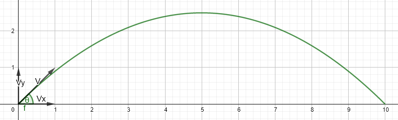
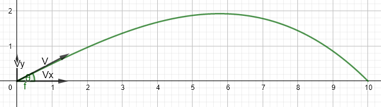

# {.tabset .tabset-fade}

```{r, echo=FALSE}
knitr::opts_chunk$set(echo = TRUE, message = FALSE, warning = FALSE)
```

```{r load_libraries, include=FALSE}
# Use this R-Chunk to load all your libraries!
pacman::p_load(tidyverse, pander)
theme_set(theme_bw())
```

```{r swd, eval=FALSE, echo=FALSE}
# this is set to not run during the knit process
# this sets the working directory to the file location
setwd(dirname(rstudioapi::getActiveDocumentContext()$path))
```
Ballistic Trajectory with Drag

*No Drag*

Firing Artillery is an interesting proposition. Hitting the target with as few
rounds as possible is very important. Each round fired comes at a cost. Besides
the monetary cost, each round draws unwanted attention from the enemy.
Therefore, each round needs to be carefully considered. Each target needs to
provide enough payoff to outweigh the cost and the calculations for each round
needs to be meticulous and timely in order to have as little adjustment as
possible and requiring subsequent rounds.

The initial physics behind firing artillery seems pretty straight forward.
Initial velocity at some angle: the initial velocity vector V



We analyze the components of that initial vector separately Vx and Vy.

$$V_{x} = Vcos\theta$$
$$V_{y} = Vsin\theta$$

If there were no drag on the round, Vx would remain constant and Vy would be
affected only by gravity. For this paper, $$x_{0} = y_{0} = t_{0} = x_{f} =
y_{f} = 0$$

$$\frac{\text{dx}}{\text{dt}} = \ Vcos\theta,\ \ x = Vtcos\theta,\ \
\frac{\text{dy}}{\text{dt}} = \ Vsin\theta - gt,\ \ y = Vtsin\theta -
\frac{1}{2}gt^{2}$$

So, for a given initial velocity, in order to hit the target, we need x to equal
the range (r) to the target at the same time y equals the height of the target
(zero in this case).

$$\frac{r}{\text{Vcosθ}} = t = \frac{2Vsin\theta}{g} \rightarrow r =
\frac{2V^{2}\text{sinθcosθ}}{g} = \frac{V^{2}sin2\theta}{g}$$

So, for a target at a given range and a round fired at a set velocity, we know
the angle that must be shot. $$\theta = \frac{1}{2}arcsin\left(
\frac{\text{rg}}{V^{2}} \right)$$

We also know the maximum height (H) of the round happens at half the range and
half the time.

$$If\ halftime = \frac{\text{Vsinθ}}{g}$$
, then 
$$H =\frac{V^{2}\sin^{2}\theta}{2g}$$

For example, to hit a target at 15km with an initial velocity of 671 m/s, the
initial angle needs to be .1664 radians, 9.54 degrees, or 169.7 mils. Time of
flight is 22.668. Max height is 629.87 m at 11.3339 seconds. Impact angle is
-169.7 mils. Impact velocity is 671 m/s.

This is all very predictable, but there is a great deal of drag so things
change.

*Drag*

If there is drag on the round, there are many variables that affect the velocity
of the round. Velocity in the x direction is no longer constant. I get these
formulas from Peter Chudinov from the journal of Physics[^1].

[^1]: https://iopscience.iop.org/article/10.1088/1742-6596/1287/1/012032

The drag constant $$k = \frac{\rho_{a}c_{d}S}{2mg} = \frac{1}{V_{t}^{2}}$$;

ρ*a* is the air density, *cd* is the drag factor for a sphere, *S* is the
cross-section area of the object, and *Vt* is the terminal velocity.

I will treat k as a constant even though ρ changes with altitude which may be
significant with artillery shots; in this case k could become a function. All
variables are functions of θ. Theta is the angle of trajectory that varies
throughout the flight.

Launch angle: $$\text{θϵ}\left\lbrack 0,\frac{\pi}{2} \right\rbrack$$ Impact
angle: $$- \text{θϵ}\left\lbrack 0,\frac{\pi}{2} \right\rbrack$$



Here are the functions I am going to use to predict artillery shots given and
initial velocity and launch angle.

These first two equations I can compute directly from θ.

1.  $$f\left( \theta \right) = \frac{\text{sinθ}}{\cos^{2}\theta} + ln\left(
    \tan\left( \frac{\theta}{2} + \frac{\pi}{4} \right) \right)$$

2.  $$V\left( \theta \right) = \frac{V_{0}\cos\theta_{0}}{\text{cosθ}\sqrt{1 +
    kV_{0}^{2}\cos^{2}\theta_{0}\left( f\left( \theta_{0} \right) - f\left(
    \theta \right) \right)}}$$

The following formulas I cannot compute directly but I can get a numerical
solution for each θ.

The velocity in the x and y directions is now based off of instantaneous
velocity and trajectory angle; not just initial velocity and launch angle.

1.  $$\frac{\text{dx}}{\text{dt}} = Vcos\theta,
    \frac{\text{dy}}{\text{dt}} = Vcos\theta,
    \frac{\text{dθ}}{\text{dt}} = \frac{- gcos\theta}{V},
    \frac{\text{dV}}{\text{dt}} = - gsin\theta - gkV^{2}$$

Now convert all these so they are in terms of θ:

1.  $$\frac{\text{dV}}{\text{dθ}} = Vtan\theta + \frac{kV^{3}}{\text{cosθ}},\ \
    \ \ \frac{\text{dx}}{\text{dθ}} = \frac{V^{2}}{- g},\ \ \ \
    \frac{\text{dy}}{\text{dθ}} = \frac{V^{2}}{- g}tan\theta,\ \ \ \
    \frac{\text{dt}}{\text{dθ}} = \frac{V}{- gcos\theta}$$

2.  $$x = \int_{\theta_{0}}^{\theta}{\frac{V^{2}}{- g}\text{dθ}},\ \ \ \ y =
    \int_{\theta_{0}}^{\theta}{\frac{V^{2}}{- g}\text{tanθ dθ}},\ \ \ \ t =
    \int_{\theta_{0}}^{\theta}{\frac{V}{- gcos\theta}\text{dθ}}$$

Once I have and instantaneous altitude, I can alter k for appropriate air
pressure.

*Attempt at prediction*

Actual shot data that I am trying to match: Initial velocity 682 m/s at an
initial angle of 0.4174391238457 radians (425.2 mils). My prediction needs
to hit a level target at 15000 m in 42.1 seconds while reaching a maximum
altitude of 2295 m. Also, impact angle of - 0.6695519342963 radians (-682
mils) with and impact velocity of 310 m/s.

```{r try}
V0 <- 682 # initial velocity in m/s for M795 with M232A1 4H
am0 <- 425.2 # QE in mils for a level 15000 m shot
th0 <- am0 * pi / 3200 # initial angle in radians
x0 <- 0 #Initial x
y0 <- 0 # initial y
t0 <- 0 # initial time
g <- 9.80665 # gravitational force in m/s/s
# All functions are in terms of angle of the trajectory
press <- data.frame(cbind(
  alt = c(0,200,500,1000,1500,2000,2500,3000,3500,
          4000,4500,5000,6000,7000,8000,9000),
  rho = c(1.2250,1.2133,1.1844,1.1392,1.0846,1.0320,
          .9569,.8632,.7768,.6971,.5895,.4664,.3612,.2655,.1937,.1413)))
c.press <- glm(rho~poly(alt,6,raw=TRUE), data = press)
rho <- as.numeric(predict(c.press, data.frame(alt = y0), type = "response"))
pk <- .00000155
k <- rho*pk # is the drag constant at 0 alt

#Lets build a table along the trajectory
ths <- seq(th0, -1, by = -.02)

f0 = sin(th0)/(cos(th0))^2 + log(tan(th0/2+pi/4))
allth <- th0
allf <- f0
allk <- k
allV <- V0
allt <- t0
allx <- x0
ally <- y0
allrho <- rho


for (th in ths) {
  allth <- c(allth,th)
  allk <- c(allk,k)
  f = sin(th)/(cos(th))^2 + log(tan(th/2+pi/4))
  allf <- c(allf,f)
  V = V0*cos(th0)/(cos(th)*sqrt(1+k*(V0*cos(th0))^2*(f0-f)))
  allV <- c(allV,V)
  tint <- integrate(function(j) {V0*cos(th0)/((cos(j))^2*sqrt(1+k*(V0*cos(th0))^2*(f0-f)))},th0,th)
  t <- t0 - 1/g*as.numeric(tint[1])
  allt <- c(allt,t)
  xint <- integrate(function(j) {(V0*cos(th0)/(cos(j)*sqrt(1+k*(V0*cos(th0))^2*(f0-f))))^2},th0,th)
  x <- x0 - 1/g*as.numeric(xint[1])
  allx <- c(allx,x)
  yint <- integrate(function(j) {tan(j)*(V0*cos(th0)/(cos(j)*sqrt(1+k*(V0*cos(th0))^2*(f0-f))))^2},th0,th)
  y <- y0 - 1/g*as.numeric(yint[1])
  ally <- c(ally,y)
  rho <- as.numeric(predict(c.press, data.frame(alt = y), type = "response"))
  allrho <- c(allrho,rho)
  k <- pk * rho
}
traj <- data.frame(cbind(allth,allk,allf,allV,allt,allx,ally,allrho))
trajp <- traj[2:nrow(traj),]%>%filter(ally>=-200)
trajp %>% ggplot(aes(allx,ally))+geom_point()+
    coord_fixed(ratio = 1)
colnames(trajp) <- c("theta","k","f","V m/s","t s","x m","y m","pressure")
pander(trajp)

```

