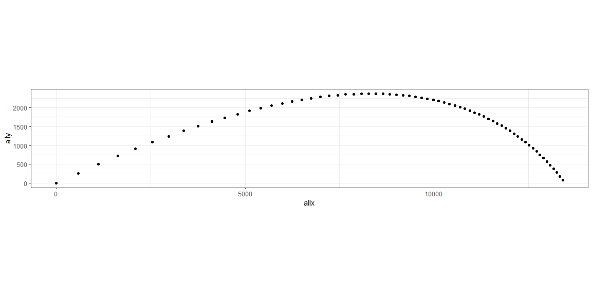

# {.tabset .tabset-fade}


https://www.scielo.br/scielo.php?script=sci_arttext&pid=S1806-11172018000100408#eq12


```r
V0 <- 671 # initial velocity in m/s for M795 with M232A1 3H
am0 <- 442.1 # QE in mils for a level 9000 m shot
th0 <- am0 * pi / 3200 # initial angle in radians
amt <- -697 # terminal angle in mils
tht <- amt * pi / 3200 #Terminal angle in radians
x0 <- 0 #Initial x
y0 <- 0 # initial y
t0 <- 0 # initial time
g <- 9.80665 # gravitational force in m/s/s
# All functions are in terms of angle of the trajectory

k <- .00000225 # is the drag constant

#Lets build a table along the trajectory

TOF <- 43 #time of flight
ths <- seq(th0, tht*.9, by = ((tht - th0)/(TOF*2)))

f0 = sin(th0)/(cos(th0))^2 + log(tan(th0/2+pi/4))
allf <- NA
allV <- NA
allx <- NA
ally <- NA
allt <- NA


for (th in ths) {
  f = sin(th)/(cos(th))^2 + log(tan(th/2+pi/4))
  allf <- c(allf,f)
  V = V0*cos(th0)/(cos(th)*sqrt(1+k*(V0*cos(th0))^2*(f0-f)))
  allV <- c(allV,V)
  xint <- integrate(function(x) 
    {(V0*cos(th0)/(cos(x)*sqrt(1+k*(V0*cos(th0))^2*(f0-f))))^2},th0,th)
  x <- x0 - 1/g*as.numeric(xint[1])
  allx <- c(allx,x)
  yint <- integrate(function(x) 
    {tan(x)*(V0*cos(th0)/(cos(x)*sqrt(1+k*(V0*cos(th0))^2*(f0-f))))^2},th0,th)
  y <- y0 - 1/g*as.numeric(yint[1])
  ally <- c(ally,y)
  tint <- integrate(function(x) 
    {V0*cos(th0)/((cos(x))^2*sqrt(1+k*(V0*cos(th0))^2*(f0-f)))},th0,th)
  t <- t0 - 1/g*as.numeric(tint[1])
  allt <- c(allt,t)
}
traj <- data.frame(cbind(allf,allV,allt,allx,ally))
trajp <- traj[2:nrow(traj),]%>%filter(ally>=0)
trajp %>% ggplot(aes(allx,ally)) + geom_point() +
    coord_fixed(ratio = 1)
```

<!-- -->

```r
traj
```

```
##            allf     allV       allt       allx        ally
## 1            NA       NA         NA         NA          NA
## 2   0.959215209 671.0000  0.0000000     0.0000     0.00000
## 3   0.924701171 657.6395  0.9611205   576.8719   262.85556
## 4   0.890784881 645.0804  1.8853720  1116.3734   500.01911
## 5   0.857435797 633.2527  2.7758139  1622.4223   714.22573
## 6   0.824624791 622.0952  3.6351569  2098.3993   907.83162
## 7   0.792324053 611.5535  4.4658137  2547.2380  1082.87709
## 8   0.760507004 601.5795  5.2699409  2971.4962  1241.13732
## 9   0.729148208 592.1303  6.0494745  3373.4146  1384.16367
## 10  0.698223294 583.1678  6.8061587  3754.9647  1513.31753
## 11  0.667708891 574.6573  7.5415706  4117.8878  1629.79810
## 12  0.637582550 566.5681  8.2571410  4463.7282  1734.66554
## 13  0.607822689 558.8723  8.9541722  4793.8601  1828.86017
## 14  0.578408529 551.5444  9.6338530  5109.5107  1913.21866
## 15  0.549320038 544.5617 10.2972717  5411.7791  1988.48756
## 16  0.520537882 537.9031 10.9454272  5701.6530  2055.33481
## 17  0.492043372 531.5498 11.5792388  5980.0223  2114.35956
## 18  0.463818419 525.4842 12.1995547  6247.6910  2166.10044
## 19  0.435845491 519.6904 12.8071591  6505.3873  2211.04280
## 20  0.408107568 514.1537 13.4027790  6753.7723  2249.62480
## 21  0.380588106 508.8608 13.9870893  6993.4478  2282.24274
## 22  0.353270997 503.7992 14.5607183  7224.9626  2309.25568
## 23  0.326140536 498.9574 15.1242519  7448.8181  2330.98944
## 24  0.299181382 494.3249 15.6782375  7665.4735  2347.74008
## 25  0.272378530 489.8918 16.2231874  7875.3501  2359.77696
## 26  0.245717278 485.6492 16.7595821  8078.8351  2367.34542
## 27  0.219183195 481.5885 17.2878729  8276.2848  2370.66915
## 28  0.192762093 477.7019 17.8084843  8468.0277  2369.95220
## 29  0.166440000 473.9822 18.3218165  8654.3672  2365.38092
## 30  0.140203130 470.4225 18.8282473  8835.5837  2357.12548
## 31  0.114037860 467.0166 19.3281337  9011.9369  2345.34138
## 32  0.087930699 463.7584 19.8218137  9183.6675  2330.17070
## 33  0.061868264 460.6426 20.3096079  9350.9987  2311.74328
## 34  0.035837260 457.6639 20.7918207  9514.1381  2290.17766
## 35  0.009824445 454.8175 21.2687415  9673.2785  2265.58209
## 36 -0.016183385 452.0989 21.7406459  9828.5996  2238.05529
## 37 -0.042199426 449.5038 22.2077965  9980.2684  2207.68717
## 38 -0.068236891 447.0284 22.6704443 10128.4409  2174.55954
## 39 -0.094309029 444.6688 23.1288291 10273.2624  2138.74665
## 40 -0.120429159 442.4217 23.5831804 10414.8685  2100.31576
## 41 -0.146610684 440.2836 24.0337182 10553.3857  2059.32759
## 42 -0.172867125 438.2516 24.4806537 10688.9323  2015.83678
## 43 -0.199212145 436.3228 24.9241897 10821.6185  1969.89225
## 44 -0.225659572 434.4945 25.3645214 10951.5474  1921.53758
## 45 -0.252223428 432.7641 25.8018366 11078.8151  1870.81132
## 46 -0.278917957 431.1293 26.2363167 11203.5116  1817.74725
## 47 -0.305757654 429.5878 26.6681365 11325.7204  1762.37468
## 48 -0.332757293 428.1375 27.0974651 11445.5197  1704.71868
## 49 -0.359931958 426.7765 27.5244662 11562.9822  1644.80024
## 50 -0.387297075 425.5029 27.9492982 11678.1755  1582.63654
## 51 -0.414868445 424.3151 28.3721148 11791.1626  1518.24105
## 52 -0.442662279 423.2113 28.7930652 11902.0017  1451.62372
## 53 -0.470695235 422.1902 29.2122944 12010.7466  1382.79113
## 54 -0.498984452 421.2502 29.6299434 12117.4471  1311.74657
## 55 -0.527547596 420.3902 30.0461495 12222.1491  1238.49020
## 56 -0.556402898 419.6088 30.4610467 12324.8943  1163.01912
## 57 -0.585569201 418.9050 30.8747655 12425.7210  1085.32745
## 58 -0.615066004 418.2777 31.2874337 12524.6638  1005.40644
## 59 -0.644913517 417.7259 31.6991758 12621.7538   923.24449
## 60 -0.675132710 417.2488 32.1101139 12717.0188   838.82727
## 61 -0.705745372 416.8456 32.5203675 12810.4832   752.13769
## 62 -0.736774171 416.5154 32.9300537 12902.1682   663.15604
## 63 -0.768242716 416.2577 33.3392875 12992.0918   571.85993
## 64 -0.800175631 416.0718 33.7481815 13080.2689   478.22437
## 65 -0.832598624 415.9572 34.1568466 13166.7111   382.22180
## 66 -0.865538568 415.9134 34.5653916 13251.4272   283.82206
## 67 -0.899023587 415.9400 34.9739236 13334.4227   182.99247
## 68 -0.933083144 416.0366 35.3825479 13415.7001    79.69775
## 69 -0.967748142 416.2029 35.7913683 13495.2588   -26.09990
## 70 -1.003051031 416.4387 36.2004870 13573.0949  -134.44085
## 71 -1.039025915 416.7437 36.6100046 13649.2018  -245.36802
## 72 -1.075708685 417.1178 37.0200205 13723.5692  -358.92691
## 73 -1.113137145 417.5609 37.4306324 13796.1839  -475.16560
## 74 -1.151351157 418.0730 37.8419368 13867.0293  -594.13477
## 75 -1.190392802 418.6539 38.2540287 13936.0855  -715.88774
## 76 -1.230306545 419.3039 38.6670021 14003.3291  -840.48045
## 77 -1.271139421 420.0229 39.0809492 14068.7330  -967.97151
## 78 -1.312941234 420.8111 39.4959611 14132.2669 -1098.42221
## 79 -1.355764780 421.6687 39.9121276 14193.8962 -1231.89657
## 80 -1.399666079 422.5959 40.3295369 14253.5830 -1368.46133
## 81 -1.444704639 423.5929 40.7482759 14311.2850 -1508.18601
## 82 -1.490943741 424.6600 41.1684299 14366.9560 -1651.14291
```

