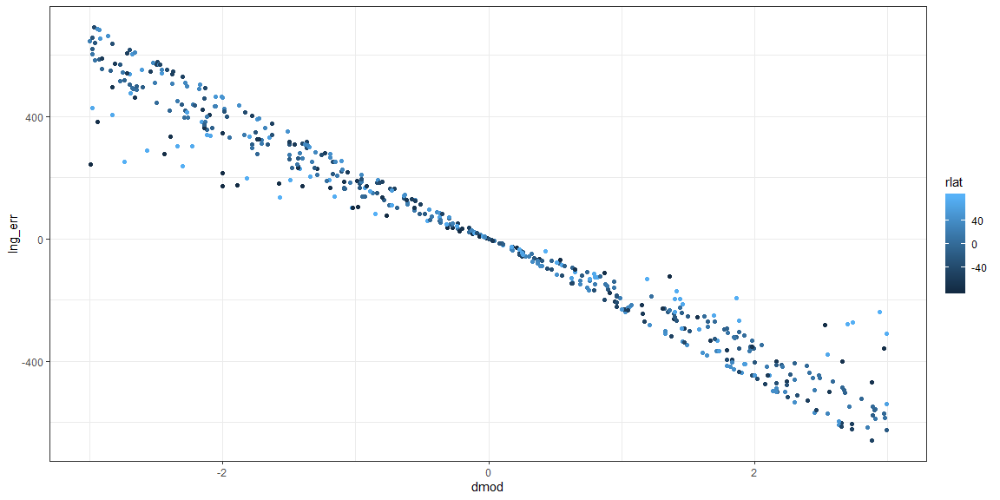
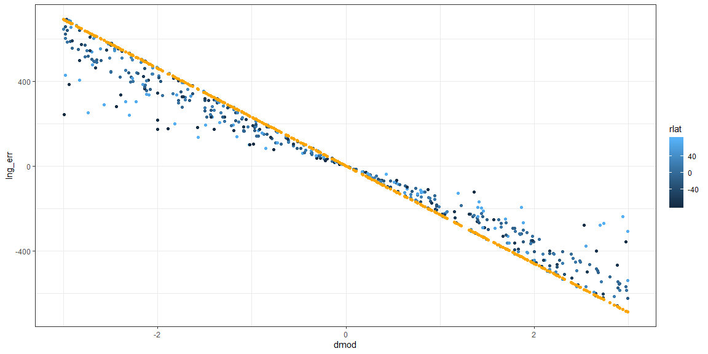
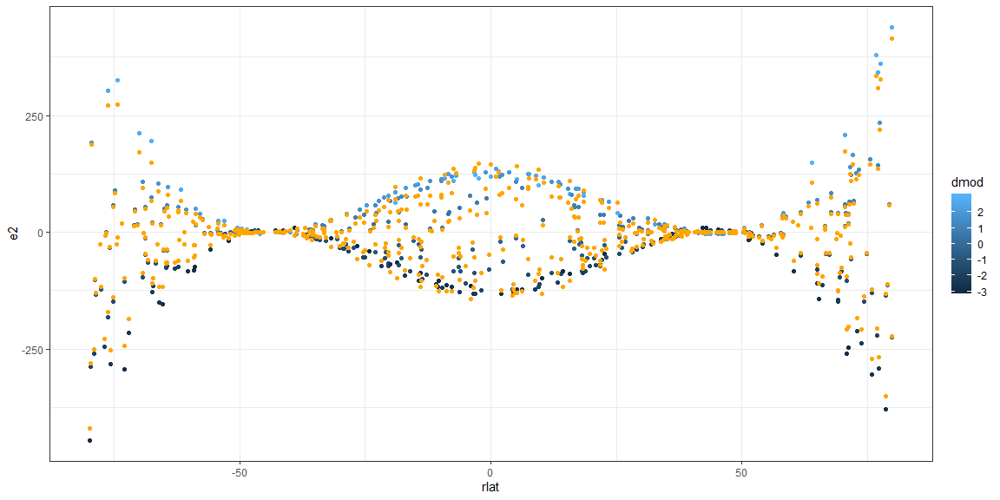
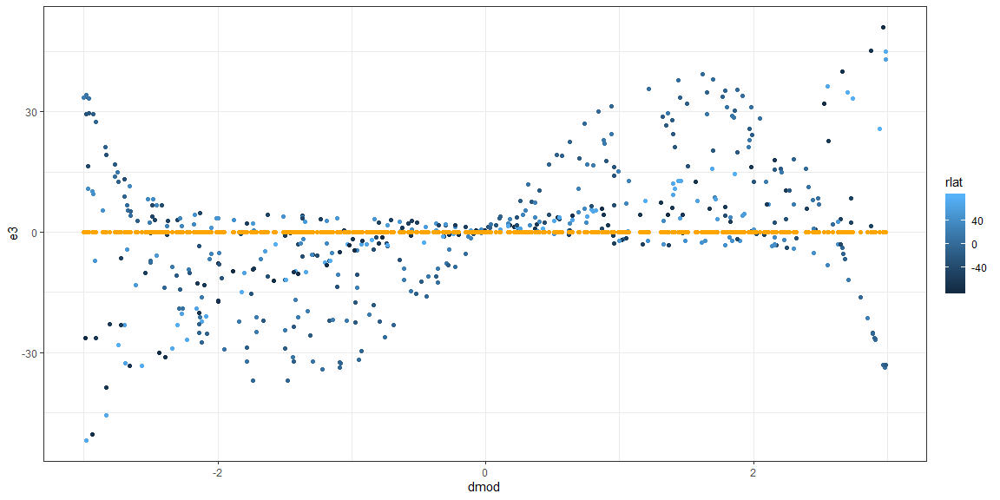
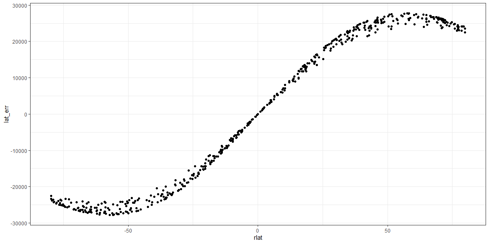
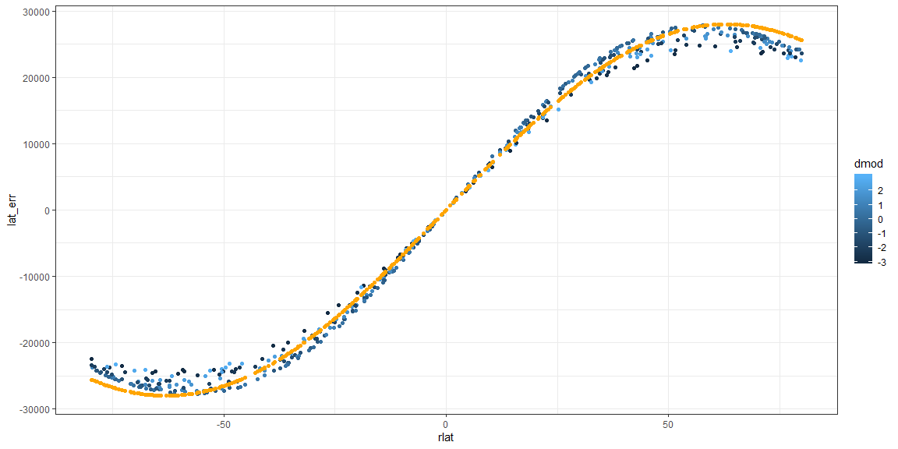
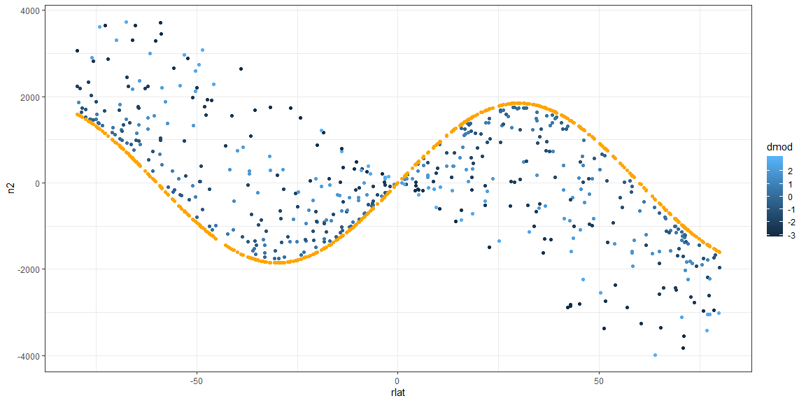
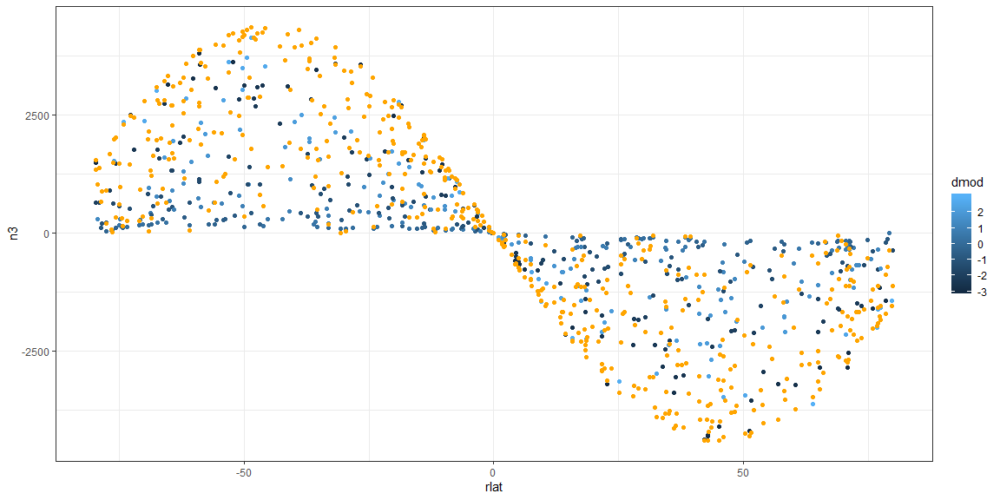

# {.tabset .tabset-fade}


### What if I assume the earth is a perfent spheroid?

## Premise

Then I should not be able to convert Longitude and Latitude coordinates to MGRS with any type of accuracy. The geologic science people tell me this cannot be done.

Challenge accepted.

## Dataset

Here is my initial dataset of random points around the globe. THese are true UTM and MGRS coordinates associated with each latitude and longitude.

My task is to regenerate these same UTM and MGRS coordinates by ignoring the facts of Datums, Shereoids, geodesics, and other projections.

I am going to assume that the earth is a perfect Spheroid.

* Equator Circumference: 40008000 meters
* Polar Circumference:   40075000 meters


```r
rlng <- (sample.int(36000,size=500,replace=TRUE)-1)/100-180
rlat <- (sample.int(16000,size=500,replace=TRUE)-1)/100-80
samplell <- data.frame(cbind(rlng,rlat))

samplell$UTME <- NA
samplell$UTMN <- NA
samplell$z <- NA
samplell$h <- NA
samplell$mgrs <- NA

for (i in 1:nrow(samplell)){
  samplell$mgrs[i] <- latlng_to_mgrs(samplell[i,2],samplell[i,1])
  samplell$UTME[i] <- as.matrix(mgrs_to_utm(samplell[i,7]))[4]
  samplell$UTMN[i] <- as.matrix(mgrs_to_utm(samplell[i,7]))[5]
  samplell$z[i] <- as.matrix(mgrs_to_utm(samplell[i,7]))[2]
  samplell$h[i] <- as.matrix(mgrs_to_utm(samplell[i,7]))[3]
}

datatable(samplell)
```

<!--html_preserve--><div id="htmlwidget-e34e47d4396264b41804" style="width:100%;height:auto;" class="datatables html-widget"></div>
<script type="application/json" data-for="htmlwidget-e34e47d4396264b41804">{"x":{"filter":"none","data":[["1","2","3","4","5","6","7","8","9","10","11","12","13","14","15","16","17","18","19","20","21","22","23","24","25","26","27","28","29","30","31","32","33","34","35","36","37","38","39","40","41","42","43","44","45","46","47","48","49","50","51","52","53","54","55","56","57","58","59","60","61","62","63","64","65","66","67","68","69","70","71","72","73","74","75","76","77","78","79","80","81","82","83","84","85","86","87","88","89","90","91","92","93","94","95","96","97","98","99","100","101","102","103","104","105","106","107","108","109","110","111","112","113","114","115","116","117","118","119","120","121","122","123","124","125","126","127","128","129","130","131","132","133","134","135","136","137","138","139","140","141","142","143","144","145","146","147","148","149","150","151","152","153","154","155","156","157","158","159","160","161","162","163","164","165","166","167","168","169","170","171","172","173","174","175","176","177","178","179","180","181","182","183","184","185","186","187","188","189","190","191","192","193","194","195","196","197","198","199","200","201","202","203","204","205","206","207","208","209","210","211","212","213","214","215","216","217","218","219","220","221","222","223","224","225","226","227","228","229","230","231","232","233","234","235","236","237","238","239","240","241","242","243","244","245","246","247","248","249","250","251","252","253","254","255","256","257","258","259","260","261","262","263","264","265","266","267","268","269","270","271","272","273","274","275","276","277","278","279","280","281","282","283","284","285","286","287","288","289","290","291","292","293","294","295","296","297","298","299","300","301","302","303","304","305","306","307","308","309","310","311","312","313","314","315","316","317","318","319","320","321","322","323","324","325","326","327","328","329","330","331","332","333","334","335","336","337","338","339","340","341","342","343","344","345","346","347","348","349","350","351","352","353","354","355","356","357","358","359","360","361","362","363","364","365","366","367","368","369","370","371","372","373","374","375","376","377","378","379","380","381","382","383","384","385","386","387","388","389","390","391","392","393","394","395","396","397","398","399","400","401","402","403","404","405","406","407","408","409","410","411","412","413","414","415","416","417","418","419","420","421","422","423","424","425","426","427","428","429","430","431","432","433","434","435","436","437","438","439","440","441","442","443","444","445","446","447","448","449","450","451","452","453","454","455","456","457","458","459","460","461","462","463","464","465","466","467","468","469","470","471","472","473","474","475","476","477","478","479","480","481","482","483","484","485","486","487","488","489","490","491","492","493","494","495","496","497","498","499","500"],[-61.6,131.02,35.89,-161.7,-68.12,-113.7,-110.26,-85.33,-41.16,-29.74,44.77,-9.84,110.48,17.66,-159.55,-27.23,-16.37,51.76,145.54,-68.79,74.36,-31.16,-108.51,-90.84,-5.65000000000001,64.44,69.23,119.7,114.71,-163.68,123.9,26.01,131.56,-86.89,46.5,-60.35,-167.26,-161.74,-110.24,174.02,96.51,-109.21,24.88,145.29,47.14,158.44,155.45,102.9,72.49,21.38,82.96,-33.06,-63.48,18.07,-41.31,136.71,109.22,37.91,117.62,38.29,-105.37,14.54,-129.15,147.24,-141.07,163.58,51.11,-23.68,-20.05,-179.44,123.53,-36.26,52.03,-108.01,41.2,52.61,-52.23,-95.3,85.57,-55.63,102.5,-18.83,-129.04,115.71,143.08,-19.94,55.58,-157.65,-161.57,37.29,84.54,-95.12,134.31,90.28,-3.63999999999999,176.97,-94.5,-119.14,-154.2,-77.13,174.95,-51.63,164.64,-62.72,47.3,49.63,155.24,166.7,134.71,-31.14,-54.2,34.93,-19.31,21.26,-150.09,-150.12,-68.66,4.65000000000001,88.39,50.21,63.23,69.18,175.78,165.99,134.03,111.47,45.94,-106.74,-169.78,-69.44,169.01,-179.72,71.98,-39.39,18.63,154.47,-136.4,174.34,170.16,-43.17,-47.98,-51.61,-75.23,89.05,145.16,159.54,175.97,-115.67,4.56999999999999,21.88,22.41,70.79,55.65,57.82,103.83,-111.83,146.8,-13.02,165.63,162.83,-34.11,152.63,103.81,66.62,142.4,-18.45,146.23,-107.27,-53.69,144.51,-130.06,-92.9,72.25,104.45,68.04,46.92,-115.35,-174.52,-88.34,48.92,-31.08,84.16,174.78,160.9,-28.37,-173.09,55.91,-162.84,-173.4,45.37,-101.92,130.62,76.51,-146.61,84.39,140.88,22.07,-108.84,26.25,-178.43,-8.68000000000001,36.04,-40.37,-147.22,-53.14,-63.73,-73.01,41.53,107.73,89.94,155.24,-155.52,120.99,59.44,-172.5,24.33,-98.21,75.55,61.57,152.63,70.84,129.96,-143.18,31.83,1.31999999999999,-137.5,52.97,44.04,151.27,-149.99,-13.61,-29.14,-43.64,-27.74,-33.15,-73.12,145.64,-65.5,-176.38,-30.89,-119.93,112.98,116.76,-132.84,-153.61,-140.77,-26.45,6.03,-7.12,-105.87,-126.37,58.15,-48.7,150.35,65.46,116.15,-33.3,-164.09,35.21,-95.97,-124.82,-8.11000000000001,80.49,-61.12,164.07,-138.01,-122.63,82.45,-29.23,100.88,117.87,80.73,61.35,-67.36,-40.09,-142.88,169,100.02,-54.59,-97.14,-18.03,-82.48,168.72,-98.98,-68.75,90.3,5.91,-178.44,-146.67,47.9,-20.26,-152.31,79.27,-41.34,-45.02,-172.66,-157.03,168.19,15.94,-136.15,-1.94999999999999,-2.43000000000001,108.23,63.63,32.99,54.32,136.21,-28.74,76.73,-53.21,51.44,-17.05,0.22999999999999,-30.03,-33.95,-165.82,37.37,-64.74,-11.94,-109.17,156.52,-134.49,37.84,86.72,26.89,91.71,7.03,-143.6,-51.27,-52.19,-166.63,61.7,-89.47,31.81,-125.39,153.65,-22.04,48.14,-62,22.45,-113.13,159.51,133.98,131.25,-161.96,52.85,-170.21,-109.18,-96.27,45.17,-108,-38.7,-148.1,11.16,145.6,167.39,178.46,174.7,-156.7,-74.31,178.58,-126.15,-129.8,-60.41,-113.15,-96.35,58.46,-141.35,-65.94,-9.80000000000001,-2.25,161.32,124.16,143.63,70.98,15.18,148.41,-87,-77.91,72.17,-115.21,-23.38,142.44,20.04,119,-177.58,-82.78,64.8,81.8,111.63,60.72,37,16.05,91.25,-114.77,-128.57,-11,-12.11,45.47,-59.83,-81.98,141.25,87.04,132.94,114.73,50.64,43.5,135.65,98.44,51.8,-111.11,-42.55,-73.51,-89.54,138.17,-166.5,163.92,57.87,-130.14,-79.69,124.36,-47.42,39.4,-26.97,-132.32,13.74,108.02,91.11,-48.6,88.72,114.66,29.55,-88.78,93.03,-165.73,-166.31,155,-14.04,170.7,146.69,-111.93,-158.6,-21.03,59.71,73.6,-106.51,-113.46,-85.53,-141.43,133.81,-24.84,-98.16,-115.67,97.62,-58.33,79.01,-130.11,-122.04,61.26,-15.62,118.7,-50.92,-147.03,53.88,172.79,-98.74,-61.83,-153.89,-30.73,-135.92,-93.13,157,113.67,-86.04,12.34,26.03,46.77,16.4,-144.34,35.99,-152.3,151.51,127.05,-16.57,56.68,82.19,42.88,-113.98,-52.58,144.86,-101.91,-100.83,-84.91,59.1,-52.8,-44.83,105.37,-123.45,-111.73,-123.09],[72.69,-36.92,-13.95,-7.69,-68.71,60.39,34.59,-62.13,65.97,78.54,57.64,-35.53,-13.89,-3.2,41.88,1.93000000000001,-34.02,21.76,-59.05,-73.49,-30.49,13.77,8.98,36.65,6.19,73.19,-28.21,76.98,4.53,-16.68,-22.81,-64.5,-61.6,66.44,-13.99,-50.37,8.75,-8.87,67.7,-26.67,-41.29,46.35,69.18,18.14,42.76,16.58,43.01,-62.91,21.7,-67.38,18.56,28.66,-18.39,-14.01,-17.15,31.32,-53.17,-7.34,-45.25,-51.85,64.94,74.84,4.94,-70.28,-76.62,69.44,-9.70999999999999,5.15000000000001,-58.65,-75.74,-8.26000000000001,77.56,45.88,63.99,-16.97,47.6,-52.86,-47.68,-12.82,-49.18,4.48,-39.93,68.91,12.15,-50.8,60.12,25.55,-18.4,75.94,20.9,54.01,-3.18000000000001,-6.45999999999999,-52.24,56.36,39.42,19.69,-30.06,69.83,13.37,52.12,41.03,6.41,29.62,-8.44,-49.26,-58.79,2.25,15.67,-12.17,-3.16,58.26,71.48,-17,15.67,-48.62,-23.35,-9.76000000000001,-64.51,-14.01,71.22,-70.99,7.39,25.83,-22.96,-33.22,16.52,53.43,6.28,-3.69,30.32,-60.34,9.45999999999999,40.66,-48.17,-62.24,22.13,-66.03,-20.97,-57.27,-18.6,26.87,-57.08,7.42,18.76,-75.12,78.6,48.23,-69.21,16.75,-22.9,-60.65,55.78,71.32,-32.82,48.76,-68.68,7.38,-6.23,43.73,-27.33,50.71,55.31,27.95,-20.09,70.53,-78.71,32.28,65.3,-46.38,-60.95,-12.02,15.72,-54.23,35.55,58.14,15.36,7.63,70.93,-10.52,3.56,-10.38,21.72,48.69,47.5,69.04,-68.29,45.25,-3.44,-65.68,51.28,1.70999999999999,-26.06,42.11,56.93,-74.35,28.32,41.3,2.37,-69.35,10.41,-24.19,-46.9,-77.74,-6.17,-35.3,-14.96,-76.15,-53.06,79.8,-28.59,36.43,47.67,13.49,-16.12,4.88,72.14,-35.76,-20.34,-14.26,43.45,-26.92,35.17,-21.09,32,-50.07,16.91,26.12,-64.42,-79.77,-17.8,-67.44,-79.49,-37.39,-49.95,72.06,37.69,2,61.09,58.31,42.85,-36.98,68.78,-31.8,22.66,-35.47,70.74,42.15,-1.01000000000001,18.14,46.04,-65.04,43.66,-10.87,-50.36,78.91,-55.88,-64.14,17.42,-38.97,76.92,17.54,-55.59,-41.9,-6.33,76.74,25.57,-12.63,72.87,-21.2,-40.89,-74.48,61.73,45.51,-3.2,42.95,48.29,-54.48,10.48,77.45,-2.38,-5.05,-14.31,-29.74,66.6,-35.55,5.2,14.06,39.14,-7.37,-2.76000000000001,27.46,39,73.77,-69.08,-20.46,-14.46,-58.86,-4.13,35.27,33.44,-11.27,4.34,38.34,-76.51,51.52,46.05,-64.63,58.7,-21.74,-36.12,29.06,-20.03,-74.25,-0.379999999999995,-38.66,-29.36,-1.97,42.92,34.51,38.08,71.26,75.92,-15.37,29.05,-66.68,-25.46,-13.73,25.58,37.05,-48.93,34.65,-47.32,45.3,-72.09,69.12,19.18,45.23,50.22,61.76,-42.89,46.13,-78.54,-38.47,10.28,13.64,-33.15,41.11,-49.55,31.2,22.65,26.22,30.33,-64.32,-36.4,0.969999999999999,41.21,77.26,22.14,34.29,64.91,25.18,-68.68,1.59,-62.17,-45.91,71.72,-46.84,-72.87,-48.63,37.93,-31.99,-59.31,50.44,-66.09,30.05,75.59,-30.75,-59.14,71.13,-34.94,-51.02,5.04000000000001,-28.88,53.89,-53.75,-13.61,12.1,70.57,-42.38,34.45,-76.95,-56.13,-24.98,35.13,79.31,-79.71,-0.0100000000000051,-8.40000000000001,-65.34,-77.63,-46.21,17.35,28.1,64.97,17.96,-29.12,-70.83,-66.34,22.45,69.7,21.7,44.96,-55.79,-31.81,-58.99,-6.09,-74.82,20.64,-67.56,16.02,-36.6,37.01,-11.81,-9.17,-34.66,14.43,-78.99,-54.21,63.23,18.34,32.61,9.76000000000001,-61.05,58.1,-18.34,-24.78,-25.2,51.44,-75.79,66.74,-20.4,38.35,18.56,-75.14,46.04,33.82,-40.77,17.63,-72.89,-18.96,-0.900000000000006,38.6,36.82,22.95,-28.35,51.92,-33.52,-64.54,-62.07,-22.24,-24.06,31.93,-67.63,-7.72,63.84,-51,67.4,-20.39,-65.18,31.33,-67.13,-6.83,-50.4,36.18,-17.82,-9.79000000000001,67.82,-70,-19.08,-18.31,74.23,9.44,79.9,71.46,77.03,18.4,70.84,-76.26,-9.7,-3.97,-37.38,23.51,-57.85,64.9,70.47,34.55,58.24,71.63,-33.22],["546490","679930","812278","202134","535657","351204","567861","587090","401865","439248","486268","423845","443817","795639","454364","474421","373508","578580","416245","506661","438578","698929","773783","693078","206726","546478","522570","567880","245903","640751","592364","452445","635815","504906","662009","688443","251364","198618","532181","203400","291499","637726","415920","319096","675108","440259","699667","393316","240313","516309","706858","494136","449298","183478","254257","662710","381018","379690","548652","451095","482512","486572","483370","509038","498191","444349","512066","202871","555131","432927","558368","565867","579927","646258","734260","621022","417189","327376","344803","599842","222569","685427","498393","359639","646572","558908","357343","642599","430326","322143","338802","264404","423702","314288","460456","497417","342773","293702","453824","269319","359650","447039","460189","527107","753244","400318","629460","689050","468921","702382","811223","613243","559906","527675","811966","712237","534753","680987","566741","414688","508264","506543","365354","599222","400560","543796","600311","384396","634956","451139","308668","349872","827259","467032","323795","576383","355612","379442","412680","610354","185499","439408","486057","726263","306037","515478","477273","598769","562185","593796","644615","597868","415328","529311","390478","439000","491885","718553","569693","325233","390190","473875","424467","265846","646375","594836","483171","286216","374602","308520","442580","510885","205269","464146","412987","613037","677108","773617","451140","272366","713278","188997","270360","639827","396821","416577","455005","669498","233340","517003","296359","680209","651051","532243","341172","496386","604896","680838","416612","443723","535025","199289","395651","494784","263187","433629","714017","567586","682938","558097","719061","274096","349112","764139","339593","203859","527041","549720","350726","460088","648877","595316","301467","378470","341304","321102","709827","404020","416662","440743","647325","408394","527691","434495","489238","564623","380091","221892","533437","623628","260592","676228","490305","704486","437329","520867","520247","254599","709202","407969","703497","554146","685452","210281","674971","481748","481231","544286","734757","242689","454028","594462","467856","655943","397136","576526","537162","657484","426702","695150","573290","491935","412820","628104","378890","346638","351650","566087","763801","545110","830351","335929","254057","501933","511079","255250","822623","344519","528518","820182","582250","568178","350191","427015","499203","326846","712348","337934","604333","395404","597599","562212","192527","555056","499739","314070","593608","416822","600248","271427","539596","300422","210211","589952","394286","428655","341780","306465","260046","667990","282482","518287","468500","469950","489291","443017","301929","218813","472883","394185","380612","380866","313345","406700","417985","525854","390653","275492","571338","576539","326074","539397","477377","696288","175742","700121","573674","652813","697459","516195","191668","529967","394257","604424","374457","765986","622399","443393","737220","563503","574752","787248","467540","788190","388031","705525","551107","473311","403380","441054","565911","719186","566042","686746","589536","517351","539165","5e+05","333526","397877","663468","333078","659637","406385","631436","461754","307428","695903","529700","551863","290543","449596","565264","323361","703186","508904","460123","821722","551742","368280","476565","519284","504249","297618","392852","461880","354060","523821","474922","582315","495740","753476","617516","340747","232092","413801","380489","525428","381233","555799","645505","283536","535585","503268","794533","384546","178667","459711","656511","586428","252705","739286","304748","501620","456971","361578","702204","596718","479148","491505","459018","541735","497378","786054","459925","383161","272319","624060","454384","460924","727436","593462","615814","376920","363640","304952","423663","589151","416547","467600","675197","508133","497164","622281","697419","512789","582097","461833","736910","456909","487632","413273","795114","568227","260780","397205","694136","558976","601507","814659","573974","454803","285893","469266","488643","529812","276041","390878","458113","265201","176823","337980","713405","624635","414809","506342","533946","473579","474322","491613"],["8066441","5912096","8455903","9149033","2377718","6697894","3827825","3110215","7318255","8720058","6388654","6067854","8464377","9645916","4636599","213325","6234780","2406455","3453465","1844846","6626742","1523050","993570","4058219","684939","8122234","6879513","8546099","501112","8155378","7477231","2846896","3167709","7368959","8452866","4416872","967959","9018408","7509615","7046650","5426058","5134493","7675887","2006515","4736384","1833176","4764838","3022697","2401725","2526207","2053270","3170318","7966598","8449207","8102389","3466329","4107338","9188518","4989090","4255406","7201818","8305807","546033","2202883","1495630","7704071","8926648","569869","3498529","1592441","9086919","8610804","5081230","7099330","8122450","5273099","4142594","4716702","8582339","4551630","495657","5577757","7644327","1343473","4370353","6665247","2826613","7965028","8430006","2312027","5987434","9648268","9285893","4208781","6246331","4363386","2177870","6672635","7747369","1479045","5776367","4542278","708541","3276712","9066312","4542737","3481166","248804","1732454","8653955","9650302","6459279","7931770","8120426","1734574","4610781","7417693","8920680","2845422","8451025","7901949","2123708","817046","2857231","7460579","6324224","1826690","5921516","694313","9592126","3355922","3307625","1047108","4501088","4662088","3098215","2447880","2674188","7680943","3651075","7940820","2972182","3673685","820701","2075274","1662933","8725531","5342719","2321425","1852106","7466857","3274863","6182419","7913285","6368061","5401108","2381305","816242","9311329","4844173","6976524","5617641","6129933","3093943","7777944","7826969","1262281","3573734","7244564","4860717","3242317","8671232","1739881","3990748","3934462","6445905","1698819","844180","7870129","8836338","393714","8851183","2403482","5394737","5261639","7660243","2424405","5012992","9619436","2715707","5685012","189082","7116796","4662063","6312626","1748910","3133115","4574311","261980","2305953","1150761","7321552","4805037","1370636","9317527","6093442","8345138","1546627","4117570","8860730","6835387","4034594","5281580","1492636","8217207","539987","8004725","6042531","7750245","8423486","4812432","7022063","3894071","7667445","3541668","4450592","1870648","2889327","2855047","1142563","8031395","2517988","1175013","5861605","4466917","7996633","4172290","221272","6772970","6465161","4748322","5905514","7629850","6479700","2506011","6074809","7848491","4670701","9888304","2005892","5101854","2786594","4836681","8797130","4418448","8760062","3807235","2887068","1927374","5682356","8538557","1939515","3839432","5359617","9300224","8519703","2828117","8603344","8087341","7654559","5473089","1734391","6845208","5040915","9646235","4756977","5350466","3962592","1159493","8597705","9736581","9441622","8416778","6710024","7386812","6062606","575515","1554836","4332364","9184308","9694909","3037575","4318200","8187809","2336717","7736736","8400487","3472134","9543441","3903591","3700559","8754105","480272","4243727","1507905","5711058","5100314","2831638","6507940","7594317","6002652","3216367","7782798","1757826","9957992","5720633","6751024","9782153","4756125","3820226","4217595","7906471","8426568","8300730","3213530","2603702","7182651","8480619","2829200","4101081","4579045","3834999","4756315","5016966","1999400","7667879","2121070","5012480","5563570","6848297","5249199","5108617","1281167","5739637","1137866","1508674","6331806","4552564","4507819","3451779","2507886","2900082","3355865","2865552","5970773","107308","4563097","8576895","2450118","3794526","7199357","2787920","2381107","175924","3105023","4912537","7958319","4812556","1911652","4613365","4198313","6458321","3424853","5590859","2668643","3324339","8389903","6598103","3440728","7894282","6132147","4345255","557262","6804930","5973136","4044136","8494701","1338256","7829635","5307839","3814411","1457949","3778955","7236127","3889735","8804605","1150097","9998893","9071450","2750695","1382726","4882589","1918274","3109994","7207034","1985797","6777789","2141435","2642079","2482856","7732422","2401626","4979586","3814372","6477134","3460094","9326727","1696289","2282722","2505600","1771624","5946772","4096056","8694455","8985254","6163938","1597366","1230489","3990453","7012373","2029392","3610923","1079391","3231643","6440076","7971699","7257932","7212561","5698799","1588224","7402702","7744202","4244649","2054297","1660299","5099600","3744919","5485735","1949302","1911403","7902205","9900512","4273228","4075793","2538601","6862416","5752722","6290650","2841665","3117866","7539624","7339128","3532677","2495543","9146242","7079211","4349523","7476245","7743724","2771170","3466182","2552732","9244225","4416453","4007192","8029462","8917295","7523463","2231912","7887635","7975374","8238263","1044095","8870838","7928731","8550422","2035749","7862233","1535241","8927017","9560620","5861400","2601531","3586055","7198521","7818296","3823203","6455518","7947818","6324319"],["20","52","36","4","19","12","12","16","24","26","38","29","49","33","4","26","28","39","55","19","43","25","12","15","30","41","42","50","50","3","51","35","52","16","38","20","3","4","12","60","47","12","35","55","38","57","56","48","43","34","44","25","20","34","24","53","49","37","50","37","13","33","9","55","7","58","39","27","27","1","51","24","39","12","37","39","22","15","45","21","48","27","9","50","54","27","40","4","4","37","45","15","53","46","30","60","15","11","5","18","60","22","58","20","38","39","56","58","53","25","21","36","27","34","5","5","19","31","45","39","41","42","60","58","53","49","38","13","2","19","59","1","42","24","34","56","8","60","59","23","23","22","18","45","55","57","60","11","31","34","34","42","40","40","48","12","55","28","58","58","25","56","48","42","54","27","55","13","22","55","9","15","43","48","42","38","11","1","16","39","25","45","60","57","26","2","40","3","2","38","14","52","43","6","45","54","34","12","35","1","29","37","24","6","22","20","18","37","48","45","56","5","51","40","2","35","14","43","41","56","42","52","7","36","31","8","39","38","56","6","28","26","23","26","25","18","55","20","1","25","11","49","50","8","5","7","26","32","29","13","9","40","22","56","41","50","25","3","36","15","10","29","44","20","58","7","10","44","26","47","50","44","41","19","24","7","59","47","21","14","27","17","59","14","19","46","31","1","6","38","27","5","44","24","23","2","4","59","33","8","30","30","49","41","36","40","53","26","43","22","39","28","31","25","25","3","37","20","29","12","57","8","37","45","35","46","32","7","22","22","3","41","16","36","10","56","27","39","20","34","12","57","53","52","4","39","2","12","14","38","13","24","6","32","55","58","60","60","4","18","60","9","9","20","12","14","40","7","20","29","30","57","51","54","42","33","55","16","18","43","11","27","54","34","50","1","17","41","44","49","41","37","33","46","11","9","29","28","38","21","17","54","45","53","50","39","38","53","47","39","12","23","18","16","54","3","58","40","9","17","51","23","37","26","8","33","49","46","22","45","50","35","16","46","3","3","56","28","59","55","12","4","27","40","43","13","12","16","7","53","26","14","11","47","21","44","9","10","41","28","50","22","6","39","59","14","20","5","25","8","15","57","49","16","33","35","38","33","6","36","5","56","52","28","40","44","38","12","22","55","14","14","16","40","22","23","48","10","12","10"],["N","S","S","S","S","N","N","S","N","N","N","S","S","S","N","N","S","N","S","S","S","N","N","N","N","N","S","N","N","S","S","S","S","N","S","S","N","S","N","S","S","N","N","N","N","N","N","S","N","S","N","N","S","S","S","N","S","S","S","S","N","N","N","S","S","N","S","N","S","S","S","N","N","N","S","N","S","S","S","S","N","S","N","N","S","N","N","S","N","N","N","S","S","S","N","N","N","S","N","N","N","N","N","N","S","S","S","N","N","S","S","N","N","S","N","S","S","S","S","S","N","S","N","N","S","S","N","N","N","S","N","S","N","N","S","S","N","S","S","S","S","N","S","N","N","S","N","N","S","N","S","S","N","N","S","N","S","N","S","N","S","N","N","N","S","N","S","N","N","S","S","S","N","S","N","N","N","N","N","S","N","S","N","N","N","N","S","N","S","S","N","N","S","N","N","S","N","N","N","S","N","S","S","S","S","S","S","S","S","N","S","N","N","N","S","N","N","S","S","S","N","S","N","S","N","S","N","N","S","S","S","S","S","S","S","N","N","N","N","N","N","S","N","S","N","S","N","N","S","N","N","S","N","S","S","N","S","S","N","S","N","N","S","S","S","N","N","S","N","S","S","S","N","N","S","N","N","S","N","N","S","S","S","S","N","S","N","N","N","S","S","N","N","N","S","S","S","S","S","N","N","S","N","N","S","N","N","S","N","S","S","N","S","S","S","S","S","S","N","N","N","N","N","S","N","S","S","S","N","N","S","N","S","N","S","N","N","N","N","N","S","N","S","S","N","N","S","N","S","N","N","N","N","S","S","N","N","N","N","N","N","N","S","N","S","S","N","S","S","S","N","S","S","N","S","N","N","S","S","N","S","S","N","S","N","S","S","N","N","S","N","S","S","S","N","N","S","S","S","S","S","S","N","N","N","N","S","S","S","N","N","N","N","S","S","S","S","S","N","S","N","S","N","S","S","S","N","S","S","N","N","N","N","S","N","S","S","S","N","S","N","S","N","N","S","N","N","S","N","S","S","S","N","N","N","S","N","S","S","S","S","S","N","S","S","N","S","N","S","S","N","S","S","S","N","S","S","N","S","S","S","N","N","N","N","N","N","N","S","S","S","S","N","S","N","N","N","N","N","S"],["20XNF4649066441","52HFE7993012096","36LZK1227855903","04MBS0213449033","19DED3565777718","12VUM5120497894","12SWD6786127825","16EES8709010215","24WVU0186518255","26XMN3924820058","38VMJ8626888654","29HMA2384567854","49LDE4381764377","33MYS9563945916","04TDM5436436599","26NMH7442113325","28HCH7350834780","39QWE7858006455","55EDQ1624553465","19CEU0666144846","43JDG3857826742","25PFR9892923050","12PYQ7378393570","15SXA9307858219","30NTM0672684939","41XNB4647822234","42JWP2257079513","50XNL6788046099","50NKL4590301112","03KXB4075155378","51KWQ9236477231","35DMJ5244546896","52EFS3581567709","16WEU0490668959","38LPK6200952866","20FPK8844316872","03PTK5136467959","04LAR9861818408","12WWA3218109615","60JTR0340046650","47GKQ9149926058","12TXS3772634493","35WMS1592075887","55QCA1909606515","38TPN7510836384","57QVU4025933176","56TPN9966764838","48EUR9331622697","43QBE4031301725","34DEL1630926207","44QQF0685853270","25RDM9413670318","20KME4929866598","34LAK8347849207","24KTG5425702389","53RPQ6271066329","49FCB8101807338","37MCM7969088518","50GNQ4865289090","37FDC5109555406","13WDN8251201818","33XVD8657205807","09NVF8337046033","55DEC0903802883","07CDQ9819195630","58WDC4434904071","39LWK1206626648","27NTF0287169869","27EWQ5513198529","01CDR3292792441","51LWL5836886919","24XWM6586710804","39TWL7992781230","12VXR4625899330","37KGB3426022450","39TXN2102273099","22FDG1718942594","15GUH2737616702","45LUF4480382339","21FWF9984251630","48NTK2256995657","27HXR8542777757","09WVS9839344327","50PLU5963943473","54FXJ4657270353","27VWG5890865247","40RCP5734326613","04KFE4259965028","04XDK3032630006","37QCD2214312027","45UUV3880287434","15MTS6440448268","53MMN2370285893","46FCH1428808781","30VVH6045646331","60SVJ9741763386","15QUB4277377870","11JKG9370272635","05WMT5382447369","18PTV6931979045","60UUC5965076367","22TDL4703942278","58NDN6018908541","20RNT2710776712","38LQR5324466312","39FVF0031842737","56EPV2946081166","58NFH8905048804","53PMT6892132454","25LGG0238253955","21MZS1122350302","36VXK1324359279","27WWV5990631770","34KEG2767520426","05PRT1196634574","05FQG1223710781","19KEQ3475317693","31LFK8098720680","45DWJ6674145422","39LVE1468851025","41WNV0826401949","42DWG0654323708","60NUP6535417046","58REP9922257231","53KMQ0056060579","49HED4379624224","38QPD0031126690","13UCV8439621516","02NPM3495694313","19MDR5113992126","59RLP0866855922","01ECP4987207625","42PZR2725947108","24TVL6703201088","34FCM2379562088","56ENR7638398215","08QLK5561247880","60DUM7944274188","59KMS1268080943","23EPS1035451075","23KJV8549940820","22RDQ3940872182","18EVB8605773685","45NYJ2626320701","55QCA0603775274","57CWS1547862933","60XVN7727325531","11UNP9876942719","31DED6218521425","34QED9379652106","34KFV4461566857","42EWT9786874863","40UDG1532882419","40WEE2931113285","48HUJ9047868061","12UVV3900001108","55DDD9188581305","28NGP1855316242","58MEU6969311329","58TCP2523344173","25JCK9019076524","56UMB7387517641","48UVG2446729933","42RTR6584693943","54KXC4637577944","27WWU9483626969","55CDN8317162281","13SBR8621673734","22WCT7460244564","55GCJ0852060717","09EVN4258042317","15LWG1088571232","43PBT0526939881","48FVE6414690748","42SVE1298734462","38VPK1303745905","11PPS7710898819","01NGJ7361744180","16WDD5114070129","39LTJ7236636338","25NGD1327893714","45LSJ8899751183","60QTK7036003482","57UXP3982794737","26TLT9682161639","02WMB1657760243","40DDK5500524405","03TXL6949812992","02MKB3334019436","38DNN1700315707","14UKB9635985012","52NFG8020989082","43JFM5105116796","06TWM3224362063","45VUD4117212626","54CVC9638648910","34RFS0489633115","12TXL8083874311","35NMC1661261980","01DDD4372305953","29PNM3502550761","37JAP9928921552","24GUP9565105037","06CVU9478470636","22MBU6318717527","20HMF3362993442","18LYJ1401745138","37CER6758646627","48FXG8293817570","45XWJ5809760730","56JQP1906135387","05SKA7409634594","51TUN4911281580","40PGV6413992636","02KLH3959317207","35NKF0385939987","14XNF2704104725","43HEA4972042531","41KLT5072650245","56LMK6008823486","42TXP4887712432","52JER9531622063","07SCU0146794071","36KUB7847067445","31SCR4130441668","08FLK2110250592","39QYU0982770648","38RMP0402089327","56DMP1666255047","06CVS4074342563","28KFF4732531395","26DML0839417988","23CNM2769175013","26HMD3449561605","25FDE8923866917","18XWE6462396633","55SCB8009172290","20NKH2189221272","01VEH3343772970","25VFE2362865161","11TKH6059248322","49HFV7622805514","50WMB9030529850","08JQK0448679700","05QMF3732906011","07HEA2086774809","26WND2024748491","32TKM5459970701","29MQU0920288304","13QDA0796905892","09TYM0349701854","40DEN5414686594","22TFP8545236681","56LKN1028197130","41FPE7497118448","50XMN8174860062","25FDU8123107235","03DWJ4428687068","36QYE3475727374","15HTS4268982356","10XDL5402838557","29QNV9446239515","44FMD6785639432","20GPU5594359617","58MCU9713600224","07XEF7652619703","10REP3716228117","44LPM5748403344","26XMF2670287341","47KPS9515054559","50GNV7329073089","44CMC9193534391","41VMJ1282045208","19TFL2810440915","24MUB7889046235","07TCH4663856977","59ULP5165050466","47FNV6608762592","21PYM6380159493","14XNL4511097705","27MZT3035136581","17MLQ3592941622","59LKE5405716778","14JNN0193310024","19WEP1107986812","46HBF5525062606","31NHF2262375515","01PCR4451954836","06SWJ2851832364","38MRS2018284308","27MWS8225094909","05RNL6817837575","44SLJ5019118200","24XVG2701587809","23DMD9920336717","02KLC2684636736","04LGK1234800487","59ELQ3793472134","33MXR0433343441","08SLE9540403591","30SWC9759900559","30LWN6221254105","49NAE9252780272","41SNC5505643727","36CVA9973907905","40UCC1407011058","53TNM9360800314","26DMP1682231638","43VFF0024807940","22KBA7142794317","39HWA3959602652","28RCT0042216367","31KBT1021182798","25CET8995257826","25MCV9428657992","03HVT2865520633","37JCH4178051024","20MLC0646582153","29TKH6004656125","12SXD6799020226","57STC8248217595","08WNE1828706471","37XDE6850026568","45LVD6995000730","35RMN8929113530","46DDM4301703702","32JLS0192982651","07LBE1881380619","22RDP7288329200","22SCG9418501081","03FUF8061279045","41SLU8086634999","16GCN1334556315","36TVR0670016966","10CDE1798599400","56WNB2585467879","27QUB9065321070","39TTL7549212480","20UNA7133863570","34VEP7653948297","12GUT2607449199","57TWM3939708617","53CMN7737781167","52HFC9628839637","04PAS7574237866","39PYR0012108674","02HNJ7367431806","12TXL5281352564","14FPL9745907819","38RNV1619551779","13QAF9166807886","24RWQ2996700082","06RUU9425755865","32DPP0442465552","55HCV7445770773","58NGG6598607308","60TXL2239963097","60XVL4339376895","04QGK3722050118","18SWC6350394526","60WWS7475299357","09RYH8724887920","09DVD6754081107","20NQG8819075924","12EUS8803105023","14GQQ0552512537","40WEE5110758319","07GDJ7331112556","20CME0338011652","29FMG4105413365","30SWG6591198313","57JYE1918658321","51EWQ6604224853","54UXA8674690859","42DWM8953668643","33RWP1735124339","55XED3916589903","16JEL0000098103","18EUV3352640728","43WCU9787794282","11HPB6346832147","27FUD3307845255","54NXL5963757262","34JDP0638504930","50UPE3143673136","01FDA6175444136","17LLE0742894701","41PPP9590338256","44WND2970029635","49GEP5186307839","41SKU9054314411","37CDQ4959657949","33EWT6526478955","46JCT2336136127","11SQU0318689735","09XWJ0890404605","29CMM6012350097","28MHE2172298893","38LNR5174271450","21DUH6828050695","17CMP7656582726","54GWP1928482589","45QWV0424918274","53RKM9761809994","50WLT9285207034","39QVV6188085797","38JLN5406077789","53DNB2382141435","47DMG7492242079","39QWE8231582856","12WVC9574032422","23QQE5347601626","18TXQ1751679586","16FCD4074714372","54JTK3209277134","03EVQ1380160094","58MCU8048926727","40CEB2542896289","09QUC8123382722","17DNF5579905600","51QXT4550571624","23HKV8353646772","37SEA3558596056","26LNM0326894455","08LQQ9453385254","33HUB8454663938","49PAR7866797366","46CDT5971130489","22FFE5651190453","45VWL8642812373","50QKF5270529392","35SQS3928610923","16PCR0474879391","46EET0162031643","03VVE5697140076","03KUV6157871699","56JQT0220457932","28JET9671812561","59UMS7914898799","55CDR9150588224","12WVV5901802702","04KEC4173544202","27SVC9737844649","40QGF8605454297","43CDS5992560299","13TCL8316199600","12STC7231944919","16GFV2406085735","07QDV5438449302","53CMV6092411403","26KQE2743602205","14MNE9346200512","11SPC1581473228","47SLA7692075793","21QUF6364038601","44JLP0495262416","09UVT2366352722","10HEH8915190650","41DMJ1654741665","28EDS6760017866","50KPA7519739624","22JEU0813339128","06RVA9716432677","39DXE2228195543","59MPM9741946242","14VNR1278979211","20FNJ8209749523","05WMQ6183376245","25KGT3691043724","08DMN5690971170","15RVQ8763266182","57DVF1327352732","49MGN9511444225","16FEK6822716453","33STA6078007192","35KLA9720529462","38LPQ9413617295","33WWR5897623463","06DXH0150731912","36KZD1465987635","05KNV7397475374","56XMH5480338263","52PBR8589344095","28XDP6926670838","40WDE8864328731","44XNL2981250422","38QKF7604135749","12WUD9087862233","22CDA5811335241","55LBK6520127017","14MJA7682360620","14HLD3798061400","16QGM1340501531","40EFA2463586055","22WDS1480998521","23WNU0634218296","48SWD3394623203","10VDK7357955518","12WVE7432247818","10HDJ9161324319"]],"container":"<table class=\"display\">\n  <thead>\n    <tr>\n      <th> <\/th>\n      <th>rlng<\/th>\n      <th>rlat<\/th>\n      <th>UTME<\/th>\n      <th>UTMN<\/th>\n      <th>z<\/th>\n      <th>h<\/th>\n      <th>mgrs<\/th>\n    <\/tr>\n  <\/thead>\n<\/table>","options":{"columnDefs":[{"className":"dt-right","targets":[1,2]},{"orderable":false,"targets":0}],"order":[],"autoWidth":false,"orderClasses":false}},"evals":[],"jsHooks":[]}</script><!--/html_preserve-->

## Square Peg; Round Hole

### Facts about UTM and MGRS

The two coordinate systems are very similar in that they are trying to overlay a rectangular coordinate system onto a sphere.

1. sldkfsldkfj
2. sdsssssssss
  + aaaaa
  + bbbbb

## Easting

### Converting a Longitude into an Easting

=B4*40075000/360+IF([@h]="N",0,10000000)


```r
# first go at predicting Easting from Longitude
# with dmod which is a deviation in longitude 
# from the center of the gridzone (-3 to 3 degress)

samplell <- samplell %>% mutate(latRad = cos(rlat*pi/180)*40008000,
                                dmod = rlng%%6-3,
                                e1 = dmod*latRad/360+500000,
                                lng_err = e1 - as.numeric(UTME))

samplell %>%
  ggplot() +
    geom_point(aes(dmod,lng_err,color = rlat))
```

<!-- -->

```r
ce2 <- -220*samplell$dmod*pi/3

samplell %>%
  ggplot() +
    geom_point(aes(dmod,lng_err,color = rlat)) +
    geom_point(aes(dmod,ce2),color= "orange")
```

<!-- -->

```r
samplell <- samplell %>% mutate(e2 = lng_err - ce2)
ce3 <- (75*cos(samplell$rlat*pi/45)+75)/cos(samplell$rlat*pi/200)/3*samplell$dmod

samplell %>%
  ggplot() +
    geom_point(aes(rlat,e2,color = dmod)) +
    geom_point(aes(rlat,ce3),color= "orange")
```

<!-- -->

```r
samplell <- samplell %>% mutate(e3 = lng_err - ce2 - ce3)
ce4 <- 0

samplell %>%
  ggplot() +
    geom_point(aes(dmod,e3,color = rlat)) +
    geom_point(aes(dmod,ce4),color= "orange")
```

<!-- -->

```r
sd(samplell$e3)
```

```
## [1] 16.52095
```


## Northing

### Converting a Latitude into a Northing


```r
# first go at predicting Northing from Latitude
# with dmod which is a deviation in longitude 
# from the center of the gridzone (-3 to 3 degress)

samplell <- samplell %>% mutate(n1 = rlat*40075000/360 +
                                  ifelse(h =="N",0,10000000),
                                lat_err = n1 - as.numeric(UTMN),
                                dmod = rlng%%6-3)

# First try at Northing Error

samplell %>%
  ggplot() +
    geom_point(aes(rlat,lat_err))
```

<!-- -->

```r
# Can I use Lat and Long to predict latitude error?

pe <- 28000*sin(samplell$rlat*pi/126)

samplell %>%
  ggplot() +
    geom_point(aes(rlat,lat_err,color = dmod)) +
    geom_point(aes(rlat,pe),color="orange")
```

<!-- -->

```r
samplell <- samplell %>% mutate(n2 = lat_err - pe) 
pe2 <- 1850*sin(samplell$rlat*pi/60)

samplell %>%
  ggplot() +
    geom_point(aes(rlat,n2,color = dmod)) +
    geom_point(aes(rlat,pe2),color="orange")
```

<!-- -->

```r
samplell <- samplell %>% mutate(n3 = lat_err - pe - pe2)
pe3 <- -4400*sin(abs(samplell$dmod*pi/6))*sin(samplell$rlat*pi/90)

samplell %>%
  ggplot() +
    geom_point(aes(rlat,n3,color = dmod)) +
    geom_point(aes(rlat,pe3),color="orange") 
```

<!-- -->

```r
## different try
```


## Conclusion
