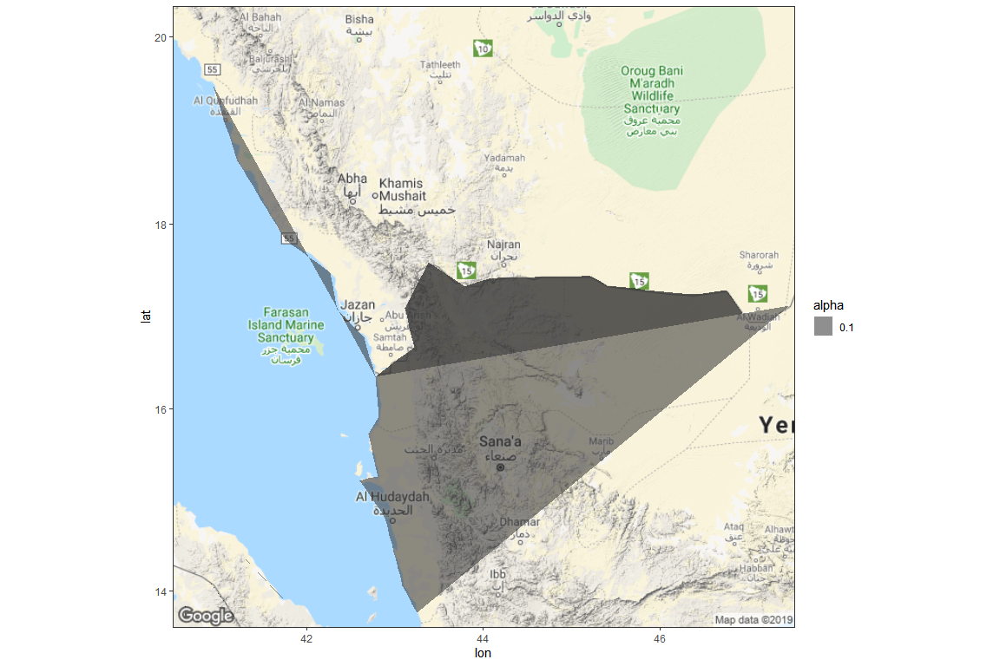

# {.tabset .tabset-fade}


maptools: a set of tools for reading and handling spatial objects. In particular, it will be used to read .shp files, a common format used by geographic information systems software.
ggplot2: one of the powerful graphics engines available to R users
ggmap: a package for spatial visualization using popular on-line mapping systems, such as GoogleMaps or OpenStreetMap.


```r
load(file = "sigacts.rda")
load(file = "wy_map.rda")
load(file = "countries_spdf.rda")
load(file = "countries_sp.rda")
load(file = "WY_8.rda")

# Use base_layer argument to ggmap() and add facet_wrap()
  ggmap(WY_8, 
    base_layer = ggplot(sigacts %>% filter(attacktype1 == 3), aes(lon, lat))) +
    #geom_polygon(data = countries_spdf_df, aes(x = long, y = lat, group = group, alpha = .1, color = "id")) +
  geom_point(aes(color = as.factor(iyear), size = nkill)) #+
```

<!-- -->

```r
  #scale_x_continuous(limits = c(43, 44), expand = c(0, 0)) #+
  #scale_y_continuous(limits = c(10, 20), expand = c(0, 0)) +
  #facet_wrap(vars(attacktype1_txt))
```


```r
library(broom)
countries_spdf_df <- tidy(countries_spdf)

countries_spdf$name <- sapply(slot(countries_spdf, "polygons"), function(x) slot(x, "ID"))

countries_spdf_df <- merge(countries_spdf_df, countries_spdf, by.x = "id", by.y = "name")

ggmap(wy_map) +
  geom_polygon(data = countries_spdf_df, aes(x = long, y = lat, group = group, alpha = .1 ))
```

<!-- -->

