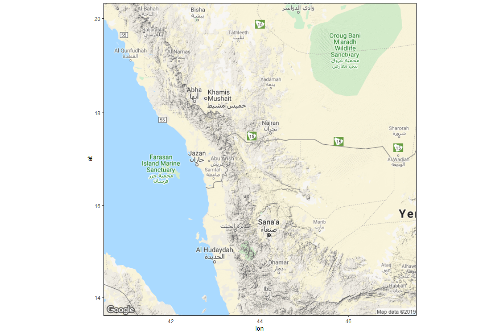
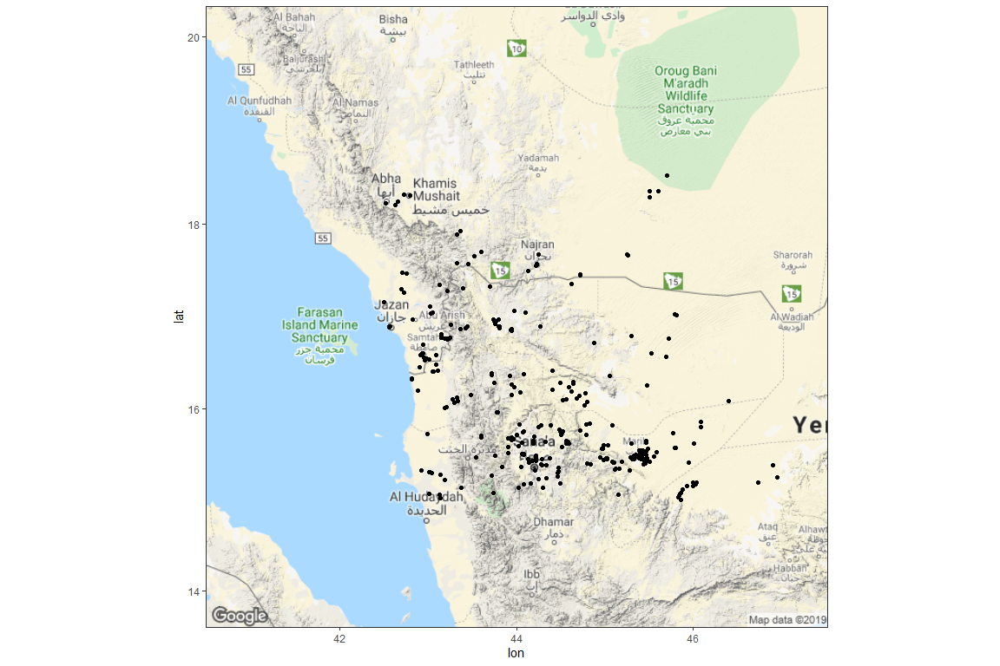
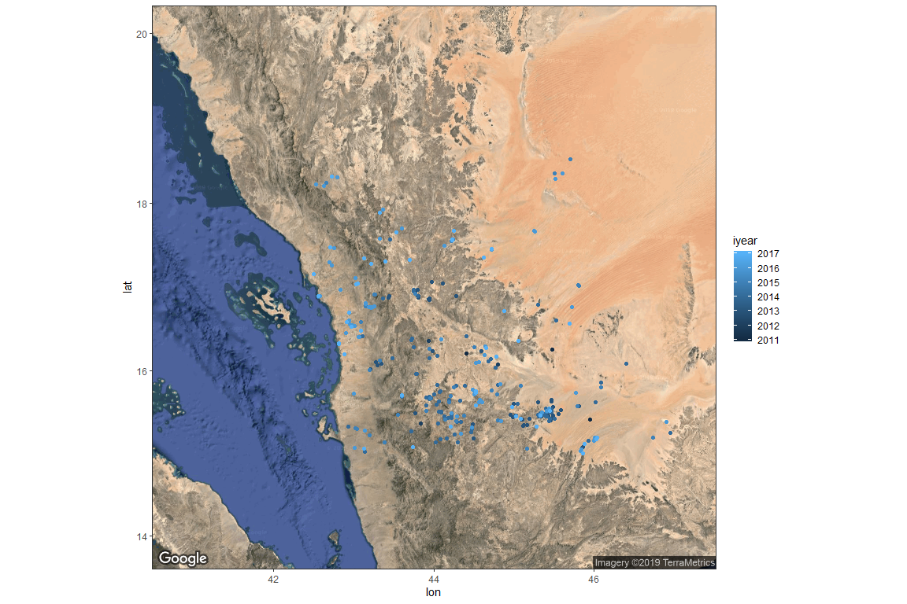
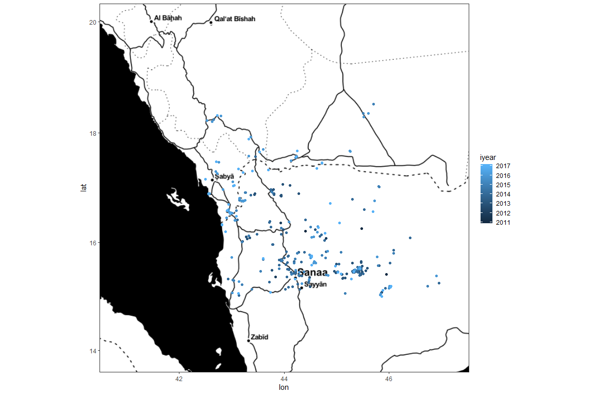
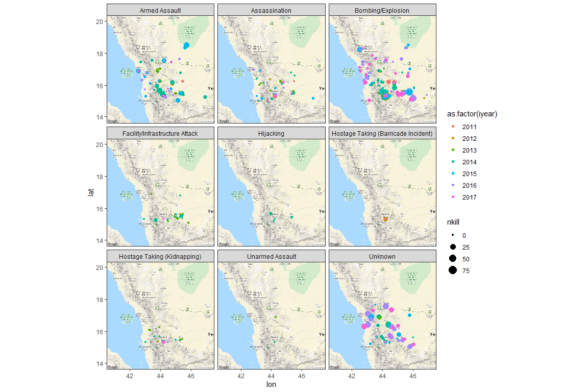

# {.tabset .tabset-fade}


## Build the map

Grabbing the Background Map


```r
wy <- c(lon = 44, lat = 17)

# Get map at zoom level 5: map_5
map_5 <- get_map(wy, zoom = 7, scale = 1)

# Plot map at zoom level 5
ggmap(map_5)
```

<!-- -->

```r
# Get map at zoom level 13: wy_map
wy_map <- get_map(wy, zoom = 7, scale = 1)

# Plot map at zoom level 13
ggmap(wy_map)
```

<!-- -->

Putting it all together


```r
sigacts <- read.csv("global terrorism 1970-2017.csv") %>% as_tibble() %>% filter(iyear > 2010)


# Look at head() of sigacts
#head(sigacts)

# Swap out call to ggplot() with call to ggmap()
ggmap(wy_map) +
  geom_point(aes(lon, lat), data = sigacts)
```

<!-- -->


```r
# Add a maptype argument to get a satellite map
wy_map_sat <- get_map(wy, zoom = 7, maptype = "satellite")
 
 
# Edit to display satellite map
ggmap(wy_map_sat) +
  geom_point(aes(lon, lat, color = iyear), data = sigacts)
```

<!-- -->

```r
# Add source and maptype to get toner map from Stamen Maps
wy_map_bw <- get_map(wy, zoom = 7, source = "stamen", maptype = "toner")

# Edit to display toner map
ggmap(wy_map_bw) +
  geom_point(aes(lon, lat, color = iyear), data = sigacts)
```

<!-- -->

Leverage ggplot Strengths


```r
# Use base_layer argument to ggmap() to specify data and x, y mappings

  ggmap(wy_map_bw, 
    base_layer = ggplot(sigacts, aes(lon, lat))) +
  geom_point(aes(color = iyear))
```

<!-- -->

```r
# Use base_layer argument to ggmap() and add facet_wrap()
  ggmap(wy_map, 
    base_layer = ggplot(sigacts, aes(lon, lat))) +
  geom_point(aes(color = as.factor(iyear), size = nkill)) +
  facet_wrap(vars(attacktype1_txt))
```

<!-- -->

