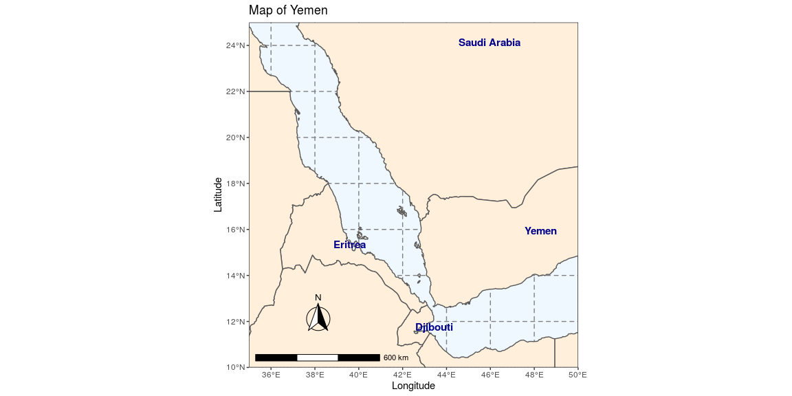

# {.tabset .tabset-fade}


https://www.r-bloggers.com/drawing-beautiful-maps-programmatically-with-r-sf-and-ggplot2-part-1-basics/

## Build the map


```r
world <- getMap(resolution = "high")
class(world)
```

```
## [1] "SpatialPolygonsDataFrame"
## attr(,"package")
## [1] "sp"
```

```r
world <- st_as_sf(world)
class(world)
```

```
## [1] "sf"         "data.frame"
```

```r
# Final Map
ggplot(data = world) +
    geom_sf(fill = "antiquewhite1") +
    geom_text(aes(LON, LAT, label = NAME), size = 4, hjust = "left",
        color = "darkblue", fontface = "bold", check_overlap = TRUE) +
    annotate(geom = "text", x = -90, y = 26, label = "Gulf of Mexico", 
        fontface = "italic", color = "grey22", size = 6) +
    annotation_scale(location = "bl", width_hint = 0.5) +
    annotation_north_arrow(location = "bl", which_north = "true", 
        pad_x = unit(0.75, "in"), pad_y = unit(0.5, "in"),
        style = north_arrow_fancy_orienteering) +
    coord_sf(xlim = c(35, 50), ylim = c(10, 25), expand = FALSE) +
    xlab("Longitude") + ylab("Latitude") +
    ggtitle("Map of Yemen") +
    theme(panel.grid.major = element_line(color = gray(.5),
        linetype = "dashed", size = 0.5),
        panel.background = element_rect(fill = "aliceblue"))
```

<!-- -->

