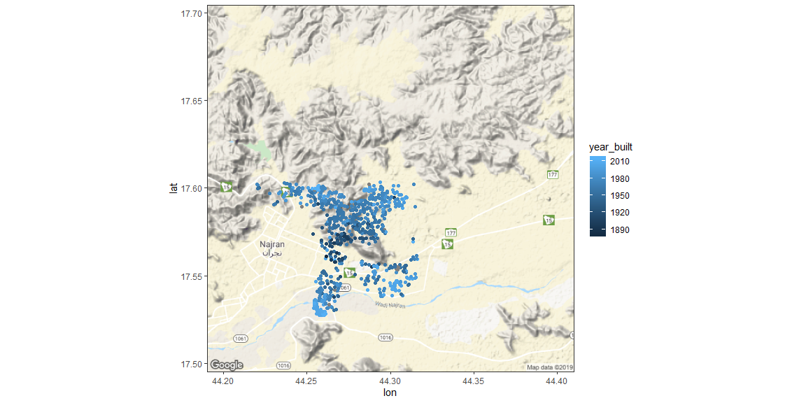
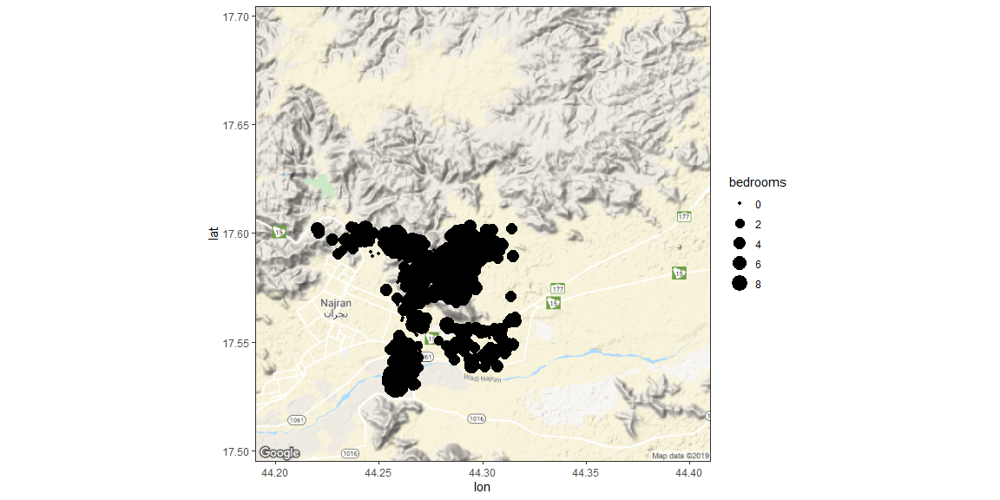
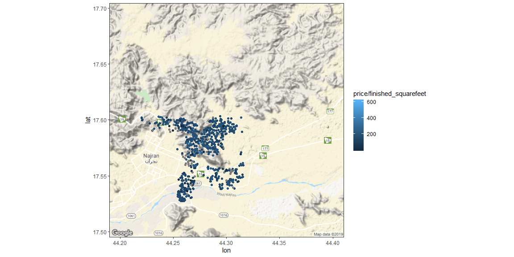

# {.tabset .tabset-fade}


https://www.r-bloggers.com/drawing-beautiful-maps-programmatically-with-r-sf-and-ggplot2-part-1-basics/

## Build the map

Grabbing the Background Map


```r
wy <- c(lon = 44.3, lat = 17.6)

# Get map at zoom level 5: map_5
map_5 <- get_map(wy, zoom = 12, scale = 1)

# Plot map at zoom level 5
ggmap(map_5)
```

<!-- -->

```r
# Get map at zoom level 13: wy_map
wy_map <- get_map(wy, zoom = 12, scale = 1)

# Plot map at zoom level 13
ggmap(wy_map)
```

<!-- -->

Putting it all together


```r
sales <- read.csv("Najran.csv") %>% as_tibble()

# Look at head() of sales
head(sales)
```

```
## # A tibble: 6 x 20
##     lon   lat  price finished_square~ year_built date  address city  state
##   <dbl> <dbl>  <dbl>            <int>      <int> <fct> <fct>   <fct> <fct>
## 1  44.3  17.6 267500             1520       1967 12/3~ 1112 N~ CORV~ OR   
## 2  44.2  17.6 255000             1665       1990 12/3~ 1221 N~ CORV~ OR   
## 3  44.3  17.6 295000             1440       1948 12/3~ 440 NW~ CORV~ OR   
## 4  44.3  17.6   5000              784       1978 12/3~ 2655 N~ CORV~ OR   
## 5  44.3  17.5  13950             1344       1979 12/3~ 300 SE~ CORV~ OR   
## 6  44.3  17.6 233000             1567       2002 12/3~ 3006 N~ CORV~ OR   
## # ... with 11 more variables: zip <fct>, acres <dbl>, num_dwellings <int>,
## #   class <fct>, condition <fct>, total_squarefeet <int>, bedrooms <int>,
## #   full_baths <int>, half_baths <int>, month <int>, address_city <fct>
```

```r
# Swap out call to ggplot() with call to ggmap()
ggmap(wy_map) +
  geom_point(aes(lon, lat), data = sales)
```

<!-- -->

Insight through aesthetics


```r
# Map color to year_built
ggmap(wy_map) +
    geom_point(aes(lon, lat, color = year_built), data = sales)
```

<!-- -->

```r
# Map size to bedrooms
ggmap(wy_map) +
    geom_point(aes(lon, lat, size = bedrooms), data = sales)
```

<!-- -->

```r
# Map color to price / finished_squarefeet
ggmap(wy_map) +
    geom_point(aes(lon, lat, color = price / finished_squarefeet), data = sales)
```

<!-- -->

Different maps
The default Google map downloaded by get_map() is useful when you need major roads, basic terrain, and places of interest, but visually it can be a little busy. You want your map to add to your data, not distract from it, so it can be useful to have other "quieter" options.

Sometimes you aren't really interested in the roads and places, but more what's on the ground (e.g. grass, trees, desert, or snow), in which case switching to a satellite view might be more useful. You can get Google satellite images by changing the maptype argument to "satellite".

You can grab Stamen Maps by using source = "stamen" in get_map(), along with specifying a maptype argument. You can see all possible values for the maptype argument by looking at ?get_map, but they correspond closely to the "flavors" described on the Stamen Maps site. I like the "toner" variations, as they are greyscale and a bit simpler than the Google map.

Let's try some other maps for your plot of house sales.

Instructions 2/2
50 XP
Edit your original call to get_map() to get a "satellite" image from Google by adding a maptype argument.
Display a plot of house sales coloured by year_built using the satellite map.
Edit your original call to get_map() to get a toner map from Stamen by adding a source argument and a maptype argument.
Display a plot of house sales coloured by year_built using the toner map.


```r
# Add a maptype argument to get a satellite map
wy_map_sat <- get_map(wy, zoom = 12, maptype = "satellite")
 
 
# Edit to display satellite map
ggmap(wy_map_sat) +
  geom_point(aes(lon, lat, color = year_built), data = sales)
```

<!-- -->

```r
# Add source and maptype to get toner map from Stamen Maps
wy_map_bw <- get_map(wy, zoom = 12, source = "stamen", maptype = "toner")

# Edit to display toner map
ggmap(wy_map_bw) +
  geom_point(aes(lon, lat, color = year_built), data = sales)
```

<!-- -->

Leverage ggplot Strengths


```r
# Use base_layer argument to ggmap() to specify data and x, y mappings

  ggmap(wy_map_bw, 
    base_layer = ggplot(sales, aes(lon, lat))) +
  geom_point(aes(color = year_built))
```

<!-- -->

```r
# Use base_layer argument to ggmap() and add facet_wrap()
  ggmap(wy_map_bw, 
    base_layer = ggplot(sales, aes(lon, lat))) +
  geom_point(aes(color = class)) +
  facet_wrap(vars(class))
```

<!-- -->

A Quick Alternative


```r
# Plot house sales using qmplot()
qmplot(lon, lat, data = sales, 
       geom = "point", color = bedrooms) +
  facet_wrap(~ month)
```

<!-- -->

Drawing polygons


```r
ward_sales <- read.csv("ward_sales.csv")

# Add a point layer with color mapped to ward
ggplot(ward_sales, aes(lon, lat)) +
geom_point(aes(color = as.factor(ward)))
```

<!-- -->

```r
# Add a point layer with color mapped to group

ggplot(ward_sales, aes(lon, lat)) +
geom_point(aes(color = as.factor(group)))
```

<!-- -->

```r
# Add a path layer with group mapped to group
ggplot(ward_sales, aes(lon, lat)) +
geom_path(aes(group = as.factor(group)))
```

<!-- -->

```r
# Add a polygon layer with fill mapped to ward, and group to group
ggplot(ward_sales, aes(lon, lat)) +
geom_polygon(aes(fill = as.factor(ward), group = as.factor(group)))
```

<!-- -->
