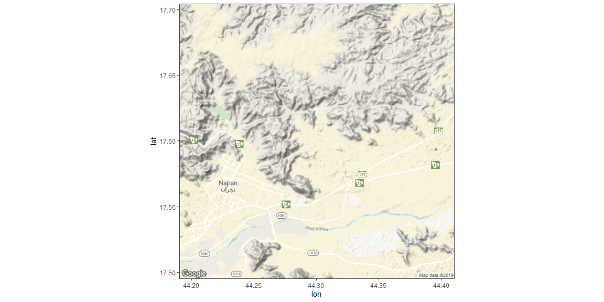

# {.tabset .tabset-fade}


https://www.r-bloggers.com/drawing-beautiful-maps-programmatically-with-r-sf-and-ggplot2-part-1-basics/

## Build the map

Grabbing the Background Map


```r
wy <- c(lon = 44, lat = 17)

# Get map at zoom level 5: map_5
map_5 <- get_map(wy, zoom = 5, scale = 1)

# Plot map at zoom level 5
ggmap(map_5)
```

<!-- -->

```r
# Get map at zoom level 13: wy_map
wy_map <- get_map(wy, zoom = 8, scale = 1)

# Plot map at zoom level 13
ggmap(wy_map)
```

<!-- -->

Putting it all together


```r
sales <- read.csv("Najran.csv") %>% as_tibble()

# Look at head() of sales
head(sales)
```

```
## # A tibble: 6 x 20
##     lon   lat  price finished_square… year_built date  address city  state
##   <dbl> <dbl>  <dbl>            <int>      <int> <fct> <fct>   <fct> <fct>
## 1  45.0  17.4 267500             1520       1967 12/3… 1112 N… CORV… OR   
## 2  44.5  17.1 255000             1665       1990 12/3… 1221 N… CORV… OR   
## 3  44.3  17.5 295000             1440       1948 12/3… 440 NW… CORV… OR   
## 4  44.6  17.7   5000              784       1978 12/3… 2655 N… CORV… OR   
## 5  44.1  17.7  13950             1344       1979 12/3… 300 SE… CORV… OR   
## 6  44.2  17.5 233000             1567       2002 12/3… 3006 N… CORV… OR   
## # … with 11 more variables: zip <fct>, acres <dbl>, num_dwellings <int>,
## #   class <fct>, condition <fct>, total_squarefeet <int>, bedrooms <int>,
## #   full_baths <int>, half_baths <int>, month <int>, address_city <fct>
```

```r
# Swap out call to ggplot() with call to ggmap()
ggmap(wy_map) +
  geom_point(aes(lon, lat), data = sales)
```

<!-- -->

Insight through aesthetics


```r
# Map color to year_built
ggmap(wy_map) +
    geom_point(aes(lon, lat, color = year_built), data = sales)
```

<!-- -->

```r
# Map size to bedrooms
ggmap(wy_map) +
    geom_point(aes(lon, lat, size = bedrooms), data = sales)
```

<!-- -->

```r
# Map color to price / finished_squarefeet
ggmap(wy_map) +
    geom_point(aes(lon, lat, color = price / finished_squarefeet), data = sales)
```

<!-- -->


