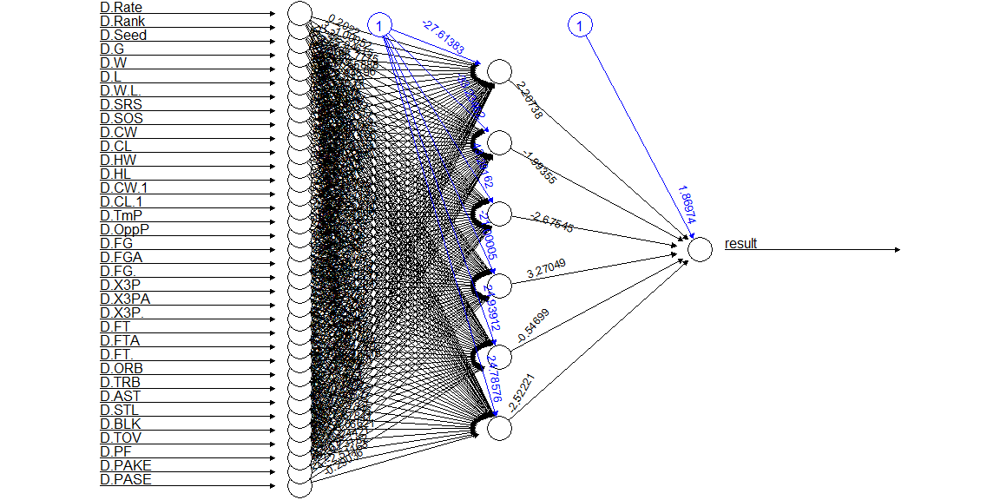
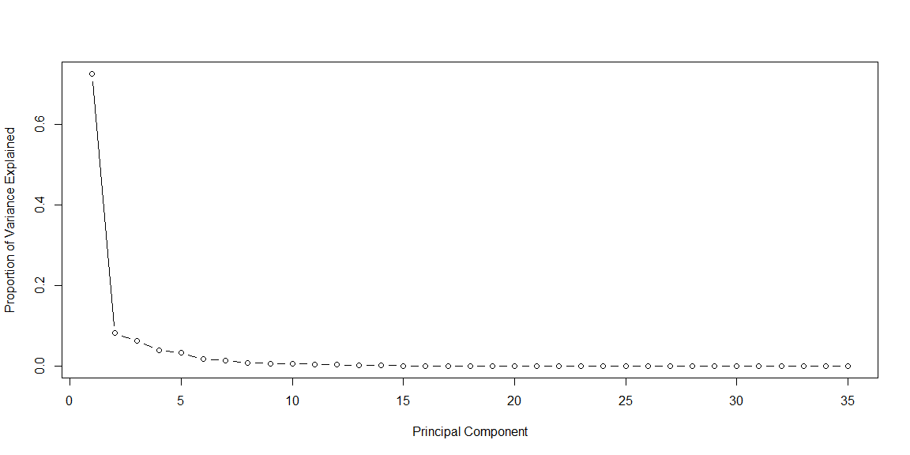
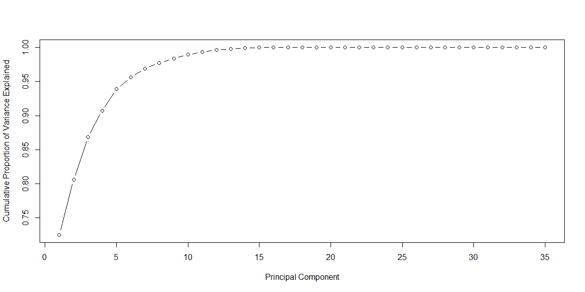
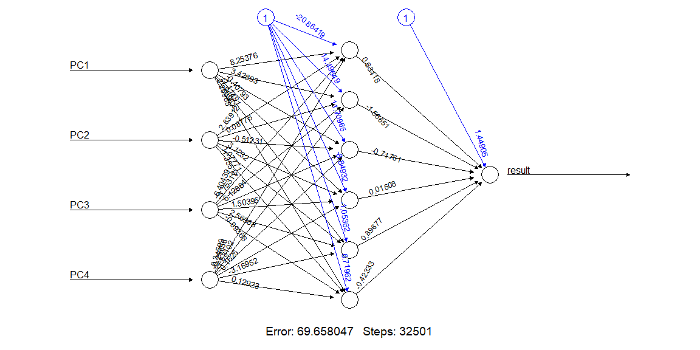

# {.tabset .tabset-fade}


## The MMdata

NCAA Season Stats: https://www.sports-reference.com/cbb/seasons/

All Tournament Game Results:

  From which I can get Seed Expectations
  From Which I can get each teams PASE
  
Kenpom Rankings: https://kenpom.com/index.php?s=TeamName


```r
# Load MMdata of all games and the differences of season stats
AGwDS = read.csv( "AGwDS.csv", stringsAsFactor = FALSE )

MMdata <- AGwDS[,22:58] %>% mutate(result = D.Score) %>% transform(result = ifelse (result > 0 ,1,0))%>% dplyr::select(-c(4,19)) %>% na.omit()

#MMdata <-MMdata%>%dplyr::select(c(1,8,9,16:19,21,22,24,25,27:36))

#check for na

#apply(is.na(MMdata),2,which)

  
# Spliting training and testing MMdata
index = sample( 1:nrow(MMdata), nrow(MMdata) * 0.8, replace = FALSE ) 

trainset = MMdata[index,]
test = MMdata[-index,]
testset = test[1:ncol(test)-1]  # all variables without the class

# Building a neural network (NN)

n = names( trainset )
f = as.formula( paste( "result ~", paste( n[!n %in% "result"], collapse = "+" ) ) )
nn = neuralnet( f, trainset, hidden = 6, linear.output = FALSE, threshold = 0.01 )

plot( nn, rep = "best" )
```

<!-- -->


```r
# Testing the result output
nn.results = compute( nn, testset )

results = data.frame( actual = test$result, prediction = round( nn.results$net.result ) )

# Confusion matrix

t = table( results )
print( confusionMatrix( t ) )
```

```
## Confusion Matrix and Statistics
## 
##       prediction
## actual   0   1
##      0  30  15
##      1  26 150
##                                           
##                Accuracy : 0.8145          
##                  95% CI : (0.7569, 0.8635)
##     No Information Rate : 0.7466          
##     P-Value [Acc > NIR] : 0.01065         
##                                           
##                   Kappa : 0.4757          
##                                           
##  Mcnemar's Test P-Value : 0.11835         
##                                           
##             Sensitivity : 0.5357          
##             Specificity : 0.9091          
##          Pos Pred Value : 0.6667          
##          Neg Pred Value : 0.8523          
##              Prevalence : 0.2534          
##          Detection Rate : 0.1357          
##    Detection Prevalence : 0.2036          
##       Balanced Accuracy : 0.7224          
##                                           
##        'Positive' Class : 0               
## 
```


```r
pca_trainset = trainset[1:ncol(trainset)-1]  # all variables without the class
pca_testset = testset
pca = prcomp( pca_trainset, center = F, scale. = F )

# variance
pr_var = ( pca$sdev )^2 

# % of variance
prop_varex = pr_var / sum( pr_var )

# Plot
plot( prop_varex, xlab = "Principal Component", 
                  ylab = "Proportion of Variance Explained", type = "b" )
```

<!-- -->

```r
# Scree Plot
plot( cumsum( prop_varex ), xlab = "Principal Component", 
                            ylab = "Cumulative Proportion of Variance Explained", type = "b" )
```

<!-- -->


```r
# Creating a new MMdata
train = data.frame( result = trainset$result, pca$x )
t = as.data.frame( predict( pca, newdata = pca_testset ) )

PCs <- 4
new_trainset = train[, 1:(PCs+1)] # class on front and PCs to use
new_testset =  t[, 1:PCs] # Just PCs to use

# Build the neural network (NN)

n = names( new_trainset )
f = as.formula( paste( "result ~", paste( n[!n %in% "result" ], collapse = "+" ) ) )
nn = neuralnet( f, new_trainset, hidden = 6, linear.output = FALSE, threshold=0.01 )

# Plot the NN
plot( nn, rep = "best" )
```

<!-- -->


```r
# Test the resulting output
nn.results = compute( nn, new_testset )

# Results
results = data.frame( actual = test$result, 
                      prediction = round( nn.results$net.result ) )

# Confusion Matrix

t = table( results ) 
print( confusionMatrix( t ) )
```

```
## Confusion Matrix and Statistics
## 
##       prediction
## actual   0   1
##      0  14  31
##      1  17 159
##                                           
##                Accuracy : 0.7828          
##                  95% CI : (0.7226, 0.8353)
##     No Information Rate : 0.8597          
##     P-Value [Acc > NIR] : 0.9993          
##                                           
##                   Kappa : 0.2426          
##                                           
##  Mcnemar's Test P-Value : 0.0606          
##                                           
##             Sensitivity : 0.45161         
##             Specificity : 0.83684         
##          Pos Pred Value : 0.31111         
##          Neg Pred Value : 0.90341         
##              Prevalence : 0.14027         
##          Detection Rate : 0.06335         
##    Detection Prevalence : 0.20362         
##       Balanced Accuracy : 0.64423         
##                                           
##        'Positive' Class : 0               
## 
```
## From Tidyverse


```r
pacman::p_load(tidyverse, modelr, gapminder,dslabs, broom, Metrics, rsample, gridExtra, ranger)
```


```r
set.seed(42)

# Prepare the initial split object
data_split <- initial_split(MMdata, prop = 0.75)

# Extract the training dataframe
training_data <- training(data_split)

# Extract the testing dataframe
testing_data <- testing(data_split)

cv_split <- vfold_cv(training_data, v = 5)

cv_data <- cv_split %>% 
  mutate(
    # Extract the train dataframe for each split
    train = map(splits, ~training(.x)),
    # Extract the validate dataframe for each split
    validate = map(splits, ~testing(.x))
  )
```

Build cross-validated models
In this exercise, you will build logistic regression models for each fold in your cross-validation.

You will build this using the glm() function and by setting the family argument to "binomial".


```r
# Build a model using the train data for each fold of the cross validation
cv_models_lr <- cv_data %>% 
  mutate(model = map(train, ~glm(formula = result~., data = .x, family = "binomial")))
```

Predictions of a single model
To calculate the performance of a classification model you need to compare the actual values of result to those predicted by the model. When calculating metrics for binary classification tasks (such as precision and recall), the actual and predicted vectors must be converted to binary values.

In this exercise, you will learn how to prepare these vectors using the model and validate dataframes from the first cross-validation fold as an example.


```r
# Extract the first model and validate 
model <- cv_models_lr$model[[1]]
validate <- cv_models_lr$validate[[1]]

# Prepare binary vector of actual Attrition values in validate
validate_actual <- validate$result == 1

# Predict the probabilities for the observations in validate
validate_prob <- predict(model, validate, type = "response")

# Prepare binary vector of predicted Attrition values for validate
validate_predicted <- validate_prob > 0.5
```

Performance of a single model
Now that you have the binary vectors for the actual and predicted values of the model, you can calculate many commonly used binary classification metrics. In this exercise you will focus on:

accuracy: rate of correctly predicted values relative to all predictions.
precision: portion of predictions that the model correctly predicted as TRUE.
recall: portion of actual TRUE values that the model correctly recovered.


```r
# Compare the actual & predicted performance visually using a table
table(validate_actual, validate_predicted)
```

```
##                validate_predicted
## validate_actual FALSE TRUE
##           FALSE    32   13
##           TRUE     11  110
```

```r
# Calculate the accuracy
accuracy(validate_actual, validate_predicted)
```

```
## [1] 0.8554217
```

```r
# Calculate the precision
precision(as.factor(validate_actual), as.factor(validate_predicted))
```

```
## [1] 0.7111111
```

```r
# Calculate the recall
recall(as.factor(validate_actual), as.factor(validate_predicted))
```

```
## [1] 0.744186
```

Prepare for cross-validated performance
Now that you know how to calculate the performance metrics for a single model, you are now ready to expand this for all the folds in the cross-validation dataframe.


```r
cv_prep_lr <- cv_models_lr %>% 
  mutate(
    # Prepare binary vector of actual Attrition values in validate
    validate_actual = map(validate, ~.x$Attrition == "Yes"),
    # Prepare binary vector of predicted Attrition values for validate
    validate_predicted = map2(.x = model, .y = validate, ~predict(.x, .y, type = "response") > 0.5)
  )
```

