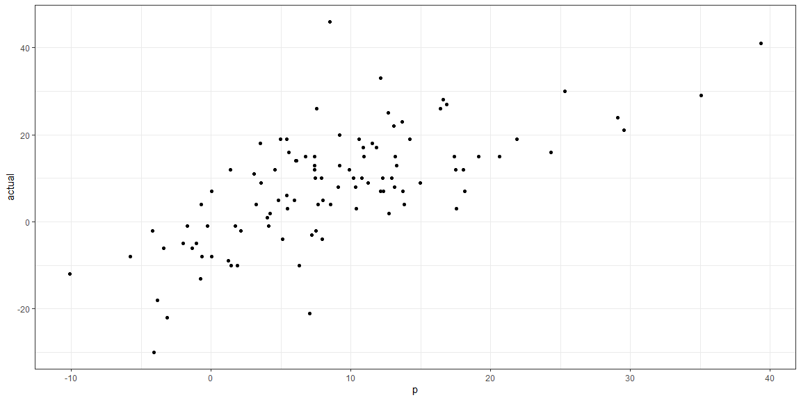

# {.tabset .tabset-fade}


## Games 02-19 
### Combine Stacked Teams with Stats

https://kenpom.com/index.php?y=2018&s=TeamName


```r
# Start With All Games 02-19 stacked with Favored team F over Underdog U
# Append on Season stats to each team
AG0219stacked <- read.csv("AG0219stacked.csv")
teamstats <- read.csv("KenPom02-19.csv")
teamcomb <- left_join(AG0219stacked,teamstats,by=c("Year"="Year","Team"="Team"))

#Where are the NAs
nas <- teamcomb %>% summarise_all(~ sum(is.na(.)))

# Now the dataset is ready
```

## Model
### Build and test the model


```r
pyear <- floor(runif(1, min=2002, max=2019))
rm <- 0
rsd <- 1

# Separate Favored and Underdogs 02 to 18 
AG0219F <- teamcomb %>% filter(Favored == "F" & Year != pyear)
AG0219U <- teamcomb %>% filter(Favored == "U" & Year != pyear)

#Get the difference of the just stats
AG0219FS <- AG0219F %>% select(7,10,11,18,20:30)
AG0219US <- AG0219U %>% select(7,10,11,18,20:30)
dStats0219 <- AG0219FS - AG0219US

# Set seed and create assignment

assignment <- sample(1:2, size = nrow(dStats0219), prob = c(.9,.1), replace = TRUE)

# Create a train, validation and tests from the original data frame 
NCAA_train <- dStats0219[assignment == 1, ]    # subset NCAA to training indices only
NCAA_test <- dStats0219[assignment == 2, ]   # subset NCAA to test indices only

NCAA_model <- lm(Score ~ .,data =NCAA_train)

p <- predict(NCAA_model, NCAA_test, type = "response")
actual <- NCAA_test$Score

ggplot(data.frame(actual,p),aes(x=p,y=actual)) + geom_point() #+ 
```

<!-- -->

```r
  #abline(c(0,min(actual)),c(0,max(actual)))

actual.P <- actual>0
p.P <- p>0

confusionMatrix(table(actual.P,p.P))
```

```
## Confusion Matrix and Statistics
## 
##         p.P
## actual.P FALSE TRUE
##    FALSE    13   11
##    TRUE      4   98
##                                           
##                Accuracy : 0.881           
##                  95% CI : (0.8113, 0.9318)
##     No Information Rate : 0.8651          
##     P-Value [Acc > NIR] : 0.3581          
##                                           
##                   Kappa : 0.5655          
##                                           
##  Mcnemar's Test P-Value : 0.1213          
##                                           
##             Sensitivity : 0.7647          
##             Specificity : 0.8991          
##          Pos Pred Value : 0.5417          
##          Neg Pred Value : 0.9608          
##              Prevalence : 0.1349          
##          Detection Rate : 0.1032          
##    Detection Prevalence : 0.1905          
##       Balanced Accuracy : 0.8319          
##                                           
##        'Positive' Class : FALSE           
## 
```

```r
pyear
```

```
## [1] 2004
```

## Predict pyear
### Predict and Evaluate pyear Tourney


```r
# Build the pyear Dataset with Side by side teams and diff stats

######################## Predict Round 1 ############################

# Need to assign F and U to Predictions from round 1
The64 <- teamcomb %>% filter(Year == pyear & Round == 1)

# Separate Favored and Underdogs for Round 1 
The64F <- The64 %>% filter(Favored == "F")
The64U <- The64 %>% filter(Favored == "U")

#Get the difference of the just stats
The64FS <- The64F %>% select(7,10,11,18,20:30)
The64US <- The64U %>% select(7,10,11,18,20:30)
The64DS <- The64FS - The64US

#Combine the F and U Leading Columns with dif stats
LThe64F <- The64F %>% select(1:9)
LThe64U <- The64U %>% select(7:9)
New64 <- cbind(LThe64F,LThe64U,The64DS)
colnames(New64)[10:12]<-c("U.Seed","U.Team","U.Conf")

#Now the prediction for round 1
p <- predict(NCAA_model, The64DS, type = "response")
p <- p + rnorm(n=length(p),rm,rsd)

pred1 <- ifelse(p>0,New64$Team,New64$U.Team)
st1 <- ifelse(p>0,paste(New64$Seed,New64$Team,round(p,0)),paste(New64$U.Seed,New64$U.Team,round(p,0)))

########################## Predict Round 2 ############################

# Need to assign F and U to Predictions from round 1
The32 <- teamcomb %>% filter(Year == pyear & Round == 1 & Team %in% pred1)
The32$GameN <- rep(33:48, each=2)
The32 <- The32 %>% arrange(GameN, desc(AdjEM.x))
The32$Favored <- rep(c("F","U"),16)

# Separate Favored and Underdogs for Round 2 
The32F <- The32 %>% filter(Favored == "F")
The32U <- The32 %>% filter(Favored == "U")

#Get the difference of the just stats
The32FS <- The32F %>% select(7,10,11,18,20:30)
The32US <- The32U %>% select(7,10,11,18,20:30)
The32DS <- The32FS - The32US

#Combine the F and U Leading Columns with dif stats
LThe32F <- The32F %>% select(1:9)
LThe32U <- The32U %>% select(7:9)
New32 <- cbind(LThe32F,LThe32U,The32DS)
colnames(New32)[10:12]<-c("U.Seed","U.Team","U.Conf")

#Now the prediction for round 2
p <- predict(NCAA_model, The32DS, type = "response")
p <- p + rnorm(n=length(p),rm,rsd)

pred2 <- ifelse(p>0,New32$Team,New32$U.Team)
st2 <- ifelse(p>0,paste(New32$Seed,New32$Team,round(p,0)),paste(New32$U.Seed,New32$U.Team,round(p,0)))

########################## Predict Round 3 ############################

# Need to assign F and U to Predictions from round 2
The16 <- teamcomb %>% filter(Year == pyear & Round == 1 & Team %in% pred2)
The16$GameN <- rep(49:56, each=2)
The16 <- The16 %>% arrange(GameN, desc(AdjEM.x))
The16$Favored <- rep(c("F","U"),8)

# Separate Favored and Underdogs for Round 3 
The16F <- The16 %>% filter(Favored == "F")
The16U <- The16 %>% filter(Favored == "U")

#Get the difference of the just stats
The16FS <- The16F %>% select(7,10,11,18,20:30)
The16US <- The16U %>% select(7,10,11,18,20:30)
The16DS <- The16FS - The16US

#Combine the F and U Leading Columns with dif stats
LThe16F <- The16F %>% select(1:9)
LThe16U <- The16U %>% select(7:9)
New16 <- cbind(LThe16F,LThe16U,The16DS)
colnames(New16)[10:12]<-c("U.Seed","U.Team","U.Conf")

#Now the prediction for round 3
p <- predict(NCAA_model, The16DS, type = "response")
p <- p + rnorm(n=length(p),rm,rsd)

pred3 <- ifelse(p>0,New16$Team,New16$U.Team)
st3 <- ifelse(p>0,paste(New16$Seed,New16$Team,round(p,0)),paste(New16$U.Seed,New16$U.Team,round(p,0)))
########################## Predict Round 4 ############################

# Need to assign F and U to Predictions from round 3
The8 <- teamcomb %>% filter(Year == pyear & Round == 1 & Team %in% pred3)
The8$GameN <- rep(57:60, each=2)
The8 <- The8 %>% arrange(GameN, desc(AdjEM.x))
The8$Favored <- rep(c("F","U"),4)

# Separate Favored and Underdogs for Round 4 
The8F <- The8 %>% filter(Favored == "F")
The8U <- The8 %>% filter(Favored == "U")

#Get the difference of the just stats
The8FS <- The8F %>% select(7,10,11,18,20:30)
The8US <- The8U %>% select(7,10,11,18,20:30)
The8DS <- The8FS - The8US

#Combine the F and U Leading Columns with dif stats
LThe8F <- The8F %>% select(1:9)
LThe8U <- The8U %>% select(7:9)
New8 <- cbind(LThe8F,LThe8U,The8DS)
colnames(New8)[10:12]<-c("U.Seed","U.Team","U.Conf")

#Now the prediction for round 4
p <- predict(NCAA_model, The8DS, type = "response")
p <- p + rnorm(n=length(p),rm,rsd)

pred4 <- ifelse(p>0,New8$Team,New8$U.Team)
st4 <- ifelse(p>0,paste(New8$Seed,New8$Team,round(p,0)),paste(New8$U.Seed,New8$U.Team,round(p,0)))

########################## Predict Round 5 ############################

# Need to assign F and U to Predictions from round 4
The4 <- teamcomb %>% filter(Year == pyear & Round == 1 & Team %in% pred4)
The4 <- The4 %>% arrange(GameN, AdjEM.x)
The4$GameN <- rep(61:62, each=2)
The4 <- The4 %>% arrange(GameN, AdjEM.x)
The4$Favored <- rep(c("F","U"),2)

# Separate Favored and Underdogs for Round 5 
The4F <- The4 %>% filter(Favored == "F")
The4U <- The4 %>% filter(Favored == "U")

#Get the difference of the just stats
The4FS <- The4F %>% select(7,10,11,18,20:30)
The4US <- The4U %>% select(7,10,11,18,20:30)
The4DS <- The4FS - The4US

#Combine the F and U Leading Columns with dif stats
LThe4F <- The4F %>% select(1:9)
LThe4U <- The4U %>% select(7:9)
New4 <- cbind(LThe4F,LThe4U,The4DS)
colnames(New4)[10:12]<-c("U.Seed","U.Team","U.Conf")

#Now the prediction for round 5
p <- predict(NCAA_model, The4DS, type = "response")
p <- p + rnorm(n=length(p),rm,rsd)

pred5 <- ifelse(p>0,New4$Team,New4$U.Team)
st5 <- ifelse(p>0,paste(New4$Seed,New4$Team,round(p,0)),paste(New4$U.Seed,New4$U.Team,round(p,0)))

########################## Predict Round 6 ############################

# Need to assign F and U to Predictions from round 5
The2 <- teamcomb %>% filter(Year == pyear & Round == 1 & Team %in% pred5)
The2$GameN <- rep(63, each=2)
The2 <- The2 %>% arrange(desc(Region), AdjEM.x)
The2$Favored <- rep(c("F","U"),1)

# Separate Favored and Underdogs for Round 6 
The2F <- The2 %>% filter(Favored == "F")
The2U <- The2 %>% filter(Favored == "U")

#Get the difference of the just stats
The2FS <- The2F %>% select(7,10,11,18,20:30)
The2US <- The2U %>% select(7,10,11,18,20:30)
The2DS <- The2FS - The2US

#Combine the F and U Leading Columns with dif stats
LThe2F <- The2F %>% select(1:9)
LThe2U <- The2U %>% select(7:9)
New2 <- cbind(LThe2F,LThe2U,The2DS)
colnames(New2)[10:12]<-c("U.Seed","U.Team","U.Conf")

#Now the prediction for round 5
p <- predict(NCAA_model, The2DS, type = "response")
p <- p + rnorm(n=length(p),rm,rsd)

pred6 <- ifelse(p>0,New2$Team,New2$U.Team)
st6 <- ifelse(p>0,paste(New2$Seed,New2$Team,round(p,0)),paste(New2$U.Seed,New2$U.Team,round(p,0)))
```

## Results


```r
if (exists("track")==FALSE) {track <- 1300}
if (exists("years")==FALSE) {years <- 2010}
presults <- c(pred1,pred2,pred3,pred4,pred5,pred6)
aresults <- teamcomb %>% filter(Year == pyear & Favored == "F" & Round != "PI") %>% select(Winner)
cresults <- cbind(aresults,presults)
cresults$match <- aresults == presults
cresults
```

```
##                Winner           presults Winner
## 1            Kentucky           Kentucky   TRUE
## 2                 UAB                UAB   TRUE
## 3      Boston College     Boston College   TRUE
## 4             Pacific         Providence  FALSE
## 5              Nevada             Nevada   TRUE
## 6              Kansas             Kansas   TRUE
## 7             Gonzaga            Gonzaga   TRUE
## 8        Georgia Tech       Georgia Tech   TRUE
## 9      Saint Joseph's     Saint Joseph's   TRUE
## 10         Texas Tech         Texas Tech   TRUE
## 11          Manhattan            Florida  FALSE
## 12        Wake Forest        Wake Forest   TRUE
## 13          Wisconsin          Wisconsin   TRUE
## 14         Pittsburgh         Pittsburgh   TRUE
## 15            Memphis     South Carolina  FALSE
## 16       Oklahoma St.       Oklahoma St.   TRUE
## 17               Duke               Duke   TRUE
## 18         Seton Hall         Seton Hall   TRUE
## 19           Illinois           Illinois   TRUE
## 20         Cincinnati         Cincinnati   TRUE
## 21     North Carolina     North Carolina   TRUE
## 22              Texas              Texas   TRUE
## 23             Xavier             Xavier   TRUE
## 24    Mississippi St.    Mississippi St.   TRUE
## 25           Stanford           Stanford   TRUE
## 26            Alabama            Alabama   TRUE
## 27           Syracuse                BYU  FALSE
## 28           Maryland           Maryland   TRUE
## 29         Vanderbilt         Vanderbilt   TRUE
## 30 North Carolina St. North Carolina St.   TRUE
## 31             DePaul             Dayton  FALSE
## 32        Connecticut        Connecticut   TRUE
## 33                UAB           Kentucky  FALSE
## 34             Kansas     Boston College  FALSE
## 35       Georgia Tech             Nevada  FALSE
## 36             Nevada       Georgia Tech  FALSE
## 37     Saint Joseph's     Saint Joseph's   TRUE
## 38        Wake Forest        Wake Forest   TRUE
## 39         Pittsburgh         Pittsburgh   TRUE
## 40       Oklahoma St.       Oklahoma St.   TRUE
## 41               Duke               Duke   TRUE
## 42           Illinois           Illinois   TRUE
## 43              Texas     North Carolina  FALSE
## 44             Xavier             Xavier   TRUE
## 45            Alabama           Stanford  FALSE
## 46           Syracuse           Maryland  FALSE
## 47         Vanderbilt North Carolina St.  FALSE
## 48        Connecticut        Connecticut   TRUE
## 49     Saint Joseph's           Kentucky  FALSE
## 50       Oklahoma St.       Georgia Tech  FALSE
## 51        Connecticut     Saint Joseph's  FALSE
## 52            Alabama         Pittsburgh  FALSE
## 53               Duke               Duke   TRUE
## 54             Xavier             Xavier   TRUE
## 55       Georgia Tech           Stanford  FALSE
## 56             Kansas        Connecticut  FALSE
## 57       Georgia Tech       Georgia Tech   TRUE
## 58       Oklahoma St.         Pittsburgh  FALSE
## 59               Duke               Duke   TRUE
## 60        Connecticut        Connecticut   TRUE
## 61       Georgia Tech       Georgia Tech   TRUE
## 62        Connecticut               Duke  FALSE
## 63        Connecticut               Duke  FALSE
```

```r
sum(cresults$match)
```

```
## [1] 41
```

```r
score <- c(rep(10,32),rep(20,16),rep(40,8),rep(80,4),rep(160,2),rep(320,1))
blank2 <- rep("",16)
st2 <- c(blank2,st2)
blank3 <- rep("",24)
st3 <- c(blank3,st3)
blank4 <- rep("",28)
st4 <- c(blank4,st4)
blank5 <- rep("",30)
st5 <- c(blank5,st5)
blank6 <- rep("",31)
st6 <- c(blank6, st6)
#cbind(st1,st2,st3,st4,st5,st6)
sum(cresults$match*score)
```

```
## [1] 910
```

```r
track <- c(track,sum(cresults$match*score))
summary(track)
```

```
##    Min. 1st Qu.  Median    Mean 3rd Qu.    Max. 
##     910    1008    1105    1105    1202    1300
```

```r
pyear
```

```
## [1] 2004
```

```r
years <- c(years,pyear)
sum(cresults$match)
```

```
## [1] 41
```
