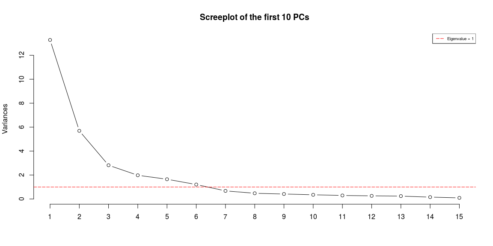
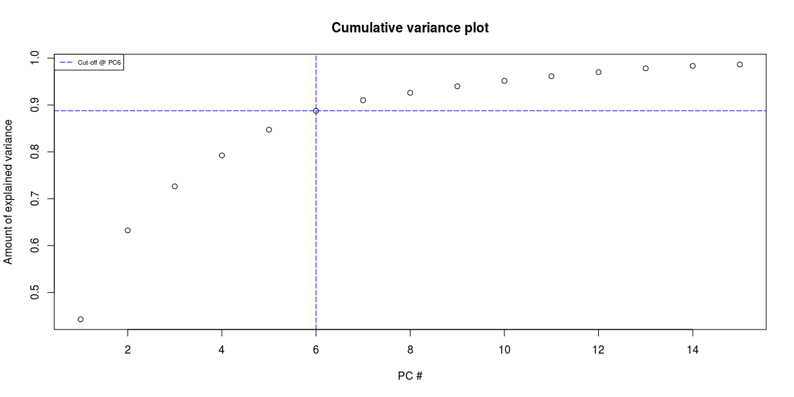
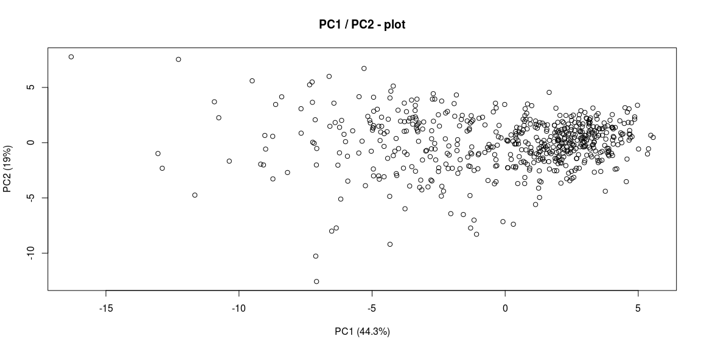
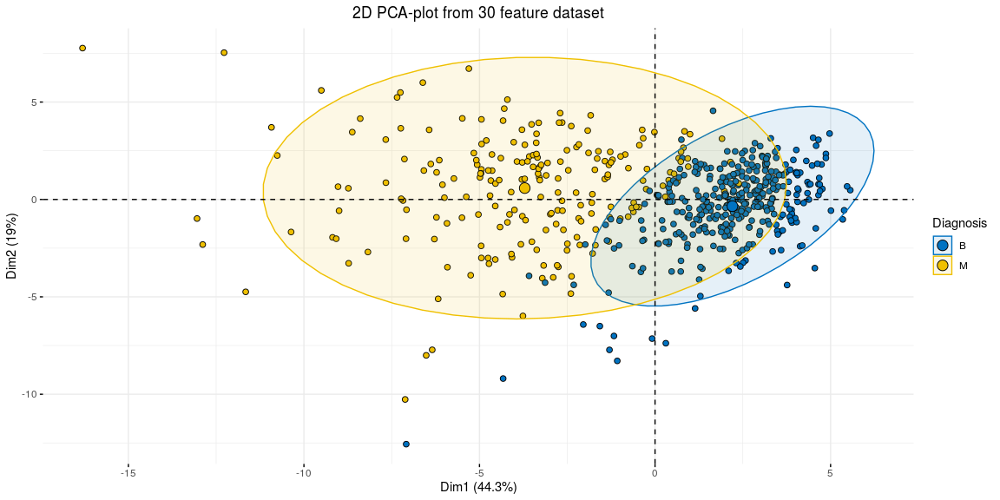
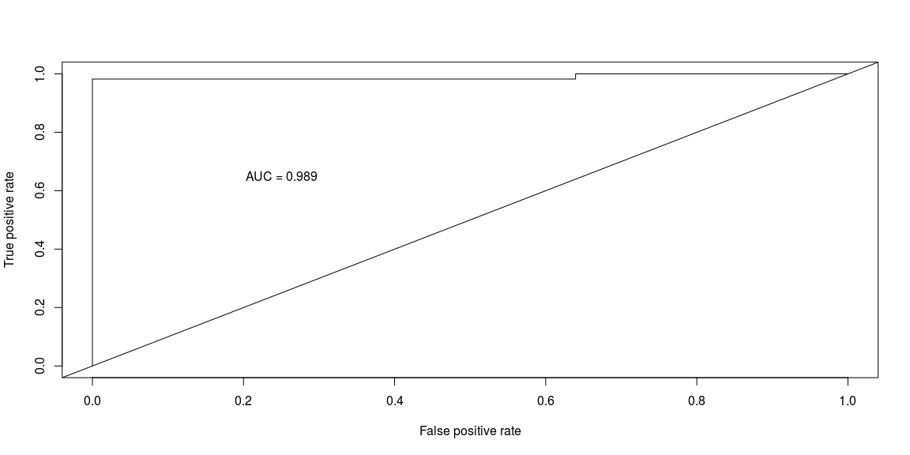

# {.tabset .tabset-fade}


https://towardsdatascience.com/principal-component-analysis-pca-101-using-r-361f4c53a9ff

## Setup

```r
wdbc <- read.csv("wdbc.csv", header = F)

features <- c("radius", "texture", "perimeter", "area", "smoothness", "compactness", "concavity", "concave_points", "symmetry", "fractal_dimension")
names(wdbc) <- c("id", "diagnosis", paste0(features,"_mean"), paste0(features,"_se"), paste0(features,"_worst"))
```


```r
wdbc.pr <- prcomp(wdbc[c(3:32)], center = TRUE, scale = TRUE)
summary(wdbc.pr)
```

```
## Importance of components:
##                           PC1    PC2     PC3     PC4     PC5     PC6
## Standard deviation     3.6444 2.3857 1.67867 1.40735 1.28403 1.09880
## Proportion of Variance 0.4427 0.1897 0.09393 0.06602 0.05496 0.04025
## Cumulative Proportion  0.4427 0.6324 0.72636 0.79239 0.84734 0.88759
##                            PC7     PC8    PC9    PC10   PC11    PC12
## Standard deviation     0.82172 0.69037 0.6457 0.59219 0.5421 0.51104
## Proportion of Variance 0.02251 0.01589 0.0139 0.01169 0.0098 0.00871
## Cumulative Proportion  0.91010 0.92598 0.9399 0.95157 0.9614 0.97007
##                           PC13    PC14    PC15    PC16    PC17    PC18
## Standard deviation     0.49128 0.39624 0.30681 0.28260 0.24372 0.22939
## Proportion of Variance 0.00805 0.00523 0.00314 0.00266 0.00198 0.00175
## Cumulative Proportion  0.97812 0.98335 0.98649 0.98915 0.99113 0.99288
##                           PC19    PC20   PC21    PC22    PC23   PC24
## Standard deviation     0.22244 0.17652 0.1731 0.16565 0.15602 0.1344
## Proportion of Variance 0.00165 0.00104 0.0010 0.00091 0.00081 0.0006
## Cumulative Proportion  0.99453 0.99557 0.9966 0.99749 0.99830 0.9989
##                           PC25    PC26    PC27    PC28    PC29    PC30
## Standard deviation     0.12442 0.09043 0.08307 0.03987 0.02736 0.01153
## Proportion of Variance 0.00052 0.00027 0.00023 0.00005 0.00002 0.00000
## Cumulative Proportion  0.99942 0.99969 0.99992 0.99997 1.00000 1.00000
```


```r
screeplot(wdbc.pr, type = "l", npcs = 15, main = "Screeplot of the first 10 PCs")
abline(h = 1, col="red", lty=5)
legend("topright", legend=c("Eigenvalue = 1"),
       col=c("red"), lty=5, cex=0.6)
```

<!-- -->

```r
cumpro <- cumsum(wdbc.pr$sdev^2 / sum(wdbc.pr$sdev^2))
plot(cumpro[0:15], xlab = "PC #", ylab = "Amount of explained variance", main = "Cumulative variance plot")
abline(v = 6, col="blue", lty=5)
abline(h = 0.88759, col="blue", lty=5)
legend("topleft", legend=c("Cut-off @ PC6"),
       col=c("blue"), lty=5, cex=0.6)
```

<!-- -->


```r
plot(wdbc.pr$x[,1],wdbc.pr$x[,2], xlab="PC1 (44.3%)", ylab = "PC2 (19%)", main = "PC1 / PC2 - plot")
```

<!-- -->

```r
fviz_pca_ind(wdbc.pr, geom.ind = "point", pointshape = 21, 
             pointsize = 2, 
             fill.ind = wdbc$diagnosis, 
             col.ind = "black", 
             palette = "jco", 
             addEllipses = TRUE,
             label = "var",
             col.var = "black",
             repel = TRUE,
             legend.title = "Diagnosis") +
  ggtitle("2D PCA-plot from 30 feature dataset") +
  theme(plot.title = element_text(hjust = 0.5))
```

<!-- -->

## LDA First


```r
wdbc.data <- as.matrix(wdbc[,c(3:32)])
row.names(wdbc.data) <- wdbc$id
wdbc_raw <- cbind(wdbc.data, as.numeric(wdbc$diagnosis)-1)
colnames(wdbc_raw)[31] <- "diagnosis"
```


```r
smp_size_raw <- floor(0.75 * nrow(wdbc_raw))
train_ind_raw <- sample(nrow(wdbc_raw), size = smp_size_raw)
train_raw.df <- as.data.frame(wdbc_raw[train_ind_raw, ])
test_raw.df <- as.data.frame(wdbc_raw[-train_ind_raw, ])
```


```r
f <- paste(names(train_raw.df)[31], "~", paste(names(train_raw.df)[-31], collapse=" + "))
wdbc_raw.lda <- lda(as.formula(paste(f)), data = train_raw.df)
```


```r
wdbc_raw.lda.predict <- predict(wdbc_raw.lda, newdata = test_raw.df)
wdbc_raw.lda.predict$class
```

```
##   [1] 1 1 1 1 1 1 1 1 1 0 0 1 1 1 0 1 1 1 0 1 0 1 0 0 0 0 0 1 1 1 1 0 0 1 0
##  [36] 1 0 1 0 1 0 0 0 0 0 1 1 0 1 0 0 1 1 0 0 0 1 0 0 1 0 0 0 1 0 1 0 0 0 1
##  [71] 1 1 1 0 0 0 0 0 0 0 1 0 0 0 0 0 0 0 0 1 0 1 1 0 1 0 0 0 1 0 0 0 0 0 0
## [106] 1 0 1 0 0 0 0 0 0 0 1 0 1 0 0 0 0 0 1 0 0 0 0 0 0 0 1 0 0 0 0 1 0 0 1
## [141] 0 0 1
## Levels: 0 1
```


```r
# Get the posteriors as a dataframe.
wdbc_raw.lda.predict.posteriors <- as.data.frame(wdbc_raw.lda.predict$posterior)
# Evaluate the model
pred <- prediction(wdbc_raw.lda.predict.posteriors[,2], test_raw.df$diagnosis)
roc.perf = performance(pred, measure = "tpr", x.measure = "fpr")
auc.train <- performance(pred, measure = "auc")
auc.train <- auc.train@y.values
# Plot
plot(roc.perf)
abline(a=0, b= 1)
text(x = .25, y = .65 ,paste("AUC = ", round(auc.train[[1]],3), sep = ""))
```

<!-- -->


```r
wdbc.pcst <- wdbc.pr$x[,1:6]
wdbc.pcst <- cbind(wdbc.pcst, as.numeric(wdbc$diagnosis)-1)
colnames(wdbc.pcst)[7] <- "diagnosis"
```


