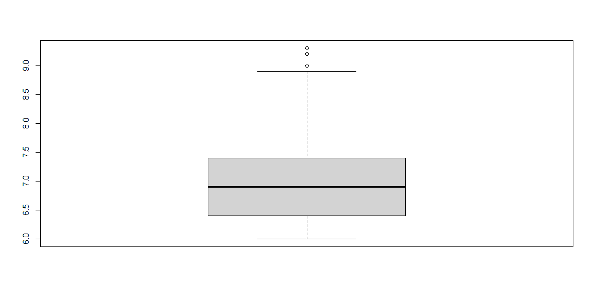

# {.tabset .tabset-fade}


## IMDB

https://www.imdb.com/search/title

https://www.imdb.com/search/title/?title_type=feature&user_rating=6.0,10.0&num_votes=20000,&certificates=US%3AG,US%3APG,US%3APG-13,US%3AR,US%3ANC-17&countries=us&languages=en&sort=user_rating,desc

## Scrape

https://rpubs.com/uky994/578161

https://rstudio-pubs-static.s3.amazonaws.com/299685_5ce4f9fb6fa3476e98fad355623a5f1e.html

### Ratings 6.0 to 10.0


```r
IMDB <- data.frame()

# https://www.imdb.com/search/title/?title_type=feature&user_rating=6.0,10.0&num_votes=20000,&certificates=US%3AG,US%3APG,US%3APG-13,US%3AR,US%3ANC-17&countries=us&languages=en&sort=user_rating,desc&start=1&ref_=adv_nxt 

  for (each_page in seq(from = 1, to = 3625, by=50)) {
      link = paste0("https://www.imdb.com/search/title/?title_type=feature&user_rating=6.0,10.0&num_votes=20000,&certificates=US%3AG,US%3APG,US%3APG-13,US%3AR,US%3ANC-17&countries=us&languages=en&sort=user_rating,desc&start=",each_page,"&ref_=adv_nxt")
      page <- read_html(link)
      RK <- page %>% html_nodes(".text-primary") %>% html_text()
      Title <- page %>% html_nodes(".lister-item-header a") %>% html_text()
      Year <- page %>% html_nodes(".text-muted.unbold") %>% html_text()
      Cert <- html_node(html_nodes(page,".lister-item-content"), ".certificate") %>% html_text()
      Runtime <- html_node(html_nodes(page,".lister-item-content"), ".runtime") %>% html_text()
      Genre <- html_node(html_nodes(page,".lister-item-content"), ".genre") %>% html_text()
      Rating <- html_node(html_nodes(page,".lister-item-content"), ".ratings-imdb-rating strong") %>% html_text()
      Meta <- html_node(html_nodes(page,".lister-item-content"), ".favorable") %>% html_text()
      Votes <- html_node(html_nodes(page,".lister-item-content"), ".sort-num_votes-visible span:nth-child(2)") %>% html_text()
      Gross <- html_node(html_nodes(page,".lister-item-content"), ".ghost~ .text-muted+ span") %>% html_text()
      Summary <- html_node(html_nodes(page,".lister-item-content"), ".ratings-bar+ .text-muted") %>% html_text()
      Director <- html_node(html_nodes(page,".lister-item-content"), ".text-muted+ p a:nth-child(1)") %>% html_text()
      Star1 <- html_node(html_nodes(page,".lister-item-content"), ".ghost+ a") %>% html_text()
      print(each_page)
      IMDB <- rbind(IMDB,data.frame(RK,Title,Year,Runtime,Cert,Genre,Rating,Meta,Votes,Gross,Summary,Director,Star1))
  }
```

```
## [1] 1
## [1] 51
## [1] 101
## [1] 151
## [1] 201
## [1] 251
## [1] 301
## [1] 351
## [1] 401
## [1] 451
## [1] 501
## [1] 551
## [1] 601
## [1] 651
## [1] 701
## [1] 751
## [1] 801
## [1] 851
## [1] 901
## [1] 951
## [1] 1001
## [1] 1051
## [1] 1101
## [1] 1151
## [1] 1201
## [1] 1251
## [1] 1301
## [1] 1351
## [1] 1401
## [1] 1451
## [1] 1501
## [1] 1551
## [1] 1601
## [1] 1651
## [1] 1701
## [1] 1751
## [1] 1801
## [1] 1851
## [1] 1901
## [1] 1951
## [1] 2001
## [1] 2051
## [1] 2101
## [1] 2151
## [1] 2201
## [1] 2251
## [1] 2301
## [1] 2351
## [1] 2401
## [1] 2451
## [1] 2501
## [1] 2551
## [1] 2601
## [1] 2651
## [1] 2701
## [1] 2751
## [1] 2801
## [1] 2851
## [1] 2901
## [1] 2951
## [1] 3001
## [1] 3051
## [1] 3101
## [1] 3151
## [1] 3201
## [1] 3251
## [1] 3301
## [1] 3351
## [1] 3401
## [1] 3451
## [1] 3501
## [1] 3551
## [1] 3601
```

```r
datatable(IMDB, rownames = FALSE, extensions = 'Responsive')
```

```{=html}
<div id="htmlwidget-64820e523f737fd964f3" style="width:100%;height:auto;" class="datatables html-widget"></div>
<script type="application/json" data-for="htmlwidget-64820e523f737fd964f3">{"x":{"filter":"none","extensions":["Responsive"],"data":[["1.","2.","3.","4.","5.","6.","7.","8.","9.","10.","11.","12.","13.","14.","15.","16.","17.","18.","19.","20.","21.","22.","23.","24.","25.","26.","27.","28.","29.","30.","31.","32.","33.","34.","35.","36.","37.","38.","39.","40.","41.","42.","43.","44.","45.","46.","47.","48.","49.","50.","51.","52.","53.","54.","55.","56.","57.","58.","59.","60.","61.","62.","63.","64.","65.","66.","67.","68.","69.","70.","71.","72.","73.","74.","75.","76.","77.","78.","79.","80.","81.","82.","83.","84.","85.","86.","87.","88.","89.","90.","91.","92.","93.","94.","95.","96.","97.","98.","99.","100.","101.","102.","103.","104.","105.","106.","107.","108.","109.","110.","111.","112.","113.","114.","115.","116.","117.","118.","119.","120.","121.","122.","123.","124.","125.","126.","127.","128.","129.","130.","131.","132.","133.","134.","135.","136.","137.","138.","139.","140.","141.","142.","143.","144.","145.","146.","147.","148.","149.","150.","151.","152.","153.","154.","155.","156.","157.","158.","159.","160.","161.","162.","163.","164.","165.","166.","167.","168.","169.","170.","171.","172.","173.","174.","175.","176.","177.","178.","179.","180.","181.","182.","183.","184.","185.","186.","187.","188.","189.","190.","191.","192.","193.","194.","195.","196.","197.","198.","199.","200.","201.","202.","203.","204.","205.","206.","207.","208.","209.","210.","211.","212.","213.","214.","215.","216.","217.","218.","219.","220.","221.","222.","223.","224.","225.","226.","227.","228.","229.","230.","231.","232.","233.","234.","235.","236.","237.","238.","239.","240.","241.","242.","243.","244.","245.","246.","247.","248.","249.","250.","251.","252.","253.","254.","255.","256.","257.","258.","259.","260.","261.","262.","263.","264.","265.","266.","267.","268.","269.","270.","271.","272.","273.","274.","275.","276.","277.","278.","279.","280.","281.","282.","283.","284.","285.","286.","287.","288.","289.","290.","291.","292.","293.","294.","295.","296.","297.","298.","299.","300.","301.","302.","303.","304.","305.","306.","307.","308.","309.","310.","311.","312.","313.","314.","315.","316.","317.","318.","319.","320.","321.","322.","323.","324.","325.","326.","327.","328.","329.","330.","331.","332.","333.","334.","335.","336.","337.","338.","339.","340.","341.","342.","343.","344.","345.","346.","347.","348.","349.","350.","351.","352.","353.","354.","355.","356.","357.","358.","359.","360.","361.","362.","363.","364.","365.","366.","367.","368.","369.","370.","371.","372.","373.","374.","375.","376.","377.","378.","379.","380.","381.","382.","383.","384.","385.","386.","387.","388.","389.","390.","391.","392.","393.","394.","395.","396.","397.","398.","399.","400.","401.","402.","403.","404.","405.","406.","407.","408.","409.","410.","411.","412.","413.","414.","415.","416.","417.","418.","419.","420.","421.","422.","423.","424.","425.","426.","427.","428.","429.","430.","431.","432.","433.","434.","435.","436.","437.","438.","439.","440.","441.","442.","443.","444.","445.","446.","447.","448.","449.","450.","451.","452.","453.","454.","455.","456.","457.","458.","459.","460.","461.","462.","463.","464.","465.","466.","467.","468.","469.","470.","471.","472.","473.","474.","475.","476.","477.","478.","479.","480.","481.","482.","483.","484.","485.","486.","487.","488.","489.","490.","491.","492.","493.","494.","495.","496.","497.","498.","499.","500.","501.","502.","503.","504.","505.","506.","507.","508.","509.","510.","511.","512.","513.","514.","515.","516.","517.","518.","519.","520.","521.","522.","523.","524.","525.","526.","527.","528.","529.","530.","531.","532.","533.","534.","535.","536.","537.","538.","539.","540.","541.","542.","543.","544.","545.","546.","547.","548.","549.","550.","551.","552.","553.","554.","555.","556.","557.","558.","559.","560.","561.","562.","563.","564.","565.","566.","567.","568.","569.","570.","571.","572.","573.","574.","575.","576.","577.","578.","579.","580.","581.","582.","583.","584.","585.","586.","587.","588.","589.","590.","591.","592.","593.","594.","595.","596.","597.","598.","599.","600.","601.","602.","603.","604.","605.","606.","607.","608.","609.","610.","611.","612.","613.","614.","615.","616.","617.","618.","619.","620.","621.","622.","623.","624.","625.","626.","627.","628.","629.","630.","631.","632.","633.","634.","635.","636.","637.","638.","639.","640.","641.","642.","643.","644.","645.","646.","647.","648.","649.","650.","651.","652.","653.","654.","655.","656.","657.","658.","659.","660.","661.","662.","663.","664.","665.","666.","667.","668.","669.","670.","671.","672.","673.","674.","675.","676.","677.","678.","679.","680.","681.","682.","683.","684.","685.","686.","687.","688.","689.","690.","691.","692.","693.","694.","695.","696.","697.","698.","699.","700.","701.","702.","703.","704.","705.","706.","707.","708.","709.","710.","711.","712.","713.","714.","715.","716.","717.","718.","719.","720.","721.","722.","723.","724.","725.","726.","727.","728.","729.","730.","731.","732.","733.","734.","735.","736.","737.","738.","739.","740.","741.","742.","743.","744.","745.","746.","747.","748.","749.","750.","751.","752.","753.","754.","755.","756.","757.","758.","759.","760.","761.","762.","763.","764.","765.","766.","767.","768.","769.","770.","771.","772.","773.","774.","775.","776.","777.","778.","779.","780.","781.","782.","783.","784.","785.","786.","787.","788.","789.","790.","791.","792.","793.","794.","795.","796.","797.","798.","799.","800.","801.","802.","803.","804.","805.","806.","807.","808.","809.","810.","811.","812.","813.","814.","815.","816.","817.","818.","819.","820.","821.","822.","823.","824.","825.","826.","827.","828.","829.","830.","831.","832.","833.","834.","835.","836.","837.","838.","839.","840.","841.","842.","843.","844.","845.","846.","847.","848.","849.","850.","851.","852.","853.","854.","855.","856.","857.","858.","859.","860.","861.","862.","863.","864.","865.","866.","867.","868.","869.","870.","871.","872.","873.","874.","875.","876.","877.","878.","879.","880.","881.","882.","883.","884.","885.","886.","887.","888.","889.","890.","891.","892.","893.","894.","895.","896.","897.","898.","899.","900.","901.","902.","903.","904.","905.","906.","907.","908.","909.","910.","911.","912.","913.","914.","915.","916.","917.","918.","919.","920.","921.","922.","923.","924.","925.","926.","927.","928.","929.","930.","931.","932.","933.","934.","935.","936.","937.","938.","939.","940.","941.","942.","943.","944.","945.","946.","947.","948.","949.","950.","951.","952.","953.","954.","955.","956.","957.","958.","959.","960.","961.","962.","963.","964.","965.","966.","967.","968.","969.","970.","971.","972.","973.","974.","975.","976.","977.","978.","979.","980.","981.","982.","983.","984.","985.","986.","987.","988.","989.","990.","991.","992.","993.","994.","995.","996.","997.","998.","999.","1,000.","1,001.","1,002.","1,003.","1,004.","1,005.","1,006.","1,007.","1,008.","1,009.","1,010.","1,011.","1,012.","1,013.","1,014.","1,015.","1,016.","1,017.","1,018.","1,019.","1,020.","1,021.","1,022.","1,023.","1,024.","1,025.","1,026.","1,027.","1,028.","1,029.","1,030.","1,031.","1,032.","1,033.","1,034.","1,035.","1,036.","1,037.","1,038.","1,039.","1,040.","1,041.","1,042.","1,043.","1,044.","1,045.","1,046.","1,047.","1,048.","1,049.","1,050.","1,051.","1,052.","1,053.","1,054.","1,055.","1,056.","1,057.","1,058.","1,059.","1,060.","1,061.","1,062.","1,063.","1,064.","1,065.","1,066.","1,067.","1,068.","1,069.","1,070.","1,071.","1,072.","1,073.","1,074.","1,075.","1,076.","1,077.","1,078.","1,079.","1,080.","1,081.","1,082.","1,083.","1,084.","1,085.","1,086.","1,087.","1,088.","1,089.","1,090.","1,091.","1,092.","1,093.","1,094.","1,095.","1,096.","1,097.","1,098.","1,099.","1,100.","1,101.","1,102.","1,103.","1,104.","1,105.","1,106.","1,107.","1,108.","1,109.","1,110.","1,111.","1,112.","1,113.","1,114.","1,115.","1,116.","1,117.","1,118.","1,119.","1,120.","1,121.","1,122.","1,123.","1,124.","1,125.","1,126.","1,127.","1,128.","1,129.","1,130.","1,131.","1,132.","1,133.","1,134.","1,135.","1,136.","1,137.","1,138.","1,139.","1,140.","1,141.","1,142.","1,143.","1,144.","1,145.","1,146.","1,147.","1,148.","1,149.","1,150.","1,151.","1,152.","1,153.","1,154.","1,155.","1,156.","1,157.","1,158.","1,159.","1,160.","1,161.","1,162.","1,163.","1,164.","1,165.","1,166.","1,167.","1,168.","1,169.","1,170.","1,171.","1,172.","1,173.","1,174.","1,175.","1,176.","1,177.","1,178.","1,179.","1,180.","1,181.","1,182.","1,183.","1,184.","1,185.","1,186.","1,187.","1,188.","1,189.","1,190.","1,191.","1,192.","1,193.","1,194.","1,195.","1,196.","1,197.","1,198.","1,199.","1,200.","1,201.","1,202.","1,203.","1,204.","1,205.","1,206.","1,207.","1,208.","1,209.","1,210.","1,211.","1,212.","1,213.","1,214.","1,215.","1,216.","1,217.","1,218.","1,219.","1,220.","1,221.","1,222.","1,223.","1,224.","1,225.","1,226.","1,227.","1,228.","1,229.","1,230.","1,231.","1,232.","1,233.","1,234.","1,235.","1,236.","1,237.","1,238.","1,239.","1,240.","1,241.","1,242.","1,243.","1,244.","1,245.","1,246.","1,247.","1,248.","1,249.","1,250.","1,251.","1,252.","1,253.","1,254.","1,255.","1,256.","1,257.","1,258.","1,259.","1,260.","1,261.","1,262.","1,263.","1,264.","1,265.","1,266.","1,267.","1,268.","1,269.","1,270.","1,271.","1,272.","1,273.","1,274.","1,275.","1,276.","1,277.","1,278.","1,279.","1,280.","1,281.","1,282.","1,283.","1,284.","1,285.","1,286.","1,287.","1,288.","1,289.","1,290.","1,291.","1,292.","1,293.","1,294.","1,295.","1,296.","1,297.","1,298.","1,299.","1,300.","1,301.","1,302.","1,303.","1,304.","1,305.","1,306.","1,307.","1,308.","1,309.","1,310.","1,311.","1,312.","1,313.","1,314.","1,315.","1,316.","1,317.","1,318.","1,319.","1,320.","1,321.","1,322.","1,323.","1,324.","1,325.","1,326.","1,327.","1,328.","1,329.","1,330.","1,331.","1,332.","1,333.","1,334.","1,335.","1,336.","1,337.","1,338.","1,339.","1,340.","1,341.","1,342.","1,343.","1,344.","1,345.","1,346.","1,347.","1,348.","1,349.","1,350.","1,351.","1,352.","1,353.","1,354.","1,355.","1,356.","1,357.","1,358.","1,359.","1,360.","1,361.","1,362.","1,363.","1,364.","1,365.","1,366.","1,367.","1,368.","1,369.","1,370.","1,371.","1,372.","1,373.","1,374.","1,375.","1,376.","1,377.","1,378.","1,379.","1,380.","1,381.","1,382.","1,383.","1,384.","1,385.","1,386.","1,387.","1,388.","1,389.","1,390.","1,391.","1,392.","1,393.","1,394.","1,395.","1,396.","1,397.","1,398.","1,399.","1,400.","1,401.","1,402.","1,403.","1,404.","1,405.","1,406.","1,407.","1,408.","1,409.","1,410.","1,411.","1,412.","1,413.","1,414.","1,415.","1,416.","1,417.","1,418.","1,419.","1,420.","1,421.","1,422.","1,423.","1,424.","1,425.","1,426.","1,427.","1,428.","1,429.","1,430.","1,431.","1,432.","1,433.","1,434.","1,435.","1,436.","1,437.","1,438.","1,439.","1,440.","1,441.","1,442.","1,443.","1,444.","1,445.","1,446.","1,447.","1,448.","1,449.","1,450.","1,451.","1,452.","1,453.","1,454.","1,455.","1,456.","1,457.","1,458.","1,459.","1,460.","1,461.","1,462.","1,463.","1,464.","1,465.","1,466.","1,467.","1,468.","1,469.","1,470.","1,471.","1,472.","1,473.","1,474.","1,475.","1,476.","1,477.","1,478.","1,479.","1,480.","1,481.","1,482.","1,483.","1,484.","1,485.","1,486.","1,487.","1,488.","1,489.","1,490.","1,491.","1,492.","1,493.","1,494.","1,495.","1,496.","1,497.","1,498.","1,499.","1,500.","1,501.","1,502.","1,503.","1,504.","1,505.","1,506.","1,507.","1,508.","1,509.","1,510.","1,511.","1,512.","1,513.","1,514.","1,515.","1,516.","1,517.","1,518.","1,519.","1,520.","1,521.","1,522.","1,523.","1,524.","1,525.","1,526.","1,527.","1,528.","1,529.","1,530.","1,531.","1,532.","1,533.","1,534.","1,535.","1,536.","1,537.","1,538.","1,539.","1,540.","1,541.","1,542.","1,543.","1,544.","1,545.","1,546.","1,547.","1,548.","1,549.","1,550.","1,551.","1,552.","1,553.","1,554.","1,555.","1,556.","1,557.","1,558.","1,559.","1,560.","1,561.","1,562.","1,563.","1,564.","1,565.","1,566.","1,567.","1,568.","1,569.","1,570.","1,571.","1,572.","1,573.","1,574.","1,575.","1,576.","1,577.","1,578.","1,579.","1,580.","1,581.","1,582.","1,583.","1,584.","1,585.","1,586.","1,587.","1,588.","1,589.","1,590.","1,591.","1,592.","1,593.","1,594.","1,595.","1,596.","1,597.","1,598.","1,599.","1,600.","1,601.","1,602.","1,603.","1,604.","1,605.","1,606.","1,607.","1,608.","1,609.","1,610.","1,611.","1,612.","1,613.","1,614.","1,615.","1,616.","1,617.","1,618.","1,619.","1,620.","1,621.","1,622.","1,623.","1,624.","1,625.","1,626.","1,627.","1,628.","1,629.","1,630.","1,631.","1,632.","1,633.","1,634.","1,635.","1,636.","1,637.","1,638.","1,639.","1,640.","1,641.","1,642.","1,643.","1,644.","1,645.","1,646.","1,647.","1,648.","1,649.","1,650.","1,651.","1,652.","1,653.","1,654.","1,655.","1,656.","1,657.","1,658.","1,659.","1,660.","1,661.","1,662.","1,663.","1,664.","1,665.","1,666.","1,667.","1,668.","1,669.","1,670.","1,671.","1,672.","1,673.","1,674.","1,675.","1,676.","1,677.","1,678.","1,679.","1,680.","1,681.","1,682.","1,683.","1,684.","1,685.","1,686.","1,687.","1,688.","1,689.","1,690.","1,691.","1,692.","1,693.","1,694.","1,695.","1,696.","1,697.","1,698.","1,699.","1,700.","1,701.","1,702.","1,703.","1,704.","1,705.","1,706.","1,707.","1,708.","1,709.","1,710.","1,711.","1,712.","1,713.","1,714.","1,715.","1,716.","1,717.","1,718.","1,719.","1,720.","1,721.","1,722.","1,723.","1,724.","1,725.","1,726.","1,727.","1,728.","1,729.","1,730.","1,731.","1,732.","1,733.","1,734.","1,735.","1,736.","1,737.","1,738.","1,739.","1,740.","1,741.","1,742.","1,743.","1,744.","1,745.","1,746.","1,747.","1,748.","1,749.","1,750.","1,751.","1,752.","1,753.","1,754.","1,755.","1,756.","1,757.","1,758.","1,759.","1,760.","1,761.","1,762.","1,763.","1,764.","1,765.","1,766.","1,767.","1,768.","1,769.","1,770.","1,771.","1,772.","1,773.","1,774.","1,775.","1,776.","1,777.","1,778.","1,779.","1,780.","1,781.","1,782.","1,783.","1,784.","1,785.","1,786.","1,787.","1,788.","1,789.","1,790.","1,791.","1,792.","1,793.","1,794.","1,795.","1,796.","1,797.","1,798.","1,799.","1,800.","1,801.","1,802.","1,803.","1,804.","1,805.","1,806.","1,807.","1,808.","1,809.","1,810.","1,811.","1,812.","1,813.","1,814.","1,815.","1,816.","1,817.","1,818.","1,819.","1,820.","1,821.","1,822.","1,823.","1,824.","1,825.","1,826.","1,827.","1,828.","1,829.","1,830.","1,831.","1,832.","1,833.","1,834.","1,835.","1,836.","1,837.","1,838.","1,839.","1,840.","1,841.","1,842.","1,843.","1,844.","1,845.","1,846.","1,847.","1,848.","1,849.","1,850.","1,851.","1,852.","1,853.","1,854.","1,855.","1,856.","1,857.","1,858.","1,859.","1,860.","1,861.","1,862.","1,863.","1,864.","1,865.","1,866.","1,867.","1,868.","1,869.","1,870.","1,871.","1,872.","1,873.","1,874.","1,875.","1,876.","1,877.","1,878.","1,879.","1,880.","1,881.","1,882.","1,883.","1,884.","1,885.","1,886.","1,887.","1,888.","1,889.","1,890.","1,891.","1,892.","1,893.","1,894.","1,895.","1,896.","1,897.","1,898.","1,899.","1,900.","1,901.","1,902.","1,903.","1,904.","1,905.","1,906.","1,907.","1,908.","1,909.","1,910.","1,911.","1,912.","1,913.","1,914.","1,915.","1,916.","1,917.","1,918.","1,919.","1,920.","1,921.","1,922.","1,923.","1,924.","1,925.","1,926.","1,927.","1,928.","1,929.","1,930.","1,931.","1,932.","1,933.","1,934.","1,935.","1,936.","1,937.","1,938.","1,939.","1,940.","1,941.","1,942.","1,943.","1,944.","1,945.","1,946.","1,947.","1,948.","1,949.","1,950.","1,951.","1,952.","1,953.","1,954.","1,955.","1,956.","1,957.","1,958.","1,959.","1,960.","1,961.","1,962.","1,963.","1,964.","1,965.","1,966.","1,967.","1,968.","1,969.","1,970.","1,971.","1,972.","1,973.","1,974.","1,975.","1,976.","1,977.","1,978.","1,979.","1,980.","1,981.","1,982.","1,983.","1,984.","1,985.","1,986.","1,987.","1,988.","1,989.","1,990.","1,991.","1,992.","1,993.","1,994.","1,995.","1,996.","1,997.","1,998.","1,999.","2,000.","2,001.","2,002.","2,003.","2,004.","2,005.","2,006.","2,007.","2,008.","2,009.","2,010.","2,011.","2,012.","2,013.","2,014.","2,015.","2,016.","2,017.","2,018.","2,019.","2,020.","2,021.","2,022.","2,023.","2,024.","2,025.","2,026.","2,027.","2,028.","2,029.","2,030.","2,031.","2,032.","2,033.","2,034.","2,035.","2,036.","2,037.","2,038.","2,039.","2,040.","2,041.","2,042.","2,043.","2,044.","2,045.","2,046.","2,047.","2,048.","2,049.","2,050.","2,051.","2,052.","2,053.","2,054.","2,055.","2,056.","2,057.","2,058.","2,059.","2,060.","2,061.","2,062.","2,063.","2,064.","2,065.","2,066.","2,067.","2,068.","2,069.","2,070.","2,071.","2,072.","2,073.","2,074.","2,075.","2,076.","2,077.","2,078.","2,079.","2,080.","2,081.","2,082.","2,083.","2,084.","2,085.","2,086.","2,087.","2,088.","2,089.","2,090.","2,091.","2,092.","2,093.","2,094.","2,095.","2,096.","2,097.","2,098.","2,099.","2,100.","2,101.","2,102.","2,103.","2,104.","2,105.","2,106.","2,107.","2,108.","2,109.","2,110.","2,111.","2,112.","2,113.","2,114.","2,115.","2,116.","2,117.","2,118.","2,119.","2,120.","2,121.","2,122.","2,123.","2,124.","2,125.","2,126.","2,127.","2,128.","2,129.","2,130.","2,131.","2,132.","2,133.","2,134.","2,135.","2,136.","2,137.","2,138.","2,139.","2,140.","2,141.","2,142.","2,143.","2,144.","2,145.","2,146.","2,147.","2,148.","2,149.","2,150.","2,151.","2,152.","2,153.","2,154.","2,155.","2,156.","2,157.","2,158.","2,159.","2,160.","2,161.","2,162.","2,163.","2,164.","2,165.","2,166.","2,167.","2,168.","2,169.","2,170.","2,171.","2,172.","2,173.","2,174.","2,175.","2,176.","2,177.","2,178.","2,179.","2,180.","2,181.","2,182.","2,183.","2,184.","2,185.","2,186.","2,187.","2,188.","2,189.","2,190.","2,191.","2,192.","2,193.","2,194.","2,195.","2,196.","2,197.","2,198.","2,199.","2,200.","2,201.","2,202.","2,203.","2,204.","2,205.","2,206.","2,207.","2,208.","2,209.","2,210.","2,211.","2,212.","2,213.","2,214.","2,215.","2,216.","2,217.","2,218.","2,219.","2,220.","2,221.","2,222.","2,223.","2,224.","2,225.","2,226.","2,227.","2,228.","2,229.","2,230.","2,231.","2,232.","2,233.","2,234.","2,235.","2,236.","2,237.","2,238.","2,239.","2,240.","2,241.","2,242.","2,243.","2,244.","2,245.","2,246.","2,247.","2,248.","2,249.","2,250.","2,251.","2,252.","2,253.","2,254.","2,255.","2,256.","2,257.","2,258.","2,259.","2,260.","2,261.","2,262.","2,263.","2,264.","2,265.","2,266.","2,267.","2,268.","2,269.","2,270.","2,271.","2,272.","2,273.","2,274.","2,275.","2,276.","2,277.","2,278.","2,279.","2,280.","2,281.","2,282.","2,283.","2,284.","2,285.","2,286.","2,287.","2,288.","2,289.","2,290.","2,291.","2,292.","2,293.","2,294.","2,295.","2,296.","2,297.","2,298.","2,299.","2,300.","2,301.","2,302.","2,303.","2,304.","2,305.","2,306.","2,307.","2,308.","2,309.","2,310.","2,311.","2,312.","2,313.","2,314.","2,315.","2,316.","2,317.","2,318.","2,319.","2,320.","2,321.","2,322.","2,323.","2,324.","2,325.","2,326.","2,327.","2,328.","2,329.","2,330.","2,331.","2,332.","2,333.","2,334.","2,335.","2,336.","2,337.","2,338.","2,339.","2,340.","2,341.","2,342.","2,343.","2,344.","2,345.","2,346.","2,347.","2,348.","2,349.","2,350.","2,351.","2,352.","2,353.","2,354.","2,355.","2,356.","2,357.","2,358.","2,359.","2,360.","2,361.","2,362.","2,363.","2,364.","2,365.","2,366.","2,367.","2,368.","2,369.","2,370.","2,371.","2,372.","2,373.","2,374.","2,375.","2,376.","2,377.","2,378.","2,379.","2,380.","2,381.","2,382.","2,383.","2,384.","2,385.","2,386.","2,387.","2,388.","2,389.","2,390.","2,391.","2,392.","2,393.","2,394.","2,395.","2,396.","2,397.","2,398.","2,399.","2,400.","2,401.","2,402.","2,403.","2,404.","2,405.","2,406.","2,407.","2,408.","2,409.","2,410.","2,411.","2,412.","2,413.","2,414.","2,415.","2,416.","2,417.","2,418.","2,419.","2,420.","2,421.","2,422.","2,423.","2,424.","2,425.","2,426.","2,427.","2,428.","2,429.","2,430.","2,431.","2,432.","2,433.","2,434.","2,435.","2,436.","2,437.","2,438.","2,439.","2,440.","2,441.","2,442.","2,443.","2,444.","2,445.","2,446.","2,447.","2,448.","2,449.","2,450.","2,451.","2,452.","2,453.","2,454.","2,455.","2,456.","2,457.","2,458.","2,459.","2,460.","2,461.","2,462.","2,463.","2,464.","2,465.","2,466.","2,467.","2,468.","2,469.","2,470.","2,471.","2,472.","2,473.","2,474.","2,475.","2,476.","2,477.","2,478.","2,479.","2,480.","2,481.","2,482.","2,483.","2,484.","2,485.","2,486.","2,487.","2,488.","2,489.","2,490.","2,491.","2,492.","2,493.","2,494.","2,495.","2,496.","2,497.","2,498.","2,499.","2,500.","2,501.","2,502.","2,503.","2,504.","2,505.","2,506.","2,507.","2,508.","2,509.","2,510.","2,511.","2,512.","2,513.","2,514.","2,515.","2,516.","2,517.","2,518.","2,519.","2,520.","2,521.","2,522.","2,523.","2,524.","2,525.","2,526.","2,527.","2,528.","2,529.","2,530.","2,531.","2,532.","2,533.","2,534.","2,535.","2,536.","2,537.","2,538.","2,539.","2,540.","2,541.","2,542.","2,543.","2,544.","2,545.","2,546.","2,547.","2,548.","2,549.","2,550.","2,551.","2,552.","2,553.","2,554.","2,555.","2,556.","2,557.","2,558.","2,559.","2,560.","2,561.","2,562.","2,563.","2,564.","2,565.","2,566.","2,567.","2,568.","2,569.","2,570.","2,571.","2,572.","2,573.","2,574.","2,575.","2,576.","2,577.","2,578.","2,579.","2,580.","2,581.","2,582.","2,583.","2,584.","2,585.","2,586.","2,587.","2,588.","2,589.","2,590.","2,591.","2,592.","2,593.","2,594.","2,595.","2,596.","2,597.","2,598.","2,599.","2,600.","2,601.","2,602.","2,603.","2,604.","2,605.","2,606.","2,607.","2,608.","2,609.","2,610.","2,611.","2,612.","2,613.","2,614.","2,615.","2,616.","2,617.","2,618.","2,619.","2,620.","2,621.","2,622.","2,623.","2,624.","2,625.","2,626.","2,627.","2,628.","2,629.","2,630.","2,631.","2,632.","2,633.","2,634.","2,635.","2,636.","2,637.","2,638.","2,639.","2,640.","2,641.","2,642.","2,643.","2,644.","2,645.","2,646.","2,647.","2,648.","2,649.","2,650.","2,651.","2,652.","2,653.","2,654.","2,655.","2,656.","2,657.","2,658.","2,659.","2,660.","2,661.","2,662.","2,663.","2,664.","2,665.","2,666.","2,667.","2,668.","2,669.","2,670.","2,671.","2,672.","2,673.","2,674.","2,675.","2,676.","2,677.","2,678.","2,679.","2,680.","2,681.","2,682.","2,683.","2,684.","2,685.","2,686.","2,687.","2,688.","2,689.","2,690.","2,691.","2,692.","2,693.","2,694.","2,695.","2,696.","2,697.","2,698.","2,699.","2,700.","2,701.","2,702.","2,703.","2,704.","2,705.","2,706.","2,707.","2,708.","2,709.","2,710.","2,711.","2,712.","2,713.","2,714.","2,715.","2,716.","2,717.","2,718.","2,719.","2,720.","2,721.","2,722.","2,723.","2,724.","2,725.","2,726.","2,727.","2,728.","2,729.","2,730.","2,731.","2,732.","2,733.","2,734.","2,735.","2,736.","2,737.","2,738.","2,739.","2,740.","2,741.","2,742.","2,743.","2,744.","2,745.","2,746.","2,747.","2,748.","2,749.","2,750.","2,751.","2,752.","2,753.","2,754.","2,755.","2,756.","2,757.","2,758.","2,759.","2,760.","2,761.","2,762.","2,763.","2,764.","2,765.","2,766.","2,767.","2,768.","2,769.","2,770.","2,771.","2,772.","2,773.","2,774.","2,775.","2,776.","2,777.","2,778.","2,779.","2,780.","2,781.","2,782.","2,783.","2,784.","2,785.","2,786.","2,787.","2,788.","2,789.","2,790.","2,791.","2,792.","2,793.","2,794.","2,795.","2,796.","2,797.","2,798.","2,799.","2,800.","2,801.","2,802.","2,803.","2,804.","2,805.","2,806.","2,807.","2,808.","2,809.","2,810.","2,811.","2,812.","2,813.","2,814.","2,815.","2,816.","2,817.","2,818.","2,819.","2,820.","2,821.","2,822.","2,823.","2,824.","2,825.","2,826.","2,827.","2,828.","2,829.","2,830.","2,831.","2,832.","2,833.","2,834.","2,835.","2,836.","2,837.","2,838.","2,839.","2,840.","2,841.","2,842.","2,843.","2,844.","2,845.","2,846.","2,847.","2,848.","2,849.","2,850.","2,851.","2,852.","2,853.","2,854.","2,855.","2,856.","2,857.","2,858.","2,859.","2,860.","2,861.","2,862.","2,863.","2,864.","2,865.","2,866.","2,867.","2,868.","2,869.","2,870.","2,871.","2,872.","2,873.","2,874.","2,875.","2,876.","2,877.","2,878.","2,879.","2,880.","2,881.","2,882.","2,883.","2,884.","2,885.","2,886.","2,887.","2,888.","2,889.","2,890.","2,891.","2,892.","2,893.","2,894.","2,895.","2,896.","2,897.","2,898.","2,899.","2,900.","2,901.","2,902.","2,903.","2,904.","2,905.","2,906.","2,907.","2,908.","2,909.","2,910.","2,911.","2,912.","2,913.","2,914.","2,915.","2,916.","2,917.","2,918.","2,919.","2,920.","2,921.","2,922.","2,923.","2,924.","2,925.","2,926.","2,927.","2,928.","2,929.","2,930.","2,931.","2,932.","2,933.","2,934.","2,935.","2,936.","2,937.","2,938.","2,939.","2,940.","2,941.","2,942.","2,943.","2,944.","2,945.","2,946.","2,947.","2,948.","2,949.","2,950.","2,951.","2,952.","2,953.","2,954.","2,955.","2,956.","2,957.","2,958.","2,959.","2,960.","2,961.","2,962.","2,963.","2,964.","2,965.","2,966.","2,967.","2,968.","2,969.","2,970.","2,971.","2,972.","2,973.","2,974.","2,975.","2,976.","2,977.","2,978.","2,979.","2,980.","2,981.","2,982.","2,983.","2,984.","2,985.","2,986.","2,987.","2,988.","2,989.","2,990.","2,991.","2,992.","2,993.","2,994.","2,995.","2,996.","2,997.","2,998.","2,999.","3,000.","3,001.","3,002.","3,003.","3,004.","3,005.","3,006.","3,007.","3,008.","3,009.","3,010.","3,011.","3,012.","3,013.","3,014.","3,015.","3,016.","3,017.","3,018.","3,019.","3,020.","3,021.","3,022.","3,023.","3,024.","3,025.","3,026.","3,027.","3,028.","3,029.","3,030.","3,031.","3,032.","3,033.","3,034.","3,035.","3,036.","3,037.","3,038.","3,039.","3,040.","3,041.","3,042.","3,043.","3,044.","3,045.","3,046.","3,047.","3,048.","3,049.","3,050.","3,051.","3,052.","3,053.","3,054.","3,055.","3,056.","3,057.","3,058.","3,059.","3,060.","3,061.","3,062.","3,063.","3,064.","3,065.","3,066.","3,067.","3,068.","3,069.","3,070.","3,071.","3,072.","3,073.","3,074.","3,075.","3,076.","3,077.","3,078.","3,079.","3,080.","3,081.","3,082.","3,083.","3,084.","3,085.","3,086.","3,087.","3,088.","3,089.","3,090.","3,091.","3,092.","3,093.","3,094.","3,095.","3,096.","3,097.","3,098.","3,099.","3,100.","3,101.","3,102.","3,103.","3,104.","3,105.","3,106.","3,107.","3,108.","3,109.","3,110.","3,111.","3,112.","3,113.","3,114.","3,115.","3,116.","3,117.","3,118.","3,119.","3,120.","3,121.","3,122.","3,123.","3,124.","3,125.","3,126.","3,127.","3,128.","3,129.","3,130.","3,131.","3,132.","3,133.","3,134.","3,135.","3,136.","3,137.","3,138.","3,139.","3,140.","3,141.","3,142.","3,143.","3,144.","3,145.","3,146.","3,147.","3,148.","3,149.","3,150.","3,151.","3,152.","3,153.","3,154.","3,155.","3,156.","3,157.","3,158.","3,159.","3,160.","3,161.","3,162.","3,163.","3,164.","3,165.","3,166.","3,167.","3,168.","3,169.","3,170.","3,171.","3,172.","3,173.","3,174.","3,175.","3,176.","3,177.","3,178.","3,179.","3,180.","3,181.","3,182.","3,183.","3,184.","3,185.","3,186.","3,187.","3,188.","3,189.","3,190.","3,191.","3,192.","3,193.","3,194.","3,195.","3,196.","3,197.","3,198.","3,199.","3,200.","3,201.","3,202.","3,203.","3,204.","3,205.","3,206.","3,207.","3,208.","3,209.","3,210.","3,211.","3,212.","3,213.","3,214.","3,215.","3,216.","3,217.","3,218.","3,219.","3,220.","3,221.","3,222.","3,223.","3,224.","3,225.","3,226.","3,227.","3,228.","3,229.","3,230.","3,231.","3,232.","3,233.","3,234.","3,235.","3,236.","3,237.","3,238.","3,239.","3,240.","3,241.","3,242.","3,243.","3,244.","3,245.","3,246.","3,247.","3,248.","3,249.","3,250.","3,251.","3,252.","3,253.","3,254.","3,255.","3,256.","3,257.","3,258.","3,259.","3,260.","3,261.","3,262.","3,263.","3,264.","3,265.","3,266.","3,267.","3,268.","3,269.","3,270.","3,271.","3,272.","3,273.","3,274.","3,275.","3,276.","3,277.","3,278.","3,279.","3,280.","3,281.","3,282.","3,283.","3,284.","3,285.","3,286.","3,287.","3,288.","3,289.","3,290.","3,291.","3,292.","3,293.","3,294.","3,295.","3,296.","3,297.","3,298.","3,299.","3,300.","3,301.","3,302.","3,303.","3,304.","3,305.","3,306.","3,307.","3,308.","3,309.","3,310.","3,311.","3,312.","3,313.","3,314.","3,315.","3,316.","3,317.","3,318.","3,319.","3,320.","3,321.","3,322.","3,323.","3,324.","3,325.","3,326.","3,327.","3,328.","3,329.","3,330.","3,331.","3,332.","3,333.","3,334.","3,335.","3,336.","3,337.","3,338.","3,339.","3,340.","3,341.","3,342.","3,343.","3,344.","3,345.","3,346.","3,347.","3,348.","3,349.","3,350.","3,351.","3,352.","3,353.","3,354.","3,355.","3,356.","3,357.","3,358.","3,359.","3,360.","3,361.","3,362.","3,363.","3,364.","3,365.","3,366.","3,367.","3,368.","3,369.","3,370.","3,371.","3,372.","3,373.","3,374.","3,375.","3,376.","3,377.","3,378.","3,379.","3,380.","3,381.","3,382.","3,383.","3,384.","3,385.","3,386.","3,387.","3,388.","3,389.","3,390.","3,391.","3,392.","3,393.","3,394.","3,395.","3,396.","3,397.","3,398.","3,399.","3,400.","3,401.","3,402.","3,403.","3,404.","3,405.","3,406.","3,407.","3,408.","3,409.","3,410.","3,411.","3,412.","3,413.","3,414.","3,415.","3,416.","3,417.","3,418.","3,419.","3,420.","3,421.","3,422.","3,423.","3,424.","3,425.","3,426.","3,427.","3,428.","3,429.","3,430.","3,431.","3,432.","3,433.","3,434.","3,435.","3,436.","3,437.","3,438.","3,439.","3,440.","3,441.","3,442.","3,443.","3,444.","3,445.","3,446.","3,447.","3,448.","3,449.","3,450.","3,451.","3,452.","3,453.","3,454.","3,455.","3,456.","3,457.","3,458.","3,459.","3,460.","3,461.","3,462.","3,463.","3,464.","3,465.","3,466.","3,467.","3,468.","3,469.","3,470.","3,471.","3,472.","3,473.","3,474.","3,475.","3,476.","3,477.","3,478.","3,479.","3,480.","3,481.","3,482.","3,483.","3,484.","3,485.","3,486.","3,487.","3,488.","3,489.","3,490.","3,491.","3,492.","3,493.","3,494.","3,495.","3,496.","3,497.","3,498.","3,499.","3,500.","3,501.","3,502.","3,503.","3,504.","3,505.","3,506.","3,507.","3,508.","3,509.","3,510.","3,511.","3,512.","3,513.","3,514.","3,515.","3,516.","3,517.","3,518.","3,519.","3,520.","3,521.","3,522.","3,523.","3,524.","3,525.","3,526.","3,527.","3,528.","3,529.","3,530.","3,531.","3,532.","3,533.","3,534.","3,535.","3,536.","3,537.","3,538.","3,539.","3,540.","3,541.","3,542.","3,543.","3,544.","3,545.","3,546.","3,547.","3,548.","3,549.","3,550.","3,551.","3,552.","3,553.","3,554.","3,555.","3,556.","3,557.","3,558.","3,559.","3,560.","3,561.","3,562.","3,563.","3,564.","3,565.","3,566.","3,567.","3,568.","3,569.","3,570.","3,571.","3,572.","3,573.","3,574.","3,575.","3,576.","3,577.","3,578.","3,579.","3,580.","3,581.","3,582.","3,583.","3,584.","3,585.","3,586.","3,587.","3,588.","3,589.","3,590.","3,591.","3,592.","3,593.","3,594.","3,595.","3,596.","3,597.","3,598.","3,599.","3,600.","3,601.","3,602.","3,603.","3,604.","3,605.","3,606.","3,607.","3,608.","3,609.","3,610.","3,611.","3,612.","3,613.","3,614.","3,615.","3,616.","3,617.","3,618.","3,619.","3,620.","3,621.","3,622.","3,623.","3,624.","3,625.","3,626.","3,627.","3,628.","3,629.","3,630.","3,631.","3,632.","3,633.","3,634.","3,635.","3,636.","3,637.","3,638.","3,639.","3,640.","3,641.","3,642.","3,643.","3,644.","3,645.","3,646.","3,647.","3,648.","3,649.","3,650."],["The Shawshank Redemption","The Godfather","The Dark Knight","The Godfather: Part II","The Lord of the Rings: The Return of the King","Pulp Fiction","Schindler's List","Inception","Fight Club","The Lord of the Rings: The Fellowship of the Ring","Forrest Gump","The Lord of the Rings: The Two Towers","The Matrix","Goodfellas","Star Wars: Episode V - The Empire Strikes Back","One Flew Over the Cuckoo's Nest","Interstellar","Saving Private Ryan","The Green Mile","Se7en","The Silence of the Lambs","Star Wars: Episode IV - A New Hope","It's a Wonderful Life","Whiplash","The Prestige","The Departed","The Pianist","Gladiator","American History X","The Usual Suspects","Léon: The Professional","The Lion King","Terminator 2: Judgment Day","Back to the Future","Once Upon a Time in the West","Psycho","Rear Window","Casablanca","Modern Times","City Lights","Hamilton","Joker","Spider-Man: Into the Spider-Verse","Avengers: Endgame","Avengers: Infinity War","Coco","Wheels","Django Unchained","The Dark Knight Rises","WALL·E","Memento","Once Upon a Time in America","Indiana Jones and the Raiders of the Lost Ark","The Shining","Apocalypse Now","Alien","The Great Dictator","1917","Inglourious Basterds","Eternal Sunshine of the Spotless Mind","Snatch","Requiem for a Dream","American Beauty","Good Will Hunting","Toy Story","Braveheart","Reservoir Dogs","Full Metal Jacket","Aliens","Amadeus","Scarface","Star Wars: Episode VI - Return of the Jedi","The Sting","A Clockwork Orange","2001: A Space Odyssey","Vertigo","Singin' in the Rain","Citizen Kane","Green Book","Klaus","Shutter Island","Up","The Wolf of Wall Street","There Will Be Blood","Toy Story 3","Batman Begins","A Beautiful Mind","L.A. Confidential","Heat","Casino","Unforgiven","Indiana Jones and the Last Crusade","Die Hard","Raging Bull","Taxi Driver","A Woman Under the Influence","Chinatown","Dial M for Murder","Three Billboards Outside Ebbing, Missouri","Logan","Room","Soul","The Grand Budapest Hotel","Gone Girl","Hacksaw Ridge","Inside Out","12 Years a Slave","Rush","Ford v Ferrari","Spotlight","Prisoners","Warrior","Zack Snyder's Justice League","Gran Torino","Harry Potter and the Deathly Hallows: Part 2","Hachi: A Dog's Tale","How to Train Your Dragon","Into the Wild","No Country for Old Men","V for Vendetta","Million Dollar Baby","Hotel Rwanda","Before Sunset","Kill Bill: Vol. 1","Finding Nemo","Catch Me If You Can","Monsters, Inc.","The Sixth Sense","The Truman Show","The Big Lebowski","Fargo","Before Sunrise","Jurassic Park","Dead Poets Society","The Princess Bride","Stand by Me","Platoon","Paris, Texas","The Thing","Blade Runner","The Elephant Man","The Deer Hunter","Rocky","Network","Barry Lyndon","Paper Moon","Ben-Hur","The Bridge on the River Kwai","Gone with the Wind","The Circus","Togo","La La Land","Lion","The Martian","Zootopia","Wonder","Short Term 12","The Raid 2","The Imitation Game","Guardians of the Galaxy","Blade Runner 2049","Her","The Revenant","The King's Speech","The Help","Deadpool","My Name Is Khan","Waltz with Bashir","Slumdog Millionaire","Black Swan","Elite Squad","The Avengers","Persepolis","Dallas Buyers Club","The Pursuit of Happyness","Blood Diamond","The Bourne Ultimatum","Sin City","Ratatouille","Casino Royale","Kill Bill: Vol. 2","Cinderella Man","Pirates of the Caribbean: The Curse of the Black Pearl","Big Fish","The Incredibles","Donnie Darko","Magnolia","Dancer in the Dark","The Straight Story","The Iron Giant","Sling Blade","12 Monkeys","The Nightmare Before Christmas","Groundhog Day","Blood In, Blood Out","Scent of a Woman","Aladdin","JFK","Beauty and the Beast","Dances with Wolves","Do the Right Thing","Rain Man","The Terminator","Gandhi","Being There","Annie Hall","All the President's Men","Jaws","Dog Day Afternoon","Young Frankenstein","Papillon","The Exorcist","Sleuth","The Last Picture Show","Fiddler on the Roof","Butch Cassidy and the Sundance Kid","Rosemary's Baby","Planet of the Apes","The Graduate","The Sound of Music","Doctor Zhivago","Touch of Evil","High Noon","A Streetcar Named Desire","Strangers on a Train","Rope","The Wizard of Oz","Knives Out","Marriage Story","Call Me by Your Name","Isle of Dogs","Bilal: A New Breed of Hero","Captain Fantastic","Thor: Ragnarok","Jojo Rabbit","Arrival","Before Midnight","X-Men: Days of Future Past","Bohemian Rhapsody","The Perks of Being a Wallflower","The Artist","Edge of Tomorrow","District 9","The Wrestler","Boyhood","Star Trek","In Bruges","Letters from Iwo Jima","Life of Pi","Fantastic Mr. Fox","Iron Man","Shaun of the Dead","Mystic River","Harry Potter and the Prisoner of Azkaban","Cowboy Bebop: The Movie","The Bourne Identity","Children of Men","Almost Famous","Mulholland Dr.","Shrek","Toy Story 2","Boogie Nights","True Romance","Carlito's Way","Edward Scissorhands","Crimes and Misdemeanors","The Untouchables","Hannah and Her Sisters","Brazil","This Is Spinal Tap","A Christmas Story","The Blues Brothers","Manhattan","All That Jazz","Harold and Maude","Patton","The Wild Bunch","The Lion in Winter","In Cold Blood","The Manchurian Candidate","Spartacus","The Ten Commandments","East of Eden","The Adventures of Robin Hood","The Gentlemen","Sound of Metal","Dunkirk","Hidden Figures","Paddington 2","Kubo and the Two Strings","Manchester by the Sea","Rogue One: A Star Wars Story","Captain America: Civil War","The Hateful Eight","Little Women","Loving Vincent","Pride","Nightcrawler","Star Wars: Episode VII - The Force Awakens","Big Hero 6","About Time","The Wind Rises","Moonrise Kingdom","How to Train Your Dragon 2","The Big Short","The Girl with the Dragon Tattoo","Captain Phillips","Straight Outta Compton","The Irishman","Moon","The Hobbit: The Desolation of Smaug","The Trial of the Chicago 7","The Fighter","Taken","The Boy in the Striped Pajamas","The Hobbit: An Unexpected Journey","Atonement","Drive","American Gangster","Avatar","Mr. Nobody","The Fall","Little Miss Sunshine","The Curious Case of Benjamin Button","Pride &amp; Prejudice","The World's Fastest Indian","Serenity","Walk the Line","The Notebook","The Triplets of Belleville","Waking Life","Remember the Titans","Cast Away","The Insider","October Sky","Titanic","Gattaca","Ed Wood","Tombstone","The Sandlot","The Remains of the Day","The Fugitive","A Bronx Tale","Batman: Mask of the Phantasm","Boyz n the Hood","Dreams","Misery","Awakenings","Glory","Back to the Future Part II","Mississippi Burning","Predator","Ferris Bueller's Day Off","The Goonies","The Color Purple","The Breakfast Club","Ghostbusters","The Right Stuff","The King of Comedy","E.T. the Extra-Terrestrial","Kramer vs. Kramer","Days of Heaven","The Outlaw Josey Wales","The Man Who Would Be King","The Conversation","Badlands","Cabaret","Midnight Cowboy","Bonnie and Clyde","My Fair Lady","Mary Poppins","The Longest Day","The African Queen","Shadow of a Doubt","Scarface","The Mitchells vs the Machines","Deadpool 2","Wind River","Get Out","Mission: Impossible - Fallout","Mr. Church","The Breadwinner","Kingsman: The Secret Service","The Fault in Our Stars","Me and Earl and the Dying Girl","Birdman or (The Unexpected Virtue of Ignorance)","Toy Story 4","Captain America: The Winter Soldier","Nebraska","Wreck-It Ralph","The Little Prince","Midnight in Paris","The Lego Movie","Gravity","Star Trek Into Darkness","The Social Network","X: First Class","The Hangover","Skyfall","Silver Linings Playbook","Argo","500 Days of Summer","Frost/Nixon","Changeling","Flipped","Zodiac","Lucky Number Slevin","Control","Tangled","Brokeback Mountain","3:10 to Yuma","Crash","The Bourne Supremacy","The Machinist","Ray","Lost in Translation","Harry Potter and the Goblet of Fire","Man on Fire","Coraline","The Last Samurai","Finding Neverland","In America","Adaptation.","Black Hawk Down","Road to Perdition","Hedwig and the Angry Inch","The Count of Monte Cristo","Ocean's Eleven","Vampire Hunter D: Bloodlust","O Brother, Where Art Thou?","Interstate 60: Episodes of the Road","South Park: Bigger, Longer &amp; Uncut","Office Space","The Boondock Saints","Training Day","Rushmore","Being John Malkovich","As Good as It Gets","The Game","The Fifth Element","Donnie Brasco","Primal Fear","Hamlet","Sense and Sensibility","A Little Princess","Clerks","What's Eating Gilbert Grape","Short Cuts","Philadelphia","The Muppet Christmas Carol","Malcolm X","The Last of the Mohicans","Glengarry Glen Ross","A Few Good Men","Night on Earth","Fried Green Tomatoes","Barton Fink","Miller's Crossing","Who Framed Roger Rabbit","Evil Dead II","Empire of the Sun","Down by Law","Blue Velvet","The Purple Rose of Cairo","After Hours","Zelig","The Verdict","Star Trek II: The Wrath of Khan","Missing","First Blood","Ordinary People","Airplane!","Breaking Away","Halloween","Nashville","Love and Death","The Taking of Pelham One Two Three","Blazing Saddles","Serpico","Enter the Dragon","What's Up, Doc?","Deliverance","McCabe &amp; Mrs. Miller","The French Connection","Dirty Harry","The Odd Couple","The Birds","Rebel Without a Cause","The Day the Earth Stood Still","How Green Was My Valley","Fantasia","Dark Waters","Waves","The Farewell","Searching","Once Upon a Time... In Hollywood","The Florida Project","Hotel Mumbai","Love, Simon","Just Mercy","Gifted","The Peanut Butter Falcon","Guardians of the Galaxy Vol. 2","Baby Driver","Only the Brave","Bridge of Spies","Incredibles 2","Moana","Sicario","Creed","Fury","Hell or High Water","Philomena","Dawn of the Planet of the Apes","End of Watch","Les Misérables","The Impossible","A Star Is Born","The Greatest Showman","The Art of Racing in the Rain","True Grit","Despicable Me","50/50","Kick-Ass","Moneyball","Zombieland","Sherlock Holmes","The Reader","Shelter","The Blind Side","The Visitor","Superbad","Seven Pounds","Eastern Promises","Stardust","United 93","Inside Man","Gone Baby Gone","Fearless","The Illusionist","Kung Fu Panda","Thank You for Smoking","The Kite Runner","300","Match Point","Watchmen","Lord of War","Saw","Synecdoche, New York","The Station Agent","21 Grams","Love Actually","25th Hour","The Butterfly Effect","I Am Sam","The Royal Tenenbaums","Harry Potter and the Sorcerer's Stone","The Others","Blow","Enemy at the Gates","Moulin Rouge!","Traffic","Minority Report","The Hurricane","American Psycho","The Thin Red Line","The Red Violin","Mulan","Fear and Loathing in Las Vegas","Star Trek: First Contact","Sleepers","Lost Highway","Die Hard with a Vengeance","Dead Man","The Bridges of Madison County","Apollo 13","The Crow","The Piano","Gettysburg","Falling Down","Dazed and Confused","My Cousin Vinny","The Commitments","The Hunt for Red October","Home Alone","The Godfather: Part III","When Harry Met Sally...","Christmas Vacation","Mystery Train","The Little Mermaid","The Naked Gun: From the Files of Police Squad!","Dangerous Liaisons","RoboCop","Planes, Trains &amp; Automobiles","Lethal Weapon","The Fly","Blood Simple","Victor Victoria","Sophie's Choice","The Secret of NIMH","On Golden Pond","The Warriors","The Muppet Movie","Hair","Escape from Alcatraz","Midnight Express","The Many Adventures of Winnie the Pooh","Close Encounters of the Third Kind","The Shootist","Robin Hood","The Long Goodbye","Play It Again, Sam","Little Big Man","The Producers","The Jungle Book","The Time Machine","Giant","Forbidden Planet","Snow White and the Seven Dwarfs","Judas and the Black Messiah","Promising Young Woman","A Dog's Journey","The Lighthouse","BlacKkKlansman","A Quiet Place","Upgrade","The Suicide Squad","Spider-Man: Far from Home","Phantom Thread","The Hate U Give","I, Tonya","The Big Sick","The Favourite","The Mauritanian","Nocturnal Animals","Miss Sloane","John Wick: Chapter 2","Richard Jewell","A Monster Calls","Still Alice","Trumbo","Predestination","How to Train Your Dragon: The Hidden World","Frances Ha","Fruitvale Station","Saving Mr. Banks","Inside Llewyn Davis","The Hunger Games: Catching Fire","127 Hours","Sherlock Holmes: A Game of Shadows","Summer Wars","The Conjuring","Disconnect","Rise of the Planet of the Apes","A Single Man","Luca","We Need to Talk About Kevin","Doctor Strange","Lone Survivor","Minari","Selma","Milk","Hugo","Source Code","Doubt","The Hurt Locker","The Town","The Book Thief","Lust, Caution","The Illusionist","Away from Her","Freedom Writers","Grindhouse","42","The Painted Veil","Scott Pilgrim vs. the World","The Assassination of Jesse James by the Coward Robert Ford","The Namesake","The Great Debaters","August Rush","Stranger Than Fiction","Little Manhattan","Munich","Little Children","Perfume: The Story of a Murderer","Sideways","Harry Potter and the Order of the Phoenix","Kiss Kiss Bang Bang","Collateral","Miracle","The Aviator","Secondhand Lions","House of Sand and Fog","The Life of David Gale","The Hours","Ice Age","Life as a House","The Man Who Wasn't There","Best in Show","Gangs of New York","Malena","You Can Count on Me","Boys Don't Cry","Ghost Dog: The Way of the Samurai","High Fidelity","Star Wars: Episode III - Revenge of the Sith","Pleasantville","A Simple Plan","Jackie Brown","The Devil's Advocate","Contact","Buffalo '66","Waiting for Guffman","A Time to Kill","Leaving Las Vegas","Dead Man Walking","Quiz Show","Legends of the Fall","Interview with the Vampire: The Vampire Chronicles","Rudy","A Perfect World","Menace II Society","Army of Darkness","The Player","Of Mice and Men","Husbands and Wives","Chaplin","Thelma &amp; Louise","The Fisher King","Total Recall","Jacob's Ladder","Field of Dreams","Batman","The Abyss","Midnight Run","The Last Temptation of Christ","A Fish Called Wanda","Beetlejuice","Radio Days","Hoosiers","Stranger Than Paradise","A Nightmare on Elm Street","The Natural","Indiana Jones and the Temple of Doom","Trading Places","The Evil Dead","An American Werewolf in London","National Lampoon's Animal House","The Omen","The Texas Chain Saw Massacre","The Last Detail","High Plains Drifter","Straw Dogs","Tora! Tora! Tora!","MASH","Five Easy Pieces","It's a Mad Mad Mad Mad World","Nomadland","Palm Springs","Nobody","Never Rarely Sometimes Always","Blindspotting","Onward","Eighth Grade","Tenet","Downton Abbey","John Wick: Chapter 3 - Parabellum","A Hidden Life","Uncut Gems","Mid90s","Paterson","Raya and the Last Dragon","Moonlight","Lady Bird","Good Time","Patriots Day","Darkest Hour","Molly's Game","The Nice Guys","The Disaster Artist","War for the Planet of the Apes","Sully","Cruella","The Jungle Book","John Wick","I Origins","Me Before You","The Good Lie","Mudbound","Mission: Impossible - Rogue Nation","The Hobbit: The Battle of the Five Armies","Frozen","Spider-Man: Homecoming","McFarland, USA","Begin Again","Mud","What Maisie Knew","The Judge","Little Boy","Southpaw","Zero Dark Thirty","The Way Way Back","Ready Player One","Take Shelter","Crazy, Stupid, Love.","The Way","Another Year","Cloud Atlas","In the Heights","Looper","Mission: Impossible - Ghost Protocol","Limitless","Law Abiding Citizen","Up in the Air","Black Dynamite","City Island","Felon","Eddie the Eagle","My Sister's Keeper","Love &amp; Mercy","The Bucket List","Death at a Funeral","Reign Over Me","Juno","Amazing Grace","Wonder Woman","Babel","Keith","Good Night, and Good Luck.","The Three Burials of Melquiades Estrada","Transamerica","Everything Is Illuminated","A History of Violence","Memoirs of a Geisha","Maria Full of Grace","The Greatest Game Ever Played","The Constant Gardener","Green Street Hooligans","The Terminal","Garden State","Open Range","Wallace &amp; Gromit: The Curse of the Were-Rabbit","Master and Commander: The Far Side of the World","American Splendor","Far from Heaven","Harry Potter and the Chamber of Secrets","X2: X-Men United","K-PAX","Monsoon Wedding","In the Bedroom","Equilibrium","Erin Brockovich","Waking Ned Devine","Pi","The Talented Mr. Ripley","SLC Punk!","Man on the Moon","The Cider House Rules","The Emperor's New Groove","X-Men","Gods and Monsters","Frida","Eyes Wide Shut","Les Misérables","The Ice Storm","Deconstructing Harry","The Rock","Lone Star","The English Patient","Welcome to the Dollhouse","Smoke","Immortal Beloved","Dolores Claiborne","Bullets Over Broadway","Searching for Bobby Fischer","Dracula","Rosencrantz &amp; Guildenstern Are Dead","Back to the Future Part III","Driving Miss Daisy","The Land Before Time","Dirty Rotten Scoundrels","Wall Street","Salvador","Labyrinth","Witness","The NeverEnding Story","Broadway Danny Rose","Terms of Endearment","National Lampoon's Vacation","Tootsie","The Last Unicorn","Thief","Body Heat","Blow Out","The China Syndrome","And Justice for All","Invasion of the Body Snatchers","A Bridge Too Far","Murder by Death","Marathon Man","Carrie","Assault on Precinct 13","Three Days of the Condor","The Rocky Horror Picture Show","Jesus Christ Superstar","American Graffiti","The Getaway","True Grit","Yellow Submarine","Funny Girl","The Man Who Knew Too Much","The King and I","To Catch a Thief","Seven Brides for Seven Brothers","Alice in Wonderland","Pinocchio","Dolemite Is My Name","A Quiet Place Part II","Honey Boy","Hereditary","Instant Family","Palmer","The Ballad of Buster Scruggs","The Banker","Doctor Sleep","The Shape of Water","Official Secrets","Detroit","Marshall","Split","The Death of Stalin","Shot Caller","Christopher Robin","20th Century Women","13 Hours","The Lego Batman Movie","Snowden","The Walk","The End of the Tour","A Beautiful Day in the Neighborhood","Fantastic Beasts and Where to Find Them","The Conjuring 2","The Hundred-Foot Journey","Chef","Shaun the Sheep Movie","Anomalisa","Avengers: Age of Ultron","Blue Jasmine","Finding Dory","The Book of Life","American Sniper","The Accountant","Beasts of the Southern Wild","Rocketman","Flight","The Edge of Seventeen","Black Panther","The Place Beyond the Pines","Despicable Me 2","The Man from U.N.C.L.E.","Fast Five","The Next Three Days","Rise of the Guardians","Submarine","The Best Exotic Marigold Hotel","It","Jane Eyre","Beautiful Boy","First Man","Lawless","You're Not You","The Lincoln Lawyer","An Education","Blue Valentine","Invictus","The Descendants","RocknRolla","The Way Back","The Adventures of Tintin","The Young Victoria","Revolutionary Road","Precious","Lars and the Real Girl","An American Crime","Mr. Brooks","Ant-Man","Wristcutters: A Love Story","The Express","The Simpsons Movie","Rescue Dawn","Across the Universe","Borat: Cultural Learnings of America for Make Benefit Glorious Nation of Kazakhstan","Lincoln","Peaceful Warrior","Alita: Battle Angel","The Queen","Clerks II","Me and You and Everyone We Know","Hustle &amp; Flow","Sweeney Todd: The Demon Barber of Fleet Street","Running Scared","Eight Below","North Country","Coach Carter","Brick","Pirates of the Caribbean: Dead Man's Chest","Capote","The Squid and the Whale","Dawn of the Dead","The Life Aquatic with Steve Zissou","The Secret Life of Walter Mitty","The Science of Sleep","Monster","Seabiscuit","Matchstick Men","Spider-Man 2","Identity","Before the Devil Knows You're Dead","A Walk to Remember","Lilo &amp; Stitch","Punch-Drunk Love","Unbreakable","Frequency","Wonder Boys","Finding Forrester","Galaxy Quest","Girl, Interrupted","Antwone Fisher","Sleepy Hollow","Ghost World","10 Things I Hate About You","Thirteen Days","Angela's Ashes","Spider-Man","Rounders","Ronin","Corpse Bride","Tarzan","The Negotiator","Enemy of the State","Dogma","Men in Black","Hercules","Grosse Pointe Blank","Amistad","Scream","The People vs. Larry Flynt","Jerry Maguire","Bound","Murder in the First","Mr. Holland's Opus","Friday","Crimson Tide","The Basketball Diaries","Natural Born Killers","Little Women","Dumb and Dumber","This Boy's Life","The Secret Garden","Much Ado About Nothing","Manhattan Murder Mystery","Arizona Dream","Twin Peaks: Fire Walk with Me","Lorenzo's Oil","A League of Their Own","The Crying Game","Point Break","Cape Fear","Steel Magnolias","Say Anything","Drugstore Cowboy","Willow","The Unbearable Lightness of Being","They Live","Big","Raising Arizona","The Lost Boys","House of Games","Good Morning, Vietnam","Angel Heart","The Transformers: The Movie","Star Trek IV: The Voyage Home","Big Trouble in Little China","To Live and Die in L.A.","The Return of the Living Dead","Pale Rider","Clue","The Karate Kid","Gremlins","Birdy","Beverly Hills Cop","Poltergeist","Reds","The Fox and the Hound","Stardust Memories","Caddyshack","Rocky II","Superman","Slap Shot","The Bad News Bears","Murder on the Orient Express","Alice Doesn't Live Here Anymore","Take the Money and Run","The Italian Job","Easy Rider","Jason and the Argonauts","One Hundred and One Dalmatians","Lady and the Tramp","Peter Pan","Cinderella","Bambi","The Report","The King","Five Feet Apart","The Post","Vice","Hostiles","Papillon","The Founder","Anthropoid","Leave No Trace","Dope","The Wife","American Made","The Lobster","Stan &amp; Ollie","Fences","The Light Between Oceans","Carol","Stuck in Love.","St. Vincent","Steve Jobs","Seven Psychopaths","God Bless America","The Sessions","Ruby Sparks","Unbroken","American Hustle","A Dog's Purpose","Shame","Carnage","Now You See Me","The Age of Adaline","War Horse","The Master","Beginners","Booksmart","Monsters University","Winnie the Pooh","Winter's Bone","The Hunger Games","The Great Gatsby","The Butler","August: Osage County","Kung Fu Panda 2","Crazy Heart","Conviction","21 Jump Street","Rango","Adam","10 Cloverfield Lane","Paddington","Wrath of Man","Nothing But the Truth","Defiance","Secretariat","Megamind","The Road","The Darjeeling Limited","Shooter","The Man Who Knew Infinity","Silence","Fracture","The Croods","I Am Legend","Things We Lost in the Fire","Half Nelson","Michael Clayton","The Equalizer","Sunshine","The Secret Life of Bees","The Fountain","Broken Flowers","Paris, je t'aime","Friday Night Lights","Glory Road","Speak","Mean Creek","Closer","Team America: World Police","Elephant","The Woodsman","King Kong","Anchorman: The Legend of Ron Burgundy","Troy","11:14","Kingdom of Heaven","A Mighty Wind","The Dreamers","Chicago","Shrek 2","Red Dragon","Gosford Park","Insomnia","We Were Soldiers","Frailty","Before Night Falls","Chocolat","The Matrix Reloaded","Pay It Forward","A.I. Artificial Intelligence","Men of Honor","The Bank Job","The Patriot","Spirit: Stallion of the Cimarron","Cold Mountain","The Virgin Suicides","Sweet and Lowdown","Go","Arlington Road","Treasure Planet","Election","Fantasia 2000","A Bug's Life","Starship Troopers","The Spanish Prisoner","The Rainmaker","Meet Joe Black","Hard Eight","The Full Monty","Face/Off","Chasing Amy","Anastasia","Swingers","Michael Collins","From Dusk Till Dawn","Strange Days","In the Mouth of Madness","GoldenEye","Desperado","True Lies","Speed","The Hudsucker Proxy","In the Line of Fire","Benny &amp; Joon","The Age of Innocence","A River Runs Through It","Star Trek VI: The Undiscovered Country","The Doors","Wild at Heart","State of Grace","Pump Up the Volume","Sex, Lies, and Videotape","Major League","Lethal Weapon 2","Heathers","Born on the Fourth of July","The Accused","Broadcast News","Manhunter","The Hitcher","The Great Mouse Detective","Silverado","Runaway Train","Out of Africa","Mask","Top Secret!","Rumble Fish","The Dead Zone","The Big Chill","The World According to Garp","Fast Times at Ridgemont High","The Dark Crystal","Escape from New York","Somewhere in Time","The Jerk","Grease","Sleeper","Mean Streets","Magnum Force","Vanishing Point","Klute","The Andromeda Strain","The Sword in the Stone","The Parent Trap","Sleeping Beauty","20,000 Leagues Under the Sea","Saboteur","Dumbo","The King of Staten Island","Midsommar","Queen &amp; Slim","The Courier","The Devil All the Time","If Beale Street Could Talk","Bad Times at the El Royale","The White Tiger","Fighting with My Family","Creed II","Professor Marston &amp; the Wonder Women","First Reformed","Sicario: Day of the Soldado","Megan Leavey","On the Basis of Sex","Can You Ever Forgive Me?","Miracles from Heaven","Don't Breathe","Colonia","Tangerine","Allied","Sing","Concussion","Far from the Madding Crowd","99 Homes","Furious 7","Beauty and the Beast","The One I Love","The Longest Ride","Everest","Locke","Fathers &amp; Daughters","The Peanuts Movie","The Glass Castle","The Intern","Blue Ruin","Wild","Kung Fu Panda 3","The Kings of Summer","Side Effects","War Dogs","Robot &amp; Frank","Pitch Perfect","Now Is Good","Brimstone","Deepwater Horizon","People Like Us","The Spectacular Now","Chasing Mavericks","Margin Call","Win Win","The Drop","Filth","Arthur Christmas","Kill the Irishman","Remember Me","We Bought a Zoo","Iron Man Three","Let Me In","Brave","The Muppets","Whatever Works","Bronson","The Ides of March","Pieces of a Woman","One Night in Miami...","The Invisible Man","A Serious Man","Valkyrie","Frozen River","Miss Pettigrew Lives for a Day","Unthinkable","The Mist","Hotel Transylvania","Definitely, Maybe","Marley &amp; Me","The Danish Girl","It's Kind of a Funny Story","Forgetting Sarah Marshall","The Messenger","The Princess and the Frog","Everybody's Fine","The Savages","Brothers","Thirst","We Are Marshall","Body of Lies","Vicky Cristina Barcelona","Rocky Balboa","In the Valley of Elah","State of Play","9","The Time Traveler's Wife","Pirates of the Caribbean: At World's End","Invincible","The Protector","Hard Candy","Flags of Our Fathers","The 40-Year-Old Virgin","A Scanner Darkly","Bridge to Terabithia","Coffee and Cigarettes","A Love Song for Bobby Long","The Jacket","Kinsey","Lords of Dogtown","The SpongeBob SquarePants Movie","I, Robot","Live Free or Die Hard","School of Rock","If Only","Shattered Glass","Cars","Runaway Jury","Old School","8 Mile","The Ring","White Oleander","About a Boy","Narc","Spy Game","About Schmidt","John Q","Super Troopers","The Believer","The Salton Sea","Brother","The End of the Affair","The Thirteenth Floor","Shakespeare in Love","Pitch Black","There's Something About Mary","Notting Hill","Wag the Dog","Titus","The Prince of Egypt","Payback","Blade","Three Kings","Seven Years in Tibet","Mission: Impossible","The Frighteners","The Birdcage","Beautiful Girls","Tommy Boy","Swimming with Sharks","Nixon","Mallrats","Kids","Balto","Stargate","The Last Seduction","Fearless","Alive","Sneakers","Juice","Bad Lieutenant","Slacker","Tremors","Ghost","Die Hard 2","Casualties of War","Coming to America","Bull Durham","Spaceballs","Some Kind of Wonderful","No Way Out","Moonstruck","Fright Night","Better Off Dead...","The Year of Living Dangerously","WarGames","The Outsiders","Diner","Dressed to Kill","The Return of the Pink Panther","The Way We Were","Soylent Green","The Poseidon Adventure","Bedknobs and Broomsticks","Catch-22","The AristoCats","Marnie","Carnival of Souls","The Trouble with Harry","The War of the Worlds","The Mule","Abominable","American Animals","Greyhound","Ralph Breaks the Internet","Tully","Logan Lucky","Ant-Man and the Wasp","Loving","The Gift","Green Room","Swiss Army Man","American Honey","Spy","The Water Diviner","The Christmas Chronicles","A Most Violent Year","The Croods: A New Age","Star Trek Beyond","Star Wars: Episode VIII - The Last Jedi","Enough Said","22 Jump Street","Love and Monsters","The Upside","Furious 6","Safety Not Guaranteed","The Words","Danny Collins","The Zookeeper's Wife","We're the Millers","Chronicle","Super 8","Million Dollar Arm","Hector and the Search for Happiness","ParaNorman","The Foreigner","Soul Surfer","Pawn Sacrifice","Maleficent","Get the Gringo","One Day","Oblivion","Buried","Prometheus","Hesher","The Adjustment Bureau","Passengers","The Infiltrator","Easy A","Den of Thieves","The Cabin in the Woods","RED","Iron Man 2","The World's End","Get Low","Welcome to the Rileys","Away We Go","Demolition","I Love You, Man","Public Enemies","Orphan","Julie &amp; Julia","Big Eyes","Two Lovers","Foxcatcher","Paul","The Wackness","Planet Terror","Cloverfield","Ma Rainey's Black Bottom","Cadillac Records","Traitor","Tropic Thunder","Rabbit Hole","Burn After Reading","Son of Rambow","The Kids Are All Right","World War Z","Thor","Jack Reacher","Man of Steel","Miss Potter","A Guide to Recognizing Your Saints","Waitress","Charlie Wilson's War","Rambo","Enchanted","Grandma's Boy","Deja Vu","Shazam!","Real Steel","P.S. I Love You","The Kingdom","The Lookout","Charlie Bartlett","Find Me Guilty","Jarhead","Transformers","Hellboy II: The Golden Army","Breach","A Good Year","The Merchant of Venice","Mean Girls","Jurassic World","Harold &amp; Kumar Go to White Castle","Constantine","An Unfinished Life","Unleashed","Wicker Park","Underworld","Elf","The Italian Job","Pieces of April","Holes","Bobby","Bad Santa","The United States of Leland","Monster's Ball","Bubba Ho-Tep","Secretary","The Last Castle","Confessions of a Dangerous Mind","The Quiet American","Heaven","Meet the Parents","Pollock","Phone Booth","Boiler Room","Tigerland","The Limey","Stir of Echoes","American Pie","Ravenous","The X Files","What Dreams May Come","Velvet Goldmine","Rush Hour","Out of Sight","Ever After: A Cinderella Story","Chicken Run","The Mummy","Kundun","Fallen","Austin Powers: International Man of Mystery","Muppet Treasure Island","Independence Day","The Hunchback of Notre Dame","Happy Gilmore","Bottle Rocket","Mighty Aphrodite","Jumanji","Maverick","Mrs. Doubtfire","Grumpy Old Men","Dragon","Cool Runnings","Wayne's World","Red Rock West","Batman Returns","Basic Instinct","What About Bob?","My Own Private Idaho","The Last Boy Scout","Pretty Woman","King of New York","Uncle Buck","UHF","Parenthood","Bill &amp; Ted's Excellent Adventure","Scrooged","Gorillas in the Mist","Beaches","Near Dark","The Monster Squad","Dirty Dancing","Little Shop of Horrors","The Color of Money","The Sure Thing","Real Genius","Pee-wee's Big Adventure","Ladyhawke","Starman","Sixteen Candles","The Bounty","An Officer and a Gentleman","The Boys from Brazil","Smokey and the Bandit","The Towering Inferno","Thunderbolt and Lightfoot","Death Wish","Westworld","Play Misty for Me","Bananas","The Thomas Crown Affair","Hang 'Em High","Cleopatra","Creature from the Black Lagoon","The Half of It","Blinded by the Light","Ready or Not","Boy Erased","At Eternity's Gate","Outlaw King","Dragged Across Concrete","Don't Worry, He Won't Get Far on Foot","A Ghost Story","Aladdin","Skin","Last Flag Flying","Sorry to Bother You","The Sisters Brothers","The VVitch: A New-England Folktale","Widows","A Prayer Before Dawn","Stronger","Solo: A Star Wars Story","Legend","X-Men: Apocalypse","Mr. Holmes","Crazy Rich Asians","Camp X-Ray","Everybody Wants Some!!","Dead Snow 2: Red vs. Dead","Game Night","Get on Up","The Magnificent Seven","Joe","Jumanji: Welcome to the Jungle","Non-Stop","All Is Lost","The 33","Labor Day","The Hitman's Bodyguard","Trance","The Highwaymen","Pacific Rim","Cinderella","My Week with Marilyn","Ted","Another Earth","Trust","Anonymous","Aquaman","Martha Marcy May Marlene","Rio","In the Heart of the Sea","Black Mass","World's Greatest Dad","Legend of the Guardians: The Owls of Ga'Hoole","Kill the Messenger","Whip It","Frankenweenie","Free State of Jones","Ice Age: Dawn of the Dinosaurs","Water for Elephants","Mank","The Book of Eli","The Conspirator","The Amazing Spider-Man","Pineapple Express","The Duchess","Cloudy with a Chance of Meatballs","Step Brothers","Ocean's Thirteen","Crank","Knocked Up","Extremely Loud &amp; Incredibly Close","Black Snake Moan","Inland Empire","The Devil Wears Prada","Captain America: The First Avenger","The Holiday","Goya's Ghosts","Harsh Times","Alpha Dog","Gridiron Gang","The Stanford Prison Experiment","Junebug","The Guardian","Wedding Crashers","Primer","Napoleon Dynamite","National Treasure","I'm Not There","Syriana","The Assassination of Richard Nixon","The Chronicles of Narnia: The Lion, the Witch and the Wardrobe","Madagascar","Calendar Girls","Girl with a Pearl Earring","The Cooler","Mission: Impossible III","Radio","Rent","Igby Goes Down","The Majestic","The Rookie","Vanilla Sky","Hearts in Atlantis","Bully","Serendipity","Atlantis: The Lost Empire","The Contender","Shadow of the Vampire","A Knight's Tale","Bicentennial Man","Detroit Rock City","The Thomas Crown Affair","Any Given Sunday","The Road to El Dorado","Simon Birch","He Got Game","Return to Me","The Wedding Singer","Suicide Kings","Private Parts","Lolita","Liar Liar","The Edge","Cop Land","Con Air","Breakdown","That Thing You Do!","Matilda","Kingpin","Basquiat","Rob Roy","A Goofy Movie","Get Shorty","Dead Presidents","Clockers","Bad Boys","The Ref","The Mask","Clear and Present Danger","Ace Ventura: Pet Detective","The House of the Spirits","Homeward Bound: The Incredible Journey","Hocus Pocus","School Ties","Patriot Games","Robin Hood: Prince of Thieves","Quigley Down Under","The Naked Gun 2½: The Smell of Fear","My Girl","Dead Again","The Addams Family","The Witches","The Rescuers Down Under","Presumed Innocent","Night of the Living Dead","Memphis Belle","The Grifters","DuckTales the Movie: Treasure of the Lost Lamp","See No Evil, Hear No Evil","The Fabulous Baker Boys","The 'Burbs","Young Guns","Hairspray","Frantic","Overboard","La Bamba","Fatal Attraction","Adventures in Babysitting","Top Gun","Ruthless People","Heartbreak Ridge","Flight of the Navigator","An American Tail","Rocky IV","Fletch","Enemy Mine","Romancing the Stone","Repo Man","The Muppets Take Manhattan","Dead Men Don't Wear Plaid","Creepshow","48 Hrs.","Stripes","History of the World: Part I","Conan the Barbarian","Clash of the Titans","Arthur","Altered States","Nine to Five","Up in Smoke","Capricorn One","The Rescuers","Love Story","Chitty Chitty Bang Bang","Fear Street 2","Yesterday","Judy","The Call of the Wild","Always Be My Maybe","22 July","A Simple Favor","News of the World","Us","Bombshell","The Lion King","I See You","Wildlife","Victoria &amp; Abdul","Spies in Disguise","Escape from Pretoria","You Were Never Really Here","Kingsglaive: Final Fantasy XV","All the Money in the World","Collateral Beauty","Storks","Frozen II","Captain Marvel","The Outpost","Black Widow","Tolkien","The Autopsy of Jane Doe","It Follows","The Diary of a Teenage Girl","Man Up","Obvious Child","Annihilation","Veronica Mars","Mr. Turner","Spectre","Draft Day","Long Shot","Trouble with the Curve","The Finest Hours","Thor: The Dark World","A Most Wanted Man","Sinister","The East","Chappie","The Maze Runner","No Escape","Stonehearst Asylum","Odd Thomas","The First Time","Jersey Boys","Bernie","Stoker","Bleed for This","The Vow","The Grey","Insidious","Warm Bodies","Machine Gun Preacher","Puncture","The Skeleton Twins","Dolphin Tale","Horrible Bosses","The Iceman","Happythankyoumoreplease","Bridesmaids","Goon","Men in Black 3","Unknown","The Perfect Host","Defendor","Madagascar 3: Europe's Most Wanted","Middle Men","Ondine","The Debt","Out of the Furnace","Cold in July","TRON: Legacy","Adventureland","Yes Man","A Christmas Carol","Hanna","Fair Game","Hitchcock","Green Zone","The Jane Austen Book Club","Mr. Peabody &amp; Sherman","Trick 'r Treat","Sunshine Cleaning","The Brothers Bloom","Walk Hard: The Dewey Cox Story","Rendition","Warcraft","The Boxtrolls","We Own the Night","Disturbia","The Air I Breathe","The Tree of Life","21","Unstoppable","The Hunting Party","Horton Hears a Who!","1408","Keeping Mum","Before We Go","Ice Age: The Meltdown","Role Models","Four Brothers","Street Kings","Martian Child","Elizabeth: The Golden Age","The Lake House","The Island","Bolt","Meet the Robinsons","The Devil's Rejects","Motherless Brooklyn","The Football Factory","Tristan + Isolde","Stay","Mirrormask","The Upside of Anger","Tenacious D in the Pick of Destiny","50 First Dates","A Series of Unfortunate Events","Brother Bear","Under the Tuscan Sun","Thirteen","Peter Pan","The Transporter","Cypher","Spun","The Importance of Being Earnest","One Hour Photo","Jay and Silent Bob Strike Back","Panic Room","Ali","The Pledge","The Fast and the Furious","The Score","The Family Man","Hannibal","Hellboy","Bringing Out the Dead","Cruel Intentions","Patch Adams","Life","The Mask of Zorro","Stepmom","From Hell","State and Main","Selena","Great Expectations","Bulworth","The Long Kiss Goodnight","The Ghost and the Darkness","Freeway","Fly Away Home","The Crucible","Beavis and Butt-Head Do America","To Die For","Things to Do in Denver When You're Dead","Now and Then","Four Rooms","Clueless","Babe","The American President","Serial Mom","Sleepless in Seattle","Six Degrees of Separation","The Firm","Dave","Addams Family Values","White Men Can't Jump","Home Alone 2: Lost in New York","Hot Shots!","Hook","City Slickers","Bugsy","Teenage Mutant Ninja Turtles","The War of the Roses","Sea of Love","All Dogs Go to Heaven","Working Girl","Innerspace","Can't Buy Me Love","Bloodsport","Pretty in Pink","Night of the Creeps","Young Sherlock Holmes","The Last Starfighter","Body Double","2010: The Year We Make Contact","Risky Business","Tron","Rocky III","Superman II","Stir Crazy","The Fog","Saturday Night Fever","Logan's Run","Family Plot","Everything You Always Wanted to Know About Sex * But Were Afraid to Ask","Around the World in 80 Days","Extraction","Freaks","Run","The Way Back","Jumanji: The Next Level","The Old Guard","Good Boys","Midway","The Professor","The Vast of Night","Hillbilly Elegy","Moxie","Missing Link","Marrowbone","Thoroughbreds","The Good Liar","Colette","Mary Poppins Returns","Bumblebee","Kingsman: The Golden Circle","Denial","Battle of the Sexes","Alpha","Popstar: Never Stop Never Stopping","The Equalizer 2","Cars 3","Ferdinand","Max","Men, Women &amp; Children","Hardcore Henry","The Guest","Mistress America","The Old Man &amp; the Gun","Pete's Dragon","Hotel Transylvania 2","Extremely Wicked, Shockingly Evil and Vile","Atomic Blonde","In a World...","The Good Dinosaur","The Best of Me","King Arthur: Legend of the Sword","Miss Peregrine's Home for Peculiar Children","Penguins of Madagascar","The Call","Liberal Arts","Gold","Inherent Vice","Like Crazy","Your Sister's Sister","Killer Joe","Safe Haven","In Time","Jackie","American Reunion","Albert Nobbs","Safe House","Contagion","Zombieland: Double Tap","Super","The Pirates! Band of Misfits","The Wolverine","If I Stay","Gangster Squad","Borat Subsequent Moviefilm","Seeking a Friend for the End of the World","Ghostbusters: Answer the Call","2 Guns","Venom","Malcolm &amp; Marie","Escape Plan","Brooklyn's Finest","The Company Men","Taking Woodstock","Rachel Getting Married","The Proposal","Suspiria","Redbelt","Ghost Town","Elegy","Crossing Over","Jungle Cruise","Epic","Paranoid Park","Reservation Road","The Soloist","Angels &amp; Demons","Death Sentence","Appaloosa","Cassandra's Dream","Hot Rod","Love &amp; Other Drugs","Wanted","Shattered","Dan in Real Life","Seraphim Falls","Starter for 10","The Brave One","Smokin' Aces","Notorious","Penelope","The Other Boleyn Girl","Behind the Mask: The Rise of Leslie Vernon","The A-Team","Just Like Heaven","Surf's Up","A Prairie Home Companion","Resurrecting the Champ","The Exorcism of Emily Rose","The New World","Underworld: Evolution","Where the Wild Things Are","The Lovely Bones","Goal! The Dream Begins","Proof","X-Men: The Last Stand","Saints and Soldiers","The Hitchhiker's Guide to the Galaxy","The Matador","Dodgeball: A True Underdog Story","Waiting...","Blood and Bone","The Good Shepherd","Something's Gotta Give","Saved!","The Rundown","Over the Hedge","The Great Raid","Hidalgo","Bruce Almighty","Confidence","The Chronicles of Riddick","Signs","K-19: The Widowmaker","The Girl Next Door","The Curse of the Jade Scorpion","Unfaithful","Bridget Jones's Diary","The Matrix Revolutions","Sweet November","The Gift","Center Stage","The Way of the Gun","Where the Heart Is","Small Time Crooks","Final Destination","The Whole Nine Yards","Blade II","But I'm a Cheerleader","Anna and the King","Sinbad: Legend of the Seven Seas","The Beach","Summer of Sam","The Legend of Bagger Vance","The Bone Collector","Mystery, Alaska","You've Got Mail","Analyze This","The Shipping News","Half Baked","City of Angels","Armageddon","U Turn","Sliding Doors","Primary Colors","Nothing to Lose","Gummo","Event Horizon","Conspiracy Theory","Apt Pupil","Absolute Power","One Eight Seven","Romeo + Juliet","Ransom","Marvin's Room","James and the Giant Peach","Everyone Says I Love You","Emma","While You Were Sleeping","A Walk in the Clouds","Tales from the Crypt: Demon Knight","Pocahontas","Grumpier Old Men","Empire Records","Don Juan DeMarco","Wyatt Earp","The Client","Robin Hood: Men in Tights","The Man Without a Face","Kalifornia","Demolition Man","Singles","Lethal Weapon 3","White Fang","Regarding Henry","New Jack City","L.A. Story","Frankie and Johnny","Backdraft","Mermaids","Hamlet","Oliver &amp; Company","Colors","The Running Man","Prince of Darkness","The Living Daylights","Hamburger Hill","*batteries not included","Short Circuit","From Beyond","Return to Oz","Prizzi's Honor","Commando","Cocoon","Star Trek III: The Search for Spock","Police Academy","The Hunger","Christine","Victory","The Final Countdown","Phantasm","Revenge of the Pink Panther","High Anxiety","The Enforcer","Silent Running","THX 1138","Gigi","The Tomorrow War","Fear Street 3","Bad Trip","Cherry","21 Bridges","Happiest Season","I'm Thinking of Ending Things","Anna","The Art of Self-Defense","Mamma Mia! Here We Go Again","Glass","Adrift","Smallfoot","The Aeronauts","Disobedience","Ingrid Goes West","Pokémon Detective Pikachu","Juliet, Naked","Life","Happy Death Day","Operation Finale","Peter Rabbit","Mother!","Hush","Dumplin'","Midnight Sun","Maleficent: Mistress of Evil","Fatherhood","Harriet","The Fate of the Furious","The Book of Henry","Overlord","Café Society","Jason Bourne","The Choice","Kong: Skull Island","Irrational Man","Whiskey Tango Foxtrot","The Lego Movie 2: The Second Part","Macbeth","Red Sparrow","Wish I Was Here","Bird Box","Midnight Special","Going in Style","The Second Best Exotic Marigold Hotel","Burnt","Joy","The Heat","The Homesman","Focus","Barefoot","Insidious: Chapter 2","Home","Run All Night","Bad Words","The Final Girls","Promised Land","The Hunger Games: Mockingjay - Part 2","The Hunger Games: Mockingjay - Part 1","The Immigrant","The Amazing Spider-Man 2","You're Next","Hunter Killer","Divergent","The Informer","RED 2","The Expendables 2","Arbitrage","Sound of My Voice","Ender's Game","Entourage","The Art of Getting by","Project X","Man on a Ledge","Elysium","Bad Boys for Life","The Odd Life of Timothy Green","12 Strong","Celeste &amp; Jesse Forever","The Other Guys","This Is Where I Leave You","The Beaver","Pirates of the Caribbean: On Stranger Tides","Last Night","This Is the End","Edge of Darkness","The Lost City of Z","Last Vegas","The Bourne Legacy","Bad Lieutenant: Port of Call New Orleans","Eagle Eye","Last Chance Harvey","I Love You Phillip Morris","Never Back Down","Fast &amp; Furious","Machete","Nick and Norah's Infinite Playlist","Repo! The Genetic Opera","Robin Hood","The Wedding Ringer","The Forbidden Kingdom","Underworld: Rise of the Lycans","The Girl Next Door","Quantum of Solace","A Mighty Heart","Funny Games","The Incredible Hulk","My Blueberry Nights","Fanboys","Pride and Glory","Harold &amp; Kumar Escape from Guantanamo Bay","Madagascar: Escape 2 Africa","Prince of Persia: The Sands of Time","The Mechanic","Shoot 'Em Up","Chaos Theory","X-Men Origins: Wolverine","Scoop","Australia","16 Blocks","Puss in Boots","Take the Lead","Vantage Point","Saw II","Hairspray","Run Fatboy Run","Flushed Away","Talladega Nights: The Ballad of Ricky Bobby","John Carter","Derailed","Nanny McPhee","A Lot Like Love","30 Days of Night","King of California","Idiocracy","Hitch","Monster House","The Da Vinci Code","The Manchurian Candidate","Charlie and the Chocolate Factory","I Heart Huckabees","EuroTrip","The Polar Express","Wonderland","Thumbsucker","Tears of the Sun","May","The Rules of Attraction","The Recruit","Bend It Like Beckham","Tuck Everlasting","Dark Blue","Hollywood Ending","Kiss of the Dragon","Rush Hour 2","My Big Fat Greek Wedding","Wet Hot American Summer","Joy Ride","The Replacements","Shanghai Noon","Me, Myself &amp; Irene","Bad Boys II","What Lies Beneath","Drop Dead Gorgeous","Austin Powers: The Spy Who Shagged Me","U-571","True Crime","Instinct","For Love of the Game","Blast from the Past","Lethal Weapon 4","Titan A.E.","U.S. Marshals","The Parent Trap","The 13th Warrior","A Civil Action","The Man Who Knew Too Little","Midnight in the Garden of Good and Evil","The Lost World: Jurassic Park","Kiss the Girls","The Horse Whisperer","White Squall","Don't Be a Menace to South Central While Drinking Your Juice in the Hood","Courage Under Fire","To Wong Foo, Thanks for Everything! Julie Newmar","Powder","Outbreak","French Kiss","Copycat","When a Man Loves a Woman","Star Trek: Generations","Reality Bites","Heavyweights","The Pelican Brief","Hot Shots! Part Deux","The Mighty Ducks","Hoffa","The Hand That Rocks the Cradle","Far and Away","Death Becomes Her","Candyman","Toy Soldiers","Flatliners","Road House","Pet Sematary","License to Kill","Ghostbusters II","Black Rain","The Great Outdoors","Child's Play","The Witches of Eastwick","Stakeout","Roxanne","A Nightmare on Elm Street 3: Dream Warriors","The Mosquito Coast","Back to School","Weird Science","Revenge of the Nerds","Footloose","Sudden Impact","Mr. Mom","Annie","The Postman Always Rings Twice","The Howling","Fame","Rollerball","Torn Curtain","Da 5 Bloods","On the Rocks","Last Christmas","Eurovision Song Contest: The Story of Fire Saga","The Hunt","It Chapter Two","A Rainy Day in New York","Peppermint","Late Night","Roman J. Israel, Esq.","Under the Silver Lake","Annabelle: Creation","The Secret Life of Pets 2","The Ottoman Lieutenant","Imperium","Beirut","White Boy Rick","Better Watch Out","Fantastic Beasts: The Crimes of Grindelwald","Sonic the Hedgehog","The Girl on the Train","Nerve","Murder on the Orient Express","Bad Samaritan","Sleeping with Other People","Now You See Me 2","Bad Grandpa","Ad Astra","Magic in the Moonlight","Tag","The Interview","The Secret Life of Pets","Crimson Peak","Star Wars: The Rise Of Skywalker","Stretch","Mowgli: Legend of the Jungle","Oculus","Homefront","Olympus Has Fallen","Money Monster","Valerian and the City of a Thousand Planets","Don Jon","The Current War","Self/less","Dead Man Down","Pirates of the Caribbean: Dead Men Tell No Tales","Anna","Before I Fall","Trolls","Ice Age: Continental Drift","The DUFF","Safe","Kick-Ass 2","Diary of a Wimpy Kid: Rodrick Rules","Friends with Benefits","Think Like a Man","J. Edgar","Savages","Act of Valor","Jeff, Who Lives at Home","Premium Rush","Horns","Halloween","Bridget Jones's Baby","Stake Land","Stand Up Guys","The Lucky One","The Expendables","Kill Your Darlings","Evil Dead","Due Date","It's Complicated","Leap Year","Sex Drive","Fireproof","Drag Me to Hell","Morning Glory","Blended","Life as We Know It","The Runaways","Child 44","Zack and Miri Make a Porno","A Perfect Getaway","City of Ember","The International","Letters to Juliet","Sleuth","The Last House on the Left","Music and Lyrics","The Chronicles of Narnia: Prince Caspian","National Treasure: Book of Secrets","Step Up","Sin City: A Dame to Kill for","The Crazies","Flyboys","London","Dreamgirls","Breaking and Entering","Slither","Terminator Salvation","The Giver","Hollywoodland","Get Smart","Marie Antoinette","Red Eye","The Spiderwick Chronicles","Last Holiday","War of the Worlds","The Sisterhood of the Traveling Pants","Casanova","The Skeleton Key","The Weather Man","The Village","A Walk Among the Tombstones","Secret Window","Spartan","Mr. &amp; Mrs. Smith","Ocean's Twelve","Ladder 49","Hostage","The Missing","Cellular","Out of Time","Mona Lisa Smile","Beyond Borders","Mean Machine","Ned Kelly","Changing Lanes","Basic","Heist","Big Trouble","Swordfish","The Four Feathers","Bandits","Awake","Riding in Cars with Boys","Zoolander","Gone in 60 Seconds","The Blair Witch Project","Under Suspicion","Double Jeopardy","Varsity Blues","8MM","The Faculty","BASEketball","Dinosaur","Can't Hardly Wait","Star Wars: Episode II - Attack of the Clones","Star Wars: Episode I - The Phantom Menace","Wild Things","A Perfect Murder","The Man in the Iron Mask","Brokedown Palace","Antz","Tomorrow Never Dies","Mousehunt","Bean","Air Force One","Space Jam","One Fine Day","DragonHeart","The Prophecy","Dangerous Minds","New Nightmare","The Swan Princess","The Santa Clause","Only You","Nell","Naked Gun 33 1/3: The Final Insult","Miracle on 34th Street","Killing Zoe","So I Married an Axe Murderer","Fire in the Sky","Under Siege","Hero","FernGully: The Last Rainforest","Alien 3","The Rocketeer","Oscar","Father of the Bride","An American Tail: Fievel Goes West","Young Guns II","Nightbreed","Cry-Baby","Kickboxer","The Serpent and the Rainbow","The Blob","The Secret of My Success","Beverly Hills Cop II","Three Amigos!","Rambo: First Blood Part II","Explorers","Brewster's Millions","Purple Rain","Twilight Zone: The Movie","Psycho II","Octopussy","Halloween II","Flash Gordon","Cruising","The Omega Man","Batman: The Movie","My Spy","Greenland","Unsane","Fast &amp; Furious Presents: Hobbs &amp; Shaw","Angel Has Fallen","The Angry Birds Movie 2","Escape Room","Godzilla vs. Kong","Everything, Everything","Batman: The Killing Joke","A Cure for Wellness","Shaft","The Birth of a Nation","The Space Between Us","The BFG","The Night Before","Cake","Good Kill","Batman v Superman: Dawn of Justice","The Purge: Anarchy","Lucy","Pitch Perfect 2","Top Five","Project Almanac","Ain't Them Bodies Saints","Delivery Man","Need for Speed","Live by Night","Mississippi Grind","The Rover","Alien: Covenant","Minions","Muppets Most Wanted","Black Sea","White Bird in a Blizzard","The Mountain Between Us","Two Night Stand","Hidden","Hours","Mr. Right","A Bigger Splash","Europa Report","Laggies","The Frozen Ground","Cloudy with a Chance of Meatballs 2","Pain &amp; Gain","Compliance","Tomorrowland","Thanks for Sharing","Let's Be Cops","Turbo","Step Up Revolution","John Dies at the End","Before I Go to Sleep","Grudge Match","Colombiana","Here Comes the Boom","The Dictator","Our Idiot Brother","The Woman in Black","A Dangerous Method","The Voices","Just Go with It","Everything Must Go","Contraband","Triple Frontier","The Raven","The Lorax","Charlie St. Cloud","Fright Night","Faster","Predators","The Hangover Part II","Riddick","The Company You Keep","Solace","The Joneses","Hot Tub Time Machine","Hereafter","The Lone Ranger","Charlie Countryman","From Paris with Love","A Walk in the Woods","The House of the Devil","Leaves of Grass","The Ugly Truth","The Informant!","Burlesque","The Taking of Pelham 123","Freaky","The Invention of Lying","Choke","Alice in Wonderland","He's Just Not That Into You","The Experiment","17 Again","Salt","Monsters vs. Aliens","Snitch","The Collector","Godzilla","She's Out of My League","Be Kind Rewind","Mamma Mia!","Tales from Earthsea","Stop-Loss","Love in the Time of Cholera","The Number 23","Night at the Museum","The Hills Have Eyes","Mr. Bean's Holiday","Hancock","Hoodwinked!","Lonely Hearts","The Last Kiss","Daybreakers","Factory Girl","Stick It","In the Land of Women","Youth in Revolt","The Longest Yard","Click","In Her Shoes","In Good Company","Accepted","Melinda and Melinda","The Interpreter","Spanglish","Elizabethtown","Happy Feet","The Punisher","The Day After Tomorrow","Blood Work","Mindhunters","Once Upon a Time in Mexico","Van Wilder","The Good Girl","The Mothman Prophecies","Session 9","High Crimes","Star Trek: Nemesis","American Pie 2","How to Lose a Guy in 10 Days","Rat Race","Crazy/Beautiful","The Princess Diaries","Road Trip","The Cell","The Mummy Returns","What Women Want","Space Cowboys","Hardball","The Perfect Storm","Final Fantasy: The Spirits Within","Keeping the Faith","Along Came a Spider","The Sum of All Fears","Rules of Engagement","Behind Enemy Lines","Enigma","The Messenger: The Story of Joan of Arc","The General's Daughter","The World Is Not Enough","Big Daddy","A Midsummer Night's Dream","The Yards","The Siege","Bowfinger","Star Trek: Insurrection","The Opposite of Sex","Dirty Work","A Life Less Ordinary","The Jackal","In &amp; Out","Fierce Creatures","Twister","Tin Cup","Phenomenon","Last Man Standing","The First Wives Club","Executive Decision","The Craft","The Quick and the Dead","Just Cause","Billy Madison","Ace Ventura: When Nature Calls","The River Wild","Little Giants","It Could Happen to You","Frankenstein","The Three Musketeers","Malice","Last Action Hero","The Good Son","Cliffhanger","Sister Act","Single White Female","The People Under the Stairs","Lord of the Flies","Gremlins 2: The New Batch","The Exorcist III","Darkman","Arachnophobia","Weekend at Bernie's","Tango &amp; Cash","Lock Up","Honey, I Shrunk the Kids","Always","Peggy Sue Got Married","The Money Pit","St. Elmo's Fire","Spies Like Us","Silver Bullet","Legend","The Black Cauldron","Red Dawn","Dune","The Adventures of Buckaroo Banzai Across the 8th Dimension","The Man with Two Brains","Friday the 13th","Star Trek: The Motion Picture","Pete's Dragon","The Gauntlet","The Great Gatsby","Kate &amp; Leopold","I Care a Lot","Prospect","The Conjuring: The Devil Made Me Do It","Haunt","7500","The Laundromat","The Beguiled","Hustlers","Hotel Transylvania 3: Summer Vacation","Ocean's Eight","Lights Out","Maze Runner: The Death Cure","Keanu","The Shallows","Maze Runner: The Scorch Trials","The Boss Baby","Dumbo","Cop Car","Despicable Me 3","Risen","Criminal","The Shack","The Grinch","Ted 2","Creep","The Family","The November Man","Dark Skies","Bastille Day","Rio 2","Third Person","White House Down","Mary Queen of Scots","Endless Love","Afflicted","True Story","The Internship","The Art of the Steal","Horrible Bosses 2","Spectral","13 Sins","Diary of a Wimpy Kid: Dog Days","Neighbors","Angry Birds","Crooked House","To Rome with Love","The Loft","While We're Young","Secret in Their Eyes","Unlocked","Scouts Guide to the Zombie Apocalypse","Triple 9","Deadfall","Johnny English Reborn","Young Adult","Oz the Great and Powerful","This Means War","The Commuter","The Last Stand","Hope Springs","Underworld: Awakening","Central Intelligence","The Change-Up","Cedar Rapids","The American","A Little Bit of Heaven","Somewhere","Taken 2","Tomb Raider","Chloe","Terminator Genisys","Cyrus","47 Ronin","Going the Distance","The Boondock Saints II: All Saints Day","Date Night","A Very Harold &amp; Kumar Christmas","I Spit on Your Grave","Anchorman 2: The Legend Continues","Get Him to the Greek","Ghost in the Shell","The Rebound","Funny People","Ninja Assassin","You Will Meet a Tall Dark Stranger","Paranormal Activity","The Extraordinary Adventures of Adèle Blanc-Sec","All Good Things","W.","Death Wish","Repo Men","Goosebumps","Centurion","Knight and Day","The Little Things","Dear John","Surrogates","The Chronicles of Narnia: The Voyage of the Dawn Treader","Angus, Thongs and Perfect Snogging","Shrek Forever After","Dracula Untold","The Uninvited","The Nines","Take Me Home Tonight","Beerfest","It's a Boy Girl Thing","No Reservations","The Losers","Hail, Caesar!","The Astronaut Farmer","Hitman","Fast Food Nation","She's the Man","Death Race","Blades of Glory","Feast","Two for the Money","Charlotte's Web","Flightplan","Assault on Precinct 13","The Producers","Transporter 2","Astro Boy","After the Sunset","Wimbledon","Robots","The Family Stone","Walking Tall","King Arthur","Shopgirl","Paycheck","American Wedding","Ella Enchanted","Anything Else","Down with Love","The Human Stain","Barbershop","Meet the Fockers","How High","Death to Smoochy","Don't Say a Word","Hart's War","Legally Blonde","Proof of Life","Formula 51","Miss Congeniality","Rock Star","Terminator 3: Rise of the Machines","Osmosis Jones","Blue Streak","Entrapment","Very Bad Things","Practical Magic","Celebrity","My Best Friend's Wedding","The Truth About Cats &amp; Dogs","Mars Attacks!","Evita","Black Sheep","Sabrina","Nick of Time","Assassins","Major Payne","The Little Rascals","The Vanishing","Rising Sun","Needful Things","Forever Young","The Bodyguard","Sleeping with the Enemy","Don't Tell Mom the Babysitter's Dead","Bill &amp; Ted's Bogus Journey","Predator 2","Mystic Pizza","The Dead Pool","Throw Momma from the Train","A View to a Kill","Cat's Eye","Splash","Bachelor Party","Sleepaway Camp","American Gigolo","The Hills Have Eyes","Every Which Way but Loose","Damien: Omen II","Dark Star","Escape from the Planet of the Apes","Synchronic","Spenser Confidential","Happy Death Day 2U","Stuber","Destroyer","Johnny English Strikes Again","Fear Street: Part One - 1994","Terminator: Dark Fate","Wonder Wheel","Cold Pursuit","Jurassic World: Fallen Kingdom","It Comes at Night","Colossal","Bad Moms","Why Him?","The Wall","Krampus","We Are Your Friends","Paper Towns","The Visit","Girls Trip","The Whole Truth","Scary Stories to Tell in the Dark","The Brothers Grimsby","Welcome to Marwen","Before I Wake","Trainwreck","Inferno","The Divergent Series: Insurgent","As Above, So Below","Night at the Museum: Secret of the Tomb","Alice Through the Looking Glass","Blockers","Billy Lynn's Long Halftime Walk","Last Knights","Palo Alto","Dom Hemingway","Dark Places","Deliver Us from Evil","Fading Gigolo","Closed Circuit","Transcendence","3 Days to Kill","Maps to the Stars","Captain Underpants: The First Epic Movie","Open Grave","Our Kind of Traitor","The Two Faces of January","The Neon Demon","American Assassin","Parker","Redemption","Winter's Tale","The Fifth Estate","Killing Them Softly","This Is 40","Alexander and the Terrible, Horrible, No Good, Very Bad Day","Daddy's Home","Lovelace","No Strings Attached","Ride Along","Transformers: Dark of the Moon","Total Recall","I'm Still Here","Jack the Giant Slayer","Butter","Devil","Blitz","300: Rise of an Empire","Broken City","The Men Who Stare at Goats","Seeking Justice","London Boulevard","Jack Ryan: Shadow Recruit","Diary of a Wimpy Kid","The Five-Year Engagement","Step Up","The Karate Kid","Duplicity","Takers","Crank: High Voltage","Dark Shadows","The Big Year","The Eagle","The Rocker","Wall Street: Money Never Sleeps","Step Up 2: The Streets","The Sisterhood of the Traveling Pants 2","The Legend of Tarzan","The Thing","Lions for Lambs","Untraceable","Red State","Sydney White","New York, I Love You","Case 39","The Last Mimzy","War","Big Stan","Saw III","The Nanny Diaries","My Name Is Bruce","Man of the Year","The Strangers","Rogue","Tower Heist","Outlander","Mr. Magorium's Wonder Emporium","Dead Silence","TMNT","Vacancy","Knowing","Beowulf","Next","The Invisible","Just Friends","Resident Evil: Extinction","Land of the Dead","Spider-Man 3","Zathura: A Space Adventure","All the King's Men","Sky High","The Ice Harvest","Prime","The Rum Diary","Alfie","The Wedding Date","Fun with Dick and Jane","Hannibal Rising","The Final Cut","Taking Lives","Bride &amp; Prejudice","Code 46","Birth","13 Going on 30","The Ladykillers","Fever Pitch","The Texas Chainsaw Massacre","Freaky Friday","Resident Evil: Apocalypse","Final Destination 2","Solaris","Anger Management","Shanghai Knights","Jersey Girl","Austin Powers in Goldmember","Rush Hour 3","Undisputed","Trapped","Below","Orange County","Murder by Numbers","Uptown Girls","Jeepers Creepers","Sweet Home Alabama","Reign of Fire","Vanity Fair","Kung Pow: Enter the Fist","The Tailor of Panama","Pearl Harbor","Save the Last Dance","Next Friday","Scary Movie","Nurse Betty","How the Grinch Stole Christmas","Impostor","Stigmata","Message in a Bottle","Intolerable Cruelty","Idle Hands","Heartbreakers","Small Soldiers","Men in Black II","A Night at the Roxbury","Deep Impact","Scream 2","The Saint","Romy and Michele's High School Reunion","The Replacement Killers","Money Talks","The Devil's Own","Alien: Resurrection","Fear","Down Periscope","City Hall","The Arrival","Waterworld","Hackers","Wolf","I.Q.","Blown Away","Baby's Day Out","Angels in the Outfield","Wayne's World 2","Sommersby","Loaded Weapon 1","Mad Dog and Glory","Hard Target","Doc Hollywood","Lionheart","Kindergarten Cop","Green Card","Turner &amp; Hooch","Pumpkinhead","Killer Klowns from Outer Space","Funny Farm","House","The Toxic Avenger","National Lampoon's European Vacation","Never Say Never Again","Flashdance","Cat People","The Beastmaster","Airplane II: The Sequel","The Cannonball Run","Private Benjamin","The Amityville Horror","The Lord of the Rings","Death Race 2000","The Lovebirds","Hitman's Wife's Bodyguard","Crawl","6 Underground","Brightburn","Birds of Prey","Dora and the Lost City of Gold","The Lodge","Book Club","The Spy Who Dumped Me","Hotel Artemis","The Girl in the Spider's Web","Early Man","Mile 22","Redemption Day","Ouija: Origin of Evil","Gringo","Jack Reacher: Never Go Back","American Ultra","Equals","Heist","Insidious: Chapter 3","A Hologram for the King","Kidnapping Mr. Heineken","The Signal","A Million Ways to Die in the West","The Huntsman: Winter's War","The Zero Theorem","The Expendables 3","Drinking Buddies","Dear White People","Rampage","The Monuments Men","San Andreas","The House with a Clock in Its Walls","Hit and Run","The Gambler","Man of Tai Chi","Magic Mike","About Last Night","That Awkward Moment","The Campaign","She's Funny That Way","The Collection","Snow White and the Huntsman","Friends with Kids","10 Years","Sausage Party","Welcome to the Punch","Erased","30 Minutes or Less","Lockout","Larry Crowne","Mortal Engines","Beautiful Creatures","Vacation","I Am Number Four","Hansel &amp; Gretel: Witch Hunters","Nanny McPhee Returns","Frozen","How to Be Single","Scream 4","RoboCop","Greenberg","Ironclad","A Good Old Fashioned Orgy","Extract","Cars 2","Rambo: Last Blood","6 Souls","Transporter 3","Fired Up!","The Belko Experiment","What Happens in Vegas","Splinter","Wild Child","Our Brand Is Crisis","27 Dresses","Justice League","The Sorcerer's Apprentice","The Killer Inside Me","Lakeview Terrace","Cleaner","The Switch","Super Troopers 2","Smart People","Deception","13","Mirrors","What's Your Number?","Inkheart","The Game Plan","Jumper","The Tournament","Bug","Push","The Sentinel","Running with Scissors","The Tale of Despereaux","Shrek the Third","Open Season","Bee Movie","The Golden Compass","Flight of the Phoenix","Halloween","Indiana Jones and the Kingdom of the Crystal Skull","Chasing Liberty","Shall We Dance","Van Helsing","On the Road","Starsky &amp; Hutch","Two Weeks Notice","Wrong Turn","Mortal Kombat","The Hunted","City by the Sea","A Man Apart","Dragonfly","S1m0ne","House of 1000 Corpses","Evolution","Die Another Day","Windtalkers","Someone Like You","The Mexican","The Kid","Original Sin","Antitrust","Knockaround Guys","One Night at McCool's","28 Days","Birthday Girl","O","15 Minutes","Romeo Must Die","Never Been Kissed","Mystery Men","Edtv","Orgazmo","Vampires","Mission: Impossible II","Mercury Rising","The Big Hit","The Waterboy","Sphere","The Postman","Murder at 1600","Fools Rush In","Deep Rising","Addicted to Love","Multiplicity","Eraser","The Cable Guy","Broken Arrow","Father of the Bride Part II","Casper","The Brady Bunch Movie","The Shadow","The Pagemaster","Disclosure","D2: The Mighty Ducks","Airheads","Sniper","Rookie of the Year","Point of No Return","Medicine Man","HouseSitter","Out for Justice","Dick Tracy","Days of Thunder","We're No Angels","Harlem Nights","Fletch Lives","Twins","Tequila Sunrise","Red Heat","Three Men and a Baby","Creepshow 2","The Karate Kid Part II","Critters","Teen Wolf","The Jewel of the Nile","Firestarter","Cujo","Friday the 13th Part 2","Pink Flamingos","Conquest of the Planet of the Apes","Beneath the Planet of the Apes","Jexi","Relic","Gunpowder Milkshake","Project Power","Destination Wedding","Captive State","Daddy's Home 2","The Promise","Unfriended: Dark Web","The Purge: Election Year","Teenage Mutant Ninja Turtles: Out of the Shadows","The Boy","My Big Fat Greek Wedding 2","Godzilla: King of the Monsters","The Taking of Deborah Logan","Those Who Wish Me Dead","The Lego Ninjago Movie","Mike and Dave Need Wedding Dates","Greta","Step Up All in","Get Hard","Walk of Shame","V/H/S/2","Taken 3","Assault on Wall Street","Jobs","The SpongeBob Movie: Sponge Out of Water","Rebecca","The Other Woman","Playing It Cool","Victor Frankenstein","Sisters","Honest Thief","The Woman","The Last Witch Hunter","Murder Mystery","Z for Zachariah","Overboard","Exodus: Gods and Kings","Dream House","Mr. Popper's Penguins","The Last Song","Hercules","Immortals","The Tourist","Saw VI","The Rite","The Code","The Christmas Chronicles: Part Two","Bill &amp; Ted Face the Music","Night at the Museum: Battle of the Smithsonian","Transformers: Revenge of the Fallen","Parental Guidance","Righteous Kill","Unhinged","Sucker Punch","Pathology","Bedtime Stories","Nights in Rodanthe","Baby Mama","Speed Racer","Carriers","The Midnight Meat Train","The Signal","Planet 51","CHIPS","Igor","The Fast and the Furious: Tokyo Drift","Let's Go to Prison","The Good German","Killshot","The Condemned","Miami Vice","Nim's Island","Cowboys &amp; Aliens","Ice Princess","Catch and Release","The Legend of Zorro","The Amityville Horror","Hide and Seek","Leatherheads","Raising Helen","Superman Returns","Sky Captain and the World of Tomorrow","Arthur and the Invisibles","Along Came Polly","Dirty Dancing: Havana Nights","The Alamo","Sahara","Bridget Jones: The Edge of Reason","Shark Tale","The Time Machine","Jimmy Neutron: Boy Genius","S.W.A.T.","Joe Dirt","3000 Miles to Graceland","Bedazzled","Bring It on","Shaft","The Story of Us","Snake Eyes","Pushing Tin","Vegas Vacation","Soldier","The Peacemaker","Mimic","Hope Floats"],["(1994)","(1972)","(2008)","(1974)","(2003)","(1994)","(1993)","(2010)","(1999)","(2001)","(1994)","(2002)","(1999)","(1990)","(1980)","(1975)","(2014)","(1998)","(1999)","(1995)","(1991)","(1977)","(1946)","(2014)","(2006)","(2006)","(2002)","(2000)","(1998)","(1995)","(1994)","(1994)","(1991)","(1985)","(1968)","(1960)","(1954)","(1942)","(1936)","(1931)","(2020)","(2019)","(2018)","(2019)","(2018)","(I) (2017)","(II) (2014)","(2012)","(2012)","(2008)","(2000)","(1984)","(1981)","(1980)","(1979)","(1979)","(1940)","(2019)","(2009)","(2004)","(2000)","(2000)","(1999)","(1997)","(1995)","(1995)","(1992)","(1987)","(1986)","(1984)","(1983)","(1983)","(1973)","(1971)","(1968)","(1958)","(1952)","(1941)","(2018)","(2019)","(2010)","(2009)","(2013)","(2007)","(2010)","(2005)","(2001)","(1997)","(1995)","(1995)","(1992)","(1989)","(1988)","(1980)","(1976)","(1974)","(1974)","(1954)","(2017)","(2017)","(I) (2015)","(2020)","(2014)","(2014)","(2016)","(I) (2015)","(2013)","(I) (2013)","(2019)","(I) (2015)","(2013)","(2011)","(2021)","(2008)","(2011)","(2009)","(2010)","(2007)","(2007)","(2005)","(2004)","(2004)","(2004)","(2003)","(2003)","(2002)","(2001)","(1999)","(1998)","(1998)","(1996)","(1995)","(1993)","(1989)","(1987)","(1986)","(1986)","(1984)","(1982)","(1982)","(1980)","(1978)","(1976)","(1976)","(1975)","(1973)","(1959)","(1957)","(1939)","(1928)","(2019)","(2016)","(2016)","(2015)","(2016)","(I) (2017)","(2013)","(2014)","(2014)","(2014)","(2017)","(2013)","(2015)","(2010)","(2011)","(2016)","(2010)","(2008)","(2008)","(2010)","(2007)","(2012)","(2007)","(2013)","(2006)","(2006)","(2007)","(2005)","(2007)","(2006)","(2004)","(2005)","(2003)","(2003)","(2004)","(2001)","(1999)","(2000)","(1999)","(1999)","(1996)","(1995)","(1993)","(1993)","(1993)","(1992)","(1992)","(1991)","(1991)","(1990)","(1989)","(1988)","(1984)","(1982)","(1979)","(1977)","(1976)","(1975)","(1975)","(1974)","(1973)","(1973)","(1972)","(1971)","(1971)","(1969)","(1968)","(1968)","(1967)","(1965)","(1965)","(1958)","(1952)","(1951)","(1951)","(1948)","(1939)","(2019)","(2019)","(2017)","(2018)","(2015)","(2016)","(2017)","(2019)","(II) (2016)","(2013)","(2014)","(2018)","(2012)","(I) (2011)","(2014)","(2009)","(2008)","(I) (2014)","(2009)","(2008)","(2006)","(2012)","(2009)","(2008)","(2004)","(2003)","(2004)","(2001)","(2002)","(2006)","(2000)","(2001)","(2001)","(1999)","(1997)","(1993)","(1993)","(1990)","(1989)","(1987)","(1986)","(1985)","(1984)","(1983)","(1980)","(1979)","(1979)","(1971)","(1970)","(1969)","(1968)","(1967)","(1962)","(1960)","(1956)","(1955)","(1938)","(2019)","(2019)","(2017)","(2016)","(2017)","(2016)","(2016)","(2016)","(2016)","(2015)","(2019)","(2017)","(I) (2014)","(2014)","(2015)","(2014)","(I) (2013)","(2013)","(2012)","(2014)","(2015)","(2011)","(2013)","(2015)","(2019)","(2009)","(2013)","(2020)","(I) (2010)","(I) (2008)","(2008)","(2012)","(2007)","(I) (2011)","(2007)","(2009)","(2009)","(2006)","(2006)","(2008)","(2005)","(2005)","(2005)","(2005)","(2004)","(2003)","(2001)","(2000)","(2000)","(1999)","(1999)","(1997)","(1997)","(1994)","(1993)","(1993)","(1993)","(1993)","(1993)","(1993)","(1991)","(1990)","(1990)","(1990)","(1989)","(1989)","(1988)","(1987)","(1986)","(1985)","(1985)","(1985)","(1984)","(1983)","(1982)","(1982)","(1979)","(1978)","(1976)","(1975)","(1974)","(1973)","(1972)","(1969)","(1967)","(1964)","(1964)","(1962)","(1951)","(1943)","(1932)","(2021)","(2018)","(2017)","(I) (2017)","(2018)","(2016)","(2017)","(2014)","(2014)","(2015)","(2014)","(2019)","(2014)","(2013)","(2012)","(2015)","(2011)","(2014)","(2013)","(2013)","(2010)","(2011)","(2009)","(2012)","(2012)","(2012)","(2009)","(2008)","(2008)","(I) (2010)","(2007)","(2006)","(2007)","(2010)","(2005)","(2007)","(I) (2004)","(2004)","(2004)","(I) (2004)","(2003)","(2005)","(2004)","(2009)","(2003)","(2004)","(2002)","(2002)","(2001)","(2002)","(2001)","(2002)","(2001)","(2000)","(2000)","(2002)","(1999)","(1999)","(1999)","(2001)","(1998)","(1999)","(1997)","(1997)","(1997)","(1997)","(1996)","(1996)","(1995)","(1995)","(1994)","(1993)","(1993)","(1993)","(1992)","(1992)","(1992)","(1992)","(1992)","(1991)","(1991)","(1991)","(1990)","(1988)","(1987)","(1987)","(1986)","(1986)","(1985)","(I) (1985)","(1983)","(1982)","(1982)","(1982)","(1982)","(1980)","(1980)","(1979)","(1978)","(1975)","(1975)","(1974)","(1974)","(1973)","(1973)","(1972)","(1972)","(1971)","(1971)","(1971)","(1968)","(1963)","(1955)","(1951)","(1941)","(1940)","(2019)","(I) (2019)","(I) (2019)","(III) (2018)","(2019)","(2017)","(2018)","(2018)","(2019)","(2017)","(2019)","(2017)","(2017)","(2017)","(2015)","(2018)","(I) (2016)","(2015)","(II) (2015)","(2014)","(II) (2016)","(2013)","(2014)","(2012)","(2012)","(2012)","(2018)","(2017)","(2019)","(2010)","(2010)","(2011)","(2010)","(2011)","(2009)","(2009)","(2008)","(II) (2007)","(2009)","(I) (2007)","(2007)","(2008)","(2007)","(2007)","(2006)","(2006)","(2007)","(2006)","(2006)","(2008)","(2005)","(2007)","(2006)","(2005)","(2009)","(2005)","(2004)","(2008)","(2003)","(2003)","(2003)","(2002)","(2004)","(2001)","(2001)","(2001)","(2001)","(2001)","(2001)","(2001)","(2000)","(2002)","(1999)","(2000)","(1998)","(1998)","(1998)","(1998)","(1996)","(1996)","(1997)","(1995)","(1995)","(1995)","(I) (1995)","(1994)","(1993)","(1993)","(1993)","(1993)","(1992)","(1991)","(1990)","(1990)","(1990)","(1989)","(1989)","(1989)","(1989)","(1988)","(1988)","(1987)","(1987)","(1987)","(1986)","(1984)","(1982)","(1982)","(1982)","(1981)","(1979)","(1979)","(1979)","(1979)","(1978)","(1977)","(1977)","(1976)","(1973)","(1973)","(1972)","(1970)","(1967)","(1967)","(1960)","(1956)","(1956)","(1937)","(2021)","(2020)","(2019)","(I) (2019)","(2018)","(2018)","(2018)","(2021)","(2019)","(2017)","(2018)","(2017)","(2017)","(2018)","(2021)","(2016)","(2016)","(2017)","(2019)","(2016)","(2014)","(2015)","(I) (2014)","(2019)","(2012)","(2013)","(2013)","(2013)","(2013)","(2010)","(2011)","(2009)","(2013)","(I) (2012)","(2011)","(2009)","(2021)","(2011)","(2016)","(2013)","(2020)","(2014)","(I) (2008)","(2011)","(2011)","(I) (2008)","(2008)","(2010)","(2013)","(2007)","(2010)","(2006)","(2007)","(2007)","(2013)","(2006)","(2010)","(2007)","(2006)","(2007)","(2007)","(2006)","(2005)","(2005)","(2006)","(2006)","(2004)","(2007)","(2005)","(2004)","(2004)","(2004)","(2003)","(2003)","(2003)","(2002)","(2002)","(2001)","(2001)","(2000)","(2002)","(2000)","(2000)","(1999)","(1999)","(2000)","(2005)","(1998)","(1998)","(1997)","(1997)","(1997)","(1998)","(1996)","(1996)","(1995)","(1995)","(1994)","(1994)","(1994)","(1993)","(1993)","(1993)","(1992)","(1992)","(1992)","(1992)","(1992)","(1991)","(1991)","(1990)","(I) (1990)","(1989)","(1989)","(1989)","(1988)","(1988)","(1988)","(1988)","(1987)","(1986)","(1984)","(1984)","(1984)","(1984)","(1983)","(1981)","(1981)","(1978)","(1976)","(1974)","(1973)","(1973)","(1971)","(1970)","(1970)","(1970)","(1963)","(2020)","(2020)","(2021)","(2020)","(2018)","(I) (2020)","(2018)","(2020)","(2019)","(2019)","(2019)","(2019)","(2018)","(2016)","(2021)","(I) (2016)","(2017)","(2017)","(2016)","(2017)","(2017)","(2016)","(2017)","(2017)","(2016)","(2021)","(2016)","(2014)","(2014)","(2016)","(2014)","(2017)","(2015)","(2014)","(I) (2013)","(2017)","(2015)","(II) (2013)","(2012)","(2012)","(2014)","(2015)","(2015)","(2012)","(2013)","(2018)","(2011)","(2011)","(I) (2010)","(2010)","(2012)","(2021)","(2012)","(2011)","(I) (2011)","(2009)","(I) (2009)","(2009)","(2009)","(2008)","(2015)","(2009)","(2014)","(2007)","(2007)","(2007)","(2007)","(2006)","(2017)","(I) (2006)","(I) (2008)","(2005)","(2005)","(2005)","(2005)","(2005)","(2005)","(2004)","(2005)","(2005)","(2005)","(2004)","(2004)","(2003)","(2005)","(2003)","(2003)","(2002)","(2002)","(2003)","(2001)","(2001)","(2001)","(2002)","(2000)","(1998)","(1998)","(1999)","(1998)","(1999)","(1999)","(2000)","(2000)","(1998)","(2002)","(1999)","(1998)","(1997)","(1997)","(1996)","(1996)","(1996)","(1995)","(1995)","(1994)","(1995)","(1994)","(1993)","(1992)","(1990)","(1990)","(1989)","(1988)","(1988)","(1987)","(1986)","(1986)","(1985)","(1984)","(1984)","(1983)","(1983)","(1982)","(1982)","(1981)","(1981)","(1981)","(1979)","(1979)","(1978)","(1977)","(1976)","(1976)","(1976)","(1976)","(1975)","(1975)","(1973)","(1973)","(1972)","(1969)","(1968)","(1968)","(1956)","(1956)","(1955)","(1954)","(1951)","(1940)","(2019)","(2020)","(2019)","(2018)","(2018)","(2021)","(2018)","(2020)","(2019)","(2017)","(2019)","(2017)","(2017)","(IX) (2016)","(2017)","(2017)","(2018)","(2016)","(2016)","(2017)","(2016)","(II) (2015)","(2015)","(2019)","(2016)","(2016)","(2014)","(2014)","(2015)","(2015)","(2015)","(2013)","(2016)","(2014)","(2014)","(2016)","(2012)","(I) (2019)","(I) (2012)","(2016)","(2018)","(2012)","(2013)","(2015)","(2011)","(2010)","(2012)","(2010)","(2011)","(I) (2017)","(2011)","(I) (2018)","(2018)","(2012)","(2014)","(2011)","(2009)","(2010)","(2009)","(2011)","(2008)","(I) (2010)","(2011)","(2009)","(2008)","(II) (2009)","(2007)","(2007)","(2007)","(2015)","(2006)","(2008)","(2007)","(2006)","(2007)","(2006)","(2012)","(2006)","(2019)","(2006)","(2006)","(2005)","(2005)","(2007)","(2006)","(2006)","(2005)","(2005)","(2005)","(2006)","(2005)","(2005)","(2004)","(2004)","(2013)","(2006)","(2003)","(2003)","(2003)","(2004)","(2003)","(2007)","(2002)","(2002)","(2002)","(2000)","(2000)","(2000)","(2000)","(1999)","(1999)","(2002)","(1999)","(2001)","(1999)","(2000)","(1999)","(2002)","(1998)","(1998)","(2005)","(1999)","(1998)","(1998)","(1999)","(1997)","(1997)","(1997)","(1997)","(1996)","(1996)","(1996)","(1996)","(1995)","(1995)","(1995)","(1995)","(1995)","(1994)","(1994)","(1994)","(1993)","(1993)","(1993)","(1993)","(1993)","(1992)","(1992)","(1992)","(1992)","(1991)","(1991)","(1989)","(1989)","(1989)","(1988)","(1988)","(1988)","(1988)","(1987)","(1987)","(1987)","(1987)","(1987)","(1986)","(1986)","(1986)","(1985)","(1985)","(1985)","(1985)","(1984)","(1984)","(1984)","(1984)","(1982)","(1981)","(1981)","(1980)","(1980)","(1979)","(1978)","(1977)","(1976)","(1974)","(1974)","(1969)","(1969)","(1969)","(1963)","(1961)","(1955)","(1953)","(1950)","(1942)","(I) (2019)","(I) (2019)","(2019)","(2017)","(I) (2018)","(2017)","(I) (2017)","(2016)","(2016)","(2018)","(2015)","(I) (2017)","(2017)","(2015)","(2018)","(2016)","(2016)","(2015)","(2012)","(2014)","(2015)","(2012)","(2011)","(2012)","(2012)","(I) (2014)","(2013)","(2017)","(2011)","(2011)","(I) (2013)","(2015)","(2011)","(2012)","(2010)","(2019)","(2013)","(2011)","(2010)","(2012)","(2013)","(I) (2013)","(2013)","(2011)","(2009)","(II) (2010)","(2012)","(2011)","(I) (2009)","(2016)","(2014)","(2021)","(I) (2008)","(I) (2008)","(2010)","(2010)","(I) (2009)","(2007)","(I) (2007)","(2015)","(I) (2016)","(2007)","(2013)","(2007)","(2007)","(2006)","(2007)","(2014)","(2007)","(2008)","(2006)","(2005)","(2006)","(2004)","(2006)","(2004)","(2004)","(I) (2004)","(2004)","(2003)","(2004)","(2005)","(2004)","(2004)","(2003)","(2005)","(2003)","(2003)","(2002)","(2004)","(2002)","(2001)","(2002)","(2002)","(2001)","(2000)","(2000)","(2003)","(2000)","(2001)","(2000)","(2008)","(2000)","(2002)","(2003)","(1999)","(1999)","(1999)","(1999)","(2002)","(1999)","(1999)","(1998)","(1997)","(1997)","(1997)","(1998)","(1996)","(1997)","(1997)","(1997)","(1997)","(1996)","(1996)","(1996)","(1995)","(1994)","(1995)","(1995)","(1994)","(1994)","(1994)","(1993)","(1993)","(1993)","(1992)","(1991)","(1991)","(1990)","(1990)","(1990)","(1989)","(1989)","(1989)","(1988)","(1989)","(1988)","(1987)","(1986)","(1986)","(1986)","(1985)","(1985)","(1985)","(1985)","(1984)","(1983)","(1983)","(1983)","(1982)","(1982)","(1982)","(1981)","(1980)","(1979)","(1978)","(1973)","(1973)","(1973)","(1971)","(1971)","(1971)","(1963)","(1961)","(1959)","(1954)","(1942)","(1941)","(2020)","(2019)","(2019)","(2020)","(2020)","(2018)","(2018)","(2021)","(2019)","(2018)","(2017)","(2017)","(2018)","(2017)","(2018)","(2018)","(2016)","(2016)","(2015)","(2015)","(2016)","(2016)","(2015)","(2015)","(2014)","(2015)","(I) (2017)","(2014)","(2015)","(2015)","(2013)","(2015)","(2015)","(2017)","(I) (2015)","(2013)","(I) (2014)","(2016)","(2013)","(I) (2013)","(2016)","(2012)","(2012)","(2012)","(2016)","(2016)","(2012)","(2013)","(2012)","(2011)","(2011)","(2014)","(I) (2013)","(2011)","(2011)","(I) (2010)","(2011)","(2013)","(I) (2010)","(2012)","(2011)","(2009)","(2008)","(2011)","(2020)","(2020)","(I) (2020)","(2009)","(2008)","(2008)","(2008)","(2010)","(2007)","(2012)","(2008)","(2008)","(2015)","(2010)","(2008)","(I) (2009)","(2009)","(2009)","(2007)","(I) (2009)","(2009)","(2006)","(2008)","(2008)","(2006)","(2007)","(2009)","(I) (2009)","(2009)","(2007)","(2006)","(2005)","(2005)","(2006)","(2005)","(2006)","(2007)","(2003)","(2004)","(2005)","(2004)","(2005)","(2004)","(2004)","(2007)","(2003)","(2004)","(2003)","(2006)","(2003)","(2003)","(2002)","(2002)","(2002)","(2002)","(2002)","(2001)","(2002)","(2002)","(2001)","(2001)","(2002)","(I) (2000)","(1999)","(1999)","(1998)","(2000)","(1998)","(1999)","(1997)","(1999)","(1998)","(I) (1999)","(1998)","(1999)","(1997)","(1996)","(1996)","(1996)","(1996)","(1995)","(1994)","(1995)","(1995)","(1995)","(1995)","(1994)","(1994)","(1993)","(1993)","(1992)","(1992)","(1992)","(1990)","(1990)","(1990)","(1990)","(1989)","(1988)","(1988)","(1987)","(1987)","(1987)","(1987)","(1985)","(1985)","(1982)","(1983)","(1983)","(1982)","(1980)","(1975)","(1973)","(1973)","(1972)","(1971)","(1970)","(1970)","(1964)","(1962)","(1955)","(1953)","(2018)","(2019)","(2018)","(2020)","(2018)","(2018)","(2017)","(2018)","(2016)","(VI) (2015)","(2015)","(2016)","(2016)","(2015)","(2014)","(2018)","(2014)","(2020)","(2016)","(2017)","(2013)","(2014)","(I) (2020)","(2017)","(2013)","(2012)","(2012)","(2015)","(2017)","(2013)","(2012)","(2011)","(2014)","(2014)","(2012)","(I) (2017)","(2011)","(2014)","(2014)","(2012)","(2011)","(I) (2013)","(2010)","(I) (2012)","(2010)","(2011)","(I) (2016)","(2016)","(2010)","(2018)","(2011)","(2010)","(2010)","(2013)","(2009)","(2010)","(2009)","(2015)","(2009)","(2009)","(2009)","(2009)","(I) (2014)","(2008)","(2014)","(2011)","(2008)","(2007)","(2008)","(2020)","(2008)","(2008)","(2008)","(2010)","(2008)","(2007)","(2010)","(2013)","(2011)","(2012)","(2013)","(2006)","(2006)","(2007)","(2007)","(2008)","(2007)","(2006)","(2006)","(2019)","(2011)","(2007)","(2007)","(2007)","(2007)","(2006)","(2005)","(2007)","(2008)","(2007)","(2006)","(2004)","(2004)","(2015)","(2004)","(2005)","(2005)","(2005)","(2004)","(2003)","(2003)","(2003)","(2003)","(2003)","(I) (2006)","(2003)","(2003)","(2001)","(2002)","(2002)","(2001)","(2002)","(2002)","(I) (2002)","(2000)","(2000)","(2002)","(2000)","(2000)","(1999)","(1999)","(1999)","(1999)","(1998)","(1998)","(1998)","(1998)","(1998)","(1998)","(2000)","(1999)","(1997)","(1998)","(1997)","(1996)","(1996)","(1996)","(1996)","(1996)","(1995)","(1995)","(1994)","(1993)","(1993)","(1993)","(1993)","(1992)","(1993)","(1992)","(1992)","(1991)","(1991)","(1991)","(1990)","(1990)","(1989)","(1989)","(1989)","(1989)","(1988)","(1988)","(1988)","(1987)","(1987)","(I) (1987)","(1986)","(1986)","(1985)","(1985)","(1985)","(1985)","(1984)","(1984)","(1984)","(1982)","(1978)","(1977)","(1974)","(1974)","(1974)","(1973)","(1971)","(1971)","(1968)","(1968)","(1963)","(1954)","(I) (2020)","(2019)","(I) (2019)","(2018)","(2018)","(2018)","(2018)","(2018)","(2017)","(2019)","(V) (2018)","(2017)","(2018)","(2018)","(2015)","(2018)","(2017)","(I) (2017)","(2018)","(I) (2015)","(2016)","(2015)","(2018)","(2014)","(2016)","(2014)","(I) (2018)","(2014)","(2016)","(I) (2013)","(2017)","(2014)","(2013)","(2015)","(2013)","(2017)","(I) (2013)","(2019)","(2013)","(I) (2015)","(2011)","(2012)","(2011)","(I) (2010)","(I) (2011)","(2018)","(2011)","(2011)","(2015)","(2015)","(I) (2009)","(2010)","(2014)","(2009)","(2012)","(2016)","(2009)","(2011)","(2020)","(2010)","(2010)","(2012)","(2008)","(2008)","(2009)","(2008)","(2007)","(2006)","(2007)","(2011)","(2006)","(2006)","(2006)","(2011)","(2006)","(2006)","(2005)","(2006)","(2006)","(2015)","(2005)","(I) (2006)","(2005)","(2004)","(2004)","(2004)","(2007)","(2005)","(2004)","(2005)","(2005)","(2003)","(2003)","(2003)","(2006)","(2003)","(2005)","(2002)","(2001)","(2002)","(2001)","(2001)","(2001)","(2001)","(2001)","(2000)","(2000)","(2001)","(1999)","(1999)","(1999)","(1999)","(2000)","(1998)","(1998)","(2000)","(1998)","(1997)","(1997)","(1997)","(1997)","(1997)","(1997)","(1997)","(I) (1997)","(1996)","(1996)","(1996)","(1996)","(1995)","(1995)","(1995)","(1995)","(1995)","(1995)","(1994)","(1994)","(1994)","(1994)","(1993)","(1993)","(1993)","(1992)","(1992)","(1991)","(1990)","(1991)","(1991)","(1991)","(1991)","(1990)","(1990)","(1990)","(1990)","(1990)","(1990)","(1990)","(1989)","(1989)","(1989)","(1988)","(1988)","(1988)","(1987)","(1987)","(1987)","(1987)","(1986)","(1986)","(1986)","(1986)","(1986)","(1985)","(1985)","(1985)","(1984)","(1984)","(1984)","(1982)","(1982)","(1982)","(1981)","(1981)","(1982)","(1981)","(1981)","(1980)","(1980)","(1978)","(1977)","(1977)","(1970)","(1968)","(2021)","(III) (2019)","(II) (2019)","(2020)","(2019)","(2018)","(2018)","(2020)","(II) (2019)","(I) (2019)","(2019)","(II) (2019)","(2018)","(2017)","(2019)","(2020)","(2017)","(2016)","(2017)","(2016)","(2016)","(2019)","(2019)","(2019)","(2021)","(2019)","(2016)","(2014)","(2015)","(I) (2015)","(2014)","(2018)","(2014)","(2014)","(I) (2015)","(I) (2014)","(2019)","(2012)","(2016)","(2013)","(2014)","(I) (2012)","(2013)","(2015)","(2014)","(I) (2015)","(2014)","(2013)","(I) (2012)","(2014)","(2011)","(2013)","(2016)","(2012)","(2011)","(I) (2010)","(2013)","(2011)","(2011)","(2014)","(2011)","(2011)","(2012)","(2010)","(I) (2011)","(2011)","(2012)","(I) (2011)","(2010)","(2009)","(2012)","(2009)","(2009)","(I) (2010)","(2013)","(2014)","(2010)","(2009)","(2008)","(2009)","(2011)","(I) (2010)","(2012)","(2010)","(2007)","(2014)","(2007)","(2008)","(2008)","(2007)","(2007)","(2016)","(2014)","(2007)","(2007)","(2007)","(2011)","(2008)","(2010)","(2007)","(2008)","(2007)","(2005)","(I) (2014)","(2006)","(2008)","(2005)","(2008)","(2007)","(2007)","(2006)","(2005)","(2008)","(2007)","(2005)","(2019)","(2004)","(2006)","(I) (2005)","(2005)","(2005)","(2006)","(2004)","(2004)","(2003)","(2003)","(2003)","(2003)","(2002)","(2002)","(2002)","(2002)","(2002)","(2001)","(2002)","(2001)","(I) (2001)","(2001)","(2001)","(2000)","(2001)","(2004)","(1999)","(1999)","(1998)","(I) (1999)","(1998)","(1998)","(2001)","(2000)","(1997)","(1998)","(1998)","(1996)","(1996)","(1996)","(1996)","(1996)","(1996)","(1995)","(1995)","(1995)","(1995)","(1995)","(1995)","(1995)","(1994)","(1993)","(1993)","(1993)","(1993)","(1993)","(1992)","(1992)","(1991)","(1991)","(1991)","(1991)","(1990)","(1989)","(1989)","(1989)","(1988)","(1987)","(1987)","(1988)","(1986)","(1986)","(1985)","(1984)","(1984)","(1984)","(1983)","(1982)","(1982)","(1980)","(1980)","(1980)","(1977)","(1976)","(1976)","(1972)","(1956)","(2020)","(2018)","(I) (2020)","(2020)","(2019)","(2020)","(I) (2019)","(2019)","(2018)","(2019)","(2020)","(2021)","(2019)","(2017)","(2017)","(2019)","(I) (2018)","(2018)","(I) (2018)","(2017)","(II) (2016)","(2017)","(II) (2018)","(2016)","(2018)","(2017)","(2017)","(I) (2015)","(2014)","(2015)","(I) (2014)","(2015)","(2018)","(2016)","(2015)","(2019)","(2017)","(2013)","(2015)","(2014)","(2017)","(2016)","(2014)","(II) (2013)","(2012)","(I) (2016)","(2014)","(2011)","(2011)","(2011)","(I) (2013)","(2011)","(V) (2016)","(2012)","(2011)","(2012)","(2011)","(2019)","(I) (2010)","(2012)","(2013)","(2014)","(2013)","(2020)","(2012)","(2016)","(2013)","(2018)","(2021)","(2013)","(2009)","(2010)","(2009)","(2008)","(I) (2009)","(I) (2018)","(2008)","(I) (2008)","(I) (2008)","(2009)","(2021)","(2013)","(2007)","(2007)","(2009)","(2009)","(2007)","(2008)","(2007)","(2007)","(2010)","(2008)","(2007)","(I) (2007)","(2006)","(2006)","(2007)","(2006)","(2009)","(2006)","(2008)","(2006)","(2010)","(2005)","(2007)","(2006)","(2007)","(2005)","(2005)","(2006)","(2009)","(2009)","(2005)","(2005)","(2006)","(2003)","(2005)","(2005)","(2004)","(I) (2005)","(2009)","(2006)","(2003)","(2004)","(2003)","(2006)","(2005)","(2004)","(2003)","(2003)","(2004)","(2002)","(2002)","(2004)","(2001)","(2002)","(2001)","(2003)","(2001)","(2000)","(2000)","(2000)","(2000)","(2000)","(2000)","(2000)","(2002)","(1999)","(1999)","(2003)","(I) (2000)","(1999)","(2000)","(1999)","(1999)","(1998)","(1999)","(2001)","(1998)","(1998)","(1998)","(1997)","(1998)","(1998)","(1997)","(1997)","(1997)","(1997)","(1998)","(1997)","(1997)","(1996)","(1996)","(1996)","(1996)","(1996)","(1996)","(1995)","(1995)","(1995)","(I) (1995)","(1995)","(1995)","(1994)","(1994)","(1994)","(1993)","(1993)","(1993)","(1993)","(1992)","(1992)","(I) (1991)","(1991)","(1991)","(1991)","(1991)","(1991)","(1990)","(1990)","(1988)","(1988)","(1987)","(1987)","(1987)","(1987)","(1987)","(1986)","(1986)","(1985)","(1985)","(1985)","(1985)","(1984)","(1984)","(1983)","(1983)","(1981)","(1980)","(1979)","(1978)","(1977)","(1976)","(1972)","(1971)","(1958)","(2021)","(2021)","(2021)","(I) (2021)","(2019)","(2020)","(2020)","(II) (2019)","(2019)","(2018)","(2019)","(I) (2018)","(2018)","(2019)","(2017)","(2017)","(2019)","(2018)","(I) (2017)","(2017)","(2018)","(2018)","(2017)","(I) (2016)","(2018)","(2018)","(2019)","(2021)","(I) (2019)","(2017)","(2017)","(2018)","(2016)","(I) (2016)","(I) (2016)","(2017)","(2015)","(2016)","(2019)","(I) (2015)","(2018)","(2014)","(2018)","(2016)","(2017)","(2015)","(I) (2015)","(I) (2015)","(I) (2013)","(2014)","(II) (2015)","(I) (2014)","(2013)","(II) (2015)","(2015)","(2013)","(2015)","(2012)","(2015)","(2014)","(2013)","(2014)","(2011)","(2018)","(2014)","(2019)","(2013)","(2012)","(2012)","(2011)","(2013)","(2015)","(2011)","(2012)","(2012)","(I) (2013)","(2020)","(2012)","(2018)","(2012)","(2010)","(2014)","(2011)","(2011)","(I) (2010)","(2013)","(2010)","(2016)","(2013)","(2012)","(2009)","(2008)","(2008)","(2009)","(2008)","(2009)","(2010)","(2008)","(2008)","(2010)","(2015)","(2008)","(2009)","(2007)","(2008)","(2007)","(2007)","(2008)","(2007)","(2009)","(2008)","(2008)","(2008)","(2010)","(2011)","(2007)","(2008)","(2009)","(2006)","(2008)","(2006)","(2011)","(2006)","(2008)","(2005)","(2007)","(2007)","(2006)","(2006)","(2012)","(I) (2005)","(2005)","(2005)","(2007)","(2007)","(2006)","(I) (2005)","(2006)","(2006)","(2004)","(2005)","(2004)","(2004)","(2004)","(2003)","(2005)","(2003)","(2002)","(2002)","(2003)","(2002)","(2002)","(2002)","(2002)","(2001)","(2001)","(2002)","(2001)","(2001)","(2000)","(2000)","(2000)","(2003)","(2000)","(1999)","(1999)","(2000)","(1999)","(1999)","(1999)","(1999)","(1998)","(2000)","(1998)","(1998)","(1999)","(1998)","(1997)","(1997)","(1997)","(1997)","(1998)","(1996)","(1996)","(1996)","(1995)","(1995)","(1995)","(1995)","(1995)","(1994)","(1994)","(1994)","(1995)","(1993)","(1993)","(1992)","(1992)","(1992)","(1992)","(1992)","(1992)","(1991)","(1990)","(1989)","(1989)","(1989)","(1989)","(1989)","(1988)","(1988)","(1987)","(1987)","(1987)","(1987)","(1986)","(1986)","(1985)","(1984)","(1984)","(1983)","(1983)","(1982)","(1981)","(1981)","(1980)","(1975)","(1966)","(2020)","(2020)","(2019)","(2020)","(II) (2020)","(2019)","(2019)","(2018)","(2019)","(2017)","(2018)","(2017)","(2019)","(2017)","(2016)","(2018)","(2018)","(II) (2016)","(2018)","(2020)","(2016)","(I) (2016)","(2017)","(2018)","(2015)","(2016)","(2013)","(2019)","(2014)","(I) (2018)","(II) (2014)","(2016)","(2015)","(2019)","(2014)","(2018)","(2013)","(I) (2013)","(2013)","(2016)","(2017)","(2013)","(2017)","(2015)","(2013)","(2017)","(VII) (2013)","(2017)","(2016)","(2012)","(2015)","(I) (2012)","(2013)","(2011)","(2011)","(2012)","(2011)","(2012)","(2012)","(2011)","(2012)","(2013)","(I) (2018)","(2016)","(2010)","(2012)","(2012)","(2010)","(2013)","(2013)","(2010)","(2009)","(2010)","(2008)","(2008)","(2009)","(2010)","(2014)","(2010)","(2010)","(2015)","(2008)","(2009)","(2008)","(I) (2009)","(2010)","(2007)","(2009)","(2007)","(2008)","(2007)","(2006)","(2014)","(2010)","(2006)","(I) (2005)","(2006)","(2006)","(2006)","(2009)","(2014)","(2006)","(2008)","(2006)","(2005)","(2008)","(2006)","(2005)","(2005)","(2005)","(2005)","(2005)","(2004)","(2014)","(2004)","(2004)","(2005)","(2004)","(2004)","(2005)","(I) (2003)","(2004)","(I) (2003)","(2003)","(2003)","(2001)","(2003)","(2002)","(2003)","(2001)","(2002)","(2001)","(2002)","(2001)","(2007)","(2001)","(2001)","(2000)","(1999)","(2000)","(1999)","(1999)","(1999)","(1998)","(1998)","(2000)","(1998)","(2002)","(1999)","(1998)","(1998)","(I) (1998)","(1999)","(1998)","(1997)","(1997)","(1997)","(1997)","(1996)","(1996)","(1996)","(1995)","(1995)","(1994)","(1994)","(1994)","(1994)","(1994)","(1994)","(1994)","(1993)","(1993)","(1993)","(1992)","(I) (1992)","(1992)","(1992)","(1991)","(1991)","(1991)","(1991)","(1990)","(1990)","(1990)","(1989)","(1988)","(1988)","(1987)","(1987)","(1986)","(1985)","(1985)","(1985)","(1984)","(1983)","(1983)","(1983)","(1981)","(1980)","(1980)","(1971)","(1966)","(2020)","(2020)","(2018)","(2019)","(2019)","(2019)","(I) (2019)","(2021)","(2017)","(2016)","(2016)","(2019)","(2016)","(I) (2017)","(2016)","(II) (2015)","(II) (2014)","(2014)","(2016)","(2014)","(I) (2014)","(2015)","(2014)","(2015)","(2013)","(2013)","(2014)","(2016)","(2015)","(2014)","(2017)","(2015)","(2014)","(2014)","(2014)","(2017)","(2014)","(I) (2015)","(2013)","(I) (2015)","(2015)","(2013)","(2014)","(2013)","(2013)","(2013)","(2012)","(2015)","(2012)","(2014)","(2013)","(2012)","(2012)","(2014)","(2013)","(2011)","(2012)","(2012)","(2011)","(2012)","(2011)","(2014)","(2011)","(2010)","(2012)","(2019)","(I) (2012)","(2012)","(2010)","(2011)","(2010)","(2010)","(2011)","(2013)","(2012)","(II) (2015)","(2009)","(2010)","(2010)","(2013)","(2013)","(2010)","(2015)","(2009)","(2009)","(2009)","(2009)","(I) (2010)","(2009)","(2020)","(2009)","(2008)","(I) (2010)","(2009)","(2010)","(2009)","(2010)","(2009)","(I) (2013)","(I) (2009)","(2014)","(2010)","(2008)","(2008)","(2006)","(2008)","(2007)","(2007)","(2006)","(2006)","(2007)","(2008)","(2005)","(2006)","(2006)","(2009)","(2006)","(2006)","(2007)","(2009)","(2005)","(2006)","(2005)","(2004)","(2006)","(2004)","(2005)","(2004)","(2005)","(2006)","(2004)","(2004)","(2002)","(2004)","(2003)","(2002)","(2002)","(2002)","(2001)","(2002)","(2002)","(2001)","(2003)","(2001)","(2001)","(2001)","(2000)","(2000)","(2001)","(2000)","(2000)","(2001)","(2000)","(2001)","(2000)","(2001)","(2002)","(2000)","(2001)","(2001)","(1999)","(1999)","(1999)","(1999)","(1999)","(2000)","(1998)","(1999)","(1998)","(1997)","(1998)","(1997)","(1997)","(1997)","(1997)","(I) (1996)","(1996)","(1996)","(1996)","(1996)","(1996)","(1996)","(1995)","(1995)","(1995)","(1995)","(1994)","(1994)","(1994)","(1994)","(1993)","(1993)","(1993)","(1993)","(1993)","(1992)","(1992)","(1991)","(1990)","(1990)","(1990)","(1990)","(1990)","(1989)","(1989)","(1989)","(1989)","(1989)","(1986)","(1986)","(1985)","(1985)","(1985)","(1985)","(1985)","(1984)","(1984)","(1984)","(1983)","(1980)","(1979)","(1977)","(1977)","(1974)","(2001)","(2020)","(2018)","(2021)","(I) (2019)","(2019)","(I) (2019)","(2017)","(2019)","(2018)","(2018)","(II) (2016)","(2018)","(2016)","(2016)","(2015)","(2017)","(2019)","(2015)","(2017)","(2016)","(2016)","(I) (2017)","(2018)","(2015)","(I) (2014)","(I) (2013)","(2014)","(2013)","(2016)","(2014)","(2013)","(2013)","(2018)","(2014)","(2013)","(I) (2015)","(2013)","(2013)","(2014)","(2016)","(2014)","(2012)","(I) (2014)","(2016)","(2017)","(2012)","(2014)","(2014)","(2015)","(I) (2017)","(2015)","(2016)","(2012)","(2011)","(2011)","(2013)","(2012)","(I) (2018)","(2013)","(2012)","(2012)","(2016)","(2011)","(2011)","(2010)","(2011)","(2010)","(2012)","(2018)","(2009)","(2015)","(I) (2010)","(2013)","(2010)","(2009)","(2010)","(2011)","(2010)","(2013)","(2010)","(2017)","(2009)","(2009)","(2009)","(2010)","(2007)","(2010)","(2010)","(I) (2008)","(2018)","(2010)","(2015)","(2010)","(2010)","(2021)","(I) (2010)","(2009)","(2010)","(2008)","(2010)","(2014)","(2009)","(2007)","(2011)","(2006)","(2006)","(2007)","(I) (2010)","(2016)","(2006)","(I) (2007)","(2006)","(2006)","(2008)","(2007)","(2005)","(2005)","(2006)","(2005)","(2005)","(2005)","(2005)","(2009)","(2004)","(2004)","(2005)","(2005)","(2004)","(2004)","(2005)","(2003)","(2003)","(2004)","(2003)","(2003)","(2003)","(2002)","(2004)","(2001)","(2002)","(2001)","(2002)","(2001)","(2000)","(2001)","(2000)","(2001)","(2003)","(2001)","(1999)","(1999)","(1998)","(1998)","(1998)","(1997)","(1996)","(1996)","(1996)","(1996)","(1995)","(1995)","(1995)","(1995)","(1994)","(1993)","(1993)","(1993)","(1992)","(1992)","(1991)","(1991)","(1991)","(1990)","(1988)","(1988)","(1987)","(1985)","(1985)","(1984)","(1984)","(1983)","(1980)","(1977)","(1978)","(1978)","(1974)","(1971)","(2019)","(2020)","(2019)","(2019)","(2018)","(2018)","(2021)","(2019)","(2017)","(2019)","(2018)","(2017)","(2016)","(2016)","(2016)","(II) (2017)","(I) (2015)","(2015)","(2015)","(I) (2015)","(2017)","(2016)","(2019)","(2016)","(2018)","(2016)","(2015)","(I) (2016)","(2015)","(2014)","(2014)","(2016)","(2018)","(2016)","(2015)","(2013)","(2013)","(2015)","(I) (2014)","(2013)","(2013)","(I) (2014)","(2014)","(2014)","(2017)","(2013)","(2016)","(2014)","(2016)","(2017)","(2013)","(I) (2013)","(2014)","(2013)","(2012)","(2012)","(2014)","(2015)","(2013)","(I) (2011)","(2014)","(2011)","(I) (2012)","(I) (2010)","(2013)","(2011)","(2010)","(2011)","(2014)","(2013)","(2009)","(2011)","(2010)","(2014)","(2010)","(2012)","(2010)","(2010)","(2009)","(2010)","(2009)","(2012)","(2011)","(2011)","(2008)","(2010)","(2008)","(2008)","(2016)","(I) (2011)","(2007)","(2008)","(2011)","(2007)","(2008)","(2009)","(2007)","(2007)","(2007)","(2006)","(2007)","(2007)","(2006)","(2008)","(2007)","(2011)","(2008)","(2007)","(2007)","(2007)","(2007)","(2009)","(2007)","(2007)","(2007)","(I) (2005)","(2007)","(2005)","(2007)","(2005)","(2006)","(2005)","(2005)","(2005)","(2011)","(2004)","(2005)","(2005)","(2007)","(2004)","(2004)","(2004)","(2003)","(2004)","(2004)","(2004)","(2005)","(2003)","(2003)","(2004)","(2003)","(2002)","(2003)","(2003)","(2004)","(2002)","(2007)","(2002)","(I) (2002)","(2002)","(2002)","(2002)","(2003)","(2001)","(2002)","(2002)","(2004)","(2002)","(2001)","(2001)","(2001)","(2000)","(2000)","(2000)","(2000)","(2001)","(1999)","(1999)","(2003)","(1999)","(2001)","(1998)","(2002)","(1998)","(1998)","(1997)","(1997)","(1997)","(1998)","(1997)","(1997)","(1997)","(1996)","(1996)","(1996)","(1996)","(1995)","(1995)","(1994)","(1994)","(1994)","(1994)","(1994)","(1993)","(1993)","(1993)","(1993)","(1993)","(1991)","(1990)","(1990)","(1990)","(1989)","(1988)","(1988)","(1988)","(1985)","(1984)","(1985)","(1983)","(1983)","(1982)","(1982)","(1982)","(1981)","(1980)","(1979)","(1978)","(1975)","(2020)","(2021)","(I) (2019)","(2019)","(2019)","(2020)","(2019)","(2019)","(I) (2018)","(2018)","(2018)","(2018)","(2018)","(2018)","(2021)","(2016)","(2018)","(2016)","(2015)","(2015)","(III) (2015)","(2015)","(2016)","(2015)","(2014)","(2014)","(2016)","(2013)","(2014)","(2013)","(2014)","(2018)","(2014)","(2015)","(2018)","(I) (2012)","(III) (2014)","(2013)","(2012)","(2014)","(2014)","(2012)","(2014)","(II) (2012)","(2012)","(2011)","(2011)","(2016)","(2013)","(2012)","(2011)","(2012)","(2011)","(2018)","(2013)","(I) (2015)","(2011)","(2013)","(2010)","(I) (2010)","(2016)","(2011)","(2014)","(2010)","(2011)","(2011)","(2009)","(2011)","(2019)","(2010)","(2008)","(2009)","(2016)","(2008)","(I) (2008)","(2008)","(2015)","(2008)","(2017)","(2010)","(2010)","(2008)","(2007)","(I) (2010)","(2018)","(2008)","(2008)","(I) (2010)","(I) (2008)","(2011)","(2008)","(2007)","(2008)","(2009)","(2006)","(2009)","(2006)","(2006)","(2008)","(2007)","(2006)","(2007)","(2007)","(2004)","(2007)","(2008)","(2004)","(2004)","(2004)","(2012)","(2004)","(2002)","(I) (2003)","(2021)","(2003)","(2002)","(2003)","(2002)","(2002)","(2003)","(2001)","(2002)","(2002)","(2001)","(2001)","(2000)","(2001)","(2001)","(2001)","(2001)","(2000)","(2001)","(2001)","(2001)","(2000)","(1999)","(1999)","(1999)","(1997)","(1998)","(2000)","(1998)","(1998)","(1998)","(1998)","(1997)","(1997)","(1997)","(1998)","(1997)","(1996)","(1996)","(1996)","(1996)","(1995)","(1995)","(1995)","(1994)","(1994)","(1994)","(1994)","(1994)","(1993)","(1993)","(1993)","(1992)","(1992)","(1991)","(1990)","(1990)","(1989)","(1989)","(1989)","(1988)","(1988)","(1988)","(1987)","(1987)","(1986)","(1986)","(1985)","(1985)","(1984)","(1983)","(1981)","(1972)","(1972)","(1970)","(2019)","(2020)","(2021)","(2020)","(2018)","(2019)","(2017)","(II) (2016)","(2018)","(2016)","(2016)","(2016)","(2016)","(2019)","(2014)","(2021)","(2017)","(2016)","(2018)","(2014)","(2015)","(2014)","(2013)","(2014)","(2013)","(2013)","(2015)","(I) (2020)","(2014)","(2014)","(2015)","(III) (2015)","(2020)","(I) (2011)","(2015)","(2019)","(2015)","(2018)","(2014)","(2011)","(2011)","(2010)","(I) (2014)","(2011)","(I) (2010)","(2009)","(2011)","(I) (2009)","(2020)","(2020)","(2009)","(2009)","(2012)","(2008)","(2020)","(2011)","(2008)","(2008)","(2008)","(2008)","(2008)","(2009)","(2008)","(2007)","(2009)","(2017)","(2008)","(2006)","(2006)","(2006)","(2008)","(2007)","(2006)","(2008)","(2011)","(2005)","(II) (2006)","(2005)","(2005)","(2005)","(2008)","(2004)","(2006)","(2004)","(2006)","(2004)","(2004)","(2004)","(2005)","(2004)","(2004)","(2002)","(2001)","(2003)","(2001)","(2001)","(2000)","(2000)","(2000)","(1999)","(1998)","(1999)","(1997)","(I) (1998)","(1997)","(1997)","(1998)"],["142 min","175 min","152 min","202 min","201 min","154 min","195 min","148 min","139 min","178 min","142 min","179 min","136 min","146 min","124 min","133 min","169 min","169 min","189 min","127 min","118 min","121 min","130 min","106 min","130 min","151 min","150 min","155 min","119 min","106 min","110 min","88 min","137 min","116 min","165 min","109 min","112 min","102 min","87 min","87 min","160 min","122 min","117 min","181 min","149 min","105 min","115 min","165 min","164 min","98 min","113 min","229 min","115 min","146 min","147 min","117 min","125 min","119 min","153 min","108 min","102 min","102 min","122 min","126 min","81 min","178 min","99 min","116 min","137 min","160 min","170 min","131 min","129 min","136 min","149 min","128 min","103 min","119 min","130 min","96 min","138 min","96 min","180 min","158 min","103 min","140 min","135 min","138 min","170 min","178 min","130 min","127 min","132 min","129 min","114 min","155 min","130 min","105 min","115 min","137 min","118 min","100 min","99 min","149 min","139 min","95 min","134 min","123 min","152 min","129 min","153 min","140 min","242 min","116 min","130 min","93 min","98 min","148 min","122 min","132 min","132 min","121 min","80 min","111 min","100 min","141 min","92 min","107 min","103 min","117 min","98 min","101 min","127 min","128 min","98 min","89 min","120 min","145 min","109 min","117 min","124 min","183 min","120 min","121 min","185 min","102 min","212 min","161 min","238 min","72 min","113 min","128 min","118 min","144 min","108 min","113 min","96 min","150 min","114 min","121 min","164 min","126 min","156 min","118 min","146 min","108 min","165 min","90 min","120 min","108 min","115 min","143 min","96 min","117 min","117 min","143 min","115 min","124 min","111 min","144 min","137 min","144 min","143 min","125 min","115 min","113 min","188 min","140 min","112 min","86 min","135 min","129 min","76 min","101 min","180 min","156 min","90 min","189 min","84 min","181 min","120 min","133 min","107 min","191 min","130 min","93 min","138 min","124 min","125 min","106 min","151 min","122 min","138 min","118 min","181 min","110 min","137 min","112 min","106 min","172 min","197 min","95 min","85 min","122 min","101 min","80 min","102 min","130 min","137 min","132 min","101 min","105 min","118 min","130 min","108 min","116 min","109 min","132 min","134 min","103 min","100 min","113 min","112 min","109 min","165 min","127 min","107 min","141 min","127 min","87 min","126 min","99 min","138 min","142 min","115 min","119 min","109 min","122 min","147 min","90 min","92 min","155 min","119 min","144 min","105 min","104 min","119 min","107 min","132 min","82 min","93 min","133 min","96 min","123 min","91 min","172 min","135 min","134 min","134 min","126 min","197 min","220 min","118 min","102 min","113 min","120 min","106 min","127 min","103 min","101 min","137 min","133 min","147 min","168 min","135 min","94 min","119 min","117 min","138 min","102 min","123 min","126 min","94 min","102 min","130 min","158 min","134 min","147 min","209 min","97 min","161 min","129 min","116 min","90 min","94 min","169 min","123 min","100 min","157 min","162 min","141 min","117 min","101 min","166 min","129 min","127 min","119 min","136 min","123 min","80 min","99 min","113 min","143 min","157 min","108 min","194 min","106 min","127 min","130 min","101 min","134 min","130 min","121 min","76 min","112 min","119 min","107 min","121 min","122 min","108 min","128 min","107 min","103 min","114 min","154 min","97 min","105 min","193 min","109 min","115 min","105 min","94 min","135 min","129 min","113 min","94 min","124 min","113 min","111 min","170 min","139 min","178 min","105 min","108 min","93 min","113 min","119 min","107 min","104 min","147 min","104 min","94 min","129 min","126 min","105 min","119 min","100 min","136 min","115 min","101 min","108 min","94 min","100 min","91 min","132 min","120 min","131 min","100 min","143 min","122 min","120 min","95 min","122 min","141 min","90 min","157 min","110 min","122 min","100 min","134 min","122 min","112 min","108 min","101 min","152 min","102 min","157 min","146 min","100 min","154 min","106 min","105 min","115 min","144 min","117 min","95 min","131 min","116 min","103 min","107 min","116 min","81 min","89 min","108 min","122 min","93 min","113 min","139 min","129 min","126 min","127 min","129 min","242 min","136 min","97 min","92 min","118 min","188 min","125 min","85 min","202 min","112 min","100 min","138 min","129 min","130 min","116 min","115 min","104 min","84 min","153 min","107 min","120 min","82 min","97 min","79 min","129 min","113 min","122 min","93 min","124 min","88 min","101 min","91 min","160 min","85 min","104 min","93 min","130 min","102 min","94 min","109 min","120 min","104 min","102 min","105 min","119 min","111 min","92 min","118 min","125 min","126 min","135 min","100 min","102 min","161 min","111 min","123 min","110 min","137 min","101 min","97 min","136 min","113 min","134 min","142 min","118 min","107 min","121 min","133 min","134 min","102 min","98 min","130 min","109 min","158 min","114 min","136 min","105 min","109 min","110 min","95 min","100 min","117 min","133 min","88 min","128 min","124 min","97 min","129 min","104 min","113 min","123 min","100 min","127 min","111 min","129 min","114 min","104 min","110 min","92 min","92 min","128 min","117 min","124 min","162 min","122 min","103 min","124 min","89 min","124 min","135 min","135 min","113 min","132 min","110 min","152 min","104 min","124 min","131 min","127 min","147 min","145 min","146 min","101 min","170 min","130 min","88 min","118 min","111 min","147 min","134 min","128 min","121 min","135 min","140 min","102 min","121 min","271 min","113 min","102 min","120 min","118 min","135 min","103 min","162 min","95 min","97 min","110 min","83 min","85 min","119 min","102 min","93 min","109 min","96 min","99 min","134 min","150 min","82 min","109 min","92 min","95 min","121 min","112 min","121 min","74 min","138 min","100 min","83 min","112 min","85 min","139 min","88 min","78 min","103 min","201 min","98 min","83 min","126 min","113 min","109 min","109 min","135 min","90 min","100 min","132 min","129 min","130 min","133 min","119 min","120 min","119 min","129 min","116 min","132 min","122 min","131 min","108 min","101 min","124 min","97 min","104 min","86 min","85 min","125 min","104 min","146 min","94 min","129 min","114 min","112 min","115 min","105 min","99 min","95 min","112 min","115 min","121 min","115 min","128 min","128 min","126 min","93 min","104 min","131 min","125 min","131 min","157 min","80 min","110 min","123 min","191 min","128 min","125 min","112 min","160 min","122 min","126 min","114 min","113 min","90 min","164 min","137 min","147 min","127 min","138 min","103 min","120 min","135 min","170 min","109 min","126 min","130 min","110 min","81 min","125 min","116 min","90 min","167 min","108 min","111 min","118 min","116 min","113 min","140 min","124 min","121 min","154 min","144 min","150 min","110 min","84 min","149 min","111 min","122 min","133 min","133 min","123 min","114 min","138 min","97 min","81 min","124 min","115 min","108 min","143 min","130 min","137 min","113 min","113 min","107 min","126 min","140 min","126 min","164 min","108 min","92 min","88 min","114 min","89 min","91 min","138 min","118 min","116 min","85 min","97 min","109 min","111 min","83 min","104 min","105 min","113 min","144 min","116 min","98 min","210 min","107 min","90 min","92 min","101 min","95 min","102 min","93 min","150 min","122 min","130 min","174 min","135 min","85 min","118 min","107 min","111 min","94 min","102 min","133 min","125 min","140 min","116 min","104 min","140 min","96 min","134 min","106 min","101 min","106 min","106 min","110 min","134 min","131 min","144 min","102 min","133 min","129 min","104 min","130 min","99 min","141 min","106 min","124 min","157 min","103 min","140 min","120 min","118 min","123 min","129 min","172 min","143 min","113 min","132 min","105 min","109 min","109 min","84 min","104 min","104 min","106 min","109 min","121 min","97 min","90 min","124 min","96 min","118 min","141 min","143 min","95 min","93 min","121 min","103 min","106 min","96 min","145 min","101 min","120 min","129 min","109 min","128 min","102 min","139 min","85 min","138 min","101 min","107 min","161 min","134 min","120 min","114 min","131 min","107 min","131 min","91 min","84 min","139 min","97 min","118 min","126 min","78 min","104 min","105 min","123 min","159 min","134 min","112 min","96 min","136 min","135 min","162 min","88 min","112 min","121 min","132 min","98 min","109 min","128 min","117 min","118 min","99 min","69 min","110 min","126 min","122 min","101 min","112 min","102 min","84 min","132 min","98 min","116 min","92 min","123 min","113 min","108 min","122 min","119 min","115 min","175 min","95 min","125 min","98 min","91 min","117 min","100 min","106 min","110 min","123 min","128 min","85 min","151 min","120 min","133 min","106 min","102 min","75 min","88 min","118 min","97 min","94 min","127 min","118 min","110 min","133 min","120 min","152 min","123 min","112 min","143 min","118 min","117 min","107 min","121 min","104 min","119 min","144 min","104 min","134 min","123 min","106 min","109 min","132 min","134 min","122 min","114 min","85 min","90 min","141 min","98 min","97 min","95 min","133 min","128 min","93 min","121 min","138 min","104 min","134 min","140 min","98 min","116 min","130 min","133 min","97 min","97 min","124 min","135 min","120 min","120 min","141 min","116 min","102 min","118 min","100 min","112 min","134 min","115 min","114 min","133 min","107 min","105 min","119 min","110 min","106 min","98 min","120 min","117 min","88 min","130 min","87 min","120 min","133 min","84 min","150 min","120 min","122 min","103 min","97 min","91 min","116 min","116 min","122 min","120 min","126 min","136 min","110 min","151 min","114 min","81 min","101 min","119 min","114 min","105 min","109 min","140 min","116 min","127 min","90 min","117 min","101 min","92 min","95 min","106 min","118 min","107 min","136 min","102 min","127 min","120 min","105 min","111 min","97 min","145 min","145 min","121 min","121 min","122 min","77 min","88 min","140 min","132 min","130 min","98 min","93 min","107 min","155 min","111 min","130 min","139 min","109 min","122 min","143 min","91 min","116 min","102 min","118 min","115 min","107 min","115 min","101 min","111 min","104 min","142 min","134 min","129 min","128 min","112 min","122 min","128 min","117 min","100 min","101 min","126 min","171 min","94 min","104 min","94 min","97 min","102 min","121 min","113 min","84 min","119 min","99 min","116 min","91 min","115 min","94 min","126 min","106 min","120 min","105 min","114 min","195 min","83 min","89 min","98 min","119 min","143 min","123 min","102 min","128 min","112 min","85 min","99 min","95 min","104 min","79 min","76 min","77 min","74 min","70 min","119 min","140 min","116 min","116 min","132 min","134 min","133 min","115 min","120 min","109 min","103 min","99 min","115 min","119 min","98 min","139 min","133 min","118 min","97 min","102 min","122 min","110 min","105 min","95 min","104 min","137 min","138 min","100 min","101 min","80 min","115 min","112 min","146 min","138 min","105 min","102 min","104 min","63 min","100 min","142 min","143 min","132 min","121 min","90 min","112 min","107 min","109 min","107 min","99 min","103 min","95 min","119 min","108 min","137 min","123 min","95 min","111 min","91 min","124 min","108 min","161 min","113 min","98 min","101 min","118 min","106 min","119 min","132 min","107 min","114 min","97 min","106 min","120 min","118 min","118 min","89 min","90 min","104 min","98 min","81 min","87 min","187 min","94 min","163 min","86 min","144 min","91 min","115 min","113 min","93 min","124 min","131 min","118 min","138 min","100 min","133 min","121 min","138 min","123 min","146 min","129 min","111 min","165 min","83 min","154 min","97 min","95 min","102 min","117 min","95 min","103 min","75 min","95 min","129 min","110 min","135 min","178 min","101 min","91 min","138 min","113 min","94 min","96 min","133 min","108 min","145 min","95 min","130 min","104 min","141 min","116 min","111 min","128 min","98 min","139 min","123 min","110 min","140 min","125 min","134 min","102 min","100 min","107 min","114 min","103 min","145 min","111 min","133 min","120 min","97 min","74 min","133 min","111 min","161 min","120 min","90 min","94 min","103 min","105 min","136 min","90 min","93 min","99 min","103 min","94 min","110 min","89 min","112 min","124 min","99 min","114 min","131 min","79 min","129 min","75 min","127 min","109 min","64 min","136 min","148 min","132 min","112 min","138 min","119 min","141 min","125 min","108 min","130 min","108 min","113 min","122 min","116 min","120 min","106 min","109 min","88 min","110 min","88 min","124 min","108 min","123 min","119 min","112 min","137 min","129 min","91 min","123 min","121 min","85 min","116 min","88 min","127 min","121 min","90 min","115 min","95 min","95 min","106 min","114 min","89 min","112 min","103 min","148 min","107 min","114 min","95 min","116 min","107 min","106 min","106 min","97 min","97 min","106 min","113 min","124 min","130 min","116 min","93 min","103 min","93 min","92 min","101 min","126 min","114 min","124 min","106 min","121 min","97 min","92 min","97 min","126 min","91 min","112 min","115 min","119 min","101 min","111 min","113 min","97 min","99 min","113 min","105 min","134 min","131 min","128 min","96 min","102 min","121 min","127 min","79 min","107 min","169 min","105 min","111 min","104 min","135 min","116 min","100 min","96 min","95 min","119 min","103 min","118 min","107 min","87 min","115 min","128 min","109 min","92 min","94 min","117 min","127 min","88 min","110 min","115 min","109 min","101 min","105 min","126 min","125 min","116 min","100 min","98 min","103 min","114 min","102 min","100 min","123 min","109 min","119 min","124 min","97 min","162 min","99 min","100 min","120 min","114 min","136 min","110 min","110 min","117 min","112 min","97 min","93 min","192 min","94 min","91 min","78 min","116 min","110 min","122 min","120 min","126 min","95 min","96 min","97 min","96 min","127 min","124 min","113 min","117 min","108 min","96 min","95 min","114 min","102 min","106 min","97 min","115 min","114 min","91 min","110 min","104 min","113 min","118 min","97 min","117 min","117 min","122 min","78 min","130 min","78 min","99 min","85 min","116 min","97 min","116 min","91 min","112 min","95 min","118 min","118 min","123 min","108 min","95 min","97 min","163 min","120 min","111 min","104 min","125 min","95 min","122 min","152 min","93 min","112 min","109 min","126 min","130 min","86 min","102 min","106 min","127 min","110 min","84 min","112 min","124 min","114 min","92 min","113 min","112 min","115 min","97 min","96 min","107 min","124 min","95 min","124 min","106 min","106 min","116 min","127 min","92 min","140 min","95 min","111 min","124 min","109 min","103 min","110 min","98 min","101 min","105 min","140 min","123 min","123 min","106 min","110 min","134 min","104 min","99 min","105 min","85 min","94 min","109 min","114 min","107 min","91 min","96 min","96 min","106 min","116 min","115 min","130 min","143 min","88 min","100 min","108 min","102 min","92 min","107 min","94 min","126 min","132 min","127 min","126 min","110 min","99 min","97 min","125 min","125 min","144 min","120 min","110 min","117 min","131 min","97 min","124 min","88 min","121 min","108 min","103 min","114 min","121 min","97 min","111 min","80 min","117 min","117 min","92 min","108 min","111 min","92 min","107 min","131 min","113 min","101 min","97 min","108 min","122 min","81 min","120 min","101 min","89 min","99 min","95 min","101 min","121 min","113 min","118 min","98 min","123 min","121 min","84 min","124 min","134 min","124 min","89 min","99 min","145 min","91 min","92 min","91 min","95 min","104 min","127 min","125 min","103 min","120 min","98 min","94 min","98 min","126 min","127 min","99 min","104 min","105 min","119 min","103 min","100 min","97 min","124 min","90 min","101 min","129 min","123 min","94 min","79 min","100 min","94 min","119 min","95 min","108 min","91 min","121 min","115 min","93 min","132 min","124 min","125 min","96 min","165 min","115 min","93 min","88 min","102 min","82 min","102 min","114 min","192 min","79 min","104 min","118 min","95 min","115 min","111 min","121 min","159 min","114 min","92 min","128 min","118 min","125 min","112 min","122 min","92 min","129 min","116 min","119 min","135 min","132 min","144 min","104 min","120 min","117 min","117 min","100 min","100 min","139 min","132 min","117 min","119 min","106 min","106 min","127 min","111 min","118 min","101 min","132 min","131 min","105 min","99 min","106 min","92 min","106 min","130 min","143 min","102 min","96 min","122 min","123 min","99 min","97 min","112 min","111 min","87 min","139 min","94 min","120 min","131 min","118 min","122 min","136 min","111 min","110 min","90 min","98 min","122 min","88 min","129 min","129 min","116 min","180 min","109 min","124 min","136 min","113 min","116 min","122 min","125 min","122 min","106 min","139 min","119 min","77 min","96 min","131 min","135 min","128 min","95 min","143 min","86 min","108 min","100 min","101 min","126 min","109 min","135 min","98 min","152 min","127 min","136 min","101 min","108 min","90 min","95 min","126 min","92 min","132 min","132 min","95 min","113 min","162 min","89 min","114 min","136 min","115 min","97 min","106 min","109 min","137 min","86 min","117 min","105 min","115 min","93 min","108 min","102 min","114 min","107 min","139 min","78 min","105 min","119 min","128 min","119 min","96 min","101 min","141 min","86 min","140 min","84 min","96 min","106 min","117 min","143 min","119 min","85 min","102 min","107 min","99 min","91 min","77 min","127 min","92 min","107 min","110 min","74 min","103 min","114 min","102 min","107 min","92 min","120 min","112 min","108 min","119 min","102 min","110 min","93 min","130 min","90 min","80 min","91 min","98 min","108 min","106 min","92 min","94 min","88 min","120 min","96 min","106 min","92 min","129 min","118 min","97 min","102 min","109 min","86 min","123 min","78 min","100 min","144 min","109 min","116 min","118 min","100 min","101 min","143 min","117 min","118 min","116 min","109 min","118 min","98 min","105 min","111 min","102 min","106 min","89 min","110 min","132 min","97 min","87 min","103 min","123 min","123 min","134 min","112 min","86 min","100 min","102 min","88 min","84 min","115 min","107 min","150 min","148 min","110 min","125 min","111 min","117 min","112 min","122 min","110 min","116 min","120 min","113 min","103 min","112 min","97 min","95 min","134 min","104 min","99 min","117 min","104 min","117 min","103 min","98 min","129 min","100 min","93 min","113 min","98 min","106 min","100 min","125 min","92 min","106 min","113 min","93 min","101 min","93 min","105 min","111 min","113 min","116 min","109 min","125 min","107 min","104 min","96 min","111 min","108 min","98 min","115 min","106 min","92 min","82 min","91 min","114 min","96 min","122 min","123 min","96 min","117 min","105 min","95 min","139 min","123 min","98 min","101 min","86 min","104 min","99 min","95 min","91 min","99 min","109 min","109 min","106 min","114 min","99 min","136 min","96 min","95 min","107 min","144 min","91 min","125 min","99 min","101 min","118 min","93 min","99 min","108 min","85 min","113 min","100 min","113 min","92 min","95 min","101 min","97 min","96 min","104 min","112 min","157 min","124 min","106 min","124 min","125 min","131 min","122 min","121 min","97 min","115 min","108 min","136 min","125 min","122 min","105 min","127 min","111 min","108 min","121 min","110 min","102 min","107 min","124 min","81 min","106 min","115 min","100 min","98 min","97 min","91 min","114 min","95 min","105 min","112 min","154 min","110 min","94 min","115 min","120 min","84 min","142 min","113 min","136 min","93 min","116 min","113 min","84 min","113 min","120 min","94 min","92 min","97 min","88 min","109 min","101 min","114 min","116 min","99 min","96 min","99 min","127 min","111 min","89 min","118 min","119 min","120 min","88 min","175 min","116 min","105 min","90 min","108 min","123 min","125 min","90 min","138 min","90 min","91 min","116 min","111 min","93 min","110 min","92 min","109 min","111 min","130 min","114 min","141 min","109 min","121 min","96 min","87 min","121 min","102 min","108 min","111 min","119 min","96 min","100 min","84 min","93 min","102 min","89 min","110 min","115 min","93 min","93 min","118 min","126 min","127 min","92 min","94 min","97 min","120 min","148 min","86 min","90 min","102 min","115 min","109 min","100 min","113 min","113 min","115 min","106 min","99 min","96 min","88 min","126 min","107 min","113 min","95 min","101 min","117 min","109 min","112 min","106 min","115 min","132 min","104 min","120 min","113 min","108 min","152 min","99 min","102 min","112 min","113 min","127 min","102 min","85 min","102 min","117 min","138 min","105 min","115 min","108 min","88 min","112 min","110 min","95 min","98 min","115 min","92 min","122 min","108 min","122 min","104 min","115 min","92 min","117 min","95 min","85 min","105 min","112 min","119 min","135 min","106 min","101 min","135 min","118 min","100 min","104 min","90 min","109 min","96 min","92 min","94 min","93 min","167 min","128 min","92 min","104 min","83 min","132 min","136 min","101 min","97 min","119 min","106 min","138 min","109 min","103 min","124 min","97 min","129 min","119 min","111 min","115 min","119 min","120 min","94 min","98 min","98 min","117 min","85 min","148 min","86 min","119 min","142 min","126 min","118 min","119 min","119 min","103 min","111 min","82 min","114 min","151 min","125 min","99 min","143 min","98 min","89 min","96 min","135 min","111 min","121 min","119 min","120 min","121 min","98 min","79 min","101 min","120 min","103 min","102 min","92 min","81 min","101 min","90 min","97 min","191 min","119 min","104 min","115 min","117 min","115 min","99 min","118 min","107 min","108 min","97 min","95 min","118 min","137 min","110 min","135 min","74 min","120 min","101 min","102 min","130 min","110 min","106 min","98 min","85 min","113 min","130 min","90 min","117 min","105 min","96 min","97 min","110 min","116 min","103 min","89 min","99 min","94 min","96 min","89 min","86 min","115 min","138 min","114 min","86 min","142 min","99 min","102 min","134 min","118 min","104 min","114 min","129 min","96 min","96 min","100 min","114 min","98 min","104 min","97 min","104 min","96 min","122 min","95 min","121 min","82 min","110 min","91 min","119 min","109 min","125 min","136 min","105 min","110 min","96 min","123 min","111 min","118 min","95 min","112 min","107 min","113 min","140 min","106 min","124 min","112 min","96 min","122 min","101 min","124 min","117 min","122 min","105 min","90 min","106 min","94 min","114 min","89 min","91 min","106 min","137 min","123 min","120 min","142 min","95 min","121 min","139 min","113 min","116 min","103 min","107 min","85 min","114 min","104 min","83 min","88 min","102 min","109 min","124 min","105 min","130 min","92 min","107 min","103 min","91 min","136 min","93 min","107 min","117 min","141 min","105 min","135 min","122 min","118 min","93 min","98 min","113 min","107 min","105 min","90 min","98 min","140 min","101 min","104 min","92 min","91 min","106 min","108 min","111 min","112 min","95 min","90 min","130 min","114 min","89 min","116 min","93 min","86 min","87 min","107 min","96 min","165 min","102 min","90 min","118 min","90 min","93 min","117 min","100 min","85 min","108 min","132 min","108 min","97 min","107 min","113 min","93 min","84 min","118 min","91 min","149 min","129 min","115 min","107 min","92 min","100 min","104 min","96 min","121 min","93 min","110 min","115 min","112 min","90 min","118 min","112 min","98 min","90 min","95 min","97 min","97 min","118 min","110 min","116 min","147 min","130 min","97 min","95 min","116 min","127 min","126 min","137 min","112 min","127 min","94 min","131 min","128 min","102 min","115 min","94 min","155 min","129 min","115 min","169 min","129 min","89 min","116 min","109 min","111 min","127 min","111 min","123 min","126 min","118 min","99 min","100 min","141 min","86 min","104 min","140 min","110 min","140 min","104 min","99 min","111 min","115 min","114 min","103 min","133 min","108 min","125 min","91 min","87 min","118 min","117 min","107 min","96 min","117 min","96 min","94 min","90 min","107 min","117 min","91 min","127 min","122 min","91 min","134 min","125 min","128 min","154 min","96 min","103 min","123 min","90 min","169 min","92 min","101 min","102 min","122 min","139 min","109 min","86 min","106 min","109 min","109 min","111 min","89 min","134 min","99 min","112 min","96 min","114 min","110 min","101 min","129 min","92 min","123 min","97 min","100 min","112 min","87 min","119 min","141 min","94 min","104 min","104 min","100 min","119 min","98 min","136 min","90 min","102 min","117 min","118 min","129 min","99 min","98 min","92 min","88 min","101 min","94 min","103 min","99 min","109 min","122 min","137 min","131 min","110 min","83 min","91 min","120 min","106 min","123 min","98 min","95 min","101 min","103 min","104 min","91 min","95 min","120 min","100 min","109 min","122 min","99 min","107 min","117 min","114 min","106 min","137 min","101 min","98 min","90 min","118 min","105 min","88 min","110 min","104 min","150 min","124 min","104 min","102 min","101 min","140 min","92 min","130 min","120 min","95 min","115 min","97 min","126 min","110 min","123 min","85 min","96 min","112 min","116 min","119 min","112 min","104 min","102 min","108 min","114 min","96 min","106 min","120 min","125 min","115 min","113 min","137 min","94 min","105 min","117 min","127 min","99 min","110 min","98 min","98 min","109 min","85 min","99 min","132 min","123 min","84 min","132 min","90 min","118 min","81 min","110 min","105 min","106 min","123 min","104 min","103 min","82 min","100 min","142 min","136 min","108 min","107 min","132 min","100 min","83 min","119 min","98 min","89 min","124 min","88 min","108 min","103 min","98 min","99 min","112 min","90 min","97 min","109 min","112 min","83 min","114 min","96 min","93 min","109 min","103 min","119 min","76 min","114 min","108 min","109 min","105 min","75 min","104 min","102 min","85 min","97 min","98 min","95 min","111 min","100 min","104 min","96 min","109 min","102 min","111 min","101 min","113 min","131 min","92 min","111 min","102 min","98 min","105 min","99 min","119 min","98 min","137 min","121 min","97 min","99 min","113 min","96 min","76 min","146 min","111 min","120 min","120 min","117 min","101 min","102 min","102 min","152 min","103 min","89 min","115 min","102 min","106 min","96 min","105 min","132 min","129 min","108 min","103 min","122 min","91 min","107 min","114 min","91 min","112 min","86 min","84 min","97 min","95 min","125 min","90 min","99 min","105 min","95 min","129 min","90 min","130 min","112 min","104 min","96 min","99 min","99 min","92 min","113 min","108 min","105 min","83 min","90 min","95 min","99 min","103 min","117 min","97 min","109 min","125 min","110 min","86 min","99 min","106 min","98 min","107 min","102 min","119 min","125 min","101 min","96 min","101 min","129 min","150 min","103 min","92 min","104 min","95 min","105 min","96 min","108 min","119 min","106 min","102 min","100 min","92 min","108 min","129 min","96 min","102 min","100 min","94 min","112 min","90 min","123 min","104 min","102 min","108 min","115 min","112 min","139 min","98 min","108 min","107 min","90 min","92 min","80 min","108 min","104 min","98 min","90 min","103 min","97 min","90 min","113 min","107 min","130 min","109 min","93 min","99 min","128 min","131 min","123 min","108 min","124 min","124 min","110 min","106 min","102 min","92 min","93 min","119 min","97 min","115 min","116 min","108 min","116 min","112 min","99 min","115 min","93 min","107 min","130 min","127 min","130 min","106 min","130 min","106 min","128 min","104 min","124 min","128 min","106 min","119 min","148 min","116 min","128 min","93 min","116 min","115 min","116 min","97 min","103 min","105 min","82 min","103 min","124 min","90 min","93 min","113 min","135 min","123 min","101 min","103 min","133 min","101 min","107 min","102 min","89 min","90 min","111 min","107 min","101 min","123 min","105 min","107 min","130 min","87 min","113 min","100 min","107 min","102 min","90 min","106 min","110 min","96 min","109 min","97 min","104 min","109 min","93 min","122 min","103 min","91 min","110 min","102 min","95 min","94 min","80 min","114 min","137 min","103 min","93 min","95 min","132 min","128 min","109 min","144 min","118 min","118 min","100 min","112 min","92 min","93 min","96 min","93 min","110 min","97 min","110 min","81 min","143 min","100 min","86 min","131 min","97 min","112 min","88 min","89 min","107 min","113 min","132 min","85 min","115 min","77 min","111 min","108 min","97 min","92 min","101 min","137 min","131 min","124 min","104 min","85 min","99 min","119 min","90 min","108 min","107 min","93 min","94 min","97 min","97 min","115 min","112 min","108 min","97 min","111 min","98 min","93 min","115 min","95 min","101 min","94 min","130 min","103 min","104 min","107 min","100 min","88 min","107 min","112 min","87 min","105 min","106 min","97 min","92 min","119 min","96 min","126 min","91 min","128 min","102 min","118 min","88 min","90 min","108 min","119 min","109 min","107 min","95 min","146 min","99 min","98 min","86 min","107 min","101 min","129 min","107 min","111 min","103 min","97 min","109 min","128 min","108 min","89 min","113 min","100 min","93 min","92 min","87 min","100 min","97 min","110 min","95 min","104 min","97 min","106 min","104 min","100 min","116 min","105 min","105 min","93 min","95 min","122 min","97 min","98 min","109 min","134 min","87 min","94 min","97 min","98 min","91 min","103 min","86 min","126 min","106 min","119 min","96 min","96 min","108 min","101 min","106 min","102 min","115 min","93 min","109 min","113 min","125 min","96 min","135 min","93 min","109 min","105 min","109 min","95 min","93 min","113 min","100 min","104 min","113 min","105 min","97 min","106 min","135 min","87 min","127 min","90 min","132 min","95 min","82 min","109 min","129 min","120 min","102 min","129 min","99 min","102 min","93 min","108 min","104 min","91 min","88 min","131 min","94 min","111 min","105 min","84 min","117 min","90 min","114 min","107 min","83 min","98 min","102 min","111 min","100 min","93 min","121 min","89 min","107 min","128 min","101 min","119 min","128 min","91 min","109 min","100 min","111 min","88 min","98 min","96 min","109 min","94 min","122 min","93 min","108 min","83 min","116 min","97 min","125 min","121 min","119 min","93 min","98 min","113 min","102 min","113 min","115 min","100 min","93 min","113 min","118 min","90 min","96 min","119 min","117 min","111 min","89 min","102 min","108 min","96 min","117 min","111 min","118 min","100 min","118 min","128 min","97 min","134 min","81 min","96 min","93 min","108 min","99 min","154 min","118 min","108 min","114 min","90 min","80 min","97 min","102 min","109 min","94 min","105 min","103 min","105 min","120 min","124 min","107 min","140 min","125 min","107 min","96 min","113 min","100 min","114 min","102 min","133 min","98 min","119 min","110 min","103 min","92 min","101 min","88 min","108 min","103 min","109 min","90 min","103 min","105 min","108 min","105 min","84 min","115 min","86 min","99 min","104 min","115 min","93 min","89 min","103 min","85 min","121 min","115 min","96 min","102 min","96 min","94 min","93 min","139 min","101 min","128 min","100 min","92 min","105 min","119 min","103 min","90 min","90 min","121 min","95 min","103 min","122 min","93 min","100 min","98 min","104 min","104 min","98 min","97 min","94 min","90 min","99 min","106 min","114 min","102 min","94 min","91 min","94 min","106 min","105 min","82 min","115 min","92 min","90 min","108 min","101 min","141 min","81 min","109 min","183 min","112 min","98 min","88 min","110 min","104 min","95 min","103 min","126 min","100 min","92 min","123 min","110 min","88 min","82 min","120 min","120 min","116 min","92 min","87 min","97 min","111 min","109 min","97 min","92 min","111 min","115 min","135 min","105 min","125 min","100 min","121 min","99 min","102 min","95 min","114 min","84 min","97 min","97 min","104 min","108 min","111 min","107 min","97 min","86 min","88 min","101 min","93 min","82 min","95 min","134 min","95 min","118 min","118 min","85 min","95 min","109 min","117 min","132 min","80 min","86 min","100 min","87 min","128 min","90 min","109 min","102 min","108 min","104 min","117 min","94 min","115 min","89 min","94 min","99 min","99 min","111 min","118 min","96 min","101 min","93 min","97 min","98 min","95 min","97 min","116 min","114 min","107 min","126 min","90 min","108 min","107 min","118 min","114 min","105 min","100 min","111 min","105 min","110 min","100 min","94 min","85 min","93 min","82 min","127 min","107 min","100 min","89 min","99 min","100 min","83 min","95 min","98 min","128 min","124 min","99 min","111 min","88 min","109 min","93 min","110 min","111 min","117 min","107 min","121 min","95 min","92 min","106 min","89 min","112 min","104 min","90 min","89 min","99 min","82 min","98 min","107 min","111 min","120 min","109 min","109 min","110 min","88 min","101 min","99 min","95 min","107 min","91 min","110 min","106 min","106 min","110 min","88 min","95 min","102 min","111 min","108 min","116 min","93 min","93 min","86 min","91 min","113 min","113 min","109 min","122 min","111 min","106 min","131 min","124 min","101 min","101 min","84 min","110 min","94 min","108 min","109 min","104 min","117 min","89 min","101 min","133 min","134 min","97 min","123 min","104 min","116 min","108 min","92 min","93 min","103 min","93 min","95 min","120 min","115 min","107 min","121 min","122 min","94 min","108 min","123 min","111 min","91 min","90 min","134 min","177 min","107 min","109 min","106 min","100 min","117 min","115 min","96 min","108 min","106 min","100 min","90 min","108 min","80 min","128 min","106 min","92 min","98 min","103 min","109 min","106 min","102 min","91 min","105 min","107 min","106 min","116 min","95 min","107 min","115 min","104 min","102 min","92 min","113 min","86 min","91 min","106 min","114 min","93 min","87 min","93 min","88 min","95 min","84 min","89 min","114 min","113 min","87 min","109 min","100 min","133 min","92 min","108 min","112 min","97 min","94 min","132 min","90 min","100 min","101 min","98 min","98 min","112 min","100 min","95 min","96 min","108 min","99 min","128 min","92 min","123 min","109 min","94 min","110 min","118 min","99 min","101 min","106 min","97 min","98 min","112 min","150 min","84 min","94 min","107 min","98 min","110 min","103 min","90 min","114 min","104 min","112 min","91 min","105 min","149 min","105 min","101 min","90 min","110 min","95 min","99 min","97 min","99 min","135 min","84 min","100 min","103 min","91 min","100 min","87 min","104 min","84 min","105 min","95 min","113 min","132 min","96 min","119 min","98 min","124 min","129 min","90 min","101 min","114 min","119 min","154 min","106 min","94 min","90 min","86 min","137 min","124 min","108 min","90 min","96 min","82 min","117 min","91 min","125 min","93 min","98 min","99 min","95 min","98 min","124 min","93 min","99 min","124 min","105 min","114 min"],["R","R","PG-13","R","PG-13","R","R","PG-13","R","PG-13","PG-13","PG-13","R","R","PG","R","PG-13","R","R","R","R","PG","PG","R","PG-13","R","R","R","R","R","R","G","R","PG","PG-13","R","PG","PG","G","G","PG-13","R","PG","PG-13","PG-13","PG","R","R","PG-13","G","R","R","PG","R","R","R","G","R","R","R","R","R","R","R","G","R","R","R","R","R","R","PG","PG","R","G","PG","G","PG","PG-13","PG","R","PG","R","R","G","PG-13","PG-13","R","R","R","R","PG-13","R","R","R","R","R","PG","R","R","R","PG","R","R","R","PG","R","R","PG-13","R","R","PG-13","R","R","PG-13","G","PG","R","R","R","PG-13","PG-13","R","R","G","PG-13","G","PG-13","PG","R","R","R","PG-13","PG","PG","R","R","R","R","R","PG","R","PG","R","PG","PG","G","PG","Passed","Passed","PG","PG-13","PG-13","PG-13","PG","PG","R","R","PG-13","PG-13","R","R","R","R","PG-13","R","PG-13","R","R","R","R","PG-13","PG-13","R","PG-13","R","PG-13","R","G","PG-13","R","PG-13","PG-13","PG-13","PG","R","R","R","G","PG","R","R","PG","PG","R","R","G","R","G","PG-13","R","R","R","PG","PG","PG","PG","PG","R","PG","R","R","PG","R","G","PG","Approved","G","PG","G","PG-13","PG-13","PG","PG","PG","Approved","PG","PG-13","R","R","PG-13","PG-13","R","PG-13","PG-13","PG-13","R","PG-13","PG-13","PG-13","PG-13","PG-13","R","R","R","PG-13","R","R","PG","PG","PG-13","R","R","PG",null,"PG-13","R","R","R","PG","G","R","R","R","PG-13","PG-13","R","PG-13","R","R","PG","R","R","R","PG","GP","R","PG","R","PG-13","PG-13","G","PG","PG","R","R","PG-13","PG","PG","PG","R","PG-13","PG-13","R","PG","PG-13","R","R","PG-13","PG","R","PG-13","PG-13","PG","R","R","PG-13","R","R","R","PG-13","R","R","PG-13","PG-13","PG-13","R","R","R","PG-13","R","R","R","PG-13","PG","PG-13","PG-13","PG-13","PG-13","PG-13","R","PG","PG-13","R","PG","PG-13","PG-13","R","R","PG","PG","PG-13","R","PG","R","PG","R","PG-13","R","PG","R","R","PG-13","PG","PG-13","R","PG","PG","PG","PG","PG","PG","PG","PG","PG","PG","PG","R","R","G","G","G","PG","PG","PG","PG","R","R","R","PG-13","PG-13","PG-13","R","PG-13","PG-13","R","G","PG-13","R","PG","PG","PG-13","PG","PG-13","PG-13","PG-13","PG-13","R","PG-13","R","R","PG-13","R","R","PG","R","R","R","PG","R","R","R","PG-13","R","PG-13","R","PG-13","R","PG","R","PG","PG-13","R","R","R","R","PG-13","PG-13","R","PG-13","R","R","R","R","R","R","R","PG-13","R","PG-13","R","R","PG-13","PG","G","R","PG-13","R","PG-13","G","PG-13","R","R","R","R","PG-13","R","R","PG","R","PG","R","R","PG","R","PG","R","PG","PG","R","R","PG","PG","R","R","PG","R","R","R","R","G","R","R","R","R","G","PG-13","PG-13","G","Passed","G","PG-13","R","PG","PG-13","R","R","R","PG-13","PG-13","PG-13","PG-13","PG-13","R","PG-13","PG-13","PG","PG","R","PG-13","R","R","PG-13","PG-13","R","PG-13","PG-13","R","PG","PG","PG-13","PG","R","R","PG-13","R","PG-13","R","R","PG-13","PG-13","R","PG-13","R","PG-13","R","R","R","PG-13","PG-13","PG","R","PG-13","R","R","R","R","R","R","R","R","R","R","R","PG-13","R","PG","PG-13","R","R","PG-13","R","PG-13","R","R","R","R","G","R","PG-13","R","R","R","R","PG-13","PG","R","R","PG","R","R","R","R","PG","PG","R","R","PG-13","R","G","PG-13","R","R","R","R","R","R","PG","R","G","PG","R","G","PG","PG","R","G","PG","PG","G","R","PG","PG-13","PG","G","G","G","G","Approved","R","R","PG","R","R","PG-13","R","R","PG-13","R","PG-13","R","R","R","R","R","R","R","R","PG-13","PG-13","R","R","PG","R","R","PG-13","R","PG-13","R","PG-13","PG","R","R","PG-13","R","PG","R","PG-13","R","PG-13","PG-13","R","PG","PG-13","PG-13","R","R","PG-13","NC-17","PG","PG-13","PG-13","R","PG-13","PG-13","PG-13","R","PG-13","PG-13","PG","PG-13","PG","R","R","R","R","PG-13","R","R","PG","PG-13","PG","R","R","PG-13","PG","R","R","PG-13","R","R","R","R","R","R","PG-13","PG-13","R","R","R","PG","R","R","R","R","R","PG-13","R","R","PG","PG-13","R","R","R","PG-13","R","PG-13","R","R","R","R","PG","PG-13","PG-13","R","R","R","PG","PG","PG","R","R","PG","PG","R","NC-17","R","R","R","R","R","R","R","G","R","R","G","R","R","R","PG-13","R","PG","R","PG-13","PG","R","PG-13","R","R","R","PG","R","R","R","R","PG-13","R","R","R","PG-13","PG-13","PG-13","PG","R","R","PG-13","PG-13","R","PG-13","PG-13","PG","PG-13","PG","R","PG-13","R","R","PG-13","R","R","PG-13","PG-13","R","PG-13","PG-13","PG-13","R","PG-13","R","PG-13","PG-13","R","R","R","PG-13","R","PG-13","PG-13","PG-13","PG-13","R","R","PG-13","PG","PG-13","R","PG-13","PG","R","R","PG-13","R","PG-13","R","PG","R","R","PG-13","R","R","G","PG-13","R","PG-13","PG","PG-13","PG-13","R","R","R","R","PG","R","R","R","R","PG-13","G","PG-13","R","R","R","PG-13","R","R","R","R","R","R","R","R","R","R","PG","R","PG","PG","PG","G","PG","R","R","PG","R","PG","PG","PG","R","PG","G","R","R","R","PG","R","PG","PG","PG","R","R","R","R","R","G","PG","PG","G","G","G","PG","G","PG","Approved","G","G","R","PG-13","R","R","PG-13","R","R","PG-13","R","R","R","R","PG-13","PG-13","R","R","PG","R","R","PG","R","PG","R","PG","PG-13","R","PG","R","PG","R","PG-13","PG-13","PG","PG","R","R","PG-13","R","R","R","PG-13","R","PG","PG-13","PG-13","PG-13","PG","R","PG-13","R","PG-13","R","PG-13","R","R","R","PG-13","R","PG-13","R","R","PG-13","PG","PG","R","R","PG-13","R","R","PG-13","R","PG","PG-13","PG-13","PG-13","R","PG-13","PG-13","PG-13","PG-13","R","R","R","R","R","PG","R","PG-13","R","PG-13","R","R","R","R","PG","R","R","PG-13","PG-13","PG-13","R","R","PG","PG","R","PG-13","PG-13","R","PG-13","PG","R","PG-13","R","R","PG-13","PG-13","R","PG-13","R","R","PG","G","R","R","R","PG-13","G","R","R","R","R","R","R","R","PG","R","R","R","R","PG","PG-13","R","G","PG-13","PG","R","R","PG-13","PG","R","R","R","PG","PG-13","R","PG","R","R","PG","PG-13","R","R","R","X","PG","PG","PG-13","R","R","R","PG","PG","PG","R","R","PG","PG","G","PG","R","PG","PG","R","PG","PG","PG","PG","G","R","G","G","G","G","G","G","R","R","PG-13","PG-13","R","R","R","PG-13","R","PG","R","R","R","R","PG","PG-13","PG-13","R","R","PG-13","R","R","R","R","R","PG-13","R","PG","NC-17","R","PG-13","PG-13","PG-13","R","R","R","G","G","R","PG-13","PG-13","PG-13","R","PG","R","R","R","PG","PG-13","PG-13","PG","R","R","R","PG","PG","R","R","R","PG-13","R","R","PG","PG-13","R","R","R","R","R","PG-13","PG-13","R","R","PG-13","PG","PG-13","R","R","R","R","R","PG-13","PG-13","R","R","R","PG-13","NC-17","PG-13","PG","R","R","R","R","R","R","PG-13","R","PG-13","PG-13","R","R","R","G","R","R","PG-13","R","R","PG","R","G","G","R","PG","PG-13","PG-13","R","R","R","R","G","R","R","R","R","R","PG-13","R","R","R","PG","R","PG","PG","PG","PG","R","R","R","R","R","R","R","R","R","R","R","R","R","G","PG-13","R","PG","PG-13","PG","R","R","R","R","R","PG","R","PG","R","PG","PG","R","R","R","R","G","G","Passed","G","G","Passed","G","R","R","R","PG-13","R","R","R","R","PG-13","PG-13","R","R","R","PG-13","PG-13","R","PG","R","R","R","R","PG","PG-13","PG-13","R","PG-13","PG","R","PG-13","PG-13","R","R","G","PG-13","PG-13","R","R","PG","R","R","R","PG-13","PG-13","PG-13","R","PG-13","PG-13","R","PG","R","R","R","R","PG","R","PG-13","PG","PG-13","R","PG","PG","PG-13","R","R","R","R","R","R","PG-13","R","PG-13","R","R","PG","PG-13","PG","R","PG-13","R","R","G","PG-13","R","R","R","PG","R","PG-13","PG","R","PG-13","PG-13","PG-13","PG-13","PG","R","R","R","R","R","PG","R","R","R","R","PG-13","PG","PG-13","PG-13","PG-13","PG-13","PG-13","G","PG-13","R","R","PG-13","PG-13","PG-13","R","R","R","PG-13","R","R","R","R","R","R","R","R","R","PG-13","R","R","PG","R","R","R","PG-13","PG-13","R","R","R","PG-13","R","R","R","Unrated","G","PG-13","R","R","R","PG-13","R","NC-17","R","PG-13","PG-13","R","R","R","R","PG","PG-13","R","PG","R","PG","PG","PG","PG","R","R","G","PG","PG","PG","G","R","G","PG","Approved","PG","G","R","PG","R","PG-13","PG","R","PG-13","PG-13","PG-13","R","R","R","R","R","R","PG","R","PG","PG-13","PG-13","PG-13","R","PG-13","PG-13","PG-13","R","PG-13","R","PG-13","R","PG-13","PG-13","PG","R","PG","R","PG","PG-13","PG","R","PG-13","PG-13","R","R","R","PG-13","PG-13","R","PG-13","R","R","PG-13","PG-13","R","PG-13","R","R","R","R","R","R","PG-13","PG-13","R","R","R","R","R","PG-13","R","R","PG-13","R","PG-13","R","PG-13","R","PG-13","PG-13","PG-13","PG-13","PG","R","PG-13","R","R","PG","R","PG-13","PG-13","PG-13","PG-13","R","R","R","R","R","PG-13","PG-13","PG-13","PG-13","R","PG-13","PG-13","R","R","PG-13","R","PG-13","R","PG","PG-13","PG-13","PG","R","R","R","R","R","R","R","R","R","R","PG-13","R","R","R","R","R","R","R","R","PG-13","PG-13","R","PG-13","R","PG-13","G","PG-13","PG-13","R","PG-13","G","PG-13","G","PG-13","R","R","PG","PG","PG-13","PG-13","PG-13","PG","PG-13","R","PG-13","R","PG","R","R","R","R","PG","PG-13","PG-13","PG","PG-13","PG-13","PG-13","R","PG-13","PG-13","PG-13","R","PG-13","PG","PG","PG-13","PG","PG","PG","R","R","PG","PG","R","R","PG","R","PG-13","Approved","M","G","G","PG-13","PG-13","R","R","PG-13","R","R","R","R","PG","R","R","R","R","R","R","R","R","PG-13","R","PG-13","PG","PG-13","R","R","R","R","PG-13","PG-13","R","PG-13","PG-13","PG-13","PG-13","PG-13","R","R","R","PG-13","PG","R","R","PG-13","R","PG-13","PG-13","R","G","PG-13","R","R","PG","R","PG-13","PG","R","PG","PG-13","R","R","PG-13","PG-13","R","PG-13","PG","R","PG-13","R","R","PG-13","R","R","PG-13","PG-13","PG-13","R","R","R","PG-13","R","R","PG-13","R","PG-13","PG","PG","R","R","R","PG","PG","PG-13","PG-13","R","PG-13","PG","PG-13","R","PG","G","R","PG-13","R","PG-13","PG","R","R","PG-13","PG","R","R","R","PG","PG","R","PG","PG-13","R","R","R","PG-13","R","R","R","R","PG","PG","PG-13","R","R","G","R","R","R","R","R","PG-13","PG-13","PG-13","R","G","PG","PG-13","R","PG-13","PG-13","PG-13","PG","R","PG-13","PG","G","R","R","PG-13","R","G","R","R","PG","R","PG","R","PG","PG-13","R","PG-13","PG","R","R","PG","G","PG","PG","PG-13","PG","R","G","PG","R","R","R","R","R","PG","PG","R","PG","R","PG","G","PG","G","R","PG-13","PG-13","PG","PG-13","R","R","PG-13","R","R","PG","R","PG-13","PG-13","PG","PG-13","R","PG-13","R","PG-13","PG","PG","PG-13","R","PG-13","PG-13","R","R","R","R","R","R","PG-13","R","PG-13","PG-13","R","PG-13","PG-13","PG-13","R","R","PG-13","R","PG-13","R","PG-13","PG-13","PG-13","R","PG-13","R","R","PG-13","R","PG-13","PG-13","R","R","R","PG","R","R","R","R","R","PG-13","PG-13","R","R","PG","R","PG-13","R","R","R","PG","R","PG-13","PG","PG-13","PG-13","PG-13","R","PG-13","PG","R","R","PG-13","R","R","PG-13","PG","R","PG-13","R","PG-13","PG-13","PG-13","R","G","PG-13","R","PG-13","PG","R","R","R","PG","PG-13","PG","PG-13","PG","G","R","R","R","PG-13","R","PG","R","R","PG-13","PG","G","PG-13","R","PG","PG-13","R","R","PG","R","R","R","R","R","PG-13","R","PG-13","R","PG-13","R","R","PG-13","R","PG-13","PG-13","R","R","PG","R","R","R","R","R","PG","PG-13","PG-13","R","R","PG-13","R","PG-13","G","PG-13","R","PG","R","R","PG-13","PG-13","R","PG","PG-13","PG","PG-13","R","PG","R","R","G","R","PG","PG-13","R","PG-13","R","PG-13","PG","R","PG","R","PG","PG","PG","R","R","R","PG","PG","R","G","R","R","PG-13","R","PG-13","R","R","PG-13","R","PG-13","R","PG-13","PG","R","R","R","R","PG","PG-13","R","PG-13","PG-13","PG-13","R","R","G","PG","PG","R","R","R","R","PG-13","PG","PG","R","R","R","PG","PG-13","PG-13","PG-13","PG","R","PG-13","R","R","PG-13","R","R","PG-13","PG-13","R","R","R","R","PG-13","R","R","PG","PG-13","PG-13","R","R","R","PG-13","R","PG-13","R","R","R","R","R","R","PG-13","R","R","PG-13","R","R","PG-13","PG","R","R","PG-13","PG-13","R","R","PG-13","PG-13","R","R","R","PG-13","R","PG-13","R","R","R","PG","PG-13","R","PG-13","PG-13","PG","PG-13","PG-13","PG-13","PG-13","R","PG","PG-13","PG","PG-13","PG-13","PG-13","PG","R","PG-13","R","R","R","PG-13","PG-13","PG-13","PG","R","PG-13","PG-13","R","R","PG-13","PG-13","R","PG-13","R","R","R","PG-13","R","PG-13","R","PG-13","PG","R","R","R","R","PG-13","PG","R","R","PG-13","R","R","PG","R","R","R","PG-13","PG-13","R","PG-13","R","R","R","R","R","R","R","R","PG-13","R","PG-13","PG","R","PG","PG","PG-13","R","G","PG-13","PG-13","PG-13","PG-13","PG-13","PG-13","PG-13","R","R","PG-13","R","PG","PG-13","R","PG-13","R","R","PG-13","PG","G","R","R","R","PG","R","PG","PG","R","PG","R","R","PG-13","PG","R","R","R","PG","PG","R","PG","PG","R","G","R","G","PG-13","R","Unrated","R","R","PG-13","R","R","R","PG-13","PG-13","PG-13","PG","PG-13","R","R","PG","R","R","PG-13","PG-13","PG","R","R","PG-13","PG-13","PG","PG-13","PG-13","PG-13","PG-13","R","PG-13","PG-13","PG-13","PG-13","R","R","PG","R","R","R","R","PG-13","PG-13","PG","R","PG-13","R","R","R","PG-13","PG-13","PG","R","R","PG-13","R","PG-13","PG-13","R","PG-13","R","R","PG-13","R","PG-13","R","R","R","PG-13","R","PG-13","R","PG-13","R","R","PG","R","R","PG-13","R","PG-13","PG-13","R","R","R","PG-13","PG-13","PG-13","R","PG-13","PG-13","R","PG-13","PG-13","R","PG-13","R","PG-13","R","PG-13","R","R","PG-13","R","R","PG-13","PG-13","PG-13","R","R","PG","PG-13","R","R","PG-13","PG-13","PG-13","PG-13","PG-13","PG","PG-13","PG-13","R","PG","PG-13","PG","PG-13","PG-13","R","PG","PG-13","R","PG-13","R","PG-13","PG","PG-13","R","PG","R","R","G","R","R","R","R","R","PG-13","PG-13","PG","R","PG-13","R","PG-13","PG","R","R","PG-13","PG-13","R","R","PG-13","PG-13","PG-13","PG-13","R","R","PG-13","PG-13","R","PG","PG-13","PG","R","PG-13","PG","R","PG-13","R","PG-13","PG-13","R","R","PG-13","PG-13","R","PG-13","R","R","PG","PG-13","PG","PG-13","PG-13","PG","R","R","PG-13","PG-13","R","R","R","R","R","PG-13","PG","R","PG","R","R","R","PG","R","PG","PG-13","PG-13","R","PG","R","PG","PG","R","R","R","Approved","PG","R","R","PG-13","PG-13","R","R","PG-13","R","R","PG-13","R","R","PG","R","R","R","R","R","PG-13","PG","R","PG-13","PG-13","R","R","PG-13","R","PG-13","PG-13","R","R","PG","R","PG-13","R","PG-13","R","R","R","R","PG-13","R","PG-13","PG-13","R","PG-13","R","PG-13","PG","PG","PG-13","R","R","PG","R","PG-13","R","R","R","R","PG-13","R","R","R","R","R","PG-13","R","R","R","R","R","PG","R","PG","PG-13","PG-13","PG-13","PG-13","R","R","R","R","PG","R","PG","R","R","PG-13","PG","PG","PG-13","R","R","PG-13","R","PG-13","R","R","PG-13","PG-13","R","PG-13","PG-13","PG-13","PG","PG-13","PG-13","PG","R","PG-13","R","PG-13","R","PG-13","R","PG-13","PG-13","PG-13","R","R","PG-13","PG-13","PG-13","R","R","R","R","R","R","PG-13","R","PG-13","PG-13","R","PG-13","PG-13","PG-13","R","R","R","R","R","R","R","PG","PG-13","PG","PG","R","R","PG-13","PG-13","PG","PG-13","PG","PG-13","R","PG","PG","PG-13","R","R","R","G","PG","PG","PG-13","PG-13","PG","R","PG-13","PG-13","R","PG-13","G","R","PG","PG","PG","G","PG-13","R","PG-13","R","R","R","PG-13","R","PG","R","PG","PG","R","PG","R","PG","R","PG","R","PG","PG","PG-13","PG-13","R","PG-13","R","PG","PG-13","PG-13","PG-13","R","R","R","R","PG-13","PG","R","R","R","PG-13","R","R","PG-13","R","PG-13","R","PG-13","PG-13","R","R","R","R","PG","PG","R","R","PG-13","R","R","PG-13","R","R","PG-13","R","R","PG","R","R","PG","R","R","PG","PG-13","R","R","PG-13","PG-13","PG","R","R","PG-13","R","R","PG-13","R","R","R","R","PG","PG-13","R","R","R","R","R","R","R","R","R","PG-13","PG-13","R","R","R","R","R","R","R","PG-13","R","R","PG-13","R","PG","PG-13","R","PG-13","PG-13","PG","PG-13","R","PG-13","R","PG-13","PG-13","PG-13","R","R","R","PG","R","G","PG-13","PG","R","R","R","R","PG-13","PG-13","R","PG-13","PG-13","PG-13","PG-13","PG-13","PG-13","PG-13","PG-13","PG-13","PG","R","PG-13","R","R","R","R","R","PG-13","R","PG-13","PG-13","R","PG-13","PG-13","PG-13","G","R","R","PG-13","PG-13","PG-13","PG-13","PG-13","PG-13","PG-13","R","PG-13","R","PG-13","R","R","R","PG-13","PG-13","PG-13","R","R","PG-13","PG","R","PG-13","R","R","PG-13","PG-13","PG-13","R","PG","R","PG","R","R","R","R","PG-13","PG-13","PG-13","PG","PG","R","PG","R","PG-13","R","R","PG","R","R","R","PG-13","R","R","PG-13","PG-13","R","R","PG","PG","PG-13","PG","R","PG","R","PG","PG","PG-13","PG-13","PG","R","R","G","G","R","PG","PG-13","R","R","R","R","R","R","R","R","PG","PG-13","PG-13","PG-13","R","PG-13","PG-13","PG","PG","R","PG","PG-13","R","PG-13","PG","R","R","R","R","PG-13","R","G","R","PG-13","R","PG-13","R","R","PG-13","R","R","PG-13","R","PG","R","PG","PG-13","R","R","R","PG-13","R","R","R","R","PG","R","PG","PG-13","PG-13","R","PG-13","R","PG-13","R","R","R","PG-13","R","PG-13","PG-13","R","PG-13","R","PG-13","R","R","PG-13","R","R","PG-13","R","PG-13","R","R","R","R","R","PG","R","PG-13","R","R","PG","R","PG-13","R","PG-13","PG-13","PG","PG-13","PG","PG-13","PG-13","R","R","R","PG-13","PG","PG-13","PG-13","PG","R","R","PG-13","R","PG-13","R","R","G","PG-13","R","PG-13","PG-13","PG","PG-13","PG-13","PG","PG-13","PG-13","PG-13","R","PG-13","R","PG","R","PG-13","R","PG-13","PG-13","R","R","R","R","PG-13","R","R","PG-13","R","R","PG","PG-13","PG-13","R","PG-13","R","PG-13","PG-13","PG-13","PG","PG-13","PG","R","R","PG-13","PG","R","R","R","PG","R","R","PG-13","PG","R","R","R","PG-13","PG","PG-13","PG","R","R","R","R","PG","R","G","G","R","R","PG-13","R","R","PG","R","R","PG-13","R","PG-13","R","R","R","R","R","PG-13","R","PG-13","PG-13","R","R","PG-13","R","PG-13","PG-13","R","PG-13","PG-13","R","PG","PG","R","R","R","R","R","R","R","R","R","PG-13","PG-13","R","PG","Unrated","R","PG-13","R","R","R","R","PG-13","R","R","R","PG","PG-13","R","R","PG-13","PG-13","PG-13","R","PG-13","R","PG-13","R","R","R","R","R","R","PG-13","PG","R","PG-13","PG","PG-13","PG-13","R","PG-13","PG","PG-13","PG-13","PG-13","PG-13","PG-13","PG-13","R","R","R","R","PG-13","R","R","PG","R","R","R","PG-13","R","PG-13","R","R","PG-13","R","G","R","PG","R","PG-13","PG-13","PG-13","PG-13","PG-13","R","R","PG-13","PG","PG-13","PG","R","PG-13","R","R","PG-13","PG-13","R","PG-13","R","PG-13","R","R","PG-13","R","PG-13","R","PG","R","R","PG-13","PG-13","PG-13","PG-13","PG-13","PG-13","R","R","R","PG-13","R","PG-13","R","PG-13","PG-13","PG-13","PG-13","R","PG-13","PG-13","R","R","R","PG","PG-13","R","PG-13","PG-13","R","PG-13","PG-13","PG-13","PG-13","PG-13","R","PG-13","R","R","R","R","R","R","PG-13","R","PG-13","PG-13","PG-13","R","PG","R","PG","PG","PG-13","PG-13","PG-13","R","R","PG-13","R","PG-13","PG-13","PG","R","PG-13","PG","R","R","PG-13","PG","R","R","PG","PG","PG","R","R","PG","R","R","R","R","R","R","R","PG","R","PG-13","R","R","R","PG","R","R","PG-13","R","PG-13","R","PG-13","R","PG-13","R","R","PG-13","R","PG-13","R","PG-13","R","R","PG-13","PG-13","PG-13","PG","R","R","R","R","R","R","R","R","R","PG-13","R","PG-13","R","R","R","R","PG-13","PG-13","PG-13","PG-13","R","PG-13","R","PG","R","R","R","PG-13","R","R","R","R","G","R","R","PG-13","PG-13","R","PG-13","R","PG-13","R","PG-13","PG-13","PG","R","PG-13","R","PG-13","R","R","R","R","R","R","PG","PG","PG-13","R","R","PG-13","PG-13","R","G","PG","PG","PG","PG-13","PG-13","R","PG-13","PG-13","PG-13","PG-13","R","PG-13","PG-13","R","R","R","R","R","PG-13","PG-13","R","PG-13","PG-13","R","PG-13","R","PG","R","PG-13","R","R","PG-13","R","R","R","R","PG-13","PG-13","PG-13","NC-17","R","PG-13","R","R","PG-13","PG-13","R","R","PG-13","R","R","PG-13","R","PG-13","R","PG","PG","PG-13","PG-13","G","R","PG","PG-13","R","PG","R","PG-13","PG","R","PG","PG-13","PG-13","R","PG","PG","R","R","PG","R","PG","PG-13","PG","PG","R","R","R","NC-17","PG","G","R","R","R","R","R","PG-13","PG-13","PG-13","R","R","PG-13","PG-13","PG-13","PG-13","R","R","PG","R","R","PG-13","R","R","R","PG-13","R","PG-13","PG","PG-13","PG-13","R","PG-13","R","PG-13","R","PG-13","PG-13","PG-13","PG-13","PG-13","PG-13","PG","PG","PG-13","R","PG-13","R","PG-13","R","PG","PG-13","PG","PG-13","PG","R","R","PG-13","R","PG","PG-13","PG-13","PG","PG-13","R","R","PG","R","PG","PG-13","R","R","R","R","R","PG","PG-13","G","PG-13","PG","R","R","PG-13","PG-13","PG-13","PG","PG","PG-13","PG-13","PG-13","PG-13","R","PG","PG-13","G","PG-13","PG-13","R","PG-13","PG-13","R","R","R","R","PG","R","R","R","PG-13"],["\nDrama            ","\nCrime, Drama            ","\nAction, Crime, Drama            ","\nCrime, Drama            ","\nAction, Adventure, Drama            ","\nCrime, Drama            ","\nBiography, Drama, History            ","\nAction, Adventure, Sci-Fi            ","\nDrama            ","\nAction, Adventure, Drama            ","\nDrama, Romance            ","\nAction, Adventure, Drama            ","\nAction, Sci-Fi            ","\nBiography, Crime, Drama            ","\nAction, Adventure, Fantasy            ","\nDrama            ","\nAdventure, Drama, Sci-Fi            ","\nDrama, War            ","\nCrime, Drama, Fantasy            ","\nCrime, Drama, Mystery            ","\nCrime, Drama, Thriller            ","\nAction, Adventure, Fantasy            ","\nDrama, Family, Fantasy            ","\nDrama, Music            ","\nDrama, Mystery, Sci-Fi            ","\nCrime, Drama, Thriller            ","\nBiography, Drama, Music            ","\nAction, Adventure, Drama            ","\nDrama            ","\nCrime, Mystery, Thriller            ","\nAction, Crime, Drama            ","\nAnimation, Adventure, Drama            ","\nAction, Sci-Fi            ","\nAdventure, Comedy, Sci-Fi            ","\nWestern            ","\nHorror, Mystery, Thriller            ","\nMystery, Thriller            ","\nDrama, Romance, War            ","\nComedy, Drama, Family            ","\nComedy, Drama, Romance            ","\nBiography, Drama, History            ","\nCrime, Drama, Thriller            ","\nAnimation, Action, Adventure            ","\nAction, Adventure, Drama            ","\nAction, Adventure, Sci-Fi            ","\nAnimation, Adventure, Comedy            ","\nDrama            ","\nDrama, Western            ","\nAction, Adventure            ","\nAnimation, Adventure, Family            ","\nMystery, Thriller            ","\nCrime, Drama            ","\nAction, Adventure            ","\nDrama, Horror            ","\nDrama, Mystery, War            ","\nHorror, Sci-Fi            ","\nComedy, Drama, War            ","\nDrama, Thriller, War            ","\nAdventure, Drama, War            ","\nDrama, Romance, Sci-Fi            ","\nComedy, Crime            ","\nDrama            ","\nDrama            ","\nDrama, Romance            ","\nAnimation, Adventure, Comedy            ","\nBiography, Drama, History            ","\nCrime, Drama, Thriller            ","\nDrama, War            ","\nAction, Adventure, Sci-Fi            ","\nBiography, Drama, History            ","\nCrime, Drama            ","\nAction, Adventure, Fantasy            ","\nComedy, Crime, Drama            ","\nCrime, Drama, Sci-Fi            ","\nAdventure, Sci-Fi            ","\nMystery, Romance, Thriller            ","\nComedy, Musical, Romance            ","\nDrama, Mystery            ","\nBiography, Comedy, Drama            ","\nAnimation, Adventure, Comedy            ","\nMystery, Thriller            ","\nAnimation, Adventure, Comedy            ","\nBiography, Crime, Drama            ","\nDrama            ","\nAnimation, Adventure, Comedy            ","\nAction, Adventure            ","\nBiography, Drama            ","\nCrime, Drama, Mystery            ","\nCrime, Drama, Thriller            ","\nCrime, Drama            ","\nDrama, Western            ","\nAction, Adventure            ","\nAction, Thriller            ","\nBiography, Drama, Sport            ","\nCrime, Drama            ","\nDrama, Romance            ","\nDrama, Mystery, Thriller            ","\nCrime, Thriller            ","\nComedy, Crime, Drama            ","\nAction, Drama, Sci-Fi            ","\nDrama, Thriller            ","\nAnimation, Adventure, Comedy            ","\nAdventure, Comedy, Crime            ","\nDrama, Mystery, Thriller            ","\nBiography, Drama, History            ","\nAnimation, Adventure, Comedy            ","\nBiography, Drama, History            ","\nAction, Biography, Drama            ","\nAction, Biography, Drama            ","\nBiography, Crime, Drama            ","\nCrime, Drama, Mystery            ","\nAction, Drama, Sport            ","\nAction, Adventure, Fantasy            ","\nDrama            ","\nAdventure, Drama, Fantasy            ","\nBiography, Drama, Family            ","\nAnimation, Action, Adventure            ","\nAdventure, Biography, Drama            ","\nCrime, Drama, Thriller            ","\nAction, Drama, Sci-Fi            ","\nDrama, Sport            ","\nBiography, Drama, History            ","\nDrama, Romance            ","\nAction, Crime, Drama            ","\nAnimation, Adventure, Comedy            ","\nBiography, Crime, Drama            ","\nAnimation, Adventure, Comedy            ","\nDrama, Mystery, Thriller            ","\nComedy, Drama            ","\nComedy, Crime, Sport            ","\nCrime, Drama, Thriller            ","\nDrama, Romance            ","\nAction, Adventure, Sci-Fi            ","\nComedy, Drama            ","\nAdventure, Family, Fantasy            ","\nAdventure, Drama            ","\nDrama, War            ","\nDrama            ","\nHorror, Mystery, Sci-Fi            ","\nAction, Sci-Fi, Thriller            ","\nBiography, Drama            ","\nDrama, War            ","\nDrama, Sport            ","\nDrama            ","\nAdventure, Drama, History            ","\nComedy, Crime, Drama            ","\nAdventure, Drama, History            ","\nAdventure, Drama, War            ","\nDrama, History, Romance            ","\nComedy, Romance            ","\nAdventure, Biography, Drama            ","\nComedy, Drama, Music            ","\nBiography, Drama            ","\nAdventure, Drama, Sci-Fi            ","\nAnimation, Adventure, Comedy            ","\nDrama, Family            ","\nDrama            ","\nAction, Crime, Thriller            ","\nBiography, Drama, Thriller            ","\nAction, Adventure, Comedy            ","\nAction, Drama, Mystery            ","\nDrama, Romance, Sci-Fi            ","\nAction, Adventure, Drama            ","\nBiography, Drama, History            ","\nDrama            ","\nAction, Adventure, Comedy            ","\nDrama            ","\nAnimation, Biography, Drama            ","\nDrama, Romance            ","\nDrama, Thriller            ","\nAction, Crime, Drama            ","\nAction, Adventure, Sci-Fi            ","\nAnimation, Biography, Drama            ","\nBiography, Drama            ","\nBiography, Drama            ","\nAdventure, Drama, Thriller            ","\nAction, Adventure, Mystery            ","\nCrime, Thriller            ","\nAnimation, Adventure, Comedy            ","\nAction, Adventure, Thriller            ","\nAction, Crime, Thriller            ","\nBiography, Drama, History            ","\nAction, Adventure, Fantasy            ","\nAdventure, Drama, Fantasy            ","\nAnimation, Action, Adventure            ","\nDrama, Mystery, Sci-Fi            ","\nDrama            ","\nCrime, Drama, Musical            ","\nBiography, Drama            ","\nAnimation, Action, Adventure            ","\nDrama            ","\nMystery, Sci-Fi, Thriller            ","\nAnimation, Family, Fantasy            ","\nComedy, Fantasy, Romance            ","\nCrime, Drama            ","\nDrama            ","\nAnimation, Adventure, Comedy            ","\nDrama, History, Thriller            ","\nAnimation, Family, Fantasy            ","\nAdventure, Drama, Western            ","\nComedy, Drama            ","\nDrama            ","\nAction, Sci-Fi            ","\nBiography, Drama, History            ","\nComedy, Drama            ","\nComedy, Romance            ","\nBiography, Drama, History            ","\nAdventure, Thriller            ","\nBiography, Crime, Drama            ","\nComedy            ","\nBiography, Crime, Drama            ","\nHorror            ","\nMystery, Thriller            ","\nDrama, Romance            ","\nDrama, Family, Musical            ","\nBiography, Crime, Drama            ","\nDrama, Horror            ","\nAdventure, Sci-Fi            ","\nComedy, Drama, Romance            ","\nBiography, Drama, Family            ","\nDrama, Romance, War            ","\nCrime, Drama, Film-Noir            ","\nDrama, Thriller, Western            ","\nDrama            ","\nCrime, Film-Noir, Thriller            ","\nCrime, Drama, Mystery            ","\nAdventure, Family, Fantasy            ","\nComedy, Crime, Drama            ","\nComedy, Drama, Romance            ","\nDrama, Romance            ","\nAnimation, Adventure, Comedy            ","\nAnimation, Action, Adventure            ","\nComedy, Drama            ","\nAction, Adventure, Comedy            ","\nComedy, Drama, War            ","\nDrama, Sci-Fi            ","\nDrama, Romance            ","\nAction, Adventure, Sci-Fi            ","\nBiography, Drama, Music            ","\nDrama, Romance            ","\nComedy, Drama, Romance            ","\nAction, Adventure, Sci-Fi            ","\nAction, Sci-Fi, Thriller            ","\nDrama, Sport            ","\nDrama            ","\nAction, Adventure, Sci-Fi            ","\nComedy, Crime, Drama            ","\nAction, Adventure, Drama            ","\nAdventure, Drama, Fantasy            ","\nAnimation, Adventure, Comedy            ","\nAction, Adventure, Sci-Fi            ","\nComedy, Horror            ","\nCrime, Drama, Mystery            ","\nAdventure, Family, Fantasy            ","\nAnimation, Action, Crime            ","\nAction, Mystery, Thriller            ","\nAdventure, Drama, Sci-Fi            ","\nAdventure, Comedy, Drama            ","\nDrama, Mystery, Thriller            ","\nAnimation, Adventure, Comedy            ","\nAnimation, Adventure, Comedy            ","\nDrama            ","\nCrime, Drama, Romance            ","\nCrime, Drama, Thriller            ","\nDrama, Fantasy, Romance            ","\nComedy, Drama            ","\nCrime, Drama, Thriller            ","\nComedy, Drama            ","\nDrama, Sci-Fi            ","\nComedy, Music            ","\nComedy, Family            ","\nAction, Adventure, Comedy            ","\nComedy, Drama, Romance            ","\nDrama, Music, Musical            ","\nComedy, Drama, Romance            ","\nBiography, Drama, War            ","\nAction, Adventure, Western            ","\nBiography, Drama, History            ","\nBiography, Crime, Drama            ","\nDrama, Thriller            ","\nAdventure, Biography, Drama            ","\nAdventure, Drama            ","\nDrama            ","\nAction, Adventure, Romance            ","\nAction, Comedy, Crime            ","\nDrama, Music            ","\nAction, Drama, History            ","\nBiography, Drama, History            ","\nAnimation, Adventure, Comedy            ","\nAnimation, Action, Adventure            ","\nDrama            ","\nAction, Adventure, Sci-Fi            ","\nAction, Adventure, Sci-Fi            ","\nCrime, Drama, Mystery            ","\nDrama, Romance            ","\nAnimation, Biography, Crime            ","\nBiography, Comedy, Drama            ","\nCrime, Drama, Thriller            ","\nAction, Adventure, Sci-Fi            ","\nAnimation, Action, Adventure            ","\nComedy, Drama, Fantasy            ","\nAnimation, Biography, Drama            ","\nComedy, Drama, Romance            ","\nAnimation, Action, Adventure            ","\nBiography, Comedy, Drama            ","\nCrime, Drama, Mystery            ","\nAdventure, Biography, Crime            ","\nBiography, Drama, History            ","\nBiography, Crime, Drama            ","\nDrama, Mystery, Sci-Fi            ","\nAdventure, Fantasy            ","\nDrama, History, Thriller            ","\nBiography, Drama, Sport            ","\nAction, Crime, Thriller            ","\nDrama, History, War            ","\nAdventure, Fantasy            ","\nDrama, Mystery, Romance            ","\nCrime, Drama            ","\nBiography, Crime, Drama            ","\nAction, Adventure, Fantasy            ","\nDrama, Fantasy, Romance            ","\nAdventure, Drama, Fantasy            ","\nComedy, Drama            ","\nDrama, Fantasy, Romance            ","\nDrama, Romance            ","\nBiography, Drama, Sport            ","\nAction, Adventure, Sci-Fi            ","\nBiography, Drama, Music            ","\nDrama, Romance            ","\nAnimation, Comedy, Drama            ","\nAnimation, Drama, Fantasy            ","\nBiography, Drama, Sport            ","\nAdventure, Drama, Romance            ","\nBiography, Drama, Thriller            ","\nBiography, Drama, Family            ","\nDrama, Romance            ","\nDrama, Sci-Fi, Thriller            ","\nBiography, Comedy, Drama            ","\nAction, Biography, Drama            ","\nComedy, Drama, Family            ","\nDrama, Romance            ","\nAction, Crime, Drama            ","\nCrime, Drama, Romance            ","\nAnimation, Action, Crime            ","\nCrime, Drama            ","\nDrama, Fantasy            ","\nDrama, Thriller            ","\nBiography, Drama            ","\nBiography, Drama, History            ","\nAdventure, Comedy, Sci-Fi            ","\nCrime, Drama, History            ","\nAction, Adventure, Sci-Fi            ","\nComedy            ","\nAdventure, Comedy, Family            ","\nDrama            ","\nComedy, Drama            ","\nAction, Comedy, Fantasy            ","\nAdventure, Biography, Drama            ","\nComedy, Crime, Drama            ","\nFamily, Sci-Fi            ","\nDrama            ","\nDrama, Romance            ","\nWestern            ","\nAdventure, History, War            ","\nDrama, Mystery, Thriller            ","\nAction, Crime, Drama            ","\nDrama, Music, Musical            ","\nDrama            ","\nAction, Biography, Crime            ","\nDrama, Family, Musical            ","\nComedy, Family, Fantasy            ","\nAction, Drama, History            ","\nAdventure, Drama, Romance            ","\nFilm-Noir, Thriller            ","\nAction, Crime, Drama            ","\nAnimation, Adventure, Comedy            ","\nAction, Adventure, Comedy            ","\nCrime, Drama, Mystery            ","\nHorror, Mystery, Thriller            ","\nAction, Adventure, Thriller            ","\nComedy, Drama            ","\nAnimation, Drama, Family            ","\nAction, Adventure, Comedy            ","\nDrama, Romance            ","\nComedy, Drama            ","\nComedy, Drama            ","\nAnimation, Adventure, Comedy            ","\nAction, Adventure, Sci-Fi            ","\nAdventure, Comedy, Drama            ","\nAnimation, Adventure, Comedy            ","\nAnimation, Adventure, Drama            ","\nComedy, Fantasy, Romance            ","\nAnimation, Action, Adventure            ","\nDrama, Sci-Fi, Thriller            ","\nAction, Adventure, Sci-Fi            ","\nBiography, Drama            ","\nAction, Adventure, Sci-Fi            ","\nComedy            ","\nAction, Adventure, Thriller            ","\nComedy, Drama, Romance            ","\nBiography, Drama, Thriller            ","\nComedy, Drama, Romance            ","\nBiography, Drama, History            ","\nBiography, Crime, Drama            ","\nComedy, Drama, Romance            ","\nCrime, Drama, Mystery            ","\nCrime, Drama, Thriller            ","\nBiography, Drama, Music            ","\nAnimation, Adventure, Comedy            ","\nDrama, Romance            ","\nAction, Crime, Drama            ","\nCrime, Drama, Thriller            ","\nAction, Mystery, Thriller            ","\nDrama, Thriller            ","\nBiography, Drama, Music            ","\nComedy, Drama            ","\nAdventure, Family, Fantasy            ","\nAction, Crime, Drama            ","\nAnimation, Drama, Family            ","\nAction, Drama            ","\nBiography, Drama, Family            ","\nDrama            ","\nComedy, Drama            ","\nDrama, History, War            ","\nCrime, Drama, Thriller            ","\nComedy, Drama, Music            ","\nAction, Adventure, Drama            ","\nCrime, Thriller            ","\nAnimation, Action, Fantasy            ","\nAdventure, Comedy, Crime            ","\nAdventure, Comedy, Drama            ","\nAnimation, Comedy, Fantasy            ","\nComedy            ","\nAction, Crime, Thriller            ","\nCrime, Drama, Thriller            ","\nComedy, Drama, Romance            ","\nComedy, Drama, Fantasy            ","\nComedy, Drama, Romance            ","\nDrama, Mystery, Thriller            ","\nAction, Adventure, Sci-Fi            ","\nBiography, Crime, Drama            ","\nCrime, Drama, Mystery            ","\nDrama            ","\nDrama, Romance            ","\nDrama, Family, Fantasy            ","\nComedy            ","\nDrama            ","\nComedy, Drama            ","\nDrama            ","\nComedy, Drama, Family            ","\nBiography, Drama, History            ","\nAction, Adventure, Drama            ","\nCrime, Drama, Mystery            ","\nDrama, Thriller            ","\nComedy, Drama            ","\nDrama            ","\nComedy, Drama, Thriller            ","\nCrime, Drama, Thriller            ","\nAnimation, Adventure, Comedy            ","\nComedy, Horror            ","\nAction, Drama, History            ","\nComedy, Crime, Drama            ","\nDrama, Mystery, Thriller            ","\nComedy, Fantasy, Romance            ","\nComedy, Crime, Drama            ","\nComedy            ","\nDrama            ","\nAction, Adventure, Sci-Fi            ","\nBiography, Drama, History            ","\nAction, Adventure            ","\nDrama            ","\nComedy            ","\nComedy, Drama, Romance            ","\nHorror, Thriller            ","\nComedy, Drama, Music            ","\nComedy, War            ","\nAction, Crime, Thriller            ","\nComedy, Western            ","\nBiography, Crime, Drama            ","\nAction, Crime, Drama            ","\nComedy            ","\nAdventure, Drama, Thriller            ","\nDrama, Western            ","\nAction, Crime, Drama            ","\nAction, Crime, Thriller            ","\nComedy            ","\nDrama, Horror, Mystery            ","\nDrama            ","\nDrama, Sci-Fi            ","\nDrama, Family            ","\nAnimation, Family, Fantasy            ","\nBiography, Drama, History            ","\nDrama, Romance, Sport            ","\nComedy, Drama            ","\nDrama, Mystery, Thriller            ","\nComedy, Drama            ","\nDrama            ","\nAction, Drama, History            ","\nComedy, Drama, Romance            ","\nBiography, Crime, Drama            ","\nDrama            ","\nAdventure, Comedy, Drama            ","\nAction, Adventure, Comedy            ","\nAction, Crime, Drama            ","\nAction, Biography, Drama            ","\nDrama, History, Thriller            ","\nAnimation, Action, Adventure            ","\nAnimation, Adventure, Comedy            ","\nAction, Crime, Drama            ","\nDrama, Sport            ","\nAction, Drama, War            ","\nAction, Crime, Drama            ","\nBiography, Comedy, Drama            ","\nAction, Adventure, Drama            ","\nAction, Crime, Drama            ","\nDrama, History, Musical            ","\nDrama, History, Thriller            ","\nDrama, Music, Romance            ","\nBiography, Drama, Musical            ","\nComedy, Drama, Romance            ","\nDrama, Western            ","\nAnimation, Adventure, Comedy            ","\nComedy, Drama, Romance            ","\nAction, Comedy, Crime            ","\nBiography, Drama, Sport            ","\nAdventure, Comedy, Fantasy            ","\nAction, Adventure, Mystery            ","\nDrama, Romance            ","\nDrama, Romance, Sport            ","\nBiography, Drama, Sport            ","\nDrama            ","\nComedy            ","\nDrama            ","\nAction, Crime, Drama            ","\nAdventure, Family, Fantasy            ","\nAction, Drama, History            ","\nCrime, Drama, Mystery            ","\nCrime, Drama, Mystery            ","\nAction, Biography, Drama            ","\nDrama, Fantasy, Mystery            ","\nAnimation, Action, Adventure            ","\nComedy, Drama            ","\nDrama            ","\nAction, Drama            ","\nDrama, Romance, Thriller            ","\nAction, Drama, Mystery            ","\nAction, Crime, Drama            ","\nHorror, Mystery, Thriller            ","\nDrama            ","\nComedy, Drama            ","\nCrime, Drama, Thriller            ","\nComedy, Drama, Romance            ","\nDrama            ","\nDrama, Sci-Fi, Thriller            ","\nDrama            ","\nComedy, Drama            ","\nAdventure, Family, Fantasy            ","\nHorror, Mystery, Thriller            ","\nBiography, Crime, Drama            ","\nDrama, History, War            ","\nDrama, Musical, Romance            ","\nCrime, Drama, Thriller            ","\nAction, Crime, Mystery            ","\nBiography, Drama, Sport            ","\nComedy, Crime, Drama            ","\nDrama, War            ","\nDrama, Music, Mystery            ","\nAnimation, Adventure, Family            ","\nAdventure, Comedy, Drama            ","\nAction, Adventure, Drama            ","\nCrime, Drama, Thriller            ","\nMystery, Thriller            ","\nAction, Adventure, Thriller            ","\nAdventure, Drama, Fantasy            ","\nDrama, Romance            ","\nAdventure, Drama, History            ","\nAction, Drama, Fantasy            ","\nDrama, Music, Romance            ","\nDrama, History, War            ","\nAction, Crime, Drama            ","\nComedy            ","\nComedy, Crime            ","\nComedy, Drama, Music            ","\nAction, Adventure, Thriller            ","\nComedy, Family            ","\nCrime, Drama            ","\nComedy, Drama, Romance            ","\nComedy            ","\nComedy, Crime, Drama            ","\nAnimation, Family, Fantasy            ","\nComedy, Crime            ","\nDrama, Romance            ","\nAction, Crime, Sci-Fi            ","\nComedy, Drama            ","\nAction, Crime, Thriller            ","\nDrama, Horror, Sci-Fi            ","\nCrime, Drama, Thriller            ","\nComedy, Music, Romance            ","\nDrama, Romance            ","\nAnimation, Adventure, Drama            ","\nDrama            ","\nAction, Crime, Thriller            ","\nAdventure, Comedy, Family            ","\nComedy, Drama, Musical            ","\nAction, Biography, Crime            ","\nBiography, Crime, Drama            ","\nAnimation, Adventure, Comedy            ","\nDrama, Sci-Fi            ","\nDrama, Romance, Western            ","\nAnimation, Adventure, Comedy            ","\nComedy, Crime, Drama            ","\nComedy, Romance            ","\nAdventure, Comedy, Drama            ","\nComedy, Music            ","\nAnimation, Adventure, Family            ","\nAdventure, Romance, Sci-Fi            ","\nDrama, Western            ","\nAction, Adventure, Sci-Fi            ","\nAnimation, Family, Fantasy            ","\nBiography, Drama, History            ","\nCrime, Drama, Thriller            ","\nAdventure, Comedy, Drama            ","\nDrama, Fantasy, Horror            ","\nBiography, Comedy, Crime            ","\nDrama, Horror, Sci-Fi            ","\nAction, Sci-Fi, Thriller            ","\nAction, Adventure, Comedy            ","\nAction, Adventure, Sci-Fi            ","\nDrama, Romance            ","\nCrime, Drama            ","\nBiography, Comedy, Drama            ","\nComedy, Drama, Romance            ","\nBiography, Comedy, Drama            ","\nDrama, Thriller            ","\nDrama, Thriller            ","\nDrama            ","\nAction, Crime, Thriller            ","\nBiography, Crime, Drama            ","\nAdventure, Drama, Family            ","\nDrama            ","\nBiography, Crime, Drama            ","\nAction, Drama, Sci-Fi            ","\nAnimation, Action, Adventure            ","\nComedy, Drama, Romance            ","\nBiography, Crime, Drama            ","\nBiography, Comedy, Drama            ","\nComedy, Drama, Music            ","\nAction, Adventure, Mystery            ","\nBiography, Drama            ","\nAction, Adventure, Mystery            ","\nAnimation, Action, Adventure            ","\nHorror, Mystery, Thriller            ","\nDrama, Thriller            ","\nAction, Drama, Sci-Fi            ","\nDrama, Romance            ","\nAnimation, Adventure, Comedy            ","\nDrama, Mystery, Thriller            ","\nAction, Adventure, Fantasy            ","\nAction, Biography, Drama            ","\nDrama            ","\nBiography, Drama, History            ","\nBiography, Drama            ","\nDrama, Family, Fantasy            ","\nAction, Drama, Mystery            ","\nDrama, Mystery            ","\nDrama, Thriller, War            ","\nCrime, Drama, Thriller            ","\nDrama, War            ","\nDrama, History, Romance            ","\nAnimation, Drama, Fantasy            ","\nDrama            ","\nBiography, Crime, Drama            ","\nAction, Horror, Thriller            ","\nBiography, Drama, Sport            ","\nDrama, Romance            ","\nAction, Comedy, Fantasy            ","\nBiography, Crime, Drama            ","\nDrama            ","\nBiography, Drama, Romance            ","\nDrama, Music            ","\nComedy, Drama, Fantasy            ","\nComedy, Family, Romance            ","\nAction, Drama, History            ","\nDrama, Romance            ","\nCrime, Drama, Fantasy            ","\nComedy, Drama, Romance            ","\nAction, Adventure, Family            ","\nComedy, Crime, Mystery            ","\nCrime, Drama, Thriller            ","\nBiography, Drama, History            ","\nBiography, Drama            ","\nComedy, Drama, Family            ","\nCrime, Drama            ","\nCrime, Drama, Thriller            ","\nDrama, Romance            ","\nAnimation, Adventure, Comedy            ","\nDrama            ","\nCrime, Drama            ","\nComedy            ","\nCrime, Drama            ","\nComedy, Drama, Romance            ","\nDrama            ","\nBiography, Crime, Drama            ","\nAction, Crime, Drama            ","\nComedy, Drama, Music            ","\nAction, Adventure, Fantasy            ","\nComedy, Drama, Fantasy            ","\nCrime, Drama, Thriller            ","\nCrime, Drama, Thriller            ","\nDrama, Mystery, Thriller            ","\nDrama, Mystery, Sci-Fi            ","\nComedy, Drama, Romance            ","\nComedy            ","\nCrime, Drama, Thriller            ","\nDrama, Romance            ","\nCrime, Drama            ","\nBiography, Drama, History            ","\nDrama, Romance, War            ","\nDrama, Horror            ","\nBiography, Drama, Sport            ","\nCrime, Drama, Thriller            ","\nCrime, Drama, Thriller            ","\nComedy, Horror            ","\nComedy, Crime, Drama            ","\nDrama, Western            ","\nComedy, Drama, Romance            ","\nBiography, Comedy, Drama            ","\nAdventure, Crime, Drama            ","\nComedy, Drama, Fantasy            ","\nAction, Sci-Fi, Thriller            ","\nDrama, Horror, Mystery            ","\nDrama, Family, Fantasy            ","\nAction, Adventure            ","\nAdventure, Drama, Mystery            ","\nAction, Comedy, Crime            ","\nDrama            ","\nComedy, Crime            ","\nComedy, Fantasy            ","\nComedy            ","\nDrama, Sport            ","\nComedy, Drama            ","\nHorror            ","\nDrama, Sport            ","\nAction, Adventure            ","\nComedy            ","\nHorror            ","\nComedy, Horror            ","\nComedy            ","\nHorror            ","\nHorror            ","\nComedy, Drama            ","\nDrama, Mystery, Western            ","\nCrime, Drama, Thriller            ","\nAction, Drama, History            ","\nComedy, Drama, War            ","\nDrama            ","\nAction, Adventure, Comedy            ","\nDrama            ","\nComedy, Fantasy, Mystery            ","\nAction, Crime, Drama            ","\nDrama            ","\nComedy, Crime, Drama            ","\nAnimation, Adventure, Comedy            ","\nComedy, Drama            ","\nAction, Sci-Fi, Thriller            ","\nDrama, Romance            ","\nAction, Crime, Thriller            ","\nBiography, Drama, Romance            ","\nCrime, Drama, Thriller            ","\nComedy, Drama            ","\nComedy, Drama, Romance            ","\nAnimation, Action, Adventure            ","\nDrama            ","\nComedy, Drama            ","\nCrime, Drama, Thriller            ","\nAction, Crime, Drama            ","\nBiography, Drama, History            ","\nBiography, Crime, Drama            ","\nAction, Comedy, Crime            ","\nBiography, Comedy, Drama            ","\nAction, Adventure, Drama            ","\nBiography, Drama            ","\nComedy, Crime            ","\nAdventure, Drama, Family            ","\nAction, Crime, Thriller            ","\nDrama, Mystery, Romance            ","\nDrama, Romance            ","\nBiography, Drama            ","\nDrama, War            ","\nAction, Adventure, Thriller            ","\nAdventure, Fantasy            ","\nAnimation, Adventure, Comedy            ","\nAction, Adventure, Sci-Fi            ","\nBiography, Drama, Sport            ","\nComedy, Drama, Music            ","\nDrama            ","\nDrama            ","\nCrime, Drama            ","\nDrama, History, War            ","\nAction, Crime, Drama            ","\nDrama, History, Thriller            ","\nComedy, Drama            ","\nAction, Adventure, Sci-Fi            ","\nDrama, Sci-Fi, Thriller            ","\nComedy, Drama, Romance            ","\nComedy, Drama            ","\nComedy, Drama            ","\nAction, Drama, Mystery            ","\nDrama, Music, Musical            ","\nAction, Drama, Sci-Fi            ","\nAction, Adventure, Thriller            ","\nSci-Fi, Thriller            ","\nAction, Crime, Drama            ","\nComedy, Drama, Romance            ","\nAction, Comedy            ","\nComedy, Drama            ","\nThriller            ","\nBiography, Comedy, Drama            ","\nDrama, Family            ","\nBiography, Drama, Music            ","\nAdventure, Comedy, Drama            ","\nComedy            ","\nDrama            ","\nComedy, Drama            ","\nBiography, Drama, History            ","\nAction, Adventure, Fantasy            ","\nDrama            ","\nDrama, Romance            ","\nBiography, Drama, History            ","\nAdventure, Crime, Drama            ","\nAdventure, Comedy, Drama            ","\nComedy, Drama            ","\nDrama, Thriller            ","\nDrama, Romance            ","\nCrime, Drama            ","\nBiography, Drama, Sport            ","\nDrama, Mystery, Romance            ","\nCrime, Drama, Sport            ","\nComedy, Drama, Romance            ","\nComedy, Drama, Romance            ","\nAction, Drama, Romance            ","\nAnimation, Adventure, Comedy            ","\nAction, Adventure, Drama            ","\nBiography, Comedy, Drama            ","\nDrama, Romance            ","\nAdventure, Family, Fantasy            ","\nAction, Sci-Fi, Thriller            ","\nDrama, Mystery, Sci-Fi            ","\nComedy, Drama, Romance            ","\nCrime, Drama            ","\nAction, Drama, Sci-Fi            ","\nBiography, Drama            ","\nComedy            ","\nDrama, Horror, Mystery            ","\nCrime, Drama, Thriller            ","\nComedy, Drama, Music            ","\nBiography, Comedy, Drama            ","\nDrama, Romance            ","\nAnimation, Adventure, Comedy            ","\nAction, Adventure, Sci-Fi            ","\nBiography, Drama            ","\nBiography, Drama, Romance            ","\nDrama, Mystery, Thriller            ","\nCrime, Drama, History            ","\nDrama            ","\nComedy            ","\nAction, Adventure, Thriller            ","\nDrama, Mystery            ","\nDrama, Romance, War            ","\nComedy, Drama            ","\nComedy, Drama            ","\nBiography, Drama, Music            ","\nCrime, Drama, Mystery            ","\nComedy, Crime            ","\nBiography, Drama, Sport            ","\nHorror            ","\nComedy, Drama            ","\nAdventure, Comedy, Sci-Fi            ","\nDrama            ","\nAnimation, Adventure, Drama            ","\nComedy, Crime            ","\nCrime, Drama            ","\nDrama, History, Thriller            ","\nAdventure, Family, Fantasy            ","\nCrime, Drama, Romance            ","\nAdventure, Drama, Family            ","\nComedy            ","\nComedy, Drama            ","\nAdventure, Comedy            ","\nComedy, Drama, Romance            ","\nAnimation, Adventure, Drama            ","\nAction, Crime, Drama            ","\nCrime, Drama, Romance            ","\nCrime, Drama, Mystery            ","\nDrama, Thriller            ","\nCrime, Drama, Thriller            ","\nHorror, Sci-Fi            ","\nDrama, History, War            ","\nComedy, Crime, Mystery            ","\nCrime, Thriller            ","\nHorror            ","\nAction, Crime, Thriller            ","\nMystery, Thriller            ","\nComedy, Musical            ","\nDrama, History, Musical            ","\nComedy, Drama            ","\nAction, Crime, Thriller            ","\nAdventure, Drama, Western            ","\nAnimation, Adventure, Comedy            ","\nBiography, Comedy, Drama            ","\nDrama, Thriller            ","\nBiography, Drama, Musical            ","\nMystery, Romance, Thriller            ","\nComedy, Drama, Musical            ","\nAnimation, Adventure, Family            ","\nAnimation, Comedy, Family            ","\nBiography, Comedy, Drama            ","\nDrama, Horror, Sci-Fi            ","\nDrama            ","\nDrama, Horror, Mystery            ","\nComedy, Drama            ","\nDrama            ","\nComedy, Drama, Musical            ","\nBiography, Drama            ","\nDrama, Fantasy, Horror            ","\nAdventure, Drama, Fantasy            ","\nBiography, Crime, Drama            ","\nCrime, Drama, History            ","\nBiography, Crime, Drama            ","\nHorror, Thriller            ","\nComedy, Drama, History            ","\nCrime, Drama, Thriller            ","\nAnimation, Adventure, Comedy            ","\nComedy, Drama            ","\nAction, Drama, Thriller            ","\nAnimation, Action, Comedy            ","\nBiography, Crime, Drama            ","\nAction, Adventure, Biography            ","\nBiography, Drama            ","\nBiography, Drama            ","\nAdventure, Family, Fantasy            ","\nHorror, Mystery, Thriller            ","\nComedy, Drama            ","\nAdventure, Comedy, Drama            ","\nAnimation, Adventure, Comedy            ","\nAnimation, Comedy, Drama            ","\nAction, Adventure, Sci-Fi            ","\nComedy, Drama            ","\nAnimation, Adventure, Comedy            ","\nAnimation, Adventure, Comedy            ","\nAction, Biography, Drama            ","\nAction, Crime, Drama            ","\nAdventure, Drama, Fantasy            ","\nBiography, Drama, Music            ","\nDrama, Thriller            ","\nComedy, Drama            ","\nAction, Adventure, Sci-Fi            ","\nCrime, Drama, Thriller            ","\nAnimation, Adventure, Comedy            ","\nAction, Adventure, Comedy            ","\nAction, Adventure, Crime            ","\nAction, Crime, Drama            ","\nAnimation, Action, Adventure            ","\nComedy, Drama, Romance            ","\nComedy, Drama, Romance            ","\nHorror            ","\nDrama, Romance            ","\nBiography, Drama            ","\nBiography, Drama, History            ","\nCrime, Drama            ","\nDrama            ","\nCrime, Drama, Mystery            ","\nDrama            ","\nDrama, Romance            ","\nBiography, Drama, History            ","\nComedy, Drama            ","\nAction, Crime, Thriller            ","\nAdventure, Drama, History            ","\nAnimation, Action, Adventure            ","\nBiography, Drama, History            ","\nDrama, Romance            ","\nDrama            ","\nComedy, Drama, Romance            ","\nBiography, Crime, Drama            ","\nCrime, Drama, Thriller            ","\nAction, Adventure, Comedy            ","\nComedy, Drama, Fantasy            ","\nBiography, Drama, Sport            ","\nAnimation, Adventure, Comedy            ","\nAction, Biography, Drama            ","\nDrama, Fantasy, History            ","\nComedy            ","\nBiography, Drama, History            ","\nDrama, Romance, Sport            ","\nAction, Adventure, Sci-Fi            ","\nBiography, Drama, History            ","\nComedy            ","\nComedy, Drama            ","\nCrime, Drama, Music            ","\nDrama, Horror, Musical            ","\nAction, Crime, Drama            ","\nAdventure, Drama, Family            ","\nDrama            ","\nBiography, Drama, Sport            ","\nAction, Crime, Drama            ","\nAction, Adventure, Fantasy            ","\nBiography, Crime, Drama            ","\nComedy, Drama            ","\nAction, Horror            ","\nAction, Adventure, Comedy            ","\nAdventure, Comedy, Drama            ","\nComedy, Drama, Fantasy            ","\nBiography, Crime, Drama            ","\nDrama, History, Sport            ","\nComedy, Crime, Drama            ","\nAction, Adventure, Sci-Fi            ","\nMystery, Thriller            ","\nCrime, Drama, Thriller            ","\nDrama, Romance            ","\nAnimation, Adventure, Comedy            ","\nComedy, Drama, Romance            ","\nDrama, Mystery, Sci-Fi            ","\nCrime, Drama, Mystery            ","\nComedy, Drama            ","\nDrama            ","\nAdventure, Comedy, Sci-Fi            ","\nBiography, Drama            ","\nBiography, Drama            ","\nFantasy, Horror, Mystery            ","\nComedy, Drama            ","\nComedy, Drama, Romance            ","\nDrama, History, Thriller            ","\nBiography, Drama            ","\nAction, Adventure, Sci-Fi            ","\nCrime, Drama            ","\nAction, Crime, Thriller            ","\nAnimation, Drama, Family            ","\nAnimation, Adventure, Family            ","\nAction, Crime, Drama            ","\nAction, Thriller            ","\nAdventure, Comedy, Drama            ","\nAction, Adventure, Comedy            ","\nAnimation, Adventure, Comedy            ","\nAction, Comedy, Crime            ","\nBiography, Drama, History            ","\nHorror, Mystery            ","\nBiography, Drama            ","\nComedy, Drama, Romance            ","\nCrime, Thriller            ","\nDrama, Thriller            ","\nDrama, Music            ","\nComedy, Drama            ","\nAction, Drama, Thriller            ","\nBiography, Crime, Drama            ","\nAction, Crime, Drama            ","\nDrama, Family, Romance            ","\nComedy            ","\nBiography, Drama            ","\nDrama, Family, Fantasy            ","\nComedy, Drama, Romance            ","\nComedy, Mystery            ","\nComedy, Drama, Fantasy            ","\nDrama, Horror, Mystery            ","\nBiography, Drama            ","\nComedy, Drama, Sport            ","\nCrime, Drama, Romance            ","\nAction, Crime, Thriller            ","\nCrime, Thriller            ","\nComedy, Drama, Romance            ","\nComedy, Drama, Romance            ","\nCrime, Drama            ","\nAction, Adventure, Drama            ","\nDrama, Romance            ","\nAction, Horror, Sci-Fi            ","\nComedy, Drama, Fantasy            ","\nComedy, Crime            ","\nComedy, Horror            ","\nCrime, Thriller            ","\nBiography, Comedy, Drama            ","\nHorror, Mystery, Thriller            ","\nAnimation, Action, Adventure            ","\nAction, Adventure, Comedy            ","\nAction, Adventure, Comedy            ","\nAction, Crime, Drama            ","\nComedy, Horror, Sci-Fi            ","\nDrama, Western            ","\nComedy, Crime, Mystery            ","\nAction, Drama, Family            ","\nComedy, Fantasy, Horror            ","\nDrama, War            ","\nAction, Comedy, Crime            ","\nHorror, Thriller            ","\nBiography, Drama, History            ","\nAnimation, Adventure, Drama            ","\nComedy, Drama            ","\nComedy, Sport            ","\nDrama, Sport            ","\nAction, Adventure, Drama            ","\nComedy, Drama, Sport            ","\nComedy, Drama, Family            ","\nCrime, Drama, Mystery            ","\nDrama, Romance            ","\nComedy, Crime            ","\nAction, Comedy, Crime            ","\nAdventure, Drama            ","\nAction, Adventure, Family            ","\nAnimation, Adventure, Comedy            ","\nAnimation, Adventure, Comedy            ","\nAnimation, Adventure, Family            ","\nAnimation, Family, Fantasy            ","\nAnimation, Drama, Family            ","\nBiography, Crime, Drama            ","\nBiography, Drama, History            ","\nDrama, Romance            ","\nDrama            ","\nBiography, Comedy, Drama            ","\nDrama, Western            ","\nAdventure, Biography, Crime            ","\nBiography, Drama            ","\nAction, Biography, Drama            ","\nAdventure, Drama            ","\nAdventure, Comedy, Crime            ","\nDrama            ","\nAction, Comedy, Crime            ","\nComedy, Drama, Romance            ","\nBiography, Comedy, Drama            ","\nDrama            ","\nDrama, Romance            ","\nDrama, Romance            ","\nComedy, Drama, Romance            ","\nComedy, Drama            ","\nBiography, Drama            ","\nComedy, Crime            ","\nComedy, Crime, Drama            ","\nBiography, Comedy, Drama            ","\nComedy, Drama, Fantasy            ","\nAction, Biography, Drama            ","\nCrime, Drama            ","\nAdventure, Comedy, Drama            ","\nDrama            ","\nComedy, Drama            ","\nCrime, Mystery, Thriller            ","\nDrama, Fantasy, Romance            ","\nAction, Adventure, Drama            ","\nDrama            ","\nComedy, Drama, Romance            ","\nComedy            ","\nAnimation, Adventure, Comedy            ","\nAnimation, Adventure, Comedy            ","\nDrama, Mystery            ","\nAction, Adventure, Sci-Fi            ","\nDrama, Romance            ","\nBiography, Drama            ","\nComedy, Drama            ","\nAnimation, Action, Adventure            ","\nDrama, Music, Romance            ","\nBiography, Crime, Drama            ","\nAction, Comedy, Crime            ","\nAnimation, Adventure, Comedy            ","\nComedy, Drama, Romance            ","\nAction, Drama, Horror            ","\nAnimation, Adventure, Comedy            ","\nAction, Crime, Thriller            ","\nCrime, Drama            ","\nAction, Drama, History            ","\nBiography, Drama, Family            ","\nAnimation, Action, Comedy            ","\nDrama            ","\nAdventure, Comedy, Drama            ","\nAction, Drama, Thriller            ","\nBiography, Drama            ","\nDrama, History            ","\nCrime, Drama, Thriller            ","\nAnimation, Adventure, Comedy            ","\nAction, Adventure, Drama            ","\nDrama            ","\nDrama            ","\nCrime, Drama, Mystery            ","\nAction, Crime, Thriller            ","\nSci-Fi, Thriller            ","\nDrama            ","\nDrama, Mystery, Romance            ","\nComedy, Drama, Mystery            ","\nComedy, Drama, Romance            ","\nAction, Drama, Sport            ","\nBiography, Drama, Sport            ","\nDrama            ","\nCrime, Drama            ","\nDrama, Romance            ","\nAction, Comedy            ","\nCrime, Drama, Thriller            ","\nDrama            ","\nAction, Adventure, Drama            ","\nComedy            ","\nDrama, History            ","\nCrime, Drama, Mystery            ","\nAction, Adventure, Drama            ","\nComedy, Music            ","\nDrama, Romance            ","\nComedy, Crime, Musical            ","\nAnimation, Adventure, Comedy            ","\nCrime, Drama, Thriller            ","\nComedy, Drama, Mystery            ","\nDrama, Mystery, Thriller            ","\nAction, Drama, History            ","\nCrime, Drama, Thriller            ","\nBiography, Drama, Romance            ","\nDrama, Romance            ","\nAction, Sci-Fi            ","\nDrama            ","\nDrama, Sci-Fi            ","\nBiography, Drama            ","\nCrime, Drama, Thriller            ","\nAction, Drama, History            ","\nAnimation, Adventure, Drama            ","\nAdventure, Drama, History            ","\nDrama, Romance            ","\nComedy, Drama, Music            ","\nComedy, Crime            ","\nAction, Crime, Drama            ","\nAnimation, Adventure, Family            ","\nComedy, Drama, Romance            ","\nAnimation, Comedy, Family            ","\nAnimation, Adventure, Comedy            ","\nAction, Adventure, Sci-Fi            ","\nDrama, Mystery, Thriller            ","\nCrime, Drama, Thriller            ","\nDrama, Fantasy, Romance            ","\nCrime, Drama            ","\nComedy, Drama            ","\nAction, Crime, Sci-Fi            ","\nComedy, Drama, Romance            ","\nAnimation, Adventure, Drama            ","\nComedy, Drama            ","\nBiography, Drama, Thriller            ","\nAction, Crime, Horror            ","\nAction, Crime, Drama            ","\nDrama, Horror, Mystery            ","\nAction, Adventure, Thriller            ","\nAction, Crime, Thriller            ","\nAction, Comedy, Thriller            ","\nAction, Adventure, Thriller            ","\nComedy, Drama, Fantasy            ","\nAction, Crime, Drama            ","\nComedy, Drama, Romance            ","\nDrama, Romance            ","\nDrama            ","\nAction, Adventure, Sci-Fi            ","\nBiography, Drama, Music            ","\nComedy, Crime, Drama            ","\nAction, Crime, Drama            ","\nComedy, Drama, Music            ","\nDrama            ","\nComedy, Sport            ","\nAction, Crime, Thriller            ","\nComedy, Crime            ","\nBiography, Drama, War            ","\nCrime, Drama            ","\nComedy, Drama, Romance            ","\nCrime, Horror, Mystery            ","\nAction, Thriller            ","\nAnimation, Adventure, Family            ","\nAction, Crime, Drama            ","\nAction, Adventure, Drama            ","\nBiography, Drama, Romance            ","\nBiography, Drama            ","\nComedy, Music            ","\nCrime, Drama, Romance            ","\nDrama, Horror, Sci-Fi            ","\nComedy, Drama            ","\nComedy, Drama            ","\nComedy, Drama            ","\nAdventure, Family, Fantasy            ","\nAction, Adventure, Sci-Fi            ","\nDrama, Fantasy, Romance            ","\nComedy            ","\nMusical, Romance            ","\nComedy, Sci-Fi            ","\nCrime, Drama, Thriller            ","\nAction, Crime, Mystery            ","\nAction, Crime, Thriller            ","\nCrime, Mystery, Thriller            ","\nMystery, Sci-Fi, Thriller            ","\nAnimation, Adventure, Comedy            ","\nComedy, Family, Romance            ","\nAnimation, Family, Fantasy            ","\nAdventure, Drama, Family            ","\nThriller, War            ","\nAnimation, Adventure, Drama            ","\nComedy, Drama            ","\nDrama, Horror, Mystery            ","\nCrime, Drama, Romance            ","\nDrama, Thriller            ","\nCrime, Drama, Thriller            ","\nDrama, Romance            ","\nCrime, Drama, Mystery            ","\nCrime, Drama            ","\nBiography, Comedy, Drama            ","\nDrama, Sport            ","\nBiography, Drama, History            ","\nDrama, Mystery, Thriller            ","\nAction, Adventure, Crime            ","\nBiography, Drama, War            ","\nBiography, Drama            ","\nBiography, Comedy, Crime            ","\nBiography, Drama, Family            ","\nCrime, Horror, Thriller            ","\nBiography, Drama, History            ","\nComedy, Crime, Drama            ","\nAction, Drama, Romance            ","\nAnimation, Comedy, Family            ","\nBiography, Drama, Sport            ","\nDrama, Romance            ","\nDrama            ","\nAction, Adventure, Thriller            ","\nFamily, Fantasy, Musical            ","\nComedy, Drama, Romance            ","\nComedy, Drama, Romance            ","\nAction, Adventure, Biography            ","\nDrama            ","\nDrama            ","\nAnimation, Adventure, Comedy            ","\nBiography, Drama            ","\nComedy, Drama            ","\nCrime, Drama, Thriller            ","\nAdventure, Biography, Drama            ","\nAnimation, Action, Adventure            ","\nAdventure, Comedy, Drama            ","\nCrime, Drama, Mystery            ","\nBiography, Comedy, Crime            ","\nComedy, Crime, Drama            ","\nComedy, Music, Romance            ","\nDrama, Romance            ","\nDrama, Mystery, Thriller            ","\nAction, Drama, History            ","\nComedy, Drama            ","\nComedy, Drama, Romance            ","\nBiography, Drama, Sport            ","\nDrama, Thriller            ","\nComedy, Drama, Sport            ","\nCrime, Drama, Thriller            ","\nComedy, Crime, Drama            ","\nAnimation, Adventure, Comedy            ","\nBiography, Crime, Drama            ","\nDrama, Romance            ","\nComedy, Drama, Family            ","\nAction, Adventure, Sci-Fi            ","\nDrama, Fantasy, Horror            ","\nAnimation, Adventure, Comedy            ","\nAdventure, Comedy, Family            ","\nComedy, Romance            ","\nAction, Biography, Crime            ","\nDrama, Thriller            ","\nDrama            ","\nDrama            ","\nDrama, Horror, Mystery            ","\nComedy, Drama            ","\nDrama, History, Thriller            ","\nCrime, Drama            ","\nComedy, Romance            ","\nCrime, Drama, Thriller            ","\nHorror, Sci-Fi, Thriller            ","\nAnimation, Adventure, Comedy            ","\nComedy, Drama, Romance            ","\nComedy, Drama, Family            ","\nBiography, Drama, Romance            ","\nComedy, Drama, Romance            ","\nComedy, Drama, Romance            ","\nDrama, Romance, War            ","\nAnimation, Adventure, Comedy            ","\nAdventure, Drama            ","\nComedy, Drama            ","\nAction, Drama, Thriller            ","\nDrama, Fantasy, Horror            ","\nDrama, Sport            ","\nAction, Drama, Thriller            ","\nComedy, Drama, Romance            ","\nAction, Drama, Sport            ","\nCrime, Drama, Mystery            ","\nCrime, Drama, Mystery            ","\nAnimation, Action, Adventure            ","\nComedy, Drama, Fantasy            ","\nAction, Adventure, Fantasy            ","\nBiography, Drama, Sport            ","\nAction, Crime, Drama            ","\nDrama, Thriller            ","\nAction, Adventure, Drama            ","\nComedy, Romance            ","\nAnimation, Crime, Drama            ","\nDrama, Family, Fantasy            ","\nComedy, Drama, Music            ","\nDrama            ","\nDrama, Fantasy, Mystery            ","\nBiography, Drama, Romance            ","\nBiography, Drama, Sport            ","\nAnimation, Action, Adventure            ","\nAction, Drama, Sci-Fi            ","\nAction, Thriller            ","\nComedy, Music            ","\nComedy, Drama, Fantasy            ","\nDrama, History            ","\nAnimation, Comedy, Family            ","\nCrime, Drama, Thriller            ","\nComedy            ","\nDrama, Music            ","\nHorror, Mystery            ","\nDrama            ","\nComedy, Drama, Romance            ","\nCrime, Drama, Mystery            ","\nAction, Crime, Thriller            ","\nComedy, Drama            ","\nCrime, Drama, Thriller            ","\nComedy, Crime, Mystery            ","\nDrama            ","\nCrime, Drama, Mystery            ","\nCrime, Drama, Thriller            ","\nDrama, Romance            ","\nMystery, Sci-Fi, Thriller            ","\nComedy, Drama, History            ","\nAction, Horror, Sci-Fi            ","\nComedy, Romance            ","\nComedy, Drama, Romance            ","\nComedy, Drama            ","\nDrama, History, Thriller            ","\nAnimation, Adventure, Drama            ","\nAction, Crime, Drama            ","\nAction, Horror, Sci-Fi            ","\nAction, Adventure, Comedy            ","\nAdventure, Biography, Drama            ","\nAction, Adventure, Thriller            ","\nComedy, Fantasy, Horror            ","\nComedy            ","\nComedy, Drama, Romance            ","\nAdventure, Comedy            ","\nComedy, Crime            ","\nBiography, Drama, History            ","\nComedy, Romance            ","\nDrama            ","\nAnimation, Adventure, Drama            ","\nAction, Adventure, Sci-Fi            ","\nCrime, Drama, Romance            ","\nDrama, Thriller            ","\nBiography, Drama, Thriller            ","\nComedy, Crime, Drama            ","\nAction, Crime, Drama            ","\nCrime, Drama, Thriller            ","\nComedy, Drama            ","\nComedy, Horror            ","\nDrama, Fantasy, Romance            ","\nAction, Thriller            ","\nAction, Crime, Drama            ","\nComedy, Romance            ","\nComedy, Romance, Sport            ","\nAdventure, Comedy, Sci-Fi            ","\nDrama, Romance            ","\nAction, Crime, Drama            ","\nComedy, Drama, Romance            ","\nFantasy, Horror, Thriller            ","\nComedy, Romance            ","\nDrama, Romance, War            ","\nAction, Adventure, Drama            ","\nCrime, Drama            ","\nComedy, Drama            ","\nCrime, Drama, Mystery            ","\nComedy, Crime, Mystery            ","\nDrama, Romance            ","\nCrime, Mystery, Sci-Fi            ","\nAction, Adventure, Drama            ","\nAnimation, Adventure, Comedy            ","\nComedy, Drama, War            ","\nAnimation, Adventure, Comedy            ","\nCrime, Drama, Mystery            ","\nHorror, Mystery            ","\nComedy, Mystery            ","\nAction, Sci-Fi, Thriller            ","\nCrime, Drama, Thriller            ","\nAnimation, Adventure, Comedy            ","\nBiography, Crime, Drama            ","\nAction, Drama, History            ","\nAnimation, Adventure, Comedy            ","\nComedy, Drama, Mystery            ","\nComedy, Crime, Drama            ","\nAction, Adventure, Comedy            ","\nBiography, Drama, Romance            ","\nDrama, Mystery, Thriller            ","\nHorror, Thriller            ","\nComedy, Drama, Fantasy            ","\nAdventure, Drama, Romance            ","\nAction, Comedy            ","\nDrama, History, War            ","\nAdventure, Comedy, Family            ","\nAction, Crime, Drama            ","\nAnimation, Adventure, Comedy            ","\nAction, Adventure, Sci-Fi            ","\nAction, Adventure, Fantasy            ","\nComedy, Drama, Romance            ","\nAction, Comedy, Crime            ","\nAction, Adventure, Comedy            ","\nComedy, Drama            ","\nAction, Adventure, Thriller            ","\nComedy, Drama, Romance            ","\nDrama, Mystery, Romance            ","\nBiography, Comedy, Drama            ","\nBiography, Drama, History            ","\nComedy, Crime            ","\nAdventure, Drama, Sci-Fi            ","\nMystery, Sci-Fi, Thriller            ","\nBiography, Drama, Sport            ","\nAdventure, Comedy, Drama            ","\nAnimation, Adventure, Comedy            ","\nAction, Thriller            ","\nBiography, Drama, Family            ","\nBiography, Drama, History            ","\nAction, Adventure, Family            ","\nAction, Crime, Drama            ","\nDrama, Romance            ","\nAction, Adventure, Sci-Fi            ","\nDrama, Mystery, Thriller            ","\nAdventure, Mystery, Sci-Fi            ","\nDrama            ","\nRomance, Sci-Fi, Thriller            ","\nDrama, Romance, Sci-Fi            ","\nBiography, Crime, Drama            ","\nComedy, Drama, Romance            ","\nAction, Crime, Drama            ","\nHorror, Mystery, Thriller            ","\nAction, Comedy, Crime            ","\nAction, Adventure, Sci-Fi            ","\nComedy, Sci-Fi            ","\nDrama, Mystery            ","\nDrama            ","\nAdventure, Comedy, Drama            ","\nComedy, Drama            ","\nComedy, Romance            ","\nBiography, Crime, Drama            ","\nHorror, Mystery, Thriller            ","\nBiography, Drama, Romance            ","\nBiography, Crime, Drama            ","\nDrama, Romance            ","\nBiography, Drama, History            ","\nAdventure, Comedy, Sci-Fi            ","\nComedy, Drama, Romance            ","\nAction, Adventure, Comedy            ","\nAction, Horror, Sci-Fi            ","\nDrama, Music            ","\nBiography, Drama, Music            ","\nAction, Crime, Drama            ","\nAction, Comedy, War            ","\nDrama            ","\nComedy, Crime, Drama            ","\nAction, Adventure, Comedy            ","\nComedy, Drama, Romance            ","\nAction, Adventure, Horror            ","\nAction, Adventure, Fantasy            ","\nAction, Thriller            ","\nAction, Adventure, Sci-Fi            ","\nBiography, Drama, Romance            ","\nCrime, Drama            ","\nComedy, Drama, Romance            ","\nBiography, Comedy, Drama            ","\nAction, Thriller            ","\nAnimation, Comedy, Family            ","\nComedy            ","\nAction, Crime, Sci-Fi            ","\nAction, Adventure, Comedy            ","\nAction, Drama, Sci-Fi            ","\nComedy, Drama, Romance            ","\nAction, Drama, Thriller            ","\nCrime, Drama, Thriller            ","\nComedy, Drama, Romance            ","\nBiography, Comedy, Crime            ","\nAction, Biography, Drama            ","\nAction, Adventure, Sci-Fi            ","\nAction, Adventure, Fantasy            ","\nBiography, Crime, Drama            ","\nComedy, Drama, Romance            ","\nDrama, Romance            ","\nComedy            ","\nAction, Adventure, Sci-Fi            ","\nAdventure, Comedy            ","\nAction, Fantasy, Horror            ","\nDrama, Family, Romance            ","\nAction, Crime, Drama            ","\nDrama, Mystery, Romance            ","\nAction, Fantasy, Thriller            ","\nAdventure, Comedy, Family            ","\nAction, Crime, Thriller            ","\nComedy, Drama            ","\nAdventure, Comedy, Drama            ","\nBiography, Drama, History            ","\nComedy, Crime, Drama            ","\nDrama            ","\nDrama, Romance            ","\nComedy, Fantasy, Horror            ","\nComedy, Drama, Romance            ","\nAction, Drama, Thriller            ","\nBiography, Comedy, Crime            ","\nDrama, Romance, Thriller            ","\nCrime, Drama, Romance            ","\nComedy, Romance            ","\nBiography, Drama            ","\nCrime, Thriller            ","\nCrime, Drama, Thriller            ","\nDrama, War            ","\nCrime, Drama, Mystery            ","\nHorror, Mystery, Thriller            ","\nComedy            ","\nAdventure, Comedy, Horror            ","\nDrama, Mystery, Sci-Fi            ","\nDrama, Fantasy, Romance            ","\nDrama, Music            ","\nAction, Comedy, Crime            ","\nComedy, Crime, Drama            ","\nComedy, Drama, Romance            ","\nAnimation, Adventure, Comedy            ","\nAction, Adventure, Fantasy            ","\nBiography, Drama, History            ","\nAction, Crime, Drama            ","\nAdventure, Comedy            ","\nAction, Adventure, Comedy            ","\nAction, Adventure, Sci-Fi            ","\nAnimation, Drama, Family            ","\nComedy, Sport            ","\nComedy, Crime, Drama            ","\nComedy, Fantasy, Romance            ","\nAdventure, Comedy, Family            ","\nAction, Adventure, Comedy            ","\nComedy, Drama, Family            ","\nComedy, Drama, Romance            ","\nAction, Biography, Drama            ","\nAdventure, Comedy, Family            ","\nComedy, Music            ","\nCrime, Drama, Thriller            ","\nAction, Crime, Fantasy            ","\nDrama, Mystery, Thriller            ","\nComedy            ","\nDrama            ","\nAction, Comedy, Crime            ","\nComedy, Romance            ","\nCrime, Thriller            ","\nComedy            ","\nComedy, Sci-Fi            ","\nComedy, Drama            ","\nAdventure, Comedy, Music            ","\nComedy, Drama, Fantasy            ","\nBiography, Drama            ","\nComedy, Drama, Music            ","\nAction, Crime, Drama            ","\nAction, Comedy, Fantasy            ","\nDrama, Music, Romance            ","\nComedy, Horror, Musical            ","\nDrama, Sport            ","\nComedy, Drama, Romance            ","\nComedy, Romance, Sci-Fi            ","\nAdventure, Comedy, Family            ","\nAdventure, Comedy, Drama            ","\nRomance, Sci-Fi            ","\nComedy, Romance            ","\nAdventure, Drama, History            ","\nDrama, Romance            ","\nDrama, Mystery, Sci-Fi            ","\nAction, Adventure, Comedy            ","\nAction, Drama, Thriller            ","\nComedy, Crime, Drama            ","\nAction, Crime, Drama            ","\nAction, Sci-Fi, Thriller            ","\nDrama, Thriller            ","\nComedy            ","\nCrime, Drama, Romance            ","\nDrama, Western            ","\nBiography, Drama, History            ","\nHorror, Sci-Fi            ","\nComedy, Drama, Romance            ","\nComedy, Drama, Music            ","\nAction, Comedy, Horror            ","\nBiography, Drama            ","\nBiography, Drama            ","\nAction, Biography, Drama            ","\nAction, Crime, Drama            ","\nBiography, Comedy, Drama            ","\nDrama, Fantasy, Romance            ","\nAdventure, Family, Fantasy            ","\nBiography, Crime, Drama            ","\nComedy, Drama, War            ","\nComedy, Drama, Fantasy            ","\nCrime, Drama, Western            ","\nDrama, Horror, Mystery            ","\nCrime, Drama, Thriller            ","\nAction, Biography, Crime            ","\nBiography, Drama            ","\nAction, Adventure, Sci-Fi            ","\nBiography, Crime, Drama            ","\nAction, Adventure, Sci-Fi            ","\nDrama, Mystery            ","\nComedy, Drama, Romance            ","\nDrama, War            ","\nComedy            ","\nAction, Comedy, Fantasy            ","\nAction, Comedy, Crime            ","\nBiography, Drama, Music            ","\nAction, Adventure, Western            ","\nCrime, Drama            ","\nAction, Adventure, Comedy            ","\nAction, Mystery, Thriller            ","\nAction, Adventure, Drama            ","\nBiography, Drama, History            ","\nDrama, Romance, Thriller            ","\nAction, Comedy, Crime            ","\nCrime, Drama, Mystery            ","\nBiography, Crime, Drama            ","\nAction, Adventure, Sci-Fi            ","\nDrama, Family, Fantasy            ","\nBiography, Drama            ","\nComedy            ","\nDrama, Romance, Sci-Fi            ","\nCrime, Drama, Thriller            ","\nDrama, Thriller            ","\nAction, Adventure, Fantasy            ","\nDrama, Mystery, Thriller            ","\nAnimation, Adventure, Comedy            ","\nAction, Adventure, Biography            ","\nBiography, Crime, Drama            ","\nComedy, Drama            ","\nAnimation, Action, Adventure            ","\nBiography, Crime, Drama            ","\nDrama, Sport            ","\nAnimation, Comedy, Family            ","\nAction, Biography, Drama            ","\nAnimation, Adventure, Comedy            ","\nDrama, Romance            ","\nBiography, Comedy, Drama            ","\nAction, Adventure, Drama            ","\nCrime, Drama, History            ","\nAction, Adventure, Fantasy            ","\nAction, Comedy, Crime            ","\nBiography, Drama, History            ","\nAnimation, Adventure, Comedy            ","\nComedy            ","\nCrime, Thriller            ","\nAction, Crime, Thriller            ","\nComedy, Romance            ","\nAdventure, Drama, Mystery            ","\nDrama, Music            ","\nDrama, Fantasy, Mystery            ","\nComedy, Drama            ","\nAction, Adventure, Sci-Fi            ","\nComedy, Romance            ","\nBiography, Drama, History            ","\nAction, Crime, Drama            ","\nBiography, Crime, Drama            ","\nBiography, Crime, Drama            ","\nBiography, Drama, History            ","\nComedy, Drama            ","\nAction, Adventure, Drama            ","\nComedy, Romance            ","\nDrama, Sci-Fi, Thriller            ","\nComedy            ","\nAction, Adventure, Mystery            ","\nBiography, Drama, Music            ","\nDrama, Thriller            ","\nBiography, Crime, Drama            ","\nAdventure, Family, Fantasy            ","\nAnimation, Adventure, Comedy            ","\nComedy, Drama            ","\nBiography, Drama, Romance            ","\nDrama, Romance            ","\nAction, Adventure, Thriller            ","\nBiography, Drama, Sport            ","\nDrama, Musical, Romance            ","\nComedy, Drama            ","\nDrama, Romance            ","\nDrama, Family, Sport            ","\nFantasy, Mystery, Romance            ","\nDrama, Mystery            ","\nBiography, Crime, Drama            ","\nComedy, Romance            ","\nAnimation, Action, Adventure            ","\nDrama, Thriller            ","\nDrama, Horror            ","\nAction, Adventure, Romance            ","\nComedy, Drama, Sci-Fi            ","\nComedy, Music            ","\nCrime, Romance, Thriller            ","\nDrama, Sport            ","\nAnimation, Adventure, Comedy            ","\nComedy, Drama, Family            ","\nDrama, Sport            ","\nComedy, Drama, Romance            ","\nComedy, Music, Romance            ","\nComedy, Crime, Drama            ","\nBiography, Comedy, Drama            ","\nDrama, Romance            ","\nComedy, Fantasy            ","\nAction, Adventure, Drama            ","\nCrime, Drama, Thriller            ","\nAction, Crime, Thriller            ","\nCrime, Drama, Mystery            ","\nComedy, Drama, Music            ","\nComedy, Family, Fantasy            ","\nComedy, Sport            ","\nBiography, Drama            ","\nAdventure, Biography, Drama            ","\nAnimation, Adventure, Comedy            ","\nComedy, Crime, Thriller            ","\nAction, Crime, Drama            ","\nCrime, Drama, Mystery            ","\nAction, Comedy, Crime            ","\nComedy, Crime, Drama            ","\nAction, Comedy, Crime            ","\nAction, Crime, Drama            ","\nComedy            ","\nDrama, Romance            ","\nAdventure, Comedy, Drama            ","\nComedy, Family, Fantasy            ","\nDrama            ","\nAction, Thriller            ","\nAction, Adventure, Drama            ","\nAction, Adventure, Drama            ","\nComedy, Crime            ","\nComedy, Drama, Family            ","\nCrime, Drama, Mystery            ","\nComedy, Fantasy            ","\nAdventure, Comedy, Family            ","\nAnimation, Adventure, Crime            ","\nMystery, Thriller            ","\nHorror            ","\nAction, Drama, War            ","\nCrime, Drama, Thriller            ","\nAnimation, Adventure, Comedy            ","\nComedy, Crime            ","\nComedy, Drama, Music            ","\nComedy, Mystery, Thriller            ","\nAction, Western            ","\nComedy, Drama, Family            ","\nCrime, Drama, Mystery            ","\nComedy, Romance            ","\nBiography, Drama, Music            ","\nDrama, Thriller            ","\nAdventure, Comedy, Crime            ","\nAction, Drama            ","\nComedy, Crime            ","\nDrama, War            ","\nAdventure, Comedy, Family            ","\nAnimation, Adventure, Comedy            ","\nDrama, Sport            ","\nComedy, Crime, Mystery            ","\nAction, Adventure, Drama            ","\nAction, Adventure, Comedy            ","\nAction, Comedy, Crime            ","\nAdventure, Comedy, Drama            ","\nComedy, Crime, Mystery            ","\nComedy, Fantasy, Horror            ","\nAction, Comedy, Crime            ","\nComedy, War            ","\nComedy, History, Musical            ","\nAction, Adventure, Fantasy            ","\nAction, Adventure, Family            ","\nComedy, Romance            ","\nHorror, Sci-Fi, Thriller            ","\nComedy            ","\nComedy, Music            ","\nAction, Adventure, Drama            ","\nAnimation, Adventure, Comedy            ","\nDrama, Romance            ","\nAdventure, Family, Fantasy            ","\nDrama, Horror, Mystery            ","\nComedy, Fantasy, Music            ","\nBiography, Drama, Romance            ","\nAdventure, Drama, Family            ","\nComedy, Romance            ","\nCrime, Drama, History            ","\nComedy, Crime, Mystery            ","\nAction, Adventure, Drama            ","\nHorror, Mystery, Thriller            ","\nBiography, Drama            ","\nAnimation, Adventure, Drama            ","\nCrime, Drama, Horror            ","\nDrama            ","\nBiography, Drama, History            ","\nAnimation, Action, Adventure            ","\nThriller            ","\nCrime, Drama            ","\nAnimation, Action, Adventure            ","\nBiography, Crime, Drama            ","\nDrama, Romance            ","\nAnimation, Adventure, Comedy            ","\nAnimation, Adventure, Comedy            ","\nAction, Adventure, Sci-Fi            ","\nAction, Drama, History            ","\nAction, Adventure, Sci-Fi            ","\nBiography, Drama, Romance            ","\nHorror, Mystery, Thriller            ","\nHorror, Mystery, Thriller            ","\nComedy, Drama, Romance            ","\nComedy, Drama, Romance            ","\nComedy, Drama, Romance            ","\nAdventure, Drama, Horror            ","\nCrime, Drama, Mystery            ","\nBiography, Drama, History            ","\nAction, Adventure, Thriller            ","\nDrama, Sport            ","\nComedy, Romance            ","\nDrama, Sport            ","\nAction, Drama, History            ","\nAction, Adventure, Fantasy            ","\nCrime, Drama, Thriller            ","\nHorror, Mystery, Thriller            ","\nCrime, Drama, Thriller            ","\nAction, Crime, Drama            ","\nAction, Mystery, Sci-Fi            ","\nAction, Thriller            ","\nDrama, Horror, Thriller            ","\nComedy, Fantasy, Horror            ","\nComedy, Drama, Romance            ","\nBiography, Drama, Music            ","\nBiography, Comedy, Crime            ","\nDrama, Mystery, Thriller            ","\nBiography, Drama, Sport            ","\nComedy, Drama, Romance            ","\nAction, Adventure, Drama            ","\nHorror, Mystery, Thriller            ","\nComedy, Horror, Romance            ","\nAction, Biography, Crime            ","\nBiography, Drama            ","\nComedy, Drama, Romance            ","\nDrama, Family            ","\nComedy, Crime            ","\nBiography, Crime, Drama            ","\nComedy, Drama, Romance            ","\nComedy, Romance            ","\nComedy, Drama, Sport            ","\nAction, Adventure, Comedy            ","\nAction, Mystery, Thriller            ","\nComedy, Crime, Thriller            ","\nComedy, Crime, Drama            ","\nAnimation, Adventure, Comedy            ","\nComedy, Crime, Drama            ","\nDrama, Mystery, Romance            ","\nDrama, Thriller            ","\nAction, Crime, Drama            ","\nCrime, Thriller            ","\nAction, Adventure, Sci-Fi            ","\nComedy, Drama, Romance            ","\nComedy, Romance            ","\nAnimation, Drama, Family            ","\nAction, Adventure, Drama            ","\nBiography, Drama, Thriller            ","\nBiography, Drama, Romance            ","\nAction, Drama, Thriller            ","\nComedy, Drama, Romance            ","\nAnimation, Adventure, Comedy            ","\nComedy, Horror            ","\nComedy, Drama            ","\nAction, Adventure, Comedy            ","\nComedy, Music            ","\nDrama, Thriller            ","\nAction, Adventure, Fantasy            ","\nAnimation, Adventure, Comedy            ","\nAction, Crime, Drama            ","\nCrime, Drama, Mystery            ","\nCrime, Drama, Thriller            ","\nDrama, Fantasy            ","\nCrime, Drama, History            ","\nAction, Thriller            ","\nAdventure, Comedy, Drama            ","\nAnimation, Adventure, Comedy            ","\nFantasy, Horror, Mystery            ","\nComedy, Crime            ","\nComedy, Drama, Romance            ","\nAnimation, Adventure, Comedy            ","\nComedy            ","\nAction, Crime, Drama            ","\nAction, Crime, Drama            ","\nComedy, Drama, Family            ","\nBiography, Drama, History            ","\nDrama, Fantasy, Romance            ","\nAction, Sci-Fi, Thriller            ","\nAnimation, Adventure, Comedy            ","\nAnimation, Adventure, Comedy            ","\nHorror            ","\nCrime, Drama, Mystery            ","\nCrime, Drama, Sport            ","\nAction, Drama, Romance            ","\nDrama, Mystery, Thriller            ","\nAdventure, Fantasy            ","\nComedy, Drama            ","\nAdventure, Comedy, Music            ","\nComedy, Drama, Romance            ","\nAdventure, Comedy, Family            ","\nAnimation, Adventure, Comedy            ","\nComedy, Drama, Romance            ","\nDrama            ","\nAdventure, Family, Fantasy            ","\nAction, Crime, Thriller            ","\nMystery, Sci-Fi, Thriller            ","\nComedy, Crime, Drama            ","\nComedy, Drama, Romance            ","\nDrama, Thriller            ","\nComedy            ","\nCrime, Drama, Thriller            ","\nBiography, Drama, Sport            ","\nCrime, Drama, Mystery            ","\nAction, Crime, Thriller            ","\nAction, Crime, Drama            ","\nComedy, Drama, Fantasy            ","\nCrime, Drama, Thriller            ","\nAction, Fantasy, Horror            ","\nDrama, Thriller            ","\nDrama, Romance            ","\nBiography, Comedy, Drama            ","\nComedy, Crime, Drama            ","\nAction, Adventure, Comedy            ","\nComedy, Drama            ","\nHorror, Mystery, Thriller            ","\nComedy, Drama            ","\nBiography, Drama, Music            ","\nDrama, Romance            ","\nComedy, Drama, Romance            ","\nAction, Crime, Drama            ","\nAdventure, Drama, Thriller            ","\nComedy, Crime, Drama            ","\nAdventure, Drama, Family            ","\nDrama, History            ","\nAnimation, Adventure, Comedy            ","\nComedy, Crime, Drama            ","\nCrime, Drama, Thriller            ","\nComedy, Drama, Romance            ","\nComedy            ","\nComedy, Romance            ","\nComedy, Drama, Family            ","\nComedy, Drama, Romance            ","\nComedy, Crime, Thriller            ","\nComedy, Drama, Romance            ","\nComedy, Drama, Mystery            ","\nDrama, Mystery, Thriller            ","\nComedy, Romance            ","\nComedy, Fantasy            ","\nComedy, Drama, Sport            ","\nAdventure, Comedy, Crime            ","\nAction, Comedy            ","\nAdventure, Comedy, Family            ","\nComedy, Western            ","\nBiography, Crime, Drama            ","\nAction, Adventure, Comedy            ","\nComedy, Romance            ","\nCrime, Drama, Mystery            ","\nAnimation, Comedy, Drama            ","\nComedy, Drama, Romance            ","\nAction, Adventure, Comedy            ","\nComedy, Drama, Romance            ","\nAction, Biography, Drama            ","\nComedy, Drama, Romance            ","\nComedy, Horror, Sci-Fi            ","\nAdventure, Fantasy, Mystery            ","\nAction, Adventure, Sci-Fi            ","\nCrime, Drama, Mystery            ","\nAdventure, Mystery, Sci-Fi            ","\nComedy, Crime, Drama            ","\nAction, Adventure, Sci-Fi            ","\nDrama, Sport            ","\nAction, Adventure, Sci-Fi            ","\nComedy, Crime            ","\nHorror, Thriller            ","\nDrama, Music            ","\nAction, Adventure, Sci-Fi            ","\nComedy, Crime, Drama            ","\nComedy            ","\nAdventure, Comedy, Family            ","\nAction, Thriller            ","\nDrama, Mystery, Sci-Fi            ","\nMystery, Thriller            ","\nDrama, Sport            ","\nAction, Adventure, Comedy            ","\nAction, Adventure, Fantasy            ","\nAdventure, Comedy            ","\nAction, Drama, History            ","\nComedy, Drama            ","\nDrama, Mystery, Sci-Fi            ","\nDrama            ","\nComedy, Drama, Music            ","\nAnimation, Adventure, Comedy            ","\nDrama, Horror, Mystery            ","\nComedy, Crime, Drama            ","\nCrime, Drama, Mystery            ","\nBiography, Drama, History            ","\nComedy, Family, Fantasy            ","\nAction, Adventure, Sci-Fi            ","\nAction, Adventure, Comedy            ","\nBiography, Drama            ","\nBiography, Comedy, Drama            ","\nAction, Adventure, Drama            ","\nComedy, Music            ","\nAction, Crime, Thriller            ","\nAnimation, Adventure, Comedy            ","\nAnimation, Adventure, Comedy            ","\nAdventure, Drama, Family            ","\nComedy, Drama            ","\nAction, Adventure, Sci-Fi            ","\nAction, Mystery, Thriller            ","\nComedy, Drama            ","\nBiography, Comedy, Crime            ","\nAction, Adventure, Comedy            ","\nAnimation, Adventure, Comedy            ","\nBiography, Crime, Drama            ","\nAction, Thriller            ","\nComedy            ","\nAnimation, Adventure, Comedy            ","\nComedy, Drama, Romance            ","\nAction, Adventure, Drama            ","\nAdventure, Drama, Family            ","\nAnimation, Adventure, Comedy            ","\nCrime, Drama, Horror            ","\nComedy, Drama, Romance            ","\nCrime, Drama            ","\nComedy, Crime, Drama            ","\nDrama, Romance            ","\nComedy, Drama, Romance            ","\nCrime, Drama, Thriller            ","\nDrama, Romance, Thriller            ","\nAction, Sci-Fi, Thriller            ","\nBiography, Drama, History            ","\nComedy            ","\nDrama, Romance            ","\nAction, Thriller            ","\nDrama, Thriller            ","\nAction, Comedy, Horror            ","\nAction, Comedy, Drama            ","\nAnimation, Adventure, Comedy            ","\nAction, Sci-Fi            ","\nDrama, Fantasy, Music            ","\nAction, Crime, Drama            ","\nComedy            ","\nAdventure, Comedy, Drama            ","\nAction, Comedy, Fantasy            ","\nAction, Comedy, Crime            ","\nAction, Adventure, Sci-Fi            ","\nDrama, Romance            ","\nAction, Thriller            ","\nAction, Crime, Drama            ","\nDrama            ","\nBiography, Comedy, Drama            ","\nDrama, Romance            ","\nComedy, Drama, Romance            ","\nFantasy, Horror, Mystery            ","\nDrama, Sport            ","\nComedy, Drama, Fantasy            ","\nDrama, Romance            ","\nCrime, Drama            ","\nAction, Adventure, Comedy            ","\nAnimation, Adventure, Family            ","\nCrime, Drama, Mystery            ","\nCrime, Drama, Thriller            ","\nBiography, Drama, Music            ","\nAction, Mystery, Thriller            ","\nAction, Crime, Drama            ","\nAction, Crime, Drama            ","\nCrime, Drama, Romance            ","\nComedy, Sport            ","\nComedy, Drama, Romance            ","\nAction, Crime, Thriller            ","\nCrime, Drama, Thriller            ","\nComedy, Drama, Romance            ","\nAction, Drama, Thriller            ","\nComedy, Drama, Romance            ","\nAction, Crime, Drama            ","\nAction, Comedy, Crime            ","\nBiography, Crime, Drama            ","\nComedy, Fantasy, Romance            ","\nBiography, Drama, History            ","\nComedy, Horror, Thriller            ","\nAction, Adventure, Thriller            ","\nComedy, Drama, Fantasy            ","\nAnimation, Adventure, Comedy            ","\nComedy, Drama, Music            ","\nDrama, Sport            ","\nDrama, Horror, Thriller            ","\nBiography, Drama, History            ","\nAction, Fantasy, Thriller            ","\nAdventure, Drama, Family            ","\nDrama, Fantasy, Thriller            ","\nAdventure, Drama, Romance            ","\nDrama, Mystery            ","\nAction, Adventure, Sci-Fi            ","\nAction, Drama, War            ","\nAdventure, Comedy, Sci-Fi            ","\nComedy, Crime, Thriller            ","\nComedy, Sport            ","\nComedy            ","\nAction, Crime, Drama            ","\nDrama, History, Thriller            ","\nComedy, Drama, Romance            ","\nComedy, Drama            ","\nAction, Adventure, Comedy            ","\nAnimation, Adventure, Comedy            ","\nAction, Drama, War            ","\nAction, Adventure, Biography            ","\nComedy, Fantasy            ","\nCrime, Thriller            ","\nAction, Adventure, Sci-Fi            ","\nDrama, Mystery, Sci-Fi            ","\nDrama, History, Thriller            ","\nComedy, Drama, Romance            ","\nComedy, Crime, Mystery            ","\nDrama, Romance, Thriller            ","\nComedy, Drama, Romance            ","\nAction, Sci-Fi            ","\nDrama, Romance            ","\nDrama, Fantasy, Horror            ","\nDrama, Music, Romance            ","\nAction, Crime, Drama            ","\nComedy, Drama, Romance            ","\nComedy, Crime            ","\nHorror, Thriller            ","\nComedy, Crime            ","\nAction, Fantasy, Horror            ","\nComedy, Drama, Romance            ","\nDrama, History, Romance            ","\nAnimation, Adventure, Family            ","\nAdventure, Drama, Romance            ","\nCrime, Drama, Romance            ","\nDrama, Fantasy, Sport            ","\nCrime, Drama, Mystery            ","\nComedy, Drama, Sport            ","\nComedy, Drama, Romance            ","\nComedy, Crime            ","\nDrama            ","\nComedy, Crime            ","\nDrama, Fantasy, Romance            ","\nAction, Adventure, Sci-Fi            ","\nCrime, Drama, Thriller            ","\nComedy, Drama, Fantasy            ","\nComedy, Drama            ","\nAction, Adventure, Comedy            ","\nComedy, Drama            ","\nHorror, Sci-Fi, Thriller            ","\nAction, Mystery, Thriller            ","\nCrime, Drama, Thriller            ","\nAction, Crime, Drama            ","\nDrama, Thriller            ","\nDrama, Romance            ","\nAction, Crime, Thriller            ","\nDrama            ","\nAnimation, Adventure, Family            ","\nComedy, Musical, Romance            ","\nComedy, Drama, Romance            ","\nComedy, Drama, Romance            ","\nDrama, Romance            ","\nAction, Fantasy, Horror            ","\nAnimation, Adventure, Drama            ","\nComedy, Romance            ","\nComedy, Drama, Music            ","\nComedy, Drama, Romance            ","\nAdventure, Biography, Crime            ","\nCrime, Drama, Mystery            ","\nAdventure, Comedy, Musical            ","\nDrama            ","\nCrime, Drama, Thriller            ","\nAction, Sci-Fi, Thriller            ","\nComedy, Drama, Romance            ","\nAction, Crime, Thriller            ","\nAdventure, Drama            ","\nDrama, Romance            ","\nAction, Crime, Drama            ","\nComedy, Drama, Fantasy            ","\nComedy, Drama, Romance            ","\nAction, Crime, Drama            ","\nComedy, Drama, Romance            ","\nDrama            ","\nAnimation, Adventure, Comedy            ","\nAction, Crime, Drama            ","\nAction, Sci-Fi, Thriller            ","\nHorror            ","\nAction, Adventure, Thriller            ","\nAction, Drama, Thriller            ","\nComedy, Family, Fantasy            ","\nComedy, Family, Sci-Fi            ","\nHorror, Sci-Fi            ","\nAdventure, Family, Fantasy            ","\nComedy, Crime, Drama            ","\nAction, Adventure, Thriller            ","\nComedy, Drama, Sci-Fi            ","\nAction, Adventure, Sci-Fi            ","\nComedy            ","\nDrama, Horror            ","\nHorror, Thriller            ","\nDrama, Sport, War            ","\nAction, Adventure, Sci-Fi            ","\nHorror, Sci-Fi            ","\nComedy, Crime, Mystery            ","\nComedy, Mystery, Thriller            ","\nAction, Crime, Thriller            ","\nDrama, Sci-Fi            ","\nDrama, Sci-Fi, Thriller            ","\nComedy, Musical, Romance            ","\nAction, Adventure, Drama            ","\nHorror, Mystery            ","\nComedy            ","\nCrime, Drama            ","\nAction, Crime, Thriller            ","\nComedy, Crime, Drama            ","\nDrama, Thriller            ","\nAction, Thriller            ","\nAction, Comedy, Crime            ","\nComedy, Musical, Romance            ","\nDrama, Sci-Fi, Thriller            ","\nAction, Adventure, Biography            ","\nAnimation, Adventure, Comedy            ","\nAction, Adventure, Drama            ","\nDrama, Romance            ","\nComedy, Drama            ","\nAction, Adventure, Comedy            ","\nComedy, Drama, Music            ","\nHorror, Sci-Fi, Thriller            ","\nComedy, Horror, Mystery            ","\nBiography, Drama, History            ","\nAnimation, Adventure, Comedy            ","\nDrama, Horror, Mystery            ","\nHorror, Thriller            ","\nComedy, Drama            ","\nDrama, Romance            ","\nAdventure, Family, Fantasy            ","\nComedy, Drama            ","\nAction, Biography, Drama            ","\nAction, Adventure, Crime            ","\nCrime, Drama, Thriller            ","\nAction, Horror, Sci-Fi            ","\nComedy, Drama, Romance            ","\nAction, Thriller            ","\nComedy, Drama, Romance            ","\nAction, Adventure, Fantasy            ","\nComedy, Crime, Drama            ","\nBiography, Comedy, Drama            ","\nAnimation, Action, Adventure            ","\nDrama, History, War            ","\nAction, Drama, Thriller            ","\nComedy, Drama            ","\nHorror, Sci-Fi            ","\nDrama, Mystery, Sci-Fi            ","\nComedy, Crime            ","\nComedy, Drama, Romance            ","\nComedy, Drama            ","\nBiography, Drama            ","\nAction, Comedy, Crime            ","\nDrama, Western            ","\nComedy, Crime, Drama            ","\nComedy, Drama, Romance            ","\nHorror, Mystery, Thriller            ","\nAnimation, Adventure, Comedy            ","\nAction, Crime, Thriller            ","\nComedy, Drama            ","\nComedy, Drama, Fantasy            ","\nDrama            ","\nAction, Adventure, Sci-Fi            ","\nAction, Adventure, Sci-Fi            ","\nDrama, Romance            ","\nAction, Adventure, Fantasy            ","\nHorror, Thriller            ","\nAction, Thriller            ","\nAction, Adventure, Mystery            ","\nAction, Crime, Drama            ","\nAction, Adventure, Comedy            ","\nAction, Adventure, Thriller            ","\nDrama, Thriller            ","\nDrama, Mystery, Sci-Fi            ","\nAction, Adventure, Fantasy            ","\nComedy, Drama            ","\nDrama, Romance            ","\nComedy            ","\nAction, Crime, Thriller            ","\nAction, Drama, Sci-Fi            ","\nAction, Comedy, Crime            ","\nComedy, Drama, Family            ","\nAction, Drama, History            ","\nComedy, Drama, Romance            ","\nAction, Comedy, Crime            ","\nComedy, Drama            ","\nDrama            ","\nAction, Adventure, Fantasy            ","\nDrama, Romance            ","\nComedy            ","\nAction, Crime, Drama            ","\nBiography, Drama            ","\nComedy, Drama            ","\nAction, Adventure, Thriller            ","\nCrime, Drama            ","\nAction, Mystery, Thriller            ","\nDrama, Romance            ","\nBiography, Comedy, Crime            ","\nAction, Drama, Sport            ","\nAction, Thriller            ","\nAction, Crime, Thriller            ","\nComedy, Drama, Music            ","\nHorror, Musical, Sci-Fi            ","\nAction, Adventure, Drama            ","\nComedy            ","\nAction, Adventure, Fantasy            ","\nAction, Fantasy, Thriller            ","\nCrime, Drama, Horror            ","\nAction, Adventure, Thriller            ","\nBiography, Drama, History            ","\nCrime, Drama, Thriller            ","\nAction, Adventure, Sci-Fi            ","\nDrama, Romance            ","\nAdventure, Comedy, Crime            ","\nCrime, Drama, Thriller            ","\nAdventure, Comedy            ","\nAnimation, Adventure, Comedy            ","\nAction, Adventure, Fantasy            ","\nAction, Crime, Thriller            ","\nAction, Thriller            ","\nComedy, Drama, Romance            ","\nAction, Sci-Fi            ","\nComedy, Crime, Fantasy            ","\nAdventure, Comedy, Drama            ","\nAction, Drama, Thriller            ","\nAnimation, Adventure, Comedy            ","\nDrama, Music            ","\nAction, Crime, Drama            ","\nHorror, Mystery            ","\nComedy, Drama, Musical            ","\nComedy, Romance, Sport            ","\nAnimation, Adventure, Comedy            ","\nComedy, Sport            ","\nAction, Adventure, Sci-Fi            ","\nCrime, Drama, Thriller            ","\nComedy, Family, Fantasy            ","\nComedy, Drama, Romance            ","\nAction, Horror, Thriller            ","\nComedy, Drama            ","\nAdventure, Comedy, Sci-Fi            ","\nComedy, Romance            ","\nAnimation, Comedy, Family            ","\nMystery, Thriller            ","\nDrama, Mystery, Sci-Fi            ","\nAdventure, Comedy, Family            ","\nComedy            ","\nComedy            ","\nAnimation, Adventure, Comedy            ","\nCrime, Drama, Mystery            ","\nComedy, Drama            ","\nAction, Drama, Thriller            ","\nComedy, Drama, Horror            ","\nComedy, Drama, Romance            ","\nAction, Thriller            ","\nComedy, Drama, Romance            ","\nDrama, Family, Fantasy            ","\nCrime, Drama, Thriller            ","\nComedy, Romance            ","\nAction, Crime, Drama            ","\nAction, Comedy, Crime            ","\nComedy, Drama, Romance            ","\nComedy, Romance            ","\nAction, Mystery, Thriller            ","\nComedy, Sport            ","\nAction, Adventure, Comedy            ","\nComedy            ","\nAction, Comedy, Crime            ","\nDrama, Horror, Mystery            ","\nComedy, Romance, Thriller            ","\nAction, Adventure, Comedy            ","\nAction, War            ","\nCrime, Drama, Mystery            ","\nDrama, Thriller            ","\nDrama, Romance, Sport            ","\nComedy, Drama, Romance            ","\nAction, Crime, Thriller            ","\nAnimation, Action, Adventure            ","\nAction, Crime, Thriller            ","\nAdventure, Comedy, Drama            ","\nAction, Adventure, History            ","\nDrama            ","\nComedy, Crime, Drama            ","\nCrime, Drama, Mystery            ","\nAction, Adventure, Sci-Fi            ","\nCrime, Drama, Mystery            ","\nDrama, Romance, Western            ","\nAdventure, Drama            ","\nComedy, Crime            ","\nAction, Drama, Mystery            ","\nComedy, Drama            ","\nDrama, Fantasy, Mystery            ","\nAction, Drama, Thriller            ","\nComedy, Drama, Romance            ","\nDrama, Mystery, Thriller            ","\nDrama, Romance            ","\nAction, Adventure, Mystery            ","\nComedy, Drama, Romance            ","\nComedy, Drama, Family            ","\nCrime, Drama, Mystery            ","\nAction, Comedy            ","\nComedy, Drama, Family            ","\nBiography, Crime, Drama            ","\nDrama, Thriller            ","\nAdventure, Drama, Romance            ","\nComedy, Fantasy, Horror            ","\nHorror, Thriller            ","\nAction, Drama, Thriller            ","\nDrama, Horror, Sci-Fi            ","\nAction, Thriller            ","\nFantasy, Horror, Thriller            ","\nAction, Adventure, Thriller            ","\nAction, Comedy, Fantasy            ","\nAction, Crime, Thriller            ","\nComedy            ","\nFantasy, Horror, Thriller            ","\nComedy, Fantasy, Horror            ","\nAction, Comedy, Crime            ","\nComedy, Romance            ","\nFantasy, Horror            ","\nAdventure, Drama, Thriller            ","\nComedy, Romance, Sport            ","\nComedy, Romance, Sci-Fi            ","\nComedy            ","\nDrama, Music, Romance            ","\nAction, Crime, Thriller            ","\nComedy, Drama            ","\nComedy, Drama, Family            ","\nCrime, Drama, Romance            ","\nHorror            ","\nDrama, Music, Musical            ","\nAction, Sci-Fi, Sport            ","\nDrama, Romance, Thriller            ","\nAdventure, Drama, War            ","\nComedy, Drama, Romance            ","\nComedy, Drama, Fantasy            ","\nComedy, Music            ","\nAction, Horror, Thriller            ","\nDrama, Fantasy, Horror            ","\nComedy, Romance            ","\nAction, Crime, Drama            ","\nComedy, Drama            ","\nCrime, Drama, Thriller            ","\nCrime, Drama, Mystery            ","\nHorror, Mystery, Thriller            ","\nAnimation, Adventure, Comedy            ","\nDrama, War            ","\nBiography, Crime, Drama            ","\nAction, Crime, Drama            ","\nCrime, Drama            ","\nComedy, Horror, Thriller            ","\nAdventure, Family, Fantasy            ","\nAction, Adventure, Comedy            ","\nCrime, Drama, Mystery            ","\nAction, Adventure, Crime            ","\nCrime, Drama, Mystery            ","\nCrime, Horror, Thriller            ","\nComedy, Drama, Romance            ","\nAction, Adventure, Comedy            ","\nComedy            ","\nAdventure, Drama, Mystery            ","\nComedy, Drama, Romance            ","\nAction, Comedy            ","\nAction, Adventure, Comedy            ","\nAnimation, Adventure, Comedy            ","\nDrama, Fantasy, Horror            ","\nAction, Adventure, Fantasy            ","\nComedy, Crime            ","\nAdventure, Drama, Fantasy            ","\nHorror, Mystery            ","\nAction, Crime, Thriller            ","\nAction, Thriller            ","\nCrime, Drama, Mystery            ","\nAction, Adventure, Fantasy            ","\nComedy, Drama, Romance            ","\nBiography, Drama, History            ","\nAction, Mystery, Sci-Fi            ","\nAction, Crime, Drama            ","\nAction, Adventure, Fantasy            ","\nDrama, Mystery, Sci-Fi            ","\nDrama, Fantasy, Mystery            ","\nAnimation, Adventure, Comedy            ","\nAnimation, Adventure, Comedy            ","\nComedy, Romance            ","\nAction, Crime, Thriller            ","\nAction, Comedy, Crime            ","\nComedy, Family            ","\nComedy, Romance            ","\nComedy, Romance            ","\nBiography, Drama, Romance            ","\nCrime, Thriller            ","\nAction, Adventure, Thriller            ","\nComedy, Drama            ","\nAction, Crime, Thriller            ","\nComedy, Crime, Drama            ","\nCrime, Horror, Thriller            ","\nComedy, Drama, Romance            ","\nDrama, Horror, Sci-Fi            ","\nComedy, Crime, Thriller            ","\nDrama, Mystery, Romance            ","\nAction, Adventure, Thriller            ","\nBiography, Drama, Romance            ","\nHorror            ","\nComedy, Drama            ","\nComedy, Drama, Romance            ","\nComedy, Romance            ","\nComedy, Romance            ","\nDrama, Fantasy, Romance            ","\nHorror            ","\nComedy, Drama, Romance            ","\nComedy, Romance            ","\nComedy, Drama, Romance            ","\nBiography, Drama, Music            ","\nCrime, Drama, History            ","\nComedy, Romance            ","\nDrama, Mystery, Thriller            ","\nAdventure, Family, Fantasy            ","\nAction, Crime, Drama            ","\nAdventure, Comedy, Drama            ","\nCrime, Drama, Mystery            ","\nHorror, Thriller            ","\nComedy, Music, Romance            ","\nAction, Adventure, Family            ","\nAction, Adventure, Mystery            ","\nCrime, Drama, Music            ","\nAction, Crime, Thriller            ","\nHorror, Mystery, Thriller            ","\nAction, Drama, History            ","\nDrama, Romance            ","\nDrama, Music, Musical            ","\nCrime, Drama, Romance            ","\nComedy, Horror, Sci-Fi            ","\nAction, Sci-Fi            ","\nDrama, Romance, Sci-Fi            ","\nBiography, Crime, Drama            ","\nAction, Adventure, Comedy            ","\nBiography, Drama, History            ","\nThriller            ","\nAction, Adventure, Drama            ","\nComedy, Romance            ","\nAdventure, Sci-Fi, Thriller            ","\nComedy, Drama, Romance            ","\nAdventure, Comedy, Drama            ","\nDrama, Horror, Mystery            ","\nComedy, Drama            ","\nDrama, Mystery, Thriller            ","\nAction, Crime, Drama            ","\nDrama, Mystery, Thriller            ","\nAction, Crime, Drama            ","\nAction, Comedy, Crime            ","\nCrime, Thriller            ","\nAction, Drama, Thriller            ","\nAction, Crime, Drama            ","\nAdventure, Thriller, Western            ","\nAction, Crime, Thriller            ","\nCrime, Drama, Mystery            ","\nDrama            ","\nAdventure, Drama, Romance            ","\nComedy, Crime, Drama            ","\nAction, Adventure, Biography            ","\nDrama, Thriller            ","\nAction, Crime, Drama            ","\nAction, Crime, Drama            ","\nComedy, Crime, Thriller            ","\nAction, Crime, Thriller            ","\nAction, Adventure, Drama            ","\nComedy, Crime, Drama            ","\nCrime, Drama, Mystery            ","\nBiography, Comedy, Drama            ","\nComedy            ","\nAction, Crime, Thriller            ","\nHorror, Mystery            ","\nCrime, Drama, Thriller            ","\nCrime, Drama, Mystery            ","\nComedy, Drama, Romance            ","\nCrime, Drama, Mystery            ","\nHorror, Mystery, Sci-Fi            ","\nComedy, Sport            ","\nAnimation, Adventure, Family            ","\nComedy, Romance            ","\nAction, Adventure, Fantasy            ","\nAction, Adventure, Fantasy            ","\nCrime, Drama, Mystery            ","\nCrime, Drama, Thriller            ","\nAction, Adventure, Drama            ","\nDrama, Mystery, Thriller            ","\nAnimation, Adventure, Comedy            ","\nAction, Adventure, Thriller            ","\nComedy            ","\nAdventure, Comedy, Family            ","\nAction, Drama, Thriller            ","\nAnimation, Adventure, Comedy            ","\nComedy, Drama, Romance            ","\nAction, Adventure, Fantasy            ","\nAction, Crime, Drama            ","\nBiography, Drama            ","\nFantasy, Horror, Mystery            ","\nAnimation, Comedy, Family            ","\nComedy, Drama, Family            ","\nComedy, Romance            ","\nDrama            ","\nComedy, Crime            ","\nFamily, Fantasy            ","\nCrime, Thriller            ","\nComedy, Romance            ","\nBiography, Drama, Fantasy            ","\nAction, Thriller            ","\nComedy, Drama, Romance            ","\nAnimation, Adventure, Family            ","\nAction, Horror, Sci-Fi            ","\nAction, Adventure, Family            ","\nComedy, Crime            ","\nComedy, Family, Romance            ","\nAnimation, Adventure, Family            ","\nAction, Western            ","\nAction, Fantasy, Horror            ","\nComedy, Musical            ","\nAction, Sport, Thriller            ","\nFantasy, Horror            ","\nHorror, Sci-Fi, Thriller            ","\nComedy, Romance            ","\nAction, Comedy, Crime            ","\nComedy, Western            ","\nAction, Adventure, Thriller            ","\nAdventure, Comedy, Family            ","\nComedy            ","\nDrama, Music, Romance            ","\nHorror, Sci-Fi            ","\nCrime, Horror, Mystery            ","\nAction, Adventure, Thriller            ","\nHorror            ","\nAction, Adventure, Sci-Fi            ","\nCrime, Drama, Mystery            ","\nAction, Drama, Sci-Fi            ","\nAdventure, Comedy, Crime            ","\nAction, Comedy            ","\nAction, Drama, Thriller            ","\nDrama, Horror, Mystery            ","\nAction, Adventure, Thriller            ","\nAction, Thriller            ","\nAnimation, Adventure, Comedy            ","\nAction, Adventure, Horror            ","\nAction, Sci-Fi, Thriller            ","\nDrama, Romance            ","\nAnimation, Action, Crime            ","\nDrama, Fantasy, Horror            ","\nAction, Comedy, Crime            ","\nBiography, Drama, History            ","\nDrama, Romance, Sci-Fi            ","\nAdventure, Family, Fantasy            ","\nComedy, Fantasy            ","\nDrama            ","\nDrama, Thriller, War            ","\nAction, Adventure, Sci-Fi            ","\nAction, Horror, Sci-Fi            ","\nAction, Sci-Fi, Thriller            ","\nComedy, Music            ","\nComedy, Romance            ","\nDrama, Mystery, Sci-Fi            ","\nCrime, Drama, Romance            ","\nComedy, Drama            ","\nAction, Thriller            ","\nAction, Crime, Drama            ","\nComedy, Drama            ","\nAction, Crime, Drama            ","\nHorror, Sci-Fi, Thriller            ","\nAnimation, Adventure, Comedy            ","\nAdventure, Comedy, Crime            ","\nAdventure, Drama, Thriller            ","\nDrama, Mystery, Thriller            ","\nAction, Adventure, Drama            ","\nComedy, Romance            ","\nHorror, Sci-Fi, Thriller            ","\nDrama, Thriller            ","\nAction, Comedy, Romance            ","\nDrama, Music, Thriller            ","\nAction, Drama, Mystery            ","\nComedy, Drama, Romance            ","\nCrime, Thriller            ","\nAnimation, Adventure, Comedy            ","\nAction, Comedy, Crime            ","\nCrime, Drama, Thriller            ","\nAction, Adventure, Family            ","\nComedy, Drama, Romance            ","\nAction, Comedy, Crime            ","\nAnimation, Adventure, Comedy            ","\nDrama, Music, Romance            ","\nComedy, Fantasy, Horror            ","\nDrama, Mystery, Thriller            ","\nComedy, Drama, Sport            ","\nAction, Drama, Thriller            ","\nAction, Comedy, Sport            ","\nComedy            ","\nComedy, Drama            ","\nDrama, Fantasy, Horror            ","\nBiography, Drama, Romance            ","\nComedy, Crime, Fantasy            ","\nComedy, Romance            ","\nDrama            ","\nAction, Crime, Drama            ","\nAction, Adventure, Crime            ","\nCrime, Mystery, Thriller            ","\nAnimation, Adventure, Comedy            ","\nDrama, Fantasy, Romance            ","\nComedy, Horror            ","\nAction, Crime, Drama            ","\nAction, Adventure, Sci-Fi            ","\nComedy            ","\nAction, Sci-Fi, Thriller            ","\nDrama, Thriller            ","\nCrime, Drama, Mystery            ","\nComedy, Drama            ","\nComedy, Sci-Fi            ","\nDrama, Fantasy, Romance            ","\nAction, Adventure, Western            ","\nAction, Comedy, Drama            ","\nAction, Crime, Thriller            ","\nAdventure, Biography, Comedy            ","\nHorror, Mystery            ","\nComedy, Crime, Drama            ","\nComedy, Romance            ","\nBiography, Comedy, Crime            ","\nDrama, Music, Musical            ","\nAction, Crime, Thriller            ","\nComedy, Horror, Thriller            ","\nComedy, Fantasy, Romance            ","\nComedy, Drama            ","\nAdventure, Family, Fantasy            ","\nComedy, Drama, Romance            ","\nDrama, Thriller            ","\nComedy, Drama, Fantasy            ","\nAction, Thriller            ","\nAnimation, Action, Adventure            ","\nAction, Drama, Thriller            ","\nHorror, Thriller            ","\nAction, Adventure, Sci-Fi            ","\nComedy, Romance            ","\nComedy            ","\nComedy, Musical, Romance            ","\nAnimation, Adventure, Fantasy            ","\nDrama, War            ","\nDrama, Romance            ","\nCrime, Mystery, Thriller            ","\nAdventure, Comedy, Family            ","\nHorror, Thriller            ","\nComedy, Family            ","\nAction, Drama, Fantasy            ","\nAnimation, Comedy, Crime            ","\nBiography, Crime, Drama            ","\nComedy, Drama, Romance            ","\nAction, Adventure, Fantasy            ","\nBiography, Drama            ","\nComedy, Drama, Sport            ","\nComedy, Drama, Romance            ","\nComedy, Drama, Romance            ","\nComedy, Crime, Sport            ","\nComedy, Drama, Fantasy            ","\nComedy, Drama, Romance            ","\nComedy, Drama, Romance            ","\nComedy            ","\nComedy, Drama, Romance            ","\nCrime, Mystery, Thriller            ","\nComedy, Drama, Romance            ","\nComedy, Drama, Romance            ","\nAnimation, Adventure, Comedy            ","\nAction, Crime, Drama            ","\nAction, Adventure, Sci-Fi            ","\nAction, Crime, Drama            ","\nCrime, Horror, Thriller            ","\nAction, Crime, Thriller            ","\nComedy, Romance            ","\nDrama, Romance            ","\nDrama, Horror, Mystery            ","\nHorror, Mystery            ","\nCrime, Drama, Mystery            ","\nAction, Adventure, Sci-Fi            ","\nComedy            ","\nComedy, Romance            ","\nAction, Adventure, Comedy            ","\nDrama, Romance            ","\nComedy, Family, Romance            ","\nComedy            ","\nCrime, Horror, Sci-Fi            ","\nAction, Adventure, Fantasy            ","\nComedy, Fantasy, Romance            ","\nAction, Adventure, Thriller            ","\nDrama, Sport            ","\nAction, Adventure, Drama            ","\nAnimation, Action, Adventure            ","\nComedy, Drama, Romance            ","\nDrama, Thriller            ","\nAction, Drama, Thriller            ","\nDrama, Thriller, War            ","\nAction, Drama, Thriller            ","\nDrama, Mystery, Romance            ","\nAdventure, Biography, Drama            ","\nCrime, Drama, Mystery            ","\nAction, Adventure, Crime            ","\nComedy, Drama            ","\nComedy, Fantasy, Romance            ","\nCrime, Drama, Romance            ","\nAction, Thriller            ","\nComedy            ","\nAction, Adventure, Sci-Fi            ","\nComedy, Drama, Romance            ","\nComedy            ","\nComedy, Crime, Fantasy            ","\nAction, Crime, Drama            ","\nComedy, Romance            ","\nComedy            ","\nAction, Adventure, Thriller            ","\nComedy, Drama, Romance            ","\nDrama, Fantasy, Romance            ","\nAction, Crime, Drama            ","\nComedy            ","\nAction, Adventure, Thriller            ","\nDrama, Fantasy, Horror            ","\nAction, Romance, Thriller            ","\nAction, Crime, Drama            ","\nComedy            ","\nAdventure, Comedy, Crime            ","\nAdventure, Crime, Thriller            ","\nComedy, Family, Sport            ","\nComedy, Drama, Romance            ","\nDrama, Horror, Romance            ","\nAction, Adventure, Comedy            ","\nCrime, Mystery, Thriller            ","\nAction, Adventure, Comedy            ","\nDrama, Thriller            ","\nAction, Adventure, Thriller            ","\nComedy, Family, Music            ","\nDrama, Thriller            ","\nComedy, Horror, Mystery            ","\nAdventure, Drama, Thriller            ","\nComedy, Fantasy, Horror            ","\nDrama, Horror, Mystery            ","\nAction, Sci-Fi, Thriller            ","\nComedy, Horror, Thriller            ","\nAdventure, Comedy, Crime            ","\nAction, Comedy, Crime            ","\nAction, Crime, Drama            ","\nAdventure, Comedy, Family            ","\nDrama, Fantasy, Romance            ","\nComedy, Drama, Fantasy            ","\nComedy            ","\nDrama, Romance            ","\nAdventure, Comedy            ","\nHorror            ","\nAdventure, Fantasy, Romance            ","\nAnimation, Action, Adventure            ","\nAction, Drama            ","\nAction, Adventure, Sci-Fi            ","\nAdventure, Comedy, Romance            ","\nComedy, Romance, Sci-Fi            ","\nHorror, Mystery, Thriller            ","\nAdventure, Mystery, Sci-Fi            ","\nAnimation, Adventure, Comedy            ","\nAction, Crime, Thriller            ","\nDrama, Romance            ","\nComedy, Fantasy, Romance            ","\nComedy, Crime, Thriller            ","\nDrama, Sci-Fi, Thriller            ","\nHorror, Mystery, Thriller            ","\nHorror, Thriller            ","\nAction, Drama, Thriller            ","\nComedy, Crime, Drama            ","\nDrama, Thriller, War            ","\nComedy, Crime, Drama            ","\nAnimation, Adventure, Comedy            ","\nAction, Comedy, Crime            ","\nDrama, Horror, Mystery            ","\nAction, Adventure, Sci-Fi            ","\nAction, Comedy, Crime            ","\nAction, Drama, Horror            ","\nAction, Adventure, Sci-Fi            ","\nAnimation, Adventure, Comedy            ","\nAdventure, Family, Fantasy            ","\nCrime, Thriller            ","\nAnimation, Adventure, Comedy            ","\nAction, Drama, History            ","\nAction, Sci-Fi, Thriller            ","\nDrama, Fantasy            ","\nAnimation, Adventure, Comedy            ","\nComedy            ","\nHorror, Thriller            ","\nComedy, Crime, Thriller            ","\nAction, Thriller            ","\nHorror, Sci-Fi, Thriller            ","\nAction, Crime, Drama            ","\nAnimation, Adventure, Comedy            ","\nDrama, Romance            ","\nAction, Drama, Thriller            ","\nBiography, Drama, History            ","\nDrama, Romance            ","\nHorror, Mystery, Thriller            ","\nBiography, Crime, Drama            ","\nComedy            ","\nComedy, Crime, Thriller            ","\nComedy, Crime            ","\nAction, Adventure, Sci-Fi            ","\nHorror, Thriller            ","\nComedy, Family            ","\nComedy            ","\nAnimation, Action, Adventure            ","\nCrime, Drama, Mystery            ","\nComedy, Music, Romance            ","\nMystery, Romance, Thriller            ","\nComedy, Drama, Mystery            ","\nCrime, Drama, Mystery            ","\nAction, Thriller            ","\nAction, Comedy, Horror            ","\nAction, Crime, Thriller            ","\nCrime, Drama, Thriller            ","\nAction, Adventure, Comedy            ","\nComedy, Drama            ","\nAdventure, Family, Fantasy            ","\nAction, Comedy, Romance            ","\nAction, Mystery, Thriller            ","\nAction, Thriller            ","\nComedy, Drama, Romance            ","\nAction, Fantasy, Horror            ","\nAction, Comedy, Crime            ","\nComedy, Fantasy            ","\nComedy            ","\nCrime, Drama, Thriller            ","\nComedy, Drama, Fantasy            ","\nComedy, Drama            ","\nAction, Crime, Thriller            ","\nAction, Adventure, Fantasy            ","\nDrama, Mystery, Romance            ","\nAction, Adventure, Sci-Fi            ","\nComedy, Drama, Romance            ","\nAction, Drama, Fantasy            ","\nComedy, Romance            ","\nAction, Crime, Thriller            ","\nComedy, Crime, Romance            ","\nAdventure, Comedy, Fantasy            ","\nHorror, Thriller            ","\nComedy            ","\nComedy, Music            ","\nAction, Crime, Drama            ","\nComedy, Romance            ","\nComedy, Drama            ","\nAction, Thriller            ","\nComedy, Drama, Romance            ","\nHorror, Mystery            ","\nAction, Adventure, Comedy            ","\nCrime, Drama, Mystery            ","\nBiography, Comedy, Drama            ","\nAction, Crime, Drama            ","\nAction, Sci-Fi, Thriller            ","\nAdventure, Comedy, Family            ","\nAction, Drama, History            ","\nAction, Adventure, Comedy            ","\nCrime, Drama, Mystery            ","\nDrama, Mystery, Romance            ","\nAction, Sci-Fi, Thriller            ","\nAdventure, Family, Fantasy            ","\nComedy, Drama, Romance            ","\nAnimation, Adventure, Comedy            ","\nAction, Drama, Fantasy            ","\nDrama, Fantasy, Horror            ","\nDrama, Fantasy, Mystery            ","\nComedy, Drama, Romance            ","\nComedy            ","\nComedy, Fantasy, Romance            ","\nComedy, Drama, Romance            ","\nAction, Adventure, Crime            ","\nComedy, Drama, Music            ","\nAdventure, Drama, Sci-Fi            ","\nAction, Crime, Thriller            ","\nComedy, Drama            ","\nComedy, Romance, Sport            ","\nAction, Sci-Fi, Thriller            ","\nComedy, Sport            ","\nAction, Comedy, Horror            ","\nCrime, Drama, Sport            ","\nAdventure, Comedy, Family            ","\nDrama, Mystery, Thriller            ","\nAction, Crime, Drama            ","\nComedy, Crime, Musical            ","\nAction, Crime, Thriller            ","\nAnimation, Action, Comedy            ","\nAction, Comedy, Crime            ","\nComedy, Romance, Sport            ","\nAnimation, Adventure, Comedy            ","\nComedy, Drama, Romance            ","\nAction, Crime            ","\nAction, Adventure, Drama            ","\nDrama, Romance            ","\nAction, Mystery, Sci-Fi            ","\nComedy            ","\nComedy, Family, Fantasy            ","\nComedy, Romance            ","\nComedy, Romance            ","\nDrama, Romance, Thriller            ","\nComedy, Drama            ","\nComedy, Romance            ","\nComedy, Fantasy            ","\nComedy, Crime, Drama            ","\nDrama, Mystery, Thriller            ","\nDrama, War            ","\nComedy, Romance            ","\nAction, Drama, Thriller            ","\nAction, Comedy, Crime            ","\nAction, Comedy, Crime            ","\nDrama, Music            ","\nAction, Sci-Fi            ","\nAnimation, Action, Adventure            ","\nAction, Comedy, Crime            ","\nAction, Crime, Romance            ","\nComedy, Crime, Thriller            ","\nComedy, Drama, Fantasy            ","\nComedy, Drama            ","\nComedy, Drama, Romance            ","\nComedy, Romance            ","\nComedy, Sci-Fi            ","\nBiography, Drama, History            ","\nComedy            ","\nComedy, Drama, Romance            ","\nAction, Crime, Drama            ","\nAction, Crime, Thriller            ","\nAdventure, Comedy, Family            ","\nComedy, Family, Romance            ","\nDrama, Horror, Mystery            ","\nAction, Crime, Drama            ","\nCrime, Drama, Fantasy            ","\nDrama, Romance, Sci-Fi            ","\nAction, Drama, Music            ","\nDrama, Thriller            ","\nComedy            ","\nAdventure, Comedy, Fantasy            ","\nAction, Horror, Sci-Fi            ","\nComedy, Drama, Romance            ","\nAction, Crime, Mystery            ","\nComedy, Crime, Thriller            ","\nAction, Adventure, Thriller            ","\nComedy, Horror, Thriller            ","\nComedy, Fantasy, Romance            ","\nComedy            ","\nHorror            ","\nCrime, Drama, Mystery            ","\nHorror, Thriller            ","\nAction, Comedy            ","\nHorror            ","\nComedy, Sci-Fi            ","\nAction, Sci-Fi            ","\nDrama, Sci-Fi, Thriller            ","\nAction, Comedy, Crime            ","\nComedy, Horror, Mystery            ","\nAction, Comedy, Crime            ","\nAction, Crime, Drama            ","\nAction, Adventure, Comedy            ","\nDrama, Horror, Mystery            ","\nAction, Adventure, Sci-Fi            ","\nDrama, Romance            ","\nAction, Comedy, Crime            ","\nAction, Adventure, Sci-Fi            ","\nHorror, Mystery, Sci-Fi            ","\nAction, Adventure, Comedy            ","\nComedy            ","\nComedy            ","\nAction, Drama, Thriller            ","\nComedy, Drama, Fantasy            ","\nDrama, Music, Romance            ","\nAdventure, Comedy, Drama            ","\nHorror, Mystery, Thriller            ","\nAdventure, Comedy, Drama            ","\nCrime, Drama, Mystery            ","\nAdventure, Horror, Mystery            ","\nAction, Adventure, Comedy            ","\nBiography, Comedy, Drama            ","\nDrama, Fantasy, Horror            ","\nComedy, Drama, Romance            ","\nAction, Adventure, Crime            ","\nAction, Adventure, Sci-Fi            ","\nHorror, Mystery, Thriller            ","\nAdventure, Comedy, Family            ","\nAdventure, Family, Fantasy            ","\nComedy            ","\nAction, Drama, Sport            ","\nAction, Drama, History            ","\nDrama            ","\nComedy, Crime, Drama            ","\nCrime, Drama, Mystery            ","\nAction, Biography, Crime            ","\nComedy, Romance            ","\nCrime, Drama, Mystery            ","\nAction, Drama, Sci-Fi            ","\nAction, Drama, Thriller            ","\nComedy, Drama            ","\nAnimation, Action, Comedy            ","\nHorror, Mystery, Sci-Fi            ","\nCrime, Drama, Thriller            ","\nRomance, Thriller            ","\nHorror, Thriller            ","\nAction, Thriller            ","\nAction, Crime, Thriller            ","\nAction, Crime, Drama            ","\nDrama, Fantasy, Mystery            ","\nBiography, Crime, Drama            ","\nCrime, Drama, Thriller            ","\nComedy, Romance            ","\nComedy, Drama, Family            ","\nComedy, Family            ","\nBiography, Drama            ","\nComedy, Romance            ","\nAction, Comedy, Crime            ","\nAction, Adventure, Sci-Fi            ","\nAction, Adventure, Sci-Fi            ","\nComedy, Drama, Music            ","\nAdventure, Comedy, Family            ","\nComedy, Drama            ","\nHorror, Mystery, Thriller            ","\nAction, Crime, Thriller            ","\nAction, Drama            ","\nAction, Crime, Drama            ","\nComedy, War            ","\nAction, Drama, Mystery            ","\nCrime, Drama            ","\nAction, Drama, Thriller            ","\nComedy, Drama, Family            ","\nComedy, Romance            ","\nDrama, Music, Romance            ","\nAction, Drama, Family            ","\nComedy, Crime, Romance            ","\nAction, Crime, Thriller            ","\nAction, Crime, Thriller            ","\nComedy, Fantasy, Horror            ","\nComedy            ","\nAction, Adventure, Drama            ","\nComedy, Music            ","\nDrama            ","\nDrama, Music, Romance            ","\nAnimation, Comedy, Drama            ","\nAction, Adventure, Drama            ","\nHorror, Mystery, Sci-Fi            ","\nCrime, Drama, Mystery            ","\nCrime, Mystery, Thriller            ","\nAction, Crime, Horror            ","\nComedy, Drama, Romance            ","\nComedy, Drama, Romance            ","\nHorror, Mystery, Thriller            ","\nAction, Adventure, Drama            ","\nAction, Crime, Thriller            ","\nAction, Comedy            ","\nCrime, Horror, Mystery            ","\nComedy, Drama, Romance            ","\nComedy, Fantasy, Horror            ","\nComedy, Drama, Romance            ","\nHorror, Mystery, Thriller            ","\nAction, Drama, Horror            ","\nAction, Comedy, Crime            ","\nAction, Adventure, Sci-Fi            ","\nComedy, Family, Fantasy            ","\nHorror, Mystery, Thriller            ","\nAnimation, Action, Adventure            ","\nHorror, Thriller            ","\nAction, Drama, Sci-Fi            ","\nAnimation, Action, Adventure            ","\nAction, Sci-Fi, Thriller            ","\nCrime, Drama, Fantasy            ","\nComedy, Romance            ","\nAction, Horror, Sci-Fi            ","\nHorror, Sci-Fi, Thriller            ","\nAction, Adventure, Sci-Fi            ","\nAction, Adventure, Comedy            ","\nDrama, Thriller            ","\nAdventure, Comedy, Family            ","\nComedy, Crime, Drama            ","\nComedy, Drama, Romance            ","\nComedy, Drama            ","\nComedy, Drama, Romance            ","\nComedy, Romance            ","\nComedy, Crime            ","\nAction, Adventure, Crime            ","\nDrama, Sci-Fi, Thriller            ","\nCrime, Mystery, Thriller            ","\nComedy, Drama, Musical            ","\nDrama, Romance, Sci-Fi            ","\nDrama, Fantasy, Mystery            ","\nComedy, Fantasy, Romance            ","\nComedy, Crime, Thriller            ","\nComedy, Drama, Romance            ","\nCrime, Horror            ","\nComedy, Family, Fantasy            ","\nAction, Horror, Sci-Fi            ","\nHorror, Thriller            ","\nDrama, Mystery, Romance            ","\nComedy            ","\nAction, Adventure, Comedy            ","\nComedy, Drama, Romance            ","\nAction, Adventure, Comedy            ","\nAction, Comedy, Crime            ","\nAction, Crime, Drama            ","\nAction, Crime, Drama            ","\nAction, Horror, Mystery            ","\nComedy, Drama            ","\nCrime, Mystery, Thriller            ","\nComedy, Drama, Romance            ","\nHorror, Mystery            ","\nComedy, Romance            ","\nAction, Adventure, Fantasy            ","\nDrama            ","\nAction, Comedy            ","\nComedy, Drama, Thriller            ","\nAction, Drama, History            ","\nDrama, Music, Romance            ","\nComedy            ","\nComedy            ","\nComedy, Crime, Drama            ","\nComedy, Family, Fantasy            ","\nDrama, Mystery, Sci-Fi            ","\nHorror            ","\nDrama, Romance            ","\nComedy, Crime, Romance            ","\nComedy, Fantasy, Horror            ","\nComedy, Crime, Romance            ","\nAction, Adventure, Comedy            ","\nAction, Adventure, Comedy            ","\nComedy, Music, Romance            ","\nAction, Drama, Sci-Fi            ","\nHorror, Mystery            ","\nAction, Adventure, Romance            ","\nComedy            ","\nAction, Crime, Thriller            ","\nAction, Comedy, Crime            ","\nAction, Crime, Drama            ","\nAction, Horror, Sci-Fi            ","\nDrama, Thriller            ","\nComedy            ","\nCrime, Drama, Mystery            ","\nMystery, Sci-Fi, Thriller            ","\nAction, Adventure, Sci-Fi            ","\nComedy, Crime, Drama            ","\nDrama, Horror, Romance            ","\nComedy, Romance            ","\nAction, Crime, Drama            ","\nAdventure, Comedy, Crime            ","\nComedy, Family, Fantasy            ","\nComedy, Music            ","\nDrama, Mystery, Romance            ","\nAction, Comedy, Crime            ","\nComedy, Crime, Drama            ","\nAction, Adventure, Drama            ","\nComedy, Drama, Romance            ","\nAction, Crime, Drama            ","\nAction, Comedy, Crime            ","\nComedy, Drama, Romance            ","\nComedy, Crime, Drama            ","\nFantasy, Horror            ","\nComedy, Horror, Sci-Fi            ","\nComedy            ","\nComedy, Fantasy, Horror            ","\nAction, Comedy, Horror            ","\nAdventure, Comedy            ","\nAction, Adventure, Thriller            ","\nDrama, Music, Romance            ","\nFantasy, Horror, Thriller            ","\nAction, Adventure, Fantasy            ","\nComedy, Sci-Fi            ","\nAction, Comedy, Sport            ","\nComedy, War            ","\nHorror            ","\nAnimation, Adventure, Fantasy            ","\nAction, Comedy, Sci-Fi            ","\nAction, Comedy, Crime            ","\nAction, Comedy, Crime            ","\nAction, Horror, Thriller            ","\nAction, Thriller            ","\nDrama, Horror, Mystery            ","\nAction, Adventure, Comedy            ","\nAdventure, Comedy, Family            ","\nDrama, Horror, Thriller            ","\nComedy, Drama, Romance            ","\nAction, Adventure, Comedy            ","\nAction, Crime, Drama            ","\nAction, Crime, Drama            ","\nAnimation, Adventure, Comedy            ","\nAction, Thriller            ","\nAction, Drama, Thriller            ","\nDrama, Horror, Mystery            ","\nAction, Comedy, Crime            ","\nAction, Crime, Thriller            ","\nAction, Comedy            ","\nDrama, Romance, Sci-Fi            ","\nAction, Crime, Drama            ","\nHorror, Mystery, Thriller            ","\nComedy, Drama, Romance            ","\nAction, Crime, Drama            ","\nDrama, Mystery, Sci-Fi            ","\nComedy, Western            ","\nAction, Adventure, Drama            ","\nComedy, Drama, Fantasy            ","\nAction, Adventure, Thriller            ","\nComedy, Drama, Romance            ","\nComedy, Drama, Romance            ","\nAction, Adventure, Sci-Fi            ","\nComedy, Drama, History            ","\nAction, Adventure, Thriller            ","\nComedy, Family, Fantasy            ","\nAction, Adventure, Comedy            ","\nCrime, Drama, Thriller            ","\nAction, Drama            ","\nComedy, Drama            ","\nComedy, Romance            ","\nComedy, Romance            ","\nComedy            ","\nComedy, Drama            ","\nHorror, Thriller            ","\nAction, Adventure, Drama            ","\nComedy, Drama, Romance            ","\nComedy, Drama, Romance            ","\nAnimation, Adventure, Comedy            ","\nAction, Crime, Thriller            ","\nAction, Thriller            ","\nAction, Comedy, Crime            ","\nAction, Sci-Fi, Thriller            ","\nComedy, Drama, Romance            ","\nAction, Adventure, Fantasy            ","\nDrama, Fantasy, Romance            ","\nAdventure, Comedy            ","\nAction, Adventure, Sci-Fi            ","\nAction, Fantasy, Horror            ","\nComedy, Family, Fantasy            ","\nAdventure, Drama, Thriller            ","\nComedy, Drama, Romance            ","\nHorror, Mystery            ","\nAction, Crime, Sci-Fi            ","\nComedy, Drama, Romance            ","\nAction, Drama, History            ","\nComedy, Romance            ","\nComedy, Crime, Romance            ","\nAnimation, Adventure, Comedy            ","\nAction, Thriller            ","\nHorror, Mystery, Thriller            ","\nAction, Crime, Thriller            ","\nComedy, Sport            ","\nHorror, Thriller            ","\nComedy, Romance            ","\nHorror, Sci-Fi, Thriller            ","\nComedy, Drama, Romance            ","\nComedy, Drama            ","\nComedy, Romance            ","\nAction, Adventure, Fantasy            ","\nAction, Adventure, Family            ","\nCrime, Drama, Thriller            ","\nCrime, Drama, Thriller            ","\nCrime, Mystery, Thriller            ","\nComedy, Drama, Romance            ","\nComedy, Crime, Mystery            ","\nComedy, Drama, Romance            ","\nCrime, Drama, Mystery            ","\nCrime, Drama, Thriller            ","\nHorror, Mystery            ","\nComedy, Romance            ","\nAdventure, Family, Fantasy            ","\nComedy, Family, Sport            ","\nAction, Adventure, Sci-Fi            ","\nAction, Thriller            ","\nDrama, Horror, Thriller            ","\nAction, Sci-Fi, Thriller            ","\nAction, Crime, Thriller            ","\nComedy, Drama            ","\nAnimation, Adventure, Comedy            ","\nAnimation, Adventure, Comedy            ","\nAnimation, Adventure, Comedy            ","\nAnimation, Adventure, Comedy            ","\nAdventure, Family, Fantasy            ","\nAction, Adventure, Drama            ","\nHorror            ","\nAction, Adventure            ","\nComedy, Romance            ","\nComedy, Drama, Music            ","\nAction, Adventure, Fantasy            ","\nAdventure, Drama, Romance            ","\nComedy, Crime            ","\nComedy, Romance            ","\nHorror, Thriller            ","\nAction, Adventure, Fantasy            ","\nAction, Crime, Drama            ","\nCrime, Drama, Mystery            ","\nAction, Crime, Drama            ","\nDrama, Fantasy, Mystery            ","\nComedy, Drama, Sci-Fi            ","\nHorror            ","\nComedy, Sci-Fi            ","\nAction, Adventure, Thriller            ","\nAction, Drama, War            ","\nComedy, Romance            ","\nAdventure, Comedy, Crime            ","\nComedy, Family, Fantasy            ","\nDrama, Mystery, Romance            ","\nAction, Crime, Drama            ","\nCrime, Drama, Thriller            ","\nComedy, Crime            ","\nComedy, Drama            ","\nComedy, Crime, Thriller            ","\nDrama, Romance, Thriller            ","\nAction, Crime, Drama            ","\nAction, Crime, Thriller            ","\nComedy, Drama, Romance            ","\nAction, Comedy, Fantasy            ","\nComedy, Drama            ","\nComedy            ","\nAction, Horror, Thriller            ","\nAction, Adventure, Thriller            ","\nAction, Crime, Drama            ","\nAction, Comedy, Crime            ","\nComedy, Sport            ","\nAction, Mystery, Sci-Fi            ","\nAction, Adventure, Drama            ","\nAction, Crime, Drama            ","\nComedy, Drama, Romance            ","\nAction, Adventure, Horror            ","\nComedy, Romance            ","\nComedy, Romance, Sci-Fi            ","\nAction, Drama, Thriller            ","\nComedy, Drama, Thriller            ","\nAction, Adventure, Thriller            ","\nComedy, Family, Romance            ","\nComedy, Family, Fantasy            ","\nComedy            ","\nAction, Adventure, Crime            ","\nAnimation, Adventure, Comedy            ","\nDrama, Thriller            ","\nComedy, Drama, Family            ","\nComedy, Crime, Music            ","\nAction, Thriller, War            ","\nComedy, Family, Fantasy            ","\nAction, Crime, Drama            ","\nAdventure, Drama, Romance            ","\nComedy, Romance            ","\nAction, Crime, Drama            ","\nAction, Comedy, Crime            ","\nAction, Drama, Sport            ","\nComedy, Crime            ","\nComedy, Crime, Drama            ","\nComedy, Crime, Mystery            ","\nComedy, Crime            ","\nCrime, Drama, Romance            ","\nAction, Comedy, Crime            ","\nComedy, Drama, Family            ","\nFantasy, Horror            ","\nAction, Family, Sport            ","\nComedy, Horror, Sci-Fi            ","\nComedy, Fantasy, Romance            ","\nAction, Adventure, Comedy            ","\nAction, Horror, Sci-Fi            ","\nHorror, Thriller            ","\nHorror, Mystery, Thriller            ","\nComedy, Crime            ","\nAction, Sci-Fi            ","\nAction, Adventure, Sci-Fi            ","\nComedy, Romance, Sci-Fi            ","\nDrama, Horror, Mystery            ","\nAction, Adventure, Thriller            ","\nAction, Crime, Sci-Fi            ","\nComedy, Drama, Romance            ","\nAction, Horror, Sci-Fi            ","\nComedy            ","\nAction, Adventure, Drama            ","\nHorror, Mystery, Thriller            ","\nAction, Horror, Sci-Fi            ","\nAction, Adventure, Comedy            ","\nHorror, Mystery, Thriller            ","\nComedy, Romance            ","\nAction, Adventure, Fantasy            ","\nHorror, Mystery, Thriller            ","\nAction, Drama, Thriller            ","\nAnimation, Action, Adventure            ","\nComedy, Romance            ","\nDrama, Mystery, Thriller            ","\nDrama, Music, Romance            ","\nComedy, Crime            ","\nComedy            ","\nHorror, Thriller            ","\nAction, Crime, Thriller            ","\nAction, Drama, Thriller            ","\nBiography, Drama            ","\nAnimation, Action, Adventure            ","\nDrama, Mystery, Romance            ","\nComedy, Romance            ","\nComedy, Romance            ","\nDrama, Horror, Sci-Fi            ","\nComedy            ","\nAction, Crime, Drama            ","\nDrama, Horror            ","\nAction, Adventure, Fantasy            ","\nAction, Comedy, Crime            ","\nDrama, Romance, Sci-Fi            ","\nComedy, Romance            ","\nAction, Adventure, Drama            ","\nDrama, Mystery, Thriller            ","\nComedy, Family, Fantasy            ","\nDrama, Music, Romance            ","\nAction, Adventure, Fantasy            ","\nAction, Drama, Fantasy            ","\nAction, Thriller            ","\nHorror, Mystery, Thriller            ","\nDrama, Horror, Mystery            ","\nAction, Crime, Thriller            ","\nAdventure, Comedy, Family            ","\nAdventure, Comedy, Music            ","\nAdventure, Comedy, Family            ","\nAction, Adventure, Sci-Fi            ","\nComedy, Family            ","\nCrime, Drama, Mystery            ","\nAction, Thriller            ","\nAction, Adventure, Fantasy            ","\nCrime, Thriller            ","\nAdventure, Comedy, Family            ","\nDrama, Romance            ","\nComedy, Romance            ","\nAction, Adventure, Comedy            ","\nAction, Adventure, Drama            ","\nHorror, Mystery, Thriller            ","\nHorror, Sci-Fi, Thriller            ","\nAnimation, Adventure, Comedy            ","\nAction, Comedy, Crime            ","\nAnimation, Comedy, Family            ","\nAction, Crime, Thriller            ","\nComedy, Crime            ","\nDrama, Mystery, Romance            ","\nAction, Crime, Drama            ","\nAction, Crime, Thriller            ","\nAction, Crime, Drama            ","\nAdventure, Comedy, Drama            ","\nAction, Sci-Fi, Thriller            ","\nComedy, Drama, Family            ","\nComedy, Drama, Romance            ","\nAction, Adventure, Romance            ","\nHorror            ","\nDrama, Horror, Mystery            ","\nComedy, Drama, Romance            ","\nComedy, Drama, Romance            ","\nAction, Sci-Fi            ","\nAction, Adventure, Mystery            ","\nAnimation, Adventure, Comedy            ","\nComedy, Romance            ","\nDrama, Music, Romance            ","\nDrama, History, War            ","\nAction, Adventure, Comedy            ","\nComedy, Drama, Romance            ","\nAnimation, Adventure, Comedy            ","\nAction, Adventure, Sci-Fi            ","\nAnimation, Action, Adventure            ","\nAction, Adventure, Crime            ","\nAdventure, Comedy, Drama            ","\nAction, Comedy, Crime            ","\nComedy, Fantasy            ","\nComedy, Romance, Sport            ","\nAction, Crime, Thriller            ","\nComedy, Drama, Romance            ","\nCrime, Mystery, Thriller            ","\nComedy, Drama, Romance            ","\nComedy            ","\nAction, Drama, Sci-Fi            ","\nAction, Thriller            ","\nHorror, Sci-Fi            ","\nDrama, Romance            "],["9.3","9.2","9.0","9.0","8.9","8.9","8.9","8.8","8.8","8.8","8.8","8.7","8.7","8.7","8.7","8.7","8.6","8.6","8.6","8.6","8.6","8.6","8.6","8.5","8.5","8.5","8.5","8.5","8.5","8.5","8.5","8.5","8.5","8.5","8.5","8.5","8.5","8.5","8.5","8.5","8.4","8.4","8.4","8.4","8.4","8.4","8.4","8.4","8.4","8.4","8.4","8.4","8.4","8.4","8.4","8.4","8.4","8.3","8.3","8.3","8.3","8.3","8.3","8.3","8.3","8.3","8.3","8.3","8.3","8.3","8.3","8.3","8.3","8.3","8.3","8.3","8.3","8.3","8.2","8.2","8.2","8.2","8.2","8.2","8.2","8.2","8.2","8.2","8.2","8.2","8.2","8.2","8.2","8.2","8.2","8.2","8.2","8.2","8.1","8.1","8.1","8.1","8.1","8.1","8.1","8.1","8.1","8.1","8.1","8.1","8.1","8.1","8.1","8.1","8.1","8.1","8.1","8.1","8.1","8.1","8.1","8.1","8.1","8.1","8.1","8.1","8.1","8.1","8.1","8.1","8.1","8.1","8.1","8.1","8.1","8.1","8.1","8.1","8.1","8.1","8.1","8.1","8.1","8.1","8.1","8.1","8.1","8.1","8.1","8.1","8.0","8.0","8.0","8.0","8.0","8.0","8.0","8.0","8.0","8.0","8.0","8.0","8.0","8.0","8.0","8.0","8.0","8.0","8.0","8.0","8.0","8.0","8.0","8.0","8.0","8.0","8.0","8.0","8.0","8.0","8.0","8.0","8.0","8.0","8.0","8.0","8.0","8.0","8.0","8.0","8.0","8.0","8.0","8.0","8.0","8.0","8.0","8.0","8.0","8.0","8.0","8.0","8.0","8.0","8.0","8.0","8.0","8.0","8.0","8.0","8.0","8.0","8.0","8.0","8.0","8.0","8.0","8.0","8.0","8.0","8.0","8.0","8.0","8.0","8.0","8.0","8.0","7.9","7.9","7.9","7.9","7.9","7.9","7.9","7.9","7.9","7.9","7.9","7.9","7.9","7.9","7.9","7.9","7.9","7.9","7.9","7.9","7.9","7.9","7.9","7.9","7.9","7.9","7.9","7.9","7.9","7.9","7.9","7.9","7.9","7.9","7.9","7.9","7.9","7.9","7.9","7.9","7.9","7.9","7.9","7.9","7.9","7.9","7.9","7.9","7.9","7.9","7.9","7.9","7.9","7.9","7.9","7.9","7.9","7.8","7.8","7.8","7.8","7.8","7.8","7.8","7.8","7.8","7.8","7.8","7.8","7.8","7.8","7.8","7.8","7.8","7.8","7.8","7.8","7.8","7.8","7.8","7.8","7.8","7.8","7.8","7.8","7.8","7.8","7.8","7.8","7.8","7.8","7.8","7.8","7.8","7.8","7.8","7.8","7.8","7.8","7.8","7.8","7.8","7.8","7.8","7.8","7.8","7.8","7.8","7.8","7.8","7.8","7.8","7.8","7.8","7.8","7.8","7.8","7.8","7.8","7.8","7.8","7.8","7.8","7.8","7.8","7.8","7.8","7.8","7.8","7.8","7.8","7.8","7.8","7.8","7.8","7.8","7.8","7.8","7.8","7.8","7.8","7.8","7.8","7.8","7.8","7.8","7.8","7.8","7.7","7.7","7.7","7.7","7.7","7.7","7.7","7.7","7.7","7.7","7.7","7.7","7.7","7.7","7.7","7.7","7.7","7.7","7.7","7.7","7.7","7.7","7.7","7.7","7.7","7.7","7.7","7.7","7.7","7.7","7.7","7.7","7.7","7.7","7.7","7.7","7.7","7.7","7.7","7.7","7.7","7.7","7.7","7.7","7.7","7.7","7.7","7.7","7.7","7.7","7.7","7.7","7.7","7.7","7.7","7.7","7.7","7.7","7.7","7.7","7.7","7.7","7.7","7.7","7.7","7.7","7.7","7.7","7.7","7.7","7.7","7.7","7.7","7.7","7.7","7.7","7.7","7.7","7.7","7.7","7.7","7.7","7.7","7.7","7.7","7.7","7.7","7.7","7.7","7.7","7.7","7.7","7.7","7.7","7.7","7.7","7.7","7.7","7.7","7.7","7.7","7.7","7.7","7.7","7.7","7.7","7.7","7.7","7.7","7.7","7.7","7.7","7.7","7.7","7.7","7.7","7.6","7.6","7.6","7.6","7.6","7.6","7.6","7.6","7.6","7.6","7.6","7.6","7.6","7.6","7.6","7.6","7.6","7.6","7.6","7.6","7.6","7.6","7.6","7.6","7.6","7.6","7.6","7.6","7.6","7.6","7.6","7.6","7.6","7.6","7.6","7.6","7.6","7.6","7.6","7.6","7.6","7.6","7.6","7.6","7.6","7.6","7.6","7.6","7.6","7.6","7.6","7.6","7.6","7.6","7.6","7.6","7.6","7.6","7.6","7.6","7.6","7.6","7.6","7.6","7.6","7.6","7.6","7.6","7.6","7.6","7.6","7.6","7.6","7.6","7.6","7.6","7.6","7.6","7.6","7.6","7.6","7.6","7.6","7.6","7.6","7.6","7.6","7.6","7.6","7.6","7.6","7.6","7.6","7.6","7.6","7.6","7.6","7.6","7.6","7.6","7.6","7.6","7.6","7.6","7.6","7.6","7.6","7.6","7.6","7.6","7.6","7.6","7.6","7.6","7.6","7.6","7.6","7.6","7.6","7.6","7.6","7.6","7.6","7.6","7.6","7.6","7.6","7.6","7.5","7.5","7.5","7.5","7.5","7.5","7.5","7.5","7.5","7.5","7.5","7.5","7.5","7.5","7.5","7.5","7.5","7.5","7.5","7.5","7.5","7.5","7.5","7.5","7.5","7.5","7.5","7.5","7.5","7.5","7.5","7.5","7.5","7.5","7.5","7.5","7.5","7.5","7.5","7.5","7.5","7.5","7.5","7.5","7.5","7.5","7.5","7.5","7.5","7.5","7.5","7.5","7.5","7.5","7.5","7.5","7.5","7.5","7.5","7.5","7.5","7.5","7.5","7.5","7.5","7.5","7.5","7.5","7.5","7.5","7.5","7.5","7.5","7.5","7.5","7.5","7.5","7.5","7.5","7.5","7.5","7.5","7.5","7.5","7.5","7.5","7.5","7.5","7.5","7.5","7.5","7.5","7.5","7.5","7.5","7.5","7.5","7.5","7.5","7.5","7.5","7.5","7.5","7.5","7.5","7.5","7.5","7.5","7.5","7.5","7.5","7.5","7.5","7.5","7.5","7.5","7.5","7.5","7.5","7.5","7.5","7.5","7.5","7.5","7.5","7.5","7.5","7.5","7.5","7.5","7.5","7.5","7.5","7.5","7.5","7.5","7.5","7.5","7.4","7.4","7.4","7.4","7.4","7.4","7.4","7.4","7.4","7.4","7.4","7.4","7.4","7.4","7.4","7.4","7.4","7.4","7.4","7.4","7.4","7.4","7.4","7.4","7.4","7.4","7.4","7.4","7.4","7.4","7.4","7.4","7.4","7.4","7.4","7.4","7.4","7.4","7.4","7.4","7.4","7.4","7.4","7.4","7.4","7.4","7.4","7.4","7.4","7.4","7.4","7.4","7.4","7.4","7.4","7.4","7.4","7.4","7.4","7.4","7.4","7.4","7.4","7.4","7.4","7.4","7.4","7.4","7.4","7.4","7.4","7.4","7.4","7.4","7.4","7.4","7.4","7.4","7.4","7.4","7.4","7.4","7.4","7.4","7.4","7.4","7.4","7.4","7.4","7.4","7.4","7.4","7.4","7.4","7.4","7.4","7.4","7.4","7.4","7.4","7.4","7.4","7.4","7.4","7.4","7.4","7.4","7.4","7.4","7.4","7.4","7.4","7.4","7.4","7.4","7.4","7.4","7.4","7.4","7.4","7.4","7.4","7.4","7.4","7.4","7.4","7.4","7.4","7.4","7.4","7.4","7.4","7.4","7.4","7.4","7.4","7.4","7.4","7.4","7.4","7.4","7.4","7.4","7.4","7.4","7.4","7.4","7.4","7.4","7.4","7.4","7.4","7.4","7.4","7.4","7.4","7.4","7.4","7.4","7.3","7.3","7.3","7.3","7.3","7.3","7.3","7.3","7.3","7.3","7.3","7.3","7.3","7.3","7.3","7.3","7.3","7.3","7.3","7.3","7.3","7.3","7.3","7.3","7.3","7.3","7.3","7.3","7.3","7.3","7.3","7.3","7.3","7.3","7.3","7.3","7.3","7.3","7.3","7.3","7.3","7.3","7.3","7.3","7.3","7.3","7.3","7.3","7.3","7.3","7.3","7.3","7.3","7.3","7.3","7.3","7.3","7.3","7.3","7.3","7.3","7.3","7.3","7.3","7.3","7.3","7.3","7.3","7.3","7.3","7.3","7.3","7.3","7.3","7.3","7.3","7.3","7.3","7.3","7.3","7.3","7.3","7.3","7.3","7.3","7.3","7.3","7.3","7.3","7.3","7.3","7.3","7.3","7.3","7.3","7.3","7.3","7.3","7.3","7.3","7.3","7.3","7.3","7.3","7.3","7.3","7.3","7.3","7.3","7.3","7.3","7.3","7.3","7.3","7.3","7.3","7.3","7.3","7.3","7.3","7.3","7.3","7.3","7.3","7.3","7.3","7.3","7.3","7.3","7.3","7.3","7.3","7.3","7.3","7.3","7.3","7.3","7.3","7.3","7.3","7.3","7.3","7.3","7.3","7.3","7.3","7.3","7.3","7.3","7.3","7.3","7.3","7.3","7.3","7.3","7.3","7.3","7.3","7.3","7.3","7.3","7.3","7.3","7.3","7.3","7.3","7.3","7.3","7.3","7.3","7.3","7.3","7.3","7.3","7.3","7.3","7.3","7.3","7.3","7.3","7.3","7.3","7.3","7.3","7.3","7.3","7.3","7.3","7.3","7.3","7.3","7.3","7.3","7.3","7.3","7.2","7.2","7.2","7.2","7.2","7.2","7.2","7.2","7.2","7.2","7.2","7.2","7.2","7.2","7.2","7.2","7.2","7.2","7.2","7.2","7.2","7.2","7.2","7.2","7.2","7.2","7.2","7.2","7.2","7.2","7.2","7.2","7.2","7.2","7.2","7.2","7.2","7.2","7.2","7.2","7.2","7.2","7.2","7.2","7.2","7.2","7.2","7.2","7.2","7.2","7.2","7.2","7.2","7.2","7.2","7.2","7.2","7.2","7.2","7.2","7.2","7.2","7.2","7.2","7.2","7.2","7.2","7.2","7.2","7.2","7.2","7.2","7.2","7.2","7.2","7.2","7.2","7.2","7.2","7.2","7.2","7.2","7.2","7.2","7.2","7.2","7.2","7.2","7.2","7.2","7.2","7.2","7.2","7.2","7.2","7.2","7.2","7.2","7.2","7.2","7.2","7.2","7.2","7.2","7.2","7.2","7.2","7.2","7.2","7.2","7.2","7.2","7.2","7.2","7.2","7.2","7.2","7.2","7.2","7.2","7.2","7.2","7.2","7.2","7.2","7.2","7.2","7.2","7.2","7.2","7.2","7.2","7.2","7.2","7.2","7.2","7.2","7.2","7.2","7.2","7.2","7.2","7.2","7.2","7.2","7.2","7.2","7.2","7.2","7.2","7.2","7.2","7.2","7.2","7.2","7.2","7.2","7.2","7.2","7.2","7.2","7.2","7.2","7.2","7.2","7.2","7.2","7.2","7.2","7.2","7.2","7.2","7.2","7.2","7.2","7.2","7.2","7.2","7.1","7.1","7.1","7.1","7.1","7.1","7.1","7.1","7.1","7.1","7.1","7.1","7.1","7.1","7.1","7.1","7.1","7.1","7.1","7.1","7.1","7.1","7.1","7.1","7.1","7.1","7.1","7.1","7.1","7.1","7.1","7.1","7.1","7.1","7.1","7.1","7.1","7.1","7.1","7.1","7.1","7.1","7.1","7.1","7.1","7.1","7.1","7.1","7.1","7.1","7.1","7.1","7.1","7.1","7.1","7.1","7.1","7.1","7.1","7.1","7.1","7.1","7.1","7.1","7.1","7.1","7.1","7.1","7.1","7.1","7.1","7.1","7.1","7.1","7.1","7.1","7.1","7.1","7.1","7.1","7.1","7.1","7.1","7.1","7.1","7.1","7.1","7.1","7.1","7.1","7.1","7.1","7.1","7.1","7.1","7.1","7.1","7.1","7.1","7.1","7.1","7.1","7.1","7.1","7.1","7.1","7.1","7.1","7.1","7.1","7.1","7.1","7.1","7.1","7.1","7.1","7.1","7.1","7.1","7.1","7.1","7.1","7.1","7.1","7.1","7.1","7.1","7.1","7.1","7.1","7.1","7.1","7.1","7.1","7.1","7.1","7.1","7.1","7.1","7.1","7.1","7.1","7.1","7.1","7.1","7.1","7.1","7.1","7.1","7.1","7.1","7.1","7.1","7.1","7.1","7.1","7.1","7.1","7.1","7.1","7.1","7.1","7.1","7.1","7.1","7.1","7.1","7.1","7.1","7.1","7.1","7.1","7.1","7.1","7.1","7.1","7.1","7.1","7.1","7.1","7.1","7.1","7.1","7.1","7.1","7.1","7.0","7.0","7.0","7.0","7.0","7.0","7.0","7.0","7.0","7.0","7.0","7.0","7.0","7.0","7.0","7.0","7.0","7.0","7.0","7.0","7.0","7.0","7.0","7.0","7.0","7.0","7.0","7.0","7.0","7.0","7.0","7.0","7.0","7.0","7.0","7.0","7.0","7.0","7.0","7.0","7.0","7.0","7.0","7.0","7.0","7.0","7.0","7.0","7.0","7.0","7.0","7.0","7.0","7.0","7.0","7.0","7.0","7.0","7.0","7.0","7.0","7.0","7.0","7.0","7.0","7.0","7.0","7.0","7.0","7.0","7.0","7.0","7.0","7.0","7.0","7.0","7.0","7.0","7.0","7.0","7.0","7.0","7.0","7.0","7.0","7.0","7.0","7.0","7.0","7.0","7.0","7.0","7.0","7.0","7.0","7.0","7.0","7.0","7.0","7.0","7.0","7.0","7.0","7.0","7.0","7.0","7.0","7.0","7.0","7.0","7.0","7.0","7.0","7.0","7.0","7.0","7.0","7.0","7.0","7.0","7.0","7.0","7.0","7.0","7.0","7.0","7.0","7.0","7.0","7.0","7.0","7.0","7.0","7.0","7.0","7.0","7.0","7.0","7.0","7.0","7.0","7.0","7.0","7.0","7.0","7.0","7.0","7.0","7.0","7.0","7.0","7.0","7.0","7.0","7.0","7.0","7.0","7.0","7.0","7.0","7.0","7.0","7.0","7.0","7.0","7.0","7.0","7.0","7.0","7.0","7.0","7.0","7.0","7.0","7.0","7.0","7.0","7.0","7.0","7.0","7.0","7.0","7.0","7.0","7.0","7.0","7.0","7.0","7.0","7.0","7.0","7.0","7.0","7.0","7.0","7.0","7.0","6.9","6.9","6.9","6.9","6.9","6.9","6.9","6.9","6.9","6.9","6.9","6.9","6.9","6.9","6.9","6.9","6.9","6.9","6.9","6.9","6.9","6.9","6.9","6.9","6.9","6.9","6.9","6.9","6.9","6.9","6.9","6.9","6.9","6.9","6.9","6.9","6.9","6.9","6.9","6.9","6.9","6.9","6.9","6.9","6.9","6.9","6.9","6.9","6.9","6.9","6.9","6.9","6.9","6.9","6.9","6.9","6.9","6.9","6.9","6.9","6.9","6.9","6.9","6.9","6.9","6.9","6.9","6.9","6.9","6.9","6.9","6.9","6.9","6.9","6.9","6.9","6.9","6.9","6.9","6.9","6.9","6.9","6.9","6.9","6.9","6.9","6.9","6.9","6.9","6.9","6.9","6.9","6.9","6.9","6.9","6.9","6.9","6.9","6.9","6.9","6.9","6.9","6.9","6.9","6.9","6.9","6.9","6.9","6.9","6.9","6.9","6.9","6.9","6.9","6.9","6.9","6.9","6.9","6.9","6.9","6.9","6.9","6.9","6.9","6.9","6.9","6.9","6.9","6.9","6.9","6.9","6.9","6.9","6.9","6.9","6.9","6.9","6.9","6.9","6.9","6.9","6.9","6.9","6.9","6.9","6.9","6.9","6.9","6.9","6.9","6.9","6.9","6.9","6.9","6.9","6.9","6.9","6.9","6.9","6.9","6.9","6.9","6.9","6.9","6.9","6.9","6.9","6.9","6.9","6.9","6.9","6.9","6.9","6.9","6.9","6.9","6.9","6.9","6.9","6.9","6.9","6.9","6.9","6.9","6.9","6.9","6.9","6.9","6.9","6.9","6.9","6.9","6.9","6.8","6.8","6.8","6.8","6.8","6.8","6.8","6.8","6.8","6.8","6.8","6.8","6.8","6.8","6.8","6.8","6.8","6.8","6.8","6.8","6.8","6.8","6.8","6.8","6.8","6.8","6.8","6.8","6.8","6.8","6.8","6.8","6.8","6.8","6.8","6.8","6.8","6.8","6.8","6.8","6.8","6.8","6.8","6.8","6.8","6.8","6.8","6.8","6.8","6.8","6.8","6.8","6.8","6.8","6.8","6.8","6.8","6.8","6.8","6.8","6.8","6.8","6.8","6.8","6.8","6.8","6.8","6.8","6.8","6.8","6.8","6.8","6.8","6.8","6.8","6.8","6.8","6.8","6.8","6.8","6.8","6.8","6.8","6.8","6.8","6.8","6.8","6.8","6.8","6.8","6.8","6.8","6.8","6.8","6.8","6.8","6.8","6.8","6.8","6.8","6.8","6.8","6.8","6.8","6.8","6.8","6.8","6.8","6.8","6.8","6.8","6.8","6.8","6.8","6.8","6.8","6.8","6.8","6.8","6.8","6.8","6.8","6.8","6.8","6.8","6.8","6.8","6.8","6.8","6.8","6.8","6.8","6.8","6.8","6.8","6.8","6.8","6.8","6.8","6.8","6.8","6.8","6.8","6.8","6.8","6.8","6.8","6.8","6.8","6.8","6.8","6.8","6.8","6.8","6.8","6.8","6.8","6.8","6.8","6.8","6.8","6.8","6.8","6.8","6.8","6.8","6.8","6.8","6.8","6.8","6.8","6.8","6.8","6.8","6.8","6.8","6.8","6.8","6.8","6.8","6.8","6.8","6.8","6.8","6.8","6.8","6.8","6.8","6.8","6.8","6.8","6.8","6.8","6.8","6.8","6.8","6.8","6.8","6.8","6.8","6.8","6.8","6.8","6.7","6.7","6.7","6.7","6.7","6.7","6.7","6.7","6.7","6.7","6.7","6.7","6.7","6.7","6.7","6.7","6.7","6.7","6.7","6.7","6.7","6.7","6.7","6.7","6.7","6.7","6.7","6.7","6.7","6.7","6.7","6.7","6.7","6.7","6.7","6.7","6.7","6.7","6.7","6.7","6.7","6.7","6.7","6.7","6.7","6.7","6.7","6.7","6.7","6.7","6.7","6.7","6.7","6.7","6.7","6.7","6.7","6.7","6.7","6.7","6.7","6.7","6.7","6.7","6.7","6.7","6.7","6.7","6.7","6.7","6.7","6.7","6.7","6.7","6.7","6.7","6.7","6.7","6.7","6.7","6.7","6.7","6.7","6.7","6.7","6.7","6.7","6.7","6.7","6.7","6.7","6.7","6.7","6.7","6.7","6.7","6.7","6.7","6.7","6.7","6.7","6.7","6.7","6.7","6.7","6.7","6.7","6.7","6.7","6.7","6.7","6.7","6.7","6.7","6.7","6.7","6.7","6.7","6.7","6.7","6.7","6.7","6.7","6.7","6.7","6.7","6.7","6.7","6.7","6.7","6.7","6.7","6.7","6.7","6.7","6.7","6.7","6.7","6.7","6.7","6.7","6.7","6.7","6.7","6.7","6.7","6.7","6.7","6.7","6.7","6.7","6.7","6.7","6.7","6.7","6.7","6.7","6.7","6.7","6.7","6.7","6.7","6.7","6.7","6.7","6.7","6.7","6.7","6.7","6.7","6.7","6.7","6.7","6.7","6.7","6.7","6.7","6.7","6.7","6.7","6.7","6.7","6.7","6.7","6.7","6.7","6.7","6.7","6.7","6.7","6.7","6.7","6.7","6.7","6.7","6.7","6.7","6.7","6.7","6.7","6.7","6.7","6.7","6.7","6.7","6.7","6.7","6.7","6.7","6.7","6.7","6.7","6.7","6.7","6.7","6.7","6.7","6.7","6.7","6.7","6.7","6.7","6.7","6.7","6.7","6.7","6.6","6.6","6.6","6.6","6.6","6.6","6.6","6.6","6.6","6.6","6.6","6.6","6.6","6.6","6.6","6.6","6.6","6.6","6.6","6.6","6.6","6.6","6.6","6.6","6.6","6.6","6.6","6.6","6.6","6.6","6.6","6.6","6.6","6.6","6.6","6.6","6.6","6.6","6.6","6.6","6.6","6.6","6.6","6.6","6.6","6.6","6.6","6.6","6.6","6.6","6.6","6.6","6.6","6.6","6.6","6.6","6.6","6.6","6.6","6.6","6.6","6.6","6.6","6.6","6.6","6.6","6.6","6.6","6.6","6.6","6.6","6.6","6.6","6.6","6.6","6.6","6.6","6.6","6.6","6.6","6.6","6.6","6.6","6.6","6.6","6.6","6.6","6.6","6.6","6.6","6.6","6.6","6.6","6.6","6.6","6.6","6.6","6.6","6.6","6.6","6.6","6.6","6.6","6.6","6.6","6.6","6.6","6.6","6.6","6.6","6.6","6.6","6.6","6.6","6.6","6.6","6.6","6.6","6.6","6.6","6.6","6.6","6.6","6.6","6.6","6.6","6.6","6.6","6.6","6.6","6.6","6.6","6.6","6.6","6.6","6.6","6.6","6.6","6.6","6.6","6.6","6.6","6.6","6.6","6.6","6.6","6.6","6.6","6.6","6.6","6.6","6.6","6.6","6.6","6.6","6.6","6.6","6.6","6.6","6.6","6.6","6.6","6.6","6.6","6.6","6.6","6.6","6.6","6.6","6.6","6.6","6.6","6.6","6.6","6.6","6.6","6.6","6.6","6.6","6.6","6.6","6.6","6.6","6.6","6.6","6.6","6.6","6.6","6.6","6.6","6.6","6.6","6.6","6.6","6.6","6.6","6.6","6.6","6.6","6.6","6.6","6.6","6.6","6.6","6.6","6.6","6.6","6.6","6.6","6.6","6.6","6.6","6.6","6.6","6.6","6.6","6.6","6.6","6.6","6.6","6.6","6.6","6.6","6.6","6.6","6.6","6.6","6.6","6.5","6.5","6.5","6.5","6.5","6.5","6.5","6.5","6.5","6.5","6.5","6.5","6.5","6.5","6.5","6.5","6.5","6.5","6.5","6.5","6.5","6.5","6.5","6.5","6.5","6.5","6.5","6.5","6.5","6.5","6.5","6.5","6.5","6.5","6.5","6.5","6.5","6.5","6.5","6.5","6.5","6.5","6.5","6.5","6.5","6.5","6.5","6.5","6.5","6.5","6.5","6.5","6.5","6.5","6.5","6.5","6.5","6.5","6.5","6.5","6.5","6.5","6.5","6.5","6.5","6.5","6.5","6.5","6.5","6.5","6.5","6.5","6.5","6.5","6.5","6.5","6.5","6.5","6.5","6.5","6.5","6.5","6.5","6.5","6.5","6.5","6.5","6.5","6.5","6.5","6.5","6.5","6.5","6.5","6.5","6.5","6.5","6.5","6.5","6.5","6.5","6.5","6.5","6.5","6.5","6.5","6.5","6.5","6.5","6.5","6.5","6.5","6.5","6.5","6.5","6.5","6.5","6.5","6.5","6.5","6.5","6.5","6.5","6.5","6.5","6.5","6.5","6.5","6.5","6.5","6.5","6.5","6.5","6.5","6.5","6.5","6.5","6.5","6.5","6.5","6.5","6.5","6.5","6.5","6.5","6.5","6.5","6.5","6.5","6.5","6.5","6.5","6.5","6.5","6.5","6.5","6.5","6.5","6.5","6.5","6.5","6.5","6.5","6.5","6.5","6.5","6.5","6.5","6.5","6.5","6.5","6.5","6.5","6.5","6.5","6.5","6.5","6.5","6.5","6.5","6.5","6.5","6.5","6.5","6.5","6.5","6.5","6.5","6.5","6.5","6.5","6.5","6.5","6.5","6.5","6.5","6.5","6.5","6.5","6.5","6.5","6.5","6.4","6.4","6.4","6.4","6.4","6.4","6.4","6.4","6.4","6.4","6.4","6.4","6.4","6.4","6.4","6.4","6.4","6.4","6.4","6.4","6.4","6.4","6.4","6.4","6.4","6.4","6.4","6.4","6.4","6.4","6.4","6.4","6.4","6.4","6.4","6.4","6.4","6.4","6.4","6.4","6.4","6.4","6.4","6.4","6.4","6.4","6.4","6.4","6.4","6.4","6.4","6.4","6.4","6.4","6.4","6.4","6.4","6.4","6.4","6.4","6.4","6.4","6.4","6.4","6.4","6.4","6.4","6.4","6.4","6.4","6.4","6.4","6.4","6.4","6.4","6.4","6.4","6.4","6.4","6.4","6.4","6.4","6.4","6.4","6.4","6.4","6.4","6.4","6.4","6.4","6.4","6.4","6.4","6.4","6.4","6.4","6.4","6.4","6.4","6.4","6.4","6.4","6.4","6.4","6.4","6.4","6.4","6.4","6.4","6.4","6.4","6.4","6.4","6.4","6.4","6.4","6.4","6.4","6.4","6.4","6.4","6.4","6.4","6.4","6.4","6.4","6.4","6.4","6.4","6.4","6.4","6.4","6.4","6.4","6.4","6.4","6.4","6.4","6.4","6.4","6.4","6.4","6.4","6.4","6.4","6.4","6.4","6.4","6.4","6.4","6.4","6.4","6.4","6.4","6.4","6.4","6.4","6.4","6.4","6.4","6.4","6.4","6.4","6.4","6.4","6.4","6.4","6.4","6.4","6.4","6.4","6.4","6.4","6.4","6.4","6.4","6.4","6.4","6.4","6.4","6.4","6.4","6.4","6.4","6.4","6.4","6.4","6.4","6.4","6.4","6.4","6.4","6.4","6.4","6.4","6.4","6.4","6.4","6.4","6.4","6.4","6.4","6.4","6.4","6.4","6.4","6.4","6.4","6.4","6.4","6.4","6.4","6.4","6.4","6.4","6.4","6.4","6.4","6.4","6.4","6.4","6.4","6.4","6.4","6.4","6.3","6.3","6.3","6.3","6.3","6.3","6.3","6.3","6.3","6.3","6.3","6.3","6.3","6.3","6.3","6.3","6.3","6.3","6.3","6.3","6.3","6.3","6.3","6.3","6.3","6.3","6.3","6.3","6.3","6.3","6.3","6.3","6.3","6.3","6.3","6.3","6.3","6.3","6.3","6.3","6.3","6.3","6.3","6.3","6.3","6.3","6.3","6.3","6.3","6.3","6.3","6.3","6.3","6.3","6.3","6.3","6.3","6.3","6.3","6.3","6.3","6.3","6.3","6.3","6.3","6.3","6.3","6.3","6.3","6.3","6.3","6.3","6.3","6.3","6.3","6.3","6.3","6.3","6.3","6.3","6.3","6.3","6.3","6.3","6.3","6.3","6.3","6.3","6.3","6.3","6.3","6.3","6.3","6.3","6.3","6.3","6.3","6.3","6.3","6.3","6.3","6.3","6.3","6.3","6.3","6.3","6.3","6.3","6.3","6.3","6.3","6.3","6.3","6.3","6.3","6.3","6.3","6.3","6.3","6.3","6.3","6.3","6.3","6.3","6.3","6.3","6.3","6.3","6.3","6.3","6.3","6.3","6.3","6.3","6.3","6.3","6.3","6.3","6.3","6.3","6.3","6.3","6.3","6.3","6.3","6.3","6.3","6.3","6.3","6.3","6.3","6.3","6.3","6.3","6.3","6.3","6.3","6.3","6.3","6.3","6.3","6.3","6.3","6.3","6.3","6.3","6.3","6.3","6.3","6.3","6.3","6.3","6.3","6.3","6.3","6.3","6.3","6.3","6.3","6.3","6.3","6.3","6.3","6.3","6.3","6.3","6.3","6.2","6.2","6.2","6.2","6.2","6.2","6.2","6.2","6.2","6.2","6.2","6.2","6.2","6.2","6.2","6.2","6.2","6.2","6.2","6.2","6.2","6.2","6.2","6.2","6.2","6.2","6.2","6.2","6.2","6.2","6.2","6.2","6.2","6.2","6.2","6.2","6.2","6.2","6.2","6.2","6.2","6.2","6.2","6.2","6.2","6.2","6.2","6.2","6.2","6.2","6.2","6.2","6.2","6.2","6.2","6.2","6.2","6.2","6.2","6.2","6.2","6.2","6.2","6.2","6.2","6.2","6.2","6.2","6.2","6.2","6.2","6.2","6.2","6.2","6.2","6.2","6.2","6.2","6.2","6.2","6.2","6.2","6.2","6.2","6.2","6.2","6.2","6.2","6.2","6.2","6.2","6.2","6.2","6.2","6.2","6.2","6.2","6.2","6.2","6.2","6.2","6.2","6.2","6.2","6.2","6.2","6.2","6.2","6.2","6.2","6.2","6.2","6.2","6.2","6.2","6.2","6.2","6.2","6.2","6.2","6.2","6.2","6.2","6.2","6.2","6.2","6.2","6.2","6.2","6.2","6.2","6.2","6.2","6.2","6.2","6.2","6.2","6.2","6.2","6.2","6.2","6.2","6.2","6.2","6.2","6.2","6.2","6.2","6.2","6.2","6.2","6.2","6.2","6.2","6.2","6.2","6.2","6.2","6.2","6.2","6.2","6.2","6.2","6.2","6.2","6.2","6.2","6.2","6.2","6.2","6.2","6.2","6.2","6.2","6.2","6.2","6.2","6.2","6.2","6.2","6.2","6.2","6.2","6.2","6.2","6.2","6.2","6.2","6.2","6.2","6.2","6.2","6.2","6.2","6.2","6.2","6.2","6.2","6.2","6.2","6.2","6.2","6.2","6.2","6.2","6.2","6.2","6.2","6.2","6.2","6.2","6.2","6.2","6.2","6.2","6.2","6.2","6.2","6.2","6.1","6.1","6.1","6.1","6.1","6.1","6.1","6.1","6.1","6.1","6.1","6.1","6.1","6.1","6.1","6.1","6.1","6.1","6.1","6.1","6.1","6.1","6.1","6.1","6.1","6.1","6.1","6.1","6.1","6.1","6.1","6.1","6.1","6.1","6.1","6.1","6.1","6.1","6.1","6.1","6.1","6.1","6.1","6.1","6.1","6.1","6.1","6.1","6.1","6.1","6.1","6.1","6.1","6.1","6.1","6.1","6.1","6.1","6.1","6.1","6.1","6.1","6.1","6.1","6.1","6.1","6.1","6.1","6.1","6.1","6.1","6.1","6.1","6.1","6.1","6.1","6.1","6.1","6.1","6.1","6.1","6.1","6.1","6.1","6.1","6.1","6.1","6.1","6.1","6.1","6.1","6.1","6.1","6.1","6.1","6.1","6.1","6.1","6.1","6.1","6.1","6.1","6.1","6.1","6.1","6.1","6.1","6.1","6.1","6.1","6.1","6.1","6.1","6.1","6.1","6.1","6.1","6.1","6.1","6.1","6.1","6.1","6.1","6.1","6.1","6.1","6.1","6.1","6.1","6.1","6.1","6.1","6.1","6.1","6.1","6.1","6.1","6.1","6.1","6.1","6.1","6.1","6.1","6.1","6.1","6.1","6.1","6.1","6.1","6.1","6.1","6.1","6.1","6.1","6.1","6.1","6.1","6.1","6.1","6.1","6.1","6.1","6.1","6.1","6.1","6.1","6.1","6.1","6.1","6.1","6.1","6.1","6.1","6.1","6.1","6.1","6.1","6.1","6.1","6.1","6.1","6.1","6.1","6.1","6.1","6.1","6.1","6.1","6.0","6.0","6.0","6.0","6.0","6.0","6.0","6.0","6.0","6.0","6.0","6.0","6.0","6.0","6.0","6.0","6.0","6.0","6.0","6.0","6.0","6.0","6.0","6.0","6.0","6.0","6.0","6.0","6.0","6.0","6.0","6.0","6.0","6.0","6.0","6.0","6.0","6.0","6.0","6.0","6.0","6.0","6.0","6.0","6.0","6.0","6.0","6.0","6.0","6.0","6.0","6.0","6.0","6.0","6.0","6.0","6.0","6.0","6.0","6.0","6.0","6.0","6.0","6.0","6.0","6.0","6.0","6.0","6.0","6.0","6.0","6.0","6.0","6.0","6.0","6.0","6.0","6.0","6.0","6.0","6.0","6.0","6.0","6.0","6.0","6.0","6.0","6.0","6.0","6.0","6.0","6.0","6.0","6.0","6.0","6.0","6.0","6.0","6.0","6.0","6.0","6.0","6.0","6.0","6.0","6.0","6.0"],["80        ","100        ","84        ","90        ","94        ","94        ","94        ","74        ","66        ","92        ","82        ","87        ","73        ","90        ","82        ","84        ","74        ","91        ","61        ","65        ","85        ","90        ","89        ","88        ","66        ","85        ","85        ","67        ","62        ","77        ","64        ","88        ","75        ","87        ","80        ","97        ","100        ","100        ","96        ","99        ","90        ",null,"87        ","78        ","68        ","81        ",null,"81        ","78        ","95        ","80        ",null,"85        ","66        ","94        ","89        ",null,"78        ","69        ","89        ",null,"68        ","84        ","70        ","95        ","68        ","79        ","76        ","84        ","88        ","65        ",null,"83        ","77        ","84        ","100        ","99        ","100        ","69        ","65        ","63        ","88        ","75        ","93        ","92        ","70        ","72        ","90        ","76        ","73        ","85        ","65        ","72        ","89        ","94        ","88        ","92        ","75        ","88        ","77        ","86        ","83        ","88        ","79        ","71        ","94        ","96        ","74        ","81        ","93        ","70        ","71        ",null,"72        ","85        ",null,"75        ","73        ","91        ","62        ","86        ","79        ","90        ","69        ","90        ","75        ","79        ","64        ","90        ","71        ","85        ","77        ","68        ","79        ","77        ","75        ","92        ","78        ",null,"84        ","78        ","86        ","70        ","83        ","89        ","77        ","90        ","87        ","97        ","90        ","69        ","94        ","69        ","80        ","78        ","66        ","82        ","71        ","71        ","76        ","81        ","91        ","76        ","88        ","62        ","65        ",null,"91        ","84        ","79        ",null,"69        ","90        ","79        ","64        ","64        ","85        ","74        ","96        ","80        ","83        ","69        ","63        ",null,"90        ","88        ","77        ","61        ","86        ","85        ","84        ","74        ","82        ","72        ",null,null,"86        ","72        ","95        ","72        ","93        ","65        ","84        ","79        ","83        ","92        ","84        ","87        ","86        ","80        ",null,"81        ",null,"93        ","67        ","66        ","96        ","79        ","83        ","63        ","69        ","99        ","89        ","97        ","88        ","73        ","92        ","82        ","94        ","93        ","82        ",null,"72        ","74        ",null,"81        ","94        ","75        ",null,"67        ","89        ","71        ","81        ","80        ","100        ","82        ","67        ","89        ","79        ","83        ","79        ","76        ","84        ","82        ","61        ","68        ","84        ","90        ","85        ","84        ","88        ","85        ",null,"65        ","74        ","77        ","79        ","90        ","84        ","92        ","77        ",null,"83        ","72        ","62        ","91        ","97        ",null,"89        ","94        ","87        ",null,"72        ","97        ",null,"82        ","94        ","74        ","88        ","84        ","96        ","65        ","75        ","68        ","91        ","62        ","79        ","76        ","80        ","74        ",null,"83        ","84        ","76        ","81        ","71        ","82        ","72        ","94        ","67        ","66        ","76        ","79        ",null,null,null,"85        ","78        ","76        ","83        ","63        ","64        ","80        ","70        ","82        ","68        ","74        ","72        ",null,"91        ","83        ",null,"73        ","84        ","71        ","75        ","64        ","70        ",null,null,"86        ","87        ","80        ",null,"76        ",null,"75        ","74        ","78        ",null,"65        ",null,"61        ","62        ","78        ","66        ","71        ","91        ","73        ","91        ","77        ","93        ","69        ","91        ","85        ","93        ","80        ","79        ","86        ","95        ","88        ","75        ","91        ","94        ","87        ","80        ","66        ","73        ","85        ","86        ",null,"78        ",null,"69        ","74        ","87        ","84        ","70        ","87        ","72        ","70        ","81        ","83        ","96        ","72        ","95        ","65        ","73        ","81        ","81        ","86        ","76        ","80        ","63        ",null,"78        ",null,"78        ","71        ","87        ","76        ","66        ","73        ","61        ","73        ","89        ","81        ",null,"80        ",null,"67        ","76        ","83        ","74        ","72        ","85        ","61        ","74        ","62        ","69        ",null,"73        ","68        ",null,"69        ","86        ","90        ","67        ","61        ",null,"76        ",null,null,"84        ","83        ","70        ","73        ","79        ","66        ","64        ","73        ","76        ","82        ","62        ","68        ","64        ","69        ","66        ","83        ","72        ","62        ","75        ","76        ","75        ","90        ",null,"77        ","67        ","78        ","61        ","86        ","78        ","91        ","87        ","96        ","89        ","68        ","73        ","87        ","83        ",null,"80        ","93        ","94        ","90        ","86        ","90        ","89        ",null,"88        ","96        ","73        ","80        ","89        ","71        ","83        ","92        ","62        ","72        ","68        ",null,"70        ","67        ","86        ","72        ","81        ","80        ","81        ","82        ","82        ","64        ","88        ","77        ","79        ","68        ","63        ","73        ","88        ",null,null,"80        ","72        ","72        ","66        ","87        ","73        ",null,null,"66        ",null,"79        ","76        ",null,"82        ","66        ","90        ","76        ","72        ","70        ","68        ","74        ","71        ","61        ",null,"72        ",null,"62        ",null,"67        ","81        ","70        ",null,"68        ",null,null,"76        ","64        ","74        ",null,null,"66        ","86        ","80        ","74        ","64        ","78        ",null,"71        ",null,"71        ",null,null,null,"62        ","69        ","77        ","71        ","89        ",null,null,"78        ","68        ","73        ",null,"63        ",null,"76        ",null,"80        ","88        ","76        ","74        ","67        ","72        ","68        ","79        ","83        ","84        ","68        ","76        ","68        ","65        ","74        ","68        ","76        ",null,null,"90        ","77        ",null,"87        ","77        ","63        ","96        ","65        ","67        ","84        ",null,"95        ","85        ","73        ",null,"83        ","83        ","82        ","67        ","72        ","69        ","90        ","81        ","77        ","86        ","91        ",null,"67        ","64        ","75        ","68        ","76        ","72        ",null,"69        ","71        ","82        ","85        ","65        ","93        ","76        ","82        ",null,"63        ","68        ","64        ","68        ","77        ","71        ","68        ","72        ",null,"89        ","80        ","83        ","83        ","74        ","68        ","95        ","74        ",null,"61        ","82        ","88        ","64        ","77        ","62        ","69        ","69        ","68        ","82        ","65        ",null,"67        ",null,"74        ","75        ",null,"94        ","71        ","72        ","71        ","68        ","77        ",null,"71        ",null,"80        ",null,null,"73        ","78        ","72        ",null,"85        ","86        ","67        ","79        ","68        ","71        ","82        ","64        ",null,"62        ","68        ","71        ",null,"82        ","80        ","92        ",null,null,"71        ","71        ","76        ",null,"86        ","73        ","84        ",null,"88        ","61        ",null,"62        ",null,"69        ","62        ","78        ","80        ","80        ","70        ","74        ","76        ","86        ","76        ","61        ",null,"69        ","71        ",null,"79        ","62        ","78        ","89        ","69        ","73        ",null,"80        ","85        ",null,"93        ","83        ","64        ","91        ","77        ","61        ","89        ","69        ","64        ","73        ","78        ","91        ","66        ","90        ","75        ","99        ","94        ","80        ","69        ","75        ","71        ","70        ","76        ","82        ","74        ",null,"77        ","68        ",null,null,"65        ","85        ","75        ",null,"75        ","73        ",null,"62        ","76        ","74        ",null,null,null,"95        ","68        ","64        ","85        ","68        ","64        ","80        ",null,"84        ","84        ","73        ",null,null,"83        ","65        ","66        ",null,null,null,"80        ",null,"67        ","61        ","81        ","65        ","76        ","69        ",null,"80        ","77        ","66        ",null,"81        ",null,"87        ",null,"82        ",null,null,"67        ","67        ","87        ","81        ","90        ","84        ","63        ","68        ",null,"77        ","86        ",null,"73        ","71        ","72        ","76        ",null,null,"75        ","70        ","64        ","74        ","61        ","68        ",null,"72        ","61        ",null,"78        ","87        ","83        ","70        ",null,"62        ",null,"89        ",null,null,null,"81        ","66        ","68        ",null,"69        ",null,"76        ",null,"82        ","79        ",null,"88        ","70        ","78        ","77        ","86        ","81        ",null,"75        ","63        ","62        ","64        ","85        ","89        ","63        ","65        ","64        ","97        ",null,"83        ","79        ","89        ","76        ","72        ","82        ","75        ","68        ","99        ","76        ","71        ","73        ","87        ",null,null,"79        ",null,null,"87        ","63        ","77        ","66        ","62        ","88        ",null,null,"83        ",null,"75        ",null,"70        ","82        ","80        ","66        ","65        ",null,"68        ","81        ","88        ","66        ","78        ","77        ","67        ","72        ",null,"86        ","69        ","76        ","77        ","88        ","68        ","62        ",null,"66        ",null,null,"76        ","62        ","69        ","76        ","62        ","84        ",null,null,"63        ","85        ","81        ","74        ","84        ",null,"66        ","68        ","64        ","69        ","78        ","70        ",null,null,"64        ","62        ",null,"80        ","77        ",null,"89        ","86        ",null,null,"91        ","65        ","76        ","68        ","83        ",null,"64        ","68        ",null,"72        ",null,"88        ","82        ",null,"62        ",null,"70        ","74        ","72        ","61        ","83        ","64        ","85        ",null,"73        ","78        ","62        ","67        ","73        ","62        ","70        ",null,"62        ","65        ","88        ","70        ","67        ",null,"73        ",null,"67        ","83        ","79        ","62        ","67        ","62        ","71        ","74        ","76        ","63        ","65        ","79        ","77        ","61        ",null,null,null,"66        ",null,"74        ","87        ",null,null,"74        ","80        ","71        ","62        ",null,"80        ","67        ","90        ",null,"73        ",null,"85        ","82        ",null,"73        ",null,"73        ","69        ","63        ","78        ","67        ","61        ",null,"71        ",null,"81        ","66        ","61        ",null,null,"70        ","71        ","66        ","79        ","76        ","65        ",null,null,"61        ","81        ","61        ","84        ","63        ","78        ","67        ","70        ","85        ",null,"83        ","78        ","76        ","85        ","91        ","66        ","62        ",null,"83        ","61        ","65        ",null,"66        ",null,"88        ","72        ","77        ","65        ","82        ","75        ","79        ",null,"94        ",null,"64        ","82        ","66        ",null,"79        ","67        ",null,"90        ",null,"72        ","61        ",null,null,"72        ","86        ","81        ","84        ","65        ","74        ","90        ","68        ",null,"65        ",null,"67        ","83        ","61        ","69        ","75        ",null,"76        ","77        ",null,"64        ",null,"61        ","63        ","64        ","67        ",null,null,"79        ","68        ",null,"65        ","63        ","85        ","82        ",null,"64        ",null,null,"79        ","66        ","70        ",null,null,"74        ","65        ","64        ","70        ","72        ","81        ","63        ",null,"65        ","63        ","81        ","62        ","81        ","75        ",null,"90        ","78        ","65        ","64        ","85        ","64        ","62        ",null,"65        ",null,"69        ","63        ",null,"73        ","76        ","70        ","72        ","65        ",null,"83        ",null,"77        ",null,"70        ","72        ",null,"78        ","75        ","82        ","71        ","61        ","71        ",null,null,"66        ",null,"65        ",null,"63        ","78        ",null,"74        ",null,"90        ","68        ","65        ","62        ",null,null,"77        ","86        ","62        ","70        ","72        ","75        ","65        ","84        ","75        ",null,"73        ","64        ","67        ","69        ","73        ","68        ","63        ","69        ","61        ","63        ","61        ","66        ","76        ",null,"61        ","70        ","77        ","96        ",null,"61        ","81        ",null,"61        ","73        ","85        ","83        ","64        ","96        ","67        ","72        ","74        ","65        ",null,"87        ",null,"76        ","68        ","66        ","68        ","85        ","61        ","66        ",null,"87        ",null,"71        ",null,"86        ",null,null,null,"71        ","76        ","67        ","65        ","66        ",null,"64        ","81        ",null,"67        ",null,null,"78        ","74        ","66        ","61        ","75        ",null,"67        ","66        ",null,null,"68        ",null,"82        ",null,"76        ","75        ","69        ",null,"69        ",null,null,null,"62        ","79        ","69        ","75        ",null,"71        ","67        ","66        ","83        ","72        ","84        ",null,"82        ","63        ",null,null,null,null,null,"66        ","63        ","67        ","77        ","73        ",null,"85        ",null,"73        ",null,null,"70        ","63        ","65        ","64        ",null,null,null,"63        ",null,null,"79        ","73        ","73        ","74        ","65        ",null,null,"79        ",null,"66        ",null,"69        ","82        ",null,"73        ","73        ","61        ",null,"77        ",null,"61        ","75        ","70        ","63        ","85        ",null,null,"75        ",null,null,"65        ",null,"87        ",null,"69        ","68        ","73        ",null,"64        ",null,null,"82        ",null,null,null,"72        ","64        ",null,"66        ","66        ",null,"63        ",null,null,"85        ",null,null,"65        ",null,"70        ","69        ","65        ",null,"67        ","75        ",null,"73        ",null,null,"77        ","83        ","62        ",null,"65        ","77        ",null,"82        ","74        ","61        ","61        ","66        ","70        ",null,"70        ","66        ","73        ",null,"74        ","78        ",null,"61        ","68        ","64        ","71        ","75        ","78        ","70        ","79        ","77        ","79        ","64        ","80        ","75        ",null,null,"79        ",null,"68        ","84        ","78        ","71        ","63        ",null,"61        ","72        ",null,null,null,null,"69        ","72        ",null,null,"72        ",null,null,"65        ",null,null,null,null,"65        ","64        ",null,null,null,"66        ","72        ",null,"72        ",null,null,"81        ","77        ",null,null,null,"70        ","70        ",null,"66        ","62        ","74        ","81        ",null,"61        ",null,"64        ","87        ","65        ","61        ","71        ","76        ","63        ","66        ","86        ","63        ",null,null,null,null,"67        ","75        ","67        ",null,"75        ",null,null,"71        ",null,null,null,"73        ",null,"65        ",null,"61        ","78        ","74        ",null,"63        ","66        ",null,"64        ",null,null,null,null,null,"64        ","68        ","70        ","71        ",null,"70        ",null,"69        ",null,"63        ",null,"67        ","84        ","68        ","73        ","77        ",null,"63        ",null,"73        ","67        ",null,null,null,null,"65        ",null,"85        ","66        ","88        ",null,"74        ",null,null,"64        ",null,"74        ",null,"66        ",null,null,"62        ",null,null,"69        ",null,null,"79        ","68        ",null,null,"77        ",null,null,"66        ",null,null,"82        ",null,null,null,null,"76        ","61        ","65        ","81        ","77        ","76        ","71        ",null,"64        ","70        ","61        ","62        ","75        ",null,null,"69        ","62        ",null,"77        ","78        ","67        ","66        ","62        ",null,"68        ","74        ","71        ","64        ","69        ","76        ",null,null,"67        ","84        ",null,null,"65        ","80        ","78        ","83        ","84        ","76        ","76        ","62        ",null,null,"67        ","74        ",null,"83        ",null,"66        ","71        ",null,"74        ",null,null,"87        ",null,null,null,"61        ",null,"65        ","67        ","65        ","62        ","66        ",null,null,null,"75        ","63        ",null,"68        ","69        ",null,null,"68        ","74        ",null,null,null,"79        ",null,null,"66        ","64        ","62        ","66        ",null,"62        ",null,"85        ",null,null,"73        ","62        ","66        ",null,null,null,null,null,"67        ","80        ",null,"64        ","68        ","64        ",null,"73        ","76        ","63        ","75        ",null,null,"72        ","69        ","66        ",null,null,"72        ",null,"72        ",null,null,null,null,null,null,"71        ",null,null,null,"72        ",null,null,null,"64        ",null,null,null,"67        ",null,"70        ",null,"64        ",null,"73        ","71        ","72        ",null,"65        ",null,null,"82        ",null,"71        ",null,null,null,"74        ",null,null,null,null,"65        ","64        ",null,null,"65        ",null,"66        ",null,"78        ","70        ","72        ",null,null,"86        ",null,null,"85        ",null,null,"77        ","66        ",null,"65        ","67        ",null,null,"78        ",null,"64        ",null,null,"68        ",null,"63        ","82        ","64        ","67        ",null,"71        ","68        ",null,null,null,"69        ",null,null,null,null,"74        ","84        ","64        ","61        ",null,"66        ",null,"64        ","69        ","67        ","73        ","81        ","64        ",null,"65        ","80        ",null,null,null,"84        ",null,"72        ",null,null,"64        ","64        ","71        ","67        ",null,"65        ","83        ","87        ","69        ","76        ","79        ","62        ","94        ",null,null,"67        ",null,null,null,"73        ",null,"68        ",null,null,null,null,null,null,null,"75        ",null,"62        ",null,"64        ",null,null,null,null,"74        ","64        ",null,null,null,"75        ","64        ",null,null,null,null,null,null,"65        ","65        ","63        ","73        ",null,"76        ",null,null,"65        ","69        ",null,"63        ","61        ",null,null,"61        ",null,"63        ",null,null,"61        ",null,"62        ",null,"85        ",null,"69        ",null,"71        ","64        ",null,null,null,"61        ",null,null,null,null,null,null,"67        ","61        ",null,null,null,null,null,null,"63        ",null,null,"62        ",null,null,"70        ","64        ",null,null,null,null,"64        ",null,"65        ","65        ","71        ",null,"71        ",null,null,"72        ","70        ",null,null,"63        ","63        ",null,null,"75        ","67        ",null,"75        ",null,null,"61        ",null,null,"64        ","86        ",null,null,null,"68        ","83        ","67        ","64        ","72        ","72        ",null,"76        ","62        ","65        ",null,"61        ",null,"70        ","80        ",null,"79        ","66        ",null,"73        ","66        ",null,null,null,"62        ","65        ","67        ","69        ",null,"75        ",null,null,"83        ",null,null,"77        ",null,"79        ","66        ",null,null,"63        ","67        ","66        ",null,"70        ",null,null,null,"84        ",null,null,"68        ","63        ","75        ",null,"74        ","66        ","66        ",null,"63        ","73        ","63        ","68        ",null,null,null,null,null,null,"76        ","75        ","80        ","71        ",null,null,"63        ","79        ","66        ",null,null,null,null,null,null,null,"81        ","68        ","72        ","62        ",null,null,"81        ",null,null,null,"70        ",null,null,"73        ","61        ",null,null,"68        ",null,null,null,null,null,null,null,"69        ",null,"82        ",null,"64        ","69        ","72        ","66        ",null,null,null,"83        ",null,"61        ",null,null,"64        ",null,null,null,"64        ",null,"65        ","62        ","69        ",null,null,null,null,null,"66        ",null,null,"64        ","75        ",null,null,"69        ",null,"71        ",null,null,"64        ",null,null,"63        ","65        ",null,null,null,"61        ","66        ","62        ",null,"67        ",null,null,null,null,null,null,null,null,null,"63        ","66        ",null,null,"62        ",null,null,null,"69        ",null,null,null,null,null,null,null,"67        ",null,null,null,null,"61        ",null,null,null,null,null,null,"70        ",null,null,null,null,null,null,null,null,null,"68        ","78        ",null,"66        ","67        ",null,null,null,null,null,"63        ",null,"65        ",null,"62        ",null,null,"71        ",null,"62        ",null,"61        ","66        ","66        ",null,null,null,null,"66        ",null,null,null,"64        ",null,null,null,null,"84        ",null,"65        ",null,null,null,null,null,null,"72        ","65        ",null,null,"67        ","75        ","82        ",null,"68        ","61        ",null,null,"69        ","78        ",null,"65        ",null,null,null,null,null,"74        ","71        ",null,"67        ",null,null,null,null,"75        ","67        ",null,null,null,null,"66        ",null,null,null,"64        ",null,null,"62        ",null,null,"65        ","71        ",null,null,null,"76        ",null,null,null,null,null,"68        ",null,null,null,null,null,null,null,null,"65        ","64        ","77        ",null,"66        ",null,null,"61        ",null,null,"73        ","67        ",null,null,null,null,null,"61        ",null,null,null,null,"64        ",null,null,null,null,"67        ",null,"78        ",null,"61        ","69        ",null,null,"65        ",null,null,null,"64        ",null,null,null,null,null,null,null,"74        ",null,"61        ",null,null,null,null,"61        ",null,null,null,null,null,null,null,"63        ","65        ",null,null,null,"81        ",null,"74        ","66        ",null,null,null,null,null,"63        ","66        ",null,"68        ",null,"76        ","72        ",null,null,"61        ",null,"69        ",null,null,null,null,"66        ","66        ",null,null,null,null,"62        ",null,"75        ",null,"77        ",null,null,null,null,null,"62        ","65        ",null,null,null,null,null,null,"64        ",null,"68        ",null,null,null,null,"65        ",null,null,"77        ",null,null,"64        ",null,null,null,null,"67        ",null,null,"64        ",null,null,"64        ",null,null,"61        ",null,null,null,null,null,null,null,null,null,"67        ","69        ","73        ",null,null,"68        ",null,null,null,null,null,null,"61        ","68        ",null,null,null,"82        ","73        ",null,null,null,null,null,null,"70        ",null,null,"62        ",null,null,"68        ","69        ",null,"67        ",null,null,null,null,null,null,"64        ",null,null,"80        ",null,null,null,"61        ","66        ",null,null,null,"61        ",null,null,null,null,"66        ",null,null,null,null,null,null,null,null,null,null,null,null,"63        ",null,null,null,null,null,"66        ",null,"67        ",null,"66        ",null,null,null,"65        ",null,null,null,null,null,null,"83        ",null,null,null,"65        ",null,null,"63        ",null,null,null,null,null,null,"62        ",null,null,null,null,null,null,"76        ",null,"69        ",null,null,"62        ",null,"65        ","71        ","62        ",null,"73        ","66        ",null,null,"61        ",null,null,null,null,null,null,null,null,null,null,"63        ",null,null,null,null,"69        ",null,"66        ",null,null,null,null,null,null,"61        ",null,"81        ",null,null,null,null,"61        ",null,null,null,null,null,null,null,null,null,"72        ",null,null,null,"61        ",null,null,null,null,null,"64        ",null,null,null,null,"63        ",null,null,null,null,null,null,"67        ",null,"61        ",null,null,null,null,null,"63        ",null,"64        ",null,null,null,null,null,null,null,null,null,null,"63        ",null,null,null,null,"71        ",null,"64        ","63        ",null,null,null,null,null,null,null,null,null,"69        ",null,"66        ",null,null,"63        ",null,null,"61        ","63        ","81        ",null,"74        ",null,null,null,"77        ","64        ","65        ",null,"61        ","62        ",null,null,null,null,null,null,"74        ","68        ","63        ",null,null,null,"68        ",null,null,null,null,null,null,null,null,null,null,null,null,"62        ","76        ",null,null,"65        ",null,"61        ",null,null,null,"64        ",null,null,null,null,null,null,null,"63        ",null,null,null,null,null,"73        ",null,null,"66        ",null,null,"67        ",null,null,null,null,null,null,"65        ",null,null,null,"62        ",null,null,null,null,"61        ",null,null,null,null,null,null,null,null,null,null,null,null,null,"63        ",null,null,null,"66        ",null,null,"62        ",null,null,"77        ",null,null,"64        ",null,null,null,"71        ",null,null,null,null,null,null,null,"61        ",null,null,null,null,null,"73        ",null,null,null,null,null,null,null,null,"64        ",null,null,null,null,"61        ",null,null,"71        ","64        ","70        ",null,null,null,"70        ","62        ","68        ",null,null,null,null,"62        ",null,null,null,null,null,"63        ",null,"64        ",null,null,null,null,null,null,null,"63        ",null,null,"69        ",null,"65        ","67        ",null,null,null,"63        ",null,"74        ",null,null,null,null,null,null,null,null,"70        ","61        ",null,null,null,null,null,null,"66        ","68        ",null,"69        ",null,null,"77        ","79        ",null,"61        ",null,null,"63        ",null,null,null,null,"66        ",null,null,null,null,null,null,"74        ",null,null,null,null,null,null,null,null,null,null,null,null,null,null,null,null,null,"68        ",null,null,null,null,"77        ",null,null,null,null,null,null,"71        ",null,null,null,null,"65        ",null,null,null,"70        ","61        ",null,"67        ",null,null,null,null,"74        ",null,null,null,null,"61        ",null,"61        ","65        ",null,null,null,null,null,"68        ",null,null,null,null,null,null,"62        ",null,null,null,null,null,null,null,null,null,null,null,null,null,null,null,"72        ",null,null,"64        ",null,null,"64        ",null,null,"68        ",null,null,null,null,null,null,null,"64        ",null,null,null,"62        ",null,null,null,null,null,null,"66        ",null,null,null,null,null,null,null,null,null,null,"66        ",null,null,null,null,null,null,null,"64        ",null,null,null,null,null,null,null,null,null,null,null,null,null,null,null,null,null,null,null,null,null,"70        ","71        ",null,null,null,"64        ",null,null,"66        ","69        ","64        ",null,null,null,"62        ",null,"67        ",null,null,null,null,"78        ","70        ",null,null,null,null,null,null,null,"71        ",null,"61        ",null,null,"68        ","75        ",null,null,null,null,null,"69        ",null,null,"69        ",null,null,null,null,null,null,null,"67        ","69        ",null,null,"66        ",null,null,null,null,null,null,"64        ",null,null,null,null,null,null,null,null,null,null,null,null,null,null,null,null,null,null,null,null,"62        ",null,"61        ","69        ",null,null,null,null,null,null,null,null,"63        ",null,null,null,null,null,null,null,null,null,null,null,null,null,null,null,null,null,null,null,null,null,null,null,null,null,null,null,null,null,"71        ",null,"67        ",null,"62        ","62        ",null,null,null,null,null,null,null,null,null,null,null,null,null,null,null,"70        ",null,null,"65        ",null,null,null,"62        ",null,null,null,null,null,null,null,null,null,null,null,null,"66        ",null,null,null,null,"69        ",null,null,null,null,"71        ",null,null,null,null,null,null,"63        ",null,null,null,null,null,"63        ",null,null,null,null,null,null,null,"66        ",null,null,null,null,null,null,"71        ","63        ",null,null,"61        ",null,null,null,null,null,null,null,null,"68        ",null,"62        ",null,null,null,null,null,null,null,null,null,null,null,null,null,"63        ","64        ",null,null,null,null,"68        ",null,null,"65        ",null,null,null,null,null,null,null,null,null,null,null,null,null,"71        ","79        ",null,null,null,null,null,null,null,"72        ","62        ",null,null,null,null,null,null,"61        ","66        ",null,null,null,null,null,null,null,null,null,null,null,null,null,null,null,"76        ",null,null,"61        ",null,null,null,null,null,null,null,null,null,null,null,null,null,null,null,null,null,null,null,null,null,null,null,null,null,null,null,"62        ",null,null,null,null,null,null,null,null,null,null,"65        ",null,null,null,null,null,null,null,null,null,null,null,null,null,null,null,null,null,null,null,null,null,null,null,null,null,null,null,null,null,null,"65        ",null,null,null,null,null,null,null,null,null,null,null,null,null,null,null,null,"61        ",null,null,null,null,null,null,null,null,null,null,null,null,null,null,"68        ",null,null,null,null,null,"62        ","61        ","61        ",null,null,null,null,null,null,null,null,null,null,null,null,"77        ",null,null,null,null,null,null,null,null,null,null,null,null,null,null,null,null,null,null,null,null,null,null,null,null,"62        ",null,null,null,null,null,null,null,null,null,"68        ",null,null,null,null,null,null,null,null,null,null,null,null,"65        ",null,null,null,null,null,null,null,null,null,null,null,null,null,"63        ",null,null,null,null,null,null,null,null,"65        ",null,null,null,null,null,null,null,null,null,"72        ","64        ",null,null,null,null,null,null,null,null,"65        ",null,null,null,null,null,null,null,null,null,null,null,null,null,null],["2,444,970","1,692,739","2,400,862","1,175,778","1,699,402","1,895,797","1,258,314","2,153,847","1,927,046","1,720,535","1,890,009","1,536,445","1,740,696","1,062,171","1,198,322","948,792","1,598,232","1,283,621","1,195,132","1,505,191","1,322,595","1,270,322","420,051","756,188","1,236,332","1,232,738","764,395","1,389,992","1,062,224","1,023,058","1,074,422","977,364","1,028,019","1,104,691","312,612","626,330","461,901","539,862","227,043","174,719","71,333","1,047,880","419,043","922,557","911,125","424,937","23,584","1,415,377","1,568,305","1,036,069","1,162,579","325,409","912,313","935,289","626,374","817,838","211,928","482,139","1,322,499","942,849","807,093","791,263","1,099,505","894,494","921,288","984,296","952,124","697,650","674,714","380,312","773,003","981,144","249,332","781,690","625,857","379,502","227,189","420,053","419,901","117,716","1,185,497","969,271","1,251,876","540,604","781,851","1,352,187","876,649","549,120","602,082","484,695","389,442","713,658","816,743","333,747","756,211","23,462","307,433","165,401","461,570","681,432","390,001","271,354","739,888","900,105","462,585","648,187","661,438","449,725","329,136","439,097","631,086","447,740","326,495","738,284","796,910","264,700","689,690","591,233","893,881","1,061,318","654,441","342,234","246,279","1,039,216","978,896","876,290","845,786","937,922","981,548","761,076","639,964","284,629","902,149","445,492","405,926","378,084","393,431","97,890","387,850","717,259","229,159","322,794","536,620","151,450","156,886","44,299","227,442","210,078","300,025","31,902","42,322","532,495","223,241","789,837","454,880","151,519","84,520","117,953","712,495","1,084,940","492,363","563,638","736,052","654,314","438,092","940,786","102,148","56,409","815,512","720,155","100,359","1,300,984","91,235","458,255","469,184","515,802","614,869","748,093","665,696","597,431","709,381","180,544","1,040,775","425,881","677,870","760,819","298,221","105,501","86,195","179,115","90,874","593,908","308,221","593,694","29,807","276,634","385,006","147,565","426,761","248,981","95,148","487,994","818,052","223,092","69,405","257,228","108,773","561,257","244,694","149,083","125,847","374,450","46,263","44,740","41,147","208,053","202,524","171,391","261,470","214,990","72,433","101,141","100,345","103,557","128,609","135,127","378,458","514,507","268,706","232,952","149,503","22,275","202,927","638,309","333,663","627,328","147,657","676,984","480,898","478,528","235,208","626,143","652,117","295,626","343,422","587,839","400,606","157,488","597,297","210,676","977,015","528,290","434,397","576,061","44,760","521,845","477,262","263,509","335,531","635,643","545,507","248,569","215,469","207,413","458,778","56,295","292,925","69,173","193,966","134,156","136,573","189,202","136,047","29,608","74,480","97,962","81,267","30,121","25,345","73,294","129,315","66,853","43,378","48,945","276,883","101,273","589,498","210,625","67,044","122,377","259,455","576,898","702,114","545,493","162,133","53,682","54,010","491,094","881,684","426,757","319,938","78,262","329,755","315,323","385,206","437,565","435,406","187,027","347,912","343,971","618,637","155,021","349,822","578,016","197,879","777,076","260,960","591,244","404,012","1,150,944","222,918","109,281","452,652","609,897","271,118","53,206","288,373","240,116","537,556","53,028","62,213","203,683","547,798","165,218","86,291","1,086,571","288,432","170,127","133,875","83,799","69,442","277,297","133,091","46,214","131,910","25,092","193,972","131,712","129,174","498,629","93,888","384,620","332,871","253,759","81,837","370,031","370,394","59,162","95,446","385,298","138,341","55,160","68,965","46,784","105,028","69,273","51,585","105,865","107,641","90,144","162,813","53,677","75,486","62,269","26,571","71,675","511,973","219,464","524,370","305,734","26,933","22,709","612,195","354,937","126,687","598,116","220,060","771,272","114,918","393,597","58,947","400,591","333,303","788,211","470,687","649,876","660,473","738,097","645,280","677,898","588,002","485,874","105,464","245,661","85,665","491,405","304,914","63,081","420,438","336,256","296,659","426,406","444,820","368,653","142,353","430,486","570,224","338,405","206,440","412,982","201,970","42,370","185,259","374,960","255,578","34,277","132,467","535,306","30,352","296,974","30,952","197,594","250,317","231,909","406,389","175,129","322,050","285,282","365,765","446,943","289,448","197,894","37,002","108,322","33,248","215,660","223,996","43,539","230,984","51,669","89,492","157,741","100,300","245,122","57,615","70,057","116,544","130,444","189,660","153,021","119,569","49,624","187,909","49,798","63,592","40,969","37,729","115,910","20,644","236,459","49,191","223,204","22,551","241,778","25,012","37,268","28,412","130,733","115,859","100,356","22,111","102,714","23,619","115,072","148,235","33,074","178,011","86,462","79,274","22,661","91,398","71,277","20,706","56,320","149,850","621,721","102,265","57,370","105,007","54,584","106,429","80,004","603,962","471,895","62,720","297,490","266,362","293,281","389,932","256,537","446,293","212,788","96,541","421,188","234,335","316,575","209,759","353,078","253,191","27,395","321,327","514,845","321,249","537,828","388,029","538,433","599,806","235,280","21,762","305,149","42,333","539,339","292,741","233,618","261,536","101,282","352,220","260,575","74,198","361,166","435,789","215,979","78,463","754,106","210,926","523,555","301,247","394,478","86,817","68,735","229,928","446,223","174,132","464,237","146,219","275,241","692,563","349,291","247,207","250,411","272,718","200,796","523,970","93,973","520,012","179,291","32,393","267,001","267,421","120,906","205,573","135,557","372,268","93,142","76,366","279,075","171,789","81,508","28,111","178,881","172,972","113,322","33,974","187,048","504,781","373,111","204,361","165,165","26,896","245,726","159,461","66,807","241,959","129,751","244,610","166,601","91,586","20,315","45,549","38,987","29,149","97,241","34,261","36,227","126,390","76,181","34,170","190,992","23,213","119,903","28,265","25,533","33,906","53,796","171,647","38,858","36,866","46,833","188,554","57,671","119,133","21,548","163,136","239,037","472,311","170,215","129,159","367,032","119,087","33,238","196,060","126,712","183,168","33,947","250,767","68,588","389,502","73,402","84,119","129,829","79,040","264,530","113,497","78,471","78,307","155,945","145,353","629,463","358,424","431,985","27,562","468,840","74,216","506,610","108,823","92,086","143,707","636,364","273,974","56,611","88,945","168,534","311,802","497,673","125,142","432,586","365,519","130,353","39,448","34,452","21,788","73,157","180,919","89,846","90,524","398,466","173,916","20,042","57,257","105,241","223,309","23,227","217,880","108,931","239,949","184,123","531,397","220,015","376,580","51,442","344,298","55,440","66,727","115,092","127,578","455,453","43,538","106,422","58,571","418,158","95,336","29,097","94,706","88,137","173,027","734,414","124,403","66,564","328,224","344,990","262,185","51,219","28,018","139,505","118,256","91,423","66,837","155,385","302,703","59,371","76,755","54,454","167,207","57,096","42,080","28,439","55,541","143,238","82,058","312,670","102,361","112,144","349,915","169,284","80,956","54,536","135,840","272,946","32,772","44,685","36,105","215,055","46,232","462,874","142,522","193,458","98,067","115,766","111,391","144,444","23,490","52,030","58,046","32,856","69,779","35,112","39,400","120,389","124,994","145,055","22,648","29,207","123,145","69,069","406,275","44,225","301,035","21,062","241,963","55,173","75,023","109,053","286,845","257,689","101,966","96,753","183,945","154,360","297,012","144,495","237,509","250,442","117,882","265,918","570,825","119,598","223,837","27,851","45,616","352,774","491,136","589,054","546,991","36,681","148,360","173,401","27,250","184,218","22,581","224,646","282,280","143,630","392,263","96,501","489,554","31,608","28,724","350,771","31,960","547,927","468,175","541,422","280,543","325,391","47,264","31,174","76,582","88,810","91,202","37,604","236,573","112,164","94,266","501,642","24,390","606,163","294,753","35,795","95,766","39,694","40,865","57,449","229,236","142,137","34,564","29,262","136,095","145,374","424,584","210,978","69,137","129,336","210,105","48,732","45,192","578,047","525,449","178,123","25,264","39,382","317,459","183,840","25,864","173,565","192,579","27,919","127,076","95,491","188,450","585,471","30,116","84,127","315,954","40,164","54,699","43,722","321,517","28,908","183,397","32,914","35,145","24,057","41,188","37,820","38,934","201,944","21,399","419,466","104,607","83,285","67,428","148,148","20,310","128,125","90,049","136,389","24,746","57,398","101,413","101,250","25,446","28,075","32,846","47,977","28,600","32,441","55,801","54,171","35,820","60,313","174,439","46,621","51,620","137,209","26,131","84,944","30,553","45,264","25,203","21,106","61,150","24,634","68,423","23,404","133,514","136,116","57,014","134,959","31,999","263,628","98,125","27,698","131,568","23,574","160,867","390,500","39,725","50,818","22,442","451,284","93,547","77,501","72,446","42,377","127,687","136,856","144,273","123,832","29,682","68,606","425,884","245,270","79,145","204,252","38,812","68,947","784,708","196,219","252,525","67,050","454,751","273,842","82,003","155,051","335,887","111,384","669,031","254,699","379,278","288,079","365,132","190,432","162,848","87,818","92,253","483,805","84,016","60,684","177,418","233,584","24,835","223,013","131,189","189,756","153,973","236,197","242,035","113,061","222,156","59,499","203,690","107,893","141,366","33,601","146,213","601,464","54,760","20,594","316,320","103,475","107,944","389,559","251,190","27,372","243,572","106,839","132,089","35,866","39,532","352,455","98,480","62,810","41,268","134,778","103,383","672,557","128,653","80,906","244,831","185,931","302,002","68,432","142,831","69,918","126,761","565,429","234,065","99,741","203,920","175,971","154,233","398,828","104,236","62,817","84,538","155,846","171,917","34,348","341,887","117,095","311,424","56,796","21,258","712,723","145,409","176,773","252,994","211,423","134,812","233,317","211,676","532,560","214,447","90,725","73,792","298,657","90,642","250,584","52,564","27,532","36,913","104,310","106,141","105,570","223,408","54,614","364,594","50,603","39,693","46,450","41,885","42,448","91,796","21,550","98,379","53,083","167,435","181,862","50,624","85,572","35,455","105,781","34,899","118,536","206,691","131,277","130,483","21,606","131,947","83,599","38,560","81,594","129,836","31,180","57,071","55,672","89,526","207,011","206,341","22,311","172,994","149,791","21,860","87,914","21,953","110,426","198,233","166,067","35,459","21,544","58,179","22,427","29,109","44,025","104,967","26,064","158,909","127,494","131,367","150,796","135,487","37,606","98,797","52,733","142,294","131,507","76,948","64,063","135,661","45,849","54,422","82,544","37,556","166,995","232,286","34,797","102,394","54,152","121,162","85,642","98,336","161,060","247,678","68,757","41,892","97,850","156,403","460,250","68,354","188,635","122,842","616,429","161,564","151,281","162,040","89,761","104,396","335,341","23,150","138,808","867,022","498,775","111,475","87,092","264,054","86,377","43,423","524,616","246,974","34,027","302,801","104,248","97,043","37,105","141,830","27,395","238,582","229,222","187,544","319,689","53,743","104,909","193,172","201,185","708,673","28,228","85,578","159,958","347,018","240,069","25,447","233,178","100,471","71,498","60,811","44,399","25,470","31,201","208,639","163,367","88,272","32,885","405,585","338,670","504,013","46,269","274,041","26,917","115,717","221,330","434,254","260,750","83,265","283,066","134,457","80,117","24,641","182,301","533,047","116,132","297,170","111,653","176,700","261,585","70,728","142,748","148,464","34,323","69,731","83,797","108,523","93,298","36,544","276,274","278,229","23,936","68,886","225,549","46,600","102,067","358,848","134,738","116,228","78,982","30,524","296,474","69,085","64,452","244,512","176,803","246,427","342,636","78,777","97,095","56,287","56,220","55,577","72,719","87,380","88,297","21,577","27,391","52,487","64,752","167,218","94,864","101,601","33,342","28,793","69,242","45,234","46,962","40,752","27,984","75,849","27,275","63,059","32,937","65,608","34,717","25,788","98,882","63,943","132,781","27,911","54,936","251,660","42,012","104,066","58,366","27,704","24,052","34,991","92,745","20,092","141,004","32,029","24,604","124,972","50,877","244,063","27,473","25,684","110,087","45,542","136,871","52,836","73,003","112,784","24,645","51,370","134,044","22,653","31,369","49,321","23,568","240,667","49,801","28,857","147,641","141,506","90,181","47,181","31,983","372,867","285,904","37,689","79,131","206,726","141,545","25,331","43,769","31,441","233,755","70,158","124,173","142,787","79,480","183,793","190,741","62,975","287,473","33,672","38,229","158,939","42,285","147,740","31,745","121,490","53,308","146,881","104,578","54,318","47,205","141,509","138,453","785,436","115,939","386,017","89,577","72,562","124,550","218,688","42,627","28,255","189,277","137,581","233,991","25,255","27,294","85,591","289,373","234,679","159,511","150,807","172,275","139,422","272,489","34,604","131,100","59,985","36,652","115,979","44,391","58,955","218,907","247,660","208,822","70,773","146,531","135,924","144,807","611,363","68,088","36,403","156,998","120,067","410,631","108,654","148,170","61,361","25,691","110,385","48,338","53,494","84,235","512,092","395,549","285,356","31,972","34,393","385,002","94,249","221,479","262,061","331,012","31,649","178,142","39,440","151,312","126,015","127,942","99,534","37,663","30,193","22,515","22,220","69,131","218,293","230,457","299,547","288,188","81,050","20,175","123,618","134,361","254,729","165,195","135,478","400,598","84,605","83,815","32,145","80,219","23,701","29,815","119,050","75,464","41,387","181,458","22,144","21,986","53,089","56,065","25,290","40,895","20,705","127,539","204,361","345,991","42,543","197,771","50,982","179,128","29,468","37,394","54,791","64,393","42,693","20,459","94,307","79,099","20,197","38,590","26,297","23,558","60,803","42,535","35,498","24,226","97,721","46,985","22,422","36,478","33,853","123,794","33,205","41,459","81,270","142,479","55,278","138,842","339,413","33,130","146,485","113,274","110,221","40,435","236,050","73,324","63,947","68,818","31,251","235,417","585,508","60,471","356,086","102,544","51,257","379,817","123,326","76,170","30,695","41,019","418,741","244,018","344,743","44,718","46,708","97,211","107,373","47,419","42,534","354,945","105,424","144,309","498,095","154,093","581,626","51,528","249,752","368,420","71,148","370,358","99,967","390,180","297,289","752,708","268,001","22,831","23,942","52,709","93,662","198,270","288,958","201,033","112,496","88,753","38,974","137,801","242,056","30,273","204,145","381,438","45,592","20,728","56,620","392,416","48,371","319,180","31,313","127,827","622,181","778,266","319,394","726,232","28,668","25,399","44,690","113,695","223,349","186,650","79,913","299,439","289,759","308,197","203,665","122,187","57,663","64,115","33,736","180,443","610,290","261,479","58,821","91,301","35,787","352,512","597,831","187,840","319,550","29,624","100,494","55,029","259,239","237,444","351,684","20,631","81,530","41,621","137,747","23,124","86,118","46,945","87,496","75,896","85,965","27,780","25,071","319,380","27,578","257,141","51,037","40,246","31,404","78,277","387,708","38,096","103,207","105,170","34,657","248,866","88,921","71,728","182,353","404,343","27,228","78,439","228,689","22,703","547,621","147,466","207,014","72,890","39,143","320,892","106,351","254,234","45,170","30,174","97,114","148,948","21,167","283,764","187,709","65,345","53,340","96,417","301,932","34,716","89,182","27,025","47,022","123,920","91,268","24,923","24,561","35,815","30,224","213,257","69,193","78,160","20,016","31,844","51,131","45,049","44,738","109,279","25,904","53,519","26,768","47,516","41,500","23,596","37,499","54,743","26,892","34,900","23,888","36,899","30,959","28,093","31,854","22,455","124,250","35,463","31,223","64,549","41,436","24,093","65,040","242,039","21,595","24,131","69,630","59,213","220,810","91,440","21,975","42,584","310,076","165,470","407,352","62,937","153,594","40,273","53,447","23,655","217,634","23,733","196,939","46,896","340,704","255,881","78,205","36,878","44,167","208,311","111,545","82,318","478,047","166,706","85,009","583,665","93,052","41,838","39,984","410,656","50,797","214,142","129,204","172,476","38,025","80,443","45,670","65,403","101,446","55,172","231,505","113,339","64,882","301,980","28,280","575,257","324,184","80,181","214,588","276,609","330,413","240,318","357,872","99,429","62,222","55,197","387,561","776,526","259,564","30,071","64,386","100,836","60,239","40,375","22,572","89,463","340,461","102,096","205,450","313,594","57,537","127,872","25,484","377,073","378,726","25,283","75,515","33,268","339,420","39,059","49,842","32,638","53,519","33,545","254,607","37,817","36,925","106,769","110,091","23,527","40,862","177,070","113,198","37,976","89,309","114,945","89,284","20,941","45,989","20,377","140,353","27,036","35,247","54,856","291,308","70,492","89,598","284,102","51,908","64,778","136,984","80,075","20,173","41,583","48,971","79,998","21,020","21,596","248,904","23,948","360,334","93,890","285,781","22,019","43,935","106,734","23,178","106,849","183,866","21,096","108,850","75,615","26,942","141,496","46,217","40,271","39,576","40,228","27,562","26,499","25,837","52,052","22,735","71,402","57,447","20,755","51,126","55,308","31,561","80,407","40,794","308,589","26,906","41,505","45,920","50,671","193,605","49,633","45,326","87,183","35,608","20,369","21,183","44,399","73,740","68,526","47,427","141,759","42,580","26,948","33,414","30,060","37,253","21,183","60,575","32,579","42,941","42,166","133,760","45,038","43,205","50,199","31,203","137,715","70,151","251,832","101,072","224,378","41,060","26,690","33,565","41,562","29,622","110,732","20,936","79,618","95,351","58,620","150,072","485,578","26,959","180,568","36,122","105,752","219,955","30,678","50,280","24,483","295,092","51,339","24,992","395,208","56,890","102,507","61,825","64,002","623,449","74,274","230,992","49,376","237,016","434,327","82,007","53,797","49,888","68,505","33,779","58,716","105,480","26,136","187,883","245,396","289,500","223,759","64,563","23,440","41,236","23,222","430,419","72,594","29,640","278,395","85,303","344,419","254,675","26,150","36,067","169,914","37,138","20,749","67,336","110,594","34,981","321,392","155,619","345,201","106,526","193,817","47,895","73,714","133,874","26,761","65,418","83,736","70,940","49,859","69,524","54,992","251,559","55,764","86,748","227,878","33,849","171,525","236,538","190,199","25,040","133,454","261,168","33,944","54,782","264,217","224,571","139,079","109,420","20,193","69,407","144,005","306,083","197,454","91,852","95,691","48,963","29,563","51,372","77,341","22,663","21,670","105,273","337,173","200,737","102,081","49,466","83,018","68,963","291,745","30,555","37,722","22,816","118,086","151,145","267,615","95,889","55,848","365,722","124,426","106,083","262,313","314,002","66,099","184,308","108,938","47,832","174,417","63,479","150,090","20,906","27,225","52,432","25,487","76,210","58,749","27,445","24,447","36,417","53,365","45,558","26,926","28,181","100,950","195,659","120,163","54,755","28,257","165,914","20,304","125,762","51,131","84,807","80,094","321,038","102,984","241,823","52,241","27,570","88,588","50,251","39,362","39,272","54,188","56,549","34,845","80,187","77,285","22,015","20,264","40,035","31,041","51,169","84,319","116,304","180,390","102,665","26,657","67,431","75,290","53,697","21,829","39,000","25,965","176,168","30,262","56,617","38,729","210,139","143,136","67,234","74,171","27,806","33,962","37,598","21,053","23,917","27,970","38,791","31,988","21,124","81,190","149,299","288,992","20,147","52,592","58,295","57,659","142,993","84,066","52,137","26,286","31,508","90,814","95,588","26,333","42,535","55,956","114,271","84,944","183,327","31,426","107,207","68,755","201,204","161,661","84,158","116,228","37,013","60,268","98,352","60,373","26,907","75,166","107,013","381,934","75,434","207,283","24,055","212,777","291,519","153,865","77,237","46,356","441,707","118,692","209,666","128,352","110,166","211,377","202,858","394,863","30,555","233,806","62,197","44,501","28,735","48,223","305,230","67,242","20,707","71,627","22,237","23,143","69,482","102,097","29,870","23,378","52,517","281,180","70,355","59,687","51,084","81,177","187,378","371,799","31,136","99,448","30,701","22,660","59,802","141,156","42,155","61,361","107,725","22,724","251,041","102,011","72,764","22,410","20,464","123,423","84,511","193,869","102,573","162,715","61,604","43,970","494,357","20,363","190,894","44,505","236,436","93,472","32,245","100,272","115,460","45,328","103,828","165,377","21,547","79,243","382,204","33,789","219,275","346,555","61,297","209,799","39,813","83,579","233,039","462,061","87,730","65,753","20,846","32,617","32,921","37,906","237,942","115,663","206,262","29,026","36,558","51,595","229,263","37,443","54,991","160,386","26,322","201,675","148,965","32,439","59,993","116,456","406,035","50,779","65,107","28,227","45,137","33,411","167,133","96,702","37,316","52,324","22,960","217,250","122,149","27,055","62,762","36,273","37,354","95,589","32,751","22,622","176,382","25,461","52,342","49,457","47,422","63,094","119,984","28,670","52,393","164,925","28,794","161,429","20,248","30,761","33,397","31,683","30,407","75,342","29,941","21,895","45,852","25,308","145,598","39,725","92,379","24,602","34,113","58,980","24,266","25,790","23,633","151,802","59,655","77,170","118,891","24,159","75,966","29,020","22,585","33,984","20,969","20,812","43,236","27,858","49,798","21,758","143,284","32,932","20,314","24,942","56,805","30,357","72,495","70,374","32,929","85,755","221,767","51,256","36,539","29,987","27,567","38,881","148,071","21,185","215,107","126,114","36,932","39,003","202,469","113,536","30,769","26,950","92,816","27,983","22,763","217,276","25,758","92,158","73,696","214,821","37,495","296,132","60,895","51,171","59,390","54,297","174,105","37,468","300,198","78,138","79,869","32,465","110,455","131,703","165,988","31,926","228,565","23,772","161,195","96,415","105,359","48,121","40,153","37,190","299,536","427,183","30,776","430,676","92,812","58,395","437,240","29,550","164,450","297,856","51,199","21,447","229,614","77,946","57,526","194,750","147,576","428,679","141,932","45,892","72,585","30,519","251,090","75,912","48,258","494,957","47,746","393,599","91,973","84,251","130,245","291,178","75,587","180,908","20,983","93,330","98,489","273,485","193,329","90,236","24,251","258,833","73,033","103,393","154,792","24,833","414,600","27,291","93,409","452,382","53,095","57,418","60,125","133,235","213,237","278,136","155,191","146,897","32,111","479,914","82,593","121,409","128,302","149,612","25,265","147,194","240,732","123,263","66,537","117,973","173,788","261,272","72,085","71,238","68,243","169,283","22,621","151,814","303,103","107,077","412,951","107,389","444,403","63,242","201,676","186,292","21,784","20,932","116,696","35,499","50,478","131,781","106,658","23,058","21,568","26,458","62,234","206,602","123,703","56,087","66,401","60,359","122,608","229,085","238,556","121,002","35,409","222,815","79,985","34,618","32,557","33,383","61,788","157,140","59,902","99,183","126,597","119,550","28,236","31,474","37,917","392,189","69,301","40,078","23,113","51,809","52,133","30,280","29,407","124,128","48,338","56,783","21,139","78,759","47,753","26,472","81,570","87,117","62,967","22,320","40,670","60,952","110,799","75,671","21,733","82,857","66,729","97,763","98,162","189,107","51,630","43,333","92,176","65,205","24,576","42,450","74,111","28,013","29,857","83,591","50,984","74,362","42,667","22,308","41,826","22,491","32,781","21,370","23,668","25,818","47,156","27,118","59,471","84,846","86,374","226,381","36,224","60,535","33,424","35,638","36,785","121,462","55,567","25,080","43,903","20,233","33,220","33,956","236,546","103,799","177,076","121,199","222,580","21,366","41,928","262,659","91,163","210,596","65,997","122,927","315,004","189,429","137,353","399,215","30,366","58,699","121,117","114,028","264,605","97,007","169,779","233,436","24,036","93,838","65,958","277,899","22,617","48,783","75,675","197,970","87,403","106,552","261,105","28,092","349,965","45,332","125,008","126,830","67,657","62,861","111,849","80,416","127,759","71,618","41,572","54,303","104,093","333,189","36,571","161,561","331,137","88,833","99,533","85,663","22,074","193,441","76,558","124,571","126,392","47,516","68,217","174,734","69,932","64,032","93,520","95,307","31,057","88,636","99,992","200,397","224,969","113,603","156,122","114,980","42,007","22,916","71,390","22,191","77,471","350,034","114,822","33,601","209,340","105,310","115,643","91,318","30,100","427,166","57,336","53,067","109,175","78,816","249,586","115,958","186,854","31,045","463,829","370,633","56,945","108,470","34,411","97,168","58,741","79,297","27,926","38,162","26,496","69,849","61,066","34,578","20,246","180,529","33,408","66,721","73,934","27,833","253,026","266,865","241,889","23,688","80,295","43,534","127,497","115,554","58,839","56,299","47,863","662,651","752,749","113,873","81,966","160,636","22,178","149,693","185,781","54,644","100,645","186,561","186,949","44,851","94,542","30,170","50,538","53,728","23,606","103,283","21,719","28,333","100,471","33,659","20,231","36,016","23,195","81,346","21,873","28,637","286,067","55,108","30,797","71,716","24,783","33,893","21,242","57,255","52,679","24,157","34,297","32,041","113,592","70,958","160,340","20,969","37,108","20,516","36,077","25,500","99,932","78,495","53,370","21,897","30,108","30,785","26,876","96,502","43,105","190,201","87,479","24,700","101,008","164,668","35,323","52,400","91,052","48,724","20,644","50,353","80,933","68,772","36,159","23,233","660,582","144,697","463,873","147,708","26,268","77,995","21,143","76,739","166,080","54,316","22,069","46,174","263,766","220,273","32,983","36,492","27,524","70,900","67,354","20,643","28,940","52,924","28,610","69,042","42,873","60,347","95,282","206,840","33,072","176,282","27,465","129,896","89,379","54,940","37,182","75,175","59,098","97,489","87,836","288,081","85,788","177,575","100,724","55,249","228,950","49,071","119,596","115,833","83,467","103,671","60,118","101,988","103,779","217,057","475,164","158,354","32,588","58,759","39,353","166,668","91,563","226,557","27,807","114,431","26,030","42,592","26,839","209,671","64,121","81,708","190,644","40,162","134,330","32,084","394,028","165,854","53,497","188,201","302,923","152,741","85,525","61,380","396,934","131,411","89,908","225,590","37,312","20,113","22,903","196,732","325,497","163,077","119,776","457,080","58,676","20,681","41,371","124,805","21,154","28,044","31,370","73,221","168,168","314,763","60,557","54,377","128,061","31,724","102,356","81,451","68,772","175,568","153,672","427,074","43,507","59,216","156,815","105,956","44,144","77,951","56,511","40,944","76,156","245,893","219,708","111,691","24,334","134,023","162,540","99,154","309,235","199,198","77,379","29,561","160,823","80,975","50,870","80,162","108,900","45,874","101,396","20,595","65,198","55,905","192,579","206,072","25,007","20,619","70,568","68,543","72,627","20,637","24,941","34,975","111,678","40,210","24,018","185,718","47,758","76,487","56,189","45,607","52,879","84,728","89,010","25,811","136,025","207,811","43,746","27,256","37,507","53,081","52,460","24,122","143,210","39,123","123,556","91,938","34,304","32,750","29,922","97,573","28,979","60,999","66,017","51,882","100,468","41,160","147,649","28,922","35,669","54,372","39,395","47,219","25,462","62,184","33,606","53,180","134,650","25,099","25,018","126,530","85,570","23,403","21,975","24,221","80,952","110,862","24,396","76,279","23,925","24,852","47,080","54,801","89,992","62,910","199,078","120,492","122,926","47,012","125,368","232,181","116,111","69,956","31,611","120,907","26,780","62,454","31,957","59,195","193,099","46,907","113,247","65,166","73,014","40,847","84,322","27,464","212,157","46,036","42,308","22,695","65,879","194,537","24,056","163,277","55,464","34,978","23,599","295,816","84,982","20,195","86,118","53,863","48,567","46,013","32,654","47,971","69,528","38,760","124,429","82,195","202,252","180,332","108,658","135,843","41,803","149,419","168,062","173,071","36,635","94,225","28,232","44,006","295,980","198,066","71,066","266,423","34,549","153,131","57,451","62,792","156,140","67,158","79,645","173,511","173,139","204,053","47,333","116,511","70,047","44,772","226,683","20,508","54,267","47,181","68,577","103,589","83,746","80,223","184,722","71,897","142,775","171,383","146,457","26,852","192,179","185,401","78,146","33,356","52,260","65,688","40,204","72,503","95,866","128,147","22,471","164,163","23,783","150,499","202,444","162,129","30,531","44,696","39,147","156,476","75,874","41,861","196,041","34,744","45,915","62,771","137,812","63,707","73,139","162,442","23,634","105,776","199,131","64,300","30,409","40,422","30,046","30,418","260,274","55,462","39,583","50,499","51,928","196,809","56,008","48,471","195,423","42,122","385,161","33,697","79,345","110,869","46,114","75,437","26,233","134,781","26,982","215,748","34,808","38,317","38,366","40,615","79,973","32,501","45,971","24,263","43,911","23,903","45,871","126,063","53,249","31,171","72,486","152,394","27,446","43,616","35,123","91,946","23,783","73,248","38,210","29,040","24,013","32,299","25,570","30,566","23,303","33,451","22,244","78,479","65,349","43,666","26,995","68,161","56,111","160,834","27,091","62,051","280,306","87,796","61,491","118,290","105,395","25,490","66,408","37,289","98,464","120,756","35,882","26,740","66,788","96,730","21,923","42,659","133,102","165,981","225,004","84,182","112,549","98,963","74,698","21,867","41,655","28,301","26,256","43,464","73,782","24,086","22,132","221,324","90,399","39,363","26,308","29,065","21,226","30,467","88,469","76,165","118,338","68,829","53,280","39,857","137,541","132,856","42,384","112,906","39,567","219,961","107,332","392,763","245,387","21,756","134,352","21,193","138,689","84,203","287,675","77,997","129,498","45,363","47,233","126,741","45,359","96,650","56,798","169,272","49,187","60,225","144,503","253,712","43,362","67,563","37,456","100,357","85,132","27,952","169,028","125,480","48,651","48,715","63,268","47,200","45,688","81,912","21,213","88,142","43,171","184,662","57,567","24,132","32,759","122,638","29,017","138,049","73,093","43,958","89,602","62,636","97,037","225,969","164,412","153,292","35,192","110,107","188,141","94,161","517,503","97,814","24,179","82,385","23,581","40,261","100,643","51,735","50,174","140,030","106,569","32,126","85,940","20,385","20,313","35,573","175,640","101,845","43,842","134,157","130,171","191,239","157,257","80,541","208,018","102,699","64,705","200,999","158,512","31,214","23,353","21,748","48,397","54,994","36,404","117,500","106,284","130,490","21,716","44,621","28,717","318,839","59,321","38,272","240,473","34,739","221,224","23,114","66,106","36,951","94,144","41,215","52,895","95,655","353,758","58,604","169,789","163,050","64,870","43,920","28,001","28,732","62,415","236,308","44,736","23,326","20,122","34,100","187,203","67,020","54,310","24,497","29,532","48,149","30,482","79,512","21,222","47,132","21,118","48,254","34,687","34,416","141,460","23,362","67,544","21,728","35,038","21,926","24,609","27,379","62,164","64,200","50,097","20,048","21,972","50,759","34,533","24,752","36,959","31,896","26,819","23,410","40,189","76,159","151,751","88,204","198,850","27,290","37,434","26,654","72,714","49,978","44,173","21,041","73,001","22,376","56,568","28,478","145,033","87,843","29,036","29,124","98,206","42,325","20,230","64,264","182,205","102,835","46,397","174,501","56,918","26,787","152,877","127,740","221,821","48,325","35,410","68,321","36,704","134,230","23,348","100,000","127,183","25,306","47,345","279,549","41,753","24,786","182,653","32,746","30,354","97,176","96,280","65,552","116,548","85,536","104,484","231,319","199,128","30,281","70,305","83,573","131,960","220,554","36,910","41,058","21,898","46,591","170,221","88,700","33,638","161,449","43,093","47,025","168,507","35,275","52,556","21,383","157,946","422,616","156,599","33,660","50,394","38,124","100,888","25,060","22,650","38,439","41,181","104,294","74,581","75,303","61,381","293,246","34,590","34,144","107,895","48,905","22,284","36,846","289,953","90,349","149,624","182,634","52,893","112,068","436,213","38,594","45,172","252,399","40,728","142,036","112,735","114,110","133,115","45,569","24,732","46,235","37,661","59,736","81,057","124,049","209,902","67,107","25,428","105,784","41,222","55,132","28,921","23,333","30,222","46,976","25,079","20,845","49,369","68,447","86,105","64,477","42,591","35,710","55,532","323,973","71,259","29,359","153,980","103,330","70,833","29,654","34,205","35,187","24,130","31,018","106,539","158,132","93,893","36,095","126,079","21,407","24,477","22,205","48,104","38,881","47,995","23,494","26,567","26,309","22,378","23,735","22,466","59,504","83,202","22,487","21,577","20,579","118,145","30,213","67,374","50,378","23,751","83,332","33,620","48,805","53,240","30,618","42,842","62,375","23,247","31,292","44,702","23,365","22,195","22,150","78,334","26,430","52,057","66,070","174,476","29,784","94,627","87,486","84,540","29,294","164,449","28,476","40,252","23,952","85,425","30,611","33,389","128,135","52,594","37,367","184,278","20,571","95,542","51,840","36,302","134,423","27,112","54,335","64,571","41,073","23,007","98,821","111,532","29,675","35,926","162,961","64,935","91,403","83,950","150,093","163,920","231,429","106,369","93,429","34,063","24,657","38,775","184,251","392,665","25,379","86,342","55,626","236,624","31,854","90,805","24,159","43,530","70,722","45,063","62,044","20,815","52,637","44,769","22,945","255,362","24,339","24,543","20,775","51,095","113,155","34,285","212,846","25,957","24,955","96,357","108,144","83,263","31,818","36,079","275,492","83,193","34,821","130,982","27,459","20,325","94,963","109,815","172,836","121,039","32,302","142,123","53,855","45,219","99,687","91,113","75,238","23,505","78,122","28,960","46,643","54,703","55,876","48,022","25,819"],["$28.34M","$134.97M","$534.86M","$57.30M","$377.85M","$107.93M","$96.90M","$292.58M","$37.03M","$315.54M","$330.25M","$342.55M","$171.48M","$46.84M","$290.48M","$112.00M","$188.02M","$216.54M","$136.80M","$100.13M","$130.74M","$322.74M",null,"$13.09M","$53.09M","$132.38M","$32.57M","$187.71M","$6.72M","$23.34M","$19.50M","$422.78M","$204.84M","$210.61M","$5.32M","$32.00M","$36.76M","$1.02M","$0.16M","$0.02M",null,"$335.45M","$190.24M","$858.37M","$678.82M","$209.73M",null,"$162.81M","$448.14M","$223.81M","$25.54M","$5.32M","$248.16M","$44.02M","$83.47M","$78.90M","$0.29M","$159.23M","$120.54M","$34.40M","$30.33M","$3.64M","$130.10M","$138.43M","$191.80M","$75.60M","$2.83M","$46.36M","$85.16M","$51.97M","$45.60M","$309.13M","$159.60M","$6.21M","$56.95M","$3.20M","$8.82M","$1.59M","$85.08M",null,"$128.01M","$293.00M","$116.90M","$40.22M","$415.00M","$206.85M","$170.74M","$64.62M","$67.44M","$42.44M","$101.16M","$197.17M","$83.01M","$23.38M","$28.26M","$13.34M","$8.49M","$0.01M","$54.51M","$226.28M","$14.68M",null,"$59.10M","$167.77M","$67.21M","$356.46M","$56.67M","$26.95M","$117.62M","$45.06M","$61.00M","$13.66M",null,"$148.10M","$381.01M",null,"$217.58M","$18.35M","$74.28M","$70.51M","$100.49M","$23.53M","$5.82M","$70.10M","$380.84M","$164.62M","$289.92M","$293.51M","$125.62M","$17.50M","$24.61M","$5.54M","$402.45M","$95.86M","$30.86M","$52.29M","$138.53M","$2.18M","$13.78M","$32.87M",null,"$48.98M","$117.24M",null,null,"$30.93M","$74.70M","$44.91M","$198.68M",null,null,"$151.10M","$51.74M","$228.43M","$341.27M","$132.42M","$1.01M","$2.63M","$91.13M","$333.18M","$92.05M","$25.57M","$183.64M","$138.80M","$169.71M","$363.07M","$4.02M","$2.28M","$141.32M","$106.95M","$0.01M","$623.28M","$4.45M","$27.30M","$163.57M","$57.37M","$227.47M","$74.10M","$206.45M","$167.45M","$66.21M","$61.65M","$305.41M","$66.26M","$261.44M","$1.48M","$22.46M","$4.18M","$6.20M","$23.16M","$24.48M","$57.14M","$75.08M","$70.91M","$4.50M","$63.90M","$217.35M","$70.41M","$218.97M","$184.21M","$27.55M","$178.80M","$38.40M","$52.77M","$30.18M","$39.20M","$70.60M","$260.00M","$50.00M","$86.30M","$53.27M","$232.91M","$4.08M","$29.13M","$80.50M","$102.31M",null,"$33.40M","$104.95M","$163.21M","$111.72M","$2.24M","$9.45M","$8.00M","$7.63M",null,"$2.08M","$165.36M","$2.00M","$18.10M","$32.02M","$0.50M","$5.88M","$315.06M","$0.35M","$100.55M","$8.11M","$233.92M","$216.43M","$17.74M","$44.67M","$100.21M","$115.65M","$26.24M","$25.38M","$257.73M","$7.76M","$13.76M","$124.99M","$21.00M","$318.41M","$13.54M","$90.14M","$249.36M","$1.00M","$121.66M","$35.55M","$32.53M","$7.22M","$267.67M","$245.85M","$26.40M","$12.28M","$36.95M","$56.36M","$18.25M","$76.27M","$40.08M","$9.93M","$0.19M","$20.61M","$57.23M","$45.70M","$37.82M",null,"$61.70M","$12.06M","$22.28M",null,null,"$30.00M","$93.74M",null,"$3.98M",null,null,"$188.37M","$169.61M","$40.44M","$48.02M","$47.70M","$532.18M","$408.08M","$54.12M","$108.10M","$6.74M",null,"$32.38M","$936.66M","$222.53M","$15.32M","$5.21M","$45.51M","$177.00M","$70.26M","$102.52M","$107.10M","$161.20M","$7.00M","$5.01M","$258.37M",null,"$93.62M","$145.00M","$9.03M","$303.00M","$50.93M","$35.06M","$130.16M","$760.51M","$0.00M","$2.28M","$59.89M","$127.51M","$38.41M","$5.13M","$25.51M","$119.52M","$81.00M","$7.00M","$2.89M","$115.65M","$233.63M","$28.97M","$32.48M","$659.33M","$12.34M","$5.89M","$56.51M","$32.42M","$22.95M","$183.88M","$17.27M","$5.62M","$57.50M","$1.96M","$61.28M","$52.10M","$26.83M","$118.50M","$34.60M","$59.74M","$70.14M","$61.50M","$98.47M","$45.88M","$238.63M","$21.50M","$2.50M","$435.11M","$106.26M",null,"$31.80M",null,"$4.42M",null,"$42.77M","$44.79M",null,"$72.00M","$102.27M","$39.10M","$0.54M",null,null,null,"$324.59M","$33.80M","$176.04M","$220.16M","$0.69M","$0.31M","$128.26M","$124.87M","$6.74M","$42.34M","$434.04M","$259.77M","$17.65M","$189.42M","$1.34M","$56.82M","$257.76M","$274.09M","$228.78M","$96.96M","$146.41M","$277.32M","$304.36M","$132.09M","$136.03M","$32.39M","$18.59M","$35.74M","$1.75M","$33.08M","$22.49M","$0.87M","$200.82M","$83.04M","$53.61M","$54.58M","$176.24M","$1.08M","$75.33M","$44.59M","$290.01M","$77.91M","$75.29M","$111.11M","$51.68M","$15.54M","$22.25M","$108.64M","$104.45M","$3.03M","$54.23M","$183.42M","$0.15M","$45.51M",null,"$52.04M","$10.82M","$0.03M","$76.63M","$17.11M","$22.86M","$148.48M","$48.32M","$63.54M","$41.91M","$56.12M","$4.41M","$43.18M","$10.02M","$3.15M","$9.17M","$6.11M","$77.32M","$27.28M","$48.17M","$75.51M","$10.73M","$141.34M","$2.02M","$82.42M","$6.15M","$5.08M","$156.45M","$5.92M","$22.24M","$1.44M","$8.55M","$10.63M","$10.60M","$11.80M","$54.00M","$78.91M","$14.00M","$47.21M","$54.80M","$83.40M","$16.42M","$47.00M","$14.82M",null,"$2.49M","$119.50M","$29.80M","$25.00M","$5.64M","$7.06M","$8.20M","$15.63M","$35.90M","$44.53M","$11.40M",null,null,null,"$76.41M",null,null,"$16.88M","$26.02M","$142.50M","$5.90M","$9.65M","$40.83M",null,"$24.80M","$13.12M","$389.81M","$107.83M","$18.34M","$72.31M","$608.58M","$248.76M","$46.89M","$109.77M","$85.82M","$26.86M","$37.71M","$208.55M","$41.00M","$148.81M","$19.02M","$215.29M","$174.34M","$25.50M","$171.24M","$251.51M","$35.01M","$48.07M","$75.61M","$75.59M","$209.03M","$34.19M","$0.14M","$255.96M","$9.42M","$121.46M","$69.95M","$17.11M","$38.63M","$31.57M","$88.51M","$20.30M","$24.63M","$39.87M","$215.43M","$24.79M","$15.80M","$210.61M","$23.09M","$107.51M","$24.15M","$56.00M","$3.08M","$5.74M","$16.29M","$59.70M","$13.06M","$57.94M","$40.31M","$52.36M","$317.58M","$96.52M","$52.99M","$51.40M","$57.39M","$124.12M","$132.07M","$50.67M","$15.07M","$36.40M","$9.47M","$120.62M","$10.68M","$92.00M","$49.10M","$3.80M","$100.01M","$1.04M","$71.52M","$173.84M","$50.69M","$40.16M","$10.77M","$40.90M","$7.99M","$52.93M","$14.92M","$122.01M","$285.76M","$66.67M","$92.82M","$71.32M","$0.37M","$111.54M","$78.76M","$34.70M","$53.42M","$49.53M","$65.21M","$40.46M","$2.15M","$21.93M","$30.04M","$10.14M","$119.29M","$22.49M","$76.66M","$15.28M","$43.00M","$35.00M",null,"$132.09M",null,"$32.06M","$0.96M","$2.30M","$31.56M","$0.11M","$141.84M",null,null,"$3.00M","$184.93M",null,null,"$22.78M","$0.43M","$49.28M","$188.02M","$11.98M",null,"$390.53M","$21.02M","$29.72M","$30.01M","$42.87M","$34.37M",null,"$10.64M","$3.44M","$92.03M",null,"$3.73M","$18.75M","$7.86M","$0.07M","$160.80M","$4.06M","$16.10M","$83.30M","$13.24M","$424.67M","$18.34M","$186.85M","$0.08M","$137.40M","$7.44M","$176.76M","$9.17M",null,"$1.74M","$232.64M","$125.10M",null,"$52.08M","$31.84M","$73.86M","$54.71M","$33.42M","$17.02M","$92.19M","$21.49M","$4.60M","$2.23M","$4.57M","$36.61M","$25.03M","$95.00M","$8.06M","$31.49M","$3.90M","$8.66M","$30.23M","$31.66M","$40.14M","$0.38M","$47.40M","$5.46M","$2.22M","$71.50M","$292.00M","$4.24M","$101.01M","$64.38M","$102.61M","$41.41M","$13.01M","$19.59M","$41.68M","$176.39M","$15.65M","$7.49M","$18.62M","$77.81M","$3.43M","$9.18M","$11.53M","$3.31M","$27.28M","$380.26M","$40.57M","$16.31M","$39.67M","$60.98M","$100.92M","$2.38M","$2.92M","$108.77M","$31.97M","$39.39M","$24.82M","$66.64M","$105.26M","$22.75M","$31.16M","$27.90M","$11.50M","$21.71M","$5.10M","$10.56M","$9.49M","$45.36M","$41.90M","$119.39M","$26.12M","$64.43M","$251.19M","$54.46M","$38.41M","$7.63M","$63.49M","$73.71M","$14.79M","$28.61M","$2.44M","$25.50M","$47.95M","$179.87M","$90.40M","$2.40M","$30.57M","$0.20M","$4.27M","$30.86M","$3.19M","$15.70M",null,"$29.55M","$81.60M","$5.51M","$46.30M",null,null,null,null,"$4.33M","$61.56M","$13.54M","$58.46M","$96.85M","$171.02M",null,null,"$7.36M","$2.14M",null,"$27.85M","$48.96M","$2.03M","$31.89M","$56.47M","$28.78M","$36.26M","$21.12M","$146.88M","$125.07M",null,"$364.00M","$43.04M","$0.33M","$56.25M","$2.72M",null,"$195.04M","$255.12M","$400.74M","$334.20M","$44.47M","$16.17M","$21.59M","$1.07M","$47.12M","$6.42M","$52.42M","$95.72M","$21.50M","$137.69M","$1.73M","$84.35M","$4.43M","$3.21M","$27.11M",null,"$66.49M","$209.40M","$79.25M","$73.34M","$83.82M","$0.23M","$6.67M","$0.04M","$15.79M","$49.20M","$12.55M","$93.47M","$8.58M","$19.66M","$143.50M","$21.21M","$412.56M","$34.30M",null,"$31.50M","$5.02M","$9.02M","$1.71M","$31.49M","$57.49M","$6.52M","$15.33M","$33.58M","$0.34M","$77.87M","$26.78M","$58.33M","$56.11M","$93.93M","$6.00M","$15.85M","$261.99M","$214.95M","$50.34M","$13.88M","$35.93M","$1.20M","$125.60M","$24.79M","$3.22M","$81.30M","$0.30M","$34.58M","$57.55M","$89.30M","$157.30M","$6.39M","$25.89M","$55.69M","$14.10M","$7.84M","$10.69M","$134.07M","$13.27M","$78.65M","$4.77M","$8.35M","$9.91M","$24.36M","$13.38M","$7.27M","$82.52M","$0.74M","$87.73M","$106.59M","$48.09M","$42.04M","$43.85M",null,"$12.73M","$68.71M","$20.16M","$10.60M","$108.42M","$61.40M","$177.20M","$6.46M","$11.49M","$24.06M","$13.75M","$51.72M",null,"$24.95M","$50.80M",null,"$21.71M","$33.80M",null,"$41.51M","$139.88M","$24.48M","$115.00M","$36.73M","$31.13M","$0.99M","$58.50M","$10.25M","$21.30M","$8.75M","$9.40M","$1.07M","$84.25M",null,null,null,"$44.07M","$67.36M",null,null,null,null,"$63.86M","$0.40M","$16.79M","$10.05M","$138.29M","$8.04M",null,"$99.22M","$5.66M","$52.85M","$175.75M","$21.59M","$10.14M","$2.99M","$61.70M","$234.04M","$102.47M","$54.24M","$30.64M","$19.38M","$3.76M","$459.01M","$33.41M","$486.30M","$50.15M","$350.13M","$86.26M","$12.80M","$96.37M","$93.77M","$14.43M","$700.06M","$21.38M","$368.06M","$45.45M","$209.84M","$21.15M","$103.41M","$0.47M","$46.41M","$327.48M","$11.24M","$7.65M","$44.94M","$37.40M",null,"$58.01M","$12.57M","$9.74M","$37.49M","$82.58M","$5.69M","$2.70M","$77.59M","$11.00M","$22.91M","$47.40M","$5.97M",null,"$28.48M","$180.20M","$0.32M","$9.59M","$183.14M","$5.49M","$24.34M","$128.51M","$182.21M","$3.96M","$85.71M","$56.44M","$24.14M","$3.89M","$22.20M","$52.90M","$6.86M","$81.61M","$18.32M","$67.26M","$2.06M","$423.32M","$28.75M","$7.36M","$59.02M","$24.01M","$58.24M","$4.66M","$34.47M","$120.28M","$36.91M","$373.59M","$52.16M","$7.08M","$41.23M","$145.79M","$17.84M","$95.01M","$45.01M","$19.39M","$66.40M","$71.58M","$28.87M","$21.08M","$101.07M","$6.22M","$38.18M","$34.59M","$13.04M","$403.71M","$22.91M","$41.62M","$53.36M","$171.09M","$44.48M","$111.55M","$30.65M","$250.69M","$99.05M","$28.01M","$44.18M","$103.05M","$20.19M","$153.95M","$3.80M","$17.38M","$82.57M","$27.47M","$91.40M","$2.42M","$50.28M","$50.08M","$127.18M","$4.10M","$31.18M","$22.55M","$11.29M","$0.11M","$4.16M","$7.29M","$107.53M","$62.55M","$43.22M","$79.10M","$83.76M","$20.78M","$4.73M","$57.27M","$10.01M","$13.01M","$114.97M","$22.85M","$32.22M","$2.59M","$123.92M","$17.19M","$5.85M","$109.71M","$11.10M","$17.31M","$14.24M","$41.41M","$14.64M","$90.82M","$148.17M","$1.46M","$234.76M","$76.61M","$40.38M","$63.46M","$10.39M","$39.85M","$6.39M","$134.22M","$28.00M","$42.35M","$0.07M","$18.60M","$0.72M",null,"$41.73M","$4.58M","$144.88M","$93.60M","$87.40M","$85.00M","$102.80M",null,null,"$45.73M","$81.90M","$47.84M","$29.82M","$2.34M","$12.79M","$2.96M","$6.05M","$17.47M","$9.60M","$51.34M","$8.70M","$5.47M","$57.64M","$12.55M","$12.71M","$0.08M","$44.13M","$17.77M","$15.02M","$0.12M","$6.00M","$2.54M","$115.64M","$150.12M","$64.51M","$4.00M","$2.55M","$117.72M","$42.48M","$79.88M","$16.38M","$5.79M","$22.68M","$268.49M","$26.69M","$6.53M","$408.01M","$144.84M","$116.63M","$37.74M","$165.25M","$39.46M","$6.78M","$138.45M","$123.48M","$2.28M","$72.08M","$76.27M",null,"$0.00M","$28.64M","$59.71M","$148.42M","$0.06M","$11.90M","$47.00M","$3.87M","$7.10M","$39.02M","$187.17M","$256.39M","$3.29M","$2.69M","$49.03M","$101.53M","$3.68M","$37.77M","$10.14M","$13.74M","$4.86M","$61.26M","$42.64M",null,"$0.60M","$33.99M","$32.77M","$1.23M","$0.04M","$218.08M","$85.29M","$133.38M",null,"$47.40M","$17.51M","$2.53M","$170.69M","$436.47M","$93.15M","$41.31M","$67.36M","$78.12M","$13.10M","$4.22M","$71.51M","$281.49M","$33.52M","$78.62M","$48.82M","$30.03M","$113.33M","$73.28M","$95.64M","$4.86M","$4.20M","$16.84M","$24.36M","$38.18M","$14.88M","$60.66M","$162.80M","$54.81M","$10.20M","$45.86M","$44.62M","$0.22M","$45.95M","$112.23M","$12.01M","$58.41M","$4.51M","$11.09M","$25.75M","$7.92M","$8.95M","$106.60M","$25.63M","$146.28M","$121.25M","$2.87M","$102.31M","$23.20M","$32.20M","$43.44M","$74.89M","$35.18M","$14.56M","$1.91M","$11.54M","$24.74M","$49.80M","$147.25M","$1.11M","$70.00M","$32.07M","$51.25M","$8.62M","$5.84M","$38.60M","$33.20M","$7.94M","$87.10M","$48.23M","$20.50M","$2.49M","$20.77M","$56.20M","$29.71M","$27.09M","$40.58M","$25.24M","$9.71M","$73.69M","$188.76M","$2.91M","$3.13M","$4.56M",null,"$17.44M","$3.42M","$22.18M",null,"$51.60M","$28.20M",null,"$1.60M",null,"$27.33M",null,null,null,"$14.92M","$17.84M",null,"$22.96M","$115.72M","$1.59M","$3.45M","$50.07M","$13.41M","$24.62M","$8.80M","$61.69M","$89.22M",null,"$0.70M","$40.10M","$270.40M","$34.54M","$12.23M","$1.41M","$353.01M","$504.01M","$0.51M","$37.45M","$43.48M","$1.36M",null,"$130.18M","$17.27M","$75.76M","$0.26M","$37.88M","$143.53M","$1.29M","$32.17M","$43.03M","$3.33M","$65.00M",null,null,"$61.43M","$12.41M","$6.85M","$6.00M","$5.35M","$10.18M","$10.72M","$0.03M","$46.46M","$1.19M","$19.07M","$75.62M","$409.01M","$12.13M","$237.28M","$88.63M","$5.31M","$0.10M","$40.96M",null,null,"$64.91M","$9.19M","$83.08M","$2.51M","$12.29M",null,"$25.59M","$148.31M","$31.97M","$143.15M","$11.11M","$6.35M","$63.17M","$0.07M","$104.40M","$8.86M","$6.61M","$28.50M","$0.30M","$43.55M","$39.39M","$23.22M","$70.27M","$6.78M","$37.02M","$31.74M","$63.41M","$309.42M","$57.79M","$11.91M","$1.01M","$33.60M","$109.45M","$5.50M","$82.27M","$1.97M","$0.16M","$6.30M","$10.21M","$11.01M","$85.42M","$144.80M","$134.53M","$81.26M",null,"$2.22M","$244.08M","$49.44M","$75.59M","$116.72M","$129.13M","$16.35M","$41.39M","$10.46M","$0.03M","$65.02M","$71.76M","$18.49M","$0.41M","$0.76M","$0.45M","$10.66M","$15.50M","$100.32M","$39.24M","$176.48M","$116.09M","$43.02M","$1.92M","$101.22M","$81.53M","$70.09M","$60.65M","$37.96M","$180.98M","$16.76M","$124.06M","$10.60M","$32.70M","$0.38M","$13.56M","$2.12M","$7.42M","$11.35M","$71.57M","$6.14M","$7.00M","$36.73M","$51.43M","$20.15M","$2.00M","$1.23M","$16.67M","$217.63M","$117.54M","$18.67M","$128.15M","$50.89M","$38.12M","$18.55M","$35.51M","$80.64M","$24.92M","$10.30M","$10.28M","$79.57M","$25.60M","$14.10M","$31.90M","$41.83M",null,"$7.92M","$84.56M","$18.53M","$24.91M","$37.68M","$7.00M",null,null,"$4.36M","$103.80M","$60.72M","$2.86M",null,"$201.09M","$9.23M","$27.78M","$216.65M","$7.70M","$43.77M","$3.22M","$4.21M","$0.66M","$110.83M","$4.19M",null,"$5.74M",null,"$158.85M","$620.18M","$17.54M","$191.72M",null,"$108.25M","$238.68M","$4.01M","$11.49M","$5.35M","$17.45M","$150.39M","$64.58M","$127.00M","$36.45M","$1.12M","$56.00M","$34.39M","$43.85M","$2.44M","$241.41M",null,"$13.84M","$89.02M","$1.03M","$126.48M","$0.38M","$62.50M","$100.01M","$15.43M","$58.40M","$44.95M","$42.07M","$90.38M","$312.43M","$26.00M","$9.18M","$0.15M","$9.45M","$1.98M","$71.44M","$97.10M","$41.60M","$94.13M","$14.48M","$3.15M","$12.10M","$37.41M","$2.08M",null,"$80.05M",null,"$8.20M","$23.53M","$110.52M","$2.23M","$60.36M","$1.78M","$20.81M","$202.36M","$181.03M","$80.07M","$291.05M","$2.98M","$0.52M","$19.07M","$66.66M","$42.75M","$127.81M","$6.09M","$64.04M","$140.37M","$85.47M","$53.70M","$47.54M","$4.60M","$3.95M","$1.17M","$62.66M","$319.25M","$75.75M","$33.23M","$7.46M","$3.77M","$86.06M","$652.27M","$18.23M","$75.98M","$8.59M","$24.52M","$12.83M","$51.97M","$173.40M","$106.13M","$2.53M","$67.41M","$11.24M","$60.06M","$0.34M","$31.25M","$2.00M","$4.06M","$18.21M","$16.00M","$12.99M","$0.77M","$166.24M","$8.60M","$46.57M","$16.94M","$0.14M","$3.19M","$21.13M","$102.56M","$2.06M","$83.90M","$55.49M","$1.05M","$141.15M","$37.56M","$65.71M","$106.83M","$155.25M","$5.53M","$25.19M","$53.88M","$33.61M","$306.17M","$100.14M","$38.62M","$0.56M","$6.70M","$100.48M","$101.63M","$219.20M","$70.17M","$35.11M","$68.86M","$121.70M","$2.50M","$162.83M","$117.73M","$63.71M","$6.40M","$59.51M","$178.41M","$2.55M","$66.76M","$6.16M","$100.05M","$40.49M","$60.33M","$24.72M","$57.04M","$3.37M","$3.77M","$0.62M","$38.75M","$52.29M","$18.14M","$13.00M","$40.90M","$18.43M","$28.70M","$23.69M","$8.60M","$129.80M","$19.00M","$126.74M","$116.00M","$25.00M","$22.00M","$16.06M","$11.80M","$11.80M",null,null,"$57.78M","$1.30M",null,"$11.90M","$26.74M","$6.79M","$2.29M",null,null,"$1.44M","$1.60M","$355.56M",null,"$0.97M","$17.49M","$3.14M","$25.14M","$42.40M",null,"$4.21M","$213.77M","$1.87M","$155.44M","$17.74M","$174.53M","$0.01M","$3.37M",null,"$69.18M","$30.51M","$93.43M","$0.37M","$404.52M","$92.17M","$6.26M","$12.19M","$13.36M","$75.47M","$2.32M",null,"$101.80M","$201.15M","$14.60M","$218.82M","$1.32M","$0.12M","$4.46M","$335.06M","$2.98M","$143.62M","$25.02M","$62.58M","$0.22M","$55.68M","$2.45M","$13.04M","$35.29M","$20.76M","$196.57M","$58.71M",null,"$94.84M","$11.54M","$262.03M","$87.34M","$13.82M","$124.87M","$100.47M","$117.15M","$27.83M","$148.73M","$31.85M","$9.40M","$0.75M","$124.74M","$176.65M","$63.22M","$1.00M","$3.34M","$15.23M","$38.43M","$0.64M","$2.68M","$55.01M","$209.22M","$0.42M","$44.54M","$173.01M","$4.02M","$50.82M","$0.70M","$291.71M","$193.60M","$31.04M","$11.63M","$8.24M","$134.03M","$52.28M","$29.08M","$4.68M","$27.81M","$75.60M","$100.61M","$24.19M","$1.54M","$50.29M","$84.05M","$17.87M","$8.29M","$56.57M","$58.22M","$4.22M","$69.30M","$75.53M","$50.86M","$18.25M","$21.55M","$32.66M","$80.25M","$1.69M","$41.20M","$1.40M","$181.41M","$27.78M","$44.89M","$101.12M","$50.13M","$25.81M","$33.08M","$24.94M","$2.96M","$31.60M","$35.35M","$72.08M","$24.20M","$13.04M","$65.81M","$11.44M","$119.94M","$122.19M","$72.22M","$6.27M","$41.83M","$39.51M","$14.72M","$83.29M","$165.50M","$21.41M","$86.93M","$59.85M","$38.02M","$113.50M","$10.36M","$27.93M","$86.30M","$5.84M","$27.44M","$13.45M","$18.12M","$46.91M","$18.10M","$36.60M","$45.66M","$6.67M","$17.64M","$26.71M","$54.22M","$156.65M","$34.37M","$179.80M","$71.62M","$42.72M","$18.56M","$47.48M","$127.87M","$50.61M","$4.27M","$76.57M","$3.57M","$25.53M","$18.20M","$21.03M","$78.87M","$85.30M","$31.67M","$39.57M","$41.09M","$95.46M","$19.85M","$103.29M","$44.36M",null,"$71.22M","$106.40M","$7.50M",null,"$73.29M",null,"$62.34M",null,null,"$53.55M",null,"$175.08M",null,"$543.64M",null,"$1.03M","$22.25M",null,null,"$2.52M","$0.23M","$25.11M","$31.02M","$72.68M","$477.37M","$426.83M",null,null,"$4.54M",null,"$14.67M","$1.48M",null,"$3.12M","$32.73M","$3.32M","$3.96M","$200.07M","$28.83M","$30.32M","$35.76M","$27.55M","$206.36M","$17.24M","$48.09M","$2.27M","$31.57M","$102.43M","$27.29M",null,null,"$0.02M","$47.03M","$9.20M","$1.70M","$4.85M","$125.01M","$51.58M","$54.01M","$66.38M","$0.54M","$0.07M","$5.28M","$72.29M","$117.54M","$1.94M","$0.22M","$169.11M","$4.17M","$179.02M","$63.69M","$0.05M","$0.04M","$216.39M","$0.72M","$0.55M","$31.18M","$11.33M","$0.41M","$172.06M","$16.03M","$97.69M","$137.86M","$40.26M","$9.53M","$6.01M","$35.05M","$3.57M","$111.51M",null,"$12.06M","$3.52M","$18.32M","$9.74M","$47.37M","$50.84M","$28.56M","$80.21M","$0.03M","$13.30M","$81.16M","$81.56M","$0.97M","$154.53M","$71.99M","$1.62M","$0.04M","$195.33M","$67.29M","$74.49M","$26.42M","$7.49M","$16.29M","$52.33M","$35.82M","$114.05M","$97.82M","$17.04M",null,null,"$14.73M","$3.63M","$0.86M","$18.76M","$8.32M","$120.91M","$118.63M","$85.34M","$43.61M","$4.60M","$48.46M","$25.30M",null,"$0.41M","$8.38M","$31.60M","$30.06M","$96.40M","$58.20M","$19.72M","$144.53M","$71.07M","$75.79M","$165.09M","$59.62M","$16.64M","$38.33M","$135.03M","$63.84M","$94.10M","$91.14M","$31.60M","$6.92M","$35.42M","$26.33M","$26.53M","$33.33M","$38.62M","$0.30M","$24.51M","$7.34M","$63.07M","$21.28M","$0.53M","$27.40M","$4.30M","$56.63M","$66.60M","$65.00M","$7.88M","$126.53M","$6.41M","$158.35M","$63.27M","$48.92M","$76.25M","$173.59M","$69.47M","$119.65M","$124.03M","$49.11M","$135.27M","$86.89M","$58.57M","$27.10M","$64.00M","$25.89M","$31.62M","$11.81M","$40.47M","$0.59M","$19.74M","$28.73M","$8.80M","$40.20M","$63.50M","$33.00M","$125.05M","$108.19M","$101.30M","$21.38M","$94.21M","$25.00M",null,null,"$42.00M",null,null,null,null,"$316.83M",null,"$69.06M",null,null,null,null,null,"$16.65M","$0.00M","$2.83M",null,"$5.14M","$171.96M","$127.20M","$100.23M","$4.07M","$12.64M","$35.85M","$9.39M","$102.08M","$152.90M","$84.41M","$42.65M","$0.46M","$9.25M","$0.32M","$2.46M","$11.28M","$76.23M","$169.70M",null,"$51.69M","$2.96M","$123.09M","$26.76M","$39.18M","$87.24M","$83.35M","$51.87M","$0.32M","$7.22M","$8.11M","$3.41M","$1.57M","$1.99M","$71.35M","$37.52M","$13.96M","$57.01M","$3.01M","$126.37M","$75.66M","$26.80M","$0.32M","$31.05M","$132.56M","$50.47M","$46.00M",null,"$6.62M","$128.34M","$75.61M","$213.52M",null,"$25.13M","$27.15M","$4.44M","$7.44M","$12.80M","$163.96M","$2.47M","$2.34M","$13.21M","$3.58M","$0.45M",null,"$107.52M","$0.49M","$0.12M","$31.67M","$133.38M","$9.53M","$20.21M","$0.97M","$13.92M","$32.37M","$134.51M",null,"$47.64M","$0.42M","$0.21M","$36.79M","$35.66M","$36.84M","$10.01M","$26.81M","$0.07M","$77.22M","$48.32M","$58.87M","$20.34M","$3.17M","$75.07M","$12.71M","$62.32M","$77.23M","$43.82M","$4.28M","$7.52M","$234.36M","$1.31M","$51.09M","$12.59M","$114.33M","$16.12M",null,"$59.95M","$124.73M","$8.94M","$47.73M","$155.02M","$10.17M","$67.29M","$242.83M","$12.21M","$57.76M","$227.97M","$35.17M","$14.59M","$7.50M","$52.80M","$71.54M","$139.31M","$25.29M","$12.01M","$17.17M","$6.06M","$33.77M","$17.07M","$53.33M","$57.26M","$82.35M","$2.21M","$39.26M","$26.48M","$39.79M","$19.28M","$30.70M","$66.52M","$8.89M","$115.82M","$106.89M","$11.43M","$17.28M","$78.69M","$201.57M","$6.63M","$11.88M","$38.97M","$44.46M","$0.02M","$26.67M","$75.98M","$8.84M","$50.01M","$5.72M","$46.35M","$136.49M","$12.78M","$28.93M","$9.71M","$22.20M","$81.06M","$50.01M","$21.09M","$141.60M","$69.87M","$0.30M","$22.15M","$25.05M","$92.12M","$35.74M","$24.76M","$2.40M","$58.06M","$18.47M","$144.73M","$34.79M","$43.00M","$47.62M","$28.86M","$22.77M","$77.87M","$35.42M","$20.71M","$74.15M","$46.62M","$38.12M","$14.18M","$51.19M","$13.84M","$32.95M","$40.70M","$1.26M",null,"$26.70M","$35.10M","$76.11M","$76.47M","$81.20M","$5.98M","$21.20M","$10.85M","$16.65M","$11.99M",null,"$31.06M","$46.20M","$0.69M","$2.44M",null,null,null,null,null,null,null,null,"$7.74M","$2.41M","$120.63M","$111.05M","$31.45M","$83.24M",null,"$3.48M","$3.02M","$144.11M","$3.44M","$30.23M","$55.68M","$17.61M","$115.25M","$17.80M",null,null,"$9.56M","$113.93M",null,null,"$226.01M","$4.22M","$21.70M","$11.10M","$162.43M","$18.71M","$168.05M","$4.03M","$23.05M","$105.81M","$1.11M","$46.87M","$3.59M",null,"$3.71M","$45.00M","$33.08M","$13.65M","$56.45M","$159.58M","$2.43M","$53.86M","$0.01M","$83.59M","$177.40M","$26.46M","$7.76M",null,"$7.60M","$281.72M","$337.14M","$2.01M","$202.85M","$18.47M","$15.77M","$150.95M",null,"$53.26M","$85.02M","$7.92M","$0.41M","$61.74M","$32.36M","$1.43M","$54.73M","$18.62M","$93.05M","$206.31M","$51.85M","$45.50M","$3.09M","$119.22M","$34.29M","$0.97M","$241.06M","$0.10M","$101.47M","$43.31M","$8.58M","$63.91M","$113.20M","$1.70M","$101.11M","$14.88M","$2.04M","$24.85M","$155.06M","$26.59M","$31.49M","$0.14M","$105.27M","$64.46M","$52.08M","$45.80M",null,"$168.37M","$9.18M","$1.29M","$134.52M","$0.87M","$0.69M","$15.71M","$38.09M","$180.01M","$90.76M","$29.12M","$12.81M","$0.24M","$179.88M","$10.53M","$49.55M","$36.90M","$149.26M","$34.74M","$72.27M","$87.04M","$118.87M","$6.00M","$64.67M","$148.21M","$73.08M","$36.02M","$47.14M","$21.84M","$39.57M","$0.26M","$0.44M","$179.50M","$73.66M","$217.54M","$65.96M","$206.46M","$12.78M","$17.72M","$183.37M","$1.06M","$1.33M","$43.73M","$0.15M","$6.53M","$52.80M","$32.54M","$19.16M","$9.06M","$4.84M","$36.85M","$226.16M","$241.44M","$0.29M","$21.97M","$44.74M","$56.94M","$90.57M","$138.61M","$155.46M","$10.56M","$206.04M","$77.09M","$16.64M","$34.10M","$35.17M","$26.49M","$130.44M","$22.75M","$57.17M","$66.31M","$32.70M","$56.70M","$13.80M","$25.08M","$229.09M","$60.53M","$75.38M","$10.30M","$20.11M","$59.03M","$36.47M","$30.86M","$67.82M","$38.90M","$32.05M","$50.02M","$75.67M","$20.98M","$17.69M","$100.77M","$38.91M","$50.75M","$24.28M","$88.04M","$58.88M","$58.42M","$25.79M","$15.07M","$61.49M","$30.05M","$57.47M","$34.67M","$112.49M","$46.21M","$41.46M","$33.24M","$63.77M","$65.67M","$40.05M","$44.79M","$14.30M","$91.26M","$23.83M","$40.90M","$80.04M","$67.64M","$64.80M","$57.06M","$12.38M","$17.99M","$0.00M","$30.00M",null,null,null,null,null,null,"$211.59M",null,"$35.42M","$15.50M","$11.96M","$0.05M","$102.09M","$158.87M",null,null,"$5.02M","$24.01M","$0.02M","$159.56M","$148.97M","$75.40M","$38.58M","$102.83M","$3.44M","$0.81M","$65.08M","$102.00M","$35.40M","$10.51M","$54.55M","$6.11M","$368.38M","$31.09M","$515.20M",null,null,"$27.70M","$20.16M","$98.93M","$41.01M","$41.19M","$24.48M",null,"$12.28M","$10.88M","$172.56M","$0.00M","$12.24M","$153.71M","$161.32M","$34.02M","$17.14M","$28.80M","$52.70M","$55.80M","$91.55M","$37.31M","$47.38M","$70.01M","$4.24M","$20.28M","$0.16M","$159.34M","$24.25M","$0.02M","$3.30M","$60.46M","$103.07M","$1.03M","$54.24M","$100.54M","$112.74M","$25.92M","$8.40M","$33.46M","$42.10M","$31.01M","$46.29M","$53.37M","$3.57M","$1.21M","$31.46M","$15.48M","$7.87M","$25.45M","$53.03M","$0.34M","$32.75M","$50.57M","$141.62M","$219.96M","$65.33M","$13.76M","$39.12M","$13.08M","$0.01M","$103.37M","$0.93M","$7.77M","$125.32M","$45.09M","$14.42M","$130.32M","$15.96M","$57.89M","$71.20M","$38.36M","$234.28M","$39.01M","$11.29M","$47.81M","$12.48M","$114.20M","$26.31M","$48.02M","$4.43M","$186.34M","$125.54M","$74.54M","$34.64M","$26.90M","$32.00M","$40.91M","$63.86M","$4.43M","$0.09M","$0.07M","$66.82M","$26.54M","$0.05M","$7.26M","$69.77M","$18.31M","$41.58M","$14.38M","$30.17M","$45.17M","$101.65M","$140.54M","$0.26M","$116.74M","$52.89M","$36.66M","$40.06M","$6.94M","$137.75M","$25.34M","$310.68M","$474.54M","$29.75M","$67.64M","$56.97M","$10.11M","$90.76M","$125.33M","$61.92M","$45.32M","$172.96M","$90.46M","$46.15M","$51.37M","$16.12M","$84.92M","$18.09M","$9.77M","$144.83M","$20.04M","$33.68M","$51.13M","$17.19M","$0.42M","$11.59M","$20.10M","$83.36M","$19.51M","$24.65M","$55.47M","$46.70M","$23.56M","$89.33M","$22.17M","$44.14M","$8.86M","$8.27M","$14.70M","$19.60M","$8.25M","$67.00M","$153.67M","$39.25M","$150.42M","$9.87M","$38.80M","$68.39M","$29.50M","$34.73M","$67.90M","$25.53M",null,"$19.80M","$8.72M",null,null,null,"$7.73M","$173.96M","$67.16M","$38.44M","$57.01M",null,"$34.00M","$3.78M","$8.11M","$21.36M","$15.86M","$7.89M","$55.48M","$43.04M","$1.87M","$0.32M","$330.36M","$71.96M","$126.66M","$184.30M","$25.28M","$22.35M","$0.39M","$30.66M","$43.58M","$10.38M","$0.13M","$1.11M","$74.26M","$336.05M","$51.18M","$1.17M","$0.03M","$30.35M","$0.02M",null,null,"$0.03M","$1.98M","$0.13M","$0.44M",null,"$119.79M","$49.88M","$0.32M","$93.44M","$1.06M","$82.39M","$83.03M","$35.07M","$0.14M","$2.96M","$29.81M","$36.67M","$45.29M","$59.65M","$24.81M","$54.33M","$5.70M",null,"$103.03M","$2.71M","$66.53M",null,"$16.01M","$214.03M","$31.16M","$18.30M","$23.24M","$52.00M","$254.46M","$42.03M","$5.13M",null,"$1.47M","$50.29M","$32.75M","$89.30M","$0.01M","$23.98M","$29.47M","$0.10M","$0.07M","$88.92M","$33.31M","$39.44M","$65.45M",null,"$18.44M","$2.93M","$334.19M","$93.95M",null,"$64.17M","$118.31M","$198.35M","$42.93M","$7.71M","$200.68M","$31.58M","$11.17M","$144.13M","$0.05M","$10.91M","$4.61M","$35.19M","$250.86M","$41.78M","$33.30M","$227.95M","$51.39M","$0.19M","$11.60M","$30.10M","$1.66M","$26.87M","$11.04M","$15.28M","$158.12M","$137.36M","$32.88M","$45.81M","$36.32M","$3.83M","$72.71M","$42.04M","$26.84M","$198.00M","$33.68M","$186.74M","$26.20M","$4.48M","$56.36M","$21.01M","$14.02M","$35.75M","$0.38M","$41.54M","$43.25M","$145.10M","$105.81M","$56.62M","$16.93M","$108.25M","$68.54M","$61.33M","$202.02M","$182.81M","$90.46M","$40.22M","$182.62M","$32.13M","$37.05M","$74.08M","$118.91M","$61.34M","$59.07M","$4.30M","$14.28M","$102.71M","$126.94M","$163.48M","$16.07M","$0.88M","$40.98M","$66.38M","$70.12M","$5.88M","$9.98M","$4.27M","$54.93M","$63.86M","$9.38M","$241.72M","$53.85M","$104.64M","$17.60M","$105.49M","$56.57M","$24.88M","$18.64M","$36.85M","$25.59M","$108.39M","$46.82M","$19.29M","$37.80M","$22.01M","$53.90M","$46.04M","$50.02M","$44.59M","$84.05M","$139.61M","$47.92M","$24.20M","$13.99M","$41.48M","$26.10M","$33.88M","$53.21M","$30.22M","$63.41M","$22.10M","$130.72M","$43.86M","$41.38M","$37.50M","$37.80M","$60.09M","$5.40M","$15.50M","$21.29M","$38.38M","$30.93M","$6.25M","$10.10M","$39.75M","$82.26M","$40.10M","$35.40M","$6.74M","$47.12M",null,null,null,null,null,null,"$10.58M","$80.55M","$167.51M","$140.22M","$67.27M","$58.03M","$20.57M","$55.12M","$81.70M","$175.00M","$114.77M","$0.13M","$264.62M","$36.87M","$14.27M","$57.39M","$270.62M","$81.48M",null,"$36.92M","$24.98M","$17.41M","$0.04M","$131.54M","$1.02M","$73.10M","$16.47M","$23.39M","$0.12M","$4.72M","$44.67M","$0.06M","$54.45M",null,"$0.01M","$49.01M","$150.16M","$107.51M",null,"$16.69M","$5.98M","$7.57M","$20.18M",null,"$3.64M","$12.63M","$0.07M","$8.31M","$16.31M","$234.91M","$54.76M","$36.34M","$12.05M","$63.54M","$62.32M","$127.44M","$37.24M","$6.86M","$35.61M","$0.01M","$1.77M","$139.85M","$58.25M","$3.07M","$89.76M","$7.46M","$38.36M","$17.80M","$10.27M","$98.71M","$35.03M","$0.09M","$127.35M","$60.97M","$40.56M",null,"$51.86M","$38.11M","$3.25M","$107.92M",null,"$0.58M","$25.53M","$34.02M","$13.79M","$80.08M","$0.12M","$76.42M",null,"$80.01M","$38.58M","$104.39M",null,"$238.37M","$56.28M","$28.57M","$0.06M","$6.92M","$19.19M",null,"$43.11M","$23.58M","$30.08M","$11.00M","$39.69M","$1.00M","$2.34M","$36.32M","$118.59M","$0.05M","$22.86M","$82.99M","$89.71M","$19.98M","$19.38M","$43.10M","$19.55M","$28.33M","$17.00M","$128.20M","$60.06M","$45.86M","$51.88M","$10.28M","$53.79M","$104.57M","$22.92M","$3.20M","$20.30M","$5.38M","$75.78M","$279.26M","$31.16M","$8.36M","$55.00M","$19.08M","$96.52M","$32.60M","$5.20M","$106.81M","$17.01M","$150.37M","$13.60M","$68.52M","$87.70M","$9.80M","$46.68M","$5.03M","$127.12M","$34.07M","$37.77M","$50.05M","$32.38M","$53.67M","$8.17M","$30.31M","$29.41M","$51.76M","$14.54M","$63.10M","$15.19M","$55.96M","$121.95M","$101.60M","$25.20M","$38.04M","$30.67M","$12.79M","$37.90M","$57.92M","$50.33M","$13.09M","$62.10M","$38.44M","$11.00M","$23.00M","$25.00M","$106.00M","$3.88M",null,"$12.30M",null,null,"$28.05M","$22.37M","$1.53M","$4.41M",null,"$62.25M","$1.40M","$32.14M","$417.72M","$13.99M","$3.02M","$113.26M","$60.32M","$1.80M","$42.59M","$3.59M","$32.00M","$65.21M","$115.17M",null,"$62.74M","$6.86M","$10.76M",null,"$110.21M","$34.34M","$130.18M","$21.20M","$113.75M","$77.04M","$60.31M","$1.72M",null,"$0.75M","$0.52M",null,"$30.58M","$3.76M","$5.73M","$23.02M","$30.70M","$0.35M","$73.92M",null,"$3.15M","$0.51M","$1.33M","$36.25M","$17.62M","$0.03M","$0.02M","$3.25M","$15.03M","$67.54M","$66.95M","$150.36M","$0.36M","$70.66M","$134.94M","$352.39M","$58.88M","$0.41M","$65.19M","$0.07M","$33.58M",null,"$106.58M","$19.70M","$32.42M","$0.04M","$0.01M","$50.58M","$64.00M","$28.84M","$42.40M","$176.59M","$40.57M","$57.74M","$13.63M","$79.73M","$7.20M","$19.49M","$6.41M","$52.47M","$58.02M","$44.09M","$126.64M","$16.93M","$15.00M","$28.69M","$1.10M","$11.89M","$1.59M","$13.25M","$21.47M","$22.49M",null,"$80.24M","$25.93M","$0.17M","$37.44M","$52.60M","$0.01M","$78.05M","$0.16M","$32.06M","$16.81M","$54.15M","$19.36M","$79.96M","$82.16M","$18.21M","$20.57M","$32.62M","$50.65M","$20.70M","$336.53M","$29.26M","$7.22M","$63.95M","$8.82M","$22.83M","$13.10M","$13.40M","$31.73M","$110.33M","$27.67M","$0.55M","$32.68M","$6.60M","$0.20M","$5.01M","$57.23M","$39.80M","$42.07M","$80.57M","$110.23M","$51.20M","$46.96M","$14.97M","$135.65M","$60.48M","$25.27M","$213.31M","$140.13M","$12.40M","$0.06M","$0.61M","$41.03M","$31.95M","$36.92M","$37.90M","$127.22M","$43.06M","$16.14M","$16.03M","$13.73M","$198.54M","$91.06M","$57.33M","$157.02M","$25.17M","$260.04M","$6.11M","$50.05M","$52.88M","$35.33M","$4.00M","$40.34M","$54.68M","$190.42M","$30.32M","$140.46M","$101.36M","$61.36M","$29.21M","$18.97M","$41.07M","$42.87M","$47.75M","$20.75M","$25.79M","$20.20M","$14.05M","$88.25M","$7.56M","$65.01M","$26.37M","$30.16M","$16.67M","$50.24M","$48.20M","$50.08M","$27.98M","$11.08M","$32.59M","$54.83M","$24.08M","$91.46M","$29.89M","$71.08M","$4.39M","$15.63M","$25.54M","$19.44M",null,"$49.40M","$55.50M","$94.90M","$7.00M","$14.06M","$27.15M","$72.18M","$69.85M","$86.43M","$0.92M","$8.00M",null,null,"$39.01M",null,"$17.30M","$84.16M","$54.89M",null,"$68.57M","$33.56M","$6.71M","$14.84M","$8.27M","$36.11M",null,"$34.90M","$4.97M","$58.70M","$14.43M","$0.03M",null,"$52.22M","$4.20M",null,"$0.60M","$43.14M","$48.39M","$0.22M","$39.32M","$0.34M","$4.40M","$101.03M","$78.03M","$155.19M","$68.55M","$13.75M","$33.63M","$0.10M","$113.72M","$48.64M","$26.05M","$86.91M","$0.09M","$12.84M","$155.33M","$7.25M","$0.20M","$97.69M","$0.01M",null,"$37.05M","$14.33M","$35.61M","$15.95M","$19.45M","$58.88M","$55.10M","$55.70M","$29.20M","$0.24M","$46.84M","$38.18M","$58.61M","$4.22M",null,"$0.15M","$10.81M","$191.45M","$18.87M",null,"$31.72M","$17.23M","$10.16M","$80.28M",null,"$0.02M","$7.00M","$76.81M","$229.02M","$63.15M","$0.21M","$39.26M",null,"$27.76M","$30.62M","$9.50M","$4.60M",null,"$30.69M","$14.01M","$17.30M","$90.65M","$80.17M",null,"$7.01M","$31.81M","$36.28M","$6.75M","$50.88M","$320.71M","$85.11M","$126.63M","$70.11M","$21.01M","$58.27M","$317.10M","$12.19M","$57.89M","$120.18M","$0.72M","$88.24M","$93.35M","$15.42M",null,"$34.24M","$22.43M","$26.18M","$30.06M","$9.68M","$12.63M","$38.35M","$160.94M","$40.91M","$27.34M","$66.81M","$69.69M","$16.25M","$10.97M","$11.63M","$6.29M","$37.17M","$4.92M","$16.02M","$24.40M","$55.97M","$55.47M","$29.66M","$22.36M","$0.58M","$20.24M","$215.41M","$32.94M","$27.05M","$161.49M","$37.02M","$17.63M","$25.83M","$29.29M","$11.20M","$34.66M","$20.10M","$101.30M","$60.24M","$70.77M","$76.59M","$100.33M","$46.58M","$32.06M","$13.67M","$83.02M","$45.61M","$5.37M","$18.99M","$53.58M","$30.04M","$45.50M","$58.50M","$39.67M","$103.74M","$82.67M","$10.56M","$60.86M","$35.15M","$111.94M","$41.29M","$34.99M","$167.78M","$14.00M","$115.10M","$13.17M","$33.09M","$75.97M","$15.10M","$21.20M","$21.72M","$0.18M","$9.81M","$19.00M",null,null,null,null,null,"$5.96M","$104.03M",null,"$8.78M","$79.21M","$82.05M","$35.82M","$59.69M","$110.50M",null,null,"$59.28M","$46.01M","$10.52M","$14.90M","$90.41M","$0.04M","$0.02M","$89.26M",null,"$16.12M","$162.99M",null,"$83.91M",null,"$5.78M","$87.04M",null,null,"$27.37M",null,"$0.12M","$50.32M","$65.01M","$21.28M","$68.22M","$62.95M","$72.69M","$83.50M","$67.63M","$27.69M","$33.05M",null,null,null,"$177.24M","$402.11M","$77.27M","$40.08M",null,"$36.39M","$0.11M","$110.10M","$41.85M","$60.27M","$43.95M","$0.09M","$0.08M","$0.60M","$42.09M","$18.60M","$19.53M","$62.51M","$4.61M","$1.31M","$0.02M","$0.00M","$63.45M","$48.01M","$100.24M","$24.38M","$15.27M","$46.46M","$65.23M","$51.10M","$31.20M","$37.49M","$200.08M","$37.76M","$15.13M","$88.10M","$14.16M","$22.41M","$68.67M","$40.23M","$160.86M","$56.68M","$80.94M","$116.93M","$27.09M","$15.74M","$37.88M","$68.38M","$70.33M","$27.07M","$55.59M","$8.41M","$36.43M","$14.57M","$41.26M","$25.48M","$60.05M"],["\nTwo imprisoned men bond over a number of years, finding solace and eventual redemption through acts of common decency.","\nAn organized crime dynasty's aging patriarch transfers control of his clandestine empire to his reluctant son.","\nWhen the menace known as the Joker wreaks havoc and chaos on the people of Gotham, Batman must accept one of the greatest psychological and physical tests of his ability to fight injustice.","\nThe early life and career of Vito Corleone in 1920s New York City is portrayed, while his son, Michael, expands and tightens his grip on the family crime syndicate.","\nGandalf and Aragorn lead the World of Men against Sauron's army to draw his gaze from Frodo and Sam as they approach Mount Doom with the One Ring.","\nThe lives of two mob hitmen, a boxer, a gangster and his wife, and a pair of diner bandits intertwine in four tales of violence and redemption.","\nIn German-occupied Poland during World War II, industrialist Oskar Schindler gradually becomes concerned for his Jewish workforce after witnessing their persecution by the Nazis.","\nA thief who steals corporate secrets through the use of dream-sharing technology is given the inverse task of planting an idea into the mind of a C.E.O.","\nAn insomniac office worker and a devil-may-care soap maker form an underground fight club that evolves into much more.","\nA meek Hobbit from the Shire and eight companions set out on a journey to destroy the powerful One Ring and save Middle-earth from the Dark Lord Sauron.","\nThe presidencies of Kennedy and Johnson, the Vietnam War, the Watergate scandal and other historical events unfold from the perspective of an Alabama man with an IQ of 75, whose only desire is to be reunited with his childhood sweetheart.","\nWhile Frodo and Sam edge closer to Mordor with the help of the shifty Gollum, the divided fellowship makes a stand against Sauron's new ally, Saruman, and his hordes of Isengard.","\nWhen a beautiful stranger leads computer hacker Neo to a forbidding underworld, he discovers the shocking truth--the life he knows is the elaborate deception of an evil cyber-intelligence.","\nThe story of Henry Hill and his life in the mob, covering his relationship with his wife Karen Hill and his mob partners Jimmy Conway and Tommy DeVito in the Italian-American crime syndicate.","\nAfter the Rebels are brutally overpowered by the Empire on the ice planet Hoth, Luke Skywalker begins Jedi training with Yoda, while his friends are pursued across the galaxy by Darth Vader and bounty hunter Boba Fett.","\nA criminal pleads insanity and is admitted to a mental institution, where he rebels against the oppressive nurse and rallies up the scared patients.","\nA team of explorers travel through a wormhole in space in an attempt to ensure humanity's survival.","\nFollowing the Normandy Landings, a group of U.S. soldiers go behind enemy lines to retrieve a paratrooper whose brothers have been killed in action.","\nThe lives of guards on Death Row are affected by one of their charges: a black man accused of child murder and rape, yet who has a mysterious gift.","\nTwo detectives, a rookie and a veteran, hunt a serial killer who uses the seven deadly sins as his motives.","\nA young F.B.I. cadet must receive the help of an incarcerated and manipulative cannibal killer to help catch another serial killer, a madman who skins his victims.","\nLuke Skywalker joins forces with a Jedi Knight, a cocky pilot, a Wookiee and two droids to save the galaxy from the Empire's world-destroying battle station, while also attempting to rescue Princess Leia from the mysterious Darth Vader.","\nAn angel is sent from Heaven to help a desperately frustrated businessman by showing him what life would have been like if he had never existed.","\nA promising young drummer enrolls at a cut-throat music conservatory where his dreams of greatness are mentored by an instructor who will stop at nothing to realize a student's potential.","\nAfter a tragic accident, two stage magicians engage in a battle to create the ultimate illusion while sacrificing everything they have to outwit each other.","\nAn undercover cop and a mole in the police attempt to identify each other while infiltrating an Irish gang in South Boston.","\nA Polish Jewish musician struggles to survive the destruction of the Warsaw ghetto of World War II.","\nA former Roman General sets out to exact vengeance against the corrupt emperor who murdered his family and sent him into slavery.","\nA former neo-nazi skinhead tries to prevent his younger brother from going down the same wrong path that he did.","\nA sole survivor tells of the twisty events leading up to a horrific gun battle on a boat, which began when five criminals met at a seemingly random police lineup.","\nMathilda, a 12-year-old girl, is reluctantly taken in by Léon, a professional assassin, after her family is murdered. An unusual relationship forms as she becomes his protégée and learns the assassin's trade.","\nLion prince Simba and his father are targeted by his bitter uncle, who wants to ascend the throne himself.","\nA cyborg, identical to the one who failed to kill Sarah Connor, must now protect her ten year old son, John Connor, from a more advanced and powerful cyborg.","\nMarty McFly, a 17-year-old high school student, is accidentally sent thirty years into the past in a time-traveling DeLorean invented by his close friend, the eccentric scientist Doc Brown.","\nA mysterious stranger with a harmonica joins forces with a notorious desperado to protect a beautiful widow from a ruthless assassin working for the railroad.","\nA Phoenix secretary embezzles $40,000 from her employer's client, goes on the run, and checks into a remote motel run by a young man under the domination of his mother.","\nA wheelchair-bound photographer spies on his neighbors from his apartment window and becomes convinced one of them has committed murder.","\nA cynical expatriate American cafe owner struggles to decide whether or not to help his former lover and her fugitive husband escape the Nazis in French Morocco.","\nThe Tramp struggles to live in modern industrial society with the help of a young homeless woman.","\nWith the aid of a wealthy erratic tippler, a dewy-eyed tramp who has fallen in love with a sightless flower girl accumulates money to be able to help her medically.","\nThe real life of one of America's foremost founding fathers and first Secretary of the Treasury, Alexander Hamilton. Captured live on Broadway from the Richard Rodgers Theater with the original Broadway cast.","\nIn Gotham City, mentally troubled comedian Arthur Fleck is disregarded and mistreated by society. He then embarks on a downward spiral of revolution and bloody crime. This path brings him face-to-face with his alter-ego: the Joker.","\nTeen Miles Morales becomes the Spider-Man of his universe, and must join with five spider-powered individuals from other dimensions to stop a threat for all realities.","\nAfter the devastating events of Avengers: Infinity War (2018), the universe is in ruins. With the help of remaining allies, the Avengers assemble once more in order to reverse Thanos' actions and restore balance to the universe.","\nThe Avengers and their allies must be willing to sacrifice all in an attempt to defeat the powerful Thanos before his blitz of devastation and ruin puts an end to the universe.","\nAspiring musician Miguel, confronted with his family's ancestral ban on music, enters the Land of the Dead to find his great-great-grandfather, a legendary singer.","\nTwo suicidal paraplegic junkies hustle their way through the city streets trying to find a reason to live.","\nWith the help of a German bounty-hunter, a freed slave sets out to rescue his wife from a brutal plantation-owner in Mississippi.","\nEight years after the Joker's reign of anarchy, Batman, with the help of the enigmatic Catwoman, is forced from his exile to save Gotham City from the brutal guerrilla terrorist Bane.","\nIn the distant future, a small waste-collecting robot inadvertently embarks on a space journey that will ultimately decide the fate of mankind.","\nA man with short-term memory loss attempts to track down his wife's murderer.","\nA former Prohibition-era Jewish gangster returns to the Lower East Side of Manhattan over thirty years later, where he once again must confront the ghosts and regrets of his old life.","\nIn 1936, archaeologist and adventurer Indiana Jones is hired by the U.S. government to find the Ark of the Covenant before Adolf Hitler's Nazis can obtain its awesome powers.","\nA family heads to an isolated hotel for the winter where a sinister presence influences the father into violence, while his psychic son sees horrific forebodings from both past and future.","\nA U.S. Army officer serving in Vietnam is tasked with assassinating a renegade Special Forces Colonel who sees himself as a god.","\nAfter a space merchant vessel receives an unknown transmission as a distress call, one of the crew is attacked by a mysterious life form and they soon realize that its life cycle has merely begun.","\nDictator Adenoid Hynkel tries to expand his empire while a poor Jewish barber tries to avoid persecution from Hynkel's regime.","\nApril 6th, 1917. As a regiment assembles to wage war deep in enemy territory, two soldiers are assigned to race against time and deliver a message that will stop 1,600 men from walking straight into a deadly trap.","\nIn Nazi-occupied France during World War II, a plan to assassinate Nazi leaders by a group of Jewish U.S. soldiers coincides with a theatre owner's vengeful plans for the same.","\nWhen their relationship turns sour, a couple undergoes a medical procedure to have each other erased from their memories.","\nUnscrupulous boxing promoters, violent bookmakers, a Russian gangster, incompetent amateur robbers and supposedly Jewish jewelers fight to track down a priceless stolen diamond.","\nThe drug-induced utopias of four Coney Island people are shattered when their addictions run deep.","\nA sexually frustrated suburban father has a mid-life crisis after becoming infatuated with his daughter's best friend.","\nWill Hunting, a janitor at M.I.T., has a gift for mathematics, but needs help from a psychologist to find direction in his life.","\nA cowboy doll is profoundly threatened and jealous when a new spaceman figure supplants him as top toy in a boy's room.","\nScottish warrior William Wallace leads his countrymen in a rebellion to free his homeland from the tyranny of King Edward I of England.","\nWhen a simple jewelry heist goes horribly wrong, the surviving criminals begin to suspect that one of them is a police informant.","\nA pragmatic U.S. Marine observes the dehumanizing effects the Vietnam War has on his fellow recruits from their brutal boot camp training to the bloody street fighting in Hue.","\nFifty-seven years after surviving an apocalyptic attack aboard her space vessel by merciless space creatures, Officer Ripley awakens from hyper-sleep and tries to warn anyone who will listen about the predators.","\nThe life, success and troubles of Wolfgang Amadeus Mozart, as told by Antonio Salieri, the contemporaneous composer who was insanely jealous of Mozart's talent and claimed to have murdered him.","\nIn 1980 Miami, a determined Cuban immigrant takes over a drug cartel and succumbs to greed.","\nAfter a daring mission to rescue Han Solo from Jabba the Hutt, the Rebels dispatch to Endor to destroy the second Death Star. Meanwhile, Luke struggles to help Darth Vader back from the dark side without falling into the Emperor's trap.","\nTwo grifters team up to pull off the ultimate con.","\nIn the future, a sadistic gang leader is imprisoned and volunteers for a conduct-aversion experiment, but it doesn't go as planned.","\nAfter discovering a mysterious artifact buried beneath the Lunar surface, mankind sets off on a quest to find its origins with help from intelligent supercomputer H.A.L. 9000.","\nA former police detective juggles wrestling with his personal demons and becoming obsessed with a hauntingly beautiful woman.","\nA silent film production company and cast make a difficult transition to sound.","\nFollowing the death of publishing tycoon Charles Foster Kane, reporters scramble to uncover the meaning of his final utterance; 'Rosebud'.","\nA working-class Italian-American bouncer becomes the driver of an African-American classical pianist on a tour of venues through the 1960s American South.","\nA simple act of kindness always sparks another, even in a frozen, faraway place. When Smeerensburg's new postman, Jesper, befriends toymaker Klaus, their gifts melt an age-old feud and deliver a sleigh full of holiday traditions.","\nIn 1954, a U.S. Marshal investigates the disappearance of a murderer who escaped from a hospital for the criminally insane.","\n78-year-old Carl Fredricksen travels to Paradise Falls in his house equipped with balloons, inadvertently taking a young stowaway.","\nBased on the true story of Jordan Belfort, from his rise to a wealthy stock-broker living the high life to his fall involving crime, corruption and the federal government.","\nA story of family, religion, hatred, oil and madness, focusing on a turn-of-the-century prospector in the early days of the business.","\nThe toys are mistakenly delivered to a day-care center instead of the attic right before Andy leaves for college, and it's up to Woody to convince the other toys that they weren't abandoned and to return home.","\nAfter training with his mentor, Batman begins his fight to free crime-ridden Gotham City from corruption.","\nAfter John Nash, a brilliant but asocial mathematician, accepts secret work in cryptography, his life takes a turn for the nightmarish.","\nAs corruption grows in 1950s Los Angeles, three policemen - one strait-laced, one brutal, and one sleazy - investigate a series of murders with their own brand of justice.","\nA group of professional bank robbers start to feel the heat from police when they unknowingly leave a clue at their latest heist.","\nA tale of greed, deception, money, power, and murder occur between two best friends: a mafia enforcer and a casino executive compete against each other over a gambling empire, and over a fast-living and fast-loving socialite.","\nRetired Old West gunslinger William Munny reluctantly takes on one last job, with the help of his old partner Ned Logan and a young man, The \"Schofield Kid.\"","\nIn 1938, after his father Professor Henry Jones, Sr. goes missing while pursuing the Holy Grail, Professor Henry \"Indiana\" Jones, Jr. finds himself up against Adolf Hitler's Nazis again to stop them from obtaining its powers.","\nAn NYPD officer tries to save his wife and several others taken hostage by German terrorists during a Christmas party at the Nakatomi Plaza in Los Angeles.","\nThe life of boxer Jake LaMotta, whose violence and temper that led him to the top in the ring destroyed his life outside of it.","\nA mentally unstable veteran works as a nighttime taxi driver in New York City, where the perceived decadence and sleaze fuels his urge for violent action by attempting to liberate a presidential campaign worker and an underage prostitute.","\nAlthough wife and mother Mabel is loved by her husband Nick, her mental illness places a strain on the marriage.","\nA private detective hired to expose an adulterer finds himself caught up in a web of deceit, corruption, and murder.","\nA former tennis player tries to arrange his wife's murder after learning of her affair.","\nA mother personally challenges the local authorities to solve her daughter's murder when they fail to catch the culprit.","\nIn a future where mutants are nearly extinct, an elderly and weary Logan leads a quiet life. But when Laura, a mutant child pursued by scientists, comes to him for help, he must get her to safety.","\nHeld captive for 7 years in an enclosed space, a woman and her young son finally gain their freedom, allowing the boy to experience the outside world for the first time.","\nAfter landing the gig of a lifetime, a New York jazz pianist suddenly finds himself trapped in a strange land between Earth and the afterlife.","\nA writer encounters the owner of an aging high-class hotel, who tells him of his early years serving as a lobby boy in the hotel's glorious years under an exceptional concierge.","\nWith his wife's disappearance having become the focus of an intense media circus, a man sees the spotlight turned on him when it's suspected that he may not be innocent.","\nWorld War II American Army Medic Desmond T. Doss, who served during the Battle of Okinawa, refuses to kill people and becomes the first man in American history to receive the Medal of Honor without firing a shot.","\nAfter young Riley is uprooted from her Midwest life and moved to San Francisco, her emotions - Joy, Fear, Anger, Disgust and Sadness - conflict on how best to navigate a new city, house, and school.","\nIn the antebellum United States, Solomon Northup, a free black man from upstate New York, is abducted and sold into slavery.","\nThe merciless 1970s rivalry between Formula One rivals James Hunt and Niki Lauda.","\nAmerican car designer Carroll Shelby and driver Ken Miles battle corporate interference and the laws of physics to build a revolutionary race car for Ford in order to defeat Ferrari at the 24 Hours of Le Mans in 1966.","\nThe true story of how the Boston Globe uncovered the massive scandal of child molestation and cover-up within the local Catholic Archdiocese, shaking the entire Catholic Church to its core.","\nWhen Keller Dover's daughter and her friend go missing, he takes matters into his own hands as the police pursue multiple leads and the pressure mounts.","\nThe youngest son of an alcoholic former boxer returns home, where he's trained by his father for competition in a mixed martial arts tournament - a path that puts the fighter on a collision course with his estranged, older brother.","\nDetermined to ensure Superman's ultimate sacrifice was not in vain, Bruce Wayne aligns forces with Diana Prince with plans to recruit a team of metahumans to protect the world from an approaching threat of catastrophic proportions.","\nDisgruntled Korean War veteran Walt Kowalski sets out to reform his neighbor, Thao Lor, a Hmong teenager who tried to steal Kowalski's prized possession: a 1972 Gran Torino.","\nHarry, Ron, and Hermione search for Voldemort's remaining Horcruxes in their effort to destroy the Dark Lord as the final battle rages on at Hogwarts.","\nA college professor bonds with an abandoned dog he takes into his home.","\nA hapless young Viking who aspires to hunt dragons becomes the unlikely friend of a young dragon himself, and learns there may be more to the creatures than he assumed.","\nAfter graduating from Emory University, top student and athlete Christopher McCandless abandons his possessions, gives his entire $24,000 savings account to charity and hitchhikes to Alaska to live in the wilderness. Along the way, Christopher encounters a series of characters that shape his life.","\nViolence and mayhem ensue after a hunter stumbles upon a drug deal gone wrong and more than two million dollars in cash near the Rio Grande.","\nIn a future British tyranny, a shadowy freedom fighter, known only by the alias of \"V\", plots to overthrow it with the help of a young woman.","\nA determined woman works with a hardened boxing trainer to become a professional.","\nPaul Rusesabagina, a hotel manager, houses over a thousand Tutsi refugees during their struggle against the Hutu militia in Rwanda, Africa.","\nNine years after Jesse and Celine first met, they encounter each other again on the French leg of Jesse's book tour.","\nAfter awakening from a four-year coma, a former assassin wreaks vengeance on the team of assassins who betrayed her.","\nAfter his son is captured in the Great Barrier Reef and taken to Sydney, a timid clownfish sets out on a journey to bring him home.","\nBarely 21 yet, Frank is a skilled forger who has passed as a doctor, lawyer and pilot. FBI agent Carl becomes obsessed with tracking down the con man, who only revels in the pursuit.","\nIn order to power the city, monsters have to scare children so that they scream. However, the children are toxic to the monsters, and after a child gets through, two monsters realize things may not be what they think.","\nA boy who communicates with spirits seeks the help of a disheartened child psychologist.","\nAn insurance salesman discovers his whole life is actually a reality TV show.","\nJeff \"The Dude\" Lebowski, mistaken for a millionaire of the same name, seeks restitution for his ruined rug and enlists his bowling buddies to help get it.","\nJerry Lundegaard's inept crime falls apart due to his and his henchmen's bungling and the persistent police work of the quite pregnant Marge Gunderson.","\nA young man and woman meet on a train in Europe, and wind up spending one evening together in Vienna. Unfortunately, both know that this will probably be their only night together.","\nA pragmatic paleontologist visiting an almost complete theme park is tasked with protecting a couple of kids after a power failure causes the park's cloned dinosaurs to run loose.","\nMaverick teacher John Keating uses poetry to embolden his boarding school students to new heights of self-expression.","\nWhile home sick in bed, a young boy's grandfather reads him the story of a farmboy-turned-pirate who encounters numerous obstacles, enemies and allies in his quest to be reunited with his true love.","\nAfter the death of one of his friends, a writer recounts a childhood journey with his friends to find the body of a missing boy.","\nChris Taylor, a neophyte recruit in Vietnam, finds himself caught in a battle of wills between two sergeants, one good and the other evil. A shrewd examination of the brutality of war and the duality of man in conflict.","\nTravis Henderson, an aimless drifter who has been missing for four years, wanders out of the desert and must reconnect with society, himself, his life, and his family.","\nA research team in Antarctica is hunted by a shape-shifting alien that assumes the appearance of its victims.","\nA blade runner must pursue and terminate four replicants who stole a ship in space, and have returned to Earth to find their creator.","\nA Victorian surgeon rescues a heavily disfigured man who is mistreated while scraping a living as a side-show freak. Behind his monstrous façade, there is revealed a person of kindness, intelligence and sophistication.","\nAn in-depth examination of the ways in which the U.S. Vietnam War impacts and disrupts the lives of people in a small industrial town in Pennsylvania.","\nA small-time boxer gets a supremely rare chance to fight a heavyweight champion in a bout in which he strives to go the distance for his self-respect.","\nA television network cynically exploits a deranged former anchor's ravings and revelations about the news media for its own profit.","\nAn Irish rogue wins the heart of a rich widow and assumes her dead husband's aristocratic position in 18th-century England.","\nDuring the Great Depression, a con man finds himself saddled with a young girl who may or may not be his daughter, and the two forge an unlikely partnership.","\nAfter a Jewish prince is betrayed and sent into slavery by a Roman friend, he regains his freedom and comes back for revenge.","\nBritish POWs are forced to build a railway bridge across the river Kwai for their Japanese captors, not knowing that the allied forces are planning to destroy it.","\nA manipulative woman and a roguish man conduct a turbulent romance during the American Civil War and Reconstruction periods.","\nThe Tramp finds work and the girl of his dreams at a circus.","\nThe story of Togo, the sled dog who led the 1925 serum run despite being considered too small and weak to lead such an intense race.","\nWhile navigating their careers in Los Angeles, a pianist and an actress fall in love while attempting to reconcile their aspirations for the future.","\nA five-year-old Indian boy is adopted by an Australian couple after getting lost hundreds of kilometers from home. 25 years later, he sets out to find his lost family.","\nAn astronaut becomes stranded on Mars after his team assume him dead, and must rely on his ingenuity to find a way to signal to Earth that he is alive.","\nIn a city of anthropomorphic animals, a rookie bunny cop and a cynical con artist fox must work together to uncover a conspiracy.","\nBased on the New York Times bestseller, this movie tells the incredibly inspiring and heartwarming story of August Pullman, a boy with facial differences who enters the fifth grade, attending a mainstream elementary school for the first time.","\nA 20-something supervising staff member of a residential treatment facility navigates the troubled waters of that world alongside her co-worker and longtime boyfriend.","\nOnly a short time after the first raid, Rama goes undercover with the thugs of Jakarta and plans to bring down the syndicate and uncover the corruption within his police force.","\nDuring World War II, the English mathematical genius Alan Turing tries to crack the German Enigma code with help from fellow mathematicians.","\nA group of intergalactic criminals must pull together to stop a fanatical warrior with plans to purge the universe.","\nYoung Blade Runner K's discovery of a long-buried secret leads him to track down former Blade Runner Rick Deckard, who's been missing for thirty years.","\nIn a near future, a lonely writer develops an unlikely relationship with an operating system designed to meet his every need.","\nA frontiersman on a fur trading expedition in the 1820s fights for survival after being mauled by a bear and left for dead by members of his own hunting team.","\nThe story of King George VI, his impromptu ascension to the throne of the British Empire in 1936, and the speech therapist who helped the unsure monarch overcome his stammer.","\nAn aspiring author during the civil rights movement of the 1960s decides to write a book detailing the African American maids' point of view on the white families for which they work, and the hardships they go through on a daily basis.","\nA wisecracking mercenary gets experimented on and becomes immortal but ugly, and sets out to track down the man who ruined his looks.","\nAn Indian Muslim man with Asperger's syndrome takes a challenge to speak to the President of the United States seriously and embarks on a cross-country journey.","\nAn Israeli film director interviews fellow veterans of the 1982 invasion of Lebanon to reconstruct his own memories of his term of service in that conflict.","\nA Mumbai teenager reflects on his life after being accused of cheating on the Indian version of \"Who Wants to be a Millionaire?\".","\nA committed dancer struggles to maintain her sanity after winning the lead role in a production of Tchaikovsky's \"Swan Lake\".","\nIn 1997 Rio de Janeiro, Captain Nascimento has to find a substitute for his position while trying to take down drug dealers and criminals before the Pope visits.","\nEarth's mightiest heroes must come together and learn to fight as a team if they are going to stop the mischievous Loki and his alien army from enslaving humanity.","\nA precocious and outspoken Iranian girl grows up during the Islamic Revolution.","\nIn 1985 Dallas, electrician and hustler Ron Woodroof works around the system to help AIDS patients get the medication they need after he is diagnosed with the disease.","\nA struggling salesman takes custody of his son as he's poised to begin a life-changing professional career.","\nA fisherman, a smuggler, and a syndicate of businessmen match wits over the possession of a priceless diamond.","\nJason Bourne dodges a ruthless C.I.A. official and his Agents from a new assassination program while searching for the origins of his life as a trained killer.","\nAn exploration of the dark and miserable Basin City and three of its residents, all of whom are caught up in violent corruption.","\nA rat who can cook makes an unusual alliance with a young kitchen worker at a famous restaurant.","\nAfter earning 00 status and a licence to kill, Secret Agent James Bond sets out on his first mission as 007. Bond must defeat a private banker funding terrorists in a high-stakes game of poker at Casino Royale, Montenegro.","\nThe Bride continues her quest of vengeance against her former boss and lover Bill, the reclusive bouncer Budd, and the treacherous, one-eyed Elle.","\nThe story of James J. Braddock, a supposedly washed-up boxer who came back to challenge for the heavyweight championship of the world.","\nBlacksmith Will Turner teams up with eccentric pirate \"Captain\" Jack Sparrow to save his love, the governor's daughter, from Jack's former pirate allies, who are now undead.","\nA frustrated son tries to determine the fact from fiction in his dying father's life.","\nA family of undercover superheroes, while trying to live the quiet suburban life, are forced into action to save the world.","\nAfter narrowly escaping a bizarre accident, a troubled teenager is plagued by visions of a man in a large rabbit suit who manipulates him to commit a series of crimes.","\nAn epic mosaic of interrelated characters in search of love, forgiveness, and meaning in the San Fernando Valley.","\nAn East European girl travels to the United States with her young son, expecting it to be like a Hollywood film.","\nAn old man makes a long journey by lawnmower to mend his relationship with an ill brother.","\nA young boy befriends a giant robot from outer space that a paranoid government agent wants to destroy.","\nKarl Childers, a simple man hospitalized since his childhood murder of his mother and her lover, is released to start a new life in a small town.","\nIn a future world devastated by disease, a convict is sent back in time to gather information about the man-made virus that wiped out most of the human population on the planet.","\nJack Skellington, king of Halloween Town, discovers Christmas Town, but his attempts to bring Christmas to his home causes confusion.","\nA weatherman finds himself inexplicably living the same day over and over again.","\nBased on the true life experiences of poet Jimmy Santiago Baca, the film focuses on step-brothers Paco and Cruz, and their bi-racial cousin Miklo.","\nA prep school student needing money agrees to \"babysit\" a blind man, but the job is not at all what he anticipated.","\nA kindhearted street urchin and a power-hungry Grand Vizier vie for a magic lamp that has the power to make their deepest wishes come true.","\nNew Orleans District Attorney Jim Garrison discovers there's more to the Kennedy assassination than the official story.","\nA prince cursed to spend his days as a hideous monster sets out to regain his humanity by earning a young woman's love.","\nLieutenant John Dunbar, assigned to a remote western Civil War outpost, befriends wolves and Indians, making him an intolerable aberration in the military.","\nOn the hottest day of the year on a street in the Bedford-Stuyvesant section of Brooklyn, everyone's hate and bigotry smolders and builds until it explodes into violence.","\nSelfish yuppie Charlie Babbitt's father left a fortune to his savant brother Raymond and a pittance to Charlie; they travel cross-country.","\nA human soldier is sent from 2029 to 1984 to stop an almost indestructible cyborg killing machine, sent from the same year, which has been programmed to execute a young woman whose unborn son is the key to humanity's future salvation.","\nThe life of the lawyer who became the famed leader of the Indian revolts against the British rule through his philosophy of nonviolent protest.","\nA simpleminded, sheltered gardener becomes an unlikely trusted advisor to a powerful businessman and an insider in Washington politics.","\nAlvy Singer, a divorced Jewish comedian, reflects on his relationship with ex-lover Annie Hall, an aspiring nightclub singer, which ended abruptly just like his previous marriages.","\n\"The Washington Post\" reporters Bob Woodward and Carl Bernstein uncover the details of the Watergate scandal that leads to President Richard Nixon's resignation.","\nWhen a killer shark unleashes chaos on a beach community, it's up to a local sheriff, a marine biologist, and an old seafarer to hunt the beast down.","\nThree amateur bank robbers plan to hold up a bank. A nice simple robbery: Walk in, take the money, and run. Unfortunately, the supposedly uncomplicated heist suddenly becomes a bizarre nightmare as everything that could go wrong does.","\nAn American grandson of the infamous scientist, struggling to prove that his grandfather was not as insane as people believe, is invited to Transylvania, where he discovers the process that reanimates a dead body.","\nA man befriends a fellow criminal as the two of them begin serving their sentence on a dreadful prison island, which inspires the man to plot his escape.","\nWhen a 12-year-old girl is possessed by a mysterious entity, her mother seeks the help of two priests to save her.","\nA man who loves games and theater invites his wife's lover to meet him, setting up a battle of wits with potentially deadly results.","\nIn 1951, a group of high schoolers come of age in a bleak, isolated, atrophied North Texas town that is slowly dying, both culturally and economically.","\nIn pre-revolutionary Russia, a Jewish peasant contends with marrying off three of his daughters while growing anti-Semitic sentiment threatens his village.","\nWyoming, early 1900s. Butch Cassidy and The Sundance Kid are the leaders of a band of outlaws. After a train robbery goes wrong they find themselves on the run with a posse hard on their heels. Their solution - escape to Bolivia.","\nA young couple trying for a baby move into a fancy apartment surrounded by peculiar neighbors.","\nAn astronaut crew crash-lands on a planet in the distant future where intelligent talking apes are the dominant species, and humans are the oppressed and enslaved.","\nA disillusioned college graduate finds himself torn between his older lover and her daughter.","\nA woman leaves an Austrian convent to become a governess to a Naval officer widower's children.","\nThe life of a Russian physician and poet who, although married to another, falls in love with a political activist's wife and experiences hardship during World War I and then the October Revolution.","\nA stark, perverse story of murder, kidnapping, and police corruption in a Mexican border town.","\nA town Marshal, despite the disagreements of his newlywed bride and the townspeople around him, must face a gang of deadly killers alone at high noon when the gang leader, an outlaw he sent up years ago, arrives on the noon train.","\nDisturbed Blanche DuBois moves in with her sister in New Orleans and is tormented by her brutish brother-in-law while her reality crumbles around her.","\nA psychopath forces a tennis star to comply with his theory that two strangers can get away with murder.","\nTwo men attempt to prove they committed the perfect crime by hosting a dinner party after strangling their former classmate to death.","\nDorothy Gale is swept away from her home in Kansas to the magical Land of Oz in a tornado and embarks on a quest with her new friends to see the Wizard who can help her return home and help her friends as well.","\nA detective investigates the death of a patriarch of an eccentric, combative family.","\nNoah Baumbach's incisive and compassionate look at a marriage breaking up and a family staying together.","\nIn 1980s Italy, romance blossoms between a seventeen-year-old student and the older man hired as his father's research assistant.","\nSet in Japan, Isle of Dogs follows a boy's odyssey in search of his lost dog.","\nA thousand years ago, one boy with a dream of becoming a great warrior is abducted with his sister and taken to a land far away from home. Thrown into a world where greed and injustice rule all, Bilal finds the courage to raise his voice and make a change. Inspired by true events, this is a story of a real hero who earned his remembrance in time and history.","\nIn the forests of the Pacific Northwest, a father devoted to raising his six kids with a rigorous physical and intellectual education is forced to leave his paradise and enter the world, challenging his idea of what it means to be a parent.","\nImprisoned on the planet Sakaar, Thor must race against time to return to Asgard and stop Ragnarök, the destruction of his world, at the hands of the powerful and ruthless villain Hela.","\nA young boy in Hitler's army finds out his mother is hiding a Jewish girl in their home.","\nA linguist works with the military to communicate with alien lifeforms after twelve mysterious spacecraft appear around the world.","\nWe meet Jesse and Celine nine years on in Greece. Almost two decades have passed since their first meeting on that train bound for Vienna.","\nThe X-Men send Wolverine to the past in a desperate effort to change history and prevent an event that results in doom for both humans and mutants.","\nThe story of the legendary British rock band Queen and lead singer Freddie Mercury, leading up to their famous performance at Live Aid (1985).","\nAn introvert freshman is taken under the wings of two seniors who welcome him to the real world.","\nAn egomaniacal film star develops a relationship with a young dancer against the backdrop of Hollywood's silent era.","\nA soldier fighting aliens gets to relive the same day over and over again, the day restarting every time he dies.","\nViolence ensues after an extraterrestrial race forced to live in slum-like conditions on Earth finds a kindred spirit in a government agent exposed to their biotechnology.","\nA faded professional wrestler must retire, but finds his quest for a new life outside the ring a dispiriting struggle.","\nThe life of Mason, from early childhood to his arrival at college.","\nThe brash James T. Kirk tries to live up to his father's legacy with Mr. Spock keeping him in check as a vengeful Romulan from the future creates black holes to destroy the Federation one planet at a time.","\nGuilt-stricken after a job gone wrong, hitman Ray and his partner await orders from their ruthless boss in Bruges, Belgium, the last place in the world Ray wants to be.","\nThe story of the battle of Iwo Jima between the United States and Imperial Japan during World War II, as told from the perspective of the Japanese who fought it.","\nA young man who survives a disaster at sea is hurtled into an epic journey of adventure and discovery. While cast away, he forms an unexpected connection with another survivor: a fearsome Bengal tiger.","\nAn urbane fox cannot resist returning to his farm raiding ways and then must help his community survive the farmers' retaliation.","\nAfter being held captive in an Afghan cave, billionaire engineer Tony Stark creates a unique weaponized suit of armor to fight evil.","\nA man's uneventful life is disrupted by the zombie apocalypse.","\nThe lives of three men who were childhood friends are shattered when one of them has a family tragedy.","\nHarry Potter, Ron and Hermione return to Hogwarts School of Witchcraft and Wizardry for their third year of study, where they delve into the mystery surrounding an escaped prisoner who poses a dangerous threat to the young wizard.","\nA terrorist explosion releases a deadly virus on the masses, and it's up the bounty-hunting Bebop crew to catch the cold-blooded culprit.","\nA man is picked up by a fishing boat, bullet-riddled and suffering from amnesia, before racing to elude assassins and attempting to regain his memory.","\nIn 2027, in a chaotic world in which women have become somehow infertile, a former activist agrees to help transport a miraculously pregnant woman to a sanctuary at sea.","\nA high-school boy is given the chance to write a story for Rolling Stone Magazine about an up-and-coming rock band as he accompanies them on their concert tour.","\nAfter a car wreck on the winding Mulholland Drive renders a woman amnesiac, she and a perky Hollywood-hopeful search for clues and answers across Los Angeles in a twisting venture beyond dreams and reality.","\nA mean lord exiles fairytale creatures to the swamp of a grumpy ogre, who must go on a quest and rescue a princess for the lord in order to get his land back.","\nWhen Woody is stolen by a toy collector, Buzz and his friends set out on a rescue mission to save Woody before he becomes a museum toy property with his roundup gang Jessie, Prospector, and Bullseye.","\nBack when sex was safe, pleasure was a business and business was booming, an idealistic porn producer aspires to elevate his craft to an art when he discovers a hot young talent.","\nIn Detroit, a lonely pop culture geek marries a call girl, steals cocaine from her pimp, and tries to sell it in Hollywood. Meanwhile, the owners of the cocaine, the Mob, track them down in an attempt to reclaim it.","\nA Puerto Rican former convict, just released from prison, pledges to stay away from drugs and violence despite the pressure around him and lead on to a better life outside of N.Y.C.","\nAn artificial man, who was incompletely constructed and has scissors for hands, leads a solitary life. Then one day, a suburban lady meets him and introduces him to her world.","\nAn ophthalmologist's mistress threatens to reveal their affair to his wife while a married documentary filmmaker is infatuated with another woman.","\nDuring the era of Prohibition in the United States, Federal Agent Eliot Ness sets out to stop ruthless Chicago gangster Al Capone and, because of rampant corruption, assembles a small, hand-picked team to help him.","\nBetween two Thanksgivings two years apart, Hannah's husband falls in love with her sister Lee, while her hypochondriac ex-husband rekindles his relationship with her sister Holly.","\nA bureaucrat in a dystopic society becomes an enemy of the state as he pursues the woman of his dreams.","\nSpinal Tap, one of England's loudest bands, is chronicled by film director Marty DiBergi on what proves to be a fateful tour.","\nIn the 1940s, a young boy named Ralphie attempts to convince his parents, his teacher and Santa that a Red Ryder BB gun really is the perfect Christmas gift.","\nJake Blues, just released from prison, puts together his old band to save the Catholic home where he and his brother Elwood were raised.","\nThe life of a divorced television writer dating a teenage girl is further complicated when he falls in love with his best friend's mistress.","\nDirector/choreographer Bob Fosse tells his own life story as he details the sordid career of Joe Gideon, a womanizing, drug-using dancer.","\nYoung, rich, and obsessed with death, Harold finds himself changed forever when he meets lively septuagenarian Maude at a funeral.","\nThe World War II phase of the career of controversial American general George S. Patton.","\nAn aging group of outlaws look for one last big score as the \"traditional\" American West is disappearing around them.","\n1183 A.D.: King Henry II's three sons all want to inherit the throne, but he won't commit to a choice. They and his wife variously plot to force him.","\nTwo ex-cons murder a family in a robbery attempt, before going on the run from the authorities. The police try to piece together the details of the murder in an attempt to track down the killers.","\nA former prisoner of war is brainwashed as an unwitting assassin for an international Communist conspiracy.","\nThe slave Spartacus leads a violent revolt against the decadent Roman Republic.","\nMoses, an Egyptian Prince, learns of his true heritage as a Hebrew and his divine mission as the deliverer of his people.","\nTwo brothers struggle to maintain their strict, Bible-toting father's favor.","\nWhen Prince John and the Norman Lords begin oppressing the Saxon masses in King Richard's absence, a Saxon lord fights back as the outlaw leader of a rebel guerrilla army.","\nAn American expat tries to sell off his highly profitable marijuana empire in London, triggering plots, schemes, bribery and blackmail in an attempt to steal his domain out from under him.","\nA heavy-metal drummer's life is thrown into freefall when he begins to lose his hearing.","\nAllied soldiers from Belgium, the British Commonwealth and Empire, and France are surrounded by the German Army and evacuated during a fierce battle in World War II.","\nThe story of a team of female African-American mathematicians who served a vital role in NASA during the early years of the U.S. space program.","\nPaddington, now happily settled with the Brown family and a popular member of the local community, picks up a series of odd jobs to buy the perfect present for his Aunt Lucy's 100th birthday, only for the gift to be stolen.","\nA young boy named Kubo must locate a magical suit of armour worn by his late father in order to defeat a vengeful spirit from the past.","\nA depressed uncle is asked to take care of his teenage nephew after the boy's father dies.","\nIn a time of conflict, a group of unlikely heroes band together on a mission to steal the plans to the Death Star, the Empire's ultimate weapon of destruction.","\nPolitical involvement in the Avengers' affairs causes a rift between Captain America and Iron Man.","\nIn the dead of a Wyoming winter, a bounty hunter and his prisoner find shelter in a cabin currently inhabited by a collection of nefarious characters.","\nJo March reflects back and forth on her life, telling the beloved story of the March sisters - four young women, each determined to live life on her own terms.","\nIn a story depicted in oil painted animation, a young man comes to the last hometown of painter Vincent van Gogh (Robert Gulaczyk) to deliver the troubled artist's final letter and ends up investigating his final days there.","\nU.K. gay activists work to help miners during their lengthy strike of the National Union of Mineworkers in the summer of 1984.","\nWhen Louis Bloom, a con man desperate for work, muscles into the world of L.A. crime journalism, he blurs the line between observer and participant to become the star of his own story.","\nAs a new threat to the galaxy rises, Rey, a desert scavenger, and Finn, an ex-stormtrooper, must join Han Solo and Chewbacca to search for the one hope of restoring peace.","\nA special bond develops between plus-sized inflatable robot Baymax and prodigy Hiro Hamada, who together team up with a group of friends to form a band of high-tech heroes.","\nAt the age of 21, Tim discovers he can travel in time and change what happens and has happened in his own life. His decision to make his world a better place by getting a girlfriend turns out not to be as easy as you might think.","\nA look at the life of Jiro Horikoshi, the man who designed Japanese fighter planes during World War II.","\nA pair of young lovers flee their New England town, which causes a local search party to fan out to find them.","\nWhen Hiccup and Toothless discover an ice cave that is home to hundreds of new wild dragons and the mysterious Dragon Rider, the two friends find themselves at the center of a battle to protect the peace.","\nIn 2006-2007 a group of investors bet against the US mortgage market. In their research, they discover how flawed and corrupt the market is.","\nJournalist Mikael Blomkvist is aided in his search for a woman who has been missing for forty years by Lisbeth Salander, a young computer hacker.","\nThe true story of Captain Richard Phillips and the 2009 hijacking by Somali pirates of the U.S.-flagged MV Maersk Alabama, the first American cargo ship to be hijacked in two hundred years.","\nThe rap group NWA emerges from the mean streets of Compton in Los Angeles, California, in the mid-1980s and revolutionizes Hip Hop culture with their music and tales about life in the hood.","\nHitman Frank Sheeran looks back at the secrets he kept as a loyal member of the Bufalino crime family.","\nAstronaut Sam Bell has a quintessentially personal encounter toward the end of his three-year stint on the Moon, where he, working alongside his computer, GERTY, sends back to Earth parcels of a resource that has helped diminish our planet's power problems.","\nThe dwarves, along with Bilbo Baggins and Gandalf the Grey, continue their quest to reclaim Erebor, their homeland, from Smaug. Bilbo Baggins is in possession of a mysterious and magical ring.","\nThe story of 7 people on trial stemming from various charges surrounding the uprising at the 1968 Democratic National Convention in Chicago, Illinois.","\nBased on the story of Micky Ward, a fledgling boxer who tries to escape the shadow of his more famous but troubled older boxing brother and get his own shot at greatness.","\nA retired CIA agent travels across Europe and relies on his old skills to save his estranged daughter, who has been kidnapped while on a trip to Paris.","\nThrough the innocent eyes of Bruno, the eight-year-old son of the commandant at a German concentration camp, a forbidden friendship with a Jewish boy on the other side of the camp fence has startling and unexpected consequences.","\nA reluctant Hobbit, Bilbo Baggins, sets out to the Lonely Mountain with a spirited group of dwarves to reclaim their mountain home, and the gold within it from the dragon Smaug.","\nThirteen-year-old fledgling writer Briony Tallis irrevocably changes the course of several lives when she accuses her older sister's lover of a crime he did not commit.","\nA mysterious Hollywood stuntman and mechanic moonlights as a getaway driver and finds himself in trouble when he helps out his neighbor.","\nAn outcast New York City cop is charged with bringing down Harlem drug lord Frank Lucas, whose real life inspired this partly biographical film.","\nA paraplegic Marine dispatched to the moon Pandora on a unique mission becomes torn between following his orders and protecting the world he feels is his home.","\nA boy stands on a station platform as a train is about to leave. Should he go with his mother or stay with his father? Infinite possibilities arise from this decision. As long as he doesn't choose, anything is possible.","\nIn a hospital on the outskirts of 1920s Los Angeles, an injured stuntman begins to tell a fellow patient, a little girl with a broken arm, a fantastic story of five mythical heroes. Thanks to his fractured state of mind and her vivid imagination, the line between fiction and reality blurs as the tale advances.","\nA family determined to get their young daughter into the finals of a beauty pageant take a cross-country trip in their VW bus.","\nTells the story of Benjamin Button, a man who starts aging backwards with consequences.","\nSparks fly when spirited Elizabeth Bennet meets single, rich, and proud Mr. Darcy. But Mr. Darcy reluctantly finds himself falling in love with a woman beneath his class. Can each overcome their own pride and prejudice?","\nThe story of New Zealander Burt Munro, who spent years rebuilding a 1920 Indian motorcycle, which helped him set the land speed world record at Utah's Bonneville Salt Flats in 1967.","\nThe crew of the ship Serenity try to evade an assassin sent to recapture telepath River.","\nA chronicle of country music legend Johnny Cash's life, from his early days on an Arkansas cotton farm to his rise to fame with Sun Records in Memphis, where he recorded alongside Elvis Presley, Jerry Lee Lewis, and Carl Perkins.","\nA poor yet passionate young man falls in love with a rich young woman, giving her a sense of freedom, but they are soon separated because of their social differences.","\nWhen her grandson is kidnapped during the Tour de France, Madame Souza and her beloved pooch Bruno team up with the Belleville Sisters--an aged song-and-dance team from the days of Fred Astaire--to rescue him.","\nA man shuffles through a dream meeting various people and discussing the meanings and purposes of the universe.","\nThe true story of a newly appointed African-American coach and his high school team on their first season as a racially integrated unit.","\nA FedEx executive undergoes a physical and emotional transformation after crash landing on a deserted island.","\nA research chemist comes under personal and professional attack when he decides to appear in a 60 Minutes exposé on Big Tobacco.","\nThe true story of Homer Hickam, a coal miner's son who was inspired by the first Sputnik launch to take up rocketry against his father's wishes.","\nA seventeen-year-old aristocrat falls in love with a kind but poor artist aboard the luxurious, ill-fated R.M.S. Titanic.","\nA genetically inferior man assumes the identity of a superior one in order to pursue his lifelong dream of space travel.","\nAmbitious but troubled movie director Edward D. Wood Jr. tries his best to fulfill his dreams, despite his lack of talent.","\nA successful lawman's plans to retire anonymously in Tombstone, Arizona are disrupted by the kind of outlaws he was famous for eliminating.","\nIn the summer of 1962, a new kid in town is taken under the wing of a young baseball prodigy and his rowdy team, resulting in many adventures.","\nA butler who sacrificed body and soul to service in the years leading up to World War II realizes too late how misguided his loyalty was to his lordly employer.","\nDr. Richard Kimble, unjustly accused of murdering his wife, must find the real killer while being the target of a nationwide manhunt led by a seasoned U.S. Marshal.","\nA father becomes worried when a local gangster befriends his son in the Bronx in the 1960s.","\nBatman is wrongly implicated in a series of murders of mob bosses actually done by a new vigilante assassin.","\nFollows the lives of three young males living in the Crenshaw ghetto of Los Angeles, dissecting questions of race, relationships, violence, and future prospects.","\nA collection of tales based upon eight of director Akira Kurosawa's recurring dreams.","\nAfter a famous author is rescued from a car crash by a fan of his novels, he comes to realize that the care he is receiving is only the beginning of a nightmare of captivity and abuse.","\nThe victims of an encephalitis epidemic many years ago have been catatonic ever since, but now a new drug offers the prospect of reviving them.","\nRobert Gould Shaw leads the U.S. Civil War's first all-black volunteer company, fighting prejudices from both his own Union Army, and the Confederates.","\nAfter visiting 2015, Marty McFly must repeat his visit to 1955 to prevent disastrous changes to 1985...without interfering with his first trip.","\nTwo F.B.I. Agents with wildly different styles arrive in Mississippi to investigate the disappearance of some civil rights activists.","\nA team of commandos on a mission in a Central American jungle find themselves hunted by an extraterrestrial warrior.","\nA high school wise guy is determined to have a day off from school, despite what the Principal thinks of that.","\nA group of young misfits called The Goonies discover an ancient map and set out on an adventure to find a legendary pirate's long-lost treasure.","\nA black Southern woman struggles to find her identity after suffering abuse from her father and others over four decades.","\nFive high school students meet in Saturday detention and discover how they have a lot more in common than they thought.","\nThree former parapsychology professors set up shop as a unique ghost removal service.","\nThe story of the original Mercury 7 astronauts and their macho, seat-of-the-pants approach to the space program.","\nRupert Pupkin is a passionate yet unsuccessful comic who craves nothing more than to be in the spotlight and to achieve this, he stalks and kidnaps his idol to take the spotlight for himself.","\nA troubled child summons the courage to help a friendly alien escape Earth and return to his home world.","\nTed Kramer's wife leaves him, allowing for a lost bond to be rediscovered between Ted and his son, Billy. But a heated custody battle ensues over the divorced couple's son, deepening the wounds left by the separation.","\nA hot-tempered farm laborer convinces the woman he loves to marry their rich but dying boss so that they can have a claim to his fortune.","\nMissouri farmer Josey Wales joins a Confederate guerrilla unit and winds up on the run from the Union soldiers who murdered his family.","\nTwo British former soldiers decide to set themselves up as Kings in Kafiristan, a land where no white man has set foot since Alexander the Great.","\nA paranoid, secretive surveillance expert has a crisis of conscience when he suspects that the couple he is spying on will be murdered.","\nAn impressionable teenage girl from a dead-end town and her older greaser boyfriend embark on a killing spree in the South Dakota badlands.","\nA female girlie club entertainer in Weimar Republic era Berlin romances two men while the Nazi Party rises to power around them.","\nA naive hustler travels from Texas to New York City to seek personal fortune, finding a new friend in the process.","\nBored waitress Bonnie Parker falls in love with an ex-con named Clyde Barrow and together they start a violent crime spree through the country, stealing cars and robbing banks.","\nSnobbish phonetics Professor Henry Higgins agrees to a wager that he can make flower girl Eliza Doolittle presentable in high society.","\nIn turn of the century London, a magical nanny employs music and adventure to help two neglected children become closer to their father.","\nThe events of D-Day, told on a grand scale from both the Allied and German points of view.","\nIn WWI Africa, a gin-swilling riverboat captain is persuaded by a strait-laced missionary to use his boat to attack an enemy warship.","\nA young girl, overjoyed when her favorite uncle comes to visit the family, slowly begins to suspect that he is in fact the \"Merry Widow\" killer sought by the authorities.","\nAn ambitious and nearly insane violent gangster climbs the ladder of success in the mob, but his weaknesses prove to be his downfall.","\nA quirky, dysfunctional family's road trip is upended when they find themselves in the middle of the robot apocalypse and suddenly become humanity's unlikeliest last hope.","\nFoul-mouthed mutant mercenary Wade Wilson (a.k.a. Deadpool) assembles a team of fellow mutant rogues to protect a young boy with supernatural abilities from the brutal, time-traveling cyborg Cable.","\nA veteran hunter helps an FBI agent investigate the murder of a young woman on a Wyoming Native American reservation.","\nA young African-American visits his white girlfriend's parents for the weekend, where his simmering uneasiness about their reception of him eventually reaches a boiling point.","\nEthan Hunt and his IMF team, along with some familiar allies, race against time after a mission gone wrong.","\n\"Mr. Church\" tells the story of a unique friendship that develops when a little girl and her dying mother retain the services of a talented cook - Henry Joseph Church. What begins as a six month arrangement instead spans into fifteen years and creates a family bond that lasts forever.","\nIn 2001, Afghanistan is under the control of the Taliban. When her father is captured, a determined young girl disguises herself as a boy in order to provide for her family.","\nA spy organisation recruits a promising street kid into the agency's training program, while a global threat emerges from a twisted tech genius.","\nTwo teenage cancer patients begin a life-affirming journey to visit a reclusive author in Amsterdam.","\nHigh schooler Greg, who spends most of his time making parodies of classic movies with his co-worker Earl, finds his outlook forever altered after befriending a classmate who has just been diagnosed with cancer.","\nA washed-up superhero actor attempts to revive his fading career by writing, directing, and starring in a Broadway production.","\nWhen a new toy called \"Forky\" joins Woody and the gang, a road trip alongside old and new friends reveals how big the world can be for a toy.","\nAs Steve Rogers struggles to embrace his role in the modern world, he teams up with a fellow Avenger and S.H.I.E.L.D agent, Black Widow, to battle a new threat from history: an assassin known as the Winter Soldier.","\nAn aging, booze-addled father makes the trip from Montana to Nebraska with his estranged son in order to claim a million-dollar Mega Sweepstakes Marketing prize.","\nA video game villain wants to be a hero and sets out to fulfill his dream, but his quest brings havoc to the whole arcade where he lives.","\nA little girl lives in a very grown-up world with her mother, who tries to prepare her for it. Her neighbor, the Aviator, introduces the girl to an extraordinary world where anything is possible, the world of the Little Prince.","\nWhile on a trip to Paris with his fiancée's family, a nostalgic screenwriter finds himself mysteriously going back to the 1920s every day at midnight.","\nAn ordinary LEGO construction worker, thought to be the prophesied as \"special\", is recruited to join a quest to stop an evil tyrant from gluing the LEGO universe into eternal stasis.","\nTwo astronauts work together to survive after an accident leaves them stranded in space.","\nAfter the crew of the Enterprise find an unstoppable force of terror from within their own organization, Captain Kirk leads a manhunt to a war-zone world to capture a one-man weapon of mass destruction.","\nAs Harvard student Mark Zuckerberg creates the social networking site that would become known as Facebook, he is sued by the twins who claimed he stole their idea, and by the co-founder who was later squeezed out of the business.","\nIn the 1960s, superpowered humans Charles Xavier and Erik Lensherr work together to find others like them, but Erik's vengeful pursuit of an ambitious mutant who ruined his life causes a schism to divide them.","\nThree buddies wake up from a bachelor party in Las Vegas, with no memory of the previous night and the bachelor missing. They make their way around the city in order to find their friend before his wedding.","\nJames Bond's loyalty to M is tested when her past comes back to haunt her. When MI6 comes under attack, 007 must track down and destroy the threat, no matter how personal the cost.","\nAfter a stint in a mental institution, former teacher Pat Solitano moves back in with his parents and tries to reconcile with his ex-wife. Things get more challenging when Pat meets Tiffany, a mysterious girl with problems of her own.","\nActing under the cover of a Hollywood producer scouting a location for a science fiction film, a CIA agent launches a dangerous operation to rescue six Americans in Tehran during the U.S. hostage crisis in Iran in 1979.","\nAn offbeat romantic comedy about a woman who doesn't believe true love exists, and the young man who falls for her.","\nA dramatic retelling of the post-Watergate television interviews between British talk-show host David Frost and former president Richard Nixon.","\nGrief-stricken mother Christine Collins (Angelina Jolie) takes on the L.A.P.D. to her own detriment when it tries to pass off an obvious impostor as her missing child.","\nTwo eighth-graders start to have feelings for each other despite being total opposites.","\nIn the late 1960s/early 1970s, a San Francisco cartoonist becomes an amateur detective obsessed with tracking down the Zodiac Killer, an unidentified individual who terrorizes Northern California with a killing spree.","\nA case of mistaken identity lands Slevin into the middle of a war being plotted by two of the city's most rival crime bosses. Under constant surveillance by Detective Brikowski and assassin Goodkat, he must get them before they get him.","\nA profile of Ian Curtis, the enigmatic singer of Joy Division whose personal, professional, and romantic troubles led him to commit suicide at the age of 23.","\nThe magically long-haired Rapunzel has spent her entire life in a tower, but now that a runaway thief has stumbled upon her, she is about to discover the world for the first time, and who she really is.","\nEnnis and Jack are two shepherds who develop a sexual and emotional relationship. Their relationship becomes complicated when both of them get married to their respective girlfriends.","\nA small-time rancher agrees to hold a captured outlaw who's awaiting a train to go to court in Yuma. A battle of wills ensues as the outlaw tries to psych out the rancher.","\nLos Angeles citizens with vastly separate lives collide in interweaving stories of race, loss and redemption.","\nWhen Jason Bourne is framed for a CIA operation gone awry, he is forced to resume his former life as a trained assassin to survive.","\nAn industrial worker who hasn't slept in a year begins to doubt his own sanity.","\nThe story of the life and career of the legendary rhythm and blues musician Ray Charles, from his humble beginnings in the South, where he went blind at age seven, to his meteoric rise to stardom during the 1950s and 1960s.","\nA faded movie star and a neglected young woman form an unlikely bond after crossing paths in Tokyo.","\nHarry Potter finds himself competing in a hazardous tournament between rival schools of magic, but he is distracted by recurring nightmares.","\nIn Mexico City, a former CIA operative swears vengeance on those who committed an unspeakable act against the family he was hired to protect.","\nAn adventurous 11-year-old girl finds another world that is a strangely idealized version of her frustrating home, but it has sinister secrets.","\nAn American military advisor embraces the Samurai culture he was hired to destroy after he is captured in battle.","\nThe story of Sir J.M. Barrie's friendship with a family who inspired him to create Peter Pan.","\nA family of Irish immigrants adjust to life on the mean streets of Hell's Kitchen while also grieving the death of a child.","\nA lovelorn screenwriter becomes desperate as he tries and fails to adapt 'The Orchid Thief' by Susan Orlean for the screen.","\n160 elite U.S. soldiers drop into Somalia to capture two top lieutenants of a renegade warlord and find themselves in a desperate battle with a large force of heavily-armed Somalis.","\nA mob enforcer's son witnesses a murder, forcing him and his father to take to the road, and his father down a path of redemption and revenge.","\nA gender-queer punk-rock singer from East Berlin tours the U.S. with her band as she tells her life story and follows the former lover/band-mate who stole her songs.","\nA young man, falsely imprisoned by his jealous \"friend\", escapes and uses a hidden treasure to exact his revenge.","\nDanny Ocean and his ten accomplices plan to rob three Las Vegas casinos simultaneously.","\nWhen a girl is abducted by a vampire, a legendary bounty hunter is hired to bring her back.","\nIn the deep south during the 1930s, three escaped convicts search for hidden treasure while a relentless lawman pursues them.","\nNeal Oliver, a very confused young man and an artist, takes a journey of a lifetime on a highway I60 that doesn't exist on any of the maps, going to the places he never even heard of, searching for an answer and his dreamgirl.","\nWhen Stan Marsh and his friends go see an R-rated movie, they start cursing and their parents think that Canada is to blame.","\nThree company workers who hate their jobs decide to rebel against their greedy boss.","\nTwo Irish Catholic brothers become vigilantes and wipe out Boston's criminal underworld in the name of God.","\nA rookie cop spends his first day as a Los Angeles narcotics officer with a rogue detective who isn't what he appears to be.","\nThe extracurricular king of Rushmore Preparatory School is put on academic probation.","\nA puppeteer discovers a portal that leads literally into the head of movie star John Malkovich.","\nA single mother and waitress, a misanthropic author, and a gay artist form an unlikely friendship after the artist is assaulted in a robbery.","\nAfter a wealthy banker is given an opportunity to participate in a mysterious game, his life is turned upside down when he becomes unable to distinguish between the game and reality.","\nIn the colorful future, a cab driver unwittingly becomes the central figure in the search for a legendary cosmic weapon to keep Evil and Mr. Zorg at bay.","\nAn FBI undercover agent infiltrates the mob and finds himself identifying more with the mafia life, at the expense of his regular one.","\nAn altar boy is accused of murdering a priest, and the truth is buried several layers deep.","\nHamlet, Prince of Denmark, returns home to find his father murdered and his mother remarrying the murderer, his uncle. Meanwhile, war is brewing.","\nRich Mr. Dashwood dies, leaving his second wife and her three daughters poor by the rules of inheritance. The two eldest daughters are the title opposites.","\nA young girl is relegated to servitude at a boarding school when her father goes missing and is presumed dead.","\nA day in the lives of two convenience clerks named Dante and Randal as they annoy customers, discuss movies, and play hockey on the store roof.","\nA young man in a small Midwestern town struggles to care for his mentally-disabled younger brother and morbidly obese mother while attempting to pursue his own happiness.","\nThe day-to-day lives of several suburban Los Angeles residents.","\nWhen a man with HIV is fired by his law firm because of his condition, he hires a homophobic small time lawyer as the only willing advocate for a wrongful dismissal suit.","\nThe Muppet characters tell their version of the classic tale of an old and bitter miser's redemption on Christmas Eve.","\nBiographical epic of the controversial and influential Black Nationalist leader, from his early life and career as a small-time gangster, to his ministry as a member of the Nation of Islam.","\nThree trappers protect the daughters of a British Colonel in the midst of the French and Indian War.","\nAn examination of the machinations behind the scenes at a real estate office.","\nMilitary lawyer Lieutenant Daniel Kaffee defends Marines accused of murder. They contend they were acting under orders.","\nAn anthology of 5 different cab drivers in 5 American and European cities and their remarkable fares on the same eventful night.","\nA housewife who is unhappy with her life befriends an old lady in a nursing home and is enthralled by the tales she tells of people she used to know.","\nA renowned New York playwright is enticed to California to write for the movies and discovers the hellish truth of Hollywood.","\nTom Reagan, an advisor to a Prohibition-era crime boss, tries to keep the peace between warring mobs but gets caught in divided loyalties.","\nA toon-hating detective is a cartoon rabbit's only hope to prove his innocence when he is accused of murder.","\nThe lone survivor of an onslaught of flesh-possessing spirits holes up in a cabin with a group of strangers while the demons continue their attack.","\nA young English boy struggles to survive under Japanese occupation of China during World War II.","\nTwo men are framed and sent to jail, where they meet a murderer who helps them escape and leave the state.","\nThe discovery of a severed human ear found in a field leads a young man on an investigation related to a beautiful, mysterious nightclub singer and a group of psychopathic criminals who have kidnapped her child.","\nIn New Jersey in 1935, a movie character walks off the screen and into the real world.","\nAn ordinary word processor has the worst night of his life after he agrees to visit a girl in Soho who he met that evening at a coffee shop.","\n\"Documentary\" about a man who can look and act like whoever he's around, and meets various famous people.","\nA lawyer sees the chance to salvage his career and self-respect by taking a medical malpractice case to trial rather than settling.","\nWith the assistance of the Enterprise crew, Admiral Kirk must stop an old nemesis, Khan Noonien Singh, from using the life-generating Genesis Device as the ultimate weapon.","\nWhen an idealistic American writer disappears during the Chilean coup d'état in September 1973, his wife and father try to find him.","\nA veteran Green Beret is forced by a cruel Sheriff and his deputies to flee into the mountains and wage an escalating one-man war against his pursuers.","\nThe accidental death of the older son of an affluent family deeply strains the relationships among the bitter mother, the good-natured father, and the guilt-ridden younger son.","\nA man afraid to fly must ensure that a plane lands safely after the pilots become sick.","\nA small-town boy obsessed with the Italian cycling team vies for the affections of a college girl.","\nFifteen years after murdering his sister on Halloween night 1963, Michael Myers escapes from a mental hospital and returns to the small town of Haddonfield, Illinois to kill again.","\nOver the course of a few hectic days, numerous interrelated people prepare for a political convention.","\nIn czarist Russia, a neurotic soldier and his distant cousin formulate a plot to assassinate Napoleon.","\nIn New York, armed men hijack a subway car and demand a ransom for the passengers. Even if it's paid, how could they get away?","\nIn order to ruin a western town, a corrupt politician appoints a black Sheriff, who promptly becomes his most formidable adversary.","\nAn honest New York cop named Frank Serpico blows the whistle on rampant corruption in the force only to have his comrades turn against him.","\nA secret agent comes to an opium lord's island fortress with other fighters for a martial-arts tournament.","\nThe accidental mix-up of four identical plaid overnight bags leads to a series of increasingly wild and wacky situations.","\nIntent on seeing the Cahulawassee River before it's dammed and turned into a lake, outdoor fanatic Lewis Medlock takes his friends on a canoeing trip they'll never forget into the dangerous American back-country.","\nA gambler and a prostitute become business partners in a remote Old West mining town, and their enterprise thrives until a large corporation arrives on the scene.","\nA pair of NYC cops in the Narcotics Bureau stumble onto a drug smuggling job with a French connection.","\nWhen a madman calling himself \"the Scorpio Killer\" menaces the city, tough-as-nails San Francisco Police Inspector \"Dirty\" Harry Callahan is assigned to track down and ferret out the crazed psychopath.","\nTwo friends try sharing an apartment, but their ideas of housekeeping and lifestyles are as different as night and day.","\nA wealthy San Francisco socialite pursues a potential boyfriend to a small Northern California town that slowly takes a turn for the bizarre when birds of all kinds suddenly begin to attack people.","\nA rebellious young man with a troubled past comes to a new town, finding friends and enemies.","\nAn alien lands and tells the people of Earth that they must live peacefully or be destroyed as a danger to other planets.","\nAt the turn of the century in a Welsh mining village, the Morgans, he stern, she gentle, raise coal-mining sons and hope their youngest will find a better life.","\nA collection of animated interpretations of great works of Western classical music.","\nA corporate defense attorney takes on an environmental lawsuit against a chemical company that exposes a lengthy history of pollution.","\nTraces the journey of a suburban family - led by a well-intentioned but domineering father - as they navigate love, forgiveness, and coming together in the aftermath of a loss.","\nA Chinese family discovers their grandmother has only a short while left to live and decide to keep her in the dark, scheduling a wedding to gather before she dies.","\nAfter his teenage daughter goes missing, a desperate father tries to find clues on her laptop.","\nA faded television actor and his stunt double strive to achieve fame and success in the final years of Hollywood's Golden Age in 1969 Los Angeles.","\nSet over one summer, the film follows precocious six-year-old Moonee as she courts mischief and adventure with her ragtag playmates and bonds with her rebellious but caring mother, all while living in the shadows of Walt Disney World.","\nThe true story of the Taj Hotel terrorist attack in Mumbai. Hotel staff risk their lives to keep everyone safe as people make unthinkable sacrifices to protect themselves and their families.","\nSimon Spier keeps a huge secret from his family, his friends and all of his classmates: he's gay. When that secret is threatened, Simon must face everyone and come to terms with his identity.","\nWorld-renowned civil rights defense attorney Bryan Stevenson works to free a wrongly condemned death row prisoner.","\nFrank, a single man raising his child prodigy niece Mary, is drawn into a custody battle with his mother.","\nZak runs away from his care home to make his dream of becoming a wrestler come true.","\nThe Guardians struggle to keep together as a team while dealing with their personal family issues, notably Star-Lord's encounter with his father the ambitious celestial being Ego.","\nAfter being coerced into working for a crime boss, a young getaway driver finds himself taking part in a heist doomed to fail.","\nBased on the true story of the Granite Mountain Hotshots, a group of elite firefighters who risk everything to protect a town from a historic wildfire.","\nDuring the Cold War, an American lawyer is recruited to defend an arrested Soviet spy in court, and then help the CIA facilitate an exchange of the spy for the Soviet captured American U2 spy plane pilot, Francis Gary Powers.","\nThe Incredibles family takes on a new mission which involves a change in family roles: Bob Parr (Mr. Incredible) must manage the house while his wife Helen (Elastigirl) goes out to save the world.","\nIn Ancient Polynesia, when a terrible curse incurred by the Demigod Maui reaches Moana's island, she answers the Ocean's call to seek out the Demigod to set things right.","\nAn idealistic FBI agent is enlisted by a government task force to aid in the escalating war against drugs at the border area between the U.S. and Mexico.","\nThe former World Heavyweight Champion Rocky Balboa serves as a trainer and mentor to Adonis Johnson, the son of his late friend and former rival Apollo Creed.","\nA grizzled tank commander makes tough decisions as he and his crew fight their way across Germany in April, 1945.","\nA divorced father and his ex-con older brother resort to a desperate scheme in order to save their family's ranch in West Texas.","\nA world-weary political journalist picks up the story of a woman's search for her son, who was taken away from her decades ago after she became pregnant and was forced to live in a convent.","\nA growing nation of genetically evolved apes led by Caesar is threatened by a band of human survivors of the devastating virus unleashed a decade earlier.","\nShot documentary-style, this film follows the daily grind of two young police officers in LA who are partners and friends, and what happens when they meet criminal forces greater than themselves.","\nIn 19th-century France, Jean Valjean, who for decades has been hunted by the ruthless policeman Javert after breaking parole, agrees to care for a factory worker's daughter. The decision changes their lives forever.","\nThe story of a tourist family in Thailand caught in the destruction and chaotic aftermath of the 2004 Indian Ocean tsunami.","\nA musician helps a young singer find fame as age and alcoholism send his own career into a downward spiral.","\nCelebrates the birth of show business and tells of a visionary who rose from nothing to create a spectacle that became a worldwide sensation.","\nThrough his bond with his owner, aspiring Formula One race car driver Denny, golden retriever Enzo learns that the techniques needed on the racetrack can also be used to successfully navigate the journey of life.","\nA stubborn teenager enlists the help of a tough U.S. Marshal to track down her father's murderer.","\nWhen a criminal mastermind uses a trio of orphan girls as pawns for a grand scheme, he finds their love is profoundly changing him for the better.","\nInspired by a true story, a comedy centered on a 27-year-old guy who learns of his cancer diagnosis and his subsequent struggle to beat the disease.","\nDave Lizewski is an unnoticed high school student and comic book fan who one day decides to become a superhero, even though he has no powers, training or meaningful reason to do so.","\nOakland A's general manager Billy Beane's successful attempt to assemble a baseball team on a lean budget by employing computer-generated analysis to acquire new players.","\nA shy student trying to reach his family in Ohio, a gun-toting bruiser in search of the last Twinkie and a pair of sisters striving to get to an amusement park join forces in a trek across a zombie-filled America.","\nDetective Sherlock Holmes and his stalwart partner Watson engage in a battle of wits and brawn with a nemesis whose plot is a threat to all of England.","\nPost-WWII Germany: Nearly a decade after his affair with an older woman came to a mysterious end, law student Michael Berg re-encounters his former lover as she defends herself in a war-crime trial.","\nWhen his college dreams are sidelined by family obligations, a young man finds comfort in surfing with his best friend's brother.","\nThe story of Michael Oher, a homeless and traumatized boy who became an All-American football player and first-round NFL draft pick with the help of a caring woman and her family.","\nA college professor travels to New York City to attend a conference and finds a young couple living in his apartment.","\nTwo co-dependent high school seniors are forced to deal with separation anxiety after their plan to stage a booze-soaked party goes awry.","\nA man with a fateful secret embarks on an extraordinary journey of redemption by forever changing the lives of seven strangers.","\nA teenager who dies during childbirth leaves clues in her journal that could tie her child to a rape involving a violent Russian mob family.","\nIn a countryside town bordering on a magical land, a young man makes a promise to his beloved that he'll retrieve a fallen star by venturing into the magical realm.","\nA real-time account of the events on United Flight 93, one of the planes hijacked on September 11th, 2001 that crashed near Shanksville, Pennsylvania when passengers foiled the terrorist plot.","\nA police detective, a bank robber, and a high-power broker enter high-stakes negotiations after the criminal's brilliant heist spirals into a hostage situation.","\nTwo Boston area detectives investigate a little girl's kidnapping, which ultimately turns into a crisis both professionally and personally.","\nA biography of Chinese Martial Arts Master Huo Yuanjia, who is the founder and spiritual guru of the Jin Wu Sports Federation.","\nIn turn-of-the-century Vienna, a magician uses his abilities to secure the love of a woman far above his social standing.","\nThe Dragon Warrior has to clash against the savage Tai Lung as China's fate hangs in the balance. However, the Dragon Warrior mantle is supposedly mistaken to be bestowed upon an obese panda who is a novice in martial arts.","\nSatirical comedy follows the machinations of Big Tobacco's chief spokesman, Nick Naylor, who spins on behalf of cigarettes while trying to remain a role model for his 12-year old son.","\nAfter spending years in California, Amir returns to his homeland in Afghanistan to help his old friend Hassan, whose son is in trouble.","\nKing Leonidas of Sparta and a force of 300 men fight the Persians at Thermopylae in 480 B.C.","\nAt a turning point in his life, a former tennis pro falls for an actress who happens to be dating his friend and soon-to-be brother-in-law.","\nIn 1985 where former superheroes exist, the murder of a colleague sends active vigilante Rorschach into his own sprawling investigation, uncovering something that could completely change the course of history as we know it.","\nAn arms dealer confronts the morality of his work as he is being chased by an INTERPOL Agent.","\nTwo strangers awaken in a room with no recollection of how they got there, and soon discover they're pawns in a deadly game perpetrated by a notorious serial killer.","\nA theatre director struggles with his work, and the women in his life, as he creates a life-size replica of New York City inside a warehouse as part of his new play.","\nWhen his only friend dies, a man born with dwarfism moves to rural New Jersey to live a life of solitude, only to meet a chatty hot dog vendor and a woman dealing with her own personal loss.","\nA freak accident brings together a critically ill mathematician, a grieving mother, and a born-again ex-con.","\nFollows the lives of eight very different couples in dealing with their love lives in various loosely interrelated tales all set during a frantic month before Christmas in London, England.","\nCornered by the DEA, convicted New York drug dealer Montgomery Brogan reevaluates his life in the 24 remaining hours before facing a seven-year jail term.","\nEvan Treborn suffers blackouts during significant events of his life. As he grows up, he finds a way to remember these lost memories and a supernatural way to alter his life by reading his journal.","\nA mentally handicapped man fights for custody of his 7-year-old daughter and in the process teaches his cold-hearted lawyer the value of love and family.","\nThe eccentric members of a dysfunctional family reluctantly gather under the same roof for various reasons.","\nAn orphaned boy enrolls in a school of wizardry, where he learns the truth about himself, his family and the terrible evil that haunts the magical world.","\nA woman who lives in her darkened old family house with her two photosensitive children becomes convinced that the home is haunted.","\nThe story of how George Jung, along with the Medellín Cartel headed by Pablo Escobar, established the American cocaine market in the 1970s in the United States.","\nA Russian and a German sniper play a game of cat-and-mouse during the Battle of Stalingrad.","\nA poet falls for a beautiful courtesan whom a jealous duke covets.","\nA conservative judge is appointed by the President to spearhead America's escalating war against drugs, only to discover that his teenage daughter is a crack addict. Two DEA agents protect an informant. A jailed drug baron's wife attempts to carry on the family business.","\nIn a future where a special police unit is able to arrest murderers before they commit their crimes, an officer from that unit is himself accused of a future murder.","\nThe story of Rubin 'Hurricane' Carter, a boxer wrongly imprisoned for murder, and the people who aided in his fight to prove his innocence.","\nA wealthy New York City investment banking executive, Patrick Bateman, hides his alternate psychopathic ego from his co-workers and friends as he delves deeper into his violent, hedonistic fantasies.","\nAdaptation of James Jones' autobiographical 1962 novel, focusing on the conflict at Guadalcanal during the second World War.","\nA red-colored violin inspires passion, making its way through three centuries over several owners and countries, eventually ending up at an auction where it may find a new owner.","\nTo save her father from death in the army, a young maiden secretly goes in his place and becomes one of China's greatest heroines in the process.","\nAn oddball journalist and his psychopathic lawyer travel to Las Vegas for a series of psychedelic escapades.","\nThe Borg travel back in time intent on preventing Earth's first contact with an alien species. Captain Picard and his crew pursue them to ensure that Zefram Cochrane makes his maiden flight reaching warp speed.","\nAfter a prank goes disastrously wrong, a group of boys are sent to a detention center where they are brutalized. Thirteen years later, an unexpected random encounter with a former guard gives them a chance for revenge.","\nAnonymous videotapes presage a musician's murder conviction, and a gangster's girlfriend leads a mechanic astray.","\nJohn McClane and a Harlem store owner are targeted by German terrorist Simon in New York City, where he plans to rob the Federal Reserve Building.","\nOn the run after murdering a man, accountant William Blake encounters a strange aboriginal American man named Nobody who prepares him for his journey into the spiritual world.","\nPhotographer Robert Kincaid wanders into the life of housewife Francesca Johnson for four days in the 1960s.","\nNASA must devise a strategy to return Apollo 13 to Earth safely after the spacecraft undergoes massive internal damage putting the lives of the three astronauts on board in jeopardy.","\nA man brutally murdered comes back to life as an undead avenger of his and his fiancée's murder.","\nIn the mid-19th century, a mute woman is sent to New Zealand along with her young daughter and prized piano for an arranged marriage to a wealthy landowner, but is soon lusted after by a local worker on the plantation.","\nIn 1863, the Northern and Southern forces fight at Gettysburg in the decisive battle of the American Civil War.","\nAn ordinary man frustrated with the various flaws he sees in society begins to psychotically and violently lash out against them.","\nThe adventures of high school and junior high students on the last day of school in May 1976.","\nTwo New Yorkers accused of murder in rural Alabama while on their way back to college call in the help of one of their cousins, a loudmouth lawyer with no trial experience.","\nJimmy Rabbitte, an unemployed Dublin boy, decides to put together a soul band made up entirely of the Irish working class.","\nIn November 1984, the Soviet Union's best submarine Captain in their newest sub violates orders and heads for the U.S. Is he trying to defect or to start a war?","\nAn eight-year-old troublemaker must protect his house from a pair of burglars when he is accidentally left home alone by his family during Christmas vacation.","\nFollows Michael Corleone, now in his 60s, as he seeks to free his family from crime and find a suitable successor to his empire.","\nHarry and Sally have known each other for years, and are very good friends, but they fear sex would ruin the friendship.","\nThe Griswold family's plans for a big family Christmas predictably turn into a big disaster.","\nThree stories are connected by a Memphis hotel and the spirit of Elvis Presley.","\nA mermaid princess makes a Faustian bargain in an attempt to become human and win a prince's love.","\nIncompetent police Detective Frank Drebin must foil an attempt to assassinate Queen Elizabeth II.","\nA scheming widow and her manipulative ex-lover make a bet regarding the corruption of a recently married woman.","\nIn a dystopic and crime-ridden Detroit, a terminally wounded cop returns to the force as a powerful cyborg haunted by submerged memories.","\nA man must struggle to travel home for Thanksgiving with a lovable oaf of a shower curtain ring salesman as his only companion.","\nTwo newly paired cops who are complete opposites must put aside their differences in order to catch a gang of drug smugglers.","\nA brilliant but eccentric scientist begins to transform into a giant man/fly hybrid after one of his experiments goes horribly wrong.","\nThe owner of a seedy small-town Texas bar discovers that one of his employees is having an affair with his wife. A chaotic chain of misunderstandings, lies and mischief ensues after he devises a plot to have them murdered.","\nA struggling female soprano finds work playing a male female impersonator, but it complicates her personal life.","\nSophie is the survivor of Nazi concentration camps, who has found a reason to live with Nathan, a sparkling if unsteady American Jew obsessed with the Holocaust.","\nTo save her ill son, a field mouse must seek the aid of a colony of rats, with whom she has a deeper link than she ever suspected.","\nNorman is a curmudgeon with an estranged relationship with his daughter Chelsea. At Golden Pond, he and his wife nevertheless agree to care for Billy, the son of Chelsea's new boyfriend, and a most unexpected relationship blooms.","\nIn the near future, a charismatic leader summons the street gangs of New York City in a bid to take it over. When he is killed, The Warriors are falsely blamed and now must fight their way home while every other gang is hunting them down.","\nKermit and his newfound friends trek across America to find success in Hollywood, but a frog legs merchant is after Kermit.","\nClaude Bukowski leaves the family ranch in Oklahoma for New York where he is rapidly embraced into the hippie group of youngsters led by Berger, yet he's already been drafted. He soon falls in love with Sheila Franklin, a rich girl but still a rebel inside.","\nAlcatraz is the most secure prison of its time. It is believed that no one can ever escape from it, until three daring men make a possible successful attempt at escaping from one of the most infamous prisons in the world.","\nBilly Hayes, an American college student, is caught smuggling drugs out of Turkey and thrown into prison.","\nIn this collection of animated shorts based on the stories and characters by A.A. Milne, Winnie the Pooh, a honey-loving teddy bear, embarks on some eccentric adventures.","\nRoy Neary, an electric lineman, watches how his quiet and ordinary daily life turns upside down after a close encounter with a UFO.","\nA dying gunfighter spends his last days looking for a way to die with a minimum of pain and a maximum of dignity.","\nThe story of the legendary British outlaw is portrayed with the characters as humanoid animals.","\nPrivate investigator Philip Marlowe helps a friend out of a jam, but in doing so gets implicated in his wife's murder.","\nA neurotic film critic obsessed with the movie Casablanca (1942) attempts to get over his wife leaving him by dating again with the help of a married couple and his illusory idol, Humphrey Bogart.","\nJack Crabb, looking back from extreme old age, tells of his life being raised by Native Americans and fighting with General Custer.","\nA stage-play producer devises a plan to make money by producing a sure-fire flop.","\nBagheera the Panther and Baloo the Bear have a difficult time trying to convince a boy to leave the jungle for human civilization.","\nA man's vision for a utopian society is disillusioned when travelling forward into time reveals a dark and dangerous society.","\nSprawling epic covering the life of a Texas cattle rancher and his family and associates.","\nA starship crew goes to investigate the silence of a planet's colony only to find two survivors and a deadly secret that one of them has.","\nExiled into the dangerous forest by her wicked stepmother, a princess is rescued by seven dwarf miners who make her part of their household.","\nOffered a plea deal by the FBI, William O'Neal infiltrates the Illinois chapter of the Black Panther Party to gather intelligence on Chairman Fred Hampton.","\nA young woman, traumatized by a tragic event in her past, seeks out vengeance against those who crossed her path.","\nA dog finds the meaning of his own existence through the lives of the humans he meets.","\nTwo lighthouse keepers try to maintain their sanity while living on a remote and mysterious New England island in the 1890s.","\nRon Stallworth, an African American police officer from Colorado Springs, CO, successfully manages to infiltrate the local Ku Klux Klan branch with the help of a Jewish surrogate who eventually becomes its leader. Based on actual events.","\nIn a post-apocalyptic world, a family is forced to live in silence while hiding from monsters with ultra-sensitive hearing.","\nSet in the near-future, technology controls nearly all aspects of life. But when the world of Grey, a self-labeled technophobe, is turned upside down, his only hope for revenge is an experimental computer chip implant.","\nSupervillains Harley Quinn, Bloodsport, Peacemaker and a collection of nutty cons at Belle Reve prison join the super-secret, super-shady Task Force X as they are dropped off at the remote, enemy-infused island of Corto Maltese.","\nFollowing the events of Avengers: Endgame (2019), Spider-Man must step up to take on new threats in a world that has changed forever.","\nSet in 1950s London, Reynolds Woodcock is a renowned dressmaker whose fastidious life is disrupted by a young, strong-willed woman, Alma, who becomes his muse and lover.","\nStarr witnesses the fatal shooting of her childhood best friend Khalil at the hands of a police officer. Now, facing pressure from all sides of the community, Starr must find her voice and stand up for what's right.","\nCompetitive ice skater Tonya Harding rises amongst the ranks at the U.S. Figure Skating Championships, but her future in the activity is thrown into doubt when her ex-husband intervenes.","\nPakistan-born comedian Kumail Nanjiani and grad student Emily Gardner fall in love but struggle as their cultures clash. When Emily contracts a mysterious illness, Kumail finds himself forced to face her feisty parents, his family's expectations, and his true feelings.","\nIn early 18th-century England, the status quo at the court is upset when a new servant arrives and endears herself to a frail Queen Anne.","\nMohamedou Ould Slahi fights for freedom after being detained and imprisoned without charge by the U.S. Government for years.","\nA wealthy art gallery owner is haunted by her ex-husband's novel, a violent thriller she interprets as a symbolic revenge tale.","\nIn the high-stakes world of political power-brokers, Elizabeth Sloane is the most sought after and formidable lobbyist in D.C. But when taking on the most powerful opponent of her career, she finds winning may come at too high a price.","\nAfter returning to the criminal underworld to repay a debt, John Wick discovers that a large bounty has been put on his life.","\nSecurity guard Richard Jewell is an instant hero after foiling a bomb attack at the 1996 Atlanta Olympics, but his life becomes a nightmare when the FBI leaks to the media that he is a suspect in the case.","\nA boy seeks the help of a tree monster to cope with his single mother's terminal illness.","\nA linguistics professor and her family find their bonds tested when she is diagnosed with Alzheimer's Disease.","\nIn 1947, Dalton Trumbo was Hollywood's top screenwriter, until he and other artists were jailed and blacklisted for their political beliefs.","\nFor his final assignment, a top temporal agent must pursue the one criminal that has eluded him throughout time. The chase turns into a unique, surprising and mind-bending exploration of love, fate, identity and time travel taboos.","\nWhen Hiccup discovers Toothless isn't the only Night Fury, he must seek \"The Hidden World\", a secret Dragon Utopia before a hired tyrant named Grimmel finds it first.","\nA New York woman (who doesn't really have an apartment) apprentices for a dance company (though she's not really a dancer) and throws herself headlong into her dreams, even as the possibility of realizing them dwindles.","\nThe story of Oscar Grant III, a 22-year-old Bay Area resident, who crosses paths with friends, enemies, family, and strangers on the last day of 2008.","\nAuthor P.L. Travers reflects on her childhood after reluctantly meeting with Walt Disney, who seeks to adapt her Mary Poppins books for the big screen.","\nA week in the life of a young singer as he navigates the Greenwich Village folk scene of 1961.","\nKatniss Everdeen and Peeta Mellark become targets of the Capitol after their victory in the 74th Hunger Games sparks a rebellion in the Districts of Panem.","\nA mountain climber becomes trapped under a boulder while canyoneering alone near Moab, Utah and resorts to desperate measures in order to survive.","\nDetective Sherlock Holmes is on the trail of criminal mastermind Professor Moriarty, who is carrying out a string of random crimes across Europe.","\nA student tries to fix a problem he accidentally caused in OZ, a digital world, while pretending to be the fiancé of his friend at her grandmother's 90th birthday.","\nParanormal investigators Ed and Lorraine Warren work to help a family terrorized by a dark presence in their farmhouse.","\nA drama centered on a group of people searching for human connections in today's wired world.","\nA substance designed to help the brain repair itself gives advanced intelligence to a chimpanzee who leads an ape uprising.","\nAn English professor, one year after the sudden death of his boyfriend, is unable to cope with his typical days in 1960s Los Angeles.","\nOn the Italian Riviera, an unlikely but strong friendship grows between a human being and a sea monster disguised as a human.","\nKevin's mother struggles to love her strange child, despite the increasingly dangerous things he says and does as he grows up. But Kevin is just getting started, and his final act will be beyond anything anyone imagined.","\nWhile on a journey of physical and spiritual healing, a brilliant neurosurgeon is drawn into the world of the mystic arts.","\nMarcus Luttrell and his team set out on a mission to capture or kill notorious Taliban leader Ahmad Shah, in late June 2005. Marcus and his team are left to fight for their lives in one of the most valiant efforts of modern warfare.","\nA Korean family starts a farm in 1980s Arkansas.","\nA chronicle of Dr. Martin Luther King, Jr.'s campaign to secure equal voting rights via an epic march from Selma to Montgomery, Alabama, in 1965.","\nThe story of Harvey Milk and his struggles as an American gay activist who fought for gay rights and became California's first openly gay elected official.","\nIn 1931 Paris, an orphan living in the walls of a train station gets wrapped up in a mystery involving his late father and an automaton.","\nA soldier wakes up in someone else's body and discovers he's part of an experimental government program to find the bomber of a commuter train within 8 minutes.","\nA Catholic school principal questions a priest's ambiguous relationship with a troubled young student.","\nDuring the Iraq War, a Sergeant recently assigned to an army bomb squad is put at odds with his squad mates due to his maverick way of handling his work.","\nA proficient group of thieves rob a bank and hold Claire, the assistant manager, hostage. Things begin to get complicated when one of the crew members falls in love with Claire.","\nWhile subjected to the horrors of World War II Germany, young Liesel finds solace by stealing books and sharing them with others. In the basement of her home, a Jewish refugee is being protected by her adoptive parents.","\nDuring World War II era, a young woman, Wang Jiazhi, gets swept up in a dangerous game of emotional intrigue with a powerful political figure, Mr. Yee.","\nA French illusionist finds himself out of work and travels to Scotland, where he meets a young woman. Their ensuing adventure changes both their lives forever.","\nA man coping with the institutionalization of his wife because of Alzheimer's disease faces an epiphany when she transfers her affections to another man, Aubrey, a wheelchair-bound mute who also is a patient at the nursing home.","\nA young teacher inspires her class of at-risk students to learn tolerance, apply themselves and pursue education beyond high school.","\nQuentin Tarantino and Robert Rodriguez's homage to exploitation double features in the '60s and '70s with two back-to-back cult films that include previews of coming attractions between them.","\nIn 1947, Jackie Robinson becomes the first African-American to play in Major League Baseball in the modern era when he was signed by the Brooklyn Dodgers and faces considerable racism in the process.","\nA British medical doctor fights a cholera epidemic in a small Chinese village, while being trapped at home in a loveless marriage to an unfaithful wife.","\nIn a magically realistic version of Toronto, a young man must defeat his new girlfriend's seven evil exes one by one in order to win her heart.","\nRobert Ford, who's idolized Jesse James since childhood, tries hard to join the reforming gang of the Missouri outlaw, but gradually becomes resentful of the bandit leader.","\nAmerican-born Gogol, the son of Indian immigrants, wants to fit in among his fellow New Yorkers, despite his family's unwillingness to let go of their traditional ways.","\nA drama based on the true story of Melvin B. Tolson, a professor at Wiley College Texas. In 1935, he inspired students to form the school's first debate team, which went on to challenge Harvard in the national championship.","\nAn orphaned musical prodigy uses his gift to try to find his birth parents.","\nI.R.S. auditor Harold Crick suddenly finds himself the subject of narration only he can hear: narration that begins to affect his entire life, from his work, to his love-interest, to his death.","\nA 10-year-old boy and an 11-year-old girl find love in New York City.","\nBased on the true story of the Black September aftermath, about the five men chosen to eliminate the ones responsible for that fateful day.","\nThe lives of two lovelorn spouses from separate marriages, a registered sex offender, and a disgraced ex-police officer intersect as they struggle to resist their vulnerabilities and temptations in suburban Massachusetts.","\nJean-Baptiste Grenouille, born with a superior olfactory sense, creates the world's finest perfume. His work, however, takes a dark turn as he searches for the ultimate scent.","\nTwo men reaching middle age with not much to show but disappointment embark on a week-long road trip through California's wine country, just as one is about to take a trip down the aisle.","\nWith their warning about Lord Voldemort's return scoffed at, Harry and Dumbledore are targeted by the Wizard authorities as an authoritarian bureaucrat slowly seizes power at Hogwarts.","\nA murder mystery brings together a private eye, a struggling actress, and a thief masquerading as an actor.","\nA cab driver finds himself the hostage of an engaging contract killer as he makes his rounds from hit to hit during one night in Los Angeles.","\nThe true story of Herb Brooks, the player-turned-coach who led the 1980 U.S. Olympic hockey team to victory over the seemingly invincible Soviet squad.","\nA biopic depicting the early years of legendary Director and aviator Howard Hughes' career from the late 1920s to the mid 1940s.","\nA coming-of-age story about a shy, young boy sent by his irresponsible mother to spend the summer with his wealthy, eccentric uncles in Texas.","\nAn abandoned wife is evicted from her house and starts a tragic conflict with her house's new owners.","\nA man against capital punishment is accused of murdering a fellow activist and is sent to death row.","\nThe story of how the novel \"Mrs. Dalloway\" affects three generations of women, all of whom, in one way or another, have had to deal with suicide in their lives.","\nThe story revolves around sub-zero heroes: a woolly mammoth, a saber-toothed tiger, a sloth and a prehistoric combination of a squirrel and rat, known as Scrat.","\nWhen a man is diagnosed with terminal cancer, he takes custody of his misanthropic teenage son, for whom quality time means getting high, engaging in small-time prostitution, and avoiding his father.","\nA laconic, chain-smoking barber blackmails his wife's boss and lover for money to invest in dry cleaning, but his plan goes terribly wrong.","\nA behind-the-scenes look into the highly competitive and cut-throat world of dog shows through the eyes of a group of ruthless dog owners.","\nIn 1862, Amsterdam Vallon returns to the Five Points area of New York City seeking revenge against Bill the Butcher, his father's killer.","\nAmidst the war climate, a teenage boy discovering himself becomes love-stricken by Malèna, a sensual woman living in a small, narrow-minded Italian town.","\nA single mother's life is thrown into turmoil after her struggling, rarely seen younger brother returns to town.","\nA young man named Brandon Teena navigates love, life, and being transgender in rural Nebraska.","\nAn African-American Mafia hit man who models himself after the samurai of old finds himself targeted for death by the mob.","\nRob, a record store owner and compulsive list maker, recounts his top five breakups, including the one in progress.","\nThree years into the Clone Wars, the Jedi rescue Palpatine from Count Dooku. As Obi-Wan pursues a new threat, Anakin acts as a double agent between the Jedi Council and Palpatine and is lured into a sinister plan to rule the galaxy.","\nTwo 1990s teenage siblings find themselves in a 1950s sitcom, where their influence begins to profoundly change that complacent world.","\nThree blue-collar acquaintances come across millions of dollars in lost cash and make a plan to keep their find from the authorities, but it isn't long before complications and mistrust weave their way into the plan.","\nA middle-aged woman finds herself in the middle of a huge conflict that will either make her a profit or cost her life.","\nAn exceptionally adept Florida lawyer is offered a job at a high-end New York City law firm with a high-end boss - the biggest opportunity of his career to date.","\nDr. Ellie Arroway, after years of searching, finds conclusive radio proof of extraterrestrial intelligence, sending plans for a mysterious machine.","\nAfter being released from prison, Billy is set to visit his parents with his wife, whom he does not actually have. This provokes Billy to act out, as he kidnaps a girl and forces her to act as his wife for the visit.","\nAn aspiring director and the marginally talented amateur cast of a hokey small-town Missouri musical production go overboard when they learn that someone from Broadway will be in attendance.","\nIn Canton, Mississippi, a fearless young lawyer and his assistant defend a black man accused of murdering two white men who raped his ten-year-old daughter, inciting violent retribution and revenge from the Ku Klux Klan.","\nBen Sanderson, a Hollywood screenwriter who lost everything because of his alcoholism, arrives in Las Vegas to drink himself to death. There, he meets and forms an uneasy friendship and non-interference pact with prostitute Sera.","\nA nun, while comforting a convicted killer on death row, empathizes with both the killer and his victim's families.","\nA young lawyer, Richard Goodwin, investigates a potentially fixed game show. Charles Van Doren, a big time show winner, is under Goodwin's investigation.","\nIn the early 1900s, three brothers and their father living in the remote wilderness of Montana are affected by betrayal, history, love, nature, and war.","\nA vampire tells his epic life story: love, betrayal, loneliness, and hunger.","\nRudy has always been told that he was too small to play college football. But he is determined to overcome the odds and fulfill his dream of playing for Notre Dame.","\nKidnapped boy Phillip Perry (T.J. Lowther) strikes up a friendship with his captor Butch Haynes (Kevin Costner): an escaped convict on the run from the law, while the search is headed up by honorable Texas Ranger \"Red\" Garrett (Clint Eastwood).","\nA young street hustler attempts to escape the rigors and temptations of the ghetto in a quest for a better life.","\nA sardonic hardware store clerk is accidentally transported to 1300 A.D., where he must retrieve the Necronomicon and battle an army of the dead so he can return home.","\nA Hollywood studio executive is being sent death threats by a writer whose script he rejected, but which one?","\nA nomadic farm worker looks after his dimwitted, gentle-giant friend during the Great Depression.","\nWhen their best friends announce that they're separating, a professor and his wife discover the faults in their own marriage.","\nAn elderly Charlie Chaplin discusses his autobiography with his editor, recounting his amazing journey from his poverty-stricken childhood to world-wide success after the ingenious invention of the Little Tramp.","\nTwo best friends set out on an adventure, but it soon turns around to a terrifying escape from being hunted by the police, as these two girls escape for the crimes they committed.","\nA former radio DJ, suicidally despondent because of a terrible mistake he made, finds redemption in helping a deranged homeless man who was an unwitting victim of that mistake.","\nWhen a man goes in to have virtual vacation memories of the planet Mars implanted in his mind, an unexpected and harrowing series of events forces him to go to the planet for real - or is he?","\nMourning his dead child, a haunted Vietnam War veteran attempts to uncover his past while suffering from a severe case of dissociation. To do so, he must decipher reality and life from his own dreams, delusions, and perceptions of death.","\nIowa farmer Ray Kinsella is inspired by a voice he can't ignore to pursue a dream he can hardly believe. Supported by his wife, Ray begins the quest by turning his ordinary cornfield into a place where dreams can come true.","\nThe Dark Knight of Gotham City begins his war on crime with his first major enemy being Jack Napier, a criminal who becomes the clownishly homicidal Joker.","\nA civilian diving team is enlisted to search for a lost nuclear submarine and faces danger while encountering an alien aquatic species.","\nAn accountant is chased by bounty hunters, the F.B.I., and the Mafia after jumping bail.","\nThe life of Jesus Christ, his journey through life as he faces the struggles all humans do, and his final temptation on the cross.","\nIn London, four very different people team up to commit armed robbery, then try to doublecross each other for the loot.","\nThe spirits of a deceased couple are harassed by an unbearable family that has moved into their home, and hire a malicious spirit to drive them out.","\nA nostalgic look at radio's golden age focusing on one ordinary family and the various performers in the medium.","\nA coach with a checkered past and a local drunk train a small town high school basketball team to become a top contender for the championship.","\nA New Yorker's life is thrown into a tailspin when his younger cousin surprise-visits him, starting a strange, unpredictable adventure.","\nThe monstrous spirit of a slain child murderer seeks revenge by invading the dreams of teenagers whose parents were responsible for his untimely death.","\nA middle-aged unknown comes seemingly out of nowhere to become a legendary baseball player with almost supernatural talent.","\nIn 1935, Indiana Jones arrives in India, still part of the British Empire, and is asked to find a mystical stone. He then stumbles upon a secret cult committing enslavement and human sacrifices in the catacombs of an ancient palace.","\nA snobbish investor and a wily street con artist find their positions reversed as part of a bet by two callous millionaires.","\nFive friends travel to a cabin in the woods, where they unknowingly release flesh-possessing demons.","\nTwo American college students on a walking tour of Britain are attacked by a werewolf that none of the locals will admit exists.","\nAt a 1962 college, Dean Vernon Wormer is determined to expel the entire Delta Tau Chi Fraternity, but those troublemakers have other plans for him.","\nMysterious deaths surround an American ambassador. Could the child that he is raising actually be the Antichrist? The Devil's own son?","\nTwo siblings and three of their friends en route to visit their grandfather's grave in Texas fall victim to a family of cannibalistic psychopaths.","\nTwo Navy men are ordered to bring a young offender to prison, but decide to show him one last good time along the way.","\nA gun-fighting stranger comes to the small settlement of Lago and is hired to bring the townsfolk together in an attempt to hold off three outlaws who are on their way.","\nA young American and his English wife come to rural England and face increasingly vicious local harassment.","\nThe story of the 1941 Japanese air raid on Pearl Harbor, and the series of preceding American blunders that aggravated its effectiveness.","\nThe staff of a Korean War field hospital use humor and high jinks to keep their sanity in the face of the horror of war.","\nA dropout from upper-class America picks up work along the way on oil rigs when his life isn't spent in a squalid succession of bars, motels, and other points of interest.","\nA group of motorists hear about a crook's hidden stash of loot and race against each other across the country to get to it.","\nA woman in her sixties, after losing everything in the Great Recession, embarks on a journey through the American West, living as a van-dwelling modern-day nomad.","\nStuck in a time loop, two wedding guests develop a budding romance while living the same day over and over again.","\nA bystander who intervenes to help a woman being harassed by a group of men becomes the target of a vengeful drug lord.","\nA pair of teenage girls in rural Pennsylvania travel to New York City to seek out medical help after an unintended pregnancy.","\nWhile on probation, a man begins to re-evaluate his relationship with his volatile best friend.","\nTwo elven brothers embark on a quest to bring their father back for one day.","\nAn introverted teenage girl tries to survive the last week of her disastrous eighth grade year before leaving to start high school.","\nArmed with only one word, Tenet, and fighting for the survival of the entire world, a Protagonist journeys through a twilight world of international espionage on a mission that will unfold in something beyond real time.","\nThe continuing story of the Crawley family, wealthy owners of a large estate in the English countryside in the early twentieth century.","\nJohn Wick is on the run after killing a member of the international assassins' guild, and with a $14 million price tag on his head, he is the target of hit men and women everywhere.","\nThe Austrian Franz Jägerstätter, a conscientious objector, refuses to fight for the Nazis in World War II.","\nWith his debts mounting and angry collectors closing in, a fast-talking New York City jeweler risks everything in hope of staying afloat and alive.","\nFollows Stevie, a thirteen-year-old in 1990s-era Los Angeles who spends his summer navigating between his troubled home life and a group of new friends that he meets at a Motor Avenue skate shop.","\nA quiet observation of the triumphs and defeats of daily life, along with the poetry evident in its smallest details.","\nIn a realm known as Kumandra, a re-imagined Earth inhabited by an ancient civilization, a warrior named Raya is determined to find the last dragon.","\nA young African-American man grapples with his identity and sexuality while experiencing the everyday struggles of childhood, adolescence, and burgeoning adulthood.","\nIn 2002, an artistically inclined seventeen-year-old girl comes of age in Sacramento, California.","\nAfter a botched bank robbery lands his younger brother in prison, Connie Nikas embarks on a twisted odyssey through New York City's underworld to get his brother Nick out of jail.","\nThe story of the 2013 Boston Marathon bombing and the aftermath, which includes the city-wide manhunt to find the terrorists responsible.","\nIn May 1940, the fate of World War II hangs on Winston Churchill, who must decide whether to negotiate with Adolf Hitler, or fight on knowing that it could mean the end of the British Empire.","\nThe true story of Molly Bloom, an Olympic-class skier who ran the world's most exclusive high-stakes poker game and became an FBI target.","\nIn 1970s Los Angeles, a mismatched pair of private eyes investigate a missing girl and the mysterious death of a porn star.","\nWhen Greg Sestero, an aspiring film actor, meets the weird and mysterious Tommy Wiseau in an acting class, they form a unique friendship and travel to Hollywood to make their dreams come true.","\nAfter the apes suffer unimaginable losses, Caesar wrestles with his darker instincts and begins his own mythic quest to avenge his kind.","\nThe story of Chesley \"Sully\" Sullenberger (Tom Hanks), an American pilot who became a hero after landing his damaged plane on the Hudson River in order to save the flight's passengers and crew.","\nA live-action prequel feature film following a young Cruella de Vil.","\nAfter a threat from the tiger Shere Khan forces him to flee the jungle, a man-cub named Mowgli embarks on a journey of self discovery with the help of panther Bagheera and free-spirited bear Baloo.","\nAn ex-hit-man comes out of retirement to track down the gangsters that killed his dog and took everything from him.","\nA molecular biologist and his laboratory partner uncover evidence that may fundamentally change society as we know it.","\nA girl in a small town forms an unlikely bond with a recently-paralyzed man she's taking care of.","\nA group of Sudanese refugees, given the chance to resettle in the U.S., arrive in Kansas City, Missouri, where their encounter with an employment agency counselor forever changes all of their lives.","\nTwo men return home from World War II to work on a farm in rural Mississippi, where they struggle to deal with racism and adjusting to life after war.","\nEthan and his team take on their most impossible mission yet when they have to eradicate an international rogue organization as highly skilled as they are and committed to destroying the IMF.","\nBilbo and company are forced to engage in a war against an array of combatants and keep the Lonely Mountain from falling into the hands of a rising darkness.","\nWhen the newly crowned Queen Elsa accidentally uses her power to turn things into ice to curse her home in infinite winter, her sister Anna teams up with a mountain man, his playful reindeer, and a snowman to change the weather condition.","\nPeter Parker balances his life as an ordinary high school student in Queens with his superhero alter-ego Spider-Man, and finds himself on the trail of a new menace prowling the skies of New York City.","\nJim White moves his family after losing his last job as a football coach, and at his new school he turns seven disappointing students into one of the best cross-country teams in the region.","\nA chance encounter between a down-and-out music-business executive and a young singer-songwriter, new to Manhattan, turns into a promising collaboration between the two talents.","\nTwo young boys encounter a fugitive and form a pact to help him evade the vigilantes that are on his trail and to reunite him with his true love.","\nIn New York City, a young girl is caught in the middle of her parents' bitter custody battle.","\nBig-city lawyer Hank Palmer returns to his childhood home where his father, the town's judge, is suspected of murder. Hank sets out to discover the truth and, along the way, reconnects with his estranged family.","\nAn eight-year-old boy is willing to do whatever it takes to end World War II so he can bring his father home. The story reveals the indescribable love a father has for his little boy and the love a son has for his father.","\nAfter a fatal incident sends him on a rampant path of destruction, a champion boxer fights to get custody of his daughter and revive his professional career.","\nA chronicle of the decade-long hunt for al-Qaeda terrorist leader Osama bin Laden after the September 2001 attacks, and his death at the hands of the Navy S.E.A.L.s Team 6 in May 2011.","\nShy 14-year-old Duncan goes on summer vacation with his mother, her overbearing boyfriend, and her boyfriend's daughter. Having a rough time fitting in, Duncan finds an unexpected friend in Owen, manager of the Water Wizz water park.","\nWhen the creator of a virtual reality called the OASIS dies, he makes a posthumous challenge to all OASIS users to find his Easter Egg, which will give the finder his fortune and control of his world.","\nPlagued by a series of apocalyptic visions, a young husband and father questions whether to shelter his family from a coming storm, or from himself.","\nA middle-aged husband's life changes dramatically when his wife asks him for a divorce. He seeks to rediscover his manhood with the help of a newfound friend, Jacob, learning to pick up girls at bars.","\nA father heads overseas to recover the body of his estranged son who died while traveling the \"El camino de Santiago,\" and decides to take the pilgrimage himself.","\nA look at four seasons in the lives of a happily married couple and their relationships with their family and friends.","\nAn exploration of how the actions of individual lives impact one another in the past, present and future, as one soul is shaped from a killer into a hero, and an act of kindness ripples across centuries to inspire a revolution.","\nA film version of the Broadway musical in which Usnavi, a sympathetic New York bodega owner, saves every penny every day as he imagines and sings about a better life.","\nIn 2074, when the mob wants to get rid of someone, the target is sent into the past, where a hired gun awaits - someone like Joe - who one day learns the mob wants to 'close the loop' by sending back Joe's future self for assassination.","\nThe IMF is shut down when it's implicated in the bombing of the Kremlin, causing Ethan Hunt and his new team to go rogue to clear their organization's name.","\nWith the help of a mysterious pill that enables the user to access 100% of his brain's abilities, a struggling writer becomes a financial wizard, but it also puts him in a new world with many dangers.","\nA frustrated man decides to take justice into his own hands after a plea bargain sets one of his family's killers free.","\nRyan Bingham enjoys living out of a suitcase for his job, travelling around the country firing people, but finds that lifestyle threatened by the presence of a potential love interest, and a new hire presenting a new business model.","\nBlack Dynamite is the greatest African-American action star of the 1970s. When his only brother is killed by The Man, it's up to him to find justice.","\nPrison guard Vince tells Molly from acting class, that one inmate is his 24 y.o. love child. Vince takes him home to stay with his family - straight A son with fat girl fetish, college dropout/stripper daughter and cute wife.","\nLocked up for killing an intruder in self-defense, a family man must cope with life in the violent penal system.","\nThe story of Eddie Edwards, the notoriously tenacious British underdog ski jumper who charmed the world at the 1988 Winter Olympics.","\nAnna Fitzgerald looks to earn medical emancipation from her parents who until now have relied on their youngest child to help their leukemia-stricken daughter Kate remain alive.","\nIn the 60s, Beach Boys leader Brian Wilson struggles with emerging psychosis as he attempts to craft his avant-garde pop masterpiece. In the 80s, he is a broken, confused man under the 24-hour watch of shady therapist Dr. Eugene Landy.","\nTwo terminally ill men escape from a cancer ward and head off on a road trip with a wish list of to-dos before they die.","\nChaos ensues when a man tries to expose a dark secret regarding a recently deceased patriarch of a dysfunctional British family.","\nA man who lost his family in the September 11 attack on New York City runs into his old college roommate. Rekindling the friendship is the one thing that appears able to help the man recover from his grief.","\nFaced with an unplanned pregnancy, an offbeat young woman makes an unusual decision regarding the unborn child.","\nThe idealist William Wilberforce (Ioan Gruffudd) maneuvers his way through Parliament, endeavoring to end the British transatlantic slave trade.","\nWhen a pilot crashes and tells of conflict in the outside world, Diana, an Amazonian warrior in training, leaves home to fight a war, discovering her full powers and true destiny.","\nTragedy strikes a married couple on vacation in the Moroccan desert, touching off an interlocking story involving four different families.","\nNatalie, head of her curriculum activities in high school and riding on a tennis scholarship for college, gets Keith as her Chemistry lab partner. As Natalie can be uptight, Keith proves to be the opposite, even while hiding a secret.","\nBroadcast journalist Edward R. Murrow looks to bring down Senator Joseph McCarthy.","\nRanch foreman Pete Perkins looks to fulfill the promise to his recently deceased best friend by burying him in his hometown in Mexico.","\nA transgender woman takes an unexpected journey when she learns that she fathered a son, now a teenage runaway hustling on the streets of New York.","\nA young Jewish American man endeavors to find the woman who saved his grandfather during World War II in a Ukrainian village, that was ultimately razed by the Nazis, with the help of an eccentric local.","\nA mild-mannered man becomes a local hero through an act of violence, which sets off repercussions that will shake his family to its very core.","\nNitta Sayuri reveals how she transcended her fishing-village roots and became one of Japan's most celebrated geisha.","\nA pregnant Colombian teenager becomes a drug mule to make some desperately needed money for her family.","\nIn the 1913 US Open, 20-year-old Francis Ouimet played golf against his idol, 1900 US Open champion, Englishman Harry Vardon.","\nA widower is determined to get to the bottom of a potentially explosive secret involving his wife's murder, big business, and corporate corruption.","\nA wrongfully expelled Harvard undergrad moves to London, where he is introduced to the violent underworld of football hooliganism.","\nAn Eastern European tourist unexpectedly finds himself stranded in JFK airport, and must take up temporary residence there.","\nA quietly troubled young man returns home for his mother's funeral after being estranged from his family for a decade.","\nA former gunslinger is forced to take up arms again when he and his cattle crew are threatened by a corrupt lawman.","\nWallace and his loyal dog, Gromit, set out to discover the mystery behind the garden sabotage that plagues their village and threatens the annual giant vegetable growing contest.","\nDuring the Napoleonic Wars, a brash British captain pushes his ship and crew to their limits in pursuit of a formidable French war vessel around South America.","\nAn original mix of fiction and reality illuminates the life of comic book hero everyman Harvey Pekar.","\nIn 1950s Connecticut, a housewife faces a marital crisis and mounting racial tensions in the outside world.","\nAn ancient prophecy seems to be coming true when a mysterious presence begins stalking the corridors of a school of magic and leaving its victims paralyzed.","\nWhen anti-mutant Colonel William Stryker kidnaps Professor X and attacks his school, the X-Men must ally with their archenemy Magneto to stop him.","\nPROT is a patient at a mental hospital who claims to be from a faraway planet named K-PAX. His psychiatrist tries to help him, only to begin to doubt his own explanations.","\nA stressed father, a bride-to-be with a secret, a smitten event planner, and relatives from around the world create much ado about the preparations for an arranged marriage in India.","\nA New England couple's college-aged son dates an older woman who has two small children and an unwelcome ex-husband.","\nIn an oppressive future where all forms of feeling are illegal, a man in charge of enforcing the law rises to overthrow the system and state.","\nAn unemployed single mother becomes a legal assistant and almost single-handedly brings down a California power company accused of polluting a city's water supply.","\nWhen a lottery winner dies of shock, his fellow townsfolk attempt to claim the money.","\nA paranoid mathematician searches for a key number that will unlock the universal patterns found in nature.","\nIn late 1950s New York, Tom Ripley, a young underachiever, is sent to Italy to retrieve Dickie Greenleaf, a rich and spoiled millionaire playboy. But when the errand fails, Ripley takes extreme measures.","\nIn the early 1980s Stevo and Heroin Bob are the only two dedicated punks in conservative Salt Lake City.","\nThe life and career of legendary comedian Andy Kaufman.","\nA compassionate young man, raised in an orphanage and trained to be a doctor there, decides to leave to see the world.","\nEmperor Kuzco is turned into a llama by his ex-administrator Yzma, and must now regain his throne with the help of Pacha, the gentle llama herder.","\nIn a world where mutants (evolved super-powered humans) exist and are discriminated against, two groups form for an inevitable clash: the supremacist Brotherhood, and the pacifist X-Men.","\nThe last days of Frankenstein (1931) director James Whale are explored.","\nA biography of artist Frida Kahlo, who channeled the pain of a crippling injury and her tempestuous marriage into her work.","\nA New York City doctor embarks on a harrowing, night-long odyssey of sexual and moral discovery after his wife reveals a painful secret to him.","\nValjean, a former criminal, has atoned for his past and now finds himself in the midst of the French Revolution, avoiding a law-obsessed policeman hell-bent on capturing him.","\nIn suburban New Canaan, Connecticut, 1973, middle-class families experimenting with casual sex and substance abuse find their lives beyond their control.","\nSuffering from writer's block and eagerly awaiting his writing award, Harry Block remembers events from his past and scenes from his best-selling books as characters, real and fictional, come back to haunt him.","\nA mild-mannered chemist and an ex-con must lead the counterstrike when a rogue group of military men, led by a renegade general, threaten a nerve gas attack from Alcatraz against San Francisco.","\nWhen the skeleton of his murdered predecessor is found, Sheriff Sam Deeds unearths many other long-buried secrets in his Texas border town.","\nAt the close of World War II, a young nurse tends to a badly-burned plane crash victim. His past is shown in flashbacks, revealing an involvement in a fateful love affair.","\nAn awkward seventh-grader struggles to cope with inattentive parents, snobbish class-mates, a smart older brother, an attractive younger sister and her own insecurities in suburban New Jersey.","\nA Brooklyn smoke shop is the center of neighborhood activity, and the stories of its customers.","\nThe life and death of the legendary Ludwig van Beethoven. Besides all the work he is known for, the composer once wrote a famous love letter to a nameless beloved, and the movie tries to ...                See full summary »\n","\nA big city reporter travels to a small town where her mother has been arrested for the murder of an elderly woman for whom she worked as a housekeeper.","\nIn New York in 1928, a struggling playwright is forced to cast a mobster's talentless girlfriend in his latest drama in order to get it produced.","\nA prepubescent chess prodigy refuses to harden himself in order to become a champion like the famous but unlikable Bobby Fischer.","\nThe centuries old vampire Count Dracula comes to England to seduce his barrister Jonathan Harker's fiancée Mina Murray and inflict havoc in the foreign land.","\nTwo minor characters from the play 'Hamlet' stumble around unaware of their scripted lives and unable to deviate from them.","\nStranded in 1955, Marty McFly learns about the death of Doc Brown in 1885 and must travel back in time to save him. With no fuel readily available for the DeLorean, the two must figure how to escape the Old West before Emmett is murdered.","\nAn old Jewish woman and her African-American chauffeur in the American South have a relationship that grows and improves over the years.","\nAn orphaned brontosaurus teams up with other young dinosaurs in order to reunite with their families in a valley.","\nTwo con men try to settle their rivalry by betting on who can swindle a young American heiress out of fifty thousand dollars first.","\nA young and impatient stockbroker is willing to do anything to get to the top, including trading on illegal inside information taken through a ruthless and greedy corporate raider who takes the youth under his wing.","\nA burnt-out photojournalist becomes involved in a Central American revolution.","\nSixteen-year-old Sarah is given thirteen hours to solve a labyrinth and rescue her baby brother Toby when her wish for him to be taken away is granted by the Goblin King Jareth.","\nWhen a young Amish boy is sole witness to a murder, policeman John Book goes into hiding in Amish country to protect him until the trial.","\nA troubled boy dives into a wondrous fantasy world through the pages of a mysterious book.","\nIn his attempts to reconcile a lounge singer with his mistress, a hapless talent agent is mistaken as her lover by a jealous gangster.","\nFollows hard-to-please Aurora looking for love, and her daughter's family problems.","\nThe Griswold family's cross-country drive to the Walley World theme park proves to be much more arduous than they ever anticipated.","\nMichael Dorsey, an unsuccessful actor, disguises himself as a woman in order to get a role on a trashy hospital soap.","\nA beautiful unicorn sets out to learn if she truly is the last of her kind in this sparkling animated musical.","\nAn ace safe cracker wants to do one last big heist for the mob before going straight.","\nIn the midst of a searing Florida heat wave, a woman persuades her lover, a small-town lawyer, to murder her rich husband.","\nA movie sound recordist accidentally records the evidence that proves that a car accident was actually murder and consequently finds himself in danger.","\nA reporter finds what appears to be a cover-up of safety hazards at a nuclear power plant.","\nA lawyer is forced to defend a guilty judge, while defending other innocent clients, and trying to find punishment for the guilty and provide justice for the innocent.","\nWhen strange seeds drift to earth from space, mysterious pods begin to grow and invade San Francisco, California, where they replicate the residents into emotionless automatons one body at a time.","\nOperation Market Garden, September 1944: The Allies attempt to capture several strategically important bridges in the Netherlands in the hope of breaking the German lines.","\nFive famous literary detective characters and their sidekicks are invited to a bizarre mansion to solve an even stranger mystery.","\nA history student becomes caught in the middle of a dangerous international plot involving Nazis, stolen jewels, and government agents.","\nCarrie White, a shy, friendless teenage girl who is sheltered by her domineering, religious mother, unleashes her telekinetic powers after being humiliated by her classmates at her senior prom.","\nAn unlikely partnership between a Highway Patrol Officer, two criminals and a station secretary is formed to defend a defunct Los Angeles precinct office against a siege by a bloodthirsty street gang.","\nA bookish CIA researcher finds all his co-workers dead, and must outwit those responsible until he figures out who he can really trust.","\nA newly-engaged couple have a breakdown in an isolated area and must seek shelter at the bizarre residence of Dr. Frank-n-Furter.","\nFilm version of the musical stage play, presenting the last few weeks of Christ's life told in an anachronistic manner.","\nA couple of high school grads spend one final night cruising the strip with their buddies before they go off to college.","\nA recently-released ex-con and his loyal wife go on the run after a heist goes awry.","\nA drunken, hard-nosed U.S. Marshal and a Texas Ranger help a stubborn teenager track down her father's murderer in Indian Territory.","\nThe Beatles agree to accompany Captain Fred in his yellow submarine and go to Pepperland to free it from the music-hating Blue Meanies.","\nThe life of Fanny Brice, famed comedienne and entertainer of the early 1900s. We see her rise to fame as a Ziegfeld girl, subsequent career, and her personal life, particularly her relationship with Nick Arnstein.","\nA tale of innocent American tourists in Morocco whose son's kidnapping sets off a twisting plot of international intrigue.","\nA widow accepts a job as a live-in governess to the King of Siam's children.","\nA retired jewel thief sets out to prove his innocence after being suspected of returning to his former occupation.","\nIn 1850 Oregon, when a backwoodsman brings a wife home to his farm, his six brothers decide that they want to get married too.","\nAlice stumbles into the world of Wonderland. Will she get home? Not if the Queen of Hearts has her way.","\nA living puppet, with the help of a cricket as his conscience, must prove himself worthy to become a real boy.","\nEddie Murphy portrays real-life legend Rudy Ray Moore, a comedy and rap pioneer who proved naysayers wrong when his hilarious, obscene, kung-fu fighting alter ego, Dolemite, became a 1970s Blaxploitation phenomenon.","\nFollowing the events at home, the Abbott family now face the terrors of the outside world. Forced to venture into the unknown, they realize the creatures that hunt by sound are not the only threats lurking beyond the sand path.","\nA young actor's stormy childhood and early adult years as he struggles to reconcile with his father and deal with his mental health.","\nA grieving family is haunted by tragic and disturbing occurrences.","\nA couple find themselves in over their heads when they foster three children.","\nAn ex-convict strikes up a friendship with a boy from a troubled home.","\nSix tales of life and violence in the Old West, following a singing gunslinger, a bank robber, a traveling impresario, an elderly prospector, a wagon train, and a perverse pair of bounty hunters.","\nIn the 1960s two African-American entrepreneurs hire a working-class white man to pretend to be the head of their business empire while they pose as a janitor and chauffeur.","\nYears following the events of The Shining (1980), a now-adult Dan Torrance must protect a young girl with similar powers from a cult known as The True Knot, who prey on children with powers to remain immortal.","\nAt a top secret research facility in the 1960s, a lonely janitor forms a unique relationship with an amphibious creature that is being held in captivity.","\nThe true story of a British whistleblower who leaked information to the press about an illegal NSA spy operation designed to push the UN Security Council into sanctioning the 2003 invasion of Iraq.","\nFact-based drama set during the 1967 Detroit riots in which a group of rogue police officers respond to a complaint with retribution rather than justice on their minds.","\nThe story of Thurgood Marshall, the crusading lawyer who would become the first African-American Supreme Court Justice, as he battles through one of his career-defining cases.","\nThree girls are kidnapped by a man with a diagnosed 23 distinct personalities. They must try to escape before the apparent emergence of a frightful new 24th.","\nMoscow, 1953. After being in power for nearly thirty years, Soviet dictator Joseph Vissarionovich Stalin takes ill and quickly dies. Now the members of the Council of Ministers scramble for power.","\nA newly released prisoner is forced by the leaders of his gang to orchestrate a major crime with a brutal rival gang on the streets of Southern California.","\nA working-class family man, Christopher Robin, encounters his childhood friend Winnie-the-Pooh, who helps him to rediscover the joys of life.","\nThe story of a teenage boy, his mother, and two other women who help raise him among the love and freedom of Southern California of 1979.","\nDuring an attack on a U.S. compound in Libya, a security team struggles to make sense out of the chaos.","\nA cooler-than-ever Bruce Wayne must deal with the usual suspects as they plan to rule Gotham City, while discovering that he has accidentally adopted a teenage orphan who wishes to become his sidekick.","\nThe NSA's illegal surveillance techniques are leaked to the public by one of the agency's employees, Edward Snowden, in the form of thousands of classified documents distributed to the press.","\nIn 1974, high-wire artist Philippe Petit recruits a team of people to help him realize his dream: to walk the immense void between the World Trade Center towers.","\nThe story of the five-day interview between Rolling Stone reporter David Lipsky and acclaimed novelist David Foster Wallace, which took place right after the 1996 publication of Wallace's groundbreaking epic novel, 'Infinite Jest.'","\nBased on the true story of a real-life friendship between Fred Rogers and journalist Lloyd Vogel.","\nThe adventures of writer Newt Scamander in New York's secret community of witches and wizards seventy years before Harry Potter reads his book in school.","\nEd and Lorraine Warren travel to North London to help a single mother raising four children alone in a house plagued by a supernatural spirit.","\nThe Kadam family leaves India for France where they open a restaurant directly across the road from Madame Mallory's Michelin-starred eatery.","\nA head chef quits his restaurant job and buys a food truck in an effort to reclaim his creative promise, while piecing back together his estranged family.","\nWhen Shaun decides to take the day off and have some fun, he gets a little more action than he bargained for. A mix up with the Farmer, a caravan and a very steep hill lead them all to the Big City and it's up to Shaun and the flock to return everyone safely to the green grass of home.","\nA man crippled by the mundanity of his life experiences something out of the ordinary.","\nWhen Tony Stark and Bruce Banner try to jump-start a dormant peacekeeping program called Ultron, things go horribly wrong and it's up to Earth's mightiest heroes to stop the villainous Ultron from enacting his terrible plan.","\nA New York socialite, deeply troubled and in denial, arrives in San Francisco to impose upon her sister. She looks a million, but isn't bringing money, peace, or love...","\nFriendly but forgetful blue tang Dory begins a search for her long-lost parents, and everyone learns a few things about the real meaning of family along the way.","\nManolo, a young man who is torn between fulfilling the expectations of his family and following his heart, embarks on an adventure that spans three fantastic worlds where he must face his greatest fears.","\nNavy S.E.A.L. sniper Chris Kyle's pinpoint accuracy saves countless lives on the battlefield and turns him into a legend. Back home with his family after four tours of duty, however, Chris finds that it is the war he can't leave behind.","\nAs a math savant uncooks the books for a new client, the Treasury Department closes in on his activities, and the body count starts to rise.","\nFaced with both her hot-tempered father's fading health and melting ice-caps that flood her ramshackle bayou community and unleash ancient aurochs, six-year-old Hushpuppy must learn the ways of courage and love.","\nA musical fantasy about the fantastical human story of Elton John's breakthrough years.","\nAn airline pilot saves almost all his passengers on his malfunctioning airliner which eventually crashed, but an investigation into the accident reveals something troubling.","\nHigh-school life gets even more unbearable for Nadine when her best friend, Krista, starts dating her older brother.","\nT'Challa, heir to the hidden but advanced kingdom of Wakanda, must step forward to lead his people into a new future and must confront a challenger from his country's past.","\nA motorcycle stunt rider turns to robbing banks as a way to provide for his lover and their newborn child, a decision that puts him on a collision course with an ambitious rookie cop navigating a department ruled by a corrupt detective.","\nWhen Gru, the world's most super-bad turned super-dad has been recruited by a team of officials to stop lethal muscle and a host of Gru's own, He has to fight back with new gadgetry, cars, and more minion madness.","\nIn the early 1960s, CIA agent Napoleon Solo and KGB operative Illya Kuryakin participate in a joint mission against a mysterious criminal organization, which is working to proliferate nuclear weapons.","\nDominic Toretto and his crew of street racers plan a massive heist to buy their freedom while in the sights of a powerful Brazilian drug lord and a dangerous federal agent.","\nA married couple's life is turned upside down when the wife is accused of a murder.","\nWhen the evil spirit Pitch launches an assault on Earth, the Immortal Guardians team up to protect the innocence of children all around the world.","\n15-year-old Oliver Tate has two objectives: To lose his virginity before his next birthday, and to extinguish the flame between his mother and an ex-lover who has resurfaced in her life.","\nBritish retirees travel to India to take up residence in what they believe is a newly restored hotel. Less luxurious than advertised, the Marigold Hotel nevertheless slowly begins to charm in unexpected ways.","\nIn the summer of 1989, a group of bullied kids band together to destroy a shape-shifting monster, which disguises itself as a clown and preys on the children of Derry, their small Maine town.","\nA mousy governess who softens the heart of her employer soon discovers that he's hiding a terrible secret.","\nBased on the best-selling pair of memoirs from father and son David and Nic Sheff, Beautiful Boy chronicles the heartbreaking and inspiring experience of survival, relapse and recovery in a family coping with addiction over many years.","\nA look at the life of the astronaut, Neil Armstrong, and the legendary space mission that led him to become the first man to walk on the Moon on July 20, 1969.","\nSet in Depression-era Franklin County, Virginia, a trio of bootlegging brothers are threatened by a new special deputy and other authorities angling for a cut of their profits.","\nA drama centered on a classical pianist who has been diagnosed with ALS and the brash college student who becomes her caregiver.","\nA lawyer defending a wealthy man begins to believe his client is guilty of more than just one crime.","\nA coming-of-age story about a teenage girl in 1960s suburban London, and how her life changes with the arrival of a playboy nearly twice her age.","\nThe relationship of a contemporary married couple, charting their evolution over a span of years by cross-cutting between time periods.","\nNelson Mandela, in his first term as President of South Africa, initiates a unique venture to unite the Apartheid-torn land: enlist the national rugby team on a mission to win the 1995 Rugby World Cup.","\nA land baron tries to reconnect with his two daughters after his wife is seriously injured in a boating accident.","\nWhen a Russian mobster orchestrates a crooked land deal, millions of dollars are up for grabs, drawing in the entire London underworld into a feeding frenzy at a time when the old criminal regime is losing turf to a wealthy foreign mob.","\nSiberian gulag escapees travel four thousand miles by foot to freedom in India.","\nIntrepid reporter Tintin and Captain Haddock set off on a treasure hunt for a sunken ship commanded by Haddock's ancestor.","\nA dramatization of the turbulent first years of Queen Victoria's rule, and her enduring romance with Prince Albert.","\nA young couple living in a Connecticut suburb during the mid-1950s struggle to come to terms with their personal problems while trying to raise their two children.","\nIn New York City's Harlem circa 1987, an overweight, abused, illiterate teen who is pregnant with her second child is invited to enroll in an alternative school in hopes that her life can head in a new direction.","\nA delusional young man strikes up an unconventional relationship with a doll he finds on the Internet.","\nThe true story of suburban housewife Gertrude Baniszewski, who kept a teenage girl locked in the basement of her Indiana home during the 1960s.","\nA well-respected businessman is sometimes controlled by his murder and mayhem-loving alter ego.","\nArmed with a super-suit with the astonishing ability to shrink in scale but increase in strength, cat burglar Scott Lang must embrace his inner hero and help his mentor, Dr. Hank Pym, pull off a plan that will save the world.","\nA film set in a strange afterlife way station that has been reserved for people who have committed suicide.","\nA drama based on the life of college football hero Ernie Davis, the first African-American to win the Heisman Trophy.","\nAfter Homer pollutes the town's water supply, Springfield is encased in a gigantic dome by the EPA and the Simpsons are declared fugitives.","\nA U.S. fighter pilot's epic struggle of survival after being shot down on a mission over Laos during the Vietnam War.","\nThe music of The Beatles and the Vietnam War form the backdrop for the romance between an upper-class American girl and a poor Liverpudlian artist.","\nKazakh TV talking head Borat is dispatched to the United States to report on the greatest country in the world. With a documentary crew in tow, Borat becomes more interested in locating and marrying Pamela Anderson.","\nAs the American Civil War continues to rage, America's president struggles with continuing carnage on the battlefield as he fights with many inside his own cabinet on the decision to emancipate the slaves.","\nA chance encounter with a stranger changes the life of a college gymnast.","\nA deactivated cyborg's revived, but can't remember anything of her past and goes on a quest to find out who she is.","\nAfter the death of Princess Diana, Queen Elizabeth II struggles with her reaction to a sequence of events nobody could have predicted.","\nA calamity at Dante and Randal's shops sends them looking for new horizons - but they ultimately settle at the fast food empire Mooby's.","\nA lonely shoe salesman and an eccentric performance artist struggle to connect in this unique take on contemporary life.","\nWith help from his friends, a Memphis pimp in a mid-life crisis attempts to become a successful hip-hop emcee.","\nThe infamous story of Benjamin Barker, aka Sweeney Todd, who sets up a barber shop in London which is the basis for a sinister partnership with his fellow tenant, Mrs. Lovett.","\nA low-ranking thug is entrusted by his crime boss to dispose of a gun that killed corrupt cops, but things get out of control when the gun ends up in wrong hands.","\nBrutal cold forces two Antarctic explorers to leave their team of sled dogs behind as they fend for their survival.","\nA fictionalized account of the first major successful sexual harassment case in the United States, Jenson vs. Eveleth Mines, where a woman who endured a range of abuse while working as a miner filed and won the landmark 1984 lawsuit.","\nControversy surrounds high school basketball coach Ken Carter after he benches his entire team for breaking their academic contract with him.","\nA teenage loner pushes his way into the underworld of a high school crime ring to investigate the disappearance of his ex-girlfriend.","\nJack Sparrow races to recover the heart of Davy Jones to avoid enslaving his soul to Jones' service, as other friends and foes seek the heart for their own agenda as well.","\nIn 1959, Truman Capote learns of the murder of a Kansas family and decides to write a book about the case. While researching for his novel In Cold Blood, Capote forms a relationship with one of the killers, Perry Smith, who is on death row.","\nFollows two young boys dealing with their parents' divorce in Brooklyn in the 1980s.","\nA nurse, a policeman, a young married couple, a salesman and other survivors of a worldwide plague that is producing aggressive, flesh-eating zombies, take refuge in a mega Midwestern shopping mall.","\nWith a plan to exact revenge on a mythical shark that killed his partner, Oceanographer Steve Zissou (Bill Murray) rallies a crew that includes his estranged wife, a journalist, and a man who may or may not be his son.","\nWhen both he and a colleague are about to lose their job, Walter takes action by embarking on an adventure more extraordinary than anything he could have ever imagined.","\nA man entranced by his dreams and imagination is love-struck with a French woman and feels he can show her his world.","\nBased on the life of Aileen Wuornos, a Daytona Beach prostitute who became a serial killer.","\nTrue story of the undersized Depression-era racehorse whose victories lifted not only the spirits of the team behind it but also those of their nation.","\nA phobic con artist and his protégé are on the verge of pulling off a lucrative swindle when the former's teenage daughter arrives unexpectedly.","\nPeter Parker is beset with troubles in his failing personal life as he battles a brilliant scientist named Doctor Otto Octavius.","\nStranded at a desolate Nevada motel during a nasty rain storm, ten strangers become acquainted with each other when they realize that they're being killed off one by one.","\nWhen two brothers organize the robbery of their parents' jewelry store the job goes horribly wrong, triggering a series of events that sends them, their father and one brother's wife hurtling towards a shattering climax.","\nThe story of two North Carolina teens, Landon Carter and Jamie Sullivan, who are thrown together after Landon gets into trouble and is made to do community service.","\nA young and parentless girl adopts a 'dog' from the local pound, completely unaware that it's supposedly a dangerous scientific experiment that's taken refuge on Earth and is now hiding from its creator and those who see it as a menace.","\nA frustrated Barry Egan calls a phone-sex line to curb his loneliness. Little does he know that he will land in huge trouble and will also jeopardise his relationship with Lena.","\nA man learns something extraordinary about himself after a devastating accident.","\nAn accidental cross-time radio link connects father and son across 30 years. The son tries to save his father's life, but then must fix the consequences.","\nAn English Professor tries to deal with his wife leaving him, the arrival of his editor who has been waiting for his book for seven years, and the various problems that his friends and associates involve him in.","\nA young writing prodigy finds a mentor in a reclusive author.","\nThe alumni cast of a space opera television series have to play their roles as the real thing when an alien race needs their help. However, they also have to defend both Earth and the alien race from a reptilian warlord.","\nBased on writer Susanna Kaysen's account of her 18-month stay at a mental hospital in the late 1960s.","\nAntwone Fisher, a young navy man, is forced to see a psychiatrist after a violent outburst against a fellow crewman. During the course of treatment a painful past is revealed and a new hope begins.","\nIchabod Crane is sent to Sleepy Hollow to investigate the decapitations of three people, with the culprit being the legendary apparition, The Headless Horseman.","\nWith only the plan of moving in together after high school, two unusually devious friends seek direction in life. As a mere gag, they respond to a man's newspaper ad for a date, only to find it will greatly complicate their lives.","\nA pretty, popular teenager can't go out on a date until her ill-tempered older sister does.","\nIn October 1962, the Kennedy administration struggles to contain the Cuban Missile Crisis.","\nBased on the best-selling autobiography by Irish expatriate Frank McCourt, Angela's Ashes follows the experiences of young Frankie and his family as they try against all odds to escape the ...                See full summary »\n","\nWhen bitten by a genetically modified spider, a nerdy, shy, and awkward high school student gains spider-like abilities that he eventually must use to fight evil as a superhero after tragedy befalls his family.","\nA young, reformed gambler must return to playing big stakes poker to help a friend pay off loan sharks, while balancing his relationship with his girlfriend and his commitments to law school.","\nA freelancing former U.S. Intelligence Agent tries to track down a mysterious package that is wanted by the Irish and the Russians.","\nWhen a shy groom practices his wedding vows in the inadvertent presence of a deceased young woman, she rises from the grave assuming he has married her.","\nA man raised by gorillas must decide where he really belongs when he discovers he is a human.","\nIn a desperate attempt to prove his innocence, a skilled police negotiator accused of corruption and murder takes hostages in a government office to gain the time he needs to find the truth.","\nA lawyer becomes targeted by a corrupt politician and his N.S.A. goons when he accidentally receives key evidence to a politically motivated crime.","\nAn abortion clinic worker with a special heritage is called upon to save the existence of humanity from being negated by two renegade angels trying to exploit a loop-hole and reenter Heaven.","\nA police officer joins a secret organization that polices and monitors extraterrestrial interactions on Earth.","\nThe son of Zeus and Hera is stripped of his immortality as an infant and must become a true hero in order to reclaim it.","\nMartin Blank is a professional assassin. He is sent on a mission to a small Detroit suburb, Grosse Pointe, and, by coincidence, his ten-year high school reunion party is taking place there at the same time.","\nIn 1839, the revolt of Mende captives aboard a Spanish owned ship causes a major controversy in the United States when the ship is captured off the coast of Long Island. The courts must decide whether the Mende are slaves or legally free.","\nA year after the murder of her mother, a teenage girl is terrorized by a new killer, who targets the girl and her friends by using horror films as part of a deadly game.","\nThe story of controversial pornography publisher Larry Flynt, and how he became a defender of free speech.","\nWhen a sports agent has a moral epiphany and is fired for expressing it, he decides to put his new philosophy to the test as an independent agent with the only athlete who stays with him and his former colleague.","\nTough ex-con Corky and her lover Violet concoct a scheme to steal millions of stashed mob money and pin the blame on Violet's crooked boyfriend Caesar.","\nAn eager and idealistic young attorney defends an Alcatraz prisoner accused of murdering a fellow inmate. The extenuating circumstances: his client had just spent over three years in solitary confinement.","\nA frustrated composer finds fulfillment as a high school music teacher.","\nIt's Friday, and Craig and Smokey must come up with $200 they owe a local bully or there won't be a Saturday.","\nOn a U.S. nuclear missile sub, a young First Officer stages a mutiny to prevent his trigger happy Captain from launching his missiles before confirming his orders to do so.","\nA teenager finds his dreams of becoming a basketball star threatened after he free falls into the harrowing world of drug addiction.","\nTwo victims of traumatized childhoods become lovers and psychopathic serial murderers irresponsibly glorified by the mass media.","\nThe March sisters live and grow in post-Civil War America.","\nAfter a woman leaves a briefcase at the airport terminal, a dumb limo driver and his dumber friend set out on a hilarious cross-country road trip to Aspen to return it.","\nThe story about the relationship between a rebellious 1950s teenager and his abusive stepfather, based on the memoirs of writer and literature Professor Tobias Wolff.","\nA young, recently-orphaned girl is sent to England after living in India all of her life. Once there, she begins to explore her new, seemingly-isolated surroundings, and its secrets.","\nYoung lovers Hero and Claudio, soon to wed, conspire to get verbal sparring partners and confirmed singles Benedick and Beatrice to wed as well.","\nA middle-aged couple suspects foul play when their neighbor's wife suddenly drops dead.","\nA young New Yorker goes to Arizona where he finds freedom to both love and dream.","\nLaura Palmer's harrowing final days are chronicled one year after the murder of Teresa Banks, a resident of Twin Peaks' neighboring town.","\nA boy develops a disease so rare that nobody is working on a cure, so his parents decide to learn all about it and tackle the problem themselves.","\nTwo sisters join the first female professional baseball league and struggle to help it succeed amidst their own growing rivalry.","\nA British soldier kidnapped by IRA terrorists soon befriends one of his captors, who then becomes drawn into the soldier's world.","\nAn F.B.I. Agent goes undercover to catch a gang of surfers who may be bank robbers.","\nA convicted rapist, released from prison after serving a fourteen-year sentence, stalks the family of the lawyer who originally defended him.","\nA young beautician, newly arrived in a small Louisiana town, finds work at the local salon, where a small group of women share a close bond of friendship, and welcome her into the fold.","\nA noble underachiever and a beautiful valedictorian fall in love the summer before she goes off to college.","\nA pharmacy-robbing dope fiend and his crew pop pills and evade the law.","\nA young farmer is chosen to undertake a perilous journey in order to protect a special baby from an evil queen.","\nCentral Europe, 1968: A Czech doctor with an active sex life meets a woman who wants monogamy, and then the Soviet invasion further disrupts their lives.","\nThey influence our decisions without us knowing it. They numb our senses without us feeling it. They control our lives without us realizing it. They live.","\nAfter wishing to be made big, a teenage boy wakes the next morning to find himself mysteriously in the body of an adult.","\nWhen a childless couple of an ex-con and an ex-cop decide to help themselves to one of another family's quintuplets, their lives become more complicated than they anticipated.","\nAfter moving to a new town, two brothers discover that the area is a haven for vampires.","\nA psychiatrist comes to the aid of a compulsive gambler and is led by a smooth-talking grifter into the shadowy but compelling world of stings, scams, and con men.","\nIn 1965, an unorthodox and irreverent DJ named Adrian Cronauer begins to shake up things when he is assigned to the U.S. Armed Services radio station in Vietnam.","\nA private investigator is hired by a man who calls himself Louis Cyphre to track down a singer named Johnny Favorite. But the investigation takes an unexpected and somber turn.","\nThe Autobots must stop a colossal planet consuming robot who goes after the Autobot Matrix of Leadership. At the same time, they must defend themselves against an all-out attack from the Decepticons.","\nTo save Earth from an alien probe, Admiral James T. Kirk and his fugitive crew go back in time to San Francisco in 1986 to retrieve the only beings who can communicate with it: humpback whales.","\nA rough-and-tumble trucker helps rescue his friend's fiancée from an ancient sorcerer in a supernatural battle beneath Chinatown.","\nA fearless Secret Service agent will stop at nothing to bring down the counterfeiter who killed his partner.","\nWhen two bumbling employees at a medical supply warehouse accidentally release a deadly gas into the air, the vapors cause the dead to rise again as zombies.","\nA mysterious preacher (Clint Eastwood) protects a humble prospector village from a greedy mining company trying to encroach on their land.","\nSix guests are anonymously invited to a strange mansion for dinner, but after their host is killed, they must cooperate with the staff to identify the murderer as the bodies pile up.","\nA martial arts master agrees to teach karate to a bullied teenager.","\nA young man inadvertently breaks three important rules concerning his new pet and unleashes a horde of malevolently mischievous monsters on a small town.","\nAfter two friends return home from the Vietnam War one becomes mentally unstable and obsesses with becoming a bird.","\nA freewheeling Detroit cop pursuing a murder investigation finds himself dealing with the very different culture of Beverly Hills.","\nA family's home is haunted by a host of demonic ghosts.","\nA radical American journalist becomes involved with the Communist revolution in Russia, and hopes to bring its spirit and idealism to the United States.","\nA little fox named Tod, and Copper, a hound puppy, vow to be best buddies forever. But as Copper grows into a hunting dog, their unlikely friendship faces the ultimate test.","\nWhile attending a retrospective of his work, a filmmaker recalls his life and his loves: the inspirations for his films.","\nAn exclusive golf course has to deal with a brash new member and a destructive dancing gopher.","\nRocky struggles in family life after his bout with Apollo Creed, while the embarrassed champ insistently goads him to accept a challenge for a rematch.","\nAn alien orphan is sent from his dying planet to Earth, where he grows up to become his adoptive home's first and greatest superhero.","\nA failing ice hockey team finds success with outrageously violent hockey goonery.","\nAn aging, down-on-his-luck ex-minor leaguer coaches a team of misfits in an ultra-competitive California little league.","\nIn December 1935, when his train is stopped by deep snow, detective Hercule Poirot is called on to solve a murder that occurred in his car the night before.","\nA recently widowed woman is on the road with her precocious young son, determined to make a new life for herself as a singer.","\nThe life and times of Virgil Starkwell, inept bank robber.","\nComic caper movie about a plan to steal a gold shipment from the streets of Turin by creating a traffic jam.","\nTwo bikers head from L.A. to New Orleans through the open country and desert lands, and along the way they meet a man who bridges a counter-culture gap of which they had been unaware.","\nThe legendary Greek hero leads a team of intrepid adventurers in a perilous quest for the legendary Golden Fleece.","\nWhen a litter of Dalmatian puppies are abducted by the minions of Cruella de Vil, the parents must find them before she uses them for a diabolical fashion statement.","\nThe romantic tale of a sheltered uptown Cocker Spaniel dog and a streetwise downtown Mutt.","\nWendy and her brothers are whisked away to the magical world of Neverland with the hero of their stories, Peter Pan.","\nWhen Cinderella's cruel stepmother prevents her from attending the Royal Ball, she gets some unexpected help from the lovable mice Gus and Jaq, and from her Fairy Godmother.","\nThe story of a young deer growing up in the forest.","\nIdealistic Senate staffer Daniel J. Jones, tasked by his boss to lead an investigation into the CIA's post 9/11 Detention and Interrogation Program, uncovers shocking secrets.","\nHal, wayward prince and heir to the English throne, is crowned King Henry V after his tyrannical father dies. Now the young king must navigate palace politics, the war his father left behind, and the emotional strings of his past life.","\nA pair of teenagers with cystic fibrosis meet in a hospital and fall in love, though their disease means they must avoid close physical contact.","\nA cover-up spanning four U.S. Presidents pushes the country's first female newspaper publisher and her editor to join an unprecedented battle between press and government.","\nThe story of Dick Cheney, an unassuming bureaucratic Washington insider, who quietly wielded immense power as Vice President to George W. Bush, reshaping the country and the globe in ways that we still feel today.","\nIn 1892, a legendary Army Captain reluctantly agrees to escort a Cheyenne chief and his family through dangerous territory.","\nWrongfully convicted for murder, Henri Charriere forms an unlikely relationship with fellow inmate and quirky convicted counterfeiter Louis Dega, in an attempt to escape from the notorious penal colony on Devil's Island.","\nThe story of Ray Kroc, a salesman who turned two brothers' innovative fast food eatery, McDonald's, into the biggest restaurant business in the world, with a combination of ambition, persistence, and ruthlessness.","\nBased on the extraordinary true story of Operation Anthropoid, the WWII mission to assassinate SS General Reinhard Heydrich, the main architect behind the Final Solution and the Reich's third in command after Hitler and Himmler.","\nA father and his thirteen-year-old daughter are living an ideal existence in a vast urban park in Portland, Oregon when a small mistake derails their lives forever.","\nLife changes for Malcolm, a geek who's surviving life in a tough neighborhood, after a chance invitation to an underground party leads him and his friends into a Los Angeles adventure.","\nA wife questions her life choices as she travels to Stockholm to see her husband receive the Nobel Prize for Literature.","\nThe story of Barry Seal, an American pilot who became a drug-runner for the CIA in the 1980s in a clandestine operation that would be exposed as the Iran-Contra Affair.","\nIn a dystopian near future, single people, according to the laws of The City, are taken to The Hotel, where they are obliged to find a romantic partner in forty-five days or are transformed into beasts and sent off into The Woods.","\nLaurel and Hardy, the world's most famous comedy duo, attempt to reignite their film careers as they embark on what becomes their swan song - a grueling theatre tour of post-war Britain.","\nA working-class African-American father tries to raise his family in the 1950s, while coming to terms with the events of his life.","\nA lighthouse keeper and his wife living off the coast of Western Australia raise a baby they rescue from a drifting rowing boat.","\nAn aspiring photographer develops an intimate relationship with an older woman in 1950s New York.","\nAn acclaimed writer, his ex-wife, and their teenaged children come to terms with the complexities of love in all its forms over the course of one tumultuous year.","\nA young boy whose parents have just divorced finds an unlikely friend and mentor in the misanthropic, bawdy, hedonistic war veteran who lives next door.","\nSteve Jobs takes us behind the scenes of the digital revolution, to paint a portrait of the man at its epicenter. The story unfolds backstage at three iconic product launches, ending in 1998 with the unveiling of the iMac.","\nA struggling screenwriter inadvertently becomes entangled in the Los Angeles criminal underworld after his oddball friends kidnap a gangster's beloved Shih Tzu.","\nOn a mission to rid society of its most repellent citizens, terminally ill Frank makes an unlikely accomplice in 16-year-old Roxy.","\nA man in an iron lung who wishes to lose his virginity contacts a professional sex surrogate with the help of his therapist and priest.","\nA novelist struggling with writer's block finds romance in a most unusual way: by creating a female character he thinks will love him, then willing her into existence.","\nAfter a near-fatal plane crash in WWII, Olympian Louis Zamperini spends a harrowing 47 days in a raft with two fellow crewmen before he's caught by the Japanese navy and sent to a prisoner-of-war camp.","\nA con man, Irving Rosenfeld, along with his seductive partner Sydney Prosser, is forced to work for a wild F.B.I. Agent, Richie DiMaso, who pushes them into a world of Jersey powerbrokers and the Mafia.","\nA dog looks to discover his purpose in life over the course of several lifetimes and owners.","\nA sex addict's carefully cultivated private life falls apart after his sister arrives for an indefinite stay.","\nTwo pairs of parents hold a cordial meeting after their sons are involved in a fight, though as their time together progresses, increasingly childish behavior throws the discussion into chaos.","\nAn F.B.I. Agent and an Interpol Detective track a team of illusionists who pull off bank heists during their performances, and reward their audiences with the money.","\nA young woman, born at the turn of the 20th century, is rendered ageless after an accident. After many solitary years, she meets a man who complicates the eternal life she has settled into.","\nYoung Albert enlists to serve in World War I after his beloved horse is sold to the cavalry. Albert's hopeful journey takes him out of England and to the front lines as the war rages on.","\nA Naval veteran arrives home from war unsettled and uncertain of his future - until he is tantalized by the Cause and its charismatic leader.","\nA young man is rocked by two announcements from his elderly father: that he has terminal cancer and that he has a young male lover.","\nOn the eve of their high school graduation, two academic superstars and best friends realize they should have worked less and played more. Determined not to fall short of their peers, the girls try to cram four years of fun into one night.","\nA look at the relationship between Mike Wazowski (Billy Crystal) and James P. \"Sully\" Sullivan (John Goodman) during their days at Monsters University, when they weren't necessarily the best of friends.","\nWhile searching for honey, Pooh and his friends embark on an adventure to find Eeyore's missing tail and rescue Christopher Robin from an unknown monster called The Backson.","\nAn unflinching Ozark Mountain girl hacks through dangerous social terrain as she hunts down her drug-dealing father while trying to keep her family intact.","\nKatniss Everdeen voluntarily takes her younger sister's place in the Hunger Games: a televised competition in which two teenagers from each of the twelve Districts of Panem are chosen at random to fight to the death.","\nA writer and wall street trader, Nick, finds himself drawn to the past and lifestyle of his millionaire neighbor, Jay Gatsby.","\nAs Cecil Gaines serves eight presidents during his tenure as a butler at the White House, the civil rights movement, Vietnam, and other major events affect this man's life, family, and American society.","\nA look at the lives of the strong-willed women of the Weston family, whose paths have diverged until a family crisis brings them back to the Oklahoma house they grew up in, and to the dysfunctional woman who raised them.","\nPo and his friends fight to stop a peacock villain from conquering China with a deadly new weapon, but first the Dragon Warrior must come to terms with his past.","\nA faded country music musician is forced to reassess his dysfunctional life during a doomed romance that also inspires him.","\nA working mother puts herself through law school in an effort to represent her brother, who has been wrongfully convicted of murder and has exhausted his chances to appeal his conviction through public defenders.","\nA pair of underachieving cops are sent back to a local high school to blend in and bring down a synthetic drug ring.","\nRango is an ordinary chameleon who accidentally winds up in the town of Dirt, a lawless outpost in the Wild West in desperate need of a new sheriff.","\nAdam, a lonely man with Asperger's Syndrome, develops a relationship with his upstairs neighbor, Beth.","\nA young woman is held in an underground bunker by a man who insists that a hostile event has left the surface of the Earth uninhabitable.","\nA young Peruvian bear travels to London in search of a home. Finding himself lost and alone at Paddington Station, he meets the kindly Brown family, who offer him a temporary haven.","\nThe plot follows H, a cold and mysterious character working at a cash truck company responsible for moving hundreds of millions of dollars around Los Angeles each week.","\nIn Washington, D.C., a reporter faces a possible jail sentence for outing a CIA agent and refusing to reveal her source.","\nJewish brothers in Nazi-occupied Eastern Europe escape into the Belarussian forests, where they join Russian resistance fighters, and endeavor to build a village, in order to protect themselves and about one thousand Jewish non-combatants.","\nPenny Chenery Tweedy and colleagues guide her long-shot but precocious stallion to set, in 1973, the unbeaten record for winning the Triple Crown.","\nEvil genius Megamind finally defeats his do-gooder nemesis, Metro Man, but is left without a purpose in a superhero-free world.","\nIn a dangerous post-apocalyptic world, an ailing father defends his son as they slowly travel to the sea.","\nA year after their father's funeral, three brothers travel across India by train in an attempt to bond with each other.","\nA marksman living in exile is coaxed back into action after learning of a plot to kill the President. After being double crossed for the attempt and on the run, he sets out for the real killer and the truth.","\nThe story of the life and academic career of the pioneer Indian mathematician, Srinivasa Ramanujan, and his friendship with his mentor, Professor G.H. Hardy.","\nIn the 17th century, two Portuguese Jesuit priests travel to Japan in an attempt to locate their mentor, who is rumored to have committed apostasy, and to propagate Catholicism.","\nAn attorney intending on climbing the career ladder toward success finds an unlikely opponent in a manipulative criminal he is trying to prosecute.","\nAfter their cave is destroyed, a caveman family must trek through an unfamiliar fantastical world with the help of an inventive boy.","\nYears after a plague kills most of humanity and transforms the rest into monsters, the sole survivor in New York City struggles valiantly to find a cure.","\nA recent widow invites her husband's troubled best friend to live with her and her two children. As he gradually turns his life around, he helps the family cope and confront their loss.","\nAn inner-city junior high school teacher with a drug habit forms an unlikely friendship with one of his students after she discovers his secret.","\nA law firm brings in its \"fixer\" to remedy the situation after a lawyer has a breakdown while representing a chemical company that he knows is guilty in a multibillion-dollar class action suit.","\nA man who believes he has put his mysterious past behind him cannot stand idly by when he meets a young girl under the control of ultra-violent Russian gangsters.","\nA team of international astronauts are sent on a dangerous mission to reignite the dying Sun with a nuclear fission bomb in 2057.","\nIn 1964, a teenage girl in search of the truth about her mother runs away to a small town in South Carolina and finds a family of independent women who can connect her to her past.","\nAs a modern-day scientist, Tommy is struggling with mortality, desperately searching for the medical breakthrough that will save the life of his cancer-stricken wife, Izzi.","\nAs the extremely withdrawn Don Johnston is dumped by his latest woman, he receives an anonymous letter from a former lover informing him that he has a son who may be looking for him. A freelance sleuth neighbor moves Don to embark on a cross-country search for his old flames in search of answers.","\nThrough the neighborhoods of Paris, love is veiled, revealed, imitated, sucked dry, reinvented and awakened.","\nBased on H.G. Bissinger's book, which profiled the economically depressed town of Odessa, Texas and their heroic high school football team, The Permian High Panthers.","\nIn 1966, Texas Western coach Don Haskins led the first all-black starting line-up for a college basketball team to the NCAA national championship.","\nAfter a blurred trauma over the summer, Melinda enters high school a selective mute. Struggling with school, friends, and family, she tells the dark tale of her experiences, and why she has chosen not to speak.","\nWhen a teen is bullied, his brother and friends lure the bully into the woods to seek revenge.","\nThe relationships of two couples become complicated and deceitful when the man from one couple meets the woman of the other.","\nPopular Broadway actor Gary Johnston is recruited by the elite counter-terrorism organization Team America: World Police. As the world begins to crumble around him, he must battle with terrorists, celebrities and falling in love.","\nSeveral ordinary high school students go through their daily routine as two others prepare for something more malevolent.","\nA child molester returns to his hometown after 12 years in prison and attempts to start a new life.","\nA greedy film producer assembles a team of moviemakers and sets out for the infamous Skull Island, where they find more than just cannibalistic natives.","\nRon Burgundy is San Diego's top-rated newsman in the male-dominated broadcasting of the 1970s, but that's all about to change for Ron and his cronies when an ambitious woman is hired as a new anchor.","\nAn adaptation of Homer's great epic, the film follows the assault on Troy by the united Greek forces and chronicles the fates of the men involved.","\nThe events leading up to an 11:14 p.m. car crash, from five very different perspectives.","\nBalian of Ibelin travels to Jerusalem during the Crusades of the 12th century, and there he finds himself as the defender of the city and its people.","\nMockumentary captures the reunion of 1960s folk trio the Folksmen as they prepare for a show at The Town Hall to memorialize a recently deceased concert promoter.","\nA young American studying in Paris in 1968 strikes up a friendship with a French brother and sister. Set against the background of the '68 Paris student riots.","\nTwo death-row murderesses develop a fierce rivalry while competing for publicity, celebrity, and a sleazy lawyer's attention.","\nShrek and Fiona travel to the Kingdom of Far Far Away, where Fiona's parents are King and Queen, to celebrate their marriage. When they arrive, they find they are not as welcome as they thought they would be.","\nA retired FBI agent with psychological gifts is assigned to help track down \"The Tooth Fairy\", a mysterious serial killer. Aiding him is imprisoned forensic psychiatrist Dr. Hannibal \"The Cannibal\" Lecter.","\nSet in the 1930s, this movie brings a group of pretentious rich and famous together for a weekend of relaxation at a hunting resort. But when a murder occurs, each one of these interesting characters becomes a suspect.","\nTwo Los Angeles homicide detectives are dispatched to a northern town where the sun doesn't set to investigate the methodical murder of a local teen.","\nThe story of the first major battle of the American phase of the Vietnam War, and the soldiers on both sides that fought it, while their wives wait nervously and anxiously at home for the good news or the bad news.","\nA mysterious man arrives at the offices of an FBI agent and recounts his childhood: how his religious fanatic father received visions telling him to destroy people who were in fact \"demons.\"","\nThe life of Cuban poet and novelist, Reinaldo Arenas.","\nA French woman and her young daughter open up a chocolate shop in a small remote village that shakes up the rigid morality of the community.","\nFreedom fighters Neo, Trinity and Morpheus continue to lead the revolt against the Machine Army, unleashing their arsenal of extraordinary skills and weaponry against the systematic forces of repression and exploitation.","\nA young boy attempts to make the world a better place after his teacher gives him that chance.","\nA highly advanced robotic boy longs to become \"real\" so that he can regain the love of his human mother.","\nThe story of Carl Brashear, the first African-American U.S. Navy Diver, and the man who trained him.","\nMartine offers Terry a lead on a foolproof bank hit on London's Baker Street. She targets a roomful of safe deposit boxes worth millions in cash and jewelry along with a treasure trove of dirty secrets.","\nPeaceful farmer Benjamin Martin is driven to lead the Colonial Militia during the American Revolution when a sadistic British officer murders his son.","\nA wild stallion is captured by humans and slowly loses the will to resist training, yet, throughout his struggles for freedom, the stallion refuses to let go of the hope of one day returning home to his herd.","\nIn the waning days of the American Civil War, a wounded soldier embarks on a perilous journey back home to Cold Mountain, North Carolina to reunite with his sweetheart.","\nA group of male friends become obsessed with five mysterious sisters who are sheltered by their strict, religious parents in suburban Detroit in the mid 1970s.","\nIn the 1930s, jazz guitarist Emmet Ray idolizes Django Reinhardt, faces gangsters and falls in love with a mute woman.","\nThe aftermath of a drug deal as told from three different points of view.","\nA man begins to suspect his neighbors are not what they appear to be and their secrets could be deadly.","\nA Disney animated version of \"Treasure Island\". The only difference is that this movie is set in outer space with alien worlds and other galactic wonders.","\nA high school teacher meets his match in an over-achieving student politician.","\nAn update of the original film with new interpretations of great works of classical music.","\nA misfit ant, looking for \"warriors\" to save his colony from greedy grasshoppers, recruits a group of bugs that turn out to be an inept circus troupe.","\nHumans in a fascist, militaristic future wage war with giant alien bugs.","\nAn employee of a corporation with a lucrative secret process is tempted to betray it. But there's more to it than that.","\nAn underdog lawyer takes on a fraudulent insurance company.","\nDeath, who takes the form of a young man, asks a media mogul to act as a guide to teach him about life on Earth, and in the process, he falls in love with his guide's daughter.","\nProfessional gambler Sydney teaches John the tricks of the trade. John does well until he falls for cocktail waitress Clementine.","\nSix unemployed steel workers form a male striptease act. The women cheer them on to go for \"the full monty\" - total nudity.","\nTo foil a terrorist plot, an FBI agent undergoes facial transplant surgery to assume the identity of the criminal mastermind who murdered his only son, but the criminal wakes up prematurely and seeks revenge.","\nHolden and Banky are comic book artists. Everything's going good for them until they meet Alyssa, also a comic book artist. Holden falls for her, but his hopes are crushed when he finds out she's a lesbian.","\nThe last surviving child of the Russian Royal Family joins two con men to reunite with her grandmother, the Dowager Empress, while the undead Rasputin seeks her death.","\nA wannabe actor has a hard time moving on from a break-up, but he is lucky to have supportive friends.","\nNeil Jordan's historical biopic of Irish revolutionary Michael Collins, the man who led a guerrilla war against the UK, helped negotiate the creation of the Irish Free State, and led the National Army during the Irish Civil War.","\nTwo criminals and their hostages unknowingly seek temporary refuge in a truck stop populated by vampires, with chaotic results.","\nA former cop turned street-hustler accidentally uncovers a conspiracy in Los Angeles in 1999.","\nAn insurance investigator begins discovering that the impact a horror writer's books have on his fans is more than inspirational.","\nYears after a friend and fellow 00 agent is killed on a joint mission, a secret space based weapons program known as \"GoldenEye\" is stolen. James Bond sets out to stop a Russian crime syndicate from using the weapon.","\nFormer musician and gunslinger El Mariachi arrives at a small Mexican border town after being away for a long time. His past quickly catches up with him and he soon gets entangled with the local drug kingpin Bucho and his gang.","\nA fearless, globe-trotting, terrorist-battling secret agent has his life turned upside down when he discovers his wife might be having an affair with a used-car salesman while terrorists smuggle nuclear war heads into the United States.","\nA young police officer must prevent a bomb exploding aboard a city bus by keeping its speed above 50 mph.","\nA naive business graduate is installed as president of a manufacturing company as part of a stock scam.","\nSecret Service agent Frank Horrigan (Clint Eastwood) couldn't save Kennedy, but he's determined not to let a clever assassin take out this president.","\nA mentally ill young woman finds her love in an eccentric man who models himself after Buster Keaton.","\nA tale of nineteenth-century New York high society in which a young lawyer falls in love with a woman separated from her husband, while he is engaged to the woman's cousin.","\nThe story about two sons of a stern minister -- one reserved, one rebellious -- growing up in rural Montana while devoted to fly fishing.","\nOn the eve of retirement, Kirk and McCoy are charged with assassinating the Klingon High Chancellor and imprisoned. The Enterprise crew must help them escape to thwart a conspiracy aimed at sabotaging the last best hope for peace.","\nThe story of the famous and influential 1960s rock band The Doors and its lead singer and composer, Jim Morrison, from his days as a UCLA film student in Los Angeles, to his untimely death in Paris, France at age 27 in 1971.","\nYoung lovers Sailor and Lula run from the variety of weirdos that Lula's mom has hired to kill Sailor.","\nA New York cop is recruited to return to his hometown and infiltrate the mob ran by his best friend's brother.","\nMark runs a pirate radio station and causes an uproar when he speaks his mind and enthralls fellow teens.","\nA sexually repressed woman's husband is having an affair with her sister. The arrival of a visitor with a rather unusual fetish changes everything.","\nThe new owner of the Cleveland Indians puts together a purposely horrible team so they'll lose and she can move the team. But when the plot is uncovered, they start winning just to spite her.","\nRiggs and Murtaugh are on the trail of South African diplomats who are using their immunity to engage in criminal activities.","\nAt Westerburg High where cliques rule, jocks dominate and all the popular girls are named Heather, it's going to take a Veronica and mysterious new kid to give teen angst a body count.","\nThe biography of Ron Kovic. Paralyzed in the Vietnam war, he becomes an anti-war and pro-human rights political activist after feeling betrayed by the country he fought for.","\nAfter a young woman suffers a brutal gang rape in a bar one night, a prosecutor assists in bringing the perpetrators to justice, including the ones who encouraged and cheered on the attack.","\nTake two rival television reporters: one handsome, one talented, both male. Add one producer, female. Mix well, and watch the sparks fly.","\nFormer FBI profiler Will Graham returns to service to pursue a deranged serial killer dubbed \"the Tooth Fairy\" by the media.","\nA young man who escapes the clutches of a murderous hitchhiker is subsequently stalked by the hitcher and framed for his crimes.","\nBasil, the rodent Sherlock Holmes, investigates the kidnapping of a toy maker and uncovers its link to his archenemy, Professor Ratigan.","\nA misfit bunch of friends comes together to right the injustices which exist in a small town.","\nTwo escaped convicts and a female railway worker find themselves trapped on a train with no brakes and nobody driving.","\nIn 20th-century colonial Kenya, a Danish baroness/plantation owner has a passionate love affair with a free-spirited big-game hunter.","\nA teenager with a massive facial skull deformity and biker gang mother attempt to live as normal a life as possible under the circumstances.","\nParody of WWII spy movies in which an American rock and roll singer becomes involved in a Resistance plot to rescue a scientist imprisoned in East Germany.","\nAbsent-minded street thug Rusty James struggles to live up to his legendary older brother's reputation, and longs for the days of gang warfare.","\nA man awakens from a coma to discover he has a psychic ability.","\nA group of seven former college friends gather for a week-end reunion at a South Carolina vacation home after the funeral of another of their college friends.","\nA struggling young writer finds his life and work dominated by his unfaithful wife and his radical feminist mother, whose best-selling manifesto turns her into a cultural icon.","\nA group of Southern California high school students are enjoying their most important subjects: sex, drugs, and rock n' roll.","\nOn another planet in the distant past, a Gelfling embarks on a quest to find the missing shard of a magical crystal, and to restore order to his world.","\nIn 1997, when the U.S. president crashes into Manhattan, now a giant maximum security prison, a convicted bank robber is sent in to rescue him.","\nA Chicago playwright uses self-hypnosis to travel back in time and meet the actress whose vintage portrait hangs in a grand hotel.","\nA simpleminded, sheltered country boy suddenly decides to leave his family home to experience life in the big city, where his naivete is both his best friend and his worst enemy.","\nGood girl Sandy Olsson and greaser Danny Zuko fell in love over the summer. When they unexpectedly discover they're now in the same high school, will they be able to rekindle their romance?","\nA nerdish store owner is revived out of cryostasis into a future world to fight an oppressive government.","\nA small-time hood tries to keep the peace between his friend Johnny and Johnny's creditors.","\nSan Francisco Inspector \"Dirty\" Harry Callahan is on the trail of vigilante Police Officers who are not above going beyond the law to kill the city's undesirables.","\nDuring the 1970s, car delivery driver Kowalski delivers hot rods in record time but always runs into trouble with the highway cops.","\nA small-town detective searching for a missing man has only one lead: a connection with a New York prostitute.","\nA team of top scientists work feverishly in a secret, state-of-the-art laboratory to discover what has killed the citizens of a small town and learn how this deadly contagion can be stopped.","\nA poor boy named Arthur learns the power of love, kindness, knowledge and bravery with the help of a wizard called Merlin in the path to become one of the most beloved kings in English history.","\nTeenage twin sisters swap places and scheme to reunite their divorced parents.","\nAfter being snubbed by the royal family, a malevolent fairy places a curse on a princess which only a prince can break, along with the help of three good fairies.","\nA ship sent to investigate a wave of mysterious sinkings encounters the advanced submarine, the Nautilus, commanded by Captain Nemo.","\nA young man accused of sabotage goes on the lam to prove his innocence.","\nRidiculed because of his enormous ears, a young circus elephant is assisted by a mouse to achieve his full potential.","\nScott has been a case of arrested development since his firefighter dad died. He spends his days smoking weed and dreaming of being a tattoo artist until events force him to grapple with his grief and take his first steps forward in life.","\nA couple travels to Scandinavia to visit a rural hometown's fabled Swedish mid-summer festival. What begins as an idyllic retreat quickly devolves into an increasingly violent and bizarre competition at the hands of a pagan cult.","\nA couple's first date takes an unexpected turn when a police officer pulls them over.","\nCold War spy Greville Wynne and his Russian source try to put an end to the Cuban Missile Crisis.","\nSinister characters converge around a young man devoted to protecting those he loves in a postwar backwoods town teeming with corruption and brutality.","\nA young woman embraces her pregnancy while she and her family set out to prove her childhood friend and lover innocent of a crime he didn't commit.","\nEarly 1970s. Four strangers check in at the El Royale Hotel. The hotel is deserted, staffed by a single desk clerk. Some of the new guests' reasons for being there are less than innocent and some are not who they appear to be.","\nAn ambitious Indian driver uses his wit and cunning to escape from poverty and rise to the top. An epic journey based on the New York Times bestseller.","\nA former wrestler and his family make a living performing at small venues around the country while his kids dream of joining World Wrestling Entertainment.","\nUnder the tutelage of Rocky Balboa, newly crowned heavyweight champion Adonis Creed faces off against Viktor Drago, the son of Ivan Drago.","\nThe story of psychologist William Moulton Marston, and his polyamorous relationship with his wife and their mistress who would inspire his creation of the superheroine, Wonder Woman.","\nA minister of a small congregation in upstate New York grapples with mounting despair brought on by tragedy, worldly concerns and a tormented past.","\nThe drug war on the U.S.-Mexico border has escalated as the cartels have begun trafficking terrorists across the US border. To fight the war, federal agent Matt Graver re-teams with the mercurial Alejandro.","\nBased on the true life story of a young Marine corporal whose unique discipline and bond with her military combat dog saved many lives during their deployment in Iraq.","\nThe true story of Ruth Bader Ginsburg, her struggles for equal rights, and the early cases of a historic career that lead to her nomination and confirmation as U.S. Supreme Court Associate Justice.","\nWhen Lee Israel falls out of step with current tastes, she turns her art form to deception.","\nBased on the incredible true story of the Beam family.","\nHoping to walk away with a massive fortune, a trio of thieves break into the house of a blind man who isn't as helpless as he seems.","\nA young woman's desperate search for her abducted boyfriend draws her into the infamous Colonia Dignidad, a sect nobody has ever escaped from.","\nA hooker tears through Tinseltown on Christmas Eve searching for the pimp who broke her heart.","\nIn 1942, a Canadian intelligence officer in North Africa encounters a female French Resistance fighter on a deadly mission behind enemy lines. When they reunite in London, their relationship is tested by the pressures of war.","\nIn a city of humanoid animals, a hustling theater impresario's attempt to save his theater with a singing competition becomes grander than he anticipates even as its finalists find that their lives will never be the same.","\nIn Pittsburgh, accomplished pathologist Dr. Bennet Omalu uncovers the truth about brain damage in football players who suffer repeated concussions in the course of normal play.","\nIn Victorian England, the independent and headstrong Bathsheba Everdene attracts three very different suitors: Gabriel Oak, a sheep farmer; Frank Troy, a reckless Sergeant; and William Boldwood, a prosperous and mature bachelor.","\nA recently unemployed single father struggles to get back his foreclosed home by working for the real estate broker who is the source of his frustration.","\nDeckard Shaw seeks revenge against Dominic Toretto and his family for his comatose brother.","\nA selfish Prince is cursed to become a monster for the rest of his life, unless he learns to fall in love with a beautiful young woman he keeps prisoner.","\nA troubled couple vacate to a beautiful getaway, but bizarre circumstances further complicate their situation.","\nThe lives of a young couple intertwine with a much older man, as he reflects back on a past love.","\nThe story of New Zealand's Robert \"Rob\" Edwin Hall, who on May 10, 1996, together with Scott Fischer, teamed up on a joint expedition to ascend Mount Everest.","\nIvan Locke, a dedicated family man and successful construction manager, receives a phone call on the eve of the biggest challenge of his career that sets in motion a series of events that threaten his carefully cultivated existence.","\nA Pulitzer-winning writer grapples with being a widower and father after a mental breakdown, while, 27 years later, his grown daughter struggles to forge connections of her own.","\nSnoopy embarks upon his greatest mission as he and his team take to the skies to pursue their archnemesis, while his best pal Charlie Brown begins his own epic quest back home to win the love of his life.","\nA young girl comes of age in a dysfunctional family of nonconformist nomads with a mother who's an eccentric artist and an alcoholic father who would stir the children's imagination with hope as a distraction to their poverty.","\nSeventy-year-old widower Ben Whittaker has discovered that retirement isn't all it's cracked up to be. Seizing an opportunity to get back in the game, he becomes a senior intern at an online fashion site, founded and run by Jules Ostin.","\nA mysterious outsider's quiet life is turned upside down when he returns to his childhood home to carry out an act of vengeance. Proving himself an amateur assassin, he winds up in a brutal fight to protect his estranged family.","\nA chronicle of one woman's one thousand one hundred mile solo hike undertaken as a way to recover from a recent personal tragedy.","\nContinuing his \"legendary adventures of awesomeness\", Po must face two hugely epic, but different threats: one supernatural and the other a little closer to home.","\nThree teenage friends, in the ultimate act of independence, decide to spend their summer building a house in the woods and living off the land.","\nA young woman's world unravels when a drug prescribed by her psychiatrist has unexpected side effects.","\nLoosely based on the true story of two young men, David Packouz and Efraim Diveroli, who won a three hundred million dollar contract from the Pentagon to arm America's allies in Afghanistan.","\nIn the near future, an ex-jewel thief receives a gift from his son: a robot butler programmed to look after him. But soon the two companions try their luck as a heist team.","\nBeca, a freshman at Barden University, is cajoled into joining The Bellas, her school's all-girls singing group. Injecting some much needed energy into their repertoire, The Bellas take on their male rivals in a campus competition.","\nA teenage girl dying of leukemia compiles a list of things she would like to do before passing away. Topping the list is her desire to lose her virginity.","\nFrom the moment the new reverend climbs the pulpit, Liz knows she and her family are in great danger.","\nA dramatization of the disaster in April 2010, when the offshore drilling rig called the Deepwater Horizon exploded, resulting in the worst oil spill in American history.","\nWhile settling his recently deceased father's estate, a salesman discovers he has a sister whom he never knew about, leading both siblings to re-examine their perceptions about family and life choices.","\nA hard-partying high school senior's philosophy on life changes when he meets the not-so-typical \"nice girl.\"","\nWhen young Jay Moriarity discovers that the mythic Mavericks surf break, one of the biggest waves on Earth, exists just miles from his Santa Cruz home, he enlists the help of local legend Frosty Hesson to train him to survive it.","\nFollows the key people at an investment bank, over a 24-hour period, during the early stages of the 2008 financial crisis.","\nA struggling lawyer and volunteer wrestling coach's chicanery comes back to haunt him when the teenage grandson of the client he has double-crossed comes into his life.","\nBob Saginowski finds himself at the center of a robbery gone awry and entwined in an investigation that digs deep into the neighborhood's past where friends, families, and foes all work together to make a living - no matter the cost.","\nA corrupt, junkie cop with bipolar disorder attempts to manipulate his way through a promotion in order to win back his wife and daughter while also fighting his own inner demons.","\nSanta's clumsy son Arthur sets out on a mission with Grandsanta to give out a present they misplaced to a young girl in less than two hours.","\nThe true story of Danny Greene, a tough Irish thug working for mobsters in Cleveland during the 1970's.","\nA romantic drama centered on two new lovers: Tyler, whose parents have split in the wake of his brother's suicide, and Ally, who lives each day to the fullest since witnessing her mother's murder.","\nSet in Southern California, a father moves his young family to the countryside to renovate and re-open a struggling zoo.","\nWhen Tony Stark's world is torn apart by a formidable terrorist called the Mandarin, he starts an odyssey of rebuilding and retribution.","\nA bullied young boy befriends a young female vampire who lives in secrecy with her guardian.","\nDetermined to make her own path in life, Princess Merida (Kelly Macdonald) defies a custom that brings chaos to her kingdom. Granted one wish, Merida must rely on her bravery and her archery skills to undo a beastly curse.","\nA Muppet fanatic with some help from his 2 human compatriots must regroup the Muppet gang to stop an avaricious oil mogul from taking down one of their precious life-longing treasures.","\nA middle-aged, misanthropic divorcé from New York City surprisingly enters a fulfilling, Pygmalion-type relationship with a much younger, unsophisticated Southern girl.","\nA young man who was sentenced to seven years in prison for robbing a post office ends up spending three decades in solitary confinement. During this time, his own personality is supplanted by his alter-ego, Charles Bronson.","\nAn idealistic staffer for a new presidential candidate gets a crash course on dirty politics during his stint on the campaign trail.","\nWhen a young mother's home birth ends in unfathomable tragedy, she begins a year-long odyssey of mourning that fractures relationships with loved ones in this deeply personal story of a woman learning to live alongside her loss.","\nA fictional account of one incredible night where icons Muhammad Ali, Malcolm X, Sam Cooke, and Jim Brown gathered discussing their roles in the Civil Rights Movement and cultural upheaval of the 60s.","\nWhen Cecilia's abusive ex takes his own life and leaves her his fortune, she suspects his death was a hoax. As a series of coincidences turn lethal, Cecilia works to prove that she is being hunted by someone nobody can see.","\nLarry Gopnik, a Midwestern physics teacher, watches his life unravel over multiple sudden incidents. Though seeking meaning and answers amidst his turmoils, he seems to keep sinking.","\nA dramatization of the July 20, 1944 assassination and political coup plot by desperate renegade German Army officers against Adolf Hitler during World War II.","\nA mom looks for another source of income, when her husband leaves with the money meant for the new mobile home. A nearby Indian territory stretches across the border to Canada with a drivable frozen river between. Smuggling?","\nGuinevere Pettigrew, a middle-aged London governess, finds herself unfairly dismissed from her job. An attempt to gain new employment catapults her into the glamorous world and dizzying social whirl of an American actress and singer, Delysia Lafosse.","\nA psychological thriller centered around a black-ops interrogator and an F.B.I. Agent who press a suspect terrorist into divulging the location of three nuclear weapons set to detonate in the U.S.","\nA freak storm unleashes a species of bloodthirsty creatures on a small town, where a small band of citizens hole up in a supermarket and fight for their lives.","\nDracula, who operates a high-end resort away from the human world, goes into overprotective mode when a boy discovers the resort and falls for the count's teenaged daughter.","\nA political consultant tries to explain his impending divorce and past relationships to his 11-year-old daughter.","\nA family learns important life lessons from their adorable, but naughty and neurotic dog.","\nA fictitious love story loosely inspired by the lives of Danish artists Lili Elbe and Gerda Wegener. Lili and Gerda's marriage and work evolve as they navigate Lili's groundbreaking journey as a transgender pioneer.","\nA clinically depressed teenager gets a new start after he checks himself into an adult psychiatric ward.","\nDevastated Peter takes a Hawaiian vacation in order to deal with the recent break-up with his TV star girlfriend, Sarah. Little does he know, Sarah's traveling to the same resort as her ex - and she's bringing along her new boyfriend.","\nAn American soldier struggles with an ethical dilemma when he becomes involved with a widow of a fallen officer.","\nA waitress, desperate to fulfill her dreams as a restaurant owner, is set on a journey to turn a frog prince back into a human being, but she has to face the same problem after she kisses him.","\nA widower who realized his only connection to his family was through his wife sets off on an impromptu road trip to reunite with each of his grown children.","\nA sister and brother face the realities of familial responsibility as they begin to care for their ailing father.","\nWhile on tour in Afghanistan, Sam's copter is shot down and he is presumed dead. Back home, it is his screw-up brother who looks after the family. Sam does return, but with a lot of excess baggage.","\nThrough a failed medical experiment, a priest is stricken with vampirism and is forced to abandon his ascetic ways.","\nWhen a plane crash claims the lives of members of the Marshall University football team and some of its fans, the team's new coach and his surviving players try to keep the football program alive.","\nA CIA agent on the ground in Jordan hunts down a powerful terrorist leader while being caught between the unclear intentions of his American supervisors and Jordan Intelligence.","\nTwo friends on a summer holiday in Spain become enamored with the same painter, unaware that his ex-wife, with whom he has a tempestuous relationship, is about to re-enter the picture.","\nThirty years after the ring of the first bell, Rocky Balboa comes out of retirement and dons his gloves for his final fight against the reigning heavyweight champ Mason 'The Line' Dixon.","\nA retired military investigator works with a police detective to uncover the truth behind his son's disappearance following his return from a tour of duty in Iraq.","\nWhen a congressional aide is killed, a Washington, D.C. journalist starts investigating the case involving the Representative, his old college friend.","\nA rag doll that awakens in a postapocalyptic future holds the key to humanity's salvation.","\nA Chicago librarian has a gene that causes him to involuntarily time travel, creating complications in his marriage.","\nCaptain Barbossa, Will Turner and Elizabeth Swann must sail off the edge of the map, navigate treachery and betrayal, find Jack Sparrow, and make their final alliances for one last decisive battle.","\nBased on the story of Vince Papale, a 30-year-old bartender from South Philadelphia who overcame long odds to play for the NFL's Philadelphia Eagles in 1976.","\nA young fighter named Kham must go to Australia to retrieve his stolen elephant. With the help of a Thai-born Australian detective, Kham must take on all comers, including a gang led by an evil woman and her two deadly bodyguards.","\nHayley's a smart, charming teenage girl. Jeff's a handsome, smooth fashion photographer. An Internet chat, a coffee shop meet-up, an impromptu fashion shoot back at Jeff's place. Jeff thinks it's his lucky night. He's in for a surprise.","\nThe life stories of the six men who raised the flag at the Battle of Iwo Jima, a turning point in World War II.","\nGoaded by his buddies, a nerdy guy who's never \"done the deed\" only finds the pressure mounting when he meets a single mother.","\nAn undercover cop in a not-too-distant future becomes involved with a dangerous new drug and begins to lose his own identity as a result.","\nA preteen's life turns upside down when he befriends the new girl in school and they imagine a whole new fantasy world to escape reality.","\nA series of vignettes that all have coffee and cigarettes in common.","\nA headstrong young woman returns to New Orleans after the death of her estranged mother.","\nA Gulf war veteran is wrongly sent to a mental institution for insane criminals, where he becomes the object of a doctor's experiments, and his life is completely affected by them.","\nA look at the life of Alfred Kinsey, a pioneer in the area of human sexuality research, whose 1948 publication \"Sexual Behavior in the Human Male\" was one of the first recorded works that saw science address sexual behavior.","\nThe film follows the surf and skateboarding trends that originated in Venice, California during the 1970's.","\nSpongeBob SquarePants takes leave from the town of Bikini Bottom in order to track down King Neptune's stolen crown.","\nIn 2035, a technophobic cop investigates a crime that may have been perpetrated by a robot, which leads to a larger threat to humanity.","\nJohn McClane and a young hacker join forces to take down master cyber-terrorist Thomas Gabriel in Washington D.C.","\nAfter being kicked out of his rock band, Dewey Finn becomes a substitute teacher of an uptight elementary private school, only to try and turn his class into a rock band.","\nIt takes a tragedy to teach the young businessman Ian to put love ahead of work and open up to his musician girlfriend Samantha.","\nThe story of a young journalist who fell from grace when it was discovered he fabricated over half of his articles from the publication The New Republic magazine.","\nA hot-shot race-car named Lightning McQueen gets waylaid in Radiator Springs, where he finds the true meaning of friendship and family.","\nA juror on the inside and a woman on the outside manipulate a court trial involving a major gun manufacturer.","\nThree friends attempt to recapture their glory days by opening up a fraternity near their alma mater.","\nA young rapper, struggling with every aspect of his life, wants to make it big but his friends and foes make this odyssey of rap harder than it may seem.","\nA journalist must investigate a mysterious videotape which seems to cause the death of anyone one week to the day after they view it.","\nA teenager journeys through a series of foster homes after her mother goes to prison for committing a crime of passion.","\nA cynical, immature young man is taught how to act like a grown-up by a little boy.","\nWhen the trail goes cold on a murder investigation of a policeman an undercover narcotics officer is lured back to the force to help solve the case.","\nRetiring CIA agent Nathan Muir recalls his training of Tom Bishop while working against agency politics to free him from his Chinese captors.","\nA recently retired man embarks on a journey to his estranged daughter's wedding, only to discover more about himself and life than he ever expected.","\nJohn Quincy Archibald takes a hospital emergency room hostage when his insurance won't cover his son's heart transplant.","\nFive Vermont state troopers, avid pranksters with a knack for screwing up, try to save their jobs and out-do the local police department by solving a crime.","\nA young Jewish man develops a fiercely anti-Semitic philosophy. Based on the factual story of a K.K.K. member in the 1960s who was revealed to be Jewish by a New York Times reporter.","\nAfter a tragic incident, a man drifts into a world populated by thugs and speed junkies.","\nA Japanese gangster is exiled to Los Angeles where his brother lives with a small but respectable multi-racial gang, who he inspires to expand their influence.","\nA desperate man tries to find out why his beloved left him years ago.","\nA computer scientist running a virtual reality simulation of 1937 becomes the primary suspect when his colleague and mentor is murdered.","\nThe world's greatest ever playwright, William Shakespeare, is young, out of ideas and short of cash, but meets his ideal woman and is inspired to write one of his most famous plays.","\nA commercial transport ship and its crew are marooned on a planet full of bloodthirsty creatures that only come out to feast at night. But then, they learn that a month-long eclipse is about to occur.","\nA man gets a chance to meet up with his dream girl from high school, even though his date with her back then was a complete disaster.","\nThe life of a simple bookshop owner changes when he meets the most famous film star in the world.","\nShortly before an election, a spin-doctor and a Hollywood producer join efforts to fabricate a war in order to cover up a Presidential sex scandal.","\nTitus returns victorious from war, only to plant the seeds of future turmoil for himself and his family.","\nEgyptian Prince Moses learns of his identity as a Hebrew and his destiny to become the chosen deliverer of his people.","\nAfter a successful heist, Porter is left for dead. Once he recovers, he seeks vengeance and wants his share of the money.","\nA half-vampire, half-mortal man becomes a protector of the mortal race, while slaying evil vampires.","\nIn the aftermath of the Persian Gulf War, four soldiers set out to steal gold that was stolen from Kuwait, but they discover people who desperately need their help.","\nTrue story of Heinrich Harrer, an Austrian mountain climber who became friends with the Dalai Lama at the time of China's takeover of Tibet.","\nAn American agent, under false suspicion of disloyalty, must discover and expose the real spy without the help of his organization.","\nAfter a tragic car accident that kills his wife, a man discovers he can communicate with the dead to con people. However, when a demonic spirit appears, he may be the only one who can stop it from killing the living and the dead.","\nA gay cabaret owner and his drag queen companion agree to put up a false straight front so that their son can introduce them to his fiancée's right-wing moralistic parents.","\nA piano player at a crossroads in his life returns home to his friends and their own problems with life and love.","\nAfter his auto-parts tycoon father dies, the overweight, underachieving son teams up with a snide accountant to try and save the family business.","\nA young, naive Hollywood studio assistant finally turns the tables on his incredibly abusive producer boss.","\nA biographical story of former U.S. President Richard Nixon, from his days as a young boy, to his eventual Presidency, which ended in shame.","\nBoth dumped by their girlfriends, two best friends seek refuge in the local mall.","\nA day in the life of a group of teens as they travel around New York City skating, drinking, smoking and deflowering virgins.","\nAn outcast Husky risks his life with other sled dogs to prevent a deadly epidemic from ravaging Nome, Alaska.","\nAn interstellar teleportation device, found in Egypt, leads to a planet with humans resembling ancient Egyptians who worship the god Ra.","\nA devious sexpot steals her husband's drug money and hides out in a small town where she meets the perfect dupe for her next scheme.","\nA man's personality is dramatically changed after surviving a major airline crash.","\nA Uruguayan rugby team stranded in the snow swept Andes are forced to use desperate measures to survive after a plane crash.","\nA security pro finds his past coming back to haunt him, when he and his unique team are tasked with retrieving a particularly important item.","\nFour inner-city teenagers get caught up in the pursuit of power and happiness, which they refer to as \"the juice\".","\nWhile investigating a young nun's rape, a corrupt New York City police detective, with a serious drug and gambling addiction, tries to change his ways and find forgiveness and redemption.","\nA day in the life of Austin, Texas as the camera roams from place to place and provides a brief look at the overeducated, the social misfits, the outcasts and the oddballs.","\nNatives of a small isolated town defend themselves against strange underground creatures which are killing them one by one.","\nAfter a young man is murdered, his spirit stays behind to warn his lover of impending danger, with the help of a reluctant psychic.","\nJohn McClane attempts to avert disaster as rogue military operatives seize control of Dulles International Airport in Washington, D.C.","\nDuring the Vietnam War, a soldier finds himself the outsider of his own squad when they unnecessarily kidnap a female villager.","\nAn extremely pampered African prince travels to Queens, New York, and goes undercover to find a wife that he can respect for her intelligence and strong will.","\nA fan who has an affair with one minor-league baseball player each season meets an up-and-coming pitcher and the experienced catcher assigned to him.","\nA star-pilot for hire and his trusty sidekick must come to the rescue of a princess and save Planet Druidia from the clutches of the evil Spaceballs.","\nWhen Keith goes out with Amanda, the girl of his dreams, Amanda's ex-boyfriend plans to get back at Keith. Meanwhile, Keith's best friend, tomboy Watts, realizes she has feelings for Keith.","\nA coverup and witchhunt occur after a politician accidentally kills his mistress.","\nLoretta Castorini, a bookkeeper from Brooklyn, New York, finds herself in a difficult situation when she falls for the brother of the man she has agreed to marry.","\nA teenager discovers that the newcomer in his neighborhood is a vampire, so he turns to an actor in a television horror show for help dealing with the undead.","\nAfter his girlfriend ditches him for a boorish ski jock, Lane decides that suicide is the only answer. However, his increasingly inept attempts bring him only more agony and embarrassment. Filled with the wildest teen nightmares.","\nA young Australian reporter tries to navigate the political turmoil of Indonesia during the rule of President Sukarno with the help of a diminutive photographer.","\nA young man finds a back door into a military central computer in which reality is confused with game-playing, possibly starting World War III.","\nThe rivalry between two gangs, the poor Greasers and the rich Socs, only heats up when one gang member kills a member of the other.","\nA group of college-age buddies struggle with their imminent passage into adulthood in 1959 Baltimore.","\nA mysterious blonde woman kills one of a psychiatrist's patients, and then goes after the high-class call girl who witnessed the murder.","\nInspector Jacque Clouseau (Peter Sellers) is put on the case when the Pink Panther diamond is stolen, with the Phantom's trademark glove the only clue.","\nIn pre-WWII, McCarthyism, a diametrically opposed couple come together only to find out that geniune friendship and physical attraction is not enough to overcome fundamental societal beliefs.","\nA nightmarish futuristic fantasy about the controlling power of big corporations and an innocent cop who stumbles on the truth.","\nNine people explore a cruise ship at sea in a manner that turns their whole lives upside down.","\nAn apprentice witch, three kids and a cynical magician conman search for the missing component to a magic spell to be used in the defense of Britain in World War II.","\nA man is trying desperately to be certified insane during World War II, so he can stop flying missions.","\nWith the help of a smooth talking tomcat, a family of Parisian felines set to inherit a fortune from their owner try to make it back home after a jealous butler kidnaps them and leaves them in the country.","\nMark marries Marnie although she is a habitual thief and has serious psychological problems, and tries to help her confront and resolve them.","\nAfter a traumatic accident, a woman becomes drawn to a mysterious abandoned carnival.","\nThe trouble with Harry is that he is dead and, while no one really minds, everyone feels responsible. After Harry's body is found in the woods, several locals must determine not only how and why he was killed but what to do with the body.","\nA small town in California is attacked by Martians, beginning a worldwide invasion.","\nA ninety-year-old horticulturist and Korean War veteran turns drug mule for a Mexican cartel.","\nThree teenagers must help a Yeti return to his family while avoiding a wealthy man and a zoologist who want him for their own needs.","\nFour young men mistake their lives for a movie and attempt one of the most audacious heists in U.S. history.","\nSeveral months after the U.S. entry into World War II, an inexperienced U.S. Navy commander must lead an Allied convoy being stalked by a German submarine wolf pack.","\nSix years after the events of \"Wreck-It Ralph,\" Ralph and Vanellope, now friends, discover a wi-fi router in their arcade, leading them into a new adventure.","\nA struggling mother of three forms an unexpected bond with the night nanny hired to help with her newborn baby.","\nTwo brothers attempt to pull off a heist during a NASCAR race in North Carolina.","\nAs Scott Lang balances being both a superhero and a father, Hope van Dyne and Dr. Hank Pym present an urgent new mission that finds the Ant-Man fighting alongside The Wasp to uncover secrets from their past.","\nThe story of Richard and Mildred Loving, a couple whose arrest for interracial marriage in 1960s Virginia began a legal battle that would end with the Supreme Court's historic 1967 decision.","\nA married couple, Simon and Robyn, run into Gordo, an old acquaintance. Things take a turn when Gordo begins to drop in unannounced at their house and inundates them with mysterious gifts.","\nA punk rock band is forced to fight for survival after witnessing a murder at a neo-Nazi skinhead bar.","\nA hopeless man stranded on a deserted island befriends a dead body, and together they go on a surreal journey to get home.","\nA teenage girl with nothing to lose joins a traveling magazine sales crew, and gets caught up in a whirlwind of hard partying, law bending and young love as she criss-crosses the Midwest with a band of misfits.","\nA desk-bound CIA analyst volunteers to go undercover to infiltrate the world of a deadly arms dealer, and prevent diabolical global disaster.","\nAn Australian man travels to Turkey after the Battle of Gallipoli to try and locate his three missing sons.","\nThe story of sister and brother, Kate and Teddy Pierce, whose Christmas Eve plan to catch Santa Claus on camera turns into an unexpected journey that most kids could only dream about.","\nIn New York City 1981, an ambitious immigrant fights to protect his business and family during the most dangerous year in the city's history.","\nThe prehistoric family the Croods are challenged by a rival family the Bettermans, who claim to be better and more evolved.","\nThe crew of the USS Enterprise explores the furthest reaches of uncharted space, where they encounter a new ruthless enemy, who puts them, and everything the Federation stands for, to the test.","\nThe Star Wars saga continues as new heroes and galactic legends go on an epic adventure, unlocking mysteries of the Force and shocking revelations of the past.","\nA divorced woman who decides to pursue the man she's interested in learns he's her new friend's ex-husband.","\nAfter making their way through high school (twice), big changes are in store for officers Schmidt and Jenko when they go deep undercover at a local college.","\nSeven years after he survived the monster apocalypse, lovably hapless Joel leaves his cozy underground bunker behind on a quest to reunite with his ex.","\nA comedic look at the relationship between a wealthy man with quadriplegia and an unemployed man with a criminal record who's hired to help him.","\nHobbs has Dominic and Brian reassemble their crew to take down a team of mercenaries: Dominic unexpectedly gets sidetracked with facing his presumed deceased girlfriend, Letty.","\nThree magazine employees head out on an assignment to interview a guy who placed a classified advertisement seeking a companion for time travel.","\nA writer at the peak of his literary success discovers the steep price he must pay for stealing another man's work.","\nAn aging rock star decides to change his life when he discovers a 40-year-old letter written to him by John Lennon.","\nKeepers of the Warsaw Zoo, Antonina and Jan Zabinski, must save hundreds of people and animals during the Nazi invasion in WWII Poland.","\nA veteran pot dealer creates a fake family as part of his plan to move a huge shipment of weed into the U.S. from Mexico.","\nThree high school friends gain superpowers after making an incredible discovery underground. Soon they find their lives spinning out of control and their bond tested as they embrace their darker sides.","\nDuring the summer of 1979, a group of friends witness a train crash and investigate subsequent unexplained events in their small town.","\nA sports agent stages an unconventional recruitment strategy to get talented Indian cricket players to play Major League Baseball.","\nA psychiatrist searches the globe to find the secret of happiness.","\nA misunderstood boy takes on ghosts, zombies and grown-ups to save his town from a centuries-old curse.","\nA humble businessman with a buried past seeks justice when his daughter is killed in an act of terrorism. A cat-and-mouse conflict ensues with a government official, whose past may hold clues to the killers' identities.","\nTeenage surfer Bethany Hamilton overcomes the odds and her own fears of returning to the water after losing her left arm in a shark attack.","\nSet during the Cold War, American chess prodigy Bobby Fischer finds himself caught between two superpowers and his own struggles as he challenges the Soviet Empire.","\nA vengeful fairy is driven to curse an infant princess, only to discover that the child may be the one person who can restore peace to their troubled land.","\nA career criminal nabbed by Mexican authorities is placed in a tough prison where he learns to survive with the help of a young boy.","\nAfter spending the night together on the night of their college graduation Dexter and Emma are shown each year on the same date to see where they are in their lives. They are sometimes together, sometimes not, on that day.","\nA veteran assigned to extract Earth's remaining resources begins to question what he knows about his mission and himself.","\nPaul is a U.S. truck driver working in Iraq. After an attack by a group of Iraqis he wakes to find he is buried alive inside a coffin. With only a lighter and a cell phone it's a race against time to escape this claustrophobic death trap.","\nFollowing clues to the origin of mankind, a team finds a structure on a distant moon, but they soon realize they are not alone.","\nA young boy has lost his mother and is losing touch with his father and the world around him. Then he meets Hesher who manages to make his life even more chaotic.","\nThe affair between a politician and a contemporary dancer is affected by mysterious forces keeping the lovers apart.","\nA malfunction in a sleeping pod on a spacecraft traveling to a distant colony planet wakes one passenger 90 years early.","\nA U.S. Customs official uncovers a money laundering scheme involving Colombian drug lord Pablo Escobar.","\nA clean-cut high school student relies on the school's rumor mill to advance her social and financial standing.","\nAn elite unit of the LA County Sheriff's Dept. and the state's most successful bank robbery crew clash as the outlaws plan a seemingly impossible heist on the Federal Reserve Bank.","\nFive friends go for a break at a remote cabin, where they get more than they bargained for, discovering the truth behind the cabin in the woods.","\nWhen his peaceful life is threatened by a high-tech assassin, former black-ops agent Frank Moses reassembles his old team in a last-ditch effort to survive and uncover his assailants.","\nWith the world now aware of his identity as Iron Man, Tony Stark must contend with both his declining health and a vengeful mad man with ties to his father's legacy.","\nFive friends who reunite in an attempt to top their epic pub crawl from twenty years earlier unwittingly become humanity's only hope for survival.","\nA movie spun out of equal parts folk tale, fable and real-life legend about the mysterious, 1930s Tennessee hermit who famously threw his own rollicking funeral party... while he was still alive.","\nOn a business trip to New Orleans, a damaged man seeks salvation by caring for a wayward young woman.","\nA couple who is expecting their first child travel around the U.S. in order to find a perfect place to start their family. Along the way, they have misadventures and find fresh connections with an assortment of relatives and old friends who just might help them discover \"home\" on their own terms for the first time.","\nA successful investment banker struggles after losing his wife in a tragic car crash. With the help of a customer service rep and her young son, he starts to rebuild, beginning with the demolition of the life he once knew.","\nFriendless Peter Klaven goes on a series of man-dates to find a Best Man for his wedding. But, when his insta-bond with his new B.F.F. puts a strain on his relationship with his fiancée, can the trio learn to live happily ever after?","\nThe Feds try to take down notorious American gangsters John Dillinger, Baby Face Nelson and Pretty Boy Floyd during a booming crime wave in the 1930s.","\nA husband and wife who recently lost their baby adopt a 9-year-old girl who is not nearly as innocent as she appears.","\nJulia Child's story of her start in the cooking profession is intertwined with blogger Julie Powell's 2002 challenge to cook all the recipes in Child's first book.","\nA drama about the awakening of painter Margaret Keane, her phenomenal success in the 1950s, and the subsequent legal difficulties she had with her husband, who claimed credit for her works in the 1960s.","\nA Brooklyn-set romantic drama about a bachelor torn between the family friend his parents wish he would marry and his beautiful but volatile new neighbor.","\nU.S. Olympic wrestling champions and brothers Mark Schultz and Dave Schultz join \"Team Foxcatcher\", led by eccentric multi-millionaire John du Pont, as they train for the 1988 Olympic Games in Seoul, South Korea, but John's self-destructive behavior threatens to consume them all.","\nTwo English comic book geeks traveling across the U.S. encounter an alien outside Area 51.","\nIt's the summer of 1994, and the streets of New York are pulsing with hip-hop. Set against this backdrop, a lonely teenager named Luke Shapiro spends his last summer before university selling marijuana throughout New York City, trading it with his unorthodox psychotherapist for treatment, while having a crush on his stepdaughter.","\nAfter an experimental bio-weapon is released, turning thousands into zombie-like creatures, it's up to a rag-tag group of survivors to stop the infected and those behind its release.","\nA group of friends venture deep into the streets of New York on a rescue mission during a rampaging monster attack.","\nTensions rise when trailblazing blues singer Ma Rainey and her band gather at a recording studio in Chicago in 1927.","\nChronicles the rise of Chess Records and its recording artists.","\nWhen straight arrow FBI agent Roy Clayton heads up the investigation into a dangerous international conspiracy, all clues seem to lead back to former U.S. Special Operations officer, Samir Horn.","\nThrough a series of freak occurrences, a group of actors shooting a big-budget war movie are forced to become the soldiers they are portraying.","\nLife for a happy couple is turned upside down after their young son dies in an accident.","\nA disk containing mysterious information from a CIA agent ends up in the hands of two unscrupulous and daft gym employees who attempt to sell it.","\nDuring a long English summer in the early 1980s, two schoolboys from differing backgrounds set out to make a film inspired by First Blood (1982).","\nTwo children conceived by artificial insemination bring their biological father into their non-traditional family life.","\nFormer United Nations employee Gerry Lane traverses the world in a race against time to stop a zombie pandemic that is toppling armies and governments and threatens to destroy humanity itself.","\nThe powerful but arrogant god Thor is cast out of Asgard to live amongst humans in Midgard (Earth), where he soon becomes one of their finest defenders.","\nA homicide investigator digs deeper into a case involving a trained military sniper who shot five random victims.","\nAn alien child is evacuated from his dying world and sent to Earth to live among humans. His peace is threatened, when other survivors of his home planet invade Earth.","\nThe story of Beatrix Potter, the author of the beloved and best-selling children's book, \"The Tale of Peter Rabbit\", and her struggle for love, happiness, and success.","\nThe movie is a coming-of-age drama about a boy growing up in Astoria, New York during the 1980s. As his friends end up dead, on drugs, or in prison. He comes to believe he has been saved from their fates by various so-called saints.","\nJenna is a pregnant, unhappily married waitress in the deep south. She meets a newcomer to her town and falls into an unlikely relationship as a last attempt at happiness.","\nA drama based on a Texas congressman Charlie Wilson's covert dealings in Afghanistan, where his efforts to assist rebels in their war with the Soviets have some unforeseen and long-reaching effects.","\nIn Thailand, John Rambo joins a group of mercenaries to venture into war-torn Burma, and rescue a group of Christian aid workers who were kidnapped by the ruthless local infantry unit.","\nA young maiden in a land called Andalasia, who is prepared to be wed, is sent away to New York City by an evil Queen, where she falls in love with a lawyer.","\nA thirty-five-year-old video game tester has to move in with his grandma and her two old lady roommates.","\nAfter a ferry is bombed in New Orleans, an A.T.F. agent joins a unique investigation using experimental surveillance technology to find the bomber, but soon finds himself becoming obsessed with one of the victims.","\nA newly fostered young boy in search of his mother instead finds unexpected super powers and soon gains a powerful enemy.","\nIn the near future, robot boxing is a top sport. A struggling ex-boxer feels he's found a champion in a discarded robot.","\nA young widow discovers that her late husband has left her 10 messages intended to help ease her pain and start a new life.","\nA team of U.S. government agents are sent to investigate the bombing of an American facility in the Middle East.","\nChris is a once promising high school athlete whose life is turned upside down following a tragic accident. As he tries to maintain a normal life, he takes a job as a janitor at a bank, where he ultimately finds himself caught up in a planned heist.","\nA rich kid becomes the self-appointed psychiatrist to the student body of his new high school.","\nIn the late 1980s, a low level gangster named Jackie DiNorscio defends himself in court in what became the longest criminal trial in American judicial history.","\nA psychological study of Marine's state of mind during the Gulf War. Told through the eyes of a U.S. Marine sniper who struggles to cope with boredom, a sense of isolation, and other issues back home.","\nAn ancient struggle between two Cybertronian races, the heroic Autobots and the evil Decepticons, comes to Earth, with a clue to the ultimate power held by a teenager.","\nA prince of the mythical world starts a rebellion against humanity in order to rule the Earth, and Hellboy his team must fight to stop him from locating the all-powerful Golden Army.","\nFBI upstart Eric O'Neill enters into a power game with his boss, Robert Hanssen, an agent who was put on trial for selling secrets to the Soviet Union.","\nA British investment broker inherits his uncle's chateau and vineyard in Provence, where he spent much of his childhood. He discovers a new laid-back lifestyle as he tries to renovate the estate to be sold.","\nIn 16th century Venice, when a merchant must default on a large loan from an abused Jewish moneylender for a friend with romantic ambitions, the bitterly vengeful creditor demands a gruesome payment instead.","\nCady Heron is a hit with The Plastics, the A-list girl clique at her new school, until she makes the mistake of falling for Aaron Samuels, the ex-boyfriend of alpha Plastic Regina George.","\nA new theme park, built on the original site of Jurassic Park, creates a genetically modified hybrid dinosaur, the Indominus Rex, which escapes containment and goes on a killing spree.","\nA Korean-American office worker and his Indian-American stoner friend embark on a quest to satisfy their desire for White Castle burgers.","\nSupernatural exorcist and demonologist John Constantine helps a policewoman prove her sister's death was not a suicide, but something more.","\nDesperate to provide care for her daughter, down-on-her-luck Jean moves in with her father in-law from whom she is estranged. Through time, they learn to forgive each other and heal old wounds.","\nA man enslaved by the mob since childhood and raised into behaving like a human attack dog escapes his captors and attempts to start a new life.","\nA young Chicago advertising executive believes a woman he sees in a café is his long-lost love. His belief leads to obsession, as he puts his life on hold in order to trail her.","\nSelene, a vampire warrior, is entrenched in a conflict between vampires and werewolves, while falling in love with Michael, a human who is sought by werewolves for unknown reasons.","\nRaised as an over-sized elf, a human travels from the North Pole to NYC to meet his biological father who doesn't know he exists and is in desperate need of some Christmas spirit.","\nAfter being betrayed and left for dead in Italy, Charlie Croker and his team plan an elaborate gold heist against their former ally.","\nA wayward daughter invites her dying mother and the rest of her estranged family to her apartment for Thanksgiving dinner.","\nA wrongfully convicted boy is sent to a brutal desert detention camp where he joins the job of digging holes for some mysterious reason.","\nThe story of the assassination of U.S. Senator Robert F. Kennedy, who was shot in the early morning hours of June 5, 1968 in the Ambassador Hotel in Los Angeles, California, and twenty-two people in the hotel, whose lives were never the same.","\nA miserable conman and his partner pose as Santa and his Little Helper to rob department stores on Christmas Eve. But they run into problems when the conman befriends a troubled kid.","\nA young man's experience in a juvenile detention center that touches on the tumultuous changes that befall his family and the community in which he lives.","\nAfter a family tragedy, a racist prison guard re-examines his attitudes while falling in love with the African-American wife of the last prisoner he executed.","\nElvis Presley and a black \"JFK\" stay in a nursing home where nothing happens - until a wayward Egyptian mummy comes and sucks out the old people's souls thru their a-holes. The two decide to fight back.","\nA young woman, recently released from a mental hospital, gets a job as a secretary to a demanding lawyer, where their employer-employee relationship turns into a sexual, sadomasochistic one.","\nA court-martialed General rallies together twelve hundred inmates to rise against a corrupt and sadistic warden.","\nAn adaptation of the cult memoir of game show impresario Chuck Barris (Sam Rockwell), in which he purports to have been a C.I.A. hitman.","\nAn old British reporter vies with a young U.S. doctor for the affections of a beautiful Vietnamese woman.","\nA woman takes the law into her own hands after police ignore her pleas to arrest the man responsible for her husband's death, and finds herself not only under arrest for murder but falling in love with an officer.","\nMale nurse Greg Focker meets his girlfriend's parents before proposing, but her suspicious father is every date's worst nightmare.","\nA film about the life and career of the American painter, Jackson Pollock.","\nPublicist Stuart Shepard finds himself trapped in a phone booth, pinned down by an extortionist's sniper rifle. Unable to leave or receive outside help, Stuart's negotiation with the caller leads to a jaw-dropping climax.","\nA college dropout, attempting to live up to his father's high standards, gets a job as a broker for a suburban investment firm which puts him on the fast track to success. But the job might not be as legitimate as it first appeared to be.","\nA group of recruits go through Advanced Infantry Training at Fort Polk, Louisiana's infamous Tigerland, last stop before Vietnam for tens of thousands of young men in 1971.","\nAn extremely volatile and dangerous Englishman goes to Los Angeles to find the man he considers responsible for his daughter's death.","\nAfter being hypnotized by his sister-in-law, a man begins seeing haunting visions of a girl's ghost and a mystery begins to unfold around him.","\nFour teenage boys enter a pact to lose their virginity by prom night.","\nIn a remote military outpost in the 19th century, Captain John Boyd and his regiment embark on a rescue mission which takes a dark turn when they are ambushed by a sadistic cannibal.","\nMulder and Scully must fight the government in a conspiracy and find the truth about an alien colonization of Earth.","\nChris Nielsen dies in an accident, and enters Heaven. But when he discovers that his beloved wife Annie has killed herself out of grief over the loss, he embarks on an afterlife adventure to reunite with her.","\nIn 1984, British journalist Arthur Stuart investigates the career of 1970s glam superstar Brian Slade, who was heavily influenced in his early years by hard-living and rebellious American singer Curt Wild.","\nA loyal and dedicated Hong Kong Inspector teams up with a reckless and loudmouthed L.A.P.D. detective to rescue the Chinese Consul's kidnapped daughter, while trying to arrest a dangerous crime lord along the way.","\nA career bank robber breaks out of jail, and shares a moment of mutual attraction with a U.S. Marshal he has kidnapped.","\nThe Brothers Grimm arrive at the home of a wealthy Grande Dame who speaks of the many legends surrounding the fable of the cinder girl before telling the \"true\" story of her ancestor.","\nWhen a cockerel apparently flies into a chicken farm, the chickens see him as an opportunity to escape their evil owners.","\nAt an archaeological dig in the ancient city of Hamunaptra, an American serving in the French Foreign Legion accidentally awakens a mummy who begins to wreak havoc as he searches for the reincarnation of his long-lost love.","\nFrom childhood to adulthood, Tibet's fourteenth Dalai Lama deals with Chinese oppression and other problems.","\nHomicide detective John Hobbes witnesses the execution of serial killer Edgar Reese. Soon after the execution, the killings start again, and they are very similar to Reese's style.","\nA world-class playboy and part-time secret agent from the 1960s emerges after thirty years in a cryogenic state to battle with his nemesis Dr. Evil.","\nThe Muppets' twist on the classic tale.","\nThe aliens are coming and their goal is to invade and destroy Earth. Fighting superior technology, mankind's best weapon is the will to survive.","\nA deformed bell-ringer must assert his independence from a vicious government minister in order to help his friend, a gypsy dancer.","\nA rejected hockey player puts his skills to the golf course to save his grandmother's house.","\nThree friends plan to pull off a simple robbery and go on the run.","\nWhen he discovers his adopted son is a genius, a New York sportswriter seeks out the boy's birth mother: a ditzy porn star and prostitute.","\nWhen two kids find and play a magical board game, they release a man trapped in it for decades - and a host of dangers that can only be stopped by finishing the game.","\nBret Maverick, needing money for a poker tournament, faces various comic mishaps and challenges, including a charming woman thief.","\nAfter a bitter divorce, an actor disguises himself as a female housekeeper to spend time with his children held in custody by his former wife.","\nA lifelong feud between two neighbors since childhood only gets worse when a new female neighbor moves across the street.","\nA fictionalized account of the life of the martial arts superstar.","\nWhen a Jamaican sprinter is disqualified from the Olympic Games, he enlists the help of a dishonored coach to start the first Jamaican Bobsled Team.","\nTwo slacker friends try to promote their public-access cable show.","\nUpon arriving to a small town, a drifter is mistaken for a hitman, but when the real hitman arrives, complications ensue.","\nWhile Batman deals with a deformed man calling himself the Penguin wreaking havoc across Gotham with the help of a cruel businessman, a female employee of the latter becomes the Catwoman with her own vendetta.","\nA violent police detective investigates a brutal murder that might involve a manipulative and seductive novelist.","\nA successful psychotherapist loses his mind after one of his most dependent patients, an obsessive-compulsive neurotic, tracks him down during his family vacation.","\nTwo best friends living on the streets of Portland as hustlers embark on a journey of self discovery and find their relationship stumbling along the way.","\nA private detective's protected female witness is murdered, prompting him and the victim's boyfriend to investigate the crime that leads to a corrupt politician and a crooked football team owner.","\nA man in a legal but hurtful business needs an escort for some social events, and hires a beautiful prostitute he meets... only to fall in love.","\nA drug kingpin is released from prison and seeks to take total control of the criminal underworld in order to give back to the community.","\nBachelor and all-round slob Buck babysits his brother's rebellious teenage daughter and her cute younger brother and sister.","\nAn unemployed visionary becomes the manager of a local television station. The station becomes a success, with all sorts of hilarious sight gags and wacky humor.","\nThe Buckmans are a midwestern family all dealing with their lives: estranged relatives, raising children, pressures of the job, and learning to be a good parent and spouse.","\nTwo seemingly dumb teens set off on a quest to prepare the ultimate historical presentation with the help of a time machine.","\nA selfish, cynical television executive is haunted by three spirits bearing lessons on Christmas Eve.","\nThe story of Dian Fossey, a scientist who came to Africa to study the vanishing mountain gorillas, and later fought to protect them.","\nA privileged rich debutante and a cynical struggling entertainer share a turbulent, but strong childhood friendship over the years.","\nA small-town farmer's son reluctantly joins a traveling group of vampires after he is bitten by a beautiful drifter.","\nA young group of monster fanatics attempt to save their hometown from Count Dracula and his monsters.","\nSpending the summer at a Catskills resort with her family, Frances \"Baby\" Houseman falls in love with the camp's dance instructor, Johnny Castle.","\nA nerdy florist finds his chance for success and romance with the help of a giant man-eating plant who demands to be fed.","\nFast Eddie Felson teaches a cocky but immensely talented protégé the ropes of pool hustling, which in turn inspires him to make an unlikely comeback.","\nWalter Gibson is a university freshman going through a dry spell. His old buddy arranges a \"sure thing\" for him in California. Gibson and his classmate Allison then take a long road trip out to Cali, and both foil each other's plans.","\nTeenage geniuses deal with their abilities while developing a high-powered laser for a university project. When their professor intends to turn their work into a military weapon, they decide to ruin his plans.","\nWhen eccentric man-child Pee-wee Herman gets his beloved bike stolen in broad daylight, he sets out across the U.S. on the adventure of his life.","\nThe thief Gaston escapes the dungeon of medieval Aquila through the latrine. Soldiers are about to kill him when Navarre saves him. Navarre, traveling with his spirited hawk, plans to kill the bishop of Aquila with help from Gaston.","\nAn alien takes the form of a young widow's husband and makes her drive him across the country. The government tries to stop them.","\nA girl's \"sweet\" sixteenth birthday becomes anything but special, as she suffers from every embarrassment possible.","\nFed up with their Captain's harsh discipline, a sailing ship's crew decides to take action.","\nA young man must complete his work at a Navy Officer Candidate School to become an aviator, with the help of a tough Gunnery Sergeant and his new girlfriend.","\nA Nazi hunter in Paraguay discovers a sinister and bizarre plot to rekindle the Third Reich.","\nThe Bandit is hired on to run a tractor-trailer full of beer over state lines, in hot pursuit by a pesky sheriff.","\nAt the opening party of a colossal, but poorly constructed, office building, a massive fire breaks out that threatens to destroy the tower and everyone in it.","\nWith the help of an irreverent young sidekick, a bank robber gets his old gang back together to organize a daring new heist.","\nA New York City architect becomes a one-man vigilante squad after his wife is murdered by street punks. In self-defense, the vengeful man kills muggers on the mean streets after dark.","\nA robot malfunction creates havoc and terror for unsuspecting vacationers at a futuristic, adult-themed amusement park.","\nThe life of a disc jockey is turned upside down after a romantic encounter with an obsessed fan.","\nWhen a bumbling New Yorker is dumped by his activist girlfriend, he travels to a tiny Latin American nation and becomes involved in its latest rebellion.","\nA debonair, adventuresome bank executive believes he has pulled off the perfect multi-million dollar heist, only to match wits with a sexy insurance investigator who will do anything to get her man.","\nWhen an innocent man barely survives a lynching, he returns as a lawman determined to bring the vigilantes to justice.","\nQueen Cleopatra VII of Egypt experiences both triumph and tragedy as she attempts to resist the imperial ambitions of Rome.","\nA strange prehistoric beast lurks in the depths of the Amazonian jungle. A group of scientists try to capture the animal and bring it back to civilization for study.","\nWhen smart but cash-strapped teen Ellie Chu agrees to write a love letter for a jock, she doesn't expect to become his friend - or fall for his crush.","\nIn England in 1987, a teenager from an Asian family learns to live his life, understand his family and find his own voice through the music of American rock star Bruce Springsteen.","\nA bride's wedding night takes a sinister turn when her eccentric new in-laws force her to take part in a terrifying game.","\nThe son of a Baptist preacher unwillingly participates in a church-supported gay conversion program after being forcibly outed to his parents.","\nA look at the life of painter Vincent van Gogh during the time he lived in Arles and Auvers-sur-Oise, France.","\nA true David vs. Goliath story of how the 14th century Scottish 'Outlaw King' Robert the Bruce used cunning and bravery to defeat the much larger and better equipped occupying English army.","\nOnce two overzealous cops get suspended from the force, they must delve into the criminal underworld to get their proper compensation.","\nOn the rocky path to sobriety after a life-changing accident, John Callahan discovers the healing power of art, willing his injured hands into drawing hilarious, often controversial cartoons, which bring him a new lease on life.","\nIn this singular exploration of legacy, love, loss, and the enormity of existence, a recently deceased, white-sheeted ghost returns to his suburban home to try to reconnect with his bereft wife.","\nA kind-hearted street urchin and a power-hungry Grand Vizier vie for a magic lamp that has the power to make their deepest wishes come true.","\nA destitute young man, raised by racist skinheads and notorious among white supremacists, turns his back on hatred and violence to transform his life, with the help of a black activist and the woman he loves.","\nThirty years after they served together in Vietnam, a former Navy Corpsman Larry \"Doc\" Shepherd re-unites with his old buddies, former Marines Sal Nealon and Reverend Richard Mueller, to bury his son, a young Marine killed in the Iraq War.","\nIn an alternate present-day version of Oakland, telemarketer Cassius Green discovers a magical key to professional success, propelling him into a universe of greed.","\nEli and Charlie Sisters, an infamous duo of gunslinging assassins, chase a gold prospector and his unexpected ally in 1850s Oregon.","\nA family in 1630s New England is torn apart by the forces of witchcraft, black magic, and possession.","\nFour women with nothing in common except a debt left behind by their dead husbands' criminal activities take fate into their own hands and conspire to forge a future on their own terms.","\nThe true story of an English boxer incarcerated in one of Thailand's most notorious prisons as he fights in Muay Thai tournaments to earn his freedom.","\nStronger is the inspiring real life story of Jeff Bauman, an ordinary man who captured the hearts of his city and the world to become a symbol of hope after surviving the 2013 Boston Marathon bombing.","\nBoard the Millennium Falcon and journey to a galaxy far, far away in an epic action-adventure that will set the course of one of the Star Wars saga's most unlikely heroes.","\nIdentical twin gangsters Ronald and Reginald Kray terrorize London during the 1960s.","\nIn the 1980s the X-Men must defeat an ancient all-powerful mutant, En Sabah Nur, who intends to thrive through bringing destruction to the world.","\nAn aged, retired Sherlock Holmes deals with dementia, as he tries to remember his final case, and a mysterious woman, whose memory haunts him. He also befriends a fan, the young son of his housekeeper, who wants him to work again.","\nThis contemporary romantic comedy, based on a global bestseller, follows native New Yorker Rachel Chu to Singapore to meet her boyfriend's family.","\nA soldier assigned to Guantanamo Bay befriends a man who has been imprisoned there.","\nIn 1980, a group of college baseball players navigate their way through the freedoms and responsibilities of unsupervised adulthood.","\nStill on the run from a group of Nazi zombies, a man seeks the aid of a group of American zombie enthusiasts, and discovers new techniques for fighting the zombies.","\nA group of friends who meet regularly for game nights find themselves entangled in a real-life mystery when the shady brother of one of them is seemingly kidnapped by dangerous gangsters.","\nA chronicle of James Brown's rise from extreme poverty to become one of the most influential musicians in history.","\nSeven gunmen from a variety of backgrounds are brought together by a vengeful young widow to protect her town from the private army of a destructive industrialist.","\nAn ex-con, who is the unlikeliest of role models, meets a 15-year-old boy and is faced with the choice of redemption or ruin.","\nFour teenagers are sucked into a magical video game, and the only way they can escape is to work together to finish the game.","\nAn air marshal springs into action during a transatlantic flight after receiving a series of text messages demanding $150 million into an off-shore account, or someone will die every 20 minutes.","\nAfter a collision with a shipping container at sea, a resourceful sailor finds himself, despite all efforts to the contrary, staring his mortality in the face.","\nBased on the real-life event, when a gold and copper mine collapses, it traps 33 miners underground for 69 days.","\nDepressed single mom Adele and her son Henry offer a wounded, fearsome man a ride. As police search town for the escaped convict, the mother and son gradually learn his true story as their options become increasingly limited.","\nThe world's top bodyguard gets a new client, a hitman who must testify at the International Criminal Court. They must put their differences aside and work together to make it to the trial on time.","\nAn art auctioneer becomes mixed up with a group of criminals partners with a hypnotherapist in order to recover a lost painting.","\nThe untold true story of the legendary detectives who brought down Bonnie and Clyde.","\nAs a war between humankind and monstrous sea creatures wages on, a former pilot and a trainee are paired up to drive a seemingly obsolete special weapon in a desperate effort to save the world from the apocalypse.","\nWhen her father unexpectedly dies, young Ella finds herself at the mercy of her cruel stepmother and her scheming stepsisters. Never one to give up hope, Ella's fortunes begin to change after meeting a dashing stranger.","\nColin Clark, an employee of Sir Laurence Olivier, documents the tense interaction between Olivier and Marilyn Monroe during the production of The Prince and the Showgirl (1957).","\nJohn Bennett, a man whose childhood wish of bringing his teddy bear to life came true, now must decide between keeping the relationship with the bear, Ted or his girlfriend, Lori.","\nOn the night of the discovery of a duplicate Earth in the Solar system, an ambitious young student and an accomplished composer cross paths in a tragic accident.","\nA teenage girl is targeted by an online sexual predator.","\nThe theory that it was in fact Edward De Vere, Earl of Oxford, who penned Shakespeare's plays. Set against the backdrop of the succession of Queen Elizabeth I and the Essex rebellion against her.","\nArthur Curry, the human-born heir to the underwater kingdom of Atlantis, goes on a quest to prevent a war between the worlds of ocean and land.","\nHaunted by painful memories and increasing paranoia, a damaged woman struggles to re-assimilate with her family after fleeing an abusive cult.","\nWhen Blu, a domesticated macaw from small-town Minnesota, meets the fiercely independent Jewel, he takes off on an adventure to Rio de Janeiro with the bird of his dreams.","\nA recounting of a New England whaling ship's sinking by a giant whale in 1820, an experience that later inspired the great novel Moby-Dick.","\nThe true story of Whitey Bulger, the brother of a state senator and the most infamous violent criminal in the history of South Boston, who became an FBI informant to take down a Mafia family invading his turf.","\nWhen his son's body is found in a humiliating accident, a lonely high school teacher inadvertently attracts an overwhelming amount of community and media attention after covering up the truth with a phony suicide note.","\nWhen a young owl is abducted by an evil Owl army, he must escape with new-found friends and seek the legendary Guardians to stop the menace.","\nJournalist Gary Webb, California 1996, started investigating CIA's role in the 1980s in getting crack cocaine to the black part of LA to get money and weapons to the Contras/freedom fighters in Nicaragua.","\nIn Bodeen, Texas, an indie-rock loving misfit finds a way of dealing with small-town misery after discovering a roller derby league in nearby Austin.","\nWhen a boy's beloved dog passes away suddenly, he attempts to bring the animal back to life through a powerful science experiment.","\nA disillusioned Confederate army deserter returns to Mississippi and leads a militia of fellow deserters and women in an uprising against the corrupt local Confederate government.","\nWhen Sid's attempt to adopt three dinosaur eggs gets him abducted by their real mother to an underground lost world, his friends attempt to rescue him.","\nSet in the 1930s, a former veterinary student takes a job in a travelling circus and falls in love with the ringmaster's wife.","\n1930's Hollywood is reevaluated through the eyes of scathing social critic and alcoholic screenwriter Herman J. Mankiewicz as he races to finish the screenplay of Citizen Kane (1941).","\nA post-apocalyptic tale, in which a lone man fights his way across America in order to protect a sacred book that holds the secrets to saving humankind.","\nMary Surratt is the lone female charged as a co-conspirator in the assassination trial of Abraham Lincoln. As the whole nation turns against her, she is forced to rely on her reluctant lawyer to uncover the truth and save her life.","\nAfter Peter Parker is bitten by a genetically altered spider, he gains newfound, spider-like powers and ventures out to save the city from the machinations of a mysterious reptilian foe.","\nA process server and his marijuana dealer wind up on the run from hitmen and a corrupt police officer after he witnesses his dealer's boss murder a competitor while trying to serve papers on him.","\nA chronicle of the life of 18th-century aristocrat Georgiana, Duchess of Devonshire, who was reviled for her extravagant political and personal life.","\nA local scientist is often regarded as a failure until he invents a machine that can make food fall from the sky. But little does he know, that things are about to take a turn for the worst.","\nTwo aimless middle-aged losers still living at home are forced against their will to become roommates when their parents marry.","\nDanny Ocean rounds up the boys for a third heist after casino owner Willy Bank double-crosses one of the original eleven, Reuben Tishkoff.","\nProfessional assassin Chev Chelios learns his rival has injected him with a poison that will kill him if his heart rate drops.","\nFor fun-loving party animal Ben Stone, the last thing he ever expected was for his one-night stand to show up on his doorstep eight weeks later to tell him she's pregnant with his child.","\nA nine-year-old amateur inventor, Francophile, and pacifist searches New York City for the lock that matches a mysterious key left behind by his father, who died in the World Trade Center on September 11, 2001.","\nA God-fearing bluesman takes to a wild young woman who, as a victim of childhood sexual abuse, looks everywhere for love, never quite finding it.","\nAs an actress begins to adopt the persona of her character in a film, her world becomes nightmarish and surreal.","\nA smart but sensible new graduate lands a job as an assistant to Miranda Priestly, the demanding editor-in-chief of a high fashion magazine.","\nSteve Rogers, a rejected military soldier, transforms into Captain America after taking a dose of a \"Super-Soldier serum\". But being Captain America comes at a price as he attempts to take down a war monger and a terrorist organization.","\nTwo women troubled with guy-problems swap homes in each other's countries, where they each meet a local guy and fall in love.","\nPainter Francisco Goya faces a scandal involving his muse, who is labeled a heretic by a monk.","\nA tough-minded drama about two friends in South Central Los Angeles and the violence that comes between them.","\nJohnny and a couple pals kidnap Jake's 15-year-old brother, Zach, then assigns his buddy Frankie to be Zach's minder. They develop a brotherly friendship. Zach parties with his captors as things begin to spin out of control.","\nTeenagers at a juvenile detention center, under the leadership of their counselor, gain self-esteem by playing football together.","\nIn 1971, twenty-four male students are selected to take on randomly assigned roles of prisoners and guards in a mock prison situated in the basement of the Stanford psychology building.","\nA dealer in \"outsider\" art travels from Chicago to North Carolina to meet her new in-laws, challenging the equilibrium of this middle class Southern home.","\nA high school swim champion with a troubled past enrolls in the U.S. Coast Guard's \"A\" School, where legendary rescue swimmer Ben Randall teaches him some hard lessons about loss, love, and self-sacrifice.","\nJohn Beckwith and Jeremy Grey, a pair of committed womanizers who sneak into weddings to take advantage of the romantic tinge in the air, find themselves at odds with one another when John meets and falls for Claire Cleary.","\nFour friends/fledgling entrepreneurs, knowing that there's something bigger and more innovative than the different error-checking devices they've built, wrestle over their new invention.","\nA listless and alienated teenager decides to help his new friend win the class presidency in their small western high school, while he must deal with his bizarre family life back home.","\nA historian races to find the legendary Templar Treasure before a team of mercenaries.","\nRuminations on the life of Bob Dylan, where six characters embody a different aspect of the musician's life and work.","\nA politically charged epic about the state of the oil industry in the hands of those personally involved in and affected by it.","\nBased on real life events, Assassination is set in 1974 and centers on a businessman who decides to take extreme measures to achieve his American dream.","\nFour kids travel through a wardrobe to the land of Narnia and learn of their destiny to free it with the guidance of a mystical lion.","\nA group of animals who have spent all their life in a New York zoo end up in the jungles of Madagascar, and must adjust to living in the wild.","\nA Women's Institute chapter's fundraising effort for a local hospital by posing nude for a calendar becomes a media sensation.","\nA young peasant maid working in the house of painter Johannes Vermeer becomes his talented assistant and the model for one of his most famous works.","\nIn an old school Las Vegas casino, its top gambling jinx breaks his curse when he falls in love, much to his boss' consternation.","\nIMF agent Ethan Hunt comes into conflict with a dangerous and sadistic arms dealer who threatens his life and his fiancée in response.","\nThe story of a high school coach and the developmentally challenged man who he took under his wing.","\nThis is the film version of the Pulitzer and Tony Award winning musical about Bohemians in the East Village of New York City struggling with life, love and AIDS, and the impacts they have on America.","\nA young man's peculiar upbringing renders him unable to competently cope with the struggle of growing up.","\nIn 1951, a blacklisted Hollywood writer gets into a car accident, loses his memory and settles down in a small town where he is mistaken for a long-lost son.","\nA Texas baseball coach makes the major league after agreeing to try out if his high school team made the playoffs.","\nA self-indulgent and vain publishing magnate finds his privileged life upended after a vehicular accident with a resentful lover.","\nWidowed Liz Garfield and her son Bobby change when mysterious stranger Ted Brautigan enters their lives.","\nA pack of naïve teenagers conspire to murder a mutual friend, whose aggressive demeanor has proved too much.","\nA couple search for each other years after the night they first met, fell in love, and separated, convinced that one day they'd end up together.","\nA young linguist named Milo Thatch joins an intrepid group of explorers to find the mysterious lost continent of Atlantis.","\nSenator Laine Hanson is a contender for U.S. Vice President, but information and disinformation about her past surfaces that threatens to derail her confirmation.","\nThe filming of Nosferatu (1922) is hampered by the fact that its star Max Schreck is taking the role of a vampire far more seriously than seems humanly possible.","\nAfter his master dies, a peasant squire, fueled by his desire for food and glory, creates a new identity for himself as a knight.","\nAn android endeavors to become human as he gradually acquires emotions.","\nIn 1978, four rebellious teenagers try to scam their way into a KISS concert.","\nA very rich and successful playboy amuses himself by stealing artwork, but may have met his match in a seductive detective.","\nA behind-the-scenes look at the life-and-death struggles of modern-day gladiators and those who lead them.","\nTwo swindlers get their hands on a map to the fabled city of gold, El Dorado.","\nA young boy with stunted growth is convinced that God has a great purpose for him.","\nA basketball player's father must try to convince him to go to a college so he can get a shorter sentence.","\nA man who falls in love with the woman who received his wife's heart must decide which woman it is who holds his heart.","\nRobbie, a singer, and Julia, a waitress, are both engaged, but to the wrong people. Fortune intervenes to help them discover each other.","\nA group of youngsters kidnap a respected Mafia figure.","\nThe autobiographical story of Howard Stern, the radio rebel who is now also a TV personality, an author and a movie star.","\nAn English professor falls for a minor , and has to face the consequences of his actions.","\nA fast-track lawyer can't lie for 24 hours due to his son's birthday wish after he disappoints his son for the last time.","\nAn intellectual billionaire and two other men struggle to band together and survive after getting stranded in the Alaskan wilderness with a blood-thirsty Kodiak Bear hunting them down.","\nThe Sheriff of a suburban New Jersey community, populated by New York City police officers, slowly discovers the town is a front for mob connections and corruption.","\nNewly paroled ex-con and former U.S. Ranger Cameron Poe finds himself trapped in a prisoner transport plane when the passengers seize control.","\nA man searches for his missing wife after his car breaks down in the middle of the desert.","\nA local Pennsylvania band scores a one-hit wonder in 1964 and rides the star-making machinery as long as they can, with lots of help from their manager.","\nThis film adaptation of a Roald Dahl work tells the story of Matilda Wormwood, a gifted girl forced to put up with a crude, distant father and mother.","\nA star bowler whose career was prematurely \"cut off\" hopes to ride a new prodigy to success and riches.","\nThe brief life of Jean Michel Basquiat, a world renowned New York street artist struggling with fame, drugs and his identity.","\nIn 1713 Scotland, Rob Roy MacGregor is wronged by a nobleman and his nephew, becomes an outlaw in search of revenge while fleeing the Redcoats, and faces charges of being a Jacobite.","\nWhen Max makes a preposterous promise to a girl he has a crush on, his chances to fulfilling it seem hopeless when he is dragged onto a cross-country trip with his embarrassing father, Goofy.","\nA mobster travels to Hollywood to collect a debt, and discovers that the movie business is much the same as his current job.","\nA Vietnam vet adjusts to life after the war while trying to support his family, but the chance of a better life may involve crime and bloodshed.","\nYoung drug pushers in the projects of Brooklyn live hard dangerous lives, trapped between their drug bosses and the detectives out to stop them.","\nTwo hip detectives protect a witness to a murder while investigating a case of stolen heroin from the evidence storage room from their police precinct.","\nA cat burglar is forced to take a bickering, dysfunctional family hostage on Christmas Eve.","\nBank clerk Stanley Ipkiss is transformed into a manic superhero when he wears a mysterious mask.","\nCIA Analyst Jack Ryan is drawn into an illegal war fought by the US government against a Colombian drug cartel.","\nA goofy detective specializing in animals goes in search of the missing mascot of the Miami Dolphins.","\nA rancher, his clairvoyant wife and their family face turbulent years in South America in this adaptation of Isabel Allende's best-seller.","\nA fun-loving American bulldog pup, a hilarious Himalayan cat, and a wise old golden retriever embark on a long trek through the rugged wilderness of the Sierra Nevada mountains in a quest to reach home and their beloved owners.","\nA curious youngster moves to Salem, where he struggles to fit in before awakening a trio of diabolical witches that were executed in the 17th century.","\nSet in the 1950s, a star-quarterback is given an opportunity to attend an elite preparatory school but must conceal the fact that he is Jewish.","\nWhen CIA analyst Jack Ryan interferes with an IRA assassination, a renegade faction targets him and his family for revenge.","\nWhen Robin and his Moorish companion come to England and the tyranny of the Sheriff of Nottingham, he decides to fight back as an outlaw.","\nSharpshooter Matt Quigley is hired from Wyoming by an Australian rancher paying a very high price. But when Quigley arrives Down Under, all is not as it seems.","\nLieutenant Frank Drebin discovers that his ex-girlfriend's new beau is involved in a plot to kidnap a scientist who advocates solar energy.","\nA young girl, on the threshold of her teen years, finds her life turning upside down, when she is accompanied by an unlikely friend.","\nA woman who has lost her memory is taken in by a Los Angeles orphanage, and a private eye is enlisted to track down her identity, but he soon finds that he might have a past life connection to her that endangers their lives.","\nCon artists plan to fleece an eccentric family using an accomplice who claims to be their long-lost uncle.","\nA young boy stumbles onto a witch convention and must stop them, even after he has been turned into a mouse.","\nThe R.A.S. agents, Miss Bianca and Bernard, race to Australia to save a little boy and a rare golden eagle from a murderous poacher.","\nAs a lawyer investigates the murder of a colleague, he finds himself more connected to the crime than anyone else.","\nWhen the unburied dead return to life and seek human victims, seven refugees seek shelter in a house in the Pennsylvanian countryside, but the group is at odds as to how they should deal with the situation.","\nIn 1943, the crew of a B-17 based in UK prepares for its 25th and last bombing mission over Germany before returning home to the USA.","\nA small-time conman has torn loyalties between his estranged mother and new girlfriend, both of whom are high-stakes grifters with their own angles to play.","\nScrooge McDuck takes Huey, Dewey, and Louie to Egypt to find a pyramid and magic lamp.","\nDave is deaf, and Wally is blind. They witness a murder, but it was Dave who was looking at her, and Wally who was listening.","\nThe lives of two struggling musicians, who happen to be brothers, inevitably change when they team up with a beautiful, up-and-coming singer.","\nAn overstressed suburbanite and his neighbors are convinced that the new family on the block are part of a murderous Satanic cult.","\nA group of young gunmen, led by Billy the Kid, become deputies to avenge the murder of the rancher who became their benefactor. But when Billy takes their authority too far, they become the hunted.","\nA 'pleasantly plump' teenager teaches 1962 Baltimore a thing or two about integration after landing a spot on a local TV dance show.","\nIn a hotel room in Paris, a doctor comes out of the shower and finds that his wife has disappeared. He soon finds himself caught up in a world of intrigue, espionage, gangsters, drugs and murder.","\nA cruel but beautiful heiress mocks and cheats a hired carpenter. When she gets amnesia after an accident, he decides to introduce her to regular life by convincing her they're husband and wife.","\nBiographical story of the rise from nowhere of early rock and roll singer Ritchie Valens who died at age 17 in a plane crash with Buddy Holly and The Big Bopper.","\nA married man's one-night stand comes back to haunt him when that lover begins to stalk him and his family.","\nA babysitter must battle her way through the big city after being stranded there with the kids she's looking after.","\nAs students at the United States Navy's elite fighter weapons school compete to be best in the class, one daring young pilot learns a few things from a civilian instructor that are not taught in the classroom.","\nA couple, cheated by a vile businessman, kidnap his wife in retaliation, without knowing that their enemy is delighted they did.","\nHard-nosed, hard-living Marine Gunnery Sergeant Tom Highway (Clint Eastwood) clashes with his superiors and his ex-wife as he takes command of a spoiled recon platoon with a bad attitude.","\nIn 1978, a boy travels 8 years into the future and has an adventure with an intelligent, wisecracking alien ship.","\nWhile emigrating to the United States, a young Russian mouse gets separated from his family and must relocate them while trying to survive in a new country.","\nRocky Balboa proudly holds the world heavyweight boxing championship, but a new challenger has stepped forward: Drago, a six-foot-four, 261-pound fighter who has the backing of the Soviet Union.","\nIrwin M. \"Fletch\" Fletcher is a newspaper reporter being offered a large sum to off a cancerous millionaire, but is on the run, risking his job and finding clues when it's clear the man is healthy.","\nDuring a long space war, the lives of two wounded enemies become dependent on their ability to forgive and to trust.","\nA mousy romance novelist sets off for Colombia to ransom her kidnapped sister, and soon finds herself in the middle of a dangerous adventure hunting for treasure with a mercenary rogue.","\nA young punk recruited by a car repossession agency finds himself in pursuit of a Chevrolet Malibu that is wanted for a $20,000 bounty - and has something otherworldly stashed in its trunk.","\nKermit and his friends go to New York City to get their musical on Broadway only to find it's a more difficult task than they anticipated.","\nFilm noir parody with a detective uncovering a sinister plot. Characters from real noirs appear as scenes from various films are intercut.","\nAn anthology which tells five terrifying tales inspired by the E.C. horror comic books of the 1950s.","\nA hard-nosed cop reluctantly teams up with a wise-cracking criminal temporarily paroled to him, in order to track down a killer.","\nTwo friends who are dissatisfied with their jobs decide to join the army for a bit of fun.","\nMel Brooks brings his one-of-a-kind comic touch to the history of mankind covering events from the Old Testament to the French Revolution in a series of episodic comedy vignettes.","\nA young boy, Conan, becomes a slave after his parents are killed and tribe destroyed by a savage warlord and sorcerer, Thulsa Doom. When he grows up he becomes a fearless, invincible fighter. Set free, he plots revenge against Thulsa Doom.","\nPerseus must battle Medusa and the Kraken to save the Princess Andromeda.","\nAlcoholic billionaire playboy Arthur Bach must marry a woman he does not love, or he will be cut off from his $750,000,000 fortune. But when Arthur falls in love with a poor waitress, he must decide if he wants to choose love or money.","\nA psycho-physiologist experiments with drugs and a sensory-deprivation tank and has visions he believes are genetic memories.","\nThree female employees of a sexist, egotistical, lying, hypocritical bigot find a way to turn the tables on him.","\nTwo stoners unknowingly smuggle a van - made entirely of marijuana - from Mexico to L.A., with incompetent Sgt. Stedenko on their trail.","\nWhen the first manned flight to Mars is deemed unsafe and scrubbed on the launch pad, anxious authorities must scramble to save face and retain their funding - and so an unthinkable plot to fake the mission is hatched.","\nTwo mice of the Rescue Aid Society search for a little girl kidnapped by unscrupulous treasure hunters.","\nA boy and a girl from different backgrounds fall in love regardless of their upbringing - and then tragedy strikes.","\nA down-on-his-luck inventor turns a broken-down Grand Prix car into a fancy vehicle for his children, and then they go off on a magical fantasy adventure to save their grandfather in a far-off land.","\nShadyside, 1978. School's out for summer and the activities at Camp Nightwing are about to begin. But when another Shadysider is possessed with the urge to kill, the fun in the sun becomes a gruesome fight for survival.","\nA struggling musician realizes he's the only person on Earth who can remember The Beatles after waking up in an alternate timeline where they never existed.","\nLegendary performer Judy Garland arrives in London in the winter of 1968 to perform a series of sold-out concerts.","\nA sled dog struggles for survival in the wilds of the Yukon.","\nEveryone assumed Sasha and Marcus would wind up together except for Sasha and Marcus. Reconnecting after 15 years, the two start to wonder - maybe?","\nA three-part story of Norway's worst terrorist attack in which over seventy people were killed. 22 July looks at the disaster itself, the survivors, Norway's political system and the lawyers who worked on this horrific case.","\nStephanie is a single mother with a parenting vlog who befriends Emily, a secretive upper-class woman who has a child at the same elementary school. When Emily goes missing, Stephanie takes it upon herself to investigate.","\nA Civil War veteran agrees to deliver a girl, taken by the Kiowa people years ago, to her aunt and uncle, against her will. They travel hundreds of miles and face grave dangers as they search for a place that either can call home.","\nA family's serene beach vacation turns to chaos when their doppelgängers appear and begin to terrorize them.","\nA group of women take on Fox News head Roger Ailes and the toxic atmosphere he presided over at the network.","\nAfter the murder of his father, a young lion prince flees his kingdom only to learn the true meaning of responsibility and bravery.","\nStrange occurrences plague a small town detective and his family as he investigates the disappearance of a young boy.","\nA teenage boy must deal with his mother's complicated response after his father temporarily abandons them to take a menial and dangerous job.","\nQueen Victoria strikes up an unlikely friendship with a young Indian clerk named Abdul Karim.","\nWhen the world's best spy is turned into a pigeon, he must rely on his nerdy tech officer to save the world.","\nBased on the real-life prison break of two political captives, Escape From Pretoria is a race-against-time thriller set in the tumultuous apartheid days of South Africa.","\nA traumatized veteran, unafraid of violence, tracks down missing girls for a living. When a job spins out of control, Joe's nightmares overtake him as a conspiracy is uncovered leading to what may be his death trip or his awakening.","\nKing Regis, who oversees the land of Lucis, commands his army of soldiers to protect the kingdom from the Niflheim empire's plans to steal the sacred crystal which gives Lucis its magic and power.","\nThe story of the kidnapping of 16-year-old John Paul Getty III and the desperate attempt by his devoted mother to convince his billionaire grandfather Jean Paul Getty to pay the ransom.","\nRetreating from life after a tragedy, a man questions the universe by writing to Love, Time, and Death. Receiving unexpected answers, he begins to see how these things interlock and how even loss can reveal moments of meaning and beauty.","\nStorks have moved on from delivering babies to packages. But when an order for a baby appears, the best delivery stork must scramble to fix the error by delivering the baby.","\nAnna, Elsa, Kristoff, Olaf and Sven leave Arendelle to travel to an ancient, autumn-bound forest of an enchanted land. They set out to find the origin of Elsa's powers in order to save their kingdom.","\nCarol Danvers becomes one of the universe's most powerful heroes when Earth is caught in the middle of a galactic war between two alien races.","\nA small team of U.S. soldiers battle against hundreds of Taliban fighters in Afghanistan.","\nNatasha Romanoff confronts the darker parts of her ledger when a dangerous conspiracy with ties to her past arises.","\nThe formative years of the orphaned author J.R.R. Tolkien as he finds friendship, love and artistic inspiration among a group of fellow outcasts at school.","\nA father and son, both coroners, are pulled into a complex mystery while attempting to identify the body of a young woman, who was apparently harboring dark secrets.","\nA young woman is followed by an unknown supernatural force after a sexual encounter.","\nA teen artist living in 1970s San Francisco enters into an affair with her mother's boyfriend.","\nA single woman takes the place of a stranger's blind date, which leads to her finding the perfect boyfriend.","\nA twenty-something comedienne's unplanned pregnancy forces her to confront the realities of independent womanhood for the first time.","\nA biologist signs up for a dangerous, secret expedition into a mysterious zone where the laws of nature don't apply.","\nYears after walking away from her past as a young private eye, Veronica Mars gets pulled back to her hometown, just in time for her high school reunion, in order to help her old flame Logan Echolls, who's embroiled in a murder mystery.","\nAn exploration of the last quarter century of the great, if eccentric, British painter J.M.W. Turner's life.","\nA cryptic message from James Bond's past sends him on a trail to uncover the existence of a sinister organisation named SPECTRE. With a new threat dawning, Bond learns the terrible truth about the author of all his pain in his most recent missions.","\nAt the NFL Draft, General Manager Sonny Weaver has the opportunity to rebuild his team when he trades for the number one pick. He must decide what he's willing to sacrifice on a life-changing day for a few hundred young men with NFL dreams.","\nJournalist Fred Flarsky reunites with his childhood crush, Charlotte Field, now one of the most influential women in the world. As she prepares to make a run for the Presidency, Charlotte hires Fred as her speechwriter and sparks fly.","\nA daughter tries to remedy her dysfunctional relationship with her ailing father, a decorated baseball scout, by helping him in a recruiting trip which could be his last.","\nThe Coast Guard makes a daring rescue attempt off the coast of Cape Cod after a pair of oil tankers are destroyed during a blizzard in 1952.","\nWhen the Dark Elves attempt to plunge the universe into darkness, Thor must embark on a perilous and personal journey that will reunite him with doctor Jane Foster.","\nA Chechen Muslim illegally immigrates to Hamburg, where he gets caught in the international war on terror.","\nWashed-up true crime writer Ellison Oswalt finds a box of super 8 home movies in his new home that suggest the murder that he is currently researching is the work of a serial killer whose legacy dates back to the 1960s.","\nAn operative for an elite private intelligence firm finds her priorities changing dramatically after she is tasked with infiltrating an anarchist group known for executing covert attacks upon major corporations.","\nIn the near future, crime is patrolled by a mechanized police force. When one police droid, Chappie, is stolen and given new programming, he becomes the first robot with the ability to think and feel for himself.","\nThomas is deposited in a community of boys after his memory is erased, soon learning they're all trapped in a maze that will require him to join forces with fellow \"runners\" for a shot at escape.","\nIn their new overseas house, an American family soon finds themselves caught in the middle of a coup, and they frantically look for a safe escape from an environment where foreigners are being immediately executed.","\nAn Oxford graduate takes up a job in a mental asylum, only to discover that the \"revolutionary\" new treatments are inhumane, and that there is more going on than meets the eye.","\nIn a California desert town, a short-order cook with clairvoyant abilities encounters a mysterious man with a link to dark, threatening forces.","\nA shy senior and a down-to-earth junior fall in love over one weekend.","\nThe story of four young men from the wrong side of the tracks in New Jersey who came together to form the iconic 1960s rock group The Four Seasons.","\nIn small-town Texas, an affable mortician strikes up a friendship with a wealthy widow, though when she starts to become controlling, he goes to great lengths to separate himself from her grasp.","\nAfter India's father dies, her Uncle Charlie, whom she never knew existed, comes to live with her and her unstable mother. She comes to suspect this mysterious, charming man has ulterior motives and becomes increasingly infatuated with him.","\nThe inspirational story of World Champion Boxer Vinny Pazienza who, after a near fatal car crash which left him not knowing if he'd ever walk again, made one of sport's most incredible comebacks.","\nA car accident puts Paige in a coma, and when she wakes up with severe memory loss, her husband Leo works to win her heart again.","\nAfter their plane crashes in Alaska, six oil workers are led by a skilled huntsman to survival, but a pack of merciless wolves haunts their every step.","\nA family looks to prevent evil spirits from trapping their comatose child in a realm called The Further.","\nAfter a highly unusual zombie saves a still-living girl from an attack, the two form a relationship that sets in motion events that might transform the entire lifeless world.","\nSam Childers is a former drug-dealing biker tough guy who found God and became a crusader for hundreds of Sudanese children who've been forced to become soldiers.","\nA David and Goliath law drama about a drug-addicted lawyer who takes on a health supply corporation while battling his own personal demons.","\nHaving both coincidentally cheated death on the same day, estranged twins reunite with the possibility of mending their relationship.","\nA story centered on the friendship between a boy and a dolphin whose tail was lost in a crab trap.","\nThree friends conspire to murder their awful bosses when they realize they are standing in the way of their happiness.","\nThe story of Richard Kuklinski, the notorious contract killer and family man. When finally arrested in 1986, neither his wife nor daughters had any clue about his real profession.","\nCaptures a generational moment - young people on the cusp of truly growing up, tiring of their reflexive cynicism, each in their own ways struggling to connect and define what it means to love and be loved.","\nCompetition between the maid of honor and a bridesmaid, over who is the bride's best friend, threatens to upend the life of an out-of-work pastry chef.","\nLabeled an outcast by his brainy family, a bouncer overcomes long odds to lead a team of under performing misfits to semi-pro hockey glory, beating the crap out of everything that stands in his way.","\nAgent J travels in time to M.I.B.'s early days in 1969 to stop an alien from assassinating his friend Agent K and changing history.","\nWhen a man awakens from a coma only to discover that someone has taken on his identity, he teams up with a young woman to prove who he is.","\nAn on-the-run convict looking for temporary cover finds it at the house of a very colorful character.","\nArthur Poppington, a regular man who adopts a superhero persona, known as \"Defendor\", combs the city streets at night, in search of his archenemy, Captain Industry.","\nThe Madagascar animals join a struggling European circus to get back to New York, but find themselves being pursued by a psychotic animal control officer.","\nChronicles Jack Harris, one of the pioneers of internet commerce, as he wrestles with his morals, and struggles not to drown in a sea of con men, mobsters, drug addicts, and porn stars.","\nAn Irish fisherman discovers a woman in his fishing net whom his precocious daughter believes to be a selkie.","\nIn 1965, three Mossad Agents cross into East Berlin to apprehend a notorious Nazi war criminal. Thirty years later, the secrets the Agents share come back to haunt them.","\nWhen Rodney Baze mysteriously disappears and law enforcement doesn't follow through fast enough, his older brother, Russell, takes matters into his own hands to find justice.","\nWhen a protective father meets a murderous ex-con, both need to deviate from the path they are on as they soon find themselves entangled in a downwards spiral of lies and violence while having to confront their own inner psyche.","\nThe son of a virtual world designer goes looking for his father and ends up inside the digital world that his father designed. He meets his father's corrupted creation and a unique ally who was born inside the digital world.","\nIn the summer of 1987, a college graduate takes a 'nowhere' job at his local amusement park, only to find it's the perfect course to get him prepared for the real world.","\nA man challenges himself to say \"yes\" to everything.","\nAn animated retelling of Charles Dickens' classic novel about a Victorian-era miser taken on a journey of self-redemption, courtesy of several mysterious Christmas apparitions.","\nA sixteen-year-old girl who was raised by her father to be the perfect assassin is dispatched on a mission across Europe, tracked by a ruthless intelligence agent and her operatives.","\nCIA operative Valerie Plame discovers her identity is allegedly leaked by the government as payback for an op-ed article her husband wrote criticizing the Bush administration.","\nThe relationship between Alfred Hitchcock and his wife Alma Reville during the filming of Psycho (1960) in 1959 is explored.","\nDiscovering covert and faulty intelligence causes a U.S. Army officer to go rogue as he hunts for Weapons of Mass Destruction in an unstable region.","\nSix Californians start a club to discuss the works of Jane Austen, only to find their relationships -- both old and new -- begin to resemble 21st century versions of her novels.","\nThe time-travelling adventures of an advanced canine and his adopted son, as they endeavor to fix a time rift they created.","\nFive interwoven stories that occur on Halloween: An everyday high school principal has a secret life as a serial killer; a college virgin might have just met the guy for her; a group of teenagers pull a mean prank; a woman who loathes the night has to contend with her holiday-obsessed husband; and a mean old man meets his match with a demonic, supernatural trick-or-treater.","\nIn order to raise the tuition to send her young son to private school, a mom starts an unusual business -- a biohazard removal/crime scene clean-up service -- with her unreliable sister.","\nThe Brothers Bloom are the best con men in the world, swindling millionaires with complex scenarios of lust and intrigue. Now they've decided to take on one last job - showing a beautiful and eccentric heiress the time of her life with a romantic adventure that takes them around the world.","\nSinger Dewey Cox overcomes adversity to become a musical legend.","\nWhen a terrorist bombing in North Africa kills 19 incl. an American, an Egyptian chemical engineer flying from South Africa to his wife in USA, is arrested upon arriving USA. He disappears. His wife asks senator for help.","\nAs an Orc horde invades the planet Azeroth using a magic portal, a few human heroes and dissenting Orcs must attempt to stop the true evil behind this war.","\nA young orphaned boy raised by underground cave-dwelling trash collectors tries to save his friends from an evil exterminator.","\nA New York City nightclub manager tries to save his brother and father from Russian Mafia hitmen.","\nA teen living under house arrest becomes convinced his neighbor is a serial killer.","\nA drama based on an ancient Chinese proverb that breaks life down into four emotional cornerstones: happiness, pleasure, sorrow and love. A businessman bets his life on a horse race; a gangster sees the future; a pop star falls prey to a crime boss; a doctor must save the love of his life.","\nThe story of a family in Waco, Texas in 1956. The eldest son witnesses the loss of innocence and struggles with his parents' conflicting teachings.","\n\"21\" is the fact-based story about six MIT students who were trained to become experts in card counting and subsequently took Vegas casinos for millions in winnings.","\nWith an unmanned, half-mile-long freight train barreling toward a city, a veteran engineer and a young conductor race against the clock to prevent a catastrophe.","\nA young journalist, a seasoned cameraman and a discredited war correspondent embark on an unauthorized mission to find the No.1 war criminal in Bosnia. However, their extremely dangerous target decides to come after them.","\nHorton the Elephant struggles to protect a microscopic community from his neighbors who refuse to believe it exists.","\nA man who specialises in debunking paranormal occurrences checks into the fabled room 1408 in the Dolphin Hotel. Soon after settling in, he confronts genuine terror.","\nA pastor preoccupied with writing the perfect sermon fails to realize that his wife is having an affair, and his children are up to no good.","\nTwo strangers stuck in Manhattan for the night grow into each other's most trusted confidants when an evening of unexpected adventure forces them to confront their fears and take control of their lives.","\nManny, Sid, and Diego discover that the ice age is coming to an end, and join everybody for a journey to higher ground. On the trip, they discover that Manny, in fact, is not the last of the woolly mammoths.","\nWild behavior forces a pair of energy drink reps to enroll in a Big Brother program.","\nWhen their adoptive mother is gunned down in a store robbery the 'four brothers' investigate the murder for themselves &amp; look for the killers, but not all is what it seems.","\nAn undercover cop, disillusioned by the death of his wife, is implicated in the murder of an officer and must struggle to clear himself.","\nA science-fiction writer, recently widowed, considers whether to adopt a hyper-imaginative 6-year-old abandoned and socially rejected boy who says he's really from Mars.","\nA mature Queen Elizabeth endures multiple crises late in her reign including court intrigues, an assassination plot, the Spanish Armada, and romantic disappointments.","\nA lonely doctor, who once occupied an unusual lakeside house, begins exchanging love letters with its former resident, a frustrated architect. They must try to unravel the mystery behind their extraordinary romance before it's too late.","\nA man living in a futuristic sterile colony begins to question his circumscribed existence when his friend is chosen to go to the Island, the last uncontaminated place on earth.","\nThe canine star of a fictional sci-fi/action show that believes his powers are real embarks on a cross country trek to save his co-star from a threat he believes is just as real.","\nLewis is a brilliant inventor who meets mysterious stranger named Wilbur Robinson, whisking Lewis away in a time machine and together they team up to track down Bowler Hat Guy in a showdown that ends with an unexpected twist of fate.","\nThe murderous, backwoods Firefly family take to the road to escape the vengeful Sheriff Wydell, who is not afraid of being as ruthless as his target.","\nIn 1950s New York, a lonely private detective afflicted with Tourette's Syndrome ventures to solve the murder of his mentor and only friend.","\nAn insight on the gritty life of a bored male, Chelsea football hooligan who lives for violence, sex, drugs &amp; alcohol.","\nAn affair between the second in line to Britain's throne and the princess of the feuding Irish spells doom for the young lovers.","\nA psychiatrist attempts to prevent one of his patients from committing suicide while trying to maintain his own grip on reality.","\nIn a fantasy world of opposing kingdoms, a fifteen-year-old girl must find the fabled MirrorMask in order to save the kingdom and get home.","\nWhen her husband unexpectedly disappears, a sharp-witted suburban wife and her daughters juggle their mom's romantic dilemmas and family dynamics.","\nTo become the greatest band of all time, two slacker, wannabe-rockers set out on a quest to steal a legendary guitar pick that gives its holders incredible guitar skills, from a maximum security Rock and Roll museum.","\nHenry Roth is a man afraid of commitment until he meets the beautiful Lucy. They hit it off and Henry think he's finally found the girl of his dreams until discovering she has short-term memory loss and forgets him the next day.","\nWhen a massive fire kills their parents, three children are delivered to the custody of cousin and stage actor Count Olaf, who is secretly plotting to steal their parents' vast fortune.","\nWhen a young Inuit hunter needlessly kills a bear, he is magically changed into a bear himself as punishment with a talkative cub being his only guide to changing back.","\nA writer impulsively buys a villa in Tuscany in order to change her life.","\nA thirteen-year-old girl's relationship with her mother is put to the test as she discovers drugs, sex, and petty crime in the company of her cool but troubled best friend.","\nThe Darling family children receive a visit from Peter Pan, who takes them to Never Never Land where an ongoing war with the evil Pirate Captain Hook is taking place.","\nFrank Martin, who \"transports\" packages for unknown clients, is asked to move a package that soon begins moving, and complications arise.","\nAn unsuspecting, disenchanted man finds himself working as a spy in the dangerous, high-stakes world of corporate espionage. Quickly getting way over-his-head, he teams up with a mysterious femme fatale.","\nA drug dealer introduces one of his customers, a 'speed freak', to the man who runs the meth lab. A crazy three-day adventure ensues.","\nIn 1890s London, two friends use the same pseudonym (\"Ernest\") for their on-the-sly activities. Hilarity ensues.","\nA mentally unstable photo developer targets a middle-class family after his obsession with them becomes more sick and disturbing than any of them could imagine.","\nThe comic \"Bluntman and Chronic\" is based on real-life stoners Jay and Silent Bob, so when they get no profit from a big-screen adaptation, they set out to wreck the movie.","\nA divorced woman and her diabetic daughter take refuge in their newly-purchased house's safe room, when three men break-in, searching for a missing fortune.","\nA biography of sports legend Muhammad Ali, focusing on his triumphs and controversies between 1964 and 1974.","\nA retiring police detective pledges to catch the killer of a young child.","\nLos Angeles police officer Brian O'Conner must decide where his loyalty really lies when he becomes enamored with the street racing world he has been sent undercover to destroy.","\nAn aging thief hopes to retire and live off his ill-gotten wealth when a young kid convinces him into doing one last heist.","\nA fast-lane investment broker, offered the opportunity to see how the other half lives, wakes up to find that his sports car and girlfriend have become a mini-van and wife.","\nLiving in exile, Dr. Hannibal Lecter tries to reconnect with now disgraced F.B.I. Agent Clarice Starling, and finds himself a target for revenge from a powerful victim.","\nA demon, raised from infancy after being conjured by and rescued from the Nazis, grows up to become a defender against the forces of darkness.","\nHaunted by the patients he failed to save, a monumentally burned-out Manhattan ambulance paramedic fights to maintain his sanity over three increasingly turbulent nights.","\nTwo vicious step-siblings of an elite Manhattan prep school make a wager: to deflower the new headmaster's daughter before the start of term.","\nThe true story of a heroic man, Hunter \"Patch\" Adams, determined to become a medical doctor because he enjoys helping people. He ventured where no doctor had ventured before, using humour and pathos.","\nIn 1932, two strangers are wrongfully convicted and develop a strong friendship in prison that lasts them through the 20th century.","\nA young thief seeking revenge for his brother's death is trained by the once-great, aging Zorro, who is pursuing his own vengeance.","\nA terminally-ill woman must deal with her ex-husband's new lover, who will be their children's stepmother.","\nIn Victorian-era London, a troubled clairvoyant police detective investigates the murders of Jack the Ripper.","\nA movie crew invades a small town whose residents are all too ready to give up their values for showbiz glitz.","\nThe true story of Selena, a Texas-born Tejano singer who rose from cult status to performing at the Astrodome, as well as having chart topping albums on the Latin music charts.","\nModernization of Charles Dickens' classic story finds the hapless Finn as a painter in New York City pursuing his unrequited and haughty childhood love.","\nA suicidally disillusioned liberal politician puts a contract out on himself and takes the opportunity to be bluntly honest with his voters by affecting the rhythms and speech of hip-hop music and culture.","\nSamantha Caine lives in a small town with her daughter. Eight years ago she emerged, two months pregnant, from a nearby river with no memory of her past or who she is. However, she's getting closer to finding out about her past.","\nA bridge engineer and an experienced old hunter begin a hunt for two lions after they start attacking local construction workers.","\nA twisted take on \"Little Red Riding Hood\", with a teenage juvenile delinquent on the run from a social worker travelling to her grandmother's house and being hounded by a charming, but sadistic, serial killer and pedophile.","\nA father and daughter decide to attempt to lead a flock of orphaned Canada Geese south by air.","\nA Salem resident attempts to frame her ex-lover's wife for being a witch in the middle of the 1692 witchcraft trials.","\nOur intrepid adolescent heroes wake up to find their beloved television stolen, and embark on an epic journey across America to recover it, and, who knows, maybe even score.","\nA beautiful but naïve aspiring television personality films a documentary on teenagers with a darker ulterior motive.","\nFive different criminals face imminent death after botching a job quite badly.","\nFour 12-year-old girls grow up together during an eventful small-town summer in 1970.","\nFour interlocking tales that take place in a fading hotel on New Year's Eve.","\nShallow, rich and socially successful Cher is at the top of her Beverly Hills high school's pecking scale. Seeing herself as a matchmaker, Cher first coaxes two teachers into dating each other.","\nBabe, a pig raised by sheepdogs, learns to herd sheep with a little help from Farmer Hoggett.","\nA widowed U.S. President running for reelection and an environmental lobbyist fall in love. It's all above-board, but \"politics is perception,\" and sparks fly anyway.","\nShe's the perfect all-American parent: a great cook and homemaker, a devoted recycler, and a woman who'll literally kill to keep her children happy.","\nA recently widowed man's son calls a radio talk-show in an attempt to find his father a partner.","\nAn affluent New York City couple finds their lives touched, intruded upon, and compelled by a mysterious young black man who is never quite who he says he is.","\nA young lawyer joins a prestigious law firm only to discover that it has a sinister dark side.","\nAn uncanny Presidential lookalike named Dave is recruited by the Secret Service to become a momentary stand-in for the President of the United States.","\nThe Addams Family try to rescue their beloved Uncle Fester from his gold-digging new love, a black widow named Debbie.","\nBlack and white basketball hustlers join forces to double their chances of winning money on the street courts and in a basketball tournament.","\nOne year after Kevin McCallister was left home alone and had to defeat a pair of bumbling burglars, he accidentally finds himself stranded in New York City - and the same criminals are not far behind.","\nA parody of Top Gun (1986) in which a talented but unstable fighter pilot must overcome the ghosts of his father and save a mission sabotaged by greedy weapons manufacturers.","\nWhen Captain James Hook kidnaps his children, an adult Peter Pan must return to Neverland and reclaim his youthful spirit in order to challenge his old enemy.","\nOn the verge of turning 40, an unhappy Manhattan yuppie is roped into joining his two friends on a cattle drive in the southwest.","\nThe story of how Benjamin \"Bugsy\" Siegel started Las Vegas.","\nFour teenage mutant ninja turtles emerge from the shadows to protect New York City from a gang of criminal ninjas.","\nA married couple try everything to get each other to leave the house in a vicious divorce battle.","\nA detective investigating a series of murders becomes involved with a woman who may be the culprit.","\nA canine angel, Charlie, sneaks back to earth from heaven but ends up befriending an orphan girl who can speak to animals. In the process, Charlie learns that friendship is the most heavenly gift of all.","\nWhen a secretary's idea is stolen by her boss, she seizes an opportunity to steal it back by pretending she has her boss' job.","\nA test pilot is miniaturized in a secret experiment, and accidentally injected into a hapless store clerk.","\nAn outcast secretly pays the most popular girl in school one thousand dollars to pretend to be his girlfriend for a month.","\n\"Bloodsport\" follows Frank Dux, an American martial artist serving in the military, who decides to leave the army to compete in a martial arts tournament in Hong Kong where fights to the death can occur.","\nA poor girl must choose between the affections of dating her childhood sweetheart or a rich but sensitive playboy.","\nAlien brain parasites, entering humans through the mouth, turn their host into a killing zombie. Some teenagers start to fight against them.","\nWhen assorted people start having inexplicable delusions that lead to their deaths, a teenage Sherlock Holmes decides to investigate.","\nVideo game expert Alex Rogan finds himself transported to another planet after conquering The Last Starfighter video game only to find out it was just a test. He was recruited to join the team of best starfighters to defend their world from the attack.","\nA young actor's obsession with spying on a beautiful woman who lives nearby leads to a baffling series of events with drastic consequences.","\nA joint USA-Soviet expedition is sent to Jupiter to learn exactly what happened to the \"Discovery\" and its H.A.L. 9000 computer.","\nA Chicago teenager is looking for fun at home while his parents are away, but the situation quickly gets out of hand.","\nA computer hacker is abducted into the digital world and forced to participate in gladiatorial games where his only chance of escape is with the help of a heroic security program.","\nAfter winning the ultimate title and being the world champion, Rocky falls into a hole and finds himself picked up by a former enemy.","\nSuperman agrees to sacrifice his powers to start a relationship with Lois Lane, unaware that three Kryptonian criminals he inadvertently released are conquering Earth.","\nSet up and wrongfully accused, two best friends will be sent to prison for a crime they didn't commit. However, no prison cell could keep them locked in.","\nAn unearthly fog rolls into a small coastal town exactly 100 years after a ship mysteriously sank in its waters.","\nAnxious about his future after high school, a 19-year-old Italian-American from Brooklyn tries to escape the harsh reality of his bleak family life by dominating the dance floor at the local disco.","\nA police officer in the future uncovers the deadly secret behind a society that worships youth.","\nA phony psychic/con artist and her taxi driver/private investigator boyfriend encounter a pair of serial kidnappers while trailing a missing heir in California.","\nSeven stories are trying to answer the question: what is sex? Or maybe they are not trying.","\nA Victorian Englishman bets that with the new steamships and railways he can circumnavigate the globe in eighty days.","\nTyler Rake, a fearless black market mercenary, embarks on the most deadly extraction of his career when he's enlisted to rescue the kidnapped son of an imprisoned international crime lord.","\nA bold girl discovers a bizarre, threatening, and mysterious new world beyond her front door after she escapes her father's protective and paranoid control.","\nA homeschooled teenager begins to suspect her mother is keeping a dark secret from her.","\nJack Cunningham was a high school basketball phenom who walked away from the game, forfeiting his future. Years later, when he reluctantly accepts a coaching job at his alma mater, he may get one last shot at redemption.","\nIn Jumanji: The Next Level, the gang is back but the game has changed. As they return to rescue one of their own, the players will have to brave parts unknown from arid deserts to snowy mountains, to escape the world's most dangerous game.","\nA covert team of immortal mercenaries is suddenly exposed and must now fight to keep their identity a secret just as an unexpected new member is discovered.","\nThree 6th grade boys ditch school and embark on an epic journey while carrying accidentally stolen drugs, being hunted by teenage girls, and trying to make their way home in time for a long-awaited party.","\nThe story of the Battle of Midway, told by the leaders and the sailors who fought it.","\nA college professor lives his life with reckless abandon after being diagnosed with a terminal illness.","\nOne night in New Mexico, in the late 1950s, a switchboard operator and radio DJ discover a strange audio frequency which could change the future forever.","\nAn urgent phone call pulls a Yale Law student back to his Ohio hometown, where he reflects on three generations of family history and his own future.","\nInspired by her mom's rebellious past and a confident new friend, a shy 16-year-old publishes an anonymous zine calling out sexism at her school.","\nMr. Link recruits explorer Sir Lionel Frost to help find his long-lost relatives in the fabled valley of Shangri-La. Along with adventurer Adelina Fortnight, this trio of explorers travel the world to help their new friend.","\nA young man and his three younger siblings, who have kept secret the death of their beloved mother in order to remain together, are plagued by a sinister presence in the sprawling manor in which they live.","\nTwo upper-class teenage girls in suburban Connecticut rekindle their unlikely friendship after years of growing apart. Together, they hatch a plan to solve both of their problems-no matter what the cost.","\nConsummate con man Roy Courtnay has set his sights on his latest mark: the recently widowed Betty McLeish, worth millions. But this time, what should have been a simple swindle escalates into a cat-and-mouse game with the ultimate stakes.","\nColette is pushed by her husband to write novels under his name. Upon their success, she fights to make her talents known, challenging gender norms.","\nA few decades after her original visit, Mary Poppins, the magical nanny, returns to help the Banks siblings and Michael's children through a difficult time in their lives.","\nOn the run in the year 1987, Bumblebee finds refuge in a junkyard in a small California beach town. On the cusp of turning 18 and trying to find her place in the world, Charlie Watson discovers Bumblebee, battle-scarred and broken.","\nAfter the Kingsman's headquarters are destroyed and the world is held hostage, an allied spy organisation in the United States is discovered. These two elite secret organisations must band together to defeat a common enemy.","\nAcclaimed writer and historian Deborah E. Lipstadt must battle for historical truth to prove the Holocaust actually occurred when David Irving, a renowned denier, sues her for libel.","\nThe true story of the 1973 tennis match between World number one Billie Jean King and ex-champ and serial hustler Bobby Riggs.","\nIn the prehistoric past, a young man struggles to return home after being separated from his tribe during a buffalo hunt. He finds a similarly lost wolf companion and starts a friendship that would change humanity.","\nWhen it becomes clear that his solo album is a failure, a former boy band member does everything in his power to maintain his celebrity status.","\nRobert McCall serves an unflinching justice for the exploited and oppressed, but how far will he go when that is someone he loves?","\nLightning McQueen sets out to prove to a new generation of racers that he's still the best race car in the world.","\nAfter Ferdinand, a bull with a big heart, is mistaken for a dangerous beast, he is captured and torn from his home. Determined to return to his family, he rallies a misfit team on the ultimate adventure.","\nA military dog that helped American Marines in Afghanistan returns to the United States and is adopted by his handler's family after suffering a traumatic experience.","\nA group of high school teenagers and their parents attempt to navigate the many ways the Internet has changed their relationships, their communications, their self-images, and their love lives.","\nHenry is resurrected from death with no memory, and he must save his wife from a telekinetic warlord with a plan to bio-engineer soldiers.","\nA soldier introduces himself to the Peterson family, claiming to be a friend of their son who died in action. After the young man is welcomed into their home, a series of accidental deaths seem to be connected to his presence.","\nA lonely college freshman's life is turned upside-down by her impetuous, adventurous stepsister-to-be.","\nBased on the true story of Forrest Tucker and his audacious escape from San Quentin at the age of 70 to an unprecedented string of heists that confounded authorities and enchanted the public.","\nThe adventures of an orphaned boy named Pete and his best friend Elliott, who happens to be a dragon.","\nDracula and his friends try to bring out the monster in his half human, half vampire grandson in order to keep Mavis from leaving the hotel.","\nA chronicle of the crimes of Ted Bundy from the perspective of Liz, his longtime girlfriend, who refused to believe the truth about him for years.","\nAn undercover MI6 agent is sent to Berlin during the Cold War to investigate the murder of a fellow agent and recover a missing list of double agents.","\nAn underachieving voice coach finds herself competing in the movie trailer voice-over profession against her arrogant father and his protégé.","\nIn a world where dinosaurs and humans live side-by-side, an Apatosaurus named Arlo makes an unlikely human friend.","\nA pair of former high school sweethearts reunite after many years when they return to visit their small hometown.","\nRobbed of his birthright, Arthur comes up the hard way in the back alleys of the city. But once he pulls the sword from the stone, he is forced to acknowledge his true legacy - whether he likes it or not.","\nWhen Jacob (Asa Butterfield) discovers clues to a mystery that stretches across time, he finds Miss Peregrine's Home for Peculiar Children. But the danger deepens after he gets to know the residents and learns about their special powers.","\nSkipper, Kowalski, Rico and Private join forces with undercover organization The North Wind to stop the villainous Dr. Octavius Brine from destroying the world as we know it.","\nWhen a veteran 911 operator takes a life-altering call from a teenage girl who has just been abducted, she realizes that she must confront a killer from her past in order to save the girl's life.","\nWhen 30-something Jesse returns to his alma mater for a professor's retirement party, he falls for Zibby, a college student, and is faced with a powerful attraction that springs up between them.","\nKenny Wells, a prospector desperate for a lucky break, teams up with a similarly eager geologist and sets off on a journey to find gold in the uncharted jungle of Indonesia.","\nIn 1970, drug-fueled Los Angeles private investigator Larry \"Doc\" Sportello investigates the disappearance of a former girlfriend.","\nA British college student falls for an American student, only to be separated from him when she's banned from the U.S. after overstaying her visa.","\nIris invites her friend Jack to stay at her family's island getaway after his brother's death. Jack's drunken encounter with Iris' sister Hannah at their remote cabin kicks off a revealing stretch of days.","\nWhen a debt puts a young man's life in danger, he turns to putting a hit out on his evil mother in order to collect the insurance.","\nA young woman with a mysterious past lands in Southport, North Carolina where her bond with a widower forces her to confront the dark secret that haunts her.","\nIn a future where people stop aging at 25, but are engineered to live only one more year, having the means to buy your way out of the situation is a shot at immortal youth. Here, Will Salas finds himself accused of murder and on the run with a hostage - a connection that becomes an important part of the way against the system.","\nFollowing the assassination of President John F. Kennedy, First Lady Jacqueline Kennedy fights through grief and trauma to regain her faith, console her children, and define her husband's historic legacy.","\nJim, Michelle, Stifler, and their friends reunite in East Great Falls, Michigan for their high school reunion.","\nAlbert Nobbs struggles to survive in late 19th-century Ireland, where women aren't encouraged to be independent. Posing as a man so she can work as a butler in Dublin's most elegant hotel, Albert meets a handsome painter and looks to escape the lie she has been living.","\nA young CIA agent is tasked with looking after a fugitive in a safe house. But when the safe house is attacked, he finds himself on the run with his charge.","\nHealthcare professionals, government officials and everyday people find themselves in the midst of a pandemic as the CDC works to find a cure.","\nColumbus, Tallahassee, Wichita, and Little Rock move to the American heartland as they face off against evolved zombies, fellow survivors, and the growing pains of the snarky makeshift family.","\nAfter his wife falls under the influence of a drug dealer, an everyday guy transforms himself into Crimson Bolt, a superhero with the best intentions, but lacking in heroic skills.","\nPirate Captain sets out on a mission to defeat his rivals Black Bellamy and Cutlass Liz for the Pirate of the year Award. The quest takes Captain and his crew from the shores of Blood Island to the foggy streets of Victorian London.","\nWolverine comes to Japan to meet an old friend whose life he saved years ago, and gets embroiled in a conspiracy involving yakuza and mutants.","\nLife changes in an instant for young Mia Hall after a car accident puts her in a coma. During an out-of-body experience, she must decide whether to wake up and live a life far different than she had imagined. The choice is hers if she can go on.","\nIt's 1949 Los Angeles, the city is run by gangsters and a malicious mobster, Mickey Cohen. Determined to end the corruption, John O'Mara assembles a team of cops, ready to take down the ruthless leader and restore peace to the city.","\nBorat returns from Kazakhstan to America and this time he reveals more about the American culture, the COVID-19 pandemic and the political elections.","\nAs an asteroid nears Earth, a man finds himself alone after his wife leaves in a panic. He decides to take a road trip to reunite with his high school sweetheart. Accompanying him is a neighbor who inadvertently puts a wrench in his plan.","\nFollowing a ghost invasion of Manhattan, paranormal enthusiasts Erin Gilbert and Abby Yates, nuclear engineer Jillian Holtzmann, and subway worker Patty Tolan band together to stop the otherworldly threat.","\nTwo hardened criminals get into trouble with the US border patrol after meeting with a Mexican drug lord, and then revelations start to unfold.","\nA failed reporter is bonded to an alien entity, one of many symbiotes who have invaded Earth. But the being takes a liking to Earth and decides to protect it.","\nA director and his girlfriend's relationship is tested after they return home from his movie premiere and face each other's turmoil during one long night.","\nWhen a structural-security authority finds himself set up and incarcerated in the world's most secret and secure prison, he has to use his skills to escape with help from the inside.","\nThree unconnected Brooklyn cops wind up at the same deadly location after enduring vastly different career paths.","\nThe story centers on a year in the life of three men trying to survive a round of corporate downsizing at a major company - and how that affects them, their families, and their communities.","\nA man working at his parents' motel in the Catskills inadvertently sets in motion the generation-defining concert in the summer of 1969.","\nA young woman who has been in and out of rehab for the past ten years, returns home for the weekend for her sister's wedding.","\nA pushy boss forces her young assistant to marry her in order to keep her visa status in the U.S. and avoid deportation to Canada.","\nA darkness swirls at the center of a world-renowned dance company, one that will engulf the artistic director, an ambitious young dancer, and a grieving psychotherapist. Some will succumb to the nightmare. Others will finally wake up.","\nA fateful event leads to a job in the film business for top mixed-martial arts instructor Mike Terry. Though he refuses to participate in prize bouts, circumstances conspire to force him to consider entering such a competition.","\nBertram Pincus is a man whose people skills leave much to be desired. When Pincus dies unexpectedly, but is miraculously revived after seven minutes, he wakes up to discover that he now has the annoying ability to see ghosts.","\nCultural critic David Kepesh finds his life, which he indicates is a state of \"emancipated manhood\", thrown into tragic disarray by Consuela Castillo, a well-mannered student who awakens a sense of sexual possessiveness in her teacher.","\nCrossing Over is about illegal aliens of many nationalities in the Los Angeles area and the authorities and individuals dealing with them.","\nBased on Disneyland's theme park ride where a small riverboat takes a group of travelers through a jungle filled with dangerous animals and reptiles but with a supernatural element.","\nA teenager finds herself transported to a deep forest setting where a battle between the forces of good and the forces of evil is taking place. She bands together with a rag-tag group of characters in order to save their world -- and ours.","\nA teenage skateboarder's life begins to fray after he is involved in the accidental death of a security guard.","\nThe lives of two families change forever after a fatal tragedy takes place on Reservation Road.","\nA newspaper journalist discovers a homeless musical genius and tries to improve his situation.","\nHarvard symbologist Robert Langdon works with a nuclear physicist to solve a murder and prevent a terrorist act against the Vatican during one of the significant events within the church.","\nNick Hume is a mild-mannered executive with a perfect life, until one gruesome night he witnesses something that changes him forever. Transformed by grief, Hume eventually comes to the disturbing conclusion that no length is too great when protecting his family.","\nTwo friends hired to police a small town that is suffering under the rule of a rancher find their job complicated by the arrival of a young widow.","\nThe tale of two brothers with serious financial woes. When a third party proposes they turn to crime, things go badly and the two become enemies.","\nSelf-proclaimed stuntman Rod Kimble is preparing for the jump of his life - to clear fifteen buses to raise money for his abusive stepfather Frank's life-saving heart operation.","\nIn 1990s Pittsburgh, a medicine peddler starts a relationship with a young woman suffering from Parkinson's disease.","\nA frustrated office worker discovers that he is the son of a professional assassin, and that he shares his father's superhuman killing abilities.","\nA perfect family's dynamic is ruined by a kidnapper's brutally efficient plot.","\nA widower finds out the woman he fell in love with is his brother's girlfriend.","\nAt the end of the Civil War, a colonel hunts down a man with whom he has a grudge.","\nSet in 1985, working-class student Brian Jackson (McAvoy) navigates his first year at Bristol University.","\nStruggling to recover emotionally from a brutal assault that killed her fiancé and left her in a coma, a radio personality begins a quest for vengeance against the perpetrators that leaves a bloody trail across New York City.","\nWhen a Las Vegas performer-turned-snitch named Buddy Israel decides to turn state's evidence and testify against the mob, it seems that a whole lot of people would like to make sure he's no longer breathing.","\nThe life and death story of The Notorious B.I.G. (a.k.a. Christopher Wallace), who came straight out of Brooklyn to take the world of rap music by storm.","\nA modern romantic tale about a young aristocratic heiress born under a curse that can only be broken when she finds true love with \"one who will accept her as one of their own.\"","\nTwo sisters contend for the affection of King Henry VIII.","\nThe next great psycho horror slasher has given a documentary crew exclusive access to his life as he plans his reign of terror over the sleepy town of Glen Echo.","\nA group of Iraq War veterans look to clear their name with the U.S. Military, who suspect the four men of committing a crime for which they were framed.","\nA lonely landscape architect falls for the spirit of the beautiful woman who used to live in his new apartment.","\nA behind-the-scenes look at the annual Penguin World Surfing Championship, and its newest participant, up-and-comer Cody Maverick.","\nA look at what goes on backstage during the last broadcast of America's most celebrated radio show, where singing cowboys Dusty and Lefty, a country music siren, and a host of others hold court.","\nUp-and-coming sports reporter rescues a homeless man (\"Champ\") only to discover that he is, in fact, a boxing legend believed to have passed away. What begins as an opportunity to resurrect Champ's story and escape the shadow of his father's success becomes a personal journey as the ambitious reporter reexamines his own life and his relationship with his family.","\nA lawyer takes on a negligent homicide case involving a priest who performed an exorcism on a young girl.","\nThe story of the English exploration of Virginia, and of the changing world and loves of Pocahontas.","\nPicking up directly from the previous movie, vampire warrior Selene and the half werewolf Michael hunt for clues to reveal the history of their races and the war between them.","\nYearning for escape and adventure, a young boy runs away from home and sails to an island filled with creatures that take him in as their king.","\nCenters on a young girl who has been murdered and watches over her family - and her killer - from purgatory. She must weigh her desire for vengeance against her desire for her family to heal.","\nThe extremely talented Santiago Muñez is spotted by a Newcastle United scout and given a chance at professional football.","\nThe daughter of a brilliant but mentally disturbed mathematician, recently deceased, tries to come to grips with her possible inheritance: his insanity. Complicating matters are one of her father's ex-students, who wants to search through his papers, and her estranged sister, who shows up to help settle his affairs.","\nThe human government develops a cure for mutations, and Jean Gray becomes a darker uncontrollable persona called the Phoenix who allies with Magneto, causing escalation into an all-out battle for the X-Men.","\nFour American soldiers and one Brit fighting in Europe during World War II struggle to return to Allied territory after being separated from U.S. forces during the historic Malmedy Massacre.","\nMere seconds before the Earth is to be demolished by an alien construction crew, journeyman Arthur Dent is swept off the planet by his friend Ford Prefect, a researcher penning a new edition of \"The Hitchhiker's Guide to the Galaxy.\"","\nA globetrotting hitman and a crestfallen businessman meet in a hotel bar in Mexico City in an encounter that draws them together in a way neither expected.","\nA group of misfits enter a Las Vegas dodgeball tournament in order to save their cherished local gym from the onslaught of a corporate health fitness chain.","\nYoung employees at Shenaniganz restaurant collectively stave off boredom and adulthood with their antics.","\nIn Los Angeles, an ex-con takes the underground fighting world by storm in his quest to fulfill a promise to a dead friend.","\nThe tumultuous early history of the Central Intelligence Agency is viewed through the prism of one man's life.","\nA swinger on the cusp of being a senior citizen with a taste for young women falls in love with an accomplished woman closer to his age.","\nWhen a girl attending a Christian high school becomes pregnant, all of her former friends turn on her and she is ostracized and demonized.","\nA tough aspiring chef is hired to bring home a mobster's son from the Amazon but becomes involved in the fight against an oppressive town operator and the search for a legendary treasure.","\nA scheming raccoon fools a mismatched family of forest creatures into helping him repay a debt of food, by invading the new suburban sprawl that popped up while they were hibernating...and learns a lesson about family himself.","\nTaking place towards the end of WWII, 500 American Soldiers have been entrapped in a camp for 3 years. Beginning to give up hope they will ever be rescued, a group of Rangers goes on a dangerous mission to try and save them.","\nIn 1890, a down-and-out cowboy and his horse travel to Arabia to compete in a deadly cross desert horse race.","\nA guy who complains about God too often is given almighty powers to teach him how difficult it is to run the world.","\nJake Vig is a consummate grifter about to pull his biggest con yet, one set to avenge his friend's murder. But his last scam backfired, leaving him indebted to a mob boss and his enforcer.","\nThe wanted criminal Richard Bruno Riddick (Vin Diesel) arrives on a planet called Helion Prime and finds himself up against an invading empire called the Necromongers, an army that plans to convert or kill all humans in the universe.","\nA family living on a farm finds mysterious crop circles in their fields which suggests something more frightening to come.","\nWhen Russia's first nuclear submarine malfunctions on its maiden voyage, the crew must race to save the ship and prevent a nuclear disaster.","\nA teenager's dreams come true when a former porn star moves in next door and they fall in love.","\nAn insurance investigator and an efficency expert who hate each other are both hypnotized by a crooked hypnotist with a jade scorpion into stealing jewels.","\nA New York suburban couple's marriage goes dangerously awry when the wife indulges in an adulterous fling.","\nBridget Jones is determined to improve herself while she looks for love in a year in which she keeps a personal diary.","\nThe human city of Zion defends itself against the massive invasion of the machines as Neo fights to end the war at another front while also opposing the rogue Agent Smith.","\nA workaholic executive, and an unconventional woman agree to a personal relationship for a short period. In this short period she changes his life.","\nA fortune teller with extrasensory perception is asked to help find a young woman who has mysteriously disappeared.","\nA group of 12 teenagers from various backgrounds enroll at the American Ballet Academy in New York to make it as ballet dancers and each one deals with the problems and stress of training and getting ahead in the world of dance.","\nTwo criminal drifters without sympathy get more than they bargained for after kidnapping and holding for ransom the surrogate mother of a powerful and shady man.","\nA pregnant seventeen-year-old rebuilds her life after being abandoned by her boyfriend at a Walmart in Sequoyah, Oklahoma.","\nA loser of a crook and his wife strike it rich when a botched bank job's cover business becomes a spectacular success.","\nAlex Browning is among a group of high school students readying themselves for a trip to Europe. When he suddenly has a premonition their airplane will crash, he screams to warn the others but instead he is thrown off of the plane.","\nA struggling dentist's life is turned upside down when a famous gangster moves in next door, and his wife convinces him to inform a notorious mob boss about the gangster's whereabouts.","\nBlade forms an uneasy alliance with the vampire council in order to combat the Reapers, who are feeding on vampires.","\nA naive teenager is sent to rehab camp when her straitlaced parents and friends suspect her of being a lesbian.","\nThe story of the romance between the King of Siam and widowed British schoolteacher, Anna Leonowens, during the 1860s.","\nThe sailor of legend is framed by the goddess Eris for the theft of the Book of Peace, and must travel to her realm at the end of the world to retrieve it and save the life of his childhood friend Prince Proteus.","\nOn vacation in Thailand, Richard sets out for an island rumored to be a solitary beach paradise.","\nSpike Lee's take on the \"Son of Sam\" murders in New York City during the summer of 1977 centering on the residents of an Italian-American Northeast Bronx neighborhood who live in fear and distrust of one another.","\nA down-and-out golfer attempts to recover his game and his life with help from a mystical caddy.","\nA quadriplegic ex-homicide detective and his partner try to track down a serial killer who is terrorizing New York City.","\nThis comedy is about the residents of a small town who get over-excited when their hockey team gets chosen to host a televised event","\nBook superstore magnate, Joe Fox and independent book shop owner, Kathleen Kelly fall in love in the anonymity of the Internet both blissfully unaware that he's trying to put her out of business.","\nA comedy about a psychiatrist whose number one patient is an insecure mob boss.","\nAn emotionally beaten man with his young daughter moves to his ancestral home in Newfoundland to reclaim his life.","\nThe story of three not so bright men who come up with a series of crazy schemes to get a friend out of jail.","\nAn angel on Earth, a doctor unable to believe, a patient with a secret, a love story made in Heaven.","\nAfter discovering that an asteroid the size of Texas is going to impact Earth in less than a month, NASA recruits a misfit team of deep-core drillers to save the planet.","\nA man heading to Vegas to pay off his gambling debt before the Russian mafia kills him is forced to stop in an Arizona town where everything that can go wrong does go wrong.","\nA London woman's love life and career both hinge, unknown to her, on whether or not she catches a train. We see it both ways, in parallel.","\nA man joins the political campaign of a smooth-operator candidate for President of the U.S.","\nNick's wife's in bed with his boss. He later gets a gun to his head by a carjacker but steps on the gas pedal. They end up friends after adventures together - holdups, burglary, reckless driving, revenge etc. Twists follow.","\nLonely residents of a tornado-stricken Ohio town wander the deserted landscape trying to fulfill their boring, nihilistic lives.","\nA rescue crew investigates a spaceship that disappeared into a black hole and has now returned...with someone or something new on-board.","\nA taxi driver with a penchant for conspiracy theories becomes a target after one of these theories turns out to be true. Unfortunately, to save himself, he has to figure out which theory it is.","\nA boy blackmails his neighbor after suspecting him to be a Nazi war criminal.","\nCareer thief Luther Whitney (Clint Eastwood) witnesses a horrific crime involving U.S. President Alan Richmond (Gene Hackman).","\n15 months after being stabbed 9 times by a student at work as a high school teacher in NYC, Mr. Garfield is working in LA as a substitute teacher come full-time. He refuses to be a victim anymore.","\nShakespeare's famous play is updated to the hip modern suburb of Verona still retaining its original dialogue.","\nMulti-millionaire Tom Mullen's son is kidnapped, but after initially agreeing to pay the ransom Mullen then decides to use the ransom money as a bounty.","\nAfter seventeen years, a fiercely independent woman and her rebellious son return home and together they turn the family she left behind upside down.","\nAn orphan who lives with his two cruel aunts befriends anthropomorphic bugs who live inside a giant peach, and they embark on a journey to New York City.","\nA New York girl sets her father up with a beautiful woman in a troubled marriage while her stepsister gets engaged.","\nWhile matchmaking for friends and neighbours, a young 19th Century Englishwoman nearly misses her own chance at love.","\nA hopelessly romantic Chicago Transit Authority token collector is mistaken for the fiancée of a coma patient.","\nA married soldier returning from World War II poses as a pregnant woman's husband to save her from her father's anger and honor.","\nA man on the run is hunted by a demon known as the Collector.","\nAn English soldier and the daughter of an Algonquin chief share a romance when English colonists invade seventeenth century Virginia.","\nJohn and Max resolve to save their beloved bait shop from turning into an Italian restaurant, just as its new female owner catches Max's attention.","\nTwenty-four hours in the lives of the young employees at Empire Records when they all grow up and become young adults thanks to each other and the manager. They all face the store joining a chain store with strict rules.","\nA psychiatrist must cure a young patient that presents himself as Don Juan, the greatest lover in the world.","\nFrom Wichita to Dodge City to the O.K. Corral in Tombstone, a man becomes a myth in this thrilling journey of romance, adventure and desperate, heroic action.","\nA young boy who witnessed the suicide of a mafia lawyer hires an attorney to protect him when the District Attorney tries to use him to take down a mob family.","\nA spoof of Robin Hood in general, and Robin Hood: Prince of Thieves (1991) in particular.","\nChuck wants to leave home but can't make the grade for boarding school. Then he finds out the disfigured recluse living nearby is an ex-teacher.","\nA journalist duo go on a tour of serial killer murder sites with two companions, unaware that one of them is a serial killer himself.","\nA police officer is brought out of suspended animation in prison to pursue an old ultra-violent nemesis who is loose in a non-violent future society.","\nA group of twenty-something friends search for love and success in grunge-era Seattle.","\nMartin Riggs and Roger Murtaugh pursue a former LAPD officer who uses his knowledge of police procedure and policies to steal and sell confiscated guns and ammunition to local street gangs.","\nJack London's classic adventure story about the friendship developed between a Yukon gold hunter and the mixed dog-wolf he rescues from the hands of a man who mistreats him.","\nAfter being shot, a lawyer loses his memory and must relearn speech and mobility, but he has a loving family to support him.","\nA crime lord ascends to power and becomes megalomaniacal while a maverick police detective vows to stop him.","\nWith the help of a talking freeway billboard, a wacky weatherman tries to win the heart of an English newspaper reporter, who is struggling to make sense of the strange world of early 1990s Los Angeles.","\nJohnny has just been released from prison, and gets a job in a café beside waitress Frankie. Frankie is a bit of a loner, but Johnny is determined their romance will blossom.","\nTwo Chicago firefighter brothers, who don't get along, have to work together while a dangerous arsonist is on the loose.","\nAn unconventional single mother relocates with her two daughters to a small Massachusetts town in 1963, where a number of events and relationships both challenge and strengthen their familial bonds.","\nHamlet, Prince of Denmark, finds out that his uncle Claudius killed his father to obtain the throne, and plans revenge.","\nA lost and alone kitten joins a gang of dogs engaged in petty larceny in New York City.","\nAn experienced cop and his rookie partner patrol the streets of East Los Angeles while trying to keep the gang violence under control.","\nIn a dystopian America, a falsely convicted policeman gets his shot at freedom when he must forcibly participate in a TV game show where convicts, runners, must battle killers for their freedom.","\nA group of graduate students and scientists uncover an ancient canister in an abandoned church, but when they open the container, they inadvertently unleash a strange liquid and an evil force on all humanity.","\nJames Bond is sent to investigate a KGB policy to kill all enemy spies and uncovers an arms deal that potentially has major global ramifications.","\nA very realistic interpretation of one of the bloodiest battles of the Vietnam War.","\nAliens help a feisty old New York couple in their battle against the ruthless land developer who's out to evict them.","\nNumber 5 of a group of experimental robots in a lab is electrocuted, suddenly becomes intelligent, and escapes.","\nA group of scientists have developed the Resonator, a machine which allows whoever is within range to see beyond normal perceptible reality. But when the experiment succeeds, they are immediately attacked by terrible life forms.","\nDorothy, saved from a psychiatric experiment by a mysterious girl, is somehow called back to Oz when a vain witch and the Nome King destroy everything that makes the magical land beautiful.","\nTwo professional assassins fall in love.","\nA retired Special Forces colonel tries to save his daughter, who was abducted by his former subordinate.","\nWhen a group of trespassing seniors swim in a pool containing alien cocoons, they find themselves energized with youthful vigor.","\nAdmiral Kirk and his bridge crew risk their careers stealing the decommissioned U.S.S. Enterprise to return to the restricted Genesis Planet to recover Spock's body.","\nA group of good-hearted, but incompetent misfits enter the police academy, but the instructors there are not going to put up with their pranks.","\nA love triangle develops between a beautiful yet dangerous vampire, her cellist companion, and a gerontologist.","\nA nerdish boy buys a strange car with an evil mind of its own and his nature starts to change to reflect it.","\nAs allied P.O.W.s prepare for a soccer game against the German National Team to be played in Nazi-occupied Paris, the French Resistance and British officers are making plans for the team's escape.","\nA modern aircraft carrier is thrown back in time to 1941 near Hawaii, just hours before the Japanese attack on Pearl Harbor.","\nA teenage boy and his friends face off against a mysterious grave robber, known only as the Tall Man, who employs a lethal arsenal of unearthly weapons.","\nTo prove that he still is strong and powerful, Philippe Douvier decides to kill Clouseau. Once news of his \"death\" has been announced, Clouseau tries to take advantage of it and goes undercover with Cato to find out who tried to kill him.","\nA psychiatrist with intense acrophobia (fear of heights) goes to work for a mental institution run by doctors who appear to be crazier than their patients, and have secrets that they are willing to commit murder to keep.","\nSan Francisco Inspector \"Dirty\" Harry Callahan must foil a terrorist organization made up of disgruntled Vietnam veterans. But this time, he's teamed with female partner Inspector Kate Moore, with whom he's not too excited to be working.","\nIn a future where all flora is extinct on Earth, an astronaut is given orders to destroy the last of Earth's botany, kept in a greenhouse aboard a spacecraft.","\nIn the 25th century, a time when people have designations instead of names, a man, THX 1138, and a woman, LUH 3417, rebel against their rigidly-controlled society.","\nWeary of the conventions of Parisian society, a rich playboy and a youthful courtesan-in-training enjoy a platonic friendship which may not stay platonic for long.","\nA family man is drafted to fight in a future war where the fate of humanity relies on his ability to confront the past.","\nThe origins of Sarah Fier's curse are finally revealed as history comes full circle on a night that changes the lives of Shadysiders forever.","\nThis mix of a scripted buddy comedy road movie and a real hidden camera prank show follows the outrageous misadventures of two buds stuck in a rut who embark on a cross-country road trip to NYC. The storyline sets up shocking real pranks.","\nCherry drifts from college dropout to army medic in Iraq - anchored only by his true love, Emily. But after returning from the war with PTSD, his life spirals into drugs and crime as he struggles to find his place in the world.","\nAn embattled NYPD detective is thrust into a citywide manhunt for a pair of cop killers after uncovering a massive and unexpected conspiracy.","\nA holiday romantic comedy that captures the range of emotions tied to wanting your family's acceptance, being true to yourself, and trying not to ruin Christmas.","\nFull of misgivings, a young woman travels with her new boyfriend to his parents' secluded farm. Upon arriving, she comes to question everything she thought she knew about him, and herself.","\nBeneath Anna Poliatova's striking beauty lies a secret that will unleash her indelible strength and skill to become one of the world's most feared government assassins.","\nAfter being attacked on the street, a young man enlists at a local dojo, led by a charismatic and mysterious sensei, in an effort to learn how to defend himself from future threats.","\nFive years after the events of Mamma Mia! (2008), Sophie prepares for the grand reopening of the Hotel Bella Donna as she learns more about her mother's past.","\nSecurity guard David Dunn uses his supernatural abilities to track Kevin Wendell Crumb, a disturbed man who has twenty-four personalities.","\nA true story of survival, as a young couple's chance encounter leads them first to love, and then on the adventure of a lifetime as they face one of the most catastrophic hurricanes in recorded history.","\nA Yeti is convinced that the elusive creatures known as \"humans\" really do exist.","\nA balloon pilot and a scientist find themselves in a fight for survival while attempting to make discoveries in a gas balloon in the 1860s.","\nA woman returns to her Orthodox Jewish community that shunned her for her attraction to a female childhood friend. Once back, their passions reignite as they explore the boundaries of faith and sexuality.","\nAn unhinged social media stalker moves to LA and ingratiates herself into the life of an Instagram star.","\nIn a world where people collect Pokémon to do battle, a boy comes across an intelligent talking Pikachu who seeks to be a detective.","\nJuliet, Naked is the story of Annie (the long-suffering girlfriend of Duncan) and her unlikely transatlantic romance with once revered, now faded, singer-songwriter, Tucker Crowe, who also happens to be the subject of Duncan's musical obsession.","\nA team of scientists aboard the International Space Station discover a rapidly evolving life form that caused extinction on Mars and now threatens all life on Earth.","\nA college student must relive the day of her murder over and over again, in a loop that will end only when she discovers her killer's identity.","\nA team of secret agents set out to track down the Nazi officer who masterminded the Holocaust.","\nFeature adaptation of Beatrix Potter's classic tale of a rebellious rabbit trying to sneak into a farmer's vegetable garden.","\nA couple's relationship is tested when uninvited guests arrive at their home, disrupting their tranquil existence.","\nA deaf and mute writer who retreated into the woods to live a solitary life must fight for her life in silence when a masked killer appears at her window.","\nWillowdean ('Dumplin'), the plus-size teenage daughter of a former beauty queen, signs up for her mom's Miss Teen Bluebonnet pageant as a protest that escalates when other contestants follow her footsteps, revolutionizing the pageant and their small Texas town.","\nA 17-year-old girl suffers from a condition that prevents her from being out in the sunlight.","\nMaleficent and her goddaughter Aurora begin to question the complex family ties that bind them as they are pulled in different directions by impending nuptials, unexpected allies and dark new forces at play.","\nA father brings up his baby girl as a single dad after the unexpected death of his wife who died a day after their daughter's birth.","\nThe extraordinary tale of Harriet Tubman's escape from slavery and transformation into one of America's greatest heroes, whose courage, ingenuity, and tenacity freed hundreds of slaves and changed the course of history.","\nWhen a mysterious woman seduces Dominic Toretto into the world of terrorism and a betrayal of those closest to him, the crew face trials that will test them as never before.","\nWith instructions from her genius son's carefully crafted notebook, a single mother sets out to rescue a young girl from the hands of her abusive stepfather.","\nA small group of American soldiers find horror behind enemy lines on the eve of D-Day.","\nIn the 1930s, a Bronx native moves to Hollywood and falls in love with a young woman who is seeing a married man.","\nThe CIA's most dangerous former operative is drawn out of hiding to uncover more explosive truths about his past.","\nTravis and Gabby first meet as neighbors in a small coastal town and wind up in a relationship that is tested by life's most defining events.","\nAfter the Vietnam war, a team of scientists explores an uncharted island in the Pacific, venturing into the domain of the mighty Kong, and must fight to escape a primal Eden.","\nA tormented philosophy professor finds a will to live when he commits an existential act.","\nA journalist recounts her wartime coverage in Afghanistan.","\nIt's been five years since everything was awesome and the citizens are facing a huge new threat: Lego Duplo invaders from outer space, wrecking everything faster than they can rebuild.","\nMacbeth, the Thane of Glamis, receives a prophecy from a trio of witches that one day he will become King of Scotland. Consumed by ambition and spurred to action by his wife, Macbeth murders his king and takes the throne for himself.","\nBallerina Dominika Egorova is recruited to 'Sparrow School,' a Russian intelligence service where she is forced to use her body as a weapon. Her first mission, targeting a C.I.A. agent, threatens to unravel the security of both nations.","\nA struggling actor, father and husband finds himself at a major crossroads, which forces him to examine his life, his family and his career.","\nFive years after an ominous unseen presence drives most of society to suicide, a mother and her two children make a desperate bid to reach safety.","\nA father and son go on the run, pursued by the government and a cult drawn to the child's special powers.","\nDesperate to pay the bills and come through for their loved ones, three lifelong pals risk it all by embarking on a daring bid to knock off the very bank that absconded with their money.","\nAs the Best Exotic Marigold Hotel has only a single remaining vacancy, posing a rooming predicament for two fresh arrivals, Sonny Kapoor (Dev Patel) pursues his expansionist dream of opening a second hotel.","\nAdam Jones is a chef who destroyed his career with drugs and diva behavior. He cleans up and returns to London, determined to redeem himself by spearheading a top restaurant that can gain three Michelin stars.","\nJoy is the story of the title character, who rose to become founder and matriarch of a powerful family business dynasty.","\nAn uptight FBI Special Agent is paired with a foul-mouthed Boston cop to take down a ruthless drug lord.","\nThree women who have been driven mad by pioneer life are to be transported across the country by covered wagon by the pious, independent-minded Mary Bee Cuddy, who in turn employs low-life drifter George Briggs to assist her.","\nIn the midst of veteran con man Nicky's latest scheme, a woman from his past - now an accomplished femme fatale - shows up and throws his plans for a loop.","\nThe \"black sheep\" son of a wealthy family meets a young psychiatric patient who's been raised in isolation her entire life. He then takes the naive young woman home for his brother's wedding.","\nThe Lamberts believe that they have defeated the spirits that have haunted their family, but they soon discover that evil is not beaten so easily.","\nAn alien on the run from his own people makes friends with a girl. He tries to help her on her quest, but can be an interference.","\nMobster and hit man Jimmy Conlon has one night to figure out where his loyalties lie: with his estranged son, Mike, whose life is in danger, or his longtime best friend, mob boss Shawn Maguire, who wants Mike to pay for the death of his own son.","\nA spelling bee loser sets out to exact revenge by finding a loophole and attempting to win as an adult.","\nA young woman grieving the loss of her mother, a famous scream queen from the 1980s, finds herself pulled into the world of her mom's most famous movie. Reunited, the women must fight off the film's maniacal killer.","\nA salesman for a natural gas company experiences life-changing events after arriving in a small town, where his corporation wants to tap into the available resources.","\nKatniss and a team of rebels from District 13 prepare for the final battle that will decide the fate of Panem.","\nKatniss Everdeen is in District 13 after she shatters the games forever. Under the leadership of President Coin and the advice of her trusted friends, Katniss spreads her wings as she fights to save Peeta and a nation moved by her courage.","\n1921. An innocent immigrant woman is tricked into a life of burlesque and vaudeville until a dazzling magician tries to save her and reunite her with her sister who is being held in the confines of Ellis Island.","\nWhen New York is put under siege by Oscorp, it is up to Spider-Man to save the city he swore to protect as well as his loved ones.","\nWhen the Davison family comes under attack during their wedding anniversary getaway, the gang of mysterious killers soon learns that one of the victims harbors a secret talent for fighting back.","\nAn untested American submarine captain teams with U.S. Navy Seals to rescue the Russian president, who has been kidnapped by a rogue general.","\nIn a world divided by factions based on virtues, Tris learns she's Divergent and won't fit in. When she discovers a plot to destroy Divergents, Tris and the mysterious Four must find out what makes Divergents dangerous before it's too late.","\nAn ex-convict working undercover intentionally gets himself incarcerated again in order to infiltrate the mob at a maximum security prison.","\nRetired CIA agent Frank Moses reunites his unlikely team of elite operatives for a global quest to track down a missing portable nuclear device.","\nMr. Church reunites the Expendables for what should be an easy paycheck, but when one of their men is murdered on the job, their quest for revenge puts them deep in enemy territory and up against an unexpected threat.","\nA troubled hedge fund magnate desperate to complete the sale of his trading empire makes an error that forces him to turn to an unlikely person for help.","\nTwo documentary filmmakers attempt to penetrate a cult who worships a woman who claims to be from the future.","\nYoung Ender Wiggin is recruited by the International Military to lead the fight against the Formics, an insectoid alien race who had previously tried to invade Earth and had inflicted heavy losses on humankind.","\nMovie star Vincent Chase, together with his boys Eric, Turtle, and Johnny, are back - and back in business with super agent-turned-studio head Ari Gold on a risky project that will serve as Vince's directorial debut.","\nGeorge, a lonely and fatalistic teen who has made it all the way to his senior year without ever having done a real day of work, is befriended by Sally, a popular but complicated girl who recognizes in him a kindred spirit.","\n3 high school seniors throw a birthday party to make a name for themselves. As the night progresses, things spiral out of control as word of the party spreads.","\nAs a police psychologist works to talk down an ex-con who is threatening to jump from a Manhattan hotel rooftop, the biggest diamond heist ever committed is in motion.","\nIn the year 2154, the very wealthy live on a man-made space station while the rest of the population resides on a ruined Earth. A man takes on a mission that could bring equality to the polarized worlds.","\nMiami detectives Mike Lowrey and Marcus Burnett must face off against a mother-and-son pair of drug lords who wreak vengeful havoc on their city.","\nA childless couple bury a box in their backyard, containing all of their wishes for an infant. Soon, a child is born, though Timothy Green is not all that he appears.","\n12 Strong tells the story of the first Special Forces team deployed to Afghanistan after 9/11; under the leadership of a new captain, the team must work with an Afghan warlord to take down the Taliban.","\nA divorcing couple tries to maintain their friendship while they both pursue other people.","\nTwo mismatched New York City detectives seize an opportunity to step up like the city's top cops, whom they idolize, only things don't quite go as planned.","\nAfter their father passes away, four grown siblings are forced to return to their childhood home and live under the same roof for a week, along with their over-sharing mother and an assortment of spouses, exes and might-have-beens.","\nA troubled husband and executive adopts a beaver hand-puppet as his sole means of communication.","\nJack Sparrow and Barbossa embark on a quest to find the elusive fountain of youth, only to discover that Blackbeard and his daughter are after it too.","\nThe story follows a married couple, apart for a night while the husband takes a business trip with a colleague to whom he's attracted. While he's resisting temptation, his wife encounters her past love.","\nSix Los Angeles celebrities are stuck in James Franco's house after a series of devastating events just destroyed the city. Inside, the group not only have to face the apocalypse, but themselves.","\nAs homicide detective Thomas Craven investigates the murder of his activist daughter, he uncovers a corporate cover-up and government conspiracy that attracts an agent tasked with cleaning up the evidence.","\nA true-life drama, centering on British explorer Major Percival Fawcett, who disappeared whilst searching for a mysterious city in the Amazon in the 1920s.","\nFour friends take a break from their day-to-day lives to throw a bachelor party in Las Vegas for their last remaining single pal.","\nAn expansion of the universe from Robert Ludlum's novels, centered on a new hero whose stakes have been triggered by the events of the previous three films.","\nTerence McDonagh is a drug- and gambling-addled detective in post-Katrina New Orleans investigating the killing of five Senegalese immigrants.","\nJerry and Rachel are two strangers thrown together by a mysterious phone call from a woman they have never met. Threatening their lives and family, she pushes Jerry and Rachel into a series of increasingly dangerous situations, using the technology of everyday life to track and control their every move.","\nIn London for his daughter's wedding, a rumpled man finds his romantic spirits lifted by a new woman in his life.","\nA cop turns con man once he comes out of the closet. Once imprisoned, he meets the second love of his life, whom he'll stop at nothing to be with.","\nA frustrated and conflicted teenager arrives at a new high school to discover an underground fight club and meet a classmate who begins to coerce him into fighting.","\nBrian O'Conner, back working for the FBI in Los Angeles, teams up with Dominic Toretto to bring down a heroin importer by infiltrating his operation.","\nAfter being set-up and betrayed by the man who hired him to assassinate a Texas Senator, an ex-Federale launches a brutal rampage of revenge against his former boss.","\nHigh school student Nick O'Leary, member of the Queercore band The Jerk Offs, meets college-bound Norah Silverberg when she asks him to be her boyfriend for five minutes.","\nA worldwide epidemic encourages a biotech company to launch an organ-financing program similar in nature to a standard car loan. The repossession clause is a killer, however.","\nIn twelfth-century England, Robin Longstride and his band of marauders confront corruption in a local village and lead an uprising against the crown that will forever alter the balance of world power.","\nTwo weeks shy of his wedding, a socially awkward guy enters into a charade by hiring the owner of a company that provides best men for grooms in need.","\nA discovery made by a kung fu obsessed American teen sends him on an adventure to China, where he joins up with a band of martial arts warriors in order to free the imprisoned Monkey King.","\nAn origins story centered on the centuries-old feud between the race of aristocratic vampires and their onetime slaves, the Lycans.","\nFollows the unspeakable torture and abuses committed on a teenage girl in the care of her aunt and the boys who witness and fail to report the crime.","\nJames Bond descends into mystery as he tries to stop a mysterious organisation from eliminating a country's most valuable resource.","\nMariane Pearl embarks on a frantic search to locate her journalist husband, Daniel, when he goes missing in Pakistan.","\nTwo psychopathic young men take a family hostage in their cabin.","\nBruce Banner, a scientist on the run from the U.S. Government, must find a cure for the monster he turns into whenever he loses his temper.","\nA young lonely woman takes a soul-searching journey across America to resolve her questions about love while encountering a series of offbeat characters along the way.","\nStar Wars fanatics take a cross-country trip to George Lucas' Skywalker Ranch so their dying friend can see a screening of Star Wars: Episode I - The Phantom Menace (1999) before its release.","\nA family's moral codes are tested when Ray Tierney investigates a case that reveals an incendiary police corruption scandal involving his own brother-in-law. For Ray, the truth is revelatory, a Pandora's Box that threatens to upend not only the Tierney legacy but the entire NYPD.","\nAfter being mistaken for terrorists and thrown into Guantánamo Bay, stoners Harold and Kumar escape and return to the U.S., where they proceed to flee across the country with federal agents in hot pursuit.","\nThe Madagascar animals fly back to New York City, but crash-land on an African nature reserve, where they meet others of their own kind, and Alex especially discovers his royal heritage as prince of a lion pride.","\nA young fugitive prince and princess must stop a villain who unknowingly threatens to destroy the world with a special dagger that enables the magic sand inside to reverse time.","\nAn elite hitman teaches his trade to an apprentice who has a connection to one of his previous victims.","\nA man named Mr. Smith delivers a woman's baby during a shootout, and is then called upon to protect the newborn from the army of gunmen.","\nThe story of an obsessively organized efficiency expert whose life unravels in unexpected ways when fate forces him to explore the serendipitous nature of love and forgiveness.","\nThe early years of James Logan, featuring his rivalry with his brother Victor Creed, his service in the special forces team Weapon X, and his experimentation into the metal-lined mutant Wolverine.","\nAn American journalism student in London scoops a big story, and begins an affair with an aristocrat as the incident unfurls.","\nSet in northern Australia before World War II, an English aristocrat who inherits a sprawling ranch reluctantly pacts with a stock-man in order to protect her new property from a takeover plot. As the pair drive 2,000 head of cattle over unforgiving landscape, they experience the bombing of Darwin, Australia, by Japanese forces firsthand.","\nAn aging alcoholic cop is assigned the task of escorting a witness from police custody to a courthouse 16 blocks away. There are, however, chaotic forces at work that prevent them from making it in one piece.","\nAn outlaw cat, his childhood egg-friend and a seductive thief kitty set out in search for the eggs of the fabled Golden Goose to clear his name, restore his lost honor and regain the trust of his mother and town.","\nThe real story of a dance teacher who believed in the talent of a group of problem kids.","\nThe attempted assassination of the American President is told and re-told from several different perspectives.","\nA detective and his team must rescue 8 people trapped in a factory by the twisted serial killer known as Jigsaw.","\nPleasantly plump teenager Tracy Turnblad teaches 1962 Baltimore a thing or two about integration after landing a spot on a local TV dance show.","\nFive years after jilting his pregnant fiancée on their wedding day, out-of-shape Dennis decides to run a marathon to win her back.","\nThe story of an uptown rat that gets flushed down the toilet from his penthouse apartment, ending in the sewers of London, where he has to learn a whole new and different way of life.","\nNumber one NASCAR driver Ricky Bobby stays atop the heap thanks to a pact with his best friend and teammate, Cal Naughton, Jr. But when a French Formula One driver, makes his way up the ladder, Ricky Bobby's talent and devotion are put to the test.","\nTransported to Barsoom, a Civil War vet discovers a barren planet seemingly inhabited by 12-foot tall barbarians. Finding himself prisoner of these creatures, he escapes, only to encounter Woola and a princess in desperate need of a savior.","\nWhen two married business executives having an affair are blackmailed by a violent criminal, the two must turn the tables on him to save their families.","\nA governess uses magic to rein in the behavior of seven ne'er-do-well children in her charge.","\nUnacquainted Emily and Oliver join the mile-high club together on the way from LAX to NYC--end of story. Except that they keep meeting constantly over the next seven years..","\nAfter an Alaskan town is plunged into darkness for a month, it is attacked by a bloodthirsty gang of vampires.","\nAn unstable dad who after getting out of a mental institution tries to convince his daughter that there's Spanish gold buried somewhere under suburbia.","\nPrivate Joe Bauers, a decisively average American, is selected as a guinea pig for a top-secret hibernation program but is forgotten, awakening to a future so incredibly moronic he's easily the most intelligent person alive.","\nA smooth-talking man falls for a hardened columnist while helping a shy accountant woo a beautiful heiress.","\nThree teens discover that their neighbor's house is really a living, breathing, scary monster.","\nA murder inside the Louvre, and clues in Da Vinci paintings, lead to the discovery of a religious mystery protected by a secret society for two thousand years, which could shake the foundations of Christianity.","\nIn the midst of the Gulf War, soldiers are kidnapped and brainwashed for sinister purposes.","\nA young boy wins a tour through the most magnificent chocolate factory in the world, led by the world's most unusual candy maker.","\nA husband-and-wife team play detective, but not in the traditional sense. Instead, the happy duo helps others solve their existential issues, the kind that keep you up at night, wondering what it all means.","\nDumped by his girlfriend, a high school grad decides to embark on an overseas adventure in Europe with his friends.","\nOn Christmas Eve, a young boy embarks on a magical adventure to the North Pole on the Polar Express, while learning about friendship, bravery, and the spirit of Christmas.","\nIn the police investigation of a brutal crime scene, one man was at the center of it all: legendary porn star John Holmes.","\nJustin throws himself and everyone around him into chaos when he attempts to break free from his addiction to his thumb.","\nA Special-Ops commander leads his team into the Nigerian jungle in order to rescue a doctor who will only join them if they agree to save 70 refugees too.","\nA socially awkward veterinary assistant with a lazy eye and obsession with perfection descends into depravity after developing a crush on a boy with perfect hands.","\nThe incredibly spoiled and overprivileged students of Camden College are a backdrop for an unusual love triangle between a drug dealer, a virgin and a bisexual classmate.","\nA brilliant young CIA trainee is asked by his mentor to help find a mole in the Agency.","\nTwo ambitious girls, despite their parents' wishes, have their hearts set on careers in professional soccer.","\nA young woman meets and falls in love with a young man who is part of a family of immortals.","\nA robbery homicide investigation triggers a series of events that will cause a corrupt LAPD officer to question his tactics.","\nA director is forced to work with his ex-wife, who left him for the boss of the studio bankrolling his new film. But the night before the first day of shooting, he develops a case of psychosomatic blindness.","\nA betrayed intelligence officer enlists the aid of a prostitute to prove his innocence from a deadly conspiracy while returning a favor to her.","\nCarter and Lee head to Hong Kong for a vacation, but become embroiled in a counterfeit money scam.","\nA young Greek woman falls in love with a non-Greek and struggles to get her family to accept him while she comes to terms with her heritage and cultural identity.","\nSet on the last day of camp, in the hot summer of 1981, a group of counselors try to complete their unfinished business before the day ends.","\nThree young people on a road trip from Colorado to New Jersey talk to a trucker on their CB radio, then must escape when he turns out to be a psychopathic killer.","\nDuring a pro football strike, the owners hire substitute players.","\nA Chinese man travels to the Wild West to rescue a kidnapped Princess. After teaming up with a train robber, the unlikely duo takes on a Chinese traitor and his corrupt boss.","\nA nice-guy cop with Dissociative Identity Disorder must protect a woman on the run from a corrupt ex-boyfriend and his associates.","\nTwo loose-cannon narcotics cops investigate the flow of Ecstasy into Florida from a Cuban drug cartel.","\nThe wife of a university research scientist believes that her lakeside Vermont home is haunted by a ghost - or that she is losing her mind.","\nA small-town beauty pageant turns deadly as it becomes clear that someone will go to any lengths to win.","\nDr. Evil is back and has invented a new time machine that allows him to go back to the 1960s and steal Austin Powers' mojo, inadvertently leaving him \"shagless\".","\nA German submarine is boarded by disguised American submariners trying to capture their Enigma cipher machine.","\nCan an over-the-hill journalist uncover the evidence that can prove a death row inmate's innocence just hours before his execution?","\nWhen noted anthropologist Dr. Ethan Powell, who left society to live in the jungle is imprisoned for murder, it's up to young psychiatrist Theo Caulder to get through to him.","\nAfter 19 years of playing the game he's loved his whole life, Detroit Tigers pitcher Billy Chapel has to decide if he's going to risk everything and put everything out there.","\nA naive man comes out into the world after spending 35 years in a nuclear fallout shelter.","\nWith personal crises and age weighing in on them, LAPD officers Riggs and Murtaugh must contend with deadly Chinese triads that are trying to free their former leaders out of prison and onto American soil.","\nA young man learns that he has to find a hidden Earth ship before an enemy alien species does in order to secure the survival of humanity.","\nU.S. Marshal Samuel Gerard and his team of Marshals are assigned to track down Sheridan, who has been accused of a double-murder.","\nIdentical twins Annie and Hallie, separated at birth and each raised by one of their biological parents, later discover each other for the first time at summer camp and make a plan to bring their wayward parents back together.","\nA man, having fallen in love with the wrong woman, is sent by the sultan himself on a diplomatic mission to a distant land as an ambassador. Stopping at a Viking village port to restock on supplies, he finds himself unwittingly embroiled in a quest to banish a mysterious threat in a distant Viking land.","\nA tenacious lawyer takes on a case involving a major company responsible for causing several people to be diagnosed with leukemia due to the town's water supply being contaminated, at the risk of bankrupting his firm and career.","\nWallace Ritchie is mistaken for a spy and must stop a plot to assassinate international leaders at a banquet.","\nA visiting city reporter's assignment suddenly revolves around the murder trial of a local millionaire, whom he befriends.","\nA research team is sent to the Jurassic Park Site B island to study the dinosaurs there, while an InGen team approaches with another agenda.","\nPolice hunting for a serial kidnapper are helped when a victim manages to escape for the first time.","\nThe mother of a severely traumatized daughter enlists the aid of a unique horse trainer to help the girl's equally injured horse.","\nTeenage boys discover discipline and camaraderie on an ill-fated sailing voyage.","\nA parody of several U.S. films about being in the 'Hood', for instance Boyz n the Hood (1991), South Central (1992), Menace II Society (1993), Higher Learning (1995) and Juice (1992).","\nA U.S. Army officer, despondent about a deadly mistake he made, investigates a female chopper commander's worthiness for the Medal of Honor.","\nThree drag queens travel cross-country until their car breaks down, leaving them stranded in a small town.","\nAn off the charts genius who is home schooled and shunned after his last relative dies shows the unconscious residents of his town about connection awareness and the generosity of the spirit.","\nArmy doctors struggle to find a cure for a deadly virus spreading throughout a California town that was brought to America by an African monkey.","\nA woman flying to France to confront her straying fiance gets into trouble when the charming crook seated next to her uses her for smuggling.","\nAn agoraphobic psychologist and a female detective must work together to take down a serial killer who copies serial killers from the past.","\nThe seemingly perfect relationship between a man and his wife is tested as a result of her alcoholism.","\nWith the help of long presumed dead Captain Kirk, Captain Picard must stop a deranged scientist willing to murder on a planetary scale in order to enter a space matrix.","\nA documentary filmmaker and her fellow Generation X graduates face life after college, looking for work and love in Houston.","\nPlump kids are lured into joining a posh fat camp with the promise of quick weight loss and good times, only to find that the facility is a woodland hellhole run by a psycho ex-fitness instructor.","\nA law student uncovers a conspiracy, putting herself and others in danger.","\n\"Rambo\" parody in which Topper Harley leads a rescue team into Iraq to save Iraqi war prisoners and all of their previous rescue teams.","\nA self-centered Minnesota lawyer is sentenced to community service coaching a rag tag youth hockey team.","\nThe story of the notorious American labor union figure Jimmy Hoffa, who organizes a bitter strike, makes deals with members of the organized crime syndicate and mysteriously disappears in 1975.","\nAfter her humiliated husband kills himself, an embittered pregnant widow loses her child, and embarks on a mission of vengeance against a woman and her family.","\nA young Irish couple flee to the States, but subsequently struggle to obtain land and prosper freely.","\nWhen a woman learns of an immortality treatment, she sees it as a way to outdo her long-time rival.","\nThe Candyman, a murderous soul with a hook for a hand, is accidentally summoned to reality by a skeptic grad student researching the monster's myth.","\nA group of troublemaking boys decide to take a stand when terrorists seize control of their boarding school.","\nFive medical students experiment with \"near death\" experiences, until the dark consequences of past tragedies begin to jeopardize their lives.","\nA tough bouncer is hired to tame a dirty bar.","\nAfter tragedy strikes, a grieving father discovers an ancient burial ground behind his home with the power to raise the dead.","\nAfter capturing a drug lord, Felix Leiter is left for dead and his wife is murdered. James Bond goes rogue and seeks vengeance on those responsible, as he infiltrates an organisation posing as a hitman.","\nThe discovery of a massive river of ectoplasm and a resurgence of spectral activity allows the staff of Ghostbusters to revive the business.","\nTwo NYC cops arrest a Yakuza member and must escort him when he's extradited to Japan.","\nA Chicago man and his family go camping with his obnoxious brother-in-law.","\nA single mother gives her son a much sought-after doll for his birthday, only to discover that it is possessed by the soul of a serial killer.","\nThree single women in a picturesque village have their wishes granted, at a cost, when a mysterious and flamboyant man arrives in their lives.","\nTwo detectives observe an escaped convict's ex-girlfriend, but complications set in when one of them falls for her.","\nThe large-nosed C.D. Bales is in love with the beautiful Roxanne; she falls for his personality but another man's looks.","\nA psychiatrist familiar with knife-wielding dream demon Freddy Krueger helps teens at a mental hospital battle the killer who is invading their dreams.","\nAn inventor spurns his city life and moves his family into the jungles of Central America to make a utopia.","\nTo help his discouraged son get through college, a funloving and obnoxious rich businessman decides to enter the school as a student himself.","\nTwo high school nerds use a computer program to literally create the perfect woman, but she turns their lives upside down.","\nAt Adams College, a group of bullied outcasts and misfits resolve to fight back for their peace and self-respect.","\nA city teenager moves to a small town where rock music and dancing have been banned, and his rebellious spirit shakes up the populace.","\nA rape victim is exacting revenge on her aggressors in a small town outside San Francisco. \"Dirty\" Harry Callahan, on suspension for angering his superiors (again), is assigned to the case.","\nAfter he's laid off, a husband switches roles with his wife. She returns to the workforce, and he becomes a stay-at-home dad, a job he has no clue how to do.","\nA spunky young orphan is taken in by a rich eccentric, much to the chagrin of the cantankerous woman who runs the orphanage.","\nThe sensuous wife of a lunch wagon proprietor and a rootless drifter begin a sordidly steamy affair and conspire to murder her Greek husband.","\nAfter a bizarre and near deadly encounter with a serial killer, a television newswoman is sent to a remote mountain resort whose residents may not be what they seem.","\nA chronicle of the lives of several teenagers who attend a New York high school for students gifted in the performing arts.","\nIn a corporate-controlled future, an ultra-violent sport known as Rollerball represents the world, and one of its powerful athletes is out to defy those who want him out of the game.","\nAn American scientist publicly defects to East Germany as part of a cloak and dagger mission to find the solution for a formula resin before planning an escape back to the West.","\nFour African-American vets battle the forces of man and nature when they return to Vietnam seeking the remains of their fallen squad leader and the gold fortune he helped them hide.","\nA young mother reconnects with her larger-than-life playboy father on an adventure through New York.","\nKate is a young woman subscribed to bad decisions. Working as an elf in a year round Christmas store is not good for the wannabe singer. However, she meets Tom there. Her life takes a new turn. For Kate, it seems too good to be true.","\nWhen aspiring musicians Lars and Sigrit are given the opportunity to represent their country at the world's biggest song competition, they finally have a chance to prove that any dream worth having is a dream worth fighting for.","\nTwelve strangers wake up in a clearing. They don't know where they are, or how they got there. They don't know they've been chosen - for a very specific purpose - The Hunt.","\nTwenty-seven years after their first encounter with the terrifying Pennywise, the Losers Club have grown up and moved away, until a devastating phone call brings them back.","\nA young couple arrives in New York for a weekend where they are met with bad weather and a series of adventures.","\nFive years after her husband and daughter are killed in a senseless act of violence, a woman comes back from self-imposed exile to seek revenge against those responsible and the system that let them go free.","\nA late night talk show host suspects that she may soon lose her long-running show.","\nRoman J. Israel, Esq., a driven, idealistic defense attorney, finds himself in a tumultuous series of events that lead to a crisis and the necessity for extreme action.","\nSam, a disenchanted young man, finds a mysterious woman swimming in his apartment's pool one night. The next morning, she disappears. Sam sets off across LA to find her, and along the way he uncovers a conspiracy far more bizarre.","\nTwelve years after the tragic death of their little girl, a doll-maker and his wife welcome a nun and several girls from a shuttered orphanage into their home, where they become the target of the doll-maker's possessed creation, Annabelle.","\nContinuing the story of Max and his pet friends, following their secret lives after their owners leave them for work or school each day.","\nThis movie is a love story between an idealistic American nurse and a Turkish officer in World War I.","\nA young FBI agent, eager to prove himself in the field, goes undercover as a white supremacist.","\nCaught in the crossfires of civil war, CIA operatives must send a former U.S. diplomat to negotiate for the life of a friend he left behind.","\nThe story of teenager Richard Wershe Jr., who became an undercover informant for the FBI during the 1980s and was ultimately arrested for drug-trafficking and sentenced to life in prison.","\nOn a quiet suburban street, a babysitter must defend a twelve-year-old boy from intruders, only to discover it's far from a normal home invasion.","\nThe second installment of the \"Fantastic Beasts\" series featuring the adventures of Magizoologist Newt Scamander.","\nAfter discovering a small, blue, fast hedgehog, a small-town police officer must help him defeat an evil genius who wants to do experiments on him.","\nA divorcee becomes entangled in a missing persons investigation that promises to send shockwaves throughout her life.","\nA high school senior finds herself immersed in an online game of truth or dare, where her every move starts to become manipulated by an anonymous community of \"watchers.\"","\nWhen a murder occurs on the train on which he's travelling, celebrated detective Hercule Poirot is recruited to solve the case.","\nA pair of burglars stumble upon a woman being held captive in a home they intended to rob.","\nA good-natured womanizer and a serial cheater form a platonic relationship that helps reform them in ways, while a mutual attraction sets in.","\nThe Four Horsemen resurface, and are forcibly recruited by a tech genius to pull off their most impossible heist yet.","\n86-year-old Irving Zisman takes a trip from Nebraska to North Carolina to take his 8 year-old grandson, Billy, back to his real father.","\nAstronaut Roy McBride undertakes a mission across an unforgiving solar system to uncover the truth about his missing father and his doomed expedition that now, 30 years later, threatens the universe.","\nA romantic comedy about an Englishman brought in to help unmask a possible swindle. Personal and professional complications ensue.","\nA small group of former classmates organize an elaborate, annual game of tag that requires some to travel all over the country.","\nDave Skylark and his producer Aaron Rapaport run the celebrity tabloid show \"Skylark Tonight\". When they land an interview with a surprise fan, North Korean dictator Jong-Un Kim, they are recruited by the CIA to assassinate him.","\nThe quiet life of a terrier named Max is upended when his owner takes in Duke, a stray whom Max instantly dislikes.","\nIn the aftermath of a family tragedy, an aspiring author is torn between love for her childhood friend and the temptation of a mysterious outsider. Trying to escape the ghosts of her past, she is swept away to a house that breathes, bleeds - and remembers.","\nIn the riveting conclusion of the landmark Skywalker saga, new legends will be born-and the final battle for freedom is yet to come.","\nA hard-luck limo driver struggles to go straight and pay off a debt to his bookie. He takes on a job with a crazed passenger, whose sought-after ledger implicates some seriously dangerous criminals.","\nA human child raised by wolves must face off against a menacing tiger named Shere Khan, as well as his own origins.","\nA woman tries to exonerate her brother, who was convicted of murder, by proving that the crime was committed by a supernatural phenomenon.","\nA former DEA agent moves his family to a quiet town, where he soon tangles with a local meth druglord.","\nSecret Service agent Mike Banning finds himself trapped inside the White House in the wake of a terrorist attack and works with national security to rescue the President from his kidnappers.","\nFinancial TV host Lee Gates and his producer Patty are put in an extreme situation when an irate investor takes them and their crew as hostage.","\nA dark force threatens Alpha, a vast metropolis and home to species from a thousand planets. Special operatives Valerian and Laureline must race to identify the marauding menace and safeguard not just Alpha, but the future of the universe.","\nA New Jersey guy dedicated to his family, friends, and church, develops unrealistic expectations from watching porn and works to find happiness and intimacy with his potential true love.","\nThe dramatic story of the cutthroat race between electricity titans Thomas A. Edison and George Westinghouse to determine whose electrical system would power the modern world.","\nA dying real estate mogul transfers his consciousness into a healthy young body, but soon finds that neither the procedure nor the company that performed it are quite what they seem.","\nIn New York City, a crime lord's right-hand man is helped by a woman seeking retribution.","\nCaptain Jack Sparrow is pursued by old rival Captain Salazar and a crew of deadly ghosts who have escaped from the Devil's Triangle. They're determined to kill every pirate at sea...notably Jack.","\nA man with the ability to enter people's memories takes on the case of a brilliant, troubled sixteen-year-old girl to determine whether she is a sociopath or a victim of trauma.","\nFebruary 12 is just another day in Sam's charmed life, until it turns out to be her last. Stuck reliving her last day over and over, Sam untangles the mystery around her death and discovers everything she's losing.","\nAfter the Bergens invade Troll Village, Poppy, the happiest Troll ever born, and the curmudgeonly Branch set off on a journey to rescue her friends.","\nManny, Diego, and Sid embark upon another adventure after their continent is set adrift. Using an iceberg as a ship, they encounter sea creatures and battle pirates as they explore a new world.","\nA high school senior instigates a social pecking order revolution after finding out that she has been labeled the DUFF - Designated Ugly Fat Friend - by her prettier, more popular counterparts.","\nMei, a young girl whose memory holds a priceless numerical code, finds herself pursued by the Triads, the Russian mob, and corrupt NYC cops. Coming to her aid is an ex-cage fighter whose life was destroyed by the gangsters on Mei's trail.","\nFollowing Kick-Ass' heroics, other citizens are inspired to become masked crusaders. But Red Mist leads his own group of evil supervillains to get revenge, kill Kick-Ass and destroy everything he stands for.","\nBack in middle school after summer vacation, Greg Heffley and his older brother Rodrick must deal with their parents' misguided attempts to have them bond.","\nA young man and woman decide to take their friendship to the next level without becoming a couple, but soon discover that adding sex only leads to complications.","\nFour friends conspire to turn the tables on their women when they discover the ladies have been using Steve Harvey's relationship advice against them.","\nJ. Edgar Hoover, powerful head of the F.B.I. for nearly fifty years, looks back on his professional and personal life.","\nPot growers Ben and Chon face off against the Mexican drug cartel who kidnapped their shared girlfriend.","\nAn elite team of Navy SEALs embark on a covert mission to recover a kidnapped CIA agent.","\nDispatched from his basement room on an errand for his widowed mother, slacker Jeff might discover his destiny (finally) when he spends the day with his unhappily married brother as he tracks his possibly adulterous wife.","\nIn Manhattan, a bike messenger picks up an envelope that attracts the interest of a dirty cop, who pursues the cyclist throughout the city.","\nIn the aftermath of his girlfriend's mysterious death, a young man awakens to find strange horns sprouting from his forehead.","\nLaurie Strode confronts her long-time foe Michael Myers, the masked figure who has haunted her since she narrowly escaped his killing spree on Halloween night four decades ago.","\nForty-something and single again, Bridget decides to focus on her job and surround herself with friends. In a twist, she finds herself pregnant, but with one hitch - she can only be fifty percent sure of the identity of her baby's father.","\nIn a world of vampires, an expert vampire hunter and his young protégé travel toward sanctuary.","\nA pair of aging stickup men try to get the old gang back together for one last hurrah before one of the guys takes his last assignment - to kill his comrade.","\nA Marine travels to Louisiana after serving three tours in Iraq and searches for the unknown woman he believes was his good luck charm during the war.","\nA CIA operative hires a team of mercenaries to eliminate a Latin dictator and a renegade CIA agent.","\nA murder in 1944 draws together the great poets of the beat generation: Allen Ginsberg, Jack Kerouac, and William Burroughs.","\nFive friends head to a remote cabin, where the discovery of a Book of the Dead leads them to unwittingly summon up demons living in the nearby woods.","\nHigh-strung father-to-be Peter Highman is forced to hitch a ride with aspiring actor Ethan Tremblay on a road trip in order to make it to his child's birth on time.","\nWhen attending their son's college graduation, a couple reignite the spark in their relationship. But the complicated fact is they're divorced and he's remarried.","\nAnna Brady plans to travel to Dublin, Ireland to propose to her boyfriend Jeremy on February 29, leap day, because, according to Irish tradition, a man who receives a marriage proposal on a leap day must accept it.","\nA high school senior drives cross-country with his best friends to hook up with a babe he met online.","\nIn an attempt to save his marriage, a firefighter uses a 40-day experiment known as \"The Love Dare.\"","\nA loan officer who evicts an old woman from her home finds herself the recipient of a supernatural curse. Desperate, she turns to a seer to try and save her soul, while evil forces work to push her to a breaking point.","\nAn upstart television producer accepts the challenge of reviving a struggling morning show program with warring co-hosts.","\nAfter a bad blind date, a man and woman find themselves stuck together at a resort for families, where their attraction grows as their respective kids benefit from the burgeoning relationship.","\nTwo single adults become caregivers to an orphaned girl when their mutual best friends die in an accident.","\nA coming-of-age biographical film about the 1970s teenage all-girl rock band The Runaways. The relationship between band members Cherie Currie and Joan Jett is also explored.","\nA disgraced member of the Russian military police investigates a series of child murders during the Stalin-era Soviet Union.","\nLifelong platonic friends Zack and Miri look to solve their respective cash-flow problems by making an adult film together. As the cameras roll, however, the duo begin to sense that they may have more feelings for each other than they previously thought.","\nTwo pairs of lovers on a Hawaiian vacation discover that psychopaths are stalking and murdering tourists on the islands.","\nFor generations, the people of the City of Ember have flourished in an amazing world of glittering lights. But Ember's once powerful generator is failing and the great lamps that illuminate the city are starting to flicker.","\nAn Interpol agent attempts to expose a high-profile financial institution's role in an international arms dealing ring.","\nSophie dreams of becoming a writer and travels to Verona, Italy where she meets the \"Secretaries of Juliet\".","\nOn his sprawling country estate, an aging writer matches wits with the struggling actor who has stolen his wife's heart.","\nAfter kidnapping and brutally assaulting two young women, a gang unknowingly finds refuge at a vacation home belonging to the parents of one of the victims: a mother and father who devise an increasingly gruesome series of revenge tactics.","\nA washed up singer is given a couple days to compose a chart-topping hit for an aspiring teen sensation. Though he's never written a decent lyric in his life, he sparks with an offbeat younger woman with a flair for words.","\nThe Pevensie siblings return to Narnia, where they are enlisted to once again help ward off an evil king and restore the rightful heir to the land's throne, Prince Caspian.","\nBenjamin Gates must follow a clue left in John Wilkes Booth's diary to prove his ancestor's innocence in the assassination of Abraham Lincoln.","\nTyler Gage receives the opportunity of a lifetime after vandalizing a performing arts school, gaining him the chance to earn a scholarship and dance with an up and coming dancer, Nora.","\nSome of Sin City's most hard-boiled citizens cross paths with a few of its more reviled inhabitants.","\nAfter a strange and insecure plane crash, an unusual toxic virus enters a quaint farming town. A young couple are quarantined, but they fight for survival along with help from a couple of people.","\nThe adventures of the Lafayette Escadrille, young Americans who volunteered for the French military before the U.S. entered World War I, and became the country's first fighter pilots.","\nLondon is a drug laden adventure that centers on a party in a New York loft where a young man is trying to win back his ex-girlfriend.","\nA trio of black female soul singers cross over to the pop charts in the early 1960s, facing their own personal struggles along the way.","\nA landscape architect's dealings with a young thief cause him to re-evaluate his life.","\nA small town is taken over by an alien plague, turning residents into zombies and all forms of mutant monsters.","\nIn 2018, a mysterious new weapon in the war against the machines, half-human and half-machine, comes to John Connor on the eve of a resistance attack on Skynet. But whose side is he on, and can he be trusted?","\nIn a seemingly perfect community, without war, pain, suffering, differences or choice, a young boy is chosen to learn from an elderly man about the true pain and pleasure of the \"real\" world.","\nA detective examines the mysterious death of George Reeves, the star of the television series Adventures of Superman (1952).","\nMaxwell Smart, a highly intellectual but bumbling spy working for the CONTROL agency, is tasked with preventing a terrorist attack from rival spy agency KAOS.","\nThe retelling of France's iconic but ill-fated queen, Marie Antoinette. From her betrothal and marriage to Louis XVI at 15 to her reign as queen at 19 and to the end of her reign as queen, and ultimately the fall of Versailles.","\nA woman is kidnapped by a stranger on a routine flight. Threatened by the potential murder of her father, she is pulled into a plot to assist her captor in a political assassination.","\nUpon moving into the run-down Spiderwick Estate with their mother, twin brothers Jared and Simon Grace, along with their sister Mallory, find themselves pulled into an alternate world full of faeries and other creatures.","\nUpon learning of a terminal illness, a shy woman decides to sell all her possessions and live it up at a posh Central European hotel.","\nAn updated version of H.G Wells' seminal sci-fi classic about an alien invasion threatening the future of humanity. The catastrophic nightmare is depicted through the eyes of one American family fighting for survival.","\nFour best girlfriends hatch a plan to stay connected with one another as their lives start off in different directions: they pass around a pair of secondhand jeans that fits each of their bodies perfectly.","\nThe fabled romantic Giacomo Casanova, after failing to win the affection of the Venetian woman Francesca Bruni, strives to discover the real meaning of love.","\nA hospice nurse working at a spooky New Orleans plantation home finds herself entangled in a mystery involving the house's dark past.","\nA Chicago weather man, separated from his wife and children, debates whether professional and personal success are mutually exclusive.","\nA series of events tests the beliefs of a small isolated countryside village.","\nPrivate investigator Matthew Scudder is hired by a drug kingpin to find out who kidnapped and murdered his wife.","\nA successful writer in the midst of a painful divorce is stalked at his remote lake house by a would-be scribe who accuses him of plagiarism.","\nThe investigation into a kidnapping of the daughter of a high-ranking US government official.","\nA bored married couple is surprised to learn that they are both assassins hired by competing agencies to kill each other.","\nDaniel Ocean recruits one more team member so he can pull off three major European heists in this sequel to Ocean's Eleven (2001).","\nA firefighter, injured and trapped in a burning building, has flashbacks of his life as he drifts in and out of consciousness. Meanwhile, fellow firefighters led by the Chief attempt to rescue him.","\nWhen a family is held hostage, former hostage negotiator Jeff Talley arrives at the scene. Talley's own family is kidnapped and Talley must decide which is more important: saving a family he doesn't even know or saving his own family.","\nIn 1885 New Mexico, a frontier medicine woman forms an uneasy alliance with her estranged father when her daughter is kidnapped by an Apache brujo.","\nA young man receives an emergency phone call on his cell phone from an older woman. The catch? The woman claims to have been kidnapped; and the kidnappers have targeted her husband and child next.","\nA Florida police chief must solve a vicious double homicide before he himself falls under suspicion.","\nA free-thinking art professor teaches conservative 1950s Wellesley girls to question their traditional social roles.","\nThe world's cruelty is confronted with the love of two different people who try to save mankind from poverty and war.","\nA football star jailed for assault leads a group of inmates in a match against prison guards.","\nAn innocent man becomes one of the most wanted criminals the world has ever known.","\nA young lawyer and a businessman share a small automobile accident, and their mutual road rage escalates into a feud.","\nA D.E.A. Agent investigates the disappearance of a legendary Army Ranger Drill Sergeant and several of his cadets during a training exercise gone severely awry.","\nA career jewel thief finds himself at tense odds with his longtime partner, a crime boss who sends his nephew to keep watch.","\nThe lives of several Miami denizens, from ad agents to gunrunners to street thugs to law enforcement to school-children, intersect with humorous and dangerous results.","\nA covert counter-terrorist unit called Black Cell led by Gabriel Shear wants the money to help finance their war against international terrorism, but it's all locked away. Gabriel brings in convicted hacker Stanley Jobson to help him.","\nA British officer resigns his post just before battle and subsequently receives four white feathers from his friends and fiancee as symbols of what they believe to be his cowardice.","\nTwo bank robbers fall in love with the girl they've kidnapped.","\nA wealthy young man undergoing heart transplant surgery discovers that the surgical team intend to murder him.","\nA single mother, with dreams of becoming a writer, has a son at the age of 15 in 1965, and goes through a failed marriage with the drug-addicted father.","\nAt the end of his career, a clueless fashion model is brainwashed to kill the Prime Minister of Malaysia.","\nA retired master car thief must come back to the industry and steal fifty cars with his crew in one night to save his brother's life.","\nThree film students vanish after traveling into a Maryland forest to film a documentary on the local Blair Witch legend, leaving only their footage behind.","\nA wealthy attorney in San Juan comes to the police station for \"10 minutes\" of follow-up questions to finding a 12-year-old girl's body in a park. Another young girl was also raped and murdered weeks earlier and the evidence points to him.","\nA woman framed for her husband's murder suspects he is still alive; as she has already been tried for the crime, she can't be re-prosecuted if she finds and kills him.","\nA back-up quarterback is chosen to lead a Texas football team to victory after the star quarterback is injured.","\nA private investigator is hired to discover if a \"snuff film\" is authentic or not.","\nWhen Casey Connor, Herrington High School's newspaper photographer, witnesses the murder of a nurse and sees her alive again, he decides to investigate the bizarre happenings.","\nTwo childhood friends are pro athletes of a national sport called BASEketball, a hybrid of baseball and basketball, and must deal with a greedy businessman scheming against their team.","\nAn orphaned dinosaur raised by lemurs joins an arduous trek to a sanctuary after a meteorite shower destroys his family home.","\nA complete graduating class, consisting of beautiful girls, geeks and promising footballers, assemble at a rich classmate's residence for a party. Interesting developments follow at the get-together.","\nTen years after initially meeting, Anakin Skywalker shares a forbidden romance with Padmé Amidala, while Obi-Wan Kenobi investigates an assassination attempt on the senator and discovers a secret clone army crafted for the Jedi.","\nTwo Jedi escape a hostile blockade to find allies and come across a young boy who may bring balance to the Force, but the long dormant Sith resurface to claim their original glory.","\nA police detective uncovers a conspiracy behind a case involving a high-school guidance counselor when accusations of rape are made against him by two female students.","\nA wealthy Wall Street speculator discovers that his wife has a lover. He investigates him and uses the carrot and stick to make him murder his wife. Planned to detail, it seems like a perfect murder.","\nThe cruel King Louis XIV of France has a secret twin brother whom he keeps imprisoned. Can the twin be substituted for the real king?","\nTwo women are arrested for smuggling while vacationing in Thailand.","\nA rather neurotic ant tries to break from his totalitarian society while trying to win the affection of the princess he loves.","\nJames Bond sets out to stop a media mogul's plan to induce war between China and the UK in order to obtain exclusive global media coverage.","\nTwo stumblebum inheritors are determined to rid their antique house of a mouse who is equally determined to stay where he is.","\nThe bumbling Mr. Bean travels to America when he is given the responsibility of bringing a highly valuable painting to a Los Angeles museum.","\nCommunist Radicals hijack Air Force One with The U.S. President and his family on board. The Vice President negotiates from Washington D.C., while the President, a Veteran, fights to rescue the hostages on board.","\nIn a desperate attempt to win a basketball match and earn their freedom, the Looney Tunes seek the aid of retired basketball champion, Michael Jordan.","\nThe lives of two strangers and their young children unexpectedly intersect on one hectic, stressful day in New York City.","\nThe last dragon and a disillusioned dragonslaying Knight must cooperate to stop an evil King, who was given partial immortality.","\nAt the scene of a bizarre murder, L.A. homicide detective Thomas Dagget discovers a lethal heavenly prophecy now being fulfilled on earth. In his fight to stop the forces of evil, he finds an unlikely ally in an elementary school teacher.","\nAn ex-Marine turned teacher struggles to connect with her students in an inner city school.","\nA demonic force has chosen Freddy Krueger as its portal to the real world. Can Heather Langenkamp play the part of Nancy one last time and trap the evil trying to enter our world?","\nA power-hungry sorcerer curses a princess to live as a swan by day in this tale of everlasting love.","\nWhen a man inadvertently makes Santa fall off of his roof on Christmas Eve, he finds himself magically recruited to take his place.","\nAs a teen, Faith was told that her destiny is a man named Damon Bradley. Years later - Faith is about to marry another man - a Damon Bradley calls to wish them all the best. Faith blows off the wedding and follows Damon to Italy.","\nIn a remote woodland cabin, a small town doctor discovers Nell - a beautiful young hermit woman with many secrets.","\nFrank Drebin (Leslie Nielsen) comes out of retirement to help Police Squad infiltrate a gang of terrorists planning to detonate a bomb at the Academy Awards.","\nA lawyer and a little girl must prove that a man claiming to be Santa Claus is the real thing.","\nThe cab driver sets American Zed up with Zoe in his Paris hotel. Despite FFR1000 charged, she's an art student with day jobs e.g. bank. Safecracker Zed meets his junkie friend after 11 years to rob a bank.","\nA San Francisco poet who fears commitment suspects his girlfriend may have a knack for killing off her significant others.","\nAn Arizona logger mysteriously disappears for five days in an alleged encounter with a flying saucer in 1975. His co-workers endure ridicule and contempt as they are wrongly accused of murder.","\nAn ex-Navy Seal turned cook is the only person who can stop a group of terrorists when they seize control of a U.S. battleship.","\nA not-so-nice man rescues passengers from a crashed airliner, only to see someone else take credit.","\nThe magical inhabitants of a rainforest fight to save their home, which is threatened by logging and a polluting force of destruction called Hexxus.","\nAfter her last encounter, Ellen Ripley crash-lands on Fiorina 161, a maximum security prison. When a series of strange and deadly events occur shortly after her arrival, Ripley realizes that she has brought along an unwelcome visitor.","\nA young pilot stumbles onto a prototype jetpack that allows him to become a high-flying masked hero.","\nA gangster attempts to keep the promise he made to his dying father: that he would give up his life of crime and \"go straight\".","\nWith his oldest daughter's wedding approaching, a father finds himself reluctant to let go.","\nA family of Emigre mice decide to move out to the West, unaware that they are falling into a trap perpetrated by a smooth-talking cat.","\nIn 1881, cattle baron John Chisum pays a bounty to Patrick Floyd Garrett to kill outlaw Billy the Kid.","\nA troubled young man is drawn to a mythical place called Midian where a variety of friendly monsters are hiding from humanity. Meanwhile, a sadistic serial killer is looking for a patsy.","\nIn 1950s Baltimore, a bad boy with a heart of gold wins the love of a good girl, whose boyfriend sets out for revenge.","\nKurt Sloane must learn the ancient kick boxing art of Muay Thai in order to avenge his brother.","\nAn anthropologist goes to Haiti after hearing rumors about a drug used by black magic practitioners to turn people into zombies.","\nA deadly entity from space crashes near a small town and begins consuming everyone in its path. Panic ensues as shady government scientists try to contain the horrific creature.","\nA talented young man can't get an executive position without rising through the ranks, so he comes up with a shortcut, which also benefits his love life.","\nAxel Foley returns to Beverly Hills to help Taggart and Rosewood investigate Chief Bogomil's near-fatal shooting and the series of \"alphabet crimes\" associated with it.","\nThree actors accept an invitation to a Mexican village to perform their onscreen bandit fighter roles, unaware that it is the real thing.","\nRambo returns to the jungles of Vietnam on a mission to infiltrate an enemy base-camp and rescue the American POWs still held captive there.","\nA boy obsessed with '50s sci-fi movies about aliens has a recurring dream about a blueprint of some kind, which he draws for his inventor friend. With the help of a third kid, they follow it and build themselves a spaceship. Now what?","\nA minor league baseball player has to spend $30 million in thirty days, in order to inherit $300 million. However, he's not allowed to own any assets, destroy the money, gift it, give it to charity or tell anyone about the deal.","\nA young musician, tormented by an abusive situation at home, must contend with a rival singer, a burgeoning romance, and his own dissatisfied band, as his star begins to rise.","\nFour horror and science fiction segments, directed by four famous directors, each of them being a new version of a classic story from Rod Serling's landmark television series.","\nAfter twenty-two years of psychiatric care, Norman Bates attempts to return to a life of solitude, but the specters of his crimes - and his mother - continue to haunt him.","\nA fake Fabergé egg, and a fellow Agent's death, lead James Bond to uncover an international jewel-smuggling operation, headed by the mysterious Octopussy, being used to disguise a nuclear attack on N.A.T.O. forces.","\nWhile Sheriff Brackett and Dr. Loomis hunt for Michael Myers, a traumatized Laurie is rushed to hospital, and the serial killer is not far behind her.","\nA football player and his friends travel to the planet Mongo and find themselves fighting the tyranny of Ming the Merciless to save Earth.","\nA police detective goes undercover in the underground S&amp;M gay subculture of New York City to catch a serial killer who is preying on gay men.","\nBiological war has decimated life on Earth. Los Angeles is a windswept ghost town where Robert Neville tools his convertible through sunlit streets foraging for supplies.","\nThe Dynamic Duo faces four supervillains who plan to hold the world for ransom with the help of a secret invention that instantly dehydrates people.","\nA hardened CIA operative finds himself at the mercy of a precocious 9-year-old girl, having been sent undercover to surveil her family.","\nA family struggles for survival in the face of a cataclysmic natural disaster.","\nA young woman is involuntarily committed to a mental institution, where she is confronted by her greatest fear - but is it real or a product of her delusion?","\nLawman Luke Hobbs (Dwayne \"The Rock\" Johnson) and outcast Deckard Shaw (Jason Statham) form an unlikely alliance when a cyber-genetically enhanced villain threatens the future of humanity.","\nMike Banning is framed for the attempted assassination of the President and must evade his own agency and the FBI as he tries to uncover the real threat.","\nThe flightless birds and scheming green pigs take their feud to the next level.","\nSix strangers find themselves in a maze of deadly mystery rooms and must use their wits to survive.","\nThe epic next chapter in the cinematic Monsterverse pits two of the greatest icons in motion picture history against one another - the fearsome Godzilla and the mighty Kong - with humanity caught in the balance.","\nA teenager who's spent her whole life confined to her home falls for the boy next door.","\nAs Batman hunts for the escaped Joker, the Clown Prince of Crime attacks the Gordon family to prove a diabolical point mirroring his own fall into madness.","\nAn ambitious young executive is sent to retrieve his company's CEO from an idyllic but mysterious \"wellness center\" at a remote location in the Swiss Alps, but soon suspects that the spa's treatments are not what they seem.","\nJJ Shaft, a cyber security expert with a degree from MIT, enlists his family's help to uncover the truth behind his best friend's untimely death.","\nNat Turner, a literate slave and preacher in the antebellum South, orchestrates an uprising.","\nThe first human born on Mars travels to Earth for the first time, experiencing the wonders of the planet through fresh eyes. He embarks on an adventure with a street-smart girl to discover how he came to be.","\nAn orphan little girl befriends a benevolent giant who takes her to Giant Country, where they attempt to stop the man-eating giants that are invading the human world.","\nOn Christmas Eve, three lifelong friends spend the night in New York City looking for the Holy Grail of Christmas parties.","\nThe acerbic, hilarious Claire Bennett becomes fascinated by the suicide of a woman in her chronic pain support group. As she uncovers the details of Nina's suicide and develops a poignant relationship with Nina's husband, she also grapples with her own, very raw personal tragedy.","\nA family man begins to question the ethics of his job as a drone pilot.","\nFearing that the actions of Superman are left unchecked, Batman takes on the Man of Steel, while the world wrestles with what kind of a hero it really needs.","\nThree groups of people intertwine and are left stranded in the streets on Purge Night, trying to survive the chaos and violence that occurs.","\nA woman, accidentally caught in a dark deal, turns the tables on her captors and transforms into a merciless warrior evolved beyond human logic.","\nAfter a humiliating command performance at The Kennedy Center, the Barden Bellas enter an international competition that no American group has ever won in order to regain their status and right to perform.","\nA comedian tries to make it as a serious actor when his reality television star fiancée talks him into broadcasting their wedding on her television show.","\nA group of teens discover secret plans of a time machine, and construct one. However, things start to get out of control.","\nThe tale of an outlaw who escapes from prison and sets out across the Texas hills to reunite with his wife and the daughter he has never met.","\nAn affable underachiever finds out he's fathered 533 children through anonymous donations to a fertility clinic 20 years ago. Now he must decide whether or not to come forward when 142 of them file a lawsuit to reveal his identity.","\nFresh from prison, a street racer who was framed by a wealthy business associate joins a cross-country race with revenge in mind. His ex-partner, learning of the plan, places a massive bounty on his head as the race begins.","\nA group of Boston-bred gangsters set up shop in balmy Florida during the Prohibition era, facing off against the competition and the Ku Klux Klan.","\nDown on his luck and facing financial hardship, Gerry teams up with younger charismatic poker player, Curtis, in an attempt to change his luck. The two set off on a road trip through the South with visions of winning back what's been lost.","\n10 years after a global economic collapse, a hardened loner pursues the men who stole his only possession, his car. Along the way, he captures one of the thieves' brother, and the duo form an uneasy bond during the dangerous journey.","\nThe crew of a colony ship, bound for a remote planet, discover an uncharted paradise with a threat beyond their imagination, and must attempt a harrowing escape.","\nMinions Stuart, Kevin, and Bob are recruited by Scarlet Overkill, a supervillain who, alongside her inventor husband Herb, hatches a plot to take over the world.","\nWhile on a grand world tour, The Muppets find themselves wrapped into an European jewel-heist caper headed by a Kermit the Frog look-alike and his dastardly sidekick.","\nIn order to make good with his former employers, a submarine captain takes a job with a shadowy backer to search the depths of the Black Sea for a submarine rumored to be loaded with gold.","\nIn 1988, a teenage girl's life is thrown into chaos when her mother disappears.","\nStranded after a tragic plane crash, two strangers must forge a connection to survive the extreme elements of a remote snow-covered mountain. When they realize help is not coming, they embark on a perilous journey across the wilderness.","\nA snowstorm forces two people who made an online connection to unwillingly extend their one-night stand as the blizzard goes through the night.","\nA family takes refuge in a bomb shelter to avoid a dangerous outbreak.","\nA father struggles to keep his infant daughter alive in the wake of Hurricane Katrina.","\nA girl falls for the \"perfect\" guy, who happens to have a very fatal flaw: he's a hitman on the run from the crime cartels who employ him.","\nThe vacation of a famous rock star and her boyfriend in Italy is disrupted by the unexpected visit of an old friend and his daughter.","\nAn international crew of astronauts undertakes a privately funded mission to search for life on Jupiter's fourth largest moon.","\nIn the throes of a quarter-life crisis, Megan panics when her boyfriend proposes, then, taking an opportunity to escape for a week, hides out in the home of her new friend, 16-year-old Annika, who lives with her world-weary single dad.","\nAn Alaska State Trooper partners with a young woman who escaped the clutches of serial killer Robert Hansen to bring the murderer to justice. Based on actual events.","\nFlint Lockwood now works at The Live Corp Company for his idol Chester V. But he's forced to leave his post when he learns that his most infamous machine is still operational, and is churning out menacing food-animal hybrids.","\nA trio of bodybuilders in Florida get caught up in an extortion ring and a kidnapping scheme that goes terribly wrong.","\nA normal Friday service at a fast food restaurant becomes interrupted by a police officer who claims an employee stole from a customer, but something more sinister is going on.","\nBound by a shared destiny, a teen bursting with scientific curiosity and a former boy-genius inventor embark on a mission to unearth the secrets of a place somewhere in time and space that exists in their collective memory.","\nA romantic comedy that brings together three disparate characters who are learning to face a challenging and often confusing world as they struggle together against a common demon: sex addiction.","\nTwo struggling pals dress as police officers for a costume party and become neighborhood sensations. But when these newly-minted \"heroes\" get tangled in a real life web of mobsters and dirty detectives, they must put their fake badges on the line.","\nA freak accident might just help an everyday garden snail achieve his biggest dream: winning the Indy 500.","\nEmily arrives in Miami with aspirations to become a professional dancer. She sparks with Sean, the leader of a dance crew whose neighborhood is threatened by Emily's father's development plans.","\nA new street drug that sends its users across time and dimensions has one drawback: some people return no longer human. Can two college drop-outs save humanity from this silent, otherworldly invasion?","\nA woman wakes up every day, remembering nothing as a result of a traumatic accident in her past. One day, new terrifying truths emerge that force her to question everyone around her.","\nA pair of aging boxing rivals are coaxed out of retirement to fight one final bout, thirty years after their last match.","\nA young girl in Bogotá witnesses her parents' murder and grows up to be a stone-cold assassin.","\nA high-school biology teacher looks to become a successful mixed martial arts fighter in an effort to raise money to prevent extracurricular activities from being axed at his cash-strapped school.","\nThe heroic story of a dictator who risked his life to ensure that democracy would never come to the country he so lovingly oppressed.","\nA comedy centered on an idealist who barges into the lives of his three sisters.","\nA young solicitor travels to a remote village where he discovers that the vengeful ghost of a scorned woman is terrorizing the locals.","\nA look at how the intense relationship between Carl Jung and Sigmund Freud gives birth to psychoanalysis.","\nA likable guy pursues his office crush with the help of his evil talking pets, but things turn sinister when she stands him up for a date.","\nOn a weekend trip to Hawaii, a plastic surgeon convinces his loyal assistant to pose as his soon-to-be-divorced wife in order to cover up a careless lie he told to his much-younger girlfriend.","\nWhen an alcoholic relapses, causing him to lose his wife and his job, he holds a yard sale on his front lawn in an attempt to start over. A new neighbor might be the key to his return to form.","\nTo protect his brother-in-law from a drug lord, a former smuggler heads to Panama to score millions of dollars in counterfeit bills.","\nLoyalties are tested when five friends and former special forces operatives reunite to take down a South American drug lord, unleashing a chain of unintended consequences.","\nWhen a madman begins committing horrific murders inspired by Edgar Allan Poe's works, a young Baltimore detective joins forces with Poe to stop him from making his stories a reality.","\nA 12-year-old boy searches for the one thing that will enable him to win the affection of the girl of his dreams. To find it he must discover the story of the Lorax, the grumpy yet charming creature who fights to protect his world.","\nAfter Charlie survives a car crash that kills his younger brother, he is given the gift of seeing the spirits of his brother and others who he has lost, and must use his powers to save the woman he loves from impending disaster.","\nWhen a nice new neighbor moves in next door, Charley discovers that he is an ancient vampire who preys on the community. Can he save his neighborhood from the creature with the help of the famous \"vampire killer\", Peter Vincent?","\nAn ex-con gets on a series of apparently unrelated killings. He gets tracked by a veteran cop with secrets of his own and an egocentric hit man.","\nA group of elite warriors parachute into an unfamiliar jungle and are hunted by members of a merciless alien race.","\nTwo years after the bachelor party in Las Vegas, Phil, Stu, Alan, and Doug jet to Thailand for Stu's wedding. Stu's plan for a subdued pre-wedding brunch, however, goes seriously awry.","\nLeft for dead on a sun-scorched planet, Riddick finds himself up against an alien race of predators. Activating an emergency beacon alerts two ships: one carrying a new breed of mercenary, the other captained by a man from Riddick's past.","\nAfter a journalist discovers his identity, a former Weather Underground activist goes on the run.","\nPsychic John Clancy (Sir Anthony Hopkins) works with the F.B.I. in order to hunt down a serial killer.","\nA seemingly perfect family moves into a suburban neighborhood, but when it comes to the truth as to why they're living there, they don't exactly come clean with their neighbors.","\nA malfunctioning time machine at a ski resort takes a man back to 1986 with his two friends and nephew, where they must relive a fateful night and not change anything to make sure the nephew is born.","\nA drama centered on three people - a blue-collar American, a French journalist and a London school boy - who are touched by death in different ways.","\nNative American warrior Tonto recounts the untold tales that transformed John Reid, a man of the law, into a legend of justice.","\nWhile travelling abroad, a guy falls for a Romanian beauty whose unreachable heart has its origins in her violent, charismatic ex.","\nIn Paris, a young employee in the office of the US Ambassador hooks up with an American spy looking to stop a terrorist attack in the city.","\nAfter spending two decades in England, Bill Bryson (Robert Redford) returns to the U.S., where he decides the best way to connect with his homeland is to hike the Appalachian Trail with one of his oldest friends, Stephen Katz (Nick Nolte).","\nIn 1983, financially struggling college student Samantha Hughes takes a strange babysitting job that coincides with a full lunar eclipse. She slowly realizes her clients harbor a terrifying secret, putting her life in mortal danger.","\nAn Ivy League professor is lured back to his Oklahoma hometown, where his twin brother, a small-time pot grower, has concocted a scheme to take down a local drug lord.","\nAn uptight television producer takes control of a morning show segment on modern relationships hosted by a misogynistic man.","\nThe U.S. government decides to go after an agro-business giant with a price-fixing accusation, based on the evidence submitted by their star witness, vice president-turned-informant Mark Whitacre.","\nA small-town girl ventures to Los Angeles and finds her place in a neo-burlesque club run by a former dancer.","\nArmed men hijack a New York City subway train, holding the passengers hostage in return for a ransom, and turning an ordinary day's work for dispatcher Walter Garber into a face-off with the mastermind behind the crime.","\nAfter swapping bodies with a deranged serial killer, a young girl in high school discovers she has less than 24 hours before the change becomes permanent.","\nA comedy set in a world where no one has ever lied, until a writer seizes the opportunity for personal gain.","\nA sex-addicted con-man pays for his mother's hospital bills by playing on the sympathies of those who rescue him from choking to death.","\nNineteen-year-old Alice returns to the magical world from her childhood adventure, where she reunites with her old friends and learns of her true destiny: to end the Red Queen's reign of terror.","\nThis Baltimore-set movie of interconnecting story arcs deals with the challenges of reading or misreading human behavior.","\n26 men are chosen to participate in the roles of guards and prisoners in a psychological study that ultimately spirals out of control.","\nMike O'Donnell is ungrateful for how his life turned out. He gets a chance to rewrite his life when he tried to save a janitor near a bridge and jumped after him into a time vortex.","\nA CIA agent goes on the run after a defector accuses her of being a Russian spy.","\nA woman transformed into a giant after she is struck by a meteorite on her wedding day becomes part of a team of monsters sent in by the U.S. government to defeat an alien mastermind trying to take over Earth.","\nA father goes undercover for the DEA in order to free his son, who was imprisoned after being set up in a drug deal.","\nDesperate to repay his debt to his ex-wife, an ex-con plots a heist at his new employer's country home, unaware that a second criminal has also targeted the property, and rigged it with a series of deadly traps.","\nThe world is beset by the appearance of monstrous creatures, but one of them may be the only one who can save humanity.","\nAn average Joe meets the perfect woman, but his lack of confidence and the influence of his friends and family begin to pick away at the relationship.","\nTwo bumbling store clerks inadvertently erase the footage from all of the tapes in their video rental store. In order to keep the business running, they re-shoot every film in the store with their own camera, with a budget of zero dollars.","\nThe story of a bride-to-be trying to find her real father told using hit songs by the popular 1970s group ABBA.","\nIn a mythical land, a man and a young boy investigate a series of unusual occurrences.","\nA veteran soldier returns from his completed tour of duty in Iraq, only to find his life turned upside down when he is arbitrarily ordered to return to field duty by the Army.","\nFlorentino, rejected by the beautiful Fermina at a young age, devotes much of his adult life to carnal affairs as a desperate attempt to heal his broken heart.","\nWalter Sparrow becomes obsessed with a novel that he believes was written about him, as more and more similarities between himself and his literary alter ego seem to arise.","\nA newly recruited night security guard at the Museum of Natural History discovers that an ancient curse causes the animals and exhibits on display to come to life and wreak havoc.","\nA family falls victim to a group of mutated cannibals in a desert far away from civilization.","\nMr. Bean wins a trip to Cannes where he unwittingly separates a young boy from his father and must help the two reunite. On the way he discovers France, bicycling, and true love.","\nHancock is a superhero whose ill-considered behavior regularly causes damage in the millions. He changes when the person he saves helps him improve his public image.","\nLittle Red Riding Hood, the Wolf, the Woodsman, and Granny all tell the police the events that led up to their encounter.","\nBased on the true story, two homicide detectives track Martha Beck and Raymond Martinez Fernandez, a murderous pair known as the \"Lonely Hearts Killers\" who lured their victims through the personals.","\nMichael'd have a great job, still have his 4 best friends, and be in love with a beautiful girl at 30. He loves Jenna but his life seems predictable until he meets a college girl. It seems that everybody's having relationship problems.","\nIn the year 2019, a plague has transformed almost every human into vampires. Faced with a dwindling blood supply, the fractured dominant race plots their survival; meanwhile, a researcher works with a covert band of vamps on a way to save humankind.","\nBased on the rise and fall of socialite Edie Sedgwick, concentrating on her relationships with Andy Warhol and a folk singer.","\nAfter a run-in with the law, Haley Graham (Missy Peregrym) is forced to return to the world from which she fled some years ago. Enrolled in an elite gymnastics program run by the legendary Burt Vickerman (Jeff Bridges), Haley's rebellious attitude gives way to something that just might be called team spirit.","\nA sleazy writer has a chance to redeem himself when he goes to stay with his grandmother and befriends the neighbors.","\nWhile his trailer trash parents teeter on the edge of divorce, Nick Twisp sets his sights on dream girl Sheeni Saunders, hoping that she'll be the one to take away his virginity.","\nPrison inmates form a football team to challenge the prison guards.","\nA workaholic architect finds a universal remote that allows him to fast-forward and rewind to different parts of his life. Complications arise when the remote starts to overrule his choices.","\nStrait-laced Rose breaks off relations with her party girl sister, Maggie, over an indiscretion involving Rose's boyfriend. The chilly atmosphere is broken with the arrival of Ella, the grandmother neither sister knew existed.","\nA middle-aged ad exec is faced with a new boss who's nearly half his age... and who also happens to be sleeping with his daughter.","\nA high school slacker who's rejected by every school he applies to opts to create his own institution of higher learning, the South Harmon Institute of Technology, on a rundown piece of property near his hometown.","\nTwo alternating stories, one comedy and the other tragedy, about Melinda's attempts to straighten out her life.","\nPolitical intrigue and deception unfold inside the United Nations, where a U.S. Secret Service agent is assigned to investigate an interpreter who overhears an assassination plot.","\nA woman and her daughter emigrate from Mexico for a better life in America, where they start working for a family where the patriarch is a newly celebrated chef with an insecure wife.","\nDuring a hometown memorial for his Kentucky-born father, a young man begins an unexpected romance with a too-good-to-be-true stewardess.","\nInto the world of the Emperor Penguins, who find their soul mates through song, a penguin is born who cannot sing. But he can tap dance something fierce!","\nAn undercover FBI agent becomes a vigilante and sets out to unleash his wrath upon the corrupt businessman who slaughtered his entire family at a reunion.","\nJack Hall, paleoclimatologist, must make a daring trek from Washington, D.C. to New York City to reach his son, trapped in the cross-hairs of a sudden international storm which plunges the planet into a new Ice Age.","\nStill recovering from a heart transplant, retired F.B.I. profiler Terry McCaleb (Clint Eastwood) returns to service when his own blood analysis offers clues to the identity of a serial killer.","\nTrainees in the FBI's psychological profiling program must put their training into practice when they discover a killer in their midst.","\nHitman \"El Mariachi\" becomes involved in international espionage involving a psychotic CIA agent and a corrupt Mexican general.","\nThe most popular kid on campus meets a beautiful journalist who makes him realize that maybe he's afraid to graduate.","\nA discount store clerk strikes up an affair with a stock boy who considers himself the incarnation of Holden Caulfield.","\nA reporter is drawn to a small West Virginia town to investigate a series of strange events, including psychic visions and the appearance of bizarre entities.","\nTensions rise within an asbestos cleaning crew as they work in an abandoned mental hospital with a horrific past that seems to be coming back.","\nHigh powered lawyer Claire Kubik finds her world turned upside down when her husband, who she thought was Tom Kubik, is arrested and is revealed to be Ron Chapman. Chapman is on trial for a...                See full summary »\n","\nThe Enterprise is diverted to the Romulan homeworld Romulus, supposedly because they want to negotiate a peace treaty. Captain Picard and his crew discover a serious threat to the Federation once Praetor Shinzon plans to attack Earth.","\nJim and his friends are now in college, and they decide to meet up at the beach house for some fun.","\nBenjamin Barry is an advertising executive and ladies' man who, to win a big campaign, bets that he can make a woman fall in love with him in 10 days.","\nA Las Vegas casino magnate, determined to find a new avenue for wagering, sets up a race for money.","\nAt Pacific Palisades High, a poor Latino falls hard for a troubled girl from an affluent neighborhood.","\nMia Thermopolis has just found out that she is the heir apparent to the throne of Genovia. With her friends Lilly and Michael Moscovitz in tow, she tries to navigate through the rest of her sixteenth year.","\nFour college buddies embark on a road trip to retrieve an illicit tape mistakenly mailed to a female friend.","\nAn F.B.I. Agent persuades a social worker, who is adept with a new experimental technology, to enter the mind of a comatose serial killer in order to learn where he has hidden his latest kidnap victim.","\nThe mummified body of Imhotep is shipped to a museum in London, where he once again wakes and begins his campaign of rage and terror.","\nA cocky, chauvinistic advertising executive magically acquires the ability to hear what women are thinking.","\nWhen retired engineer Frank Corvin (Clint Eastwood) is called upon to rescue a failing satellite, he insists that his equally old teammates accompany him into space.","\nAn aimless young man who is scalping tickets, gambling, and drinking, agrees to coach a Little League team from the Cabrini Green housing project in Chicago as a condition of getting a loan from a friend.","\nAn unusually intense storm pattern catches some commercial fishermen unaware and puts them in mortal danger.","\nA scientist makes a last stand on Earth with the help of a ragtag team of soldiers against an invasion of alien phantoms.","\nTwo friends, a priest and a rabbi, fall in love with the same woman they knew in their youth, but the religious position of both men denies them romance.","\nWhen a senator's daughter under Secret Service protection is kidnapped from a private school, detective Alex Cross investigates the case even though he's recovering from the loss of his partner.","\nCIA analyst Jack Ryan must stop the plans of a Neo-Nazi faction that threatens to induce a catastrophic conflict between the United States and Russia's President by detonating a nuclear weapon at a football game in Baltimore, Maryland.","\nAn attorney defends an officer on trial for ordering his troops to fire on civilians after they stormed a U.S. embassy in a Middle Eastern country.","\nA disillusioned pilot shot down over war-torn Bosnia is ensnared in the conflict in war-torn Bosnia. In the crosshairs of the enemy and an assassin, the spoiled pilot runs for his life as his commanding officer risks all to save him.","\nA young genius frantically races against time to crack an enemy code and solve the mystery surrounding the woman he loves.","\nA young girl receives a vision that drives her to rid France of its oppressors.","\nWhen the daughter of a well-known and well-respected base commander is murdered, an undercover detective is summoned to look into the matter and finds a slew of cover-ups at West Point.","\nJames Bond uncovers a nuclear plot while protecting an oil heiress from her former kidnapper, an international terrorist who can't feel pain.","\nA lazy law school grad adopts a kid to impress his girlfriend, but everything doesn't go as planned and he becomes the unlikely foster father.","\nLovers' lives are complicated by city law, feuding faerie royalty, and... love.","\nLeo is released from prison after serving time for car theft. His plan to go straight falls apart when he meets his corrupt uncle for a job and later an old friend working there. It culminates at the (railroad) yards.","\nThe secret U.S. abduction of a suspected terrorist leads to a wave of terrorist attacks in New York City, which leads to the declaration of martial-law.","\nWhen a desperate movie producer fails to get a major star for his bargain basement film, he decides to shoot the film secretly around him.","\nWhen the crew of the Enterprise learn of a Federation conspiracy against the inhabitants of a unique planet, Captain Picard begins an open rebellion.","\nA 16-year-old girl visits her gay half-brother and ends up seducing his boyfriend, thus wreaking havoc on all of their lives.","\nA loser finds success in the revenge-for-hire business.","\nUpon being fired, a desperate guy kidnaps a daughter of his former boss. Two angels are sent to Earth to check if love is possible in this case.","\nAn imprisoned I.R.A. fighter is freed to help stop a brutal, seemingly \"faceless\" assassin from completing his next job.","\nA midwestern teacher questions his sexuality after a former student makes a comment about him at the Academy Awards.","\nZookeepers struggle to deal with the policies of changing directors.","\nBill and Jo Harding, advanced storm chasers on the brink of divorce, must join together to create an advanced weather alert system by putting themselves in the cross-hairs of extremely violent tornadoes.","\nA washed up golf pro working at a driving range tries to qualify for the US Open in order to win the heart of his successful rival's girlfriend.","\nAn ordinary man sees a bright light descend from the sky, and discovers he now has super-intelligence and telekinesis.","\nA drifting gunslinger-for-hire finds himself in the middle of an ongoing war between the Irish and Italian mafia in a Prohibition era ghost town.","\nReunited by the death of a college friend, three divorced women seek revenge on the husbands who left them for younger women.","\nWhen terrorists seize control of an airliner, an intelligence analyst accompanies a commando unit for a midair boarding operation.","\nA newcomer to a Catholic prep high school falls in with a trio of outcast teenage girls who practice witchcraft, and they all soon conjure up various spells and curses against those who anger them.","\nA female gunfighter returns to a frontier town where a dueling tournament is being held, which she enters in an effort to avenge her father's death.","\nA Harvard professor is lured back into the courtroom after twenty-five years to take the case of a young black man condemned to death for the horrific murder of a child.","\nIn order to inherit his fed up father's hotel empire, an immature and lazy man must repeat grades 1-12 all over again.","\nAce Ventura, Pet Detective, returns from a spiritual quest to investigate the disappearance of a rare white bat, the sacred animal of a tribe in Africa.","\nRafting expert Gail takes on a pair of armed killers while navigating a spectacularly violent river.","\nMisfits form their own opposing team to an elite peewee football team, coached by the elite team coach's brother.","\nA police officer promises to share his lottery ticket with a waitress in lieu of a tip.","\nWhen the brilliant but unorthodox scientist Dr. Victor Frankenstein rejects the artificial man that he has created, the Creature escapes and later swears revenge.","\nFrance, 1625: Young d'Artagnan heads to Paris to join the Musketeers but the evil cardinal has disbanded them - save 3. He meets the 3, Athos, Porthos and Aramis, and joins them on their quest to save the king and country.","\nA tale about a happily married couple who would like to have children. Tracy teaches art, Andy's a college dean. Things are never the same after she is taken to hospital and operated upon by Jed, a \"know all\" doctor.","\nWith the help of a magic ticket, a young movie fan is transported into the fictional world of his favorite action movie character.","\nA young boy stays with his aunt and uncle and becomes friends with his cousin, a boy of the same age who shows increasing signs of violent and psychopathic behavior.","\nA botched mid-air heist results in suitcases full of cash being searched for by various groups throughout the Rocky Mountains.","\nWhen a nightclub singer is forced to take refuge from the mob in a convent, she ends up turning the convent choir into a soulful chorus complete with a Motown repertoire, until the sudden celebrity of the choir jeopardizes her identity.","\nA woman advertising for a new roommate finds that something very strange is going on with the tenant who decides to move in.","\nTwo adults and a juvenile break into a house occupied by a brother and sister and their stolen children. There, they must fight for their lives.","\nStranded on an island, a group of schoolboys degenerate into savagery.","\nThe Gremlins are back, and this time, they've taken control of a New York City media mogul's high-tech skyscraper.","\nA police Lieutenant uncovers more than he bargained for as his investigation of a series of murders, which have all the hallmarks of the deceased Gemini serial killer, leads him to question the patients of a psychiatric ward.","\nA brilliant scientist left for dead returns to exact revenge on the people who burned him alive.","\nA species of South American killer spider hitches a lift to the U.S. in a coffin and starts to breed and kill.","\nTwo losers try to pretend that their murdered employer is really alive, leading the hitman to attempt to track him down to finish him off.","\nFramed by their ruthless arch-nemesis, a mismatched LAPD crime-fighting duo has to put its differences aside to even the score with the evil kingpin who put them behind bars once and for all.","\nWith only six months left of his sentence, inmate Frank Leone is transferred from a minimum security prison to a maximum security prison by a vindictive warden.","\nThe scientist father of a teenage girl and boy accidentally shrinks his and two other neighborhood teens to the size of insects. Now the teens must fight diminutive dangers as the father searches for them.","\nThe spirit of a recently deceased expert pilot mentors a newer pilot while watching him fall in love with the girlfriend that he left behind.","\nPeggy Sue faints at a high school reunion. When she wakes up, she finds herself in her own past, just before she finished school.","\nA young couple struggles to repair a hopelessly dilapidated house.","\nA group of friends, just out of college, struggle with adulthood.","\nTwo bumbling government employees think they are U.S. spies, only to discover that they are actually decoys for Nuclear War.","\nIn a small town, brutal killings start to plague the close knit community. Marty Coslaw, a paraplegic boy, is convinced the murders are the doings of a werewolf.","\nA young man must stop the Lord of Darkness from destroying daylight and marrying the woman he loves.","\nA young boy and a group of misfit friends embark on a quest to find a dark magic item of ultimate power before a diabolical tyrant can.","\nIt is the dawn of World War III. In the west mountains of America, a group of teenagers band together to defend their town, and their country, from invading Soviet forces.","\nA Duke's son leads desert warriors against the galactic emperor and his father's evil nemesis to free their desert world from the emperor's rule.","\nAdventurer, brain surgeon, rock musician Buckaroo Banzai and his crime-fighting team, the Hong Kong Cavaliers, must stop evil alien invaders from the eighth dimension who are planning to conquer Earth.","\nA brain surgeon marries a femme fatale, causing his life to turn upside down. Things go more awry when he falls in love with a talking brain.","\nA group of camp counselors are stalked and murdered by an unknown assailant while trying to reopen a summer camp which was the site of a child's drowning and a grisly double murder years before.","\nWhen an alien spacecraft of enormous power is spotted approaching Earth, Admiral James T. Kirk resumes command of the overhauled USS Enterprise in order to intercept it.","\nAn orphan boy and his magical dragon come to town with his abusive adoptive parents in pursuit.","\nA hard but mediocre cop is assigned to escort a prostitute into custody from Las Vegas to Phoenix, so that she can testify in a mob trial. But a lot of people are literally betting that they won't make it into town alive.","\nA Midwesterner becomes fascinated with his nouveau riche neighbor, who obsesses over his lost love.","\nAn English Duke from 1876 is inadvertedly dragged to modern day New York where he falls for a plucky advertising executive.","\nA crooked legal guardian who drains the savings of her elderly wards meets her match when a woman she tries to swindle turns out to be more than she first appears.","\nA teenage girl and her father travel to a remote alien moon, aiming to strike it rich. They've secured a contract to harvest a large deposit of the elusive gems hidden in the depths of the moon's toxic forest. But there are others roving the wilderness and the job quickly devolves into a fight to survive. Forced to contend not only with the forest's other ruthless inhabitants, but with her own ...                See full summary »\n","\nThe Warrens investigate a murder that may be linked to a demonic possession.","\nOn Halloween, a group of friends encounter an \"extreme\" haunted house that promises to feed on their darkest fears. The night turns deadly as they come to the horrifying realization that some nightmares are real.","\nWhen terrorists try to seize control of a Berlin-Paris flight, a soft-spoken American co-pilot struggles to save the lives of the passengers and crew while forging a surprising connection with one of the hijackers.","\nA widow investigates an insurance fraud, chasing leads to a pair of Panama City law partners exploiting the world's financial system.","\nThe unexpected arrival of a wounded Union soldier at a girls school in Virginia during the American Civil War leads to jealousy and betrayal.","\nInspired by the viral New York Magazine article, Hustlers follows a crew of savvy former strip club employees who band together to turn the tables on their Wall Street clients.","\nCount Dracula and company participate in a cruise for sea-loving monsters, unaware that their boat is being commandeered by the monster-hating Van Helsing family.","\nDebbie Ocean gathers an all-female crew to attempt an impossible heist at New York City's yearly Met Gala.","\nRebecca must unlock the terror behind her little brother's experiences that once tested her sanity, bringing her face to face with a supernatural spirit attached to their mother.","\nYoung hero Thomas embarks on a mission to find a cure for a deadly disease known as \"The Flare\".","\nWhen the adorable kitten of an L.A. crime kingpin unexpectedly enters the life of two cousins, they will have to go through tough gangs, pitiless hit-men, and ruthless drug dealers who all claim him, to get him back. How hard can it be?","\nA mere 200 yards from shore, surfer Nancy is attacked by a great white shark, with her short journey to safety becoming the ultimate contest of wills.","\nAfter having escaped the Maze, the Gladers now face a new set of challenges on the open roads of a desolate landscape filled with unimaginable obstacles.","\nA suit-wearing, briefcase-carrying baby pairs up with his 7-year old brother to stop the dastardly plot of the CEO of Puppy Co.","\nA young elephant, whose oversized ears enable him to fly, helps save a struggling circus, but when the circus plans a new venture, Dumbo and his friends discover dark secrets beneath its shiny veneer.","\nA small-town sheriff sets out to find the two kids who have taken his car on a joy ride.","\nGru meets his long-lost, charming, cheerful, and more successful twin brother Dru, who wants to team up with him for one last criminal heist.","\nIn 33 AD, a Roman Tribune in Judea is tasked to find the missing body of Jesus Christ, who rose from the dead.","\nIn a last-ditch effort to stop a diabolical plot, a dead CIA operative's memories, secrets, and skills are implanted into a death-row inmate in hopes that he will complete the operative's mission.","\nA grieving man receives a mysterious, personal invitation to meet with God at a place called \"The Shack.\"","\nA grumpy Grinch (Benedict Cumberbatch) plots to ruin Christmas for the village of Whoville.","\nNewlywed couple Ted and Tami-Lynn want to have a baby, but in order to qualify to be a parent, Ted will have to prove he's a person in a court of law.","\nA young videographer answers an online ad for a one-day job in a remote town to record the last messages of a dying man. When he notices the man's odd behavior, he starts to question his intentions.","\nThe Manzoni family, a notorious mafia clan, is relocated to Normandy, France under the Witness Protection Program, where fitting in soon becomes challenging, as their old habits die hard.","\nAn ex-C.I.A. operative is brought back in on a very personal mission and finds himself pitted against his former pupil in a deadly game involving high level C.I.A. officials and the Russian President-elect.","\nAs the Barrett family's peaceful suburban life is rocked by an escalating series of disturbing events, they come to learn that a terrifying and deadly force is after them, one which may have arrived from beyond the stars.","\nA young pickpocket and an unruly CIA agent team up on an anti-terrorist mission in France.","\nIt's a jungle out there for Blu, Jewel and their three kids after they're hurtled from Rio de Janeiro to the wilds of the Amazon. As Blu tries to fit in, he goes beak-to-beak with the vengeful Nigel, and meets his father-in-law.","\nThree interlocking love stories involving three couples in three cities: Rome, Paris, and New York.","\nWhile on a tour of the White House with his young daughter, a Capitol policeman springs into action to save his child and protect the president from a heavily armed group of paramilitary invaders.","\nMary Stuart's (Saoirse Ronan's) attempt to overthrow her cousin Elizabeth I (Margot Robbie), Queen of England, finds her condemned to years of imprisonment before facing execution.","\nThe story of a privileged girl and a charismatic boy whose instant desire sparks a love affair made only more reckless by parents trying to keep them apart.","\nTwo best friends see their trip of a lifetime take a dark turn when one of them is struck by a mysterious affliction. Now, in a foreign land, they race to uncover the source before it consumes him completely.","\nWhen disgraced New York Times reporter Michael Finkel meets accused killer Christian Longo - who has taken on Finkel's identity - his investigation morphs into a game of cat-and-mouse.","\nTwo salesmen whose careers have been torpedoed by the digital age find their way into a coveted internship at Google, where they must compete with a group of young, tech-savvy geniuses for a shot at employment.","\nCrunch Calhoun, a semi-reformed art thief, agrees to get his old gang back together to pull off one last heist.","\nDale, Kurt and Nick decide to start their own business but things don't go as planned because of a slick investor, prompting the trio to pull off a harebrained and misguided kidnapping scheme.","\nA sci-fi/thriller story centered on a special-ops team that is dispatched to fight supernatural beings.","\nA cryptic phone call sets off a dangerous game of risks for Elliot, a down-on-his-luck salesman. The game promises increasing rewards for completing 13 tasks, each more sinister than the last.","\nSchool's out. Summer vacation is on. However, Greg may not have the best summer vacation ever. What could go wrong?","\nAfter they are forced to live next to a fraternity house, a couple with a newborn baby do whatever they can to take them down.","\nWhen an island populated by happy, flightless birds is visited by mysterious green piggies, it's up to three unlikely outcasts - Red, Chuck and Bomb - to figure out what the pigs are up to.","\nIn Agatha Christie's most twisted tale, a spy-turned-private-detective is lured by his former lover to catch her grandfather's murderer before Scotland Yard exposes dark family secrets.","\nThe lives of some visitors and residents of Rome and the romances, adventures and predicaments they get into.","\nFive married guys secretly share a penthouse loft in the city where they can carry out hidden affairs. But the fantasy becomes a nightmare, when they discover the dead body of a woman in the loft one of the group must be involved.","\nA middle-aged couple's career and marriage are overturned when a disarming young couple enters their lives.","\nA tight-knit team of rising investigators, along with their supervisor, is suddenly torn apart when they discover that one of their own teenage daughters has been brutally murdered.","\nA CIA interrogator is lured into a ruse that puts London at risk of a biological attack.","\nThree scouts, on the eve of their last camp-out, discover the true meaning of friendship when they attempt to save their town from a zombie outbreak.","\nA gang of criminals and corrupt cops plan the murder of a police officer in order to pull off their biggest heist yet across town.","\nTwo siblings decide to fend for themselves in the wake of a botched casino heist and their unlikely reunion during another family's Thanksgiving celebration.","\nJohnny English goes up against international assassins hunting down Chinese Premier Xiang Ping.","\nSoon after her divorce, a fiction writer returns to her home in small-town Minnesota, looking to rekindle a romance with her ex-boyfriend, who is now happily married and has a newborn daughter.","\nA small-time magician is swept away to an enchanted land and is forced into a power struggle between three witches.","\nC.I.A. operatives wage an epic battle on each other when they discover they are dating the same woman.","\nAn action-thriller in which an insurance salesman/ex-cop is caught up in a life-threatening conspiracy during his daily commute home.","\nThe leader of a drug cartel busts out of a courthouse and speeds to the Mexican border, where the only thing in his path is a sheriff and his inexperienced staff.","\nAfter thirty years of marriage, a middle-aged couple attends an intense, week-long counseling session to work on their relationship.","\nWhen human forces discover the existence of the Vampire and Lycan clans, a war to eradicate both species commences. The vampire warrior Selene leads the battle against humankind.","\nAfter he reconnects with an awkward pal from high school through Facebook, a mild-mannered accountant is lured into the world of international espionage.","\nDave is a married man with three kids and a loving wife, and Mitch is a single man who is at the prime of his sexual life. One fateful night while Mitch and Dave are peeing in a fountain, lightning strikes and they switch bodies.","\nTim Lippe has no idea what he's in for when he's sent to Cedar Rapids, Iowa to represent his company at an annual insurance convention, where he soon finds himself under the \"guidance\" of three convention veterans.","\nAn assassin hides out in Italy for one last assignment.","\nAn irreverent young woman who uses her humor to prevent matters from getting serious has a life-changing visit with her doctor.","\nAfter withdrawing to the Chateau Marmont, a passionless Hollywood actor reexamines his life when his eleven-year-old daughter surprises him with a visit.","\nIn Istanbul, retired CIA operative Bryan Mills and his wife are taken hostage by the father of a kidnapper Mills killed while rescuing his daughter.","\nLara Croft (Alicia Vikander), the fiercely independent daughter of a missing adventurer, must push herself beyond her limits when she discovers the island where her father, Lord Richard Croft (Dominic West) disappeared.","\nSuspecting her husband of infidelity, gynecologist Dr. Catherine Stewart hires an escort named Chloe in order to test his faithfulness. Soon, the relationships between all three intensify.","\nWhen John Connor, leader of the human resistance, sends Sgt. Kyle Reese back to 1984 to protect Sarah Connor and safeguard the future, an unexpected turn of events creates a fractured timeline.","\nJohn and Molly, a divorced middle aged man and a single mother meet at a friends party and start up a small relationship, all John has to do now is meet Molly's son... Cyrus","\nA band of samurai set out to avenge the death and dishonor of their master at the hands of a ruthless shogun.","\nA romantic comedy centered on a guy and a gal who try to keep their love alive as they shuttle back and forth between New York and San Francisco to see one another.","\nThe MacManus brothers are living a quiet life in Ireland with their father, but when they learn that their beloved priest has been killed by mob forces, they go back to Boston to bring justice to those responsible and avenge the priest.","\nIn New York City, a case of mistaken identity turns a bored married couple's attempt at a glamorous and romantic evening into something more thrilling and dangerous.","\nSix years after their Guantanamo Bay adventure, stoner buds Harold Lee and Kumar Patel cause a holiday fracas by inadvertently burning down Harold's father-in-law's prize Christmas tree.","\nA writer who is brutalized during her cabin retreat seeks revenge on her attackers, who left her for dead.","\nWith the 1970s behind them, San Diego's top-rated newsman, Ron Burgundy, returns to take New York City's first twenty-four-hour news channel by storm.","\nA record company intern is hired to accompany out-of-control British rock star Aldous Snow to a concert at L.A.'s Greek Theater.","\nIn the near future, Major Mira Killian is the first of her kind: A human saved from a terrible crash, who is cyber-enhanced to be a perfect soldier devoted to stopping the world's most dangerous criminals.","\nIn New York City, a single mom captivates her new neighbor, a much younger man.","\nWhen seasoned comedian George Simmons learns of his terminal, inoperable health condition, his desire to form a genuine friendship causes him to take a relatively green performer under his wing as his opening act.","\nA young ninja turns his back on the orphanage that raised him, leading to a confrontation with a fellow ninja from the clan.","\nSally's parents' marriage breaks up when her father undergoes a mid-life crisis and impulsively weds a prostitute. Meanwhile, Sally's own marriage also begins to disintegrate.","\nAfter moving into a suburban home, a couple becomes increasingly disturbed by a nightly demonic presence.","\nAn adventure set in the early part of the 20th century and focused on a popular novelist and her dealings with would-be suitors, the cops, monsters, and other distractions.","\nMr. David Marks was suspected but never tried for killing his wife Katie who disappeared in 1982, but the truth is eventually revealed.","\nA chronicle of the life and Presidency of George W. Bush.","\nDr. Paul Kersey is an experienced trauma surgeon, a man who has spent his life saving lives. After an attack on his family, Paul embarks on his own mission for justice.","\nSet in the near future when artificial organs can be bought on credit, it revolves around a man who struggles to make the payments on a heart he has purchased. He must therefore go on the run before said ticker is repossessed.","\nA teenager teams up with the daughter of young adult horror author R. L. Stine after the writer's imaginary demons are set free on the town of Madison, Delaware.","\nA splinter group of Roman soldiers fight for their lives behind enemy lines after their legion is devastated in a guerrilla attack.","\nA young woman gets mixed up with a disgraced spy who is trying to clear his name.","\nKern County Deputy Sheriff Joe Deacon is sent to Los Angeles for what should have been a quick evidence-gathering assignment. Instead, he becomes embroiled in the search for a serial killer who is terrorizing the city.","\nA romantic drama about a soldier who falls for a conservative college student while he's home on leave.","\nSet in a futuristic world where humans live in isolation and interact through surrogate robots, a cop is forced to leave his home for the first time in years in order to investigate the murders of others' surrogates.","\nLucy and Edmund Pevensie return to Narnia with their cousin Eustace where they meet up with Prince Caspian for a trip across the sea aboard the royal ship The Dawn Treader. Along the way they encounter dragons, dwarves, merfolk, and a band of lost warriors before reaching the edge of the world.","\nThe story centers on a 14-year-old girl who keeps a diary about the ups and downs of being a teenager, including the things she learns about kissing.","\nRumpelstiltskin tricks a mid-life crisis burdened Shrek into allowing himself to be erased from existence and cast in a dark alternate timeline where Rumpelstiltskin rules supreme.","\nAs his kingdom is being threatened by the Turks, young prince Vlad Tepes must become a monster feared by his own people in order to obtain the power needed to protect his own family, and the families of his kingdom.","\nAnna returns home after a stint in a mental hospital, but her recovery is jeopardized by her cruel stepmother and ghastly visions of her dead mother.","\nA troubled actor, a television show runner, and an acclaimed videogame designer find their lives intertwining in mysterious and unsettling ways.","\nFour years after graduation, an awkward high school genius uses his sister's boyfriend's Labor Day party as the perfect opportunity to make his move on his high school crush.","\nTwo brothers travel to Germany for Oktoberfest, only to stumble upon a secret, centuries-old competition described as a \"Fight Club\" with beer games.","\nSworn enemies find themselves in each other's bodies, and use this to ruin each other's lives.","\nThe life of a top chef changes when she becomes the guardian of her young niece.","\nA CIA special forces team is betrayed and left for dead by their superiors, galvanizing them to mount an offensive on the CIA.","\nA Hollywood fixer in the 1950s works to keep the studio's stars in line.","\nA NASA astronaut, forced to retire years earlier so he could save his family farm, has never given up his dream of space travel and looks to build his own rocket, despite the government's threats to stop him.","\nA gun-for-hire known only as Agent 47 hired by a group known only as 'The Organization' is ensnared in a political conspiracy, which finds him pursued by both Interpol and the Russian military as he treks across Russia and Eastern Europe.","\nAn examination of the health risks involved in the fast food industry as well as its environmental and social consequences.","\nWhen her brother decides to ditch for a couple weeks, Viola heads over to his elite boarding school, disguised as him, and proceeds to fall for his school's star soccer player, and soon learns she's not the only one with romantic troubles.","\nEx-con Jensen Ames is forced by the warden of a notorious prison to compete in our post-industrial world's most popular sport: a car race in which inmates must brutalize and kill one another on the road to victory.","\nIn 2002, two rival Olympic ice skaters were stripped of their gold medals and permanently banned from men's single competition. Presently, however, they've found a loophole that will allow them to qualify as a pairs team.","\nPatrons locked inside a bar are forced to fight monsters.","\nAfter suffering a career-ending knee injury, a former college football star aligns himself with one of the most renowned touts in the sports-gambling business.","\nWilbur the pig is scared of the end of the season, because he knows that come that time, he will end up on the dinner table. He hatches a plan with Charlotte, a spider that lives in his pen, to ensure that this will never happen.","\nA bereaved woman and her daughter are flying home from Berlin to America. At 30,000 feet, the child vanishes, and nobody will admit she was ever on the plane.","\nA police sergeant must rally the cops and prisoners together to protect themselves on New Year's Eve, just as corrupt policeman surround the station with the intent of killing all to keep their deception in the ranks.","\nAfter putting together another Broadway flop, down-on-his-luck producer Max Bialystock teams up with timid accountant Leo Bloom in a get-rich-quick scheme to put on the world's worst show.","\nTransporter Frank Martin, surfaces in Miami, Florida and is implicated in the kidnapping of the young son of a powerful USA official.","\nWhen an android replica of a boy is rejected by his aggrieved creator, he goes off to find his own identity in an adventure that would make him the greatest hero of his time.","\nThe story of what happens after a master thief achieves his last big score, when the F.B.I. Agent who promised he'd capture him, is about to do just that.","\nA pro tennis player has lost his ambition and has fallen in rank to 119. Fortunately for him, he meets a young player on the women's circuit who helps him recapture his focus for Wimbledon.","\nIn a robot world, a young idealistic inventor travels to the big city to join his inspiration's company, only to find himself opposing its sinister new management.","\nAn uptight, conservative businesswoman accompanies her boyfriend to his eccentric and outgoing family's annual Christmas celebration and finds that she's a fish out of water in their free-spirited way of life.","\nA former U.S. soldier returns to his hometown to find it overrun by crime and corruption, which prompts him to clean house.","\nA demystified take on the tale of King Arthur and the Knights of the Round Table.","\nA film adaptation of Steve Martin's novel about a complex love triangle between a bored salesgirl, a wealthy businessman and an aimless young man.","\nWhat seemed like a breezy idea for an engineer to net him millions of dollars, leaves him on the run for his life and piecing together why he's being chased.","\nIt's the wedding of Jim and Michelle and the gathering of their families and friends, including Jim's old friends from high school and Michelle's little sister.","\nElla is under a spell to be constantly obedient, a fact she must hide from her new stepfamily in order to protect the prince of the land, her friend for whom she's falling.","\nJerry Falk learns a lesson the hard way when he falls in love with the beautiful but flighty Amanda.","\nIn 1962 New York City, love blossoms between a playboy journalist and a feminist advice author.","\nWhen a disgraced former college dean has a romance with a mysterious younger woman haunted by her dark, twisted past, he is forced to confront a shocking fact about his own life that he has kept secret for fifty years.","\nA day in the life of a South Side Chicago barbershop.","\nAll hell breaks loose when the Byrnes family meets the Focker family for the first time.","\nTwo guys by the name of Silas and Jamal decided to one day smoke something magical, which eventually helps them to ace their college entrance exam.","\nA kids show host, Rainbow Randolph, is fired in disgrace while his replacement, Sheldon Mopes, aka Smoochy the Rhino, finds himself a rising star. Unfortunately for Sheldon, the business of kids television isn't all child's play.","\nWhen the daughter of a psychiatrist is kidnapped, he's horrified to discover that the abductors' demand is that he break through to a post traumatic stress disorder suffering young woman who knows a secret...","\nA law student becomes a lieutenant during World War II, is captured and asked to defend a black prisoner of war falsely accused of murder.","\nElle Woods, a fashionable sorority queen, is dumped by her boyfriend. She decides to follow him to law school. While she is there, she figures out that there is more to her than just looks.","\nAlice hires a professional negotiator to obtain the release of her engineer husband, who has been kidnapped by anti-government guerrillas in South America.","\nAn American master chemist plans to score big on a once in a lifetime drug deal. All does not go as planned and he is soon entangled in a web of deceit.","\nAn F.B.I. Agent must go undercover in the Miss United States beauty pageant to prevent a group from bombing the event.","\nLead singer of a tribute band becomes lead singer of the real band he idolizes.","\nA machine from a post-apocalyptic future travels back in time to protect a man and a woman from an advanced robotic assassin to ensure they both survive a nuclear attack.","\nA policeman white blood cell, with the help of a cold pill, must stop a deadly virus from destroying the human they live in, Frank.","\nA former convict poses as a cop to retrieve a diamond he stole years ago.","\nAn insurance agent is sent by her employer to track down and help capture an art thief.","\nA prostitute is killed during a bachelor party and the attendees turn on each other as the wedding approaches.","\nTwo witch sisters, raised by their eccentric aunts in a small town, face closed-minded prejudice and a curse which threatens to prevent them ever finding lasting love.","\nThe fortunes of a husband and wife differ drastically after they divorce.","\nWhen a woman's long-time friend reveals he's engaged, she realizes she loves him herself and sets out to get him, with only days before the wedding.","\nA successful veternarian &amp; radio show host with low self-esteem asks her model friend to impersonate her when a handsome man wants to see her.","\nEarth is invaded by Martians with unbeatable weapons and a cruel sense of humor.","\nThe hit musical based on the life of Eva Perón (Evita Duarte), a B-picture Argentinian actress who eventually became the wife of Argentinian president Juan Domingo Perón, and the most beloved and hated woman in Argentina.","\nA gubernatorial candidate hires a wormy special assistant whose only job is to make sure the candidate's well-meaning but incompetent brother doesn't ruin the election.","\nAn ugly duckling having undergone a remarkable change, still harbors feelings for her crush: a carefree playboy, but not before his business-focused brother has something to say about it.","\nAn unimpressive, everyday man is forced into a situation where he is told to kill a politician to save his kidnapped daughter.","\nProfessional hit-man Robert Rath wants to fulfill a few more contracts before retiring but unscrupulous ambitious newcomer hit-man Miguel Bain keeps killing Rath's targets.","\nA recently discharged Major finds himself commanding a group of mismatched Cadets.","\nAlfalfa is wooing Darla and his \"He-Man-Woman-Hating\" friends attempt to sabotage the relationship.","\nThe boyfriend of an abducted woman never gives up the search as the abductor looks on.","\nWhen an escort girl is found dead in the offices of a Japanese company in Los Angeles, detectives Web Smith and John Connor act as liaison between the company's executives and the investigating cop Tom Graham.","\nA mysterious new shop opens in a small town which always seems to stock the deepest desires of each shopper, with a price far heavier than expected.","\nDuring a cryogenics test, a pilot frozen in 1939 awakes in 1992 but time is running out, as his body starts to age rapidly.","\nA former Secret Service agent takes on the job of bodyguard to an R&amp;B singer, whose lifestyle is most unlike a President's.","\nA young woman fakes her own death in an attempt to escape her nightmarish marriage, but discovers it is impossible to elude her controlling husband.","\nFive siblings are left alone all summer when their mom leaves town and the evil babysitter bites the dust.","\nA tyrant from the future creates evil android doubles of Bill and Ted and sends them back to eliminate the originals.","\nThe Predator returns to Earth, this time to stake a claim on the war-torn streets of a dystopian Los Angeles.","\nThree teenage girls come of age while working at a pizza parlor in the Connecticut town of Mystic.","\nInspector \"Dirty\" Harry Callahan must stop a sick secret contest to murder local celebrities, which includes himself as a target.","\nA bitter ex-husband wants his former spouse dead. A put-upon momma's boy wants his mother dead. Who will pull it off?","\nThe recovery of a microchip off the body of a fellow agent leads James Bond to a mad industrialist who plans to create a worldwide microchip monopoly by destroying California's Silicon Valley.","\nA stray cat is the linking element of three tales of suspense and horror.","\nA young man is reunited with a mermaid who saved him from drowning as a boy. He falls in love with her, not knowing who or what she is.","\nA soon-to-be-married man's friends throw him the ultimate bachelor party.","\nAngela Baker, a shy, traumatized young girl, is sent to summer camp with her cousin. Shortly after her arrival, anyone with sinister or less than honorable intentions toward her gets their comeuppance.","\nA Los Angeles male escort, who mostly caters to an older female clientèle, is accused of a murder which he did not commit.","\nOn the way to California, a family has the misfortune to have their car break down in an area closed to the public, and inhabited by violent savages ready to attack.","\nThe San Fernando Valley adventures of trucker turned prize-fighter Philo Beddoe and his pet orangutan Clyde.","\nDamien the Antichrist, now about to turn thirteen years old, finally learns of his destiny under the guidance of an unholy disciple of Satan. Meanwhile dark forces begin to eliminate all those who suspect the child's true identity.","\nIn the far reaches of space, a small crew, 20 years into their solitary mission, find things beginning to go hilariously wrong.","\nThe world is shocked by the appearance of three talking chimpanzees, who arrived mysteriously in a U.S. spacecraft. They become the toast of society, but one man believes them to be a threat to the human race.","\nTwo New Orleans paramedics' lives are ripped apart after they encounter a series of horrific deaths linked to a designer drug with bizarre, otherworldly effects.","\nWhen two Boston police officers are murdered, ex-cop Spenser teams up with his no-nonsense roommate, Hawk, to take down criminals.","\nTree Gelbman discovers that dying over and over was surprisingly easier than the dangers that lie ahead.","\nA detective recruits his Uber driver into an unexpected night of adventure.","\nA police detective reconnects with people from an undercover assignment in her distant past in order to make peace.","\nAfter a cyber-attack reveals the identity of all of the active undercover agents in Britain, Johnny English is forced to come out of retirement to find the mastermind hacker.","\nA circle of teenage friends accidentally encounter the ancient evil responsible for a series of brutal murders that have plagued their town for over 300 years. Welcome to Shadyside.","\nAn augmented human and Sarah Connor must stop an advanced liquid Terminator from hunting down a young girl, whose fate is critical to the human race.","\nOn Coney Island in the 1950s, a lifeguard tells the story of a middle-aged carousel operator, his beleaguered wife, and the visitor who turns their lives upside-down.","\nA grieving snowplow driver seeks out revenge against the drug dealers who killed his son.","\nWhen the island's dormant volcano begins roaring to life, Owen and Claire mount a campaign to rescue the remaining dinosaurs from this extinction-level event.","\nSecure within a desolate home as an unnatural threat terrorizes the world, a man has established a tenuous domestic order with his wife and son. Then a desperate young family arrives seeking refuge.","\nGloria is an out-of-work party girl forced to leave her life in New York City and move back home. When reports surface that a giant creature is destroying Seoul, she gradually comes to the realization that she is somehow connected to this phenomenon.","\nWhen three overworked and under-appreciated moms are pushed beyond their limits, they ditch their conventional responsibilities for a jolt of long overdue freedom, fun and comedic self-indulgence.","\nA holiday gathering threatens to go off the rails when Ned Fleming realizes that his daughter's Silicon Valley millionaire boyfriend is about to pop the question.","\nTwo American Soldiers are trapped by a lethal sniper, with only an unsteady wall between them.","\nA boy who has a bad Christmas accidentally summons a festive demon to his family home.","\nCaught between a forbidden romance and the expectations of his friends, aspiring DJ Cole Carter attempts to find the path in life that leads to fame and fortune.","\nAfter an all-night adventure, Quentin's lifelong crush, Margo, disappears, leaving behind clues that Quentin and his friends follow on the journey of a lifetime.","\nTwo siblings become increasingly frightened by their grandparents' disturbing behavior while visiting them on vacation.","\nWhen four lifelong friends travel to New Orleans for the annual Essence Festival, sisterhoods are rekindled, wild sides are rediscovered, and there's enough dancing, drinking, brawling and romancing to make the Big Easy blush.","\nA defense attorney works to get his teenage client acquitted of murdering his wealthy father.","\nOn Halloween 1968, Stella and her two friends meet a mysterious drifter, Ramón, and uncover a sinister notebook of stories.","\nA new assignment forces a top spy to team up with his football hooligan brother.","\nA victim of a brutal attack finds a unique and beautiful therapeutic outlet to help him through his recovery process.","\nA couple adopt an orphaned child whose dreams - and nightmares - manifest physically as he sleeps.","\nHaving thought that monogamy was never possible, a commitment-phobic career woman may have to face her fears when she meets a good guy.","\nWhen Robert Langdon wakes up in an Italian hospital with amnesia, he teams up with Dr. Sienna Brooks, and together they must race across Europe against the clock to foil a deadly global plot.","\nBeatrice Prior must confront her inner demons and continue her fight against a powerful alliance which threatens to tear her society apart with the help from others on her side.","\nWhen a team of explorers ventures into the catacombs that lie beneath the streets of Paris, they uncover the dark secret that lies within this city of the dead.","\nLarry spans the globe, uniting favorite and new characters while embarking on an epic quest to save the magic before it is gone forever.","\nAlice returns to the whimsical world of Wonderland and travels back in time to help the Mad Hatter.","\nThree parents try to stop their daughters from losing their virginity on prom night.","\n19-year-old Billy Lynn is brought home for a victory tour after a harrowing Iraq battle. Through flashbacks, the film shows what really happened to his squad - contrasting the realities of war with America's perceptions.","\nA fallen warrior rises against a corrupt and sadistic ruler to avenge his dishonored master.","\nAn unflinching portrait of adolescent lust, boredom, and self-destruction that centers around a shy young girl on the cusp of an illicit relationship with her soccer coach.","\nAfter spending 12 years in prison for keeping his mouth shut, notorious safe-cracker Dom Hemingway is back on the streets of London looking to collect what he's owed.","\nLibby Day was only eight years old when her family was brutally murdered in their rural Kansas farmhouse. Almost thirty years later, she reluctantly agrees to revisit the crime and uncovers the wrenching truths that led up to that tragic night.","\nNew York police officer Ralph Sarchie investigates a series of crimes. He joins forces with an unconventional priest, schooled in the rites of exorcism, to combat the possessions that are terrorizing their city.","\nFioravante decides to become a professional Don Juan as a way of making money to help his cash-strapped friend, Murray. With Murray acting as his \"manager\", the duo quickly finds themselves caught up in the crosscurrents of love and money.","\nA high-profile terrorism case unexpectedly binds together two ex-lovers on the defense team - testing the limits of their loyalties and placing their lives in jeopardy.","\nA scientist's drive for artificial intelligence takes on dangerous implications when his own consciousness is uploaded into one such program.","\nA dying CIA agent trying to reconnect with his estranged daughter is offered an experimental drug that could save his life in exchange for one last assignment.","\nA tour into the heart of a Hollywood family chasing celebrity, one another and the relentless ghosts of their pasts.","\nTwo overly imaginative pranksters named George and Harold hypnotize their principal into thinking he's a ridiculously enthusiastic, incredibly dimwitted superhero named Captain Underpants.","\nA man wakes up in the wilderness, in a pit full of dead bodies, with no memory and must determine if the murderer is one of the strangers who rescued him, or if he himself is the killer.","\nA couple finds themselves lured into a Russian oligarch's plans to defect, and are soon positioned between the Russian Mafia and the British Secret Service, neither of whom they can trust.","\nA thriller centered on a con artist, his wife, and a stranger who flee Athens after one of them is caught up in the death of a private detective.","\nAn aspiring model, Jesse, is new to Los Angeles. However, her beauty and youth, which generate intense fascination and jealousy within the fashion industry, may prove themselves sinister.","\nAfter the death of his girlfriend at the hands of terrorists, Mitch Rapp is drawn into the world of counterterrorism, mentored by tough-as-nails former U.S. Navy S.E.A.L. Stan Hurley.","\nA thief with a unique code of professional ethics is double-crossed by his crew and left for dead. Assuming a new disguise and forming an unlikely alliance with a woman on the inside, he looks to hijack the score of the crew's latest heist.","\nA damaged ex-special forces soldier navigating London's criminal underworld seizes an opportunity to assume another man's identity.","\nA burglar falls for an heiress as she dies in his arms. When he learns that he has the gift of reincarnation, he sets out to save her.","\nA dramatic thriller based on real events that reveals the quest to expose the deceptions and corruptions of power that turned an Internet upstart into the 21st century's most fiercely debated organization.","\nJackie Cogan is an enforcer hired to restore order after three dumb guys rob a Mob protected card game, causing the local criminal economy to collapse.","\nPete and Debbie are both about to turn 40, their kids hate each other, both of their businesses are failing, they're on the verge of losing their house, and their relationship is threatening to fall apart.","\nAlexander's day begins with gum stuck in his hair, followed by more calamities. However, he finds little sympathy from his family and begins to wonder if bad things only happen to him, his mom, dad, brother and sister - who all find themselves living through their own terrible, horrible, no good, very bad day.","\nBrad Whitaker is a radio host trying to get his stepchildren to love him and call him Dad. But his plans turn upside down when their biological father, Dusty Mayron, returns.","\nThe story of Linda Lovelace, who is used and abused by the porn industry at the behest of her coercive husband before taking control of her life.","\nA guy and girl try to keep their relationship strictly physical, but it's not long before they learn that they want something more.","\nSecurity guard Ben must prove himself to his girlfriend's brother, top police officer James. He rides along James on a 24-hour patrol of Atlanta.","\nThe Autobots learn of a Cybertronian spacecraft hidden on the moon, and race against the Decepticons to reach it and to learn its secrets.","\nA factory worker, Douglas Quaid, begins to suspect that he is a spy after visiting Rekall - a company that provides its clients with implanted fake memories of a life they would like to have led - goes wrong and he finds himself on the run.","\nDocuments Joaquin Phoenix's transition from the acting world to a career as an aspiring rapper.","\nThe ancient war between humans and a race of giants is reignited when Jack, a young farmhand fighting for a kingdom and the love of a princess, opens a gateway between the two worlds.","\nIn Iowa, a girl in foster care discovers her talent for butter carving and finds herself pitted against an ambitious local woman in their town's annual contest.","\nA group of people are trapped in an elevator and the Devil is mysteriously amongst them.","\nA tough cop is dispatched to take down a serial killer who has been targeting police officers.","\nGreek general Themistokles of Athens leads the naval charge against invading Persian forces led by mortal-turned-god Xerxes and Artemisia, vengeful commander of the Persian navy.","\nIn a city rife with injustice, ex-cop Billy Taggart seeks redemption and revenge after being double-crossed and then framed by its most powerful figure: Mayor Nicholas Hostetler.","\nA reporter in Iraq might just have the story of a lifetime when he meets Lyn Cassady, a guy who claims to be a former member of the U.S. Army's New Earth Army, a unit that employs paranormal powers in their missions.","\nAfter his wife is assaulted, a husband enlists the services of a vigilante group to help him settle the score. Then he discovers they want a 'favor' from him in return.","\nAn ex-con with a reputation tries to go straight by working as a handy man for a reclusive actress but this is unfortunately not the wish of London's underground crime lord.","\nJack Ryan, as a young covert C.I.A. analyst, uncovers a Russian plot to crash the U.S. economy with a terrorist attack.","\nThe adventures of a 12 year old who is fresh out of elementary and transitions to middle school, where he has to learn the consequences and responsibility to survive the year.","\nOne year after meeting, Tom proposes to his girlfriend, Violet, but unexpected events keep tripping them up as they look to walk down the aisle together.","\nA tight-knit group of New York City street dancers find themselves pitted against the world's best hip hop dancers in a high-stakes showdown.","\nWork causes a single mother to move to China with her young son; in his new home, the boy embraces kung fu, taught to him by a master.","\nTwo ex-government agents turned rival industrial spies have to be at the top of their game when one of their companies prepares to launch a major product. However, they distract each other in more ways than one.","\nA group of bank robbers find their multi-million dollar plan interrupted by a hard-boiled detective.","\nChelios faces a Chinese mobster who has stolen his nearly indestructible heart and replaced it with a battery-powered ticker which requires regular jolts of electricity to keep working.","\nAn imprisoned vampire, Barnabas Collins, is set free and returns to his ancestral home, where his dysfunctional descendants are in need of his protection.","\nTwo bird enthusiasts try to defeat the cocky, cutthroat world record holder in a year-long bird-spotting competition.","\nIn Roman-ruled Britain, a young Roman soldier endeavors to honor his father's memory by finding his lost legion's golden emblem.","\nIn the 1980s, a drummer is abandoned by his band just before they become rock superstars. Twenty years later, the drummer sees his second chance at stardom arise when he is asked to perform with his teenage nephew's high school rock band.","\nNow out of prison but still disgraced by his peers, Gordon Gekko works his future son-in-law, an idealistic stock broker, when he sees an opportunity to take down a Wall Street enemy and rebuild his empire.","\nRomantic sparks occur between two dance students from different backgrounds at the Maryland School of the Arts.","\nFour college freshmen and best friends find that it may take more than a shared pair of jeans to help them stay in touch as their lives go in different directions.","\nTarzan, having acclimated to life in London, is called back to his former home in the jungle to investigate the activities at a mining encampment.","\nAt an Antarctica research site, the discovery of an alien craft leads to a confrontation between graduate student Kate Lloyd and scientist Dr. Sander Halvorson.","\nInjuries sustained by two Army rangers behind enemy lines in Afghanistan set off a sequence of events involving a congressman, a journalist and a professor.","\nFBI agent Jennifer Marsh is tasked with hunting down a seemingly untraceable serial killer who posts live videos of his victims on the Internet. As time runs out, the cat and mouse chase becomes more personal.","\nSet in Middle America, a group of teens receive an online invitation for sex, though they soon encounter fundamentalists with a much more sinister agenda.","\nA modern retelling of Snow White set against students in their freshman year of college in the greek system.","\nEleven love stories set in one of the most loved and hated cities of the world, New York City.","\nA social worker fights to save a girl from her abusive parents, only to discover that the situation is more dangerous than she ever expected.","\nTwo siblings begin to develop special talents after they find a mysterious box of toys. Soon the kids, their parents, and even their teacher are drawn into a strange new world and find a task ahead of them that is far more important than any of them could imagine!","\nAn FBI Agent seeks vengeance on a mysterious assassin known as \"Rogue\" who murdered his partner.","\nA weak con man panics when he learns he's going to prison for fraud. He hires a mysterious martial arts guru who helps transform him into a martial arts expert who can fight off inmates who want to hurt or love him.","\nJigsaw abducts a doctor in order to keep himself alive while he watches his new apprentice put an unlucky citizen named Jeff through a brutal test.","\nA college graduate goes to work as a nanny for a rich New York family. Ensconced in their home, she has to juggle their dysfunction, a new romance, and the spoiled brat in her charge.","\nMistaken for his character Ash from the 'Evil Dead' trilogy, Bruce Campbell is forced to fight a real monster in a small Oregon town.","\nA comedian who hosts a news satire program decides to run for president, and a computerized voting machine malfunction gets him elected.","\nA young couple staying in an isolated vacation home are terrorized by three unknown assailants.","\nAn American journalist on assignment in the Australian outback encounters a man-eating crocodile while trapped on a rapidly flooding mud island.","\nWhen a group of hard-working guys find out they've fallen victim to their wealthy employer's Ponzi scheme, they conspire to rob his high-rise residence.","\nDuring the reign of the Vikings, Kainan, a man from a far-off world, crash lands on Earth, bringing with him an alien predator known as the Moorwen. Though both man and monster are seeking revenge for violence committed against them, Kainan leads the alliance to kill the Moorwen by fusing his advanced technology with the Viking's Iron Age weaponry.","\nThe young apprentice of a magical, eccentric toy store owner learns to believe in herself, and in her friends, upon learning some grave news about the future.","\nA young widower returns to his hometown to search for answers to his wife's murder, which may be linked to the ghost of a deceased ventriloquist.","\nWhen the world is threatened by an ancient evil, the four adolescent turtles must reunite and overcome their faults in order to stand against it.","\nA married couple becomes stranded at an isolated motel and finds hidden video cameras in their room. They soon realize that unless they escape, they'll be the next victims of a snuff film.","\nM.I.T. professor John Koestler links a mysterious list of numbers from a time capsule to past and future disasters and sets out to prevent the ultimate catastrophe.","\nThe warrior Beowulf must fight and defeat the monster Grendel, who is terrorizing Denmark, then Grendel's Mother, who begins killing out of revenge.","\nA Las Vegas magician who can see into the future is pursued by FBI agents seeking to use his abilities to prevent a nuclear terrorist attack.","\nA teenager is left invisible to the living after an attack.","\nWhile visiting his hometown during Christmas, a man comes face-to-face with his old high school crush whom he was best friends with -- a woman whose rejection of him turned him into a ferocious womanizer.","\nSurvivors of the Raccoon City catastrophe travel across the Nevada desert, hoping to make it to Alaska. Alice joins the caravan and their fight against the evil Umbrella Corp.","\nThe living dead have taken over the world, and the last humans live in a walled city to protect themselves as they come to grips with the situation.","\nA strange black entity from another world bonds with Peter Parker and causes inner turmoil as he contends with new villains, temptations, and revenge.","\nTwo young brothers are drawn into an intergalactic adventure when their house is hurled through the depths of space by the magical board game they are playing.","\nBased on the Robert Penn Warren novel. The life of populist Southerner Willie Stark, a political creature loosely based on Governor Huey Long of Louisiana.","\nSet in an era where superheroes are commonly known and accepted, young William Stronghold, the son of the Commander and Jetstream, tries to find a balance between being a normal teenager and an extraordinary being.","\nA shady lawyer attempts a Christmas Eve crime, hoping to swindle the local mob out of some money. But his partner, a strip club owner, might have different plans for the cash.","\nA career driven professional from Manhattan is wooed by a young painter, who also happens to be the son of her psychoanalyst.","\nAmerican journalist Paul Kemp takes on a freelance job in Puerto Rico for a local newspaper during the 1960s and struggles to find a balance between island culture and the expatriates who live there.","\nA cockney womanizer learns the hard way about the dangers of his actions.","\nSingle-girl anxiety causes Kat Ellis to hire a male escort to pose as her boyfriend at her sister's wedding. Her plan, an attempt to dupe her ex-fiancé, who dumped her a couple years prior, proves to be her undoing.","\nWhen an affluent couple lose all their money following a series of blunders, they turn to a life of crime to make ends meet.","\nAfter the death of his parents during World War II, young Hannibal Lecter moves in with his beautiful aunt and begins plotting revenge on the barbarians responsible for his sister's death.","\nSet in a world with memory recording implants, Alan Hakman is a cutter, someone with the power of final edit over people's recorded histories. His latest assignment is one that puts him in danger.","\nAn FBI profiler is called in by French Canadian police to catch a serial killer who takes on the identity of each new victim.","\nA modern adaptation of Jane Austen's classic novel, Pride and Prejudice, that features the lives of four unmarried daughters in an Indian family.","\nA futuristic Brief Encounter (1945), this is a love story in which the romance is doomed by genetic incompatibility.","\nA young boy attempts to convince a woman that he is her dead husband reborn.","\nA girl makes a wish on her thirteenth birthday, and wakes up the next day as a thirty-year-old woman.","\nAn eccentric, if not charming Southern professor and his crew pose as a classical ensemble in order to rob a casino, all under the nose of his unsuspecting but sharp old landlady.","\nLindsay is stuck in the middle of her relationship with Ben and his passion for the Boston Red Sox.","\nAfter picking up a traumatized young hitchhiker, five friends find themselves stalked and hunted by a deformed chainsaw-wielding loon and his family of equally psychopathic killers.","\nAn overworked mother and her daughter do not get along. When they switch bodies, each is forced to adapt to the other's life for one freaky Friday.","\nAlice wakes up in the Raccoon City hospital after the area has been overrun by zombies, and must now make it out of the city before a nuclear bomb is dropped.","\nKimberly has a premonition of an accident killing multiple people including her and her friends. She blocks the cars behind her on the ramp and as a police trooper arrives, the accident happens. Death is stalking this group of survivors.","\nA troubled psychologist is sent to investigate the crew of an isolated research station orbiting a bizarre planet.","\nDave Buznik is a businessman who is wrongly sentenced to an anger management program, where he meets an aggressive instructor.","\nWhen a Chinese rebel murders Chon's estranged father and escapes to England, Chon and Roy make their way to London with revenge on their minds.","\nA widower must look after his precocious daughter and rebuild his life and career after he's sidelined by an unexpected tragedy and a personal blowup.","\nUpon learning that his father has been kidnapped, Austin Powers must travel to 1975 and defeat the aptly named villain Goldmember, who is working with Dr. Evil.","\nAfter an attempted assassination on Ambassador Han, Lee and Carter head to Paris to protect a French woman with knowledge of the Triads' secret leaders.","\nWhen heavyweight champion George \"Iceman\" Chambers lands in prison, the resident gangster arranges a boxing match with the reigning prison champ.","\nThe Jennings' fight for their daughters life after she is kidnapped by an experienced gang of thieves.","\nStrange happenings occur on a WW II submarine.","\nA guidance counselor mistakenly sends out the wrong transcripts to Stanford University under the name of an over-achieving high schooler.","\nTwo gifted high school students execute a \"perfect\" murder - then become engaged in an intellectual contest with a seasoned homicide detective.","\nA grown-up woman who kept her childish instincts and behavior starts working as the nanny of an 8-year-old girl who actually acts like an adult. But everything ends right-side up.","\nA brother and sister driving home through isolated countryside for spring break encounter a flesh-eating creature which is in the midst of its ritualistic eating spree.","\nA young woman who's reinvented herself as a New York City socialite must return home to Alabama to obtain a divorce from her husband, after seven years of separation.","\nA brood of fire-breathing dragons emerges from the earth and begins setting everything ablaze, establishing dominance over the planet.","\nGrowing up poor in London, Becky Sharp defies her poverty-stricken background and ascends the social ladder alongside her best friend, Amelia Sedley.","\nA rough-around-the-edges martial arts master seeks revenge for his parents' death.","\nA tailor living in Panama reluctantly becomes a spy for a British Agent.","\nA tale of war and romance mixed in with history. The story follows two lifelong friends and a beautiful nurse who are caught up in the horror of an infamous Sunday morning in 1941.","\nA white midwestern girl moves to Chicago, where her new boyfriend is a black teen from the South Side with a rough, semi-criminal past.","\nA streetwise man flees South Central Los Angeles, heading to the suburbs and his lottery-winner uncle and cousin, to avoid a neighborhood thug with a grudge who has just escaped from prison.","\nA year after disposing of the body of a man they accidentally killed, a group of dumb teenagers are stalked by a bumbling serial killer.","\nComedy about a widow's post-traumatic obsession with a soap star.","\nOn the outskirts of Whoville lives a green, revenge-seeking Grinch who plans to ruin Christmas for all of the citizens of the town.","\nIn the future, an alien race uses androids as bombs to attack Earth. A government weapons specialist is accused of being one such android and sets out to prove his innocence.","\nWhen a young woman becomes afflicted by stigmata, a priest is sent to investigate her case, which may have severe ramifications for his faith and for the Catholic Church itself.","\nA woman discovers a tragic love letter in a bottle on a beach, and is determined to track down its author.","\nA beautiful gold digger matches wits with a shrewd Beverly Hills divorce lawyer who is increasingly attracted to her.","\nA teenage slacker's right hand becomes possessed with murderous intent.","\nA mother and daughter con team seduce and scam wealthy men.","\nWhen missile technology is used to enhance toy action figures, the toys soon begin to take their battle programming too seriously.","\nAgent Jay is sent to find Agent Kay and restore his memory after the re-appearance of a case from Kay's past.","\nTwo dim-witted brothers dream of owning their own dance club or at least getting into the coolest and most exclusive club in town, The Roxbury.","\nA comet is discovered to be on a collision course with Earth. As doomsday nears, the human race prepares for the worst.","\nTwo years after the first series of murders, as Sidney acclimates to college life, someone donning the Ghostface costume begins a new string of killings.","\nSimon Templar (The Saint), is a thief for hire, whose latest job to steal the secret process for cold fusion puts him at odds with a traitor bent on toppling the Russian government, as well as the woman who holds its secret.","\nTwo dim-witted, inseparable friends hit the road for their ten-year high school reunion and concoct an elaborate lie about their lives in order to impress their classmates.","\nA troubled hitman seeks aid from a forger to help him get papers to China. However, the drug lord has hired replacements to finish the job, and kill the hitman.","\nSought by police and criminals, a small-time huckster makes a deal with a TV newsman for protection.","\nA police officer uncovers the real identity of his house-guest, an I.R.A. terrorist in hiding.","\n200 years after her death, Ellen Ripley is revived as a powerful human/alien hybrid clone. Along with a crew of space pirates, she must again battle the deadly aliens and stop them from reaching Earth.","\nWhen Nicole met David; handsome, charming, affectionate, he was everything. It seemed perfect, but soon she sees that David has a darker side. And his adoration turns to obsession, their dream into a nightmare, and her love into fear.","\nLt. Cmdr. Tom Dodge is assigned as Captain to the USS Stingray, an old diesel driven submarine that has seen better days.","\nThe accidental shooting of a boy in New York leads to an investigation by the Deputy Mayor, and unexpectedly far-reaching consequences.","\nZane, an astronomer, discovers intelligent alien life. But the aliens are keeping a deadly secret, and will do anything to stop Zane from learning it.","\nIn a future where the polar ice-caps have melted and Earth is almost entirely submerged, a mutated mariner fights starvation and outlaw \"smokers,\" and reluctantly helps a woman and a young girl try to find dry land.","\nHackers are blamed for making a virus that will capsize five oil tankers.","\nPublisher Will Randall becomes a werewolf and has to fight to keep his job.","\nA mechanic romances the mathematician niece of physicist Albert Einstein, with help from him and his friends.","\nAn Irish bomber escapes from prison and targets a member of the Boston bomb squad.","\nAfter three kidnappers lose the baby they have kidnapped, both the cops and kidnappers go looking for the baby.","\nWhen a boy prays for a chance to have a family if the California Angels win the pennant, angels are assigned to make that possible.","\nThe inseparable duo try to organize a rock concert while Wayne must fend off a record producer who has an eye for his girlfriend.","\nA farmer returns home from the Civil War, but his wife begins to suspect that the man is an impostor.","\nA spoof on Lethal Weapon (1987), other movies, TV commercials etc. 2 unlike LA cops investigate a cocaine in girl scout cookies case.","\nWhen shy, soft-spoken Chicago detective Wayne \"Mad Dog\" Dobie inadvertently saves the life of local gangster Frank Milo, he's the reluctant recipient of an unusual one week \"thank you\" gift - a beautiful bartender named Glory.","\nA woman hires a drifter as her guide through New Orleans in search of her missing father. In the process, they discover a deadly game of cat and mouse behind his disappearance.","\nA young doctor on his way across the country to a job interview crashes his car in a small town and is sentenced to work for several days at the town hospital.","\nAn Ex-French Soldier begins participating in underground street fights in order to make money for his brother's family.","\nA tough cop must pose as a kindergarten teacher in order to locate a dangerous criminal's ex-wife, who may hold the key to putting him behind bars.","\nA man wanting to stay in the US enters into a marriage of convenience, but it turns into more than that.","\nA detective must adopt a rambunctious dog in order to help him find a killer.","\nAfter a tragic accident, a man conjures up a towering, vengeful demon called Pumpkinhead to destroy a group of unsuspecting teenagers.","\nAliens who look like clowns come from outer space and terrorize a small town.","\nA couple swap city life for the country, but their picturesque new hometown turns out to be just a little bit different to what they were expecting.","\nA troubled writer moves into a haunted house after inheriting it from his aunt.","\nTromaville has a monstrous new hero. The Toxic Avenger is born when meek mop boy Melvin falls into a vat of toxic waste. Now evildoers will have a lot to lose.","\nThe Griswolds win a vacation tour across Europe where the usual havoc ensues.","\nA S.P.E.C.T.R.E. Agent has stolen two American nuclear warheads, and James Bond must find their targets before they are detonated.","\nA Pittsburgh woman with two jobs as a welder and an exotic dancer wants to get into ballet school.","\nA young woman's sexual awakening brings horror when she discovers her urges transform her into a monstrous black leopard.","\nA sword-and-sorcery fantasy about a young man's search for revenge. Armed with supernatural powers, the handsome hero and his animal allies wage war against marauding forces.","\nA faulty computer causes a passenger space shuttle to head straight for the Sun. Can Ted Striker save the day and get the shuttle back on track - again?","\nA wide variety of eccentric competitors participate in a wild and illegal cross-country road race. However, the eccentric entrants will do anything to win the road race, including low-down, dirty tricks.","\nA sheltered young high-society woman joins the United States Army on a whim and finds herself in a trickier situation than she ever expected.","\nNewlyweds and their three kids move into a large house where a mass murder was committed. They start to experience strange, inexplicable manifestations which have strong effects on everyone living or visiting the house.","\nThe Fellowship of the Ring embark on a journey to destroy the One Ring and end Sauron's reign over Middle-earth.","\nIn a dystopian future, a cross country automobile race requires contestants to run down innocent pedestrians to gain points that are tallied based on each kill's brutality.","\nA couple (Issa Rae and Kumail Nanjiani) experiences a defining moment in their relationship when they are unintentionally embroiled in a murder mystery.","\nThe bodyguard Michael Bryce continues his friendship with assassin Darius Kincaid as they try to save Darius' wife Sonia.","\nA young woman, while attempting to save her father during a category 5 hurricane, finds herself trapped in a flooding house and must fight for her life against alligators.","\nSix individuals from all around the globe, each the very best at what they do, have been chosen not only for their skill, but for a unique desire to delete their pasts to change the future.","\nWhat if a child from another world crash-landed on Earth, but instead of becoming a hero to mankind, he proved to be something far more sinister?","\nAfter splitting with the Joker, Harley Quinn joins superheroes Black Canary, Huntress and Renee Montoya to save a young girl from an evil crime lord.","\nDora, a teenage explorer, leads her friends on an adventure to save her parents and solve the mystery behind a lost city of gold.","\nA soon-to-be stepmom is snowed in with her fiancé's two children at a remote holiday village. Just as relations begin to thaw between the trio, some strange and frightening events take place.","\nFour lifelong friends have their lives forever changed after reading 50 Shades of Grey in their monthly book club.","\nAudrey and Morgan are best friends who unwittingly become entangled in an international conspiracy when one of the women discovers the boyfriend who dumped her was actually a spy.","\nSet in riot-torn, near-future Los Angeles, 'Hotel Artemis' follows the Nurse, who runs a secret, members-only emergency room for criminals.","\nYoung computer hacker Lisbeth Salander and journalist Mikael Blomkvist find themselves caught in a web of spies, cybercriminals and corrupt government officials.","\nSet at the dawn of time, when prehistoric creatures and woolly mammoths roamed the earth, Early Man tells the story of Dug, along with sidekick Hognob as they unite his tribe against a mighty enemy Lord Nooth and his Bronze Age City to save their home.","\nA small team of elite American intelligence officers, part of a top-secret tactical command unit, try to smuggle a mysterious police officer with sensitive information out of Indonesia.","\nWhen the love of his life is kidnapped and held for ransom by terrorists, a war hero Brad Paxton races against the clock to rescue her in a daring and deadly operation that pits him against the most powerful and shadowy forces.","\nIn 1967 Los Angeles, a widowed mother and her daughters add a new stunt to bolster their seance scam business by inviting an evil presence into their home, not realizing how dangerous it is.","\nGRINGO, a dark comedy mixed with white-knuckle action and dramatic intrigue, explores the battle of survival for businessman Harold Soyinka (David Oyelowo) when he finds himself crossing the line from law-abiding citizen to wanted criminal.","\nJack Reacher must uncover the truth behind a major government conspiracy in order to clear his name while on the run as a fugitive from the law.","\nA stoner - who is in fact a government agent - is marked as a liability and targeted for extermination. But he's too well-trained and too high for them to handle.","\nIn an emotionless utopia, two people fall in love when they regain their feelings from a mysterious disease, causing tensions between them and their society.","\nA father is without the means to pay for his daughter's medical treatment. As a last resort, he partners with a greedy co-worker to rob a casino. When things go awry they're forced to hijack a city bus.","\nA prequel set before the haunting of the Lambert family that reveals how gifted psychic Elise Rainier reluctantly agrees to use her ability to contact the dead in order to help a teenage girl who has been targeted by a dangerous supernatural entity.","\nA failed American sales rep looks to recoup his losses by traveling to Saudi Arabia and selling his company's product to a wealthy monarch.","\nThe inside story of the planning, execution, rousing aftermath, and ultimate downfall of the kidnappers of beer tycoon Alfred \"Freddy\" Heineken in 1983, which resulted in the largest ransom ever paid for an individual.","\nOn a road trip, Nic and two friends are drawn to an isolated area by a computer genius. When everything suddenly goes dark, Nic regains consciousness - only to find himself in a waking nightmare.","\nAs a cowardly farmer begins to fall for the mysterious new woman in town, he must put his newly found courage to the test when her husband, a notorious gun-slinger, announces his arrival.","\nEric and fellow warrior Sara, raised as members of ice Queen Freya's army, try to conceal their forbidden love as they fight to survive the wicked intentions of both Freya and her sister Ravenna.","\nA hugely talented but socially isolated computer operator is tasked by Management to prove the Zero Theorem: that the universe ends as nothing, rendering life meaningless. But meaning is what he already craves.","\nBarney augments his team with new blood for a personal battle: to take down Conrad Stonebanks, the Expendables co-founder and notorious arms trader who is hell bent on wiping out Barney and every single one of his associates.","\nLuke and Kate are coworkers at a brewery who spend their nights drinking and flirting heavily. One weekend away together with their significant others proves who really belongs together and who doesn't.","\nThe lives of four black students at an Ivy League college.","\nWhen three different animals become infected with a dangerous pathogen, a primatologist and a geneticist team up to stop them from destroying Chicago.","\nAn unlikely World War II platoon is tasked to rescue art masterpieces from Nazi thieves and return them to their owners.","\nIn the aftermath of a massive earthquake in California, a rescue-chopper pilot makes a dangerous journey with his ex-wife across the state in order to rescue his daughter.","\nA young orphan named Lewis Barnavelt aids his magical uncle in locating a clock with the power to bring about the end of the world.","\nFormer getaway driver Charles Bronson jeopardizes his Witness Protection Plan identity in order to help his girlfriend get to Los Angeles. The feds and Charles' former gang chase them on the road.","\nLiterature professor and gambler Jim Bennett's debt causes him to borrow money from his mother and a loan shark. Further complicating his situation, is his relationship with one of his students. Will Bennett risk his life for a second chance?","\nA young martial artist's unparalleled Tai Chi skills land him in a highly lucrative underworld fight club.","\nA male stripper teaches a younger performer how to party, pick up women, and make easy money.","\nFollow two couples as they journey from the bar to the bedroom and are eventually put to the test in the real world.","\nThree best friends find themselves where we've all been - at that confusing moment in every dating relationship when you have to decide \"So...where is this going?\"","\nAn incumbent Representative embroiled in personal scandal faces a no-holds-barred challenge from a naive newcomer funded by two unscrupulous billionaire lobbyist brothers.","\nOn the set of a playwright's new project, a love triangle forms between his wife, her ex-lover, and the call girl-turned-actress cast in the production.","\nA man who escapes from the vicious grips of the serial killer known as \"The Collector\" is then forced to help rescue an innocent girl from the killer's booby-trapped lair.","\nIn a twist to the fairy tale, the Huntsman ordered to take Snow White into the woods to be killed winds up becoming her protector and mentor in a quest to vanquish the Evil Queen.","\nTwo best friends decide to have a child together while keeping their relationship platonic, so they can avoid the toll kids can take on romantic relationships.","\nThe night of their high school reunion, a group of friends realize they still haven't quite grown up in some ways.","\nA sausage strives to discover the truth about his existence.","\nWhen a notorious criminal is forced to return to London, it gives a detective one last chance to take down the man he's always been after.","\nAn ex-CIA agent and his estranged daughter are forced on the run when his employers erase all records of his existence, and mark them both for termination as part of a wide-reaching international conspiracy.","\nTwo fledgling criminals kidnap a pizza delivery guy, strap a bomb to his chest, and inform him that he has mere hours to rob a bank or else...","\nA man wrongly convicted of conspiracy to commit espionage against the U.S. is offered his freedom if he can rescue the president's daughter from an outer space prison taken over by violent inmates.","\nAfter losing his job, a middle-aged man reinvents himself by going back to college.","\nIn a post-apocalyptic world where cities ride on wheels and consume each other to survive, two people meet in London and try to stop a conspiracy.","\nEthan Wate longs to escape his small southern town. He meets a mysterious new girl, Lena Duchannes. Together, they uncover dark secrets about their respective families, their history, and their town.","\nRusty Griswold takes his own family on a road trip to \"Walley World\" in order to spice things up with his wife and reconnect with his sons.","\nAliens and their Guardians are hiding on Earth from intergalactic bounty hunters. They can only be killed in numerical order, and Number Four is next on the list. This is his story.","\nBrother-sister duo Hansel and Gretel are professional witch hunters who help innocent villagers. But they soon stumble upon a case that could hold the key to their past.","\nNanny McPhee arrives to help a harried young mother who is trying to run the family farm while her husband is away at war, though she uses her magic to teach the woman's children and their two spoiled cousins five new lessons.","\nThree skiers stranded on a chairlift are forced to make life-or-death choices, which prove more perilous than staying put and freezing to death.","\nA group of young adults navigate love and relationships in New York City.","\nTen years have passed, and Sidney Prescott, who has put herself back together thanks in part to her writing, is visited by the Ghostface Killer.","\nIn 2028 Detroit, when Alex Murphy, a loving husband, father and good cop, is critically injured in the line of duty, the multinational conglomerate OmniCorp sees their chance for a part-man, part-robot police officer.","\nA man from Los Angeles, who moved to New York years ago, returns to L.A. to figure out his life while he house-sits for his brother. He soon sparks with his brother's assistant.","\nIn thirteenth-century England, a Knights Templar and a few of the Barons men fight to defend Rochester Castle against the tyrannical King John.","\nA group of 30-year-olds who have been friends since high school attempt to throw an end-of-summer orgy.","\nJoel, the owner of an extract plant, tries to contend with myriad personal and professional problems, such as his potentially unfaithful wife and employees who want to take advantage of him.","\nStar race car Lightning McQueen and his pal Mater head overseas to compete in the World Grand Prix race. But the road to the championship becomes rocky as Mater gets caught up in an intriguing adventure of his own: international espionage.","\nRambo must confront his past and unearth his ruthless combat skills to exact revenge in a final mission.","\nA forensic psychiatrist discovers that all but one of her patient's multiple personalities are murder victims. She will have to find out what's happening before her time is finished.","\nFrank Martin is forced to deliver Valentina, the kidnapped daughter of a Ukrainian government official, from Marseilles to Odessa on the Black Sea. En route, he has to contend with thugs who want to intercept Valentina's safe delivery.","\nThe two most popular guys in high school decide to ditch football camp for cheerleader camp. For the girls and for the glory.","\nIn a twisted social experiment, eighty Americans are locked in their high-rise corporate office in Bogotá, Colombia, and ordered by an unknown voice coming from the company's intercom system to participate in a deadly game of kill or be killed.","\nA man and a woman are compelled, for legal reasons, to live life as a couple for a limited period of time. At stake is a large amount of money.","\nTrapped in an isolated gas station by a voracious Splinter parasite that transforms its still-living victims into deadly hosts, a young couple and an escaped convict must find a way to work together to survive this primal terror.","\nA rebellious Malibu princess is shipped off to a strict English boarding school by her father.","\nA battle-hardened American political consultant is sent to help re-elect a controversial president in Bolivia, where she must compete with a long-term rival working for another candidate.","\nAfter serving as a bridesmaid 27 times, a young woman wrestles with the idea of standing by her sister's side as her sibling marries the man she's secretly in love with.","\nFueled by his restored faith in humanity and inspired by Superman's selfless act, Bruce Wayne enlists the help of his new-found ally, Diana Prince, to face an even greater enemy.","\nBalthazar Blake, an apprentice of the legendary magician Merlin, must train his old teacher's successor - an introverted but resourceful physics prodigy - in the art of sorcery to prevent the return of Morgana le Fay.","\nA West Texas Deputy Sheriff is slowly unmasked as a psychotic killer.","\nBased on a true story, a troubled and racist African-American L.A.P.D. Officer will stop at nothing to force out a friendly interracial couple who just moved in next door to him.","\nA former cop who now earns a wage as a crime scene cleaner unknowingly participates in a cover-up at his latest job.","\nSeven years after the fact, a man comes to the realization that he was the sperm donor for his best friend's boy.","\nWhen a border dispute arises between the U.S. and Canada, the Super Troopers are tasked with establishing a Highway Patrol station in the disputed area.","\nInto the life of a widowed professor comes a new love and an unexpected visit from his adopted brother.","\nAn accountant is introduced to a mysterious sex club known as The List by his lawyer friend. But in this new world, he soon becomes the prime suspect in a woman's disappearance and a multi-million dollar heist.","\nA naive young man assumes a dead man's identity and finds himself embroiled in an underground world of power, violence, and chance where men gamble behind closed doors on the lives of other men.","\nAn ex-cop and his family are the target of an evil force that is using mirrors as a gateway into their home.","\nA woman looks back at the past nineteen men she's had relationships with in her life and wonders if one of them might be her one true love.","\nA teenage girl discovers her father has an amazing talent to bring characters out of their books and must try to stop a freed villain from destroying them all, with the help of her father, her aunt, and a storybook's hero.","\nAn NFL quarterback living the bachelor lifestyle discovers that he has an 8-year-old daughter from a previous relationship.","\nA teenager with teleportation abilities suddenly finds himself in the middle of an ancient war between those like him and their sworn annihilators.","\nA tournament is watched by dozens of wealthy men betting on which one of the 30 assassins will survive the next 24 hours \"kill or die\" and claim the USD10,000,000 prize. It takes place in an English town with plenty of CCTVs.","\nAn unhinged war veteran holes up with a lonely woman in a spooky Oklahoma motel room. The line between reality and delusion is blurred as they discover a bug infestation.","\nTwo young Americans with special abilities must race to find a girl in Hong Kong before a shadowy government organization called Division does.","\nA Secret Service agent is framed as the mole in an assassination attempt on the President. He must clear his name and foil another assassination attempt while on the run from a Secret Service Protective Intelligence Division agent.","\nYoung Augusten Burroughs absorbs experiences that could make for a shocking memoir: the son of an alcoholic father and an unstable mother, he's handed off to his mother's therapist, Dr. Finch, and spends his adolescent years as a member of Finch's bizarre extended family.","\nAn unusually brave mouse helps to restore happiness to a forlorn kingdom after making friends with a gentleman rat.","\nReluctantly designated as the heir to the land of Far, Far Away, Shrek hatches a plan to install the rebellious Artie as the new king while Princess Fiona tries to fend off a coup d'état by the jilted Prince Charming.","\nBoog, a domesticated 900lb. Grizzly bear, finds himself stranded in the woods 3 days before Open Season. Forced to rely on Elliot, a fast-talking mule deer, the two form an unlikely friendship and must quickly rally other forest animals if they are to form a rag-tag army against the hunters.","\nBarry B. Benson, a bee just graduated from college, is disillusioned at his lone career choice: making honey. On a special trip outside the hive, Barry's life is saved by Vanessa, a florist in New York City. As their relationship blossoms, he discovers humans actually eat honey, and subsequently decides to sue them.","\nIn a parallel universe, young Lyra Belacqua journeys to the far North to save her best friend and other kidnapped children from terrible experiments by a mysterious organization.","\nSurvivors of a plane crash in the Mongolian desert work together to build a new plane.","\nAfter being committed for 17 years, Michael Myers, now a grown man and still very dangerous, escapes from the mental institution and immediately returns to Haddonfield to find his baby sister, Laurie.","\nIn 1957, archaeologist and adventurer Dr. Henry \"Indiana\" Jones, Jr. is called back into action and becomes entangled in a Soviet plot to uncover the secret behind mysterious artifacts known as the Crystal Skulls.","\nAnna wants to be like other girls her age (18): date a guy etc. but she's the US president's daughter and always guarded. In Prague he breaks his promise of only 2 agents following her to a concert and she runs away with Ben to see Europe.","\nA romantic comedy where a bored, overworked Estate Lawyer, upon first sight of a beautiful instructor, signs up for ballroom dancing lessons.","\nThe famed monster hunter is sent to Transylvania to stop Count Dracula, who is using Dr. Frankenstein's research and a werewolf for nefarious purposes.","\nYoung writer Sal Paradise has his life shaken by the arrival of free-spirited Dean Moriarty and his girl, Marylou. As they travel across the country, they encounter a mix of people who each impact their journey indelibly.","\nTwo streetwise cops bust criminals in their red and white Ford Gran Torino, with the help of a police snitch called \"Huggy Bear\".","\nA lawyer decides that she's used too much like a nanny by her boss, so she walks out on him.","\nChris and a group of five friends are left stranded deep in the middle of the woods after their cars collide. As they venture deeper into the woods, they face an uncertain and bloodcurdling fate.","\nMMA fighter Cole Young seeks out Earth's greatest champions in order to stand against the enemies of Outworld in a high stakes battle for the universe.","\nAn FBI deep-woods tracker attempts to capture a trained assassin who has made a sport of hunting humans.","\nVincent Lamarca, whose father was executed for a 1950s kidnapping of a child, grew up to become a police officer, only to see his own son become a murder suspect.","\nA man known as Diablo emerges to head a drug cartel after the previous leader is imprisoned.","\nA grieving doctor is being contacted by his deceased wife through his patients' near death experiences.","\nA producer's film is endangered when his star walks off, so he decides to digitally create an actress to substitute for the star, becoming an overnight sensation that everyone thinks is a real person.","\nTwo young couples traveling across the backwoods of Texas searching for urban legends of murder end up as prisoners of a bizarre and sadistic backwater family of serial killers.","\nA fire-fighting cadet, two college professors, and a geeky but sexy government scientist work against an alien organism that has been rapidly evolving since its arrival on Earth inside a meteor.","\nJames Bond is sent to investigate the connection between a North Korean terrorist and a diamond mogul, who is funding the development of an international space weapon.","\nTwo U.S. Marines in World War II are assigned to protect Navajo Marines, who use their native language as an unbreakable radio cypher.","\nAfter being jilted by her boyfriend, a talk show talent scout writes a column on the relationship habits of men which gains her national fame.","\nA man tries to transport an ancient gun called The Mexican, believed to carry a curse, back across the border, while his girlfriend pressures him to give up his criminal ways.","\nAn unhappy and disliked image consultant gets a second shot at life when he is mysteriously confronted by an eight-year-old version of himself.","\nA woman, along with her lover, plans to con a rich man by marrying him, earning his trust, and then running away with all his money. Everything goes as planned until she falls in love with him.","\nA computer programmer's dream job at a hot Portland-based firm turns nightmarish when he discovers his boss has a secret and ruthless means of dispatching anti-trust problems.","\nThe wannabe sons of mobsters go to a remote town in the Midwest, and get themselves into more trouble than anyone could anticipate.","\nEvery man has a different recollection of the beautiful young woman who wreaked havoc on their lives during one heated night.","\nA big-city newspaper columnist is forced to enter a drug and alcohol rehab center after ruining her sister's wedding and crashing a stolen limousine.","\nA thirtysomething bank clerk from St Albans has his small-town life exploded by the arrival of his Russian mail-order bride.","\nAn update of Shakespeare's 'Othello' with a young cast, set in an upper class prep school, &amp; centered around basketball player Odin.","\nA homicide detective and a fire marshal must stop a pair of murderers who commit videotaped crimes to become media darlings.","\nAn avenging cop seeks out his brother's killer and falls for the daughter of a businessman who is involved in a money-deal with his father.","\nA newspaper reporter enrolls in high school as part of research for a story.","\nA group of inept amateur superheroes must try to save the day when a supervillain threatens to destroy a major superhero and the city.","\nA video store clerk agrees to have his life filmed by a camera crew for a television show.","\nNaive young Mormon Joe Young is recruited to act in porn movies.","\nRecovering from an ambush that killed his entire team, a vengeful vampire slayer must retrieve an ancient Catholic relic that, should it be acquired by vampires, will allow them to walk in sunlight.","\nIMF agent Ethan Hunt is sent to Sydney to find and destroy a genetically modified disease called \"Chimera\".","\nShadowy elements in the NSA target a nine-year old autistic savant for death when he is able to decipher a top secret code.","\nSocially anxious hitman Melvin Smiley, an expert in his lucrative field, goes on a job and falls in love with his kidnapping victim, turning his world upside down.","\nA waterboy for a college football team discovers he has a unique tackling ability and becomes a member of the team.","\nA spaceship is discovered under three hundred years' worth of coral growth at the bottom of the ocean.","\nA nameless drifter dons a postman's uniform and bag of mail as he begins a quest to inspire hope to the survivors living in post-apocalyptic America.","\nA young woman is murdered in the White House. Homicide detective Regis (Wesley Snipes) investigates while Secret Service works against him. He's assigned agent Chance (Diane Lane). She eventually cooperates after a man's framed.","\nAfter a one night stand with Alex, Isabel realizes that she is pregnant and they decide to get married. However, along with the marriage comes compromise of one's own cultural traditions.","\nA group of heavily armed hijackers board a luxury ocean liner in the South Pacific Ocean to loot it, only to do battle with a series of large-sized, tentacled, man-eating sea creatures who had already invaded the ship.","\nMaggie's and Sam's former partners are in love; she wants revenge and he wants his lost love back, so they work together to break up the happy couple.","\nA man who never has enough time for the things he wants to do is offered the opportunity to have himself duplicated.","\nA Witness Protection specialist becomes suspicious of his co-workers when dealing with a case involving high-tech weapons.","\nA lonely and mentally disturbed cable guy raised on television just wants a new friend, but his target, a designer, rejects him, with bad consequences.","\nTerrorists steal nuclear warheads from the U.S. military but don't count on a pilot and park ranger spoiling their plans.","\nGeorge Banks must deal not only with the pregnancy of his daughter, but also with the unexpected pregnancy of his wife.","\nAn afterlife therapist and his daughter meet a friendly young ghost when they move into a crumbling mansion in order to rid the premises of wicked spirits.","\nThe original 70s TV family is now placed in the 1990s, where they're even more square and out of place than ever.","\nIn 1930s New York City, The Shadow (Alec Baldwin) battles his nemesis, Shiwan Khan (John Lone), who is building an atomic bomb.","\nA cowardly boy, who buries himself in accident statistics, enters a library to escape a storm, only to be transformed into an animated illustration by the Pagemaster. He has to work through obstacles from classic books to return to real-life.","\nA computer specialist is sued for sexual harassment by a former lover turned boss who initiated the act forcefully, which threatens both his career and his personal life.","\nCan Gordon's team win the Junior Goodwill Games in California in spite of all the set-backs?","\nThree band members hoping for a big break head to a radio station to play their demo tape and wind up holding everyone hostage with plastic guns when the head D.J. refuses to play them.","\nA US Marine sniper is partnered with a SWAT member to take out rebel leaders in the jungles of Panama.","\nWhen an accident miraculously gives a boy an incredibly powerful pitching arm, he becomes a major league pitcher for the Chicago Cubs.","\nA government fakes the death of a criminal to turn this young woman into a killer on its service.","\nIn the beautiful and dangerous Amazon rainforest, dissimilar people must make their choices between business, science, and love.","\nCon artist Gwen moves into Newton's empty home without his knowledge and begins setting up house, posing as his new wife.","\nThe gruesome murder of a Brooklyn Detective will turn the case into a personal vendetta when the deceased's best friend and fellow officer will unleash an all-out attack against a psychotic Mafia enforcer's brutal gang.","\nThe comic strip detective finds his life vastly complicated when Breathless Mahoney makes advances towards him while he is trying to battle Big Boy Caprice's united mob.","\nA young hot-shot stock car driver gets his chance to compete at the top level.","\nTwo escaped cons only prayer to escape is to pass themselves off as priests and pass by the police blockade at the border into the safety of Canada.","\nDuring the 1930s, a New York City illegal gambling house owner and his associates must deal with strong competition, gangsters, and corrupt cops in order to stay in business.","\nAfter receiving an inheritance in Louisiana, Los Angeles reporter Irvin Fletcher heads to the Belle Isle plantation where he gets himself into hilarious trouble.","\nA physically perfect but innocent man goes in search of his long-lost twin brother, who is short, a womanizer, and small-time crook.","\nA former L.A. drug dealer tries to go straight but his past and his underworld connections bring him into the focus of the DEA, the Mexican feds and the Mexican drug cartels.","\nA tough Russian policeman is forced to partner up with a cocky Chicago police detective when he is sent to Chicago to apprehend a Georgian drug lord who killed his partner and fled the country.","\nThree bachelors find themselves forced to take care of a baby left by one of the guys' girlfriends.","\nThree more bone-chilling tales that include a vengeful wooden Native American, a monstrous blob in a lake, and a hitchhiker who wants revenge and will not die.","\nDaniel accompanies his mentor, Mr. Miyagi, to Miyagi's childhood home in Okinawa. Miyagi visits his dying father and confronts his old rival, while Daniel falls in love and inadvertently makes a new rival of his own.","\nA group of small but vicious alien creatures called Crites escape from an alien prison transport vessel and land near a small farm town on earth, pursued by two shape-shifting bounty hunters.","\nAn ordinary high school student discovers that his family has an unusual pedigree when he finds himself turning into a werewolf.","\nWhen Joan Wilder is abducted while on a trip along the Nile, her boyfriend, Jack Colton, and pal Ralph rush to rescue her and retrieve a fabled jewel.","\nA couple who participated in a potent medical experiment gain telepathic ability and then have a child who is pyrokinetic.","\nCujo, a friendly St. Bernard, contracts rabies and conducts a reign of terror on a small American town.","\nMrs. Voorhees is dead, and Camp Crystal Lake is shut down, but a camp next to the infamous place is stalked by an unknown assailant.","\nNotorious Baltimore criminal and underground figure Divine goes up against a sleazy married couple who make a passionate attempt to humiliate her and seize her tabloid-given title as \"The Filthiest Person Alive\".","\nIn a futuristic world that has embraced ape slavery, Caesar, the son of the late simians Cornelius and Zira, surfaces after almost twenty years of hiding out from the authorities, and prepares for a slave revolt against humanity.","\nThe sole survivor of an interplanetary rescue mission searches for the only survivor of the previous expedition. He discovers a planet ruled by apes and an underground city run by telepathic humans.","\nPhil makes top 10 pop lists at work. His only \"friend\" is cellphone Siri. His new phone includes AI helper Jexi, who improves/controls his social life.","\nA daughter, mother and grandmother are haunted by a manifestation of dementia that consumes their family's home.","\nThree generations of women fight back against those who could take everything from them.","\nWhen a pill that gives its users unpredictable superpowers for five minutes hits the streets of New Orleans, a teenage dealer and a local cop must team with an ex-soldier to take down the group responsible for its creation.","\nThe story of two miserable and unpleasant wedding guests, Lindsay and Frank, who develop a mutual affection despite themselves.","\nSet in a Chicago neighborhood nearly a decade after an occupation by an extraterrestrial force, 'Captive State' explores the lives on both sides of the conflict - the collaborators and dissidents.","\nHaving finally gotten used to each other's existence, Brad and Dusty must now deal with their intrusive fathers during the holidays.","\nSet during the last days of the Ottoman Empire, The Promise follows a love triangle between Michael, a brilliant medical student, the beautiful and sophisticated Ana, and Chris - a renowned American journalist based in Paris.","\nA teen comes into possession of a new laptop and soon discovers that the previous owner is not only watching him, but will also do anything to get it back.","\nFormer Police Sergeant Barnes becomes head of security for Senator Charlie Roan, a Presidential candidate targeted for death on Purge night due to her vow to eliminate the Purge.","\nThe Turtles get into another battle with their enemy the Shredder, who has acquired new allies: the mutant thugs Bebop and Rocksteady and the alien being Krang.","\nAn American nanny is shocked that her new English family's boy is actually a life-sized doll. After she violates a list of strict rules, disturbing events make her believe that the doll is really alive.","\nA Portokalos family secret brings the beloved characters back together for an even bigger and Greeker wedding.","\nThe crypto-zoological agency Monarch faces off against a battery of god-sized monsters, including the mighty Godzilla, who collides with Mothra, Rodan, and his ultimate nemesis, the three-headed King Ghidorah.","\nAn elderly woman battling Alzheimer's disease agrees to let a film crew document her condition, but what they discover is something far more sinister going on.","\nA teenage murder witness finds himself pursued by twin assassins in the Montana wilderness with a survival expert tasked with protecting him -- and a forest fire threatening to consume them all.","\nShunned by everyone for being the son of an evil warlord, a teenager seeks to defeat him with the help of his fellow ninjas.","\nTwo hard-partying brothers place an online ad to find the perfect dates for their sister's Hawaiian wedding. Hoping for a wild getaway, the boys instead find themselves out-hustled by an uncontrollable duo.","\nA young woman befriends a lonely widow who's harboring a dark and deadly agenda toward her.","\nAll-stars from the previous Step Up installments come together in glittering Las Vegas, battling for a victory that could define their dreams and their careers.","\nWhen millionaire James King is jailed for fraud and bound for San Quentin, he turns to Darnell Lewis to prep him to go behind bars.","\nA reporter's dream of becoming a news anchor is compromised after a one-night stand leaves her stranded in downtown L.A. without a phone, car, ID or money - and only 8 hours to make it to the most important job interview of her life.","\nSearching for a missing student, two private investigators break into his house and find collection of VHS tapes. Viewing the horrific contents of each cassette, they realize there may be dark motives behind the student's disappearance.","\nAccused of a ruthless murder he never committed or witnessed, Bryan Mills goes on the run and brings out his particular set of skills to find the true killer and clear his name.","\nJim, an average New Yorker, lives with a sick but loving wife. Suddenly, everything changes when the economy crashes and causes him to lose everything. Filled with anger and rage, Jim goes to seek revenge for the life taken from him.","\nThe story of Steve Jobs' ascension from college dropout into one of the most revered creative entrepreneurs of the 20th century.","\nWhen a diabolical pirate above the sea steals the secret Krabby Patty formula, SpongeBob and his nemesis Plankton must team up in order to get it back.","\nA young newlywed arrives at her husband's imposing family estate on a windswept English coast and finds herself battling the shadow of his first wife, Rebecca, whose legacy lives on in the house long after her death.","\nAfter discovering her boyfriend is married, Carly soon meets the wife he's been betraying. And when yet another love affair is discovered, all three women team up to plot revenge on the three-timing S.O.B.","\nUnrequited love motivates a guy to write about his experiences.","\nTold from Igor's perspective, we see the troubled young assistant's dark origins, his redemptive friendship with the young medical student Viktor Von Frankenstein, and become eyewitnesses to the emergence of how Frankenstein became the man - and the legend - we know today.","\nTwo sisters decide to throw one last house party before their parents sell their family home.","\nWanting to lead an honest life, a notorious bank robber turns himself in, only to be double-crossed by two ruthless FBI agents.","\nWhen a successful country lawyer captures and attempts to \"civilize\" the last remaining member of a violent clan that has roamed the Northeast coast for decades, he puts the lives of his family in jeopardy.","\nThe last witch hunter is all that stands between humanity and the combined forces of the most horrifying witches in history.","\nA New York cop and his wife go on a European vacation to reinvigorate the spark in their marriage, but end up getting framed and on the run for the death of an elderly billionaire.","\nIn the wake of a disaster that wipes out most of civilization, two men and a young woman find themselves in an emotionally charged love triangle as the last known survivors.","\nAfter a spoiled, wealthy yacht owner is thrown overboard and loses his memory, a mistreated employee convinces him that he is her working-class husband.","\nThe defiant leader Moses rises up against Egyptian Pharaoh Ramses II, setting six hundred thousand slaves on a monumental journey of escape from Egypt and its terrifying cycle of deadly plagues.","\nSoon after moving into their seemingly idyllic new home, a family learns of a brutal crime committed against former residents of the dwelling.","\nThe life of a businessman begins to change after he inherits six penguins, and as he transforms his apartment into a winter wonderland, his professional side starts to unravel.","\nA rebellious girl is sent to a Southern beach town for the summer to stay with her father. Through their mutual love of music, the estranged duo learn to reconnect.","\nHaving endured his legendary twelve labors, Hercules, the Greek demigod, has his life as a sword-for-hire tested when the King of Thrace and his daughter seek his aid in defeating a tyrannical warlord.","\nTheseus is a mortal man chosen by Zeus to lead the fight against the ruthless King Hyperion, who is on a rampage across Greece to obtain a weapon that can destroy humanity.","\nRevolves around Frank, an American tourist visiting Italy to mend a broken heart. Elise is an extraordinary woman who deliberately crosses his path.","\nAgent Strahm is dead, and FBI agent Erickson draws nearer to Hoffman. Meanwhile, a pair of insurance executives find themselves in another game set by Jigsaw.","\nAmerican seminary student Michael Kovak (Colin O'Donaghue) travels to Italy to take an exorcism course.","\nA veteran thief recruits a younger crook to help him pull off one final job in order to repay his debt to the Russian mob.","\nKate Pierce, now a cynical teen, is unexpectedly reunited with Santa Claus when a mysterious troublemaker threatens to cancel Christmas - forever.","\nOnce told they'd save the universe during a time-traveling adventure, 2 would-be rockers from San Dimas, California find themselves as middle-aged dads still trying to crank out a hit song and fulfill their destiny.","\nSecurity guard Larry Daley infiltrates the Smithsonian Institution in order to rescue Jedediah and Octavius, who have been shipped to the museum by mistake.","\nSam Witwicky leaves the Autobots behind for a normal life. But when his mind is filled with cryptic symbols, the Decepticons target him and he is dragged back into the Transformers' war.","\nArtie and Diane agree to look after their three grandkids when their type-A helicopter parents need to leave town for work. Problems arise when the kids' 21st-century behavior collides with Artie and Diane's old-school methods.","\nTwo veteran New York City detectives work on a case of serial executions of criminals who escaped justice.","\nAfter a confrontation with an unstable man at an intersection, a woman becomes the target of his rage.","\nA young girl institutionalized by her abusive stepfather retreats to an alternative reality as a coping strategy and envisions a plan to help her escape.","\nA group of medical students devise a deadly game: to see which one of them can commit the perfect murder.","\nA hotel handyman's life changes when the lavish bedtime stories he tells his niece and nephew start to magically come true.","\nA doctor, who is travelling to see his estranged son, sparks with an unhappily married woman at a North Carolina inn.","\nA successful, single businesswoman who dreams of having a baby discovers she is infertile and hires a working class woman to be her unlikely surrogate.","\nA young driver, Speed Racer, aspires to be champion of the racing world with the help of his family and his high-tech Mach 5 automobile.","\nAs a lethal virus spreads globally, four friends seek a reputed plague-free haven. But while avoiding the infected, the travelers turn on one another.","\nA photographer's obsessive pursuit of dark subject matter leads him into the path of a serial killer who stalks late night commuters, ultimately butchering them in the most gruesome ways.","\nA horror film told in three parts, from three perspectives, in which a mysterious transmission that turns people into killers invades every cell phone, radio, and television.","\nAn alien civilization is invaded by Astronaut Chuck Baker, who believes that the planet was uninhabited. Wanted by the military, Baker must get back to his ship before it goes into orbit without him.","\nA rookie officer is teamed with a hardened pro at the California Highway Patrol, though the newbie soon learns his partner is really an undercover Fed investigating a heist that may involve some crooked cops.","\nAnimated fable about a cliché hunchbacked evil scientist's assistant who aspires to become a scientist himself, much to the displeasure of the rest of the evil science community.","\nA teenager becomes a major competitor in the world of drift racing after moving in with his father in Tokyo to avoid a jail sentence in America.","\nWhen a career criminal's plan for revenge is thwarted by unlikely circumstances, he puts his intended victim's son in his place by putting him in prison...and then joining him.","\nWhile in post-war Berlin to cover the Potsdam Conference, an American military journalist is drawn into a murder investigation which involves his former mistress and his driver.","\nBeautiful Carmen Colson and her ironworker husband Wayne are placed in the Federal Witness Protection program after witnessing an \"incident\". Thinking they are at last safe, they are targeted by an experienced hit man and a psychopathic young upstart killer. The ensuing struggle will test Carmen to the limit.","\nJack Conrad is awaiting the death penalty in a corrupt Central American prison. He is \"purchased\" by a wealthy television producer and taken to a desolate island where he must fight to the death against nine other condemned killers from all corners of the world, with freedom going to the sole survivor.","\nBased on the 1980s TV action/drama, this update focuses on vice detectives Crockett and Tubbs as their respective personal and professional lives become dangerously intertwined.","\nA young girl inhabits an isolated island with her scientist father and communicates with a reclusive author of the novel she's reading.","\nA spaceship arrives in Arizona, 1873, to take over the Earth, starting with the Wild West region. A posse of cowboys and natives are all that stand in their way.","\nWith the help of her coach, her mom, and the boy who drives the Zamboni machine, nothing can stop Casey (Trachtenberg) from realizing her dream to be a champion figure skater.","\nA woman struggles to accept the death of her fiancé and the secrets he kept from her as she rebuilds her life.","\nDespite trying to keep his swashbuckling to a minimum, a threat to California's pending statehood causes the adventure-loving Don Alejandro de la Vega and his wife, Elena, to take action.","\nNewlyweds are terrorized by demonic forces after moving into a large house that was the site of a grisly mass murder a year before.","\nAs a widower tries to piece together his life in the wake of his wife's suicide, his daughter finds solace, at first, in her imaginary friend.","\nIn 1925, an enterprising pro football player convinces America's too-good-to-be-true college football hero to play for his team and keep the league from going under.","\nAfter her sister and brother-in-law die in a car accident, a young woman becomes the guardian of their three children.","\nSuperman returns to Earth after spending five years in space examining his homeworld Krypton. But he finds things have changed while he was gone, and he must once again prove himself important to the world.","\nAfter New York City receives a series of attacks from giant flying robots, a reporter teams up with a pilot in search of their origin, as well as the reason for the disappearances of famous scientists around the world.","\nTen-year-old Arthur, in a bid to save his grandfather's house from being demolished, goes looking for some much-fabled hidden treasure in the land of the Minimoys, tiny people living in harmony with nature.","\nA buttoned-up newlywed finds his strictly organized life descend into chaos when he falls in love with an old classmate.","\nHigh school senior Katey moves to Havana in November 1958, when her dad gets a promotion at Ford. She meets a local waiter, who introduces her to sensual Cuban music/dance. They enter a big dance contest for the prize when he gets fired.","\nBased on the 1836 standoff between a group of Texan and Tejano men, led by Davy Crockett and Jim Bowie, and Mexican dictator Santa Anna's forces at the Alamo in San Antonio Texas.","\nMaster explorer Dirk Pitt goes on the adventure of a lifetime of seeking out a lost Civil War battleship known as the \"Ship of Death\" in the deserts of West Africa while helping a WHO doctor being hounded by a ruthless dictator.","\nAfter finding love, Bridget Jones questions if she really has everything she'd ever dreamed of having.","\nWhen a son of a gangster shark boss is accidentally killed while on the hunt, his would-be prey and his vegetarian brother decide to use the incident to their own advantage.","\nHoping to alter the events of the past, a 19th century inventor instead travels 800,000 years into the future, where he finds humankind divided into two warring races.","\nAn eight-year-old boy genius and his friends must rescue their parents after the adults are abducted by aliens.","\nAn imprisoned drug kingpin offers a huge cash reward to anyone that can break him out of police custody, and only the L.A.P.D.'s Special Weapons and Tactics team can prevent it.","\nAfter being abandoned by his parents at the Grand Canyon, Joe Dirt tells the story of his journey to find his parents.","\nA gang of ex-cons rob a casino during Elvis convention week.","\nHopeless dweeb Elliot Richards is granted seven wishes by the Devil to snare Allison, the girl of his dreams, in exchange for his soul.","\nA champion high school cheerleading squad discovers its previous captain stole all their best routines from an inner-city school and must scramble to compete at this year's championships.","\nNew York City police detective John Shaft (nephew of the original 1970s detective) goes on a personal mission to make sure the son of a real estate tycoon is brought to justice after a racially-motivated murder.","\nBen and Katie Jordan are a married couple who go through hard times in fifteen years of marriage.","\nA shady police detective finds himself in the middle of a murder conspiracy at an important boxing match in an Atlantic City casino.","\nA feud develops between two air traffic controllers: one cocky and determined while the other is restrained and laidback, which inevitably affects their lives.","\nIn the fourth outing for the vacation franchise, the Griswolds have to survive Vegas fever when they go to Las Vegas for a fun family vacation.","\nA soldier trained from birth is deemed obsolete and dumped on a waste planet where he is reluctantly taken in by a community of defenseless, stranded wayfarers.","\nA US Army colonel and a civilian woman supervising him must track down stolen Russian nuclear weapons before they're used by terrorists.","\nThree years ago, entomologist Dr. Susan Tyler genetically created an insect to kill cockroaches carrying a virulent disease. Now, the insects are out to destroy their only predator, mankind.","\nBirdee Calvert must choose between her morals and her heart after her husband divorces her and a charming young man, who her daughter disapproves of, comes back into her life."],["Frank Darabont","Francis Ford Coppola","Christopher Nolan","Francis Ford Coppola","Peter Jackson","Quentin Tarantino","Steven Spielberg","Christopher Nolan","David Fincher","Peter Jackson","Robert Zemeckis","Peter Jackson","Lana Wachowski","Martin Scorsese","Irvin Kershner","Milos Forman","Christopher Nolan","Steven Spielberg","Frank Darabont","David Fincher","Jonathan Demme","George Lucas","Frank Capra","Damien Chazelle","Christopher Nolan","Martin Scorsese","Roman Polanski","Ridley Scott","Tony Kaye","Bryan Singer","Luc Besson","Roger Allers","James Cameron","Robert Zemeckis","Sergio Leone","Alfred Hitchcock","Alfred Hitchcock","Michael Curtiz","Charles Chaplin","Charles Chaplin","Thomas Kail","Todd Phillips","Bob Persichetti","Anthony Russo","Anthony Russo","Lee Unkrich","Tim Gagliardo","Quentin Tarantino","Christopher Nolan","Andrew Stanton","Christopher Nolan","Sergio Leone","Steven Spielberg","Stanley Kubrick","Francis Ford Coppola","Ridley Scott","Charles Chaplin","Sam Mendes","Quentin Tarantino","Michel Gondry","Guy Ritchie","Darren Aronofsky","Sam Mendes","Gus Van Sant","John Lasseter","Mel Gibson","Quentin Tarantino","Stanley Kubrick","James Cameron","Milos Forman","Brian De Palma","Richard Marquand","George Roy Hill","Stanley Kubrick","Stanley Kubrick","Alfred Hitchcock","Stanley Donen","Orson Welles","Peter Farrelly","Sergio Pablos","Martin Scorsese","Pete Docter","Martin Scorsese","Paul Thomas Anderson","Lee Unkrich","Christopher Nolan","Ron Howard","Curtis Hanson","Michael Mann","Martin Scorsese","Clint Eastwood","Steven Spielberg","John McTiernan","Martin Scorsese","Martin Scorsese","John Cassavetes","Roman Polanski","Alfred Hitchcock","Martin McDonagh","James Mangold","Lenny Abrahamson","Pete Docter","Wes Anderson","David Fincher","Mel Gibson","Pete Docter","Steve McQueen","Ron Howard","James Mangold","Tom McCarthy","Denis Villeneuve","Gavin O'Connor","Zack Snyder","Clint Eastwood","David Yates","Lasse Hallström","Dean DeBlois","Sean Penn","Ethan Coen","James McTeigue","Clint Eastwood","Terry George","Richard Linklater","Quentin Tarantino","Andrew Stanton","Steven Spielberg","Pete Docter","M. Night Shyamalan","Peter Weir","Joel Coen","Joel Coen","Richard Linklater","Steven Spielberg","Peter Weir","Rob Reiner","Rob Reiner","Oliver Stone","Wim Wenders","John Carpenter","Ridley Scott","David Lynch","Michael Cimino","John G. Avildsen","Sidney Lumet","Stanley Kubrick","Peter Bogdanovich","William Wyler","David Lean","Victor Fleming","Charles Chaplin","Ericson Core","Damien Chazelle","Garth Davis","Ridley Scott","Byron Howard","Stephen Chbosky","Destin Daniel Cretton","Gareth Evans","Morten Tyldum","James Gunn","Denis Villeneuve","Spike Jonze","Alejandro G. Iñárritu","Tom Hooper","Tate Taylor","Tim Miller","Karan Johar","Ari Folman","Danny Boyle","Darren Aronofsky","José Padilha","Joss Whedon","Vincent Paronnaud","Jean-Marc Vallée","Gabriele Muccino","Edward Zwick","Paul Greengrass","Frank Miller","Brad Bird","Martin Campbell","Quentin Tarantino","Ron Howard","Gore Verbinski","Tim Burton","Brad Bird","Richard Kelly","Paul Thomas Anderson","Lars von Trier","David Lynch","Brad Bird","Billy Bob Thornton","Terry Gilliam","Henry Selick","Harold Ramis","Taylor Hackford","Martin Brest","Ron Clements","Oliver Stone","Gary Trousdale","Kevin Costner","Spike Lee","Barry Levinson","James Cameron","Richard Attenborough","Hal Ashby","Woody Allen","Alan J. Pakula","Steven Spielberg","Sidney Lumet","Mel Brooks","Franklin J. Schaffner","William Friedkin","Joseph L. Mankiewicz","Peter Bogdanovich","Norman Jewison","George Roy Hill","Roman Polanski","Franklin J. Schaffner","Mike Nichols","Robert Wise","David Lean","Orson Welles","Fred Zinnemann","Elia Kazan","Alfred Hitchcock","Alfred Hitchcock","Victor Fleming","Rian Johnson","Noah Baumbach","Luca Guadagnino","Wes Anderson","Khurram H. Alavi","Matt Ross","Taika Waititi","Taika Waititi","Denis Villeneuve","Richard Linklater","Bryan Singer","Bryan Singer","Stephen Chbosky","Michel Hazanavicius","Doug Liman","Neill Blomkamp","Darren Aronofsky","Richard Linklater","J.J. Abrams","Martin McDonagh","Clint Eastwood","Ang Lee","Wes Anderson","Jon Favreau","Edgar Wright","Clint Eastwood","Alfonso Cuarón","Shin'ichirô Watanabe","Doug Liman","Alfonso Cuarón","Cameron Crowe","David Lynch","Andrew Adamson","John Lasseter","Paul Thomas Anderson","Tony Scott","Brian De Palma","Tim Burton","Woody Allen","Brian De Palma","Woody Allen","Terry Gilliam","Rob Reiner","Bob Clark","John Landis","Woody Allen","Bob Fosse","Hal Ashby","Franklin J. Schaffner","Sam Peckinpah","Anthony Harvey","Richard Brooks","John Frankenheimer","Stanley Kubrick","Cecil B. DeMille","Elia Kazan","Michael Curtiz","Guy Ritchie","Darius Marder","Christopher Nolan","Theodore Melfi","Paul King","Travis Knight","Kenneth Lonergan","Gareth Edwards","Anthony Russo","Quentin Tarantino","Greta Gerwig","Dorota Kobiela","Matthew Warchus","Dan Gilroy","J.J. Abrams","Don Hall","Richard Curtis","Hayao Miyazaki","Wes Anderson","Dean DeBlois","Adam McKay","David Fincher","Paul Greengrass","F. Gary Gray","Martin Scorsese","Duncan Jones","Peter Jackson","Aaron Sorkin","David O. Russell","Pierre Morel","Mark Herman","Peter Jackson","Joe Wright","Nicolas Winding Refn","Ridley Scott","James Cameron","Jaco Van Dormael","Tarsem Singh","Jonathan Dayton","David Fincher","Joe Wright","Roger Donaldson","Joss Whedon","James Mangold","Nick Cassavetes","Sylvain Chomet","Richard Linklater","Boaz Yakin","Robert Zemeckis","Michael Mann","Joe Johnston","James Cameron","Andrew Niccol","Tim Burton","George P. Cosmatos","David Mickey Evans","James Ivory","Andrew Davis","Robert De Niro","Kevin Altieri","John Singleton","Akira Kurosawa","Rob Reiner","Penny Marshall","Edward Zwick","Robert Zemeckis","Alan Parker","John McTiernan","John Hughes","Richard Donner","Steven Spielberg","John Hughes","Ivan Reitman","Philip Kaufman","Martin Scorsese","Steven Spielberg","Robert Benton","Terrence Malick","Clint Eastwood","John Huston","Francis Ford Coppola","Terrence Malick","Bob Fosse","John Schlesinger","Arthur Penn","George Cukor","Robert Stevenson","Ken Annakin","John Huston","Alfred Hitchcock","Howard Hawks","Michael Rianda","David Leitch","Taylor Sheridan","Jordan Peele","Christopher McQuarrie","Bruce Beresford","Nora Twomey","Matthew Vaughn","Josh Boone","Alfonso Gomez-Rejon","Alejandro G. Iñárritu","Josh Cooley","Anthony Russo","Alexander Payne","Rich Moore","Mark Osborne","Woody Allen","Christopher Miller","Alfonso Cuarón","J.J. Abrams","David Fincher","Matthew Vaughn","Todd Phillips","Sam Mendes","David O. Russell","Ben Affleck","Marc Webb","Ron Howard","Clint Eastwood","Rob Reiner","David Fincher","Paul McGuigan","Anton Corbijn","Nathan Greno","Ang Lee","James Mangold","Paul Haggis","Paul Greengrass","Brad Anderson","Taylor Hackford","Sofia Coppola","Mike Newell","Tony Scott","Henry Selick","Edward Zwick","Marc Forster","Jim Sheridan","Spike Jonze","Ridley Scott","Sam Mendes","John Cameron Mitchell","Kevin Reynolds","Steven Soderbergh","Jack Fletcher","Joel Coen","Bob Gale","Trey Parker","Mike Judge","Troy Duffy","Antoine Fuqua","Wes Anderson","Spike Jonze","James L. Brooks","David Fincher","Luc Besson","Mike Newell","Gregory Hoblit","Kenneth Branagh","Ang Lee","Alfonso Cuarón","Kevin Smith","Lasse Hallström","Robert Altman","Jonathan Demme","Brian Henson","Spike Lee","Michael Mann","James Foley","Rob Reiner","Jim Jarmusch","Jon Avnet","Joel Coen","Joel Coen","Robert Zemeckis","Sam Raimi","Steven Spielberg","Jim Jarmusch","David Lynch","Woody Allen","Martin Scorsese","Woody Allen","Sidney Lumet","Nicholas Meyer","Costa-Gavras","Ted Kotcheff","Robert Redford","Jim Abrahams","Peter Yates","John Carpenter","Robert Altman","Woody Allen","Joseph Sargent","Mel Brooks","Sidney Lumet","Robert Clouse","Peter Bogdanovich","John Boorman","Robert Altman","William Friedkin","Don Siegel","Gene Saks","Alfred Hitchcock","Nicholas Ray","Robert Wise","John Ford","James Algar","Todd Haynes","Trey Edward Shults","Lulu Wang","Aneesh Chaganty","Quentin Tarantino","Sean Baker","Anthony Maras","Greg Berlanti","Destin Daniel Cretton","Marc Webb","Tyler Nilson","James Gunn","Edgar Wright","Joseph Kosinski","Steven Spielberg","Brad Bird","Ron Clements","Denis Villeneuve","Ryan Coogler","David Ayer","David Mackenzie","Stephen Frears","Matt Reeves","David Ayer","Tom Hooper","J.A. Bayona","Bradley Cooper","Michael Gracey","Simon Curtis","Ethan Coen","Pierre Coffin","Jonathan Levine","Matthew Vaughn","Bennett Miller","Ruben Fleischer","Guy Ritchie","Stephen Daldry","Jonah Markowitz","John Lee Hancock","Tom McCarthy","Greg Mottola","Gabriele Muccino","David Cronenberg","Matthew Vaughn","Paul Greengrass","Spike Lee","Ben Affleck","Ronny Yu","Neil Burger","Mark Osborne","Jason Reitman","Marc Forster","Zack Snyder","Woody Allen","Zack Snyder","Andrew Niccol","James Wan","Charlie Kaufman","Tom McCarthy","Alejandro G. Iñárritu","Richard Curtis","Spike Lee","Eric Bress","Jessie Nelson","Wes Anderson","Chris Columbus","Alejandro Amenábar","Ted Demme","Jean-Jacques Annaud","Baz Luhrmann","Steven Soderbergh","Steven Spielberg","Norman Jewison","Mary Harron","Terrence Malick","François Girard","Tony Bancroft","Terry Gilliam","Jonathan Frakes","Barry Levinson","David Lynch","John McTiernan","Jim Jarmusch","Clint Eastwood","Ron Howard","Alex Proyas","Jane Campion","Ron Maxwell","Joel Schumacher","Richard Linklater","Jonathan Lynn","Alan Parker","John McTiernan","Chris Columbus","Francis Ford Coppola","Rob Reiner","Jeremiah S. Chechik","Jim Jarmusch","Ron Clements","David Zucker","Stephen Frears","Paul Verhoeven","John Hughes","Richard Donner","David Cronenberg","Joel Coen","Blake Edwards","Alan J. Pakula","Don Bluth","Mark Rydell","Walter Hill","James Frawley","Milos Forman","Don Siegel","Alan Parker","John Lounsbery","Steven Spielberg","Don Siegel","Wolfgang Reitherman","Robert Altman","Herbert Ross","Arthur Penn","Mel Brooks","Wolfgang Reitherman","George Pal","George Stevens","Fred M. Wilcox","William Cottrell","Shaka King","Emerald Fennell","Gail Mancuso","Robert Eggers","Spike Lee","John Krasinski","Leigh Whannell","James Gunn","Jon Watts","Paul Thomas Anderson","George Tillman Jr.","Craig Gillespie","Michael Showalter","Yorgos Lanthimos","Kevin Macdonald","Tom Ford","John Madden","Chad Stahelski","Clint Eastwood","J.A. Bayona","Richard Glatzer","Jay Roach","Michael Spierig","Dean DeBlois","Noah Baumbach","Ryan Coogler","John Lee Hancock","Ethan Coen","Francis Lawrence","Danny Boyle","Guy Ritchie","Mamoru Hosoda","James Wan","Henry Alex Rubin","Rupert Wyatt","Tom Ford","Enrico Casarosa","Lynne Ramsay","Scott Derrickson","Peter Berg","Lee Isaac Chung","Ava DuVernay","Gus Van Sant","Martin Scorsese","Duncan Jones","John Patrick Shanley","Kathryn Bigelow","Ben Affleck","Brian Percival","Ang Lee","Sylvain Chomet","Sarah Polley","Richard LaGravenese","Robert Rodriguez","Brian Helgeland","John Curran","Edgar Wright","Andrew Dominik","Mira Nair","Denzel Washington","Kirsten Sheridan","Marc Forster","Mark Levin","Steven Spielberg","Todd Field","Tom Tykwer","Alexander Payne","David Yates","Shane Black","Michael Mann","Gavin O'Connor","Martin Scorsese","Tim McCanlies","Vadim Perelman","Alan Parker","Stephen Daldry","Chris Wedge","Irwin Winkler","Joel Coen","Christopher Guest","Martin Scorsese","Giuseppe Tornatore","Kenneth Lonergan","Kimberly Peirce","Jim Jarmusch","Stephen Frears","George Lucas","Gary Ross","Sam Raimi","Quentin Tarantino","Taylor Hackford","Robert Zemeckis","Vincent Gallo","Christopher Guest","Joel Schumacher","Mike Figgis","Tim Robbins","Robert Redford","Edward Zwick","Neil Jordan","David Anspaugh","Clint Eastwood","Albert Hughes","Sam Raimi","Robert Altman","Gary Sinise","Woody Allen","Richard Attenborough","Ridley Scott","Terry Gilliam","Paul Verhoeven","Adrian Lyne","Phil Alden Robinson","Tim Burton","James Cameron","Martin Brest","Martin Scorsese","Charles Crichton","Tim Burton","Woody Allen","David Anspaugh","Jim Jarmusch","Wes Craven","Barry Levinson","Steven Spielberg","John Landis","Sam Raimi","John Landis","John Landis","Richard Donner","Tobe Hooper","Hal Ashby","Clint Eastwood","Sam Peckinpah","Richard Fleischer","Robert Altman","Bob Rafelson","Stanley Kramer","Chloé Zhao","Max Barbakow","Ilya Naishuller","Eliza Hittman","Carlos López Estrada","Dan Scanlon","Bo Burnham","Christopher Nolan","Michael Engler","Chad Stahelski","Terrence Malick","Benny Safdie","Jonah Hill","Jim Jarmusch","Don Hall","Barry Jenkins","Greta Gerwig","Benny Safdie","Peter Berg","Joe Wright","Aaron Sorkin","Shane Black","James Franco","Matt Reeves","Clint Eastwood","Craig Gillespie","Jon Favreau","Chad Stahelski","Mike Cahill","Thea Sharrock","Philippe Falardeau","Dee Rees","Christopher McQuarrie","Peter Jackson","Chris Buck","Jon Watts","Niki Caro","John Carney","Jeff Nichols","Scott McGehee","David Dobkin","Alejandro Monteverde","Antoine Fuqua","Kathryn Bigelow","Nat Faxon","Steven Spielberg","Jeff Nichols","Glenn Ficarra","Emilio Estevez","Mike Leigh","Tom Tykwer","Jon M. Chu","Rian Johnson","Brad Bird","Neil Burger","F. Gary Gray","Jason Reitman","Scott Sanders","Raymond De Felitta","Ric Roman Waugh","Dexter Fletcher","Nick Cassavetes","Bill Pohlad","Rob Reiner","Frank Oz","Mike Binder","Jason Reitman","Michael Apted","Patty Jenkins","Alejandro G. Iñárritu","Todd Kessler","George Clooney","Tommy Lee Jones","Duncan Tucker","Liev Schreiber","David Cronenberg","Rob Marshall","Joshua Marston","Bill Paxton","Fernando Meirelles","Lexi Alexander","Steven Spielberg","Zach Braff","Kevin Costner","Steve Box","Peter Weir","Shari Springer Berman","Todd Haynes","Chris Columbus","Bryan Singer","Iain Softley","Mira Nair","Todd Field","Kurt Wimmer","Steven Soderbergh","Kirk Jones","Darren Aronofsky","Anthony Minghella","James Merendino","Milos Forman","Lasse Hallström","Mark Dindal","Bryan Singer","Bill Condon","Julie Taymor","Stanley Kubrick","Bille August","Ang Lee","Woody Allen","Michael Bay","John Sayles","Anthony Minghella","Todd Solondz","Wayne Wang","Bernard Rose","Taylor Hackford","Woody Allen","Steven Zaillian","Francis Ford Coppola","Tom Stoppard","Robert Zemeckis","Bruce Beresford","Don Bluth","Frank Oz","Oliver Stone","Oliver Stone","Jim Henson","Peter Weir","Wolfgang Petersen","Woody Allen","James L. Brooks","Harold Ramis","Sydney Pollack","Jules Bass","Michael Mann","Lawrence Kasdan","Brian De Palma","James Bridges","Norman Jewison","Philip Kaufman","Richard Attenborough","Robert Moore","John Schlesinger","Brian De Palma","John Carpenter","Sydney Pollack","Jim Sharman","Norman Jewison","George Lucas","Sam Peckinpah","Henry Hathaway","George Dunning","William Wyler","Alfred Hitchcock","Walter Lang","Alfred Hitchcock","Stanley Donen","Clyde Geronimi","Norman Ferguson","Craig Brewer","John Krasinski","Alma Har'el","Ari Aster","Sean Anders","Fisher Stevens","Ethan Coen","George Nolfi","Mike Flanagan","Guillermo del Toro","Gavin Hood","Kathryn Bigelow","Reginald Hudlin","M. Night Shyamalan","Armando Iannucci","Ric Roman Waugh","Marc Forster","Mike Mills","Michael Bay","Chris McKay","Oliver Stone","Robert Zemeckis","James Ponsoldt","Marielle Heller","David Yates","James Wan","Lasse Hallström","Jon Favreau","Mark Burton","Duke Johnson","Joss Whedon","Woody Allen","Andrew Stanton","Jorge R. Gutiérrez","Clint Eastwood","Gavin O'Connor","Benh Zeitlin","Dexter Fletcher","Robert Zemeckis","Kelly Fremon Craig","Ryan Coogler","Derek Cianfrance","Pierre Coffin","Guy Ritchie","Justin Lin","Paul Haggis","Peter Ramsey","Richard Ayoade","John Madden","Andy Muschietti","Cary Joji Fukunaga","Felix van Groeningen","Damien Chazelle","John Hillcoat","George C. Wolfe","Brad Furman","Lone Scherfig","Derek Cianfrance","Clint Eastwood","Alexander Payne","Guy Ritchie","Peter Weir","Steven Spielberg","Jean-Marc Vallée","Sam Mendes","Lee Daniels","Craig Gillespie","Tommy O'Haver","Bruce A. Evans","Peyton Reed","Goran Dukic","Gary Fleder","David Silverman","Werner Herzog","Julie Taymor","Larry Charles","Steven Spielberg","Victor Salva","Robert Rodriguez","Stephen Frears","Kevin Smith","Miranda July","Craig Brewer","Tim Burton","Wayne Kramer","Frank Marshall","Niki Caro","Thomas Carter","Rian Johnson","Gore Verbinski","Bennett Miller","Noah Baumbach","Zack Snyder","Wes Anderson","Ben Stiller","Michel Gondry","Patty Jenkins","Gary Ross","Ridley Scott","Sam Raimi","James Mangold","Sidney Lumet","Adam Shankman","Dean DeBlois","Paul Thomas Anderson","M. Night Shyamalan","Gregory Hoblit","Curtis Hanson","Gus Van Sant","Dean Parisot","James Mangold","Denzel Washington","Tim Burton","Terry Zwigoff","Gil Junger","Roger Donaldson","Alan Parker","Sam Raimi","John Dahl","John Frankenheimer","Tim Burton","Chris Buck","F. Gary Gray","Tony Scott","Kevin Smith","Barry Sonnenfeld","Ron Clements","George Armitage","Steven Spielberg","Wes Craven","Milos Forman","Cameron Crowe","Lana Wachowski","Marc Rocco","Stephen Herek","F. Gary Gray","Tony Scott","Scott Kalvert","Oliver Stone","Gillian Armstrong","Peter Farrelly","Michael Caton-Jones","Agnieszka Holland","Kenneth Branagh","Woody Allen","Emir Kusturica","David Lynch","George Miller","Penny Marshall","Neil Jordan","Kathryn Bigelow","Martin Scorsese","Herbert Ross","Cameron Crowe","Gus Van Sant","Ron Howard","Philip Kaufman","John Carpenter","Penny Marshall","Joel Coen","Joel Schumacher","David Mamet","Barry Levinson","Alan Parker","Nelson Shin","Leonard Nimoy","John Carpenter","William Friedkin","Dan O'Bannon","Clint Eastwood","Jonathan Lynn","John G. Avildsen","Joe Dante","Alan Parker","Martin Brest","Tobe Hooper","Warren Beatty","Ted Berman","Woody Allen","Harold Ramis","Sylvester Stallone","Richard Donner","George Roy Hill","Michael Ritchie","Sidney Lumet","Martin Scorsese","Woody Allen","Peter Collinson","Dennis Hopper","Don Chaffey","Clyde Geronimi","Clyde Geronimi","Clyde Geronimi","Clyde Geronimi","James Algar","Scott Z. Burns","David Michôd","Justin Baldoni","Steven Spielberg","Adam McKay","Scott Cooper","Michael Noer","John Lee Hancock","Sean Ellis","Debra Granik","Rick Famuyiwa","Björn Runge","Doug Liman","Yorgos Lanthimos","Jon S. Baird","Denzel Washington","Derek Cianfrance","Todd Haynes","Josh Boone","Theodore Melfi","Danny Boyle","Martin McDonagh","Bobcat Goldthwait","Ben Lewin","Jonathan Dayton","Angelina Jolie","David O. Russell","Lasse Hallström","Steve McQueen","Roman Polanski","Louis Leterrier","Lee Toland Krieger","Steven Spielberg","Paul Thomas Anderson","Mike Mills","Olivia Wilde","Dan Scanlon","Stephen J. Anderson","Debra Granik","Gary Ross","Baz Luhrmann","Lee Daniels","John Wells","Jennifer Yuh Nelson","Scott Cooper","Tony Goldwyn","Phil Lord","Gore Verbinski","Max Mayer","Dan Trachtenberg","Paul King","Guy Ritchie","Rod Lurie","Edward Zwick","Randall Wallace","Tom McGrath","John Hillcoat","Wes Anderson","Antoine Fuqua","Matt Brown","Martin Scorsese","Gregory Hoblit","Kirk DeMicco","Francis Lawrence","Susanne Bier","Ryan Fleck","Tony Gilroy","Antoine Fuqua","Danny Boyle","Gina Prince-Bythewood","Darren Aronofsky","Jim Jarmusch","Olivier Assayas","Peter Berg","James Gartner","Jessica Sharzer","Jacob Estes","Mike Nichols","Trey Parker","Gus Van Sant","Nicole Kassell","Peter Jackson","Adam McKay","Wolfgang Petersen","Greg Marcks","Ridley Scott","Christopher Guest","Bernardo Bertolucci","Rob Marshall","Andrew Adamson","Brett Ratner","Robert Altman","Christopher Nolan","Randall Wallace","Bill Paxton","Julian Schnabel","Lasse Hallström","Lana Wachowski","Mimi Leder","Steven Spielberg","George Tillman Jr.","Roger Donaldson","Roland Emmerich","Kelly Asbury","Anthony Minghella","Sofia Coppola","Woody Allen","Doug Liman","Mark Pellington","Ron Clements","Alexander Payne","James Algar","John Lasseter","Paul Verhoeven","David Mamet","Francis Ford Coppola","Martin Brest","Paul Thomas Anderson","Peter Cattaneo","John Woo","Kevin Smith","Don Bluth","Doug Liman","Neil Jordan","Robert Rodriguez","Kathryn Bigelow","John Carpenter","Martin Campbell","Robert Rodriguez","James Cameron","Jan de Bont","Joel Coen","Wolfgang Petersen","Jeremiah S. Chechik","Martin Scorsese","Robert Redford","Nicholas Meyer","Oliver Stone","David Lynch","Phil Joanou","Allan Moyle","Steven Soderbergh","David S. Ward","Richard Donner","Michael Lehmann","Oliver Stone","Jonathan Kaplan","James L. Brooks","Michael Mann","Robert Harmon","Ron Clements","Lawrence Kasdan","Andrey Konchalovskiy","Sydney Pollack","Peter Bogdanovich","Jim Abrahams","Francis Ford Coppola","David Cronenberg","Lawrence Kasdan","George Roy Hill","Amy Heckerling","Jim Henson","John Carpenter","Jeannot Szwarc","Carl Reiner","Randal Kleiser","Woody Allen","Martin Scorsese","Ted Post","Richard C. Sarafian","Alan J. Pakula","Robert Wise","Wolfgang Reitherman","David Swift","Clyde Geronimi","Richard Fleischer","Alfred Hitchcock","Samuel Armstrong","Judd Apatow","Ari Aster","Melina Matsoukas","Dominic Cooke","Antonio Campos","Barry Jenkins","Drew Goddard","Ramin Bahrani","Stephen Merchant","Steven Caple Jr.","Angela Robinson","Paul Schrader","Stefano Sollima","Gabriela Cowperthwaite","Mimi Leder","Marielle Heller","Patricia Riggen","Fede Alvarez","Florian Gallenberger","Sean Baker","Robert Zemeckis","Garth Jennings","Peter Landesman","Thomas Vinterberg","Ramin Bahrani","James Wan","Bill Condon","Charlie McDowell","George Tillman Jr.","Baltasar Kormákur","Steven Knight","Gabriele Muccino","Steve Martino","Destin Daniel Cretton","Nancy Meyers","Jeremy Saulnier","Jean-Marc Vallée","Alessandro Carloni","Jordan Vogt-Roberts","Steven Soderbergh","Todd Phillips","Jake Schreier","Jason Moore","Ol Parker","Martin Koolhoven","Peter Berg","Alex Kurtzman","James Ponsoldt","Michael Apted","J.C. Chandor","Tom McCarthy","Michaël R. Roskam","Jon S. Baird","Sarah Smith","Jonathan Hensleigh","Allen Coulter","Cameron Crowe","Shane Black","Matt Reeves","Mark Andrews","James Bobin","Woody Allen","Nicolas Winding Refn","George Clooney","Kornél Mundruczó","Regina King","Leigh Whannell","Ethan Coen","Bryan Singer","Courtney Hunt","Bharat Nalluri","Gregor Jordan","Frank Darabont","Genndy Tartakovsky","Adam Brooks","David Frankel","Tom Hooper","Anna Boden","Nicholas Stoller","Oren Moverman","Ron Clements","Kirk Jones","Tamara Jenkins","Jim Sheridan","Park Chan-Wook","McG","Ridley Scott","Woody Allen","Sylvester Stallone","Paul Haggis","Kevin Macdonald","Shane Acker","Robert Schwentke","Gore Verbinski","Ericson Core","Prachya Pinkaew","David Slade","Clint Eastwood","Judd Apatow","Richard Linklater","Gabor Csupo","Jim Jarmusch","Shainee Gabel","John Maybury","Bill Condon","Catherine Hardwicke","Stephen Hillenburg","Alex Proyas","Len Wiseman","Richard Linklater","Gil Junger","Billy Ray","John Lasseter","Gary Fleder","Todd Phillips","Curtis Hanson","Gore Verbinski","Peter Kosminsky","Chris Weitz","Joe Carnahan","Tony Scott","Alexander Payne","Nick Cassavetes","Jay Chandrasekhar","Henry Bean","D.J. Caruso","Takeshi Kitano","Neil Jordan","Josef Rusnak","John Madden","David Twohy","Bobby Farrelly","Roger Michell","Barry Levinson","Julie Taymor","Brenda Chapman","Brian Helgeland","Stephen Norrington","David O. Russell","Jean-Jacques Annaud","Brian De Palma","Peter Jackson","Mike Nichols","Ted Demme","Peter Segal","George Huang","Oliver Stone","Kevin Smith","Larry Clark","Simon Wells","Roland Emmerich","John Dahl","Peter Weir","Frank Marshall","Phil Alden Robinson","Ernest R. Dickerson","Abel Ferrara","Richard Linklater","Ron Underwood","Jerry Zucker","Renny Harlin","Brian De Palma","John Landis","Ron Shelton","Mel Brooks","Howard Deutch","Roger Donaldson","Norman Jewison","Tom Holland","Savage Steve Holland","Peter Weir","John Badham","Francis Ford Coppola","Barry Levinson","Brian De Palma","Blake Edwards","Sydney Pollack","Richard Fleischer","Ronald Neame","Robert Stevenson","Mike Nichols","Wolfgang Reitherman","Alfred Hitchcock","Herk Harvey","Alfred Hitchcock","Byron Haskin","Clint Eastwood","Jill Culton","Bart Layton","Aaron Schneider","Phil Johnston","Jason Reitman","Steven Soderbergh","Peyton Reed","Jeff Nichols","Joel Edgerton","Jeremy Saulnier","Dan Kwan","Andrea Arnold","Paul Feig","Russell Crowe","Clay Kaytis","J.C. Chandor","Joel Crawford","Justin Lin","Rian Johnson","Nicole Holofcener","Phil Lord","Michael Matthews","Neil Burger","Justin Lin","Colin Trevorrow","Brian Klugman","Dan Fogelman","Niki Caro","Rawson Marshall Thurber","Josh Trank","J.J. Abrams","Craig Gillespie","Peter Chelsom","Chris Butler","Martin Campbell","Sean McNamara","Edward Zwick","Robert Stromberg","Adrian Grunberg","Lone Scherfig","Joseph Kosinski","Rodrigo Cortés","Ridley Scott","Spencer Susser","George Nolfi","Morten Tyldum","Brad Furman","Will Gluck","Christian Gudegast","Drew Goddard","Robert Schwentke","Jon Favreau","Edgar Wright","Aaron Schneider","Jake Scott","Sam Mendes","Jean-Marc Vallée","John Hamburg","Michael Mann","Jaume Collet-Serra","Nora Ephron","Tim Burton","James Gray","Bennett Miller","Greg Mottola","Jonathan Levine","Robert Rodriguez","Matt Reeves","George C. Wolfe","Darnell Martin","Jeffrey Nachmanoff","Ben Stiller","John Cameron Mitchell","Ethan Coen","Garth Jennings","Lisa Cholodenko","Marc Forster","Kenneth Branagh","Christopher McQuarrie","Zack Snyder","Chris Noonan","Dito Montiel","Adrienne Shelly","Mike Nichols","Sylvester Stallone","Kevin Lima","Nicholaus Goossen","Tony Scott","David F. Sandberg","Shawn Levy","Richard LaGravenese","Peter Berg","Scott Frank","Jon Poll","Sidney Lumet","Sam Mendes","Michael Bay","Guillermo del Toro","Billy Ray","Ridley Scott","Michael Radford","Mark Waters","Colin Trevorrow","Danny Leiner","Francis Lawrence","Lasse Hallström","Louis Leterrier","Paul McGuigan","Len Wiseman","Jon Favreau","F. Gary Gray","Peter Hedges","Andrew Davis","Emilio Estevez","Terry Zwigoff","Matthew Ryan Hoge","Marc Forster","Don Coscarelli","Steven Shainberg","Rod Lurie","George Clooney","Phillip Noyce","Tom Tykwer","Jay Roach","Ed Harris","Joel Schumacher","Ben Younger","Joel Schumacher","Steven Soderbergh","David Koepp","Paul Weitz","Antonia Bird","Rob Bowman","Vincent Ward","Todd Haynes","Brett Ratner","Steven Soderbergh","Andy Tennant","Peter Lord","Stephen Sommers","Martin Scorsese","Gregory Hoblit","Jay Roach","Brian Henson","Roland Emmerich","Gary Trousdale","Dennis Dugan","Wes Anderson","Woody Allen","Joe Johnston","Richard Donner","Chris Columbus","Donald Petrie","Rob Cohen","Jon Turteltaub","Penelope Spheeris","John Dahl","Tim Burton","Paul Verhoeven","Frank Oz","Gus Van Sant","Tony Scott","Garry Marshall","Abel Ferrara","John Hughes","Jay Levey","Ron Howard","Stephen Herek","Richard Donner","Michael Apted","Garry Marshall","Kathryn Bigelow","Fred Dekker","Emile Ardolino","Frank Oz","Martin Scorsese","Rob Reiner","Martha Coolidge","Tim Burton","Richard Donner","John Carpenter","John Hughes","Roger Donaldson","Taylor Hackford","Franklin J. Schaffner","Hal Needham","John Guillermin","Michael Cimino","Michael Winner","Michael Crichton","Clint Eastwood","Woody Allen","Norman Jewison","Ted Post","Joseph L. Mankiewicz","Jack Arnold","Alice Wu","Gurinder Chadha","Matt Bettinelli-Olpin","Joel Edgerton","Julian Schnabel","David Mackenzie","S. Craig Zahler","Gus Van Sant","David Lowery","Guy Ritchie","Guy Nattiv","Richard Linklater","Boots Riley","Jacques Audiard","Robert Eggers","Steve McQueen","Jean-Stéphane Sauvaire","David Gordon Green","Ron Howard","Brian Helgeland","Bryan Singer","Bill Condon","Jon M. Chu","Peter Sattler","Richard Linklater","Tommy Wirkola","John Francis Daley","Tate Taylor","Antoine Fuqua","David Gordon Green","Jake Kasdan","Jaume Collet-Serra","J.C. Chandor","Patricia Riggen","Jason Reitman","Patrick Hughes","Danny Boyle","John Lee Hancock","Guillermo del Toro","Kenneth Branagh","Simon Curtis","Seth MacFarlane","Mike Cahill","David Schwimmer","Roland Emmerich","James Wan","Sean Durkin","Carlos Saldanha","Ron Howard","Scott Cooper","Bobcat Goldthwait","Zack Snyder","Michael Cuesta","Drew Barrymore","Tim Burton","Gary Ross","Carlos Saldanha","Francis Lawrence","David Fincher","Albert Hughes","Robert Redford","Marc Webb","David Gordon Green","Saul Dibb","Phil Lord","Adam McKay","Steven Soderbergh","Mark Neveldine","Judd Apatow","Stephen Daldry","Craig Brewer","David Lynch","David Frankel","Joe Johnston","Nancy Meyers","Milos Forman","David Ayer","Nick Cassavetes","Phil Joanou","Kyle Patrick Alvarez","Phil Morrison","Andrew Davis","David Dobkin","Shane Carruth","Jared Hess","Jon Turteltaub","Todd Haynes","Stephen Gaghan","Niels Mueller","Andrew Adamson","Eric Darnell","Nigel Cole","Peter Webber","Wayne Kramer","J.J. Abrams","Michael Tollin","Chris Columbus","Burr Steers","Frank Darabont","John Lee Hancock","Cameron Crowe","Scott Hicks","Larry Clark","Peter Chelsom","Gary Trousdale","Rod Lurie","E. Elias Merhige","Brian Helgeland","Chris Columbus","Adam Rifkin","John McTiernan","Oliver Stone","Bibo Bergeron","Mark Steven Johnson","Spike Lee","Bonnie Hunt","Frank Coraci","Peter O'Fallon","Betty Thomas","Adrian Lyne","Tom Shadyac","Lee Tamahori","James Mangold","Simon West","Jonathan Mostow","Tom Hanks","Danny DeVito","Bobby Farrelly","Julian Schnabel","Michael Caton-Jones","Kevin Lima","Barry Sonnenfeld","Albert Hughes","Spike Lee","Michael Bay","Ted Demme","Chuck Russell","Phillip Noyce","Tom Shadyac","Bille August","Duwayne Dunham","Kenny Ortega","Robert Mandel","Phillip Noyce","Kevin Reynolds","Simon Wincer","David Zucker","Howard Zieff","Kenneth Branagh","Barry Sonnenfeld","Nicolas Roeg","Hendel Butoy","Alan J. Pakula","Tom Savini","Michael Caton-Jones","Stephen Frears","Bob Hathcock","Arthur Hiller","Steve Kloves","Joe Dante","Christopher Cain","John Waters","Roman Polanski","Garry Marshall","Luis Valdez","Adrian Lyne","Chris Columbus","Tony Scott","Jim Abrahams","Clint Eastwood","Randal Kleiser","Don Bluth","Sylvester Stallone","Michael Ritchie","Wolfgang Petersen","Robert Zemeckis","Alex Cox","Frank Oz","Carl Reiner","George A. Romero","Walter Hill","Ivan Reitman","Mel Brooks","John Milius","Desmond Davis","Steve Gordon","Ken Russell","Colin Higgins","Lou Adler","Peter Hyams","John Lounsbery","Arthur Hiller","Ken Hughes","Leigh Janiak","Danny Boyle","Rupert Goold","Chris Sanders","Nahnatchka Khan","Paul Greengrass","Paul Feig","Paul Greengrass","Jordan Peele","Jay Roach","Jon Favreau","Adam Randall","Paul Dano","Stephen Frears","Nick Bruno","Francis Annan","Lynne Ramsay","Takeshi Nozue","Ridley Scott","David Frankel","Nicholas Stoller","Chris Buck","Anna Boden","Rod Lurie","Cate Shortland","Dome Karukoski","André Øvredal","David Robert Mitchell","Marielle Heller","Ben Palmer","Gillian Robespierre","Alex Garland","Rob Thomas","Mike Leigh","Sam Mendes","Ivan Reitman","Jonathan Levine","Robert Lorenz","Craig Gillespie","Alan Taylor","Anton Corbijn","Scott Derrickson","Zal Batmanglij","Neill Blomkamp","Wes Ball","John Erick Dowdle","Brad Anderson","Stephen Sommers","Jonathan Kasdan","Clint Eastwood","Richard Linklater","Park Chan-Wook","Ben Younger","Michael Sucsy","Joe Carnahan","James Wan","Jonathan Levine","Marc Forster","Adam Kassen","Craig Johnson","Charles Martin Smith","Seth Gordon","Ariel Vromen","Josh Radnor","Paul Feig","Michael Dowse","Barry Sonnenfeld","Jaume Collet-Serra","Nick Tomnay","Peter Stebbings","Eric Darnell","George Gallo","Neil Jordan","John Madden","Scott Cooper","Jim Mickle","Joseph Kosinski","Greg Mottola","Peyton Reed","Robert Zemeckis","Joe Wright","Doug Liman","Sacha Gervasi","Paul Greengrass","Robin Swicord","Rob Minkoff","Michael Dougherty","Christine Jeffs","Rian Johnson","Jake Kasdan","Gavin Hood","Duncan Jones","Graham Annable","James Gray","D.J. Caruso","Jieho Lee","Terrence Malick","Robert Luketic","Tony Scott","Richard Shepard","Jimmy Hayward","Mikael Håfström","Niall Johnson","Chris Evans","Carlos Saldanha","David Wain","John Singleton","David Ayer","Menno Meyjes","Shekhar Kapur","Alejandro Agresti","Michael Bay","Byron Howard","Stephen J. Anderson","Rob Zombie","Edward Norton","Nick Love","Kevin Reynolds","Marc Forster","Dave McKean","Mike Binder","Liam Lynch","Peter Segal","Brad Silberling","Aaron Blaise","Audrey Wells","Catherine Hardwicke","P.J. Hogan","Louis Leterrier","Vincenzo Natali","Jonas Åkerlund","Oliver Parker","Mark Romanek","Kevin Smith","David Fincher","Michael Mann","Sean Penn","Rob Cohen","Frank Oz","Brett Ratner","Ridley Scott","Guillermo del Toro","Martin Scorsese","Roger Kumble","Tom Shadyac","Ted Demme","Martin Campbell","Chris Columbus","Albert Hughes","David Mamet","Gregory Nava","Alfonso Cuarón","Warren Beatty","Renny Harlin","Stephen Hopkins","Matthew Bright","Carroll Ballard","Nicholas Hytner","Mike Judge","Gus Van Sant","Gary Fleder","Lesli Linka Glatter","Allison Anders","Amy Heckerling","Chris Noonan","Rob Reiner","John Waters","Nora Ephron","Fred Schepisi","Sydney Pollack","Ivan Reitman","Barry Sonnenfeld","Ron Shelton","Chris Columbus","Jim Abrahams","Steven Spielberg","Ron Underwood","Barry Levinson","Steve Barron","Danny DeVito","Harold Becker","Don Bluth","Mike Nichols","Joe Dante","Steve Rash","Newt Arnold","Howard Deutch","Fred Dekker","Barry Levinson","Nick Castle","Brian De Palma","Peter Hyams","Paul Brickman","Steven Lisberger","Sylvester Stallone","Richard Lester","Sidney Poitier","John Carpenter","John Badham","Michael Anderson","Alfred Hitchcock","Woody Allen","Michael Anderson","Sam Hargrave","Zach Lipovsky","Aneesh Chaganty","Gavin O'Connor","Jake Kasdan","Gina Prince-Bythewood","Gene Stupnitsky","Roland Emmerich","Wayne Roberts","Andrew Patterson","Ron Howard","Amy Poehler","Chris Butler","Sergio G. Sánchez","Cory Finley","Bill Condon","Wash Westmoreland","Rob Marshall","Travis Knight","Matthew Vaughn","Mick Jackson","Jonathan Dayton","Albert Hughes","Akiva Schaffer","Antoine Fuqua","Brian Fee","Carlos Saldanha","Boaz Yakin","Jason Reitman","Ilya Naishuller","Adam Wingard","Noah Baumbach","David Lowery","David Lowery","Genndy Tartakovsky","Joe Berlinger","David Leitch","Lake Bell","Peter Sohn","Michael Hoffman","Guy Ritchie","Tim Burton","Eric Darnell","Brad Anderson","Josh Radnor","Stephen Gaghan","Paul Thomas Anderson","Drake Doremus","Lynn Shelton","William Friedkin","Lasse Hallström","Andrew Niccol","Pablo Larraín","Jon Hurwitz","Rodrigo García","Daniel Espinosa","Steven Soderbergh","Ruben Fleischer","James Gunn","Peter Lord","James Mangold","R.J. Cutler","Ruben Fleischer","Jason Woliner","Lorene Scafaria","Paul Feig","Baltasar Kormákur","Ruben Fleischer","Sam Levinson","Mikael Håfström","Antoine Fuqua","John Wells","Ang Lee","Jonathan Demme","Anne Fletcher","Luca Guadagnino","David Mamet","David Koepp","Isabel Coixet","Wayne Kramer","Jaume Collet-Serra","Chris Wedge","Gus Van Sant","Terry George","Joe Wright","Ron Howard","James Wan","Ed Harris","Woody Allen","Akiva Schaffer","Edward Zwick","Timur Bekmambetov","Mike Barker","Peter Hedges","David Von Ancken","Tom Vaughan","Neil Jordan","Joe Carnahan","George Tillman Jr.","Mark Palansky","Justin Chadwick","Scott Glosserman","Joe Carnahan","Mark Waters","Ash Brannon","Robert Altman","Rod Lurie","Scott Derrickson","Terrence Malick","Len Wiseman","Spike Jonze","Peter Jackson","Danny Cannon","John Madden","Brett Ratner","Ryan Little","Garth Jennings","Richard Shepard","Rawson Marshall Thurber","Rob McKittrick","Ben Ramsey","Robert De Niro","Nancy Meyers","Brian Dannelly","Peter Berg","Tim Johnson","John Dahl","Joe Johnston","Tom Shadyac","James Foley","David Twohy","M. Night Shyamalan","Kathryn Bigelow","Luke Greenfield","Woody Allen","Adrian Lyne","Sharon Maguire","Lana Wachowski","Pat O'Connor","Sam Raimi","Nicholas Hytner","Christopher McQuarrie","Matt Williams","Woody Allen","James Wong","Jonathan Lynn","Guillermo del Toro","Jamie Babbit","Andy Tennant","Patrick Gilmore","Danny Boyle","Spike Lee","Robert Redford","Phillip Noyce","Jay Roach","Nora Ephron","Harold Ramis","Lasse Hallström","Tamra Davis","Brad Silberling","Michael Bay","Oliver Stone","Peter Howitt","Mike Nichols","Steve Oedekerk","Harmony Korine","Paul W.S. Anderson","Richard Donner","Bryan Singer","Clint Eastwood","Kevin Reynolds","Baz Luhrmann","Ron Howard","Jerry Zaks","Henry Selick","Woody Allen","Douglas McGrath","Jon Turteltaub","Alfonso Arau","Ernest R. Dickerson","Mike Gabriel","Howard Deutch","Allan Moyle","Jeremy Leven","Lawrence Kasdan","Joel Schumacher","Mel Brooks","Mel Gibson","Dominic Sena","Marco Brambilla","Cameron Crowe","Richard Donner","Randal Kleiser","Mike Nichols","Mario Van Peebles","Mick Jackson","Garry Marshall","Ron Howard","Richard Benjamin","Franco Zeffirelli","George Scribner","Dennis Hopper","Paul Michael Glaser","John Carpenter","John Glen","John Irvin","Matthew Robbins","John Badham","Stuart Gordon","Walter Murch","John Huston","Mark L. Lester","Ron Howard","Leonard Nimoy","Hugh Wilson","Tony Scott","John Carpenter","John Huston","Don Taylor","Don Coscarelli","Blake Edwards","Mel Brooks","James Fargo","Douglas Trumbull","George Lucas","Vincente Minnelli","Chris McKay","Leigh Janiak","Kitao Sakurai","Anthony Russo","Brian Kirk","Clea DuVall","Charlie Kaufman","Luc Besson","Riley Stearns","Ol Parker","M. Night Shyamalan","Baltasar Kormákur","Karey Kirkpatrick","Tom Harper","Sebastián Lelio","Matt Spicer","Rob Letterman","Jesse Peretz","Daniel Espinosa","Christopher Landon","Chris Weitz","Will Gluck","Darren Aronofsky","Mike Flanagan","Anne Fletcher","Scott Speer","Joachim Rønning","Paul Weitz","Kasi Lemmons","F. Gary Gray","Colin Trevorrow","Julius Avery","Woody Allen","Paul Greengrass","Ross Katz","Jordan Vogt-Roberts","Woody Allen","Glenn Ficarra","Mike Mitchell","Justin Kurzel","Francis Lawrence","Zach Braff","Susanne Bier","Jeff Nichols","Zach Braff","John Madden","John Wells","David O. Russell","Paul Feig","Tommy Lee Jones","Glenn Ficarra","Andrew Fleming","James Wan","Tim Johnson","Jaume Collet-Serra","Jason Bateman","Todd Strauss-Schulson","Gus Van Sant","Francis Lawrence","Francis Lawrence","James Gray","Marc Webb","Adam Wingard","Donovan Marsh","Neil Burger","Andrea Di Stefano","Dean Parisot","Simon West","Nicholas Jarecki","Zal Batmanglij","Gavin Hood","Doug Ellin","Gavin Wiesen","Nima Nourizadeh","Asger Leth","Neill Blomkamp","Adil El Arbi","Peter Hedges","Nicolai Fuglsig","Lee Toland Krieger","Adam McKay","Shawn Levy","Jodie Foster","Rob Marshall","Massy Tadjedin","Evan Goldberg","Martin Campbell","James Gray","Jon Turteltaub","Tony Gilroy","Werner Herzog","D.J. Caruso","Joel Hopkins","Glenn Ficarra","Jeff Wadlow","Justin Lin","Ethan Maniquis","Peter Sollett","Darren Lynn Bousman","Ridley Scott","Jeremy Garelick","Rob Minkoff","Patrick Tatopoulos","Gregory Wilson","Marc Forster","Michael Winterbottom","Michael Haneke","Louis Leterrier","Kar-Wai Wong","Kyle Newman","Gavin O'Connor","Jon Hurwitz","Eric Darnell","Mike Newell","Simon West","Michael Davis","Marcos Siega","Gavin Hood","Woody Allen","Baz Luhrmann","Richard Donner","Chris Miller","Liz Friedlander","Pete Travis","Darren Lynn Bousman","Adam Shankman","David Schwimmer","David Bowers","Adam McKay","Andrew Stanton","Mikael Håfström","Kirk Jones","Nigel Cole","David Slade","M. Cahill","Mike Judge","Andy Tennant","Gil Kenan","Ron Howard","Jonathan Demme","Tim Burton","David O. Russell","Jeff Schaffer","Robert Zemeckis","James Cox","Mike Mills","Antoine Fuqua","Lucky McKee","Roger Avary","Roger Donaldson","Gurinder Chadha","Jay Russell","Ron Shelton","Woody Allen","Chris Nahon","Brett Ratner","Joel Zwick","David Wain","John Dahl","Howard Deutch","Tom Dey","Bobby Farrelly","Michael Bay","Robert Zemeckis","Michael Patrick Jann","Jay Roach","Jonathan Mostow","Clint Eastwood","Jon Turteltaub","Sam Raimi","Hugh Wilson","Richard Donner","Don Bluth","Stuart Baird","Nancy Meyers","John McTiernan","Steven Zaillian","Jon Amiel","Clint Eastwood","Steven Spielberg","Gary Fleder","Robert Redford","Ridley Scott","Paris Barclay","Edward Zwick","Beeban Kidron","Victor Salva","Wolfgang Petersen","Lawrence Kasdan","Jon Amiel","Luis Mandoki","David Carson","Ben Stiller","Steven Brill","Alan J. Pakula","Jim Abrahams","Stephen Herek","Danny DeVito","Curtis Hanson","Ron Howard","Robert Zemeckis","Bernard Rose","Daniel Petrie Jr.","Joel Schumacher","Rowdy Herrington","Mary Lambert","John Glen","Ivan Reitman","Ridley Scott","Howard Deutch","Tom Holland","George Miller","John Badham","Fred Schepisi","Chuck Russell","Peter Weir","Alan Metter","John Hughes","Jeff Kanew","Herbert Ross","Clint Eastwood","Stan Dragoti","John Huston","Bob Rafelson","Joe Dante","Alan Parker","Norman Jewison","Alfred Hitchcock","Spike Lee","Sofia Coppola","Paul Feig","David Dobkin","Craig Zobel","Andy Muschietti","Woody Allen","Pierre Morel","Nisha Ganatra","Dan Gilroy","David Robert Mitchell","David F. Sandberg","Chris Renaud","Joseph Ruben","Daniel Ragussis","Brad Anderson","Yann Demange","Chris Peckover","David Yates","Jeff Fowler","Tate Taylor","Henry Joost","Kenneth Branagh","Dean Devlin","Leslye Headland","Jon M. Chu","Jeff Tremaine","James Gray","Woody Allen","Jeff Tomsic","Evan Goldberg","Chris Renaud","Guillermo del Toro","J.J. Abrams","Joe Carnahan","Andy Serkis","Mike Flanagan","Gary Fleder","Antoine Fuqua","Jodie Foster","Luc Besson","Joseph Gordon-Levitt","Alfonso Gomez-Rejon","Tarsem Singh","Niels Arden Oplev","Joachim Rønning","Jorge Dorado","Ry Russo-Young","Mike Mitchell","Steve Martino","Ari Sandel","Boaz Yakin","Jeff Wadlow","David Bowers","Will Gluck","Tim Story","Clint Eastwood","Oliver Stone","Mike McCoy","Jay Duplass","David Koepp","Alexandre Aja","David Gordon Green","Sharon Maguire","Jim Mickle","Fisher Stevens","Scott Hicks","Sylvester Stallone","John Krokidas","Fede Alvarez","Todd Phillips","Nancy Meyers","Anand Tucker","Sean Anders","Alex Kendrick","Sam Raimi","Roger Michell","Frank Coraci","Greg Berlanti","Floria Sigismondi","Daniel Espinosa","Kevin Smith","David Twohy","Gil Kenan","Tom Tykwer","Gary Winick","Kenneth Branagh","Dennis Iliadis","Marc Lawrence","Andrew Adamson","Jon Turteltaub","Anne Fletcher","Frank Miller","Breck Eisner","Tony Bill","Hunter Richards","Bill Condon","Anthony Minghella","James Gunn","McG","Phillip Noyce","Allen Coulter","Peter Segal","Sofia Coppola","Wes Craven","Mark Waters","Wayne Wang","Steven Spielberg","Ken Kwapis","Lasse Hallström","Iain Softley","Gore Verbinski","M. Night Shyamalan","Scott Frank","David Koepp","David Mamet","Doug Liman","Steven Soderbergh","Jay Russell","Florent-Emilio Siri","Ron Howard","David R. Ellis","Carl Franklin","Mike Newell","Martin Campbell","Barry Skolnick","Gregor Jordan","Roger Michell","John McTiernan","David Mamet","Barry Sonnenfeld","Dominic Sena","Shekhar Kapur","Barry Levinson","Joby Harold","Penny Marshall","Ben Stiller","Dominic Sena","Daniel Myrick","Stephen Hopkins","Bruce Beresford","Brian Robbins","Joel Schumacher","Robert Rodriguez","David Zucker","Eric Leighton","Harry Elfont","George Lucas","George Lucas","John McNaughton","Andrew Davis","Randall Wallace","Jonathan Kaplan","Eric Darnell","Roger Spottiswoode","Gore Verbinski","Mel Smith","Wolfgang Petersen","Joe Pytka","Michael Hoffman","Rob Cohen","Gregory Widen","John N. Smith","Wes Craven","Richard Rich","John Pasquin","Norman Jewison","Michael Apted","Peter Segal","Les Mayfield","Roger Avary","Thomas Schlamme","Robert Lieberman","Andrew Davis","Stephen Frears","Bill Kroyer","David Fincher","Joe Johnston","John Landis","Charles Shyer","Phil Nibbelink","Geoff Murphy","Clive Barker","John Waters","Mark DiSalle","Wes Craven","Chuck Russell","Herbert Ross","Tony Scott","John Landis","George P. Cosmatos","Joe Dante","Walter Hill","Albert Magnoli","Joe Dante","Richard Franklin","John Glen","Rick Rosenthal","Mike Hodges","William Friedkin","Boris Sagal","Leslie H. Martinson","Peter Segal","Ric Roman Waugh","Steven Soderbergh","David Leitch","Ric Roman Waugh","Thurop Van Orman","Adam Robitel","Adam Wingard","Stella Meghie","Sam Liu","Gore Verbinski","Tim Story","Nate Parker","Peter Chelsom","Steven Spielberg","Jonathan Levine","Daniel Barnz","Andrew Niccol","Zack Snyder","James DeMonaco","Luc Besson","Elizabeth Banks","Chris Rock","Dean Israelite","David Lowery","Ken Scott","Scott Waugh","Ben Affleck","Anna Boden","David Michôd","Ridley Scott","Kyle Balda","James Bobin","Kevin Macdonald","Gregg Araki","Hany Abu-Assad","Max Nichols","Matt Duffer","Eric Heisserer","Paco Cabezas","Luca Guadagnino","Sebastián Cordero","Lynn Shelton","Scott Walker","Cody Cameron","Michael Bay","Craig Zobel","Brad Bird","Stuart Blumberg","Luke Greenfield","David Soren","Scott Speer","Don Coscarelli","Rowan Joffe","Peter Segal","Olivier Megaton","Frank Coraci","Larry Charles","Jesse Peretz","James Watkins","David Cronenberg","Marjane Satrapi","Dennis Dugan","Dan Rush","Baltasar Kormákur","J.C. Chandor","James McTeigue","Chris Renaud","Burr Steers","Craig Gillespie","George Tillman Jr.","Nimród Antal","Todd Phillips","David Twohy","Robert Redford","Afonso Poyart","Derrick Borte","Steve Pink","Clint Eastwood","Gore Verbinski","Fredrik Bond","Pierre Morel","Ken Kwapis","Ti West","Tim Blake Nelson","Robert Luketic","Steven Soderbergh","Steve Antin","Tony Scott","Christopher Landon","Ricky Gervais","Clark Gregg","Tim Burton","Ken Kwapis","Paul T. Scheuring","Burr Steers","Phillip Noyce","Rob Letterman","Ric Roman Waugh","Marcus Dunstan","Gareth Edwards","Jim Field Smith","Michel Gondry","Phyllida Lloyd","Gorô Miyazaki","Kimberly Peirce","Mike Newell","Joel Schumacher","Shawn Levy","Alexandre Aja","Steve Bendelack","Peter Berg","Cory Edwards","Todd Robinson","Tony Goldwyn","Michael Spierig","George Hickenlooper","Jessica Bendinger","Jonathan Kasdan","Miguel Arteta","Peter Segal","Frank Coraci","Curtis Hanson","Paul Weitz","Steve Pink","Woody Allen","Sydney Pollack","James L. Brooks","Cameron Crowe","George Miller","Jonathan Hensleigh","Roland Emmerich","Clint Eastwood","Renny Harlin","Robert Rodriguez","Walt Becker","Miguel Arteta","Mark Pellington","Brad Anderson","Carl Franklin","Stuart Baird","J.B. Rogers","Donald Petrie","Jerry Zucker","John Stockwell","Garry Marshall","Todd Phillips","Tarsem Singh","Stephen Sommers","Nancy Meyers","Clint Eastwood","Brian Robbins","Wolfgang Petersen","Hironobu Sakaguchi","Edward Norton","Lee Tamahori","Phil Alden Robinson","William Friedkin","John Moore","Michael Apted","Luc Besson","Simon West","Michael Apted","Dennis Dugan","Michael Hoffman","James Gray","Edward Zwick","Frank Oz","Jonathan Frakes","Don Roos","Bob Saget","Danny Boyle","Michael Caton-Jones","Frank Oz","Fred Schepisi","Jan de Bont","Ron Shelton","Jon Turteltaub","Walter Hill","Hugh Wilson","Stuart Baird","Andrew Fleming","Sam Raimi","Arne Glimcher","Tamra Davis","Steve Oedekerk","Curtis Hanson","Duwayne Dunham","Andrew Bergman","Kenneth Branagh","Stephen Herek","Harold Becker","John McTiernan","Joseph Ruben","Renny Harlin","Emile Ardolino","Barbet Schroeder","Wes Craven","Harry Hook","Joe Dante","William Peter Blatty","Sam Raimi","Frank Marshall","Ted Kotcheff","Andrey Konchalovskiy","John Flynn","Joe Johnston","Steven Spielberg","Francis Ford Coppola","Richard Benjamin","Joel Schumacher","John Landis","Daniel Attias","Ridley Scott","Ted Berman","John Milius","David Lynch","W.D. Richter","Carl Reiner","Sean S. Cunningham","Robert Wise","Don Chaffey","Clint Eastwood","Jack Clayton","James Mangold","J Blakeson","Christopher Caldwell","Michael Chaves","Scott Beck","Patrick Vollrath","Steven Soderbergh","Sofia Coppola","Lorene Scafaria","Genndy Tartakovsky","Gary Ross","David F. Sandberg","Wes Ball","Peter Atencio","Jaume Collet-Serra","Wes Ball","Tom McGrath","Tim Burton","Jon Watts","Kyle Balda","Kevin Reynolds","Ariel Vromen","Stuart Hazeldine","Yarrow Cheney","Seth MacFarlane","Patrick Brice","Luc Besson","Roger Donaldson","Scott Stewart","James Watkins","Carlos Saldanha","Paul Haggis","Roland Emmerich","Josie Rourke","Shana Feste","Derek Lee","Rupert Goold","Shawn Levy","Jonathan Sobol","Sean Anders","Nic Mathieu","Daniel Stamm","David Bowers","Nicholas Stoller","Clay Kaytis","Gilles Paquet-Brenner","Woody Allen","Erik Van Looy","Noah Baumbach","Billy Ray","Michael Apted","Christopher Landon","John Hillcoat","Stefan Ruzowitzky","Oliver Parker","Jason Reitman","Sam Raimi","McG","Jaume Collet-Serra","Jee-woon Kim","David Frankel","Måns Mårlind","Rawson Marshall Thurber","David Dobkin","Miguel Arteta","Anton Corbijn","Nicole Kassell","Sofia Coppola","Olivier Megaton","Roar Uthaug","Atom Egoyan","Alan Taylor","Jay Duplass","Carl Rinsch","Nanette Burstein","Troy Duffy","Shawn Levy","Todd Strauss-Schulson","Steven R. Monroe","Adam McKay","Nicholas Stoller","Rupert Sanders","Bart Freundlich","Judd Apatow","James McTeigue","Woody Allen","Oren Peli","Luc Besson","Andrew Jarecki","Oliver Stone","Eli Roth","Miguel Sapochnik","Rob Letterman","Neil Marshall","James Mangold","John Lee Hancock","Lasse Hallström","Jonathan Mostow","Michael Apted","Gurinder Chadha","Mike Mitchell","Gary Shore","Charles Guard","John August","Michael Dowse","Jay Chandrasekhar","Nick Hurran","Scott Hicks","Sylvain White","Ethan Coen","Michael Polish","Xavier Gens","Richard Linklater","Andy Fickman","Paul W.S. Anderson","Josh Gordon","John Gulager","D.J. Caruso","Gary Winick","Robert Schwentke","Jean-François Richet","Susan Stroman","Louis Leterrier","David Bowers","Brett Ratner","Richard Loncraine","Chris Wedge","Thomas Bezucha","Kevin Bray","Antoine Fuqua","Anand Tucker","John Woo","Jesse Dylan","Tommy O'Haver","Woody Allen","Peyton Reed","Robert Benton","Tim Story","Jay Roach","Jesse Dylan","Danny DeVito","Gary Fleder","Gregory Hoblit","Robert Luketic","Taylor Hackford","Ronny Yu","Donald Petrie","Stephen Herek","Jonathan Mostow","Bobby Farrelly","Les Mayfield","Jon Amiel","Peter Berg","Griffin Dunne","Woody Allen","P.J. Hogan","Michael Lehmann","Tim Burton","Alan Parker","Penelope Spheeris","Sydney Pollack","John Badham","Richard Donner","Nick Castle","Penelope Spheeris","George Sluizer","Philip Kaufman","Fraser C. Heston","Steve Miner","Mick Jackson","Joseph Ruben","Stephen Herek","Peter Hewitt","Stephen Hopkins","Donald Petrie","Buddy Van Horn","Danny DeVito","John Glen","Lewis Teague","Ron Howard","Neal Israel","Robert Hiltzik","Paul Schrader","Wes Craven","James Fargo","Don Taylor","John Carpenter","Don Taylor","Justin Benson","Peter Berg","Christopher Landon","Michael Dowse","Karyn Kusama","David Kerr","Leigh Janiak","Tim Miller","Woody Allen","Hans Petter Moland","J.A. Bayona","Trey Edward Shults","Nacho Vigalondo","Jon Lucas","John Hamburg","Doug Liman","Michael Dougherty","Max Joseph","Jake Schreier","M. Night Shyamalan","Malcolm D. Lee","Courtney Hunt","André Øvredal","Louis Leterrier","Robert Zemeckis","Mike Flanagan","Judd Apatow","Ron Howard","Robert Schwentke","John Erick Dowdle","Shawn Levy","James Bobin","Kay Cannon","Ang Lee","Kazuaki Kiriya","Gia Coppola","Richard Shepard","Gilles Paquet-Brenner","Scott Derrickson","John Turturro","John Crowley","Wally Pfister","McG","David Cronenberg","David Soren","Gonzalo López-Gallego","Susanna White","Hossein Amini","Nicolas Winding Refn","Michael Cuesta","Taylor Hackford","Steven Knight","Akiva Goldsman","Bill Condon","Andrew Dominik","Judd Apatow","Miguel Arteta","Sean Anders","Rob Epstein","Ivan Reitman","Tim Story","Michael Bay","Len Wiseman","Casey Affleck","Bryan Singer","Jim Field Smith","John Erick Dowdle","Elliott Lester","Noam Murro","Allen Hughes","Grant Heslov","Roger Donaldson","William Monahan","Kenneth Branagh","Thor Freudenthal","Nicholas Stoller","Jon M. Chu","Harald Zwart","Tony Gilroy","John Luessenhop","Mark Neveldine","Tim Burton","David Frankel","Kevin Macdonald","Peter Cattaneo","Oliver Stone","Jon M. Chu","Sanaa Hamri","David Yates","Matthijs van Heijningen Jr.","Robert Redford","Gregory Hoblit","Kevin Smith","Joe Nussbaum","Fatih Akin","Christian Alvart","Robert Shaye","Philip G. Atwell","Rob Schneider","Darren Lynn Bousman","Shari Springer Berman","Bruce Campbell","Barry Levinson","Bryan Bertino","Greg McLean","Brett Ratner","Howard McCain","Zach Helm","James Wan","Kevin Munroe","Nimród Antal","Alex Proyas","Robert Zemeckis","Lee Tamahori","David S. Goyer","Roger Kumble","Russell Mulcahy","George A. Romero","Sam Raimi","Jon Favreau","Steven Zaillian","Mike Mitchell","Harold Ramis","Ben Younger","Bruce Robinson","Charles Shyer","Clare Kilner","Dean Parisot","Peter Webber","Omar Naim","D.J. Caruso","Gurinder Chadha","Michael Winterbottom","Jonathan Glazer","Gary Winick","Ethan Coen","Bobby Farrelly","Marcus Nispel","Mark Waters","Alexander Witt","David R. Ellis","Steven Soderbergh","Peter Segal","David Dobkin","Kevin Smith","Jay Roach","Brett Ratner","Walter Hill","Luis Mandoki","David Twohy","Jake Kasdan","Barbet Schroeder","Boaz Yakin","Victor Salva","Andy Tennant","Rob Bowman","Mira Nair","Steve Oedekerk","John Boorman","Michael Bay","Thomas Carter","Steve Carr","Keenen Ivory Wayans","Neil LaBute","Ron Howard","Gary Fleder","Rupert Wainwright","Luis Mandoki","Joel Coen","Rodman Flender","David Mirkin","Joe Dante","Barry Sonnenfeld","John Fortenberry","Mimi Leder","Wes Craven","Phillip Noyce","David Mirkin","Antoine Fuqua","Brett Ratner","Alan J. Pakula","Jean-Pierre Jeunet","James Foley","David S. Ward","Harold Becker","David Twohy","Kevin Reynolds","Iain Softley","Mike Nichols","Fred Schepisi","Stephen Hopkins","Patrick Read Johnson","William Dear","Stephen Surjik","Jon Amiel","Gene Quintano","John McNaughton","John Woo","Michael Caton-Jones","Sheldon Lettich","Ivan Reitman","Peter Weir","Roger Spottiswoode","Stan Winston","Stephen Chiodo","George Roy Hill","Steve Miner","Michael Herz","Amy Heckerling","Irvin Kershner","Adrian Lyne","Paul Schrader","Don Coscarelli","Ken Finkleman","Hal Needham","Howard Zieff","Stuart Rosenberg","Ralph Bakshi","Paul Bartel","Michael Showalter","Patrick Hughes","Alexandre Aja","Michael Bay","David Yarovesky","Cathy Yan","James Bobin","Severin Fiala","Bill Holderman","Susanna Fogel","Drew Pearce","Fede Alvarez","Nick Park","Peter Berg","Hicham Hajji","Mike Flanagan","Nash Edgerton","Edward Zwick","Nima Nourizadeh","Drake Doremus","Scott Mann","Leigh Whannell","Tom Tykwer","Daniel Alfredson","William Eubank","Seth MacFarlane","Cedric Nicolas-Troyan","Terry Gilliam","Patrick Hughes","Joe Swanberg","Justin Simien","Brad Peyton","George Clooney","Brad Peyton","Eli Roth","David Palmer","Rupert Wyatt","Keanu Reeves","Steven Soderbergh","Steve Pink","Tom Gormican","Jay Roach","Peter Bogdanovich","Marcus Dunstan","Rupert Sanders","Jennifer Westfeldt","Jamie Linden","Greg Tiernan","Eran Creevy","Philipp Stölzl","Ruben Fleischer","James Mather","Tom Hanks","Christian Rivers","Richard LaGravenese","John Francis Daley","D.J. Caruso","Tommy Wirkola","Susanna White","Adam Green","Christian Ditter","Wes Craven","José Padilha","Noah Baumbach","Jonathan English","Alex Gregory","Mike Judge","John Lasseter","Adrian Grunberg","Måns Mårlind","Olivier Megaton","Will Gluck","Greg McLean","Tom Vaughan","Toby Wilkins","Nick Moore","David Gordon Green","Anne Fletcher","Zack Snyder","Jon Turteltaub","Michael Winterbottom","Neil LaBute","Renny Harlin","Josh Gordon","Jay Chandrasekhar","Noam Murro","Marcel Langenegger","Géla Babluani","Alexandre Aja","Mark Mylod","Iain Softley","Andy Fickman","Doug Liman","Scott Mann","William Friedkin","Paul McGuigan","Clark Johnson","Ryan Murphy","Sam Fell","Chris Miller","Roger Allers","Simon J. Smith","Chris Weitz","John Moore","Rob Zombie","Steven Spielberg","Andy Cadiff","Peter Chelsom","Stephen Sommers","Walter Salles","Todd Phillips","Marc Lawrence","Rob Schmidt","Simon McQuoid","William Friedkin","Michael Caton-Jones","F. Gary Gray","Tom Shadyac","Andrew Niccol","Rob Zombie","Ivan Reitman","Lee Tamahori","John Woo","Tony Goldwyn","Gore Verbinski","Jon Turteltaub","Michael Cristofer","Peter Howitt","Brian Koppelman","Harald Zwart","Betty Thomas","Jez Butterworth","Tim Blake Nelson","John Herzfeld","Andrzej Bartkowiak","Raja Gosnell","Kinka Usher","Ron Howard","Trey Parker","John Carpenter","John Woo","Harold Becker","Kirk Wong","Frank Coraci","Barry Levinson","Kevin Costner","Dwight H. Little","Andy Tennant","Stephen Sommers","Griffin Dunne","Harold Ramis","Chuck Russell","Ben Stiller","John Woo","Charles Shyer","Brad Silberling","Betty Thomas","Russell Mulcahy","Pixote Hunt","Barry Levinson","Sam Weisman","Michael Lehmann","Luis Llosa","Daniel Stern","John Badham","John McTiernan","Frank Oz","John Flynn","Warren Beatty","Tony Scott","Neil Jordan","Eddie Murphy","Michael Ritchie","Ivan Reitman","Robert Towne","Walter Hill","Leonard Nimoy","Michael Gornick","John G. Avildsen","Stephen Herek","Rod Daniel","Lewis Teague","Mark L. Lester","Lewis Teague","Steve Miner","John Waters","J. Lee Thompson","Ted Post","Jon Lucas","Natalie Erika James","Navot Papushado","Henry Joost","Victor Levin","Rupert Wyatt","Sean Anders","Terry George","Stephen Susco","James DeMonaco","Dave Green","William Brent Bell","Kirk Jones","Michael Dougherty","Adam Robitel","Taylor Sheridan","Charlie Bean","Jake Szymanski","Neil Jordan","Trish Sie","Etan Cohen","Steven Brill","Simon Barrett","Olivier Megaton","Uwe Boll","Joshua Michael Stern","Paul Tibbitt","Ben Wheatley","Nick Cassavetes","Justin Reardon","Paul McGuigan","Jason Moore","Mark Williams","Lucky McKee","Breck Eisner","Kyle Newacheck","Craig Zobel","Rob Greenberg","Ridley Scott","Jim Sheridan","Mark Waters","Julie Anne Robinson","Brett Ratner","Tarsem Singh","Florian Henckel von Donnersmarck","Kevin Greutert","Mikael Håfström","Mimi Leder","Chris Columbus","Dean Parisot","Shawn Levy","Michael Bay","Andy Fickman","Jon Avnet","Derrick Borte","Zack Snyder","Marc Schölermann","Adam Shankman","George C. Wolfe","Michael McCullers","Lana Wachowski","David Pastor","Ryûhei Kitamura","David Bruckner","Jorge Blanco","Dax Shepard","Tony Leondis","Justin Lin","Bob Odenkirk","Steven Soderbergh","John Madden","Scott Wiper","Michael Mann","Jennifer Flackett","Jon Favreau","Tim Fywell","Susannah Grant","Martin Campbell","Andrew Douglas","John Polson","George Clooney","Garry Marshall","Bryan Singer","Kerry Conran","Luc Besson","John Hamburg","Guy Ferland","John Lee Hancock","Breck Eisner","Beeban Kidron","Bibo Bergeron","Simon Wells","John A. Davis","Clark Johnson","Dennie Gordon","Demian Lichtenstein","Harold Ramis","Peyton Reed","John Singleton","Rob Reiner","Brian De Palma","Mike Newell","Stephen Kessler","Paul W.S. Anderson","Mimi Leder","Guillermo del Toro","Forest Whitaker"],["Tim Robbins","Marlon Brando","Christian Bale","Al Pacino","Elijah Wood","John Travolta","Liam Neeson","Leonardo DiCaprio","Brad Pitt","Elijah Wood","Tom Hanks","Elijah Wood","Keanu Reeves","Robert De Niro","Mark Hamill","Jack Nicholson","Matthew McConaughey","Tom Hanks","Tom Hanks","Morgan Freeman","Jodie Foster","Mark Hamill","James Stewart","Miles Teller","Christian Bale","Leonardo DiCaprio","Adrien Brody","Russell Crowe","Edward Norton","Kevin Spacey","Jean Reno","Matthew Broderick","Arnold Schwarzenegger","Michael J. Fox","Henry Fonda","Anthony Perkins","James Stewart","Humphrey Bogart","Charles Chaplin","Charles Chaplin","Lin-Manuel Miranda","Joaquin Phoenix","Shameik Moore","Robert Downey Jr.","Robert Downey Jr.","Anthony Gonzalez","Donavon Warren","Jamie Foxx","Christian Bale","Ben Burtt","Guy Pearce","Robert De Niro","Harrison Ford","Jack Nicholson","Martin Sheen","Sigourney Weaver","Charles Chaplin","Dean-Charles Chapman","Brad Pitt","Jim Carrey","Jason Statham","Ellen Burstyn","Kevin Spacey","Robin Williams","Tom Hanks","Mel Gibson","Harvey Keitel","Matthew Modine","Sigourney Weaver","F. Murray Abraham","Al Pacino","Mark Hamill","Paul Newman","Malcolm McDowell","Keir Dullea","James Stewart","Gene Kelly","Orson Welles","Viggo Mortensen","Jason Schwartzman","Leonardo DiCaprio","Edward Asner","Leonardo DiCaprio","Daniel Day-Lewis","Tom Hanks","Christian Bale","Russell Crowe","Kevin Spacey","Al Pacino","Robert De Niro","Clint Eastwood","Harrison Ford","Bruce Willis","Robert De Niro","Robert De Niro","Gena Rowlands","Jack Nicholson","Ray Milland","Frances McDormand","Hugh Jackman","Brie Larson","Jamie Foxx","Ralph Fiennes","Ben Affleck","Andrew Garfield","Amy Poehler","Chiwetel Ejiofor","Daniel Brühl","Matt Damon","Mark Ruffalo","Hugh Jackman","Tom Hardy","Henry Cavill","Clint Eastwood","Daniel Radcliffe","Richard Gere","Jay Baruchel","Emile Hirsch","Tommy Lee Jones","Hugo Weaving","Hilary Swank","Don Cheadle","Ethan Hawke","Uma Thurman","Albert Brooks","Leonardo DiCaprio","Billy Crystal","Bruce Willis","Jim Carrey","Jeff Bridges","William H. Macy","Ethan Hawke","Sam Neill","Robin Williams","Cary Elwes","Wil Wheaton","Charlie Sheen","Harry Dean Stanton","Kurt Russell","Harrison Ford","Anthony Hopkins","Robert De Niro","Sylvester Stallone","Faye Dunaway","Ryan O'Neal","Ryan O'Neal","Charlton Heston","William Holden","Clark Gable","Charles Chaplin","Willem Dafoe","Ryan Gosling","Dev Patel","Matt Damon","Ginnifer Goodwin","Jacob Tremblay","Brie Larson","Iko Uwais","Benedict Cumberbatch","Chris Pratt","Harrison Ford","Joaquin Phoenix","Leonardo DiCaprio","Colin Firth","Emma Stone","Ryan Reynolds","Shah Rukh Khan","Ari Folman","Dev Patel","Natalie Portman","Wagner Moura","Robert Downey Jr.","Chiara Mastroianni","Matthew McConaughey","Will Smith","Leonardo DiCaprio","Matt Damon","Mickey Rourke","Brad Garrett","Daniel Craig","Uma Thurman","Russell Crowe","Johnny Depp","Ewan McGregor","Craig T. Nelson","Jake Gyllenhaal","Tom Cruise","Björk","Richard Farnsworth","Eli Marienthal","Billy Bob Thornton","Bruce Willis","Danny Elfman","Bill Murray","Damian Chapa","Al Pacino","Scott Weinger","Kevin Costner","Paige O'Hara","Kevin Costner","Danny Aiello","Dustin Hoffman","Arnold Schwarzenegger","Ben Kingsley","Peter Sellers","Woody Allen","Dustin Hoffman","Roy Scheider","Al Pacino","Gene Wilder","Steve McQueen","Ellen Burstyn","Laurence Olivier","Timothy Bottoms","Topol","Paul Newman","Mia Farrow","Charlton Heston","Dustin Hoffman","Julie Andrews","Omar Sharif","Charlton Heston","Gary Cooper","Vivien Leigh","Farley Granger","James Stewart","Judy Garland","Daniel Craig","Adam Driver","Armie Hammer","Bryan Cranston","Adewale Akinnuoye-Agbaje","Viggo Mortensen","Chris Hemsworth","Roman Griffin Davis","Amy Adams","Ethan Hawke","Patrick Stewart","Rami Malek","Logan Lerman","Jean Dujardin","Tom Cruise","Sharlto Copley","Mickey Rourke","Ellar Coltrane","Chris Pine","Colin Farrell","Ken Watanabe","Suraj Sharma","George Clooney","Robert Downey Jr.","Simon Pegg","Sean Penn","Daniel Radcliffe","Beau Billingslea","Franka Potente","Julianne Moore","Billy Crudup","Naomi Watts","Mike Myers","Tom Hanks","Mark Wahlberg","Christian Slater","Al Pacino","Johnny Depp","Martin Landau","Kevin Costner","Mia Farrow","Jonathan Pryce","Rob Reiner","Peter Billingsley","John Belushi","Woody Allen","Roy Scheider","Ruth Gordon","George C. Scott","William Holden","Peter O'Toole","Robert Blake","Frank Sinatra","Kirk Douglas","Charlton Heston","James Dean","Errol Flynn","Matthew McConaughey","Riz Ahmed","Fionn Whitehead","Taraji P. Henson","Ben Whishaw","Charlize Theron","Casey Affleck","Felicity Jones","Chris Evans","Samuel L. Jackson","Saoirse Ronan","Douglas Booth","Bill Nighy","Jake Gyllenhaal","Daisy Ridley","Ryan Potter","Domhnall Gleeson","Hideaki Anno","Jared Gilman","Jay Baruchel","Christian Bale","Daniel Craig","Tom Hanks","O'Shea Jackson Jr.","Robert De Niro","Sam Rockwell","Ian McKellen","Eddie Redmayne","Mark Wahlberg","Liam Neeson","Asa Butterfield","Martin Freeman","Keira Knightley","Ryan Gosling","Denzel Washington","Sam Worthington","Jared Leto","Lee Pace","Steve Carell","Brad Pitt","Keira Knightley","Anthony Hopkins","Nathan Fillion","Joaquin Phoenix","Gena Rowlands","Michèle Caucheteux","Ethan Hawke","Denzel Washington","Tom Hanks","Russell Crowe","Jake Gyllenhaal","Leonardo DiCaprio","Ethan Hawke","Johnny Depp","Kurt Russell","Tom Guiry","Anthony Hopkins","Harrison Ford","Robert De Niro","Kevin Conroy","Cuba Gooding Jr.","Akira Terao","James Caan","Robert De Niro","Matthew Broderick","Michael J. Fox","Gene Hackman","Arnold Schwarzenegger","Matthew Broderick","Sean Astin","Danny Glover","Emilio Estevez","Bill Murray","Sam Shepard","Robert De Niro","Henry Thomas","Dustin Hoffman","Richard Gere","Clint Eastwood","Sean Connery","Gene Hackman","Martin Sheen","Liza Minnelli","Dustin Hoffman","Warren Beatty","Audrey Hepburn","Julie Andrews","John Wayne","Humphrey Bogart","Teresa Wright","Paul Muni","Abbi Jacobson","Ryan Reynolds","Elizabeth Olsen","Daniel Kaluuya","Tom Cruise","Eddie Murphy","Saara Chaudry","Colin Firth","Shailene Woodley","Thomas Mann","Michael Keaton","Tom Hanks","Chris Evans","Bruce Dern","John C. Reilly","Jeff Bridges","Owen Wilson","Chris Pratt","Sandra Bullock","Chris Pine","Jesse Eisenberg","James McAvoy","Zach Galifianakis","Daniel Craig","Bradley Cooper","Ben Affleck","Zooey Deschanel","Frank Langella","Angelina Jolie","Madeline Carroll","Jake Gyllenhaal","Josh Hartnett","Sam Riley","Mandy Moore","Jake Gyllenhaal","Russell Crowe","Don Cheadle","Matt Damon","Christian Bale","Jamie Foxx","Bill Murray","Daniel Radcliffe","Denzel Washington","Dakota Fanning","Tom Cruise","Johnny Depp","Paddy Considine","Nicolas Cage","Josh Hartnett","Tom Hanks","John Cameron Mitchell","Jim Caviezel","George Clooney","Andrew Philpot","George Clooney","James Marsden","Trey Parker","Ron Livingston","Willem Dafoe","Denzel Washington","Jason Schwartzman","John Cusack","Jack Nicholson","Michael Douglas","Bruce Willis","Al Pacino","Richard Gere","Kenneth Branagh","Emma Thompson","Liesel Matthews","Brian O'Halloran","Johnny Depp","Andie MacDowell","Tom Hanks","Michael Caine","Denzel Washington","Daniel Day-Lewis","Al Pacino","Tom Cruise","Winona Ryder","Kathy Bates","John Turturro","Gabriel Byrne","Bob Hoskins","Bruce Campbell","Christian Bale","Tom Waits","Isabella Rossellini","Mia Farrow","Griffin Dunne","Woody Allen","Paul Newman","William Shatner","Jack Lemmon","Sylvester Stallone","Donald Sutherland","Robert Hays","Dennis Christopher","Donald Pleasence","Keith Carradine","Woody Allen","Walter Matthau","Cleavon Little","Al Pacino","Bruce Lee","Barbra Streisand","Jon Voight","Warren Beatty","Gene Hackman","Clint Eastwood","Jack Lemmon","Rod Taylor","James Dean","Michael Rennie","Walter Pidgeon","Leopold Stokowski","Mark Ruffalo","Kelvin Harrison Jr.","Shuzhen Zhao","John Cho","Leonardo DiCaprio","Brooklynn Prince","Dev Patel","Nick Robinson","Michael B. Jordan","Chris Evans","Zack Gottsagen","Chris Pratt","Ansel Elgort","Josh Brolin","Tom Hanks","Craig T. Nelson","Auli'i Cravalho","Emily Blunt","Michael B. Jordan","Brad Pitt","Chris Pine","Judi Dench","Gary Oldman","Jake Gyllenhaal","Hugh Jackman","Naomi Watts","Lady Gaga","Hugh Jackman","Kevin Costner","Jeff Bridges","Steve Carell","Joseph Gordon-Levitt","Aaron Taylor-Johnson","Brad Pitt","Jesse Eisenberg","Robert Downey Jr.","Kate Winslet","Trevor Wright","Quinton Aaron","Richard Jenkins","Michael Cera","Will Smith","Naomi Watts","Charlie Cox","David Alan Basche","Denzel Washington","Morgan Freeman","Jet Li","Edward Norton","Jack Black","Aaron Eckhart","Khalid Abdalla","Gerard Butler","Scarlett Johansson","Jackie Earle Haley","Nicolas Cage","Cary Elwes","Philip Seymour Hoffman","Peter Dinklage","Sean Penn","Hugh Grant","Edward Norton","Ashton Kutcher","Sean Penn","Gene Hackman","Daniel Radcliffe","Nicole Kidman","Johnny Depp","Jude Law","Nicole Kidman","Michael Douglas","Tom Cruise","Denzel Washington","Christian Bale","Jim Caviezel","Carlo Cecchi","Ming-Na Wen","Johnny Depp","Patrick Stewart","Robert De Niro","Bill Pullman","Bruce Willis","Johnny Depp","Clint Eastwood","Tom Hanks","Brandon Lee","Holly Hunter","Tom Berenger","Michael Douglas","Jason London","Joe Pesci","Robert Arkins","Sean Connery","Macaulay Culkin","Al Pacino","Billy Crystal","Chevy Chase","Masatoshi Nagase","Jodi Benson","Leslie Nielsen","Glenn Close","Peter Weller","Steve Martin","Mel Gibson","Jeff Goldblum","John Getz","Julie Andrews","Meryl Streep","Elizabeth Hartman","Katharine Hepburn","Michael Beck","Jim Henson","John Savage","Clint Eastwood","Brad Davis","Sebastian Cabot","Richard Dreyfuss","John Wayne","Brian Bedford","Elliott Gould","Woody Allen","Dustin Hoffman","Zero Mostel","Phil Harris","Rod Taylor","Elizabeth Taylor","Walter Pidgeon","Adriana Caselotti","Daniel Kaluuya","Carey Mulligan","Josh Gad","Robert Pattinson","John David Washington","Emily Blunt","Logan Marshall-Green","Margot Robbie","Tom Holland","Vicky Krieps","Amandla Stenberg","Margot Robbie","Kumail Nanjiani","Olivia Colman","Tahar Rahim","Amy Adams","Jessica Chastain","Keanu Reeves","Paul Walter Hauser","Lewis MacDougall","Julianne Moore","Bryan Cranston","Ethan Hawke","Jay Baruchel","Greta Gerwig","Michael B. Jordan","Emma Thompson","Oscar Isaac","Jennifer Lawrence","James Franco","Robert Downey Jr.","Ryûnosuke Kamiki","Patrick Wilson","Jason Bateman","James Franco","Colin Firth","Jacob Tremblay","Tilda Swinton","Benedict Cumberbatch","Mark Wahlberg","Steven Yeun","David Oyelowo","Sean Penn","Asa Butterfield","Jake Gyllenhaal","Meryl Streep","Jeremy Renner","Ben Affleck","Sophie Nélisse","Tony Chiu-Wai Leung","Jean-Claude Donda","Julie Christie","Hilary Swank","Kurt Russell","Chadwick Boseman","Naomi Watts","Michael Cera","Brad Pitt","Kal Penn","Denzel Washington","Freddie Highmore","Will Ferrell","Josh Hutcherson","Eric Bana","Kate Winslet","Ben Whishaw","Paul Giamatti","Daniel Radcliffe","Robert Downey Jr.","Tom Cruise","Kurt Russell","Leonardo DiCaprio","Haley Joel Osment","Jennifer Connelly","Kevin Spacey","Meryl Streep","Denis Leary","Hayden Christensen","Billy Bob Thornton","Fred Willard","Leonardo DiCaprio","Monica Bellucci","Laura Linney","Hilary Swank","Forest Whitaker","John Cusack","Hayden Christensen","Tobey Maguire","Bill Paxton","Pam Grier","Keanu Reeves","Jodie Foster","Vincent Gallo","Christopher Guest","Matthew McConaughey","Nicolas Cage","Susan Sarandon","Ralph Fiennes","Brad Pitt","Brad Pitt","Sean Astin","Kevin Costner","Tyrin Turner","Bruce Campbell","Tim Robbins","John Malkovich","Woody Allen","Robert Downey Jr.","Susan Sarandon","Jeff Bridges","Arnold Schwarzenegger","Tim Robbins","Kevin Costner","Michael Keaton","Ed Harris","Robert De Niro","Willem Dafoe","John Cleese","Alec Baldwin","Mia Farrow","Gene Hackman","John Lurie","Heather Langenkamp","Robert Redford","Harrison Ford","Eddie Murphy","Bruce Campbell","David Naughton","John Belushi","Gregory Peck","Marilyn Burns","Jack Nicholson","Clint Eastwood","Dustin Hoffman","Martin Balsam","Donald Sutherland","Jack Nicholson","Spencer Tracy","Frances McDormand","Andy Samberg","Bob Odenkirk","Sidney Flanigan","Daveed Diggs","Tom Holland","Elsie Fisher","John David Washington","Stephen Campbell Moore","Keanu Reeves","August Diehl","Adam Sandler","Sunny Suljic","Adam Driver","Kelly Marie Tran","Mahershala Ali","Saoirse Ronan","Robert Pattinson","Mark Wahlberg","Gary Oldman","Jessica Chastain","Russell Crowe","James Franco","Andy Serkis","Tom Hanks","Emma Stone","Neel Sethi","Keanu Reeves","Michael Pitt","Emilia Clarke","Reese Witherspoon","Jason Mitchell","Tom Cruise","Ian McKellen","Kristen Bell","Tom Holland","Kevin Costner","Keira Knightley","Matthew McConaughey","Julianne Moore","Robert Downey Jr.","Jakob Salvati","Jake Gyllenhaal","Jessica Chastain","Steve Carell","Tye Sheridan","Michael Shannon","Steve Carell","Martin Sheen","Jim Broadbent","Tom Hanks","Anthony Ramos","Joseph Gordon-Levitt","Tom Cruise","Bradley Cooper","Gerard Butler","George Clooney","Michael Jai White","Andy Garcia","Stephen Dorff","Taron Egerton","Cameron Diaz","John Cusack","Jack Nicholson","Matthew Macfadyen","Adam Sandler","Elliot Page","Ioan Gruffudd","Gal Gadot","Brad Pitt","Elisabeth Harnois","David Strathairn","Tommy Lee Jones","Felicity Huffman","Elijah Wood","Viggo Mortensen","Ziyi Zhang","Catalina Sandino Moreno","Shia LaBeouf","Ralph Fiennes","Elijah Wood","Tom Hanks","Zach Braff","Kevin Costner","Peter Sallis","Russell Crowe","Paul Giamatti","Julianne Moore","Daniel Radcliffe","Patrick Stewart","Kevin Spacey","Naseeruddin Shah","Tom Wilkinson","Christian Bale","Julia Roberts","Ian Bannen","Sean Gullette","Matt Damon","Matthew Lillard","Jim Carrey","Tobey Maguire","David Spade","Patrick Stewart","Ian McKellen","Salma Hayek","Tom Cruise","Liam Neeson","Kevin Kline","Woody Allen","Sean Connery","Chris Cooper","Ralph Fiennes","Heather Matarazzo","Harvey Keitel","Gary Oldman","Kathy Bates","John Cusack","Joe Mantegna","Gary Oldman","Gary Oldman","Michael J. Fox","Morgan Freeman","Pat Hingle","Steve Martin","Charlie Sheen","James Woods","David Bowie","Harrison Ford","Noah Hathaway","Woody Allen","Shirley MacLaine","Chevy Chase","Dustin Hoffman","Jeff Bridges","James Caan","William Hurt","John Travolta","Jane Fonda","Al Pacino","Donald Sutherland","Sean Connery","Peter Falk","Dustin Hoffman","Sissy Spacek","Austin Stoker","Robert Redford","Tim Curry","Ted Neeley","Richard Dreyfuss","Steve McQueen","John Wayne","Paul McCartney","Barbra Streisand","James Stewart","Yul Brynner","Cary Grant","Jane Powell","Kathryn Beaumont","Dickie Jones","Eddie Murphy","Emily Blunt","Shia LaBeouf","Toni Collette","Mark Wahlberg","Justin Timberlake","Tim Blake Nelson","Anthony Mackie","Ewan McGregor","Sally Hawkins","Keira Knightley","John Boyega","Chadwick Boseman","James McAvoy","Steve Buscemi","Nikolaj Coster-Waldau","Ewan McGregor","Annette Bening","John Krasinski","Will Arnett","Joseph Gordon-Levitt","Joseph Gordon-Levitt","Jason Segel","Tom Hanks","Eddie Redmayne","Vera Farmiga","Helen Mirren","Jon Favreau","Justin Fletcher","David Thewlis","Robert Downey Jr.","Cate Blanchett","Ellen DeGeneres","Diego Luna","Bradley Cooper","Ben Affleck","Quvenzhané Wallis","Taron Egerton","Denzel Washington","Hailee Steinfeld","Chadwick Boseman","Ryan Gosling","Steve Carell","Henry Cavill","Vin Diesel","Russell Crowe","Hugh Jackman","Craig Roberts","Judi Dench","Bill Skarsgård","Mia Wasikowska","Steve Carell","Ryan Gosling","Tom Hardy","Hilary Swank","Matthew McConaughey","Carey Mulligan","Ryan Gosling","Morgan Freeman","George Clooney","Gerard Butler","Jim Sturgess","Jamie Bell","Emily Blunt","Leonardo DiCaprio","Gabourey Sidibe","Ryan Gosling","Elliot Page","Kevin Costner","Paul Rudd","Patrick Fugit","Rob Brown","Dan Castellaneta","Christian Bale","Evan Rachel Wood","Sacha Baron Cohen","Daniel Day-Lewis","Scott Mechlowicz","Rosa Salazar","Helen Mirren","Brian O'Halloran","John Hawkes","Terrence Howard","Johnny Depp","Paul Walker","Paul Walker","Charlize Theron","Samuel L. Jackson","Joseph Gordon-Levitt","Johnny Depp","Philip Seymour Hoffman","Owen Kline","Sarah Polley","Bill Murray","Ben Stiller","Gael García Bernal","Charlize Theron","Tobey Maguire","Nicolas Cage","Tobey Maguire","John Cusack","Philip Seymour Hoffman","Mandy Moore","Daveigh Chase","Adam Sandler","Bruce Willis","Dennis Quaid","Michael Douglas","Sean Connery","Tim Allen","Winona Ryder","Denzel Washington","Johnny Depp","Steve Buscemi","Heath Ledger","Kevin Costner","Emily Watson","Tobey Maguire","Matt Damon","Robert De Niro","Johnny Depp","Tony Goldwyn","Samuel L. Jackson","Will Smith","Ben Affleck","Tommy Lee Jones","Tate Donovan","John Cusack","Djimon Hounsou","Neve Campbell","Woody Harrelson","Tom Cruise","Jennifer Tilly","Christian Slater","Richard Dreyfuss","Ice Cube","Gene Hackman","Leonardo DiCaprio","Woody Harrelson","Susan Sarandon","Jim Carrey","Robert De Niro","Kate Maberly","Kenneth Branagh","Woody Allen","Johnny Depp","Sheryl Lee","Nick Nolte","Tom Hanks","Stephen Rea","Patrick Swayze","Robert De Niro","Shirley MacLaine","John Cusack","Matt Dillon","Val Kilmer","Daniel Day-Lewis","Roddy Piper","Tom Hanks","Nicolas Cage","Jason Patric","Lindsay Crouse","Robin Williams","Mickey Rourke","Orson Welles","William Shatner","Kurt Russell","William Petersen","Clu Gulager","Clint Eastwood","Eileen Brennan","Ralph Macchio","Zach Galligan","Matthew Modine","Eddie Murphy","JoBeth Williams","Warren Beatty","Mickey Rooney","Woody Allen","Chevy Chase","Sylvester Stallone","Christopher Reeve","Paul Newman","Walter Matthau","Albert Finney","Ellen Burstyn","Woody Allen","Michael Caine","Peter Fonda","Todd Armstrong","Rod Taylor","Barbara Luddy","Bobby Driscoll","Ilene Woods","Hardie Albright","Adam Driver","Tom Glynn-Carney","Haley Lu Richardson","Meryl Streep","Christian Bale","Scott Shepherd","Charlie Hunnam","Michael Keaton","Jamie Dornan","Thomasin McKenzie","Shameik Moore","Glenn Close","Tom Cruise","Colin Farrell","Steve Coogan","Denzel Washington","Michael Fassbender","Cate Blanchett","Greg Kinnear","Bill Murray","Michael Fassbender","Colin Farrell","Joel Murray","John Hawkes","Paul Dano","Jack O'Connell","Christian Bale","Josh Gad","Michael Fassbender","Jodie Foster","Jesse Eisenberg","Blake Lively","Jeremy Irvine","Philip Seymour Hoffman","Ewan McGregor","Kaitlyn Dever","Billy Crystal","Jim Cummings","Jennifer Lawrence","Jennifer Lawrence","Leonardo DiCaprio","Forest Whitaker","Meryl Streep","Jack Black","Jeff Bridges","Hilary Swank","Jonah Hill","Johnny Depp","Hugh Dancy","John Goodman","Hugh Bonneville","Jason Statham","Kate Beckinsale","Daniel Craig","Diane Lane","Will Ferrell","Viggo Mortensen","Owen Wilson","Mark Wahlberg","Dev Patel","Andrew Garfield","Anthony Hopkins","Nicolas Cage","Will Smith","Halle Berry","Ryan Gosling","George Clooney","Denzel Washington","Cillian Murphy","Dakota Fanning","Hugh Jackman","Bill Murray","Juliette Binoche","Billy Bob Thornton","Josh Lucas","Kristen Stewart","Rory Culkin","Natalie Portman","Trey Parker","Elias McConnell","Kevin Bacon","Naomi Watts","Will Ferrell","Brad Pitt","Henry Thomas","Orlando Bloom","Christopher Guest","Michael Pitt","Renée Zellweger","Mike Myers","Anthony Hopkins","Maggie Smith","Al Pacino","Mel Gibson","Bill Paxton","Javier Bardem","Juliette Binoche","Keanu Reeves","Kevin Spacey","Haley Joel Osment","Cuba Gooding Jr.","Jason Statham","Mel Gibson","Matt Damon","Jude Law","Kirsten Dunst","Sean Penn","Sarah Polley","Jeff Bridges","Joseph Gordon-Levitt","Matthew Broderick","James Levine","Kevin Spacey","Casper Van Dien","Steve Martin","Matt Damon","Brad Pitt","Philip Baker Hall","Robert Carlyle","John Travolta","Ben Affleck","Meg Ryan","Vince Vaughn","Liam Neeson","Harvey Keitel","Ralph Fiennes","Sam Neill","Pierce Brosnan","Antonio Banderas","Arnold Schwarzenegger","Keanu Reeves","Tim Robbins","Clint Eastwood","Johnny Depp","Daniel Day-Lewis","Craig Sheffer","William Shatner","Val Kilmer","Nicolas Cage","Sean Penn","Christian Slater","James Spader","Tom Berenger","Mel Gibson","Winona Ryder","Tom Cruise","Kelly McGillis","William Hurt","William Petersen","Rutger Hauer","Vincent Price","Kevin Kline","Jon Voight","Meryl Streep","Cher","Val Kilmer","Matt Dillon","Christopher Walken","Tom Berenger","Robin Williams","Sean Penn","Jim Henson","Kurt Russell","Christopher Reeve","Steve Martin","John Travolta","Woody Allen","Robert De Niro","Clint Eastwood","Barry Newman","Jane Fonda","James Olson","Rickie Sorensen","Hayley Mills","Mary Costa","Kirk Douglas","Priscilla Lane","Sterling Holloway","Pete Davidson","Florence Pugh","Daniel Kaluuya","Benedict Cumberbatch","Tom Holland","KiKi Layne","Jeff Bridges","Adarsh Gourav","Dwayne Johnson","Michael B. Jordan","Luke Evans","Ethan Hawke","Benicio Del Toro","Kate Mara","Felicity Jones","Melissa McCarthy","Jennifer Garner","Stephen Lang","Emma Watson","Kitana Kiki Rodriguez","Brad Pitt","Matthew McConaughey","Will Smith","Carey Mulligan","Andrew Garfield","Vin Diesel","Emma Watson","Mark Duplass","Scott Eastwood","Jason Clarke","Tom Hardy","Russell Crowe","Noah Schnapp","Brie Larson","Robert De Niro","Macon Blair","Reese Witherspoon","Jack Black","Nick Robinson","Rooney Mara","Jonah Hill","Peter Sarsgaard","Anna Kendrick","Dakota Fanning","Guy Pearce","Mark Wahlberg","Chris Pine","Miles Teller","Jonny Weston","Zachary Quinto","Paul Giamatti","Tom Hardy","James McAvoy","James McAvoy","Ray Stevenson","Robert Pattinson","Matt Damon","Robert Downey Jr.","Kodi Smit-McPhee","Kelly Macdonald","Amy Adams","Evan Rachel Wood","Tom Hardy","Paul Giamatti","Vanessa Kirby","Kingsley Ben-Adir","Elisabeth Moss","Michael Stuhlbarg","Tom Cruise","Melissa Leo","Frances McDormand","Samuel L. Jackson","Thomas Jane","Adam Sandler","Ryan Reynolds","Owen Wilson","Eddie Redmayne","Keir Gilchrist","Kristen Bell","Ben Foster","Anika Noni Rose","Robert De Niro","Laura Linney","Jake Gyllenhaal","Kang-ho Song","Matthew McConaughey","Leonardo DiCaprio","Rebecca Hall","Sylvester Stallone","Tommy Lee Jones","Russell Crowe","Elijah Wood","Eric Bana","Johnny Depp","Mark Wahlberg","Tony Jaa","Patrick Wilson","Ryan Phillippe","Steve Carell","Keanu Reeves","Josh Hutcherson","Bill Murray","Scarlett Johansson","Adrien Brody","Liam Neeson","Heath Ledger","Tom Kenny","Will Smith","Bruce Willis","Jack Black","Jennifer Love Hewitt","Hayden Christensen","Owen Wilson","John Cusack","Luke Wilson","Eminem","Naomi Watts","Michelle Pfeiffer","Hugh Grant","Ray Liotta","Robert Redford","Jack Nicholson","Denzel Washington","Jay Chandrasekhar","Ryan Gosling","Val Kilmer","Takeshi Kitano","Ralph Fiennes","Craig Bierko","Gwyneth Paltrow","Radha Mitchell","Cameron Diaz","Hugh Grant","Dustin Hoffman","Anthony Hopkins","Val Kilmer","Mel Gibson","Wesley Snipes","George Clooney","Brad Pitt","Tom Cruise","Michael J. Fox","Robin Williams","Matt Dillon","Chris Farley","Kevin Spacey","Anthony Hopkins","Shannen Doherty","Leo Fitzpatrick","Kevin Bacon","Kurt Russell","Linda Fiorentino","Jeff Bridges","Ethan Hawke","Robert Redford","Omar Epps","Harvey Keitel","Richard Linklater","Kevin Bacon","Patrick Swayze","Bruce Willis","Michael J. Fox","Eddie Murphy","Kevin Costner","Mel Brooks","Eric Stoltz","Kevin Costner","Cher","Chris Sarandon","John Cusack","Mel Gibson","Matthew Broderick","C. Thomas Howell","Steve Guttenberg","Michael Caine","Peter Sellers","Barbra Streisand","Charlton Heston","Gene Hackman","Angela Lansbury","Alan Arkin","Phil Harris","Tippi Hedren","Candace Hilligoss","John Forsythe","Gene Barry","Clint Eastwood","Chloe Bennet","Spencer Reinhard","Tom Hanks","John C. Reilly","Charlize Theron","Channing Tatum","Paul Rudd","Ruth Negga","Jason Bateman","Anton Yelchin","Paul Dano","Sasha Lane","Melissa McCarthy","Russell Crowe","Kurt Russell","Oscar Isaac","Nicolas Cage","Chris Pine","Daisy Ridley","Julia Louis-Dreyfus","Channing Tatum","Dylan O'Brien","Kevin Hart","Vin Diesel","Aubrey Plaza","Bradley Cooper","Al Pacino","Jessica Chastain","Jason Sudeikis","Dane DeHaan","Elle Fanning","Jon Hamm","Simon Pegg","Kodi Smit-McPhee","Katie Leung","AnnaSophia Robb","Tobey Maguire","Angelina Jolie","Mel Gibson","Anne Hathaway","Tom Cruise","Ryan Reynolds","Noomi Rapace","Joseph Gordon-Levitt","Matt Damon","Jennifer Lawrence","Bryan Cranston","Emma Stone","Gerard Butler","Kristen Connolly","Bruce Willis","Robert Downey Jr.","Simon Pegg","Robert Duvall","James Gandolfini","John Krasinski","Jake Gyllenhaal","Paul Rudd","Christian Bale","Vera Farmiga","Amy Adams","Amy Adams","Joaquin Phoenix","Steve Carell","Simon Pegg","Josh Peck","Rose McGowan","Mike Vogel","Viola Davis","Adrien Brody","Don Cheadle","Ben Stiller","Nicole Kidman","Brad Pitt","Bill Milner","Annette Bening","Brad Pitt","Chris Hemsworth","Tom Cruise","Henry Cavill","Renée Zellweger","Robert Downey Jr.","Keri Russell","Tom Hanks","Sylvester Stallone","Amy Adams","Allen Covert","Denzel Washington","Zachary Levi","Hugh Jackman","Hilary Swank","Jamie Foxx","Joseph Gordon-Levitt","Anton Yelchin","Vin Diesel","Jake Gyllenhaal","Shia LaBeouf","Ron Perlman","Chris Cooper","Russell Crowe","Al Pacino","Lindsay Lohan","Chris Pratt","John Cho","Keanu Reeves","Jennifer Lopez","Jet Li","Josh Hartnett","Kate Beckinsale","Will Ferrell","Donald Sutherland","Katie Holmes","Shia LaBeouf","Anthony Hopkins","Billy Bob Thornton","Ryan Gosling","Billy Bob Thornton","Bruce Campbell","James Spader","Robert Redford","Sam Rockwell","Michael Caine","Cate Blanchett","Ben Stiller","Ed Harris","Colin Farrell","Giovanni Ribisi","Colin Farrell","Terence Stamp","Kevin Bacon","Jason Biggs","Guy Pearce","David Duchovny","Robin Williams","Ewan McGregor","Jackie Chan","George Clooney","Drew Barrymore","Mel Gibson","Brendan Fraser","Tenzin Thuthob Tsarong","Denzel Washington","Mike Myers","Tim Curry","Will Smith","Demi Moore","Adam Sandler","Luke Wilson","Woody Allen","Robin Williams","Mel Gibson","Robin Williams","Jack Lemmon","Jason Scott Lee","John Candy","Mike Myers","Nicolas Cage","Michael Keaton","Michael Douglas","Bill Murray","River Phoenix","Bruce Willis","Richard Gere","Christopher Walken","John Candy","'Weird Al' Yankovic","Steve Martin","Keanu Reeves","Bill Murray","Sigourney Weaver","Bette Midler","Adrian Pasdar","Andre Gower","Patrick Swayze","Rick Moranis","Paul Newman","John Cusack","Val Kilmer","Paul Reubens","Matthew Broderick","Jeff Bridges","Molly Ringwald","Mel Gibson","Richard Gere","Gregory Peck","Burt Reynolds","Paul Newman","Clint Eastwood","Charles Bronson","Yul Brynner","Clint Eastwood","Woody Allen","Steve McQueen","Clint Eastwood","Elizabeth Taylor","Richard Carlson","Leah Lewis","Billy Barratt","Samara Weaving","Lucas Hedges","Willem Dafoe","Chris Pine","Mel Gibson","Joaquin Phoenix","Casey Affleck","Will Smith","Jamie Bell","Bryan Cranston","LaKeith Stanfield","John C. Reilly","Anya Taylor-Joy","Viola Davis","Joe Cole","Jake Gyllenhaal","Alden Ehrenreich","Tom Hardy","James McAvoy","Ian McKellen","Constance Wu","Kristen Stewart","Blake Jenner","Vegar Hoel","Jason Bateman","Chadwick Boseman","Denzel Washington","Nicolas Cage","Dwayne Johnson","Liam Neeson","Robert Redford","Antonio Banderas","Kate Winslet","Ryan Reynolds","James McAvoy","Kevin Costner","Idris Elba","Lily James","Michelle Williams","Mark Wahlberg","Brit Marling","Clive Owen","Rhys Ifans","Jason Momoa","Elizabeth Olsen","Jesse Eisenberg","Chris Hemsworth","Johnny Depp","Robin Williams","Jim Sturgess","Jeremy Renner","Elliot Page","Winona Ryder","Matthew McConaughey","Ray Romano","Robert Pattinson","Gary Oldman","Denzel Washington","Robin Wright","Andrew Garfield","Seth Rogen","Keira Knightley","Anna Faris","Will Ferrell","George Clooney","Jason Statham","Seth Rogen","Thomas Horn","Christina Ricci","Karolina Gruszka","Anne Hathaway","Chris Evans","Kate Winslet","Javier Bardem","Christian Bale","Emile Hirsch","Dwayne Johnson","Ezra Miller","Embeth Davidtz","Kevin Costner","Owen Wilson","Shane Carruth","Jon Heder","Nicolas Cage","Christian Bale","George Clooney","Sean Penn","Tilda Swinton","Chris Rock","Helen Mirren","Scarlett Johansson","William H. Macy","Tom Cruise","Cuba Gooding Jr.","Taye Diggs","Kieran Culkin","Jim Carrey","Dennis Quaid","Tom Cruise","Anthony Hopkins","Brad Renfro","John Cusack","Michael J. Fox","Joan Allen","John Malkovich","Heath Ledger","Robin Williams","Edward Furlong","Pierce Brosnan","Al Pacino","Kevin Kline","Ian Michael Smith","Denzel Washington","David Duchovny","Adam Sandler","Christopher Walken","Howard Stern","Jeremy Irons","Jim Carrey","Anthony Hopkins","Sylvester Stallone","Nicolas Cage","Kurt Russell","Tom Hanks","Danny DeVito","Woody Harrelson","Jeffrey Wright","Liam Neeson","Bill Farmer","Gene Hackman","Larenz Tate","Harvey Keitel","Will Smith","Denis Leary","Jim Carrey","Harrison Ford","Jim Carrey","Jeremy Irons","Michael J. Fox","Bette Midler","Brendan Fraser","Harrison Ford","Kevin Costner","Tom Selleck","Leslie Nielsen","Anna Chlumsky","Kenneth Branagh","Anjelica Huston","Anjelica Huston","Bob Newhart","Harrison Ford","Tony Todd","Matthew Modine","Anjelica Huston","Alan Young","Richard Pryor","Jeff Bridges","Tom Hanks","Emilio Estevez","Sonny Bono","Harrison Ford","Goldie Hawn","Lou Diamond Phillips","Michael Douglas","Elisabeth Shue","Tom Cruise","Bette Midler","Clint Eastwood","Joey Cramer","Dom DeLuise","Sylvester Stallone","Chevy Chase","Dennis Quaid","Michael Douglas","Harry Dean Stanton","Jim Henson","Steve Martin","Hal Holbrook","Nick Nolte","Bill Murray","Mel Brooks","Arnold Schwarzenegger","Laurence Olivier","Dudley Moore","William Hurt","Jane Fonda","Cheech Marin","Elliott Gould","Bob Newhart","Ali MacGraw","Dick Van Dyke","Sadie Sink","Himesh Patel","Renée Zellweger","Harrison Ford","Ali Wong","Anders Danielsen Lie","Anna Kendrick","Tom Hanks","Lupita Nyong'o","Charlize Theron","Donald Glover","Helen Hunt","Ed Oxenbould","Judi Dench","Rachel Brosnahan","Daniel Radcliffe","Joaquin Phoenix","Aaron Paul","Michelle Williams","Will Smith","Andy Samberg","Kristen Bell","Brie Larson","Scott Eastwood","Scarlett Johansson","Nicholas Hoult","Brian Cox","Maika Monroe","Bel Powley","Lake Bell","Jenny Slate","Natalie Portman","Kristen Bell","Timothy Spall","Daniel Craig","Kevin Costner","Charlize Theron","Clint Eastwood","Chris Pine","Chris Hemsworth","Philip Seymour Hoffman","Ethan Hawke","Brit Marling","Sharlto Copley","Dylan O'Brien","Lake Bell","Kate Beckinsale","Anton Yelchin","Dylan O'Brien","John Lloyd Young","Jack Black","Mia Wasikowska","Miles Teller","Rachel McAdams","Liam Neeson","Patrick Wilson","Nicholas Hoult","Gerard Butler","Chris Evans","Kristen Wiig","Morgan Freeman","Jason Bateman","Michael Shannon","Josh Radnor","Kristen Wiig","Seann William Scott","Will Smith","Liam Neeson","David Hyde Pierce","Woody Harrelson","Ben Stiller","Luke Wilson","Colin Farrell","Helen Mirren","Christian Bale","Michael C. Hall","Jeff Bridges","Jesse Eisenberg","Jim Carrey","Jim Carrey","Saoirse Ronan","Naomi Watts","Anthony Hopkins","Matt Damon","Kathy Baker","Ty Burrell","Anna Paquin","Amy Adams","Rachel Weisz","John C. Reilly","Reese Witherspoon","Travis Fimmel","Ben Kingsley","Joaquin Phoenix","Shia LaBeouf","Brendan Fraser","Brad Pitt","Jim Sturgess","Denzel Washington","Richard Gere","Jim Carrey","John Cusack","Rowan Atkinson","Chris Evans","Ray Romano","Paul Rudd","Mark Wahlberg","Keanu Reeves","John Cusack","Cate Blanchett","Keanu Reeves","Scarlett Johansson","John Travolta","Daniel Hansen","Sid Haig","Edward Norton","Danny Dyer","James Franco","Ewan McGregor","Stephanie Leonidas","Joan Allen","Jack Black","Adam Sandler","Jim Carrey","Joaquin Phoenix","Diane Lane","Evan Rachel Wood","Jeremy Sumpter","Jason Statham","Jeremy Northam","Jason Schwartzman","Rupert Everett","Robin Williams","Jason Mewes","Jodie Foster","Will Smith","Jack Nicholson","Vin Diesel","Robert De Niro","Nicolas Cage","Anthony Hopkins","Ron Perlman","Nicolas Cage","Sarah Michelle Gellar","Robin Williams","Eddie Murphy","Antonio Banderas","Julia Roberts","Johnny Depp","Philip Seymour Hoffman","Jennifer Lopez","Ethan Hawke","Warren Beatty","Geena Davis","Michael Douglas","Reese Witherspoon","Jeff Daniels","Daniel Day-Lewis","Mike Judge","Nicole Kidman","Andy Garcia","Christina Ricci","Tim Roth","Alicia Silverstone","James Cromwell","Michael Douglas","Kathleen Turner","Tom Hanks","Will Smith","Tom Cruise","Kevin Kline","Anjelica Huston","Wesley Snipes","Macaulay Culkin","Charlie Sheen","Dustin Hoffman","Billy Crystal","Warren Beatty","Judith Hoag","Michael Douglas","Al Pacino","Dom DeLuise","Melanie Griffith","Dennis Quaid","Patrick Dempsey","Jean-Claude Van Damme","Molly Ringwald","Jason Lively","Nicholas Rowe","Lance Guest","Craig Wasson","Roy Scheider","Tom Cruise","Jeff Bridges","Sylvester Stallone","Gene Hackman","Gene Wilder","Adrienne Barbeau","John Travolta","Michael York","Karen Black","Woody Allen","David Niven","Chris Hemsworth","Emile Hirsch","Sarah Paulson","Ben Affleck","Dwayne Johnson","Charlize Theron","Jacob Tremblay","Ed Skrein","Johnny Depp","Sierra McCormick","Amy Adams","Hadley Robinson","Hugh Jackman","George MacKay","Olivia Cooke","Helen Mirren","Keira Knightley","Emily Blunt","Hailee Steinfeld","Taron Egerton","Rachel Weisz","Emma Stone","Kodi Smit-McPhee","Andy Samberg","Denzel Washington","Owen Wilson","John Cena","Thomas Haden Church","Kaitlyn Dever","Sharlto Copley","Dan Stevens","Greta Gerwig","Robert Redford","Bryce Dallas Howard","Adam Sandler","Lily Collins","Charlize Theron","Lake Bell","Jeffrey Wright","James Marsden","Charlie Hunnam","Eva Green","Tom McGrath","Halle Berry","Josh Radnor","Matthew McConaughey","Joaquin Phoenix","Felicity Jones","Mark Duplass","Matthew McConaughey","Julianne Hough","Justin Timberlake","Natalie Portman","Jason Biggs","Glenn Close","Denzel Washington","Matt Damon","Woody Harrelson","Rainn Wilson","Hugh Grant","Hugh Jackman","Chloë Grace Moretz","Sean Penn","Sacha Baron Cohen","Steve Carell","Melissa McCarthy","Denzel Washington","Tom Hardy","John David Washington","Sylvester Stallone","Richard Gere","Ben Affleck","Demetri Martin","Anne Hathaway","Sandra Bullock","Chloë Grace Moretz","Chiwetel Ejiofor","Ricky Gervais","Ben Kingsley","Harrison Ford","Dwayne Johnson","Amanda Seyfried","Gabe Nevins","Joaquin Phoenix","Jamie Foxx","Tom Hanks","Kevin Bacon","Ed Harris","Colin Farrell","Andy Samberg","Jake Gyllenhaal","Angelina Jolie","Pierce Brosnan","Steve Carell","Pierce Brosnan","James McAvoy","Jodie Foster","Jeremy Piven","Jamal Woolard","Christina Ricci","Natalie Portman","Nathan Baesel","Liam Neeson","Reese Witherspoon","Shia LaBeouf","Lily Tomlin","Samuel L. Jackson","Laura Linney","Colin Farrell","Kate Beckinsale","Max Records","Rachel Weisz","Kuno Becker","Gwyneth Paltrow","Patrick Stewart","Corbin Allred","Martin Freeman","Pierce Brosnan","Ben Stiller","Ryan Reynolds","Michael Jai White","Matt Damon","Jack Nicholson","Jena Malone","Dwayne Johnson","Bruce Willis","Benjamin Bratt","Viggo Mortensen","Jim Carrey","Edward Burns","Vin Diesel","Mel Gibson","Harrison Ford","Emile Hirsch","Greg Stebner","Richard Gere","Renée Zellweger","Keanu Reeves","Keanu Reeves","Cate Blanchett","Amanda Schull","Ryan Phillippe","Natalie Portman","Woody Allen","Devon Sawa","Bruce Willis","Wesley Snipes","Natasha Lyonne","Jodie Foster","Brad Pitt","Leonardo DiCaprio","John Leguizamo","Will Smith","Denzel Washington","Russell Crowe","Tom Hanks","Robert De Niro","Kevin Spacey","Dave Chappelle","Nicolas Cage","Bruce Willis","Sean Penn","Gwyneth Paltrow","John Travolta","Martin Lawrence","Nick Sutton","Laurence Fishburne","Mel Gibson","Ian McKellen","Clint Eastwood","Samuel L. Jackson","Leonardo DiCaprio","Mel Gibson","Meryl Streep","Paul Terry","Woody Allen","Gwyneth Paltrow","Sandra Bullock","Keanu Reeves","Billy Zane","Mel Gibson","Walter Matthau","Anthony LaPaglia","Johnny Depp","Kevin Costner","Susan Sarandon","Cary Elwes","Mel Gibson","Brad Pitt","Sylvester Stallone","Bridget Fonda","Mel Gibson","Ethan Hawke","Harrison Ford","Wesley Snipes","Steve Martin","Al Pacino","Kurt Russell","Cher","Mel Gibson","Joey Lawrence","Sean Penn","Arnold Schwarzenegger","Donald Pleasence","Timothy Dalton","Anthony Barrile","Hume Cronyn","Ally Sheedy","Jeffrey Combs","Fairuza Balk","Jack Nicholson","Arnold Schwarzenegger","Don Ameche","William Shatner","Steve Guttenberg","Catherine Deneuve","Keith Gordon","Michael Caine","Kirk Douglas","A. Michael Baldwin","Peter Sellers","Mel Brooks","Clint Eastwood","Bruce Dern","Robert Duvall","Leslie Caron","Chris Pratt","Kiana Madeira","Eric André","Tom Holland","Chadwick Boseman","Kristen Stewart","Jesse Plemons","Sasha Luss","Jesse Eisenberg","Lily James","James McAvoy","Shailene Woodley","Channing Tatum","Felicity Jones","Rachel Weisz","Aubrey Plaza","Ryan Reynolds","Chris O'Dowd","Jake Gyllenhaal","Jessica Rothe","Oscar Isaac","James Corden","Jennifer Lawrence","John Gallagher Jr.","Danielle Macdonald","Bella Thorne","Angelina Jolie","Kevin Hart","Cynthia Erivo","Vin Diesel","Naomi Watts","Jovan Adepo","Jesse Eisenberg","Matt Damon","Benjamin Walker","Tom Hiddleston","Joaquin Phoenix","Tina Fey","Chris Pratt","Michael Fassbender","Jennifer Lawrence","Zach Braff","Sandra Bullock","Michael Shannon","Michael Caine","Judi Dench","Bradley Cooper","Jennifer Lawrence","Sandra Bullock","Tommy Lee Jones","Will Smith","Evan Rachel Wood","Patrick Wilson","Jim Parsons","Liam Neeson","Jason Bateman","Taissa Farmiga","Matt Damon","Jennifer Lawrence","Jennifer Lawrence","Marion Cotillard","Andrew Garfield","Sharni Vinson","Gerard Butler","Shailene Woodley","Joel Kinnaman","Bruce Willis","Sylvester Stallone","Richard Gere","Christopher Denham","Harrison Ford","Adrian Grenier","Freddie Highmore","Thomas Mann","Sam Worthington","Matt Damon","Will Smith","Jennifer Garner","Chris Hemsworth","Rashida Jones","Will Ferrell","Jason Bateman","Mel Gibson","Johnny Depp","Keira Knightley","James Franco","Mel Gibson","Charlie Hunnam","Robert De Niro","Jeremy Renner","Nicolas Cage","Shia LaBeouf","Dustin Hoffman","Jim Carrey","Sean Faris","Vin Diesel","Danny Trejo","Michael Cera","Paul Sorvino","Russell Crowe","Kevin Hart","Jackie Chan","Rhona Mitra","William Atherton","Daniel Craig","Angelina Jolie","Naomi Watts","Edward Norton","Norah Jones","Dan Fogler","Edward Norton","John Cho","Ben Stiller","Jake Gyllenhaal","Jason Statham","Clive Owen","Ryan Reynolds","Hugh Jackman","Scarlett Johansson","Nicole Kidman","Bruce Willis","Antonio Banderas","Antonio Banderas","Dennis Quaid","Donnie Wahlberg","John Travolta","Simon Pegg","Hugh Jackman","Will Ferrell","Taylor Kitsch","Clive Owen","Emma Thompson","Ashton Kutcher","Josh Hartnett","Michael Douglas","Luke Wilson","Will Smith","Mitchel Musso","Tom Hanks","Denzel Washington","Johnny Depp","Jason Schwartzman","Scott Mechlowicz","Tom Hanks","Val Kilmer","Lou Taylor Pucci","Bruce Willis","Angela Bettis","James Van Der Beek","Al Pacino","Parminder Nagra","Alexis Bledel","Kurt Russell","Woody Allen","Jet Li","Jackie Chan","Nia Vardalos","Janeane Garofalo","Steve Zahn","Keanu Reeves","Jackie Chan","Jim Carrey","Will Smith","Harrison Ford","Kirsten Dunst","Mike Myers","Matthew McConaughey","Clint Eastwood","Anthony Hopkins","Kevin Costner","Brendan Fraser","Mel Gibson","Matt Damon","Tommy Lee Jones","Lindsay Lohan","Antonio Banderas","John Travolta","Bill Murray","John Cusack","Jeff Goldblum","Morgan Freeman","Robert Redford","Jeff Bridges","Shawn Wayans","Denzel Washington","Wesley Snipes","Mary Steenburgen","Dustin Hoffman","Meg Ryan","Sigourney Weaver","Meg Ryan","Patrick Stewart","Winona Ryder","Tom McGowan","Julia Roberts","Charlie Sheen","Emilio Estevez","Jack Nicholson","Annabella Sciorra","Tom Cruise","Meryl Streep","Virginia Madsen","Sean Astin","Kiefer Sutherland","Patrick Swayze","Dale Midkiff","Timothy Dalton","Bill Murray","Michael Douglas","Dan Aykroyd","Catherine Hicks","Jack Nicholson","Richard Dreyfuss","Steve Martin","Heather Langenkamp","Harrison Ford","Rodney Dangerfield","Anthony Michael Hall","Robert Carradine","Kevin Bacon","Clint Eastwood","Michael Keaton","Aileen Quinn","Jack Nicholson","Dee Wallace","Eddie Barth","James Caan","Paul Newman","Delroy Lindo","Bill Murray","Madison Ingoldsby","Will Ferrell","Betty Gilpin","Jessica Chastain","Timothée Chalamet","Jennifer Garner","Emma Thompson","Denzel Washington","Andrew Garfield","Anthony LaPaglia","Patton Oswalt","Michiel Huisman","Daniel Radcliffe","Jon Hamm","Matthew McConaughey","Olivia DeJonge","Eddie Redmayne","Ben Schwartz","Emily Blunt","Emma Roberts","Kenneth Branagh","David Tennant","Jason Sudeikis","Jesse Eisenberg","Johnny Knoxville","Brad Pitt","Colin Firth","Jeremy Renner","James Franco","Louis C.K.","Mia Wasikowska","Daisy Ridley","Patrick Wilson","Christian Bale","Karen Gillan","Jason Statham","Gerard Butler","George Clooney","Dane DeHaan","Joseph Gordon-Levitt","Benedict Cumberbatch","Ryan Reynolds","Colin Farrell","Johnny Depp","Mark Strong","Zoey Deutch","Anna Kendrick","Ray Romano","Mae Whitman","Jason Statham","Aaron Taylor-Johnson","Zachary Gordon","Mila Kunis","Chris Brown","Leonardo DiCaprio","Aaron Taylor-Johnson","Alex Veadov","Jason Segel","Joseph Gordon-Levitt","Daniel Radcliffe","Jamie Lee Curtis","Renée Zellweger","Connor Paolo","Al Pacino","Zac Efron","Sylvester Stallone","Daniel Radcliffe","Jane Levy","Robert Downey Jr.","Meryl Streep","Amy Adams","Josh Zuckerman","Kirk Cameron","Alison Lohman","Rachel McAdams","Adam Sandler","Katherine Heigl","Kristen Stewart","Tom Hardy","Seth Rogen","Milla Jovovich","Saoirse Ronan","Clive Owen","Amanda Seyfried","Michael Caine","Garret Dillahunt","Hugh Grant","Ben Barnes","Nicolas Cage","Channing Tatum","Mickey Rourke","Radha Mitchell","James Franco","Jessica Biel","Beyoncé","Jude Law","Nathan Fillion","Christian Bale","Brenton Thwaites","Adrien Brody","Steve Carell","Kirsten Dunst","Rachel McAdams","Freddie Highmore","Queen Latifah","Tom Cruise","Amber Tamblyn","Heath Ledger","Kate Hudson","Nicolas Cage","Sigourney Weaver","Liam Neeson","Johnny Depp","Val Kilmer","Brad Pitt","George Clooney","Joaquin Phoenix","Bruce Willis","Tommy Lee Jones","Kim Basinger","Denzel Washington","Julia Roberts","Clive Owen","Vinnie Jones","Heath Ledger","Ben Affleck","John Travolta","Gene Hackman","Tim Allen","John Travolta","Heath Ledger","Bruce Willis","Hayden Christensen","Drew Barrymore","Ben Stiller","Nicolas Cage","Heather Donahue","Morgan Freeman","Ashley Judd","James Van Der Beek","Nicolas Cage","Jordana Brewster","Trey Parker","D.B. Sweeney","Jennifer Love Hewitt","Hayden Christensen","Ewan McGregor","Kevin Bacon","Michael Douglas","Leonardo DiCaprio","Claire Danes","Woody Allen","Pierce Brosnan","Nathan Lane","Rowan Atkinson","Harrison Ford","Michael Jordan","Michelle Pfeiffer","Dennis Quaid","Christopher Walken","Michelle Pfeiffer","Heather Langenkamp","Jack Palance","Tim Allen","Marisa Tomei","Jodie Foster","Leslie Nielsen","Richard Attenborough","Eric Stoltz","Mike Myers","D.B. Sweeney","Steven Seagal","Dustin Hoffman","Samantha Mathis","Sigourney Weaver","Billy Campbell","Sylvester Stallone","Steve Martin","James Stewart","Emilio Estevez","Craig Sheffer","Johnny Depp","Jean-Claude Van Damme","Bill Pullman","Shawnee Smith","Michael J. Fox","Eddie Murphy","Steve Martin","Sylvester Stallone","Ethan Hawke","Richard Pryor","Prince","Dan Aykroyd","Anthony Perkins","Roger Moore","Jamie Lee Curtis","Sam J. Jones","Al Pacino","Charlton Heston","Adam West","Dave Bautista","Gerard Butler","Claire Foy","Dwayne Johnson","Gerard Butler","Jason Sudeikis","Taylor Russell","Alexander Skarsgård","Amandla Stenberg","Kevin Conroy","Dane DeHaan","Samuel L. Jackson","Nate Parker","Gary Oldman","Mark Rylance","Joseph Gordon-Levitt","Jennifer Aniston","Ethan Hawke","Ben Affleck","Frank Grillo","Scarlett Johansson","Anna Kendrick","Chris Rock","Amy Landecker","Rooney Mara","Vince Vaughn","Aaron Paul","Ben Affleck","Ben Mendelsohn","Guy Pearce","Michael Fassbender","Sandra Bullock","Ricky Gervais","Jude Law","Shailene Woodley","Kate Winslet","Miles Teller","Alexander Skarsgård","Paul Walker","Anna Kendrick","Tilda Swinton","Sharlto Copley","Keira Knightley","Nicolas Cage","Bill Hader","Mark Wahlberg","Ann Dowd","George Clooney","Mark Ruffalo","Jake Johnson","Ryan Reynolds","Kathryn McCormick","Chase Williamson","Nicole Kidman","Robert De Niro","Zoe Saldana","Kevin James","Sacha Baron Cohen","Paul Rudd","Daniel Radcliffe","Michael Fassbender","Ryan Reynolds","Adam Sandler","Will Ferrell","Mark Wahlberg","Ben Affleck","John Cusack","Zac Efron","Zac Efron","Anton Yelchin","Dwayne Johnson","Adrien Brody","Bradley Cooper","Vin Diesel","Robert Redford","Anthony Hopkins","Demi Moore","John Cusack","Matt Damon","Johnny Depp","Shia LaBeouf","John Travolta","Robert Redford","Jocelin Donahue","Edward Norton","Katherine Heigl","Matt Damon","Cher","Denzel Washington","Vince Vaughn","Ricky Gervais","Sam Rockwell","Mia Wasikowska","Ginnifer Goodwin","Adrien Brody","Zac Efron","Angelina Jolie","Reese Witherspoon","Dwayne Johnson","Josh Stewart","Aaron Taylor-Johnson","Jay Baruchel","Jack Black","Meryl Streep","Timothy Dalton","Ryan Phillippe","Javier Bardem","Jim Carrey","Ben Stiller","Ted Levine","Rowan Atkinson","Will Smith","Anne Hathaway","John Travolta","Zach Braff","Ethan Hawke","Sienna Miller","Missy Peregrym","Adam Brody","Michael Cera","Adam Sandler","Adam Sandler","Toni Collette","Dennis Quaid","Justin Long","Will Ferrell","Nicole Kidman","Adam Sandler","Orlando Bloom","Elijah Wood","Thomas Jane","Dennis Quaid","Clint Eastwood","Val Kilmer","Antonio Banderas","Ryan Reynolds","Jennifer Aniston","Richard Gere","David Caruso","Jim Caviezel","Patrick Stewart","Jason Biggs","Kate Hudson","Breckin Meyer","Kirsten Dunst","Julie Andrews","Breckin Meyer","Jennifer Lopez","Brendan Fraser","Mel Gibson","Clint Eastwood","Keanu Reeves","George Clooney","Alec Baldwin","Ben Stiller","Morgan Freeman","Ben Affleck","Tommy Lee Jones","Gene Hackman","Dougray Scott","Milla Jovovich","John Travolta","Pierce Brosnan","Adam Sandler","Kevin Kline","Mark Wahlberg","Denzel Washington","Steve Martin","Patrick Stewart","Christina Ricci","Norm MacDonald","Cameron Diaz","Bruce Willis","Kevin Kline","John Cleese","Helen Hunt","Kevin Costner","John Travolta","Bruce Willis","Goldie Hawn","Kurt Russell","Robin Tunney","Sharon Stone","Sean Connery","Adam Sandler","Jim Carrey","Meryl Streep","Rick Moranis","Nicolas Cage","Robert De Niro","Charlie Sheen","Alec Baldwin","Arnold Schwarzenegger","Macaulay Culkin","Sylvester Stallone","Whoopi Goldberg","Bridget Fonda","Brandon Quintin Adams","Balthazar Getty","Zach Galligan","George C. Scott","Liam Neeson","Jeff Daniels","Andrew McCarthy","Sylvester Stallone","Sylvester Stallone","Rick Moranis","Richard Dreyfuss","Kathleen Turner","Tom Hanks","Demi Moore","Chevy Chase","Gary Busey","Tom Cruise","Grant Bardsley","Patrick Swayze","Kyle MacLachlan","Peter Weller","Steve Martin","Betsy Palmer","William Shatner","Sean Marshall","Clint Eastwood","Robert Redford","Meg Ryan","Rosamund Pike","Sophie Thatcher","Patrick Wilson","Katie Stevens","Joseph Gordon-Levitt","Gary Oldman","Nicole Kidman","Constance Wu","Adam Sandler","Sandra Bullock","Teresa Palmer","Dylan O'Brien","Keegan-Michael Key","Blake Lively","Dylan O'Brien","Alec Baldwin","Colin Farrell","Kevin Bacon","Steve Carell","Joseph Fiennes","Kevin Costner","Sam Worthington","Benedict Cumberbatch","Mark Wahlberg","Patrick Brice","Robert De Niro","Pierce Brosnan","Keri Russell","Idris Elba","Jesse Eisenberg","Liam Neeson","Channing Tatum","Saoirse Ronan","Gabriella Wilde","Clif Prowse","James Franco","Vince Vaughn","Kurt Russell","Jason Bateman","James Badge Dale","Mark Webber","Zachary Gordon","Seth Rogen","Jason Sudeikis","Max Irons","Woody Allen","Karl Urban","Ben Stiller","Chiwetel Ejiofor","Noomi Rapace","Tye Sheridan","Casey Affleck","Eric Bana","Rowan Atkinson","Charlize Theron","James Franco","Reese Witherspoon","Liam Neeson","Arnold Schwarzenegger","Meryl Streep","Kate Beckinsale","Dwayne Johnson","Jason Bateman","Ed Helms","George Clooney","Kate Hudson","Stephen Dorff","Liam Neeson","Alicia Vikander","Julianne Moore","Arnold Schwarzenegger","John C. Reilly","Keanu Reeves","Drew Barrymore","Sean Patrick Flanery","Steve Carell","Kal Penn","Sarah Butler","Will Ferrell","Jonah Hill","Scarlett Johansson","Catherine Zeta-Jones","Adam Sandler","Rain","Anthony Hopkins","Katie Featherston","Louise Bourgoin","Ryan Gosling","Josh Brolin","Bruce Willis","Jude Law","Jack Black","Michael Fassbender","Tom Cruise","Denzel Washington","Channing Tatum","Bruce Willis","Ben Barnes","Georgia Groome","Mike Myers","Luke Evans","Emily Browning","Ryan Reynolds","Topher Grace","Jay Chandrasekhar","Samaire Armstrong","Catherine Zeta-Jones","Idris Elba","Josh Brolin","Billy Bob Thornton","Timothy Olyphant","Greg Kinnear","Amanda Bynes","Jason Statham","Will Ferrell","Navi Rawat","Matthew McConaughey","Dakota Fanning","Jodie Foster","Ethan Hawke","Nathan Lane","Jason Statham","Freddie Highmore","Pierce Brosnan","Kirsten Dunst","Ewan McGregor","Dermot Mulroney","Dwayne Johnson","Clive Owen","Steve Martin","Ben Affleck","Jason Biggs","Anne Hathaway","Woody Allen","Ewan McGregor","Anthony Hopkins","Ice Cube","Ben Stiller","Method Man","Robin Williams","Michael Douglas","Bruce Willis","Reese Witherspoon","Meg Ryan","Samuel L. Jackson","Sandra Bullock","Mark Wahlberg","Arnold Schwarzenegger","Laurence Fishburne","Martin Lawrence","Sean Connery","Christian Slater","Sandra Bullock","Kenneth Branagh","Julia Roberts","Uma Thurman","Jack Nicholson","Madonna","Chris Farley","Harrison Ford","Johnny Depp","Sylvester Stallone","Damon Wayans","Travis Tedford","Jeff Bridges","Sean Connery","Max von Sydow","Mel Gibson","Kevin Costner","Julia Roberts","Christina Applegate","Keanu Reeves","Danny Glover","Annabeth Gish","Clint Eastwood","Danny DeVito","Roger Moore","Drew Barrymore","Tom Hanks","Tom Hanks","Felissa Rose","Richard Gere","Susan Lanier","Clint Eastwood","William Holden","Dan O'Bannon","Roddy McDowall","Anthony Mackie","Mark Wahlberg","Jessica Rothe","Dave Bautista","Nicole Kidman","Rowan Atkinson","Kiana Madeira","Linda Hamilton","Justin Timberlake","Liam Neeson","Chris Pratt","Joel Edgerton","Anne Hathaway","Mila Kunis","Zoey Deutch","Aaron Taylor-Johnson","Adam Scott","Zac Efron","Nat Wolff","Olivia DeJonge","Regina Hall","Keanu Reeves","Zoe Margaret Colletti","Sacha Baron Cohen","Steve Carell","Kate Bosworth","Amy Schumer","Tom Hanks","Shailene Woodley","Perdita Weeks","Ben Stiller","Mia Wasikowska","Leslie Mann","Joe Alwyn","Clive Owen","Emma Roberts","Jude Law","Charlize Theron","Eric Bana","John Turturro","Eric Bana","Johnny Depp","Kevin Costner","Julianne Moore","Kevin Hart","Sharlto Copley","Carlos Acosta","Viggo Mortensen","Elle Fanning","Dylan O'Brien","Jason Statham","Jason Statham","Colin Farrell","Benedict Cumberbatch","Brad Pitt","Paul Rudd","Steve Carell","Will Ferrell","Amanda Seyfried","Natalie Portman","Ice Cube","Shia LaBeouf","Colin Farrell","Joaquin Phoenix","Nicholas Hoult","Jennifer Garner","Chris Messina","Jason Statham","Sullivan Stapleton","Mark Wahlberg","Ewan McGregor","Nicolas Cage","Colin Farrell","Chris Pine","Zachary Gordon","Jason Segel","Sharni Vinson","Jackie Chan","Julia Roberts","Chris Brown","Jason Statham","Johnny Depp","Owen Wilson","Channing Tatum","Rainn Wilson","Shia LaBeouf","Robert Hoffman","America Ferrera","Alexander Skarsgård","Mary Elizabeth Winstead","Tom Cruise","Diane Lane","Michael Parks","Amanda Bynes","Shia LaBeouf","Renée Zellweger","Joely Richardson","Jet Li","Rob Schneider","Tobin Bell","Scarlett Johansson","Bruce Campbell","Robin Williams","Scott Speedman","Michael Vartan","Eddie Murphy","Jim Caviezel","Natalie Portman","Ryan Kwanten","Patrick Stewart","Kate Beckinsale","Nicolas Cage","Ray Winstone","Nicolas Cage","Justin Chatwin","Ryan Reynolds","Milla Jovovich","John Leguizamo","Tobey Maguire","Josh Hutcherson","Sean Penn","Kurt Russell","John Cusack","Uma Thurman","Johnny Depp","Jude Law","Dermot Mulroney","Jim Carrey","Gaspard Ulliel","Robin Williams","Angelina Jolie","Martin Henderson","Tim Robbins","Nicole Kidman","Jennifer Garner","Tom Hanks","Drew Barrymore","Jessica Biel","Jamie Lee Curtis","Milla Jovovich","A.J. Cook","George Clooney","Jack Nicholson","Jackie Chan","Ben Affleck","Mike Myers","Jackie Chan","Wesley Snipes","Kevin Bacon","Bruce Greenwood","Colin Hanks","Sandra Bullock","Brittany Murphy","Gina Philips","Reese Witherspoon","Matthew McConaughey","Reese Witherspoon","Steve Oedekerk","Pierce Brosnan","Ben Affleck","Julia Stiles","Ice Cube","Anna Faris","Renée Zellweger","Jim Carrey","Shane Brolly","Patricia Arquette","Kevin Costner","George Clooney","Devon Sawa","Sigourney Weaver","Kirsten Dunst","Tommy Lee Jones","Chris Kattan","Robert Duvall","Neve Campbell","Val Kilmer","Mira Sorvino","Chow Yun-Fat","Charlie Sheen","Harrison Ford","Sigourney Weaver","Mark Wahlberg","Kelsey Grammer","Al Pacino","Charlie Sheen","Kevin Costner","Jonny Lee Miller","Jack Nicholson","Tim Robbins","Jeff Bridges","Lara Flynn Boyle","Danny Glover","Mike Myers","Richard Gere","Emilio Estevez","Robert De Niro","Jean-Claude Van Damme","Michael J. Fox","Jean-Claude Van Damme","Arnold Schwarzenegger","Gérard Depardieu","Tom Hanks","Lance Henriksen","Grant Cramer","Chevy Chase","William Katt","Andree Maranda","Chevy Chase","Sean Connery","Jennifer Beals","Nastassja Kinski","Marc Singer","Robert Hays","Burt Reynolds","Goldie Hawn","James Brolin","Christopher Guard","David Carradine","Issa Rae","Ryan Reynolds","Kaya Scodelario","Ryan Reynolds","Elizabeth Banks","Margot Robbie","Isabela Merced","Riley Keough","Diane Keaton","Justin Theroux","Jodie Foster","Claire Foy","Eddie Redmayne","Mark Wahlberg","Gary Dourdan","Elizabeth Reaser","Joel Edgerton","Tom Cruise","Jesse Eisenberg","Nicholas Hoult","Robert De Niro","Dermot Mulroney","Tom Hanks","Jim Sturgess","Brenton Thwaites","Seth MacFarlane","Chris Hemsworth","Christoph Waltz","Sylvester Stallone","Olivia Wilde","Tyler James Williams","Dwayne Johnson","George Clooney","Dwayne Johnson","Jack Black","Dax Shepard","Mark Wahlberg","Tiger Hu Chen","Channing Tatum","Kevin Hart","Zac Efron","Will Ferrell","Imogen Poots","Josh Stewart","Kristen Stewart","Jennifer Westfeldt","Channing Tatum","Seth Rogen","James McAvoy","Aaron Eckhart","Jesse Eisenberg","Guy Pearce","Tom Hanks","Hera Hilmar","Alice Englert","Ed Helms","Alex Pettyfer","Jeremy Renner","Emma Thompson","Shawn Ashmore","Dakota Johnson","Neve Campbell","Joel Kinnaman","Ben Stiller","Paul Giamatti","Jason Sudeikis","Jason Bateman","Owen Wilson","Sylvester Stallone","Julianne Moore","Jason Statham","Eric Christian Olsen","John Gallagher Jr.","Cameron Diaz","Shea Whigham","Emma Roberts","Sandra Bullock","Katherine Heigl","Ben Affleck","Nicolas Cage","Casey Affleck","Samuel L. Jackson","Samuel L. Jackson","Jennifer Aniston","Jay Chandrasekhar","Dennis Quaid","Hugh Jackman","Sam Riley","Kiefer Sutherland","Anna Faris","Brendan Fraser","Dwayne Johnson","Hayden Christensen","Ving Rhames","Ashley Judd","Camilla Belle","Michael Douglas","Joseph Cross","Matthew Broderick","Mike Myers","Ashton Kutcher","Jerry Seinfeld","Nicole Kidman","Dennis Quaid","Scout Taylor-Compton","Harrison Ford","Mandy Moore","Richard Gere","Hugh Jackman","Sam Riley","Ben Stiller","Sandra Bullock","Eliza Dushku","Lewis Tan","Tommy Lee Jones","Robert De Niro","Vin Diesel","Kevin Costner","Al Pacino","Sid Haig","David Duchovny","Pierce Brosnan","Nicolas Cage","Ashley Judd","Brad Pitt","Bruce Willis","Antonio Banderas","Ryan Phillippe","Jennifer Baxter","Liv Tyler","Sandra Bullock","Nicole Kidman","Mekhi Phifer","Robert De Niro","Jet Li","Drew Barrymore","Ben Stiller","Matthew McConaughey","Trey Parker","James Woods","Tom Cruise","Bruce Willis","Mark Wahlberg","Adam Sandler","Dustin Hoffman","Kevin Costner","Wesley Snipes","Matthew Perry","Treat Williams","Meg Ryan","Michael Keaton","Arnold Schwarzenegger","Jim Carrey","John Travolta","Steve Martin","Bill Pullman","Shelley Long","Alec Baldwin","Macaulay Culkin","Michael Douglas","Emilio Estevez","Brendan Fraser","Tom Berenger","Thomas Ian Nicholas","Bridget Fonda","Sean Connery","Steve Martin","Steven Seagal","Warren Beatty","Tom Cruise","Robert De Niro","Eddie Murphy","Chevy Chase","Arnold Schwarzenegger","Mel Gibson","Arnold Schwarzenegger","Tom Selleck","George Kennedy","Pat Morita","Dee Wallace","Michael J. Fox","Michael Douglas","Drew Barrymore","Dee Wallace","Betsy Palmer","Divine","Roddy McDowall","James Franciscus","Adam Devine","Robyn Nevin","Karen Gillan","Jamie Foxx","Winona Ryder","John Goodman","Will Ferrell","Oscar Isaac","Colin Woodell","Frank Grillo","Megan Fox","Lauren Cohan","Nia Vardalos","Kyle Chandler","Jill Larson","Angelina Jolie","Jackie Chan","Zac Efron","Isabelle Huppert","Ryan Guzman","Will Ferrell","Elizabeth Banks","Lawrence Michael Levine","Liam Neeson","Dominic Purcell","Ashton Kutcher","Tom Kenny","Lily James","Cameron Diaz","Chris Evans","Daniel Radcliffe","Amy Poehler","Liam Neeson","Pollyanna McIntosh","Vin Diesel","Adam Sandler","Chiwetel Ejiofor","Eugenio Derbez","Christian Bale","Daniel Craig","Jim Carrey","Miley Cyrus","Dwayne Johnson","Henry Cavill","Johnny Depp","Tobin Bell","Colin O'Donoghue","Ivan Petrushinov","Kurt Russell","Keanu Reeves","Ben Stiller","Shia LaBeouf","Billy Crystal","Robert De Niro","Russell Crowe","Emily Browning","Alyssa Milano","Adam Sandler","Diane Lane","Tina Fey","Emile Hirsch","Chris Pine","Vinnie Jones","Anessa Ramsey","Dwayne Johnson","Michael Peña","John Cusack","Lucas Black","Dax Shepard","George Clooney","Thomas Jane","Steve Austin","Colin Farrell","Jodie Foster","Daniel Craig","Michelle Trachtenberg","Jennifer Garner","Antonio Banderas","Ryan Reynolds","Robert De Niro","George Clooney","Kate Hudson","Brandon Routh","Gwyneth Paltrow","Freddie Highmore","Ben Stiller","Diego Luna","Dennis Quaid","Matthew McConaughey","Renée Zellweger","Will Smith","Guy Pearce","Debi Derryberry","Samuel L. Jackson","David Spade","Kurt Russell","Brendan Fraser","Kirsten Dunst","Samuel L. Jackson","Bruce Willis","Nicolas Cage","John Cusack","Chevy Chase","Kurt Russell","George Clooney","Mira Sorvino","Sandra Bullock"]],"container":"<table class=\"display\">\n  <thead>\n    <tr>\n      <th>RK<\/th>\n      <th>Title<\/th>\n      <th>Year<\/th>\n      <th>Runtime<\/th>\n      <th>Cert<\/th>\n      <th>Genre<\/th>\n      <th>Rating<\/th>\n      <th>Meta<\/th>\n      <th>Votes<\/th>\n      <th>Gross<\/th>\n      <th>Summary<\/th>\n      <th>Director<\/th>\n      <th>Star1<\/th>\n    <\/tr>\n  <\/thead>\n<\/table>","options":{"order":[],"autoWidth":false,"orderClasses":false,"responsive":true}},"evals":[],"jsHooks":[]}</script>
```

```r
save(IMDB,file = "IMDB.rda")
#write.csv(ESPN_BPI,"ESPN_BPI.csv")
```

## Clean up


```r
# Get the dot off the rank
IMDB$RK <- as.integer(rownames(IMDB))

# Get rid of the parentheses of the year
IMDB$Year <- gsub("\\(I)","",IMDB$Year)
IMDB$Year <- gsub("\\(","",IMDB$Year)
IMDB$Year <- gsub("\\)","",IMDB$Year)
IMDB$Year <- as.integer(IMDB$Year)

# Drop min off of runtime

IMDB$Runtime <- gsub(" min","",IMDB$Runtime)
IMDB$Runtime <- as.integer(IMDB$Runtime)

IMDB$Rating <- as.numeric(IMDB$Rating)
IMDB$Meta <- as.numeric(IMDB$Meta)

IMDB$Votes <- as.integer(gsub("\\,","",IMDB$Votes))

IMDB$Gross <- gsub("\\$","",IMDB$Gross)
IMDB$Gross <- gsub("M","",IMDB$Gross)
IMDB$Gross <- as.numeric(IMDB$Gross)*1000000
save(IMDB,file = "IMDB3.rda")
```


```r
boxplot(IMDB$Rating)
```

<!-- -->


```r
pacman::p_load(plotly)
load("IMDB3625.rda")
p <- IMDB %>% filter(Rating>=8) %>%
  ggplot( aes(Gross, Meta, size = Rating, color=Cert,text=Title)) +
  geom_point() + theme_bw() 

ggplotly(p)
```

```{=html}
<div id="htmlwidget-ac1e8be6666a1c7f1df1" style="width:1152px;height:576px;" class="plotly html-widget"></div>
<script type="application/json" data-for="htmlwidget-ac1e8be6666a1c7f1df1">{"x":{"data":[{"x":[null,null],"y":[96,73],"text":["Gross:        NA<br />Meta:  96<br />Rating: 8.0<br />Cert: Approved<br />Rosemary's Baby","Gross:        NA<br />Meta:  73<br />Rating: 8.0<br />Cert: Approved<br />Rope"],"type":"scatter","mode":"markers","marker":{"autocolorscale":false,"color":"rgba(248,118,109,1)","opacity":1,"size":3.77952755905512,"symbol":"circle","line":{"width":1.88976377952756,"color":"rgba(248,118,109,1)"}},"hoveron":"points","name":"Approved","legendgroup":"Approved","showlegend":true,"xaxis":"x","yaxis":"y","hoverinfo":"text","frame":null},{"x":[422780000,160000,20000,223810000,290000,191800000,56950000,8820000,415000000,null,380840000,289920000,74700000,206450000,6200000,217350000,218970000,80500000,33400000,163210000],"y":[88,96,99,95,null,95,84,99,92,null,90,79,90,96,86,86,95,67,79,63],"text":["Gross: 422780000<br />Meta:  88<br />Rating: 8.5<br />Cert: G<br />The Lion King","Gross:    160000<br />Meta:  96<br />Rating: 8.5<br />Cert: G<br />Modern Times","Gross:     20000<br />Meta:  99<br />Rating: 8.5<br />Cert: G<br />City Lights","Gross: 223810000<br />Meta:  95<br />Rating: 8.4<br />Cert: G<br />WALL·E","Gross:    290000<br />Meta:  NA<br />Rating: 8.4<br />Cert: G<br />The Great Dictator","Gross: 191800000<br />Meta:  95<br />Rating: 8.3<br />Cert: G<br />Toy Story","Gross:  56950000<br />Meta:  84<br />Rating: 8.3<br />Cert: G<br />2001: A Space Odyssey","Gross:   8820000<br />Meta:  99<br />Rating: 8.3<br />Cert: G<br />Singin' in the Rain","Gross: 415000000<br />Meta:  92<br />Rating: 8.2<br />Cert: G<br />Toy Story 3","Gross:        NA<br />Meta:  NA<br />Rating: 8.1<br />Cert: G<br />Hachi: A Dog's Tale","Gross: 380840000<br />Meta:  90<br />Rating: 8.1<br />Cert: G<br />Finding Nemo","Gross: 289920000<br />Meta:  79<br />Rating: 8.1<br />Cert: G<br />Monsters, Inc.","Gross:  74700000<br />Meta:  90<br />Rating: 8.1<br />Cert: G<br />Ben-Hur","Gross: 206450000<br />Meta:  96<br />Rating: 8.0<br />Cert: G<br />Ratatouille","Gross:   6200000<br />Meta:  86<br />Rating: 8.0<br />Cert: G<br />The Straight Story","Gross: 217350000<br />Meta:  86<br />Rating: 8.0<br />Cert: G<br />Aladdin","Gross: 218970000<br />Meta:  95<br />Rating: 8.0<br />Cert: G<br />Beauty and the Beast","Gross:  80500000<br />Meta:  67<br />Rating: 8.0<br />Cert: G<br />Fiddler on the Roof","Gross:  33400000<br />Meta:  79<br />Rating: 8.0<br />Cert: G<br />Planet of the Apes","Gross: 163210000<br />Meta:  63<br />Rating: 8.0<br />Cert: G<br />The Sound of Music"],"type":"scatter","mode":"markers","marker":{"autocolorscale":false,"color":"rgba(183,159,0,1)","opacity":1,"size":[15.4993450005551,15.4993450005551,15.4993450005551,14.2620509522878,14.2620509522878,12.8576591133593,12.8576591133593,12.8576591133593,11.1917909343565,9.02078925567145,9.02078925567145,9.02078925567145,9.02078925567145,3.77952755905512,3.77952755905512,3.77952755905512,3.77952755905512,3.77952755905512,3.77952755905512,3.77952755905512],"symbol":"circle","line":{"width":1.88976377952756,"color":"rgba(183,159,0,1)"}},"hoveron":"points","name":"G","legendgroup":"G","showlegend":true,"xaxis":"x","yaxis":"y","hoverinfo":"text","frame":null},{"x":[198680000,null],"y":[97,90],"text":["Gross: 198680000<br />Meta:  97<br />Rating: 8.1<br />Cert: Passed<br />Gone with the Wind","Gross:        NA<br />Meta:  90<br />Rating: 8.1<br />Cert: Passed<br />The Circus"],"type":"scatter","mode":"markers","marker":{"autocolorscale":false,"color":"rgba(0,186,56,1)","opacity":1,"size":9.02078925567145,"symbol":"circle","line":{"width":1.88976377952756,"color":"rgba(0,186,56,1)"}},"hoveron":"points","name":"Passed","legendgroup":"Passed","showlegend":true,"xaxis":"x","yaxis":"y","hoverinfo":"text","frame":null},{"x":[290480000,322740000,null,210610000,36760000,1020000,190240000,209730000,248160000,280000,309130000,159600000,3200000,1590000,null,293000000,10000,null,356460000,217580000,125620000,95860000,30860000,null,117240000,null,30930000,44910000,null,341270000,132420000,261440000,23160000,75080000,70910000,52770000,30180000,39200000,70600000,260000000,86300000,4080000,102310000,104950000,9450000,8000000,7630000,2080000],"y":[82,90,89,87,100,100,87,81,85,97,null,83,100,100,65,88,75,83,94,75,90,79,77,78,70,89,77,87,69,78,66,90,85,82,72,79,83,92,84,87,80,null,66,83,89,97,88,92],"text":["Gross: 290480000<br />Meta:  82<br />Rating: 8.7<br />Cert: PG<br />Star Wars: Episode V - The Empire Strikes Back","Gross: 322740000<br />Meta:  90<br />Rating: 8.6<br />Cert: PG<br />Star Wars: Episode IV - A New Hope","Gross:        NA<br />Meta:  89<br />Rating: 8.6<br />Cert: PG<br />It's a Wonderful Life","Gross: 210610000<br />Meta:  87<br />Rating: 8.5<br />Cert: PG<br />Back to the Future","Gross:  36760000<br />Meta: 100<br />Rating: 8.5<br />Cert: PG<br />Rear Window","Gross:   1020000<br />Meta: 100<br />Rating: 8.5<br />Cert: PG<br />Casablanca","Gross: 190240000<br />Meta:  87<br />Rating: 8.4<br />Cert: PG<br />Spider-Man: Into the Spider-Verse","Gross: 209730000<br />Meta:  81<br />Rating: 8.4<br />Cert: PG<br />Coco","Gross: 248160000<br />Meta:  85<br />Rating: 8.4<br />Cert: PG<br />Indiana Jones and the Raiders of the Lost Ark","Gross:    280000<br />Meta:  97<br />Rating: 8.4<br />Cert: PG<br />Dr. Strangelove or: How I Learned to Stop Worrying and Love the Bomb","Gross: 309130000<br />Meta:  NA<br />Rating: 8.3<br />Cert: PG<br />Star Wars: Episode VI - Return of the Jedi","Gross: 159600000<br />Meta:  83<br />Rating: 8.3<br />Cert: PG<br />The Sting","Gross:   3200000<br />Meta: 100<br />Rating: 8.3<br />Cert: PG<br />Vertigo","Gross:   1590000<br />Meta: 100<br />Rating: 8.3<br />Cert: PG<br />Citizen Kane","Gross:        NA<br />Meta:  65<br />Rating: 8.2<br />Cert: PG<br />Klaus","Gross: 293000000<br />Meta:  88<br />Rating: 8.2<br />Cert: PG<br />Up","Gross:     10000<br />Meta:  75<br />Rating: 8.2<br />Cert: PG<br />Dial M for Murder","Gross:        NA<br />Meta:  83<br />Rating: 8.1<br />Cert: PG<br />Soul","Gross: 356460000<br />Meta:  94<br />Rating: 8.1<br />Cert: PG<br />Inside Out","Gross: 217580000<br />Meta:  75<br />Rating: 8.1<br />Cert: PG<br />How to Train Your Dragon","Gross: 125620000<br />Meta:  90<br />Rating: 8.1<br />Cert: PG<br />The Truman Show","Gross:  95860000<br />Meta:  79<br />Rating: 8.1<br />Cert: PG<br />Dead Poets Society","Gross:  30860000<br />Meta:  77<br />Rating: 8.1<br />Cert: PG<br />The Princess Bride","Gross:        NA<br />Meta:  78<br />Rating: 8.1<br />Cert: PG<br />The Elephant Man","Gross: 117240000<br />Meta:  70<br />Rating: 8.1<br />Cert: PG<br />Rocky","Gross:        NA<br />Meta:  89<br />Rating: 8.1<br />Cert: PG<br />Barry Lyndon","Gross:  30930000<br />Meta:  77<br />Rating: 8.1<br />Cert: PG<br />Paper Moon","Gross:  44910000<br />Meta:  87<br />Rating: 8.1<br />Cert: PG<br />The Bridge on the River Kwai","Gross:        NA<br />Meta:  69<br />Rating: 8.0<br />Cert: PG<br />Togo","Gross: 341270000<br />Meta:  78<br />Rating: 8.0<br />Cert: PG<br />Zootopia","Gross: 132420000<br />Meta:  66<br />Rating: 8.0<br />Cert: PG<br />Wonder","Gross: 261440000<br />Meta:  90<br />Rating: 8.0<br />Cert: PG<br />The Incredibles","Gross:  23160000<br />Meta:  85<br />Rating: 8.0<br />Cert: PG<br />The Iron Giant","Gross:  75080000<br />Meta:  82<br />Rating: 8.0<br />Cert: PG<br />The Nightmare Before Christmas","Gross:  70910000<br />Meta:  72<br />Rating: 8.0<br />Cert: PG<br />Groundhog Day","Gross:  52770000<br />Meta:  79<br />Rating: 8.0<br />Cert: PG<br />Gandhi","Gross:  30180000<br />Meta:  83<br />Rating: 8.0<br />Cert: PG<br />Being There","Gross:  39200000<br />Meta:  92<br />Rating: 8.0<br />Cert: PG<br />Annie Hall","Gross:  70600000<br />Meta:  84<br />Rating: 8.0<br />Cert: PG<br />All the President's Men","Gross: 260000000<br />Meta:  87<br />Rating: 8.0<br />Cert: PG<br />Jaws","Gross:  86300000<br />Meta:  80<br />Rating: 8.0<br />Cert: PG<br />Young Frankenstein","Gross:   4080000<br />Meta:  NA<br />Rating: 8.0<br />Cert: PG<br />Sleuth","Gross: 102310000<br />Meta:  66<br />Rating: 8.0<br />Cert: PG<br />Butch Cassidy and the Sundance Kid","Gross: 104950000<br />Meta:  83<br />Rating: 8.0<br />Cert: PG<br />The Graduate","Gross:   9450000<br />Meta:  89<br />Rating: 8.0<br />Cert: PG<br />High Noon","Gross:   8000000<br />Meta:  97<br />Rating: 8.0<br />Cert: PG<br />A Streetcar Named Desire","Gross:   7630000<br />Meta:  88<br />Rating: 8.0<br />Cert: PG<br />Strangers on a Train","Gross:   2080000<br />Meta:  92<br />Rating: 8.0<br />Cert: PG<br />The Wizard of Oz"],"type":"scatter","mode":"markers","marker":{"autocolorscale":false,"color":"rgba(0,191,196,1)","opacity":1,"size":[17.6466025645104,16.6179443241592,16.6179443241592,15.4993450005551,15.4993450005551,15.4993450005551,14.2620509522878,14.2620509522878,14.2620509522878,14.2620509522878,12.8576591133593,12.8576591133593,12.8576591133593,12.8576591133593,11.1917909343565,11.1917909343565,11.1917909343565,9.02078925567145,9.02078925567145,9.02078925567145,9.02078925567145,9.02078925567145,9.02078925567145,9.02078925567145,9.02078925567145,9.02078925567145,9.02078925567145,9.02078925567145,3.77952755905512,3.77952755905512,3.77952755905512,3.77952755905512,3.77952755905512,3.77952755905512,3.77952755905512,3.77952755905512,3.77952755905512,3.77952755905512,3.77952755905512,3.77952755905512,3.77952755905512,3.77952755905512,3.77952755905512,3.77952755905512,3.77952755905512,3.77952755905512,3.77952755905512,3.77952755905512],"symbol":"circle","line":{"width":1.88976377952756,"color":"rgba(0,191,196,1)"}},"hoveron":"points","name":"PG","legendgroup":"PG","showlegend":true,"xaxis":"x","yaxis":"y","hoverinfo":"text","frame":null},{"x":[534860000,377850000,292580000,315540000,330250000,342550000,188020000,53090000,5320000,null,858370000,678820000,448140000,85080000,206850000,170740000,197170000,117620000,13660000,381010000,100490000,23530000,164620000,293510000,402450000,151100000,51740000,228430000,91130000,333180000,17740000,169710000,4020000,623280000,4450000,163570000,227470000,167450000,61650000,305410000,66260000,184210000,111720000,2240000],"y":[84,94,74,92,82,87,74,66,80,90,78,68,78,69,70,72,65,81,71,85,86,79,75,64,68,94,69,80,73,76,67,62,null,69,90,64,85,80,69,63,null,72,69,99],"text":["Gross: 534860000<br />Meta:  84<br />Rating: 9.0<br />Cert: PG-13<br />The Dark Knight","Gross: 377850000<br />Meta:  94<br />Rating: 8.9<br />Cert: PG-13<br />The Lord of the Rings: The Return of the King","Gross: 292580000<br />Meta:  74<br />Rating: 8.8<br />Cert: PG-13<br />Inception","Gross: 315540000<br />Meta:  92<br />Rating: 8.8<br />Cert: PG-13<br />The Lord of the Rings: The Fellowship of the Ring","Gross: 330250000<br />Meta:  82<br />Rating: 8.8<br />Cert: PG-13<br />Forrest Gump","Gross: 342550000<br />Meta:  87<br />Rating: 8.7<br />Cert: PG-13<br />The Lord of the Rings: The Two Towers","Gross: 188020000<br />Meta:  74<br />Rating: 8.6<br />Cert: PG-13<br />Interstellar","Gross:  53090000<br />Meta:  66<br />Rating: 8.5<br />Cert: PG-13<br />The Prestige","Gross:   5320000<br />Meta:  80<br />Rating: 8.5<br />Cert: PG-13<br />Once Upon a Time in the West","Gross:        NA<br />Meta:  90<br />Rating: 8.4<br />Cert: PG-13<br />Hamilton","Gross: 858370000<br />Meta:  78<br />Rating: 8.4<br />Cert: PG-13<br />Avengers: Endgame","Gross: 678820000<br />Meta:  68<br />Rating: 8.4<br />Cert: PG-13<br />Avengers: Infinity War","Gross: 448140000<br />Meta:  78<br />Rating: 8.4<br />Cert: PG-13<br />The Dark Knight Rises","Gross:  85080000<br />Meta:  69<br />Rating: 8.2<br />Cert: PG-13<br />Green Book","Gross: 206850000<br />Meta:  70<br />Rating: 8.2<br />Cert: PG-13<br />Batman Begins","Gross: 170740000<br />Meta:  72<br />Rating: 8.2<br />Cert: PG-13<br />A Beautiful Mind","Gross: 197170000<br />Meta:  65<br />Rating: 8.2<br />Cert: PG-13<br />Indiana Jones and the Last Crusade","Gross: 117620000<br />Meta:  81<br />Rating: 8.1<br />Cert: PG-13<br />Ford v Ferrari","Gross:  13660000<br />Meta:  71<br />Rating: 8.1<br />Cert: PG-13<br />Warrior","Gross: 381010000<br />Meta:  85<br />Rating: 8.1<br />Cert: PG-13<br />Harry Potter and the Deathly Hallows: Part 2","Gross: 100490000<br />Meta:  86<br />Rating: 8.1<br />Cert: PG-13<br />Million Dollar Baby","Gross:  23530000<br />Meta:  79<br />Rating: 8.1<br />Cert: PG-13<br />Hotel Rwanda","Gross: 164620000<br />Meta:  75<br />Rating: 8.1<br />Cert: PG-13<br />Catch Me If You Can","Gross: 293510000<br />Meta:  64<br />Rating: 8.1<br />Cert: PG-13<br />The Sixth Sense","Gross: 402450000<br />Meta:  68<br />Rating: 8.1<br />Cert: PG-13<br />Jurassic Park","Gross: 151100000<br />Meta:  94<br />Rating: 8.0<br />Cert: PG-13<br />La La Land","Gross:  51740000<br />Meta:  69<br />Rating: 8.0<br />Cert: PG-13<br />Lion","Gross: 228430000<br />Meta:  80<br />Rating: 8.0<br />Cert: PG-13<br />The Martian","Gross:  91130000<br />Meta:  73<br />Rating: 8.0<br />Cert: PG-13<br />The Imitation Game","Gross: 333180000<br />Meta:  76<br />Rating: 8.0<br />Cert: PG-13<br />Guardians of the Galaxy","Gross:  17740000<br />Meta:  67<br />Rating: 8.0<br />Cert: PG-13<br />The Perks of Being a Wallflower","Gross: 169710000<br />Meta:  62<br />Rating: 8.0<br />Cert: PG-13<br />The Help","Gross:   4020000<br />Meta:  NA<br />Rating: 8.0<br />Cert: PG-13<br />My Name Is Khan","Gross: 623280000<br />Meta:  69<br />Rating: 8.0<br />Cert: PG-13<br />The Avengers","Gross:   4450000<br />Meta:  90<br />Rating: 8.0<br />Cert: PG-13<br />Persepolis","Gross: 163570000<br />Meta:  64<br />Rating: 8.0<br />Cert: PG-13<br />The Pursuit of Happyness","Gross: 227470000<br />Meta:  85<br />Rating: 8.0<br />Cert: PG-13<br />The Bourne Ultimatum","Gross: 167450000<br />Meta:  80<br />Rating: 8.0<br />Cert: PG-13<br />Casino Royale","Gross:  61650000<br />Meta:  69<br />Rating: 8.0<br />Cert: PG-13<br />Cinderella Man","Gross: 305410000<br />Meta:  63<br />Rating: 8.0<br />Cert: PG-13<br />Pirates of the Caribbean: The Curse of the Black Pearl","Gross:  66260000<br />Meta:  NA<br />Rating: 8.0<br />Cert: PG-13<br />Big Fish","Gross: 184210000<br />Meta:  72<br />Rating: 8.0<br />Cert: PG-13<br />Dances with Wolves","Gross: 111720000<br />Meta:  69<br />Rating: 8.0<br />Cert: PG-13<br />Doctor Zhivago","Gross:   2240000<br />Meta:  99<br />Rating: 8.0<br />Cert: PG-13<br />Touch of Evil"],"type":"scatter","mode":"markers","marker":{"autocolorscale":false,"color":"rgba(97,156,255,1)","opacity":1,"size":[20.3538523333612,19.5033126489041,18.604054309658,18.604054309658,18.604054309658,17.6466025645104,16.6179443241592,15.4993450005551,15.4993450005551,14.2620509522878,14.2620509522878,14.2620509522878,14.2620509522878,11.1917909343565,11.1917909343565,11.1917909343565,11.1917909343565,9.02078925567145,9.02078925567145,9.02078925567145,9.02078925567145,9.02078925567145,9.02078925567145,9.02078925567145,9.02078925567145,3.77952755905512,3.77952755905512,3.77952755905512,3.77952755905512,3.77952755905512,3.77952755905512,3.77952755905512,3.77952755905512,3.77952755905512,3.77952755905512,3.77952755905512,3.77952755905512,3.77952755905512,3.77952755905512,3.77952755905512,3.77952755905512,3.77952755905512,3.77952755905512,3.77952755905512],"symbol":"circle","line":{"width":1.88976377952756,"color":"rgba(97,156,255,1)"}},"hoveron":"points","name":"PG-13","legendgroup":"PG-13","showlegend":true,"xaxis":"x","yaxis":"y","hoverinfo":"text","frame":null},{"x":[28340000,134970000,57300000,107930000,96900000,37030000,171480000,46840000,112000000,216540000,136800000,100130000,130740000,13090000,132380000,32570000,187710000,6720000,23340000,19500000,204840000,32000000,335450000,162810000,25540000,5320000,44020000,83470000,78900000,159230000,120540000,34400000,30330000,3640000,130100000,138430000,75600000,2830000,46360000,85160000,51970000,45600000,28260000,6210000,128010000,116900000,40220000,64620000,67440000,42440000,101160000,83010000,23380000,13340000,8490000,54510000,226280000,14680000,59100000,167770000,67210000,56670000,26950000,45060000,61000000,154060000,null,148100000,18350000,74280000,70510000,5820000,70100000,17500000,24610000,5540000,52290000,138530000,2180000,13780000,32870000,48980000,null,1010000,2630000,92050000,25570000,183640000,138800000,363070000,141320000,106950000,10000,27300000,57370000,74100000,66210000,1480000,22460000,24480000,57140000,4500000,63900000,70410000,27550000,178800000,38400000,50000000,53270000,232910000,29130000],"y":[80,100,90,94,94,66,73,90,84,91,61,65,85,88,85,85,67,62,77,64,75,97,null,81,80,null,66,94,89,78,69,89,null,68,84,70,68,79,76,84,88,65,94,77,63,75,93,90,76,73,85,72,89,88,92,88,77,86,88,79,71,96,74,93,70,90,null,72,73,91,62,90,69,71,85,77,75,92,78,null,84,86,83,82,71,81,90,76,88,65,84,79,null,80,64,74,83,88,77,84,74,null,null,72,93,65,84,86,null,81,93],"text":["Gross:  28340000<br />Meta:  80<br />Rating: 9.3<br />Cert: R<br />The Shawshank Redemption","Gross: 134970000<br />Meta: 100<br />Rating: 9.2<br />Cert: R<br />The Godfather","Gross:  57300000<br />Meta:  90<br />Rating: 9.0<br />Cert: R<br />The Godfather: Part II","Gross: 107930000<br />Meta:  94<br />Rating: 8.9<br />Cert: R<br />Pulp Fiction","Gross:  96900000<br />Meta:  94<br />Rating: 8.9<br />Cert: R<br />Schindler's List","Gross:  37030000<br />Meta:  66<br />Rating: 8.8<br />Cert: R<br />Fight Club","Gross: 171480000<br />Meta:  73<br />Rating: 8.7<br />Cert: R<br />The Matrix","Gross:  46840000<br />Meta:  90<br />Rating: 8.7<br />Cert: R<br />Goodfellas","Gross: 112000000<br />Meta:  84<br />Rating: 8.7<br />Cert: R<br />One Flew Over the Cuckoo's Nest","Gross: 216540000<br />Meta:  91<br />Rating: 8.6<br />Cert: R<br />Saving Private Ryan","Gross: 136800000<br />Meta:  61<br />Rating: 8.6<br />Cert: R<br />The Green Mile","Gross: 100130000<br />Meta:  65<br />Rating: 8.6<br />Cert: R<br />Se7en","Gross: 130740000<br />Meta:  85<br />Rating: 8.6<br />Cert: R<br />The Silence of the Lambs","Gross:  13090000<br />Meta:  88<br />Rating: 8.5<br />Cert: R<br />Whiplash","Gross: 132380000<br />Meta:  85<br />Rating: 8.5<br />Cert: R<br />The Departed","Gross:  32570000<br />Meta:  85<br />Rating: 8.5<br />Cert: R<br />The Pianist","Gross: 187710000<br />Meta:  67<br />Rating: 8.5<br />Cert: R<br />Gladiator","Gross:   6720000<br />Meta:  62<br />Rating: 8.5<br />Cert: R<br />American History X","Gross:  23340000<br />Meta:  77<br />Rating: 8.5<br />Cert: R<br />The Usual Suspects","Gross:  19500000<br />Meta:  64<br />Rating: 8.5<br />Cert: R<br />Léon: The Professional","Gross: 204840000<br />Meta:  75<br />Rating: 8.5<br />Cert: R<br />Terminator 2: Judgment Day","Gross:  32000000<br />Meta:  97<br />Rating: 8.5<br />Cert: R<br />Psycho","Gross: 335450000<br />Meta:  NA<br />Rating: 8.4<br />Cert: R<br />Joker","Gross: 162810000<br />Meta:  81<br />Rating: 8.4<br />Cert: R<br />Django Unchained","Gross:  25540000<br />Meta:  80<br />Rating: 8.4<br />Cert: R<br />Memento","Gross:   5320000<br />Meta:  NA<br />Rating: 8.4<br />Cert: R<br />Once Upon a Time in America","Gross:  44020000<br />Meta:  66<br />Rating: 8.4<br />Cert: R<br />The Shining","Gross:  83470000<br />Meta:  94<br />Rating: 8.4<br />Cert: R<br />Apocalypse Now","Gross:  78900000<br />Meta:  89<br />Rating: 8.4<br />Cert: R<br />Alien","Gross: 159230000<br />Meta:  78<br />Rating: 8.3<br />Cert: R<br />1917","Gross: 120540000<br />Meta:  69<br />Rating: 8.3<br />Cert: R<br />Inglourious Basterds","Gross:  34400000<br />Meta:  89<br />Rating: 8.3<br />Cert: R<br />Eternal Sunshine of the Spotless Mind","Gross:  30330000<br />Meta:  NA<br />Rating: 8.3<br />Cert: R<br />Snatch","Gross:   3640000<br />Meta:  68<br />Rating: 8.3<br />Cert: R<br />Requiem for a Dream","Gross: 130100000<br />Meta:  84<br />Rating: 8.3<br />Cert: R<br />American Beauty","Gross: 138430000<br />Meta:  70<br />Rating: 8.3<br />Cert: R<br />Good Will Hunting","Gross:  75600000<br />Meta:  68<br />Rating: 8.3<br />Cert: R<br />Braveheart","Gross:   2830000<br />Meta:  79<br />Rating: 8.3<br />Cert: R<br />Reservoir Dogs","Gross:  46360000<br />Meta:  76<br />Rating: 8.3<br />Cert: R<br />Full Metal Jacket","Gross:  85160000<br />Meta:  84<br />Rating: 8.3<br />Cert: R<br />Aliens","Gross:  51970000<br />Meta:  88<br />Rating: 8.3<br />Cert: R<br />Amadeus","Gross:  45600000<br />Meta:  65<br />Rating: 8.3<br />Cert: R<br />Scarface","Gross:  28260000<br />Meta:  94<br />Rating: 8.3<br />Cert: R<br />Taxi Driver","Gross:   6210000<br />Meta:  77<br />Rating: 8.3<br />Cert: R<br />A Clockwork Orange","Gross: 128010000<br />Meta:  63<br />Rating: 8.2<br />Cert: R<br />Shutter Island","Gross: 116900000<br />Meta:  75<br />Rating: 8.2<br />Cert: R<br />The Wolf of Wall Street","Gross:  40220000<br />Meta:  93<br />Rating: 8.2<br />Cert: R<br />There Will Be Blood","Gross:  64620000<br />Meta:  90<br />Rating: 8.2<br />Cert: R<br />L.A. Confidential","Gross:  67440000<br />Meta:  76<br />Rating: 8.2<br />Cert: R<br />Heat","Gross:  42440000<br />Meta:  73<br />Rating: 8.2<br />Cert: R<br />Casino","Gross: 101160000<br />Meta:  85<br />Rating: 8.2<br />Cert: R<br />Unforgiven","Gross:  83010000<br />Meta:  72<br />Rating: 8.2<br />Cert: R<br />Die Hard","Gross:  23380000<br />Meta:  89<br />Rating: 8.2<br />Cert: R<br />Raging Bull","Gross:  13340000<br />Meta:  88<br />Rating: 8.2<br />Cert: R<br />A Woman Under the Influence","Gross:   8490000<br />Meta:  92<br />Rating: 8.2<br />Cert: R<br />Chinatown","Gross:  54510000<br />Meta:  88<br />Rating: 8.1<br />Cert: R<br />Three Billboards Outside Ebbing, Missouri","Gross: 226280000<br />Meta:  77<br />Rating: 8.1<br />Cert: R<br />Logan","Gross:  14680000<br />Meta:  86<br />Rating: 8.1<br />Cert: R<br />Room","Gross:  59100000<br />Meta:  88<br />Rating: 8.1<br />Cert: R<br />The Grand Budapest Hotel","Gross: 167770000<br />Meta:  79<br />Rating: 8.1<br />Cert: R<br />Gone Girl","Gross:  67210000<br />Meta:  71<br />Rating: 8.1<br />Cert: R<br />Hacksaw Ridge","Gross:  56670000<br />Meta:  96<br />Rating: 8.1<br />Cert: R<br />12 Years a Slave","Gross:  26950000<br />Meta:  74<br />Rating: 8.1<br />Cert: R<br />Rush","Gross:  45060000<br />Meta:  93<br />Rating: 8.1<br />Cert: R<br />Spotlight","Gross:  61000000<br />Meta:  70<br />Rating: 8.1<br />Cert: R<br />Prisoners","Gross: 154060000<br />Meta:  90<br />Rating: 8.1<br />Cert: R<br />Mad Max: Fury Road","Gross:        NA<br />Meta:  NA<br />Rating: 8.1<br />Cert: R<br />Zack Snyder's Justice League","Gross: 148100000<br />Meta:  72<br />Rating: 8.1<br />Cert: R<br />Gran Torino","Gross:  18350000<br />Meta:  73<br />Rating: 8.1<br />Cert: R<br />Into the Wild","Gross:  74280000<br />Meta:  91<br />Rating: 8.1<br />Cert: R<br />No Country for Old Men","Gross:  70510000<br />Meta:  62<br />Rating: 8.1<br />Cert: R<br />V for Vendetta","Gross:   5820000<br />Meta:  90<br />Rating: 8.1<br />Cert: R<br />Before Sunset","Gross:  70100000<br />Meta:  69<br />Rating: 8.1<br />Cert: R<br />Kill Bill: Vol. 1","Gross:  17500000<br />Meta:  71<br />Rating: 8.1<br />Cert: R<br />The Big Lebowski","Gross:  24610000<br />Meta:  85<br />Rating: 8.1<br />Cert: R<br />Fargo","Gross:   5540000<br />Meta:  77<br />Rating: 8.1<br />Cert: R<br />Before Sunrise","Gross:  52290000<br />Meta:  75<br />Rating: 8.1<br />Cert: R<br />Stand by Me","Gross: 138530000<br />Meta:  92<br />Rating: 8.1<br />Cert: R<br />Platoon","Gross:   2180000<br />Meta:  78<br />Rating: 8.1<br />Cert: R<br />Paris, Texas","Gross:  13780000<br />Meta:  NA<br />Rating: 8.1<br />Cert: R<br />The Thing","Gross:  32870000<br />Meta:  84<br />Rating: 8.1<br />Cert: R<br />Blade Runner","Gross:  48980000<br />Meta:  86<br />Rating: 8.1<br />Cert: R<br />The Deer Hunter","Gross:        NA<br />Meta:  83<br />Rating: 8.1<br />Cert: R<br />Network","Gross:   1010000<br />Meta:  82<br />Rating: 8.0<br />Cert: R<br />Short Term 12","Gross:   2630000<br />Meta:  71<br />Rating: 8.0<br />Cert: R<br />The Raid 2","Gross:  92050000<br />Meta:  81<br />Rating: 8.0<br />Cert: R<br />Blade Runner 2049","Gross:  25570000<br />Meta:  90<br />Rating: 8.0<br />Cert: R<br />Her","Gross: 183640000<br />Meta:  76<br />Rating: 8.0<br />Cert: R<br />The Revenant","Gross: 138800000<br />Meta:  88<br />Rating: 8.0<br />Cert: R<br />The King's Speech","Gross: 363070000<br />Meta:  65<br />Rating: 8.0<br />Cert: R<br />Deadpool","Gross: 141320000<br />Meta:  84<br />Rating: 8.0<br />Cert: R<br />Slumdog Millionaire","Gross: 106950000<br />Meta:  79<br />Rating: 8.0<br />Cert: R<br />Black Swan","Gross:     10000<br />Meta:  NA<br />Rating: 8.0<br />Cert: R<br />Elite Squad","Gross:  27300000<br />Meta:  80<br />Rating: 8.0<br />Cert: R<br />Dallas Buyers Club","Gross:  57370000<br />Meta:  64<br />Rating: 8.0<br />Cert: R<br />Blood Diamond","Gross:  74100000<br />Meta:  74<br />Rating: 8.0<br />Cert: R<br />Sin City","Gross:  66210000<br />Meta:  83<br />Rating: 8.0<br />Cert: R<br />Kill Bill: Vol. 2","Gross:   1480000<br />Meta:  88<br />Rating: 8.0<br />Cert: R<br />Donnie Darko","Gross:  22460000<br />Meta:  77<br />Rating: 8.0<br />Cert: R<br />Magnolia","Gross:  24480000<br />Meta:  84<br />Rating: 8.0<br />Cert: R<br />Sling Blade","Gross:  57140000<br />Meta:  74<br />Rating: 8.0<br />Cert: R<br />12 Monkeys","Gross:   4500000<br />Meta:  NA<br />Rating: 8.0<br />Cert: R<br />Blood In, Blood Out","Gross:  63900000<br />Meta:  NA<br />Rating: 8.0<br />Cert: R<br />Scent of a Woman","Gross:  70410000<br />Meta:  72<br />Rating: 8.0<br />Cert: R<br />JFK","Gross:  27550000<br />Meta:  93<br />Rating: 8.0<br />Cert: R<br />Do the Right Thing","Gross: 178800000<br />Meta:  65<br />Rating: 8.0<br />Cert: R<br />Rain Man","Gross:  38400000<br />Meta:  84<br />Rating: 8.0<br />Cert: R<br />The Terminator","Gross:  50000000<br />Meta:  86<br />Rating: 8.0<br />Cert: R<br />Dog Day Afternoon","Gross:  53270000<br />Meta:  NA<br />Rating: 8.0<br />Cert: R<br />Papillon","Gross: 232910000<br />Meta:  81<br />Rating: 8.0<br />Cert: R<br />The Exorcist","Gross:  29130000<br />Meta:  93<br />Rating: 8.0<br />Cert: R<br />The Last Picture Show"],"type":"scatter","mode":"markers","marker":{"autocolorscale":false,"color":"rgba(245,100,227,1)","opacity":1,"size":[22.6771653543307,21.9357906676634,20.3538523333612,19.5033126489041,19.5033126489041,18.604054309658,17.6466025645104,17.6466025645104,17.6466025645104,16.6179443241592,16.6179443241592,16.6179443241592,16.6179443241592,15.4993450005551,15.4993450005551,15.4993450005551,15.4993450005551,15.4993450005551,15.4993450005551,15.4993450005551,15.4993450005551,15.4993450005551,14.2620509522878,14.2620509522878,14.2620509522878,14.2620509522878,14.2620509522878,14.2620509522878,14.2620509522878,12.8576591133593,12.8576591133593,12.8576591133593,12.8576591133593,12.8576591133593,12.8576591133593,12.8576591133593,12.8576591133593,12.8576591133593,12.8576591133593,12.8576591133593,12.8576591133593,12.8576591133593,12.8576591133593,12.8576591133593,11.1917909343565,11.1917909343565,11.1917909343565,11.1917909343565,11.1917909343565,11.1917909343565,11.1917909343565,11.1917909343565,11.1917909343565,11.1917909343565,11.1917909343565,9.02078925567145,9.02078925567145,9.02078925567145,9.02078925567145,9.02078925567145,9.02078925567145,9.02078925567145,9.02078925567145,9.02078925567145,9.02078925567145,9.02078925567145,9.02078925567145,9.02078925567145,9.02078925567145,9.02078925567145,9.02078925567145,9.02078925567145,9.02078925567145,9.02078925567145,9.02078925567145,9.02078925567145,9.02078925567145,9.02078925567145,9.02078925567145,9.02078925567145,9.02078925567145,9.02078925567145,9.02078925567145,3.77952755905512,3.77952755905512,3.77952755905512,3.77952755905512,3.77952755905512,3.77952755905512,3.77952755905512,3.77952755905512,3.77952755905512,3.77952755905512,3.77952755905512,3.77952755905512,3.77952755905512,3.77952755905512,3.77952755905512,3.77952755905512,3.77952755905512,3.77952755905512,3.77952755905512,3.77952755905512,3.77952755905512,3.77952755905512,3.77952755905512,3.77952755905512,3.77952755905512,3.77952755905512,3.77952755905512,3.77952755905512],"symbol":"circle","line":{"width":1.88976377952756,"color":"rgba(245,100,227,1)"}},"hoveron":"points","name":"R","legendgroup":"R","showlegend":true,"xaxis":"x","yaxis":"y","hoverinfo":"text","frame":null}],"layout":{"margin":{"t":30.6118721461187,"r":7.30593607305936,"b":44.5662100456621,"l":43.1050228310502},"plot_bgcolor":"rgba(255,255,255,1)","paper_bgcolor":"rgba(255,255,255,1)","font":{"color":"rgba(0,0,0,1)","family":"","size":14.6118721461187},"xaxis":{"domain":[0,1],"automargin":true,"type":"linear","autorange":false,"range":[-42908000,901288000],"tickmode":"array","ticktext":["0.0e+00","2.5e+08","5.0e+08","7.5e+08"],"tickvals":[0,250000000,500000000,750000000],"categoryorder":"array","categoryarray":["0.0e+00","2.5e+08","5.0e+08","7.5e+08"],"nticks":null,"ticks":"outside","tickcolor":"rgba(51,51,51,1)","ticklen":3.65296803652968,"tickwidth":0.66417600664176,"showticklabels":true,"tickfont":{"color":"rgba(77,77,77,1)","family":"","size":11.689497716895},"tickangle":-0,"showline":false,"linecolor":null,"linewidth":0,"showgrid":true,"gridcolor":"rgba(235,235,235,1)","gridwidth":0.66417600664176,"zeroline":false,"anchor":"y","title":{"text":"Gross","font":{"color":"rgba(0,0,0,1)","family":"","size":14.6118721461187}},"hoverformat":".2f"},"yaxis":{"domain":[0,1],"automargin":true,"type":"linear","autorange":false,"range":[59.05,101.95],"tickmode":"array","ticktext":["60","70","80","90","100"],"tickvals":[60,70,80,90,100],"categoryorder":"array","categoryarray":["60","70","80","90","100"],"nticks":null,"ticks":"outside","tickcolor":"rgba(51,51,51,1)","ticklen":3.65296803652968,"tickwidth":0.66417600664176,"showticklabels":true,"tickfont":{"color":"rgba(77,77,77,1)","family":"","size":11.689497716895},"tickangle":-0,"showline":false,"linecolor":null,"linewidth":0,"showgrid":true,"gridcolor":"rgba(235,235,235,1)","gridwidth":0.66417600664176,"zeroline":false,"anchor":"x","title":{"text":"Meta","font":{"color":"rgba(0,0,0,1)","family":"","size":14.6118721461187}},"hoverformat":".2f"},"shapes":[{"type":"rect","fillcolor":"transparent","line":{"color":"rgba(51,51,51,1)","width":0.66417600664176,"linetype":"solid"},"yref":"paper","xref":"paper","x0":0,"x1":1,"y0":0,"y1":1}],"showlegend":true,"legend":{"bgcolor":"rgba(255,255,255,1)","bordercolor":"transparent","borderwidth":1.88976377952756,"font":{"color":"rgba(0,0,0,1)","family":"","size":11.689497716895},"y":0.891732283464567},"annotations":[{"text":"Rating<br />Cert","x":1.02,"y":1,"showarrow":false,"ax":0,"ay":0,"font":{"color":"rgba(0,0,0,1)","family":"","size":14.6118721461187},"xref":"paper","yref":"paper","textangle":-0,"xanchor":"left","yanchor":"bottom","legendTitle":true}],"hovermode":"closest","barmode":"relative"},"config":{"doubleClick":"reset","showSendToCloud":false},"source":"A","attrs":{"e9873ac3c76":{"x":{},"y":{},"size":{},"colour":{},"text":{},"type":"scatter"}},"cur_data":"e9873ac3c76","visdat":{"e9873ac3c76":["function (y) ","x"]},"highlight":{"on":"plotly_click","persistent":false,"dynamic":false,"selectize":false,"opacityDim":0.2,"selected":{"opacity":1},"debounce":0},"shinyEvents":["plotly_hover","plotly_click","plotly_selected","plotly_relayout","plotly_brushed","plotly_brushing","plotly_clickannotation","plotly_doubleclick","plotly_deselect","plotly_afterplot","plotly_sunburstclick"],"base_url":"https://plot.ly"},"evals":[],"jsHooks":[]}</script>
```

