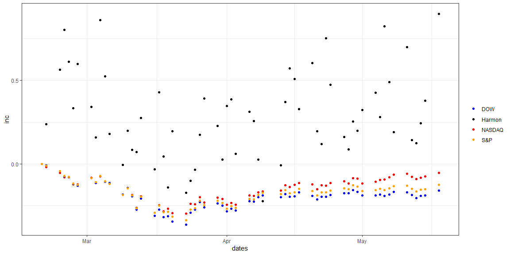
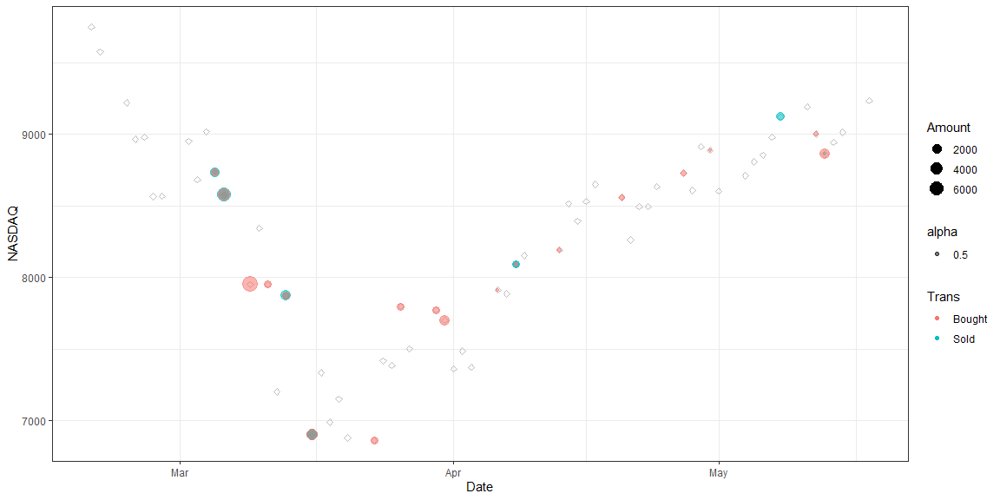

# {.tabset .tabset-fade}


###ETRADE All

```r
days <- Sys.Date() - 0:90
begin <- days[91]
end <- days[3]
EMF <- load_prices(c("AKREX","AMANX","BGAFX","BGSAX","BMGAX","BPTRX","DXQLX","DXSLX","FKDNX","FNCMX","GOLDX","INPIX","JAGTX","LDVAX","MFEGX","NBGEX","NNLEX","NNTWX","OBCHX","PGRTX","PGTAX","PRMTX","PYVAX","PYVLX","RMQHX","ROGSX","RYOCX","RYVYX","SEEKX","SFLNX","SMPIX","SVAAX","SWPPX","TEPSX","ULPIX","UOPIX"),from = begin, to = end)

dates <- as.Date(row.names(EMF))
MF <- colnames(EMF)
shares <- c(21.393,9.114,49.758,27.457,55.073,21.872,46.655,42.719,12.096,8.357,66.181,13.281,26.787,25.85,10.074,16.369,65.653,53.439,296.168,98.622,22.682,8.542,39.708,59.918,4.621,53.039,60.322,5.223,13.177,48.712,266.663,13.757,25.79,18.239,18.589)
 
# Multiply prices in EMF by shares to get Value

value <- sweep(EMF, MARGIN=2, shares, `*`)
rownames(value) <- as.Date(dates)
colnames(value) <- MF
value <- data.frame(value)
value$total <- rowSums( value[,1:dim(value)[2]] )
value$inc <- (value$total-value$total[1])/value$total[1] 

NASDAQ <- load_prices(c("^IXIC"),from = begin, to = end)
rownames(NASDAQ) <- as.Date(dates)
colnames(NASDAQ) <- "NASDAQ"
NASDAQ <- data.frame(NASDAQ)
NASDAQ$inc <- (NASDAQ$NASDAQ-NASDAQ$NASDAQ[1])/NASDAQ$NASDAQ[1]

DOW <- load_prices(c("^DJI"),from = begin, to = end)
rownames(DOW) <- as.Date(dates)
colnames(DOW) <- "DOW"
DOW <- data.frame(DOW)
DOW$inc <- (DOW$DOW-DOW$DOW[1])/DOW$DOW[1]

SP <- load_prices(c("^GSPC"),from = begin, to = end)
rownames(SP) <- as.Date(dates)
colnames(SP) <- "SP"
SP <- data.frame(SP)
SP$inc <- (SP$SP-SP$SP[1])/SP$SP[1]

colors <- c("Harmon" = "black", "NASDAQ" = "red", "S&P" = "orange", "DOW" = "blue")

ggplot(data= value, aes(x=dates)) + 
  geom_point(data= value, aes(y=inc, color = "Harmon")) +
  geom_point(data = NASDAQ, aes(y=inc, color = "NASDAQ")) +
  geom_point(data = DOW, aes(y=inc, color = "DOW")) +
  geom_point(data = SP, aes(y=inc, color = "S&P")) +
  labs(color = "") + scale_color_manual(values = colors)
```

<!-- -->


```r
load("EMF_Trans.rda")
NASDAQ$Dates <- rownames(NASDAQ)
NASDAQ$Date <- as.POSIXct(60*60*24*as.integer(as.character(NASDAQ$Dates)),origin="1970-01-01")
NASDAQ$Date <- as.Date(NASDAQ$Date, format = "%Y-%M-%d")
EMF_Trans$Date <- as.Date(EMF_Trans$Date, format = "%Y-%M-%d")
trans <- left_join(NASDAQ,EMF_Trans)
ggplot() + 
  geom_point(data= trans, aes(x=Date,y=NASDAQ), color = "grey", shape = 5) +
  geom_point(data= trans %>% filter(!is.na(Trans)), aes(x=Date,y=NASDAQ, color = Trans, size = Amount, alpha = .5))
```

<!-- -->

