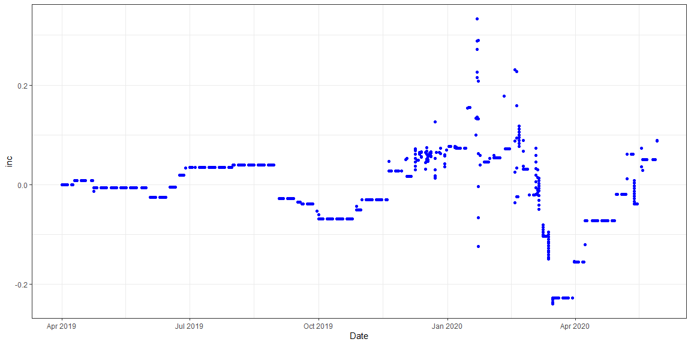

# {.tabset .tabset-fade}


###ETRADE Loadup Current Shares

```r
today_shares <- read.csv("etrade_all.csv")
shares <- data.frame(rbind(as.numeric(today_shares$Quantity)))
colnames(shares) <- as.character(today_shares$Symbol)
shares <- shares[1:(length(shares)-6)]
pile <- cbind(Date=Sys.Date(),Action=NA,Trans=NA,Shares=NA,Amount=NA,shares)
```

###Load Transactions

```r
trans <- read.csv("Etrade_Tx.csv")
 
try <- trans %>% filter(grepl("/", TransactionDate))
try$Date <- as.Date(try$TransactionDate, format = "%m/%d/%y")
try2 <- trans %>% filter(grepl("-", TransactionDate))
try2$Date <- as.Date(try2$TransactionDate, format = "%m-%d-%y")

Work_tx <- rbind(try,try2) %>% select(c(10,2:9)) %>% filter(Quantity != 0)
Work_tx <- Work_tx %>% arrange(desc(Date))  
```

###Get transactions into shares

```r
pickup <- pile
newrow <- pile 
for (i in 1:nrow(Work_tx)){
newrow$Date <- Work_tx[i,1]
if (F == Work_tx[i,4] %in% colnames(newrow)) {
  pickup <- cbind(pickup,NC= 0)
  colnames(pickup)[ncol(pickup)] <- as.character(Work_tx[i,4])
  newrow <- cbind(newrow,NC= 0)
  colnames(newrow)[ncol(newrow)] <- as.character(Work_tx[i,4])
}
ct <- which( colnames(newrow)==Work_tx[i,4] )
newrow[1,ct] <- newrow[1,ct] - Work_tx[i,5]
newrow[1,2] <- as.character(Work_tx[i,2])
newrow[1,3] <- as.character(Work_tx[i,4])
newrow[1,4] <- as.character(Work_tx[i,5])
newrow[1,5] <- as.character(Work_tx[i,6])
pickup <- rbind(pickup,newrow)
pickup[,6:ncol(pickup)] <- round(pickup[,6:ncol(pickup)],5)
}
```

### Get Share Price per day


```r
begin <- min(pickup$Date)
end <- max(pickup$Date)
DP <- data.frame(load_prices(colnames(pickup)[6:ncol(pickup)],from = begin, to = end))
DP <- cbind(Date = as.Date(row.names(DP)),DP)
rownames(DP) <- c(1:nrow(DP))
```

### Multiply pickup rows shares by DP prices

```r
JS <- pickup %>% filter(Date == DP[1,1]) %>% select(5:ncol(pickup))
SP <- as.numeric(DP[1,2:ncol(DP)])
values <- sweep(JS[2:ncol(JS)], 2, SP, FUN="*")
values <- cbind(Date = DP[1,1],Amount = JS[,1],values)
DV <- values
for (i in 2:nrow(DP)) {
JS <- pickup %>% filter(Date == DP[i,1]) %>% select(5:ncol(pickup))
SP <- as.numeric(DP[i,2:ncol(DP)])
if (nrow(JS) == 0) {
  values <- DV[nrow(DV),2:ncol(DV)]
  values <- cbind(Date = DP[i,1],values)
  values$Amount <- 0
} else {
  values <- sweep(JS[2:ncol(JS)], 2, SP, FUN="*")
  values <- cbind(Date = DP[i,1],Amount = JS[,1],values)
}

DV <- rbind(DV,values)
rownames(DV) <- 1:nrow(DV)
}
```

### Get Daily Dollar Total

```r
DV$total <- rowSums(DV[,3:ncol(DV)])
DV <- DV %>% mutate(Total_in = DV$total[1])
for (i in 2:nrow(DV)) {
  DV$Total_in[i] <- DV$Total_in[i-1] - as.numeric(DV$Amount[i])
}
DV <- DV %>% mutate(inc = total/Total_in-1)
ggplot() + 
  geom_point(data=DV, aes(x=Date,y=total)) +
  geom_point(data=DV, aes(x=Date,y=Total_in),color="red")
```

<!-- -->

```r
ggplot() + 
  geom_point(data=DV, aes(x=Date,y=inc))
```

<!-- -->

