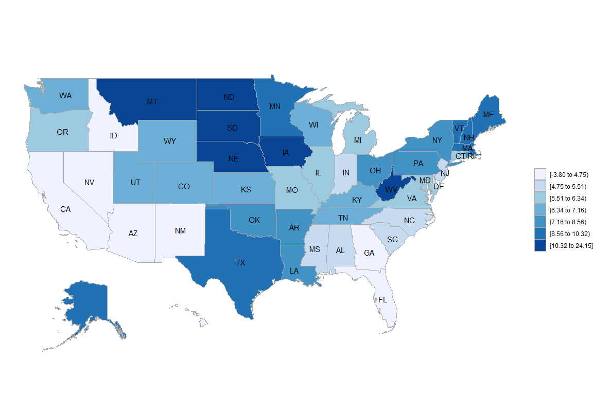

# {.tabset .tabset-fade}


https://www.census.gov/data/academy/courses/choroplethr.html


## Module 2


```r
data("df_pop_state")
state_choropleth(df_pop_state)
```

<!-- -->

```r
state_choropleth(df_pop_state,
 title = "2012 State Population Estimates",
 legend = "Population")
```

<!-- -->

```r
state_choropleth(df_pop_state, num_colors = 8)
```

<!-- -->

```r
state_choropleth(df_pop_state,
 zoom = c("california", "oregon", "washington"))
```

<!-- -->

```r
state_choropleth(df_pop_state,
 num_colors = 1,
 zoom = c("california", "oregon", "washington"),
 reference_map = TRUE)
```

<!-- -->

## Module 3


```r
data(df_state_demographics) 

df_state_demographics$value <- df_state_demographics$per_capita_income

state_choropleth(df_state_demographics,
 num_colors = 2,
 title = "2013 State Per Capita Income Estimates",
 legend = "Dollars")
```

<!-- -->

### Get more data

https://api.census.gov/data/key_signup.html


```r
api.key.install("793ff6b5dd433d27298863e6bda0d62e2ff4ab8e")

state_demo_2010 <- get_state_demographics(endyear = 2010)
state_demo_2015 <- get_state_demographics(endyear = 2015)

state_demo_2015$value <- state_demo_2015$per_capita_income
state_choropleth(state_demo_2015)
```

<!-- -->

### Percent Change


```r
merge <- base::merge


state_demo_2010_2015 <- left_join(state_demo_2010,state_demo_2015, by = "region", copy = FALSE, suffix = c(".x", ".y")) %>% select(c("region","per_capita_income.x","per_capita_income.y")) %>% mutate(value = (per_capita_income.y - per_capita_income.x) / per_capita_income.x * 100)

state_choropleth(state_demo_2010_2015)
```

<!-- -->

```r
state_choropleth(state_demo_2010_2015, num_colors = 0)
```

<!-- -->

```r
state_choropleth(state_demo_2010_2015,
 num_colors=0,
 title = "Percent Change in Estimated Per-Capita Income, 2010-2015",
 legend="Percent") 
```

<!-- -->

## Census Survey Estimates

https://factfinder.census.gov/faces/affhelp/jsf/pages/metadata.xhtml?lang=en&type=survey&id=survey.en.ACS_ACS


```r
B19301 <- get_acs_data("B19301", "state", endyear = 2015, span = 5, include_moe = TRUE)

B19301[[2]]
```

```
## [1] "B19301. Per Capita Income in the Past 12 Months (in 2015 Inflation-Adjusted Dollars): Per capita income in the past 12 months (in 2015 Inflation-adjusted dollars)"
```

```r
PCI2015 <- B19301[[1]]

state_choropleth(PCI2015)
```

<!-- -->

## By County


```r
data(df_county_demographics) 

df_county_demographics$value <- df_county_demographics$per_capita_income

county_choropleth(df_county_demographics,
 num_colors = 9,
 title = "2013 State Per Capita Income Estimates",
 legend = "Dollars")
```

<!-- -->


